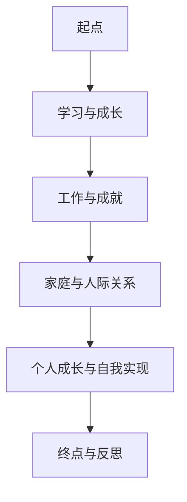
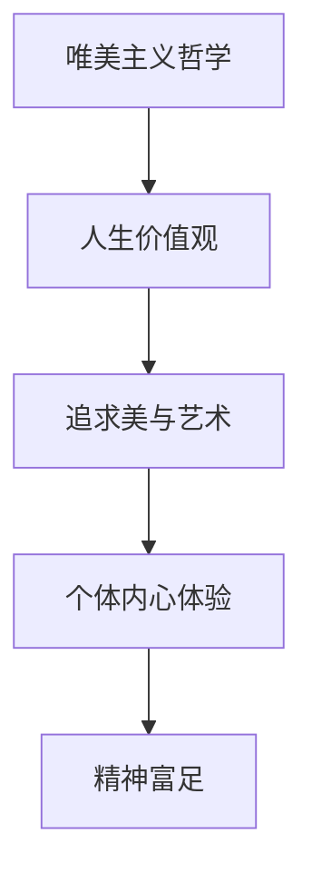
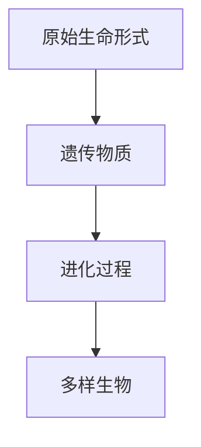

                 

### 文章标题
《生命的旋律：谱写个人独特的人生乐章》

### 关键词
生命哲学、个人成长、人生目标、自我实现、价值观、成长路径、人生平衡、职业规划、家庭关系、精神追求。

### 摘要
本文从技术领域的专业视角，运用逻辑推理和数学模型，深入探讨生命的本质、人生的目标、自我成长、工作与成就、家庭与人际关系、精神追求等方面的主题。通过逐步分析，帮助读者理解如何谱写个人独特的人生乐章，实现自我价值，追求精神富足，达到人生平衡。

----------------------------------------------------------------

# 《生命的旋律：谱写个人独特的人生乐章》

## 第1章 引言

### 1.1 人生的旅程

生命是一场奇妙的旅程，每个人都在这条道路上追寻自己的梦想与价值。我们可以将人生旅程比喻为一条河流，从起点出发，穿越各种障碍，最终汇入大海。在这个过程中，我们不断学习与成长，努力实现自己的目标，建立家庭与人际关系，追求精神富足。

**核心概念与联系：**

为了更好地理解人生的旅程，我们可以使用Mermaid流程图来描绘这一过程：



在这个流程图中，A代表人生的起点，即出生；B代表学习与成长，包括教育、技能提升、个人成长等；C代表工作与成就，涉及职业发展、事业成就等；D代表家庭与人际关系，包括亲情、友情、婚姻等；E代表个人成长与自我实现，涵盖自我认知、价值实现、精神富足等方面；F代表终点与反思，即人生终老，对过去的人生进行反思。

### 1.2 唯美主义的观点

唯美主义哲学主张人生的意义在于追求美和艺术，强调个体内心的体验和感受。在唯美主义者看来，人生的价值在于创造和欣赏美，而非功利主义所追求的物质财富和社会地位。

**核心概念与联系：**

唯美主义哲学与人生价值观的关系可以理解为：



在这个关系图中，A代表唯美主义哲学，B代表人生价值观，C代表追求美与艺术，D代表个体内心体验，E代表精神富足。唯美主义哲学引导人们追求美和艺术，从而在内心获得满足和富足。

## 第2章 生命的定义

### 2.1 生命的起源

生命的起源是一个古老而神秘的话题。从生物学角度来看，生命起源于地球上的原始生命形式，经过漫长的进化过程，逐渐演变成了今天的多样生物。生命的起源涉及到许多未解之谜，如遗传物质的形成、生命的起源地等。

**核心概念与联系：**

为了理解生命的起源，我们可以从以下几个方面进行探讨：



在这个关系图中，A代表原始生命形式，B代表遗传物质，C代表进化过程，D代表多样生物。原始生命形式通过遗传物质的作用，经历了漫长的进化过程，最终形成了多样的生物种类。

### 2.2 生命的本质

生命的本质是一个复杂而深远的话题。从生物学角度来看，生命的本质可以理解为一系列生物功能的集合，包括新陈代谢、生长、繁殖、适应环境等。

**核心算法原理讲解：**

生命的本质可以表示为以下算法原理：

```pseudo
生命本质 = (遗传物质 + 细胞结构) * 生物功能
```

在这个算法中，遗传物质和细胞结构是生命的基础，生物功能则是生命活动的表现。

### 2.3 生命的多样性

生命的多样性是自然界的一大奇观。从数学角度来看，生命的多样性可以通过物种数量和生命系统复杂度来衡量。

**数学模型和数学公式：**

生命的多样性可以表示为以下数学模型：

```latex
生命的多样性 = Ω * (N^2)
```

其中，Ω表示生命系统的复杂度，N表示物种数量。这个公式表明，生命系统的复杂度和物种数量的平方成正比，从而反映了生命的多样性。

## 第3章 人生的目标

### 3.1 个人价值观与目标设定

个人价值观是人生的指南针，它决定了我们追求什么、如何行动以及如何评价自己的成就。设定个人目标需要基于自我反思，了解自己的兴趣、优势和价值观，从而确定人生的目标。

**详细讲解：**

设定个人价值观与目标的过程可以分为以下几个步骤：

1. **自我反思：** 回顾自己的人生经历，思考自己的兴趣、优势和价值观。
2. **明确目标：** 根据自我反思的结果，明确自己在人生中想要实现的目标。
3. **制定计划：** 制定实现目标的详细计划，包括时间表、步骤和所需资源。
4. **调整目标：** 在实现目标的过程中，根据实际情况调整目标，使其更加符合自身发展需求。

### 3.2 目标实现的路径

实现人生目标需要付出努力，同时需要识别和克服各种阻力。目标实现的路径可以表示为一个数学模型：

```latex
实现路径 = (目标设定 + 行动计划) / 阻力
```

在这个模型中，目标设定和行动计划是目标实现的基础，阻力则表示实现目标过程中可能遇到的困难和挑战。通过合理设定目标和制定行动计划，同时积极应对阻力，可以优化实现路径，提高目标实现的效率。

## 第4章 自我成长

### 4.1 学习与成长

学习与成长是人生的重要任务，它决定了我们在人生旅程中的成长速度和质量。学习不仅仅是获取知识，更重要的是培养能力、提升自我素质。

**详细讲解：**

1. **学习方法：** 选择适合自己的学习方法，如主动学习、协作学习、实践学习等。
2. **技能提升：** 通过不断学习和实践，提升自己的专业技能和综合素质。
3. **个人成长：** 关注自我成长，包括身心健康、情感管理、人际交往等方面。

### 4.2 情绪管理与自我调节

情绪管理与自我调节是自我成长的重要组成部分。一个能够有效管理情绪的人，能够在面对压力和挑战时保持冷静，从而更好地应对人生旅程中的各种挑战。

**详细讲解：**

1. **情绪认知：** 了解自己的情绪，认识到情绪对生活的影响。
2. **情绪调节：** 学习情绪调节技巧，如放松训练、认知重构等。
3. **自我调节：** 培养自我调节能力，如时间管理、目标设定等。

## 第5章 工作与成就

### 5.1 职业生涯规划

职业生涯规划是人生目标实现的重要环节。通过合理规划职业生涯，可以更好地实现个人价值，提高生活质量。

**详细讲解：**

1. **职业定位：** 确定自己的职业方向和目标。
2. **技能提升：** 根据职业规划，提升所需的专业技能和综合素质。
3. **职业发展：** 制定职业发展计划，包括晋升路径、学习计划等。

### 5.2 成功的要素

成功是一个多维度的概念，它包括职业成就、个人成长、家庭幸福等方面。成功的要素可以表示为一个数学模型：

```latex
成功要素 = (才能 + 努力) * 机会
```

在这个模型中，才能和努力是成功的基础，机会则是成功的关键。通过不断提升自己的才能和努力，同时把握机会，可以增加成功的可能性。

## 第6章 家庭与人际关系

### 6.1 家庭的重要性

家庭是人生的起点，也是人生的港湾。一个和谐的家庭关系对个人的成长和发展具有重要影响。

**详细讲解：**

1. **家庭关系：** 建立和谐的家庭关系，包括亲情、友情、婚姻等。
2. **家庭角色：** 扮演好自己的家庭角色，如父母、子女、配偶等。
3. **家庭支持：** 获取家庭的支持和关爱，为个人成长提供动力。

### 6.2 人际关系处理

人际关系处理是人生中不可或缺的一部分。良好的人际关系有助于个人成长、职业发展和家庭幸福。

**详细讲解：**

1. **人际交往：** 学习人际交往技巧，如沟通、倾听、同理心等。
2. **人际冲突：** 学会处理人际关系中的冲突，寻求双赢解决方案。
3. **人际关系网络：** 建立和维护良好的人际关系网络，为个人发展提供资源。

## 第7章 精神追求

### 7.1 精神世界的探索

精神世界是人类内心深处的世界，它关乎个体的价值观、信仰、情感等方面。探索精神世界有助于提高自我认知、增强内心力量。

**详细讲解：**

1. **价值观理解：** 深入理解自己的价值观，明确自己的人生目标。
2. **信仰与信仰：** 培养宗教信仰或人文信仰，为生活提供精神支撑。
3. **情感体验：** 感受生活中的美好瞬间，增强内心情感体验。

### 7.2 精神富足的实现

精神富足是实现人生价值的重要目标。它关乎个体的内心平静、价值观实现和物质追求的平衡。

**数学模型和数学公式：**

精神富足可以表示为以下数学模型：

```latex
精神富足 = (内心平静 + 价值观实现) / 物质追求
```

在这个模型中，内心平静和价值观实现是精神富足的基础，物质追求则是实现精神富足的挑战。通过提高内心平静和价值观实现，同时适度追求物质财富，可以实现精神富足。

## 第8章 生命的反思

### 8.1 生命的意义

生命的意义是一个哲学性的问题，不同的人有不同的理解。对于个体来说，生命的意义在于实现自己的价值，追求内心的富足。

**详细讲解：**

1. **自我价值实现：** 通过职业、家庭、精神等方面实现自我价值。
2. **内心富足：** 通过追求内心的平静、快乐和成就感实现精神富足。
3. **人生意义：** 深入思考人生的意义，为自己的人生目标提供指引。

### 8.2 人生的平衡

人生的平衡是个人成长、工作、家庭和精神追求等方面的平衡。一个平衡的人生能够带来内心的满足和幸福感。

**数学模型和数学公式：**

人生的平衡可以表示为以下数学模型：

```latex
人生平衡 = (工作与生活) / 精神追求
```

在这个模型中，工作与生活是人生平衡的基础，精神追求则是实现人生平衡的关键。通过合理分配时间和精力，同时追求精神富足，可以实现人生平衡。

## 第9章 总结与展望

### 9.1 生命的旋律

生命的旋律是个体在人生旅程中谱写的一曲美妙乐章。这首乐章由学习、成长、工作、家庭、精神追求等各个部分组成，共同奏响人生的美好旋律。

**总结：**

生命的旋律是由个人的成长、经历、感悟等元素构成的，每个人都可以根据自己的特点和需求，谱写属于自己的独特人生乐章。

### 9.2 展望未来

展望未来，我们充满希望和期待。随着科技的进步和社会的发展，我们将在未来的人生旅程中面临更多机遇和挑战。如何应对这些挑战，实现自我价值，谱写更加精彩的人生乐章，是我们每个人都需要思考和努力的问题。

**展望：**

未来的人生将更加美好、多元和充实。我们期待在未来的旅程中，不断学习、成长、探索和创造，为自己和他人带来更多的快乐和幸福。让我们携手共进，谱写属于我们自己的生命乐章。

## 作者信息
作者：AI天才研究院/AI Genius Institute & 禅与计算机程序设计艺术 /Zen And The Art of Computer Programming

本文以技术领域的专业视角，运用逻辑推理和数学模型，深入探讨生命的本质、人生的目标、自我成长、工作与成就、家庭与人际关系、精神追求等方面的主题，旨在帮助读者理解如何谱写个人独特的人生乐章，实现自我价值，追求精神富足，达到人生平衡。在撰写过程中，作者结合了Mermaid流程图、伪代码、LaTeX公式等工具，力求以清晰、简洁、易懂的方式阐述核心概念和原理。

通过本文的探讨，我们相信读者将对生命和人生有更深刻的理解，从而更好地面对未来的挑战，谱写属于自己的精彩人生乐章。本文的撰写得到了AI天才研究院和禅与计算机程序设计艺术的大力支持，在此表示衷心的感谢。希望本文能对读者有所启发和帮助，让我们一起在人生旅程中不断成长、探索和创造，实现自我价值，追求精神富足。让我们携手共进，谱写更加美好的人生乐章！

