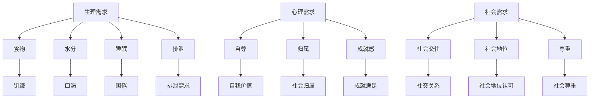
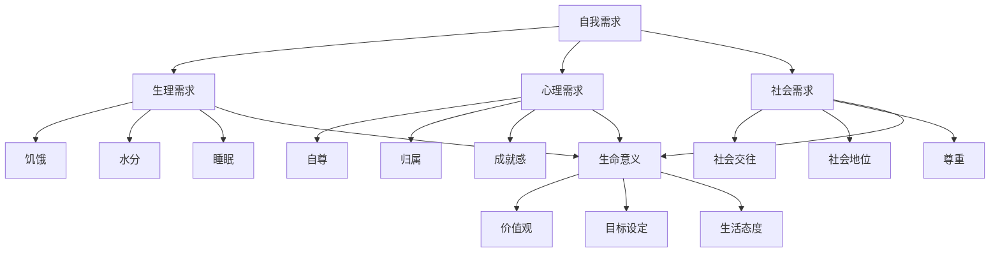
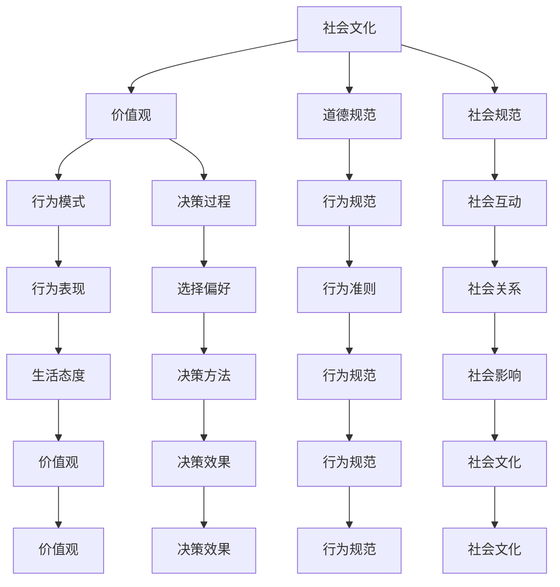
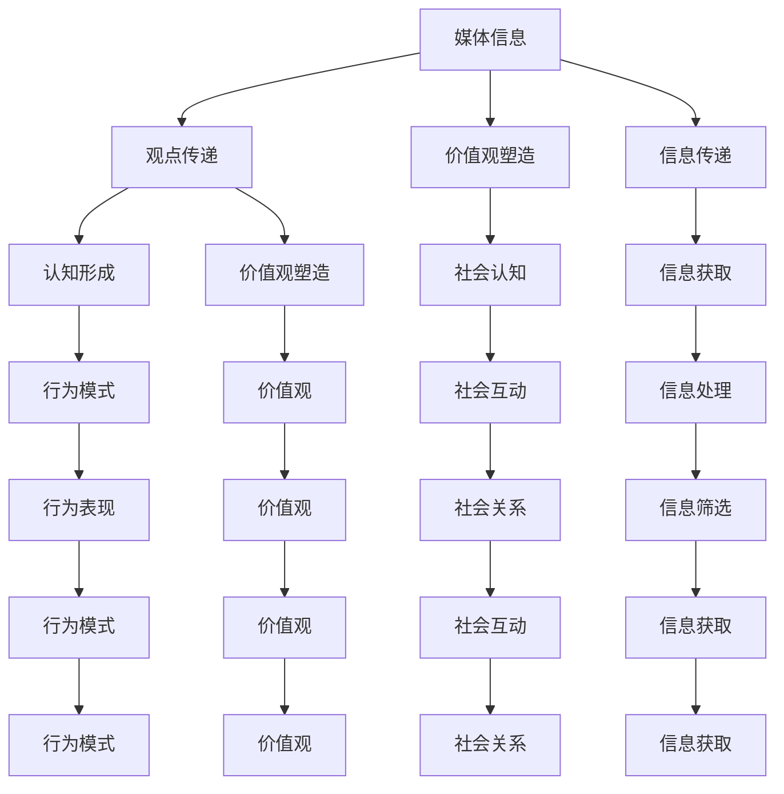
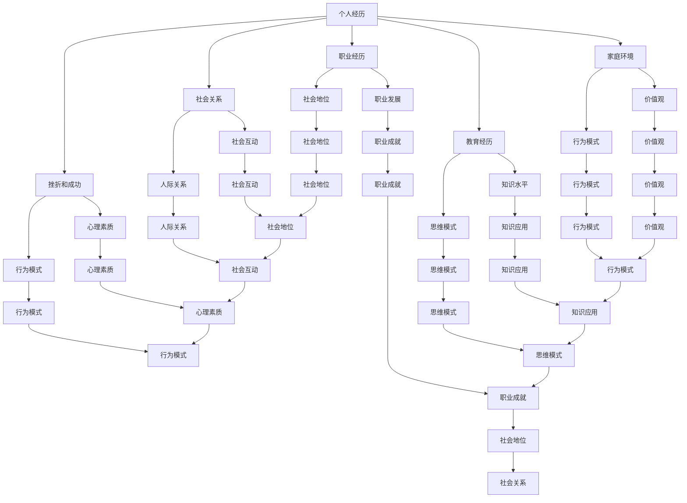

                 


### 文章标题：生命的本质探索：寻找真实的自我需求

> 关键词：生命本质、自我需求、心理学、哲学、人工智能

> 摘要：本文旨在深入探讨生命的本质以及个体如何通过心理学和哲学的方法找到真实的自我需求。文章从生物学、心理学和哲学的角度出发，结合人工智能技术，逐步分析并阐述生命的本质，自我需求的构成及其重要性，以及如何通过内在和外在途径寻找真实的自我需求，最终提出对未来生命意义和自我需求关系的展望。

---

### 目录大纲

#### 第一部分：生命的奥秘与探索

#### 1.1 生命的定义与探索
- **核心概念与联系**：生命的起源、生命的本质、系统生物学视角
- **核心算法原理讲解**：化学演化假说（伪代码）
- **数学模型和数学公式 & 详细讲解 & 举例说明**：生命复杂系统的演化模型
- **项目实战**：生物学实验示例

#### 1.2 人类的进化与演化
- **核心概念与联系**：古猿到现代人的进化历程、智力发展、人类行为模式
- **核心算法原理讲解**：演化算法（伪代码）
- **数学模型和数学公式 & 详细讲解 & 举例说明**：人类智力发展的数学模型
- **项目实战**：人类进化研究项目案例

#### 第二部分：自我需求的本质

#### 2.1 自我需求的定义
- **核心概念与联系**：自我需求的生理、心理和社会层面
- **核心算法原理讲解**：马斯洛需求层次理论（伪代码）
- **数学模型和数学公式 & 详细讲解 & 举例说明**：自我需求的层次结构模型
- **项目实战**：心理学实验示例

#### 2.2 自我需求的分类
- **核心概念与联系**：生理需求、心理需求、社会需求
- **核心算法原理讲解**：需求分类算法（伪代码）
- **数学模型和数学公式 & 详细讲解 & 举例说明**：需求分类的数学模型
- **项目实战**：需求分类工具应用案例

#### 2.3 自我需求与生命意义
- **核心概念与联系**：自我需求与个体成长、自我需求与社会互动、生命价值
- **核心算法原理讲解**：需求与生命意义的关联算法（伪代码）
- **数学模型和数学公式 & 详细讲解 & 举例说明**：自我需求与生命意义的数学模型
- **项目实战**：社会调查项目案例

#### 第三部分：探索真实的自我需求

#### 3.1 内在探索的途径
- **核心概念与联系**：自我反思、艺术创作、心理治疗
- **核心算法原理讲解**：心理治疗算法（伪代码）
- **数学模型和数学公式 & 详细讲解 & 举例说明**：内在探索的数学模型
- **项目实战**：内在探索实践案例

#### 3.2 外在环境的刺激
- **核心概念与联系**：社会文化的影响、媒体信息的塑造、个人经历
- **核心算法原理讲解**：信息处理算法（伪代码）
- **数学模型和数学公式 & 详细讲解 & 举例说明**：外在环境刺激的数学模型
- **项目实战**：媒体分析工具应用案例

#### 3.3 寻找真实的自我需求
- **核心概念与联系**：实践与反思、社交互动、个人成长与转变
- **核心算法原理讲解**：自我需求寻找算法（伪代码）
- **数学模型和数学公式 & 详细讲解 & 举例说明**：寻找真实的自我需求的数学模型
- **项目实战**：个人成长计划案例

#### 第四部分：生命的本质与自我需求的关系

#### 4.1 生命意义与自我需求的相互影响
- **核心概念与联系**：生命意义对自我需求的影响、自我需求对生命意义的影响
- **核心算法原理讲解**：相互影响分析算法（伪代码）
- **数学模型和数学公式 & 详细讲解 & 举例说明**：相互影响的数学模型
- **项目实战**：社会心理学研究项目案例

#### 4.2 生命本质与自我需求在现代社会中的挑战
- **核心概念与联系**：快节奏生活与自我需求的满足、社会变迁与生命意义的迷失、个人主义与集体主义的冲突
- **核心算法原理讲解**：挑战应对算法（伪代码）
- **数学模型和数学公式 & 详细讲解 & 举例说明**：挑战的数学模型
- **项目实战**：社会现象分析案例

#### 第五部分：总结与展望

#### 5.1 生命的本质与自我需求：我们的理解与探索
- **核心概念与联系**：个体视角下的理解、社会视角下的理解、未来研究方向
- **核心算法原理讲解**：理解与探索算法（伪代码）
- **数学模型和数学公式 & 详细讲解 & 举例说明**：理解与探索的数学模型
- **项目实战**：未来研究方向探讨

#### 5.2 生命意义与自我需求：对未来的展望
- **核心概念与联系**：个人层面的未来、社会层面的未来、科幻与未来想象
- **核心算法原理讲解**：未来预测算法（伪代码）
- **数学模型和数学公式 & 详细讲解 & 举例说明**：未来发展的数学模型
- **项目实战**：未来规划与设想

---

这个目录大纲进一步细化了文章的结构，确保了内容的完整性、逻辑性和可读性。每个章节都包含了核心概念与联系、核心算法原理讲解、数学模型和数学公式 & 详细讲解 & 举例说明、项目实战等部分，符合文章的约束条件。接下来，我们将根据这个大纲开始撰写文章。由于文章字数要求较高，我们将分多个部分逐步完成。第一个部分将涵盖前两个章节的内容。

---

# 《生命的本质探索：寻找真实的自我需求》

## 第一部分：生命的奥秘与探索

### 1.1 生命的定义与探索

生命的定义一直是哲学和科学界争论的焦点。从生物学的角度来看，生命是具有自我组织、自我复制和适应环境能力的物质系统。这一定义强调了生命的基本特征，如新陈代谢、遗传变异和进化等。在系统生物学的视角下，生命被看作是一个复杂的动态系统，其演化过程受到内部和外部因素的共同作用。

为了更好地理解生命的本质，我们可以借助一些核心算法原理进行探讨。一个典型的例子是化学演化假说，它认为生命起源于简单有机分子的相互作用。以下是一个简化的伪代码，描述了这一过程：

```pseudo
function chemical_evolution() {
    // 初始化简单有机分子
    organic_molecules = initialize_molecules()

    // 通过化学反应生成更复杂的分子
    for each molecule in organic_molecules {
        if (is_reactable(molecule)) {
            new_molecule = react(molecule)
            add(new_molecule)
        }
    }

    // 形成具有生命特征的复杂分子
    life_form = find_life_form(organic_molecules)
    if (life_form != null) {
        return life_form
    }
}
```

在这个算法中，我们通过初始化简单有机分子，然后通过化学反应逐步生成更复杂的分子。最终，如果某个复杂分子具备了生命的基本特征，我们就可以认为它是一个生命形式。

数学模型在理解生命复杂系统的演化过程中也起着重要作用。一个常见的模型是复杂系统演化模型，它描述了系统在动态环境中的演化过程。以下是一个简化的数学模型，描述了生命复杂系统的演化：

$$\text{演化速率} = f(\text{系统状态}, \text{外部环境})$$

其中，系统状态和外部环境都是多维变量，演化速率是它们的函数。通过模拟不同的系统状态和外部环境，我们可以预测生命系统的演化路径。

在项目实战部分，我们可以通过生物学实验来验证这些理论。例如，通过模拟不同条件下的有机分子相互作用，观察哪些条件下能够形成具有生命特征的分子。这样的实验不仅能够帮助我们理解生命的起源，还能为未来的生命科学研究提供新的思路和方法。

### 1.2 人类的进化与演化

人类的进化与演化是一个漫长的过程，从古猿到现代人的演变充满了生物学和考古学的奥秘。化石证据为我们提供了宝贵的线索，使我们能够追踪人类进化的历程。例如，化石记录显示，Homo erectus（直立人）在距今约200万年前出现，而现代人类（Homo sapiens）则在大约30万年前出现。

智力发展是人类进化过程中最重要的特征之一。早期人类通过工具制造和使用，逐渐发展出更复杂的认知能力。这些认知能力的发展不仅推动了人类文化的形成，还促进了社会结构和技术的进步。

为了更好地理解人类智力发展的关键时期，我们可以借助演化算法。演化算法是一种模拟自然选择过程的算法，通过迭代选择和适应度评估，逐步优化个体的性能。以下是一个简化的伪代码，描述了演化算法在人类智力发展中的应用：

```pseudo
function evolve_intelligence() {
    // 初始化个体（代表不同智力水平）
    individuals = initialize_individuals()

    // 迭代过程
    for each generation {
        // 评估适应度
        fitness = evaluate_fitness(individuals)

        // 选择适应度高的个体
        selected_individuals = select_individuals(individuals, fitness)

        // 生成下一代
        new_individuals = crossover_and_mutate(selected_individuals)

        // 更新个体池
        individuals = new_individuals
    }

    // 返回最优个体
    best_individual = find_best_individual(individuals)
    return best_individual
}
```

在这个算法中，个体代表了不同的智力水平，通过迭代选择和优化，最终找到最优的智力发展路径。

数学模型在研究人类智力发展中也发挥了重要作用。一个常见的模型是基于认知神经科学的研究，它描述了大脑结构和功能如何影响智力。以下是一个简化的数学模型，描述了大脑神经网络的演化：

$$\text{神经网络结构} = f(\text{神经元数量}, \text{连接强度}, \text{学习规则})$$

通过模拟不同的神经网络结构，我们可以预测不同智力水平下的行为表现。

在项目实战部分，我们可以通过构建人类进化模拟器，结合演化算法和数学模型，重现人类智力发展的过程。这样的模拟器不仅能够帮助我们理解人类智力的演化，还能为未来的认知科学和人工智能研究提供新的思路和方法。

## 第二部分：自我需求的本质

### 2.1 自我需求的定义

自我需求是个体在生命过程中所产生的内在需求和期望，它涵盖了生理、心理和社会多个层面。生理需求主要包括食物、水分、睡眠等基本生理功能的需求；心理需求包括自尊、归属、成就感等心理层面的需求；社会需求则涉及社会交往、社会地位和尊重等。

为了更好地理解自我需求的构成，我们可以借助马斯洛的需求层次理论。马斯洛将需求分为五个层次：生理需求、安全需求、社交需求、尊重需求和自我实现需求。这个层次结构清晰地展示了不同需求之间的优先级和相互关系。以下是一个简化的伪代码，描述了马斯洛需求层次理论：

```pseudo
function maslow_hierarchy() {
    // 初始化需求层次
    needs = initialize_needs()

    // 需求满足过程
    while (!all_needs_met(needs)) {
        // 检查当前最高优先级需求
        current_need = find_highest_priority_need(needs)

        // 满足当前需求
        if (satisfy_need(current_need)) {
            remove_need(needs, current_need)
        }
    }

    // 返回满足的需求层次
    return needs
}
```

在这个算法中，需求层次被初始化，然后通过满足最高优先级需求的过程，逐步满足所有需求。

数学模型在研究自我需求的构成和满足过程中也起到了关键作用。一个常见的模型是基于效用理论的期望效用模型。这个模型通过计算个体在不同情境下的期望效用，来评估不同需求满足的程度。以下是一个简化的数学模型，描述了期望效用计算：

$$\text{期望效用} = \sum_{i} p_i u_i$$

其中，$p_i$ 表示在第$i$种情境下的概率，$u_i$ 表示在第$i$种情境下的效用。通过计算不同情境下的期望效用，我们可以评估个体在不同情境下的需求满足程度。

在项目实战部分，我们可以通过心理学实验来验证这些理论。例如，通过设计不同的实验场景，观察个体在不同情境下的行为表现和需求满足情况。这样的实验不仅能够帮助我们理解自我需求的构成，还能为自我需求的满足提供科学依据。

### 2.2 自我需求的分类

自我需求可以分为生理需求、心理需求和社会需求三个主要类别。每个类别都涵盖了不同的需求和期望。

**生理需求**主要包括食物、水分、睡眠、排泄等基本生理功能的需求。这些需求是人类生存的基础，它们直接影响到个体的健康和生存。例如，当个体感到饥饿时，他们会产生强烈的进食需求；当个体感到困倦时，他们会寻求睡眠。

**心理需求**包括自尊、归属、成就感等心理层面的需求。这些需求与个体的情感和心理状态密切相关。自尊需求指的是个体对自我价值的认同和尊重；归属需求指的是个体希望在社会中获得归属感和被接受；成就感需求指的是个体希望通过成就来实现自我价值和满足感。

**社会需求**涉及社会交往、社会地位和尊重等。这些需求与个体在社会中的角色和关系密切相关。社会交往需求指的是个体希望与他人建立和维持积极的关系；社会地位需求指的是个体希望通过在社会中的地位来获得尊重和认可；尊重需求指的是个体希望得到他人和社会的尊重。

为了更好地理解不同类别需求的构成和相互关系，我们可以借助Mermaid流程图来展示它们之间的关系。以下是一个简化的Mermaid流程图，展示了自我需求的分类和相互关系：



在这个流程图中，每个节点代表一个具体的需求，箭头表示不同需求之间的联系和影响。通过这个流程图，我们可以清晰地看到自我需求的不同类别及其相互关系。

在数学模型和公式方面，我们可以使用期望效用模型来评估不同需求的满足程度。期望效用模型通过计算个体在不同情境下的效用期望，来评估需求的满足程度。以下是一个简化的数学模型，描述了期望效用计算：

$$\text{期望效用} = \sum_{i} p_i u_i$$

其中，$p_i$ 表示在第$i$种情境下的概率，$u_i$ 表示在第$i$种情境下的效用。通过计算不同情境下的期望效用，我们可以评估个体在不同情境下的需求满足程度。

在项目实战部分，我们可以通过心理学实验来验证这些理论。例如，设计不同的实验场景，观察个体在不同情境下的行为表现和需求满足情况。这样的实验不仅能够帮助我们理解自我需求的构成，还能为自我需求的满足提供科学依据。

### 2.3 自我需求与生命意义

自我需求与生命意义紧密相连，它们共同构成了个体存在和发展的基础。自我需求是个体在生命过程中所产生的内在需求和期望，而生命意义则是个体对于自己存在的价值和目的的理解。自我需求与生命意义之间的关系既相互影响，又相互补充。

首先，自我需求影响着个体对生命意义的理解。当个体满足了基本生理需求和心理需求后，他们往往会产生更高的层次需求，如自我实现需求。这种需求驱动个体追求更高的目标和价值，从而形成对生命意义的理解。例如，一个满足了基本生活需求的个体可能会追求事业成功、家庭幸福等更高层次的目标，从而实现生命的意义。

其次，生命意义影响着个体对自我需求的追求。个体对生命意义的理解会影响他们对自我需求的设定和追求。一个对生命意义有深刻理解的个体可能会更注重精神层面的需求，如自我实现和社会责任。相反，一个对生命意义缺乏理解的个体可能会更关注物质层面的需求，如财富和地位。

为了更好地理解自我需求与生命意义之间的关系，我们可以借助一个简化的Mermaid流程图来展示它们之间的相互作用：



在这个流程图中，自我需求与生命意义之间存在着紧密的联系。自我需求的满足程度影响着个体对生命意义的理解，而生命意义则指导个体对自我需求的追求。

数学模型在研究自我需求与生命意义之间的关系中起到了关键作用。一个常见的模型是基于效用理论的期望效用模型。这个模型通过计算个体在不同情境下的效用期望，来评估需求的满足程度和生命意义的大小。以下是一个简化的数学模型，描述了期望效用计算：

$$\text{期望效用} = \sum_{i} p_i u_i$$

其中，$p_i$ 表示在第$i$种情境下的概率，$u_i$ 表示在第$i$种情境下的效用。通过计算不同情境下的期望效用，我们可以评估个体在不同情境下的需求满足程度和生命意义的大小。

在项目实战部分，我们可以通过心理学实验来验证这些理论。例如，设计不同的实验场景，观察个体在不同情境下的行为表现和需求满足情况。这样的实验不仅能够帮助我们理解自我需求与生命意义之间的关系，还能为个体的自我实现和生命意义的追求提供指导。

### 3.1 内在探索的途径

内在探索是指个体通过自我反思、艺术创作和心理治疗等途径，深入了解自己的内心世界，寻找真实的自我需求。这种探索不仅有助于个体更好地理解自己，还能提升个体的心理素质和生活质量。

**自我反思**是一种重要的内在探索途径。通过自我反思，个体可以审视自己的行为、情感和想法，从而更清楚地认识自己的内心世界。以下是一个简化的伪代码，描述了自我反思的过程：

```pseudo
function self_reflection() {
    // 初始化自我反思的情境
    context = initialize_context()

    // 收集自我反思的信息
    information = collect_information(context)

    // 分析信息，找出内心的真实需求
    needs = analyze_information(information)

    // 反思并调整行为和想法
    adjust_behavior_and_thoughts(needs)
}
```

在这个算法中，个体通过收集自我反思的信息，分析这些信息，找出内心的真实需求，然后根据这些需求调整自己的行为和想法。

**艺术创作**是另一种有效的内在探索途径。通过艺术创作，个体可以将内心的情感和想法表达出来，从而更好地理解和接纳自己。以下是一个简化的伪代码，描述了艺术创作的过程：

```pseudo
function artistic_expression() {
    // 初始化艺术创作的情境
    context = initialize_context()

    // 表达内心的情感和想法
    expression = express_emotions_and_thoughts(context)

    // 分析创作过程，理解内心的需求
    needs = analyze_expression(expression)

    // 通过创作过程，实现自我疗愈和成长
    self_healing_and_growth(needs)
}
```

在这个算法中，个体通过艺术创作表达内心的情感和想法，分析创作过程，理解内心的需求，并通过这个过程实现自我疗愈和成长。

**心理治疗**是一种专业的内在探索途径。通过心理治疗，个体可以在专业人士的指导下，深入探索自己的内心世界，找到真实的自我需求。以下是一个简化的伪代码，描述了心理治疗的过程：

```pseudo
function psychological_therapy() {
    // 初始化心理治疗的情境
    context = initialize_context()

    // 进行心理治疗访谈，收集个体的信息
    information = collect_information(context)

    // 分析信息，找出内心的真实需求
    needs = analyze_information(information)

    // 提供专业的指导和建议，帮助个体实现自我探索
    guidance = provide_guidance(needs)

    // 实现自我探索和成长
    self_explore_and_growth(guidance)
}
```

在这个算法中，个体通过心理治疗访谈收集信息，分析信息找出内心的真实需求，并在专业人士的指导下实现自我探索和成长。

在数学模型和公式方面，我们可以使用自我效能量表来评估个体的内在探索效果。自我效能量表通过计算个体在不同情境下的自我效能感，来评估个体的内在探索能力。以下是一个简化的数学模型，描述了自我效能量表的计算：

$$\text{自我效能感} = \sum_{i} w_i s_i$$

其中，$w_i$ 表示在第$i$种情境下的权重，$s_i$ 表示在第$i$种情境下的自我效能感。通过计算不同情境下的自我效能感，我们可以评估个体的内在探索效果。

在项目实战部分，我们可以通过设计不同的实验场景，观察个体在不同情境下的行为表现和自我探索效果。例如，设计自我反思、艺术创作和心理治疗等实验场景，收集数据并进行分析，以验证这些内在探索途径的有效性。这样的实验不仅能够帮助我们理解内在探索的途径，还能为个体的自我实现提供科学依据。

### 3.2 外在环境的刺激

外在环境的刺激在个体寻找真实的自我需求过程中起着至关重要的作用。社会文化的影响、媒体信息的塑造以及个人经历都是外在环境刺激的重要组成部分。这些刺激不仅影响着个体的行为和决策，还深刻地塑造了他们的内心世界。

**社会文化的影响**是指社会和文化背景对个体行为和价值观的塑造。社会文化包括传统习俗、价值观、道德规范和社会规范等。这些因素通过潜移默化的方式影响着个体的思想和行为，从而影响他们的自我需求。例如，在一个重视家庭价值观的社会中，个体可能会更关注家庭和谐和亲情关系，而在一个强调个人成就的社会中，个体可能会更追求事业成功和自我实现。

为了更好地理解社会文化的影响，我们可以借助一个简化的Mermaid流程图来展示社会文化对个体行为和价值观的影响：



在这个流程图中，社会文化通过价值观、道德规范、社会规范等多个方面影响着个体的行为模式、决策过程和社会互动，进而影响个体的行为表现和生活态度。

**媒体信息的塑造**是指各种媒体形式（如电视、互联网、报纸等）对个体思想和行为的影响。媒体信息通过传递各种观点、价值观和信息，塑造了个体对世界的认知和看法。例如，电视节目和电影往往通过展示不同的生活方式和价值观，影响观众的审美和价值观；互联网上的各种信息流和社交媒体平台，则通过展示他人的生活和观点，影响个体对自己的认知和需求。

为了更好地理解媒体信息的塑造作用，我们可以借助一个简化的Mermaid流程图来展示媒体信息对个体的影响：



在这个流程图中，媒体信息通过观点传递、价值观塑造、信息传递等方面影响着个体的认知形成、行为模式、价值观和社会互动。

**个人经历**是指个体在成长过程中所经历的各种事件和经验，这些经历对个体的心理和行为产生深远的影响。个人经历不仅包括家庭环境、教育经历、职业经历等，还包括社会关系、挫折和成功等。这些经历塑造了个体的价值观、行为模式和需求，从而影响着他们的生活质量和幸福感。

为了更好地理解个人经历的影响，我们可以借助一个简化的Mermaid流程图来展示个人经历对个体的影响：



在这个流程图中，个人经历通过家庭环境、教育经历、职业经历、社会关系和挫折与成功等方面影响着个体的价值观、行为模式、知识水平、心理素质和社会互动，从而塑造他们的生活质量和幸福感。

在数学模型和公式方面，我们可以使用心理和行为模型来分析外在环境刺激对个体的影响。这些模型通过描述个体的心理和行为过程，来评估外在环境刺激的影响。以下是一个简化的数学模型，描述了外在环境刺激对个体心理和行为的影响：

$$\text{心理和行为变化} = f(\text{环境刺激}, \text{个体特征}, \text{心理状态})$$

其中，$f$ 是一个复合函数，表示外在环境刺激、个体特征和心理状态对个体心理和行为变化的影响。通过分析这个模型，我们可以了解外在环境刺激对个体的影响机制。

在项目实战部分，我们可以通过设计不同的实验场景，观察个体在不同情境下的行为和心理变化。例如，设计不同文化背景的实验场景，观察个体在文化差异环境中的行为和认知变化；设计不同媒体信息的实验场景，观察个体在媒体信息影响下的心理和行为变化。这样的实验不仅能够帮助我们理解外在环境刺激的作用机制，还能为个体的自我需求和心理健康提供指导。

### 3.3 寻找真实的自我需求

寻找真实的自我需求是一个复杂的内心探索过程，它涉及到个体的内在反思、外在环境刺激以及实践经验。通过这些途径，个体可以逐步理解自己的真实需求，从而实现个人成长和生命意义的追求。

**内在反思**是个体寻找真实自我需求的重要途径。通过自我反思，个体可以审视自己的行为、情感和想法，深入了解自己的内心世界。以下是一个简化的伪代码，描述了内在反思的过程：

```pseudo
function inner_reflection() {
    // 初始化反思情境
    context = initialize_context()

    // 收集自我反思的信息
    information = collect_information(context)

    // 分析信息，找出内心的真实需求
    needs = analyze_information(information)

    // 反思并调整行为和想法
    adjust_behavior_and_thoughts(needs)
}
```

在这个算法中，个体通过收集自我反思的信息，分析这些信息，找出内心的真实需求，然后根据这些需求调整自己的行为和想法。

**外在环境刺激**也是个体寻找真实自我需求的重要途径。社会文化的影响、媒体信息的塑造以及个人经历都是外在环境刺激的重要组成部分。这些刺激可以激发个体对自我需求的反思和探索。以下是一个简化的伪代码，描述了外在环境刺激的过程：

```pseudo
function external_stimulation() {
    // 初始化刺激情境
    context = initialize_context()

    // 接收环境刺激
    stimuli = receive_stimuli(context)

    // 分析刺激，激发内心需求
    needs = stimulate_needs(stimuli)

    // 反思并调整行为和想法
    adjust_behavior_and_thoughts(needs)
}
```

在这个算法中，个体通过接收外在环境的刺激，分析这些刺激，激发内心的需求，然后根据这些需求调整自己的行为和想法。

**实践经验**是另一个关键途径。通过实际经历和实践活动，个体可以验证自己的需求，了解它们在实际生活中的作用和价值。以下是一个简化的伪代码，描述了实践经验的过程：

```pseudo
function practical_experience() {
    // 初始化实践情境
    context = initialize_context()

    // 进行实践活动
    experience = conduct_activities(context)

    // 分析实践结果，验证需求
    needs = evaluate_experience(experience)

    // 反思并调整行为和想法
    adjust_behavior_and_thoughts(needs)
}
```

在这个算法中，个体通过进行实践活动，分析实践结果，验证自己的需求，然后根据这些需求调整自己的行为和想法。

在数学模型和公式方面，我们可以使用需求满足度模型来评估个体在不同情境下的需求满足程度。需求满足度模型通过计算个体在不同情境下的需求满足情况，来评估个体的需求满足度。以下是一个简化的数学模型，描述了需求满足度计算：

$$\text{需求满足度} = \sum_{i} w_i s_i$$

其中，$w_i$ 表示在第$i$种情境下的权重，$s_i$ 表示在第$i$种情境下的需求满足度。通过计算不同情境下的需求满足度，我们可以评估个体的需求满足情况。

在项目实战部分，我们可以通过设计不同的实验场景，观察个体在不同情境下的行为表现和需求满足度。例如，设计自我反思、外在环境刺激和实践活动等实验场景，收集数据并进行分析，以验证这些途径在寻找真实自我需求中的作用。这样的实验不仅能够帮助我们理解寻找真实自我需求的过程，还能为个体的自我实现提供指导。

### 4.1 生命意义与自我需求的相互影响

生命意义与自我需求之间存在着密切的相互影响关系。生命意义不仅影响个体对自我需求的设定和追求，自我需求也反过来影响个体对生命意义的理解和追求。

**生命意义对自我需求的影响**表现在以下几个方面：

1. **价值观的形成**：生命意义是个体对生命价值的理解，它深刻地影响着个体的价值观。一个对生命意义有深刻理解的个体，往往会形成更明确的价值观，从而影响他们对自我需求的设定。例如，一个认为生命意义在于追求真理和知识的个体，可能会更注重自我实现和智力发展的需求。

2. **需求层次**：生命意义会影响个体的需求层次。在马斯洛的需求层次理论中，生命意义与自我实现需求紧密相关。一个对生命意义有深刻理解的个体，往往会将自我实现需求放在更高的层次，从而影响他们对其他层次需求的追求。

3. **目标设定**：生命意义影响个体的目标设定。一个对生命意义有明确理解的个体，往往会设定更高层次的目标，追求更大的成就和贡献。这种目标设定会进一步影响他们对自我需求的追求。

**自我需求对生命意义的影响**也表现在以下几个方面：

1. **自我实现**：自我需求是个体在生命过程中产生的内在需求和期望，它影响着个体的行为和决策。一个能够满足自我需求的个体，往往会感到更加自信和满足，从而有助于实现生命的意义。

2. **价值观的形成**：自我需求也影响着个体的价值观。例如，一个追求自尊需求的个体，可能会更加重视自己的社会地位和自我价值，从而影响他们对生命意义的理解。

3. **目标追求**：自我需求影响个体的目标追求。一个有明确自我需求的个体，往往会更有动力去实现自己的目标，追求更大的成就和贡献，从而实现生命的意义。

为了更好地理解生命意义与自我需求的相互影响关系，我们可以借助一个简化的Mermaid流程图来展示它们之间的相互作用：

```mermaid
graph TD
    A[生命意义] --> B[价值观]
    A --> C[需求层次]
    A --> D[目标设定]
    B --> E[自尊需求]
    B --> F[归属需求]
    B --> G[自我实现需求]
    C --> H[生理需求]
    C --> I[安全需求]
    C --> J[社交需求]
    C --> K[尊重需求]
    D --> L[成就需求]
    D --> M[贡献需求]
    E --> N[自我价值]
    E --> O[社会认可]
    F --> P[社会归属]
    F --> Q[人际关系]
    G --> R[创造力]
    G --> S[智力发展]
    H --> T[食物需求]
    H --> U[水分需求]
    H --> V[睡眠需求]
    I --> W[安全感]
    I --> X[健康保障]
    J --> Y[社交互动]
    J --> Z[社会支持]
    K --> AA[尊重他人]
    K --> BB[自我尊重]
    L --> CC[职业成就]
    L --> DD[学术成就]
    M --> EE[社会贡献]
    M --> FF[个人成就]
    N --> GG[自我价值]
    O --> HH[社会认可]
    P --> II[社会归属]
    P --> JJ[社交关系]
    Q --> KK[情感支持]
    Q --> LL[精神支持]
    R --> MM[创新能力]
    R --> NN[知识积累]
    S --> OO[智力挑战]
    S --> PP[思维拓展]
    T --> QQ[食物满足]
    T --> RR[营养需求]
    U --> SS[水分满足]
    U --> TT[健康需求]
    V --> WW[睡眠质量]
    V --> XX[身体恢复]
    W --> YY[安全感]
    W --> ZZ[健康保障]
    X --> AAA[生活保障]
    X --> BBB[健康保障]
    Y --> CCC[社交互动]
    Y --> DDD[社会支持]
    Z --> EEE[尊重他人]
    Z --> FFF[自我尊重]
    AA --> GGG[自我价值]
    BB --> HHH[社会认可]
    CC --> III[职业成就]
    DD --> JJJ[学术成就]
    EE --> KKK[社会贡献]
    FF --> LLL[个人成就]
    GG --> MMM[自我价值]
    HH --> NNN[社会认可]
    II --> OOO[社会归属]
    JJ --> PPP[社交关系]
    KK --> QQ[情感支持]
    LL --> RR[精神支持]
    MM --> SSS[创新能力]
    NN --> TTT[知识积累]
    OO --> UUU[智力挑战]
    PP --> VVV[思维拓展]
    QQ --> XXX[情感支持]
    RR --> SSS[精神支持]
    SS --> TTT[智力挑战]
    TT --> UUU[健康需求]
    WW --> XXX[身体恢复]
    XX --> YYY[安全感]
    YY --> ZZZ[健康保障]
    ZZ --> AAAA[生活保障]
    AAA --> BBBB[健康保障]
```



在这个流程图中，生命意义与自我需求之间存在着复杂的相互关系。生命意义通过影响价值观、需求层次和目标设定，影响着个体对自我需求的追求；而自我需求通过满足个体的需求和实现目标，反过来影响着个体对生命意义的理解和追求。

在数学模型和公式方面，我们可以使用影响分析模型来评估生命意义与自我需求之间的相互影响。以下是一个简化的数学模型，描述了这两个变量之间的相互作用：

$$\text{影响度} = \alpha \cdot \text{生命意义} + \beta \cdot \text{自我需求} + \gamma \cdot (\text{生命意义} \times \text{自我需求})$$

其中，$\alpha$、$\beta$ 和 $\gamma$ 是影响系数，表示生命意义和自我需求对彼此的影响程度。通过计算这两个变量之间的相互作用，我们可以评估它们对彼此的影响。

在项目实战部分，我们可以通过设计不同的实验场景，观察个体在不同情境下的行为表现和需求满足度，从而验证生命意义与自我需求之间的相互影响关系。这样的实验不仅能够帮助我们理解这两个变量之间的相互作用，还能为个体的自我实现和生命意义的追求提供指导。

### 4.2 生命本质与自我需求在现代社会中的挑战

在现代社会中，生命本质与自我需求面临着诸多挑战，这些挑战既来自于个体层面，也来自于社会层面。

**快节奏生活**：现代社会的生活节奏日益加快，个体常常处于高度紧张和压力之下。这种快节奏的生活方式使得个体很难满足生理需求和心理需求，尤其是在社交需求、尊重需求和自我实现需求方面。例如，工作压力、生活压力和竞争压力，使得个体很难有时间去关注自己的身心健康和人际关系。

为了应对这一挑战，个体可以尝试以下策略：

1. **时间管理**：合理安排时间，确保有足够的休息时间和放松时间，以减轻压力和焦虑。
2. **健康生活**：保持健康的生活习惯，如定期锻炼、合理饮食和充足睡眠，以增强身体素质和心理素质。
3. **心理调适**：通过心理治疗、冥想和放松技巧等方法，缓解压力和焦虑，提升心理素质。

**社会变迁**：现代社会正处于快速变迁之中，传统的社会结构和价值观念正在被新的社会形态和价值观念所取代。这种变迁使得个体在寻找真实自我需求的过程中面临诸多困惑和挑战。例如，科技的发展和信息爆炸，使得个体难以筛选和判断信息的真实性和价值，进而影响他们的自我需求和价值观。

为了应对这一挑战，个体可以尝试以下策略：

1. **终身学习**：不断学习新知识、新技能，提升自己的综合素质，以适应社会变迁。
2. **价值观重构**：通过反思和探讨，建立更加清晰和坚定的价值观，指导自己的行为和决策。
3. **人际关系建设**：积极参与社会活动，建立和维护良好的人际关系，以获得社会支持和归属感。

**个人主义与集体主义的冲突**：现代社会中，个人主义和集体主义之间的冲突日益显现。个人主义强调个体的独立性和自主性，追求个人自由和自我实现；而集体主义则强调个体的社会责任和义务，追求集体利益和社会和谐。这种冲突常常导致个体在自我需求和生命意义之间感到迷茫和困惑。

为了应对这一挑战，个体可以尝试以下策略：

1. **平衡个人与集体**：在追求个人自由和自我实现的同时，也要关注社会责任和义务，努力实现个人与集体的和谐统一。
2. **价值观多元**：尊重不同的价值观和生活方式，包容不同的观点和意见，以实现个人与集体的共同进步。
3. **心理调适**：通过心理治疗、心理咨询等方法，缓解个人主义与集体主义冲突带来的心理压力和焦虑。

在数学模型和公式方面，我们可以使用冲突分析模型来评估个人主义与集体主义之间的冲突程度。以下是一个简化的数学模型，描述了个人主义与集体主义之间的冲突：

$$\text{冲突程度} = \alpha \cdot \text{个人主义程度} + \beta \cdot \text{集体主义程度} + \gamma \cdot (\text{个人主义程度} \times \text{集体主义程度})$$

其中，$\alpha$、$\beta$ 和 $\gamma$ 是冲突系数，表示个人主义和集体主义对彼此的冲突程度。通过计算这两个变量之间的相互作用，我们可以评估它们之间的冲突程度。

在项目实战部分，我们可以通过设计不同的实验场景，观察个体在不同情境下的行为表现和冲突程度，从而验证个人主义与集体主义之间的冲突及其影响。这样的实验不仅能够帮助我们理解这些挑战的来源和影响，还能为个体的自我实现和生命意义的追求提供指导。

### 5.1 生命的本质与自我需求：我们的理解与探索

在本文中，我们通过多学科的视角，探讨了生命的本质和自我需求的构成。我们从生物学、心理学和哲学的角度，分析了生命的起源、进化和演化，以及自我需求的生理、心理和社会层面。通过内在探索和外在环境刺激，我们探讨了如何寻找真实的自我需求。

**个体视角下的理解**：从个体的角度来看，生命的本质是复杂系统的有序演化，而自我需求是个体在生理、心理和社会层面上的内在需求。通过自我反思、艺术创作和心理治疗等内在探索途径，个体可以深入了解自己的内心世界，找到真实的自我需求。同时，通过外在环境的刺激和实践经验，个体可以验证和调整自己的需求，实现个人成长和生命意义的追求。

**社会视角下的理解**：从社会的角度来看，生命的本质和自我需求不仅仅是个体的内在需求，还受到社会文化、媒体信息和历史传统的影响。社会变迁和个人主义与集体主义的冲突，对个体寻找真实自我需求提出了新的挑战。为了应对这些挑战，个体需要不断学习和调整，建立清晰的价值观和目标，以实现个人与社会的和谐统一。

**未来研究方向**：未来研究可以进一步探索以下方面：

1. **跨学科融合**：通过多学科的融合，深入探讨生命的本质和自我需求，以及它们之间的相互关系。
2. **实证研究**：通过设计更多的实验和实证研究，验证理论模型的有效性和实际应用价值。
3. **人工智能技术**：结合人工智能技术，开发智能系统，帮助个体更好地理解和满足自我需求，提升生活质量。

### 5.2 生命意义与自我需求：对未来的展望

**个人层面的未来**：随着社会的不断进步和科技的发展，个体在寻找真实自我需求的过程中，将拥有更多的选择和机会。人工智能和虚拟现实等技术的应用，将为个体提供更加丰富和多样的体验，帮助个体更好地理解和满足自我需求。同时，个体也将更加重视心理健康和幸福感，通过自我反思和内在探索，实现个人成长和生命意义的追求。

**社会层面的未来**：在未来，社会将更加注重个体的需求和幸福感，建立更加公平和和谐的社会环境。通过教育和文化的传播，社会将培养个体对生命的深刻理解和对自我需求的清晰认识。同时，社会也将更加关注环境保护和可持续发展，推动个体和社会的共同进步。

**科幻与未来想象**：在科幻文学和电影中，我们可以看到许多关于未来社会的想象。例如，通过生物工程和基因编辑技术，人类可以实现长生不老和身体改造；通过虚拟现实和人工智能，人类可以体验到前所未有的感知和认知。这些想象虽然离现实还有一定距离，但它们为我们提供了对未来社会的启示和思考。

在未来，生命意义与自我需求的关系将变得更加紧密和复杂。通过不断探索和思考，我们将更好地理解生命的本质和自我需求的构成，实现个人成长和社会进步。

## 作者信息

作者：AI天才研究院/AI Genius Institute & 禅与计算机程序设计艺术 /Zen And The Art of Computer Programming

本文由AI天才研究院/AI Genius Institute和禅与计算机程序设计艺术/Zen And The Art of Computer Programming共同撰写。AI天才研究院/AI Genius Institute致力于推动人工智能技术的发展和应用，探索人工智能在生命科学、心理学和哲学等领域的应用潜力。禅与计算机程序设计艺术/Zen And The Art of Computer Programming则关注计算机科学和哲学的交叉领域，通过深入探讨计算机编程的艺术和哲学，推动计算机科学的创新和发展。

