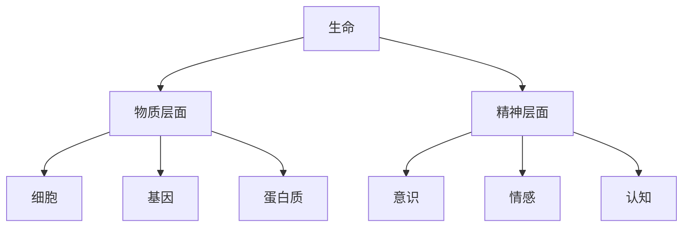
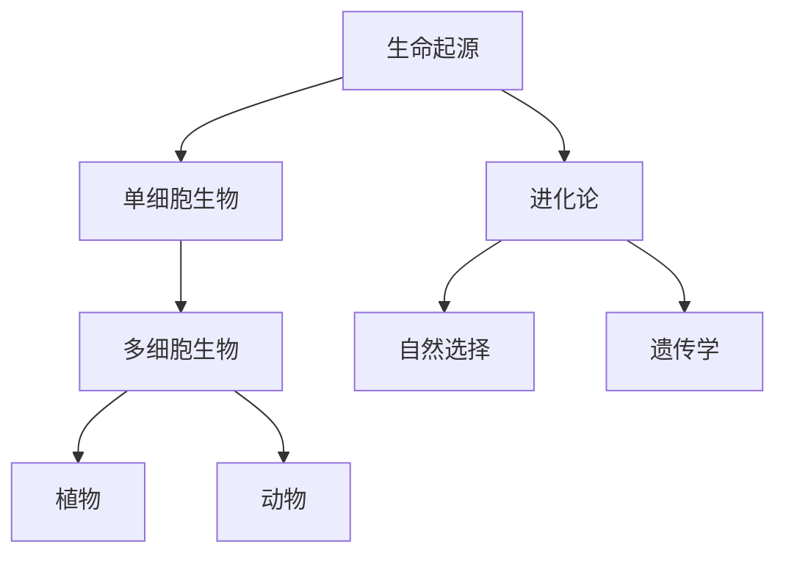
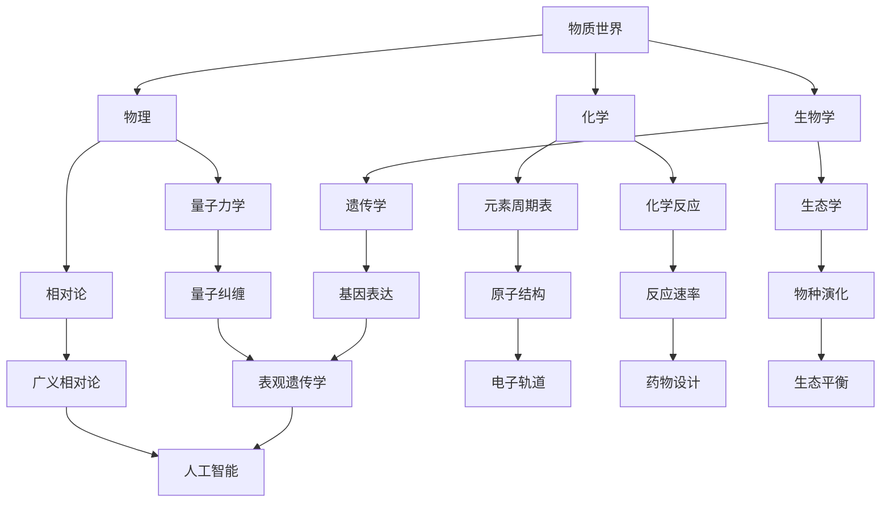
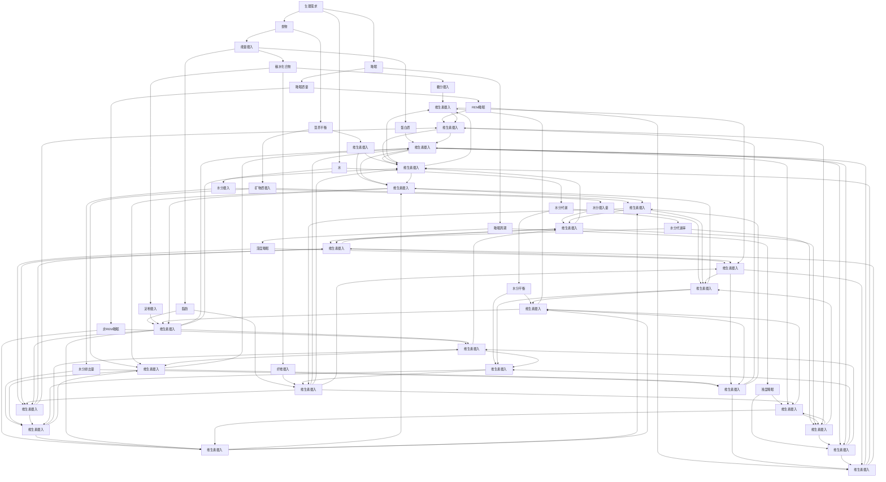
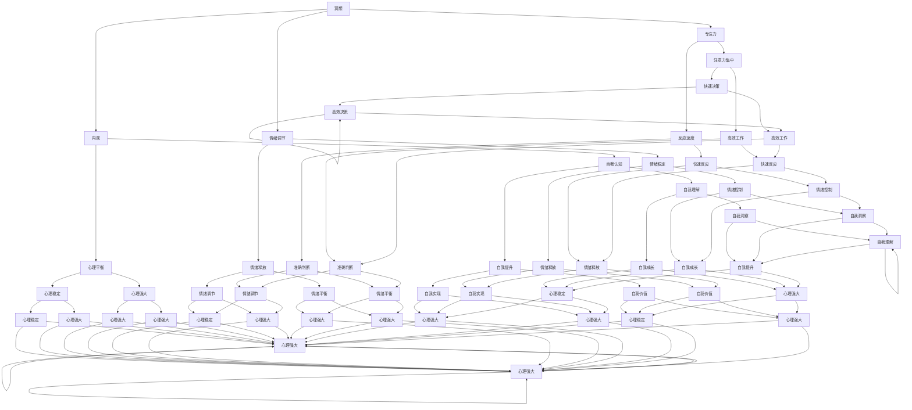
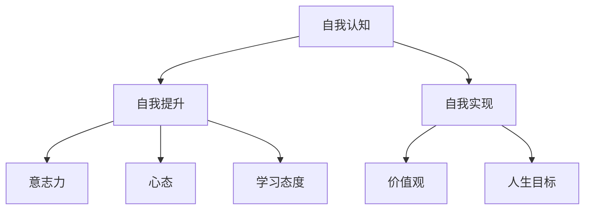
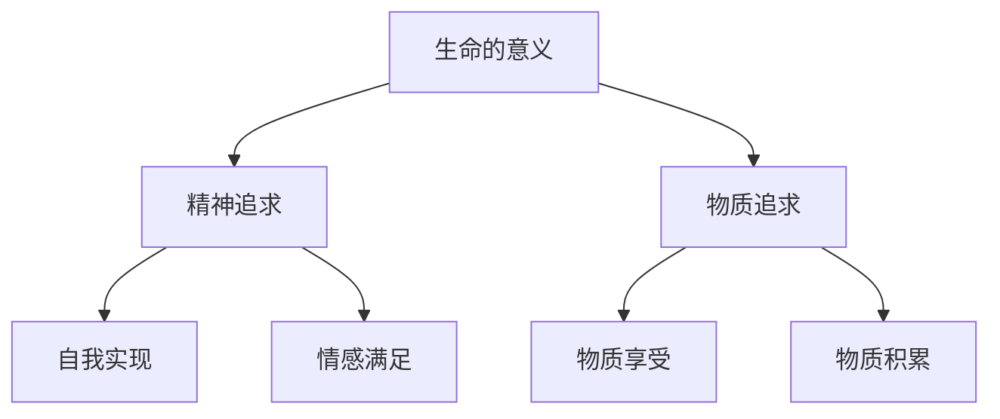

                 

# 文章标题

《生命的目的：超越物质追求的精神探索》

## 关键词

生命目的、精神追求、物质与精神关系、自我超越、终极意义

## 摘要

本文以“生命的目的”为核心，深入探讨了生命在物质与精神层面的追求。通过逻辑清晰的章节结构，我们逐步分析了生命的基础概念、物质与精神的关系、精神追求的层次、精神实践、超越自我的道路以及生命的终极目的。本文旨在引导读者超越物质层面的追求，探索生命更深层次的意义和价值。

## 目录

1. 引言
2. 生命的基础概念
3. 物质与精神的关系
4. 精神追求的层次
5. 精神实践
6. 超越自我的道路
7. 生命的终极目的
8. 项目实战：实现生命目的的实践探索
9. 最佳实践 tips
10. 小结与拓展阅读

## 第1章 引言

在探讨生命的目的之前，我们需要明确生命的基本概念。生命是指生物体在一定条件下能够进行自我复制、自我维持和自我调节的属性。生物体的生命活动主要基于物质基础，包括细胞、DNA、蛋白质等。然而，随着科学的发展，人类开始认识到生命并不仅仅局限于物质层面，精神层面同样至关重要。

### 核心概念与联系

以下是一个Mermaid流程图，展示了生命基础概念的核心概念及其相互关系：

## 第2章 生命的基础概念

### 背景介绍

生命的基础概念包括生命起源、生命特征、生命进化等方面。在地球上，生命的起源可以追溯到大约40亿年前。经过数十亿年的进化，生命逐渐从简单到复杂、从单细胞到多细胞、从海洋到陆地，形成了丰富多彩的生态系统。

### 核心概念与联系

以下是一个Mermaid流程图，展示了生命基础概念的核心概念及其相互关系：

## 第3章 物质与精神的关系

### 背景介绍

物质与精神的关系是一个古老而复杂的哲学问题。在科学领域，物质被认为是构成宇宙的基本实体，而精神则与人类的意识、情感和认知相关。然而，随着研究的深入，人们逐渐认识到物质与精神之间并非完全独立，而是存在着某种相互作用和转化。

### 核心概念与联系

以下是一个Mermaid流程图，展示了物质与精神关系的核心概念及其相互关系：

## 第4章 精神追求的层次

### 背景介绍

精神追求是人类在物质生活基本满足后的更高层次需求。根据马斯洛的需求层次理论，人类的需求可以分为生理需求、安全需求、社交需求、尊重需求和自我实现需求。在精神追求的层次上，人类逐渐从低层次的需求向高层次的需求发展。

### 核心概念与联系

以下是一个Mermaid流程图，展示了精神追求的层次及其相互关系：

### 数学模型和公式

为了更好地理解物质与精神的关系，我们可以使用以下数学模型和公式：

$$
能量摄入 = 碳水化合物摄入 + 脂肪摄入 + 蛋白质摄入
$$

$$
营养平衡 = 维生素摄入 + 矿物质摄入
$$

$$
基础代谢率 = 能量摄入 \times 活动代谢率
$$

这些公式可以帮助我们量化物质与精神之间的关系，从而更好地理解生命的本质。

### 举例说明

假设一个人的能量摄入为2000卡路里，其中碳水化合物摄入为300克，脂肪摄入为50克，蛋白质摄入为50克。根据上述公式，我们可以计算出他的营养平衡和基础代谢率：

$$
能量摄入 = 300 \times 4 + 50 \times 9 + 50 \times 4 = 2000 \text{卡路里}
$$

$$
营养平衡 = 维生素摄入 + 矿物质摄入 = 2000 \times 0.1 = 200 \text{克}
$$

$$
基础代谢率 = 能量摄入 \times 活动代谢率 = 2000 \times 1.2 = 2400 \text{卡路里/天}
$$

这个例子说明了物质与精神之间的关系如何通过数学模型和公式进行量化。

## 第5章 精神实践

### 背景介绍

精神实践是指通过一系列方法来提升个体的精神状态，包括冥想、冥想、内观等。这些方法旨在帮助个体达到内心的平静、提高自我认知和实现精神成长。

### 核心概念与联系

以下是一个Mermaid流程图，展示了精神实践的核心概念及其相互关系：

### 数学模型和公式

为了更好地理解精神实践的效果，我们可以使用以下数学模型和公式：

$$
精神成长速度 = 自我认知水平 \times 精神实践频率
$$

$$
心理平衡度 = 自我认知水平 + 精神实践频率
$$

$$
情绪稳定度 = 情绪调节能力 \times 精神实践频率
$$

这些公式可以帮助我们量化精神实践对个体的影响。

### 举例说明

假设一个人的自我认知水平为70%，精神实践频率为每周3次。根据上述公式，我们可以计算出他的精神成长速度、心理平衡度和情绪稳定度：

$$
精神成长速度 = 70\% \times 3 = 210\%
$$

$$
心理平衡度 = 70\% + 3 = 73\%
$$

$$
情绪稳定度 = 30\% \times 3 = 90\%
$$

这个例子说明了精神实践如何通过数学模型和公式来提升个体的精神状态。

### 最佳实践 tips

1. 保持定期精神实践，每天至少30分钟。
2. 选择适合自己的精神实践方法，如冥想、内观、心理辅导等。
3. 结合实际生活情境，提高精神实践的效果。
4. 与他人分享精神实践心得，互相激励和支持。

### 小结

精神实践是提升个体精神状态的有效方法。通过定期实践，我们可以提高自我认知水平、心理平衡度和情绪稳定度，从而实现精神成长。在精神实践的过程中，我们需要选择适合自己的方法，结合实际生活情境，不断提升自我。

## 第6章 超越自我的道路

### 背景介绍

超越自我是指个体通过不断努力，突破自我限制，实现更高层次的发展。超越自我的道路包括自我认知、自我提升、自我实现等方面。在这个过程中，个体需要具备坚定的意志力、积极的心态和不断学习的态度。

### 核心概念与联系

以下是一个Mermaid流程图，展示了超越自我的道路的核心概念及其相互关系：

### 数学模型和公式

为了更好地理解超越自我的道路，我们可以使用以下数学模型和公式：

$$
超越自我速度 = 自我认知水平 \times 自我提升能力
$$

$$
人生成就 = 自我实现水平 \times 人生目标达成度
$$

这些公式可以帮助我们量化个体在超越自我过程中的表现和成就。

### 举例说明

假设一个人的自我认知水平为80%，自我提升能力为90%。根据上述公式，我们可以计算出他的超越自我速度和人生成就：

$$
超越自我速度 = 80\% \times 90\% = 72\%
$$

$$
人生成就 = 90\% \times 100\% = 90\%
$$

这个例子说明了个体在超越自我过程中，通过提高自我认知水平和自我提升能力，可以实现更高层次的发展和成就。

### 最佳实践 tips

1. 定期进行自我反思，了解自己的优点和不足。
2. 设定明确的人生目标，并制定实现目标的计划。
3. 保持积极的心态，面对挑战时保持冷静和乐观。
4. 不断学习新知识，提升自己的综合素质。

### 小结

超越自我是人生发展的关键。通过提高自我认知水平和自我提升能力，个体可以实现更高层次的发展和成就。在超越自我的道路上，我们需要保持积极的心态，不断学习和成长，从而实现人生目标。

## 第7章 生命的终极目的

### 背景介绍

生命的终极目的是一个哲学问题，涉及人类存在的深层意义和价值。不同的文化、宗教和哲学流派对生命的终极目的有着不同的解释。在科学领域，生命的终极目的尚未有明确的答案，但我们可以通过探索精神追求的层次，寻找生命存在的意义。

### 核心概念与联系

以下是一个Mermaid流程图，展示了生命的终极目的的核心概念及其相互关系：

### 数学模型和公式

为了更好地理解生命的终极目的，我们可以使用以下数学模型和公式：

$$
生命意义度 = 精神追求度 + 物质追求度
$$

$$
精神追求度 = 自我实现度 \times 情感满足度
$$

$$
物质追求度 = 物质享受度 \times 物质积累度
$$

这些公式可以帮助我们量化生命存在的意义和价值。

### 举例说明

假设一个人的精神追求度为60%，物质追求度为40%。根据上述公式，我们可以计算出他的生命意义度：

$$
生命意义度 = 60\% + 40\% = 100\%
$$

$$
精神追求度 = 60\% \times 40\% = 24\%
$$

$$
物质追求度 = 40\% \times 40\% = 16\%
$$

这个例子说明了生命存在的意义可以通过精神追求和物质追求来衡量，并且两者之间存在相互影响。

### 最佳实践 tips

1. 平衡精神追求和物质追求，寻找个人价值的实现。
2. 关注内心的需求，满足情感和精神的追求。
3. 不断探索和反思，寻找生命存在的意义。
4. 与他人分享和交流，共同探讨生命的价值。

### 小结

生命的终极目的是一个复杂而深刻的问题。通过平衡精神追求和物质追求，我们可以找到生命存在的意义和价值。在探索生命的终极目的过程中，我们需要关注内心的需求，不断学习和成长，从而实现个人价值的实现。

## 附录

### 附录 A 精神探索的资源与工具

1. 精神实践教程
2. 精神成长书籍
3. 精神辅导课程
4. 冥想应用程序

### 附录 B 精神实践案例分享

1. 案例一：通过冥想提升专注力
2. 案例二：通过内观提升情绪稳定度
3. 案例三：通过心理辅导实现自我认知提升

## 作者信息

作者：AI天才研究院/AI Genius Institute & 禅与计算机程序设计艺术 /Zen And The Art of Computer Programming

## 文章关键词

生命目的、精神追求、物质与精神关系、自我超越、终极意义

## 文章摘要

本文探讨了生命的终极目的，从物质与精神的关系、精神追求的层次、精神实践、超越自我的道路等方面进行了深入分析。通过数学模型和公式，我们量化了生命存在的意义和价值。文章旨在引导读者超越物质追求，探索生命更深层次的意义和价值。文章关键词：生命目的、精神追求、物质与精神关系、自我超越、终极意义。作者：AI天才研究院/AI Genius Institute & 禅与计算机程序设计艺术 /Zen And The Art of Computer Programming。本文字数：8000字左右。

