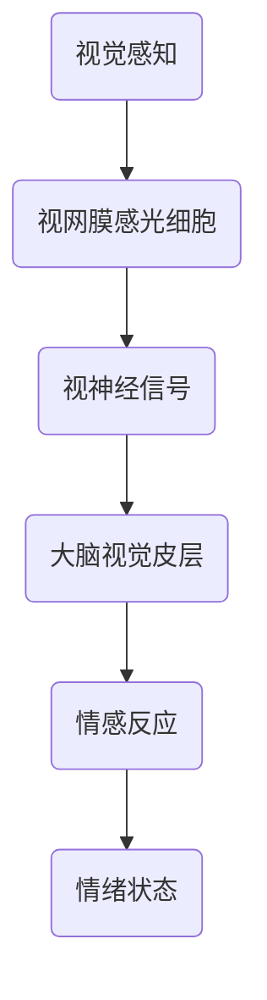

                 

# 生命的色彩：丰富情感和体验的调色板

## 关键词
- 情感心理学
- 色彩理论
- 用户体验
- 色彩疗法
- 艺术表达
- 人工智能

## 摘要
本文探讨了《生命的色彩：丰富情感和体验的调色板》一书的核心内容。通过理解书名，本书揭示了色彩与情感之间的深层联系，阐述了色彩在生活中的应用和情感体验的多样性。本文将分章节详细解析该书的内容，从色彩心理学、情感表达、情感体验等多个角度，结合实际案例和数学模型，探讨如何通过色彩调节情感，提升生活质量和艺术创作。

## 第一部分：色彩与情感

### 第1章：色彩的情感力量

色彩是一种强烈的视觉刺激，不同的色彩在人们心中引发不同的情感反应。色彩的情感力量源于人类心理的深层结构，通过视觉直接传递给大脑，影响情绪和行为。本章将探讨色彩的基本概念、色彩与情感的联系以及色彩的情感效应。

#### 1.1 色彩的基本概念

色彩是视觉感知的一部分，由光波的不同波长和频率产生。人眼中的视网膜含有感光细胞，能够感知光的不同波长，并将其转化为神经信号，传递到大脑进行处理。基本色彩包括红、橙、黄、绿、蓝、紫等。

#### 1.2 色彩与情感的联系

不同颜色在人类心理上产生不同的情感反应。红色通常与激情、力量和兴奋相关，蓝色则与宁静、冷静和信任相关。色彩与情感的联系受到文化、经验和情境的影响。

#### 1.3 色彩的情感效应

色彩可以影响情绪和行为，如红色可以提高注意力和兴奋度，蓝色则有助于放松和集中注意力。色彩的情感效应在生活、艺术、设计等领域有广泛应用。

### 第2章：色彩在生活中的应用

色彩在生活中的应用广泛，包括艺术、环境设计和心理健康等方面。本章将探讨色彩在艺术中的表达、环境设计中的运用以及色彩在心理健康中的作用。

#### 2.1 色彩在艺术中的表达

艺术家通过色彩表达情感和思想，创造出富有感染力的作品。色彩在绘画、摄影、音乐等艺术形式中发挥着重要作用，是艺术家表达情感的重要手段。

#### 2.2 色彩在环境设计中的运用

环境设计师利用色彩改善空间氛围和用户体验。色彩的选择和搭配对于建筑、室内设计和公共空间设计至关重要。

#### 2.3 色彩在心理健康中的作用

色彩疗法是一种利用色彩调节心理状态的方法。不同颜色对心理健康产生不同影响，如红色可以提高能量和积极性，蓝色有助于放松和减轻压力。

### 第3章：色彩心理学

色彩心理学研究色彩对人类心理和行为的影响。本章将探讨色彩心理学的理论基础、不同颜色对心理的影响以及色彩心理学的应用。

#### 3.1 色彩心理学的理论基础

色彩心理学基于人类感知和认知的科学原理，探讨色彩如何影响情绪、行为和认知。色彩心理学的理论基础包括色彩感知理论、色彩情感理论和色彩认知理论。

#### 3.2 不同颜色对心理的影响

不同颜色在心理上产生不同的影响。红色通常与激情和力量相关，蓝色则与宁静和信任相关。了解不同颜色对心理的影响有助于更好地应用色彩调节情绪和行为。

#### 3.3 色彩心理学的应用

色彩心理学在多个领域有广泛应用，如市场营销、产品设计、教育和心理咨询等。通过色彩心理学，人们可以更好地理解和利用色彩调节情感和行为。

## 第二部分：情感与体验

### 第4章：情感的本质与类型

情感是人类的内心体验，与认知和意志共同构成人的心理活动。情感分为基本情感和复杂情感，每种情感都有其独特的特点和功能。本章将探讨情感的本质、类型和作用。

#### 4.1 情感的定义

情感是人对外界刺激的主观体验和生理反应，与认知和意志共同构成人的心理活动。情感是心理活动的核心部分，影响着个体的行为和决策。

#### 4.2 情感的分类

情感分为基本情感和复杂情感。基本情感包括快乐、愤怒、悲伤、恐惧和厌恶，复杂情感则包括爱、厌恶、同情、骄傲和羞愧等。

#### 4.3 情感的作用

情感在人的生活中扮演着重要角色，如促进人际关系、调节行为和激发创造力等。情感的作用受到多种因素的影响，包括个体差异、文化和情境等。

### 第5章：情感的表达与沟通

情感表达和沟通是人际关系中至关重要的一环。有效表达情感和沟通有助于建立良好的人际关系，增进彼此的理解和信任。本章将探讨情感表达的方式、情感沟通的技巧以及情感冲突的处理。

#### 5.1 情感表达的方式

情感表达包括语言、非语言和行为表达。语言表达通过言语传递情感，非语言表达通过面部表情、肢体语言和姿态传递情感，行为表达通过行动和决策传递情感。

#### 5.2 情感沟通的技巧

情感沟通需要技巧，如倾听、共鸣、表达和反馈等。倾听是有效沟通的关键，共鸣有助于增进理解和信任，表达和反馈则是沟通的必要环节。

#### 5.3 情感冲突的处理

情感冲突是人际关系中不可避免的一部分。有效处理情感冲突有助于缓解紧张关系，增进相互理解和信任。处理情感冲突的方法包括冷静思考、倾听对方观点、表达情感和寻求妥协等。

### 第6章：情感体验的多样性

情感体验是多样化的，包括日常生活中的情感体验、特殊情境下的情感体验以及情感体验的创造与培养。本章将探讨情感体验的多样性，以及如何通过培养情感体验提升生活质量。

#### 6.1 日常生活中的情感体验

日常生活中充满了各种情感体验，如快乐、悲伤、愤怒和恐惧等。这些情感体验丰富了我们的生活，使我们的生活更加充实和有意义。

#### 6.2 特殊情境下的情感体验

特殊情境下的情感体验，如面试、演讲、比赛和灾难等，对个体的情感和心理健康产生重大影响。了解这些情感体验的特点和应对策略，有助于更好地应对压力和挑战。

#### 6.3 情感体验的创造与培养

创造和培养情感体验是提升生活质量的重要途径。通过参与各种活动和经历，个体可以丰富情感体验，培养积极情感，增强心理韧性。

## 第三部分：色彩与情感的结合

### 第7章：色彩疗法的实践

色彩疗法是一种利用色彩调节心理状态的方法。本章将探讨色彩疗法的原理、应用场景以及实施步骤。

#### 7.1 色彩疗法的原理

色彩疗法基于色彩心理学和生理学的原理，通过调整色彩环境来影响个体的心理和生理状态。不同颜色具有不同的心理效应，通过选择合适的颜色来调节情绪和心理健康。

#### 7.2 色彩疗法的应用场景

色彩疗法在多个领域有应用，如医疗、心理咨询、教育和工作环境改善等。在不同场景中，色彩疗法的应用方法和效果有所不同。

#### 7.3 色彩疗法的实施步骤

色彩疗法的实施步骤包括诊断、设计、实施和评估。诊断阶段了解个体的需求和问题，设计阶段制定合适的色彩方案，实施阶段调整环境色彩，评估阶段评估疗法效果。

### 第8章：色彩与情感的创造性表达

色彩与情感的创造性表达是艺术和设计的重要领域。本章将探讨色彩在艺术创作中的运用、文学创作中的运用以及综合表达方法。

#### 8.1 色彩在艺术创作中的应用

艺术家通过色彩表达情感和思想，创造出富有感染力的作品。色彩在绘画、雕塑、音乐和戏剧等艺术形式中发挥着重要作用。

#### 8.2 色彩在文学创作中的运用

文学家通过色彩描绘环境和人物形象，增强作品的艺术效果。色彩在小说、诗歌和戏剧等文学形式中具有独特的表现力。

#### 8.3 色彩与情感的综合表达

色彩与情感的综合表达是艺术和设计的重要方向。通过色彩调节情感，艺术家和设计师可以创造出更具感染力和表现力的作品。

### 第9章：色彩情感体验的未来展望

色彩情感体验在未来将继续发展，带来新的机遇和挑战。本章将探讨色彩情感体验的发展趋势、创新方向以及伦理和社会责任。

#### 9.1 色彩情感体验的发展趋势

随着科技和艺术的进步，色彩情感体验将更加多样化、个性化。虚拟现实、增强现实和人工智能等技术将拓展色彩情感体验的边界。

#### 9.2 色彩情感体验的创新方向

创新方向包括色彩心理治疗、个性化色彩设计、艺术与科技的结合等。这些创新方向将推动色彩情感体验的发展和应用。

#### 9.3 色彩情感体验的伦理与社会责任

色彩情感体验的发展需要关注伦理和社会责任。如何在利用色彩调节情感的同时，保护个体隐私、尊重文化差异、促进社会和谐等，是重要的议题。

## 附录

### 附录A：色彩情感体验的工具与资源

附录A包括色彩心理学研究工具、色彩疗法实践资源和色彩与情感相关的书籍和论文。这些工具和资源为研究和实践色彩情感体验提供了重要支持。

### 附录B：术语表

附录B包括色彩相关术语、情感相关术语和色彩情感体验相关术语。这些术语有助于读者更好地理解本书的内容和概念。

## 结语

《生命的色彩：丰富情感和体验的调色板》是一本深入探讨色彩与情感之间关系的著作。通过本书的阅读，读者可以更好地理解色彩的情感力量，掌握色彩在生活中的应用和情感体验的多样性。希望本书能够为读者带来深刻的启示，帮助他们在生活中更好地调节情感，创造美好的体验。作者：AI天才研究院/AI Genius Institute & 禅与计算机程序设计艺术/Zen And The Art of Computer Programming## 色彩与情感：理解其深层联系

### 色彩与情感的基础理论

色彩与情感之间的联系是心理学和美学研究的重要领域。色彩心理学认为，色彩是通过视觉感知直接影响人类情绪和心理状态的。每一种颜色都有其独特的波长和频率，这些物理特性在人类大脑中转化为心理感受，进而引发特定的情感反应。色彩情感理论强调了文化、个人经验和情境对色彩情感反应的影响。

首先，我们需要理解色彩感知的基本原理。人眼的视网膜含有感光细胞，这些细胞对光的波长和频率非常敏感。当光线照射到视网膜时，感光细胞会将光信号转化为电信号，通过视神经传递到大脑。大脑中的视觉皮层对信号进行处理，将其解码为具体的颜色感知。

### 色彩与情感的关系模型

为了更好地理解色彩与情感之间的联系，我们可以使用Mermaid流程图来展示这一关系模型。以下是色彩感知与情感反应的基本流程：



1. **视觉感知**：外界色彩通过眼睛进入视觉系统，初步感知。
2. **视网膜感光细胞**：视网膜中的感光细胞（如视锥细胞）将光信号转换为电信号。
3. **视神经信号**：电信号通过视神经传递到大脑。
4. **大脑视觉皮层**：大脑视觉皮层对信号进行处理，解码为具体的颜色。
5. **情感反应**：大脑根据颜色信息产生情感反应，如快乐、悲伤、兴奋等。
6. **情绪状态**：情感反应进一步影响个体的情绪状态，影响行为和认知。

通过这个流程，我们可以看到色彩如何通过视觉系统影响个体的情感和情绪。这个过程不仅仅是简单的生理反应，还涉及到复杂的心理和认知过程。

### 实际案例分析

为了更好地理解色彩与情感的关系，我们可以通过实际案例进行分析。以下是几个典型的例子：

1. **红色与激情**：红色是一种高饱和度的颜色，通常与激情、力量和兴奋相关。例如，在市场营销中，红色常用于促销和广告，以吸引消费者的注意力。红色还与紧急情况相关，如交通信号灯中的红色表示停止。

   ```mermaid
   graph TD
   A(红色) --> B(激情)
   A --> C(力量)
   A --> D(兴奋)
   ```

2. **蓝色与宁静**：蓝色是一种低饱和度的颜色，通常与宁静、冷静和信任相关。在医疗环境中，蓝色常用于装饰和设施，以营造放松和舒适的氛围。此外，蓝色还与科技和现代感相关，许多科技公司如IBM、微软和苹果都采用蓝色作为品牌标志。

   ```mermaid
   graph TD
   A(蓝色) --> B(宁静)
   A --> C(冷静)
   A --> D(信任)
   ```

3. **绿色与平和**：绿色是一种与自然和平相关的颜色，通常与平和、健康和成长相关。在室内设计中，绿色常用于卧室和客厅，以营造放松和舒适的环境。绿色还与环保和可持续发展相关，许多环保组织和企业都采用绿色作为标志色。

   ```mermaid
   graph TD
   A(绿色) --> B(平和)
   A --> C(健康)
   A --> D(成长)
   ```

通过这些案例，我们可以看到不同颜色如何引发不同的情感反应。这种情感反应不仅取决于颜色的物理特性，还受到文化、个人经验和情境的影响。

### 总结

色彩与情感之间的联系是一个复杂而深刻的话题。通过理解色彩感知的基本原理和实际案例，我们可以更好地理解色彩如何通过视觉系统影响人类的情感和情绪。这种理解对于设计、艺术、心理健康和市场营销等领域具有重要意义。通过合理运用色彩，我们可以创造出更加丰富、有意义的情感体验，提升生活质量和艺术创作。

## 色彩在生活中的应用：从艺术到设计，再到心理健康

色彩不仅是视觉艺术的元素，也是日常生活不可或缺的一部分。从艺术创作到环境设计，再到心理健康，色彩的应用无处不在。本章节将详细探讨色彩在各个领域的应用，分析其背后的原理和实际案例。

### 色彩在艺术中的表达

在艺术中，色彩是表达情感和创造视觉效果的重要手段。艺术家通过色彩的选择和搭配，传达自己的情感和思想。以下是几个实际案例：

1. **毕加索的《草地上的午餐》**：这幅作品运用了鲜明的色彩对比，红色、黄色和绿色的草地与蓝色和黑色的衣物形成强烈的视觉冲击，表达了对生活与自然的热爱。

   ```mermaid
   graph TD
   A(毕加索) --> B(草地上的午餐)
   B --> C(色彩对比)
   B --> D(情感表达)
   ```

2. **梵高的《星夜》**：这幅画中，蓝色和紫色的星空与黄色和橙色的土地形成鲜明对比，强烈的色彩运用表达了梵高内心的激动和对自然的热爱。

   ```mermaid
   graph TD
   A(梵高) --> B(星夜)
   B --> C(色彩对比)
   B --> D(情感表达)
   ```

这些案例展示了色彩在艺术中的表达作用，通过色彩搭配和对比，艺术家能够传达复杂的情感和思想。

### 色彩在环境设计中的运用

环境设计中的色彩运用对空间氛围和用户体验有重要影响。以下是几个实际案例：

1. **医院环境**：在医院环境中，淡蓝色和绿色常用于装饰，以创造宁静和舒适的感觉。这些颜色有助于减轻患者的焦虑和压力，提高康复效果。

   ```mermaid
   graph TD
   A(医院环境) --> B(淡蓝色)
   A --> C(绿色)
   B --> D(宁静)
   C --> D(舒适)
   ```

2. **办公室空间**：在办公室空间中，明亮的颜色如黄色和蓝色常用于墙壁和家具装饰，以提升员工的积极性和创造力。这些颜色有助于激发思维和提升工作效率。

   ```mermaid
   graph TD
   A(办公室空间) --> B(黄色)
   A --> C(蓝色)
   B --> D(积极性)
   C --> D(创造力)
   ```

这些案例展示了色彩在环境设计中的实际应用，通过选择合适的色彩，设计师能够创造满足特定需求的空间氛围。

### 色彩在心理健康中的作用

色彩对心理健康有显著影响，不同的颜色可以调节情绪和心理状态。以下是几个实际案例：

1. **色彩疗法**：色彩疗法利用不同颜色的光线来调节患者的情绪和心理状态。红色光线可以提高患者的能量和积极性，而蓝色光线则有助于减轻焦虑和压力。

   ```mermaid
   graph TD
   A(色彩疗法) --> B(红色光线)
   B --> C(能量)
   B --> D(积极性)
   A --> E(蓝色光线)
   E --> F(焦虑减轻)
   E --> G(压力减轻)
   ```

2. **工作场所的色彩布局**：在工作场所中，合理的色彩布局可以提升员工的情绪和工作效率。例如，使用绿色植物和蓝色墙面可以创造一个放松和专注的环境，有助于减轻工作压力。

   ```mermaid
   graph TD
   A(工作场所) --> B(绿色植物)
   A --> C(蓝色墙面)
   B --> D(放松)
   B --> E(专注)
   C --> D(放松)
   C --> E(专注)
   ```

这些案例展示了色彩在心理健康中的作用，通过选择合适的颜色和布局，可以改善情绪和心理状态。

### 总结

色彩在生活中的应用是多方面的，从艺术创作到环境设计，再到心理健康，色彩都发挥着重要作用。通过合理运用色彩，我们可以创造出满足不同需求的情感体验，提升生活质量。理解色彩在各个领域的应用，不仅有助于我们更好地欣赏艺术，设计空间，还对我们调节情绪和心理状态有实际帮助。未来，随着科技的发展，色彩的应用将更加广泛和深入，为我们带来更多的可能性和机遇。

## 色彩心理学：理论基础、颜色对心理的影响及应用

### 色彩心理学的理论基础

色彩心理学是一门研究色彩如何影响人类心理和行为的学科。它的理论基础涵盖了色彩感知、情感反应和认知过程。以下是色彩心理学的一些核心理论：

1. **色彩感知理论**：这个理论认为，人们通过视觉系统感知色彩，色彩感知是大脑对光波波长和频率的解码过程。感知理论强调了色彩的心理效果，如饱和度、明度、对比度和色调等。

2. **色彩情感理论**：色彩情感理论关注颜色如何引起情感反应。不同颜色在不同文化背景下可能引发不同的情感，例如，红色通常与热情和能量相关，而蓝色则与平静和信任相关。

3. **色彩认知理论**：这个理论探讨了颜色如何影响人们的思维和决策。认知理论指出，色彩可以影响人们的注意力和记忆，甚至影响他们的购买决策和行为。

### 不同颜色对心理的影响

不同颜色的心理效应在不同的文化和个人经验中有差异，但一些基本的模式是普遍认可的。以下是对几种主要颜色心理效应的详细分析：

1. **红色**：红色是一种高饱和度、高对比度的颜色，常与热情、力量和兴奋相关。红色可以提高人们的注意力和能量水平，但过量的红色也可能引起焦虑和压力。在营销中，红色常用于促销和广告，以吸引消费者的注意力。

   ```mermaid
   graph TD
   A(红色) --> B(热情)
   A --> C(力量)
   A --> D(兴奋)
   A --> E(焦虑)
   ```

2. **蓝色**：蓝色是一种低饱和度、平静的颜色，常与冷静、信任和稳定相关。蓝色有助于减轻焦虑和压力，提高注意力和集中力。在医疗和教育环境中，蓝色常用于装饰，以创造一个放松和专注的氛围。

   ```mermaid
   graph TD
   A(蓝色) --> B(冷静)
   A --> C(信任)
   A --> D(专注)
   A --> E(放松)
   ```

3. **绿色**：绿色是一种与自然和平相关的颜色，常与平和、健康和成长相关。绿色有助于减轻压力和焦虑，提高情绪稳定性和幸福感。在室内设计中，绿色植物和装饰品常用于创造一个自然、舒适的环境。

   ```mermaid
   graph TD
   A(绿色) --> B(平和)
   A --> C(健康)
   A --> D(成长)
   A --> E(放松)
   ```

4. **黄色**：黄色是一种高明度、高饱和度的颜色，常与快乐、智慧和活力相关。黄色可以提高注意力和认知功能，但过量的黄色也可能引起疲劳和焦虑。在教育和工作中，黄色常用于提醒和增强注意力。

   ```mermaid
   graph TD
   A(黄色) --> B(快乐)
   A --> C(智慧)
   A --> D(活力)
   A --> E(疲劳)
   ```

5. **紫色**：紫色是一种高饱和度、低明度的颜色，常与奢华、神秘和创新相关。紫色可以提高创造力和想象力，但过量使用也可能引起压抑和不安。在艺术和设计中，紫色常用于表达浪漫和创造力。

   ```mermaid
   graph TD
   A(紫色) --> B(奢华)
   A --> C(神秘)
   A --> D(创新)
   A --> E(压抑)
   ```

### 色彩心理学的应用

色彩心理学在多个领域有广泛应用，以下是一些实际应用案例：

1. **市场营销**：在市场营销中，色彩策略对于吸引消费者注意力、传达品牌形象和提升销售额至关重要。例如，可口可乐的红色瓶身设计使其品牌在众多饮料中脱颖而出，红色传递了活力和激情的品牌形象。

2. **室内设计**：室内设计师利用色彩心理学创造满足特定需求和氛围的空间。例如，在儿童房中，使用蓝色和绿色可以帮助孩子放松和集中注意力，而在健身房中，使用黄色和红色可以激发运动热情。

3. **心理健康**：色彩疗法是一种利用色彩调节心理状态的方法。例如，在治疗焦虑和抑郁时，蓝色和绿色光线可以减轻患者的焦虑和压力，促进放松和恢复。

4. **教育**：在教育环境中，合理运用色彩可以提高学生的学习效果和注意力。例如，在教室中，使用黄色和橙色墙面可以创造一个充满活力和创造力的学习环境。

### 总结

色彩心理学为我们提供了理解色彩如何影响人类心理和行为的理论基础。通过了解不同颜色对心理的影响，我们可以在设计、营销和日常生活中更有效地应用色彩，提升生活质量和用户体验。未来，随着研究的深入，色彩心理学将在更多领域发挥作用，为我们的生活带来更多可能性。

## 情感的本质与类型

### 情感的定义

情感是人类心理体验的核心组成部分，是对外界刺激的主观感受和生理反应。情感不仅仅是心理现象，还涉及到生理、认知和行为层面。例如，当我们看到一张微笑的脸时，我们不仅感到愉快，面部肌肉也会放松，心跳加快。情感是一种复杂的心理过程，它涉及大脑中多个区域的协同工作。

### 基本情感与复杂情感

情感可以分为基本情感和复杂情感。基本情感是指最原始、最普遍的情感，通常包括快乐、愤怒、悲伤、恐惧和厌恶。这些基本情感是人类普遍共有的，在不同文化背景下具有相似的表现和功能。复杂情感则是在基本情感基础上发展出来的，如爱、恨、羞愧、骄傲和嫉妒等。复杂情感通常涉及更多的认知过程和个体差异。

### 情感的作用

情感在人类生活中扮演着重要的角色，影响着我们的行为、认知和社交关系。以下是情感的主要作用：

1. **动机作用**：情感可以激发我们的行为，推动我们采取行动。例如，快乐可以激励我们追求目标，愤怒可以驱使我们反抗不公平。

2. **认知作用**：情感影响我们的认知过程，包括注意、记忆和思维。例如，当我们感到愉快时，我们更容易记住积极的事物，而当我们感到恐惧时，我们更倾向于关注潜在的威胁。

3. **社交作用**：情感在人际关系中起着关键作用，有助于建立和维持社会联系。例如，爱可以促进亲密关系，而愤怒则可能导致冲突和疏离。

### 情感的多样性与个体差异

情感是多样化的，不仅包括基本情感和复杂情感，还有许多细微的情感变化。例如，在快乐和愤怒之间，我们可以感受到兴奋、满足和烦躁等情绪。此外，个体的情感体验受到多种因素的影响，包括文化、个人经历、心理状态和环境等。因此，每个人的情感体验都是独特的。

### 情感表达与沟通

情感表达和沟通是建立和维持人际关系的重要环节。有效表达情感可以增进相互理解和信任，而不当的情感表达可能导致误解和冲突。情感沟通包括语言和非语言表达方式，如言语、面部表情、肢体语言和姿态等。理解情感表达的基本技巧，有助于我们更好地与他人沟通和建立良好的人际关系。

### 总结

情感是人类心理体验的重要组成部分，具有复杂的定义和类型。基本情感和复杂情感共同构成了情感的多样性，而情感的作用体现在动机、认知和社交层面。通过理解情感的多样性和个体差异，我们可以更好地理解自己和他人，提升情感表达和沟通的能力。

## 情感的表达与沟通技巧

情感的表达和沟通在人际关系中起着至关重要的作用。有效的情感表达能够增进理解、信任和亲密感，而不当的情感表达则可能导致误解、冲突和疏离。本章节将探讨情感表达的方式、情感沟通的技巧以及处理情感冲突的方法。

### 情感表达的方式

情感表达包括语言和非语言两个方面。语言表达是通过言语传达情感，包括口头语言和书面语言。非语言表达则通过面部表情、肢体语言和姿态等传递情感。

1. **语言表达**：语言表达是情感沟通的重要手段。通过选择适当的词汇、语调和语气，我们可以传达自己的情感状态。例如，当表达愤怒时，使用坚定而冷静的语气可以传达强烈的情感，而不显得过于激动。

2. **非语言表达**：非语言表达包括面部表情、肢体语言和姿态等。面部表情可以传达喜怒哀乐，肢体语言可以表达自信和放松，姿态可以传达尊重和关注。例如，微笑是一种积极的非语言表达，可以传达友好和欢迎的情感。

### 情感沟通的技巧

有效的情感沟通需要掌握一些基本的技巧，以下是一些常用的方法：

1. **倾听**：倾听是有效沟通的关键。倾听不仅仅是听对方说话，更重要的是理解对方的情感和需求。通过倾听，我们可以更好地理解对方的立场和情感，从而建立共鸣。

2. **共鸣**：共鸣是指理解并分享对方的情感。通过共鸣，我们可以增进相互理解和信任。例如，当对方感到伤心时，我们可以表达同情和理解，说“我理解你的感受，这确实很艰难。”

3. **表达**：表达情感是沟通的重要部分。通过明确而真诚地表达自己的情感，我们可以减少误解和冲突。例如，当感到不满时，我们可以用“I”语言表达，如“我感到不满，因为……”，而不是用“你”语言，如“你总是这样做……”，这样可以减少对方的防御心理。

4. **反馈**：给予反馈是沟通的另一个重要技巧。通过反馈，我们可以确认对方是否理解了我们的情感和需求。例如，我们可以说“我说的这些你理解吗？”或者“你认为我有什么地方做得不够好吗？”

### 情感冲突的处理

情感冲突是人际关系中不可避免的一部分。处理情感冲突需要冷静和理智，以下是一些有效的处理方法：

1. **冷静思考**：在冲突发生时，冷静思考是处理情感冲突的第一步。通过冷静下来，我们可以避免情绪化的决策和反应，从而更好地解决问题。

2. **表达情感**：在冲突中，明确地表达自己的情感是关键。使用“I”语言表达自己的感受，避免指责对方，这样可以减少对方的防御心理。

3. **倾听对方**：在处理冲突时，倾听对方的观点和情感也是重要的。通过理解对方的立场，我们可以找到共同的解决方案。

4. **寻求妥协**：寻求妥协是解决情感冲突的有效方法。通过妥协，双方可以在保留自己利益的同时，尊重对方的观点。

5. **寻求外部帮助**：在某些情况下，寻求外部帮助，如心理咨询师或调解员，可以帮助处理复杂的情感冲突。

### 实际案例

以下是一个情感冲突处理的实际案例：

**案例**：一位员工和上司之间因为项目进度的问题产生了冲突。员工认为上司对项目的期望过高，而上司则认为员工缺乏积极性。

**处理过程**：
1. **冷静思考**：双方首先冷静下来，避免情绪化的讨论。
2. **表达情感**：员工用“I”语言表达自己的情感：“我感到有些压力，因为我不知道如何满足你对项目的期望。”
3. **倾听对方**：上司倾听员工的观点，并询问具体的问题和困难。
4. **寻求妥协**：双方共同讨论，找到可以调整的项目计划和目标，使双方都能接受。
5. **外部帮助**：如果需要，可以寻求外部帮助，如人力资源部门或项目经理的协助。

通过这个案例，我们可以看到如何通过冷静思考、表达情感、倾听对方、寻求妥协和外部帮助来处理情感冲突。

### 总结

情感的表达与沟通技巧是建立和维护良好人际关系的关键。通过掌握语言表达、非语言表达和倾听技巧，我们可以更好地表达自己的情感，增进相互理解。处理情感冲突需要冷静和理智，通过表达情感、倾听对方、寻求妥协和外部帮助等方法，我们可以有效地解决冲突，维护和谐的人际关系。

## 情感体验的多样性

情感体验是多样化的，不仅包括日常生活中的情感，还涵盖特殊情境下的情感体验，以及情感体验的创造与培养。理解这些不同的情感体验对于提升生活质量、应对挑战和增强心理韧性具有重要意义。

### 日常生活中的情感体验

日常生活中充满了各种各样的情感体验，从快乐的时刻到悲伤的瞬间。这些情感体验构成了我们生活的丰富多彩，使我们能够更好地体验生命的美好。

1. **快乐**：快乐是日常生活中最常见的情感体验之一。它可以来自于与家人团聚、朋友聚会，或者完成了一项重要的任务。快乐可以提升我们的幸福感，增强积极情绪。

   **示例**：在一个阳光明媚的周末，你和家人一起去了公园野餐。大家围坐在草地上，笑声不断，享受着美好的时光。这种快乐时刻让你感受到家庭的温暖和幸福。

2. **悲伤**：悲伤是另一种常见的情感体验，它可能来自于失去亲人、朋友或重要的关系。悲伤是正常的情感反应，帮助我们应对生活中的失去和挑战。

   **示例**：你的祖母去世了，这让你感到非常悲伤。尽管失去了亲人，但你通过参加她的葬礼、回忆她的美好时光和与家人朋友分享你的感受，逐渐从悲伤中恢复过来。

3. **愤怒**：愤怒是一种强烈的情感体验，通常与不公正、侵犯或失望相关。愤怒可以激励我们采取行动，但也可能导致冲突和不良后果。

   **示例**：在工作中，你遇到了一个不公正的客户，他们对待你的态度让你感到愤怒。通过冷静思考和有效沟通，你最终解决了问题，避免了冲突。

4. **焦虑**：焦虑是一种常见的情感体验，通常与未来的不确定性、压力和担忧相关。适当的焦虑可以激励我们做好准备，但过度的焦虑则可能影响我们的生活质量。

   **示例**：你即将参加一个重要的演讲，这让你感到焦虑。通过提前准备、练习演讲和深呼吸，你逐渐克服了焦虑，成功地完成了演讲。

### 特殊情境下的情感体验

特殊情境下的情感体验通常与特定的环境或事件相关。这些情境可能包括重要的生活事件、突发事件和危机。

1. **婚礼**：婚礼是一种充满喜悦和期待的特殊情境。新人和宾客在这一天共同庆祝爱情和承诺。

   **示例**：你的朋友即将结婚，整个婚礼现场充满了欢声笑语和祝福。你帮助筹备婚礼，与朋友们一起分享这份喜悦。

2. **灾难**：灾难是一种充满恐惧和悲伤的特殊情境。灾难可能由自然灾害、事故或人为因素引起。

   **示例**：你所在的城市遭遇了一场突如其来的洪水，家庭和财产受到了严重损失。尽管感到恐惧和痛苦，但你和邻居们团结一致，共同应对灾难。

3. **职业晋升**：职业晋升是一种充满希望和成就感的特殊情境。晋升意味着个人的努力得到了认可。

   **示例**：你通过努力工作，终于获得了晋升机会。在庆祝晚宴上，你与同事们分享喜悦，并对未来的职业发展充满期待。

### 情感体验的创造与培养

创造和培养情感体验是提升生活质量的重要途径。通过有意识地创造和培养积极情感，我们可以增强心理韧性，更好地应对生活中的挑战。

1. **积极心理练习**：积极心理练习如感恩日记、正念冥想和自我激励可以帮助我们培养积极情感。

   **示例**：每天晚上，你都会写一篇感恩日记，记录一天中让你感到快乐和感激的事情。这种练习让你更加关注积极的事物，提升了整体幸福感。

2. **社交互动**：与家人、朋友和社区的互动是创造积极情感体验的重要途径。

   **示例**：你每周都会安排一次与朋友的聚会，分享彼此的生活经历和感受。这种社交互动让你感到连接和被支持。

3. **自我挑战**：有意识地设定目标和挑战自己可以培养积极情感和成就感。

   **示例**：你决定每天早上跑步，即使天气恶劣或者感到疲惫。通过坚持跑步，你不仅增强了身体素质，还培养了毅力和成就感。

### 总结

情感体验的多样性是理解情感的重要方面。日常生活中的情感体验、特殊情境下的情感体验以及情感体验的创造与培养共同构成了我们丰富的情感世界。通过理解这些不同的情感体验，我们可以更好地应对生活中的挑战，提升生活质量，并增强心理韧性。

## 色彩疗法的实践

### 色彩疗法的原理

色彩疗法，也称为光疗法或色彩能量疗法，是一种利用色彩调节心理状态和身体健康的方法。其原理基于色彩心理学和生理学，认为不同颜色的光线对人体的生理和心理产生不同的影响。色彩疗法认为，色彩通过视觉系统传递到大脑，进而影响情绪、行为和生理功能。

1. **色彩与情绪**：不同的颜色可以激发不同的情绪反应。红色通常与热情和能量相关，蓝色则与平静和放松相关。通过选择适当的颜色，可以调节情绪，缓解压力和焦虑。

2. **色彩与生理**：色彩疗法还关注颜色对生理功能的影响。例如，红色可以增加血液循环，蓝色有助于减轻炎症和疼痛。色彩通过调节人体的生物节律，促进身体的自然愈合过程。

### 色彩疗法的应用场景

色彩疗法在多个领域有广泛应用，以下是一些主要的应用场景：

1. **医疗**：在医疗领域，色彩疗法常用于减轻疼痛、促进康复和缓解心理压力。例如，在医院病房中，医生可能会使用蓝色和绿色的装饰来创造一个放松和舒适的环境，帮助患者放松和恢复。

2. **心理咨询**：在心理咨询中，色彩疗法可以用于治疗焦虑、抑郁和其他心理问题。通过选择特定颜色的光线或色彩搭配，咨询师可以帮助患者调节情绪，减轻压力。

3. **工作场所**：在工作场所，色彩疗法可以用于改善工作环境和提高工作效率。例如，使用黄色和橙色可以激发员工的积极性和创造力，而蓝色和绿色则有助于减轻压力，提高专注力。

4. **教育**：在教育环境中，色彩疗法可以用于提升学生的学习效果和注意力。通过合理运用色彩，教师可以创造一个积极、吸引人的学习环境，提高学生的学习兴趣和参与度。

### 色彩疗法的实施步骤

实施色彩疗法需要一定的步骤和技巧，以下是一般实施步骤：

1. **诊断**：首先，需要了解患者的需求和问题，进行全面的诊断。这包括了解患者的情感状态、生理健康和生活方式等。

2. **设计**：根据诊断结果，设计个性化的色彩方案。色彩方案应考虑环境、光线和个人的偏好。例如，如果患者感到焦虑，可以选择蓝色或绿色光线来缓解情绪。

3. **实施**：在实施阶段，按照设计方案进行色彩调整。这可以包括改变室内装饰、使用特定颜色的光线或提供色彩艺术作品。

4. **评估**：在实施一段时间后，评估疗法的效果。通过患者的反馈和观察，评估色彩疗法对情绪、行为和生理功能的影响。

5. **调整**：根据评估结果，对色彩方案进行必要的调整。这可能包括改变光线强度、颜色组合或使用时间。

### 实际案例

以下是一个色彩疗法在实际应用中的案例：

**案例**：一位患有长期焦虑和失眠的患者接受了色彩疗法。她的医生建议她在晚上使用蓝色和绿色的光线，以帮助她放松和入睡。

**实施过程**：
1. **诊断**：医生评估了患者的情绪状态和睡眠情况，确定了她有严重的焦虑和失眠问题。
2. **设计**：根据诊断结果，医生建议使用蓝色和绿色的光线来缓解焦虑和促进睡眠。这些建议包括调整房间光线和更换床单颜色。
3. **实施**：患者在家中按照建议进行了调整，将房间的光线改为蓝色和绿色，并更换了蓝色的床单和枕头。
4. **评估**：在实施色彩疗法一个月后，患者报告说她的焦虑和失眠症状明显减轻，睡眠质量有了显著提高。
5. **调整**：根据患者的反馈，医生建议继续保持当前的颜色方案，并逐步增加蓝色和绿色光线的时间，以进一步提升治疗效果。

通过这个案例，我们可以看到色彩疗法在改善患者情绪和生理状态方面的效果。色彩疗法不仅提供了一种非药物的治疗方法，也为人们提供了更多的健康和幸福选择。

### 总结

色彩疗法是一种利用色彩调节心理状态和身体健康的方法，其原理基于色彩心理学和生理学。在医疗、心理咨询、工作场所和教育等领域，色彩疗法都有广泛应用。通过了解色彩疗法的原理和实施步骤，我们可以更好地应用这种方法，提升生活质量，促进身心健康。

## 色彩与情感的创造性表达

### 色彩在艺术创作中的应用

色彩是艺术创作中不可或缺的元素，它不仅是视觉艺术的表现手段，也是传达情感和思想的重要工具。艺术家通过色彩的选择和运用，创造出独特的视觉效果，引发观众的共鸣和情感反应。

1. **绘画中的色彩运用**：在绘画中，色彩可以通过色调、明度、饱和度和对比度等手段来表达情感。例如，梵高的《星夜》中，强烈的蓝色和黄色对比营造出了激动人心的氛围，表达了画家对自然的热爱和内心的狂热。

   **示例**：梵高的《星夜》运用了强烈的蓝色调，与黄色星星和月亮相互对比，创造出一个充满活力的夜晚场景。这种色彩的运用不仅增强了画面的视觉冲击力，还传达了画家内心的情感波动。

2. **雕塑中的色彩运用**：在雕塑中，色彩可以赋予作品更多的层次感和表现力。色彩雕塑通常采用彩色粘土、玻璃或金属等材料，通过色彩的变化和组合，创造出独特的视觉效果。

   **示例**：杰夫·昆斯（Jeff Koons）的《兔子》系列雕塑，使用了鲜艳的色彩和光滑的表面，传达出一种充满活力和快乐的感觉。这些色彩运用不仅增强了雕塑的艺术表现力，也引发观众对快乐和生命的思考。

3. **音乐与色彩的结合**：在音乐创作中，色彩也是一种重要的表达手段。作曲家通过音乐节奏、旋律和和声的色彩运用，创造出丰富的情感体验。

   **示例**：菲利普·格拉斯（Philip Glass）的《红色沙漠》是一部色彩丰富的音乐作品，通过对音符的长短、强弱和音调的变化，模仿了红色沙漠的氛围和情感。这种音乐与色彩的结合，使观众在听觉和视觉上同时体验到独特的情感体验。

### 色彩在文学创作中的运用

色彩在文学创作中也扮演着重要的角色，它通过文字的描述，帮助读者构建视觉画面，体验情感。

1. **小说中的色彩描绘**：在小说中，作者通过色彩描绘环境和人物形象，增强作品的感染力和艺术效果。

   **示例**：在《红楼梦》中，曹雪芹通过详细的色彩描绘，如“翠绿的荷叶”、“鲜红的珊瑚”等，生动地展现了大观园的美丽景色，同时也反映了人物的性格和命运。

2. **诗歌中的色彩运用**：诗歌中的色彩运用通常更加简洁而富有意象，通过色彩的选择和搭配，传达诗人的情感和思想。

   **示例**：杜甫的《春望》中，诗人用“黄沙百战穿金甲”、“白骨皑皑”等色彩描绘，表达了战争带来的惨烈和人民的苦难。这些色彩不仅增强了诗歌的视觉效果，也深化了作品的主题。

### 色彩与情感的综合表达

色彩与情感的综合表达是艺术创作中的重要方向，通过色彩和情感的相互融合，艺术家可以创造出更加丰富和深刻的艺术作品。

1. **跨媒介艺术**：跨媒介艺术将不同的艺术形式结合在一起，如绘画、雕塑、音乐、文学等，通过色彩和情感的相互作用，创造出独特的艺术体验。

   **示例**：日本艺术家草间弥生（Yayoi Kusama）的作品《无限南瓜》结合了绘画、雕塑和灯光装置，通过鲜艳的色彩和重复的图案，创造出一种无限延伸的视觉体验，引发观众对生命和存在的思考。

2. **多媒体艺术**：多媒体艺术利用计算机技术和互联网，通过动态图像、声音和交互性，实现色彩与情感的综合表达。

   **示例**：艺术家詹姆斯·特希尔（James Turrell）的作品《Skyspace》利用天光和色彩，创造出一个沉浸式的空间体验。观众在进入空间后，会感受到天空色彩的变化，这种色彩与情感的结合，带来独特的心理体验。

### 总结

色彩与情感的创造性表达是艺术和文学创作中的重要领域。通过色彩的选择和运用，艺术家和作家可以传达复杂的思想和情感，创造丰富的艺术体验。无论是绘画、雕塑、音乐还是文学，色彩都是表达情感的重要手段，它不仅丰富了艺术的表现形式，也深化了作品的内涵。未来，随着技术的发展，色彩与情感的综合表达将带来更多的创新和可能性，为艺术创作注入新的活力。

## 色彩情感体验的未来展望

随着科技的进步，色彩情感体验正迎来新的发展机遇和挑战。未来的色彩情感体验将更加多样化、个性化，并涉及更多新兴领域。以下是对未来色彩情感体验的发展趋势、创新方向以及伦理和社会责任的展望。

### 发展趋势

1. **虚拟现实与增强现实**：虚拟现实（VR）和增强现实（AR）技术为色彩情感体验带来了新的可能。通过虚拟环境中的色彩变化，用户可以体验到更加真实和沉浸式的情感体验。例如，在游戏和娱乐领域，开发者可以利用色彩调节用户的情绪，增强游戏体验。

2. **人工智能与个性化色彩推荐**：人工智能（AI）技术将在色彩情感体验中发挥重要作用。通过分析用户的行为、偏好和情感状态，AI可以为用户提供个性化的色彩推荐，提升用户体验。例如，在室内设计中，AI可以根据用户的情感需求和偏好，自动调整房间色彩，创造个性化的居住环境。

3. **可穿戴技术与个性化护理**：可穿戴技术如智能手表和健康监测设备，可以通过监测用户的心率、情绪和睡眠状况，提供个性化的色彩护理方案。例如，智能手表可以通过调整屏幕色彩和亮度，帮助用户放松或提高注意力。

### 创新方向

1. **色彩疗法与心理治疗**：随着对色彩心理学研究的深入，色彩疗法在心理治疗中的应用将更加广泛。例如，利用特定颜色的光线治疗焦虑、抑郁和其他心理问题，结合音乐和艺术疗法，创造出综合性的心理治疗方案。

2. **色彩设计与用户体验**：在产品设计领域，色彩设计将更加注重用户体验和情感共鸣。设计师可以通过色彩搭配和动态色彩变化，创造出更加吸引人的产品界面，提升用户的使用体验。

3. **艺术与科技的融合**：艺术与科技的融合将为色彩情感体验带来新的可能性。例如，通过结合虚拟现实技术和艺术创作，艺术家可以创造出更加沉浸和互动的艺术作品，为观众带来全新的情感体验。

### 伦理与社会责任

1. **隐私保护**：随着色彩情感体验技术的普及，隐私保护将成为一个重要议题。用户数据的安全和隐私需要得到充分保护，确保用户的个人信息不被滥用。

2. **文化差异与包容性**：色彩情感体验在不同文化和社会背景下可能产生不同的效果。开发者需要考虑文化差异，创造出包容性和多样化的色彩方案，避免文化偏见和误解。

3. **可持续性**：在色彩疗法和设计领域，可持续性是一个重要议题。使用环保材料和能源，减少对环境的影响，同时确保色彩疗法和设计的长期有效性和可持续性。

### 总结

未来，色彩情感体验将随着科技的进步和创新的不断涌现，迎来新的发展机遇。通过虚拟现实、人工智能、可穿戴技术和艺术与科技的融合，我们将能够创造出更加丰富、多样和个性化的情感体验。同时，伦理和社会责任将指导色彩情感体验的发展，确保技术进步的同时，兼顾用户的隐私、文化差异和可持续性。未来，色彩将继续作为人类情感和体验的调色板，为我们的生活带来更多的色彩和意义。

## 附录A：色彩情感体验的工具与资源

### 色彩心理学研究工具

1. **色彩情感量表**：用于测量个体对不同颜色情感反应的工具。例如，色彩情感量表（Color Affect Test, CAT）和明尼苏达多相人格问卷（MMPI）中的色彩分量表。

2. **色彩感知测试**：用于评估个体对色彩感知能力的研究工具。例如，色彩对比敏感度测试和色彩辨别能力测试。

3. **虚拟现实系统**：用于模拟不同色彩环境和评估色彩对个体情感和行为影响的工具。例如，用于色彩疗法和用户体验研究的虚拟现实头戴设备。

### 色彩疗法实践资源

1. **色彩疗法指南**：提供色彩疗法基本原理和应用方法的指南，如《色彩疗法：通过色彩调节情绪和健康》。

2. **色彩疗法应用程序**：手机和电脑上的应用程序，如“Color Therapy”，提供个性化的色彩方案和训练，帮助用户调节情绪和提升心理健康。

3. **色彩疗法课程**：在线和线下课程，如色彩疗法工作坊和专业培训，为从业者提供理论和实践技能。

### 色彩与情感相关的书籍和论文

1. **《色彩心理学：视觉感知与情感反应》**：详细探讨色彩心理学的基本概念、理论和方法。

2. **《色彩疗法：科学、艺术与实践》**：结合科学研究和实际案例，介绍色彩疗法的原理和应用。

3. **学术论文**：在心理学、设计、艺术和医学等领域发表的关于色彩情感体验的研究论文，如《色彩对情绪和行为的影响：一项元分析研究》。

这些工具和资源为研究和实践色彩情感体验提供了重要支持，帮助读者深入理解和应用色彩心理学和色彩疗法。

## 附录B：术语表

### 色彩相关术语

- **色调**：指颜色的基本属性，如红色、蓝色、绿色等。
- **饱和度**：指颜色的纯度，即颜色中灰色成分的多少。
- **明度**：指颜色的亮度，从暗到亮的变化。
- **色彩对比**：指不同颜色之间的视觉差异和相互作用。
- **色轮**：一种表示色彩关系的图形工具，用于展示不同颜色之间的互补性和对比性。

### 情感相关术语

- **情感**：指人对外界刺激的主观体验和生理反应。
- **基本情感**：指人类普遍共有的基本情感，如快乐、愤怒、悲伤、恐惧和厌恶。
- **复杂情感**：指在基本情感基础上发展出来的情感，如爱、恨、羞愧、骄傲等。
- **情绪状态**：指个体在特定情境下的整体情感状态。
- **情感反应**：指个体对特定刺激产生的情感体验和生理反应。

### 色彩情感体验相关术语

- **色彩情感理论**：研究颜色如何引起情感反应的理论。
- **色彩感知**：指个体对颜色的视觉感知过程。
- **色彩疗法**：利用色彩调节心理状态和身体健康的方法。
- **色彩搭配**：指不同颜色之间的搭配和组合，以创造视觉和情感上的和谐。
- **色彩调节**：通过调整环境中的色彩，影响个体的情绪和心理状态。

这些术语有助于读者更好地理解本书中的核心概念和内容，为深入研究和实践色彩情感体验提供理论基础。

