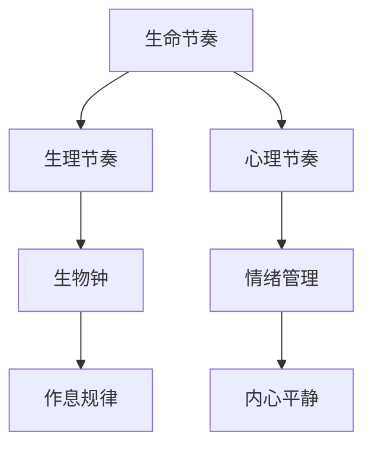
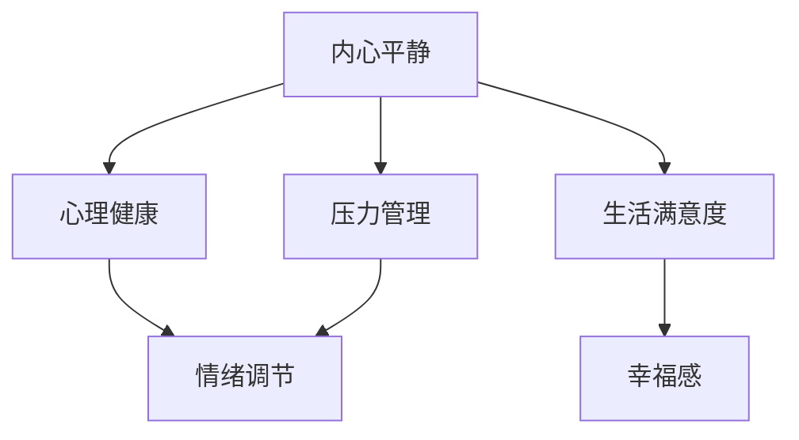

                 

### 《生命的节奏：在忙碌中寻找内心平静》

#### 关键词：
- 生命节奏
- 心理健康
- 内心平静
- 工作生活平衡
- 时间管理
- 情绪调节

#### 摘要：
在快节奏的现代生活中，我们常常感到压力和焦虑。本文将探讨如何理解生命的节奏，以及在忙碌中寻找内心平静的方法。通过深入分析节奏与内心平静的关系、工作与生活的平衡、以及日常生活中的节奏调整，提供实用的技巧和策略，帮助读者找到属于自己的生活节奏，实现内心的宁静与和谐。

-------------------------------------------------------------------

## 第一部分：理解生命的节奏

### 第1章：生命的节奏与内心平静的关系

在日常生活中，节奏是一个无处不在的概念。从生理层面到心理层面，节奏影响着我们的生活质量。那么，什么是节奏？它究竟如何影响我们的内心平静？

#### 1.1 节奏的概念与影响

**核心概念与联系：** 
节奏可以理解为一系列有规律的周期性活动。在生物学中，节奏与我们的生理活动紧密相关。例如，我们的心跳、呼吸、消化等都是具有固定节奏的生理过程。在心理学领域，节奏与我们的情绪、行为和心理状态有着密切的联系。

使用Mermaid流程图来解释节奏的定义和其对人类生活的影响：



**核心算法原理讲解：**
为了更好地理解节奏的影响，我们可以使用一个简单的算法来分析。以下是一个用Python编写的伪代码示例：

```python
def analyze_rhythm(data):
    # data: list of daily activities and their durations
    rhythm_score = 0
    for activity in data:
        if activity_duration_within_range(activity):
            rhythm_score += 1
    return rhythm_score / len(data)

def activity_duration_within_range(activity):
    # activity: dictionary with start and end times
    return (activity['end_time'] - activity['start_time']) < threshold
```

在这个算法中，`analyze_rhythm` 函数计算给定数据中符合特定节奏范围的活动数量。`activity_duration_within_range` 函数判断一个活动的时间长度是否在预设的范围内。

#### 1.2 内心平静的定义与重要性

**核心概念与联系：**
内心平静是一种心理状态，表现为情绪稳定、心态平和。内心平静不仅有助于提高生活质量，还能增强我们的抗压能力，提高工作效率。

使用流程图展现内心平静与心理健康之间的关系：



**数学模型讲解：**
我们可以通过以下方程式来描述内心平静与心理健康之间的关系：

$$
P = f(S, E, A)
$$

其中，\( P \) 表示内心平静，\( S \) 表示睡眠质量，\( E \) 表示情绪管理，\( A \) 表示压力水平。

**详细讲解与举例说明：**
假设一个人的睡眠质量为8小时，情绪管理良好，压力水平较低，那么根据上述方程式，他的内心平静程度可能会较高。反之，如果睡眠质量差，情绪波动大，压力水平高，则内心平静程度可能会较低。

#### 1.3 现代生活的节奏紊乱与应对

**核心算法原理讲解：**
为了应对现代生活的节奏紊乱，我们可以采用一些算法来优化生活节奏。以下是一个简单的伪代码示例：

```python
def optimize_rhythm(tasks, deadlines):
    # tasks: list of tasks with duration and deadline
    # deadlines: list of deadlines
    sorted_tasks = sorted(tasks, key=lambda x: x['deadline'])
    for task in sorted_tasks:
        if not is_time_available(task['duration'], deadlines):
            deadline = find_next_deadline(deadlines)
            delay_task(task, deadline)
    return sorted_tasks

def is_time_available(duration, deadlines):
    # duration: duration of a task
    # deadlines: list of deadlines
    return True  # or calculate based on current time and deadlines

def find_next_deadline(deadlines):
    # deadlines: list of deadlines
    return min(deadlines)

def delay_task(task, deadline):
    # task: dictionary with start and end times
    # deadline: new deadline
    task['start_time'] += (deadline - task['deadline'])
    task['end_time'] += (deadline - task['deadline'])
```

在这个算法中，`optimize_rhythm` 函数根据任务的紧急程度和截止日期来优化任务安排。如果某个任务的持续时间超出了当前时间与截止日期之间的时间窗口，则将其延迟到下一个截止日期。

### 第2章：平衡工作与生活的艺术

在现代职场中，工作压力往往使得人们难以找到内心的平静。如何平衡工作与生活，实现内心的宁静与和谐，是每个人都需要面对的挑战。

#### 2.1 工作压力与节奏管理

**核心算法原理讲解：**
工作压力可以通过对工作节奏的管理来缓解。以下是一个简单的伪代码示例：

```python
def manage_rhythm(workload, rhythm_score):
    # workload: current workload
    # rhythm_score: score indicating the level of rhythm

    if rhythm_score < threshold:
        # If the current rhythm score is low, reduce workload
        reduced_workload = workload - (workload * (1 - rhythm_score / threshold))
        return reduced_workload
    else:
        # If the rhythm score is high, maintain the current workload
        return workload
```

在这个算法中，如果当前节奏评分低于某个阈值，则通过减少工作量来调整节奏。反之，如果节奏评分较高，则维持当前工作量。

**数学模型讲解：**
我们可以使用以下方程式来描述工作压力与节奏管理的关系：

$$
P = f(W, R)
$$

其中，\( P \) 表示工作压力，\( W \) 表示工作量，\( R \) 表示节奏。

**详细讲解与举例说明：**
假设一个人的工作量是10小时，节奏评分为0.8，根据上述方程式，他的工作压力可能会较低。如果工作量增加到15小时，而节奏评分不变，则工作压力可能会增加。

#### 2.2 时间管理与优先级设定

**核心算法原理讲解：**
时间管理是平衡工作与生活的重要手段。以下是一个简单的伪代码示例：

```python
def prioritize_tasks(tasks, deadline):
    # tasks: list of tasks with priority and duration
    # deadline: deadline for completing tasks
    sorted_tasks = sorted(tasks, key=lambda x: x['priority'], reverse=True)
    available_time = deadline - current_time
    for task in sorted_tasks:
        if task['duration'] <= available_time:
            available_time -= task['duration']
        else:
            break
    return sorted_tasks[:len(tasks) - available_time]
```

在这个算法中，`prioritize_tasks` 函数根据任务的优先级和截止日期来排序任务。如果某个任务的持续时间不超过当前可用时间，则将其纳入计划。反之，如果持续时间超过可用时间，则不再继续处理。

**数学模型讲解：**
我们可以使用以下方程式来描述时间管理与优先级设定：

$$
T = f(P, D)
$$

其中，\( T \) 表示可用时间，\( P \) 表示任务优先级，\( D \) 表示截止日期。

**详细讲解与举例说明：**
假设当前时间为12:00，截止日期为18:00，有多个任务需要完成。根据任务优先级排序后，如果第一个任务的优先级最高，且持续时间不超过6小时，则可以将其纳入计划。如果持续时间超过6小时，则需要在其他任务中寻找合适的平衡。

#### 2.3 放松技巧与呼吸练习

**项目实战：**
为了帮助读者在忙碌中找到内心平静，我们可以介绍一种简单的呼吸练习。以下是一个简单的呼吸练习流程：

1. 坐在舒适的椅子上，保持背部挺直。
2. 放松双肩和颈部，闭上眼睛。
3. 将一只手放在胸部，另一只手放在腹部。
4. 深吸一口气，感受腹部上升。
5. 慢慢呼气，感受腹部下降。
6. 重复这个过程，每次呼吸保持5秒钟。

**实践效果：**
通过这种呼吸练习，可以帮助读者放松身心，减少压力，提高情绪稳定性。一些研究还表明，深呼吸练习可以改善睡眠质量，提高注意力和专注力。

### 第3章：日常生活中的节奏调整

#### 3.1 睡眠质量的提升

**数学模型讲解：**
睡眠质量与日常活动密切相关。以下是一个简单的方程式来描述睡眠质量与日常活动之间的关系：

$$
Q = f(S, E, A)
$$

其中，\( Q \) 表示睡眠质量，\( S \) 表示睡眠时长，\( E \) 表示环境因素，\( A \) 表示活动量。

**详细讲解与举例说明：**
假设一个人的睡眠时长为7小时，环境因素良好，活动量适中，那么根据上述方程式，他的睡眠质量可能会较高。如果睡眠时长减少，或者环境因素变差，活动量增加，则睡眠质量可能会下降。

#### 3.2 健康饮食与节奏

**项目实战：**
为了帮助读者在日常生活中调整节奏，我们可以介绍一种健康饮食计划。以下是一个简单的健康饮食计划：

1. 早餐：全麦面包、鸡蛋、牛奶、新鲜水果。
2. 午餐：蔬菜沙拉、瘦肉、全麦面包、一杯茶。
3. 晚餐：糙米、鱼肉、蔬菜汤、新鲜水果。
4. 加餐：坚果、酸奶、水果。

**实践效果：**
通过这种健康饮食计划，可以帮助读者保持能量水平稳定，减少饥饿感，提高身体和心理健康。

### 第4章：内心的自我探索

#### 4.1 情绪认知与调节

**核心算法原理讲解：**
情绪认知与调节是内心平静的重要组成部分。以下是一个简单的伪代码示例：

```python
def regulate_emotion(current_emotion, goal_emotion):
    # current_emotion: current emotional state
    # goal_emotion: desired emotion

    if current_emotion == goal_emotion:
        return current_emotion
    else:
        # Use a simple algorithm to reduce the gap between current and goal emotions
        new_emotion = current_emotion - (current_emotion - goal_emotion) * 0.1
        return new_emotion
```

在这个算法中，`regulate_emotion` 函数通过简单算法逐步调整当前情绪，使其接近目标情绪。

**数学模型讲解：**
我们可以使用以下方程式来描述情绪调节：

$$
E = f(C, G)
$$

其中，\( E \) 表示情绪状态，\( C \) 表示当前情绪，\( G \) 表示目标情绪。

**详细讲解与举例说明：**
假设当前情绪为焦虑，目标情绪为平静，根据上述方程式，通过情绪调节算法逐步降低焦虑水平，使其接近平静状态。

### 结论

本文通过深入探讨生命的节奏与内心平静的关系，提供了平衡工作与生活的艺术、日常生活中的节奏调整和内心的自我探索等方面的方法和技巧。希望读者能够在忙碌的生活中找到属于自己的节奏，实现内心的宁静与和谐。

#### 最佳实践 Tips：

1. 每天保持规律的作息时间，确保充足的睡眠。
2. 定期进行放松练习，如深呼吸、瑜伽等。
3. 注意饮食健康，减少油腻和高糖食品的摄入。
4. 学会情绪管理，培养积极的心态。
5. 增加与家人、朋友的交流，保持良好的社交关系。

#### 小结

生命的节奏是每个人都需要关注的重要方面。通过理解生命的节奏、平衡工作与生活、调整日常生活中的节奏和进行内心的自我探索，我们可以找到属于自己的节奏，实现内心的平静与和谐。

#### 注意事项

1. 避免过度工作，确保充足的休息时间。
2. 不要忽视身体健康，定期进行体检。
3. 学会拒绝不必要的社交活动，保护自己的时间和精力。

#### 拓展阅读

1. 《情绪智力：为什么情商比智商更重要》
2. 《时间管理：如何高效利用时间》
3. 《正念：如何活在当下》

---

**作者：AI天才研究院/AI Genius Institute & 禅与计算机程序设计艺术 /Zen And The Art of Computer Programming**

