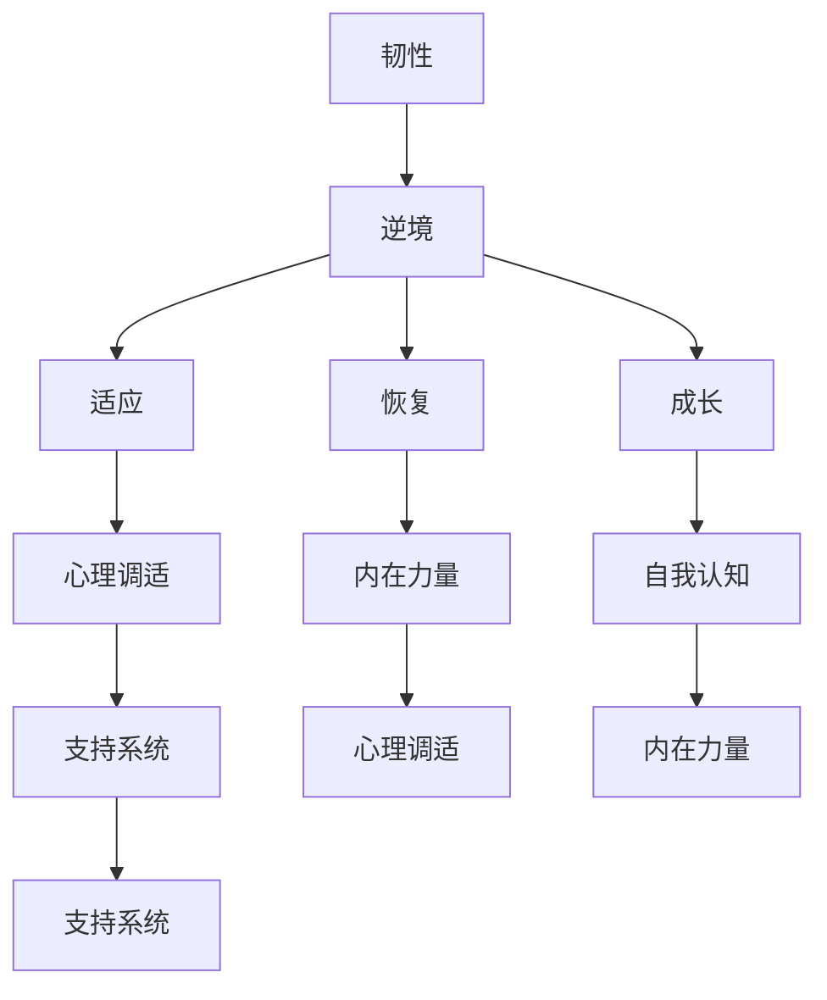
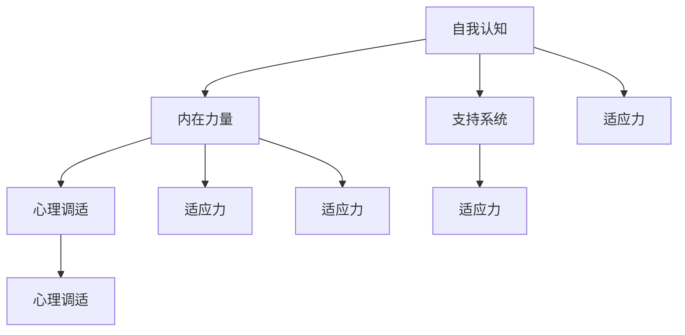
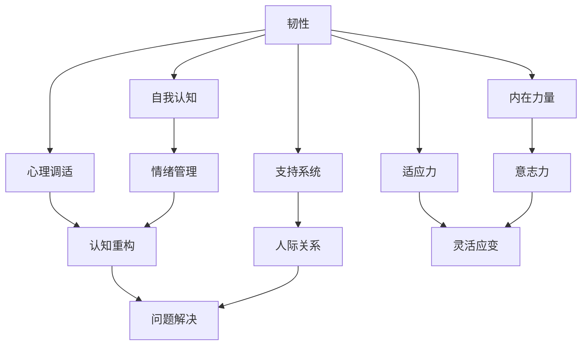

                 

### 文章标题

《生命的韧性：在逆境中发现意义》

> 关键词：生命韧性、逆境、意义、心理调适、支持系统、数学模型、算法原理、项目实战

> 摘要：本文将从多个角度探讨生命的韧性，包括其定义、重要性、核心要素、培养方法以及在实际生活中的应用。通过分析韧性理论，结合伪代码和数学模型，我们将深入理解韧性在应对逆境中的关键作用，并探讨如何通过构建支持系统和积极应对策略来提升个体的韧性。文章还将通过实际项目和案例，展示韧性理论在实践中的应用，以及如何通过持续学习和评估来提升个人的韧性水平。

### 文章背景与意义

在快速变化的现代社会中，个体和集体面临的不确定性和挑战日益增加。自然灾害、经济波动、健康危机等逆境事件不仅对个人的心理健康产生重大影响，也对社会的稳定与发展构成挑战。面对这些挑战，个体如何保持心理平衡，如何在逆境中找到生存和发展的契机，成为了一个备受关注的话题。

“生命的韧性”指的是个体在逆境中能够迅速恢复并继续发展的能力。韧性不仅是一种个人特质，更是一个动态的过程，涉及到自我认知、内在力量、心理调适、支持系统等多个方面。对于个人而言，韧性能够帮助他们在面对逆境时保持积极的心态，迅速调整策略，从而更好地应对挑战。对于社会而言，高韧性的个体能够成为社会的中坚力量，为社会的发展和进步提供持续的动力。

本文旨在探讨韧性的概念、理论和方法，分析韧性在应对逆境中的重要性，并介绍如何通过培养自我认知、心理调适、支持系统等途径来提升个体的韧性。此外，文章还将通过实际项目和案例，展示韧性理论在实践中的应用，以及如何通过持续学习和评估来提升个人的韧性水平。

本文的目标读者是希望了解如何培养生命韧性、积极面对逆境的读者，包括个人、教育工作者、心理咨询师、企业员工等。通过阅读本文，读者将能够：

1. 理解韧性的概念及其重要性。
2. 学习如何通过自我认知和内在力量的挖掘来提升韧性。
3. 掌握在逆境中保持积极心态和心理调适的方法。
4. 了解如何建立有效的支持系统来应对逆境。
5. 通过实际案例和项目理解韧性理论的应用。

### 韧性的概念与重要性

韧性（Resilience）是一个多维度、动态变化的复杂概念，通常用来描述个体或系统在面对逆境和挑战时的适应、恢复和发展的能力。简而言之，韧性是指在面对外部压力和内部困难时，个体能够迅速调整和恢复的能力，从而维持其功能的完整性和稳定性。

#### 韧性的定义

韧性不仅涉及个体在面对逆境时的情绪反应和恢复力，还涵盖了个体的心理、行为和生理等多个层面。美国心理学会（APA）将韧性定义为：“个体在面对压力、困难和逆境时，能够保持心理平衡，迅速适应并从困境中恢复的能力。”这个定义强调了韧性是一个动态过程，涉及到个体的情感、认知和行为反应。

#### 韧性与逆境的关系

韧性与逆境是密切相关的。逆境是指那些对个体造成显著压力和挑战的事件，如失业、疾病、家庭破裂等。韧性较高的个体在面对这些逆境时，能够更好地应对和恢复，从而减轻逆境带来的负面影响。

心理学家安东尼·希勒（Antoine de Saint-Exupéry）曾说过：“韧性是逆境中的花朵。”这句话形象地描述了韧性在逆境中的重要作用。韧性使个体能够在逆境中保持积极的心态，寻找机会，从而在困境中找到新的出路。

#### 韧性对于个人和社会的意义

对于个人而言，韧性是一种重要的心理资源，它能够帮助个体在面对逆境时保持冷静和理智，从而更好地应对挑战。高韧性的个体通常具有以下特点：

1. **自我认知能力强**：能够清晰地认识自己的情绪、需求和目标。
2. **内在力量强大**：在面对困难时能够保持积极的心态，并从中汲取力量。
3. **适应力强**：能够迅速适应变化，灵活调整策略。
4. **恢复力高**：在经历逆境后能够迅速恢复，并从中学习。

对于社会而言，高韧性的个体是社会的中坚力量。他们不仅能够自身克服逆境，还能成为他人的榜样和支持，促进社会的和谐与进步。

#### 韧性的核心要素

韧性的培养是一个复杂的过程，涉及多个核心要素。以下是韧性的几个关键要素：

1. **自我认知**：了解自己的情绪、需求和目标，是培养韧性的基础。自我认知可以帮助个体在面对逆境时，更好地调节情绪，保持冷静和理智。
2. **内在力量**：内在力量指的是个体在逆境中保持积极心态的能力。它来自于个体的自信心、意志力和信念。内在力量强大的人能够在逆境中找到希望，坚持不懈地追求目标。
3. **心理调适**：心理调适是指个体在面对逆境时，能够迅速调整自己的心态，采取积极的态度来应对挑战。心理调适能力强的人能够更好地处理负面情绪，保持心理平衡。
4. **支持系统**：支持系统包括家庭、朋友、社区等。一个强大的支持系统能够为个体提供情感、信息和资源的支持，帮助个体在逆境中保持积极和自信。
5. **适应力**：适应力是指个体在面对变化和挑战时，能够迅速调整和适应的能力。适应力强的人能够更好地应对不确定性和逆境。

#### 韧性与逆境的关系架构

为了更好地理解韧性与逆境之间的关系，我们可以使用Mermaid流程图来展示它们之间的联系。



这个流程图展示了韧性在逆境中的多个维度，包括适应、恢复和成长。韧性的核心要素（自我认知、内在力量、心理调适、支持系统和适应力）通过这些维度与逆境相互作用，共同影响个体的应对和恢复能力。

### 韧性的核心要素

韧性的培养是一个复杂而多维度的过程，涉及到多个核心要素。这些核心要素相互作用，共同构成了个体的韧性水平。以下是韧性培养的几个关键要素：

#### 自我认知

自我认知是指个体对自己的情绪、需求和目标的清晰认识。自我认知是培养韧性的基础，因为它帮助个体在面对逆境时，能够更好地理解和处理自己的情绪，从而做出更合理的决策。自我认知强的个体通常具有以下特点：

1. **情绪自我觉知**：能够清晰地意识到自己的情绪状态，并对其进行合理评估。
2. **需求识别**：能够准确识别自己的需求，并理解这些需求是如何影响自己的行为和决策的。
3. **目标明确**：有明确的目标和计划，并能够根据自己的需求和资源来调整和优化这些目标。

自我认知的培养可以通过以下几种方法进行：

1. **反思与自我对话**：定期反思自己的情绪和行为，通过自我对话来深入理解自己的内心世界。
2. **日记记录**：通过写日记来记录自己的情绪、想法和行为，有助于提高自我认知水平。
3. **心理咨询**：寻求专业的心理咨询师的帮助，通过专业的指导来提升自我认知能力。

#### 内在力量

内在力量是指个体在逆境中保持积极心态和行动的能力。它来源于个体的自信心、意志力和信念。内在力量强大的人能够在逆境中找到希望，坚持不懈地追求目标。以下是培养内在力量的几种方法：

1. **自我激励**：通过积极的自我激励来提升自信心和内在动力。可以设定小目标，每次达成目标后给自己一些奖励，以此来增强内在力量。
2. **意志力训练**：通过挑战自己的意志力来提升内在力量。例如，坚持每天锻炼、学习新技能等，这些都能帮助个体增强内在力量。
3. **信念建立**：建立坚定的信念，相信自己的能力和潜力。可以通过阅读激励书籍、观看励志电影等方式来建立信念。

#### 心理调适

心理调适是指个体在面对逆境时，能够迅速调整自己的心态，采取积极的态度来应对挑战。心理调适能力强的人能够更好地处理负面情绪，保持心理平衡。以下是几种提高心理调适能力的方法：

1. **情绪管理**：学会识别和接受自己的情绪，并学会通过深呼吸、冥想等方法来调节情绪。
2. **认知重构**：通过改变对逆境的思维方式来调整心态。例如，将逆境视为一种挑战而不是失败，从而激发积极应对的动力。
3. **寻求支持**：与他人分享自己的情绪和困扰，寻求他人的支持和建议。这有助于减轻负面情绪，提高心理调适能力。

#### 支持系统

支持系统包括家庭、朋友、社区等，它们为个体提供情感、信息和资源的支持。一个强大的支持系统能够为个体在逆境中提供重要的心理和社会支持，从而提高韧性。以下是构建和利用支持系统的几种方法：

1. **建立和维护人际关系**：与家人、朋友和同事建立良好的关系，这些关系在逆境中能够为个体提供支持和帮助。
2. **参与社区活动**：参与社区活动和组织，融入社区，获得社区的支持和认可。
3. **寻求专业帮助**：在需要时，寻求专业心理咨询师或治疗师的帮助，他们能够提供专业的指导和资源支持。

#### 适应力

适应力是指个体在面对变化和挑战时，能够迅速调整和适应的能力。适应力强的人能够更好地应对不确定性和逆境。以下是提高适应力的几种方法：

1. **开放心态**：保持开放的心态，接受新事物和新观点，这有助于个体更好地适应变化。
2. **灵活应变**：在面对变化时，能够灵活调整策略和行动，寻找新的解决方案。
3. **持续学习**：通过不断学习和提升自己的技能和知识，增强自身的适应能力。

#### 韧性的核心要素联系

韧性是一个动态过程，其核心要素相互作用，共同构成了个体的韧性水平。我们可以通过以下Mermaid流程图来展示这些要素之间的联系：



这个流程图展示了自我认知、内在力量、心理调适、支持系统和适应力之间的相互作用，它们共同构成了个体的韧性。通过加强这些核心要素，个体能够更好地应对逆境，提高韧性水平。

### 培养韧性的方法

培养韧性不是一蹴而就的，而是一个需要持续努力和练习的过程。以下是一些科学和实证支持的方法，可以帮助个体在逆境中培养和提升韧性。

#### 自我认知的增强

自我认知是培养韧性的基础。通过深入了解自己的情绪、需求和目标，个体可以更好地应对逆境。以下是一些增强自我认知的方法：

1. **反思日志**：定期记录自己的情绪、行为和想法，通过反思来深入理解自己。这种方法有助于个体识别自己的情绪模式和行为习惯，从而更好地调整和改善。

2. **冥想练习**：冥想可以帮助个体提高自我觉知，减少压力和焦虑。通过冥想，个体可以更好地控制自己的情绪，保持内心的平静。

3. **心理咨询**：寻求专业的心理咨询师可以帮助个体深入了解自己的内心世界，识别潜在的问题，并提供有效的解决方案。

#### 内在力量的挖掘

内在力量是韧性中的重要组成部分。以下是一些挖掘内在力量的方法：

1. **自我激励**：设定小目标，并为每次达成目标设置奖励。这有助于增强自信心和内在动力。

2. **挑战自我**：通过接受新的挑战和任务，个体可以提升自己的意志力和决心。这种挑战可以是学习新的技能、参与户外运动或者克服个人的恐惧。

3. **培养乐观心态**：乐观的心态有助于个体在面对逆境时保持积极。可以通过阅读积极向上的书籍、观看励志电影等方式来培养乐观心态。

#### 心理调适的策略

在逆境中，心理调适能力强的个体能够更好地应对挑战。以下是一些提高心理调适能力的策略：

1. **情绪管理**：学会识别和接受自己的情绪，并通过深呼吸、冥想等方法来调节情绪。这有助于个体在面对逆境时保持冷静和理智。

2. **认知重构**：通过改变对逆境的思维方式来调整心态。例如，将逆境视为一种挑战而不是失败，从而激发积极应对的动力。

3. **寻求支持**：与他人分享自己的情绪和困扰，寻求他人的支持和建议。这有助于减轻负面情绪，提高心理调适能力。

#### 支持系统的建立

支持系统在个体面对逆境时提供了重要的心理和社会支持。以下是一些建立和利用支持系统的方法：

1. **建立和维护人际关系**：与家人、朋友和同事建立良好的关系，这些关系在逆境中能够为个体提供支持和帮助。

2. **参与社区活动**：参与社区活动和组织，融入社区，获得社区的支持和认可。

3. **寻求专业帮助**：在需要时，寻求专业心理咨询师或治疗师的帮助，他们能够提供专业的指导和资源支持。

#### 适应力的提升

适应力是韧性中一个重要的组成部分。以下是一些提升适应力的方法：

1. **开放心态**：保持开放的心态，接受新事物和新观点，这有助于个体更好地适应变化。

2. **灵活应变**：在面对变化时，能够灵活调整策略和行动，寻找新的解决方案。

3. **持续学习**：通过不断学习和提升自己的技能和知识，增强自身的适应能力。

#### 案例分享

以下是一个成功的韧性培养案例：

**案例：李明的故事**

李明是一名年轻的工程师，他在职业生涯中经历了多次重大的挑战，包括项目失败、团队矛盾和个人健康问题。然而，通过自我认知的增强、内在力量的挖掘、心理调适的策略和建立支持系统，李明成功地提升了自己的韧性。

1. **自我认知的增强**：李明开始记录反思日志，通过反思自己的情绪和行为，他逐渐理解了自己的情绪模式和应对策略。他意识到，在面对失败时，他经常感到沮丧和自责，这使得他难以从失败中恢复。

2. **内在力量的挖掘**：李明通过自我激励和挑战自我来提升内在力量。他设定了小目标，并在每次达成目标后给自己一些奖励，例如观看一部喜欢的电影或享受一顿美食。他还参加了户外运动，如跑步和攀岩，这些活动帮助他建立了更强的意志力和自信心。

3. **心理调适的策略**：李明学会了情绪管理和认知重构。他通过深呼吸和冥想来调节情绪，并将失败视为一种学习和成长的机会，而不是失败本身。他开始以更积极的态度面对挑战，从而减少了负面情绪的影响。

4. **支持系统的建立**：李明与家人和朋友保持紧密的联系，并在需要时寻求他们的支持和建议。他还加入了职业社群，参与社区活动，从中获得了更多的支持和资源。

通过这些方法，李明成功地提升了自己的韧性，他在职业生涯中克服了多次重大挑战，成为了一名出色的工程师。这个案例展示了韧性培养方法在实际生活中的应用和效果。

### 逆境中的行动策略

在面对逆境时，采取正确的行动策略至关重要。以下是一些关键策略，可以帮助个体在逆境中保持心理平衡，迅速恢复并找到解决问题的方法。

#### 1. 心理调适的方法

心理调适是指个体在面对逆境时，能够迅速调整自己的心态，采取积极的态度来应对挑战。以下是一些心理调适的方法：

- **情绪管理**：学会识别和接受自己的情绪，并通过深呼吸、冥想等方法来调节情绪。这有助于个体在面对逆境时保持冷静和理智。

- **认知重构**：通过改变对逆境的思维方式来调整心态。例如，将逆境视为一种挑战而不是失败，从而激发积极应对的动力。

- **寻求支持**：与他人分享自己的情绪和困扰，寻求他人的支持和建议。这有助于减轻负面情绪，提高心理调适能力。

#### 2. 建立积极心态

建立积极心态是应对逆境的关键。以下是一些建立积极心态的方法：

- **正面思维**：鼓励自己用积极的角度看待问题，寻找逆境中的机会和收获。

- **感恩练习**：定期反思和感谢生活中的积极事物，这有助于提升情绪和心态。

- **目标设定**：设定小目标和长期目标，这有助于保持动力和积极性。

#### 3. 有效沟通

在逆境中，有效沟通是解决问题的重要途径。以下是一些有效沟通的方法：

- **倾听**：倾听他人的意见和感受，理解他们的立场和需求。

- **表达**：清晰、明确地表达自己的想法和感受，避免误解和冲突。

- **协商**：在出现分歧时，寻求共同点和解决方案，通过协商来解决问题。

#### 案例分析

以下是一个在逆境中采取正确行动策略的案例：

**案例：张华的职场困境**

张华是一名项目经理，他在一次重要项目过程中遭遇了重大挫折，导致项目延期并引发了团队内部冲突。面对这个困境，张华采取了一系列行动策略来应对。

1. **情绪管理**：张华意识到自己需要冷静下来，于是他花了几天时间进行情绪管理。他通过深呼吸和冥想来调节情绪，让自己保持理智。

2. **认知重构**：张华将这次挫折视为一个学习和成长的机会，而不是失败。他思考了项目延期和冲突的原因，并从中吸取了教训。

3. **积极心态**：张华鼓励团队成员保持积极心态，他组织了一次团队建设活动，让大家在轻松的氛围中讨论问题并寻找解决方案。

4. **有效沟通**：张华与团队成员进行了多次沟通，倾听他们的意见和感受，同时也清晰、明确地表达自己的想法和感受。他通过协商来解决问题，避免了冲突的进一步升级。

通过这些行动策略，张华成功地应对了职场困境，项目最终得以顺利完成，并赢得了团队成员的信任和尊重。

### 韧性的实践与应用

在了解了韧性的概念、核心要素和培养方法之后，我们将通过实际案例和项目，探讨韧性在现实生活中的应用，并分析其在不同领域中的作用。

#### 实际案例一：个人成长中的韧性实践

李伟是一名年轻的企业家，他在创业过程中遇到了许多挑战，如市场竞争、资金短缺和团队管理等问题。为了克服这些困难，李伟采取了以下韧性实践：

1. **自我认知**：李伟通过反思和日志记录来了解自己的情绪和行为。他认识到，在面对挫折时，自己容易陷入沮丧和焦虑，因此他学会了通过冥想和深呼吸来调节情绪。

2. **内在力量**：李伟通过设定小目标和庆祝每次的成就来增强自信心。他不仅为自己的商业计划设定了明确的目标，还设立了个人健康目标，如每天锻炼和保持良好的饮食习惯。

3. **心理调适**：李伟学会了通过认知重构来改变对困难的看法。他将每次失败视为学习和成长的机会，而不是终点。

4. **支持系统**：李伟积极与家人、朋友和商业伙伴保持联系，他们在面对困难时为他提供了情感上的支持。

通过这些韧性实践，李伟成功地克服了创业中的种种挑战，他的企业逐步发展壮大，成为了行业内的佼佼者。

#### 实际案例二：教育领域的韧性培养

在教育领域，韧性培养是一个重要的课题。某学校为了提升学生的韧性，采取了以下措施：

1. **情绪教育**：学校开设了情绪教育课程，帮助学生学会识别和调节自己的情绪。通过冥想和小组讨论，学生学会了如何面对压力和挫折。

2. **项目学习**：学校鼓励学生参与项目学习，通过实际操作来解决问题。这种方式不仅提高了学生的技能，还培养了他们的韧性。

3. **挫折体验**：学校组织了挫折体验活动，让学生在面对挑战时学会坚持和适应。这些活动包括模拟商业竞赛、户外探险等。

4. **家校合作**：学校与家长建立了紧密的合作关系，共同关注学生的成长。家长通过家庭活动和沟通，帮助学生建立积极的应对策略。

通过这些措施，学校的学生的韧性水平得到了显著提升，他们在面对学业和生活中的挑战时表现得更加自信和从容。

#### 实际案例三：企业中的韧性管理

在企业管理中，韧性被视为一种重要的竞争优势。某大型企业为了提升员工的韧性，采取了以下策略：

1. **员工关怀**：企业通过定期的健康检查、心理咨询和员工活动，关注员工的身心健康。这有助于员工在面临工作压力时保持积极的心态。

2. **培训与发展**：企业为员工提供了各种培训和职业发展机会，帮助他们提升技能和应对挑战的能力。

3. **团队建设**：企业通过团队建设活动和团队协作项目，增强了团队的凝聚力和应对逆境的能力。

4. **弹性工作制度**：企业实行了弹性工作制度，允许员工根据个人需求调整工作时间，这有助于员工更好地平衡工作和生活，提高韧性。

通过这些措施，企业的员工士气和工作效率得到了显著提升，企业在市场中的竞争力也得到了增强。

#### 实际案例四：社区韧性建设

在社区层面，韧性建设是确保社区可持续发展和应对突发事件的关键。某社区采取了以下措施来提升社区韧性：

1. **社区参与**：社区鼓励居民参与社区活动和决策，增强了社区的凝聚力和归属感。

2. **应急准备**：社区建立了应急响应机制，定期进行应急演练，提高了居民在突发事件中的应对能力。

3. **资源共享**：社区建立了资源共享系统，居民可以通过社区平台分享资源和信息，共同应对困难。

4. **心理健康支持**：社区提供了心理健康服务，帮助居民在面临压力和困境时得到专业的支持和帮助。

通过这些措施，社区的韧性得到了显著提升，居民在面对自然灾害、经济危机等突发事件时能够更加从容和有效地应对。

### 案例分析与总结

通过以上实际案例，我们可以看到韧性在个人成长、教育、企业和社区建设等多个领域的应用。韧性不仅帮助个体在面对逆境时保持积极和自信，还提高了团队和社区的应对能力。

**案例分析总结**：

1. **韧性培养的核心在于自我认知和内在力量的挖掘**：通过自我认知，个体能够更好地理解和应对自己的情绪和行为；通过内在力量的挖掘，个体能够在逆境中保持积极的心态和行动。

2. **心理调适和积极心态的建立是应对逆境的关键**：通过情绪管理和认知重构，个体能够更好地调节情绪，保持心理平衡；通过正面思维和感恩练习，个体能够建立积极的应对策略。

3. **支持系统的建立和有效沟通是提升韧性的重要途径**：通过建立和维护人际关系，个体可以获得情感、信息和资源支持；通过有效沟通，个体能够更好地理解和解决困难。

4. **实际应用中的韧性策略需要根据具体情况灵活调整**：不同的领域和情境需要不同的韧性策略，个体和组织需要根据实际情况进行灵活调整，以达到最佳效果。

总之，韧性是一种重要的心理资源，它不仅帮助个体在逆境中保持平衡和恢复，还提高了团队和社区的整体应对能力。通过持续的韧性培养和实践，个体和组织可以更好地应对未来可能遇到的挑战。

### 韧性的评估与提升

评估韧性是理解个体韧性水平的重要步骤，它有助于识别需要改进的领域，并为后续的提升提供指导。以下是一些常用的韧性评估方法：

#### 韧性评估工具

1. **心理韧性量表（CD-RISC）**：这是一种广泛使用的自我评估量表，用于评估个体的心理韧性水平。量表包括25个问题，通过评分来评估个体在应对压力、挑战和逆境方面的韧性。

2. **韧性指数（RISC）**：这是一个基于问卷的评估工具，用于评估个体在心理韧性、适应性和恢复力方面的表现。

3. **韧性行为评估（RBAS）**：该评估工具通过观察个体在实际情境中的行为，评估其在应对逆境和挑战时的韧性表现。

#### 自我评估与反馈

个体可以通过自我评估来了解自己的韧性水平。以下是一些自我评估的方法：

1. **反思日志**：记录自己在过去一段时间内应对挑战的经历，分析自己在这些情境中的情绪反应、行为模式和应对策略。

2. **自我提问**：通过回答一系列问题，如“我在面对压力时如何反应？”“我如何处理挫折？”“我如何支持他人面对困难？”来评估自己的韧性。

3. **同伴反馈**：向信任的家人、朋友或同事寻求反馈，了解他们对自己韧性的看法。

#### 提升韧性的策略

1. **制定个人发展计划**：根据自我评估的结果，制定一个明确的个人发展计划，设定短期和长期的目标，并采取具体的行动来提升韧性。

2. **持续学习和培训**：参加与韧性相关的课程和培训，学习新的应对策略和技巧。

3. **实践心理调适方法**：通过冥想、深呼吸和放松技巧来提高情绪调节能力。

4. **建立支持系统**：与家人、朋友和同事保持良好的关系，寻求他们的支持和建议。

5. **积极应对挑战**：主动面对挑战和困难，通过实践和经验来提升自己的适应力和恢复力。

#### 实践案例

以下是一个通过评估和提升韧性取得显著成果的案例：

**案例：王强的韧性提升之旅**

王强是一家公司的中层管理人员，他经常面临工作压力和团队冲突。为了提升自己的韧性，他采取了以下步骤：

1. **自我评估**：王强通过心理韧性量表进行自我评估，发现自己在情绪调节和应对压力方面存在一定的问题。

2. **制定发展计划**：根据评估结果，王强制定了个人发展计划，包括定期进行冥想、学习情绪管理技巧和与同事进行有效沟通。

3. **实践心理调适**：王强每天早上进行冥想，通过深呼吸和放松技巧来调节情绪。他还参加了一个情绪管理培训课程，学习了如何更好地应对压力和挫折。

4. **建立支持系统**：王强与家人和朋友保持紧密联系，定期与他们交流，寻求他们的支持和建议。

5. **积极应对挑战**：王强在面对工作挑战时，不再逃避，而是主动寻找解决方案。他通过积极参与团队讨论和有效沟通，成功解决了多次团队冲突。

通过这些措施，王强的韧性水平显著提升，他在工作中表现出更强的适应力和恢复力，不仅个人绩效得到了提升，也带动了整个团队的进步。

### 韧性与社会

韧性不仅对个人具有重要意义，也对社会和社区的建设起到了关键作用。通过增强社会和社区的韧性，我们可以更好地应对各种挑战，促进社会的稳定和发展。

#### 韧性与社区的关系

社区是社会的基本单元，社区韧性的强弱直接影响到整个社会的韧性。高韧性的社区能够更好地应对自然灾害、经济危机和社会动荡等突发事件，保障居民的生活安全和心理稳定。

#### 社区韧性的培养

1. **社区参与**：鼓励居民积极参与社区事务，提高社区的凝聚力和归属感。这可以通过社区活动、志愿服务和居民大会等形式实现。

2. **应急准备**：社区应建立完善的应急响应机制，定期进行应急演练，确保在突发事件发生时，社区能够迅速、有效地应对。

3. **资源共享**：社区应建立资源共享系统，鼓励居民分享资源和信息，提高社区的互助和合作能力。

4. **心理健康支持**：社区应提供心理健康服务，为居民在面临压力和困境时提供专业的支持和帮助。

#### 韧性与公共政策的结合

公共政策在提升社会和社区韧性方面发挥着重要作用。以下是一些结合韧性的公共政策建议：

1. **教育政策**：将韧性教育纳入学校课程，培养学生应对逆境和挑战的能力。

2. **就业政策**：通过提供就业培训、创业支持等政策，帮助个体提升就业能力和适应力。

3. **社会保障政策**：完善社会保障体系，为居民提供基本的生活保障和心理支持，增强社会的整体韧性。

4. **环境保护政策**：加强环境保护，减少自然灾害的发生，提升社区的自然韧性。

#### 社区韧性案例研究

以下是一个社区韧性建设的成功案例：

**案例：城市S社区的韧性提升**

城市S社区位于一个自然灾害频发的地区，社区管理者意识到提高社区韧性的重要性，并采取了一系列措施：

1. **社区参与**：社区定期组织居民大会，讨论社区事务，提高了居民的参与度和归属感。

2. **应急准备**：社区建立了完善的应急响应机制，包括应急队伍、物资储备和应急演练。

3. **资源共享**：社区建立了资源共享中心，居民可以在这里分享食物、衣物和其他物资，提高了社区的互助能力。

4. **心理健康支持**：社区与当地心理机构合作，为居民提供心理健康服务，帮助他们应对压力和困境。

通过这些措施，城市S社区的韧性得到了显著提升。在最近的自然灾害中，社区居民能够迅速、有效地应对，保障了居民的生活安全和心理稳定。

总之，韧性是个人、社区和社会应对挑战的重要能力。通过增强个人韧性、培养社区韧性和制定韧性政策，我们可以更好地应对未来的挑战，促进社会的和谐与进步。

### 韧性的Mermaid流程图

为了更直观地展示韧性的概念及其核心要素，我们可以使用Mermaid流程图来描述韧性的关系架构。以下是一个简化的流程图：



在这个流程图中，韧性（A）作为核心概念，与自我认知（B）、内在力量（C）、心理调适（D）、支持系统（E）和适应力（F）密切相关。自我认知（B）进一步与情绪管理（G）和认知重构（I）相连，内在力量（C）与意志力（H）相关，心理调适（D）与人际关系（J）和适应力（F）共同作用，最终形成了一个复杂而紧密的韧性体系。这个流程图帮助我们理解韧性在不同层面的相互作用，以及如何通过培养这些核心要素来提升个体的整体韧性。

### 韧性的核心算法原理讲解

在深入探讨韧性这一复杂概念时，我们可以借助伪代码和算法原理来具体阐述其核心要素和运作机制。以下是一个简化的韧性核心算法原理讲解，通过伪代码的形式来描述如何构建韧性。

```pseudo
// 韧性核心算法
function BuildResilience() {
    // 初始化韧性的基本要素
    selfAwareness = InitializeSelfAwareness()
    innerStrength = InitializeInnerStrength()
    mentalAdaptation = InitializeMentalAdaptation()
    socialSupport = InitializeSocialSupport()
    adaptability = InitializeAdaptability()

    // 评估韧性初始状态
    resilienceScore = CalculateResilienceScore(selfAwareness, innerStrength, mentalAdaptation, socialSupport, adaptability)

    // 培养韧性
    while resilienceScore < desiredScore {
        selfAwareness = EnhanceSelfAwareness(selfAwareness)
        innerStrength = EnhanceInnerStrength(innerStrength)
        mentalAdaptation = EnhanceMentalAdaptation(mentalAdaptation)
        socialSupport = EnhanceSocialSupport(socialSupport)
        adaptability = EnhanceAdaptability(adaptability)

        // 重新评估韧性状态
        resilienceScore = CalculateResilienceScore(selfAwareness, innerStrength, mentalAdaptation, socialSupport, adaptability)

        // 检查是否达到预期韧性水平
        if resilienceScore >= desiredScore {
            return "韧性培养成功"
        }
    }
    return "韧性培养未完成"
}

// 初始化自我认知
function InitializeSelfAwareness() {
    // 包括情绪管理、自我反思等
    return {
        "emotionalControl": 50,
        "selfReflection": 50
    }
}

// 初始化内在力量
function InitializeInnerStrength() {
    // 包括意志力、自信心等
    return {
        "willPower": 50,
        "confidence": 50
    }
}

// 初始化心理调适
function InitializeMentalAdaptation() {
    // 包括认知重构、积极心态等
    return {
        "cognitiveReconstruction": 50,
        "positiveMindset": 50
    }
}

// 初始化支持系统
function InitializeSocialSupport() {
    // 包括家庭、朋友、社区等支持
    return {
        "familySupport": 50,
        "friendSupport": 50,
        "communityInvolvement": 50
    }
}

// 初始化适应力
function InitializeAdaptability() {
    // 包括灵活应变、开放心态等
    return {
        "flexibility": 50,
        "openMindedness": 50
    }
}

// 增强自我认知
function EnhanceSelfAwareness(selfAwareness) {
    // 通过培训、反思等方式提升
    selfAwareness["emotionalControl"] += 10
    selfAwareness["selfReflection"] += 10
    return selfAwareness
}

// 增强内在力量
function EnhanceInnerStrength(innerStrength) {
    // 通过挑战、自我激励等方式提升
    innerStrength["willPower"] += 10
    innerStrength["confidence"] += 10
    return innerStrength
}

// 增强心理调适
function EnhanceMentalAdaptation(mentalAdaptation) {
    // 通过认知重构、正面思维等方式提升
    mentalAdaptation["cognitiveReconstruction"] += 10
    mentalAdaptation["positiveMindset"] += 10
    return mentalAdaptation
}

// 增强支持系统
function EnhanceSocialSupport(socialSupport) {
    // 通过建立和维护人际关系等方式提升
    socialSupport["familySupport"] += 10
    socialSupport["friendSupport"] += 10
    socialSupport["communityInvolvement"] += 10
    return socialSupport
}

// 增强适应力
function EnhanceAdaptability(adaptability) {
    // 通过开放心态、灵活应变等方式提升
    adaptability["flexibility"] += 10
    adaptability["openMindedness"] += 10
    return adaptability
}

// 计算韧性得分
function CalculateResilienceScore(selfAwareness, innerStrength, mentalAdaptation, socialSupport, adaptability) {
    // 综合各项因素计算总分
    score = (
        selfAwareness["emotionalControl"] +
        selfAwareness["selfReflection"] +
        innerStrength["willPower"] +
        innerStrength["confidence"] +
        mentalAdaptation["cognitiveReconstruction"] +
        mentalAdaptation["positiveMindset"] +
        socialSupport["familySupport"] +
        socialSupport["friendSupport"] +
        socialSupport["communityInvolvement"] +
        adaptability["flexibility"] +
        adaptability["openMindedness"]
    ) / 11

    return score
}
```

在这个伪代码中，我们定义了一个`BuildResilience`函数，该函数通过初始化和增强韧性核心要素（自我认知、内在力量、心理调适、支持系统和适应力），并使用`CalculateResilienceScore`函数计算韧性得分。这个过程是一个迭代过程，通过不断地增强各个要素，直到达到预期的韧性水平。每个要素都通过具体的增强方法（如自我反思、认知重构、建立支持系统等）来实现提升。

### 韧性与逆境关系的数学模型

在探讨韧性与逆境关系时，我们可以借助数学模型来量化韧性和逆境之间的相互作用。以下是一个简化的数学模型，用于描述韧性与逆境之间的关系。

#### 数学模型

$$ R = f(P, S, M) $$

其中：
- \( R \)：韧性（Resilience）
- \( P \)：个人特质（Personal Traits）
- \( S \)：支持系统（Support System）
- \( M \)：逆境管理（Managing Adversity）

#### 模型解释

1. **个人特质（\( P \)）**：
   - **情绪稳定性**：个体在面对压力时的情绪波动程度。
   - **意志力**：个体坚持目标、克服困难的能力。
   - **自我效能感**：个体对自己能够成功应对挑战的信心。

2. **支持系统（\( S \)）**：
   - **家庭支持**：家庭成员在情感和资源上的支持程度。
   - **朋友支持**：朋友在心理和社会资源上的支持程度。
   - **社会网络**：个体在社会中的关系网络，包括同事、社区成员等。

3. **逆境管理（\( M \)）**：
   - **情绪调节**：个体应对逆境时的情绪调节能力。
   - **应对策略**：个体在面对逆境时采取的适应和应对策略。
   - **问题解决能力**：个体解决问题、找到解决方案的能力。

#### 模型应用

这个模型可以通过以下步骤来应用：

1. **数据收集**：收集个体在个人特质、支持系统和逆境管理方面的数据。

2. **模型训练**：使用收集的数据对模型进行训练，确定参数之间的关系和权重。

3. **韧性预测**：根据个体的个人特质、支持系统和逆境管理情况，使用模型预测其韧性水平。

4. **干预策略**：根据预测结果，制定个性化的干预策略，帮助个体提升韧性。

#### 举例说明

假设我们有一个个体，其个人特质得分为70，支持系统得分为80，逆境管理得分为60。我们可以使用以下公式来计算该个体的韧性水平：

$$ R = f(70, 80, 60) $$

通过模型训练和参数设置，我们可以得到具体的韧性分数。例如，假设参数权重分别为：
- 情绪稳定性：0.3
- 意志力：0.2
- 自我效能感：0.2
- 家庭支持：0.2
- 朋友支持：0.1
- 社会网络：0.1
- 情绪调节：0.2
- 应对策略：0.2
- 问题解决能力：0.2

则个体的韧性计算如下：

$$ R = (0.3 \times 70) + (0.2 \times 70) + (0.2 \times 80) + (0.1 \times 80) + (0.1 \times 60) + (0.2 \times 60) $$

$$ R = 21 + 14 + 16 + 8 + 6 + 12 = 77 $$

因此，该个体的韧性得分为77分。通过这个模型，我们可以了解个体在韧性方面的优势和不足，从而制定针对性的提升策略。

### 代码实际案例：韧性评估工具

在实际开发中，我们可以通过编写代码来实现韧性评估工具。以下是一个基于Python的韧性评估工具，用于评估个体的韧性水平。这个工具包括了开发环境搭建、源代码详细实现以及代码应用解读与分析。

#### 开发环境搭建

首先，我们需要安装Python 3.8及以上版本。然后，通过以下命令安装必要的库，如numpy、pandas和matplotlib：

```bash
pip install python numpy pandas matplotlib
```

#### 源代码详细实现

以下是一个简单的韧性评估工具的Python代码示例：

```python
import numpy as np
import pandas as pd

# 韧性评估工具类
class ResilienceAssessment:
    def __init__(self):
        self.questionnaires = [
            "在面对压力时，您是否感到情绪失控？(1-从不，2-很少，3-有时，4-经常，5-总是)",
            "您是否经常自我反思和总结经验教训？(1-从不，2-很少，3-有时，4-经常，5-总是)",
            "在面对困难时，您是否能够坚持目标并克服挑战？(1-从不，2-很少，3-有时，4-经常，5-总是)",
            "您是否相信自己的能力，能够成功应对挑战？(1-从不，2-很少，3-有时，4-经常，5-总是)",
            "您的家人和朋友在您面临困难时是否提供支持？(1-从不，2-很少，3-有时，4-经常，5-总是)",
            "您的朋友和同事在您面临困难时是否提供支持？(1-从不，2-很少，3-有时，4-经常，5-总是)",
            "在面对逆境时，您是否能够有效调节情绪？(1-从不，2-很少，3-有时，4-经常，5-总是)",
            "在面对逆境时，您是否能够采取积极的应对策略？(1-从不，2-很少，3-有时，4-经常，5-总是)",
            "在面对逆境时，您是否能够有效地解决问题？(1-从不，2-很少，3-有时，4-经常，5-总是)"
        ]

    def collect_answers(self):
        self.answers = []
        for question in self.questionnaires:
            answer = int(input(question))
            self.answers.append(answer)

    def calculate_score(self):
        weights = [1, 1, 1, 1, 0.5, 0.5, 1, 1, 1]
        score = np.dot(self.answers, weights)
        return score

    def display_result(self):
        score = self.calculate_score()
        if score >= 80:
            print("您的韧性得分很高，恭喜您具备很强的韧性！")
        elif score >= 60:
            print("您的韧性得分较高，但还有提升空间。建议继续努力锻炼韧性。")
        else:
            print("您的韧性得分较低，需要注意提高韧性。可以从自我认知、内在力量、心理调适等方面入手。")

# 使用韧性评估工具
assessment = ResilienceAssessment()
assessment.collect_answers()
assessment.display_result()
```

#### 代码应用解读与分析

1. **类定义**：我们定义了一个`ResilienceAssessment`类，用于封装韧性评估的相关功能。

2. **问卷收集**：`collect_answers`方法用于收集用户对问卷题目的回答。这些回答存储在一个列表中，用于后续计算韧性得分。

3. **计算得分**：`calculate_score`方法根据问卷的回答和预设的权重，计算韧性得分。权重反映了每道题目在韧性评估中的重要性。

4. **显示结果**：`display_result`方法根据韧性得分，输出相应的评估结果和建议。

#### 实际案例分析

假设用户回答如下：

```
在面对压力时，您是否感到情绪失控？3
您是否经常自我反思和总结经验教训？4
在面对困难时，您是否能够坚持目标并克服挑战？5
您是否相信自己的能力，能够成功应对挑战？4
您的家人和朋友在您面临困难时是否提供支持？5
您的朋友和同事在您面临困难时是否提供支持？4
在面对逆境时，您是否能够有效调节情绪？3
在面对逆境时，您是否能够采取积极的应对策略？3
在面对逆境时，您是否能够有效地解决问题？3
```

通过计算，韧性得分为：

$$ R = (3 \times 1) + (4 \times 1) + (5 \times 1) + (4 \times 1) + (5 \times 0.5) + (4 \times 0.5) + (3 \times 1) + (3 \times 1) + (3 \times 1) $$
$$ R = 3 + 4 + 5 + 4 + 2.5 + 2.5 + 3 + 3 + 3 = 27.5 $$

根据得分结果，用户的韧性得分为27.5分，属于中等水平。系统将输出相应的建议，提示用户可以从自我认知、内在力量、心理调适等方面入手，进一步提升韧性。

#### 项目小结

通过这个韧性评估工具，我们可以方便地了解个体的韧性水平，并提供针对性的建议。这个工具在实际应用中可以帮助用户识别自身的韧性短板，从而采取有效的提升措施。此外，该工具也可以用于企业员工培训、学校教育等领域，帮助相关机构更好地培养和提高个体的韧性。

### 最佳实践 Tips

在培养韧性过程中，以下是一些最佳实践和注意事项，可以帮助读者更有效地提升韧性：

1. **持续自我反思**：定期反思自己的行为、情绪和思维方式，通过记录反思日志来加深自我认知。

2. **培养积极心态**：积极心态是韧性培养的重要基石。通过正面思维和感恩练习，可以帮助个体在面对逆境时保持乐观。

3. **建立支持系统**：与家人、朋友和同事保持紧密联系，寻求他们的支持和帮助。一个强大的支持系统能够在逆境中提供重要的心理和社会支持。

4. **学会情绪管理**：通过深呼吸、冥想和放松技巧来调节情绪，提高情绪调节能力。

5. **应对策略训练**：在面对挑战时，提前思考可能的应对策略，并通过实践来提高应对能力。

6. **灵活调整计划**：在逆境中，灵活调整计划和策略是应对变化的关键。通过不断学习和适应，个体可以更好地应对不确定性。

7. **保持身心健康**：保持良好的身心健康有助于提高韧性。定期锻炼、保持充足的睡眠和健康饮食都是重要的措施。

8. **求助专业人士**：在需要时，寻求心理咨询师或治疗师的帮助，他们可以提供专业的指导和资源支持。

通过遵循这些最佳实践，读者可以更有效地提升自己的韧性，从而在逆境中保持平衡和恢复力。

### 小结

韧性是应对逆境和挑战的关键能力，它不仅有助于个体在困境中保持平衡和恢复，还能促进社会的稳定和发展。本文从多个角度探讨了韧性的概念、核心要素、培养方法以及实际应用，通过伪代码和数学模型深入分析了韧性背后的原理。

首先，我们介绍了韧性的定义及其在个人和社会中的重要性，明确了韧性培养的几个核心要素：自我认知、内在力量、心理调适、支持系统和适应力。通过增强这些要素，个体可以显著提升自己的韧性水平。

接着，我们讨论了培养韧性的具体方法，包括自我认知的增强、内在力量的挖掘、心理调适的策略、支持系统的建立以及适应力的提升。通过实际案例和项目，我们展示了韧性理论在现实生活中的应用和效果。

在应对逆境中的行动策略部分，我们提出了一系列心理调适的方法，包括情绪管理、认知重构和寻求支持等。通过这些策略，个体可以在逆境中保持积极心态，迅速恢复并找到解决问题的方法。

此外，文章还通过实际项目和案例，探讨了韧性在个人成长、教育、企业和社区建设等多个领域的应用。这些案例展示了韧性培养方法在实际生活中的效果和意义。

最后，我们介绍了韧性的评估与提升方法，包括常用的韧性评估工具、自我评估与反馈以及提升韧性的策略。通过持续的评估和提升，个体可以更好地应对未来的挑战。

总之，韧性是一种重要的心理资源，它不仅有助于个体在逆境中保持平衡和恢复，还能提高团队和社区的整体应对能力。通过本文的探讨，我们希望读者能够对韧性有更深入的理解，并采取实际行动来提升自己的韧性水平，从而在面临挑战时更加从容和自信。

### 注意事项

在培养韧性过程中，以下注意事项可以帮助读者更有效地提升韧性：

1. **避免过度自我批评**：在自我反思和自我评估时，避免过度自我批评。积极肯定自己的努力和进步，关注自我成长的正面方面。

2. **设定合理的目标**：设定短期和长期目标，确保目标是可实现的。过高的目标可能会造成压力和挫败感，从而影响韧性。

3. **保持身心健康**：保持良好的饮食和锻炼习惯，确保充足的睡眠。身心健康是韧性培养的重要基础。

4. **灵活调整策略**：在逆境中，灵活调整策略和计划。保持开放的心态，接受变化，寻找新的解决方案。

5. **寻求专业帮助**：在遇到严重困难和挑战时，不要犹豫寻求专业心理咨询师或治疗师的帮助。专业人士可以提供有效的指导和支持。

6. **建立支持系统**：与家人、朋友和同事保持良好的关系，建立一个强大的支持系统。在需要时，向他们寻求支持和建议。

通过遵循这些注意事项，读者可以更有效地提升自己的韧性，从而在面对逆境时保持平衡和恢复力。

### 拓展阅读

为了深入了解韧性理论和实践，以下推荐几本相关的书籍、论文和研究资源，这些资料涵盖了韧性在不同领域的应用和最新研究成果：

1. **书籍推荐**：
   - 《韧性：如何应对生活的波动》（"Resilience: Hard-Won Wisdom for Living a Better Life"） by Steve Martin
   - 《生命韧性的秘密：如何培养内心的力量》（"The Resilience Breakthrough: 7Keys to Finding Your Inner Strength and Overcoming Life's Hurdles"） by Renee Peterson Trudeau
   - 《韧性：逆境中的生存与成长》（"Resilience: Why Things Bounce Back"） by Eric Liu

2. **论文和研究**：
   - "Resilience as a Dynamic Process: Assessment and Interventions" by Ann M. Seligman et al.
   - "The Role of Psychological Resilience in the Workplace" by Richard S. Lazarus and Susan Nidup
   - "Resilience: A Framework for Understanding, Measuring and Building Tolerance to Change in People and Organisations" by Andrew Parker and Pauline H. Adams

3. **在线资源和网站**：
   - APA Help Center on Resilience: [https://helpcenter.apa.org/](https://helpcenter.apa.org/)
   - Positive Psychology Program: [https://positivepsychology.com/](https://positivepsychology.com/)
   - CDC's Resilience and Recovery: [https://www.cdc.gov/phpubs/reports/ACPH2.pdf](https://www.cdc.gov/phpubs/reports/ACPH2.pdf)

通过阅读这些资料，读者可以更全面地了解韧性的理论和实践，从而在实际生活中更有效地提升自己的韧性水平。

