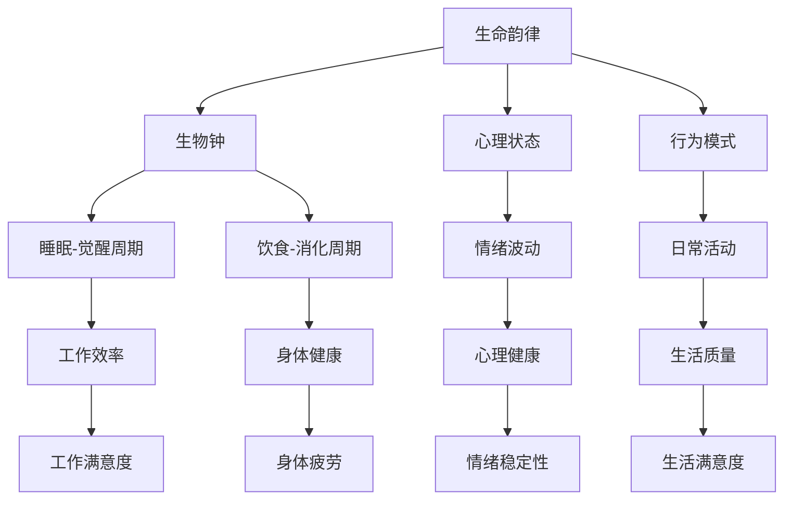

                 


### 文章标题

《生命的韵律：创造个人独特的生活节奏》

### 关键词

生活节奏，个人成长，时间管理，心理健康，生活平衡，生活方式设计

### 摘要

本文深入探讨了如何在现代快节奏的生活中找到并创造适合自己的生活节奏。通过对生命韵律的概念理解、影响生活节奏的因素分析，以及实践中的具体策略和技巧，帮助读者实现生活与工作的平衡，提升个人幸福感。文章结合心理学、时间管理、健康生活方式等多领域知识，提供了一套完整的策略和方法，旨在为读者打造独特而高效的生活节奏。

## 引言

在现代社会的快节奏生活中，人们往往感到时间紧迫，生活压力增大。这种快节奏的生活模式不仅影响了我们的工作效率，还严重威胁着我们的心理健康。为了应对这种挑战，越来越多的人开始关注生活节奏的调整，寻求一种更加和谐、平衡的生活方式。本文旨在探讨如何创造个人独特的生活节奏，从而在快节奏的生活中找到宁静与幸福。

### 生命韵律的概念与重要性

生命韵律，是指一个人在生理、心理和行为上所展现出来的周期性规律。这种韵律受到多种因素的影响，包括生物钟、环境变化、心理状态等。生命韵律对于我们的生活质量具有深远的影响。一个良好的生活节奏能够帮助我们提高工作效率，改善心理健康，提升生活质量。

#### 生命韵律的定义

生命韵律，是指人体在生理、心理和行为上所表现出的周期性规律。这些规律包括睡眠-觉醒周期、饮食-消化周期、情绪波动周期等。生命韵律是人体内部的一种自然节奏，受到生物钟的调控。

#### 生命韵律与生活节奏的关系

生活节奏，是指一个人在日常生活中所遵循的时间安排和活动模式。生活节奏与生命韵律密切相关。一个良好的生活节奏能够与生命韵律保持和谐，从而提升生活质量。反之，不协调的生活节奏可能导致生物钟紊乱，影响身体健康。

#### 生命韵律的重要性

1. **提高工作效率**：良好的生活节奏能够帮助人们更好地分配时间，提高工作效率。
2. **改善心理健康**：保持生命韵律有助于减轻心理压力，提升情绪稳定性。
3. **提升生活质量**：和谐的生活节奏能够为人们带来更多的愉悦和满足感。

### 影响生命韵律的因素

#### 环境因素

环境因素对生命韵律的影响不容忽视。例如，光照、噪音、温度等都会对生物钟产生影响。在现代社会中，由于城市化的进程，人们常常暴露于不规律的光照环境中，这可能导致生物钟紊乱，影响睡眠质量。

#### 个人习惯

个人习惯是影响生命韵律的重要因素。例如，作息不规律、饮食不均衡、缺乏运动等都会对生命韵律产生负面影响。因此，培养良好的个人习惯是调整生活节奏的关键。

#### 社会文化因素

社会文化因素也在一定程度上影响着生命韵律。不同的文化背景和价值观会导致人们在时间管理和生活节奏上的差异。例如，在一些注重家庭的文化中，人们更倾向于保持和谐的生活节奏，而在一些竞争激烈的文化中，人们可能更加追求效率。

### 核心概念与联系：生命韵律的架构图

为了更好地理解生命韵律，我们可以使用Mermaid流程图来展示其核心概念和联系。



这个流程图展示了生命韵律的核心组成部分以及它们之间的相互关系。通过了解这些关系，我们可以更好地理解如何调整生活节奏以实现个人的健康和幸福。

### 核心算法原理讲解：生命韵律调整策略

为了调整生命韵律，我们需要理解其核心算法原理。以下是一个基于时间管理和心理调节的生命韵律调整策略的伪代码。

```python
# 初始化生命韵律调整策略
def adjust_life_rhythm():
    # 确定个人生物钟
    determine_biorhythm()
    # 制定合理的作息计划
    create_diet_plan()
    # 实施时间管理策略
    implement_time_management()
    # 心理调节
    mental_adjustment()
    # 定期评估与调整
    evaluate_and_adjust()

# 确定个人生物钟
def determine_biorhythm():
    # 收集个人生活习惯数据
    data = collect_lifestyle_data()
    # 分析数据，确定生物钟
    biorhythm = analyze_data(data)
    return biorhythm

# 制定合理的作息计划
def create_diet_plan():
    # 根据生物钟，制定作息计划
    schedule = create_schedule(biorhythm)
    return schedule

# 实施时间管理策略
def implement_time_management():
    # 分配时间，确保工作与休息的平衡
    time分配 = distribute_time(schedule)
    return time分配

# 心理调节
def mental_adjustment():
    # 通过冥想、放松等方法，减轻心理压力
    reduce_stress()

# 定期评估与调整
def evaluate_and_adjust():
    # 定期评估生活节奏，进行调整
    evaluate_rhythm()
    adjust_rhythm()
```

这个伪代码展示了如何通过时间管理和心理调节来调整生命韵律。它包括以下步骤：

1. **确定个人生物钟**：通过分析个人生活习惯数据，确定个人的生物钟。
2. **制定合理的作息计划**：根据生物钟，制定合理的作息计划。
3. **实施时间管理策略**：确保工作与休息的平衡，提高工作效率。
4. **心理调节**：通过冥想、放松等方法，减轻心理压力。
5. **定期评估与调整**：定期评估生活节奏，并根据实际情况进行调整。

### 数学模型与公式：生命韵律的数学模型

为了更深入地理解生命韵律，我们可以使用数学模型来描述其变化规律。以下是一个简化的生命韵律数学模型：

$$
L(t) = A \sin(\omega t + \phi) + B
$$

其中：
- \( L(t) \) 表示生命韵律在时间 \( t \) 的值；
- \( A \) 表示韵律振幅；
- \( \omega \) 表示角频率；
- \( \phi \) 表示初始相位；
- \( B \) 表示基准水平。

通过调整这些参数，我们可以模拟不同的生命韵律模式。例如，为了改善睡眠质量，我们可以增加振幅 \( A \)，提高角频率 \( \omega \)，以及调整初始相位 \( \phi \)。

### 举例说明

假设一个职场人士想要改善其睡眠质量，我们可以通过调整生命韵律模型来找到合适的参数设置。以下是一个具体的例子：

1. **确定目标**：改善睡眠质量。
2. **收集数据**：记录一周的睡眠时间、入睡时间和起床时间。
3. **分析数据**：使用统计分析方法，确定最佳睡眠时长和入睡时间。
4. **调整模型参数**：根据分析结果，调整振幅 \( A \)、角频率 \( \omega \) 和初始相位 \( \phi \)。
5. **实施调整**：根据调整后的模型，制定新的作息计划，并实施一段时间。

通过这个例子，我们可以看到如何使用数学模型和公式来调整生命韵律，从而改善生活质量。

### 总结与拓展

本文通过介绍生命韵律的概念、影响因素以及调整策略，帮助读者理解如何在快节奏的生活中创造个人独特的生活节奏。通过使用伪代码和数学模型，我们展示了如何具体实现生命韵律的调整。然而，生命韵律的调整是一个复杂的过程，需要结合个人实际情况进行个性化的调整。因此，读者在实施调整策略时，应充分考虑自身的生活习惯、工作压力和个人偏好。

对于希望进一步深入研究的读者，以下是一些拓展阅读的建议：

1. 《时间管理的艺术》[戴维·艾伦]：提供了全面的关于时间管理的理论和实践方法。
2. 《生物钟：人体健康的秘密时钟》[迈克尔·史密斯]：详细介绍了生物钟的工作原理和对健康的影响。
3. 《冥想与放松》[丽莎·加德纳]：提供了关于冥想和心理调节的实用技巧。

通过学习和实践这些方法，读者可以更好地调整自己的生活节奏，实现身心健康和幸福。

### 作者信息

作者：AI天才研究院/AI Genius Institute & 禅与计算机程序设计艺术 /Zen And The Art of Computer Programming

---

本文通过深入探讨生命韵律的概念、影响因素和调整策略，旨在帮助读者在快节奏的生活中找到并创造个人独特的生活节奏。通过对时间管理和心理调节的理解和实践，读者可以更好地实现生活与工作的平衡，提升个人幸福感。本文结合了心理学、时间管理、健康生活方式等多领域知识，提供了一套完整的策略和方法。希望本文能够为读者带来启发和帮助，共同探索生命的韵律，创造更美好的人生。

