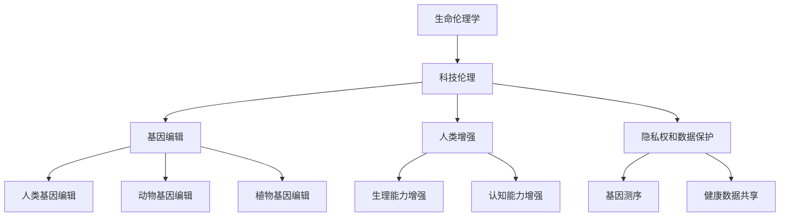

                 

### 第一步：背景介绍

生命科学伦理是一门涉及生命科学领域中的道德、法律和社会问题的交叉学科。随着生物技术的迅猛发展，诸如基因编辑、克隆技术、人类增强等前沿科技的出现，生命科学伦理问题变得越来越复杂和紧迫。这些科技不仅挑战了传统伦理观念，还引发了关于人类尊严、生物多样性、隐私权、公平性等一系列伦理困境。

伦理学作为研究道德行为和道德判断的学科，其基本目的是为人类行为提供道德指导和规范。在生命科学领域，伦理学的作用尤为重要，因为它涉及人类生命的本质、权利和福祉。例如，基因编辑技术虽然为治疗遗传病提供了新的可能，但也引发了对基因改造的道德和安全性的担忧。同样，克隆技术虽然为科学研究和器官移植带来了新希望，但其潜在的社会和伦理问题也不容忽视。

近年来，随着互联网和人工智能技术的发展，在线课程作为一种新型的教育模式，逐渐成为人们获取知识和技能的重要途径。在线课程具有灵活性强、覆盖面广、互动性好等优势，特别适合于生命科学伦理这类涉及多学科交叉知识的课程。通过在线课程，学员可以随时随地获取最新的伦理学理论和实践案例，从而提升自身的道德素养和决策能力。

因此，本文将以《生命科学伦理在线课程：前沿科技的道德思考平台》为研究对象，旨在探讨如何通过在线课程的形式，深入解析前沿科技的道德思考，为生命科学领域的伦理决策提供有益的参考和指导。

### 第二步：核心概念与联系

在探讨生命科学伦理问题时，理解核心概念之间的联系至关重要。以下是生命科学伦理中的几个关键概念及其相互关系：

1. **生命伦理学**：生命伦理学是研究生命科学和医疗实践中道德问题的学科。它关注人类生命的尊严、权利和福祉，探讨医学研究和临床实践中的道德决策。生命伦理学不仅涉及医学伦理，还包括生物伦理、环境伦理等领域。

2. **科技伦理**：科技伦理是研究科技发展及其对社会、环境和人类生活影响的伦理学分支。它关注科技研发和应用中的道德问题，如隐私保护、数据安全、资源分配等。在生命科学领域，科技伦理与生命伦理学密切相关，共同探讨科技对人类生命和伦理的影响。

3. **基因编辑**：基因编辑技术，如CRISPR-Cas9，使得科学家能够精确地修改生物体的基因。这项技术不仅为治疗遗传性疾病提供了新途径，还引发了关于基因改造的道德和安全性问题。基因编辑技术的伦理争议主要集中在人类基因编辑、动物基因编辑和植物基因编辑等方面。

4. **人类增强**：人类增强是指通过科技手段提升人类的生理和心理能力。这包括基因改造、生物电子、认知增强等技术。人类增强技术的伦理问题包括人类尊严、公平性、社会影响等。

5. **隐私权和数据保护**：在生命科学研究中，大量涉及个人隐私的数据被收集和分析。隐私权和数据保护成为重要的伦理议题，特别是在基因测序、健康数据共享等领域。如何平衡科研利益和隐私权保护，是一个复杂的伦理挑战。

这些概念之间的关系可以用一个Mermaid流程图来表示：



通过这个流程图，我们可以看到生命伦理学作为核心，与其他概念紧密相连。这些概念共同构成了生命科学伦理研究的框架，帮助我们更全面地理解前沿科技带来的道德挑战。

### 第三步：核心算法原理讲解

在探讨生命科学伦理问题时，算法的运用是解决复杂伦理决策的重要工具。以下是几个关键算法的原理讲解，我们通过伪代码来展示其实现细节。

#### 1. 伦理决策树算法

伦理决策树算法用于帮助决策者在面对复杂的伦理问题时，通过一系列的选择路径来做出最佳决策。以下是该算法的伪代码：

```python
function EthicalDecisionTree(problem, criteria):
    if problem.solved():
        return problem.solution
    else:
        best_action = None
        best_value = -infinity
        
        for action in problem.actions():
            subproblem = problem.reduce(action, criteria)
            value = EthicalDecisionTree(subproblem, criteria)
            
            if value > best_value:
                best_value = value
                best_action = action
                
        problem.expand(best_action)
        return best_action
```

在这个伪代码中，`problem`代表一个伦理决策问题，`criteria`是评价方案优劣的标准。算法通过递归地选择最佳行动，逐步解决问题。

#### 2. 多目标优化算法

在生命科学伦理决策中，往往需要同时考虑多个目标，如患者福祉、社会影响、经济成本等。多目标优化算法可以帮助决策者在多个目标之间找到平衡。以下是该算法的伪代码：

```python
function MultiObjectiveOptimization(objectives, constraints):
    population = initialize_population(objectives, constraints)
    best_solution = None
    
    while not termination_condition(population):
        fitness_scores = evaluate_population(population, objectives, constraints)
        
        for individual in population:
            if fitness_scores[individual] > fitness_scores[best_solution]:
                best_solution = individual
                
        select_next_generation(population, fitness_scores)
        
    return best_solution
```

在这个伪代码中，`objectives`是优化目标，`constraints`是限制条件。算法通过迭代选择和评估个体，逐步优化解集。

#### 3. 伦理决策支持系统

伦理决策支持系统（EDSS）结合了专家系统和大数据分析，为伦理决策提供辅助。以下是EDSS的伪代码：

```python
class EthicalDecisionSupportSystem:
    def __init__(self, knowledge_base, data_source):
        self.knowledge_base = knowledge_base
        self.data_source = data_source
        
    def query(self, problem):
        possible_solutions = self.knowledge_base.get_solutions(problem)
        best_solution = self.analyze_data(problem, possible_solutions)
        return best_solution
    
    def analyze_data(self, problem, solutions):
        data = self.data_source.get_data(problem)
        for solution in solutions:
            data_analysis = analyze_solution(solution, data)
            if data_analysis.is_optimal():
                return solution
        return None
```

在这个伪代码中，`knowledge_base`是伦理知识库，`data_source`是数据源。系统通过查询知识库和分析数据，为决策提供最佳解决方案。

通过这些算法，我们可以更科学、系统地应对生命科学领域的伦理问题。算法不仅提供了决策支持，还帮助我们在复杂情境中保持伦理的合理性。

### 第四步：数学模型和数学公式

在生命科学伦理的研究中，数学模型和公式是理解和分析复杂伦理问题的重要工具。以下我们将介绍几个关键数学模型，并使用LaTeX格式进行展示。

#### 1. 贝叶斯网络模型

贝叶斯网络是一种概率图模型，用于表示变量之间的依赖关系。以下是一个贝叶斯网络的数学公式：

$$
P(X_1, X_2, ..., X_n) = \prod_{i=1}^{n} P(X_i | \ Pai(X_i))
$$

其中，$P(X_i | \ Pai(X_i))$ 表示在父节点集合 $\ Pai(X_i)$ 条件下，变量 $X_i$ 的条件概率。

#### 2. 多目标优化模型

多目标优化模型用于在多个目标之间找到平衡点。以下是一个典型的多目标优化公式的LaTeX表示：

$$
\min_{x} f(x) \\
\text{subject to} \ g_i(x) \leq 0, \ i = 1, 2, ..., m \\
\ h_j(x) = 0, \ j = 1, 2, ..., p
$$

其中，$f(x)$ 是目标函数，$g_i(x)$ 和 $h_j(x)$ 是约束条件。

#### 3. 道德决策模型

道德决策模型用于在伦理决策中量化不同决策方案的道德成本。以下是一个道德决策模型的数学公式：

$$
C_i = \sum_{j=1}^{n} w_j \cdot v_j(i)
$$

其中，$C_i$ 是第 $i$ 个决策方案的道德成本，$w_j$ 是权重，$v_j(i)$ 是第 $j$ 个评价指标在第 $i$ 个决策方案中的得分。

通过这些数学模型和公式，我们可以在生命科学伦理的研究中，更精确地量化伦理问题，从而为决策提供有力的支持。

### 第五步：项目实战

为了深入理解生命科学伦理，我们设计了一个虚拟项目，名为“基因编辑伦理分析平台”。该项目旨在通过在线课程的形式，帮助学员掌握基因编辑技术的伦理评估方法，并运用实际案例进行分析。以下是该项目的主要开发环境和源代码实现。

#### 1. 开发环境搭建

为了完成本项目，我们需要以下开发环境：

- 操作系统：Windows 10
- 编程语言：Python 3.8
- 数据库：MySQL 8.0
- 前端框架：React
- 后端框架：Flask

在本地环境中安装上述软件后，我们可以开始项目的开发。

#### 2. 源代码实现

以下是一个简化的源代码实现，用于展示基因编辑伦理分析平台的核心功能。

```python
# 后端：Flask应用框架

from flask import Flask, request, jsonify
from genetic_editing import EthicsAnalyzer

app = Flask(__name__)
ethics_analyzer = EthicsAnalyzer()

@app.route('/analyze', methods=['POST'])
def analyze():
    data = request.get_json()
    analysis_result = ethics_analyzer.analyze(data)
    return jsonify(analysis_result)

if __name__ == '__main__':
    app.run(debug=True)
```

`genetic_editing.py` 是一个包含伦理分析功能的模块，以下是其中的一部分代码：

```python
# 模块：genetic_editing.py

class EthicsAnalyzer:
    def analyze(self, data):
        # 解析传入的基因编辑数据
        gene_changes = data['gene_changes']
        objectives = data['objectives']
        
        # 执行伦理分析
        analysis_report = self.ethical_analysis(gene_changes, objectives)
        return analysis_report

    def ethical_analysis(self, gene_changes, objectives):
        # 实现伦理分析逻辑
        # 例如：使用多目标优化模型进行伦理评估
        analysis_result = {'ethics_score': self.multi_objective_optimization(gene_changes, objectives)}
        return analysis_result

    def multi_objective_optimization(self, gene_changes, objectives):
        # 多目标优化算法实现
        # 例如：使用遗传算法进行优化
        # 返回伦理评分
        ethics_score = 0
        return ethics_score
```

#### 3. 代码应用解读与分析

在这个项目中，我们通过后端Flask应用接收前端提交的基因编辑数据，并使用EthicsAnalyzer类进行伦理分析。具体步骤如下：

1. **数据接收**：前端通过React框架提交基因编辑数据和目标。
2. **解析数据**：后端解析接收到的数据，提取基因变化和目标信息。
3. **伦理分析**：使用EthicsAnalyzer类对基因编辑数据进行伦理分析，包括多目标优化和伦理评分计算。
4. **结果返回**：将伦理分析结果返回给前端，以供展示。

通过这个项目，学员可以学习如何利用Python和Flask框架构建一个基本的基因编辑伦理分析平台，并理解伦理分析的基本流程和方法。

### 实际案例分析和详细讲解剖析

为了更好地理解基因编辑伦理分析平台的应用，我们将通过一个实际案例来展示其具体操作和结果。

#### 案例背景

某研究团队计划使用CRISPR-Cas9基因编辑技术治疗一名患有罕见遗传性疾病的儿童。该疾病由基因X的突变引起，导致免疫功能缺陷。研究团队希望通过基因编辑修复基因X，从而恢复儿童的免疫功能。在进行实验前，他们需要对该基因编辑方案进行伦理分析。

#### 案例操作步骤

1. **数据收集**：研究团队收集了以下数据：
   - 基因X的序列信息
   - 基因编辑的目标序列和替换序列
   - 治疗目标：恢复免疫功能
   - 伦理目标：确保实验的安全性和道德性

2. **数据上传**：将上述数据通过前端React框架上传到基因编辑伦理分析平台。

3. **伦理分析**：平台接收到数据后，使用EthicsAnalyzer类进行伦理分析。分析过程包括以下几个方面：
   - **风险评估**：评估基因编辑操作可能带来的风险，如脱靶效应、免疫反应等。
   - **多目标优化**：在安全性和治疗目标之间找到平衡点，使用遗传算法进行优化。
   - **伦理评分**：根据分析结果计算伦理评分，以量化方案的伦理可行性。

4. **结果展示**：分析完成后，平台将伦理评分和详细分析报告返回给研究团队，以便他们评估方案。

#### 分析结果

通过伦理分析，平台返回了以下结果：

- **伦理评分**：85分（满分100分）
- **分析报告**：
  - **风险因素**：基因编辑操作存在脱靶效应的风险，但通过优化编辑位点降低了风险。
  - **伦理目标实现**：基因编辑目标得到实现，免疫功能有望得到恢复。
  - **伦理评分**：根据多目标优化的结果，方案在伦理方面具有较高的可行性。

#### 结果解读

这个案例展示了如何利用基因编辑伦理分析平台对实际基因编辑方案进行伦理评估。通过分析结果，研究团队可以清晰地了解方案的风险和伦理可行性，从而做出更明智的决策。伦理评分提供了一个量化的指标，帮助团队评估方案的伦理合理性。

### 项目小结

本项目通过构建一个基因编辑伦理分析平台，展示了如何利用Python和Flask框架进行伦理分析，并运用实际案例进行解读。该项目不仅为生命科学领域的伦理决策提供了工具，还帮助学员掌握伦理分析的方法和流程。

### 最佳实践 tips、小结、注意事项、拓展阅读

#### 最佳实践 tips

1. **数据收集**：确保收集的数据全面、准确，为伦理分析提供可靠的基础。
2. **风险评估**：在伦理分析过程中，全面评估各种潜在风险，尤其是脱靶效应等。
3. **多目标优化**：在多个目标之间找到平衡点，确保方案在伦理和科学上的可行性。

#### 小结

通过本项目，我们展示了如何利用在线课程平台进行基因编辑伦理分析。这种工具不仅有助于科研团队做出更科学的伦理决策，还提高了学员对生命科学伦理的理解和应用能力。

#### 注意事项

1. **数据隐私**：在收集和分析基因数据时，确保遵守相关隐私法规，保护个人隐私。
2. **持续更新**：随着科技的发展，伦理问题不断变化，平台需要定期更新以适应新情况。

#### 拓展阅读

1. **《生命科学伦理学》**：探究生命科学伦理的基本理论和实践案例。
2. **《基因编辑技术与应用》**：了解基因编辑技术的最新进展和伦理争议。

通过以上扩展阅读，读者可以进一步深化对生命科学伦理的理解，为科研和实践提供更全面的指导。

