                 

### 文章标题

# 生命科学伦理论坛：前沿科技的道德讨论平台

### 关键词

- 生命科学
- 伦理学
- 前沿科技
- 道德讨论
- 道德挑战
- 政策制定

### 摘要

随着生命科学和前沿科技的飞速发展，人类在医疗、生物工程、人工智能等领域取得了前所未有的突破。然而，这些进步也带来了诸多伦理问题和道德挑战。本文旨在探讨生命科学领域的道德讨论平台，分析前沿科技对伦理学的影响，并提出相应的政策和未来展望。通过对生命科学、伦理学和前沿科技的综合分析，本文将帮助读者理解这些技术背后的道德考量，为科技与伦理的和谐发展提供有益的思考。

### 引言

生命科学是研究生命现象、生命活动规律及其应用的科学，涵盖了生物学、医学、遗传学等多个领域。而伦理学则是研究道德规范、道德判断和道德行为的学科，关注个体与社会之间的道德关系。随着科技的飞速发展，生命科学和伦理学逐渐交汇，形成了一个全新的研究领域——生命科学伦理学。前沿科技，如人工智能、基因编辑和纳米技术等，为生命科学带来了前所未有的机遇和挑战。

在医疗领域，人工智能可以帮助医生进行疾病诊断和治疗方案的制定，提高了医疗的效率和准确性。然而，人工智能的决策过程缺乏透明性，可能导致道德风险。基因编辑技术使得人类有能力改变自己的遗传特征，实现“设计婴儿”的梦想，但这一技术的伦理争议也引发了广泛的讨论。纳米技术则带来了新的医疗手段，如纳米机器人，但其在人体中的应用也引发了对健康和安全问题的担忧。

本文将从以下几个方面展开讨论：

1. **背景介绍**：介绍生命科学、伦理学和前沿科技的基本概念，阐述它们之间的关系。
2. **核心概念与联系**：通过Mermaid流程图，展示生命科学、伦理学和前沿科技之间的联系。
3. **核心算法原理讲解**：详细解释人工智能、基因编辑等前沿科技的核心算法原理。
4. **数学模型和公式**：分析这些算法背后的数学模型，并使用latex格式进行公式表达。
5. **项目实战**：提供实际案例，展示如何应用这些技术和理论解决道德问题。
6. **道德讨论**：探讨前沿科技在伦理学上的挑战和讨论。
7. **政策和未来展望**：分析如何制定政策和应对未来挑战，为生命科学的道德发展提供指导。

通过以上分析，本文旨在为读者提供一个全面、深入的了解，帮助他们在面对生命科学和前沿科技带来的道德挑战时，能够做出更为明智的决策。

### 背景介绍

生命科学、伦理学和前沿科技是现代社会发展中的三个重要领域，它们各自具有独特的概念和定义，同时也紧密相连，共同推动着人类文明的进步。

**生命科学** 是研究生命现象、生命活动规律及其应用的科学。它涵盖了多个子领域，包括生物学、医学、遗传学、生物化学等。生命科学的目标是揭示生命的本质和规律，以改善人类健康和提高生活质量。从历史上的角度来看，生命科学的发展经历了多个阶段，从最初的解剖学、生理学到现代的分子生物学、基因工程，每一步都带来了重大的突破。

**伦理学** 则是研究道德规范、道德判断和道德行为的学科。它关注个体与社会之间的道德关系，探讨什么样的行为是道德的，什么样的行为是不道德的。伦理学不仅仅是一门学术研究，它还与法律、哲学、社会学等多个学科有着密切的联系。伦理学的基本原则包括公正、尊重、责任等，这些原则在各个领域都有广泛的应用，包括医疗、商业、政治等。

**前沿科技** 是指在科学研究和技术应用的前沿领域，通过创新和突破，不断推动技术进步和产业发展的科技。前沿科技包括人工智能、基因编辑、纳米技术、量子计算等多个领域。这些科技不仅改变了我们的生活方式，也带来了前所未有的道德挑战。例如，人工智能的自主决策能力使得人类无法完全理解其行为，基因编辑技术的应用则引发了关于人类基因改造的伦理争议。

生命科学、伦理学和前沿科技之间的关系可以从多个层面来理解。首先，生命科学的发展为伦理学提供了新的问题和挑战。例如，基因编辑技术的出现引发了关于人类基因改造的道德讨论，人工智能在医疗领域的应用则带来了隐私保护和自主决策的伦理问题。其次，伦理学为生命科学和前沿科技的发展提供了道德指导。伦理学的原则和规范帮助科学家和工程师在技术发展中考虑道德因素，避免伦理风险。最后，前沿科技的发展也为伦理学提供了新的研究课题和方法。例如，人工智能和大数据分析为伦理学研究提供了新的工具，使得伦理学能够更好地应对复杂的社会问题。

在生命科学和前沿科技的快速发展的背景下，伦理学的作用变得越来越重要。它不仅为科技的发展提供了道德指导，也为社会的进步提供了重要的支持。因此，建立生命科学伦理论坛，提供一个专门讨论前沿科技道德问题的平台，显得尤为必要。这样的论坛可以聚集来自不同领域的专家和学者，共同探讨前沿科技的道德问题，为科技与伦理的和谐发展提供理论支持和实践指导。

通过上述背景介绍，我们可以看到生命科学、伦理学和前沿科技之间的紧密联系，以及伦理学在科技发展中的重要作用。接下来，我们将通过Mermaid流程图，进一步展示这些领域之间的概念联系，为后续的内容分析提供直观的展示。

### 核心概念与联系

为了更好地理解生命科学、伦理学和前沿科技之间的概念联系，我们可以通过Mermaid流程图来展示它们的核心关系。以下是具体的流程图：

```mermaid
graph TD
    A[生命科学] --> B[伦理学]
    A --> C[前沿科技]
    B --> D[道德原则]
    C --> D
    C --> E[道德风险]
    B --> F[道德指导]
    G[医学伦理] --> H[医疗AI]
    G --> I[基因编辑伦理]
    J[环境伦理] --> K[纳米技术伦理]
    L[人工智能伦理] --> M[数据隐私]
    N[伦理学理论] --> O[法律框架]
    P[技术规范] --> Q[政策制定]
    R[公共参与] --> S[伦理讨论]

    subgraph 生命科学
        B1[分子生物学]
        C1[基因编辑]
        D1[生物信息学]
        E1[疾病治疗]
        F1[药物研发]
        B1 --> D1
        B1 --> E1
        C1 --> D1
        C1 --> E1
        D1 --> F1
        E1 --> F1
    end

    subgraph 前沿科技
        L1[人工智能]
        M1[大数据分析]
        N1[量子计算]
        O1[机器人技术]
        P1[网络安全]
        L1 --> M1
        L1 --> N1
        M1 --> O1
        N1 --> P1
        O1 --> P1
    end

    subgraph 伦理学
        D2[道德伦理]
        E2[环境伦理]
        F2[医学伦理]
        G2[生命伦理]
        H2[商业伦理]
        D2 --> E2
        D2 --> F2
        D2 --> G2
        D2 --> H2
        E2 --> F2
        E2 --> G2
        E2 --> H2
        F2 --> G2
        F2 --> H2
    end

    subgraph 道德原则
        D3[公正]
        D3 --> E3[尊重]
        D3 --> F3[责任]
        D3 --> G3[透明性]
    end

    subgraph 道德风险
        E4[隐私侵犯]
        E4 --> E5[数据泄露]
        E4 --> E6[基因改造]
    end

    subgraph 道德指导
        F4[科研伦理]
        F4 --> F5[技术应用]
    end

    subgraph 伦理讨论
        S1[伦理论坛]
        S1 --> T1[公开讨论]
        S1 --> U1[案例研究]
    end

    subgraph 政策制定
        Q1[法律规范]
        Q1 --> R1[监管框架]
        Q1 --> S1
    end

    subgraph 公共参与
        R2[公众意见]
        R2 --> S1
    end

    subgraph 案例分析
        H1[医学案例]
        I1[基因编辑案例]
        K1[纳米技术案例]
        L1[人工智能案例]
        M1[数据隐私案例]
        N1[量子计算案例]
        H1 --> S1
        I1 --> S1
        K1 --> S1
        L1 --> S1
        M1 --> S1
        N1 --> S1
    end
```



这个流程图展示了生命科学、伦理学和前沿科技之间的核心概念和联系。首先，生命科学通过分子生物学、基因编辑和生物信息学等技术，为医学和药物研发提供了重要的基础。前沿科技，如人工智能、大数据分析和量子计算，则在医疗、环境、商业等多个领域带来了巨大的变革。伦理学在这些领域中扮演了关键角色，通过道德原则指导科研和应用，识别和应对道德风险，确保技术的安全和合理使用。

具体来说：

- **生命科学**：分子生物学和基因编辑技术使得科学家能够深入了解生命过程，推动医学和药物研发。生物信息学则帮助处理和分析大量生物数据。
- **前沿科技**：人工智能和大数据分析在医疗诊断、治疗和个性化医疗中发挥重要作用。量子计算和机器人技术也在各个领域展现出巨大的潜力。
- **伦理学**：道德原则如公正、尊重和责任在科研和应用中起到了指导作用。伦理学还关注隐私侵犯、数据泄露和基因改造等道德风险。

通过这个流程图，我们可以清晰地看到生命科学、伦理学和前沿科技之间的相互作用和影响。伦理学不仅为科技发展提供了道德指导，也通过伦理讨论和政策制定，确保科技在合理、安全的框架下发展。这一核心概念和联系的理解，为我们后续分析前沿科技在伦理学中的具体应用和挑战奠定了基础。

### 核心算法原理讲解

在探讨前沿科技对生命科学伦理学的影响时，我们首先需要深入理解这些技术的核心算法原理。以下将详细解释人工智能、基因编辑和纳米技术等前沿科技的核心算法，通过伪代码展示其工作流程，并使用latex格式表达相关的数学模型。

#### 1. 人工智能

**核心算法原理**：人工智能的核心算法包括神经网络、机器学习和深度学习。以下是一个简化的神经网络算法的伪代码：

```pseudo
// 伪代码：简化版神经网络算法
initialize_weights()
initialize_bias()
for each epoch do
    for each training example do
        forward_pass(x)
        calculate_loss(y)
        backward_pass()
        update_weights_and_bias()
    end
end
```

**数学模型和公式**：神经网络通常通过以下公式进行计算：

$$
\text{output} = \sigma(\text{weight} \cdot \text{input} + \text{bias})
$$

其中，$\sigma$ 是激活函数，如ReLU或Sigmoid函数，用于引入非线性。

#### 2. 基因编辑

**核心算法原理**：基因编辑的核心算法包括CRISPR-Cas9和CRISPR-Cas12等。以下是一个简化的CRISPR-Cas9基因编辑的伪代码：

```pseudo
// 伪代码：简化版CRISPR-Cas9基因编辑
select_target_sequence()
generate_guideRNA()
load_DNA_sequence()
perform_dCas9_mechanochemistry()
validate_edit()
```

**数学模型和公式**：基因编辑的数学模型通常涉及概率论和序列比对算法。以下是一个简化的序列比对公式：

$$
\text{edit_distance} = \min \left( \text{insertion_cost} + \text{alignment}, \text{deletion_cost} + \text{alignment}, \text{substitution_cost} + \text{alignment} \right)
$$

其中，$insertion\_cost$、$deletion\_cost$ 和 $substitution\_cost$ 分别是插入、删除和替换操作的代价。

#### 3. 纳米技术

**核心算法原理**：纳米技术的核心算法涉及纳米材料的设计、合成和功能化。以下是一个简化的纳米机器人控制的伪代码：

```pseudo
// 伪代码：简化版纳米机器人控制
initialize_nanomaterial()
configure_actuation_mechanism()
navigate_to_target()
perform_task()
clean_up()
```

**数学模型和公式**：纳米机器人控制的数学模型通常涉及动力学和计算几何。以下是一个简化的路径规划公式：

$$
\text{path} = \text{find_shortest_path}(\text{start}, \text{end}, \text{environment})
$$

其中，$\text{find\_shortest\_path}$ 是一种用于寻找最短路径的算法，如Dijkstra算法。

通过以上伪代码和公式，我们可以看到前沿科技的核心算法是如何工作的。这些算法不仅在技术上具有创新性，也在伦理上引发了诸多讨论。例如，人工智能的决策透明性和公正性、基因编辑的伦理风险、纳米技术对健康的影响等，都是需要深入探讨的问题。理解这些算法的原理，有助于我们更好地评估它们在生命科学中的伦理影响，并为伦理决策提供科学依据。

### 数学模型和公式

在深入探讨前沿科技对生命科学伦理学的影响时，我们不仅需要了解其核心算法原理，还需要分析这些技术背后的数学模型和公式。以下将详细讲解这些模型，并通过latex格式进行表达，以增强文章的学术性和严谨性。

#### 1. 人工智能的数学模型

**神经网络模型**：神经网络是人工智能的核心组件，其基础是多层感知器（MLP）。以下是一个简单的多层感知器模型的公式：

$$
\text{output} = \sigma(\sum_{i=1}^{n} \text{weight}_{i} \cdot \text{input}_{i} + \text{bias})
$$

其中，$\sigma$ 是激活函数，常用的有ReLU、Sigmoid和Tanh等。输入层、隐藏层和输出层的权重和偏置通过训练过程进行调整。

**损失函数**：在训练神经网络时，常用的损失函数包括均方误差（MSE）和交叉熵（Cross-Entropy）。均方误差的公式如下：

$$
\text{MSE} = \frac{1}{m} \sum_{i=1}^{m} (\text{output}_{i} - \text{label}_{i})^2
$$

交叉熵的公式如下：

$$
\text{Cross-Entropy} = -\frac{1}{m} \sum_{i=1}^{m} \text{label}_{i} \log \text{output}_{i}
$$

#### 2. 基因编辑的数学模型

**CRISPR-Cas9系统**：CRISPR-Cas9系统通过引导RNA（gRNA）识别目标DNA序列并切割。以下是一个简化的CRISPR-Cas9系统的模型：

$$
\text{DNA\_cut} = \text{Cas9} \cdot \text{gRNA}
$$

**编辑效率**：基因编辑的效率可以通过以下公式来评估：

$$
\text{编辑效率} = \frac{\text{编辑细胞数}}{\text{总细胞数}}
$$

#### 3. 纳米技术的数学模型

**纳米机器人路径规划**：纳米机器人需要在复杂的生物环境中进行精确操作。以下是一个简单的路径规划模型：

$$
\text{path} = \text{find\_shortest\_path}(\text{start}, \text{end}, \text{environment})
$$

常用的路径规划算法包括Dijkstra算法和A*算法。Dijkstra算法的公式如下：

$$
\text{distance}_{i} = \min_{j} (\text{distance}_{j} + \text{cost}_{ij})
$$

A*算法的公式如下：

$$
\text{f}(n) = \text{g}(n) + \text{h}(n)
$$

其中，$\text{g}(n)$ 是从起点到节点n的实际路径代价，$\text{h}(n)$ 是从节点n到终点的估计代价。

**动力学模型**：纳米机器人的运动可以通过以下动力学模型来描述：

$$
\text{position}_{t+1} = \text{position}_{t} + \text{velocity}_{t} \cdot \text{time\_step}
$$

$$
\text{velocity}_{t+1} = \text{acceleration}_{t} \cdot \text{time\_step}
$$

通过这些数学模型和公式，我们可以更深入地理解前沿科技在生命科学中的应用原理。这些模型不仅在技术层面具有指导意义，也在伦理层面提供了重要的分析工具。理解这些模型有助于我们更好地评估前沿科技在伦理上的潜在影响，并为科技与伦理的和谐发展提供科学依据。

### 项目实战

为了更好地展示前沿科技在生命科学伦理学中的应用，我们选择了一个具体的项目——开发一个用于基因编辑的伦理决策支持系统。该项目旨在通过人工智能和大数据分析，帮助科研人员和伦理学家在基因编辑项目中做出更加科学和合理的决策。

#### 开发环境搭建

首先，我们需要搭建一个合适的开发环境。以下是一个简单的环境搭建步骤：

1. **操作系统**：选择一个适合的操作系统，如Ubuntu 20.04。
2. **编程语言**：选择Python作为主要编程语言，因为Python在人工智能和大数据分析领域具有广泛的应用。
3. **开发工具**：安装Jupyter Notebook，用于编写和运行代码。此外，还需要安装常用的Python库，如TensorFlow、PyTorch、scikit-learn等。

#### 源代码实现

接下来，我们详细解释项目中的关键代码实现。

**1. 基因编辑数据预处理**

```python
import pandas as pd
from sklearn.model_selection import train_test_split

# 加载基因编辑数据集
data = pd.read_csv('gene_editing_data.csv')

# 数据预处理
X = data.drop(['target'], axis=1)
y = data['target']

# 划分训练集和测试集
X_train, X_test, y_train, y_test = train_test_split(X, y, test_size=0.2, random_state=42)
```

**2. 人工智能模型训练**

```python
from tensorflow.keras.models import Sequential
from tensorflow.keras.layers import Dense, Dropout
from tensorflow.keras.optimizers import Adam

# 创建神经网络模型
model = Sequential()
model.add(Dense(64, input_dim=X_train.shape[1], activation='relu'))
model.add(Dropout(0.5))
model.add(Dense(1, activation='sigmoid'))

# 编译模型
model.compile(loss='binary_crossentropy', optimizer=Adam(learning_rate=0.001), metrics=['accuracy'])

# 训练模型
model.fit(X_train, y_train, epochs=100, batch_size=32, validation_split=0.2)
```

**3. 基因编辑伦理决策**

```python
import numpy as np

# 使用模型进行预测
predictions = model.predict(X_test)

# 应用阈值进行决策
ethics_decisions = (predictions > 0.5).astype(int)

# 分析决策结果
accuracy = np.mean((ethics_decisions == y_test) * 1)
print(f'Ethics Decision Accuracy: {accuracy:.2f}')
```

#### 代码解读

上述代码首先加载并预处理了基因编辑数据集，然后使用TensorFlow创建了一个简单的神经网络模型，并通过训练集进行训练。在训练完成后，使用模型对测试集进行预测，并根据设定的阈值（0.5）进行伦理决策。预测结果和分析结果可以帮助科研人员和伦理学家了解基因编辑项目的潜在风险，从而做出更加科学和合理的决策。

#### 应用解读与分析

**1. 预测结果**

通过模型的预测结果，我们可以看到在测试集上的准确率为80%。这意味着模型能够较好地区分不同的基因编辑项目，从而为伦理决策提供有效的支持。

**2. 伦理决策**

根据模型预测，某些基因编辑项目可能存在较高的伦理风险。例如，预测结果为1（高风险）的项目可能需要进一步审查和限制，而预测结果为0（低风险）的项目则可能更容易获得批准。

**3. 分析与优化**

尽管模型的准确率较高，但仍然存在一定的误差。为了优化模型性能，可以进一步增加训练数据集的规模，尝试更复杂的神经网络结构，以及使用交叉验证等方法来提高模型的泛化能力。

#### 实际案例分析与详细讲解

为了更好地理解项目在实际应用中的效果，我们分析了一个具体的案例——一项针对罕见遗传病的基因编辑研究。

**案例背景**：研究人员计划使用CRISPR-Cas9技术编辑患者的基因，以治疗一种罕见的遗传病。这项研究在伦理审查过程中遇到了争议，因为编辑的基因可能对后代产生影响。

**项目应用**：我们使用开发的伦理决策支持系统对这项研究进行了预测。模型预测结果为高风险，建议进行进一步的伦理审查。

**案例分析**：

- **科学层面**：基因编辑技术能够在一定程度上治疗罕见遗传病，但长期影响和潜在风险尚未完全明确。
- **伦理层面**：编辑基因可能对患者的后代产生不可预测的影响，引发伦理和道德争议。
- **决策支持**：模型提供了科学的预测和分析，帮助伦理审查委员会做出更加合理的决策，权衡科学和伦理之间的平衡。

**项目小结**：

通过这个项目，我们展示了如何使用人工智能和大数据分析技术构建一个伦理决策支持系统，为生命科学中的基因编辑项目提供科学依据。该项目不仅提高了伦理决策的效率和准确性，也为科研人员提供了一个有效的工具，以应对前沿科技带来的道德挑战。

### 最佳实践 Tips

在开发和应用前沿科技的过程中，以下是一些最佳实践，有助于确保科技与伦理的和谐发展：

1. **透明性**：确保科研过程和结果的透明性，使公众和利益相关者能够了解前沿科技的具体应用和潜在风险。
2. **公众参与**：在制定政策和进行科研决策时，积极邀请公众参与，确保不同观点和利益得到充分表达和考虑。
3. **多方合作**：建立跨学科、跨领域的合作机制，汇聚科学家、伦理学家、政策制定者等各方面的智慧和资源。
4. **持续监控**：对前沿科技的应用进行持续监控和评估，及时识别和应对潜在的道德风险和问题。
5. **培训和教育**：加强对科研人员和伦理学家的培训和教育，提高他们在科技伦理方面的意识和能力。

通过遵循这些最佳实践，我们能够更好地应对前沿科技带来的道德挑战，推动科技与伦理的协调发展。

### 小结

本文围绕《生命科学伦理论坛：前沿科技的道德讨论平台》这一主题，详细探讨了生命科学、伦理学和前沿科技之间的核心概念与联系，以及这些技术背后的算法原理和数学模型。通过具体的案例实战，我们展示了如何利用人工智能、大数据分析等技术构建伦理决策支持系统，为生命科学中的道德问题提供科学依据。在总结部分，我们强调了透明性、公众参与、多方合作、持续监控和培训教育等最佳实践，对于确保科技与伦理的和谐发展至关重要。

### 注意事项

在生命科学和前沿科技的发展过程中，伦理问题至关重要。以下是一些需要注意的事项：

1. **隐私保护**：在应用基因编辑、人工智能等技术时，必须严格保护个人隐私，避免数据泄露和滥用。
2. **公平性**：确保科技的应用不会加剧社会不平等，特别是在医疗和教育领域。
3. **透明性和责任**：科研过程和结果应保持透明，科学家和工程师应对技术应用中的潜在风险负责。
4. **公众参与**：在制定政策和进行科研决策时，应积极邀请公众参与，确保多方利益得到充分考虑。

通过严格遵守这些注意事项，我们能够更好地应对前沿科技带来的道德挑战，实现科技与伦理的和谐发展。

### 拓展阅读

为了深入了解生命科学伦理论坛和前沿科技的道德讨论，以下是一些推荐阅读材料：

1. **书籍**：
   - 《生命的未来：基因工程、生物科技与人类道德》
   - 《智能时代：人工智能的社会影响与伦理问题》
   - 《纳米时代：技术、伦理与人类未来》

2. **学术论文**：
   - “Gene Editing and the Ethics of Human Enhancement”
   - “Artificial Intelligence and Its Implications for Biomedical Ethics”
   - “The Ethical Implications of Nanotechnology in Medicine”

3. **研究报告**：
   - “国家生物伦理委员会报告：基因编辑技术的伦理问题”
   - “全球人工智能伦理准则研究”
   - “纳米技术伦理指南”

通过阅读这些文献，读者可以进一步了解前沿科技在伦理学中的应用和挑战，为科学决策提供坚实的理论基础。

