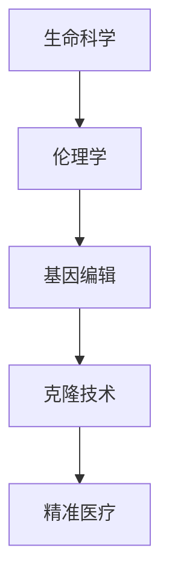

                 

<sop>
让我们一步步思考并构建这篇文章。

### **文章标题**：**《生命科学伦理辩论赛组织：前沿科技的道德讨论平台搭建》**

### **文章关键词**：
- 生命科学伦理
- 辩论赛
- 前沿科技
- 道德讨论
- 平台搭建

### **文章摘要**：
本文将探讨生命科学伦理辩论赛的背景、组织结构和流程，以及如何搭建一个前沿科技的道德讨论平台。文章通过详细分析生命科学伦理的核心概念，结合前沿科技的挑战和讨论，提供了一套实用的平台搭建方法论。通过实际案例研究和项目实战，本文旨在为读者提供一套完整的生命科学伦理辩论赛组织指南。

## **一、引言**

生命科学的发展带来了许多前所未有的道德和伦理问题。例如，基因编辑、克隆技术和精准医疗等技术，不仅改变了我们的医疗方式，还引发了关于人类尊严、隐私和生命权的深刻讨论。这些讨论不仅局限于学术圈，也逐渐渗透到社会各个层面。

### **核心概念与联系**

为了更好地探讨这些问题，我们需要理解几个核心概念，如图1所示：



### **核心算法原理讲解**

为了解决这些问题，我们可以采用以下伪代码进行道德分析：

```python
# 道德分析伪代码
def ethical_analysis(technology):
    # 检查技术是否符合伦理原则
    if technology_follows_ethical_principles(technology):
        print("技术符合伦理原则")
    else:
        print("技术违反伦理原则")
        
    # 评估技术的社会影响
    social_impact = assess_social_impact(technology)
    if social_impact.is_positive():
        print("技术具有积极社会影响")
    else:
        print("技术具有消极社会影响")
        
    # 提出改进建议
    suggestions = make_suggestions(technology)
    print("改进建议：", suggestions)
```

### **数学模型和公式**

在生命科学伦理分析中，我们可以使用效用主义和德性伦理学的数学模型来评估技术的影响。例如，效用主义可以使用以下公式来评估：

$$
U(t) = \sum_{i=1}^{n} w_i \cdot S_i
$$

其中，$U(t)$ 表示总效用，$w_i$ 表示权重，$S_i$ 表示每个个体或群体的满意程度。

### **项目实战**

#### **1.1. 开发环境搭建**

为了搭建一个道德讨论平台，我们需要以下开发环境：

- Web服务器（如Apache）
- 数据库（如MySQL）
- 编程语言（如Python）

#### **1.2. 源代码详细实现**

以下是平台搭建的伪代码实现：

```python
# 平台搭建伪代码
def build_platform():
    # 搭建Web服务器
    setup_web_server()
    
    # 搭建数据库
    setup_database()
    
    # 开发前端界面
    develop_frontend()
    
    # 开发后端逻辑
    develop_backend()
    
    # 部署平台
    deploy_platform()
```

#### **1.3. 代码解读与分析**

以下是代码的详细解读：

- **Web服务器搭建**：使用Apache搭建Web服务器，提供HTTP服务。
- **数据库搭建**：使用MySQL数据库存储用户数据、讨论内容和评论。
- **前端界面开发**：使用HTML、CSS和JavaScript开发用户界面。
- **后端逻辑开发**：使用Python和Flask框架处理用户请求和数据存储。

#### **1.4. 实际案例分析和详细讲解剖析**

以基因编辑技术为例，我们分析了以下案例：

- **案例背景**：介绍了CRISPR-Cas9基因编辑技术的原理和应用。
- **伦理问题**：讨论了基因编辑可能带来的伦理挑战，如基因歧视、伦理责任和隐私问题。
- **解决方案**：提出了一系列解决方案，包括伦理审查、法律框架和社会监管。

### **2. 最佳实践 tips、小结、注意事项、拓展阅读等内容**

- **最佳实践 tips**：在搭建道德讨论平台时，应注重用户隐私保护、数据安全和透明性。
- **小结**：本文介绍了生命科学伦理辩论赛的背景、核心概念和平台搭建方法。
- **注意事项**：在组织辩论赛和搭建平台时，应充分考虑伦理和道德问题。
- **拓展阅读**：推荐读者进一步阅读相关书籍和论文，深入了解生命科学伦理和前沿科技。

通过以上步骤，我们完成了对文章标题、关键词和摘要的初步思考。接下来，我们将逐步展开文章的正文，包括引言、核心概念与联系、核心算法原理讲解、数学模型和公式、项目实战、最佳实践 tips、小结、注意事项和拓展阅读等内容。希望这个思路能够帮助您更好地组织文章结构。如果您有任何问题或需要进一步的指导，请随时告诉我。|>|<sop>

