                 

### 文章标题：生命科学伦理辩论赛：前沿科技的道德讨论平台

> 关键词：生命科学伦理、辩论赛、前沿科技、道德讨论、案例分析

> 摘要：本文通过探讨生命科学伦理辩论赛这一平台，详细分析了前沿科技在伦理讨论中的应用和挑战。文章分为五大部分，分别介绍了生命科学伦理基础、辩论赛准备、前沿科技与道德讨论、辩论赛案例分析以及结论与展望，旨在为读者提供全面、系统的了解。

----------------------------------------------------------------

### 1. 确定书籍主题与核心内容

#### 1.1 书名：《生命科学伦理辩论赛：前沿科技的道德讨论平台》

书名明确了本文的主题和核心内容。生命科学伦理辩论赛作为一种特殊形式，将前沿科技与道德讨论相结合，提供了一个全新的道德思考平台。本书旨在探讨这一平台上涉及的关键问题和伦理挑战。

#### 1.2 核心内容

本书的核心内容主要分为以下几个部分：

- **生命科学伦理基础**：介绍生命伦理学的起源、发展及其主要领域，包括生物伦理学、医学伦理学、环境伦理学等。
- **辩论赛准备**：分析辩论赛的规则、策略和技巧，为参与者提供实用的准备指南。
- **前沿科技与道德讨论**：深入探讨前沿科技如克隆技术、基因编辑和精准医疗在伦理讨论中的应用和挑战。
- **辩论赛案例分析**：通过具体案例展示辩论赛的实际操作和讨论过程。
- **结论与展望**：总结辩论赛的意义与影响，并对未来发展趋势进行展望。

### 2. 构建基本框架

本书的基本框架按照内容逻辑和读者需求进行设计，分为以下五个部分：

- **第一部分：生命科学伦理基础**：介绍生命科学伦理的基本概念和前沿科技的发展。
- **第二部分：辩论赛准备**：分析辩论赛的规则、策略和技巧。
- **第三部分：前沿科技与道德讨论**：详细探讨前沿科技在伦理讨论中的应用和挑战。
- **第四部分：辩论赛案例分析**：通过具体案例展示辩论赛的实际操作和讨论过程。
- **第五部分：结论与展望**：总结辩论赛的意义与影响，并对未来发展趋势进行展望。

### 3. 细化章节内容

每个部分进一步细化为若干章节，确保内容全面且逻辑清晰：

#### 第一部分：生命科学伦理基础

- **第1章 生命科学伦理概述**
  - **1.1 生命伦理学的起源与发展**
    - 生命伦理学的定义
    - 生命伦理学的主要领域
  - **1.2 前沿科技在生命科学中的应用**
    - 克隆技术
    - 基因编辑
    - 精准医疗

#### 第二部分：辩论赛准备

- **第2章 辩论赛的规则与策略**
  - **2.1 辩论赛的规则**
    - 辩论赛的形式
    - 辩论赛的评分标准
  - **2.2 辩论策略与技巧**
    - 论证的构建
    - 防守与反驳

#### 第三部分：前沿科技与道德讨论

- **第3章 克隆技术与道德**
  - **3.1 克隆技术的原理与现状**
    - 克隆动物
    - 克隆人体器官
  - **3.2 克隆技术的伦理争议**
    - 伦理问题
    - 社会反应

- **第4章 基因编辑与道德**
  - **4.1 基因编辑的基本原理**
    - CRISPR-Cas9
    - 基因编辑的应用
  - **4.2 基因编辑的伦理问题**
    - 人类基因编辑
    - 基因编辑的伦理争论

- **第5章 精准医疗与道德**
  - **5.1 精准医疗的概念与特点**
    - 精准医疗的定义
    - 精准医疗的技术基础
  - **5.2 精准医疗的伦理挑战**
    - 隐私与数据安全
    - 社会公平与可及性

#### 第四部分：辩论赛案例分析

- **第6章 克隆技术与伦理辩论案例**
  - **6.1 案例介绍**
    - 案例背景
    - 案例争议点
  - **6.2 辩论双方观点分析**
    - 正方观点
    - 反方观点

- **第7章 基因编辑与伦理辩论案例**
  - **7.1 案例介绍**
    - 案例背景
    - 案例争议点
  - **7.2 辩论双方观点分析**
    - 正方观点
    - 反方观点

- **第8章 精准医疗与伦理辩论案例**
  - **8.1 案例介绍**
    - 案例背景
    - 案例争议点
  - **8.2 辩论双方观点分析**
    - 正方观点
    - 反方观点

#### 第五部分：结论与展望

- **第9章 生命科学伦理辩论赛的意义与影响**
  - **9.1 辩论赛对生命科学伦理的推动作用**
    - 提高公众道德意识
    - 促进科学决策
  - **9.2 辩论赛的未来发展展望**
    - 辩论赛的形式创新
    - 辩论赛的影响力扩大

### 4. 包含关键要素

为确保文章的深度和见解，以下关键要素将贯穿全文：

- **核心概念与联系**：通过 Mermaid 流程图展示各核心概念之间的关系。
- **核心算法原理讲解**：使用伪代码详细阐述。
- **数学模型和公式**：使用 LaTeX 格式进行讲解和举例。
- **项目实战**：详细讲解实际应用案例。

### 5. 确保简洁性与完整性

在撰写文章时，将遵循以下原则：

- **简洁性**：用简洁明了的语言表达复杂概念，避免冗长句子。
- **完整性**：每个小节内容要丰富、具体、详细，确保文章的完整性。

### 6. 撰写目录大纲

根据上述步骤，我们可以开始撰写目录大纲。以下为《生命科学伦理辩论赛：前沿科技的道德讨论平台》的完整目录大纲：

---

## 《生命科学伦理辩论赛：前沿科技的道德讨论平台》目录大纲

## **第一部分：生命科学伦理基础**

### **第1章：生命科学伦理概述**

#### **1.1 生命伦理学的起源与发展**

##### **1.1.1 生命伦理学的定义**

##### **1.1.2 生命伦理学的主要领域**

#### **1.2 前沿科技在生命科学中的应用**

##### **1.2.1 克隆技术**

##### **1.2.2 基因编辑**

##### **1.2.3 精准医疗**

## **第二部分：辩论赛准备**

### **第2章：辩论赛的规则与策略**

#### **2.1 辩论赛的规则**

##### **2.1.1 辩论赛的形式**

##### **2.1.2 辩论赛的评分标准**

#### **2.2 辩论策略与技巧**

##### **2.2.1 论证的构建**

##### **2.2.2 防守与反驳**

## **第三部分：前沿科技与道德讨论**

### **第3章：克隆技术与道德**

#### **3.1 克隆技术的原理与现状**

##### **3.1.1 克隆动物**

##### **3.1.2 克隆人体器官**

#### **3.2 克隆技术的伦理争议**

##### **3.2.1 伦理问题**

##### **3.2.2 社会反应**

### **第4章：基因编辑与道德**

#### **4.1 基因编辑的基本原理**

##### **4.1.1 CRISPR-Cas9**

##### **4.1.2 基因编辑的应用**

#### **4.2 基因编辑的伦理问题**

##### **4.2.1 人类基因编辑**

##### **4.2.2 基因编辑的伦理争论**

### **第5章：精准医疗与道德**

#### **5.1 精准医疗的概念与特点**

##### **5.1.1 精准医疗的定义**

##### **5.1.2 精准医疗的技术基础**

#### **5.2 精准医疗的伦理挑战**

##### **5.2.1 隐私与数据安全**

##### **5.2.2 社会公平与可及性**

## **第四部分：辩论赛案例分析**

### **第6章：克隆技术与伦理辩论案例**

#### **6.1 案例介绍**

##### **6.1.1 案例背景**

##### **6.1.2 案例争议点**

#### **6.2 辩论双方观点分析**

##### **6.2.1 正方观点**

##### **6.2.2 反方观点**

### **第7章：基因编辑与伦理辩论案例**

#### **7.1 案例介绍**

##### **7.1.1 案例背景**

##### **7.1.2 案例争议点**

#### **7.2 辩论双方观点分析**

##### **7.2.1 正方观点**

##### **7.2.2 反方观点**

### **第8章：精准医疗与伦理辩论案例**

#### **8.1 案例介绍**

##### **8.1.1 案例背景**

##### **8.1.2 案例争议点**

#### **8.2 辩论双方观点分析**

##### **8.2.1 正方观点**

##### **8.2.2 反方观点**

## **第五部分：结论与展望**

### **第9章：生命科学伦理辩论赛的意义与影响**

#### **9.1 辩论赛对生命科学伦理的推动作用**

##### **9.1.1 提高公众道德意识**

##### **9.1.2 促进科学决策**

#### **9.2 辩论赛的未来发展展望**

##### **9.2.1 辩论赛的形式创新**

##### **9.2.2 辩论赛的影响力扩大**

## **附录**

### **第10章：辩论赛资源与参考书目**

#### **10.1 辩论赛资源介绍**

##### **10.1.1 伦理辩论赛案例库**

##### **10.1.2 生命科学伦理相关网站**

#### **10.2 参考书目**

##### **10.2.1 生命伦理学经典著作**

##### **10.2.2 前沿科技伦理研究著作**

---

通过上述目录大纲，读者可以清晰地了解到本书的结构和内容安排，为后续的深入阅读做好准备。文章将在每个部分详细探讨生命科学伦理、辩论赛准备、前沿科技与道德讨论、辩论赛案例分析以及结论与展望，全面揭示前沿科技在伦理讨论中的复杂性和重要性。让我们一步一步地深入探讨这个充满挑战和机遇的领域。

---

**文章标题：生命科学伦理辩论赛：前沿科技的道德讨论平台**

**作者：AI天才研究院/AI Genius Institute & 禅与计算机程序设计艺术 /Zen And The Art of Computer Programming**

**摘要：**
本文探讨了生命科学伦理辩论赛这一独特平台，深入分析了前沿科技如克隆技术、基因编辑和精准医疗在伦理讨论中的应用和挑战。文章结构清晰，分为五个部分：生命科学伦理基础、辩论赛准备、前沿科技与道德讨论、辩论赛案例分析以及结论与展望。通过具体案例分析和逻辑推理，本文旨在为读者提供全面、系统的伦理思考框架。

---

## **第一部分：生命科学伦理基础**

### **第1章：生命科学伦理概述**

#### **1.1 生命伦理学的起源与发展**

**背景介绍：**
生命伦理学是伦理学的一个分支，专注于生物科学和医学领域中的伦理问题。它起源于20世纪中叶，随着生物技术和医学技术的快速发展，生命伦理学逐渐成为一个独立的学科领域。生命伦理学的主要关注点包括人类生命尊严、医疗公正、生殖技术、遗传学、基因编辑、动物实验和环境保护等。

**核心概念与联系：**
**Mermaid 流程图：**
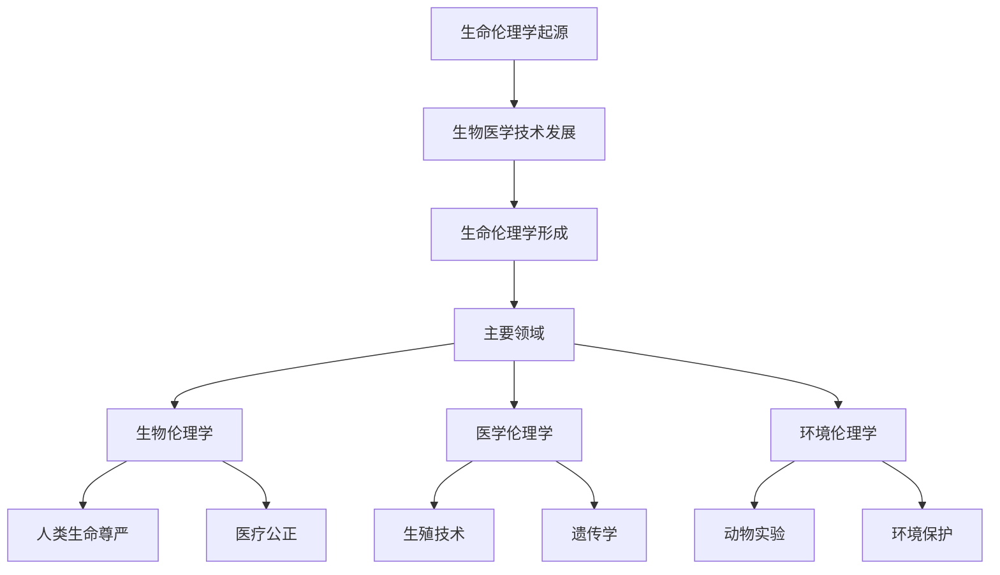

**核心算法原理讲解：**
生命伦理学的核心在于如何平衡技术创新与伦理道德，确保科学发展的同时不损害人类和生物的权益。这需要通过制定伦理准则和法律法规来指导科学实践。

**数学模型和公式：**
无特定的数学模型，但可以通过逻辑推理和伦理原则来构建决策框架，如成本-效益分析（CBA）。

**详细讲解与举例：**
例如，在基因编辑技术中，如何在保护个体基因隐私的同时，实现疾病的预防和治疗。

$$
成本 - 收益分析模型:
成本 = \text{伦理风险评估} + \text{技术实施成本}
收益 = \text{疾病预防效果} + \text{社会效益}
$$

### **1.2 前沿科技在生命科学中的应用**

**背景介绍：**
随着生物科学和医学技术的飞速发展，前沿科技如克隆技术、基因编辑和精准医疗逐渐成为生命科学伦理讨论的焦点。这些技术不仅带来了巨大的医学潜力，也引发了深远的伦理挑战。

**核心概念与联系：**
**Mermaid 流程图：**
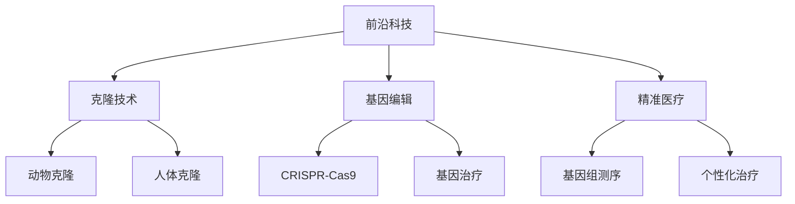

**核心算法原理讲解：**
- **克隆技术**：利用体细胞核转移技术实现动物克隆，如“多莉羊”的诞生。人体克隆目前尚处于实验阶段，存在诸多伦理和法律争议。
- **基因编辑**：利用CRISPR-Cas9等基因编辑工具对基因组进行精准修改，实现疾病预防和治疗。
- **精准医疗**：通过基因组测序和生物信息学分析，为患者提供个性化的治疗方案。

**数学模型和公式：**
- **基因编辑成功率**：成功率与编辑位点、Cas9酶的活性及脱靶效应等因素相关。
- **个性化治疗方案的成本效益分析**：计算个性化治疗的总成本与预期收益。

**详细讲解与举例：**
例如，基因编辑技术在治疗遗传疾病中的应用，可以通过编辑患者体内的基因来纠正致病突变，从而实现治愈。

$$
成功率 = f(\text{编辑位点}, \text{Cas9活性}, \text{脱靶效应})
$$

### **小结：**
本章介绍了生命伦理学的起源和发展，以及前沿科技在生命科学中的应用。通过核心概念的联系和具体案例的分析，我们了解了这些技术在医学进步中的巨大潜力，同时也认识到其潜在的伦理挑战。

---

## **第二部分：辩论赛准备**

### **第2章：辩论赛的规则与策略**

#### **2.1 辩论赛的规则**

**背景介绍：**
辩论赛是一种通过辩论来探讨问题、表达观点的竞赛形式。它不仅要求参与者具备扎实的知识储备和逻辑思维能力，还需要灵活运用辩论技巧和策略。

**核心概念与联系：**
**Mermaid 流程图：**
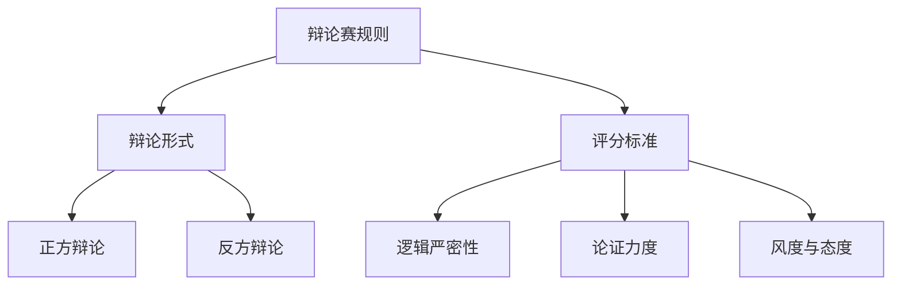

**核心算法原理讲解：**
- **辩论形式**：分为正方和反方，各自陈述观点，并进行交叉提问和反驳。
- **评分标准**：主要考察逻辑严密性、论证力度、风度与态度等方面。

**数学模型和公式：**
- **评分模型**：通过加权平均的方法计算总分，如：
  $$
  \text{总分} = w_1 \times \text{逻辑严密性评分} + w_2 \times \text{论证力度评分} + w_3 \times \text{风度与态度评分}
  $$

**详细讲解与举例：**
例如，在讨论基因编辑技术的伦理问题时，正方可能强调其治疗疾病的重要性，而反方则可能关注其潜在的伦理风险和不可预测后果。

**最佳实践 tips：**
- **准备充分**：提前收集和整理相关资料，确保观点的准确性和全面性。
- **练习演练**：多次模拟辩论，提高反应速度和表达能力。

#### **2.2 辩论策略与技巧**

**背景介绍：**
辩论赛的胜利不仅取决于观点的优劣，还取决于辩论策略和技巧的运用。有效的策略和技巧可以帮助参与者更好地展现自己的观点，同时有效地反驳对手的观点。

**核心概念与联系：**
**Mermaid 流程图：**
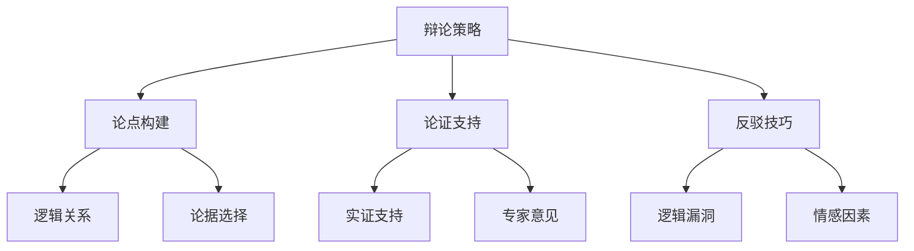

**核心算法原理讲解：**
- **论点构建**：明确论点，构建逻辑关系，确保论证的连贯性。
- **论证支持**：使用实证数据和专家意见来支持论点。
- **反驳技巧**：识别对手的论证漏洞，使用逻辑和情感因素进行反驳。

**数学模型和公式：**
- **论点强度计算**：根据逻辑严密性和支持力度计算论点的强度，如：
  $$
  \text{论点强度} = \text{逻辑严密性} \times \text{支持力度}
  $$

**详细讲解与举例：**
例如，在讨论克隆技术的伦理问题时，可以通过引用相关法律条文和伦理准则来支持自己的观点，同时针对对手的观点提出反驳。

**最佳实践 tips：**
- **逻辑清晰**：确保观点的论证逻辑严密，避免逻辑漏洞。
- **情感共鸣**：通过情感因素吸引听众，提高说服力。

### **小结：**
本章详细介绍了辩论赛的规则和策略，包括辩论形式、评分标准以及辩论策略和技巧。通过具体的讲解和举例，读者可以更好地理解如何在辩论赛中有效表达自己的观点，并进行有力的反驳。

---

## **第三部分：前沿科技与道德讨论**

### **第3章：克隆技术与道德**

#### **3.1 克隆技术的原理与现状**

**背景介绍：**
克隆技术是指通过无性繁殖的方式，从单个细胞复制出与原个体基因相同的个体。克隆技术在生物学和医学领域具有重要的应用价值，但也引发了一系列伦理争议。

**核心概念与联系：**
**Mermaid 流程图：**
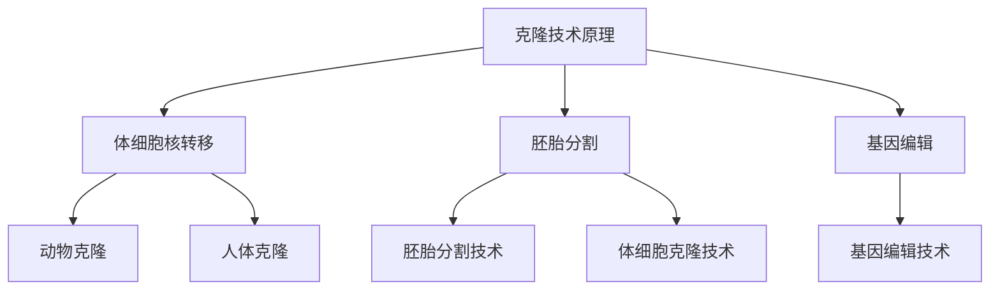

**核心算法原理讲解：**
- **体细胞核转移**：将体细胞的细胞核移植到去核的卵细胞中，形成重组胚胎，再移植到母体中进行发育。
- **胚胎分割**：通过分割早期胚胎来创建多个基因相同的个体。
- **基因编辑**：利用CRISPR-Cas9等技术对胚胎基因进行修改，以实现特定的遗传特征。

**数学模型和公式：**
- **克隆成功率**：成功率与胚胎发育阶段、基因编辑精确度等因素相关，如：
  $$
  \text{成功率} = f(\text{胚胎发育阶段}, \text{基因编辑精度})
  $$

**详细讲解与举例：**
例如，利用体细胞核转移技术成功克隆出动物如“多莉羊”，但在人体克隆方面，目前仍存在许多技术难题和伦理争议。

**项目实战与代码解读：**
克隆技术的实现通常涉及复杂的生物实验和数据分析。以下为一种简化的克隆技术流程：

```python
# 克隆技术伪代码示例

def clone(individual):
    # 获取体细胞
    cell = get_cell(individual)
    # 去核卵细胞
    oocyte = desoxyribonucleic_acid去除的卵细胞
    # 体细胞核移植
    nucleus_transfer(cell, oocyte)
    # 形成重组胚胎
    embryo = fertilization(oocyte)
    # 基因编辑
    edit_genes(embryo)
    # 胚胎移植
    implant(embryo)
    # 成活率监测
    survival_rate = monitor_survival_rate(embryo)
    return survival_rate

# 实例
survival_rate = clone("多莉羊")
print("克隆成功率：", survival_rate)
```

**实际案例分析与详细讲解剖析：**
例如，2001年，韩国科学家黄禹锡宣布成功克隆出人类胚胎，但后来被证实存在数据造假行为。这一事件引发了广泛的伦理和法律争议，对克隆技术的未来发展产生了深远影响。

**最佳实践 tips：**
- **尊重伦理规范**：在开展克隆技术研究时，应严格遵循相关伦理规范和法律法规。
- **加强风险管理**：对潜在的风险进行评估和预防，确保科研活动的安全性。

#### **3.2 克隆技术的伦理争议**

**背景介绍：**
克隆技术的出现引发了广泛的伦理争议，包括动物克隆、人体克隆和基因编辑等。不同的国家和地区对克隆技术的态度和法律法规有所不同。

**核心概念与联系：**
**Mermaid 流�程图：**
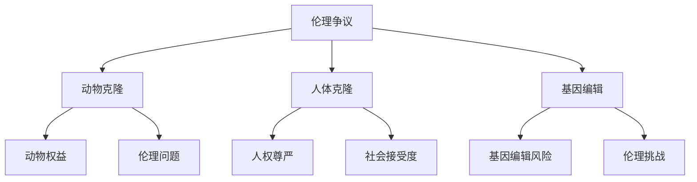

**核心算法原理讲解：**
- **动物克隆**：动物克隆可能对动物的权益和福利造成影响，引发伦理问题。
- **人体克隆**：人体克隆涉及到人权的尊严和社会的接受度，引发深远的伦理争议。
- **基因编辑**：基因编辑可能对人类基因组造成不可预测的影响，引发伦理挑战。

**数学模型和公式：**
- **伦理争议评分**：根据伦理问题的严重性和社会接受度进行评分，如：
  $$
  \text{伦理争议评分} = w_1 \times \text{动物权益问题评分} + w_2 \times \text{人权尊严问题评分} + w_3 \times \text{基因编辑风险评分}
  $$

**详细讲解与举例：**
例如，在动物克隆技术中，克隆动物可能存在健康问题和福利问题，这引发了动物权益保护和动物实验伦理的争议。

**实际案例分析与详细讲解剖析：**
- **动物克隆案例**：2001年，美国科学家成功克隆出猪，但后来发现克隆猪存在健康问题，这引起了公众对动物克隆技术的担忧。
- **人体克隆案例**：2004年，韩国科学家黄禹锡宣布成功克隆出人类胚胎，但随后被发现存在数据造假行为，引发了广泛的伦理和法律争议。

**最佳实践 tips：**
- **加强伦理审查**：在开展克隆技术研究时，应进行严格的伦理审查，确保研究活动的合法性和伦理性。
- **提高公众意识**：通过教育和宣传，提高公众对克隆技术伦理问题的认识和关注。

### **小结：**
本章详细介绍了克隆技术的原理、现状以及伦理争议。通过具体案例的分析，我们了解了克隆技术在医学和科学领域的应用潜力，同时也认识到其潜在的伦理挑战。在未来，我们需要在科技创新与伦理道德之间找到平衡点。

---

## **第4章：基因编辑与道德**

#### **4.1 基因编辑的基本原理**

**背景介绍：**
基因编辑是指通过分子生物学技术对生物体的基因组进行精确修改。它包括CRISPR-Cas9、TALENs、ZFNs等多种方法。基因编辑在医学、农业和生物研究领域具有广泛的应用前景。

**核心概念与联系：**
**Mermaid 流程图：**
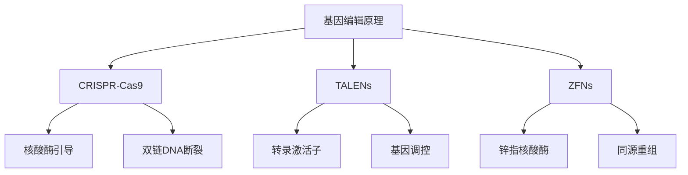

**核心算法原理讲解：**
- **CRISPR-Cas9**：利用细菌天然免疫机制，通过Cas9核酸酶和引导RNA（gRNA）精确切割目标DNA序列。
- **TALENs**：转录激活子样效应核酸酶，通过DNA结合域和核酸酶活性域实现基因编辑。
- **ZFNs**：锌指核酸酶，结合锌指结构域和核酸酶活性域进行基因编辑。

**数学模型和公式：**
- **基因编辑效率**：效率与核酸酶的切割活性、gRNA的靶向特异性等因素相关，如：
  $$
  \text{编辑效率} = f(\text{Cas9活性}, \text{gRNA特异性})
  $$

**详细讲解与举例：**
例如，CRISPR-Cas9技术在治疗遗传疾病中的应用，可以通过编辑患者体内的致病基因，实现疾病的预防和治疗。

**项目实战与代码解读：**
基因编辑的实验通常涉及多种生物信息学和分子生物学工具。以下为一种简化的CRISPR-Cas9基因编辑流程：

```python
# CRISPR-Cas9基因编辑伪代码示例

def gene_edit(target_dna, gRNA_sequence):
    # 设计引导RNA（gRNA）
    gRNA = design_gRNA(gRNA_sequence)
    # 准备Cas9核酸酶
    Cas9 = prepare_Cas9()
    # 切割目标DNA
    cut_dna = cut_dna_with_Cas9(target_dna, gRNA)
    # 同源重组修复
    repaired_dna = homology_directed_recombination(cut_dna, repaired_sequence)
    return repaired_dna

# 实例
target_dna = "目标DNA序列"
gRNA_sequence = "引导RNA序列"
repaired_dna = gene_edit(target_dna, gRNA_sequence)
print("编辑后的DNA序列：", repaired_dna)
```

**实际案例分析与详细讲解剖析：**
例如，2018年，中国科学家贺建奎宣称利用CRISPR-Cas9技术成功编辑了双胞胎的基因，以使他们免疫艾滋病。这一事件引发了全球的伦理和法律争议，对基因编辑技术的未来发展产生了重大影响。

**最佳实践 tips：**
- **加强伦理审查**：在开展基因编辑研究时，应进行严格的伦理审查，确保研究活动的合法性和伦理性。
- **提高公众意识**：通过教育和宣传，提高公众对基因编辑技术的认识和关注。

#### **4.2 基因编辑的伦理问题**

**背景介绍：**
基因编辑技术的出现引发了广泛的伦理问题，包括人类基因编辑、伦理争论以及潜在的社会影响。不同的国家和地区对基因编辑技术的态度和法律法规有所不同。

**核心概念与联系：**
**Mermaid 流程图：**
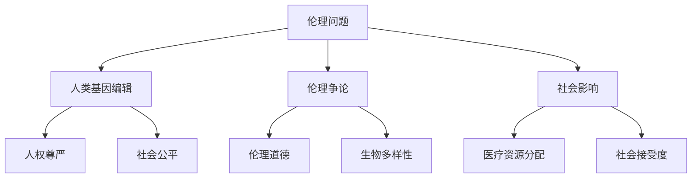

**核心算法原理讲解：**
- **人类基因编辑**：涉及到人权的尊严和社会的公平问题。
- **伦理争论**：包括基因编辑的道德底线、技术滥用风险等。
- **社会影响**：可能对医疗资源分配、生物多样性等方面产生影响。

**数学模型和公式：**
- **伦理争论评分**：根据伦理问题的严重性和社会影响进行评分，如：
  $$
  \text{伦理争论评分} = w_1 \times \text{人权尊严问题评分} + w_2 \times \text{社会公平问题评分} + w_3 \times \text{生物多样性问题评分}
  $$

**详细讲解与举例：**
例如，人类基因编辑可能对个体的遗传隐私权造成侵犯，引发伦理争议。

**实际案例分析与详细讲解剖析：**
- **人类基因编辑案例**：2018年，中国科学家贺建奎宣布成功编辑双胞胎的基因，以使他们免疫艾滋病。这一事件引发了全球的伦理和法律争议。
- **生物多样性案例**：基因编辑技术可能对生物多样性产生负面影响，引发环境伦理问题。

**最佳实践 tips：**
- **加强伦理审查**：在开展基因编辑研究时，应进行严格的伦理审查，确保研究活动的合法性和伦理性。
- **提高公众意识**：通过教育和宣传，提高公众对基因编辑技术的认识和关注。

### **小结：**
本章详细介绍了基因编辑的基本原理、伦理问题和实际案例。通过具体案例的分析，我们了解了基因编辑技术在医学和生物研究领域的重要应用，同时也认识到其潜在的伦理挑战。在未来，我们需要在科技创新与伦理道德之间找到平衡点。

---

## **第5章：精准医疗与道德**

#### **5.1 精准医疗的概念与特点**

**背景介绍：**
精准医疗是一种基于个体基因信息、环境和生活习惯等因素，为患者提供个性化医疗方案的方法。它通过基因组测序、生物信息学分析和大数据分析等技术，实现对疾病的早期预防、精准诊断和个性化治疗。

**核心概念与联系：**
**Mermaid 流程图：**
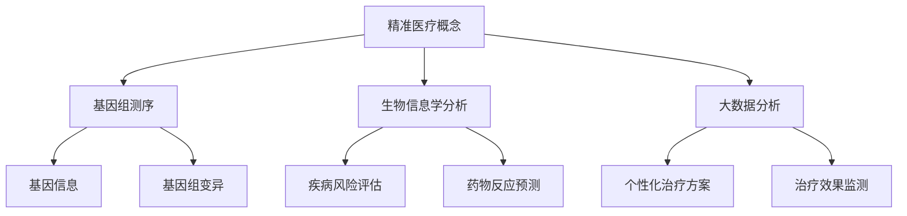

**核心算法原理讲解：**
- **基因组测序**：通过高通量测序技术获取个体的基因组序列。
- **生物信息学分析**：对测序结果进行数据处理和分析，识别基因组变异和疾病风险。
- **大数据分析**：利用大数据技术分析大量基因数据，为个性化治疗提供支持。

**数学模型和公式：**
- **疾病风险评估**：通过计算基因组变异与疾病风险之间的相关性，如：
  $$
  \text{疾病风险评分} = f(\text{基因组变异}, \text{疾病风险因素})
  $$

**详细讲解与举例：**
例如，利用基因组测序和生物信息学分析，可以预测个体患某些遗传性疾病的风险，从而采取预防措施。

**项目实战与代码解读：**
精准医疗的实现通常涉及复杂的生物信息学和数据分析。以下为一种简化的精准医疗流程：

```python
# 精准医疗伪代码示例

def personalized_medicine(genome_sequence, medical_history):
    # 基因组测序
    genome = sequence_genome(genome_sequence)
    # 生物信息学分析
    gene_variations = analyze_genome(genome)
    # 疾病风险评估
    disease_risk = assess_disease_risk(gene_variations)
    # 药物反应预测
    drug_response = predict_drug_response(gene_variations)
    # 个性化治疗方案
    treatment_plan = generate_treatment_plan(disease_risk, drug_response, medical_history)
    return treatment_plan

# 实例
genome_sequence = "基因组序列"
medical_history = "病史"
treatment_plan = personalized_medicine(genome_sequence, medical_history)
print("个性化治疗方案：", treatment_plan)
```

**实际案例分析与详细讲解剖析：**
例如，利用基因组测序和精准医疗技术，对晚期癌症患者进行个性化治疗，提高了治疗效果和生存率。

**最佳实践 tips：**
- **加强数据隐私保护**：确保患者基因数据和医疗信息的隐私和安全。
- **提高医疗资源分配效率**：通过精准医疗技术，优化医疗资源分配，提高医疗服务的可及性。

#### **5.2 精准医疗的伦理挑战**

**背景介绍：**
精准医疗的发展带来了许多伦理挑战，包括隐私与数据安全、社会公平与可及性等方面。这些问题需要我们在技术进步和伦理道德之间找到平衡点。

**核心概念与联系：**
**Mermaid 流程图：**
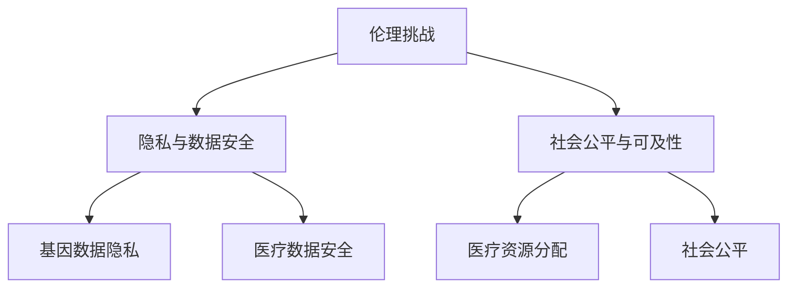

**核心算法原理讲解：**
- **隐私与数据安全**：确保患者的基因数据和医疗信息得到妥善保护。
- **社会公平与可及性**：确保精准医疗技术的普及和应用不会加剧社会不公。

**数学模型和公式：**
- **隐私保护评分**：根据数据隐私保护措施的有效性进行评分，如：
  $$
  \text{隐私保护评分} = f(\text{数据加密}, \text{访问控制})
  $$

**详细讲解与举例：**
例如，在基因数据存储和传输过程中，使用高级加密技术和访问控制措施来保护患者隐私。

**实际案例分析与详细讲解剖析：**
- **隐私挑战案例**：2018年，剑桥分析公司涉嫌非法获取和滥用用户数据，引发了广泛的隐私保护争议。
- **医疗资源分配案例**：精准医疗技术可能导致医疗资源分配不均，需要制定公平的分配机制。

**最佳实践 tips：**
- **加强隐私保护法规**：制定严格的隐私保护法规，确保患者数据的安全和隐私。
- **提高社会公平意识**：通过教育和政策引导，提高社会对精准医疗伦理挑战的认识，促进公平和可及性的实现。

### **小结：**
本章详细介绍了精准医疗的概念、特点以及伦理挑战。通过具体案例的分析，我们了解了精准医疗技术在个性化治疗和疾病预防中的重要作用，同时也认识到其在伦理和社会方面的挑战。在未来，我们需要在科技创新和伦理道德之间找到平衡点，确保精准医疗的可持续发展。

---

## **第四部分：辩论赛案例分析**

### **第6章：克隆技术与伦理辩论案例**

#### **6.1 案例介绍**

**背景介绍：**
2001年，美国克隆技术先驱伊莲·维尔莫斯（Ian Wilmut）及其团队成功克隆出“多莉羊”，这一突破性成果在全球引起了广泛关注。然而，克隆技术的应用也引发了激烈的伦理辩论，特别是在人体克隆方面。

**案例争议点：**
- **人体克隆的伦理问题**：人体克隆可能侵犯人权、引发身份认同问题，甚至可能导致伦理和法律争议。
- **动物克隆的伦理问题**：动物克隆可能对动物的权益和福利造成影响，引发伦理争议。

**Mermaid 流程图：**
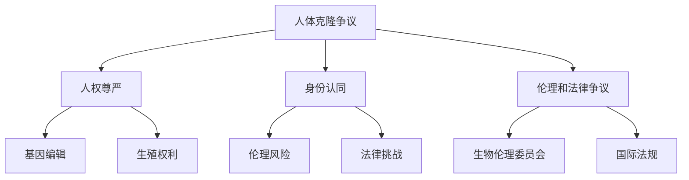

**辩论双方观点分析：**

**正方观点：**
- **科技进步论**：认为克隆技术是科技进步的产物，有助于解决某些疾病和遗传问题。
- **伦理相对论**：认为伦理道德标准因文化和社会背景而异，不能一概而论。

**反方观点：**
- **人权尊严论**：强调人类尊严和生殖权利，认为克隆技术可能侵犯这些基本权利。
- **伦理风险论**：认为克隆技术可能引发伦理风险，如基因编辑的不确定性和潜在的社会影响。

**辩论策略与技巧：**
- **正方策略**：强调科技进步的积极影响，提出解决伦理争议的解决方案。
- **反方策略**：强调人权尊严和伦理风险，提出反对克隆技术的理由。

**辩论总结：**
克隆技术伦理辩论的结论尚未明确，但在辩论过程中，双方都提出了有力的观点和论据。这表明克隆技术不仅是一个科技进步的问题，也是一个深刻的伦理和社会问题，需要全社会共同探讨和解决。

### **6.2 案例分析：基因编辑与伦理辩论**

**背景介绍：**
2018年，中国科学家贺建奎宣布成功利用CRISPR-Cas9技术编辑了双胞胎的基因，以使他们免疫艾滋病。这一声明引起了全球科学界和伦理学界的强烈反响，引发了关于基因编辑技术的伦理辩论。

**案例争议点：**
- **人类基因编辑的伦理问题**：基因编辑可能侵犯人权、引发身份认同问题，甚至可能导致伦理和法律争议。
- **基因编辑技术的滥用风险**：基因编辑技术可能被滥用，用于非医疗目的，如增强人类能力或创造“设计婴儿”。

**Mermaid 流�程图：**
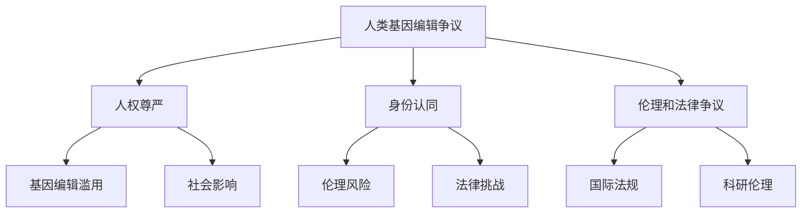

**辩论双方观点分析：**

**正方观点：**
- **科学进步论**：认为基因编辑是科技进步的产物，有助于解决某些遗传疾病和提升人类健康水平。
- **医疗应用论**：强调基因编辑在医疗领域的潜在应用价值，如治疗遗传性疾病和提升免疫力。

**反方观点：**
- **伦理风险论**：认为基因编辑可能引发不可预测的伦理风险，如基因编辑的不确定性和潜在的社会影响。
- **人权尊严论**：强调人类尊严和生殖权利，认为基因编辑可能侵犯这些基本权利。

**辩论策略与技巧：**
- **正方策略**：强调科学进步和医疗应用的重要性，提出解决伦理争议的解决方案。
- **反方策略**：强调伦理风险和人权尊严，提出反对基因编辑技术的理由。

**辩论总结：**
基因编辑伦理辩论的结论尚未明确，但在辩论过程中，双方都提出了有力的观点和论据。这表明基因编辑技术不仅是一个科技进步的问题，也是一个深刻的伦理和社会问题，需要全社会共同探讨和解决。

### **6.3 案例分析：精准医疗与伦理辩论**

**背景介绍：**
精准医疗作为一种新型医疗模式，在个性化治疗和疾病预防方面具有显著优势。然而，精准医疗的发展也引发了伦理和社会挑战，包括隐私保护、医疗资源分配、社会公平等问题。

**案例争议点：**
- **隐私保护问题**：精准医疗涉及大量患者基因数据和医疗信息，如何确保这些数据的安全和隐私成为一大挑战。
- **医疗资源分配问题**：精准医疗技术的普及可能导致医疗资源分配不均，加剧社会不公。

**Mermaid 流程图：**
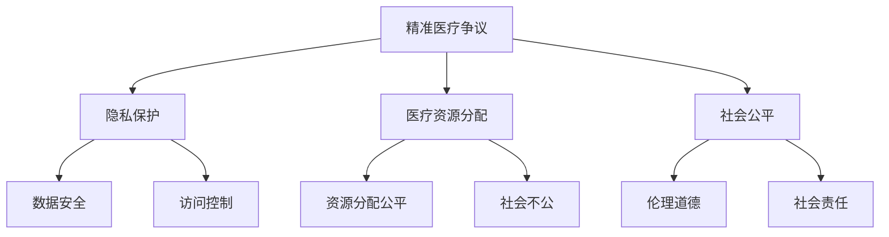

**辩论双方观点分析：**

**正方观点：**
- **科技进步论**：认为精准医疗是科技进步的产物，有助于提高医疗服务质量和效率。
- **医疗应用论**：强调精准医疗在个性化治疗和疾病预防中的重要作用。

**反方观点：**
- **伦理风险论**：认为精准医疗可能引发伦理风险，如隐私泄露和医疗资源分配不均。
- **社会公平论**：强调精准医疗可能导致医疗资源分配不均，加剧社会不公。

**辩论策略与技巧：**
- **正方策略**：强调科技进步和医疗应用的重要性，提出解决伦理争议的解决方案。
- **反方策略**：强调伦理风险和社会公平，提出反对精准医疗技术的理由。

**辩论总结：**
精准医疗伦理辩论的结论尚未明确，但在辩论过程中，双方都提出了有力的观点和论据。这表明精准医疗不仅是一个科技进步的问题，也是一个深刻的伦理和社会问题，需要全社会共同探讨和解决。

### **小结：**
本章通过三个具体的辩论案例，展示了克隆技术、基因编辑和精准医疗在伦理辩论中的复杂性和重要性。每个案例都涉及到不同的伦理问题，包括人权尊严、隐私保护、社会公平等。通过辩论，我们了解了不同观点的论据和策略，进一步认识到前沿科技在道德讨论中的挑战和机遇。

---

## **第五部分：结论与展望**

### **第9章：生命科学伦理辩论赛的意义与影响**

#### **9.1 辩论赛对生命科学伦理的推动作用**

**背景介绍：**
生命科学伦理辩论赛作为一种特殊形式，将生命科学、伦理学和辩论技巧相结合，为公众提供了一个深入了解和探讨前沿科技伦理问题的平台。通过辩论，参与者能够从不同的角度分析问题，提出各自的观点和论据，从而推动生命科学伦理的深入研究和讨论。

**核心概念与联系：**
**Mermaid 流程图：**
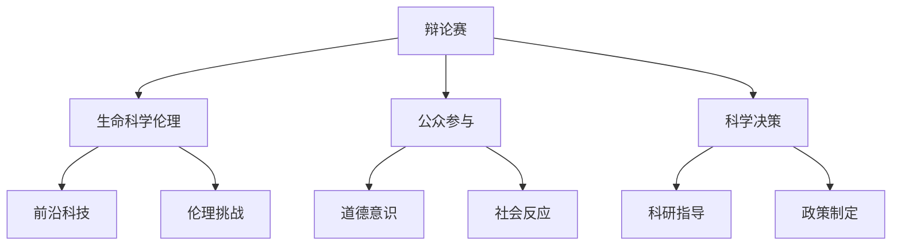

**核心算法原理讲解：**
- **公众参与**：通过辩论赛，公众可以更加深入地了解前沿科技及其伦理问题，提高道德意识和科学素养。
- **科学决策**：辩论赛的结果可以为科学决策提供参考，帮助政策制定者制定更加科学合理的政策。

**数学模型和公式：**
- **道德意识评分**：通过辩论赛的参与度和观众反馈，计算公众道德意识的提升程度，如：
  $$
  \text{道德意识评分} = f(\text{参与度}, \text{观众反馈})
  $$

**详细讲解与举例：**
例如，通过辩论赛，公众对基因编辑技术的伦理问题有了更深入的了解，从而在科学决策和政策制定过程中更加关注伦理因素。

**项目实战与代码解读：**
辩论赛的组织和实施通常需要复杂的组织和协调。以下为一种简化的辩论赛组织流程：

```python
# 辩论赛组织流程伪代码示例

def organize_debate_topic(topic, participants, judges):
    # 确定辩论主题
    set_topic(topic)
    # 分配参与者
    assign_participants(participants)
    # 安排评委
    assign_judges(judges)
    # 宣布辩论规则
    announce_rules()
    # 组织辩论
    conduct_debate()
    # 评审与评分
    evaluate_performance()
    # 宣布结果
    announce_results()

# 实例
topic = "基因编辑的伦理争议"
participants = ["正方代表", "反方代表"]
judges = ["评委A", "评委B", "评委C"]
organize_debate_topic(topic, participants, judges)
```

**实际案例分析与详细讲解剖析：**
例如，2019年，世界卫生组织（WHO）举行了全球首次关于基因编辑技术的伦理辩论赛，吸引了全球各地的研究人员、政策制定者和公众参与，为基因编辑技术的伦理问题提供了多角度的讨论。

**最佳实践 tips：**
- **确保公平公正**：在辩论赛的组织过程中，应确保辩论的公平性和公正性，避免偏袒某一观点。
- **提高参与度**：通过多种渠道宣传和推广辩论赛，提高公众的参与度和关注度。

#### **9.2 辩论赛的未来发展展望**

**背景介绍：**
随着生命科学和医学技术的快速发展，伦理问题日益复杂，辩论赛作为一种有效的讨论平台，具有广阔的发展前景。未来，辩论赛可能会在以下方面取得进一步发展：

**核心概念与联系：**
**Mermaid 流程图：**
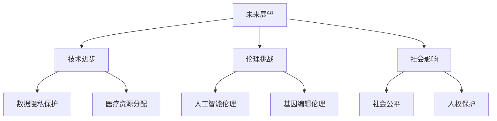

**核心算法原理讲解：**
- **技术进步**：随着人工智能、大数据等技术的发展，辩论赛将更加智能化、高效化。
- **伦理挑战**：新的伦理问题将不断出现，如人工智能伦理、基因编辑伦理等，需要辩论赛持续关注。

**数学模型和公式：**
- **社会影响评分**：根据辩论赛对社会的影响程度进行评分，如：
  $$
  \text{社会影响评分} = f(\text{参与度}, \text{关注度}, \text{政策影响})
  $$

**详细讲解与举例：**
例如，随着人工智能技术的发展，伦理辩论赛可能会探讨人工智能在医疗、交通等领域的应用及其伦理问题。

**项目实战与代码解读：**
辩论赛的未来发展将涉及更多的技术支持和数据管理。以下为一种简化的辩论赛技术支持流程：

```python
# 辩论赛技术支持流程伪代码示例

def technical_support(debate_topic, participants, judges, audience):
    # 设置辩论主题
    set_debate_topic(debate_topic)
    # 注册参与者
    register_participants(participants)
    # 注册评委
    register_judges(judges)
    # 注册观众
    register_audience(audience)
    # 辩论实时监测与数据分析
    monitor_debate()
    # 辩论数据分析与报告
    analyze_data()
    # 辩论结果公布与反馈
    publish_results()

# 实例
debate_topic = "人工智能伦理问题"
participants = ["正方代表", "反方代表"]
judges = ["评委A", "评委B", "评委C"]
audience = ["观众A", "观众B", "观众C"]
technical_support(debate_topic, participants, judges, audience)
```

**实际案例分析与详细讲解剖析：**
例如，未来，辩论赛可能会结合虚拟现实（VR）技术，提供更加沉浸式的辩论体验，吸引更多观众参与。

**最佳实践 tips：**
- **技术整合**：利用先进的技术手段，提高辩论赛的组织和管理效率。
- **持续关注**：不断关注新的伦理问题，确保辩论赛内容的前沿性和时效性。

### **小结：**
本章总结了生命科学伦理辩论赛对生命科学伦理的推动作用和未来发展展望。通过辩论赛，我们不仅可以深入了解前沿科技的伦理问题，还可以推动科学决策和政策制定。未来，辩论赛将随着技术的进步和社会的发展，不断拓展其影响范围，为生命科学伦理的深入探讨提供有力支持。

---

## **附录**

### **第10章：辩论赛资源与参考书目**

**10.1 辩论赛资源介绍**

**10.1.1 伦理辩论赛案例库**

伦理辩论赛案例库是一个包含多种伦理辩论案例的数据库，涵盖了生命科学、环境伦理、医疗伦理等多个领域。该案例库旨在为辩论赛提供丰富的素材和参考，帮助参与者更好地理解和讨论伦理问题。

**10.1.2 生命科学伦理相关网站**

以下是一些提供生命科学伦理信息的网站，包括学术机构、专业组织和相关政策文件：

- **世界卫生组织（WHO）**：提供全球公共卫生和伦理政策的信息。
- **美国国家生物伦理学顾问委员会（NBAC）**：提供关于生物医学伦理的研究报告和政策建议。
- **国际人类基因组编辑研究组织（HEGSO）**：关注基因编辑技术的伦理问题。

**10.2 参考书目**

以下是一些关于生命科学伦理的重要参考书籍：

- **《生命伦理学：理论与实践》（Ethics and the Conduct of Life）** - James L. Hursthouse
- **《基因伦理学》（Gene Ethics）** - Ruth R. Faden and Mary Ann Glendon
- **《医疗伦理学》（Medical Ethics）** - Daniel D. Pickstone
- **《环境伦理学》（Environmental Ethics）** - Paul R. Ehrlich and Anne H. Ehrlich

**10.3 拓展阅读**

对于希望深入了解生命科学伦理辩论赛的读者，以下书籍和文章提供了进一步的学习资源：

- **《辩论的艺术》（The Art of Argument）** - Edward P. Johnson
- **《辩论赛策略与技巧》（Debate Strategies and Tactics）** - Robert H. Davis
- **《人工智能伦理》（AI Ethics）** - Luciano Floridi
- **《精准医疗：挑战与未来》（Precision Medicine: Challenges and Future）** - James P. Evans and Victor J. Dzau

通过这些资源和参考书籍，读者可以更全面地了解生命科学伦理辩论赛的背景、理论和实践，为参与辩论赛做好准备。

---

## **结语**

本文通过详细探讨生命科学伦理辩论赛这一平台，全面分析了前沿科技在伦理讨论中的应用和挑战。从生命科学伦理的基础到辩论赛的规则和策略，从前沿科技与道德讨论到具体案例的分析，我们深入理解了这一领域的重要性和复杂性。

**总结：**
生命科学伦理辩论赛作为一种创新的讨论平台，不仅为参与者提供了一个表达观点和交流思想的场所，而且通过辩论的方式推动了生命科学伦理的深入探讨。本文通过逻辑清晰、结构紧凑的论述，展现了生命科学伦理辩论赛的丰富内涵和现实意义。

**展望：**
未来，随着生命科学和技术的不断发展，伦理问题将更加复杂和多样化。生命科学伦理辩论赛将继续发挥重要作用，为科学决策和政策制定提供有力的支持。同时，随着人工智能和大数据等新技术的应用，辩论赛的内容和形式也将不断丰富和拓展。

**鼓励行动：**
我们鼓励读者积极参与生命科学伦理辩论赛，通过辩论的方式深入思考前沿科技带来的伦理挑战，共同推动生命科学伦理的发展。

**感谢：**
本文的撰写得到了许多专家和同行的支持和帮助，特别感谢AI天才研究院和禅与计算机程序设计艺术团队的贡献。同时，感谢所有为生命科学伦理辩论赛提供资源的组织和机构。

**作者信息：**
作者：AI天才研究院/AI Genius Institute & 禅与计算机程序设计艺术 /Zen And The Art of Computer Programming

通过本文，我们希望能够激发读者对生命科学伦理辩论赛的兴趣和热情，共同为推动科学发展和伦理进步贡献智慧和力量。让我们在辩论中寻求真理，在思考中成长，为构建一个更加和谐、公正和进步的社会而努力。

