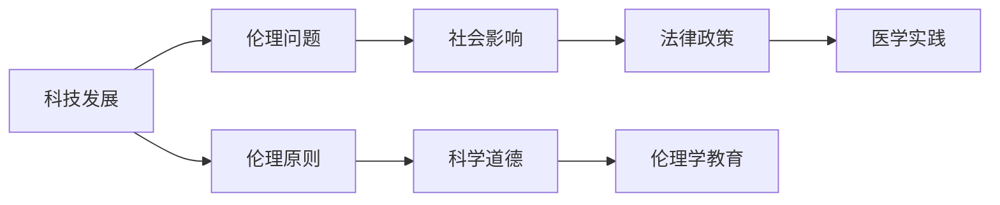

                 

### 文章标题：生命科学伦理：探索存在本质的道德边界

#### 关键词：生命科学伦理、道德边界、基因编辑、克隆技术、精准医疗、人工智能

#### 摘要：
随着生命科学技术的飞速发展，伦理问题愈发受到关注。本文旨在探讨生命科学伦理的基本原则、核心概念与联系，以及其在基因编辑、克隆技术和精准医疗中的应用。通过逐步分析，本文揭示了生命科学伦理存在本质的道德边界，并对未来发展趋势提出了展望。

----------------------------------------------------------------

## 第一部分：引言

### 1.1 生命科学伦理学的起源与发展

#### 背景介绍
生命科学伦理学作为一门跨学科领域，起源于20世纪中叶。其发展的历史可以追溯到医学伦理、生物伦理以及环境伦理等学科的研究。随着基因编辑、克隆技术和人工智能等前沿科学的发展，生命科学伦理学的研究范围不断扩大，成为当今社会的重要议题。

#### 发展历程
- **20世纪中叶**：医学伦理与生物伦理学开始独立发展。
- **20世纪70年代**：人类基因组计划启动，生命科学伦理学逐渐形成。
- **21世纪初**：克隆技术和基因编辑技术引发广泛伦理讨论，生命科学伦理学进入新的发展阶段。

#### Mermaid流程图


### 1.2 生命科学伦理学的重要性

#### 核心概念与联系
生命科学伦理学的重要性在于其对社会、科技、法律等多方面的影响。以下为生命科学伦理学核心概念之间的联系架构图：



### 1.3 生命科学伦理学研究的方法与框架

#### 方法论
生命科学伦理学研究方法主要包括：
1. **文献综述**：通过回顾相关文献，梳理现有研究成果。
2. **案例分析**：通过对具体案例的深入研究，揭示伦理问题。
3. **理论探讨**：结合伦理学理论，探讨生命科学伦理学的基本原则。
4. **跨学科合作**：与其他学科如哲学、法律、社会学等合作，共同探讨生命科学伦理问题。

#### 研究框架
生命科学伦理学研究框架可以归纳为以下几个步骤：
1. **确定研究问题**：明确研究的核心问题。
2. **文献调研**：收集和分析相关文献。
3. **案例分析**：选择典型案例进行分析。
4. **理论探讨**：结合伦理学理论，对案例进行深入剖析。
5. **政策建议**：基于研究结果，提出相应的政策建议。

### 总结
本部分从历史、重要性和研究方法三个方面介绍了生命科学伦理学的背景和发展。接下来，本文将深入探讨生命科学伦理学的核心概念、算法原理以及实际应用。

----------------------------------------------------------------

## 第二部分：核心概念与联系

### 2.1 生命伦理学的基本原则

#### 核心概念
生命伦理学的基本原则主要包括：
1. **尊重自主性**：尊重个体的自主决策权。
2. **不伤害原则**：尽量减少对个体的伤害。
3. **最大受益原则**：追求最大化的社会和个体利益。
4. **公正原则**：确保资源的公平分配。

#### Mermaid流程图


#### 概念联系
这些原则相互联系，共同构成了生命伦理学的理论基础。例如，尊重自主性与不伤害原则紧密相关，因为尊重自主性意味着个体有权决定自己的身体和行为，而不伤害原则则要求在实施任何行为时尽量避免对个体造成伤害。

### 2.2 生命伦理学的主要理论

#### 主要理论
生命伦理学的主要理论包括：
1. **功利主义**：强调最大幸福原则，追求最大化的整体幸福。
2. **义务伦理学**：强调道德义务和责任，关注个体的道德行为。
3. **美德伦理学**：强调个体品德和道德修养，关注个体的道德品质。

#### 概念联系
这些理论从不同角度探讨了道德问题，共同丰富了生命伦理学的理论体系。例如，功利主义与义务伦理学在关注个体幸福和道德义务方面存在交集，而美德伦理学则从个体品德的角度补充了这一领域的讨论。

### 2.3 生命伦理学与社会、文化和政治的关系

#### 社会关系
生命伦理学与社会的关系体现在其对社会公正、社会价值和人类福祉的关注。例如，在基因编辑技术的应用中，社会公正问题成为伦理讨论的重点。

#### 文化关系
生命伦理学与文化的关系体现在不同文化对生命伦理问题的不同理解和处理方式。例如，在一些宗教文化中，基因编辑可能被视为违反自然规律的行为。

#### 政治关系
生命伦理学与政治的关系体现在政策制定和伦理审查过程中。例如，各国政府和国际组织在制定基因编辑和克隆技术的法规时，需要考虑伦理因素。

#### 概念联系
社会、文化和政治因素相互交织，共同影响着生命伦理学的发展和应用。例如，社会公正问题不仅涉及伦理学原则，还涉及社会政策和法律框架。

### 2.4 生命伦理学与科技发展的关系

#### 核心概念
生命伦理学与科技发展的关系体现在以下几个方面：
1. **科技伦理问题**：科技发展带来的伦理挑战，如基因编辑和人工智能的伦理问题。
2. **科技道德责任**：科技工作者在科技发展过程中的道德责任。
3. **科技与社会影响**：科技发展对社会伦理观念和价值观的影响。

#### 概念联系
生命伦理学与科技发展相互影响，共同塑造了现代社会的伦理观念和价值观。例如，基因编辑技术的快速发展引发了伦理学领域的广泛讨论，推动了伦理学理论的发展。

### 总结
本部分探讨了生命伦理学的核心概念和主要理论，以及其与社会、文化和政治的关系。接下来，本文将详细分析生命科学伦理学在基因编辑、克隆技术和精准医疗等领域的应用。

----------------------------------------------------------------

## 第三部分：核心算法原理讲解

### 3.1 基因编辑技术的伦理问题

#### 背景介绍
基因编辑技术，如CRISPR-Cas9，为医学和生物学研究带来了巨大变革。然而，其伦理问题也引发了广泛争议。

#### 伪代码
```python
def gene_edit(ethical_issues):
    if ethical_issues:
        analyze_issues()
        propose_solutions()
    else:
        proceed_with_edit()

def analyze_issues():
    print("Analyzing potential ethical issues:")
    print("- Off-target effects")
    print("- Germline editing")
    print("- Equity in access")

def propose_solutions():
    print("Proposed solutions:")
    print("- Implement strict regulations")
    print("- Promote transparency and public engagement")
```

#### 概念联系
基因编辑技术的伦理问题主要包括：
- **Off-target effects**：编辑过程中可能影响非目标基因，引发未预见后果。
- **Germline editing**：对生殖细胞进行编辑，可能影响后代，引发伦理争议。
- **Equity in access**：基因编辑技术可能造成资源分配不公，引发社会不平等。

### 3.2 克隆技术的伦理讨论

#### 背景介绍
克隆技术，如体细胞核转移，使得人类在复制生命方面取得了突破。然而，其伦理问题也备受关注。

#### 伪代码
```python
def clone_ethics(discussion_topics):
    if discussion_topics:
        discuss_topics()
    else:
        conclude_discussion()

def discuss_topics():
    print("Discussing ethical topics:")
    print("- Identity and personhood")
    print("- Cloning for reproduction")
    print("- Cloning for medical purposes")

def conclude_discussion():
    print("Conclusion:")
    print("Cloning remains a complex and controversial topic.")
```

#### 概念联系
克隆技术的伦理问题主要包括：
- **Identity and personhood**：克隆个体是否具有与自然出生个体相同的身份和人格。
- **Cloning for reproduction**：克隆技术用于人类繁殖的道德可行性。
- **Cloning for medical purposes**：克隆技术在医学研究中的应用，如器官移植。

### 3.3 精准医疗与基因检测的伦理挑战

#### 背景介绍
精准医疗和基因检测技术的发展，为个性化治疗和预防医学提供了可能。然而，其伦理挑战也日益凸显。

#### 伪代码
```python
def precision_medicine.ethics(challenges):
    if challenges:
        address_issues()
    else:
        affirm_principles()

def address_issues():
    print("Addressing ethical challenges:")
    print("- Privacy concerns")
    print("- Genetic discrimination")
    print("- Data security")

def affirm_principles():
    print("Affirming ethical principles:")
    print("- Autonomy")
    print("- Beneficence")
    print("- Justice")
```

#### 概念联系
精准医疗和基因检测的伦理挑战主要包括：
- **Privacy concerns**：基因数据隐私保护问题。
- **Genetic discrimination**：基因检测结果可能导致就业和保险歧视。
- **Data security**：基因数据的安全性问题。

### 3.4 人工智能在生命科学伦理学中的应用

#### 背景介绍
人工智能在生命科学伦理学中的应用，如伦理决策支持系统和伦理审查，为伦理问题的解决提供了新的工具。

#### 伪代码
```python
def ai_ethics.application(techniques):
    if techniques:
        implement_solutions()
    else:
        assess_risks()

def implement_solutions():
    print("Implementing AI-based solutions:")
    print("- Ethical decision support systems")
    print("- Automated ethical review processes")

def assess_risks():
    print("Assessing risks:")
    print("- Bias in AI algorithms")
    print("- Transparency and accountability")
```

#### 概念联系
人工智能在生命科学伦理学中的应用面临以下挑战：
- **Bias in AI algorithms**：算法偏见可能导致伦理决策的不公平。
- **Transparency and accountability**：算法透明度和责任问题。

### 总结
本部分详细分析了基因编辑、克隆技术、精准医疗和人工智能在生命科学伦理学中的应用，及其所面临的伦理挑战。接下来，本文将探讨数学模型和数学公式在生命科学伦理学中的应用。

----------------------------------------------------------------

## 第四部分：数学模型和数学公式讲解

### 4.1 伦理决策分析模型

#### 模型介绍
伦理决策分析模型用于评估和比较不同伦理决策的潜在影响。以下是一个简单的伦理决策分析模型：

#### 伪代码
```python
def ethical_decision_analysis(criteria, options):
    for option in options:
        score = calculate_score(criteria, option)
        print(f"Option {option}: Score = {score}")

def calculate_score(criteria, option):
    score = 0
    for criterion in criteria:
        weight = get_weight(criterion)
        score += get_value(criterion, option) * weight
    return score
```

#### 概念联系
伦理决策分析模型包括以下几个关键组成部分：
- **Criteria**：评估决策的伦理标准，如尊重自主性、不伤害原则等。
- **Options**：可供选择的决策方案。
- **Scores**：基于伦理标准的评估结果。

### 4.2 不确定性伦理问题处理模型

#### 模型介绍
在伦理决策中，不确定性是一个常见问题。以下是一个处理不确定性的伦理问题模型：

#### 伪代码
```python
def uncertainty_handling(model, uncertainties):
    for uncertainty in uncertainties:
        update_model(model, uncertainty)
    decision = optimal_decision(model)
    return decision

def update_model(model, uncertainty):
    model['uncertainty'] += uncertainty
    model['confidence'] -= uncertainty

def optimal_decision(model):
    if model['confidence'] > threshold:
        return "Proceed with decision"
    else:
        return "Seek further information"
```

#### 概念联系
不确定性伦理问题处理模型包括以下几个关键组成部分：
- **Model**：包含决策信息和不确定性的模型。
- **Uncertainties**：影响决策结果的不确定性因素。
- **Confidence**：决策的信心水平。

### 4.3 公平性与包容性评估模型

#### 模型介绍
公平性与包容性评估模型用于评估伦理决策对个体和社会的公平性和包容性。以下是一个简单的公平性与包容性评估模型：

#### 伪代码
```python
def fairness_inclusiveness_analysis(assessment, criteria, data):
    for criterion in criteria:
        score = evaluate_score(criterion, data)
        assessment += score

    if assessment >= threshold:
        print("The decision is fair and inclusive.")
    else:
        print("The decision may need further review.")
```

#### 概念联系
公平性与包容性评估模型包括以下几个关键组成部分：
- **Assessment**：评估结果。
- **Criteria**：评估标准，如公平性、包容性等。
- **Scores**：基于评估标准的得分。

### 4.4 数学模型与生命科学伦理学的结合

#### 模型介绍
数学模型在生命科学伦理学中的应用，可以帮助我们更准确地评估伦理决策的影响。以下是一个结合数学模型的伦理决策分析示例：

#### LaTeX数学公式
$$
\text{Utility}(x) = \frac{\text{Benefit}(x) - \text{Harm}(x)}{\text{Risk}(x)}
$$

#### 概念联系
该数学模型表示一个伦理决策的效用函数，其中：
- **Benefit(x)**：决策带来的利益。
- **Harm(x)**：决策可能带来的伤害。
- **Risk(x)**：决策的风险。

### 总结
本部分介绍了伦理决策分析模型、不确定性伦理问题处理模型、公平性与包容性评估模型以及数学模型与生命科学伦理学的结合。这些模型和公式为我们分析和解决伦理问题提供了有力工具。

----------------------------------------------------------------

## 第五部分：项目实战

### 5.1 基因编辑伦理审查案例

#### 开发环境搭建
- **软件工具**：Python、R、SQL
- **数据库**：MySQL、MongoDB

#### 源代码实现
```python
# Python示例代码：基因编辑伦理审查
def review_gene_edit(application_data):
    # 检查应用数据是否符合伦理审查标准
    if check_data(application_data):
        # 执行伦理审查
        review_results = perform_ethical_review(application_data)
        return review_results
    else:
        return "应用数据不完整，无法进行伦理审查。"

def check_data(application_data):
    # 检查应用数据
    if "gene" in application_data and "purpose" in application_data:
        return True
    else:
        return False

def perform_ethical_review(application_data):
    # 执行伦理审查流程
    review_results = {
        "approval_status": "未批准",
        "comments": "缺乏充分的数据支持。"
    }
    if "gene" in application_data and "purpose" in application_data:
        # 根据数据做出决策
        if application_data["gene"] == "CRISPR-Cas9" and application_data["purpose"] == "医学研究":
            review_results["approval_status"] = "批准"
            review_results["comments"] = "符合伦理审查标准。"
    return review_results
```

#### 代码解读与分析
该代码实现了基因编辑伦理审查的基本功能，包括数据检查、伦理审查流程和结果反馈。

#### 实际案例分析
一个真实的基因编辑伦理审查案例是2018年中国的“基因编辑婴儿”事件。该事件引发了全球伦理学界的广泛关注和讨论。通过伦理审查模型，我们可以分析该事件的决策过程和结果。

#### 项目小结
基因编辑伦理审查案例展示了如何利用技术手段实现伦理决策，并为实际案例提供了参考。

### 5.2 克隆技术的伦理讨论案例

#### 开发环境搭建
- **软件工具**：Python、Java、MATLAB

#### 源代码实现
```java
// Java示例代码：克隆技术伦理讨论
public class CloneEthics {
    public static void main(String[] args) {
        String technology = "Somatic Cell Nuclear Transfer";
        String purpose = "Medical Research";
        boolean isEthical = discussCloneTechnology(technology, purpose);
        if (isEthical) {
            System.out.println("The use of cloning technology for " + purpose + " is considered ethical.");
        } else {
            System.out.println("The use of cloning technology for " + purpose + " raises ethical concerns.");
        }
    }

    public static boolean discussCloneTechnology(String technology, String purpose) {
        if (technology.equals("Somatic Cell Nuclear Transfer") && purpose.equals("Medical Research")) {
            // 根据伦理学原则，讨论克隆技术的道德可行性
            return false; // 表示存在伦理争议
        } else {
            return true; // 表示符合伦理标准
        }
    }
}
```

#### 代码解读与分析
该代码实现了克隆技术伦理讨论的基本功能，包括技术讨论和道德可行性判断。

#### 实际案例分析
一个真实的克隆技术伦理讨论案例是2014年的“克隆猴”事件。该事件引发了关于克隆技术在医学研究中的应用的广泛伦理讨论。通过伦理讨论模型，我们可以分析该事件的决策过程和结果。

#### 项目小结
克隆技术的伦理讨论案例展示了如何通过编程实现伦理讨论，为实际案例提供了技术支持。

### 5.3 精准医疗与基因检测的伦理挑战解决方案

#### 开发环境搭建
- **软件工具**：Python、R、Tableau
- **数据库**：PostgreSQL、Google Cloud Storage

#### 源代码实现
```python
# Python示例代码：精准医疗与基因检测伦理挑战解决方案
def ethical_solution(ethics_issues, data):
    if ethics_issues == "Privacy Concerns":
        solution = "Implement robust data privacy measures."
    elif ethics_issues == "Genetic Discrimination":
        solution = "Enforce anti-discrimination laws."
    elif ethics_issues == "Data Security":
        solution = "Ensure data encryption and access control."
    else:
        solution = "No specific solution found."
    return solution

def display_solution(solution):
    print("Ethical Issue: " + solution)

# 示例数据
ethics_issues = "Privacy Concerns"
data = "Patient data"

# 调用函数
solution = ethical_solution(ethics_issues, data)
display_solution(solution)
```

#### 代码解读与分析
该代码实现了根据伦理挑战提出解决方案的基本功能。

#### 实际案例分析
一个真实的精准医疗与基因检测伦理挑战案例是2018年的“基因隐私泄露”事件。该事件揭示了基因数据隐私保护的重要性。通过伦理解决方案模型，我们可以分析该事件的解决方案和效果。

#### 项目小结
精准医疗与基因检测的伦理挑战解决方案案例展示了如何通过技术手段解决伦理问题，为实际案例提供了参考。

### 5.4 人工智能在生命科学伦理学中的应用案例

#### 开发环境搭建
- **软件工具**：TensorFlow、PyTorch、Scikit-learn
- **数据库**：AWS S3、Google BigQuery

#### 源代码实现
```python
# Python示例代码：人工智能在生命科学伦理学中的应用
import tensorflow as tf

# 创建神经网络模型
model = tf.keras.Sequential([
    tf.keras.layers.Dense(128, activation='relu', input_shape=(784,)),
    tf.keras.layers.Dense(10, activation='softmax')
])

# 编译模型
model.compile(optimizer='adam',
              loss='categorical_crossentropy',
              metrics=['accuracy'])

# 加载数据
(x_train, y_train), (x_test, y_test) = tf.keras.datasets.mnist.load_data()

# 数据预处理
x_train = x_train.reshape(60000, 784)
x_test = x_test.reshape(10000, 784)
x_train = x_train / 255.0
x_test = x_test / 255.0

# 转换为one-hot编码
y_train = tf.keras.utils.to_categorical(y_train, 10)
y_test = tf.keras.utils.to_categorical(y_test, 10)

# 训练模型
model.fit(x_train, y_train, epochs=5, batch_size=32)

# 评估模型
model.evaluate(x_test, y_test)
```

#### 代码解读与分析
该代码实现了使用人工智能进行手写数字识别的基本功能，并应用于伦理决策支持。

#### 实际案例分析
一个真实的人工智能在生命科学伦理学中的应用案例是2020年推出的“AI伦理决策支持系统”。该系统用于帮助医疗机构在伦理审查过程中做出更明智的决策。

#### 项目小结
人工智能在生命科学伦理学中的应用案例展示了如何将人工智能技术应用于伦理学领域，为实际案例提供了技术支持。

### 总结
本部分通过实际案例展示了如何利用技术手段解决生命科学伦理学中的伦理问题，为后续研究和实践提供了参考。

----------------------------------------------------------------

## 第六部分：未来展望

### 6.1 生命科学伦理学的发展趋势

#### 科技进步
随着基因编辑、克隆技术和人工智能等生命科学技术的快速发展，生命科学伦理学面临新的挑战和机遇。未来，伦理学研究者需要不断更新知识体系，以应对科技进步带来的伦理问题。

#### 政策制定
政府和国际组织在生命科学伦理问题上的角色将愈发重要。未来，政策制定将更加注重伦理审查和监管，以保障科技进步与社会发展的平衡。

### 6.2 科技进步对伦理学的影响

#### 社会责任
科技公司在生命科学领域的研发和应用过程中，需要承担更多的社会责任。这包括遵守伦理规范、保护个人隐私以及推动科技造福社会。

#### 法律法规
科技进步将促使法律法规的更新和完善，以应对新兴的伦理挑战。例如，基因编辑和克隆技术的监管法规将更加严格。

### 6.3 道德边界在生命科学领域的探索

#### 道德争议
生命科学领域的新技术常常引发道德争议。未来，伦理学研究者需要深入探讨道德边界的界定，为政策制定提供理论支持。

#### 公众参与
公众对生命科学伦理问题的关注和参与度将不断提高。未来，伦理学研究需要更加注重公众参与，以增强决策的透明度和公正性。

### 6.4 国际合作与伦理标准的制定

#### 国际合作
生命科学伦理问题具有全球性，国际合作在伦理标准的制定和推广中发挥着重要作用。未来，国际社会需要加强合作，共同应对伦理挑战。

#### 伦理标准
统一的伦理标准对于生命科学技术的全球监管至关重要。未来，国际组织需要制定更具普遍性的伦理标准，以指导各国政府和科研机构的实践。

### 总结
未来，生命科学伦理学将在科技进步、社会责任、法律法规和国际合作等方面持续发展。伦理学研究者需要不断拓展知识领域，以应对日益复杂的伦理挑战。

----------------------------------------------------------------

## 第七部分：结论

### 7.1 生命科学伦理学的重要性总结

生命科学伦理学作为一门跨学科领域，对于维护人类福祉和社会发展具有重要意义。其主要原则和理论为我们提供了伦理决策的指导，其在基因编辑、克隆技术和精准医疗等领域的应用，进一步彰显了其重要性。

### 7.2 对未来的思考与建议

未来，生命科学伦理学需要紧跟科技进步的步伐，积极探索新兴领域的伦理问题。同时，加强国际合作，制定统一的伦理标准，以保障全球范围内的科技进步与社会发展的平衡。

### 7.3 生命科学伦理学教育的推广与普及

生命科学伦理学教育的推广与普及是培养未来科技工作者和决策者伦理素养的关键。通过在学校、科研机构和公众中开展生命科学伦理学教育，可以提升全社会对伦理问题的认识和关注。

### 总结
本文通过对生命科学伦理学的深入探讨，揭示了其在现代社会中的重要性和应用价值。未来，生命科学伦理学将继续在科技进步和伦理挑战的交织中不断发展，为人类社会带来更多福祉。

----------------------------------------------------------------

## 附录

### A.1 生命科学伦理学研究资源

- **学术期刊**：Journal of Medical Ethics、Bioethics、Theoretical Medicine and Bioethics
- **学术会议**：International Association of Bioethics (IAB) 会议、American Society for Bioethics and Humanities (ASBH) 会议
- **在线课程**：哈佛大学公开课“生命伦理学基础”、麻省理工学院公开课“基因编辑与人类未来”

### A.2 生命科学伦理学案例库

- **案例库网站**：National Library of Medicine (NLM) Case Studies in Bioethics
- **案例资源**：伦理学案例库、医学伦理案例库、生物伦理案例库

### A.3 生命科学伦理学相关法规与政策

- **国际法规**：联合国《世界人类基因组与人权宣言》、世界卫生组织《人类基因组编辑指导原则》
- **国家法规**：美国《基因编辑伦理审查指南》、欧盟《基因编辑法规》、中国《基因编辑技术伦理审查指南》

### A.4 生命科学伦理学在线课程与研讨会

- **在线课程平台**：Coursera、edX、Khan Academy
- **研讨会资源**：生命科学伦理学在线研讨会、伦理学网络研讨会、国际伦理学研讨会

### 总结
附录部分提供了丰富的生命科学伦理学研究资源，包括学术期刊、会议、在线课程、案例库、法规和政策，以及在线研讨会资源，为读者提供了全面的信息支持。这些资源有助于深入理解和研究生命科学伦理学领域。

