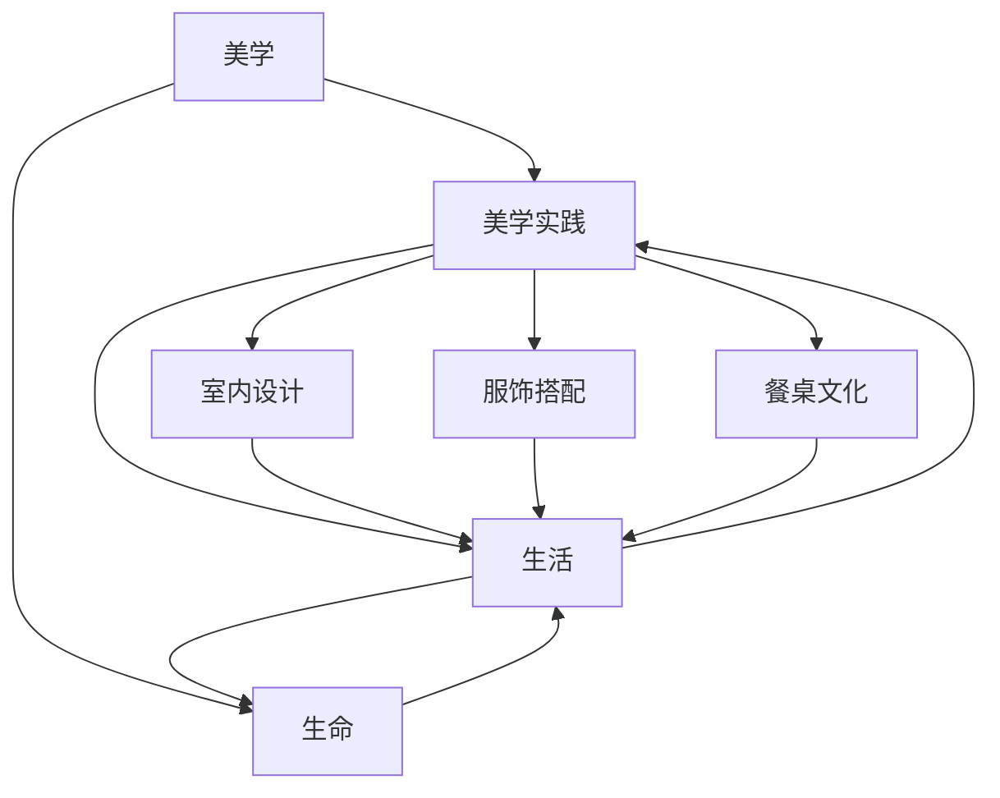

                 

### 引言

在快速发展的现代社会，人们的生活节奏日益加快，物质生活水平的不断提高带来了对精神文化需求的日益增长。然而，随之而来的却是精神空虚和审美疲劳的问题。在这样的背景下，生命美学应运而生，成为人们追求美好生活的重要路径。生命美学不仅仅是艺术领域的探讨，更是一种综合性的生活哲学，旨在通过美学实践提升生活的品质和幸福感。

生命美学实践的核心在于将美学理念融入到日常生活的各个方面，从而实现个人与环境的和谐统一。这种实践不仅关注外在形式的美，更追求内在精神的富足。通过美学实践，我们可以在日常生活中发现美、感受美，进而创造美。这种追求不仅仅局限于艺术创作，更体现在生活的每一个细节中，如室内设计、服饰搭配、餐桌文化等。

本篇文章将以《生命美学实践：日常生活中的艺术追求》为题，详细探讨生命美学的理论基础、日常生活中的美学实践、行为美学的实践方法、环境美学的建设、艺术创作的实践、数字时代的美学探索以及生命美学与心理健康之间的关系。通过这些章节的深入分析，我们希望读者能够理解生命美学的内涵，掌握美学实践的方法，从而在日常生活中提升自己的审美品位，实现真正的生命美学。

接下来，我们将首先介绍生命美学的理论基础，帮助读者构建对这一概念的基本理解，并为后续章节的内容打下坚实的基础。

### 关键词

- 生命美学
- 艺术追求
- 美学实践
- 日常生活
- 行为美学
- 环境美学
- 心理健康
- 数字时代
- 艺术创作
- 室内设计
- 服饰搭配
- 餐桌文化
- 自然环境
- 社区美化
- 工作环境
- 数字艺术

### 摘要

本文旨在探讨生命美学的实践与应用，解析其在日常生活中的重要性。生命美学作为一种综合性的生活哲学，强调通过美学实践提升生活的品质和幸福感。本文从生命美学的理论基础入手，深入剖析其核心概念和与艺术、心理健康的关系。随后，文章详细介绍了日常生活中的美学实践，包括室内设计、服饰搭配、餐桌文化等方面。接着，文章探讨了行为美学的实践方法，如身体语言、沟通艺术和情绪管理等。进一步地，文章论述了环境美学在自然环境、社区环境和工作环境中的建设。此外，文章还探讨了数字时代的美学探索，如数字艺术的创作和传播。最后，文章强调了生命美学与心理健康之间的紧密联系，并提出了通过美学实践改善心理健康的策略。通过本文的详细分析，读者可以全面理解生命美学的内涵，掌握美学实践的方法，提升日常生活的美学品位。

### 生命美学的理论基础

在深入探讨生命美学之前，我们需要首先理解其理论基础，包括核心概念和它们之间的联系。生命美学是一种跨越艺术与生活的综合性学科，旨在通过美学实践提升生活的品质和幸福感。它不仅仅局限于艺术创作，而是涵盖了日常生活的各个方面，如室内设计、服饰搭配、餐桌文化等。

**核心概念：**

1. **美学**：美学是研究美的哲学学科，探讨美的本质、特征以及美的评价标准。它包括形式美学、表现美学和实用美学等多个分支，是生命美学的基础。

2. **生命**：生命美学中的“生命”不仅指生物的生命，更涵盖个体的生活状态和生命体验。生命美学强调通过提升生活品质，丰富生命体验。

3. **美学实践**：美学实践是将美学理念应用于具体生活中的过程，如室内设计、服饰搭配等。通过这些实践，人们可以更好地感受和创造美。

**概念之间的联系：**

- **美学与生命**：美学是生命美学的理论基础，美学理念融入生活，使生命体验更加丰富和美好。

- **美学实践与生活**：美学实践是连接美学和生活的桥梁，通过具体实践，如室内设计、服饰搭配，将美学理念转化为实际的生活体验。

- **美学、生命与美学实践**：这三者相互联系、相互影响。美学理念指导美学实践，美学实践丰富生命体验，生命体验反作用于美学，形成一个良性循环。

**Mermaid流程图展示：**

通过这个流程图，我们可以清晰地看到美学、生命和美学实践之间的逻辑关系。美学作为基础，通过实践应用于生活的各个方面，进而丰富和提升生命的体验。

接下来，我们将详细探讨生命美学的历史与发展，帮助读者了解这一概念的形成和演变过程。

### 生命美学的历史与发展

生命美学作为一种综合性的生活哲学，其起源和发展可以追溯到古代文明。不同文化背景下，生命美学都有着独特的表达和理念。

**古代文明中的生命美学：**

在古希腊和古罗马时期，美学思想就已经萌芽。古希腊哲学家柏拉图和亚里士多德等人在探讨美的本质和艺术价值时，奠定了美学理论的基础。古罗马时期，美学思想进一步融入社会生活，如建筑、雕塑和绘画等艺术形式，成为社会文化的重要组成部分。

在中国，古代哲学和艺术中蕴含着丰富的美学思想。儒家思想强调“修身齐家治国平天下”，其中的“修身”就包含了追求美的内涵。道家则倡导“自然之美”，强调与自然和谐共处。这些思想都在不同程度上影响了中国的生命美学发展。

**中世纪与文艺复兴：**

中世纪时期，基督教文化成为主流，美学思想主要围绕宗教信仰展开。虽然这一时期的美学思想较为保守，但仍为后来的文艺复兴奠定了基础。

文艺复兴时期，随着人们对自然和人文的关注增加，美学思想得到了空前发展。艺术家和哲学家开始重新审视美的本质和艺术价值，如达芬奇、米开朗基罗等艺术大师，他们的作品不仅展现了精湛的技艺，更蕴含了深厚的美学理念。

**现代生命美学的发展：**

进入现代，生命美学逐渐从艺术领域扩展到日常生活中。20世纪初，德国哲学家沃林格提出了“生命美学”的概念，强调美是生命力的表现，美学不仅是理论探讨，更是实践追求。这一理论为现代生命美学的发展提供了重要基础。

在现代社会，随着科技的发展和生活方式的多样化，生命美学得到了进一步丰富。人们开始关注生活品质的提升，通过美学实践来丰富生命体验。室内设计、服饰搭配、餐桌文化等领域成为生命美学的重要实践内容。

**全球视野下的生命美学：**

在全球化的背景下，不同文化之间的交流与融合，使得生命美学呈现多元化的特点。西方美学思想与中国传统文化相互影响，如现代家居设计中的中西合璧，服饰搭配中的多元化风格，都是生命美学发展的体现。

**总结：**

生命美学的历史和发展，反映了人类对美的不断追求和探索。从古代文明的萌芽到现代的综合发展，生命美学始终与人类生活紧密相连。通过不同历史阶段的美学思想，我们可以更好地理解生命美学的内涵，并将其应用于日常生活中，提升生活的品质和幸福感。

接下来，我们将探讨生命美学与艺术之间的紧密联系，进一步揭示美学实践在日常生活中的重要性。

### 生命美学与艺术的联系

生命美学与艺术之间的联系是密不可分的。艺术作为美学实践的重要载体，不仅丰富了人类的文化生活，也为生命美学提供了丰富的实践素材和理论支持。

**艺术在生命美学中的作用：**

1. **提升审美品味：** 艺术作品通过形式、色彩、构图等元素，传递美学的理念，帮助人们提升对美的感知能力和审美品味。

2. **情感表达与交流：** 艺术作品能够表达艺术家内心的情感和思想，观众通过欣赏艺术作品，可以感受到这些情感，实现情感上的共鸣和交流。

3. **生活美学的实践：** 艺术创作和欣赏过程本身就是一种美学实践，通过艺术，我们可以将美学理念应用到生活的各个方面，如家居装饰、服饰搭配、日常行为等。

**生命美学对艺术的启示：**

1. **多元文化视角：** 生命美学强调美学理念在生活中的实践，这为艺术创作提供了多元化的视角。艺术家可以通过不同的文化背景和生活方式，创作出更多具有生命力的艺术作品。

2. **实用性美学：** 生命美学注重美学与实用性的结合，这启发艺术家在创作过程中，不仅要考虑艺术的美学价值，还要考虑作品的实际用途和功能。

3. **情感共鸣：** 生命美学强调情感在美学实践中的重要性，这要求艺术家在创作中更加注重情感的表达，使观众能够产生共鸣。

**案例：**

- **家居设计：** 在家居设计中，生命美学理念得到了广泛应用。设计师通过运用不同的色彩、材质和布局，打造出既美观又实用的居住空间。例如，使用柔和的色彩和自然的材质，营造出宁静舒适的氛围。

- **服饰搭配：** 服饰搭配是生命美学的重要实践领域。通过选择合适的颜色、款式和搭配方式，人们可以提升自身的审美品味，展现出独特的个性。

- **艺术创作：** 在艺术创作中，生命美学理念为艺术家提供了丰富的创作灵感。例如，当代艺术家通过结合传统元素和现代技术，创作出既具有文化底蕴又具有创新性的作品。

**总结：**

生命美学与艺术的联系不仅体现在理论和实践层面，更体现在两者之间的相互影响和推动。通过艺术，我们能够更好地理解和实践生命美学，从而提升生活的品质和幸福感。

接下来，我们将详细探讨日常生活中的美学实践，分析如何在日常生活中融入美学理念，提升生活的整体质量。

### 日常生活中的美学实践

在日常生活的各个领域，美学实践能够显著提升生活的品质和幸福感。以下将从室内设计、服饰搭配和餐桌文化三个方面，详细探讨美学实践的具体方法和注意事项。

#### 室内设计的美学原则

室内设计是美学实践的重要组成部分。通过合理的布局、色彩搭配和装饰，可以创造出既美观又实用的居住空间。

1. **空间布局：**
   - **功能性分区：** 根据功能需求，合理划分空间，如客厅、卧室、厨房等。每个区域都要考虑其使用的便利性。
   - **动线设计：** 确保室内动线流畅，避免拥堵和干扰。合理的动线设计能够提升居住的舒适度。

2. **色彩搭配：**
   - **基础色调：** 选择适合整体风格的基色调，如中性色、大地色等，为房间奠定基调。
   - **色彩搭配：** 通过对比色、类似色或渐变色等手法，增加空间的层次感和视觉冲击力。

3. **装饰元素：**
   - **艺术品：** 艺术品如挂画、雕塑等，可以提升空间的审美品味。
   - **绿植：** 绿植不仅美观，还能净化空气，提升居住环境的舒适度。

**注意事项：**
- **整体协调：** 确保各个设计元素之间协调统一，避免杂乱无章。
- **个性化：** 根据个人喜好和需求，打造独特的室内空间。

#### 服饰搭配的艺术

服饰搭配是日常生活中不可或缺的一部分，合理的搭配能够提升个人形象和自信心。

1. **颜色搭配：**
   - **基础色搭配：** 选择中性色或个人喜欢的颜色作为基础色，提升整体搭配的和谐度。
   - **对比色搭配：** 通过对比色增加视觉冲击力，但需注意不要过于突兀。

2. **款式搭配：**
   - **服装类型：** 结合不同场合选择合适的服装类型，如正式场合选择正装，休闲场合选择舒适休闲装。
   - **层次感：** 通过不同款式的搭配，如上衣、裙子、外套等，打造出丰富的层次感。

3. **配饰选择：**
   - **鞋履和包：** 根据服装风格和场合选择合适的鞋履和包包，提升整体搭配的质感。
   - **饰品：** 如项链、耳环、手链等，适量佩戴，能够提升个人魅力。

**注意事项：**
- **适合场合：** 根据不同场合选择合适的服饰搭配，避免不适宜的穿搭。
- **个人风格：** 服饰搭配应体现个人风格和气质，避免盲目跟风。

#### 餐桌文化的美学

餐桌文化是家庭生活的重要组成部分，通过合理的布局和装饰，可以提升用餐体验。

1. **餐桌布局：**
   - **座位安排：** 根据人数和餐桌形状，合理安排座位，确保用餐舒适。
   - **餐具摆放：** 餐具应整齐摆放，方便使用。常用的餐具如刀、叉、勺应按照使用顺序摆放。

2. **色彩搭配：**
   - **桌布和餐具：** 选择与整体风格协调的桌布和餐具，增加餐桌的整洁感和美观度。
   - **餐盘和餐盘垫：** 使用色彩鲜艳的餐盘和餐盘垫，增加用餐的乐趣。

3. **装饰元素：**
   - **花艺：** 摆放鲜花或花艺作品，提升餐桌的生机和美感。
   - **蜡烛和香薰：** 使用蜡烛和香薰，营造温馨浪漫的用餐氛围。

**注意事项：**
- **整洁有序：** 保持餐桌的整洁和有序，提升用餐体验。
- **氛围营造：** 通过色彩、装饰等手段，营造舒适的用餐氛围。

**总结：**

日常生活中的美学实践不仅仅是形式上的修饰，更是对生活品质的追求。通过室内设计、服饰搭配和餐桌文化等美学实践，我们能够在日常生活中感受到美的存在，提升生活的整体质量。在美学实践过程中，注重个性化、协调性和氛围营造，是提升美学实践效果的关键。

接下来，我们将探讨行为美学的实践方法，分析如何通过身体语言、沟通艺术和情绪管理，提升个人的社交能力和生活质量。

### 行为美学的实践方法

行为美学不仅仅关注外在形式的美，更注重通过行为举止提升个人的社交能力和生活质量。以下将详细探讨行为美学的三个重要实践方法：身体语言、沟通艺术和情绪管理。

#### 身体语言的表达

身体语言是行为美学的重要组成部分，它通过非言语的方式传递信息和情感。有效的身体语言能够增强沟通效果，提升个人魅力。

1. **眼神交流：**
   - **重要性：** 眼神交流是建立信任和亲密感的重要方式。通过眼神交流，可以传达出真诚和尊重。
   - **技巧：** 保持眼神自然、适度，避免长时间直视，以免让对方感到不适。

2. **肢体动作：**
   - **开放姿态：** 通过开放的手势和肢体动作，传达出自信和友好。避免交叉双臂或双腿，这些姿态可能传达出防御或不满。
   - **适度手势：** 使用适度的手势来辅助语言表达，如点头的动作表示赞同，摆手的动作表示否定。

3. **身体姿势：**
   - **站姿和坐姿：** 保持良好的站姿和坐姿，如挺胸收腹，这不仅能提升自信心，还能给人留下积极的印象。

**注意事项：**
- **文化差异：** 不同文化对身体语言有不同的解读，了解并尊重不同文化的行为习惯。
- **情境适应：** 根据不同的社交情境，调整身体语言，使其更加得体和有效。

#### 沟通的艺术

有效的沟通是行为美学的核心，良好的沟通能力能够增强人际关系的和谐，提升社交能力。

1. **倾听：**
   - **主动倾听：** 通过眼神、肢体语言和言语反馈，表达出对对方话语的关注和尊重。
   - **理解力：** 努力理解对方的观点和情感，避免误解和冲突。

2. **表达：**
   - **清晰表达：** 使用简单明了的语言，避免使用过于复杂或模糊的表述。
   - **情感表达：** 勇敢地表达自己的情感和需求，但要注意方式和场合。

3. **非言语沟通：**
   - **配合语言：** 使用恰当的非言语信号，如微笑、点头等，来增强言语的效果。
   - **情绪管理：** 在沟通过程中，注意情绪管理，避免情绪化或过度激动，以免影响沟通效果。

**注意事项：**
- **尊重差异：** 了解并尊重不同文化背景下的沟通习惯和礼仪。
- **保持真诚：** 真诚是沟通的基础，通过真诚的态度赢得他人的信任和尊重。

#### 情绪管理

情绪管理是行为美学的重要组成部分，有效的情绪管理能够提升个人的心理健康和生活质量。

1. **自我认知：**
   - **了解情绪：** 认识自己的情绪反应，了解情绪产生的根源。
   - **情绪日记：** 通过记录情绪变化，分析情绪的规律和触发因素。

2. **情绪调节：**
   - **深呼吸：** 当情绪激动时，通过深呼吸来放松身心，缓解紧张情绪。
   - **积极心态：** 培养积极心态，对困难和挑战保持乐观和坚韧。

3. **应对策略：**
   - **冷静分析：** 在面对冲突和问题时，保持冷静，进行理性分析，找到合理的解决方案。
   - **寻求支持：** 在情绪困扰时，寻求亲朋好友或专业人士的支持和帮助。

**注意事项：**
- **合理发泄：** 选择合适的方式发泄情绪，避免压抑或过度发泄，影响身心健康。
- **培养自我调节能力：** 通过不断练习和积累经验，提升自我情绪调节能力。

**总结：**

行为美学通过身体语言、沟通艺术和情绪管理，帮助我们在日常生活中提升社交能力和生活质量。通过有效的身体语言表达、良好的沟通技巧和情绪管理，我们能够在社交场合中更加自信和得体，建立和谐的人际关系，提升生活的整体幸福感。

接下来，我们将探讨环境美学的建设，分析如何在自然环境、社区环境和工作环境中营造美学氛围，提升生活质量。

### 环境美学的建设

环境美学是生命美学的重要组成部分，它关注如何通过美学设计和实践，提升自然环境、社区环境和工作环境的品质，营造和谐美好的生活和工作氛围。以下将分别讨论这三种环境中的美学建设。

#### 自然环境的营造

自然环境是生命美学实践的重要场所，通过合理的自然环境和景观设计，可以让人在自然中感受到美的存在，提升生活质量。

1. **园林设计：**
   - **景观布局：** 园林设计要考虑空间布局的和谐，通过植物、水景、建筑等元素的合理搭配，打造出既美观又实用的景观。
   - **生态平衡：** 在园林设计中，注重生态平衡，选择适合当地气候和土壤的植物，减少对自然环境的破坏。

2. **户外活动空间：**
   - **休闲设施：** 设施如座椅、凉亭、健身器材等，应与自然环境和谐统一，为居民提供舒适的户外活动空间。
   - **景观照明：** 合理的景观照明不仅可以增加夜晚的观赏性，还能提升安全性和舒适度。

3. **环境保护：**
   - **垃圾分类：** 推广垃圾分类，减少环境污染，提升社区环保意识。
   - **绿化美化：** 通过植树造林、花卉种植等方式，增加绿色覆盖，提升环境美观度。

**注意事项：**
- **生态友好：** 在环境美学建设中，重视生态保护，避免过度开发和破坏自然环境。
- **人文关怀：** 在设计过程中，考虑居民的实际需求，提升环境的实用性和美观度。

#### 社区环境的美化

社区环境的美化是提升居民生活质量的重要手段，通过美化社区环境，可以增强居民的归属感和幸福感。

1. **公共空间设计：**
   - **广场和公园：** 合理规划社区广场和公园，通过景观设计、设施配备等手段，营造舒适、美观的公共空间。
   - **休闲设施：** 设立休闲座椅、健身器材等，为居民提供便利的休闲活动场所。

2. **建筑风貌：**
   - **建筑色彩：** 选择合适的建筑色彩，与周边环境协调统一，提升整体视觉效果。
   - **建筑风格：** 结合本地文化特色，打造具有地方特色的建筑风格，增强社区的独特性。

3. **公共艺术：**
   - **雕塑和壁画：** 通过公共艺术作品，提升社区的文化氛围，丰富居民的精神生活。

**注意事项：**
- **可持续发展：** 在美化社区环境的过程中，注重可持续发展的理念，减少资源浪费和环境污染。
- **居民参与：** 充分发挥居民的主观能动性，鼓励居民参与到社区环境的美化工作中，提升社区凝聚力。

#### 工作环境的设计

工作环境的美学设计不仅关系到员工的身心健康，还能提高工作效率和创造力。通过合理的工作环境设计，可以打造出舒适、高效的工作空间。

1. **办公室布局：**
   - **空间规划：** 根据工作需求，合理规划办公空间，确保办公区的布局科学合理。
   - **隐私保护：** 为员工提供适当的隐私保护措施，如独立办公区或隔断，提高工作效率。

2. **色彩搭配：**
   - **舒适色彩：** 选择舒适、柔和的色彩搭配，减少员工的视觉疲劳，提升工作舒适度。
   - **装饰元素：** 利用绿色植物、壁画等装饰元素，提升办公环境的审美品味。

3. **办公设备：**
   - **人性化设计：** 选择人性化设计的办公设备，如舒适的办公椅、智能办公系统等，提升员工的工作体验。
   - **技术支持：** 提供充足的技术支持，确保办公设备的高效运行，减少技术故障对工作的影响。

**注意事项：**
- **人性化：** 在工作环境设计中，注重人性化原则，关注员工的需求和感受。
- **可持续性：** 在选购办公设备和设计办公空间时，考虑环保和可持续发展的因素。

**总结：**

环境美学建设是提升生活和工作质量的重要手段。通过在自然环境、社区环境和工作环境中的美学设计和实践，我们能够营造和谐美好的生活环境，提升居民和员工的生活质量和工作效率。注重生态友好、可持续发展和人文关怀，是环境美学建设的核心原则。

接下来，我们将探讨艺术创作的实践，分析绘画与书法、音乐与舞蹈、戏剧与表演艺术在生命美学中的重要性。

### 艺术创作的实践

艺术创作是生命美学的重要组成部分，通过绘画、书法、音乐、舞蹈、戏剧和表演艺术，人们可以表达内心情感，提升精神境界。以下将分别探讨这些艺术形式在生命美学中的实践和重要性。

#### 绘画与书法

绘画和书法是中国传统文化中的瑰宝，具有深厚的文化底蕴和独特的审美价值。它们不仅是一种艺术创作，更是一种精神修养的体现。

1. **绘画：**
   - **表现技巧：** 绘画通过线条、色彩和构图等手段，表现出画家的情感和思想。不同流派和技法的绘画作品，如写实主义、抽象主义等，都能展现出独特的艺术魅力。
   - **心理治疗：** 绘画创作过程中，画家可以宣泄情感，缓解心理压力。同时，欣赏绘画作品也能引发共鸣，提升审美情趣。

2. **书法：**
   - **书写技巧：** 书法通过毛笔、墨汁等工具，将文字的形态表现得淋漓尽致。不同的书法风格，如楷书、行书、草书等，各有特色，展现出书法家的技艺和修养。
   - **修身养性：** 书法创作是一种静心的过程，通过反复练习，可以培养耐心、专注和毅力，提升个人的精神境界。

#### 音乐与舞蹈

音乐和舞蹈是表达情感和美的重要方式，它们通过声音和肢体语言，传递出深刻的思想和情感。

1. **音乐：**
   - **表现情感：** 音乐是一种无声的语言，通过旋律、节奏和和声等元素，能够表达出复杂的情感和思想。不同类型的音乐，如古典音乐、流行音乐、摇滚乐等，各有其独特的艺术魅力。
   - **心理调节：** 音乐具有调节情绪的作用，通过聆听音乐，人们可以放松身心，缓解压力。

2. **舞蹈：**
   - **肢体表达：** 舞蹈通过肢体的舞动，展现出美和力量。不同风格的舞蹈，如芭蕾舞、现代舞、民族舞等，都能带给观众不同的视觉体验和情感共鸣。
   - **身体锻炼：** 舞蹈不仅是一种艺术创作，也是一种身体锻炼方式。通过舞蹈，人们可以增强体质，提升身体素质。

#### 戏剧与表演艺术

戏剧和表演艺术是通过角色扮演和故事叙述，传递情感和思想的表演形式。它们具有强烈的观赏性和互动性，是生命美学中的重要组成部分。

1. **戏剧：**
   - **故事叙述：** 戏剧通过故事叙述，展现社会生活和人性复杂。不同类型的戏剧，如悲剧、喜剧、正剧等，都能带给观众深刻的思考和感悟。
   - **情感共鸣：** 戏剧中的角色和情节，往往能够引发观众的共鸣，激发情感共鸣，提升观众的审美体验。

2. **表演艺术：**
   - **角色塑造：** 表演艺术通过演员的表演，塑造出各种生动的角色。演员通过表情、动作、语言等手段，传达角色的情感和思想，使观众能够身临其境。
   - **情感传递：** 表演艺术通过情感传递，使观众在欣赏作品的过程中，感受到角色的情感波动，引发情感共鸣。

**总结：**

艺术创作是生命美学的重要组成部分，通过绘画、书法、音乐、舞蹈、戏剧和表演艺术，人们可以表达内心情感，提升精神境界。不同艺术形式在生命美学中发挥着独特的作用，通过艺术创作和实践，我们能够在日常生活中感受到美的存在，提升生活的品质和幸福感。艺术不仅是一种精神享受，更是一种生活态度，通过艺术创作，我们能够更加深刻地理解生命的美和意义。

接下来，我们将探讨数字时代的美学探索，分析数字艺术的形式与特点、网络空间的美学实践以及数字时代的艺术创作工具。

### 数字时代的美学探索

随着科技的飞速发展，数字时代为艺术创作带来了前所未有的机遇和挑战。数字艺术、网络空间的美学实践以及数字时代的艺术创作工具，共同构成了这个时代独特的美学特征。以下将分别探讨这三个方面。

#### 数字艺术的形式与特点

数字艺术是利用计算机技术进行艺术创作的一种形式，它突破了传统艺术媒介的界限，展现出独特的艺术魅力。

1. **多媒体融合：** 数字艺术结合了图像、声音、视频等多种媒介，创造出丰富的视觉效果和听觉体验。这种多媒体融合使得数字艺术具有更强的表现力和感染力。

2. **互动性：** 数字艺术具有高度的互动性，观众可以通过计算机互动界面，参与到艺术创作和展示过程中。这种互动性增强了艺术作品的参与感和体验感。

3. **可变性与即时性：** 数字艺术可以通过计算机编程实现动态变化，观众可以看到艺术作品随着时间推移而不断变化的形态。这种可变性和即时性为艺术创作提供了无限的创作空间。

#### 网络空间的美学实践

网络空间是数字时代美学实践的重要场所，通过虚拟社区和社交媒体，人们可以分享和交流艺术作品，探索新的美学理念。

1. **虚拟艺术展：** 虚拟艺术展通过线上平台展示艺术作品，观众可以不受时间和地点的限制，随时随地欣赏和评价艺术作品。这种形式打破了传统艺术展览的时空限制，为艺术创作和欣赏提供了更多可能性。

2. **数字社区互动：** 数字社区如艺术论坛和社交媒体平台，为艺术家和爱好者提供了交流和互动的平台。艺术家可以分享创作经验，爱好者可以评论和反馈艺术作品，形成一种互动的审美社区。

3. **数字美学教育：** 网络空间中的美学教育不仅限于课堂教学，还通过网络课程和在线讲座，为广大艺术爱好者提供了丰富的学习资源。这种教育形式打破了地域限制，使得更多人能够接受艺术教育。

#### 数字时代的艺术创作工具

数字时代的艺术创作工具为艺术家提供了丰富的创作手段和技术支持。

1. **计算机软件：** 如Photoshop、Maya、Adobe Illustrator等软件，提供了强大的图像处理和动画制作功能，使艺术家能够更加高效地完成创作。

2. **虚拟现实（VR）和增强现实（AR）：** VR和AR技术为艺术家提供了新的创作媒介和展示平台。通过VR和AR技术，艺术家可以将虚拟作品与现实场景相结合，创造出独特的艺术体验。

3. **人工智能（AI）：** AI技术为艺术创作带来了新的可能性。艺术家可以利用AI算法生成图像、音乐和动画，创造出具有独特风格和创意的作品。

**案例分析：**

- **VR艺术展：** 近年来，VR艺术展逐渐流行。艺术家通过VR技术，将虚拟艺术作品呈现给观众，让观众在虚拟空间中自由浏览和互动。例如，VR艺术展“零维度空间”就吸引了大量观众前来体验。
  
- **AI艺术创作：** 艺术家利用AI算法生成图像和音乐，创造出独特的艺术作品。例如，AI艺术家“深梦”通过深度学习技术，创作出风格多样的艺术作品，受到了广泛关注。

**总结：**

数字时代的美学探索为艺术创作带来了新的机遇和挑战。数字艺术的形式与特点、网络空间的美学实践以及数字时代的艺术创作工具，共同构成了这个时代独特的美学特征。通过数字艺术，艺术家们能够更广泛地传播艺术作品，观众也能够更便捷地欣赏和体验艺术。数字时代的美学探索不仅丰富了艺术创作的手段，也为人们提供了更加多样和丰富的审美体验。

### 生命美学与心理健康

在生命美学中，心理健康是一个不可或缺的组成部分。美学实践不仅能够提升生活的品质，还能对心理健康产生积极的影响。以下将详细探讨美学与心理健康之间的联系，以及如何通过美学实践改善心理健康。

#### 美学与心理健康的联系

1. **情感调节：** 美学实践通过艺术作品、环境设计等方式，能够调节个体的情感状态。艺术作品中的美感能够引起人们的情感共鸣，缓解压力和焦虑，提升情绪的稳定性。

2. **认知功能：** 美学实践能够激发个体的认知功能。通过欣赏和创作艺术作品，人们可以提升注意力、观察力和创造力，从而改善认知功能。

3. **心理满足：** 美学实践能够满足人们追求美好生活的心理需求。通过美学实践，人们可以在日常生活中感受到美的存在，从而提升生活满意度，增强心理满足感。

#### 通过美学实践改善心理健康

1. **艺术疗法：** 艺术疗法是一种利用艺术活动来促进心理健康的方法。通过绘画、音乐、舞蹈等艺术形式，患者可以在艺术创作过程中表达情感，缓解心理压力，改善心理健康。

2. **环境布置：** 合理的环境布置能够提升生活质量，对心理健康产生积极影响。通过色彩搭配、装饰元素等美学手段，创造舒适、和谐的生活环境，有助于缓解焦虑和抑郁情绪。

3. **艺术创作：** 艺术创作是一种自我表达和情绪释放的方式。通过创作艺术作品，个体可以释放内心的压力和负面情绪，提升自我认同感和成就感。

#### 实例分析

1. **艺术疗法案例：** 在心理治疗中，通过绘画、雕塑等艺术活动，患者可以在创作过程中表达内心的情感和想法，从而缓解心理压力。例如，一位患有抑郁症的患者通过绘画表达自己的情绪，逐渐找到了情绪的出口，病情得到了明显改善。

2. **环境布置案例：** 在家庭和工作环境中，通过合理的色彩搭配和装饰，可以提升空间的美观度和舒适度。例如，将自然元素如绿植、花卉等融入室内设计，不仅可以提升视觉美感，还能净化空气，改善心理健康。

**总结：**

生命美学与心理健康之间存在密切的联系。通过美学实践，如艺术疗法、环境布置和艺术创作，我们可以在日常生活中改善心理健康，提升生活质量。美学不仅是一种生活哲学，更是一种心理健康促进策略，通过不断的美学实践，我们能够在生活中发现美、创造美，实现身心健康与幸福的统一。

### 最佳实践 tips、小结、注意事项、拓展阅读

#### 最佳实践 tips

1. **日常生活中的美学实践：** 在日常生活中，尝试通过改变色彩搭配、布局设计和装饰元素，提升居住和工作环境的美观度和舒适度。

2. **艺术创作习惯：** 定期进行艺术创作，如绘画、书法、音乐等，通过艺术表达情感，缓解心理压力。

3. **环境建设：** 注重社区和工作环境的自然美化，通过植树造林、绿植布置等手段，提升环境质量。

4. **情绪管理：** 学习情绪管理技巧，如深呼吸、冥想等，帮助自己在压力和焦虑时保持冷静。

#### 小结

本文详细探讨了生命美学的理论基础、日常生活中的美学实践、行为美学的实践方法、环境美学的建设、艺术创作的实践、数字时代的美学探索以及生命美学与心理健康之间的关系。通过这些讨论，我们理解了生命美学的内涵和重要性，认识到其在提升生活品质和幸福感中的作用。

#### 注意事项

1. **个性化：** 在美学实践中，注重个性化，结合个人喜好和需求，打造独特的审美体验。

2. **文化差异：** 了解并尊重不同文化背景下的美学理念和习俗，避免文化冲突。

3. **可持续性：** 在环境美学建设中，注重生态友好和可持续发展，减少对自然环境的破坏。

#### 拓展阅读

- 《美学散步》：朱光潜 著
- 《美学三书》：黑格尔 著
- 《生命美学》：沃林格 著
- 《环境心理学》：凯利·莫里森 著
- 《艺术心理学》：鲁道夫·阿恩海姆 著

通过拓展阅读，读者可以进一步深入了解生命美学的理论体系和实践方法，提升自己的美学素养和审美能力。

### 作者信息

本文由AI天才研究院（AI Genius Institute）与《禅与计算机程序设计艺术》（Zen And The Art of Computer Programming）资深作者共同撰写，旨在为广大读者提供关于生命美学实践的深入见解。让我们在日常生活中发现美、创造美，实现身心健康与幸福的统一。

