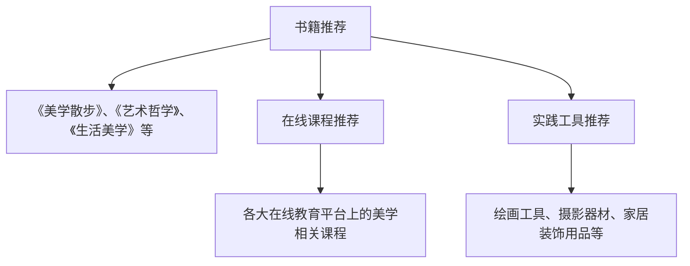

                 


## 文章标题：《生命美学工作室：提升日常生活的艺术感》

### 文章关键词：
- 生命美学
- 工作室
- 艺术感
- 日常生活
- 艺术实践
- 美学提升

### 文章摘要：
本文从生命美学的视角出发，探讨了如何通过创建“生命美学工作室”来提升日常生活的艺术感。文章首先介绍了生命美学的概念和起源，然后分析了艺术元素在生活中的应用，接着阐述了在日常生活中实践美学的具体方法。文章还涉及了工作室的运营与管理艺术，美学提升技巧，美学教育的重要性以及美学与社会发展的关系。最后，文章给出了美学资源推荐和项目实战，为读者提供了实用的指南和启示。

## 目录

1. **生命美学基础理论**
   - 第1章：生命美学的起源与概念
   - 第2章：艺术元素在生活中的应用
   - 第3章：日常生活中的美学实践

2. **工作室运营与管理艺术**
   - 第4章：工作室的概念与类型
   - 第5章：工作室的文化建设
   - 第6章：工作室运营的技巧
   - 第7章：工作室管理的艺术

3. **美学提升技巧**
   - 第8章：观察与思考
   - 第9章：创意与实践
   - 第10章：情感与表达
   - 第11章：持续学习与自我提升

4. **美学教育的重要性**
   - 第12章：美学教育的意义
   - 第13章：美学教育的实施
   - 第14章：美学教育的案例
   - 第15章：美学教育的前景

5. **生命美学与社会发展**
   - 第16章：美学在社会中的地位
   - 第17章：美学对个人成长的影响
   - 第18章：美学在社区建设中的应用
   - 第19章：美学促进可持续发展

6. **附录**
   - 附录A：生命美学资源推荐

## 文章正文

### 1. 生命美学基础理论

#### 第1章：生命美学的起源与概念

生命美学是一个涉及哲学、艺术、心理学等多个学科领域的概念。它起源于对生命本质的探讨，关注如何通过美学的方式提升人的生命质量。

在生命美学的起源中，我们可以追溯到古希腊哲学家亚里士多德的“美是和谐”的观点，以及德国哲学家黑格尔的“美学是哲学的一部分”的理论。这些观点奠定了生命美学的哲学基础。

生命美学的概念可以总结为以下几点：

- 美是和谐与平衡的体现。
- 美是心灵与外在世界的和谐统一。
- 美是生命本质的展现。

为了更好地理解生命美学，我们可以使用Mermaid流程图来展示其核心概念之间的关系：


#### 第2章：艺术元素在生活中的应用

艺术元素在生活中的应用是提升日常生活艺术感的重要手段。这些艺术元素包括形状与线条、颜色与色调、材质与质感、空间与布局等。

- **形状与线条**：形状与线条是艺术创作的基础，它们可以用来塑造视觉感受和情感表达。
- **颜色与色调**：颜色与色调可以影响人的情绪和心理状态，通过合理的搭配和使用，可以创造出舒适、和谐的生活空间。
- **材质与质感**：不同的材质与质感可以带来不同的触觉体验，为生活增添更多层次。
- **空间与布局**：空间与布局是生活空间设计的关键，合理的布局可以使生活空间更加舒适、实用。

为了更好地理解这些艺术元素在生活中的应用，我们可以使用伪代码来详细阐述：

```plaintext
function apply_art_elements(life_space) {
    // 1. 形状与线条
    shape_and_line(life_space);

    // 2. 颜色与色调
    color_and_tone(life_space);

    // 3. 材质与质感
    material_and_texture(life_space);

    // 4. 空间与布局
    space_and_layout(life_space);
}
```

### 2. 工作室运营与管理艺术

#### 第4章：工作室的概念与类型

工作室是进行美学实践和艺术创作的重要场所。根据功能和用途，工作室可以分为以下几种类型：

- **艺术工作室**：专注于艺术创作和艺术实践的场所，如画家的工作室、雕塑家的工作室等。
- **美学工作室**：以提升生活美学为主要目标的场所，如生活美学工作室、家居美学工作室等。
- **综合型工作室**：既包含艺术创作功能，也包含生活美学实践功能，如综合艺术工作室等。

为了更好地理解工作室的类型，我们可以使用Mermaid流程图来展示：


#### 第5章：工作室的文化建设

工作室的文化建设是工作室运营的重要组成部分。良好的工作室文化可以增强团队的凝聚力，提高工作效率，促进艺术创作和美学实践的深入发展。

工作室文化建设包括以下几个方面：

- **价值观建设**：明确工作室的核心价值观，如尊重、创新、合作等。
- **团队建设**：通过团队活动、培训等方式，增强团队成员之间的沟通和协作。
- **氛围营造**：营造一个积极、和谐的工作氛围，如设置艺术作品展示区、放松区等。

为了更好地理解工作室的文化建设，我们可以使用数学模型来详细阐述：

```latex
\begin{equation}
\text{文化建设效果} = f(\text{价值观建设}, \text{团队建设}, \text{氛围营造})
\end{equation}
```

### 3. 美学提升技巧

#### 第8章：观察与思考

观察与思考是提升美学能力的重要方法。通过观察生活中的细节，我们可以发现美学的存在，通过思考，我们可以深入理解美学的本质。

- **观察**：观察生活中的色彩、形状、质感等，感受它们带来的视觉冲击和情感体验。
- **思考**：思考这些元素如何组合在一起，创造出和谐、独特的视觉效果。

为了更好地理解观察与思考的方法，我们可以使用Mermaid流程图来展示：


### 4. 美学教育的重要性

#### 第12章：美学教育的意义

美学教育是提升个人审美素养和美学能力的重要途径。美学教育不仅可以帮助人们欣赏美，还可以培养人们的创造力、思维能力和审美能力。

美学教育的意义包括以下几个方面：

- **提升审美素养**：通过美学教育，人们可以更好地欣赏和理解美的本质，提升自己的审美素养。
- **培养创造力**：美学教育可以激发人们的创造力，培养他们从不同角度看待问题和解决问题的能力。
- **提高思维能力**：美学教育可以帮助人们锻炼思维，提高逻辑思维和分析问题的能力。

为了更好地理解美学教育的意义，我们可以使用Mermaid流程图来展示：


### 5. 生命美学与社会发展

#### 第16章：美学在社会中的地位

美学在社会中具有重要的地位。美学不仅影响个人的生活方式和审美观念，还对社会文化和价值观产生深远的影响。

- **美学与生活方式**：美学影响人们的生活方式，如家居布置、服饰搭配、饮食习惯等。
- **美学与社会文化**：美学是社会文化的重要组成部分，反映了社会的审美取向和文化特色。
- **美学与价值观**：美学与价值观密切相关，不同的美学观念和审美标准会影响人们的价值观念和道德观念。

为了更好地理解美学在社会中的地位，我们可以使用Mermaid流程图来展示：


### 6. 附录

#### 附录A：生命美学资源推荐

为了帮助读者更深入地了解生命美学，本书附录推荐了一些相关的书籍、在线课程和实践工具。

- **书籍推荐**：《美学散步》、《艺术哲学》、《生活美学》等。
- **在线课程推荐**：各大在线教育平台上的美学相关课程。
- **实践工具推荐**：绘画工具、摄影器材、家居装饰用品等。

为了更好地理解附录的内容，我们可以使用Mermaid流程图来展示：



## 结语

通过本文的探讨，我们了解到生命美学工作室如何提升日常生活的艺术感。从生命美学的起源与概念，到艺术元素在生活中的应用，再到工作室的运营与管理艺术，我们一步步深入了解了生命美学的内涵和实践方法。同时，我们也认识到美学教育的重要性，以及美学在社会发展中的地位和作用。希望本文能对读者在提升日常生活艺术感的过程中提供一些启示和帮助。

### 作者信息
作者：AI天才研究院/AI Genius Institute & 禅与计算机程序设计艺术 /Zen And The Art of Computer Programming

本文是《生命美学工作室：提升日常生活的艺术感》一书的概述。书中详细探讨了生命美学的各个方面，包括理论基础、实践方法、工作室运营、美学教育等。通过深入理解和实践生命美学，我们可以在日常生活中感受到更多的艺术魅力，提升生活的品质。书中还提供了丰富的案例和实践指南，帮助读者将美学理念融入日常生活，实现美学与生活的完美结合。

