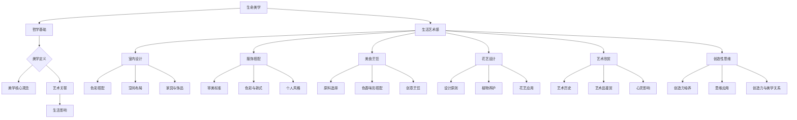

                 

### 文章标题

“生命美学课程：提升日常生活的艺术感”

在这个快速变化的时代，我们的生活节奏越来越快，压力与日俱增。在这样的背景下，寻找生活之美、提升日常生活的艺术感变得尤为重要。本文将探讨生命美学的哲学基础，分析美学与艺术的关系，探讨如何通过室内设计、服饰搭配、美食烹饪、花艺设计、艺术欣赏和创造性思维等方面提升日常生活的艺术感。我们还将深入探讨生命美学课程的设计原则与实践，以及生命美学与心理健康和社区发展的关系，最终展望生命美学教育的未来。

### 关键词

- 生命美学
- 日常生活的艺术感
- 室内设计
- 服饰搭配
- 美食烹饪
- 花艺设计
- 创造性思维
- 心理健康
- 社区发展

### 摘要

本文围绕生命美学这一主题，探讨了其哲学基础和日常生活中的艺术感提升方法。通过分析室内设计、服饰搭配、美食烹饪、花艺设计、艺术欣赏和创造性思维等方面，本文展示了如何通过具体的实践提升日常生活的艺术感。同时，文章还深入探讨了生命美学课程的设计原则与实践，以及其对心理健康和社区发展的积极影响。通过本文的探讨，我们希望读者能够更好地理解生命美学的内涵，并在日常生活中实践美学理念，提升生活质量。

### 目录大纲

## 生命美学课程：提升日常生活的艺术感

### 第1章：生命美学的哲学基础

#### 1.1 美学的定义与核心观念

- 美学的概念演变
- 美学的基本原则
- 美学与现代生活的关系

#### 1.2 生命哲学的探讨

- 生命的本质
- 生命的美学价值
- 生命美学的内涵

#### 1.3 美学与艺术的关联

- 艺术与美学的关系
- 艺术在生命美学中的应用

#### 1.4 生命美学对生活方式的影响

- 生命美学与个人修养
- 生命美学与家庭生活
- 生命美学与工作态度

## 第2章：提升日常生活的艺术感

#### 2.1 室内设计中的生命美学

- 色彩搭配
- 空间布局
- 家具与饰品的选择

#### 2.2 服饰搭配的艺术

- 服饰的审美标准
- 色彩与款式的搭配
- 个人风格的表达

#### 2.3 美食烹饪的艺术

- 原料的选择
- 色香味形的搭配
- 创意烹饪

#### 2.4 花艺设计与植物养护

- 花艺设计的基本原则
- 植物养护的方法
- 花艺在生活中的应用

#### 2.5 艺术欣赏与鉴赏

- 艺术的历史与发展
- 艺术品的鉴赏
- 艺术对心灵的影响

#### 2.6 日常生活中的创造性思维

- 创造力的培养
- 创造性思维的应用
- 创造力与生命美学的关系

## 第3章：生命美学课程实践

#### 3.1 生命美学课程的设计原则

- 教学目标
- 教学方法
- 教学资源

#### 3.2 生命美学课程案例分享

- 家庭生活美学课程
- 职场美学课程
- 社区美学课程

#### 3.3 生命美学课程的评估与反思

- 学生反馈
- 教学效果评估
- 教学反思与改进

## 第4章：生命美学与心理健康

#### 4.1 美学与心理健康的关系

- 心理健康的定义
- 美学对心理健康的影响

#### 4.2 生命美学对心理健康的作用

- 缓解压力
- 提升幸福感
- 增强心理韧性

#### 4.3 美学治疗的应用

- 美学治疗的概念
- 美学治疗的实践案例

## 第5章：生命美学与社区发展

#### 5.1 社区美学的理念

- 社区美学的发展背景
- 社区美学的核心观念

#### 5.2 社区美学的实践

- 社区美学生活环境的营造
- 社区文化活动的设计与组织
- 社区美学教育的推广

#### 5.3 社区美学对社区发展的作用

- 社区凝聚力的增强
- 社区文化的繁荣
- 社区生活质量的提升

## 第6章：生命美学教育的未来展望

#### 6.1 生命美学教育的发展趋势

- 教育体制的变革
- 教学模式的创新
- 教育资源的整合

#### 6.2 生命美学教育的目标与使命

- 培养审美能力
- 塑造美好人生
- 促进社会和谐

#### 6.3 生命美学教育的挑战与机遇

- 教育理念的创新
- 教育方法的改革
- 教育资源的公平分配

## 第7章：生命美学课程工具与资源

#### 7.1 生命美学课程相关工具

- 室内设计软件
- 服饰搭配软件
- 美食烹饪软件

#### 7.2 生命美学课程资源

- 美学理论书籍
- 艺术欣赏教材
- 美学实践案例库

#### 7.3 生命美学课程资源平台推荐

- 在线课程平台
- 学术期刊库
- 社交媒体资源

## 附录：生命美学课程实践案例

### 附录 1：家庭生活美学实践案例

- 家居装饰改造
- 服饰搭配案例
- 美食烹饪案例

### 附录 2：社区美学实践案例

- 社区文化活动案例
- 社区环境美化案例
- 社区美学教育推广案例

## Mermaid 流程图

### 第1章：生命美学的哲学基础

#### 1.1 美学的定义与核心观念

美学作为一门哲学学科，探讨美、艺术及其相关现象的根源和本质。美学的研究领域广泛，包括自然美、艺术美、社会美和科学美等。美学的定义历经多个阶段的演变，但总的来说，美学关注的是人类对美的感知、理解和创造。

在美学概念的历史演变中，古希腊哲学家如柏拉图和亚里士多德对美进行了早期的探讨。柏拉图认为美是形式和实质的完美结合，而亚里士多德则强调美是多样性的和谐统一。19世纪的德国哲学家康德进一步发展了美学理论，提出了审美判断的纯粹性和无功利性。

美学的基本原则包括形式与内容的统一、多样性与和谐的统一、主观性与客观性的统一等。形式与内容的关系是美学研究的核心，形式美是艺术作品的外在表现，而内容美则是作品的内在意义。多样性与和谐统一的观点认为，美学创作需要既保持多样性，又实现整体的和谐统一。

美学与现代生活的关系日益密切。现代社会中，美学观念渗透到生活的各个方面，从家居设计到服饰搭配，从美食烹饪到艺术欣赏，美学的影响无处不在。美学不仅提高了人们的生活质量，还丰富了人们的内心世界，使人们更加关注生活的本质和意义。

#### 1.2 生命哲学的探讨

生命哲学是对生命本质和生命价值的探讨。生命哲学认为，生命不仅仅是生物学意义上的存在，更是一种深层次的、具有精神内涵的存在。生命的本质在于其内在的活力和创造力，生命的价值则在于其对世界和自身的贡献。

在生命哲学中，生命的本质可以理解为一种动态的过程，这种过程包含了个体生命的成长、成熟和消亡。生命的活力和创造力表现在个体不断学习、成长和创造的能力上。每个个体都是独特的，他们通过自己的方式与外部世界互动，创造属于自己的生命轨迹。

生命的美学价值体现在对美的追求和创造上。人类作为生命体，具有独特的感知能力和创造力，这使得人类能够在自然界中发现美，并创造出艺术作品。艺术作品不仅反映了生命的独特性，还表达了对生命的尊重和热爱。

生命美学的内涵则是指通过美来理解和提升生命的过程。生命美学强调，美不仅仅是视觉上的愉悦，更是一种精神上的满足和提升。通过美，人们能够更深刻地认识自我和世界，从而实现生命的提升。

#### 1.3 美学与艺术的关联

美学与艺术有着密切的关联。艺术是美学研究的重要对象，而美学则为艺术提供了理论支持。在美学视野中，艺术不仅是美的表现，更是人类精神世界的载体。

艺术与美学的关系可以从以下几个方面来理解：

1. **美学是艺术的理论基础**：美学为艺术提供了理论框架和概念工具，帮助艺术家理解艺术创作的本质和目标。
2. **艺术是美学的实践应用**：艺术家通过创作艺术作品，将美学理论转化为具体的形式，实现美学的理念。
3. **艺术与美学的互动**：在艺术创作和欣赏过程中，艺术家和观众不断进行互动，共同丰富和发展美学理论。

艺术在生命美学中的应用主要体现在以下几个方面：

1. **提升生活质量**：通过艺术创作和欣赏，人们能够提升生活质量，使生活更加美好和有意义。
2. **表达情感和思想**：艺术作品能够传达艺术家内心的情感和思想，帮助观众更好地理解自我和世界。
3. **促进社会和谐**：艺术具有独特的教育功能，能够促进社会和谐，提升人们的道德观念和文化素养。

#### 1.4 生命美学对生活方式的影响

生命美学对个人生活方式产生了深远的影响。通过美学理念的实践，人们能够提升生活质量，培养健康的生活态度，并在个人修养、家庭生活和工作中找到更多的意义和乐趣。

首先，在个人修养方面，生命美学强调内心的平静和和谐。通过美学教育，人们能够更好地认识自我，提升自我修养。例如，通过学习色彩搭配和室内设计，人们能够创造出更加舒适和和谐的生活环境，从而提升内心的幸福感。

其次，在家庭生活方面，生命美学提倡通过美的创造和欣赏来提升家庭生活的质量。家庭成员可以通过共同参与家居装饰、烹饪和艺术创作等活动，增进彼此的感情，营造温馨和谐的家庭氛围。

最后，在工作态度方面，生命美学鼓励人们以美学理念来对待工作。通过艺术创作和欣赏，人们能够提升创造力，培养积极向上的工作态度。例如，在职场中，通过优化办公环境、组织艺术展览等活动，可以激发员工的创造力和工作热情。

总之，生命美学对个人生活方式的影响是多方面的，它不仅提升了人们的生活质量，还促进了个人成长和社会和谐。

### 第2章：提升日常生活的艺术感

#### 2.1 室内设计中的生命美学

室内设计是提升日常生活艺术感的重要环节。通过色彩搭配、空间布局和家具与饰品的选择，可以创造出舒适和谐的生活环境，从而提升生活的艺术感。

**色彩搭配**

色彩在室内设计中扮演着至关重要的角色。不同的色彩能够营造出不同的氛围和情感。在色彩搭配方面，可以遵循以下原则：

1. **主色调与辅色调**：选择一种主色调作为整体空间的主导颜色，再搭配一至两种辅色调来点缀，形成和谐统一的视觉效果。
2. **对比色与调和色**：对比色能够产生强烈的视觉效果，调和色则使空间更加温馨和谐。合理运用对比色和调和色，可以创造出富有层次感和美感的空间。
3. **自然色调**：自然色调如大地色、绿色和蓝色等，能够营造出宁静、放松的氛围，有助于减轻压力，提升生活品质。

**空间布局**

空间布局是室内设计的关键。合理的空间布局能够提升空间的实用性和美观度。以下是一些建议：

1. **功能分区**：根据实际需求，将空间划分为不同的功能区，如客厅、卧室、厨房等，确保每个区域都有明确的功能和使用便捷。
2. **动线流畅**：动线是指人在空间中行走的路径。设计时，应确保动线流畅，避免出现不必要的障碍，提升空间的使用效率。
3. **视觉焦点**：通过设计视觉焦点，如一面墙的装饰画、一组沙发或一盆大型植物等，吸引人们的视线，增强空间的层次感。

**家具与饰品的选择**

家具和饰品的选择直接影响室内空间的风格和氛围。以下是一些建议：

1. **风格统一**：在选择家具和饰品时，应尽量保持风格的统一，避免出现风格冲突，影响整体的美观度。
2. **功能与美观并重**：选择具有实用功能的家具，如多功能沙发、可折叠的桌子等，既能满足实际需求，又不会占用过多空间。
3. **创意饰品**：创意饰品能够为室内空间增添亮点，提升空间的个性化和艺术感。例如，独特造型的花瓶、挂画、地毯等。

通过以上方法，室内设计不仅可以提升日常生活艺术感，还能营造出舒适、温馨的生活环境，使生活更加美好。

#### 2.2 服饰搭配的艺术

服饰搭配是提升日常生活艺术感的重要手段。通过服饰的审美标准、色彩与款式的搭配以及个人风格的表达，可以展现出独特的个性和品味，提升生活品质。

**服饰的审美标准**

服饰的审美标准是判断服饰是否美观和合适的重要依据。以下是一些常见的审美标准：

1. **线条与剪裁**：流畅的线条和得体的剪裁是服饰美观的关键。设计师通过精湛的工艺，使服饰线条流畅、轮廓清晰，提升整体的美感。
2. **色彩搭配**：色彩是服饰设计中的重要元素。合理的色彩搭配能够增强服饰的美感，使穿着者更加光彩照人。常见的色彩搭配原则有主色调与辅色调、对比色与调和色等。
3. **材质选择**：服饰的材质直接影响其触感和视觉效果。优质的面料不仅能提升服饰的质感，还能使穿着者更加舒适。
4. **时尚元素**：时尚元素是服饰设计中不可或缺的部分。通过融入流行元素，如时尚图案、独特剪裁等，使服饰更具个性和时尚感。

**色彩与款式的搭配**

色彩与款式的搭配是服饰搭配的关键。以下是一些实用的搭配技巧：

1. **同色系搭配**：选择同一色系的不同深浅、明暗度进行搭配，可以营造出协调、优雅的效果。
2. **对比色搭配**：对比色搭配能够产生强烈的视觉效果，使穿着者更加显眼。但要注意，对比色搭配需谨慎使用，以免造成过于突兀的视觉效果。
3. **混搭风格**：混搭风格是一种将不同风格、不同材质的服饰进行组合的搭配方式。通过巧妙地运用混搭，可以创造出独特的个人风格，提升服饰的趣味性。

**个人风格的表达**

个人风格是服饰搭配的最终目标。以下是一些表达个人风格的方法：

1. **简洁大方**：简洁大方的风格适合各种场合，适合大多数人。通过选择简洁的款式和经典的颜色，可以营造出大方得体的效果。
2. **个性化元素**：通过个性化的元素，如独特的图案、设计或饰品，可以展现个人的独特品味和风格。
3. **时尚与经典结合**：时尚与经典的结合是提升个人风格的有效方式。通过将时尚元素融入经典款式，可以创造出既有时尚感又不失经典魅力的服饰搭配。

通过以上方法，服饰搭配不仅能够提升日常生活的艺术感，还能展现个人的独特魅力，使生活更加丰富多彩。

#### 2.3 美食烹饪的艺术

美食烹饪是提升日常生活艺术感的重要途径之一。通过原料的选择、色香味形的搭配以及创意烹饪，可以创造出美味、美观的菜肴，提升用餐体验和生活品质。

**原料的选择**

原料的选择是美食烹饪的基础。优质的原材料不仅决定了菜肴的口感，还影响了菜肴的营养价值。以下是一些建议：

1. **新鲜与天然**：新鲜的原材料能够保证菜肴的最佳口感和营养价值。选择新鲜的水果、蔬菜、肉类和海鲜，能够提升菜肴的整体品质。
2. **多样性与季节性**：多样化的原料能够为菜肴带来丰富的口味和营养。根据季节选择当季的食材，不仅能够保证食材的新鲜，还能体验季节的变化。
3. **品质与成本**：在选择原材料时，要综合考虑品质和成本。虽然优质的原材料价格较高，但能够提升菜肴的整体品质，值得投资。

**色香味形的搭配**

色香味形的搭配是美食烹饪的关键。通过合理的搭配，可以创造出美味、美观的菜肴。以下是一些建议：

1. **色彩搭配**：色彩搭配能够吸引人们的视线，提升菜肴的视觉吸引力。可以运用对比色和调和色的原理，选择颜色鲜艳、搭配和谐的食材，如红色番茄搭配绿色菠菜。
2. **香味搭配**：香味搭配能够增强菜肴的口感和食欲。可以运用不同的香料和调料，如迷迭香、黑胡椒、大蒜等，为菜肴增添独特的香味。
3. **口感搭配**：口感搭配能够为人们带来不同的味觉体验。可以结合不同质地和口感的食材，如脆脆的蔬菜、嫩滑的肉类，创造出丰富的口感层次。
4. **形状搭配**：形状搭配能够提升菜肴的美观度。可以运用切割和摆盘技巧，将食材切成不同的形状，如薄片、块状、球形等，使菜肴更加美观。

**创意烹饪**

创意烹饪是提升日常生活艺术感的重要手段。通过创新烹饪方法和食材组合，可以创造出独特的菜肴，为生活增添乐趣。以下是一些建议：

1. **融合菜系**：将不同的菜系进行融合，创造出具有创新性的菜肴。如将中餐的烹饪技巧应用到西餐中，或将西餐的食材和调料应用到中餐中，创造出新的口味。
2. **个性化调味**：通过个性化的调味，为菜肴增添独特的风味。可以尝试使用不同类型的调料，如辣椒、柠檬汁、香草等，创造出独特的口味。
3. **创意摆盘**：通过创意摆盘，使菜肴更加美观和吸引人。可以运用艺术摆盘技巧，如立体造型、色彩搭配等，提升菜肴的视觉效果。

通过以上方法，美食烹饪不仅能够提升日常生活的艺术感，还能为人们带来美味、健康的用餐体验，使生活更加丰富多彩。

#### 2.4 花艺设计与植物养护

花艺设计与植物养护是提升日常生活艺术感的又一重要途径。通过基本设计原则、植物养护方法以及花艺在生活中的应用，可以营造出自然、美观的室内外环境，提升生活的品质和幸福感。

**花艺设计的基本原则**

花艺设计遵循一些基本的原则，使作品既美观又具有艺术感。以下是一些关键原则：

1. **对称与不对称**：对称的花艺设计给人以稳定和谐的感觉，而不对称的设计则更具动态感和灵活性。可以根据具体场合和个人喜好选择。
2. **比例与平衡**：花艺作品的比例和平衡感对于整体效果至关重要。合理分配花材的大小、数量和位置，可以创造出和谐优美的视觉效果。
3. **层次与深度**：通过不同高度和层次的花材组合，可以创造出丰富的空间感。层次感使花艺作品更加立体和生动。
4. **色彩与形态**：色彩和形态的搭配能够增强花艺作品的视觉效果。可以通过对比色、互补色或相近色来选择花材，创造出鲜艳或柔和的色彩组合。

**植物养护的方法**

植物养护是保持花艺作品鲜活美观的关键。以下是一些植物养护的基本方法：

1. **水分管理**：根据植物的需求给予适量的水分，避免过湿或过干。不同植物对水分的需求不同，需要具体分析。
2. **光照条件**：不同植物对光照的需求也不同。有些植物需要充足的阳光，而有些则需要半阴或阴凉的环境。了解植物的光照需求，并为其提供适宜的光照条件，有助于植物的健康生长。
3. **温度控制**：植物对温度的适应范围有限。过热或过冷的环境都可能对植物造成伤害。保持适宜的室内温度，并根据季节变化调整植物养护措施，是确保植物健康的关键。
4. **肥料施用**：适量施用肥料，可以为植物提供必要的营养，促进其生长。不同植物对肥料的种类和用量有不同的要求，需要根据具体情况选择合适的肥料。

**花艺在生活中的应用**

花艺设计不仅限于装饰，还可以在生活中发挥多种用途，提升生活的艺术感：

1. **室内装饰**：在客厅、卧室、书房等室内空间摆放花艺作品，可以营造出温馨、自然的氛围，提升室内环境的视觉效果。
2. **户外装饰**：在庭院、阳台、花园等户外空间布置花艺作品，可以美化环境，增强空间的层次感和自然气息。
3. **节日庆典**：在节日或庆典活动中，花艺设计可以起到装饰和点缀作用，增添喜庆气氛。
4. **礼品赠送**：精美的花艺作品可以作为礼品赠送，表达祝福和关爱。

通过以上方法，花艺设计与植物养护不仅能够提升日常生活的艺术感，还能为人们带来自然之美，使生活更加美好和丰富。

#### 2.5 艺术欣赏与鉴赏

艺术欣赏与鉴赏是提升日常生活艺术感的重要途径之一。通过艺术的历史与发展、艺术品的鉴赏以及艺术对心灵的影响，我们可以更深刻地理解艺术的价值，并在日常生活中感受艺术的魅力。

**艺术的历史与发展**

艺术是人类文明的重要组成部分，具有悠久的历史和丰富的多样性。从古代的壁画、雕塑，到中世纪的宗教艺术，再到现代的各种流派，艺术的发展历程反映了人类文化和社会的变迁。

1. **古代艺术**：古希腊和古罗马时期的艺术以其独特的美学和工艺闻名。古希腊的雕塑作品如《大卫像》展现了人体美的完美，古罗马的壁画和建筑则反映了当时的政治和文化生活。
2. **中世纪艺术**：中世纪的宗教艺术如教堂壁画和雕塑作品，强调了宗教主题和宗教信仰。这一时期的艺术作品深受宗教影响，具有强烈的象征意义。
3. **文艺复兴艺术**：文艺复兴时期的艺术作品强调人文主义和自然美。达芬奇的《蒙娜丽莎》和米开朗基罗的《大卫像》都是这一时期艺术的代表作品。
4. **现代艺术**：19世纪末至20世纪初的现代艺术流派繁多，包括印象派、立体派、抽象派等。这些流派在艺术形式和表现手法上进行了大胆的创新，丰富了艺术的表现力。

**艺术品的鉴赏**

艺术品的鉴赏是理解和欣赏艺术作品的重要步骤。以下是一些鉴赏艺术品的基本方法：

1. **观察细节**：仔细观察艺术作品中的细节，如线条、色彩、形状和质感等，可以更深入地理解艺术家的创作意图和艺术风格。
2. **分析形式**：形式是艺术作品的核心。通过分析艺术作品的形式，如构图、比例、对称和平衡等，可以理解艺术作品的美学价值。
3. **了解背景**：了解艺术作品的创作背景和历史背景，有助于更好地理解艺术作品的主题和意义。
4. **情感体验**：艺术欣赏是一种情感体验。通过感受艺术作品带来的情感共鸣，可以加深对艺术作品的欣赏和理解。

**艺术对心灵的影响**

艺术作品不仅具有美学价值，还对人的心灵产生深远的影响。以下是一些艺术对心灵的影响：

1. **情感表达**：艺术作品能够传达艺术家的情感和思想，激发观众的共鸣。通过欣赏艺术作品，人们可以表达和宣泄自己的情感。
2. **心理调节**：艺术欣赏有助于缓解压力和焦虑。通过沉浸于艺术作品，人们可以暂时忘却烦恼，获得内心的平静和安宁。
3. **自我认知**：艺术欣赏可以促进自我认知。通过欣赏不同风格和主题的艺术作品，人们可以反思自己的生活和价值观。
4. **创造力提升**：艺术欣赏可以激发人们的创造力和想象力。通过观察和分析艺术作品，人们可以学习到新的艺术表达方式，提升自己的创造力。

通过艺术欣赏与鉴赏，我们可以更好地理解艺术，提升日常生活艺术感，使生活更加丰富多彩。

#### 2.6 日常生活中的创造性思维

创造性思维是提升日常生活艺术感的重要途径之一。通过创造力的培养、创造性思维的应用以及创造力与生命美学的关系，我们可以更好地发挥创造力，使生活充满活力和艺术感。

**创造力的培养**

培养创造力是提升日常生活艺术感的第一步。以下是一些培养创造力的方法：

1. **多角度思考**：在面对问题时，尝试从多个角度思考，寻找不同的解决方案。这种多角度的思考能够激发创造力，帮助我们发现新的可能性。
2. **挑战常规**：不拘泥于传统观念，勇于挑战常规，打破固有的思维模式。通过挑战常规，我们可以创造出新的想法和解决方案。
3. **持续学习**：不断学习新知识和技能，扩展自己的知识面。知识是创造力的基础，通过不断学习，我们可以获取更多的灵感。
4. **尝试新事物**：勇于尝试新的事物，如学习新的艺术形式、尝试新的烹饪方法等。尝试新事物可以激发创造力，使我们更加开放和灵活。

**创造性思维的应用**

创造性思维的应用可以帮助我们在日常生活中创造出更多美好的事物。以下是一些应用创造性思维的方法：

1. **创新设计**：在室内设计、服饰搭配和花艺设计等方面，通过创造性思维，我们可以创造出独特且美观的作品。例如，通过混合不同的材料和颜色，可以创造出新颖的艺术作品。
2. **创意烹饪**：通过创造性思维，我们可以创造出独特的美食。例如，尝试将不同的食材和烹饪方法结合，可以创造出新的菜品。
3. **创意活动**：在家庭聚会、朋友聚会等活动中，通过创造性思维，我们可以策划出有趣的活动，提升活动的趣味性和参与度。

**创造力与生命美学的关系**

创造力与生命美学密切相关。创造力是生命美学的源泉，而生命美学则是创造力的表达。以下是一些创造力与生命美学的关系：

1. **美的创造**：创造力使我们能够创造出美的事物。无论是艺术创作、设计作品还是烹饪美食，创造力的发挥都可以创造出美的作品。
2. **生活质量的提升**：通过创造性思维，我们可以提升生活质量。例如，通过创造性思维设计的家居环境、服饰搭配和花艺作品，都可以提升生活的艺术感。
3. **心理健康的促进**：创造性思维有助于缓解压力和焦虑，提升心理健康。通过创造性的活动，我们可以获得内心的平静和满足。

通过培养创造力、应用创造性思维，我们可以提升日常生活的艺术感，使生活更加丰富多彩。创造力不仅是一种技能，更是一种生活态度，它使我们能够发现生活中的美，创造出属于自己的艺术人生。

### 第3章：生命美学课程实践

#### 3.1 生命美学课程的设计原则

生命美学课程的设计原则是为了确保课程能够有效地传授美学理念，提升学生的审美能力和生活品质。以下是生命美学课程设计的主要原则：

**教学目标**

教学目标是课程设计的核心。生命美学课程的教学目标主要包括：

1. **提升审美能力**：通过系统的美学教育，培养学生对美的感知、理解和创造能力。
2. **培养美学素养**：使学生掌握美学的基本概念和原则，理解美学在生活中的应用。
3. **增强创造性思维**：培养学生的创造性思维，使他们在生活中能够灵活运用美学理念，创造出独特的作品。

**教学方法**

教学方法是实现教学目标的关键。生命美学课程可采用以下几种教学方法：

1. **案例教学法**：通过具体的美学案例，让学生直观地了解美学原理在生活中的应用。
2. **互动式教学**：鼓励学生参与讨论和互动，通过小组活动和合作项目，培养学生的团队合作和表达能力。
3. **实践操作**：通过实际操作，如家居装饰设计、服饰搭配实践等，让学生亲身体验美学理念，提升实践能力。

**教学资源**

教学资源的丰富和多样性有助于提高教学效果。以下是生命美学课程所需的教学资源：

1. **教材与参考书**：提供高质量的教材和参考书，帮助学生系统地学习美学知识。
2. **多媒体资源**：利用视频、音频和图片等多媒体资源，增强学生对美学概念的理解。
3. **实践基地**：建立实践基地，如室内设计工作室、服饰搭配展示厅等，提供学生实践的机会。

#### 3.2 生命美学课程案例分享

**家庭生活美学课程**

家庭生活美学课程旨在通过美学教育提升家庭成员的生活质量。以下是一个典型的家庭生活美学课程案例：

**课程内容**：

1. **家居装饰设计**：学习家居色彩搭配、空间布局和家具选择等基本美学原则，设计自己的家居环境。
2. **服饰搭配实践**：通过服饰搭配课程，学习如何根据不同场合和自身特点进行服饰搭配，提升个人形象。
3. **美食烹饪技巧**：学习简单的烹饪技巧和创意菜肴制作，提升家庭餐食的美味与美观。
4. **花艺设计与植物养护**：学习基本的插花技巧和植物养护方法，为家庭环境增添自然美。

**教学过程**：

1. **理论讲解**：教师通过PPT和多媒体资源，讲解美学基本概念和实践技巧。
2. **案例分析**：分析经典家居装饰案例，让学生了解美学在家庭生活中的实际应用。
3. **互动讨论**：组织小组讨论，让学生分享自己的家居装饰、服饰搭配和烹饪心得。
4. **实践操作**：在实践基地进行实际操作，如家居装饰设计、服饰搭配展示和美食烹饪等。

**学生反馈**：

学生反馈普遍积极，认为家庭生活美学课程使他们对美学有了更深入的理解，并在实际生活中得以应用。以下是一些学生反馈：

- “通过这门课程，我学会了如何打造一个美观、舒适的家居环境。”
- “服饰搭配课程让我在日常生活中更加自信，提升了我的形象。”
- “烹饪技巧的学习让我更愿意为家人准备美味的餐点，提升了家庭生活的幸福感。”

**课程效果**：

家庭生活美学课程显著提升了学生的审美能力和生活品质。通过课程学习，学生不仅掌握了美学基本知识，还在家庭生活中运用了这些知识，创造了更加美好和谐的生活环境。

**职场美学课程**

职场美学课程旨在提升员工的审美能力、工作积极性和团队凝聚力。以下是一个典型的职场美学课程案例：

**课程内容**：

1. **职场形象设计**：学习如何通过服饰、妆容和仪态提升职场形象，增强自信心。
2. **办公环境布置**：学习如何设计美观、舒适的办公环境，提升工作效率。
3. **商务礼仪**：学习商务礼仪，提升职场沟通能力和形象。
4. **艺术欣赏与鉴赏**：通过艺术欣赏和鉴赏，提升审美素养，培养高雅的品位。

**教学过程**：

1. **理论讲解**：教师通过PPT和多媒体资源，讲解职场美学的基本原则和实践技巧。
2. **案例分析**：分析成功的职场形象和办公环境案例，让学生了解美学在职场中的应用。
3. **互动讨论**：组织小组讨论，让学生分享职场形象设计、办公环境布置和艺术欣赏的经验。
4. **实践操作**：在办公室进行实际操作，如设计职场形象、布置办公环境等。

**学生反馈**：

学生反馈普遍表示，职场美学课程让他们在形象设计、工作环境和商务礼仪方面有了显著的提升。以下是一些学生反馈：

- “通过这门课程，我学会了如何打造一个专业、自信的职场形象。”
- “办公环境布置的学习让我对工作环境有了新的认识，提升了工作效率。”
- “艺术欣赏与鉴赏课程让我对职场生活中的美学有了更深刻的理解。”

**课程效果**：

职场美学课程显著提升了学生的职场形象和工作效率，增强了团队凝聚力和企业文化。通过课程学习，学生不仅在职场中更加自信和专业，还提升了团队的整体氛围和企业形象。

**社区美学课程**

社区美学课程旨在通过美学教育提升社区的整体环境和居民的生活质量。以下是一个典型的社区美学课程案例：

**课程内容**：

1. **社区环境美化**：学习如何通过绿化、装饰和空间布局提升社区环境的美观度。
2. **社区文化活动**：设计和组织各种社区文化活动，如艺术展览、音乐会、舞蹈表演等。
3. **社区美学教育**：向社区居民传授美学知识，提升他们的审美能力和生活品质。

**教学过程**：

1. **理论讲解**：教师通过PPT和多媒体资源，讲解社区美学的基本原则和实践技巧。
2. **实地考察**：组织学生进行实地考察，了解社区环境存在的问题，并提出改进方案。
3. **实践活动**：在社区内进行环境美化、文化活动设计和组织等实践活动。
4. **成果展示**：在社区内举办成果展示活动，展示学生的实践成果，提升居民的美学意识。

**学生反馈**：

学生反馈普遍表示，社区美学课程让他们对社区环境有了更深刻的认识，并通过实践活动提升了自身的能力。以下是一些学生反馈：

- “通过这门课程，我学会了如何美化社区环境，提升了居民的生活质量。”
- “社区文化活动的组织让我学会了团队合作，提升了沟通能力。”
- “社区美学教育让我更加关注生活美学，提升了我的审美素养。”

**课程效果**：

社区美学课程显著提升了社区的整体环境和居民的生活质量。通过课程学习，学生不仅提升了自身的能力，还积极参与到社区建设和文化活动中，为社区的发展做出了贡献。

#### 3.3 生命美学课程的评估与反思

**学生反馈**

学生反馈是评估生命美学课程效果的重要指标。通过收集和分析学生反馈，可以了解学生对课程内容和教学方法的满意度和改进意见。以下是部分学生反馈：

- “课程内容丰富，既学习了美学理论，又有实践操作，收获很大。”
- “教学方式生动有趣，互动性强，使学习过程更加轻松愉快。”
- “希望增加更多的实践机会，让我们能够更好地将所学应用到实际生活中。”

**教学效果评估**

教学效果评估是通过考试、作业、项目展示等多种方式，对学生在课程中的表现进行综合评估。以下是教学效果评估的一些关键指标：

1. **理论知识掌握**：通过考试和作业，评估学生对美学理论知识的掌握程度。
2. **实践操作能力**：通过项目展示和实际操作，评估学生将所学美学知识应用于实践的能力。
3. **创新思维**：通过创意项目和案例分析，评估学生的创造性思维和创新能力。
4. **综合素养**：通过学生的反馈和教师评价，评估学生的综合素养和审美能力的提升。

**教学反思与改进**

基于学生反馈和教学效果评估，教师应进行教学反思和改进，以提升课程的质量和效果。以下是一些具体的反思和改进措施：

1. **增加实践机会**：为了让学生更好地将所学应用到实际生活中，应增加实践课程和项目，提供更多动手操作的机会。
2. **优化教学方法**：根据学生的反馈，调整教学方法和手段，如增加互动讨论、案例分析等，提高学生的参与度和学习兴趣。
3. **丰富课程内容**：不断更新和丰富课程内容，引入更多的最新研究成果和实践案例，使学生能够学习到最新的美学理念。
4. **加强师资培训**：提升教师的专业素养和教学能力，定期进行师资培训，确保教师能够提供高质量的教学服务。

通过以上措施，生命美学课程将能够更好地满足学生的需求，提升课程的教学质量和效果，为学生的全面发展提供有力支持。

### 第4章：生命美学与心理健康

#### 4.1 美学与心理健康的关系

美学与心理健康之间存在密切的联系。美学关注的是人类对美的感知、理解和创造，而心理健康则涉及个体的情感状态、认知功能和整体幸福感。美学的理论和实践在多个层面上对心理健康产生积极影响。

首先，美学通过美的创造和欣赏，有助于缓解心理压力。美感能够激发人的情感共鸣，使人们在欣赏美的过程中获得愉悦和放松。例如，通过绘画、音乐、雕塑等艺术形式，人们可以释放内心的焦虑和紧张情绪，获得心理上的舒缓。

其次，美学教育有助于提升个体的自我认知和自尊心。通过学习美学理论和参与艺术创作，个体能够更好地理解自己和他人的情感，增强自我表达能力。这种自我认知的提升有助于增强个体的自信心和自尊心，从而改善心理健康。

此外，美学实践与心理健康之间的关联还体现在创造力和想象力的发展上。美学活动，如艺术创作、设计工作等，能够激发个体的创造力和想象力。创造力的发展有助于个体在面对挑战和压力时找到新的解决方案，提高心理韧性。

#### 4.2 生命美学对心理健康的作用

生命美学对心理健康具有多方面的积极作用。以下是一些具体的作用：

**缓解压力**

美学活动能够有效缓解心理压力。例如，通过观看美丽的自然风光、欣赏艺术作品或参与音乐演奏等活动，人们可以在短时间内放松身心，缓解紧张情绪。研究表明，美感能够促进大脑中与快乐和满足感相关的化学物质的分泌，如多巴胺，从而提升心理幸福感。

**提升幸福感**

生命美学通过提升个体的审美能力，有助于增强幸福感。美学教育使个体能够从日常生活中发现美好，感受到生活的乐趣。例如，通过学习室内设计，人们可以创造出舒适和谐的生活环境，提升生活的质量。这种美感的提升不仅体现在物质层面，更在于对精神世界的满足。

**增强心理韧性**

美学实践能够培养个体的心理韧性。例如，通过艺术创作，个体可以学会如何面对挫折和困难，通过创造性的方式解决问题。这种能力不仅有助于个体在现实生活中应对压力，还能提高他们在未来面对挑战时的心理韧性。

**促进自我成长**

生命美学教育有助于个体的自我成长。通过美学活动，个体能够更好地认识自己，理解自己的情感和需求。这种自我认知的提升有助于个体在人际关系中建立积极的互动，提高心理健康水平。

#### 4.3 美学治疗的应用

美学治疗是一种结合美学和心理学理论的治疗方法，旨在通过美的创造和欣赏，改善个体的心理健康。以下是一些美学治疗的应用场景：

**艺术疗法**

艺术疗法是一种常用的美学治疗形式，通过艺术创作（如绘画、雕塑、音乐创作等）来缓解心理压力和情绪困扰。艺术疗法有助于个体表达内心情感，提升自我认知和情绪调节能力。

**自然疗法**

自然疗法利用自然景观和自然环境来促进心理健康。例如，通过接触自然、欣赏美丽的自然风光，个体可以感受到自然之美，从而缓解压力，提升幸福感。

**室内设计疗法**

室内设计疗法通过优化室内环境，提升个体的生活质量和心理健康。例如，通过选择合适的色彩、布局和家具，可以创造出舒适、和谐的生活空间，有助于缓解压力，提升幸福感。

**艺术教育疗法**

艺术教育疗法通过系统的美学教育，提升个体的审美能力和心理健康水平。例如，通过参加艺术课程，个体可以学习艺术创作技巧，提升自我表达能力，改善心理健康。

**案例分析**

以下是一个关于美学治疗的应用案例：

**案例**：小王是一名长期压力过大的上班族，因工作繁忙、生活压力大而出现了失眠和焦虑症状。通过参加艺术疗法课程，小王开始学习绘画和音乐创作。在绘画和音乐创作过程中，小王逐渐找到了释放情绪的途径，通过色彩和音符表达内心的情感。几个月后，小王的睡眠质量得到了显著改善，焦虑症状也有所缓解，心理健康状况明显提升。

**结论**

美学治疗在改善心理健康方面具有显著作用。通过美的创造和欣赏，个体可以获得情感上的满足和心理上的舒缓，提升生活质量。未来，美学治疗有望在心理健康领域发挥更广泛的应用价值。

### 第5章：生命美学与社区发展

#### 5.1 社区美学的理念

社区美学是关注社区环境和居民生活质量的美学理念。它不仅关注物质环境的美化，更注重人文环境的提升，旨在通过美的创造和传播，促进社区的整体发展和居民的幸福生活。

**社区美学的发展背景**

社区美学的发展可以追溯到20世纪末，随着城市化进程的加速，人们对社区环境和生活质量的要求逐渐提高。在此背景下，社区美学理念应运而生，旨在通过美学手段改善社区环境，提升居民的生活品质。

**社区美学的核心观念**

1. **环境美化**：通过绿化、装饰和设计等手段，美化社区环境，提升居民的生活舒适度。
2. **文化传承**：保护和传承社区的文化遗产，弘扬社区文化，增强居民的文化认同感和归属感。
3. **人文关怀**：关注居民的心理需求，通过社区活动、文化教育等方式，提升居民的精神境界和幸福感。
4. **社会和谐**：通过美的创造和传播，促进社区内部的和谐与共融，增强社区的凝聚力。

#### 5.2 社区美学的实践

社区美学的实践涉及多个方面，包括社区环境美化、文化活动设计和社区美学教育等。以下是一些具体的实践方法：

**社区环境美化**

1. **绿化工程**：通过种植花草树木，建立社区花园和公园，提升社区的绿化率，创造宜居环境。
2. **公共艺术**：在社区内设置公共艺术装置，如雕塑、壁画等，提升社区的文化氛围和艺术气息。
3. **建筑设计**：在建筑设计中融入美学元素，如色彩搭配、空间布局和装饰细节，提升建筑的整体美观度。

**文化活动设计**

1. **节日庆典**：组织社区节日庆典活动，如春节、端午节、中秋节等，通过文艺演出、民俗活动等，弘扬传统文化，增强社区凝聚力。
2. **艺术展览**：定期举办艺术展览，展示社区居民的艺术创作成果，提升居民的艺术素养和审美水平。
3. **社区运动会**：组织社区运动会，通过体育活动，促进居民的健康和团结。

**社区美学教育**

1. **艺术课程**：开设艺术课程，如绘画、音乐、舞蹈等，培养居民的审美能力和艺术素养。
2. **文化讲座**：邀请专家学者进行文化讲座，传播美学知识和社区文化，提升居民的文化素养。
3. **社区参与**：鼓励居民参与社区美学活动的策划和实施，培养居民的参与感和责任感。

#### 5.3 社区美学对社区发展的作用

社区美学对社区发展具有多方面的积极影响：

**增强社区凝聚力**

通过社区美学实践，可以提升居民对社区的认同感和归属感，增强社区的凝聚力。例如，通过共同参与社区环境美化和文化活动，居民之间的关系更加紧密，社区的团结和和谐得到加强。

**提升生活质量**

社区美学实践通过美化社区环境、丰富文化活动和提高居民的艺术素养，显著提升了居民的生活质量。良好的社区环境和丰富的文化活动使居民的生活更加美好和有意义。

**促进文化传承**

社区美学实践有助于保护和传承社区的文化遗产。通过社区活动和文化讲座，传统文化得到弘扬和传承，社区的文化特色得以保留和发展。

**推动社区发展**

社区美学实践不仅提升了居民的生活质量，还为社区的发展提供了新的动力。通过引入美学理念，社区可以吸引更多的投资者和人才，促进社区的经济发展和社会进步。

总之，社区美学对社区发展的作用是多方面的，它不仅提升了居民的生活质量，还促进了社区的和谐与进步。通过持续的美学实践，社区可以成为一个美丽、和谐、富有活力的地方。

### 第6章：生命美学教育的未来展望

#### 6.1 生命美学教育的发展趋势

随着社会的发展和生活水平的提高，人们对生命美学教育的需求日益增加。未来，生命美学教育将呈现以下发展趋势：

**教育体制的变革**

未来的教育体制将更加注重培养学生的审美能力和创造力。学校和教育机构将逐渐引入生命美学课程，将其作为学生全面发展的重要组成部分。同时，教育体制也将更加灵活，鼓励个性化教育和跨学科学习，为学生提供多样化的学习机会。

**教学模式的创新**

未来的教学模式将更加注重互动和实践。教师将通过案例教学、项目学习等方式，引导学生参与美学实践，培养他们的审美判断和创造力。此外，虚拟现实（VR）和增强现实（AR）等技术也将被应用于美学教育，为学生提供更生动、直观的学习体验。

**教育资源的整合**

未来的生命美学教育将更加注重教育资源的整合。学校和社区将携手合作，共同开发美学课程和实践活动。同时，政府和社会组织也将提供更多的支持和资源，推动生命美学教育的普及和发展。

#### 6.2 生命美学教育的目标与使命

生命美学教育的目标与使命在于：

**培养审美能力**

通过系统的美学教育，帮助学生培养对美的感知、理解和创造能力。使学生能够在日常生活中发现美、欣赏美并创造美，提升他们的生活质量。

**塑造美好人生**

生命美学教育旨在帮助学生塑造美好的人生。通过美学教育，学生可以培养积极的人生态度，提升自我价值感和幸福感，实现个人的全面发展。

**促进社会和谐**

生命美学教育通过培养具备审美能力和创造力的人才，有助于促进社会和谐与进步。美学教育不仅提升了个人素质，也为社会文化的繁荣和发展提供了新的动力。

#### 6.3 生命美学教育的挑战与机遇

**教育理念的创新**

未来的生命美学教育需要创新教育理念，更加注重学生的个性发展和实践能力的培养。教师需不断更新教学观念，探索新的教学方法，以适应时代的发展。

**教育方法的改革**

传统的美学教育方法较为单一，未来的生命美学教育需要改革教学方法，注重互动和实践。通过引入案例教学、项目学习等新方法，提高教学效果。

**教育资源的公平分配**

目前，教育资源的分配存在不公平现象，未来的生命美学教育需关注教育资源的公平分配，确保所有学生都能享受到高质量的美学教育。

**社会支持的加强**

未来的生命美学教育需要得到社会各界的支持，包括政府、企业和社会组织的积极参与。通过多方合作，共同推动生命美学教育的发展。

总之，生命美学教育面临着一系列挑战和机遇。通过创新教育理念、改革教学方法、加强教育资源分配和社会支持，生命美学教育将迎来更加美好的未来。

### 第7章：生命美学课程工具与资源

#### 7.1 生命美学课程相关工具

生命美学课程的设计和实施需要一系列专业的工具和软件，以下是一些常用的工具：

**室内设计软件**

1. **AutoCAD**：一款功能强大的计算机辅助设计（CAD）软件，广泛用于建筑设计、室内设计和景观设计等领域。
2. **SketchUp**：一款简单易用的三维建模软件，适合初学者和专业人士，特别适合用于空间布局和家具设计。
3. **Adobe Photoshop**：一款专业的图像处理软件，可以用于家居装饰的图像编辑和设计。

**服饰搭配软件**

1. **StyleSwift**：一款基于人工智能的服饰搭配推荐软件，能够根据用户的喜好和场合提供个性化的搭配建议。
2. **Clutch**：一款提供虚拟试衣镜功能的软件，用户可以在手机或电脑上试穿不同的服饰，方便进行搭配选择。

**美食烹饪软件**

1. **Yummly**：一款基于搜索引擎的美食软件，用户可以搜索和发现各种烹饪食谱，并可以根据食材和口味定制个性化菜谱。
2. **Plated**：一款提供新鲜食材配送和食谱指导的软件，用户可以根据软件提供的食谱在家烹饪，提升烹饪技巧。

#### 7.2 生命美学课程资源

生命美学课程的学习和实施需要丰富的资源和教材，以下是一些重要的资源：

**美学理论书籍**

1. **《美学原理》**：作者：乔治·桑塔亚那，系统介绍了美学的基本概念和理论框架。
2. **《艺术的真谛》**：作者：贝尔莫，探讨了艺术创作和欣赏的哲学基础。
3. **《美学的发生》**：作者：卡西尔，从文化和社会的角度分析了美学的历史发展。

**艺术欣赏教材**

1. **《西方艺术史》**：作者：赫·沃尔夫林，详细介绍了西方艺术的发展历程和重要艺术流派。
2. **《中国艺术史》**：作者：余秋雨，系统介绍了中国古代艺术的历史和特点。
3. **《当代艺术导论》**：作者：克里斯·米利，介绍了当代艺术的主要流派和代表作品。

**美学实践案例库**

1. **《家居装饰设计案例集》**：收录了丰富的家居装饰设计案例，包括色彩搭配、空间布局和家具设计等。
2. **《服饰搭配案例集》**：提供了各种场合下的服饰搭配案例，包括正式场合、休闲场合和时尚潮流等。
3. **《美食烹饪案例集》**：收录了各种美食烹饪案例，包括不同菜系的烹饪技巧和创意菜肴。

#### 7.3 生命美学课程资源平台推荐

生命美学课程的学习和实施离不开各种资源平台的支持，以下是一些推荐的平台：

**在线课程平台**

1. **Coursera**：提供丰富的美学相关课程，包括艺术史、艺术理论等，适合初学者和专业人士。
2. **Udemy**：提供了大量的实用美学课程，包括室内设计、服饰搭配和美食烹饪等。
3. **edX**：由哈佛大学和麻省理工学院联合创办，提供了高质量的美学课程，如艺术哲学、美学原理等。

**学术期刊库**

1. **JSTOR**：涵盖多个学科领域的学术期刊库，包括美学、艺术史等，提供了丰富的学术资源和文献。
2. **Project MUSE**：提供了大量的艺术和人文学科期刊，包括美学、艺术史等，是学术研究的重要资源。
3. **SpringerLink**：提供了广泛的科学和医学期刊，包括美学、艺术史等领域的学术文章。

**社交媒体资源**

1. **Instagram**：许多设计师和艺术家在Instagram上分享他们的作品和灵感，是获取美学灵感的绝佳平台。
2. **Pinterest**：一个视觉搜索引擎，用户可以在这里找到各种设计灵感和创意，包括室内设计、服饰搭配等。
3. **Twitter**：关注美学和艺术领域的专家和机构，获取最新的学术动态和行业信息。

通过以上工具和资源，生命美学课程的学习和实践将更加高效和全面，帮助学习者更好地理解和应用美学理念，提升生活质量。

### 附录：生命美学课程实践案例

#### 附录 1：家庭生活美学实践案例

**家居装饰改造**

**案例背景**：李先生的家庭住在一个小公寓里，家具老旧，整体装修风格缺乏现代感。他希望通过美学改造提升家庭生活质量。

**实践步骤**：

1. **色彩搭配**：选择中性色调作为主色调，如米色和灰色，营造温馨舒适的氛围。
2. **空间布局**：重新规划房间布局，将客厅、餐厅和书房结合在一起，创造一个开放、流畅的空间。
3. **家具选择**：购买现代风格的家具，如简约的沙发、简约的书桌和书架，增强整体的美观度。
4. **装饰元素**：添加一些艺术装饰品，如挂画、花瓶和地毯，提升空间的层次感。

**效果评估**：经过美学改造后，李先生的家庭环境焕然一新，整体风格更加现代化，家庭成员的居住体验显著提升。

**服饰搭配案例**

**案例背景**：张女士是一位职场女性，平时工作繁忙，但她希望通过合理的服饰搭配提升自己的职业形象。

**实践步骤**：

1. **色彩选择**：选择经典色系，如黑色、白色和灰色，便于日常搭配。
2. **款式选择**：选择简约、得体的款式，如西装套装、连衣裙和衬衫，适合各种职场场合。
3. **配件选择**：合理搭配围巾、项链和耳环等配件，提升整体造型。
4. **风格表达**：根据自身特点和喜好，表达个人风格，使服饰搭配更加独特。

**效果评估**：经过系统的服饰搭配学习，张女士的职业形象得到了显著提升，自信心和幸福感也随之增加。

**美食烹饪案例**

**案例背景**：王女士是一位美食爱好者，她希望通过美食烹饪提升家庭餐食的美味与美观。

**实践步骤**：

1. **原料选择**：挑选新鲜、优质的食材，如蔬菜、肉类和海鲜。
2. **烹饪技巧**：学习不同的烹饪技巧，如煎、炒、炖、烤等，提升烹饪水平。
3. **色香味形搭配**：注重菜肴的色彩、香味和形状搭配，提升菜肴的整体美感。
4. **创意烹饪**：尝试创新的烹饪方法，如融合不同菜系的烹饪技巧，创造出独特的美食。

**效果评估**：通过系统的美食烹饪学习，王女士的家庭餐食不仅更加美味，还充满了艺术感，提升了家庭生活的幸福感。

#### 附录 2：社区美学实践案例

**社区文化活动案例**

**案例背景**：某社区希望通过举办文化活动提升居民的文化素养和社区凝聚力。

**实践步骤**：

1. **活动策划**：组织策划小组，确定活动主题和内容，如艺术展览、音乐会、讲座等。
2. **场地布置**：提前布置活动场地，设置展览区域、舞台和观众席，营造良好的活动氛围。
3. **宣传推广**：通过社区公告、社交媒体等渠道宣传推广活动，吸引更多居民参与。
4. **活动实施**：在活动当天，确保活动顺利进行，组织志愿者协助活动，并提供必要的后勤支持。

**效果评估**：活动得到了居民的积极响应和高度评价，不仅丰富了居民的文化生活，还增强了社区的凝聚力。

**社区环境美化案例**

**案例背景**：某社区希望通过环境美化提升居民的生活质量和幸福感。

**实践步骤**：

1. **绿化工程**：种植花草树木，建立社区花园，提升社区绿化率。
2. **公共艺术**：在社区内设置公共艺术装置，如雕塑、壁画等，提升社区的文化氛围。
3. **社区宣传**：通过宣传栏、公告牌等渠道，向居民宣传环境美化的重要性，鼓励居民参与。
4. **社区监督**：建立社区监督机制，确保环境美化措施的持续性和有效性。

**效果评估**：通过环境美化实践，社区环境焕然一新，居民的生活质量和幸福感显著提升，社区的整体形象也得到了提升。

**社区美学教育推广案例**

**案例背景**：某社区希望通过美学教育提升居民的审美能力和生活质量。

**实践步骤**：

1. **课程设置**：开设美学课程，如室内设计、服饰搭配、美食烹饪等，满足不同居民的需求。
2. **师资培训**：邀请专业教师进行师资培训，提升教学质量。
3. **课堂活动**：组织课堂活动和实践活动，增强学生的参与感和实践能力。
4. **社区互动**：鼓励居民参与社区美学活动，营造良好的学习氛围。

**效果评估**：通过社区美学教育推广，居民的审美能力和生活质量得到了显著提升，社区的整体文化氛围也变得更加浓厚。

通过这些实践案例，生命美学课程的有效实施不仅提升了居民的生活质量，还促进了社区的和谐与发展，展现了生命美学教育的巨大潜力。

