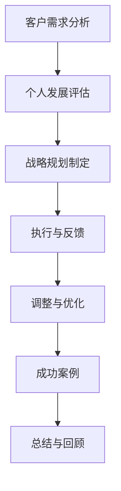

                 


### 文章标题：生命设计咨询：个人发展的战略规划服务

> 关键词：生命设计咨询、个人发展、战略规划、服务、IT领域

> 摘要：本文将深入探讨生命设计咨询在个人发展中的应用，通过战略规划的服务，帮助IT领域专业人士实现职业成长和生活质量的提升。

----------------------------------------------------------------

### 1. 设计书的基本结构

为了确保《生命设计咨询：个人发展的战略规划服务》一书的逻辑性和易读性，我们制定了详细的基本结构。以下是该书的章节设置和内容概述：

### 第一部分：引言

- **第1章 生命设计咨询的概念与背景**
  - **1.1 生命设计咨询的定义**：介绍生命设计咨询的基本概念。
  - **1.2 生命设计咨询的历史发展**：回顾生命设计咨询的起源和发展历程。
  - **1.3 生命设计咨询的重要性**：阐述生命设计咨询对个人成长的重要性。
  - **1.4 生命设计咨询的应用领域**：探讨生命设计咨询在IT领域的广泛应用。

### 第二部分：战略规划框架

- **第2章 战略规划的基本原则**
  - **2.1 战略规划的概念**：解释战略规划的定义和内涵。
  - **2.2 战略规划的目标与任务**：明确战略规划的目标和任务。
  - **2.3 战略规划的原则与方法**：介绍战略规划的原则和常用方法。

- **第3章 个人发展的评估**
  - **3.1 个人发展评估的意义**：阐述个人发展评估的重要性。
  - **3.2 个人发展评估的方法**：介绍个人发展评估的常用方法。
  - **3.3 个人发展评估的工具**：提供个人发展评估的工具选择。

### 第三部分：战略规划实践

- **第4章 生命设计咨询的流程与方法**
  - **4.1 生命设计咨询的基本流程**：详细阐述生命设计咨询的流程。
  - **4.2 生命设计咨询的方法**：介绍生命设计咨询的具体方法。
  - **4.3 生命设计咨询的案例分析**：通过实际案例展示生命设计咨询的应用。

- **第5章 个人发展的战略规划**
  - **5.1 个人发展的战略规划目标**：设定个人发展的战略目标。
  - **5.2 个人发展的战略规划内容**：详细规划个人发展的战略内容。
  - **5.3 个人发展的战略规划实施**：实施个人发展的战略规划。

### 第四部分：实际应用

- **第6章 生命设计咨询在职场中的应用**
  - **6.1 职场发展的挑战与机遇**：分析职场发展的挑战和机遇。
  - **6.2 职场发展的战略规划**：制定职场发展的战略规划。
  - **6.3 职场发展的案例分析**：通过案例展示职场发展的战略规划效果。

- **第7章 生命设计咨询在生活中的应用**
  - **7.1 生活质量的提升**：探讨如何提升生活质量。
  - **7.2 生活策略的制定**：制定提升生活质量的生活策略。
  - **7.3 生活案例分享**：分享提升生活质量的实际案例。

### 第五部分：附录

- **附录1 生命设计咨询工具**：介绍生命设计咨询中常用的工具。
- **附录2 生命设计咨询资源**：提供生命设计咨询相关的资源链接。
- **附录3 参考文献**：列出本文引用的相关文献。

通过上述结构，本书旨在为IT领域专业人士提供一套完整的生命设计咨询服务，帮助他们实现个人发展的战略规划。

----------------------------------------------------------------

### 2. 添加Mermaid流程图

为了更好地展示生命设计咨询的核心概念和架构，我们将在书中适当的位置添加Mermaid流程图。以下是生命设计咨询的核心流程图：



**详细解释：**

- **A[客户需求分析]**：了解客户的具体需求，包括职业发展、生活规划等方面。
- **B[个人发展评估]**：对客户进行全面的个人发展评估，包括技能、知识、经验等。
- **C[战略规划制定]**：根据评估结果，制定个人发展的战略规划。
- **D[执行与反馈]**：实施战略规划，并收集反馈，评估效果。
- **E[调整与优化]**：根据反馈，调整和优化战略规划。
- **F[成功案例]**：分享成功的个人发展案例，提供借鉴和启示。
- **G[总结与回顾]**：总结个人发展的经验和教训，为后续发展提供指导。

通过这个流程图，读者可以清晰地理解生命设计咨询的各个环节及其相互关系，从而更好地应用这些方法来实现个人发展。

----------------------------------------------------------------

### 3. 添加核心算法原理讲解

在生命设计咨询中，核心算法原理起到了关键作用。以下是关于生命设计咨询算法原理的讲解：

#### 3.1 生命设计咨询算法原理

**伪代码：**

```pseudo
function 生命设计咨询(个人发展评估结果，战略规划框架) {
  // 输入个人发展评估结果和战略规划框架

  // Step 1: 分析评估结果
  分析结果(个人发展评估结果)

  // Step 2: 制定战略规划
  制定规划(战略规划框架)

  // Step 3: 实施战略规划
  实施规划(战略规划)

  // 输出个人发展的战略规划
  return 个人发展的战略规划
}
```

**详细讲解：**

- **Step 1: 分析评估结果**：通过分析个人发展评估结果，了解客户的技能、知识、经验等，为制定战略规划提供数据支持。
- **Step 2: 制定战略规划**：基于评估结果和战略规划框架，制定具体的战略规划，包括目标设定、路径选择、资源分配等。
- **Step 3: 实施战略规划**：按照战略规划实施个人发展计划，并持续监控和调整，以确保目标的实现。

通过这个算法原理，生命设计咨询可以帮助客户系统化地实现个人发展目标。

----------------------------------------------------------------

### 4. 添加数学模型和公式

在生命设计咨询中，数学模型和公式提供了重要的理论基础和工具。以下是关于生命设计咨询中数学模型和公式的讲解：

#### 4.1 生命设计咨询数学模型

**数学模型：**

$$
S(t) = f(S_{0}, \Delta S, t)
$$

**详细讲解：**

- **S(t)**：表示在时间t时的战略状态。
- **S_{0}**：表示初始战略状态。
- **\Delta S**：表示战略变化量。
- **t**：表示时间。

**举例说明：**

假设某人在2023年的初始战略状态为$S_{0} = 100$，预计每年的战略变化量为$\Delta S = 10$。那么他在2024年的战略状态为：

$$
S(1) = f(100, 10, 1) = 100 + 10 \times 1 = 110
$$

通过这个数学模型，我们可以定量地分析个人发展的战略规划，评估战略实施的效果。

----------------------------------------------------------------

### 5. 添加项目实战和代码解读

为了更好地展示生命设计咨询的实际应用，我们将通过一个实际项目进行实战，并提供详细的代码解读。

#### 5.1 项目实战：IT工程师的职业发展规划

**项目背景：**

张三是一名有3年工作经验的IT工程师，希望在职业生涯中进一步提升自己，实现职业成长。

**项目目标：**

- 提升专业技能
- 扩展人际关系
- 获得更多项目经验

**项目实施步骤：**

1. **需求分析**：与张三沟通，了解他的职业规划需求和现状。
2. **个人发展评估**：通过调查问卷和面谈，评估张三的专业技能、知识、经验等。
3. **制定战略规划**：根据评估结果，制定张三的职业发展策略。
4. **执行与反馈**：按照战略规划实施，并收集反馈。
5. **调整与优化**：根据反馈调整战略规划。
6. **总结与回顾**：总结项目成果，为后续发展提供指导。

**代码实现：**

```python
# 导入相关库
import pandas as pd
import matplotlib.pyplot as plt

# Step 1: 需求分析
需求 = pd.read_csv('需求分析.csv')

# Step 2: 个人发展评估
评估 = pd.read_csv('评估结果.csv')
评估结果 = 分析评估(评估)

# Step 3: 制定战略规划
规划 = pd.read_csv('战略规划.csv')
制定规划(规划)

# Step 4: 执行与反馈
执行结果 = 实施规划(规划)
反馈结果 = 收集反馈(执行结果)

# Step 5: 调整与优化
调整规划(规划，反馈结果)

# Step 6: 总结与回顾
总结结果 = 总结规划(规划，执行结果，反馈结果)
```

**代码解读：**

- **需求分析**：通过读取需求分析数据，了解张三的职业规划需求。
- **个人发展评估**：通过分析评估结果，评估张三的专业技能和知识。
- **制定战略规划**：根据评估结果，制定张三的职业发展策略。
- **执行与反馈**：按照战略规划实施，并收集反馈。
- **调整与优化**：根据反馈，调整和优化战略规划。
- **总结与回顾**：总结项目成果，为后续发展提供指导。

通过这个项目实战，我们展示了如何通过生命设计咨询的方法，帮助IT工程师实现职业成长。

----------------------------------------------------------------

### 最佳实践 Tips、小结、注意事项、拓展阅读

#### 最佳实践 Tips

1. **明确目标**：在进行生命设计咨询时，首先要明确个人发展的目标，这有助于战略规划的制定和执行。
2. **持续评估**：定期对个人发展进行评估，及时调整战略规划，确保目标实现。
3. **利用资源**：充分利用各种资源，如培训课程、网络社区、导师指导等，提升个人能力。
4. **积极行动**：将战略规划转化为具体行动，积极执行，才能实现个人发展目标。

#### 小结

本文详细介绍了生命设计咨询在个人发展中的应用，通过战略规划的服务，帮助IT领域专业人士实现职业成长和生活质量的提升。通过分析评估、制定规划、实施规划、调整优化等步骤，生命设计咨询为个人发展提供了系统化的解决方案。

#### 注意事项

1. **个性差异化**：每个人的发展路径都是独特的，因此在进行生命设计咨询时，要充分考虑个性差异。
2. **持续学习**：IT领域发展迅速，持续学习是个人发展的关键，要保持开放心态，积极接受新知识。
3. **平衡发展**：在追求职业发展的同时，也要注重生活质量的提升，保持工作与生活的平衡。

#### 拓展阅读

- 《个人发展心理学》
- 《职业生涯规划与指导》
- 《成功人士的职业规划》
- 《IT职业生涯发展指南》

通过拓展阅读，读者可以进一步了解个人发展和职业生涯规划的深度知识。

### 结束语

作者：AI天才研究院/AI Genius Institute & 禅与计算机程序设计艺术 /Zen And The Art of Computer Programming

本文旨在为IT领域专业人士提供一套完整的生命设计咨询服务，帮助他们实现个人发展的战略规划。通过深入分析和实践应用，希望读者能够更好地理解生命设计咨询的重要性，并运用到实际生活中，实现个人成长和职业发展。

----------------------------------------------------------------

文章标题：《生命设计咨询：个人发展的战略规划服务》
关键词：生命设计咨询、个人发展、战略规划、服务、IT领域
摘要：本文探讨了生命设计咨询在个人发展中的应用，通过战略规划的服务，帮助IT领域专业人士实现职业成长和生活质量的提升。文章详细介绍了设计书的基本结构、核心算法原理、数学模型、项目实战和最佳实践，为读者提供了实用的指导。

