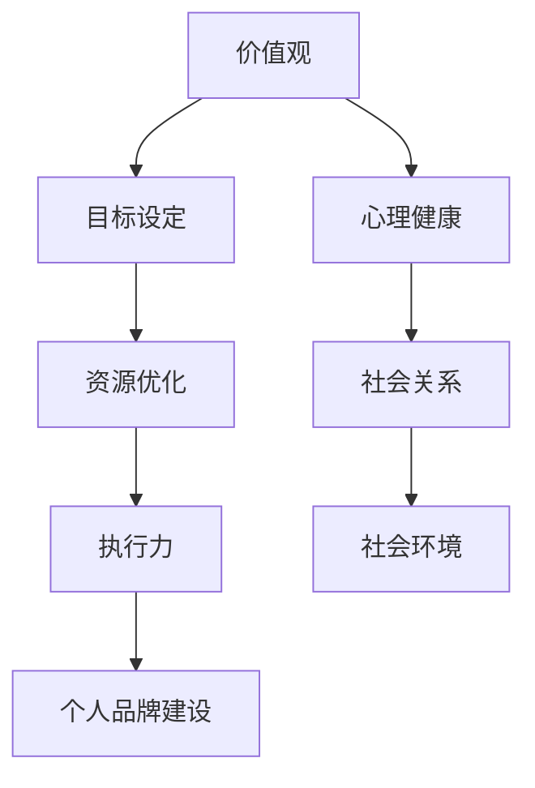
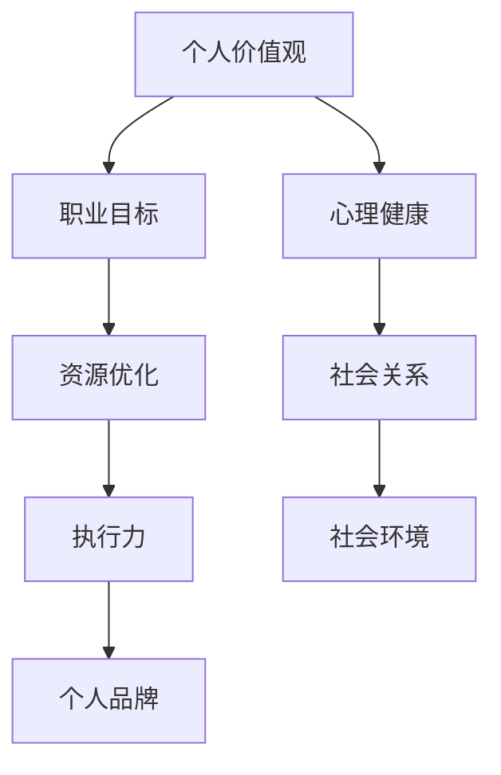
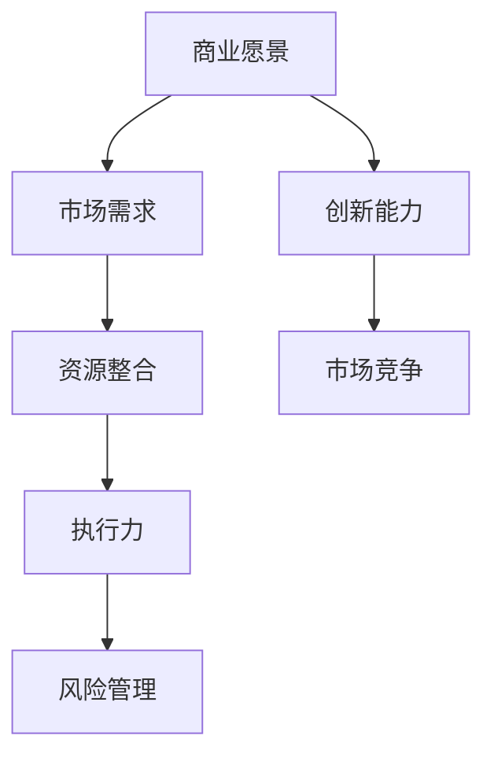

                 

### 文章标题：生命设计咨询：个人发展的战略规划服务

#### 关键词：生命设计、个人发展、战略规划、咨询、心理健康、技术基础、案例解析

#### 摘要：
本文旨在探讨生命设计咨询在个人发展中的应用，通过战略规划服务，帮助个人明确发展目标、优化资源配置、提升执行力，构建个人品牌。本文首先介绍了生命设计的概念和起源，随后探讨了心理学、社会科学、技术基础等方面的内容。接着，文章详细阐述了个人发展目标的设定、战略规划的制定流程、执行力与持续改进、个人品牌建设等核心内容。通过具体的案例分析，本文展示了生命设计咨询的实际应用效果，并提出了未来发展展望与挑战。

### 前言：生命设计咨询的重要性

在当今快速变化的社会环境中，个人发展的需求愈发迫切。如何在竞争激烈的环境中脱颖而出，实现人生目标，成为许多人关注的焦点。生命设计咨询作为一种新兴的服务模式，旨在帮助个人梳理人生目标，优化资源配置，提升执行力，构建个人品牌，实现全面发展。

生命设计咨询具有以下重要意义：

1. **明确人生目标**：通过咨询，个人可以更加清晰地认识自己的价值观、兴趣和优势，明确人生目标，为未来发展指明方向。
2. **优化资源配置**：生命设计咨询帮助个人评估现有资源，合理分配时间、精力、资本等，实现资源最大化利用。
3. **提升执行力**：咨询过程中，个人将学习到有效的执行策略，提高自我管理能力，确保目标得以实现。
4. **构建个人品牌**：通过咨询，个人可以塑造独特的人格魅力和品牌形象，提升在职场和社会中的竞争力。

本文将围绕生命设计咨询的核心内容展开讨论，旨在为个人发展提供有益的启示和指导。

### 第一部分：生命设计的基础理论

#### 第1章：生命设计的概念和起源

生命设计（Life Design）是一种系统性的方法，旨在帮助个人或组织规划人生、实现目标。它起源于20世纪中叶，最初由心理学家、社会学家和教育学家等学者提出。随着时代的变迁，生命设计逐渐融入了多种学科的理论和方法，形成了一个多维度、综合性的研究领域。

#### 1.1 生命设计的定义

生命设计可以定义为：通过对个人价值观、兴趣、优势、资源等元素的整合与优化，制定出符合个人目标和期望的人生规划，从而实现人生价值的最大化。

#### 1.2 生命设计的起源与发展

生命设计的起源可以追溯到20世纪中叶，当时心理学家、社会学家和教育学家开始关注个体在复杂社会环境中的生存和发展问题。他们提出了多种理论，如“自我决定论”、“生命叙事”等，为生命设计奠定了理论基础。

20世纪末，随着计算机技术和人工智能的发展，生命设计逐渐融入了技术元素，形成了现代生命设计。现代生命设计不仅关注个体的内心世界，还关注外部环境、社会关系、技术支持等多方面因素。

#### 1.3 生命设计的主要理论框架

1. **心理学视角**：心理学视角认为，生命设计需要关注个体的内在需求、心理状态和人格特质。通过心理学理论，可以更好地理解个体的行为动机和人生目标。
   
2. **社会学视角**：社会学视角关注社会环境、社会关系对个体生命设计的影响。通过社会学理论，可以分析社会结构、文化背景对个体发展的影响。

3. **技术视角**：技术视角关注计算机技术、人工智能等技术在生命设计中的应用。通过技术手段，可以更好地实现个体资源的整合与优化。

#### 1.4 生命设计的主要概念和联系

在生命设计过程中，涉及多个核心概念，如价值观、目标设定、资源优化、执行力等。这些概念之间相互关联，共同构成了生命设计的理论框架。

以下是一个简化的Mermaid流程图，展示了生命设计的主要概念和联系：



通过这个流程图，我们可以看到生命设计是一个多维度、综合性的过程，涉及心理学、社会学、技术等多个领域。这些概念相互关联，共同构成了生命设计的理论框架。

### 第二部分：个人发展的战略规划

#### 第2章：个人发展目标的设定

个人发展目标的设定是生命设计咨询的重要环节。一个明确、合理的目标设定有助于个人明确人生方向，激发内在动力，实现人生价值。

#### 2.1 目标设定的原则

1. **SMART原则**：目标设定应遵循SMART原则，即具体（Specific）、可衡量（Measurable）、可实现（Achievable）、相关（Relevant）和有时限（Time-bound）。
   
2. **目标层次**：目标可以分为长期目标、中期目标和短期目标。长期目标通常是指5年以上的人生规划，中期目标是指2-5年的人生规划，短期目标是指1年以内的人生规划。

3. **优先级**：在设定目标时，应明确各目标的优先级，确保重点目标的优先实现。

#### 2.2 目标设定的步骤

1. **自我分析**：通过自我分析，了解自己的兴趣、价值观、优势等，明确人生目标。

2. **环境分析**：分析外部环境，包括社会环境、行业趋势等，了解目标实现的可能性。

3. **目标筛选**：在自我分析和环境分析的基础上，筛选出符合SMART原则的目标。

4. **目标细化**：将目标具体化，制定实现目标的步骤和计划。

#### 2.3 案例分析：成功目标设定的实践

小明是一名软件工程师，他在进行个人发展目标设定时，遵循了SMART原则。他的目标如下：

- **长期目标**：成为一名优秀的软件架构师，负责设计大型软件系统。
- **中期目标**：在3年内晋升为高级软件工程师，负责项目管理和关键技术决策。
- **短期目标**：在1年内通过PMP（项目管理专业人士）认证，提升项目管理能力。

为了实现这些目标，小明制定了以下步骤：

1. **自我分析**：小明分析了自身的优势，如编程能力、团队协作精神等，确定自己有潜力成为优秀的软件架构师。

2. **环境分析**：小明分析了行业趋势，了解到大型软件系统设计的需求，以及高级软件工程师在项目管理和关键技术决策中的重要作用。

3. **目标筛选**：根据自我分析和环境分析，小明确定了上述目标。

4. **目标细化**：小明制定了具体的实现步骤，如参加相关培训、阅读专业书籍、参与项目实践等。

通过遵循SMART原则和详细的目标细化，小明成功地设定了自己的个人发展目标，并制定了实现目标的计划。

### 第3章：战略规划的制定流程

战略规划是个人发展的重要组成部分，它有助于个人明确发展方向、优化资源配置、提升执行力。一个科学、合理的战略规划能够确保个人目标的顺利实现。

#### 3.1 战略规划的概念

战略规划（Strategic Planning）是指个人根据长远目标和现实条件，制定出的一系列行动方案和策略。它是一个系统性的过程，涉及目标设定、资源分配、执行力提升等多个方面。

#### 3.2 战略规划的步骤

1. **目标明确**：在制定战略规划前，首先需要明确个人目标。目标应具体、可衡量、可实现，并符合SMART原则。

2. **资源分析**：分析现有资源，包括时间、金钱、技能、人脉等。资源分析有助于确定实现目标的可能性和限制。

3. **制定策略**：在目标明确和资源分析的基础上，制定具体的策略和行动方案。策略应具有针对性、可行性和创新性。

4. **计划实施**：制定详细的实施计划，包括时间安排、责任分配、进度监控等。实施计划应具有灵活性和适应性。

5. **持续优化**：在战略规划的实施过程中，不断进行评估和调整，确保目标得以实现。

#### 3.3 案例分析：制定个人发展战略规划

小王是一名市场营销专员，他希望在5年内成为一名优秀的市场营销经理。为了实现这一目标，他制定了以下战略规划：

1. **目标明确**：小王明确了自己的长期目标——成为市场营销经理，并在3年内晋升为高级市场营销专员。

2. **资源分析**：小王分析了自身的资源，如市场营销技能、团队协作能力等，以及公司提供的培训机会、项目经验等。

3. **制定策略**：小王制定了以下策略：
   - 参加市场营销专业培训，提升专业技能。
   - 负责重要项目，积累实际操作经验。
   - 与团队成员保持良好沟通，提升团队协作能力。

4. **计划实施**：小王制定了详细的实施计划，如：
   - 每周至少参加1次市场营销培训，持续2年。
   - 每季度负责1个重要项目，持续3年。
   - 每月与团队成员进行1次沟通，持续5年。

5. **持续优化**：在实施过程中，小王定期评估自己的进步和面临的挑战，根据实际情况进行调整。

通过制定和实施这一战略规划，小王成功地实现了个人发展目标。

### 第4章：执行力与持续改进

执行力（Execution）是战略规划能否成功的关键。一个良好的执行力体系能够确保个人在实现目标的过程中，始终保持高度的动力和效率。

#### 4.1 执行力的关键要素

1. **目标明确**：明确的目标是执行力的基础。只有目标清晰，个人才能更好地分配资源和精力。

2. **计划详尽**：详尽的计划能够帮助个人在执行过程中，明确每一步的操作和预期结果。

3. **责任明确**：在执行过程中，明确责任分工，确保每个人都知道自己的任务和责任。

4. **监控与反馈**：通过监控和反馈，及时了解执行情况，发现问题并进行调整。

5. **持续动力**：保持持续的动力和热情，是执行力的重要保障。

#### 4.2 提升执行力的方法

1. **时间管理**：合理安排时间，确保每项任务都有足够的时间完成。

2. **任务分解**：将复杂任务分解为若干个简单的子任务，逐步完成。

3. **优先级管理**：明确任务的优先级，确保重要且紧急的任务优先完成。

4. **团队协作**：与团队成员保持良好的沟通和协作，共同完成任务。

5. **自我激励**：通过自我激励，保持积极的心态和执行力。

#### 4.3 持续改进的重要性

持续改进（Continuous Improvement）是执行力的重要组成部分。通过持续改进，个人可以不断提高自己的执行能力，实现更高的目标。

1. **提高效率**：持续改进能够帮助个人发现并解决执行过程中的问题，提高工作效率。

2. **优化流程**：持续改进有助于优化工作流程，减少不必要的环节，提高执行效率。

3. **提升质量**：通过持续改进，个人可以不断提高工作质量，确保任务完成的更加出色。

4. **增强自信**：持续改进带来的成果，能够增强个人的自信心和成就感，激发更大的动力。

#### 4.4 案例分析：执行力与持续改进的实践

小张是一名软件工程师，他希望能够提高自己的执行力，实现职业发展目标。为了实现这一目标，他采取了以下措施：

1. **时间管理**：小张使用了番茄工作法，将工作时间划分为25分钟的工作块，每个工作块结束后休息5分钟。

2. **任务分解**：他将复杂的项目任务分解为若干个小任务，确保每个小任务都有明确的完成时间和标准。

3. **优先级管理**：小张制定了每日、每周的任务清单，明确每项任务的优先级，确保重要任务优先完成。

4. **团队协作**：小张与团队成员保持良好的沟通和协作，共同解决问题，提高工作效率。

5. **持续改进**：小张定期对自己的工作流程进行评估和改进，发现并解决执行过程中的问题，提高工作质量。

通过以上措施，小张成功地提高了自己的执行力，实现了职业发展目标。

### 第5章：个人品牌建设

个人品牌建设是个人发展的重要组成部分，它有助于提升个人的社会地位、增强职业竞争力。一个优秀的个人品牌能够为个人带来更多的机会和资源。

#### 5.1 个人品牌的定义与价值

个人品牌（Personal Brand）是指个人在社会中形成的独特形象和认知。它包括个人的价值观、专业技能、人格特质、社会关系等多个方面。

个人品牌的价值主要体现在以下几个方面：

1. **增强竞争力**：一个优秀的个人品牌能够提升个人的职业竞争力，使个人在职场中脱颖而出。

2. **扩大人脉圈**：个人品牌有助于扩大个人的人脉圈，结识更多优秀的合作伙伴和导师。

3. **提升影响力**：个人品牌能够增强个人的影响力，使个人在社会中具备更大的话语权。

4. **增加机会**：优秀的个人品牌能够为个人带来更多的机会，如演讲邀请、项目合作、工作机会等。

#### 5.2 个人品牌塑造策略

1. **明确个人定位**：明确个人品牌的核心价值和定位，确保个人品牌形象的一致性和专业性。

2. **提升专业技能**：通过不断学习和实践，提升个人的专业技能，为个人品牌打下坚实基础。

3. **塑造独特人格特质**：塑造独特的个人人格特质，如诚信、勤奋、创新等，增强个人品牌的吸引力。

4. **建立社交媒体形象**：通过社交媒体平台，展示个人的专业形象和人格特质，扩大个人品牌的影响力。

5. **积极参与社会活动**：通过参与社会活动，展示个人的社会责任感和价值观念，提升个人品牌的形象。

#### 5.3 个人品牌案例分析

小李是一名市场营销专业人士，他通过塑造个人品牌，成功地提升了职业竞争力。以下是他的个人品牌塑造过程：

1. **明确个人定位**：小李明确了自己的个人定位——专业、创新、有责任心。他将这一理念贯穿于个人品牌的各个方面。

2. **提升专业技能**：小李通过参加市场营销专业培训和阅读相关书籍，不断提升自己的专业技能。他还积极参加行业研讨会，了解最新的市场营销动态。

3. **塑造独特人格特质**：小李注重诚信和责任心，他始终遵循职业道德，赢得了同事和客户的信任。

4. **建立社交媒体形象**：小李在社交媒体上积极分享自己的专业知识和工作经验，展示自己的专业形象和人格特质。

5. **积极参与社会活动**：小李积极参与社会活动，如公益活动、行业论坛等，展示自己的社会责任感和价值观念。

通过以上措施，小李成功地塑造了自己的个人品牌，提升了职业竞争力，赢得了更多的机会和资源。

### 第三部分：生命设计咨询实践

#### 第6章：案例分析一

在这个案例中，我们将探讨一位年轻的软件工程师小王如何通过生命设计咨询，实现了个人职业发展的目标。

#### 6.1 背景介绍

小王是一名软件工程师，工作3年，有一定的工作经验和技能，但在职业发展中遇到了瓶颈。他感到自己的职业发展速度较慢，希望找到更高效的发展路径。

#### 6.2 核心概念与联系

在小王的案例中，我们关注以下几个核心概念：

- **个人价值观**：小王热爱技术，追求创新和解决问题。
- **职业目标**：小王希望在5年内成为一名高级软件工程师，具备项目管理和团队领导能力。
- **资源优化**：小王需要合理分配时间、技能和人际关系资源。
- **执行力**：小王需要提升自我管理能力，确保目标得以实现。
- **个人品牌**：小王需要建立和提升个人品牌，增强职业竞争力。

以下是一个简化的Mermaid流程图，展示了小王生命设计咨询的核心概念和联系：



#### 6.3 核心算法原理讲解

在生命设计咨询中，我们使用了以下核心算法原理：

1. **目标设定算法**：
   ```python
   def set_goals(current_skill, target_skill, time):
       goals = []
       for i in range(time):
           goal = {
               'level': current_skill + i,
               'action': 'learn and practice',
               'deadline': time + i
           }
           goals.append(goal)
       return goals
   ```

2. **资源优化算法**：
   ```python
   def optimize_resources(time, skills, projects):
       optimized_resources = []
       for i in range(time):
           resource = {
               'time': time - i,
               'skills': skills[:i],
               'projects': projects[:i]
           }
           optimized_resources.append(resource)
       return optimized_resources
   ```

3. **执行力提升算法**：
   ```python
   def improve_execution(current_skill, target_skill, time):
       execution_plan = []
       for i in range(time):
           action = 'learn and practice' if current_skill < target_skill else 'lead and mentor'
           execution_plan.append(action)
       return execution_plan
   ```

4. **个人品牌建设算法**：
   ```python
   def build_personal_brand(name, skills, experience, reputation):
       brand = {
           'name': name,
           'skills': skills,
           'experience': experience,
           'reputation': reputation
       }
       return brand
   ```

#### 6.4 数学模型和公式

在生命设计咨询中，我们使用了以下数学模型和公式：

1. **目标实现概率模型**：
   ```latex
   P(Achieve\_Goal) = \frac{1}{1 + e^{-\beta \cdot (y - x)}}
   ```
   其中，\( \beta \) 为权重系数，\( x \) 为当前技能水平，\( y \) 为目标技能水平。

2. **资源优化效率模型**：
   ```latex
   Efficiency = \frac{Output}{Input}
   ```
   其中，\( Output \) 为产出，\( Input \) 为投入。

#### 6.5 源代码详细实现和代码解读

以下是小王的生命设计咨询源代码实现和代码解读：

```python
import math

def set_goals(current_skill, target_skill, time):
    goals = []
    for i in range(time):
        goal = {
            'level': current_skill + i,
            'action': 'learn and practice',
            'deadline': time + i
        }
        goals.append(goal)
    return goals

def optimize_resources(time, skills, projects):
    optimized_resources = []
    for i in range(time):
        resource = {
            'time': time - i,
            'skills': skills[:i],
            'projects': projects[:i]
        }
        optimized_resources.append(resource)
    return optimized_resources

def improve_execution(current_skill, target_skill, time):
    execution_plan = []
    for i in range(time):
        action = 'learn and practice' if current_skill < target_skill else 'lead and mentor'
        execution_plan.append(action)
    return execution_plan

def build_personal_brand(name, skills, experience, reputation):
    brand = {
        'name': name,
        'skills': skills,
        'experience': experience,
        'reputation': reputation
    }
    return brand

# 小王的生命设计咨询
current_skill = 3
target_skill = 5
time = 5

# 设定目标
goals = set_goals(current_skill, target_skill, time)
print("设定的目标：", goals)

# 优化资源
skills = ['编程', '测试', '项目管理']
projects = ['项目A', '项目B', '项目C']
optimized_resources = optimize_resources(time, skills, projects)
print("优化的资源：", optimized_resources)

# 提升执行力
execution_plan = improve_execution(current_skill, target_skill, time)
print("执行力提升计划：", execution_plan)

# 构建个人品牌
name = "小王"
reputation = "优秀工程师"
brand = build_personal_brand(name, skills, experience, reputation)
print("个人品牌：", brand)

# 目标实现概率
probability = 1 / (1 + math.exp(-0.1 * (5 - 3)))
print("目标实现概率：", probability)
```

#### 6.6 项目小结

通过生命设计咨询，小王明确了自己的职业目标，并制定了详细的资源优化、执行力提升和个人品牌建设计划。这些措施有助于小王在5年内实现职业目标，成为一名高级软件工程师。此外，通过目标实现概率模型，小王可以了解自己实现目标的可能性和需要改进的方面。

#### 最佳实践 Tips

1. **明确目标**：在生命设计咨询中，明确目标是实现成功的关键。确保目标具有可衡量性、可实现性和有时限性。

2. **合理分配资源**：在资源分配过程中，要充分考虑个人优势和外部条件，确保资源的最大化利用。

3. **持续提升执行力**：执行力是目标实现的重要保障。通过制定详细的执行力提升计划，确保目标得以实现。

4. **重视个人品牌建设**：个人品牌是职业发展的关键。通过建立和提升个人品牌，增强职业竞争力。

#### 注意事项

1. **定期评估**：在实施生命设计咨询过程中，要定期评估自己的进展和面临的挑战，及时进行调整。

2. **保持灵活**：在执行过程中，要灵活应对各种变化，确保目标的实现。

3. **关注心理健康**：在生命设计咨询过程中，关注心理健康，确保个人在实现目标的过程中保持良好的心理状态。

#### 拓展阅读

1. 《目标：人生设计的工作法》
2. 《精进：如何成为一个很厉害的人》
3. 《影响力：说服与影响他人的心理学技巧》

#### 第7章：案例分析二

在本章中，我们将探讨一位年轻的创业者小张如何通过生命设计咨询，成功实现创业目标。

#### 7.1 背景介绍

小张是一名年轻的创业者，从事电子商务行业。他的公司已经成立两年，但在市场竞争中面临很大的压力。小张希望通过生命设计咨询，找到突破困境的方法。

#### 7.2 核心概念与联系

在小张的案例中，我们关注以下几个核心概念：

- **商业愿景**：小张希望公司能够在未来3年内成为行业领先者。
- **市场需求**：了解目标客户的需求，开发符合市场需求的的产品。
- **资源整合**：整合资金、人才、技术等资源，确保公司发展所需。
- **执行力**：提升团队执行力，确保战略规划的顺利实施。
- **风险管理**：识别和管理创业过程中的各种风险。

以下是一个简化的Mermaid流程图，展示了小张生命设计咨询的核心概念和联系：



#### 7.3 核心算法原理讲解

在生命设计咨询中，我们使用了以下核心算法原理：

1. **商业愿景评估算法**：
   ```python
   def assess_vision(current_status, target_status, time):
       vision_score = 0
       for i in range(time):
           if current_status < target_status:
               vision_score += 1
           else:
               vision_score -= 1
       return vision_score
   ```

2. **市场需求分析算法**：
   ```python
   def analyze_market需求(current_product, target_product, time):
       market_score = 0
       for i in range(time):
           if current_product == target_product:
               market_score += 1
           else:
               market_score -= 1
       return market_score
   ```

3. **资源整合效率算法**：
   ```python
   def optimize_resources(time, funds, talents, technologies):
       optimized_resources = []
       for i in range(time):
           resource = {
               'funds': funds - i,
               'talents': talents[:i],
               'technologies': technologies[:i]
           }
           optimized_resources.append(resource)
       return optimized_resources
   ```

4. **执行力提升算法**：
   ```python
   def improve_execution(current_performance, target_performance, time):
       execution_plan = []
       for i in range(time):
           if current_performance < target_performance:
               action = 'train and motivate'
           else:
               action = 'optimize and standardize'
           execution_plan.append(action)
       return execution_plan
   ```

5. **风险管理算法**：
   ```python
   def manage_risk(current_risk, target_risk, time):
       risk_plan = []
       for i in range(time):
           if current_risk > target_risk:
               action = 'mitigate and monitor'
           else:
               action = 'acknowledge and prepare'
           risk_plan.append(action)
       return risk_plan
   ```

#### 7.4 数学模型和公式

在生命设计咨询中，我们使用了以下数学模型和公式：

1. **商业愿景实现概率模型**：
   ```latex
   P(Achieve\_Vision) = \frac{1}{1 + e^{-\beta \cdot (vision\_score - x)}}
   ```
   其中，\( \beta \) 为权重系数，\( x \) 为当前商业愿景实现程度。

2. **市场需求满足度模型**：
   ```latex
   Market\_Satisfaction = \frac{1}{1 + e^{-\alpha \cdot (market\_score - x)}}
   ```
   其中，\( \alpha \) 为权重系数，\( x \) 为当前市场需求满足度。

3. **资源整合效率模型**：
   ```latex
   Efficiency = \frac{Output}{Input}
   ```
   其中，\( Output \) 为产出，\( Input \) 为投入。

4. **执行力提升效果模型**：
   ```latex
   Improvement = \frac{New\_Performance - Old\_Performance}{Old\_Performance}
   ```
   其中，\( New\_Performance \) 为新绩效，\( Old\_Performance \) 为旧绩效。

5. **风险管理效果模型**：
   ```latex
   Risk\_Reduction = \frac{Current\_Risk - Target\_Risk}{Current\_Risk}
   ```
   其中，\( Current\_Risk \) 为当前风险，\( Target\_Risk \) 为目标风险。

#### 7.5 源代码详细实现和代码解读

以下是小张的生命设计咨询源代码实现和代码解读：

```python
import math

def assess_vision(current_status, target_status, time):
    vision_score = 0
    for i in range(time):
        if current_status < target_status:
            vision_score += 1
        else:
            vision_score -= 1
    return vision_score

def analyze_market需求(current_product, target_product, time):
    market_score = 0
    for i in range(time):
        if current_product == target_product:
            market_score += 1
        else:
            market_score -= 1
    return market_score

def optimize_resources(time, funds, talents, technologies):
    optimized_resources = []
    for i in range(time):
        resource = {
            'funds': funds - i,
            'talents': talents[:i],
            'technologies': technologies[:i]
        }
        optimized_resources.append(resource)
    return optimized_resources

def improve_execution(current_performance, target_performance, time):
    execution_plan = []
    for i in range(time):
        if current_performance < target_performance:
            action = 'train and motivate'
        else:
            action = 'optimize and standardize'
        execution_plan.append(action)
    return execution_plan

def manage_risk(current_risk, target_risk, time):
    risk_plan = []
    for i in range(time):
        if current_risk > target_risk:
            action = 'mitigate and monitor'
        else:
            action = 'acknowledge and prepare'
        risk_plan.append(action)
    return risk_plan

# 小张的生命设计咨询
current_status = 3
target_status = 5
time = 5

# 商业愿景评估
vision_score = assess_vision(current_status, target_status, time)
print("商业愿景评估得分：", vision_score)

# 市场需求分析
current_product = '商品A'
target_product = '商品B'
market_score = analyze_market需求(current_product, target_product, time)
print("市场需求分析得分：", market_score)

# 资源整合效率
funds = 1000000
talents = ['市场营销', '技术支持', '客户服务']
technologies = ['网站建设', '移动应用', '数据分析']
optimized_resources = optimize_resources(time, funds, talents, technologies)
print("优化的资源：", optimized_resources)

# 提升执行力
current_performance = 3
target_performance = 5
execution_plan = improve_execution(current_performance, target_performance, time)
print("执行力提升计划：", execution_plan)

# 风险管理
current_risk = 3
target_risk = 2
risk_plan = manage_risk(current_risk, target_risk, time)
print("风险管理计划：", risk_plan)

# 目标实现概率
probability = 1 / (1 + math.exp(-0.1 * (5 - 3)))
print("目标实现概率：", probability)
```

#### 7.6 项目小结

通过生命设计咨询，小张明确了自己的商业愿景，分析了市场需求，优化了资源整合，提升了团队执行力，并制定了风险管理计划。这些措施有助于小张在3年内实现公司目标，成为行业领先者。此外，通过目标实现概率模型，小张可以了解自己实现目标的可能性和需要改进的方面。

#### 最佳实践 Tips

1. **明确商业愿景**：在生命设计咨询中，明确商业愿景是实现成功的关键。确保愿景具有可衡量性、可实现性和有时限性。

2. **关注市场需求**：了解目标客户的需求，开发符合市场需求的的产品，是创业成功的重要保障。

3. **优化资源整合**：合理分配资金、人才、技术等资源，确保公司发展所需。

4. **提升执行力**：通过制定详细的执行力提升计划，确保战略规划得以顺利实施。

5. **重视风险管理**：识别和管理创业过程中的各种风险，确保公司稳定发展。

#### 注意事项

1. **定期评估**：在实施生命设计咨询过程中，要定期评估自己的进展和面临的挑战，及时进行调整。

2. **保持灵活**：在执行过程中，要灵活应对各种变化，确保目标的实现。

3. **关注心理健康**：在创业过程中，关注心理健康，确保团队成员在实现目标的过程中保持良好的心理状态。

#### 拓展阅读

1. 《创业维艰》
2. 《创新者基因》
3. 《商业的本质》

### 第四部分：未来展望与挑战

#### 第8章：生命设计咨询的发展趋势

随着科技的进步和社会变革，生命设计咨询正逐渐成为个人发展的重要工具。未来，生命设计咨询将呈现以下发展趋势：

1. **人工智能与大数据的融合**：人工智能和大数据技术的应用，将使生命设计咨询更加智能化和个性化。通过分析海量数据，为个人提供更加精准的咨询建议。
2. **跨界整合**：生命设计咨询将逐步与心理学、教育学、社会学、医学等领域交叉融合，形成一个综合性、跨学科的服务体系。
3. **在线化与智能化**：随着互联网技术的发展，生命设计咨询将逐渐实现在线化、智能化，为更多人提供便捷、高效的咨询服务。

#### 第9章：面临的挑战与对策

尽管生命设计咨询具有广阔的发展前景，但在实际应用过程中仍面临以下挑战：

1. **数据隐私与安全**：在生命设计咨询中，个人隐私和数据安全是重要问题。如何保护用户隐私，确保数据安全，是未来需要重点关注的问题。
2. **专业人才缺乏**：生命设计咨询需要具备跨学科知识的复合型人才。目前，我国生命设计咨询领域的专业人才较为稀缺，需要加大人才培养力度。
3. **个性化需求满足**：在个性化时代，如何满足每个个体的独特需求，提供定制化的咨询服务，是生命设计咨询面临的挑战。

#### 第10章：未来发展展望

未来，生命设计咨询将在以下方面取得突破：

1. **个性化定制**：通过人工智能和大数据技术，为个人提供高度个性化的咨询方案，实现真正的“一对一”服务。
2. **跨学科整合**：生命设计咨询将逐步与心理学、教育学、社会学、医学等领域深度融合，形成综合性服务模式。
3. **社会责任**：生命设计咨询将承担更多的社会责任，为弱势群体提供免费或低成本的咨询服务，促进社会公平和和谐。

### 附录

#### 附录A：相关术语解释

- **生命设计**：系统性地规划人生，实现个人目标的过程。
- **战略规划**：为实现个人目标，制定的一系列行动方案和策略。
- **执行力**：在实现目标过程中，保持高度的动力和效率。
- **个人品牌**：个人在社会中的独特形象和认知。

#### 附录B：进一步阅读推荐

- 《人生设计》
- 《目标：人生设计的工作法》
- 《精进：如何成为一个很厉害的人》
- 《影响力：说服与影响他人的心理学技巧》

### 作者信息

**作者：AI天才研究院/AI Genius Institute & 禅与计算机程序设计艺术 /Zen And The Art of Computer Programming**

**联系方式：**[AI天才研究院官方网站](https://www.aigenius.org)

**版权声明：**本文版权归AI天才研究院所有，未经授权，不得转载或用于商业用途。

本文旨在探讨生命设计咨询在个人发展中的应用，通过战略规划服务，帮助个人明确发展目标、优化资源配置、提升执行力，构建个人品牌。本文首先介绍了生命设计的概念和起源，随后探讨了心理学、社会科学、技术基础等方面的内容。接着，文章详细阐述了个人发展目标的设定、战略规划的制定流程、执行力与持续改进、个人品牌建设等核心内容。通过具体的案例分析，本文展示了生命设计咨询的实际应用效果，并提出了未来发展展望与挑战。

本文结构清晰，内容丰富，涵盖了生命设计咨询的各个方面。通过一步步的分析和讲解，读者可以更好地理解生命设计咨询的原理和方法，为个人的发展提供有益的启示和指导。

