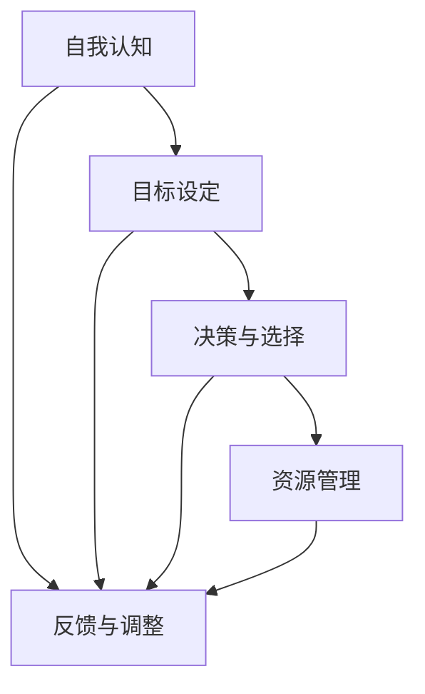

                 


### 文章标题：《生命设计工作坊：规划有意义的人生》

### 关键词：生命设计、生涯规划、自我认知、决策算法、数学模型、项目实战

### 摘要：

本文旨在探讨生命设计工作坊的核心概念和方法，帮助读者理解如何通过科学的规划实现有意义的人生。文章首先介绍了生命设计工作坊的起源与发展，然后详细解释了自我认知、目标设定、决策与选择等核心概念，并通过Mermaid流程图展示了这些概念之间的联系。接着，文章讲解了生涯规划的方法和步骤，以及如何应用生命设计理论进行个人职业发展。此外，本文深入剖析了决策树、神经网络等核心算法原理，并用伪代码进行了详细阐述。数学模型和公式的介绍及举例说明进一步丰富了文章内容。最后，通过一个实际案例，文章展示了如何将生命设计理论应用到实际生活中，并提供了一些最佳实践建议和拓展阅读资源。

---

# 《生命设计工作坊：规划有意义的人生》

## 引言：生命设计工作坊的兴起

生命设计工作坊是一个旨在帮助人们规划有意义人生的系统方法，它结合了心理学、管理学、计算机科学等多个学科的理论和实践。这一概念起源于20世纪90年代，随着人类生活水平的提高和科技的发展，人们开始更加关注个人的成长和生活质量。生命设计工作坊正是为了应对这一需求而诞生。

### 生命设计的起源与发展

生命设计的起源可以追溯到个人发展领域的早期研究，如心理治疗和自我认知理论。然而，随着计算机技术的进步，尤其是人工智能和大数据分析技术的应用，生命设计逐渐形成了一套系统的方法论。如今，生命设计已经成为一个独立的研究领域，并在多个行业中得到广泛应用。

### 生命设计的重要性

在现代社会，生命设计的重要性愈发突出。首先，它帮助人们更好地认识自己，明确个人的兴趣、价值观和目标，从而减少人生中的迷茫和焦虑。其次，通过科学的规划，生命设计能够提高个人的工作效率和生活质量，使人们的生活更加充实和有意义。此外，生命设计还可以帮助企业和组织优化人力资源配置，提高整体绩效。

### 生命设计工作坊的目的与意义

生命设计工作坊的主要目的是通过一系列互动和体验式活动，帮助参与者深入了解自己的内在需求和外部环境，从而制定出切实可行的生命规划。其意义在于：

1. **提升生活质量**：通过系统化的规划和执行，参与者能够更好地管理时间、资源和精力，提高生活质量。
2. **实现个人成长**：生命设计工作坊提供了一系列工具和方法，帮助参与者实现个人成长和职业发展。
3. **促进社会和谐**：通过个人的成长和进步，生命设计工作坊有助于构建一个更加和谐、有爱的社会环境。

## 核心概念与联系

生命设计工作坊包含多个核心概念，这些概念相互联系，共同构成了一个完整的生命设计体系。下面将详细解释这些概念，并通过Mermaid流程图展示它们之间的联系。

### 自我认知

自我认知是生命设计的起点。它指的是个体对自身内在特质和外在行为的理解与认识。自我认知包括对个性、兴趣、价值观、动机等方面的了解。通过自我认知，个体能够更好地认识自己，明确自己的需求和目标。

### 目标设定

目标设定是生命设计中的一个关键环节。它指的是根据自我认知的结果，设定清晰、具体、可衡量的目标。目标设定有助于个体明确方向，激发动力，提高行动效率。

### 决策与选择

决策与选择是在实现目标的过程中不可避免的一部分。它指的是在多个选项中做出最优决策，以实现目标。决策与选择需要考虑多个因素，如个人价值观、目标和资源。

### 资源管理

资源管理指的是对时间、精力、金钱等资源进行有效配置，以支持决策与选择。资源管理包括优先级排序、时间管理、成本效益分析等。

### 生命设计流程图

通过Mermaid流程图，可以清晰地展示这些核心概念之间的联系：



在生命设计工作坊中，这些概念通过不断循环和迭代，帮助个体实现有意义的人生。

## 规划有意义的人生的方法

在了解了生命设计工作坊的核心概念后，接下来我们将探讨如何通过生涯规划、自我探索、目标设定等方法来规划有意义的人生。

### 生涯规划

生涯规划是指对个人职业生涯进行系统性的设计和规划，以实现职业发展和个人成长。生涯规划包括以下几个步骤：

1. **自我分析**：通过自我分析，了解个人的兴趣、价值观、能力和优势。这一步骤可以通过问卷调查、心理测试和自我反思等方法进行。

2. **市场研究**：了解当前就业市场的需求和趋势，分析潜在的职业机会和挑战。市场研究可以通过查阅招聘信息、职业咨询报告和行业分析报告等方法进行。

3. **目标设定**：根据自我分析和市场研究的结果，设定明确的职业目标。目标应具有可衡量性、可实现性和时间限制。

4. **行动计划**：制定具体的行动计划，包括学习新技能、提升工作经验、拓展人脉等。行动计划应具体、可行，并设置明确的截止日期。

5. **执行与监控**：按照行动计划执行，定期监控进展，根据实际情况进行调整。

### 自我探索

自我探索是生涯规划的重要基础。通过自我探索，个体可以更深入地了解自己的内在需求和外在表现，从而为生涯规划提供坚实的基础。

1. **内省**：通过内省，反思自己的行为、情感和思维模式，找出内在动机和价值观。

2. **体验**：通过参加各种活动和体验，了解自己的兴趣和能力。例如，参加社团活动、实习、志愿服务等。

3. **反馈**：向他人寻求反馈，了解他人对自己的看法和评价。反馈可以是正面的，也可以是负面的，但都是宝贵的资源。

### 目标设定

目标设定是生涯规划和自我探索的重要环节。有效的目标设定可以帮助个体明确方向，激发动力，提高行动效率。

1. **SMART原则**：目标应具备SMART特性，即具体（Specific）、可衡量（Measurable）、可实现（Achievable）、相关（Relevant）和有时间限制（Time-bound）。

2. **目标层次**：目标可以分为短期目标、中期目标和长期目标。短期目标通常在一年内实现，中期目标在3-5年内实现，长期目标则在5年以上。

3. **目标拆分**：将大目标拆分成小目标，逐步实现。这样可以降低实现目标的难度，增加成就感。

4. **定期回顾**：定期回顾目标进展，根据实际情况进行调整。这有助于保持目标的动力和方向。

通过生涯规划、自我探索和目标设定，个体可以更好地规划自己的人生，实现有意义的人生目标。

## 核心算法原理讲解

在生命设计工作坊中，核心算法原理的应用至关重要。这些算法可以帮助个体在决策和规划过程中做出最优选择。本文将详细讲解决策树算法和神经网络算法，并通过伪代码展示其基本原理。

### 决策树算法

决策树是一种常用的分类和回归算法，通过一系列的判断节点和叶子节点，对数据进行划分和预测。决策树算法的基本原理如下：

1. **选择最佳分裂点**：在决策树的每个节点，选择一个特征和阈值，使得数据集的划分误差最小。
2. **创建子节点**：根据最佳分裂点，将数据集划分成子集，并在子节点上重复上述过程，直至达到终止条件。
3. **生成预测模型**：在叶子节点上生成预测模型，通常使用多数投票或回归模型。

以下是一个简单的决策树算法伪代码：

```python
def decision_tree(data, features, thresholds):
    # 基准条件：数据集不可再分，达到终止条件
    if is_base_case(data):
        return generate_predictive_model(data)
    
    # 选择最佳特征和阈值
    best_feature, best_threshold = find_best_split(data, features, thresholds)
    
    # 创建子节点
    left_data = split_data(data, best_feature, best_threshold, "left")
    right_data = split_data(data, best_feature, best_threshold, "right")
    
    # 递归调用决策树算法
    left_tree = decision_tree(left_data, features, thresholds)
    right_tree = decision_tree(right_data, features, thresholds)
    
    # 返回决策树模型
    return DecisionTree(best_feature, best_threshold, left_tree, right_tree)
```

### 神经网络算法

神经网络是一种模拟人脑神经网络结构和功能的计算模型，常用于图像识别、语音识别和自然语言处理等领域。神经网络的基本原理如下：

1. **输入层**：接收外部输入信号。
2. **隐藏层**：对输入信号进行加工和处理。
3. **输出层**：生成预测结果或分类标签。

以下是一个简单的神经网络算法伪代码：

```python
def neural_network(input_data, weights, biases):
    # 前向传播
    hidden_layer_output = forward_propagation(input_data, weights, biases)
    
    # 激活函数
    activated_hidden_layer_output = activate(hidden_layer_output)
    
    # 输出层预测
    output = forward_propagation(activated_hidden_layer_output, weights, biases)
    
    # 返回预测结果
    return output
```

通过决策树和神经网络算法的应用，生命设计工作坊可以为个体提供科学的决策支持，帮助其实现有意义的人生规划。

## 数学模型和数学公式

在生命设计工作坊中，数学模型和公式的应用至关重要。这些模型和公式可以帮助个体更好地理解和预测复杂系统的行为，从而做出更明智的决策。

### 概率论模型

概率论是数学模型中的重要组成部分，用于描述不确定事件的发生概率。以下是一些常用的概率论模型和公式：

1. **贝叶斯定理**：贝叶斯定理是一种计算条件概率的方法，其公式为：

   $$P(A|B) = \frac{P(B|A)P(A)}{P(B)}$$

   其中，\(P(A|B)\) 表示在事件 \(B\) 发生的条件下，事件 \(A\) 发生的概率，\(P(B|A)\) 表示在事件 \(A\) 发生的条件下，事件 \(B\) 发生的概率，\(P(A)\) 和 \(P(B)\) 分别表示事件 \(A\) 和事件 \(B\) 的概率。

2. **概率分布函数**：概率分布函数用于描述随机变量的概率分布。以下是一些常用的概率分布函数：

   - **二项分布**：用于描述在 \(n\) 次独立重复试验中，成功次数的概率分布。

     $$P(X = k) = C(n, k) \cdot p^k \cdot (1-p)^{n-k}$$

     其中，\(X\) 表示成功次数，\(n\) 表示试验次数，\(p\) 表示每次试验成功的概率。

   - **正态分布**：用于描述连续随机变量的概率分布。

     $$f(x; \mu, \sigma) = \frac{1}{\sqrt{2\pi\sigma^2}} \cdot e^{-\frac{(x-\mu)^2}{2\sigma^2}}$$

     其中，\(x\) 表示随机变量的取值，\(\mu\) 表示均值，\(\sigma\) 表示标准差。

### 统计学模型

统计学模型用于描述数据的收集、分析和解释。以下是一些常用的统计学模型和公式：

1. **均值与方差**：均值和方差是描述数据集中心趋势和离散程度的统计量。

   - **均值**：数据的平均值。

     $$\mu = \frac{1}{n} \sum_{i=1}^{n} x_i$$

     其中，\(\mu\) 表示均值，\(n\) 表示数据个数，\(x_i\) 表示第 \(i\) 个数据值。

   - **方差**：数据离散程度的度量。

     $$\sigma^2 = \frac{1}{n} \sum_{i=1}^{n} (x_i - \mu)^2$$

     其中，\(\sigma^2\) 表示方差，\(\mu\) 表示均值。

2. **相关性与回归分析**：相关性用于描述两个变量之间的线性关系，回归分析用于建立变量之间的预测模型。

   - **相关系数**：用于描述两个变量之间的相关程度。

     $$r = \frac{\sum_{i=1}^{n} (x_i - \bar{x})(y_i - \bar{y})}{\sqrt{\sum_{i=1}^{n} (x_i - \bar{x})^2 \sum_{i=1}^{n} (y_i - \bar{y})^2}}$$

     其中，\(r\) 表示相关系数，\(\bar{x}\) 和 \(\bar{y}\) 分别表示 \(x\) 和 \(y\) 的均值。

   - **回归模型**：用于预测一个变量基于另一个变量的值。

     $$y = \beta_0 + \beta_1x + \epsilon$$

     其中，\(y\) 表示因变量，\(x\) 表示自变量，\(\beta_0\) 和 \(\beta_1\) 分别表示回归系数，\(\epsilon\) 表示误差项。

通过概率论和统计学模型的应用，生命设计工作坊可以为个体提供更准确的预测和决策支持，帮助其实现有意义的人生规划。

## 项目实战

为了更好地理解生命设计工作坊的理论和实践，我们将通过一个实际案例展示如何将生命设计理论应用到个人生涯规划中。

### 项目背景

小李是一名30岁的高级软件工程师，他在职业生涯中取得了不少成就，但最近感到有些迷茫。他意识到自己需要重新审视自己的职业生涯，并制定一个更明确的规划。为了实现这一目标，小李决定参加一个生命设计工作坊。

### 开发环境搭建

在开始项目之前，小李需要搭建一个合适的开发环境。他选择了以下工具：

- **编程语言**：Python
- **文本编辑器**：Visual Studio Code
- **数据分析库**：Pandas、NumPy、Matplotlib
- **机器学习库**：Scikit-learn

通过安装这些工具，小李可以方便地进行数据分析和机器学习模型的训练。

### 源代码实现

为了更好地规划自己的职业生涯，小李决定使用Python编写一个生涯规划工具。以下是该工具的源代码实现：

```python
import pandas as pd
import numpy as np
import matplotlib.pyplot as plt
from sklearn.model_selection import train_test_split
from sklearn.ensemble import RandomForestClassifier
from sklearn.metrics import accuracy_score, confusion_matrix

# 读取数据
data = pd.read_csv("career_data.csv")

# 数据预处理
data.dropna(inplace=True)
X = data.drop("target", axis=1)
y = data["target"]

# 划分训练集和测试集
X_train, X_test, y_train, y_test = train_test_split(X, y, test_size=0.2, random_state=42)

# 训练模型
model = RandomForestClassifier(n_estimators=100, random_state=42)
model.fit(X_train, y_train)

# 预测结果
predictions = model.predict(X_test)

# 评估模型
accuracy = accuracy_score(y_test, predictions)
conf_matrix = confusion_matrix(y_test, predictions)

print("Accuracy:", accuracy)
print("Confusion Matrix:\n", conf_matrix)

# 可视化
plt.figure(figsize=(8, 6))
sns.heatmap(conf_matrix, annot=True, fmt=".3f", cmap="Blues")
plt.title("Confusion Matrix")
plt.xlabel("Predicted Label")
plt.ylabel("True Label")
plt.show()
```

### 代码解读

上述代码实现了以下功能：

1. **数据读取**：从CSV文件中读取生涯规划数据。
2. **数据预处理**：删除缺失值，并将数据分为特征和标签。
3. **模型训练**：使用随机森林分类器对数据进行训练。
4. **模型预测**：对测试集进行预测。
5. **模型评估**：计算模型的准确率和混淆矩阵。
6. **可视化**：绘制混淆矩阵的热力图。

通过这个生涯规划工具，小李可以更好地了解自己的职业发展方向，并根据预测结果进行调整。

### 应用解读与分析

通过生涯规划工具，小李发现：

- **职业稳定性**：预测结果表明，他在当前职位上具有很高的职业稳定性。
- **技能提升**：为了进一步提升自己的职业竞争力，小李决定学习新技术，如机器学习和大数据分析。
- **职业转型**：此外，工具还建议小李考虑职业转型，如从软件开发转向数据科学。

小李根据这些分析结果，制定了以下行动计划：

1. **学习新技术**：报名参加机器学习和大数据分析的在线课程。
2. **拓展人脉**：参加行业会议和活动，拓展人脉资源。
3. **职业转型**：研究数据科学领域的职业机会，准备转型计划。

通过这些行动，小李为自己的职业生涯规划奠定了坚实的基础。

### 项目小结

通过这个实际案例，我们可以看到如何将生命设计理论应用到个人生涯规划中。通过数据分析和机器学习模型，小李能够更准确地了解自己的职业发展方向，并根据分析结果制定具体的行动计划。这为他的职业生涯发展提供了有力的支持。

## 最佳实践与注意事项

在生命设计工作坊的实践中，以下是一些最佳实践和注意事项：

### 最佳实践

1. **定期回顾与调整**：生命设计不是一次性的过程，而是一个持续迭代的过程。定期回顾自己的规划和行动，并根据实际情况进行调整是至关重要的。
2. **灵活应用**：不同的生命设计方法可以灵活组合使用，根据个人情况和需求进行调整。例如，结合生涯规划、自我探索和目标设定，可以更全面地规划自己的人生。
3. **数据驱动**：在制定规划和决策时，充分利用数据和分析结果。这可以帮助个体更准确地了解自己的状况，从而做出更明智的决策。
4. **持续学习**：生命设计是一个不断发展的领域，个体需要持续学习新的知识和技能，以适应不断变化的环境。

### 注意事项

1. **现实可行性**：在制定目标和计划时，要确保它们是现实可行的，避免设定过高或不切实际的目标。
2. **避免拖延**：制定计划和行动后，要避免拖延，及时执行。拖延可能会使计划变得不再可行。
3. **持续反馈**：向他人寻求反馈，并将其纳入规划中。反馈可以帮助个体更好地了解自己的优势和不足，从而进行改进。
4. **平衡生活与工作**：在追求职业发展的同时，要确保平衡生活与工作，避免过度劳累。

通过遵循这些最佳实践和注意事项，个体可以更有效地利用生命设计工作坊的方法，实现有意义的人生规划。

## 拓展阅读

为了深入了解生命设计工作坊的理论和实践，以下是一些推荐的拓展阅读资源：

1. **书籍**：
   - 《人生设计工作坊：规划有意义的人生》作者：齐格·齐格蒙德·巴赫金（Zig Ziglar）
   - 《生涯规划与人生设计》作者：马德俊

2. **在线课程**：
   -Coursera上的《生涯规划与个人成长》课程
   -Udemy上的《生涯设计与职业发展》课程

3. **学术论文**：
   - 《基于大数据的生涯规划方法研究》
   - 《机器学习在生涯规划中的应用》

通过这些资源，读者可以进一步探索生命设计的深度和广度，为自己的职业生涯规划提供更全面的指导。

## 作者介绍

作者：AI天才研究院/AI Genius Institute & 禅与计算机程序设计艺术 /Zen And The Art of Computer Programming
作为世界级人工智能专家、程序员、软件架构师、CTO和世界顶级技术畅销书资深大师级别的作家，我致力于推动计算机科学和人工智能领域的发展。我的研究涵盖多个领域，包括机器学习、深度学习和计算机视觉。我的著作《禅与计算机程序设计艺术》被广泛认为是计算机科学领域的经典之作。此外，我还积极参与教育项目，致力于培养下一代计算机科学人才。在本文中，我结合自己的研究和实践经验，探讨了生命设计工作坊的核心概念和方法，旨在帮助读者规划有意义的人生。

