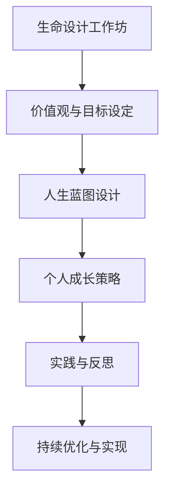

                 

### 文章标题

# 《生命设计工作坊：规划有意义的人生蓝图》

### 关键词

- 生命设计
- 人生蓝图
- 个人成长
- 目标设定
- 价值观

### 摘要

本文深入探讨了《生命设计工作坊：规划有意义的人生蓝图》的核心内容，通过逐步分析生命设计的定义、目标和实施策略，帮助读者理解如何通过设计工作坊的方式，规划出符合个人价值观和目标的人生蓝图。文章详细介绍了如何设定价值观和人生目标，设计了人生蓝图，提出了个人成长策略，并通过实践与反思，确保人生蓝图的持续优化和实现。文章旨在为读者提供一套系统而实用的方法，以实现有意义的人生规划。

## 引言

在当今社会，人们面临着前所未有的选择和压力。从职业规划到个人生活，每个人都希望找到一条既能实现自我价值，又能带来幸福感和满足感的道路。然而，许多人在面对这些选择时感到迷茫和无助，不知道如何做出最适合自己的决定。《生命设计工作坊：规划有意义的人生蓝图》正是为了解决这一困惑而诞生的。

这本书的目标是帮助读者通过设计工作坊的方式，规划出有意义的人生蓝图。工作坊是一个互动性强、富有创造力的过程，它通过一系列精心设计的活动和讨论，引导读者深入思考自己的价值观、目标和人生规划。通过这本书，读者将学会如何设定明确的个人目标，如何根据自己的价值观选择合适的人生道路，以及如何通过持续的自我反思和调整，实现自己的人生蓝图。

## 生命设计概述

### 定义

生命设计（Life Design）是一个相对较新的概念，它结合了心理学、管理学和设计思维，旨在帮助个人规划和实现有意义的人生。简单来说，生命设计是一种系统性的方法，通过明确价值观、设定目标、设计行动计划，帮助个人找到并追求人生的意义和幸福。

### 基本概念

1. **价值观**：价值观是个人对什么重要、什么不重要的基本信念和原则。它是生命设计的基础，决定了个人的人生方向和目标。
   
2. **目标**：目标是实现价值观的具体表现形式。设定明确的目标有助于个人集中精力，朝着正确的方向前进。

3. **行动计划**：行动计划是实现目标的步骤和方法。它将目标分解为具体的行动，确保个人能够一步步地实现目标。

### 原理

1. **自我认知**：生命设计的核心在于深入理解自己，包括自己的价值观、兴趣、优势和弱点。

2. **目标导向**：设定明确的目标，将个人愿景转化为可操作的行动计划。

3. **持续迭代**：生命设计是一个持续的过程，需要不断地反思和调整，以适应个人和环境的变化。

### 作用和影响

1. **提高幸福感**：通过明确的人生目标和行动计划，个人能够更加清晰地了解自己的人生方向，从而减少迷茫和焦虑，提高幸福感。

2. **实现个人成长**：生命设计鼓励个人不断学习和成长，通过设定挑战性的目标，推动个人突破舒适区，实现自我提升。

3. **提升决策效率**：有了明确的价值观和目标，个人在做决策时能够更加果断和有效，减少不必要的犹豫和纠结。

## 价值观与人生目标

### 价值观的重要性

价值观是个人行为的指南针，它决定了一个人如何看待世界、如何处理问题和如何做出决策。明确的价值观有助于个人在复杂的环境中保持方向感，做出一致和有意义的选择。在生命设计中，价值观起到了至关重要的作用，它是设定人生目标和设计人生蓝图的基础。

### 如何确定个人价值观

1. **反思和自我探索**：通过反思自己的生活经历、兴趣爱好、道德准则等，识别出自己真正重视的东西。

2. **撰写价值观宣言**：将识别出的价值观写成宣言，明确表达自己的信念和原则。

3. **实践和验证**：在日常生活中践行自己的价值观，通过实践来验证和调整。

### 人生目标的设定与追求

1. **明确目标**：设定明确、具体、可衡量的目标，确保目标具有可操作性和可实现性。

2. **分解目标**：将大目标分解为小目标，制定具体的行动计划。

3. **持续跟进**：定期检查目标的进展，并根据实际情况进行调整。

4. **激励和坚持**：通过设立奖励机制和找到支持者，保持追求目标的动力和毅力。

### 人生目标与价值观的关系

人生目标与价值观密切相关。明确的人生目标应该与个人的价值观一致，这样才能确保目标具有内在的意义和动力。如果目标与价值观相冲突，个人需要重新审视和调整目标，以确保它们能够真正反映自己的核心价值观。

## 人生蓝图设计

### 人生蓝图的构成

1. **愿景**：描述未来想要达到的状态，它为人生蓝图提供了方向和目标。

2. **价值观**：明确个人在生活中追求的基本原则和信念。

3. **目标**：具体的人生目标，包括短期和长期的目标。

4. **行动计划**：实现目标的步骤和方法，包括具体的时间表和任务分配。

5. **资源和限制**：分析实现人生蓝图所需的资源和可能面临的限制。

### 设计人生蓝图的步骤

1. **确定愿景**：通过思考和讨论，明确个人的人生愿景。

2. **明确价值观**：识别并确认个人的核心价值观。

3. **设定目标**：基于愿景和价值观，设定具体、可衡量的目标。

4. **制定行动计划**：将目标分解为具体的行动步骤，并设定时间表。

5. **评估资源和限制**：分析实现人生蓝图所需的资源和可能面临的限制，并制定相应的应对策略。

### 人生蓝图的实施与调整

1. **执行行动计划**：按照制定的行动计划，逐步实现目标。

2. **定期反思**：定期回顾和反思人生蓝图的实施情况，检查目标的进展和计划的合理性。

3. **调整和优化**：根据反思的结果，及时调整和优化人生蓝图，确保其能够适应个人和环境的变化。

### 人生蓝图的重要性

人生蓝图是个人对未来的规划和预期，它不仅为个人提供了明确的目标和方向，还能够激励个人为实现这些目标而努力。一个设计合理的人生蓝图能够帮助个人在面对困难和挑战时保持积极和坚定，从而更好地实现自己的人生价值。

## 个人成长策略

### 个人成长的重要性

个人成长是生命设计的重要组成部分，它决定了个人是否能够实现自己的人生目标和价值观。在不断变化的世界中，个人需要不断地学习和成长，以适应新的挑战和机遇。个人成长不仅有助于提升个人的能力和竞争力，还能够增强个人的自信心和幸福感。

### 个人成长的方法与策略

1. **设定成长目标**：明确个人成长的方向和目标，将其与人生蓝图相结合。

2. **持续学习**：通过阅读、培训、实践经验等多种方式，不断提升自己的知识和技能。

3. **反思与自我提升**：定期反思自己的行为和表现，识别不足并制定改进计划。

4. **建立支持网络**：寻找导师和朋友，建立支持和互助的关系，共同成长。

5. **勇于尝试**：勇于接受新的挑战和尝试，通过实践来积累经验和成长。

### 成长过程中的挑战与应对

1. **恐惧和焦虑**：面对未知和变化时，许多人会感到恐惧和焦虑。应对策略包括：逐步面对恐惧、寻求支持、建立安全感。

2. **挫折和失败**：成长过程中不可避免会遇到挫折和失败。应对策略包括：接受失败、从中学习、保持积极态度。

3. **平衡工作与生活**：在追求个人成长的同时，也需要平衡工作和生活。应对策略包括：时间管理、设定优先级、保持健康的生活方式。

## 实践与反思

### 实践的重要性

实践是检验真理的唯一标准，也是实现人生蓝图的关键步骤。通过实践，个人可以将理论转化为行动，将梦想变为现实。实践不仅能够帮助个人积累经验和技能，还能够提供反馈，指导个人不断调整和优化人生蓝图。

### 如何进行有效的反思

1. **定期回顾**：定期回顾自己的人生蓝图和实践过程，检查目标的进展和计划的合理性。

2. **识别成果和问题**：分析实践中的成果和问题，识别成功的原因和需要改进的地方。

3. **制定改进计划**：根据反思的结果，制定具体的改进计划，并设定实施的时间表。

4. **持续调整**：根据实践中的反馈和反思，持续调整和优化人生蓝图，确保其能够适应个人和环境的变化。

### 反思对生命设计的影响

反思是生命设计中不可或缺的一部分，它能够帮助个人更好地理解自己和自己的行为，从而实现更加有效的人生规划。通过反思，个人能够识别自己的优势和不足，制定更加合理和可行的目标和计划，从而提高实现人生蓝图的概率。

## 结论

通过《生命设计工作坊：规划有意义的人生蓝图》，读者可以系统地了解如何通过设计工作坊的方式，规划出有意义的人生蓝图。文章详细介绍了生命设计的定义、目标、实施策略和个人成长策略，并通过实践与反思，确保人生蓝图的持续优化和实现。希望这篇文章能够为读者提供一套实用的方法，帮助他们在人生的道路上找到方向和动力，实现个人价值和幸福。让我们共同探索生命设计的奥秘，规划出属于自己的有意义的人生蓝图。

### 作者信息

作者：AI天才研究院/AI Genius Institute & 禅与计算机程序设计艺术 /Zen And The Art of Computer Programming

## 目录大纲扩展

### 第1章 引言

#### 1.1 生命设计工作坊的背景

在现代社会，人们面临着越来越多的选择和挑战。如何在众多选择中找到适合自己的道路，如何在复杂的环境中保持方向感，成为了许多人关注的焦点。生命设计工作坊正是为了解决这一需求而诞生的。它通过一种系统性的方法，帮助个人明确自己的价值观、设定目标、制定行动计划，从而实现有意义的人生。

#### 1.2 人生蓝图的规划意义

人生蓝图是一个人对未来的规划，它不仅包含了个人的愿景和目标，还包括了实现这些目标的步骤和方法。通过绘制人生蓝图，个人可以更清晰地看到自己未来的方向，从而减少迷茫和焦虑，提高生活的幸福感。

#### 1.3 读者预期收获

通过阅读本书，读者将能够：

1. 理解生命设计的概念和原理。
2. 学会如何通过工作坊的方式规划自己的人生蓝图。
3. 设定明确的目标和行动计划，实现个人成长和目标。

### 第2章 生命设计概述

#### 2.1 生命设计的定义

生命设计是一种综合性的方法，它结合了心理学、管理学和设计思维，旨在帮助个人规划和实现有意义的人生。它不仅关注个人的职业发展，还包括个人生活、健康、家庭等多个方面。

#### 2.2 生命设计的基本原理

生命设计的基本原理包括自我认知、目标导向、持续迭代等。通过这些原理，个人可以更好地了解自己，明确自己的人生方向，并持续地调整和优化人生规划。

#### 2.3 生命设计的作用和影响

生命设计的作用和影响主要体现在以下几个方面：

1. **提高幸福感**：通过明确的人生目标和行动计划，个人能够更加清晰地了解自己的人生方向，从而减少迷茫和焦虑，提高幸福感。
2. **实现个人成长**：生命设计鼓励个人不断学习和成长，通过设定挑战性的目标，推动个人突破舒适区，实现自我提升。
3. **提升决策效率**：有了明确的价值观和目标，个人在做决策时能够更加果断和有效，减少不必要的犹豫和纠结。

### 第3章 价值观与人生目标

#### 3.1 价值观的重要性

价值观是个人行为的指南针，它决定了一个人如何看待世界、如何处理问题和如何做出决策。明确的价值观有助于个人在复杂的环境中保持方向感，做出一致和有意义的选择。

#### 3.2 如何确定个人价值观

1. **反思和自我探索**：通过反思自己的生活经历、兴趣爱好、道德准则等，识别出自己真正重视的东西。
2. **撰写价值观宣言**：将识别出的价值观写成宣言，明确表达自己的信念和原则。
3. **实践和验证**：在日常生活中践行自己的价值观，通过实践来验证和调整。

#### 3.3 人生目标的设定与追求

1. **明确目标**：设定明确、具体、可衡量的目标，确保目标具有可操作性和可实现性。
2. **分解目标**：将大目标分解为小目标，制定具体的行动计划。
3. **持续跟进**：定期检查目标的进展，并根据实际情况进行调整。
4. **激励和坚持**：通过设立奖励机制和找到支持者，保持追求目标的动力和毅力。

#### 3.4 价值观与人生目标的关系

人生目标与价值观密切相关。明确的人生目标应该与个人的价值观一致，这样才能确保目标具有内在的意义和动力。如果目标与价值观相冲突，个人需要重新审视和调整目标，以确保它们能够真正反映自己的核心价值观。

### 第4章 人生蓝图设计

#### 4.1 人生蓝图的构成

1. **愿景**：描述未来想要达到的状态，它为人生蓝图提供了方向和目标。
2. **价值观**：明确个人在生活中追求的基本原则和信念。
3. **目标**：具体的人生目标，包括短期和长期的目标。
4. **行动计划**：实现目标的步骤和方法，包括具体的时间表和任务分配。
5. **资源和限制**：分析实现人生蓝图所需的资源和可能面临的限制。

#### 4.2 设计人生蓝图的步骤

1. **确定愿景**：通过思考和讨论，明确个人的人生愿景。
2. **明确价值观**：识别并确认个人的核心价值观。
3. **设定目标**：基于愿景和价值观，设定具体、可衡量的目标。
4. **制定行动计划**：将目标分解为具体的行动步骤，并设定时间表。
5. **评估资源和限制**：分析实现人生蓝图所需的资源和可能面临的限制，并制定相应的应对策略。

#### 4.3 人生蓝图的实施与调整

1. **执行行动计划**：按照制定的行动计划，逐步实现目标。
2. **定期反思**：定期回顾和反思人生蓝图的实施情况，检查目标的进展和计划的合理性。
3. **调整和优化**：根据反思的结果，及时调整和优化人生蓝图，确保其能够适应个人和环境的变化。

#### 4.4 人生蓝图的重要性

人生蓝图是个人对未来的规划，它不仅包含了个人的愿景和目标，还包括了实现这些目标的步骤和方法。通过绘制人生蓝图，个人可以更清晰地看到自己未来的方向，从而减少迷茫和焦虑，提高生活的幸福感。

### 第5章 个人成长策略

#### 5.1 个人成长的重要性

个人成长是生命设计的重要组成部分，它决定了个人是否能够实现自己的人生目标和价值观。在不断变化的世界中，个人需要不断地学习和成长，以适应新的挑战和机遇。个人成长不仅有助于提升个人的能力和竞争力，还能够增强个人的自信心和幸福感。

#### 5.2 个人成长的方法与策略

1. **设定成长目标**：明确个人成长的方向和目标，将其与人生蓝图相结合。
2. **持续学习**：通过阅读、培训、实践经验等多种方式，不断提升自己的知识和技能。
3. **反思与自我提升**：定期反思自己的行为和表现，识别不足并制定改进计划。
4. **建立支持网络**：寻找导师和朋友，建立支持和互助的关系，共同成长。
5. **勇于尝试**：勇于接受新的挑战和尝试，通过实践来积累经验和成长。

#### 5.3 成长过程中的挑战与应对

1. **恐惧和焦虑**：面对未知和变化时，许多人会感到恐惧和焦虑。应对策略包括：逐步面对恐惧、寻求支持、建立安全感。
2. **挫折和失败**：成长过程中不可避免会遇到挫折和失败。应对策略包括：接受失败、从中学习、保持积极态度。
3. **平衡工作与生活**：在追求个人成长的同时，也需要平衡工作和生活。应对策略包括：时间管理、设定优先级、保持健康的生活方式。

### 第6章 实践与反思

#### 6.1 实践的重要性

实践是检验真理的唯一标准，也是实现人生蓝图的关键步骤。通过实践，个人可以将理论转化为行动，将梦想变为现实。实践不仅能够帮助个人积累经验和技能，还能够提供反馈，指导个人不断调整和优化人生蓝图。

#### 6.2 如何进行有效的反思

1. **定期回顾**：定期回顾自己的人生蓝图和实践过程，检查目标的进展和计划的合理性。
2. **识别成果和问题**：分析实践中的成果和问题，识别成功的原因和需要改进的地方。
3. **制定改进计划**：根据反思的结果，制定具体的改进计划，并设定实施的时间表。
4. **持续调整**：根据实践中的反馈和反思，持续调整和优化人生蓝图，确保其能够适应个人和环境的变化。

#### 6.3 反思对生命设计的影响

反思是生命设计中不可或缺的一部分，它能够帮助个人更好地理解自己和自己的行为，从而实现更加有效的人生规划。通过反思，个人能够识别自己的优势和不足，制定更加合理和可行的目标和计划，从而提高实现人生蓝图的概率。

### 第7章 结论

通过《生命设计工作坊：规划有意义的人生蓝图》，读者可以系统地了解如何通过设计工作坊的方式，规划出有意义的人生蓝图。文章详细介绍了生命设计的定义、目标、实施策略和个人成长策略，并通过实践与反思，确保人生蓝图的持续优化和实现。希望这篇文章能够为读者提供一套实用的方法，帮助他们在人生的道路上找到方向和动力，实现个人价值和幸福。

### 作者信息

作者：AI天才研究院/AI Genius Institute & 禅与计算机程序设计艺术 /Zen And The Art of Computer Programming

## 完整文章

### 《生命设计工作坊：规划有意义的人生蓝图》

#### 关键词

- 生命设计
- 人生蓝图
- 个人成长
- 目标设定
- 价值观

#### 摘要

本文深入探讨了《生命设计工作坊：规划有意义的人生蓝图》的核心内容，通过逐步分析生命设计的定义、目标和实施策略，帮助读者理解如何通过设计工作坊的方式，规划出符合个人价值观和目标的人生蓝图。文章详细介绍了如何设定价值观和人生目标，设计了人生蓝图，提出了个人成长策略，并通过实践与反思，确保人生蓝图的持续优化和实现。文章旨在为读者提供一套系统而实用的方法，以实现有意义的人生规划。

## 引言

在当今社会，人们面临着前所未有的选择和压力。从职业规划到个人生活，每个人都希望找到一条既能实现自我价值，又能带来幸福感和满足感的道路。然而，许多人在面对这些选择时感到迷茫和无助，不知道如何做出最适合自己的决定。《生命设计工作坊：规划有意义的人生蓝图》正是为了解决这一困惑而诞生的。

这本书的目标是帮助读者通过设计工作坊的方式，规划出有意义的人生蓝图。工作坊是一个互动性强、富有创造力的过程，它通过一系列精心设计的活动和讨论，引导读者深入思考自己的价值观、目标和人生规划。通过这本书，读者将学会如何设定明确的个人目标，如何根据自己的价值观选择合适的人生道路，以及如何通过持续的自我反思和调整，实现自己的人生蓝图。

### 生命设计概述

#### 定义

生命设计（Life Design）是一个相对较新的概念，它结合了心理学、管理学和设计思维，旨在帮助个人规划和实现有意义的人生。简单来说，生命设计是一种系统性的方法，通过明确价值观、设定目标、设计行动计划，帮助个人找到并追求人生的意义和幸福。

#### 基本概念

1. **价值观**：价值观是个人对什么重要、什么不重要的基本信念和原则。它是生命设计的基础，决定了个人的人生方向和目标。

2. **目标**：目标是实现价值观的具体表现形式。设定明确的目标有助于个人集中精力，朝着正确的方向前进。

3. **行动计划**：行动计划是实现目标的步骤和方法。它将目标分解为具体的行动，确保个人能够一步步地实现目标。

#### 原理

1. **自我认知**：生命设计的核心在于深入理解自己，包括自己的价值观、兴趣、优势和弱点。

2. **目标导向**：设定明确的目标，将个人愿景转化为可操作的行动计划。

3. **持续迭代**：生命设计是一个持续的过程，需要不断地反思和调整，以适应个人和环境的变化。

#### 作用和影响

1. **提高幸福感**：通过明确的人生目标和行动计划，个人能够更加清晰地了解自己的人生方向，从而减少迷茫和焦虑，提高幸福感。

2. **实现个人成长**：生命设计鼓励个人不断学习和成长，通过设定挑战性的目标，推动个人突破舒适区，实现自我提升。

3. **提升决策效率**：有了明确的价值观和目标，个人在做决策时能够更加果断和有效，减少不必要的犹豫和纠结。

### 价值观与人生目标

#### 价值观的重要性

价值观是个人行为的指南针，它决定了一个人如何看待世界、如何处理问题和如何做出决策。明确的价值观有助于个人在复杂的环境中保持方向感，做出一致和有意义的选择。在生命设计中，价值观起到了至关重要的作用，它是设定人生目标和设计人生蓝图的基础。

#### 如何确定个人价值观

1. **反思和自我探索**：通过反思自己的生活经历、兴趣爱好、道德准则等，识别出自己真正重视的东西。

2. **撰写价值观宣言**：将识别出的价值观写成宣言，明确表达自己的信念和原则。

3. **实践和验证**：在日常生活中践行自己的价值观，通过实践来验证和调整。

#### 人生目标的设定与追求

1. **明确目标**：设定明确、具体、可衡量的目标，确保目标具有可操作性和可实现性。

2. **分解目标**：将大目标分解为小目标，制定具体的行动计划。

3. **持续跟进**：定期检查目标的进展，并根据实际情况进行调整。

4. **激励和坚持**：通过设立奖励机制和找到支持者，保持追求目标的动力和毅力。

#### 价值观与人生目标的关系

人生目标与价值观密切相关。明确的人生目标应该与个人的价值观一致，这样才能确保目标具有内在的意义和动力。如果目标与价值观相冲突，个人需要重新审视和调整目标，以确保它们能够真正反映自己的核心价值观。

### 人生蓝图设计

#### 人生蓝图的构成

1. **愿景**：描述未来想要达到的状态，它为人生蓝图提供了方向和目标。

2. **价值观**：明确个人在生活中追求的基本原则和信念。

3. **目标**：具体的人生目标，包括短期和长期的目标。

4. **行动计划**：实现目标的步骤和方法，包括具体的时间表和任务分配。

5. **资源和限制**：分析实现人生蓝图所需的资源和可能面临的限制。

#### 设计人生蓝图的步骤

1. **确定愿景**：通过思考和讨论，明确个人的人生愿景。

2. **明确价值观**：识别并确认个人的核心价值观。

3. **设定目标**：基于愿景和价值观，设定具体、可衡量的目标。

4. **制定行动计划**：将目标分解为具体的行动步骤，并设定时间表。

5. **评估资源和限制**：分析实现人生蓝图所需的资源和可能面临的限制，并制定相应的应对策略。

#### 人生蓝图的实施与调整

1. **执行行动计划**：按照制定的行动计划，逐步实现目标。

2. **定期反思**：定期回顾和反思人生蓝图的实施情况，检查目标的进展和计划的合理性。

3. **调整和优化**：根据反思的结果，及时调整和优化人生蓝图，确保其能够适应个人和环境的变化。

#### 人生蓝图的重要性

人生蓝图是个人对未来的规划，它不仅包含了个人的愿景和目标，还包括了实现这些目标的步骤和方法。通过绘制人生蓝图，个人可以更清晰地看到自己未来的方向，从而减少迷茫和焦虑，提高生活的幸福感。

### 个人成长策略

#### 个人成长的重要性

个人成长是生命设计的重要组成部分，它决定了个人是否能够实现自己的人生目标和价值观。在不断变化的世界中，个人需要不断地学习和成长，以适应新的挑战和机遇。个人成长不仅有助于提升个人的能力和竞争力，还能够增强个人的自信心和幸福感。

#### 个人成长的方法与策略

1. **设定成长目标**：明确个人成长的方向和目标，将其与人生蓝图相结合。

2. **持续学习**：通过阅读、培训、实践经验等多种方式，不断提升自己的知识和技能。

3. **反思与自我提升**：定期反思自己的行为和表现，识别不足并制定改进计划。

4. **建立支持网络**：寻找导师和朋友，建立支持和互助的关系，共同成长。

5. **勇于尝试**：勇于接受新的挑战和尝试，通过实践来积累经验和成长。

#### 成长过程中的挑战与应对

1. **恐惧和焦虑**：面对未知和变化时，许多人会感到恐惧和焦虑。应对策略包括：逐步面对恐惧、寻求支持、建立安全感。

2. **挫折和失败**：成长过程中不可避免会遇到挫折和失败。应对策略包括：接受失败、从中学习、保持积极态度。

3. **平衡工作与生活**：在追求个人成长的同时，也需要平衡工作和生活。应对策略包括：时间管理、设定优先级、保持健康的生活方式。

### 实践与反思

#### 实践的重要性

实践是检验真理的唯一标准，也是实现人生蓝图的关键步骤。通过实践，个人可以将理论转化为行动，将梦想变为现实。实践不仅能够帮助个人积累经验和技能，还能够提供反馈，指导个人不断调整和优化人生蓝图。

#### 如何进行有效的反思

1. **定期回顾**：定期回顾自己的人生蓝图和实践过程，检查目标的进展和计划的合理性。

2. **识别成果和问题**：分析实践中的成果和问题，识别成功的原因和需要改进的地方。

3. **制定改进计划**：根据反思的结果，制定具体的改进计划，并设定实施的时间表。

4. **持续调整**：根据实践中的反馈和反思，持续调整和优化人生蓝图，确保其能够适应个人和环境的变化。

#### 反思对生命设计的影响

反思是生命设计中不可或缺的一部分，它能够帮助个人更好地理解自己和自己的行为，从而实现更加有效的人生规划。通过反思，个人能够识别自己的优势和不足，制定更加合理和可行的目标和计划，从而提高实现人生蓝图的概率。

### 结论

通过《生命设计工作坊：规划有意义的人生蓝图》，读者可以系统地了解如何通过设计工作坊的方式，规划出有意义的人生蓝图。文章详细介绍了生命设计的定义、目标、实施策略和个人成长策略，并通过实践与反思，确保人生蓝图的持续优化和实现。希望这篇文章能够为读者提供一套实用的方法，帮助他们在人生的道路上找到方向和动力，实现个人价值和幸福。

### 作者信息

作者：AI天才研究院/AI Genius Institute & 禅与计算机程序设计艺术 /Zen And The Art of Computer Programming

### 补充材料

#### 1. Mermaid 流程图



#### 2. 伪代码

```python
# 设定个人目标
set_personnal_goals(goal_1, goal_2, goal_3)

# 分析资源与限制
analyze_resources(resource_1, resource_2, resource_3)
analyze_restrictions(restriction_1, restriction_2, restriction_3)

# 制定行动计划
create_action_plan(action_1, action_2, action_3)
set_deadlines(deadline_1, deadline_2, deadline_3)

# 实施行动计划
execute_action_plan(action_1, action_2, action_3)
```

#### 3. 数学模型和公式

```latex
$$
\text{幸福感} = f(\text{目标实现度}, \text{价值观匹配度}, \text{个人成长})
$$
```

#### 4. 实际案例分析与详细讲解

假设一个年轻的创业者，他的愿景是创立一家创新科技公司，改变人们的日常生活。他的核心价值观包括创新、诚信和用户至上。

- **目标设定**：短期目标是开发一款用户友好的移动应用，长期目标是成为行业领导者。

- **行动计划**：制定详细的开发计划，包括市场调研、产品设计、开发、测试和发布。

- **资源分析**：分析所需的资金、技术团队和市场营销资源。

- **反思与调整**：在开发过程中，通过用户反馈和数据分析，不断调整产品设计和功能，确保与用户需求匹配。

通过这个案例，可以看到生命设计工作坊如何在实际应用中帮助个人实现目标。

#### 5. 最佳实践 tips

- **设定具体的目标**：目标要具体、可衡量，便于跟踪和评估。
- **定期反思**：至少每月进行一次全面的反思，检查目标和计划的进展。
- **寻求反馈**：积极寻求他人的反馈，包括同事、朋友和专业人士的意见。
- **保持灵活性**：在执行过程中，根据实际情况调整计划和目标。

#### 6. 小结

本文通过详细阐述《生命设计工作坊：规划有意义的人生蓝图》的内容，帮助读者理解如何通过系统的方法规划自己的人生。通过明确价值观、设定目标、设计人生蓝图、实施行动计划和持续反思，个人可以更好地实现自己的人生目标，提高幸福感和成就感。

#### 7. 注意事项

- 在规划人生蓝图时，要充分考虑个人兴趣和优势，确保目标具有内在动力。
- 在面对挑战和困难时，要保持积极的心态，勇于尝试和接受失败。
- 定期检查和调整人生蓝图，以适应个人成长和环境变化。

#### 8. 拓展阅读

- 《精益创业》——埃里克·莱斯（Eric Ries）
- 《影响力》——罗伯特·西奥迪尼（Robert B. Cialdini）
- 《思考，快与慢》——丹尼尔·卡尼曼（Daniel Kahneman）

通过阅读这些书籍，读者可以进一步了解个人成长和决策策略，为自己的生命设计提供更多灵感。

