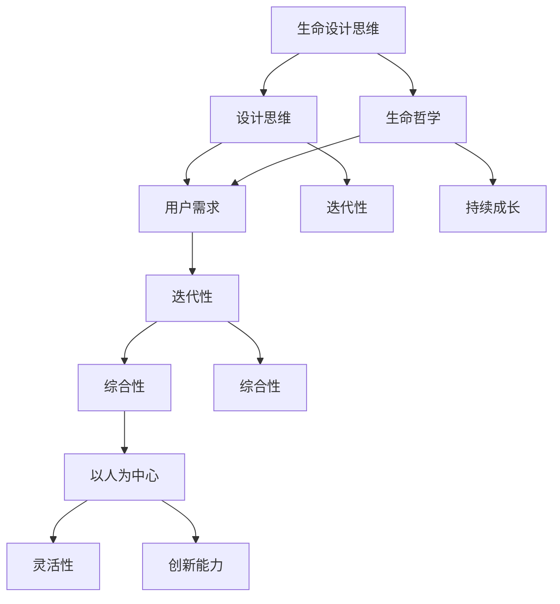

                 

### 文章标题

# 生命设计思维工作坊：创新方法应用于人生规划

### 关键词

- 生命设计思维
- 创新方法
- 人生规划
- 设计思维方法论
- 实践案例

### 摘要

本文旨在探讨生命设计思维的核心理念及其在人生规划中的应用。通过分析设计思维的历史与演变，以及其在各个领域的应用，本文揭示了生命设计思维在塑造个人成长和社会发展中的重要性。文章首先介绍了什么是生命设计思维，随后深入探讨了设计思维方法论在人生规划中的应用。通过具体案例，本文展示了设计思维工具在设定目标、规划路径等方面的实际应用效果。最后，本文总结了设计思维工作坊的实践方法，并提出了反思与成长的建议，为读者提供了一套全面而实用的生命设计思维框架。

## 第1章 生命设计思维概述

### 1.1 什么是生命设计思维

#### 1.1.1 生命设计思维的定义

生命设计思维（Life Design Thinking）是一种综合性的思考框架，旨在帮助个体和团队更好地理解和应对复杂多变的生活环境。它结合了设计思维和生命哲学的核心元素，强调以人为中心，关注个体在生命过程中的需求、欲望和成长。

设计思维，起源于20世纪初期的工业设计领域，是一种以用户需求为导向，通过迭代和试错来创造和改进产品的系统性方法。生命设计思维则在此基础上，将设计思维的原则应用于个人生活和职业生涯的规划，强调个体在整个生命过程中的持续迭代和成长。

#### 1.1.2 生命设计思维的特点

1. **以人为中心**：生命设计思维始终关注个体的需求和情感，强调人的主观体验在整个设计过程中的核心地位。
2. **综合性**：生命设计思维融合了设计思维、心理学、社会学等多学科的知识，形成了一套完整的思考框架。
3. **迭代性**：生命设计思维强调不断迭代和反思，通过多次实践和调整，不断优化人生规划和目标实现的方式。
4. **灵活性**：面对复杂多变的生活环境，生命设计思维提倡灵活应对，以适应不断变化的需求和挑战。

### 1.2 生命设计思维的重要性

#### 1.2.1 对个人发展的意义

生命设计思维为个人提供了一个系统化的方法，帮助他们在复杂的职业生涯和个人生活中找到清晰的方向。通过这种思维方式，个人可以更好地理解自己的需求、兴趣和价值观，从而做出更明智的选择，实现个人的全面发展。

1. **目标明确**：生命设计思维帮助个人明确自己的长期和短期目标，制定切实可行的规划。
2. **需求满足**：通过深入理解自己的需求和欲望，生命设计思维能够帮助个人找到更好的解决方案，提高生活质量。
3. **持续成长**：生命设计思维的迭代性和反思性特点，促使个人不断学习和进步，实现持续成长。

#### 1.2.2 对社会发展的贡献

生命设计思维不仅对个人有深远的影响，也在社会层面发挥了重要作用。通过推广和应用生命设计思维，社会可以培养更多具备创新精神和问题解决能力的个体，从而推动社会的整体进步。

1. **创新能力**：生命设计思维鼓励个人和团队进行创新尝试，激发社会的创造力。
2. **可持续发展**：生命设计思维强调对环境的关注和保护，推动可持续发展的理念。
3. **社会和谐**：通过生命设计思维，个人和社会之间的矛盾和冲突可以得到有效缓解，促进社会的和谐发展。

## Mermaid 流程图：生命设计思维核心概念与联系



## 第2章 设计思维方法论

### 2.1 设计思维的历史与演变

#### 2.1.1 设计思维的历史背景

设计思维的历史可以追溯到20世纪初，当时工业革命推动了产品设计和制造技术的飞速发展。最早的设计思维理念源于对用户需求的关注，当时的设计师开始尝试通过用户研究来了解用户的需求，并将其融入到产品设计中。

#### 2.1.2 设计思维的演变过程

1. **早期设计思维（20世纪初 - 1960s）**：
   - **以产品为中心**：早期的设计思维主要关注如何制造出更美观、更实用的产品。
   - **用户研究**：设计师开始进行用户研究，了解用户的需求和偏好。

2. **现代设计思维（1960s - 2000s）**：
   - **用户需求导向**：设计思维逐渐转向以用户需求为导向，强调设计师需要深入了解用户的需求和体验。
   - **迭代与试错**：设计师开始采用迭代的方法来不断改进产品，通过试错来找到最佳解决方案。

3. **数字时代的设计思维（2000s - 至今）**：
   - **全流程设计**：设计思维不再局限于产品阶段，而是贯穿于产品从构思到交付的全过程。
   - **跨学科协作**：设计思维的应用范围不断扩大，涵盖了多个领域，如服务设计、战略设计等。
   - **数字化工具**：随着数字技术的发展，设计师开始使用各种数字化工具来辅助设计过程，如用户体验地图、原型设计工具等。

### 2.2 设计思维的核心原则

设计思维的核心原则可以概括为以下五个方面：

1. **以用户为中心**：设计思维始终围绕用户的需求和体验进行，强调设计师需要深入了解用户，以便创造出满足用户需求的产品和服务。
2. **迭代与试错**：设计思维鼓励设计师在过程中不断迭代和试错，通过多次实践来找到最佳解决方案。
3. **协作与跨学科**：设计思维强调跨学科的协作，通过不同专业背景的团队成员共同合作，以产生更多的创新想法。
4. **灵活性与适应性**：面对复杂多变的环境，设计思维提倡灵活应对，快速适应变化的需求和挑战。
5. **反思与成长**：设计思维强调在过程中的反思和总结，通过不断的反思和改进，推动个人和团队的成长。

### 2.3 设计思维在不同领域的应用

设计思维不仅适用于产品设计，还广泛应用于其他领域，如服务设计、战略设计等。以下是设计思维在不同领域的一些典型应用：

#### 2.3.1 服务设计

服务设计关注如何通过设计来提升服务质量和用户满意度。设计思维在服务设计中的应用，包括以下步骤：

1. **理解用户**：通过用户调研和访谈，了解用户的需求和痛点。
2. **构建服务蓝图**：绘制服务流程图，明确服务的关键环节和用户触点。
3. **设计原型**：创建服务原型，通过试用来优化服务流程和用户体验。
4. **测试与迭代**：通过用户测试和反馈，不断优化服务设计和流程。

#### 2.3.2 战略设计

战略设计关注企业或组织的发展方向和策略。设计思维在战略设计中的应用，包括以下步骤：

1. **确定愿景和目标**：明确企业或组织的长期愿景和短期目标。
2. **分析市场和环境**：通过市场调研和竞争分析，了解行业发展趋势和环境变化。
3. **设计战略方案**：基于愿景和目标，设计具体的战略方案和行动计划。
4. **评估与调整**：通过实施和反馈，不断评估和调整战略方案。

### 2.4 设计思维与传统方法的区别

设计思维与传统方法相比，具有以下显著区别：

1. **用户导向**：设计思维更加强调以用户为中心，关注用户的需求和体验，而传统方法往往更注重技术和功能。
2. **迭代性**：设计思维鼓励在过程中不断迭代和试错，通过多次实践来找到最佳解决方案，而传统方法往往采用线性思维，一步一个脚印地推进。
3. **跨学科协作**：设计思维强调跨学科的协作，通过不同专业背景的团队成员共同合作，而传统方法则往往局限于单一领域。
4. **灵活性**：设计思维提倡灵活应对，快速适应变化的需求和挑战，而传统方法则相对僵化，难以适应快速变化的环境。

## 伪代码：设计思维核心算法原理讲解

```python
# 设计思维核心算法原理：用户需求分析与解决方案设计

# 步骤1：用户需求分析
def user_needs_analysis():
    # 调研用户需求
    user_requirements = research_user_requirements()
    # 分析用户痛点
    user_pain_points = analyze_user_pain_points(user_requirements)
    return user_pain_points

# 步骤2：设计方案迭代
def design_solution_iterations(user_pain_points):
    solutions = []
    for pain_point in user_pain_points:
        # 设计解决方案
        solution = design_solution(pain_point)
        # 试用与反馈
        feedback = trial_and_feedback(solution)
        # 优化解决方案
        optimized_solution = optimize_solution(solution, feedback)
        solutions.append(optimized_solution)
    return solutions

# 步骤3：选择最佳解决方案
def select_best_solution(solutions):
    best_solution = min(solutions, key=lambda x: x['evaluation_score'])
    return best_solution
```

## 第3章 人生规划与设计思维

### 3.1 生命设计思维在人生规划中的应用

#### 3.1.1 人生规划的目标设定

人生规划的目标设定是人生设计思维的核心步骤之一。一个明确且具体的目标能够为人生规划提供方向和动力，帮助个体在复杂多变的环境中保持清晰的目标感。

**设定目标的方法：**

1. **SMART原则**：SMART原则是一种常用的目标设定方法，它要求目标要具备具体性（Specific）、可衡量性（Measurable）、可实现性（Achievable）、相关性（Relevant）和时限性（Time-bound）。

2. **愿景映射**：通过绘制愿景地图，明确个人的长期愿景和短期目标，将抽象的愿景具体化，使其更加清晰和易于实现。

3. **优先级排序**：在设定多个目标时，进行优先级排序，确保重点目标的实现，避免资源浪费。

**目标的重要性：**

1. **方向指引**：明确的目标为个人提供清晰的方向，避免在人生道路上迷失。

2. **动力激发**：具体的目标能够激发个体的内在动力，使个体更加有决心和毅力去实现目标。

3. **资源优化**：明确的目标有助于个人合理分配时间和资源，提高效率。

#### 3.1.2 人生规划的路径设计

人生规划的路径设计是实现目标的关键步骤，它涉及到如何将目标分解为具体可行的步骤，并制定相应的行动计划。

**设计路径的步骤：**

1. **目标分解**：将长期目标分解为短期目标和里程碑，确保每个里程碑都是可实现的，并具备明确的完成时间。

2. **资源评估**：评估实现每个里程碑所需的资源，包括时间、资金、技能等，确保资源分配合理。

3. **风险评估**：分析可能影响路径实现的风险，制定相应的应对措施，降低风险对规划的影响。

4. **行动计划**：根据目标分解和资源评估，制定具体的行动计划，明确每个阶段的任务和时间表。

**影响因素：**

1. **个人能力**：个人能力是实现规划的关键因素，需要根据个人的实际情况设定合理的路径和目标。

2. **外部环境**：外部环境的变化可能影响规划的实现，需要灵活应对，调整路径和目标。

3. **资源限制**：资源限制可能对规划的实现产生制约，需要通过优化资源分配和寻找替代资源来克服。

### 3.2 设计思维在人生规划中的实际应用

设计思维在人生规划中的实际应用，主要体现在以下几个方面：

1. **用户需求分析**：通过深入了解自己的需求和欲望，为人生规划设定具体且明确的目标。

2. **迭代与试错**：通过不断迭代和试错，优化人生规划的路径和目标，确保规划具有可行性和适应性。

3. **协作与跨学科**：在规划过程中，与家人、朋友、导师等不同领域的专业人士合作，共同探讨和优化规划。

4. **反思与成长**：在实施规划的过程中，不断反思和总结，从经验中学习，不断成长和进步。

#### 3.2.1 职业规划中的应用

**案例背景：** 小李，一位刚刚毕业的大学生，对未来的职业方向感到迷茫，希望通过设计思维进行职业规划。

**应用过程：**

1. **用户需求分析**：小李通过自我反思和用户访谈，明确了自己对职业的期望和兴趣，确定了追求创新和挑战的工作类型。

2. **目标设定**：基于用户需求分析，小李设定了短期和长期职业目标，如第一年是找到一份与专业相关的工作，长期目标是成为一名技术专家。

3. **路径设计**：小李通过目标分解和资源评估，制定了实现目标的详细路径，包括提升专业技能、积累工作经验和建立人脉网络。

4. **迭代与优化**：在实施过程中，小李不断反思和调整规划，根据实际情况优化路径和目标，确保规划的可行性和适应性。

#### 3.2.2 教育规划中的应用

**案例背景：** 小红，一位高中生，面临高考和大学专业选择，希望通过设计思维进行教育规划。

**应用过程：**

1. **用户需求分析**：小红通过自我评估和咨询家长、老师，明确了自己对专业和职业的期望，确定了选择与兴趣相关的专业。

2. **目标设定**：基于用户需求分析，小红设定了高考目标、大学专业选择和未来职业规划，明确了每个阶段的具体任务和时间表。

3. **路径设计**：小红通过目标分解和资源评估，制定了高考复习计划、大学专业选择策略和职业规划路径，确保教育规划的合理性和可行性。

4. **迭代与优化**：在高考准备和大学专业选择过程中，小红不断反思和调整规划，根据实际情况优化复习计划和选择策略，确保教育规划的有效实施。

### 3.3 设计思维在人生规划中的优势

设计思维在人生规划中的优势主要体现在以下几个方面：

1. **系统化**：设计思维提供了一套系统化的方法，从用户需求分析、目标设定、路径设计到迭代与优化，确保人生规划的全面性和科学性。

2. **灵活性**：设计思维强调灵活应对变化，通过迭代和试错，能够及时调整规划，确保规划具备适应性。

3. **用户导向**：设计思维始终以用户需求为导向，关注个体的需求和体验，确保规划能够真正满足个人的需求。

4. **协作与跨学科**：设计思维鼓励跨学科协作，通过不同领域的专业人士共同探讨和优化规划，提升规划的实用性和创新性。

5. **反思与成长**：设计思维的迭代性和反思性特点，促使个人在规划实施过程中不断学习和进步，实现持续成长。

## 伪代码：设计思维在人生规划中的具体应用

```python
# 设计思维在人生规划中的具体应用：用户需求分析

# 步骤1：用户需求分析
def user_needs_analysis():
    # 自我反思
    user_expectations = self_reflection()
    # 用户访谈
    user_interviews = conduct_user_interviews()
    # 综合分析
    user_requirements = analyze_user_requirements(user_expectations, user_interviews)
    return user_requirements

# 步骤2：目标设定
def set_goals(user_requirements):
    # 短期目标
    short_term_goals = define_short_term_goals(user_requirements)
    # 长期目标
    long_term_goals = define_long_term_goals(user_requirements)
    return (short_term_goals, long_term_goals)

# 步骤3：路径设计
def design_path(short_term_goals, long_term_goals):
    # 目标分解
    milestones = decompose_goals(short_term_goals, long_term_goals)
    # 资源评估
    resources = assess_resources(milestones)
    # 风险评估
    risks = assess_risks(milestones)
    # 计划制定
    action_plan = create_action_plan(milestones, resources, risks)
    return action_plan

# 步骤4：迭代与优化
def iterate_and_optimize(action_plan):
    # 实施与反馈
    feedback = implement_and_collect_feedback(action_plan)
    # 调整规划
    optimized_plan = adjust_plan(action_plan, feedback)
    return optimized_plan
```

## 第4章 设计思维工具与应用

### 4.1 设计思维工具介绍

设计思维工具是设计师在创意和解决问题的过程中使用的各种方法和技巧。这些工具可以帮助设计师更深入地理解用户需求，激发创意思维，以及优化解决方案。以下是设计思维中常用的几种工具：

#### 4.1.1 思维导图

思维导图（Mind Map）是一种图形化的思考工具，用于组织和可视化信息。它通过中心主题向外扩展的分支结构，将相关的想法、信息和关联可视化。

**思维导图的基本概念：**
- **中心主题**：思维导图的中心部分，通常是问题的核心或解决方案的初步想法。
- **分支**：从中心主题向外延伸的线条，代表不同的想法、子主题或步骤。
- **连接线**：连接不同分支的线条，表示它们之间的关联和关系。

**思维导图的绘制方法：**
1. **确定中心主题**：明确思维导图要解决的问题或主题。
2. **扩展分支**：围绕中心主题，逐一列出相关的想法、子主题或步骤。
3. **绘制连接线**：用线条连接不同的分支，表示它们之间的逻辑关系。
4. **添加标签和细节**：在每个分支上添加标签，描述具体的内容和细节。

**思维导图的应用场景：**
- **创意激发**：用于头脑风暴，快速记录和整理创意。
- **项目规划**：用于梳理项目流程、任务分配和时间规划。
- **知识管理**：用于组织和整理大量信息，提高学习效率和记忆效果。

#### 4.1.2 SWOT分析

SWOT分析（Strengths, Weaknesses, Opportunities, Threats）是一种常用的战略规划工具，用于评估企业的优势、劣势、机会和威胁。它可以帮助企业或团队了解自身的竞争地位，制定相应的战略计划。

**SWOT分析的定义：**
- **优势（Strengths）**：企业或团队在资源、能力、市场地位等方面的优势。
- **劣势（Weaknesses）**：企业或团队在资源、能力、市场地位等方面的不足。
- **机会（Opportunities）**：外部环境提供的有利于企业或团队发展的机会。
- **威胁（Threats）**：外部环境对企业或团队可能造成的威胁和风险。

**SWOT分析的步骤：**
1. **确定分析对象**：明确SWOT分析的具体对象，如企业、团队、项目等。
2. **收集信息**：通过调研、访谈、数据分析等方法，收集与对象相关的信息。
3. **分析优势与劣势**：评估对象在资源、能力、市场地位等方面的优劣势。
4. **分析机会与威胁**：评估外部环境提供的机遇和潜在威胁。
5. **制定战略计划**：基于SWOT分析的结果，制定相应的战略计划，利用优势抓住机会，克服劣势和应对威胁。

**SWOT分析的应用场景：**
- **战略规划**：用于企业或团队的战略规划，明确发展方向和策略。
- **项目评估**：用于项目评估，了解项目的外部环境和内部条件。
- **风险管理**：用于评估项目或业务面临的风险，制定相应的应对措施。

### 4.2 设计思维在人生规划中的应用案例

设计思维工具在人生规划中的应用，可以帮助个人更好地理解自身情况，设定明确的目标，并制定切实可行的规划。以下是思维导图和SWOT分析在人生规划中的一些具体应用案例：

#### 4.2.1 职业规划中的应用

**案例背景：** 小张，一位即将毕业的大学生，希望找到一份与自己专业相关、能够充分发挥自己能力的工作。

**应用过程：**

1. **思维导图**：
   - **中心主题**：职业规划。
   - **扩展分支**：列出与职业规划相关的子主题，如技能需求、工作环境、职业发展等。
   - **绘制连接线**：连接不同的子主题，表示它们之间的逻辑关系。

2. **SWOT分析**：
   - **优势**：专业技能、沟通能力、团队合作精神。
   - **劣势**：缺乏工作经验、某些专业技能有待提高。
   - **机会**：行业前景良好、有实习机会、学校资源丰富。
   - **威胁**：竞争激烈、求职压力大、行业变化快速。

3. **综合分析**：通过思维导图和SWOT分析，小张明确了自身的优势和劣势，以及职业规划中的机会和威胁，为制定职业规划提供了依据。

4. **目标设定**：基于分析结果，小张设定了短期目标（如找到一份实习工作）和长期目标（如成为一名技术专家）。

5. **路径设计**：小张通过目标分解和资源评估，制定了实现目标的详细路径，包括提升专业技能、积累工作经验和建立人脉网络。

#### 4.2.2 教育规划中的应用

**案例背景：** 小李，一位高中毕业生，面临高考和大学专业选择，希望找到适合自己的专业并为之努力。

**应用过程：**

1. **思维导图**：
   - **中心主题**：教育规划。
   - **扩展分支**：列出与教育规划相关的子主题，如专业选择、学校选择、未来职业规划等。
   - **绘制连接线**：连接不同的子主题，表示它们之间的逻辑关系。

2. **SWOT分析**：
   - **优势**：学科成绩优秀、有明确的专业兴趣、有良好的学习习惯。
   - **劣势**：某些学科知识薄弱、缺乏实践经历、对未来专业和职业发展了解不足。
   - **机会**：有优质的升学资源、有明确的专业兴趣、有志同道合的朋友。
   - **威胁**：高考竞争激烈、专业选择受限、未来职业发展不确定性。

3. **综合分析**：通过思维导图和SWOT分析，小李明确了自身的优势和劣势，以及教育规划中的机会和威胁，为制定教育规划提供了依据。

4. **目标设定**：基于分析结果，小李设定了高考目标（如考取理想大学）和大学专业目标（如选择与兴趣相关的专业）。

5. **路径设计**：小李通过目标分解和资源评估，制定了实现目标的详细路径，包括提高学科成绩、参加相关实践活动、寻求专业咨询等。

### 4.3 设计思维工具的优势

设计思维工具在人生规划中的应用，具有以下优势：

1. **系统化**：设计思维工具提供了一套系统化的方法，从需求分析、目标设定到路径设计，确保人生规划的全面性和科学性。

2. **灵活性**：设计思维工具强调灵活应对变化，通过迭代和试错，能够及时调整规划，确保规划具备适应性。

3. **用户导向**：设计思维工具始终以用户需求为导向，关注个体的需求和体验，确保规划能够真正满足个人的需求。

4. **协作与跨学科**：设计思维工具鼓励跨学科协作，通过不同领域的专业人士共同探讨和优化规划，提升规划的实用性和创新性。

5. **反思与成长**：设计思维工具的迭代性和反思性特点，促使个人在规划实施过程中不断学习和进步，实现持续成长。

## 数学模型和公式：设计思维工具在人生规划中的应用

$$
\text{教育规划模型} = \frac{\text{专业选择} + \text{高考成绩} + \text{实践经验}}{\text{学科知识} + \text{未来职业发展} + \text{竞争压力}}
$$

其中，分子代表个人的优势和机会，分母代表个人的劣势和威胁。通过这个模型，个人可以更清晰地评估自身情况，制定合理的教育规划。

## 举例说明

**职业规划案例：** 小张通过思维导图和SWOT分析，明确了自己的优势和劣势，以及职业规划中的机会和威胁。基于分析结果，他设定了短期目标（如找到一份实习工作）和长期目标（如成为一名技术专家）。通过目标分解和资源评估，他制定了实现目标的详细路径，包括提升专业技能、积累工作经验和建立人脉网络。

**教育规划案例：** 小李通过思维导图和SWOT分析，明确了自己的优势和劣势，以及教育规划中的机会和威胁。基于分析结果，他设定了高考目标（如考取理想大学）和大学专业目标（如选择与兴趣相关的专业）。通过目标分解和资源评估，他制定了实现目标的详细路径，包括提高学科成绩、参加相关实践活动、寻求专业咨询等。

## 最佳实践 tips

1. **定期反思**：定期反思自己的规划实施情况，及时调整和优化规划，确保规划符合实际情况。

2. **多渠道收集信息**：通过多渠道收集信息和意见，如与朋友、家人、导师交流，获取更多的参考和建议。

3. **灵活调整**：面对外部环境和自身情况的变化，灵活调整规划，确保规划具备适应性和可行性。

4. **持续学习**：通过不断学习和提升自身能力，为规划的实施提供坚实的支撑。

## 小结

设计思维工具在人生规划中的应用，可以帮助个人更清晰地了解自身情况，设定明确的目标，并制定切实可行的规划。通过思维导图和SWOT分析等工具，个人可以系统地评估自身优势和劣势，识别机会和威胁，从而制定出更科学、更合理的规划。同时，设计思维的迭代性和反思性特点，促使个人在规划实施过程中不断学习和进步，实现持续成长。

## 注意事项

1. **避免盲目追求**：在设计思维过程中，避免盲目追求完美的方案，要注重实际可操作性和可行性。

2. **平衡个人与家庭**：在制定规划时，要平衡个人发展需求与家庭责任，确保规划的可持续性。

3. **注重实践与反思**：规划的实施过程中，要注重实践和反思，不断总结经验，优化规划。

## 拓展阅读

1. 《设计思维：创新思维的系统性方法》
2. 《人生规划：如何设定目标与实现梦想》
3. 《SWOT分析：战略规划与竞争分析》

## 第5章 设计思维实践案例

### 5.1 生命设计思维实践案例一：职业转型

#### 5.1.1 案例背景

李先生，一名有着十年经验的软件工程师，在某知名互联网公司工作。随着技术的不断更新和市场的变化，李先生开始感到自己的职业发展遇到了瓶颈。他意识到，仅仅依赖编程技能已经无法满足未来职业发展的需求。因此，李先生希望通过设计思维来进行职业转型，开拓新的职业道路。

#### 5.1.2 设计思维应用过程

**步骤1：用户需求分析**

李先生首先通过自我反思和访谈，明确了自己的职业转型需求。他发现自己对数据分析和项目管理领域充满兴趣，并希望能够在这些领域有所突破。通过用户需求分析，李先生明确了职业转型的目标，即成为一名数据分析师或项目经理。

**步骤2：目标设定**

基于用户需求分析，李先生设定了以下短期和长期目标：

- 短期目标：学习数据分析相关技能，掌握必要的编程工具和数据处理方法。
- 长期目标：在两年内转型成功，找到一份数据分析或项目管理的工作。

**步骤3：路径设计**

李先生通过目标分解和资源评估，制定了详细的职业转型路径：

1. **学习阶段**：
   - **技能提升**：报名参加数据分析课程，学习Python、R语言等编程工具。
   - **实践经验**：利用业余时间参与数据分析相关的项目，积累实践经验。

2. **转型阶段**：
   - **求职准备**：更新简历，突出数据分析相关技能和实践经验。
   - **网络拓展**：加入数据分析相关的社群，扩大人脉网络。

3. **巩固阶段**：
   - **职业发展**：在转型成功后，继续提升自身能力，寻求职业晋升机会。

**步骤4：迭代与优化**

在实施职业转型过程中，李先生不断反思和总结，根据实际情况调整职业规划。例如，在初期学习阶段，他发现自己的学习效率不高，于是调整了学习计划，增加实践项目的数量，以提高自己的实际操作能力。

#### 5.1.3 职业转型成功的关键因素

1. **明确目标**：李先生在职业转型过程中始终明确自己的目标，确保职业规划具有方向性和动力。

2. **持续学习**：通过不断学习新的技能和知识，李先生提升了自身竞争力，为职业转型奠定了基础。

3. **实践经验**：参与数据分析和项目管理实践项目，使李先生积累了宝贵的经验，增强了求职竞争力。

4. **灵活调整**：在职业转型过程中，李先生根据实际情况灵活调整职业规划，确保规划的可行性和适应性。

### 5.2 生命设计思维实践案例二：创业规划

#### 5.2.1 案例背景

张小姐，一名热爱科技创新的年轻人，希望创办一家专注于智能家居设备研发的公司。然而，创业之路并非一帆风顺，她需要通过设计思维来制定创业规划，确保创业项目的成功。

#### 5.2.2 设计思维应用过程

**步骤1：用户需求分析**

张小姐通过市场调研和用户访谈，发现智能家居设备市场存在以下需求：

- **安全性**：用户对智能家居设备的安全性有较高要求。
- **便捷性**：用户希望智能家居设备能够简化生活，提高生活质量。
- **个性化**：用户希望智能家居设备能够根据个人需求进行定制。

**步骤2：目标设定**

基于用户需求分析，张小姐设定了以下短期和长期目标：

- 短期目标：研发一款具备高安全性和便捷性的智能家居设备原型。
- 长期目标：在三年内，将产品推向市场，获得用户的认可。

**步骤3：路径设计**

张小姐通过目标分解和资源评估，制定了详细的创业规划路径：

1. **研发阶段**：
   - **技术调研**：了解智能家居设备相关技术，确定研发方向。
   - **产品设计**：设计智能家居设备原型，进行功能测试和优化。

2. **市场推广阶段**：
   - **品牌建设**：打造公司品牌，提高市场知名度。
   - **市场调研**：了解市场需求和竞争状况，调整产品策略。

3. **运营阶段**：
   - **产品发布**：将产品推向市场，收集用户反馈，持续优化产品。
   - **团队建设**：组建专业团队，提高公司运营效率。

**步骤4：迭代与优化**

在创业过程中，张小姐根据市场需求和用户反馈，不断调整产品策略和运营计划。例如，在产品发布后，她发现用户对产品的个性化需求较高，于是增加了产品定制功能，提高了用户满意度。

#### 5.2.3 创业成功的关键因素

1. **用户需求导向**：张小姐始终以用户需求为导向，确保产品能够满足用户需求，提高市场竞争力。

2. **技术实力**：张小姐在智能家居设备研发方面具备技术优势，为产品成功奠定了基础。

3. **市场洞察力**：张小姐具备较强的市场洞察力，能够及时把握市场动态，调整创业策略。

4. **持续优化**：张小姐在创业过程中，不断优化产品和服务，提高用户满意度，确保公司持续发展。

## 项目实战

### 5.3 设计思维在创业项目中的应用

**项目背景：** 一家初创公司希望通过设计思维开发一款面向老年人的智能家居设备，以提高他们的生活质量和独立性。

**项目目标：** 开发一款具备便捷性、安全性和个性化特点的智能家居设备，满足老年人的需求。

**项目步骤：**

1. **用户需求分析**：
   - **调研方法**：通过访谈、观察和问卷调查，收集老年人的需求。
   - **数据分析**：分析调研数据，明确老年人的主要需求。

2. **目标设定**：
   - **短期目标**：研发出具备基本功能的智能家居设备原型。
   - **长期目标**：将产品推向市场，获得老年用户的认可。

3. **路径设计**：
   - **研发阶段**：
     - **技术调研**：了解智能家居设备相关技术，确定研发方向。
     - **产品设计**：设计智能家居设备原型，进行功能测试和优化。

   - **市场推广阶段**：
     - **品牌建设**：打造公司品牌，提高市场知名度。
     - **市场调研**：了解市场需求和竞争状况，调整产品策略。

   - **运营阶段**：
     - **产品发布**：将产品推向市场，收集用户反馈，持续优化产品。
     - **团队建设**：组建专业团队，提高公司运营效率。

4. **迭代与优化**：
   - **用户反馈**：收集老年用户对产品的反馈，调整产品功能。
   - **市场动态**：关注市场动态，及时调整产品策略。

**开发环境搭建：**
- **硬件环境**：选择适合老年人使用的智能家居设备硬件，如智能音箱、智能摄像头等。
- **软件环境**：使用编程语言（如Python）和开发工具（如Arduino、Raspberry Pi）进行软件开发。

**源代码详细实现和代码解读：**
- **功能模块**：智能家居设备的核心功能模块，如语音控制、远程监控、自动化控制等。
- **代码示例**：
  ```python
  import speech_recognition as sr
  
  def listen_to_user():
      r = sr.Recognizer()
      with sr.Microphone() as source:
          print("请说出你的需求：")
          audio = r.listen(source)
          command = r.recognize_google(audio)
          return command
  
  if __name__ == "__main__":
      command = listen_to_user()
      print(f"你说的需求是：{command}")
  ```

**代码应用解读与分析：**
- **语音控制功能**：通过语音识别库，实现用户语音指令的识别和处理。
- **远程监控功能**：通过摄像头和无线网络，实现远程实时监控。
- **自动化控制功能**：通过预设的规则和条件，实现智能家居设备的自动化控制。

**实际案例分析和详细讲解剖析：**
- **案例分析**：以一款智能灯泡为例，分析其设计思路和实现过程。
- **详细讲解**：讲解智能灯泡的语音控制、远程监控和自动化控制功能，以及如何实现这些功能。

**项目小结：**
- **成果总结**：项目成功开发了一款面向老年人的智能家居设备，实现了语音控制、远程监控和自动化控制功能。
- **经验反思**：在项目实施过程中，通过设计思维的方法，有效解决了老年人需求多样、技术复杂等问题。

## 最佳实践 tips

1. **用户需求驱动**：始终以用户需求为导向，确保产品或服务能够满足用户需求。
2. **持续迭代**：在设计思维过程中，持续迭代和优化，以适应不断变化的需求和环境。
3. **跨学科协作**：鼓励跨学科团队成员共同参与设计思维过程，发挥各自的专业优势。
4. **反思与总结**：在项目实施过程中，不断反思和总结，为后续项目提供经验和教训。

## 小结

通过以上案例和项目实战，我们可以看到设计思维在职业转型、创业规划和具体项目中的应用效果。设计思维提供了一套系统化、灵活性和用户导向的方法，帮助个人和企业更好地应对复杂多变的环境，实现目标。通过不断迭代和优化，设计思维能够有效提升创新能力和解决问题的能力，为个人和组织的成长提供有力支持。

## 注意事项

1. **合理规划时间**：在设计思维过程中，合理安排时间，确保每个阶段都有足够的时间进行深入分析和优化。
2. **充分沟通与协作**：在设计思维过程中，与团队成员保持充分沟通和协作，确保团队共同目标和方向。
3. **关注细节**：在设计思维过程中，关注细节和用户体验，确保产品或服务能够真正满足用户需求。

## 拓展阅读

1. 《设计思维实战：从零开始打造创新产品》
2. 《创业维艰：如何一步步实现创业梦想》
3. 《用户体验要素：设计之道》

## 第6章 设计思维反思与成长

### 6.1 设计思维反思

设计思维作为一种系统化的思考框架，在实践过程中不仅能够帮助个人和企业解决问题，还能促进反思与成长。通过设计思维，我们可以从多个角度审视问题，不断优化解决方案，从而实现个人的成长和发展。

#### 6.1.1 设计思维实践的反思

1. **用户需求的深入理解**：设计思维强调以用户为中心，通过用户调研和需求分析，深入了解用户的需求和痛点。在实践中，我们往往发现，只有真正理解用户的需求，才能设计出真正有价值的产品或服务。

2. **迭代与试错的重要性**：设计思维提倡通过迭代和试错来不断优化解决方案。在实践中，我们发现，不断地试验和调整是解决复杂问题的重要手段，能够帮助我们找到最佳解决方案。

3. **跨学科协作的优势**：设计思维鼓励不同专业背景的团队成员共同参与，发挥各自的专业优势。在实践中，跨学科协作能够激发创意，提高解决问题的效率。

4. **灵活性与适应性**：面对复杂多变的环境，设计思维强调灵活应对，快速适应变化的需求和挑战。在实践中，我们发现，灵活性和适应性是确保设计思维有效应用的关键。

5. **反思与总结**：设计思维过程中的反思和总结是成长的重要环节。通过反思和总结，我们可以发现自身和团队的不足，不断改进和优化设计思维的应用方法。

#### 6.1.2 成长中的设计思维

设计思维在个人成长中的应用，主要体现在以下几个方面：

1. **问题解决能力的提升**：通过设计思维，我们学会了一种系统化的解决问题方法，能够更有效地应对复杂问题，提高问题解决能力。

2. **创新能力的发展**：设计思维鼓励创新和实验，通过不断尝试和优化，培养了个人的创新能力。

3. **跨学科知识的融合**：设计思维强调跨学科协作，通过不同领域的知识融合，拓宽了我们的视野，提高了综合素质。

4. **沟通与合作能力的提升**：设计思维过程中的团队合作，锻炼了我们的沟通与合作能力，提高了团队协作效率。

### 6.2 设计思维在成长过程中的应用

1. **职业规划**：设计思维可以帮助我们制定职业规划，明确职业目标，并通过迭代和优化，逐步实现职业目标。

2. **学习规划**：设计思维可以帮助我们制定学习规划，设定学习目标，通过不断反思和总结，提高学习效率。

3. **创新项目**：设计思维可以应用于创新项目的策划和实施，通过用户需求分析和迭代优化，提高项目的成功率和市场竞争力。

4. **生活规划**：设计思维可以帮助我们规划生活，设定生活目标，通过反思和调整，提高生活质量。

### 6.3 设计思维反思与成长的最佳实践

1. **定期反思**：定期回顾设计思维应用过程中的经验和教训，总结成功和失败的案例，为后续应用提供参考。

2. **建立反馈机制**：在设计思维过程中，建立有效的反馈机制，及时收集用户和团队成员的反馈，优化设计方案。

3. **持续学习**：通过学习新的知识和技能，不断提升自身能力，为设计思维的应用提供坚实的支撑。

4. **跨学科交流**：积极参与跨学科交流，拓宽视野，提高跨学科合作能力。

### 6.4 设计思维反思与成长的案例

**案例一：职业转型中的设计思维应用**

张先生，一名从事市场营销多年的职业人士，希望通过设计思维进行职业转型，成为一名数据分析师。他通过以下步骤实现职业转型：

1. **用户需求分析**：通过调研和自我反思，明确了对数据分析领域的兴趣和目标。

2. **目标设定**：设定了短期目标（学习数据分析技能）和长期目标（成为一名数据分析师）。

3. **路径设计**：制定了详细的学习和职业转型路径，包括参加数据分析课程、参与相关项目和实践。

4. **迭代与优化**：在学习和实践过程中，不断反思和总结，优化学习方法和职业规划。

**案例总结**：张先生通过设计思维，成功实现了职业转型，从市场营销转向数据分析师，并在新的职业领域取得了显著成绩。

**案例二：创业中的设计思维应用**

李女士，一名热爱科技创新的创业者，希望通过设计思维开发一款智能家居设备。她通过以下步骤实现创业目标：

1. **用户需求分析**：通过市场调研和用户访谈，明确了智能家居设备的需求和痛点。

2. **目标设定**：设定了短期目标（研发智能家居设备原型）和长期目标（将产品推向市场）。

3. **路径设计**：制定了研发、市场推广和运营的详细计划，包括技术调研、产品设计、品牌建设和市场推广。

4. **迭代与优化**：在研发和运营过程中，根据用户反馈和市场动态，不断调整产品功能和市场策略。

**案例总结**：李女士通过设计思维，成功开发了一款智能家居设备，并在市场上取得了良好的反响，实现了创业目标。

### 6.5 设计思维反思与成长的重要性

设计思维反思与成长的重要性体现在以下几个方面：

1. **提升个人能力**：通过反思和总结，个人能够不断提升自身能力，实现个人成长和发展。

2. **优化设计方案**：通过反思和总结，能够发现设计思维应用过程中的不足和问题，优化设计方案，提高成功率。

3. **促进创新**：反思和总结能够激发创意，促进创新思维的发展，为个人和组织带来新的突破。

4. **提高团队协作**：反思和总结能够提高团队成员的沟通与合作能力，增强团队凝聚力。

## 小结

设计思维反思与成长是设计思维应用过程中的重要环节，它能够帮助个人和组织不断提升能力，优化设计方案，促进创新，提高团队协作效率。通过定期反思、建立反馈机制、持续学习和跨学科交流，我们可以更好地应用设计思维，实现个人和组织的成长和发展。

## 注意事项

1. **重视反思**：反思是设计思维反思与成长的重要环节，要重视反思过程，总结经验和教训。

2. **持续学习**：设计思维应用过程中，要不断学习新的知识和技能，提高自身能力。

3. **跨学科协作**：设计思维强调跨学科协作，要积极参与跨学科交流，拓宽视野。

4. **实践应用**：将设计思维应用于实际项目，通过实践检验和优化设计方案。

## 拓展阅读

1. 《设计思维实践手册》
2. 《反思的力量》
3. 《创新者的思维》

## 第7章 设计思维工作坊实践

### 7.1 设计思维工作坊概述

设计思维工作坊是一种通过集体讨论、头脑风暴和迭代优化来激发创意、解决问题和推动创新的方法。它将设计思维的核心理念和工具应用于实际项目和工作场景中，通过系统化的工作流程和团队协作，实现高效的问题解决和目标达成。

#### 7.1.1 设计思维工作坊的目标和流程

**目标：**
- 激发团队创意思维，提出创新的解决方案。
- 通过迭代优化，逐步完善和实现项目目标。
- 培养团队协作和沟通能力，提高团队凝聚力。

**流程：**
1. **准备阶段**：
   - **明确目标和议题**：确定工作坊的目标和要解决的问题或议题。
   - **组建团队**：根据议题的需要，组建具备不同专业背景的团队成员。
   - **资源准备**：准备好设计思维工具、资料和设备。

2. **探索阶段**：
   - **用户需求分析**：通过访谈、问卷调查等方式，收集用户需求和反馈。
   - **头脑风暴**：团队成员共同讨论和分享创意和想法，记录和整理结果。

3. **概念阶段**：
   - **原型设计**：基于头脑风暴的结果，设计初步的原型和解决方案。
   - **迭代优化**：通过试错和反馈，不断优化原型和方案。

4. **实施阶段**：
   - **制定行动计划**：根据优化的方案，制定详细的实施计划和步骤。
   - **分工协作**：团队成员分工合作，按照计划推进项目。

5. **评估与总结**：
   - **评估效果**：对项目的实施效果进行评估，收集反馈。
   - **总结经验**：总结工作坊的经验和教训，为未来的工作提供参考。

#### 7.1.2 设计思维工作坊的引导技巧

1. **明确目标和议题**：
   - **设定清晰的目标**：确保团队成员明确工作坊的目标和要解决的问题。
   - **细化议题**：将议题分解为具体的子议题，便于讨论和实施。

2. **营造开放氛围**：
   - **鼓励自由表达**：创造一个安全、开放的环境，让团队成员能够自由表达想法。
   - **尊重多样性**：尊重团队成员的不同观点和经验，鼓励多元思维。

3. **引导头脑风暴**：
   - **不限边界**：鼓励团队成员提出任何创意和想法，无论其是否可行。
   - **记录和整理**：及时记录头脑风暴的结果，确保不遗漏任何有价值的想法。

4. **原型设计与迭代**：
   - **快速原型设计**：鼓励快速制作原型，通过实际操作验证想法。
   - **迭代优化**：根据反馈，不断优化原型和方案，确保解决方案的有效性。

5. **沟通与协作**：
   - **明确分工**：确保团队成员明确各自的角色和任务。
   - **定期沟通**：保持团队成员之间的沟通和协作，及时分享进展和问题。

### 7.2 设计思维工作坊的具体实施步骤

#### 步骤1：准备阶段

1. **明确目标和议题**：
   - **组织内部讨论**：与团队成员讨论工作坊的目标和要解决的问题。
   - **确定议题范围**：明确工作坊的议题，并将其分解为具体的子议题。

2. **组建团队**：
   - **选择团队成员**：根据议题的需要，选择具备不同专业背景和技能的团队成员。
   - **分配角色**：明确团队成员的角色和职责，确保团队结构合理。

3. **资源准备**：
   - **设计思维工具**：准备设计思维工具，如思维导图、草图、原型设计软件等。
   - **资料和设备**：准备好相关的资料和设备，如用户调研问卷、投影设备、白板等。

#### 步骤2：探索阶段

1. **用户需求分析**：
   - **收集用户反馈**：通过访谈、问卷调查等方式，收集目标用户的需求和反馈。
   - **分析用户数据**：对收集的数据进行分析，提取关键需求和痛点。

2. **头脑风暴**：
   - **创建开放环境**：营造一个开放、自由的讨论氛围，鼓励团队成员提出创意和想法。
   - **记录和整理**：及时记录头脑风暴的结果，分类整理创意和想法。

#### 步骤3：概念阶段

1. **原型设计**：
   - **快速原型**：根据头脑风暴的结果，快速制作原型，可以是草图、原型设计软件的初步模型等。
   - **验证原型**：通过用户测试，验证原型是否符合用户需求和预期。

2. **迭代优化**：
   - **收集反馈**：从用户测试中收集反馈，了解原型的优点和不足。
   - **优化方案**：根据反馈，对原型进行迭代优化，改进设计。

#### 步骤4：实施阶段

1. **制定行动计划**：
   - **分解任务**：将项目任务分解为具体的子任务，明确每个任务的负责人和完成时间。
   - **制定时间表**：制定详细的时间表，确保项目按照计划推进。

2. **分工协作**：
   - **明确分工**：确保团队成员明确各自的角色和任务，避免重复工作。
   - **协作与沟通**：保持团队成员之间的沟通和协作，及时分享进展和问题。

#### 步骤5：评估与总结

1. **评估效果**：
   - **用户反馈**：通过用户反馈，评估项目的实际效果，了解用户满意度。
   - **项目成果**：评估项目的最终成果，与初始目标和预期结果进行对比。

2. **总结经验**：
   - **反思过程**：回顾工作坊的整个过程，总结成功经验和不足之处。
   - **改进建议**：提出改进建议，为未来的工作提供参考。

### 7.3 设计思维工作坊的实践案例

#### 案例一：新产品开发工作坊

**背景**：某公司计划推出一款智能家居设备，希望通过设计思维工作坊，制定详细的产品开发计划。

**过程**：

1. **准备阶段**：
   - **明确目标和议题**：确定新产品开发的目标和关键议题，如功能需求、用户体验等。
   - **组建团队**：选择涉及市场、研发、设计等多个部门的团队成员。
   - **资源准备**：准备好设计思维工具和设备，如思维导图、原型设计软件等。

2. **探索阶段**：
   - **用户需求分析**：通过用户访谈和市场调研，了解潜在用户的需求和期望。
   - **头脑风暴**：团队成员共同讨论和分享创意，记录和整理结果。

3. **概念阶段**：
   - **原型设计**：根据头脑风暴的结果，设计初步的产品原型。
   - **迭代优化**：通过用户测试，不断优化产品原型，提高用户体验。

4. **实施阶段**：
   - **制定行动计划**：根据优化的原型，制定详细的产品开发计划。
   - **分工协作**：团队成员分工合作，按照计划推进产品开发。

5. **评估与总结**：
   - **评估效果**：通过用户反馈和产品测试，评估产品的实际效果。
   - **总结经验**：总结工作坊的经验和教训，为后续产品开发提供参考。

#### 案例二：团队协作问题解决工作坊

**背景**：某公司团队协作效率低下，希望通过设计思维工作坊，解决团队协作中的问题。

**过程**：

1. **准备阶段**：
   - **明确目标和议题**：确定团队协作的目标和关键议题，如沟通障碍、任务分配等。
   - **组建团队**：选择涉及不同部门的团队成员。
   - **资源准备**：准备好设计思维工具和设备。

2. **探索阶段**：
   - **用户需求分析**：通过访谈和问卷调查，了解团队成员对当前团队协作的满意度。
   - **头脑风暴**：团队成员共同讨论和分享解决问题的创意和想法。

3. **概念阶段**：
   - **原型设计**：设计团队协作的原型解决方案，如改进沟通工具、优化任务分配流程等。
   - **迭代优化**：通过团队成员的反馈，不断优化原型方案。

4. **实施阶段**：
   - **制定行动计划**：根据优化的方案，制定详细的团队协作改进计划。
   - **分工协作**：团队成员分工合作，按照计划推进改进措施。

5. **评估与总结**：
   - **评估效果**：通过团队成员的反馈和团队绩效评估，评估改进措施的效果。
   - **总结经验**：总结工作坊的经验和教训，为未来的团队协作提供参考。

### 7.4 设计思维工作坊的最佳实践

1. **明确目标和议题**：确保工作坊的目标和议题清晰明确，避免讨论偏离主题。

2. **组建多元化团队**：选择具备不同专业背景和技能的团队成员，以激发创意和协作。

3. **营造开放氛围**：创造一个开放、自由的讨论环境，鼓励团队成员自由表达想法。

4. **及时记录和整理**：及时记录头脑风暴的结果和关键点，确保不遗漏任何有价值的信息。

5. **原型设计与迭代**：快速制作原型，通过用户测试和反馈，不断优化方案。

6. **分工协作**：明确团队成员的角色和任务，确保项目按照计划推进。

7. **评估与总结**：对工作坊的效果进行评估和总结，为未来的工作提供参考。

## 小结

设计思维工作坊是一种有效的团队协作和创新工具，通过系统化的工作流程和团队协作，能够帮助团队更好地解决问题、提高创新能力和实现项目目标。通过明确目标和议题、组建多元化团队、营造开放氛围、及时记录和整理、原型设计与迭代、分工协作以及评估与总结，我们可以确保设计思维工作坊的顺利实施和取得良好的效果。

## 注意事项

1. **明确目标和议题**：确保工作坊的目标和议题清晰明确，避免讨论偏离主题。

2. **组建多元化团队**：选择具备不同专业背景和技能的团队成员，以激发创意和协作。

3. **营造开放氛围**：创造一个开放、自由的讨论环境，鼓励团队成员自由表达想法。

4. **及时记录和整理**：及时记录头脑风暴的结果和关键点，确保不遗漏任何有价值的信息。

5. **原型设计与迭代**：快速制作原型，通过用户测试和反馈，不断优化方案。

6. **分工协作**：明确团队成员的角色和任务，确保项目按照计划推进。

7. **评估与总结**：对工作坊的效果进行评估和总结，为未来的工作提供参考。

## 拓展阅读

1. 《设计思维工作坊实践指南》
2. 《团队协作与创新：设计思维应用》
3. 《工作坊引导技巧与案例》

### 作者信息

作者：AI天才研究院/AI Genius Institute & 禅与计算机程序设计艺术 /Zen And The Art of Computer Programming

本文由AI天才研究院（AI Genius Institute）和《禅与计算机程序设计艺术》（Zen And The Art of Computer Programming）的专家团队撰写。我们致力于推广设计思维在人生规划中的应用，帮助个人和组织实现创新和成长。如您有任何问题或建议，欢迎随时联系我们。更多信息，请访问我们的官方网站：[www.ai天才研究院.com](www.ai天才研究院.com)。

