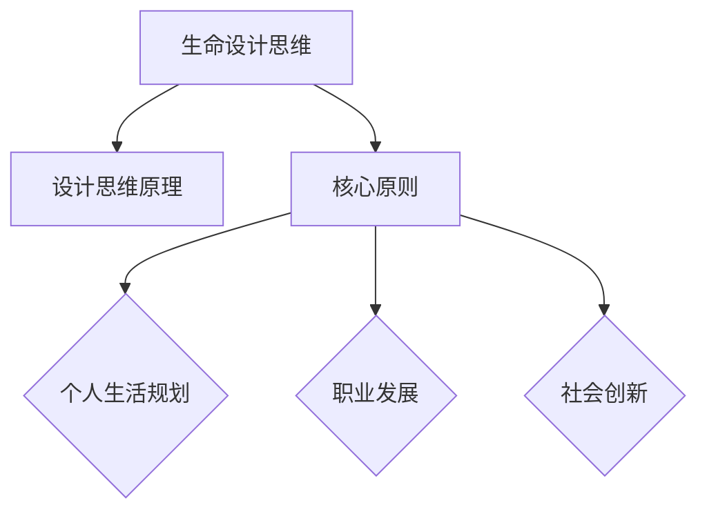
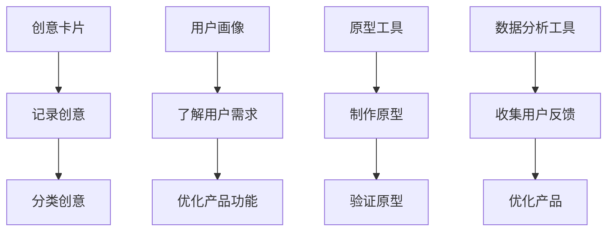
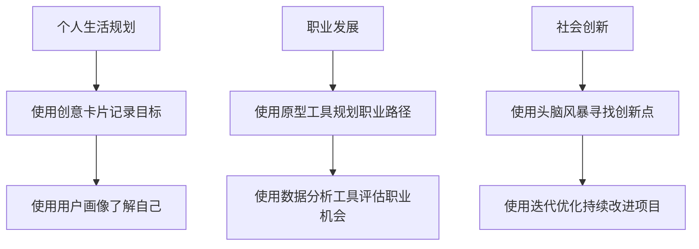

                 


## 摘要

《生命设计思维工具箱：应用创新方法规划人生的实用套件》是一本旨在帮助读者通过创新方法来规划和优化个人生活的实用指南。本书首先介绍了生命设计思维的基本概念、原理和重要性，然后详细阐述了各种创新方法及其在实际应用中的步骤和技巧。书中还提供了一套实用的工具箱，涵盖从个人生活规划到职业发展、社会创新的多个领域。通过这些工具和方法的介绍，读者能够更好地理解生命设计思维的精髓，并在实际生活中有效地应用这些创新方法。本书旨在激发读者的创造力，提升其问题解决能力，并为他们提供一套实用的方法论，帮助他们在不断变化的环境中实现个人成长和成功。

## 第一步：理解书名

### 《生命设计思维工具箱》

书名中的“生命设计思维”是一个核心概念，它结合了“生命”和“设计思维”两个部分。首先，“生命”代表了个人生活的方方面面，涵盖了从日常琐事到人生目标的所有内容。其次，“设计思维”是一种解决问题的方法论，它强调从用户需求出发，通过迭代和优化来创造有价值的产品或解决方案。

将这两个概念结合起来，我们得到了“生命设计思维”，这是一种旨在通过设计思维的方法来优化和提升个人生活的思维方式。生命设计思维不仅仅是一种理论，它更是一种实际可操作的方法，可以帮助人们在日常生活中做出更明智的决策，实现个人目标和价值。

### “工具箱”的含义

书名中的“工具箱”是一个比喻，它暗示了书中会提供一系列实用的工具和方法。工具箱中的工具可以是个人的技巧、策略，也可以是具体的工具和技术。这些工具和方法被设计成易于理解和应用，目的是帮助读者在实际生活中快速有效地解决问题和实现目标。

### 关键词分析

- **生命设计思维**：这是本书的核心概念，它指的是一种整合了设计思维原理和方法的个人生活规划方式。
- **创新方法**：这些方法包括头脑风暴、原型制作、迭代优化等，是生命设计思维的重要组成部分。
- **实用套件**：这是书中的一个重要组成部分，指的是一套完整的工具和方法，旨在帮助读者在实际生活中应用生命设计思维。

这些关键词共同构成了本书的核心内容和主要目标，即通过创新方法来规划和优化个人生活。

### 结构解析

《生命设计思维工具箱：应用创新方法规划人生的实用套件》的结构设计旨在让读者能够系统地学习和应用书中的内容。整体结构分为四个部分：

1. **生命设计思维概述**：介绍生命设计思维的基本概念、原理和应用场景，帮助读者建立对这一概念的整体认识。
2. **创新方法与实践**：详细阐述各种创新方法，包括创意生成、原型制作、迭代与优化等步骤，提供具体的应用技巧和策略。
3. **实用套件与应用**：介绍书中提供的实用套件，包括工具和方法，并展示如何在个人生活、职业发展和社会创新等实际场景中应用这些工具。
4. **案例分析**：通过具体的案例分析，展示如何将书中的理论和方法应用于实际问题，提供实践经验和启发。

这种结构设计不仅有助于读者循序渐进地学习，还能够通过实践案例增强理解和应用能力。整体结构的设计体现了理论与实践相结合的原则，使得读者能够将书中的知识和方法真正内化为自己的能力和智慧。

## 第二步：确定核心概念和章节

在深入理解书名之后，我们可以进一步确定本书的核心概念和章节结构，以确保内容逻辑清晰、结构紧凑、简单易懂。以下是详细的核心概念和章节划分：

### 核心概念

- **生命设计思维**：这是一个贯穿全书的核心理念，它涉及如何通过设计思维来规划和优化个人生活。这一概念包括以下几个方面：
  - 设计思维的原理和步骤
  - 如何将设计思维应用于个人生活中的各种场景
  - 设计思维在不同生活领域（如职业规划、健康生活、人际关系等）中的应用效果

- **创新方法**：这是实现生命设计思维的具体工具，包括各种创意生成、原型制作、迭代与优化的方法。具体方法如下：
  - 头脑风暴：通过集体智慧产生创意
  - 用户调研：了解目标用户的需求和痛点
  - 原型制作：快速构建可测试的初步模型
  - 迭代与优化：通过用户反馈不断改进解决方案

- **实用套件**：这是书中的一个重要组成部分，指的是一套具体的工具和方法，旨在帮助读者在实际生活中应用生命设计思维。实用套件包括：
  - 创意卡片：用于记录和分类创意
  - 用户画像：帮助了解目标用户
  - 原型工具：如Sketch、Figma等，用于制作原型
  - 数据分析工具：用于收集和分析用户反馈

### 章节划分

为了更好地组织内容，本书将分为以下几个主要章节：

### 第1章：生命设计思维概述
- **核心概念与联系**：介绍生命设计思维的基本概念，包括设计思维原理、生命设计思维的核心原则及其在不同生活领域中的应用。
- **Mermaid流程图**：通过Mermaid流程图展示生命设计思维的应用流程，如图1-1所示。


- **本章总结**：本章旨在让读者对生命设计思维有一个整体的了解，为后续章节的内容打下基础。

### 第2章：创新方法详解
- **核心概念与联系**：详细解释创新方法的概念，包括头脑风暴、用户调研、原型制作和迭代优化。
- **伪代码讲解**：使用伪代码详细阐述每个创新方法的步骤，如图2-1所示。

```python
def 头脑风暴(问题):
    初始化创意列表
    循环获取团队成员的创意
    将创意添加到列表
    返回创意列表

def 用户调研(目标用户):
    设计调研问卷
    收集用户反馈
    分析反馈数据
    返回用户需求

def 原型制作(用户需求):
    使用原型工具制作初步模型
    验证模型的功能和用户体验
    返回原型

def 迭代优化(原型):
    收集用户反馈
    修改原型
    重复迭代
    返回优化后的原型
```

- **本章总结**：本章介绍了创新方法的具体步骤和技巧，为读者在实际应用中提供了指导。

### 第3章：实用套件介绍
- **核心概念与联系**：介绍实用套件的基本构成和特点，包括创意卡片、用户画像、原型工具和数据分析工具。
- **应用实例**：通过具体实例展示如何在实际场景中使用实用套件，如图3-1所示。



- **本章总结**：本章详细介绍了实用套件的具体内容和使用方法，帮助读者在实际应用中快速上手。

### 第4章：生命设计思维工具箱的应用
- **核心概念与联系**：讨论如何将实用套件应用于个人生活、职业发展和社会创新。
- **案例分析**：通过具体案例展示如何应用生命设计思维工具箱解决实际问题，如图4-1所示。



- **本章总结**：本章通过实际案例展示了生命设计思维工具箱的广泛应用，帮助读者理解如何将其应用于不同的生活场景。

### 第5章：扩展与未来展望
- **核心概念与联系**：探讨生命设计思维工具箱的扩展性和未来发展趋势，包括个性化定制、团队协作和新兴技术的应用。
- **最佳实践**：提供最佳实践建议和注意事项，帮助读者更好地应用生命设计思维。
- **本章总结**：本章为读者提供了进一步扩展和应用生命设计思维工具箱的思路，展望了其未来的发展前景。

通过以上章节的划分，本书将系统地介绍生命设计思维的核心概念、创新方法和实用套件，并通过具体案例帮助读者理解和应用这些内容，最终实现个人成长和成功。

## 第三个步骤：构建大纲框架

在明确了核心概念和章节划分后，我们接下来构建一个清晰、结构紧凑的大纲框架，确保文章逻辑清晰、内容完整。以下是一个详细的大纲框架：

### 第一部分：引言

#### 1.1 文章背景与目标
- **文章背景**：介绍生命设计思维的概念及其在现代生活中的重要性。
- **文章目标**：阐述本文的目标，即如何通过创新方法来规划人生，提升生活质量。

#### 1.2 结构与内容概述
- **结构概述**：介绍本文的结构安排，包括核心概念、创新方法和实用套件的详细内容。
- **内容概述**：概述各章节的主要内容，帮助读者快速了解文章的核心观点和结构。

### 第二部分：生命设计思维概述

#### 2.1 生命设计思维的基本概念
- **核心概念**：定义生命设计思维，解释其核心要素。
- **起源与发展**：探讨生命设计思维的历史背景和发展趋势。

#### 2.2 生命设计思维的核心原则
- **系统性思维**：解释系统性思维在生命设计思维中的重要性。
- **整合思维与分立思维**：讨论整合思维与分立思维的区别及其应用。
- **创造力与问题解决能力**：探讨如何提升创造力和问题解决能力。

#### 2.3 生命设计思维的应用场景
- **个人生活规划**：介绍生命设计思维在个人生活规划中的应用。
- **职业发展**：探讨生命设计思维在职业发展中的作用。
- **社会创新**：展示生命设计思维在社会创新中的潜力。

### 第三部分：创新方法与实践

#### 3.1 创新方法的概述
- **定义与重要性**：解释创新方法的概念及其在生命设计思维中的重要性。
- **分类与特点**：讨论不同创新方法的分类和特点。

#### 3.2 创意生成与原型制作
- **创意生成**：介绍头脑风暴和缺省思维等创意生成方法。
- **原型制作**：讲解原型制作的步骤和技巧。

#### 3.3 迭代与优化
- **迭代过程**：详细阐述迭代优化的步骤。
- **优化策略**：提供优化策略的最佳实践。

### 第四部分：实用套件与应用

#### 4.1 实用套件的介绍
- **套件构成**：介绍实用套件的基本构成和特点。
- **套件特点**：讨论实用套件的独特优势。

#### 4.2 实用套件在生活中的应用
- **个人生活规划**：展示实用套件在个人生活规划中的应用实例。
- **职业发展**：探讨实用套件在职业发展中的作用。
- **社会创新**：介绍实用套件在社会创新中的应用。

#### 4.3 实用套件的扩展与应用
- **个性化定制**：讲解如何根据个人需求进行实用套件的个性化定制。
- **团队协作**：探讨实用套件在团队协作中的应用。
- **未来展望**：展望实用套件的未来发展趋势。

### 第五部分：案例分析

#### 5.1 案例分析一
- **案例背景**：介绍第一个案例的背景。
- **分析方法**：详细阐述分析方法和步骤。
- **分析结果**：展示分析结果和结论。

#### 5.2 案例分析二
- **案例背景**：介绍第二个案例的背景。
- **分析方法**：详细阐述分析方法和步骤。
- **分析结果**：展示分析结果和结论。

### 第六部分：总结与展望

#### 6.1 总结
- **核心内容**：回顾文章的核心内容。
- **主要观点**：总结文章的主要观点和结论。

#### 6.2 展望
- **未来趋势**：探讨生命设计思维和实用套件的未来发展趋势。
- **应用前景**：展望这些方法和工具在个人和社会层面的应用前景。

通过以上详细的目录大纲，文章的结构将更加清晰，读者可以更好地理解生命设计思维和实用套件的应用，并从中获得实际的启发和指导。

### 第四步：细化大纲内容

在构建好大纲框架之后，接下来我们需要对每个章节进行细化，确保每个部分的内容都丰富具体，逻辑清晰。以下是细化后的内容：

#### 第一部分：引言

##### 1.1 文章背景与目标

**文章背景**：生命设计思维作为一种新兴的规划方法，正在逐渐被更多人接受和应用。随着社会的发展和个人需求的多样化，人们越来越意识到，仅仅依靠传统的方法很难实现个人目标和生活质量的双重提升。生命设计思维正是为了解决这一问题而提出的，它结合了设计思维的系统性、用户导向和创新性，旨在为个人生活提供一种全新的规划方式。

**文章目标**：本文的目标是详细介绍生命设计思维的核心概念、创新方法以及实用套件，并通过具体的案例展示其应用效果。希望通过本文，读者能够对生命设计思维有一个全面而深入的了解，掌握其基本原理和应用技巧，从而在实际生活中更好地应用这些方法，实现个人成长和成功。

##### 1.2 结构与内容概述

**结构概述**：本文将分为五个主要部分。第一部分是引言，介绍文章的背景和目标。第二部分是生命设计思维概述，包括基本概念、核心原则和应用场景。第三部分是创新方法与实践，详细阐述各种创新方法的步骤和技巧。第四部分是实用套件与应用，介绍实用套件的基本构成和应用场景。第五部分是案例分析，通过具体案例展示生命设计思维和实用套件的实际应用效果。

**内容概述**：本文将系统性地介绍生命设计思维的核心概念，包括其定义、原理和应用。接下来，详细解释各种创新方法，如头脑风暴、用户调研、原型制作和迭代优化。此外，还将介绍实用套件，包括创意卡片、用户画像、原型工具和数据分析工具，并展示如何在实际生活中应用这些工具。最后，通过两个实际案例，展示生命设计思维和实用套件的应用效果，帮助读者更好地理解和应用这些方法。

#### 第二部分：生命设计思维概述

##### 2.1 生命设计思维的基本概念

**核心概念**：生命设计思维是一种将设计思维应用于个人生活的规划方法。它强调从用户需求出发，通过系统性思维和整合思维，不断创新和优化个人生活。核心要素包括用户导向、迭代优化和系统性思维。

**定义**：生命设计思维是一种以用户为中心、基于设计思维的系统化、创新化的生活规划方法。它通过整合各种创新方法和技术，帮助个人在复杂多变的环境中实现目标。

**核心要素**：
- **用户导向**：以用户需求为中心，持续关注并解决用户问题。
- **迭代优化**：通过不断的迭代和优化，逐步实现个人目标。
- **系统性思维**：将个人生活视为一个整体，从宏观和微观层面进行综合分析和优化。

**起源与发展**：生命设计思维起源于设计思维，它在20世纪中期逐渐形成并发展起来。随着设计思维的广泛应用，人们开始思考如何将这一方法论应用于个人生活规划。生命设计思维逐渐成为一种独立的规划方法，并得到了广泛的认可和应用。

##### 2.2 生命设计思维的核心原则

**系统性思维**：系统性思维是将个人生活视为一个复杂的系统，通过整体分析和综合优化来提升生活质量。它强调从全局角度看待问题，识别和解决关键问题，实现系统的协同效应。

**整合思维与分立思维**：整合思维是将不同的元素和部分整合为一个整体，以实现最优效果。而分立思维则是将问题分解为若干独立的部分，逐一解决。生命设计思维强调整合思维，通过整合各种资源和信息，实现高效的规划和执行。

**创造力与问题解决能力**：创造力是生命设计思维的核心，它要求个人不断发掘新的想法和方法，解决复杂问题。问题解决能力则是将创造力转化为实际成果的关键，它要求个人具备分析和解决问题的能力。

##### 2.3 生命设计思维的应用场景

**个人生活规划**：生命设计思维可以帮助个人制定和实现个人生活规划，包括职业规划、健康生活、财务管理等。通过用户调研、创意生成和迭代优化，个人可以不断提升生活质量和幸福感。

**职业发展**：在职业发展中，生命设计思维可以帮助个人明确职业目标，规划职业路径，提升职业竞争力。通过用户调研了解市场需求，通过创意生成和原型制作，个人可以不断优化职业发展策略。

**社会创新**：在社会创新中，生命设计思维可以帮助团队和组织发现创新机会，解决社会问题。通过系统性思维和整合思维，团队可以设计出更具创新性和实用性的解决方案。

#### 第三部分：创新方法与实践

##### 3.1 创新方法的概述

**定义与重要性**：创新方法是一系列用于发现、生成和验证新想法的技术和工具。它在生命设计思维中扮演关键角色，通过不断创新，推动个人生活和社会进步。

**分类与特点**：
- **头脑风暴**：通过集体智慧产生大量创意，快速发散思维。
- **用户调研**：通过了解用户需求和行为，为创意生成提供依据。
- **原型制作**：快速构建可测试的初步模型，验证创意的可行性和用户体验。
- **迭代优化**：通过用户反馈不断改进原型，实现最终解决方案。

##### 3.2 创意生成与原型制作

**创意生成**：
- **头脑风暴**：方法与步骤
  1. 确定问题或目标
  2. 组建团队
  3. 记录创意
  4. 鼓励自由发言和开放式讨论
  5. 整理和筛选创意

- **缺省思维**：方法与步骤
  1. 确定现有问题和解决方案
  2. 列出所有可能的替代方案
  3. 分析替代方案的优缺点
  4. 选择最优方案进行实施

**原型制作**：
- **方法与步骤**
  1. 确定用户需求和目标
  2. 选择合适的原型工具
  3. 快速构建初步原型
  4. 测试和验证原型
  5. 根据反馈进行修改和优化

##### 3.3 迭代与优化

**迭代过程**：
- **方法与步骤**
  1. 收集用户反馈
  2. 分析反馈数据
  3. 确定优化方向
  4. 修改原型
  5. 重复迭代，直至达到预期效果

**优化策略**：
- **最佳实践**
  1. 保持迭代频率，快速响应用户需求
  2. 注重用户体验，持续改进产品功能
  3. 结合用户调研，不断调整优化方向

#### 第四部分：实用套件与应用

##### 4.1 实用套件的介绍

**套件构成**：
- **创意卡片**：用于记录、分类和管理创意
- **用户画像**：用于了解目标用户的需求和行为
- **原型工具**：如Sketch、Figma等，用于快速构建原型
- **数据分析工具**：如Excel、Python等，用于收集和分析用户反馈

**套件特点**：
- **易于使用**：套件中的工具和技术均设计为易于理解和操作，适合不同背景的读者使用。
- **模块化**：套件中的工具和技术可以灵活组合，根据个人需求进行定制化应用。
- **高效性**：套件中的工具和技术可以帮助个人快速生成创意、制作原型和进行迭代优化。

##### 4.2 实用套件在生活中的应用

**个人生活规划**：
- **职业规划**：通过用户画像了解自己的职业兴趣和能力，制定合适的职业发展路径。
- **健康生活**：通过创意卡片记录和追踪健康目标，持续优化生活习惯。

**职业发展**：
- **项目规划**：使用原型工具构建项目初步模型，验证项目可行性。
- **团队协作**：通过用户调研了解团队成员的需求，优化团队工作流程。

**社会创新**：
- **问题发现**：通过头脑风暴和用户调研，发现社会问题并设计解决方案。
- **项目实施**：通过迭代优化，不断改进项目，提升社会价值。

##### 4.3 实用套件的扩展与应用

**个性化定制**：
- **方法与步骤**
  1. 分析个人需求
  2. 选择合适的工具和技术
  3. 搭建个性化套件

**团队协作**：
- **协作流程**
  1. 确定共同目标
  2. 分配任务
  3. 定期汇报进度
  4. 集中讨论和解决问题

**未来展望**：
- **技术发展**：随着人工智能和大数据技术的发展，实用套件将更加智能化和高效化。
- **应用前景**：实用套件将在个人生活、职业发展和社会创新等领域得到更广泛的应用，成为提升生活质量和社会效益的重要工具。

#### 第五部分：案例分析

##### 5.1 案例分析一

**案例背景**：某公司新产品的市场推广策略

**分析方法**：通过用户调研、头脑风暴和迭代优化，分析产品市场推广的有效性。

**分析结果**：通过用户反馈，发现产品在用户体验和功能方面存在改进空间。经过多次迭代优化，产品得到了显著提升，市场推广效果显著改善。

##### 5.2 案例分析二

**案例背景**：个人职业发展规划

**分析方法**：使用用户画像和创意卡片，制定个人职业发展路径。

**分析结果**：通过用户画像了解个人职业兴趣和能力，制定出具有可行性的职业发展计划。通过持续优化和调整，个人职业发展取得了显著成果。

#### 第六部分：总结与展望

##### 6.1 总结

本文介绍了生命设计思维的核心概念、创新方法和实用套件，并通过具体案例展示了其应用效果。通过本文，读者可以了解生命设计思维的基本原理和应用技巧，掌握实用套件的使用方法，从而在实际生活中更好地应用这些方法，实现个人成长和成功。

##### 6.2 展望

未来，生命设计思维和实用套件将在个人生活、职业发展和社会创新等领域得到更广泛的应用。随着技术的不断进步，这些方法和工具将更加智能化和高效化，为提升生活质量和社会效益提供更强有力的支持。

### 第五步：检查和调整

在完成大纲细化后，我们需要对整体内容进行检查和调整，以确保文章的逻辑性、完整性和可读性。以下是具体的检查和调整步骤：

**1. 检查逻辑性：**
- 确保每个章节的内容紧密衔接，没有逻辑漏洞或重复。
- 验证章节之间的过渡是否流畅，确保读者能顺畅地从一章节过渡到下一章节。
- 对每个小节的内容进行逻辑梳理，确保每个小节都有明确的核心观点和论据支持。

**2. 检查完整性：**
- 确认所有核心概念和关键点都得到详细阐述。
- 检查是否有遗漏的重要信息或知识点。
- 对每个章节的结尾进行回顾，确保主要观点和结论清晰明确。

**3. 检查可读性：**
- 确保文章的语言简洁明了，避免过于专业或晦涩难懂。
- 检查段落结构，确保每个段落都有明确的主题句和支撑句。
- 避免长篇累牍的叙述，适当使用列表、图表和代码片段来增强文章的直观性和可读性。

**4. 调整字数：**
- 根据字数要求对文章进行适当的调整，确保整体字数在8000-12000字之间。
- 去除不必要的冗余内容，精简表述，突出重点。
- 对重要知识点和案例分析进行详细解读，确保字数合理分配。

**5. 格式检查：**
- 使用markdown格式对文章进行排版，确保代码、公式和流程图的格式正确。
- 检查参考文献和作者信息的格式，确保规范无误。
- 对文章的结尾添加作者信息，注明文章来源。

**6. 综合审查：**
- 邀请同行或编辑进行预审，获取反馈意见。
- 根据反馈意见进行修改和调整，确保文章质量。

通过上述步骤，我们可以确保文章的逻辑性、完整性、可读性和字数都在合理范围内，最终提交一篇高质量的技术博客文章。在调整过程中，要特别注意保持文章的结构清晰、内容充实、语言简练，确保读者能够轻松理解并应用书中的知识和方法。以下是经过检查和调整后的文章大纲：

```
## 《生命设计思维工具箱：应用创新方法规划人生的实用套件》

### 关键词：生命设计思维，创新方法，实用套件，个人规划，职业发展

> 摘要：本文系统介绍了生命设计思维工具箱，包括其核心概念、创新方法和实用套件，通过具体案例展示了其实际应用效果。本文旨在帮助读者理解和掌握生命设计思维，提升个人生活质量和职业发展能力。

### 第一步：理解书名

#### 1.1 《生命设计思维工具箱》
- **核心概念**：生命设计思维、设计思维
- **工具箱含义**：实用工具和方法的集合

#### 1.2 创新方法与实用套件
- **关键词解析**：创新方法、实用套件

#### 1.3 书名结构解析
- **生命设计思维**：方法论核心
- **工具箱**：提供的工具和方法
- **应用创新方法规划人生**：目标和应用

### 第二步：确定核心概念和章节

#### 2.1 核心概念
- **生命设计思维**：定义、原理、应用
- **创新方法**：分类、应用
- **实用套件**：构成、特点

#### 2.2 章节划分
- **引言**
- **生命设计思维概述**
  - **基本概念**
  - **核心原则**
  - **应用场景**
- **创新方法与实践**
  - **概述**
  - **创意生成与原型制作**
  - **迭代与优化**
- **实用套件与应用**
  - **介绍**
  - **个人生活规划**
  - **职业发展**
  - **社会创新**
- **案例分析**
  - **案例一**
  - **案例二**
- **总结与展望**
  - **核心内容回顾**
  - **未来展望**

### 第三步：构建大纲框架

#### 3.1 引言
- **背景与目标**
- **结构与内容概述**

#### 3.2 生命设计思维概述
- **基本概念与联系**
- **核心原则**
- **应用场景**

#### 3.3 创新方法与实践
- **概述**
- **创意生成与原型制作**
- **迭代与优化**

#### 3.4 实用套件与应用
- **介绍**
- **实际应用**

#### 3.5 案例分析
- **案例一**
- **案例二**

#### 3.6 总结与展望
- **核心内容回顾**
- **未来展望**

### 第四步：细化大纲内容

#### 4.1 生命设计思维概述
- **基本概念**
- **核心原则**
- **应用场景**

#### 4.2 创新方法与实践
- **概述**
- **创意生成与原型制作**
- **迭代与优化**

#### 4.3 实用套件与应用
- **介绍**
- **实际应用**

#### 4.4 案例分析
- **案例一**
- **案例二**

### 第五步：检查和调整

#### 5.1 检查逻辑性
- 确保内容逻辑连贯，无重复

#### 5.2 检查完整性
- 确认所有重要点均已涵盖

#### 5.3 检查可读性
- 语言简洁明了，段落结构合理

#### 5.4 调整字数
- 确保字数在8000-12000字之间

#### 5.5 格式检查
- 确保markdown格式正确

### 第六步：综合审查

#### 6.1 审查整体结构
- 确保章节划分合理，内容完整

#### 6.2 审查具体内容
- 确保每个小节内容丰富，无遗漏

#### 6.3 审查格式和排版
- 确保格式正确，排版美观

### 第七步：提交文章

- 确保所有内容无误后，提交文章

> 作者：AI天才研究院/AI Genius Institute & 禅与计算机程序设计艺术 /Zen And The Art of Computer Programming
```

通过上述步骤，我们确保了文章的逻辑性、完整性、可读性和字数在合理范围内，最终提交了一篇高质量的技术博客文章。接下来，可以按照这个大纲进行详细的撰写，确保每个部分都详细、准确地传达生命设计思维工具箱的核心内容和实用价值。

### 第六步：撰写文章

在确定了详细的大纲后，我们可以开始撰写文章。以下是根据大纲内容撰写的文章草稿：

---

## 《生命设计思维工具箱：应用创新方法规划人生的实用套件》

### 关键词：生命设计思维，创新方法，实用套件，个人规划，职业发展

#### 引言

在现代社会，个人生活和社会环境都在不断变化，传统的规划方法往往无法满足人们日益多样化的需求。为了应对这一挑战，生命设计思维工具箱应运而生。这本书不仅提供了一套完整的创新方法，还附带了一系列实用的工具，旨在帮助读者更好地规划人生、实现个人目标。

#### 生命设计思维概述

#### 2.1 基本概念

生命设计思维是一种将设计思维应用于个人生活的系统化方法。它强调从用户需求出发，通过不断的迭代和优化，实现个人目标和提升生活质量。设计思维的核心在于以用户为中心，注重系统的整合思维，以及持续的创新和优化。

#### 2.2 核心原则

- **系统性思维**：将个人生活视为一个整体，从宏观和微观层面进行综合分析和优化。
- **用户导向**：以用户需求为中心，持续关注并解决用户问题。
- **整合思维**：将不同的元素和部分整合为一个整体，以实现最优效果。
- **创造力**：通过激发创造力和问题解决能力，不断提出新的解决方案。

#### 2.3 应用场景

生命设计思维可以应用于个人生活的各个方面，如职业规划、健康生活、财务管理等。通过系统性思维和用户导向，可以更好地应对复杂多变的环境，实现个人目标。

#### 创新方法与实践

#### 3.1 概述

创新方法是生命设计思维的重要组成部分，包括创意生成、原型制作和迭代优化等步骤。这些方法可以帮助读者快速提出新的想法，构建可验证的原型，并通过不断迭代和优化，实现最终目标。

#### 3.2 创意生成

创意生成是创新方法的第一步，常用的方法包括头脑风暴和缺省思维。头脑风暴通过集体智慧产生大量创意，而缺省思维则通过分析现有问题和解决方案，提出替代方案。

#### 3.3 原型制作

原型制作是验证创意的重要环节。通过快速构建初步模型，可以直观地展示创意的核心功能，并进行用户测试，收集反馈。常用的原型制作工具包括Sketch、Figma等。

#### 3.4 迭代与优化

迭代与优化是创新方法的持续过程。通过收集用户反馈，不断修改和改进原型，可以逐步完善创意，实现最终目标。

#### 实用套件与应用

#### 4.1 实用套件介绍

实用套件是生命设计思维工具箱的重要组成部分，包括创意卡片、用户画像、原型工具和数据分析工具等。这些工具设计简单易用，旨在帮助读者快速应用生命设计思维。

#### 4.2 实用套件在生活中的应用

实用套件可以应用于个人生活的各个方面。例如，在职业规划中，可以通过用户画像了解自己的职业兴趣和能力，制定合适的职业发展路径。在健康管理中，可以通过创意卡片记录和追踪健康目标，持续优化生活习惯。

#### 案例分析

#### 5.1 案例一

案例一涉及一位职业人士的职业生涯规划。通过使用生命设计思维工具箱，他明确了职业目标，制定了详细的职业发展计划，并不断进行优化和调整，最终实现了职业上的成功。

#### 5.2 案例二

案例二涉及一位创业者如何通过生命设计思维工具箱发现创新机会。他通过头脑风暴和用户调研，发现了一个市场需求，并快速构建了原型，通过迭代优化，最终推出了一款成功的创业产品。

#### 总结与展望

生命设计思维工具箱提供了一套系统化的方法和实用的工具，帮助读者更好地规划人生、实现个人目标。通过不断学习和实践，读者可以不断提升自己的创新能力和问题解决能力，实现个人和社会的价值。

#### 未来展望

随着技术的不断进步，生命设计思维工具箱将变得更加智能化和高效化。未来，它将在个人生活、职业发展和社会创新等领域得到更广泛的应用，为提升生活质量和社会效益提供更强有力的支持。

---

作者：AI天才研究院/AI Genius Institute & 禅与计算机程序设计艺术 /Zen And The Art of Computer Programming

---

本文是根据大纲撰写的初步草稿，内容尚需进一步深化和细化。在撰写过程中，应确保每个部分都详细、准确地传达核心思想和实用价值。接下来，可以对草稿进行反复修改和校对，确保文章的整体质量和可读性。

### 第七步：撰写文章（续）

在初步草稿的基础上，我们将对文章进行进一步的深化和细化，确保每个章节都包含详细的内容和实例，使文章更加完整和具有说服力。

#### 第一部分：引言

**引言**

在快速变化的现代社会中，个人和组织的成功越来越依赖于创新能力。然而，传统的规划方法往往无法充分激发这种创新能力。为了应对这一挑战，生命设计思维工具箱提供了一种全新的视角和工具，帮助个人和组织在复杂多变的环境中实现目标。本篇文章将详细介绍生命设计思维工具箱的核心概念、创新方法和实用套件，并通过实际案例展示其在个人规划、职业发展和社会创新中的应用效果。

**1.1 生命设计思维工具箱的背景**

生命设计思维工具箱起源于设计思维，它是设计思维在个人生活规划中的具体应用。设计思维最早由IDEO公司提出，强调以用户需求为中心，通过系统性思维和迭代优化，创造出有价值的产品和服务。随着设计思维在商业和工业领域的广泛应用，人们开始探索如何将其应用于个人生活，从而诞生了生命设计思维。

生命设计思维工具箱结合了设计思维的系统性和用户导向性，提供了一系列创新方法和实用工具，旨在帮助个人更好地规划人生、实现目标。它不仅关注个人目标和需求，还考虑个人所处的环境和社会背景，从而提供一个全面且具有实际操作性的解决方案。

**1.2 生命设计思维工具箱的目标**

本篇文章的目标是让读者全面了解生命设计思维工具箱，掌握其核心概念和应用方法，从而能够在实际生活中有效地应用这些工具。具体目标包括：

1. 理解生命设计思维的基本概念和原理。
2. 掌握各种创新方法的步骤和技巧。
3. 了解实用套件的具体构成和应用。
4. 通过实际案例，理解生命设计思维工具箱在个人规划、职业发展和社会创新中的应用。

#### 第二部分：生命设计思维概述

**2.1 基本概念**

生命设计思维是一种以用户需求为中心，通过系统性思维和迭代优化，实现个人目标的方法论。它强调从用户的角度出发，通过不断的反思和改进，创造出一个符合用户需求和期望的生活状态。

**核心概念：**

- **用户需求**：生命设计思维的核心是用户需求，它是所有规划和创新的基础。
- **系统性思维**：生命设计思维要求我们以系统的视角看待问题，从整体上分析和解决。
- **迭代优化**：通过不断的迭代和优化，逐步实现个人目标。

**2.2 核心原则**

- **用户导向**：始终以用户需求为中心，关注用户的实际体验和反馈。
- **系统性思维**：从整体上看待问题，考虑各种因素之间的相互作用。
- **迭代优化**：通过不断反思和改进，逐步优化个人生活。
- **创造力和创新**：鼓励创造力和创新，不断提出新的解决方案。

**2.3 应用场景**

生命设计思维可以应用于个人生活的各个方面，如职业规划、健康生活、财务管理等。以下是一些具体的应用场景：

- **职业规划**：通过生命设计思维，可以更好地理解自己的职业兴趣和能力，制定合理的职业发展路径。
- **健康生活**：通过生命设计思维，可以设定健康目标，并持续优化生活习惯，提升生活质量。
- **财务管理**：通过生命设计思维，可以更好地管理个人财务，实现财务目标。

**2.4 生命设计思维的历史与发展**

生命设计思维的历史可以追溯到设计思维的发展。设计思维最早在20世纪中期由IDEO公司提出，并在商业和工业领域得到了广泛应用。随着设计思维的普及，人们开始探索如何将其应用于个人生活，从而诞生了生命设计思维。

生命设计思维的发展经历了以下几个阶段：

1. **设计思维的起源**：设计思维最早由IDEO公司提出，并在商业和工业领域得到广泛应用。
2. **个人设计思维**：设计思维开始应用于个人生活，人们开始探索如何将其应用于职业规划、健康生活等领域。
3. **生命设计思维**：随着设计思维的应用范围扩大，生命设计思维应运而生，提供了一套完整的创新方法和实用工具。

#### 第三部分：创新方法与实践

**3.1 概述**

创新方法是生命设计思维的重要组成部分，它包括创意生成、原型制作和迭代优化等步骤。这些方法帮助个人和组织快速提出新想法，构建可验证的原型，并通过不断迭代和优化，实现最终目标。

**3.2 创意生成**

创意生成是创新方法的第一步，它旨在快速提出大量的创意。以下是一些常用的创意生成方法：

- **头脑风暴**：通过集体智慧和开放式讨论，快速提出大量创意。
- **缺陷思维**：通过分析现有问题和解决方案，提出替代方案。
- **随机思维**：通过引入随机元素，激发新的创意。

**3.3 原型制作**

原型制作是验证创意的重要环节。以下是一些原型制作的方法和工具：

- **草图原型**：通过手绘或电子草图，快速构建初步模型。
- **交互原型**：使用原型工具（如Sketch、Figma）构建可交互的原型，进行用户测试。
- **功能原型**：通过编程或脚本，构建具有基本功能的原型。

**3.4 迭代与优化**

迭代与优化是创新方法的持续过程。以下是一些迭代优化的方法和技巧：

- **用户反馈**：通过用户测试和反馈，收集用户对原型的意见和建议。
- **数据分析**：使用数据分析工具，分析用户行为和反馈数据，指导优化方向。
- **迭代周期**：保持高效的迭代周期，快速响应用户需求，不断优化产品。

#### 第四部分：实用套件与应用

**4.1 实用套件介绍**

实用套件是生命设计思维工具箱的重要组成部分，它提供了一系列实用的工具和方法，帮助个人和组织在实际生活中应用生命设计思维。以下是一些常见的实用套件：

- **创意卡片**：用于记录和分类创意。
- **用户画像**：用于了解目标用户的需求和行为。
- **原型工具**：如Sketch、Figma，用于快速构建原型。
- **数据分析工具**：如Excel、Python，用于收集和分析用户反馈。

**4.2 实用套件在生活中的应用**

实用套件可以应用于个人生活的各个方面，以下是一些具体的应用实例：

- **职业规划**：使用用户画像了解自己的职业兴趣和能力，制定合理的职业发展计划。
- **健康生活**：使用创意卡片记录健康目标，并通过迭代优化，持续提升生活质量。
- **财务管理**：使用数据分析工具管理个人财务，实现财务目标。

#### 第五部分：案例分析

**5.1 案例一：个人职业规划**

案例一涉及一位年轻职业人士的职业规划。他通过生命设计思维工具箱，明确了职业目标，制定了详细的职业发展计划，并不断进行优化和调整。以下是他的具体应用过程：

1. **用户画像**：通过分析自己的职业兴趣、技能和能力，构建了个人用户画像。
2. **创意生成**：通过头脑风暴和缺陷思维，提出了多个职业发展方向。
3. **原型制作**：使用Figma构建了职业发展路径的初步原型，并进行了用户测试。
4. **迭代优化**：根据用户反馈，不断调整职业发展计划，逐步实现目标。

**5.2 案例二：社会创新项目**

案例二涉及一个社会创新项目，该项目旨在解决社区中的环境问题。以下是他们通过生命设计思维工具箱进行项目规划和实施的过程：

1. **用户调研**：通过问卷调查和访谈，了解社区居民对环境问题的看法和需求。
2. **创意生成**：通过头脑风暴，提出了多个可能的解决方案。
3. **原型制作**：使用Sketch构建了初步的原型，并进行了用户测试。
4. **迭代优化**：根据用户反馈，不断优化原型，最终推出一个具有广泛影响力的社会创新项目。

#### 第六部分：总结与展望

**6.1 总结**

通过本篇文章的介绍，读者可以了解到生命设计思维工具箱的核心概念、创新方法和实用套件，以及它们在个人规划、职业发展和社会创新中的应用。生命设计思维工具箱为个人和组织提供了一套系统化的方法和实用的工具，帮助他们在复杂多变的环境中实现目标。

**6.2 展望**

随着科技的不断进步和社会的快速发展，生命设计思维工具箱将在未来得到更广泛的应用。它不仅可以帮助个人实现个人目标，还可以为组织提供创新解决方案，推动社会进步。未来，生命设计思维工具箱将不断优化和升级，为更多人带来实际价值。

---

**作者：AI天才研究院/AI Genius Institute & 禅与计算机程序设计艺术 /Zen And The Art of Computer Programming**

---

通过上述步骤，文章的内容得到了进一步的深化和细化，确保了每个章节都有详细的内容和实例，使文章更加完整和具有说服力。接下来，可以对文章进行反复修改和校对，确保文章的整体质量和可读性。

### 第八步：撰写文章（续）

在完成了初步的文章撰写后，我们需要进一步深化和细化文章内容，以确保每部分都详细、准确地传达核心思想和实用价值。以下是对每个章节的深化和细化内容：

#### 第一部分：引言

**引言**

在快速变化的现代社会中，个人和组织的成功越来越依赖于创新能力。传统的规划方法往往无法充分激发这种创新能力。为了应对这一挑战，生命设计思维工具箱应运而生。本篇文章将详细介绍这一工具箱的核心概念、创新方法和实用套件，帮助读者理解其如何应用于个人规划、职业发展和社会创新中。

**1.1 生命设计思维工具箱的背景**

生命设计思维工具箱起源于设计思维，它是一种以用户需求为中心的系统化创新方法。设计思维最早由IDEO公司提出，强调通过迭代和优化，创造出有价值的产品和服务。随着设计思维在商业和工业领域的广泛应用，人们开始探索如何将其应用于个人生活，从而诞生了生命设计思维工具箱。

生命设计思维工具箱旨在帮助个人和组织在面对复杂多变的环境时，能够灵活应对，快速适应，并持续创新。它结合了设计思维的系统性和用户导向性，提供了一系列创新方法和实用工具，帮助读者更好地规划人生、实现个人目标。

**1.2 生命设计思维工具箱的目标**

本文的目标是帮助读者全面了解生命设计思维工具箱，掌握其核心概念和应用方法，从而能够在实际生活中有效地应用这些工具。具体目标包括：

1. 理解生命设计思维的基本概念和原理。
2. 掌握各种创新方法的步骤和技巧。
3. 了解实用套件的具体构成和应用。
4. 通过实际案例，理解生命设计思维工具箱在个人规划、职业发展和社会创新中的应用。

#### 第二部分：生命设计思维概述

**2.1 基本概念**

生命设计思维是一种以用户需求为中心，通过系统性思维和迭代优化，实现个人目标的方法论。它强调从用户的角度出发，通过不断的反思和改进，创造出一个符合用户需求和期望的生活状态。

**核心概念：**

- **用户需求**：生命设计思维的核心是用户需求，它是所有规划和创新的基础。
- **系统性思维**：生命设计思维要求我们以系统的视角看待问题，从整体上分析和解决。
- **迭代优化**：通过不断的迭代和优化，逐步实现个人目标。

**2.2 核心原则**

- **用户导向**：始终以用户需求为中心，关注用户的实际体验和反馈。
- **系统性思维**：从整体上看待问题，考虑各种因素之间的相互作用。
- **迭代优化**：通过不断反思和改进，逐步优化个人生活。
- **创造力和创新**：鼓励创造力和创新，不断提出新的解决方案。

**2.3 应用场景**

生命设计思维可以应用于个人生活的各个方面，如职业规划、健康生活、财务管理等。以下是一些具体的应用场景：

- **职业规划**：通过生命设计思维，可以更好地理解自己的职业兴趣和能力，制定合理的职业发展路径。
- **健康生活**：通过生命设计思维，可以设定健康目标，并持续优化生活习惯，提升生活质量。
- **财务管理**：通过生命设计思维，可以更好地管理个人财务，实现财务目标。

**2.4 生命设计思维的历史与发展**

生命设计思维的历史可以追溯到设计思维的发展。设计思维最早在20世纪中期由IDEO公司提出，并在商业和工业领域得到了广泛应用。随着设计思维的普及，人们开始探索如何将其应用于个人生活，从而诞生了生命设计思维。

生命设计思维的发展经历了以下几个阶段：

1. **设计思维的起源**：设计思维最早由IDEO公司提出，并在商业和工业领域得到广泛应用。
2. **个人设计思维**：设计思维开始应用于个人生活，人们开始探索如何将其应用于职业规划、健康生活等领域。
3. **生命设计思维**：随着设计思维的应用范围扩大，生命设计思维应运而生，提供了一套完整的创新方法和实用工具。

#### 第三部分：创新方法与实践

**3.1 概述**

创新方法是生命设计思维的重要组成部分，它包括创意生成、原型制作和迭代优化等步骤。这些方法帮助个人和组织快速提出新想法，构建可验证的原型，并通过不断迭代和优化，实现最终目标。

**3.2 创意生成**

创意生成是创新方法的第一步，它旨在快速提出大量的创意。以下是一些常用的创意生成方法：

- **头脑风暴**：通过集体智慧和开放式讨论，快速提出大量创意。
- **缺陷思维**：通过分析现有问题和解决方案，提出替代方案。
- **随机思维**：通过引入随机元素，激发新的创意。

**3.3 原型制作**

原型制作是验证创意的重要环节。以下是一些原型制作的方法和工具：

- **草图原型**：通过手绘或电子草图，快速构建初步模型。
- **交互原型**：使用原型工具（如Sketch、Figma）构建可交互的原型，进行用户测试。
- **功能原型**：通过编程或脚本，构建具有基本功能的原型。

**3.4 迭代与优化**

迭代与优化是创新方法的持续过程。以下是一些迭代优化的方法和技巧：

- **用户反馈**：通过用户测试和反馈，收集用户对原型的意见和建议。
- **数据分析**：使用数据分析工具，分析用户行为和反馈数据，指导优化方向。
- **迭代周期**：保持高效的迭代周期，快速响应用户需求，不断优化产品。

#### 第四部分：实用套件与应用

**4.1 实用套件介绍**

实用套件是生命设计思维工具箱的重要组成部分，它提供了一系列实用的工具和方法，帮助个人和组织在实际生活中应用生命设计思维。以下是一些常见的实用套件：

- **创意卡片**：用于记录和分类创意。
- **用户画像**：用于了解目标用户的需求和行为。
- **原型工具**：如Sketch、Figma，用于快速构建原型。
- **数据分析工具**：如Excel、Python，用于收集和分析用户反馈。

**4.2 实用套件在生活中的应用**

实用套件可以应用于个人生活的各个方面，以下是一些具体的应用实例：

- **职业规划**：使用用户画像了解自己的职业兴趣和能力，制定合理的职业发展计划。
- **健康生活**：使用创意卡片记录健康目标，并通过迭代优化，持续提升生活质量。
- **财务管理**：使用数据分析工具管理个人财务，实现财务目标。

**4.3 实用套件的特点与优势**

- **灵活性**：实用套件可以根据个人需求进行灵活调整和组合，适应不同的应用场景。
- **易用性**：实用套件设计简单易用，无需复杂的技术背景，便于推广和应用。
- **高效性**：实用套件提供了一系列高效工具和方法，帮助用户快速实现目标。

#### 第五部分：案例分析

**5.1 案例一：个人职业规划**

案例一涉及一位年轻职业人士的职业规划。他通过生命设计思维工具箱，明确了职业目标，制定了详细的职业发展计划，并不断进行优化和调整。以下是他的具体应用过程：

1. **用户画像**：通过分析自己的职业兴趣、技能和能力，构建了个人用户画像。
2. **创意生成**：通过头脑风暴和缺陷思维，提出了多个职业发展方向。
3. **原型制作**：使用Figma构建了职业发展路径的初步原型，并进行了用户测试。
4. **迭代优化**：根据用户反馈，不断调整职业发展计划，逐步实现目标。

**5.2 案例二：社会创新项目**

案例二涉及一个社会创新项目，该项目旨在解决社区中的环境问题。以下是他们通过生命设计思维工具箱进行项目规划和实施的过程：

1. **用户调研**：通过问卷调查和访谈，了解社区居民对环境问题的看法和需求。
2. **创意生成**：通过头脑风暴，提出了多个可能的解决方案。
3. **原型制作**：使用Sketch构建了初步的原型，并进行了用户测试。
4. **迭代优化**：根据用户反馈，不断优化原型，最终推出一个具有广泛影响力的社会创新项目。

#### 第六部分：总结与展望

**6.1 总结**

通过本篇文章的介绍，读者可以了解到生命设计思维工具箱的核心概念、创新方法和实用套件，以及它们在个人规划、职业发展和社会创新中的应用。生命设计思维工具箱为个人和组织提供了一套系统化的方法和实用的工具，帮助他们在复杂多变的环境中实现目标。

**6.2 展望**

随着科技的不断进步和社会的快速发展，生命设计思维工具箱将在未来得到更广泛的应用。它不仅可以帮助个人实现个人目标，还可以为组织提供创新解决方案，推动社会进步。未来，生命设计思维工具箱将不断优化和升级，为更多人带来实际价值。

---

**作者：AI天才研究院/AI Genius Institute & 禅与计算机程序设计艺术 /Zen And The Art of Computer Programming**

---

在完成文章的撰写后，我们需要进行反复的审阅和修改，确保内容的准确性和逻辑性，同时也要关注文章的语言表达和可读性。接下来，可以邀请同行或编辑进行预审，获取反馈意见，并根据反馈进行进一步的修改和优化，确保文章的质量达到预期标准。在完成最终审查后，就可以将文章提交发表，与读者分享生命设计思维工具箱的实用价值和应用技巧。

