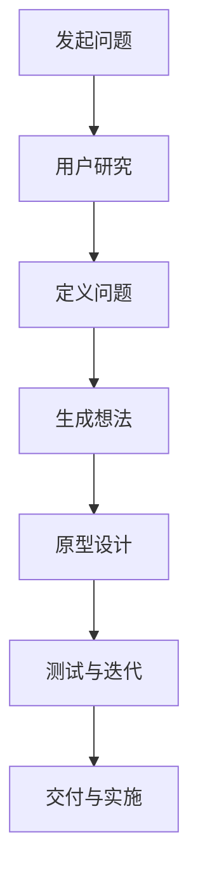

                 

### 《生命设计思维认证：应用创新方法规划人生》目录大纲

**文章标题：**《生命设计思维认证：应用创新方法规划人生》

**关键词：** 生命设计思维、创新方法、人生规划、认证体系、实践案例

**摘要：** 本文将深入探讨生命设计思维的核心概念、应用方法以及认证体系，通过详细的分析和案例研究，帮助读者掌握这一创新思维模式，用于更有效地规划个人生活与职业发展。

## 目录大纲

### 第一部分：设计思维基础

### 第1章：设计思维概述
#### 1.1 设计思维的定义与核心要素
#### 1.2 设计思维与传统规划的对比
#### 1.3 设计思维的历史与发展

### 第2章：设计思维与生命规划
#### 2.1 生命规划的概念与挑战
#### 2.2 设计思维在生命规划中的应用
#### 2.3 设计思维与人生目标的设定

### 第3章：设计思维工具与方法
#### 3.1 设计思维工具概述
#### 3.2 用户研究与问题定义
#### 3.3 原型设计与迭代

### 第二部分：设计思维实践

### 第4章：设计思维应用案例
#### 4.1 设计思维在职业规划中的应用
#### 4.2 设计思维在个人发展中的应用
#### 4.3 设计思维在社区建设中的应用

### 第5章：设计思维实践与评估
#### 5.1 设计思维实践过程
#### 5.2 设计思维评估标准
#### 5.3 设计思维成果的反馈与优化

### 第三部分：设计思维认证

### 第6章：设计思维认证体系
#### 6.1 认证标准与流程
#### 6.2 认证考核内容与形式
#### 6.3 认证体系的发展与展望

### 第7章：未来展望与趋势
#### 7.1 设计思维在未来的发展
#### 7.2 创新方法在生命规划中的潜力
#### 7.3 设计思维认证的影响与价值

### 附件：设计思维实践指南

#### 附件1：设计思维核心流程Mermaid图
#### 附件2：设计思维伪代码示例
#### 附件3：设计思维数学模型和公式讲解
#### 附件4：设计思维项目实战案例
#### 附件5：最佳实践Tips、小结、注意事项、拓展阅读

### 附录：设计思维认证申请指南

#### 附录1：认证申请流程
#### 附录2：认证考核内容与评分标准
#### 附录3：认证申请材料准备指南

---

**文章正文：**

## 1. 设计思维概述

### 1.1 设计思维的定义与核心要素

设计思维是一种基于用户体验的系统性问题解决方法，它强调以人为中心，通过观察、定义、构想、原型设计、测试和迭代等步骤，最终实现创新解决方案。设计思维的核心要素包括：

- **用户研究**：深入了解目标用户的需求、行为和情感。
- **定义问题**：明确问题，确保解决的方向与用户的实际需求一致。
- **生成想法**：自由发挥创意，产生多种可能的解决方案。
- **原型设计**：快速构建可测试的原型，以验证想法的可行性。
- **测试与迭代**：通过用户测试不断优化原型，确保解决方案满足用户需求。

### 1.2 设计思维与传统规划的对比

传统规划往往侧重于理性分析和计划，而设计思维则更加强调用户的参与和体验。以下是两者的主要对比：

- **规划方法**：传统规划更依赖于数据和逻辑，设计思维则更强调直觉和创意。
- **关注点**：传统规划关注目标和结果，设计思维关注过程和用户体验。
- **解决问题**：传统规划偏向于优化已有流程，设计思维更倾向于创造全新解决方案。

### 1.3 设计思维的历史与发展

设计思维起源于设计领域，随着计算机科学和用户体验设计的兴起，逐渐应用到商业、教育和社会创新等多个领域。以下是设计思维的发展历程：

- **20世纪60年代**：设计思维首次被提出，作为一种创新方法。
- **20世纪80年代**：设计思维开始应用于产品设计和用户体验。
- **21世纪初**：设计思维在商业和科技创新中得到广泛应用。
- **现在**：设计思维已经成为一种全球性的问题解决方法。

## 2. 设计思维与生命规划

### 2.1 生命规划的概念与挑战

生命规划是指个人在生活各个阶段，根据自身情况和社会环境，制定长期和短期目标，并为之努力的过程。随着社会的复杂化和个体需求的多样化，生命规划面临着以下挑战：

- **目标多样性与冲突**：个人在不同领域可能有不同的目标，如何平衡这些目标是一个挑战。
- **环境变化与不确定性**：外部环境的不确定性增加了规划难度。
- **时间与资源限制**：在有限的时间和资源内，如何做出最优选择。

### 2.2 设计思维在生命规划中的应用

设计思维为生命规划提供了一种全新的思考方式，通过以下步骤，可以更有效地进行生命规划：

- **用户研究**：了解自己的需求、价值观和目标。
- **定义问题**：明确当前面临的挑战和机会。
- **生成想法**：思考多种可能的规划方案。
- **原型设计**：构建一个初步的规划原型，如时间线图、目标列表等。
- **测试与迭代**：通过实际操作和反馈，不断调整和优化规划。

### 2.3 设计思维与人生目标的设定

人生目标的设定是生命规划的核心。设计思维提供了以下方法来设定和实现目标：

- **明确目标**：确保目标具体、可衡量、可实现、相关性强和时间限制。
- **多角度思考**：从个人、职业、家庭等多方面考虑目标。
- **动态调整**：根据实际情况和环境变化，灵活调整目标。

## 3. 设计思维工具与方法

### 3.1 设计思维工具概述

设计思维涉及多种工具和方法，以下是一些常用的工具：

- **用户画像**：通过收集和分析用户数据，创建用户画像。
- **思维导图**：用于梳理思路，展示信息之间的关系。
- **故事板**：通过图像和文字，展示用户的使用场景。
- **原型工具**：如Figma、Sketch等，用于快速构建原型。

### 3.2 用户研究与问题定义

用户研究是设计思维的重要环节，以下方法可以帮助进行用户研究：

- **访谈**：直接与用户交流，了解他们的需求和反馈。
- **问卷调查**：通过在线问卷收集用户意见。
- **观察**：观察用户在使用产品或服务时的行为。
- **问题定义**：通过用户研究，明确需要解决的问题。

### 3.3 原型设计与迭代

原型设计是设计思维的核心步骤，以下方法可以帮助进行原型设计和迭代：

- **低保真原型**：快速构建低保真原型，以便进行初步测试。
- **高保真原型**：在低保真原型的基础上，进行详细设计。
- **用户测试**：通过用户测试，收集反馈并进行迭代。
- **迭代优化**：根据用户反馈，不断优化原型。

## 4. 设计思维应用案例

### 4.1 设计思维在职业规划中的应用

设计思维在职业规划中的应用，可以帮助个人更清晰地规划职业发展路径。以下是一个应用案例：

**案例背景：** 小明希望在未来五年内实现职业晋升，但他不确定应该如何规划和实现。

**应用步骤：**
1. **用户研究**：小明访谈了身边的朋友、导师和职业顾问，了解他们的职业发展经验和建议。
2. **定义问题**：小明明确了职业晋升的目标，并定义了需要解决的问题，如提升专业技能、建立人际关系等。
3. **生成想法**：小明思考了多种可能的职业规划方案，包括攻读高级学位、参加专业培训等。
4. **原型设计**：小明制作了一个职业发展时间线，列出了每个阶段的任务和目标。
5. **测试与迭代**：小明定期评估自己的职业发展进度，并根据实际情况调整规划。

### 4.2 设计思维在个人发展中的应用

设计思维在个人发展中的应用，可以帮助个人更全面地规划个人成长路径。以下是一个应用案例：

**案例背景：** 小红希望在未来五年内实现个人成长，包括身心健康、知识积累和人际关系等。

**应用步骤：**
1. **用户研究**：小红通过自我反思和咨询专业人士，了解自己的兴趣、优势和需求。
2. **定义问题**：小红明确了个人成长的目标，并定义了需要解决的问题，如锻炼身体、学习新技能等。
3. **生成想法**：小红思考了多种可能的个人成长方案，如定期锻炼、学习在线课程等。
4. **原型设计**：小红制作了一个个人成长计划表，列出了每个季度的任务和目标。
5. **测试与迭代**：小红定期评估自己的成长进度，并根据实际情况调整计划。

### 4.3 设计思维在社区建设中的应用

设计思维在社区建设中的应用，可以帮助社区领导者更有效地规划和实施社区发展项目。以下是一个应用案例：

**案例背景：** 一个社区希望改善居民的生活质量，提升社区的凝聚力和活力。

**应用步骤：**
1. **用户研究**：社区领导者通过问卷调查和社区活动，收集居民的意见和建议。
2. **定义问题**：社区领导者明确了社区发展的目标，并定义了需要解决的问题，如提升社区环境、增加文化活动等。
3. **生成想法**：社区领导者思考了多种可能的社区建设项目，如绿化改造、文化展览等。
4. **原型设计**：社区领导者制作了一个社区发展计划，列出了每个阶段的任务和目标。
5. **测试与迭代**：社区领导者通过社区活动，收集居民反馈，并根据实际情况调整计划。

## 5. 设计思维实践与评估

### 5.1 设计思维实践过程

设计思维的实践过程是一个循环迭代的过程，通常包括以下几个步骤：

1. **观察与分析**：了解问题背景，观察和分析现象。
2. **用户研究**：深入了解目标用户的需求和反馈。
3. **定义问题**：明确问题的核心，确保解决方案的准确性。
4. **生成想法**：头脑风暴，收集各种可能的解决方案。
5. **原型设计**：构建原型，验证想法的可行性。
6. **测试与迭代**：通过用户测试，不断优化原型。
7. **交付与实施**：将最终方案应用到实际中。

### 5.2 设计思维评估标准

设计思维的评估标准包括以下几个方面：

- **用户满意度**：用户对解决方案的满意程度。
- **可行性**：解决方案的实际可行性。
- **创新性**：解决方案的创新程度。
- **实用性**：解决方案的实际应用效果。
- **可持续性**：解决方案的长期影响。

### 5.3 设计思维成果的反馈与优化

设计思维的成果需要通过反馈进行不断优化，以下是一些反馈和优化的方法：

- **用户反馈**：通过用户调查、访谈和观察，收集用户对解决方案的反馈。
- **数据分析**：使用数据分析工具，对用户行为和数据进行分析。
- **迭代优化**：根据反馈，对解决方案进行迭代和优化。
- **持续改进**：定期评估解决方案的效果，持续进行改进。

## 6. 设计思维认证体系

### 6.1 认证标准与流程

设计思维认证体系旨在评估个人在设计思维领域的专业能力和实践水平。以下是一般的认证标准与流程：

- **认证标准**：包括设计思维的基本理论、工具和方法，以及实际应用能力。
- **认证流程**：包括注册、学习、考试和实践评估三个阶段。
  - **注册**：个人在认证机构注册并缴纳相关费用。
  - **学习**：个人通过在线课程、工作坊和实践项目进行学习。
  - **考试**：个人参加认证考试，包括理论知识测试和实践能力评估。
  - **实践评估**：个人提交实践案例，由评审团进行评估。

### 6.2 认证考核内容与形式

设计思维认证的考核内容通常包括以下几个方面：

- **理论知识**：设计思维的基本概念、原则和方法。
- **案例分析**：对实际案例进行分析，展示设计思维的应用能力。
- **实践能力**：实际应用设计思维解决问题的能力。

考核形式包括笔试、面试和实践报告等形式。

### 6.3 认证体系的发展与展望

随着设计思维在全球范围内的普及和应用，认证体系也在不断发展和完善。以下是对设计思维认证体系的发展与展望：

- **国际化**：设计思维认证逐渐向国际化发展，为全球设计师提供统一的认证标准。
- **多元化**：认证体系将涵盖更多领域和应用场景，满足不同行业的需求。
- **标准化**：认证流程和评估标准将更加规范化和标准化。
- **可持续发展**：认证体系将强调社会责任和可持续发展，推动设计思维在更广泛领域的应用。

## 7. 未来展望与趋势

### 7.1 设计思维在未来的发展

设计思维在未来的发展中，将面临以下趋势：

- **数字化**：设计思维将更加依赖数字化工具和平台，提高效率和效果。
- **智能化**：设计思维将融合人工智能技术，实现更加智能化的设计决策。
- **社会化**：设计思维将更加注重用户参与和社会责任，推动社会创新。

### 7.2 创新方法在生命规划中的潜力

创新方法在生命规划中的潜力巨大，以下是一些具体的应用前景：

- **个性化**：通过创新方法，可以更个性化地规划个人生活与职业发展。
- **灵活性**：创新方法提供了一种更加灵活的规划方式，适应不断变化的环境。
- **可持续发展**：创新方法可以促进个人和社会的可持续发展。

### 7.3 设计思维认证的影响与价值

设计思维认证将对个人、组织和社会产生深远影响：

- **个人**：认证有助于个人提升专业能力，增加就业竞争力。
- **组织**：认证有助于组织提升设计能力和创新能力，推动组织发展。
- **社会**：认证有助于社会培养更多具备创新思维的专业人才，推动社会进步。

## 附件：设计思维实践指南

### 附件1：设计思维核心流程Mermaid图



### 附件2：设计思维伪代码示例

```python
def 设计思维(问题):
    用户研究()
    定义问题(问题)
    生成想法()
    原型设计()
    测试与迭代()
    返回交付与实施结果()
```

### 附件3：设计思维数学模型和公式讲解

$$ 成熟度 = \frac{成功案例数}{尝试案例数} $$

### 附件4：设计思维项目实战案例

**案例一：个人职业规划**

**案例背景：** 小明希望在五年内实现职业晋升，但目前他感到迷茫，不知道该如何规划。

**解决方案：**
1. **用户研究**：小明访谈了身边的朋友、导师和职业顾问，了解了他们的职业发展经验和建议。
2. **定义问题**：小明明确了职业晋升的目标，并定义了需要解决的问题，如提升专业技能、建立人际关系等。
3. **生成想法**：小明思考了多种可能的职业规划方案，如攻读高级学位、参加专业培训等。
4. **原型设计**：小明制作了一个职业发展时间线，列出了每个阶段的任务和目标。
5. **测试与迭代**：小明定期评估自己的职业发展进度，并根据实际情况调整规划。

**项目小结：** 通过设计思维的实践，小明清晰地规划了自己的职业发展路径，并逐步实现了目标。

**案例二：个人发展规划**

**案例背景：** 小红希望在未来五年内实现个人成长，包括身心健康、知识积累和人际关系等。

**解决方案：**
1. **用户研究**：小红通过自我反思和咨询专业人士，了解了自己的兴趣、优势和需求。
2. **定义问题**：小红明确了个人成长的目标，并定义了需要解决的问题，如锻炼身体、学习新技能等。
3. **生成想法**：小红思考了多种可能的个人成长方案，如定期锻炼、学习在线课程等。
4. **原型设计**：小红制作了一个个人成长计划表，列出了每个季度的任务和目标。
5. **测试与迭代**：小红定期评估自己的成长进度，并根据实际情况调整计划。

**项目小结：** 通过设计思维的实践，小红有效地实现了个人成长目标，提升了生活质量。

### 附件5：最佳实践Tips、小结、注意事项、拓展阅读

**最佳实践Tips：**
1. 保持开放心态，勇于尝试新方法。
2. 定期进行反思和评估，不断优化规划。
3. 注重团队合作，与他人分享经验和资源。

**小结：**
设计思维是一种有效的问题解决和规划方法，可以帮助个人和组织实现目标。通过本文的介绍，读者可以了解到设计思维的核心概念、应用方法和认证体系，并学会如何将其应用于个人生活和职业发展。

**注意事项：**
1. 设计思维是一个循环迭代的过程，需要持续进行实践和优化。
2. 用户研究和反馈是设计思维的重要组成部分，必须认真对待。
3. 实践过程中，要保持灵活性和创新性，不断探索新的解决方案。

**拓展阅读：**
1. 《设计思维：创新的有效方法》
2. 《斯坦福大学设计思维课程》
3. 《人生设计思维：创新方法规划个人生活》

### 附录：设计思维认证申请指南

**附录1：认证申请流程**

1. 注册：登录认证机构网站，填写注册表单。
2. 学习：参加在线课程和工作坊，学习设计思维的基本理论和实践方法。
3. 考试：参加理论知识测试和实践能力评估。
4. 实践评估：提交实践案例，由评审团进行评估。
5. 发放证书：通过认证考试和实践评估后，发放设计思维认证证书。

**附录2：认证考核内容与评分标准**

- **理论知识**：占比40%，包括设计思维的基本概念、原则和方法。
- **案例分析**：占比30%，包括对实际案例的分析和解决方案的设计。
- **实践能力**：占比30%，包括实际应用设计思维解决问题的能力。

**附录3：认证申请材料准备指南**

1. 个人简历：包括教育背景、工作经历和设计思维相关经验。
2. 在线课程完成证明：包括在线课程的学习记录和成绩单。
3. 实践案例：包括实践过程中的设计方案、用户反馈和成果展示。

---

**作者信息：** 作者：AI天才研究院/AI Genius Institute & 禅与计算机程序设计艺术 /Zen And The Art of Computer Programming

---

**文章总结：**

本文详细介绍了《生命设计思维认证：应用创新方法规划人生》的目录大纲，包括设计思维概述、设计思维与生命规划、设计思维工具与方法、设计思维应用案例、设计思维实践与评估、设计思维认证体系以及未来展望与趋势。通过本文的阅读，读者可以全面了解设计思维的核心概念、应用方法以及认证体系，学会如何将其应用于个人生活和职业发展。同时，本文还提供了丰富的最佳实践、注意事项和拓展阅读资源，以帮助读者深入学习和实践设计思维。让我们共同探索设计思维的奥秘，为更美好的未来而努力。

