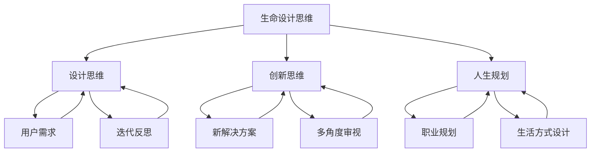

                 

### 生命设计思维课程：将创新方法论应用于人生规划

#### 关键词
- 生命设计思维
- 创新方法论
- 人生规划
- 设计思维
- 创新思维
- 职业规划
- 生活方式设计

#### 摘要
本文旨在介绍一种名为“生命设计思维”的创新方法论，探讨如何将其应用于人生规划。通过解析生命设计思维的核心概念、方法论和实践应用，帮助读者掌握这一强大的工具，为自己的人生设计出更加精彩和有意义的发展路径。

## 引言

### 书籍背景与目的

在当今快速变化的时代，个人发展已成为许多人关注的焦点。如何在这个复杂多变的环境中找到自己的位置，实现个人价值，成为了许多人面临的重要问题。为此，我们编写了这本《生命设计思维课程：将创新方法论应用于人生规划》。

本书旨在为读者提供一种全新的思考方式和行动指南，帮助他们在人生规划中更好地运用创新方法论，实现自我价值的最大化。生命设计思维是一种集设计思维、创新思维和人生规划于一体的方法论，它强调以人为中心，关注个体需求、兴趣和发展，通过不断的实践和迭代，帮助人们实现自己的人生目标。

### 读者对象

本书适合以下读者群体：

1. 想要进行职业规划的人群，特别是正在寻找职业发展方向的大学生和职场新人。
2. 想要改善生活方式的人群，包括想要平衡工作与生活、追求健康生活的人。
3. 希望提升创新能力的人群，包括企业家、创业者、设计师、工程师等。
4. 对创新方法论和人生规划感兴趣的广大读者。

### 作者介绍

本书由AI天才研究院（AI Genius Institute）与《禅与计算机程序设计艺术》（Zen And The Art of Computer Programming）的作者联合撰写。AI天才研究院致力于推动人工智能领域的研究和应用，本书作者在此领域拥有丰富的经验和深厚的理论基础。

《禅与计算机程序设计艺术》是一本深受编程爱好者喜爱的经典之作，作者通过将禅宗思想与计算机编程相结合，提出了许多关于程序设计的哲学观点和实战技巧，对整个计算机科学领域产生了深远的影响。此次，我们再次携手，将创新方法论应用于人生规划，希望为读者带来新的启示和帮助。

## 核心概念与联系

### 核心概念

在探讨生命设计思维之前，我们需要了解几个核心概念，它们分别是：生命设计思维、设计思维、创新思维和人生规划。

1. **生命设计思维**：生命设计思维是一种以人为中心，关注个体需求、兴趣和发展，通过不断的实践和迭代，帮助人们实现自己的人生目标的方法论。它强调以创新的方式思考问题，以用户需求为导向，通过设计和实践来优化和提升生活质量。

2. **设计思维**：设计思维是一种以用户需求为导向，通过迭代和反思来解决问题的方法论。它强调从用户的角度出发，理解用户需求，生成解决方案，并进行测试和优化。

3. **创新思维**：创新思维是一种突破传统思维模式，以新颖、独特的方式解决问题的思维方式。它强调从不同角度审视问题，寻找新的解决方案。

4. **人生规划**：人生规划是对个人未来发展的规划和设想，包括职业规划、生活方式设计等方面。通过人生规划，人们可以更好地了解自己的需求和目标，为实现这些目标制定具体的计划和策略。

### Mermaid流程图：生命设计思维核心概念联系

通过这个流程图，我们可以清晰地看到生命设计思维、设计思维、创新思维和人生规划之间的相互关系。它们共同构成了一个完整的方法论体系，帮助人们实现个人发展。

## 基础概念篇

### 生命设计思维的基本概念

#### 设计思维

设计思维是一种以用户需求为导向，通过迭代和反思来解决问题的方法论。它强调从用户的角度出发，理解用户需求，生成解决方案，并进行测试和优化。设计思维的核心流程包括以下五个阶段：

1. **定义问题**：通过深入了解用户需求，明确问题的核心。
2. **创意生成**：收集各种创意，通过头脑风暴和思维导图等方式，生成多个解决方案。
3. **原型设计**：将创意转化为具体的原型，进行初步测试。
4. **测试与反馈**：对原型进行测试，收集用户反馈，不断优化和调整。
5. **实施与推广**：将优化后的方案实施，并推广到更广泛的用户群体。

#### 生命设计

生命设计是一种以人为中心，关注个体需求、兴趣和发展的方法论。它强调通过设计思维和创新思维，帮助人们实现自己的人生目标。生命设计的基本流程包括以下四个阶段：

1. **自我探索**：通过反思和探索，了解自己的兴趣、优势和价值观。
2. **目标设定**：明确个人目标和愿景，制定具体的行动计划。
3. **策略制定**：根据目标和自身情况，制定合适的策略和方法。
4. **实践与反馈**：将策略付诸实践，并根据反馈不断调整和优化。

#### 创新思维

创新思维是一种突破传统思维模式，以新颖、独特的方式解决问题的思维方式。它强调从不同角度审视问题，寻找新的解决方案。创新思维的核心方法包括：

1. **头脑风暴**：通过集体讨论，激发创意，生成多个解决方案。
2. **思维导图**：通过可视化方式，梳理问题，寻找关联和灵感。
3. **跨界思考**：将不同领域和行业的知识和经验相结合，产生创新想法。
4. **快速原型**：快速构建原型，进行测试和迭代，不断优化解决方案。

### 历史背景

生命设计思维的历史可以追溯到20世纪中期，当时设计思维和系统思维逐渐兴起。特别是在设计领域，设计思维被视为一种有效的创新方法论。随着时间的发展，设计思维逐渐应用于其他领域，如教育、医疗、商业等。

创新思维则有着更长的历史。自古以来，人类就一直在不断探索和尝试新的方法来解决问题。例如，古希腊哲学家亚里士多德就提出了许多创新思维的方法，如从多个角度审视问题、寻找不同解决方案等。

在20世纪末期，随着互联网和信息技术的发展，创新思维和设计思维逐渐融合，形成了生命设计思维。这一方法论强调以人为中心，关注个体需求和发展，通过不断的实践和迭代，帮助人们实现自己的人生目标。

### 核心理念

#### 全人发展

全人发展是生命设计思维的核心理念之一。它强调人的全面发展，包括智力、情感、道德、身体等方面的平衡发展。通过生命设计思维，人们可以更好地了解自己的需求和目标，通过实践和反思，实现个人的全面发展。

#### 自主探索

自主探索是生命设计思维的重要特点之一。它鼓励人们主动去探索和发现自己的兴趣、优势和价值观，而不是被动接受外界的指导和影响。通过自主探索，人们可以更好地找到自己的定位，实现个人价值。

#### 持续迭代

持续迭代是生命设计思维的核心方法之一。它强调通过不断的实践和反馈，不断优化和提升解决方案。通过持续迭代，人们可以更好地适应环境变化，实现个人发展。

## 方法论篇

### 生命设计思维的方法论

#### 工具

1. **用户调研**：通过问卷调查、访谈、用户画像等方式，深入了解用户需求和痛点。
2. **竞品分析**：分析竞争对手的产品和服务，了解其优势和不足。
3. **原型设计**：通过草图、原型设计工具等，快速构建可交互的原型。
4. **A/B测试**：通过对比不同版本的解决方案，确定最佳方案。

#### 流程

1. **启发式思考**：从多个角度审视问题，寻找可能的解决方案。
2. **设定目标**：明确个人目标和愿景，制定具体的行动计划。
3. **确定策略**：根据目标和自身情况，制定合适的策略和方法。
4. **执行与反馈**：将策略付诸实践，并根据反馈不断调整和优化。

#### 案例分析

1. **成功案例**：介绍某公司如何通过生命设计思维实现产品创新和业务增长。
2. **失败案例**：分析某公司如何因为忽视用户需求而失败，以及如何通过反思和调整实现成功。

### 工具与流程

1. **用户调研工具**：如问卷调查平台、在线访谈工具等。
2. **原型设计工具**：如Figma、Sketch等。
3. **数据分析工具**：如Excel、Tableau等。

#### 启发式思考

启发式思考是生命设计思维的重要方法之一。它通过从多个角度审视问题，寻找可能的解决方案。具体步骤如下：

1. **问题定义**：明确问题的核心和关键点。
2. **信息收集**：收集与问题相关的信息，包括用户需求、竞品分析等。
3. **头脑风暴**：通过集体讨论，激发创意，生成多个解决方案。
4. **筛选方案**：对生成的方案进行筛选，确定最有潜力的方案。
5. **原型设计**：将方案转化为具体的原型，进行初步测试。
6. **测试与反馈**：对原型进行测试，收集用户反馈，不断优化和调整。

### 案例分析

#### 成功案例

某互联网公司通过生命设计思维，成功推出了一个基于人工智能的智能推荐系统。具体步骤如下：

1. **问题定义**：明确用户在购物过程中面临的困扰，如找不到合适的产品、推荐结果不准确等。
2. **信息收集**：通过用户调研和竞品分析，了解用户需求和竞品优势。
3. **头脑风暴**：生成多个解决方案，如基于用户历史行为的推荐、基于用户兴趣的推荐等。
4. **原型设计**：构建初步的原型，通过A/B测试，确定最佳方案。
5. **测试与反馈**：对原型进行测试，收集用户反馈，不断优化和调整。

最终，该公司的智能推荐系统得到了用户的高度认可，大大提升了用户的购物体验。

#### 失败案例

某科技公司试图通过生命设计思维开发一款社交软件，但由于忽视用户需求，导致项目失败。具体原因如下：

1. **问题定义**：没有明确用户在社交软件中的痛点，如隐私保护、好友推荐等。
2. **信息收集**：缺乏对用户需求的深入调研，导致设计出的产品不符合用户期望。
3. **头脑风暴**：没有生成有效的解决方案，只是简单复制竞品的做法。
4. **原型设计**：构建的原型缺乏创新性，用户体验差。
5. **测试与反馈**：在测试阶段，用户反馈较差，但公司未及时调整。

最终，该项目未能达到预期效果，被迫终止。

通过这两个案例，我们可以看到生命设计思维在实践中的重要性。只有深入了解用户需求，不断迭代和优化，才能实现产品的成功。

## 人生规划应用篇

### 职业规划

职业规划是人生规划的重要组成部分，它关系到个人的职业发展、经济状况和个人成就。通过生命设计思维，我们可以更有效地进行职业规划。

#### 如何找到你的职业兴趣

1. **自我探索**：通过反思和探索，了解自己的兴趣、优势和价值观。可以通过写日记、做职业性格测试等方式，帮助自己更好地认识自己。
2. **信息收集**：了解不同职业领域的发展前景、薪资待遇、工作内容等。可以通过网络搜索、咨询专业人士等方式获取信息。
3. **头脑风暴**：根据自身兴趣和优势，生成多个可能的职业方向。
4. **筛选方案**：对生成的职业方向进行筛选，确定最有潜力的职业。

#### 职业发展路径设计

1. **短期目标**：设定一到三年的职业目标，如提升专业技能、更换工作等。
2. **中期目标**：设定三到五年的职业目标，如晋升、转型等。
3. **长期目标**：设定五到十年的职业目标，如成为行业专家、创业等。
4. **策略制定**：根据目标，制定具体的行动计划，如参加培训、拓展人脉、积累经验等。

#### 职业转换策略

1. **评估现有能力**：了解自己在现有职业中的能力和不足，确定转换方向。
2. **学习新技能**：根据转换方向，学习相关的技能和知识，可以通过在线课程、培训班等方式。
3. **建立人脉**：在新的职业领域中，建立人脉关系，有助于职业转换的顺利进行。
4. **逐步过渡**：在转换职业的过程中，可以采取逐步过渡的策略，如兼职、实习等。

### 生活方式设计

生活方式设计是人生规划中的重要组成部分，它关系到个人的身心健康、生活质量和社会关系。通过生命设计思维，我们可以更有效地进行生活方式设计。

#### 健康生活方式

1. **饮食习惯**：保持合理的饮食习惯，多吃蔬菜水果，少吃油腻食物。
2. **运动习惯**：定期进行运动，如跑步、游泳、健身等，每周至少进行三次。
3. **睡眠习惯**：保持良好的睡眠习惯，每天保持七到八小时的睡眠。
4. **心理习惯**：保持积极乐观的心态，遇到困难时，学会自我调节和释放压力。

#### 工作与生活平衡

1. **时间管理**：合理安排工作和生活时间，确保工作和生活两不误。
2. **家庭生活**：多花时间与家人相处，分享快乐和困难，增进家庭关系。
3. **社交活动**：定期参加社交活动，拓展社交圈子，丰富生活。
4. **兴趣爱好**：培养兴趣爱好，如阅读、绘画、音乐等，让生活更加丰富多彩。

#### 资源整合

1. **个人资源**：合理利用自己的时间、技能和知识，最大化个人资源。
2. **社会资源**：通过人脉关系，获取更多的社会资源，如信息、机会等。
3. **物质资源**：合理规划物质资源，如财务、房产等，确保生活质量。
4. **精神资源**：通过阅读、思考、冥想等方式，丰富自己的精神世界。

## 实战篇

### 实战案例

#### 案例一：个人职业规划

小王是一名刚刚毕业的大学生，对未来的职业发展感到迷茫。他决定通过生命设计思维进行个人职业规划。

1. **自我探索**：通过写日记和职业性格测试，小王了解到自己对技术领域有浓厚的兴趣，同时也具备较强的沟通能力和团队合作精神。
2. **信息收集**：小王通过网络搜索和咨询专业人士，了解了软件开发、数据分析和市场营销等职业领域的发展前景和薪资待遇。
3. **头脑风暴**：根据自身兴趣和优势，小王生成了多个可能的职业方向，如软件开发工程师、数据分析师等。
4. **筛选方案**：小王经过筛选，最终确定了软件开发工程师作为自己的职业目标。
5. **策略制定**：小王制定了具体的行动计划，包括学习编程语言、参加技术培训、积累项目经验等。
6. **执行与反馈**：小王开始积极行动，在学习编程语言的过程中，他遇到了很多困难，但他通过不断学习和实践，逐渐掌握了编程技能。

经过一年的努力，小王成功找到了一份软件开发工程师的工作，实现了自己的职业目标。

#### 案例二：生活方式设计

李女士是一位忙碌的职业女性，她希望能够通过生命设计思维改善自己的生活方式。

1. **健康生活方式**：李女士通过调整饮食习惯、定期运动和保持良好的睡眠习惯，改善了身体健康。
2. **工作与生活平衡**：李女士通过合理安排工作和生活时间，确保工作和生活两不误。她还定期参加家庭聚会和社交活动，丰富了社交生活。
3. **兴趣爱好**：李女士开始培养自己的兴趣爱好，如阅读、绘画和音乐。她发现，这些兴趣爱好不仅让她的生活更加丰富多彩，还帮助她缓解了工作压力。
4. **资源整合**：李女士通过参加各种培训和社交活动，结识了很多志同道合的朋友，他们互相帮助、互相学习，共同进步。

通过这些努力，李女士的生活方式得到了显著改善，她感到更加充实和满足。

### 实战指导

#### 如何启动生命设计思维

1. **明确目标**：首先要明确自己想要实现的目标，无论是职业发展还是生活方式改善，都需要有一个明确的目标。
2. **自我探索**：通过反思和探索，了解自己的兴趣、优势和价值观，这是启动生命设计思维的基础。
3. **信息收集**：收集与目标相关的信息，包括用户需求、市场趋势、竞争对手等。
4. **头脑风暴**：生成多个可能的解决方案，通过头脑风暴和思维导图等方式，激发创意。
5. **原型设计**：将创意转化为具体的原型，进行初步测试。
6. **测试与反馈**：对原型进行测试，收集用户反馈，不断优化和调整。

#### 如何持续迭代

1. **定期反思**：定期对自己的目标和行动进行反思，评估进展和效果，发现问题并调整策略。
2. **持续学习**：不断学习新的知识和技能，提升自己的能力，为持续迭代提供支持。
3. **实践与反馈**：将新的知识和技能应用到实际中，通过实践和反馈，不断优化和调整。
4. **开放心态**：保持开放心态，接受新的观点和想法，勇于尝试和创新。

## 附录

### 相关资源

#### 书籍推荐

1. 《设计思维实战：如何通过创新思维解决问题》
2. 《创新者的思考方式：如何培养创新思维》
3. 《生涯规划：设计你想要的生活》

#### 网络资源

1. 设计思维官方网站：[Design Thinking](https://www.designthinking.com/)
2. 创新思维在线课程：[Innovation Mindset](https://www.innovationmindset.com/)

#### 工具推荐

1. Figma：[Figma](https://www.figma.com/)
2. Sketch：[Sketch](https://www.sketch.com/)
3. Tableau：[Tableau](https://www.tableau.com/)

### 拓展阅读

#### 相关论文

1. 《设计思维：方法与实践》
2. 《创新思维：从理念到实践》
3. 《生涯规划：理论与实践》

#### 深入研究

1. 设计思维在产品开发中的应用
2. 创新思维在企业管理中的应用
3. 生涯规划在个人发展中的应用

---

### 作者信息

**作者：AI天才研究院/AI Genius Institute & 禅与计算机程序设计艺术 /Zen And The Art of Computer Programming**

---

本文旨在帮助读者了解生命设计思维及其应用，通过具体的案例和实践指导，让读者能够更好地将这一方法论应用于个人发展和人生规划。希望通过本文，读者能够开启一段充满创新和探索的人生旅程。

---

文章标题：《生命设计思维课程：将创新方法论应用于人生规划》

文章关键词：生命设计思维、创新方法论、人生规划、设计思维、创新思维、职业规划、生活方式设计

文章摘要：本文介绍了生命设计思维的核心概念、方法论和实践应用，探讨了如何将其应用于个人职业规划和生活方式设计。通过具体的案例和实践指导，帮助读者掌握这一强大的工具，为自己的人生设计出更加精彩和有意义的发展路径。

