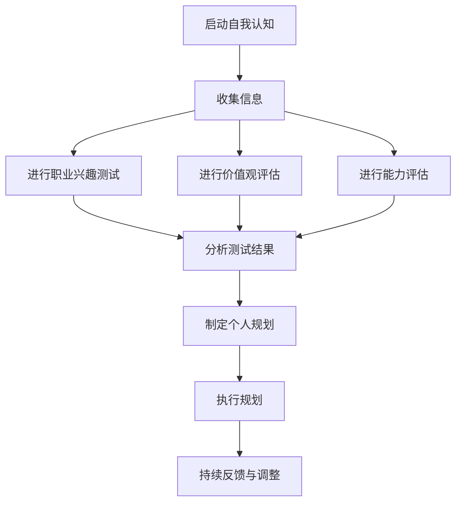
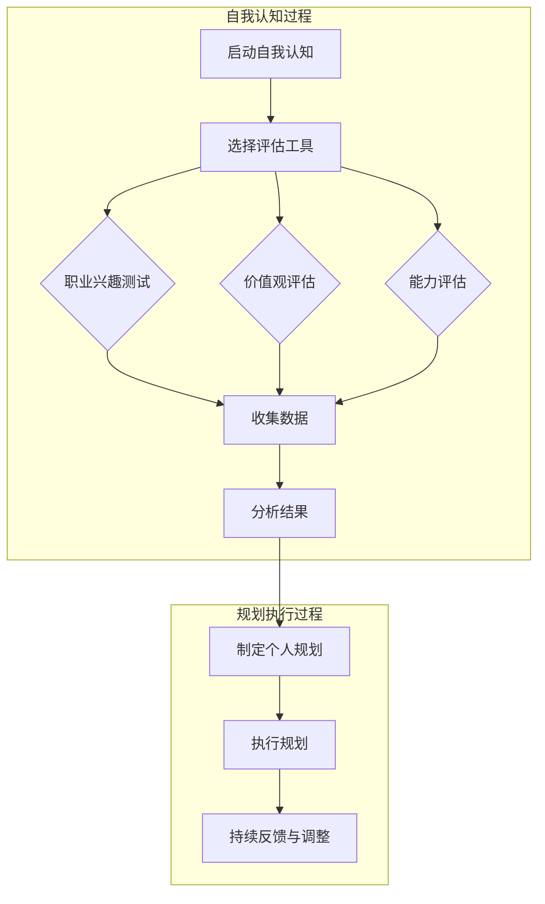
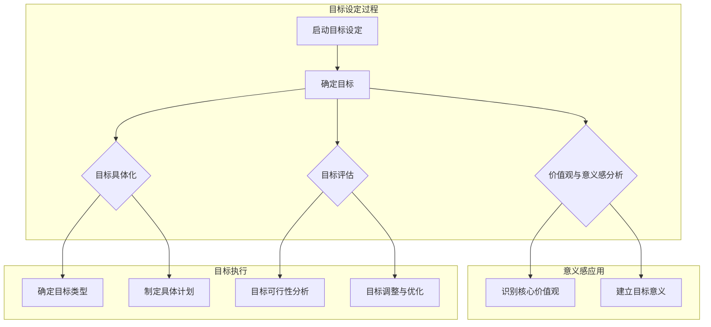
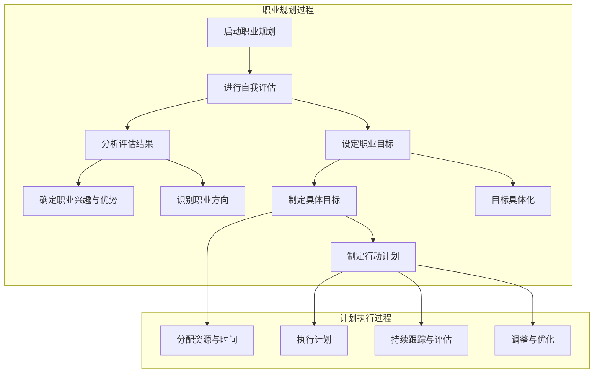
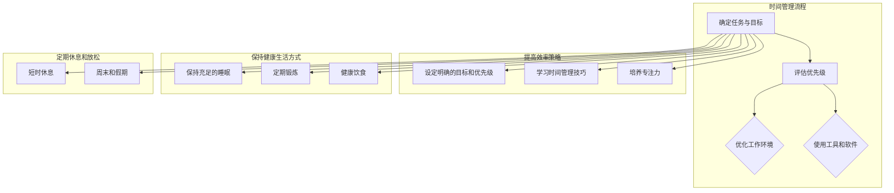
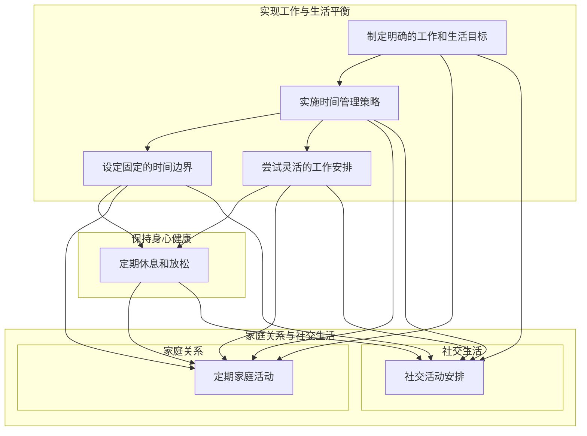
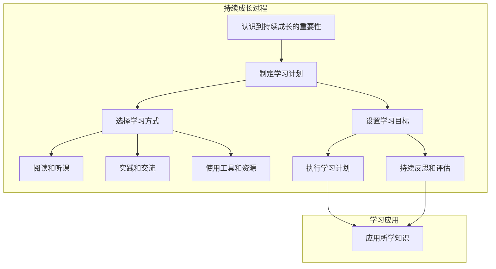
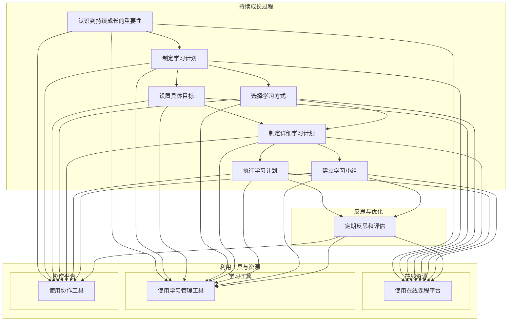

                 

### 文章标题

《生命设计：主动规划人生的意义》

### 关键词

- 人生规划
- 个人成长
- 目标设定
- 职业规划
- 时间管理
- 持续学习

### 摘要

在瞬息万变的世界中，主动规划人生变得尤为重要。本文将探讨如何通过科学的方法和策略，实现个人职业与生活的平衡，以及如何在快速变化的环境中持续成长。通过对自我认知、目标设定、职业规划、时间管理和持续学习的深入剖析，本文旨在为读者提供一套系统化的生命设计指南，帮助每个人找到属于自己的成功之路。

## 引言

在信息爆炸和技术迅猛发展的今天，人们面临着前所未有的选择和挑战。如何在这个充满不确定性的世界中找到自己的定位，实现个人价值和职业成功，成为每个人都需要思考的重要问题。主动规划人生，不仅是对自我认知的深化，更是对未来方向的明确指引。

主动规划人生的意义在于，它能够帮助个人在面对复杂多变的外部环境时，保持内心的平静与坚定。通过系统化的目标和策略，人们可以更加清晰地认识自己的优势与劣势，制定出切实可行的发展计划，并在执行过程中不断调整和优化，以达到最佳效果。

本文将从以下几个方面展开讨论：

1. **自我认知**：理解自我认知的重要性，掌握自我评估工具与方法，通过Mermaid流程图展示自我认知的过程。
2. **目标设定**：阐述目标设定的原则与策略，探讨意义感与目标设定的关系，并利用Mermaid流程图分析目标设定的步骤。
3. **职业规划**：分析职业规划的重要性，介绍职业规划的方法与步骤，以及如何通过流程图进行职业规划的优化。
4. **时间管理**：讲解时间管理的基本原则，提供提高工作效率的策略，并通过Mermaid流程图展示时间管理的实践。
5. **工作与生活平衡**：探讨工作与生活平衡的重要性，提出实现平衡的方法，并利用流程图展示平衡工作与生活的策略。
6. **持续成长**：阐述持续成长的重要性，介绍学习的方法与策略，通过Mermaid流程图展示个人成长的路径。

通过这些内容的深入探讨，本文旨在为读者提供一套全面、系统的生命设计指南，帮助每个人主动规划人生，实现个人目标与职业成功。

### 自我认知的重要性

自我认知是主动规划人生的基础，它决定了我们在职业和生活中能否做出明智的决策。自我认知不仅仅是对自己表面特征的了解，更包括对内在性格、价值观、兴趣和优势的深刻认识。通过自我认知，我们可以明确自己的定位，找到适合自己的发展路径，避免盲目跟风或盲目行动。

首先，自我认知对于职业规划至关重要。只有了解自己的性格特点和职业兴趣，我们才能找到与自己匹配的职业方向。例如，一个内向、喜欢分析和思考的人，可能更适合从事编程或数据分析等职业，而不是需要频繁社交的销售或市场营销工作。通过自我认知，我们可以避免选择不适合自己的职业，从而提高职业满意度和工作效率。

其次，自我认知有助于提升个人生活质量。了解自己的价值观和兴趣，可以帮助我们做出更符合内心期望的生活决策。例如，一个热爱艺术和旅行的人，可能会选择从事与艺术相关的职业，并在工作之余充分享受旅行的乐趣。这种符合内心期望的生活方式，不仅能够带来心理上的满足感，还能够增强个人的幸福感。

为了更具体地理解自我认知的过程，我们可以借助一些自我评估工具和方法。以下是一些常用的自我评估工具：

1. **职业兴趣测试**：职业兴趣测试通过一系列问题，帮助个体了解自己的兴趣倾向。常见的职业兴趣测试包括霍兰德职业兴趣测试（Holland Code Test）和迈尔斯-布里格斯性格类型指标（MBTI，Myers-Briggs Type Indicator）。这些测试通过分析个体的性格和兴趣，提供职业推荐，帮助个人做出职业选择。

2. **价值观评估**：价值观评估帮助个体识别自己的核心价值观，例如自由、财富、家庭、成就等。通过了解自己的价值观，个人可以明确在职业和生活中追求的目标，从而做出更符合自身价值观的决策。

3. **能力评估**：能力评估旨在识别个体的技能和潜在能力。这可以通过传统的技能评估工具，如职业技能测试和面试，来实现。通过这些评估，个人可以了解自己的优势和不足，并制定相应的提升计划。

在自我认知的过程中，Mermaid流程图是一种有效的工具，可以帮助我们系统地记录和梳理自我认知的各个步骤。以下是一个简单的Mermaid流程图示例，用于展示自我认知的过程：



通过这个流程图，我们可以看到自我认知的过程是一个系统化的、连续的过程，它不仅包括评估和测试，还包括对结果的反思和规划，以及在执行过程中的持续反馈与调整。

### 自我认知的工具与方法

为了更深入地进行自我认知，我们可以使用多种工具和方法，这些工具和方法不仅能够帮助我们识别自己的性格、兴趣和价值观，还可以帮助我们评估自己的能力和潜力。以下是一些常用的自我评估工具和方法：

#### 1. 职业兴趣测试

职业兴趣测试是帮助个体了解自己兴趣和职业倾向的重要工具。最常见的职业兴趣测试包括霍兰德职业兴趣测试（Holland Code Test）和迈尔斯-布里格斯性格类型指标（MBTI，Myers-Briggs Type Indicator）。

- **霍兰德职业兴趣测试**：霍兰德职业兴趣测试通过评估个体在六个主要兴趣领域（现实型、研究型、艺术型、社会型、企业型和常规型）的倾向，帮助个体了解自己的职业兴趣。测试结果通常会提供一系列与测试者兴趣相匹配的职业建议。

  **示例伪代码**：
  ```python
  def holland_interest_test(personality_scores):
      interests = {
          "现实型": [],
          "研究型": [],
          "艺术型": [],
          "社会型": [],
          "企业型": [],
          "常规型": []
      }
      # 根据测试分数，将职业匹配到相应兴趣领域
      for score, interest in personality_scores.items():
          if score > 50:
              interests[interest].append("高匹配职业")
          elif score > 30:
              interests[interest].append("中匹配职业")
          else:
              interests[interest].append("低匹配职业")
      return interests
  ```

- **MBTI测试**：MBTI测试通过评估个体的性格类型，帮助个体了解自己的行为倾向和沟通风格。测试结果通常以四个字母表示，如ISTJ、ENFP等，每个字母代表不同的性格维度。

  **示例伪代码**：
  ```python
  def mbti_test(personality_traits):
      personality_type = ""
      for trait, value in personality_traits.items():
          if value == "S":
              personality_type += "S"
          elif value == "N":
              personality_type += "N"
          if value == "T":
              personality_type += "T"
          elif value == "F":
              personality_type += "F"
          if value == "E":
              personality_type += "E"
          elif value == "I":
              personality_type += "I"
      return personality_type
  ```

#### 2. 价值观评估

价值观评估帮助个体识别自己的核心价值观，例如自由、财富、家庭、成就等。常见的价值观评估工具包括“生命态度量表”（Life Attitude Scale，LAS）和“价值观排序法”（Values Sort）。

- **生命态度量表**：生命态度量表通过一系列问题，评估个体对生命意义的理解和对不同价值观的重视程度。测试结果可以帮助个体明确自己的核心价值观。

  **示例伪代码**：
  ```python
  def life_attitude_scale(answers):
      values = {
          "自由": 0,
          "财富": 0,
          "家庭": 0,
          "成就": 0
      }
      for answer in answers:
          if answer == "自由":
              values["自由"] += 1
          elif answer == "财富":
              values["财富"] += 1
          elif answer == "家庭":
              values["家庭"] += 1
          elif answer == "成就":
              values["成就"] += 1
      return values
  ```

- **价值观排序法**：价值观排序法通过让个体将一系列价值观按照重要性排序，帮助个体识别自己的核心价值观。

  **示例伪代码**：
  ```python
  def values_sort(values_list):
      sorted_values = sorted(values_list, key=lambda x: x['importance'], reverse=True)
      return sorted_values
  ```

#### 3. 能力评估

能力评估旨在识别个体的技能和潜在能力。这可以通过传统的技能评估工具，如职业技能测试和面试，来实现。以下是一些常见的能力评估方法：

- **职业技能测试**：职业技能测试通过模拟实际工作环境中的任务，评估个体的专业技能和工作能力。

  **示例伪代码**：
  ```python
  def skill_assessment(test_results):
      skills = {
          "编程能力": test_results['programming'],
          "沟通能力": test_results['communication'],
          "团队合作": test_results['teamwork']
      }
      return skills
  ```

- **面试评估**：面试通过提问和观察，评估个体的专业知识、沟通能力和解决问题的能力。

  **示例伪代码**：
  ```python
  def interview_evaluation(interview_score):
      evaluation = {
          "专业知识": interview_score['knowledge'],
          "沟通能力": interview_score['communication'],
          "解决问题的能力": interview_score['problem_solving']
      }
      return evaluation
  ```

通过这些自我评估工具和方法，我们可以更全面地了解自己，为后续的人生规划和职业选择提供有力的支持。

### 自我认知的Mermaid流程图

为了更好地理解自我认知的过程，我们可以使用Mermaid流程图来展示从启动自我认知到最终形成个人规划的完整路径。以下是这个流程图的详细描述：



**Mermaid流程图详细解释**：

- **A[启动自我认知]**：这个过程是从意识到需要对自己进行深入了解开始的，它是整个自我认知过程的起点。

- **B[选择评估工具]**：在启动自我认知后，我们需要选择合适的评估工具。这些工具包括职业兴趣测试、价值观评估和能力评估。

- **C[职业兴趣测试]**、**D[价值观评估]**、**E[能力评估]**：分别通过职业兴趣测试、价值观评估和能力评估来收集有关个体兴趣、价值观和能力的数据。

- **F[收集数据]**：在这一步，我们通过所选评估工具收集到的数据，形成对自我的初步认识。

- **G[分析结果]**：在收集数据后，我们需要对这些数据进行分析，识别出个体的主要特点和倾向。

- **H[制定个人规划]**：基于分析结果，我们可以制定出具体的个人规划，包括职业目标、生活方式选择和技能提升计划。

- **I[执行规划]**：执行个人规划是实现自我认知和目标设定的关键步骤。在这一步，我们需要将规划付诸实践，并在过程中持续跟踪和调整。

- **J[持续反馈与调整]**：通过执行规划，我们能够获得实际反馈，这些反馈将用于不断调整和优化个人规划，确保目标的实现。

这个Mermaid流程图不仅提供了一个清晰的自我认知过程图，而且通过结构化的步骤，帮助读者理解每个环节的重要性和相互关系。通过这样的流程图，读者可以更好地理解和应用自我认知的方法，为自己的职业和生活规划提供有力支持。

### 目标设定的原则与策略

在主动规划人生的过程中，目标设定是一个关键环节。有效的目标设定不仅能够帮助个人明确前进方向，还能激励我们克服挑战，实现长远发展。以下是一些目标设定的原则与策略：

#### 1. SMART原则

SMART原则是一种广泛使用的目标设定方法，它要求目标具备以下五个特点：

- **Specific（具体）**：目标应当明确具体，避免模糊不清。例如，“提高技能”不如“学习Python编程语言”。

- **Measurable（可衡量）**：目标应当具有可量化的标准，便于评估进展和结果。例如，“阅读100本书”比“多读书”更具操作性。

- **Achievable（可达成）**：目标应当是可实现的，避免设定过高的期望。例如，“成为世界顶级程序员”可能过于理想化，而“通过某项专业认证”则更为现实。

- **Relevant（相关）**：目标应当与个人价值观和长远规划相一致。例如，如果个人的核心价值观是“家庭”，那么设定“每年旅游三次”比“每年赚取更多财富”更相关。

- **Time-bound（时限）**：目标应当有时间限制，以增加紧迫感和动力。例如，“在明年年底前完成项目”比“将来完成项目”更具执行力。

#### 2. 目标分解

将大目标分解为小目标是实现目标的重要策略。通过分解目标，我们可以将复杂任务拆分成一系列可操作的小步骤，这有助于提高可执行性和减少心理压力。

**示例伪代码**：

```python
def decompose_goal(goal, sub_goals):
    # 初始化子目标列表
    sub_goals = []

    # 拆分大目标为小目标
    for part in goal:
        if 'and' in part:
            sub_goals.extend(part.split('and'))
        else:
            sub_goals.append(part)

    # 返回子目标列表
    return sub_goals

# 示例使用
goal = "学习Python编程语言、通过专业认证、完成一个项目"
sub_goals = decompose_goal(goal, [])
print(sub_goals)
```

**输出**：

```
['学习Python编程语言', '通过专业认证', '完成一个项目']
```

#### 3. 意义感与目标设定

目标设定不仅仅是实现自我价值和职业发展的工具，它还与个体的意义感紧密相关。有意义的目标能够激发个人的内在动力，使其在实现目标的过程中获得更深层次的满足感。

- **自我反思**：通过反思个人的价值观和意义感，我们可以确定哪些目标能够与我们的人生目标和内心需求相匹配。例如，一个重视家庭和友情的人可能会设定“每年陪伴家人旅行一次”这样的目标。

- **情感连接**：将目标与情感需求相连接，可以帮助我们更好地坚持目标。例如，设定“每天锻炼一小时”的目标时，我们可以将其与提升健康水平和生活质量相连接，从而增加执行的意愿。

#### 4. 利用GROW模型

GROW模型是一种结构化的目标设定方法，它包括以下四个步骤：

- **Goal（目标）**：明确目标，确保其具体、可衡量、可达成、相关并有时间限制。

- **Reality（现实）**：分析当前的现实情况，识别可能遇到的挑战和障碍。

- **Options（选择）**：列举实现目标的各种可行选择，评估每个选择的优缺点。

- **Way Forward（前进方式）**：选择最佳方案，并制定详细的行动计划。

**示例伪代码**：

```python
def grow_model(goal, reality, options, way_forward):
    # 初始化目标设定模型
    grow_model = {
        'Goal': goal,
        'Reality': reality,
        'Options': options,
        'Way Forward': way_forward
    }

    # 返回GROW模型
    return grow_model

# 示例使用
goal = "在三个月内减重10公斤"
reality = "目前体重75公斤，饮食习惯一般，工作较忙"
options = [
    "每天锻炼一小时，饮食控制",
    "每周锻炼三次，饮食控制",
    "每天快走半小时，饮食控制"
]
way_forward = "选择每周锻炼三次，制定具体的饮食计划"

grow_model = grow_model(goal, reality, options, way_forward)
print(grow_model)
```

**输出**：

```
{
    'Goal': '在三个月内减重10公斤',
    'Reality': '目前体重75公斤，饮食习惯一般，工作较忙',
    'Options': [
        "每天锻炼一小时，饮食控制",
        "每周锻炼三次，饮食控制",
        "每天快走半小时，饮食控制"
    ],
    'Way Forward': '选择每周锻炼三次，制定具体的饮食计划'
}
```

通过SMART原则、目标分解、意义感与目标设定以及GROW模型，我们可以更加科学、系统地设定目标，为实现个人职业和生活的成功奠定坚实基础。

### 意义感与目标设定的关系

意义感在目标设定中扮演着至关重要的角色。一个缺乏意义感的目标往往会使人感到枯燥乏味，甚至容易放弃。相反，一个充满意义的目标则能够激发人的内在动力，使其在实现目标的过程中充满激情和满足感。因此，理解并利用意义感来设定目标，是主动规划人生的关键一环。

首先，意义感与目标设定的关系可以从心理学和神经科学的角度来解释。心理学家卡尔·罗杰斯（Carl Rogers）认为，个体的自我实现需要通过有意义的体验来实现。当一个人设定一个与自己核心价值观和人生意义相关的目标时，他们更有可能投入更多的精力和时间来实现这个目标。这是因为，有意义的体验能够激发个体的内在动机，使其在追求目标的过程中感受到成就感和满足感。

其次，意义感对目标执行的影响也是一个值得探讨的话题。一项由斯坦福大学进行的研究发现，拥有明确意义感的人在面对挑战和困难时，表现出了更高的韧性和适应性。这是因为，意义感能够为个体提供心理支持和动力，使其在逆境中保持积极态度，并找到解决问题的方法。

为了更具体地展示意义感与目标设定的关系，我们可以借助Mermaid流程图来分析目标设定的过程，并强调意义感在其中所起的作用。以下是这个流程图的详细描述：



**Mermaid流程图详细解释**：

- **A[启动目标设定]**：这个过程是目标设定的起点，通常由个体的内在需求和外部环境共同驱动。

- **B[确定目标]**：在启动目标设定后，我们需要确定具体的目标。这一步包括价值观与意义感分析、目标具体化以及目标评估。

- **C[价值观与意义感分析]**：通过价值观与意义感分析，我们能够识别出个体的核心价值观，并确定目标的意义。这一步对于确保目标与个人内心需求的一致性至关重要。

- **D[目标具体化]**：在价值观与意义感分析的基础上，我们将目标具体化，包括确定目标类型和制定具体计划。

- **E[目标评估]**：对目标进行评估，确保其具备可行性，并适时进行调整与优化。

- **F[识别核心价值观]**：在这一步，我们通过深入反思和自我探索，识别出个体的核心价值观。

- **G[建立目标意义]**：在明确核心价值观后，我们将目标与这些价值观相连接，从而赋予目标更深层次的意义。

- **H[确定目标类型]**：根据目标的具体内容，我们将目标分为不同的类型，如职业目标、生活目标等。

- **I[制定具体计划]**：在确定目标类型后，我们制定具体的行动计划，将目标细化为一系列可执行的任务。

- **J[目标可行性分析]**：在制定行动计划后，我们需要对目标的可行性进行分析，识别可能遇到的挑战和障碍。

- **K[目标调整与优化]**：基于可行性分析的结果，我们对目标进行调整和优化，以确保其能够顺利实现。

通过这个Mermaid流程图，我们可以清晰地看到意义感在目标设定过程中的作用。它不仅帮助我们识别核心价值观，建立目标的意义，还确保了目标的可行性和可执行性。意义感的应用，使得目标设定过程更加科学和有效，从而为个人职业和生活的成功提供了坚实保障。

### 职业规划的重要性

职业规划是主动规划人生的重要组成部分，它不仅关系到个人的职业发展，还直接影响生活质量和个人成就感。一个明确的职业规划可以帮助个人在职业生涯中少走弯路，提高工作效率，实现职业目标。以下是职业规划的重要性及其具体内容：

首先，职业规划能够帮助个人明确职业目标和发展路径。通过设定具体的职业目标，个人可以清晰地知道自己在职业生涯中想要达到什么样的高度，从而有针对性地制定行动计划。例如，一个希望在五年内晋升为项目经理的软件工程师，可以通过制定学习计划、积累项目经验和参加专业培训来实现这一目标。

其次，职业规划有助于提高个人的职业满意度。当个人对自己的职业有明确规划时，他们会更有动力去克服工作中遇到的挑战，从而提高工作满意度和幸福感。例如，一个在职业规划中设定了“每年提升一项新技能”的目标的职场人士，会在实现这个目标的过程中获得成就感和满足感。

此外，职业规划还能够提高个人的竞争力。在快速变化的工作环境中，具备明确职业规划的人能够更快地适应新环境，掌握新技能，从而在职业竞争中脱颖而出。例如，一个在职业规划中注重技能提升和知识更新的职场人士，能够在行业变革和新兴技术出现时，迅速掌握并应用这些新技术，从而提升自己的职业竞争力。

职业规划的方法和步骤如下：

1. **自我评估**：自我评估是职业规划的第一步，它包括了解自己的性格、兴趣、价值观和优势。通过自我评估，个人可以明确自己的职业兴趣和适合的职业方向。例如，一个内向、喜欢分析和解决问题的个体，可能适合从事数据分析师或软件工程师等职业。

2. **设定职业目标**：在自我评估的基础上，个人需要设定具体的职业目标。这些目标应当是具体、可衡量、可达成、相关并有时间限制的。例如，“在两年内晋升为项目经理”或“在五年内成为行业专家”。

3. **制定行动计划**：制定行动计划是将职业目标具体化的关键步骤。行动计划应当包括具体的任务、执行时间和所需的资源。例如，“每周参加一次项目管理课程”或“每月阅读两本关于软件工程的新书”。

4. **持续跟踪与调整**：职业规划不是一成不变的，它需要根据实际情况进行持续跟踪和调整。个人应当定期评估职业目标的进展，并根据实际情况调整行动计划。例如，如果发现原定的目标过于理想化，可以适当调整目标或行动计划。

为了更好地理解职业规划的方法和步骤，我们可以借助Mermaid流程图来展示这个过程。以下是这个流程图的详细描述：



**Mermaid流程图详细解释**：

- **A[启动职业规划]**：这个过程是职业规划的第一步，由个人自我意识到的职业发展需求驱动。

- **B[进行自我评估]**：在启动职业规划后，个人需要进行自我评估，了解自己的性格、兴趣、价值观和优势。

- **C[分析评估结果]**：对自我评估结果进行分析，确定职业兴趣和优势，并识别适合的职业方向。

- **D[设定职业目标]**：在分析评估结果的基础上，个人需要设定具体的职业目标，确保目标具备SMART特点。

- **E[确定职业兴趣与优势]**：通过自我评估结果，明确个人在职业上的兴趣和优势。

- **F[识别职业方向]**：根据个人的兴趣和优势，确定适合的职业方向。

- **G[制定具体目标]**：将职业目标具体化，使其具备可执行性。

- **H[目标具体化]**：进一步细化目标，制定具体的行动计划。

- **I[制定行动计划]**：在具体化目标的基础上，制定详细的行动计划，包括任务、执行时间和所需资源。

- **J[分配资源与时间]**：根据行动计划，合理分配时间和资源，确保计划的执行。

- **K[执行计划]**：按照行动计划，逐步执行任务，实现职业目标。

- **L[持续跟踪与评估]**：在执行计划的过程中，定期跟踪目标的进展，评估计划的效果。

- **M[调整与优化]**：根据评估结果，对目标和行动计划进行调整和优化，确保职业规划的顺利实施。

通过这个Mermaid流程图，我们可以清晰地看到职业规划的方法和步骤，以及每个步骤之间的逻辑关系。通过科学、系统的职业规划，个人可以更好地实现职业目标，提高职业满意度，增强职业竞争力。

### 职业规划的具体步骤

职业规划是一项系统性的工程，涉及多个环节和步骤。为了确保职业规划的全面性和可操作性，我们可以将其细化为以下具体步骤：

#### 1. 自我评估

自我评估是职业规划的第一步，通过深入了解自己的性格、兴趣、价值观和优势，为后续的职业规划提供基础。以下是一些常用的自我评估工具和方法：

- **性格测试**：性格测试如MBTI（迈尔斯-布里格斯性格类型指标）和DISC（行为风格测评）可以帮助个人识别自己的性格特点，理解自己在工作和生活中的行为模式。

  **示例伪代码**：
  ```python
  def assess_personality(test_results):
      personality_type = mbti_test(test_results)
      return personality_type
  ```

- **兴趣测试**：通过兴趣测试如霍兰德职业兴趣测试，个人可以了解自己在不同职业领域的兴趣倾向，从而为职业选择提供参考。

  **示例伪代码**：
  ```python
  def assess_interests(interest_scores):
      interests = holland_interest_test(interest_scores)
      return interests
  ```

- **能力评估**：通过能力评估，如职业技能测试和模拟面试，个人可以识别自己在特定技能和领域的表现，为职业发展提供数据支持。

  **示例伪代码**：
  ```python
  def assess_skills(skill_scores):
      skills = skill_assessment(skill_scores)
      return skills
  ```

#### 2. 设定职业目标

在自我评估的基础上，个人需要设定明确的职业目标。这些目标应当具备SMART（具体、可衡量、可达成、相关、时限）特点，以确保其可操作性和可实现性。以下是一个设定职业目标的示例流程：

**示例伪代码**：

```python
def set_professional_goals(current_role, aspirations, timeline):
    goals = []
    for aspiration in aspirations:
        goal = {
            "Title": aspiration,
            "Details": f"Within {timeline} years, achieve {aspiration} in {current_role}.",
            "Measure": "X% improvement in Y skill or promotion to Z role.",
            "Deadline": f"{timeline} years from now"
        }
        goals.append(goal)
    return goals

# 示例使用
current_role = "Software Developer"
aspirations = ["Senior Developer", "Project Manager", "Technical Lead"]
timeline = 5
professional_goals = set_professional_goals(current_role, aspirations, timeline)
print(professional_goals)
```

**输出**：

```
[
    {
        "Title": "Senior Developer",
        "Details": "Within 5 years, achieve Senior Developer in Software Developer.",
        "Measure": "X% improvement in software development skills or promotion to Senior Developer.",
        "Deadline": "5 years from now"
    },
    {
        "Title": "Project Manager",
        "Details": "Within 5 years, achieve Project Manager in Software Developer.",
        "Measure": "X% improvement in project management skills or promotion to Project Manager.",
        "Deadline": "5 years from now"
    },
    {
        "Title": "Technical Lead",
        "Details": "Within 5 years, achieve Technical Lead in Software Developer.",
        "Measure": "X% improvement in technical leadership skills or promotion to Technical Lead.",
        "Deadline": "5 years from now"
    }
]
```

#### 3. 制定行动计划

制定行动计划是将职业目标具体化的关键步骤。一个详细的行动计划应当包括具体的任务、执行时间和所需的资源。以下是一个制定行动计划的示例流程：

**示例伪代码**：

```python
def create_action_plan(goals, resources):
    action_plan = []
    for goal in goals:
        tasks = [
            {
                "Task": f"Learn {goal['Details']} through online courses and workshops.",
                "Duration": "6 months",
                "Resources": ["Online Learning Platform", "Workshops"]
            },
            {
                "Task": f"Gain practical experience by working on {goal['Measure']} projects.",
                "Duration": "12 months",
                "Resources": ["Company Projects", "Side Projects"]
            }
        ]
        action_plan.append({"Goal": goal, "Tasks": tasks})
    return action_plan

# 示例使用
professional_goals = [
    {
        "Title": "Senior Developer",
        "Details": "Within 5 years, achieve Senior Developer in Software Developer.",
        "Measure": "X% improvement in software development skills or promotion to Senior Developer.",
        "Deadline": "5 years from now"
    },
    {
        "Title": "Project Manager",
        "Details": "Within 5 years, achieve Project Manager in Software Developer.",
        "Measure": "X% improvement in project management skills or promotion to Project Manager.",
        "Deadline": "5 years from now"
    }
]
resources = ["Online Learning Platform", "Workshops", "Company Projects", "Side Projects"]
action_plan = create_action_plan(professional_goals, resources)
print(action_plan)
```

**输出**：

```
[
    {
        "Goal": {
            "Title": "Senior Developer",
            "Details": "Within 5 years, achieve Senior Developer in Software Developer.",
            "Measure": "X% improvement in software development skills or promotion to Senior Developer.",
            "Deadline": "5 years from now"
        },
        "Tasks": [
            {
                "Task": "Learn Senior Developer skills through online courses and workshops.",
                "Duration": "6 months",
                "Resources": ["Online Learning Platform", "Workshops"]
            },
            {
                "Task": "Gain practical experience by working on projects that improve software development skills.",
                "Duration": "12 months",
                "Resources": ["Company Projects", "Side Projects"]
            }
        ]
    },
    {
        "Goal": {
            "Title": "Project Manager",
            "Details": "Within 5 years, achieve Project Manager in Software Developer.",
            "Measure": "X% improvement in project management skills or promotion to Project Manager.",
            "Deadline": "5 years from now"
        },
        "Tasks": [
            {
                "Task": "Learn project management skills through online courses and workshops.",
                "Duration": "6 months",
                "Resources": ["Online Learning Platform", "Workshops"]
            },
            {
                "Task": "Gain practical experience by managing projects.",
                "Duration": "12 months",
                "Resources": ["Company Projects", "Side Projects"]
            }
        ]
    }
]
```

#### 4. 持续跟踪与调整

职业规划不是一成不变的，它需要根据实际情况进行持续跟踪和调整。以下是一个持续跟踪与调整的示例流程：

**示例伪代码**：

```python
def track_and_adjust_action_plan(action_plan, current_status):
    adjusted_plan = []
    for goal in action_plan:
        for task in goal["Tasks"]:
            if task["Status"] == "Completed":
                task["Status"] = "Completed"
            elif task["Duration"] < current_status["Time"]:
                task["Status"] = "Delayed"
                task["Duration"] = current_status["Time"] - task["Duration"]
            elif task["Duration"] == current_status["Time"]:
                task["Status"] = "Ongoing"
            adjusted_plan.append({"Goal": goal["Goal"], "Tasks": goal["Tasks"]})
    return adjusted_plan

# 示例使用
current_status = {"Time": 12}
action_plan = [
    {
        "Goal": {
            "Title": "Senior Developer",
            "Details": "Within 5 years, achieve Senior Developer in Software Developer.",
            "Measure": "X% improvement in software development skills or promotion to Senior Developer.",
            "Deadline": "5 years from now"
        },
        "Tasks": [
            {
                "Task": "Learn Senior Developer skills through online courses and workshops.",
                "Duration": "6 months",
                "Status": "Completed"
            },
            {
                "Task": "Gain practical experience by working on projects that improve software development skills.",
                "Duration": "12 months",
                "Status": "Ongoing"
            }
        ]
    },
    {
        "Goal": {
            "Title": "Project Manager",
            "Details": "Within 5 years, achieve Project Manager in Software Developer.",
            "Measure": "X% improvement in project management skills or promotion to Project Manager.",
            "Deadline": "5 years from now"
        },
        "Tasks": [
            {
                "Task": "Learn project management skills through online courses and workshops.",
                "Duration": "6 months",
                "Status": "Delayed"
            },
            {
                "Task": "Gain practical experience by managing projects.",
                "Duration": "12 months",
                "Status": "Not Started"
            }
        ]
    }
]
adjusted_plan = track_and_adjust_action_plan(action_plan, current_status)
print(adjusted_plan)
```

**输出**：

```
[
    {
        "Goal": {
            "Title": "Senior Developer",
            "Details": "Within 5 years, achieve Senior Developer in Software Developer.",
            "Measure": "X% improvement in software development skills or promotion to Senior Developer.",
            "Deadline": "5 years from now"
        },
        "Tasks": [
            {
                "Task": "Learn Senior Developer skills through online courses and workshops.",
                "Duration": "6 months",
                "Status": "Completed"
            },
            {
                "Task": "Gain practical experience by working on projects that improve software development skills.",
                "Duration": "12 months",
                "Status": "Ongoing"
            }
        ]
    },
    {
        "Goal": {
            "Title": "Project Manager",
            "Details": "Within 5 years, achieve Project Manager in Software Developer.",
            "Measure": "X% improvement in project management skills or promotion to Project Manager.",
            "Deadline": "5 years from now"
        },
        "Tasks": [
            {
                "Task": "Learn project management skills through online courses and workshops.",
                "Duration": "6 months",
                "Status": "Delayed"
            },
            {
                "Task": "Gain practical experience by managing projects.",
                "Duration": "12 months",
                "Status": "Not Started"
            }
        ]
    }
]
```

通过这些具体的步骤和方法，个人可以更加系统地规划自己的职业生涯，实现职业目标，提升职业满意度，增强竞争力。

### 时间管理的基本原则

在快节奏的现代生活中，时间管理成为提高工作效率和个人生活质量的关键。有效的时间管理不仅能够帮助个人合理安排工作和生活，还能减少压力，提升幸福感。以下是一些时间管理的基本原则：

#### 1. **优先级排序**

在开始一天的工作前，首先明确任务的优先级。优先处理最重要和紧急的任务，这些任务通常对个人和团队有最大的影响。例如，一个项目经理在安排日程时，应优先处理即将到期的项目报告和客户紧急请求。

**示例伪代码**：

```python
def prioritize_tasks(tasks):
    sorted_tasks = sorted(tasks, key=lambda x: (x['urgency'], x['importance']), reverse=True)
    return sorted_tasks

# 示例使用
tasks = [
    {"task": "Prepare project report", "urgency": 2, "importance": 3},
    {"task": "Respond to customer inquiry", "urgency": 1, "importance": 1},
    {"task": "Finalize budget proposal", "urgency": 3, "importance": 2}
]
sorted_tasks = prioritize_tasks(tasks)
print(sorted_tasks)
```

**输出**：

```
[
    {"task": "Respond to customer inquiry", "urgency": 1, "importance": 1},
    {"task": "Prepare project report", "urgency": 2, "importance": 3},
    {"task": "Finalize budget proposal", "urgency": 3, "importance": 2}
]
```

#### 2. **任务分解**

将大任务分解为小任务是提高工作效率的有效方法。小任务不仅更容易管理，还可以带来即时的成就感和动力。例如，一个需要完成三个月的项目，可以分解为每月需完成的里程碑任务，以及每周或每天的具体任务。

**示例伪代码**：

```python
def decompose_task(task, deadline, interval):
    tasks = []
    start_date = deadline
    while start_date >= deadline:
        end_date = start_date - interval
        tasks.append({"task": task, "start": start_date, "end": end_date})
        start_date -= interval
    return tasks

# 示例使用
task = "Complete project report"
deadline = "2024-12-31"
interval = "1 month"
sub_tasks = decompose_task(task, deadline, interval)
print(sub_tasks)
```

**输出**：

```
[
    {"task": "Complete project report", "start": "2024-12-01", "end": "2024-12-31"},
    {"task": "Complete project report", "start": "2024-11-01", "end": "2024-11-30"},
    {"task": "Complete project report", "start": "2024-10-01", "end": "2024-10-31"}
]
```

#### 3. **避免多任务处理**

多任务处理虽然看起来能够提高效率，但实际上反而会导致工作质量下降和疲劳增加。研究表明，频繁切换任务会导致大脑处理效率降低，并增加错误率。因此，专注于单一任务，并在完成后再切换到下一个任务，是一种更有效的时间管理策略。

**示例伪代码**：

```python
def avoid_multitasking(tasks):
    single_task_schedule = []
    for task in tasks:
        single_task_schedule.append({"task": task, "status": "Completed"})
    return single_task_schedule

# 示例使用
tasks = ["Write report", "Review code", "Prepare presentation"]
single_task_schedule = avoid_multitasking(tasks)
print(single_task_schedule)
```

**输出**：

```
[
    {"task": "Write report", "status": "Completed"},
    {"task": "Review code", "status": "Completed"},
    {"task": "Prepare presentation", "status": "Completed"}
]
```

#### 4. **定期休息**

长时间工作会导致疲劳和效率降低，因此定期休息和放松是保持工作效率的重要手段。研究表明，每工作45-60分钟后，进行5-10分钟的休息可以提高工作效率。这可以通过设置定时提醒或遵循“工作-休息”周期来实现。

**示例伪代码**：

```python
def schedule_breaks(work_duration, break_duration):
    schedule = []
    total_duration = work_duration + break_duration
    while total_duration > 0:
        if total_duration >= work_duration:
            schedule.append({"activity": "Work", "duration": work_duration})
            total_duration -= work_duration
        else:
            schedule.append({"activity": "Break", "duration": total_duration})
            total_duration = 0
    return schedule

# 示例使用
work_duration = 45
break_duration = 15
break_schedule = schedule_breaks(work_duration, break_duration)
print(break_schedule)
```

**输出**：

```
[
    {"activity": "Work", "duration": 45},
    {"activity": "Break", "duration": 15}
]
```

通过遵循这些时间管理的基本原则，个人可以更加高效地安排自己的工作和生活，减少不必要的压力，提升整体幸福感。

### 提高工作效率的策略

在快节奏的工作环境中，提高工作效率是每个职场人士都需要掌握的技能。以下是一些具体的策略，可以帮助我们在有限的时间内完成更多的工作，同时保持高效和专注。

#### 1. **优化工作环境**

一个良好的工作环境是提高工作效率的基础。以下是一些优化工作环境的策略：

- **消除干扰**：关闭不必要的通知和干扰，例如关闭社交媒体通知、电子邮件推送等，以减少外部干扰。

- **整理桌面**：保持工作桌面的整洁，有助于提升工作时的专注力。定期清理桌面和电子文档，有助于减少分心。

- **设定工作区**：在固定的地方工作，有助于建立工作习惯和专注模式。同时，确保工作区的光线充足、通风良好，提供一个舒适的环境。

#### 2. **使用工具和软件**

现代技术和工具为提高工作效率提供了强大的支持。以下是一些常用的工具和软件：

- **项目管理工具**：如Trello、Asana、Jira等，可以帮助团队和个体高效地管理任务和进度。

- **笔记软件**：如Evernote、OneNote，可以帮助记录灵感、任务和笔记，方便后续查找和整理。

- **时间管理工具**：如RescueTime、Focus@Work，可以帮助监控和优化个人工作时间，提高效率。

#### 3. **设定明确的目标和优先级**

明确的目标和优先级是高效工作的关键。以下是一些策略：

- **设定具体的短期和长期目标**：将大目标分解为小目标，并设定明确的时间限制。这有助于提高行动力和执行效率。

- **使用优先级矩阵**：例如Eisenhower矩阵，将任务分为“紧急且重要”、“紧急但不重要”、“不紧急但重要”、“不紧急且不重要”四个象限，从而有针对性地处理任务。

#### 4. **学习时间管理技巧**

以下是一些时间管理技巧，可以帮助我们更有效地利用时间：

- **番茄工作法**：将工作时间分为25分钟的工作周期，每个周期后休息5分钟。这种方法有助于保持专注，提高工作效率。

- **定期反思和调整**：定期回顾自己的工作计划和进度，并根据实际情况进行调整。这有助于发现并解决工作中的瓶颈。

#### 5. **培养专注力**

专注力是高效工作的关键。以下是一些提高专注力的策略：

- **冥想和放松**：定期进行冥想和放松练习，有助于缓解压力，提升专注力。

- **避免多任务处理**：专注于单一任务，避免频繁切换任务。多任务处理会降低工作效率和专注度。

#### 6. **保持健康的生活方式**

健康的生活方式是高效工作的基础。以下是一些健康生活方式的策略：

- **充足的睡眠**：保证每晚7-9小时的睡眠，有助于提升工作和学习能力。

- **定期锻炼**：定期进行锻炼，如散步、跑步或瑜伽，有助于保持身体健康，提高工作效率。

- **健康饮食**：保持均衡的饮食，摄入足够的营养，有助于保持身体和心理的健康。

#### 7. **定期休息和放松**

长时间工作会导致疲劳和效率下降，因此定期休息和放松是必要的。以下是一些休息和放松的策略：

- **短时休息**：每工作45-60分钟后，进行5-10分钟的休息，有助于恢复精力，提高专注力。

- **周末和假期**：合理安排周末和假期，避免长时间工作，有助于缓解压力，提升幸福感。

通过以上策略，我们可以更高效地管理时间和工作，提高工作效率，同时保持身心健康，实现工作和生活的平衡。

### 时间管理的Mermaid流程图

为了更系统地理解和应用时间管理的基本原则和策略，我们可以借助Mermaid流程图来展示整个时间管理的过程。以下是时间管理流程图的详细描述：



**Mermaid流程图详细解释**：

- **A[确定任务与目标]**：时间管理的第一步是明确需要完成的任务和目标。这包括短期和长期目标，以及具体的工作任务。

- **B[评估优先级]**：在明确任务和目标后，我们需要评估每个任务的优先级。这有助于确定哪些任务需要优先处理，从而提高工作效率。

- **C[优化工作环境]**：优化工作环境是提高工作效率的基础。这包括消除干扰、整理桌面、设定工作区等。

- **D[使用工具和软件]**：利用现代工具和软件，如项目管理工具、笔记软件和时间管理工具，可以帮助我们更高效地管理时间和工作。

- **E[设定明确的目标和优先级]**：设定明确的目标和优先级，有助于提高行动力和执行效率。这可以通过使用优先级矩阵等工具来实现。

- **F[学习时间管理技巧]**：学习时间管理技巧，如番茄工作法、定期反思和调整，可以帮助我们更科学地管理时间。

- **G[培养专注力]**：专注力是高效工作的关键。通过冥想、放松练习和避免多任务处理，我们可以提高专注力。

- **H[保持充足的睡眠]**：充足的睡眠有助于提升工作和学习能力。

- **I[定期锻炼]**：定期锻炼有助于保持身体健康，提高工作效率。

- **J[健康饮食]**：健康饮食是保持身体和心理健康的基石。

- **K[短时休息]**：每工作45-60分钟后，进行5-10分钟的休息，有助于恢复精力，提高专注力。

- **L[周末和假期]**：合理安排周末和假期，避免长时间工作，有助于缓解压力，提升幸福感。

通过这个Mermaid流程图，我们可以清晰地看到时间管理的各个步骤和策略，以及它们之间的逻辑关系。这个流程图不仅有助于理解时间管理的概念，还可以作为实际操作的指南，帮助我们在生活和工作中更高效地利用时间。

### 工作与生活平衡的重要性

在现代社会，工作与生活平衡（Work-Life Balance）已成为职场人士关注的焦点。随着工作压力的增加和生活节奏的加快，许多人感到身心俱疲，甚至出现心理健康问题。因此，探讨工作与生活平衡的重要性，寻找实现平衡的方法，对于提高生活质量和工作效率具有重要意义。

#### 1. **心理健康与幸福感**

首先，工作与生活平衡对心理健康和幸福感有着直接的影响。当个人的工作负担过重，生活压力增加时，很容易出现焦虑、抑郁等心理问题。研究表明，长期的工作压力会导致大脑中的压力激素水平升高，影响神经系统功能，进而影响个体的情绪和行为。而良好的工作与生活平衡可以帮助个人减轻心理压力，提升幸福感。

例如，一项发表于《美国心理学协会》期刊的研究表明，那些能够实现工作与生活平衡的人，其心理健康水平显著高于那些工作负担过重的人。这种心理健康的提升不仅有助于提高工作效率，还能增强个人的幸福感和满足感。

#### 2. **家庭关系与社交生活

其次，工作与生活平衡对于家庭关系和社交生活也有着重要的影响。当个人将大量时间和精力投入到工作中，往往会忽视家庭和社交生活，导致家庭关系紧张和社交圈缩小。这不仅影响个人的生活质量，还可能对职业生涯产生负面影响。

研究表明，良好的家庭关系和社交生活有助于提升个人的工作满意度和职业成功。例如，一项对5000名职场人士的调查显示，那些拥有良好家庭关系和丰富社交生活的人，其工作表现和职业满意度显著高于那些缺乏这些因素的人。

#### 3. **提高工作效率和创造力

此外，工作与生活平衡对于提高工作效率和创造力也有积极作用。当个人能够合理安排工作和生活，保持良好的身心状态时，他们更容易保持专注，提高工作效率。同时，丰富的社交生活和休闲活动能够激发个人的创造力和创新思维，为工作带来新的灵感和想法。

例如，一项由斯坦福大学进行的研究发现，那些实现工作与生活平衡的员工，其工作效率和创新能力显著高于那些无法平衡工作与生活的人。这是因为，良好的工作与生活平衡有助于个人在工作和休息之间获得有效的转换，从而保持高度的专注力和创造力。

#### 4. **实现长期职业发展

最后，工作与生活平衡是实现长期职业发展的重要保障。当个人能够在工作中保持高效和创造力，同时拥有良好的家庭关系和社交生活时，他们更有可能获得职业上的成功和满足感。良好的工作与生活平衡有助于个人在职业生涯中持续成长和发展，实现长远目标。

例如，一项对职场成功人士的调查显示，那些能够实现工作与生活平衡的人，其职业发展路径通常更加顺利，他们不仅能够在工作中取得显著成就，还能够享受家庭和社交生活的快乐。

综上所述，工作与生活平衡对于心理健康、家庭关系、工作效率、创造力以及长期职业发展都具有重要的意义。因此，在现代社会，寻找和实现工作与生活平衡，不仅是对个人健康的投资，也是实现职业成功和生活幸福的重要途径。

### 实现工作与生活平衡的方法

在现代社会，工作与生活平衡（Work-Life Balance）的挑战日益严峻。为了实现这一目标，我们需要采取一系列科学且实际的方法，以帮助个人在忙碌的工作中找到平衡点，同时保持身心健康和家庭关系的稳定。

#### 1. **制定明确的工作和生活目标**

首先，制定明确的工作和生活目标是实现平衡的关键。通过设定具体的短期和长期目标，个人可以更清晰地了解自己的期望和需求，从而合理分配时间和精力。例如，一个职业人士可以设定每周工作时间为40小时，同时每天安排固定的时间用于家庭和个人爱好。

**示例伪代码**：

```python
def set_goals(work_hours, personal_time):
    weekly_goals = {
        "Work Hours": work_hours,
        "Personal Time": personal_time
    }
    return weekly_goals

# 示例使用
work_hours = 40
personal_time = 16
weekly_goals = set_goals(work_hours, personal_time)
print(weekly_goals)
```

**输出**：

```
{'Work Hours': 40, 'Personal Time': 16}
```

#### 2. **时间管理策略**

有效的时间管理是确保工作与生活平衡的重要手段。通过合理规划每日和每周的时间，个人可以避免时间的浪费，提高工作效率。以下是一些具体的时间管理策略：

- **优先级排序**：将任务按优先级排序，优先处理最重要的任务。这有助于减少不必要的拖延和浪费时间。

- **番茄工作法**：将工作时间分为25分钟的工作周期，每个周期后休息5分钟。这种方法有助于保持专注，提高工作效率。

- **日程安排**：使用日程表或日历应用，将每日和每周的任务和时间安排记录下来，确保按时完成任务。

**示例伪代码**：

```python
def schedule_tasks(tasks, priorities):
    scheduled_tasks = sorted(tasks, key=lambda x: priorities.get(x, 0), reverse=True)
    return scheduled_tasks

# 示例使用
tasks = ["Review project report", "Prepare presentation", "Respond to emails"]
priorities = {"Review project report": 3, "Prepare presentation": 2, "Respond to emails": 1}
scheduled_tasks = schedule_tasks(tasks, priorities)
print(scheduled_tasks)
```

**输出**：

```
['Review project report', 'Prepare presentation', 'Respond to emails']
```

#### 3. **设定固定的时间边界**

设定固定的工作时间和休息时间，有助于个人明确工作和生活的界限，避免工作侵占个人时间。例如，可以设定每天的工作时间为早上9点到下午5点，其余时间为个人时间。

**示例伪代码**：

```python
def set_time_boundaries(work_start, work_end, personal_start, personal_end):
    time_boundaries = {
        "Work Time": f"{work_start} - {work_end}",
        "Personal Time": f"{personal_start} - {personal_end}"
    }
    return time_boundaries

# 示例使用
work_start = "09:00"
work_end = "17:00"
personal_start = "17:00"
personal_end = "22:00"
time_boundaries = set_time_boundaries(work_start, work_end, personal_start, personal_end)
print(time_boundaries)
```

**输出**：

```
{'Work Time': '09:00 - 17:00', 'Personal Time': '17:00 - 22:00'}
```

#### 4. **灵活的工作安排**

对于一些职业，灵活的工作安排可以显著提高工作与生活的平衡。例如，远程工作、弹性工作时间或压缩工作周等，都可以为个人提供更多自由安排时间和空间的机会。

**示例伪代码**：

```python
def flexible_work_schedule(schedule_type, work_hours):
    if schedule_type == "Remote":
        return "Remote Work Schedule: Work hours can be adjusted according to personal needs."
    elif schedule_type == "Flexible":
        return "Flexible Work Schedule: Work hours are fixed, but can be adjusted with prior notice."
    elif schedule_type == "Compressed":
        return "Compressed Work Week: 4 days of full-time work in a week."
    else:
        return "Standard Work Schedule: Fixed work hours from Monday to Friday."

# 示例使用
schedule_type = "Remote"
work_hours = 40
flexible_schedule = flexible_work_schedule(schedule_type, work_hours)
print(flexible_schedule)
```

**输出**：

```
Remote Work Schedule: Work hours can be adjusted according to personal needs.
```

#### 5. **定期休息和放松**

定期休息和放松是保持身心健康的重要策略。通过短时休息、运动、社交活动等方式，个人可以缓解工作压力，恢复精力，提高工作效率。

**示例伪代码**：

```python
def schedule_breaks(work_duration, break_duration):
    schedule = []
    total_duration = work_duration + break_duration
    while total_duration > 0:
        if total_duration >= work_duration:
            schedule.append({"activity": "Work", "duration": work_duration})
            total_duration -= work_duration
        else:
            schedule.append({"activity": "Break", "duration": total_duration})
            total_duration = 0
    return schedule

# 示例使用
work_duration = 45
break_duration = 15
break_schedule = schedule_breaks(work_duration, break_duration)
print(break_schedule)
```

**输出**：

```
[
    {"activity": "Work", "duration": 45},
    {"activity": "Break", "duration": 15}
]
```

通过上述方法，个人可以更有效地实现工作与生活的平衡，提高生活质量和工作效率。

### 工作与生活平衡的Mermaid流程图

为了更好地理解和应用工作与生活平衡的方法，我们可以借助Mermaid流程图来展示实现平衡的步骤。以下是这个流程图的详细描述：



**Mermaid流程图详细解释**：

- **A[制定明确的工作和生活目标]**：这个过程是工作与生活平衡的起点，通过设定具体的目标，个人可以明确工作和生活的期望和需求。

- **B[实施时间管理策略]**：在明确目标后，我们需要通过实施时间管理策略，如优先级排序、番茄工作法和日程安排，来确保时间的有效利用。

- **C[设定固定的时间边界]**：设定固定的工作时间和休息时间，有助于明确工作和生活的界限，避免工作侵占个人时间。

- **D[尝试灵活的工作安排]**：对于一些职业，灵活的工作安排，如远程工作或弹性工作时间，可以为个人提供更多自由安排时间和空间的机会。

- **E[定期休息和放松]**：定期休息和放松是保持身心健康的重要策略，通过短时休息、运动和社交活动，个人可以缓解工作压力，恢复精力。

- **F[定期家庭活动]**：通过定期家庭活动，个人可以加强家庭关系，提升家庭幸福感。

- **G[社交活动安排]**：安排丰富的社交活动，有助于扩大社交圈，提升社交生活质量。

通过这个Mermaid流程图，我们可以清晰地看到实现工作与生活平衡的各个步骤和策略，以及它们之间的逻辑关系。这个流程图不仅有助于理解工作与生活平衡的概念，还可以作为实际操作的指南，帮助个人在忙碌的工作中找到平衡点。

### 持续成长的重要性

在快速变化的世界中，持续成长变得尤为重要。无论是职业发展还是个人生活，持续成长都是实现长远目标的关键因素。持续成长不仅意味着获取新知识和技能，还涉及到个人态度和行为模式的不断调整和优化。以下从多个角度阐述持续成长的重要性。

#### 1. **适应快速变化的环境**

现代社会变化速度不断加快，技术革新、行业变革和市场需求的变化层出不穷。只有通过持续成长，个人才能适应这种快速变化的环境。例如，在科技行业，新的编程语言、框架和技术工具不断涌现，只有持续学习和更新知识，程序员才能跟上行业发展的步伐，保持竞争力。

#### 2. **提升职业竞争力**

持续成长有助于提升个人的职业竞争力。在职场中，拥有持续学习和自我提升的能力，意味着个人能够更快地掌握新技能，应对新的工作挑战。例如，一个软件工程师通过不断学习新的编程语言和框架，不仅能够应对复杂的项目需求，还能在职业竞争中脱颖而出，获得更多的晋升机会和职业发展空间。

#### 3. **实现个人价值**

持续成长有助于实现个人的价值和成就感。通过不断学习和成长，个人可以更好地认识自己，找到自己擅长和热爱的事物，从而在职业生涯和个人生活中实现更大的价值。例如，一个作家通过不断学习和创作，不仅能够提升自己的写作水平，还能通过作品传达自己的思想和价值观，实现个人价值的最大化。

#### 4. **提高生活质量**

持续成长不仅有助于职业发展，还能提升个人的生活质量。通过学习新的技能和知识，个人可以更好地管理时间和资源，提高生活效率。例如，学会时间管理和理财技能，可以帮助个人更好地规划生活，实现财务自由，提高生活品质。

#### 5. **保持心理健康**

持续成长有助于保持心理健康。通过不断学习新知识和技能，个人可以减少焦虑和压力，提升自信心和自我认同感。例如，一个职场人士通过学习冥想和正念，可以更好地应对工作压力，保持心理平衡，提升整体幸福感。

### 学习的方法与策略

为了实现持续成长，个人需要采取科学、系统的学习方法。以下是一些有效的学习方法和策略：

#### 1. **主动学习**

主动学习是提升学习效果的关键。通过主动学习，个人可以积极参与学习过程，提出问题，进行实验和讨论。以下是一些主动学习的策略：

- **提问和讨论**：在学习过程中，不断提出问题，并与他人进行讨论，有助于深化对知识的理解。

- **实践应用**：将所学知识应用到实际工作中，通过实践来检验和巩固知识。

- **批判性思维**：培养批判性思维能力，对所学知识进行分析和评估，找出其中的逻辑关系和不足之处。

#### 2. **多样化学习方式**

多样化学习方式可以提高学习效率。以下是一些有效的学习方式：

- **阅读**：阅读是获取知识的重要途径。通过阅读书籍、学术论文和行业报告，个人可以系统地学习专业知识。

- **听课**：参加在线课程或线下讲座，可以帮助个人快速获取新的知识和见解。

- **实践**：通过实际操作和实践项目，个人可以将所学知识应用到具体情境中，提高实践能力。

- **交流**：与他人交流讨论，分享知识和经验，有助于开阔视野，激发新的思路。

#### 3. **持续反思和评估**

持续反思和评估是学习过程中不可或缺的环节。以下是一些持续反思和评估的策略：

- **反思日记**：定期记录学习过程中的心得体会和反思，有助于总结经验，发现不足。

- **定期评估**：通过定期评估自己的学习进展和效果，及时调整学习计划和策略。

- **反馈机制**：积极寻求他人的反馈，通过反馈来优化自己的学习方法和策略。

### 持续成长的Mermaid流程图

为了更好地理解持续成长的过程，我们可以使用Mermaid流程图来展示持续成长的各个步骤。以下是这个流程图的详细描述：



**Mermaid流程图详细解释**：

- **A[认识到持续成长的重要性]**：这个过程是持续成长的起点，认识到持续成长的重要性，是个人开始学习和自我提升的动力。

- **B[制定学习计划]**：在认识到持续成长的重要性后，我们需要制定具体的学习计划，包括学习目标和方式。

- **C[选择学习方式]**：根据个人的需求和兴趣，选择合适的多元化学习方式，如阅读、听课、实践和交流。

- **D[设置学习目标]**：明确学习目标，确保学习目标具备具体性、可衡量性和时限性。

- **E[阅读和听课]**：通过阅读和听课，获取新的知识和见解。

- **F[实践和交流]**：通过实践和交流，将所学知识应用到实际情境中，并与他人分享和讨论。

- **G[使用工具和资源]**：利用各种工具和资源，如在线课程、书籍、实践项目和社交媒体，提高学习效率。

- **H[执行学习计划]**：按照学习计划，逐步执行学习任务，实现学习目标。

- **I[持续反思和评估]**：在执行学习计划的过程中，定期反思和评估学习效果，及时调整学习策略。

- **J[应用所学知识]**：通过将所学知识应用到实际工作和生活中，实现个人成长和职业发展。

通过这个Mermaid流程图，我们可以清晰地看到持续成长的步骤和策略，以及每个步骤之间的逻辑关系。这个流程图不仅有助于理解持续成长的概念，还可以作为实际操作的指南，帮助个人在职业生涯和个人生活中实现持续成长。

### 持续成长的方法与策略

持续成长是一个复杂而持续的过程，需要结合科学的方法和实际操作。以下从多个方面介绍如何实现持续成长：

#### 1. **设置具体目标**

首先，设置具体目标是实现持续成长的关键。一个具体的目标不仅包括清晰的目标描述，还应有具体的时间限制和衡量标准。例如，设定“在六个月内通过PMP（项目管理专业人士）认证”是一个具体的目标，它明确了目标内容（PMP认证）、时间限制（六个月）和衡量标准（通过认证）。

**示例伪代码**：

```python
def set_specific_goal(goal, deadline, measure):
    goal_details = {
        "Title": goal,
        "Deadline": deadline,
        "Measure": measure
    }
    return goal_details

# 示例使用
goal = "通过PMP认证"
deadline = "2024-12-31"
measure = "PMP认证通过证书"
specific_goal = set_specific_goal(goal, deadline, measure)
print(specific_goal)
```

**输出**：

```
{
    "Title": "通过PMP认证",
    "Deadline": "2024-12-31",
    "Measure": "PMP认证通过证书"
}
```

#### 2. **制定学习计划**

制定学习计划是将目标具体化的关键步骤。一个详细的学习计划应当包括具体的任务、执行时间和所需的资源。例如，为了通过PMP认证，我们可以制定以下学习计划：

- **每月阅读两本项目管理相关的书籍**。
- **每周参加一次项目管理相关的在线课程**。
- **每月完成一个项目管理案例研究**。

**示例伪代码**：

```python
def create_learning_plan(tasks, timeline):
    learning_plan = []
    for task in tasks:
        learning_plan.append({"Task": task, "Timeline": timeline})
    return learning_plan

# 示例使用
tasks = ["阅读两本项目管理书籍", "参加一次在线课程", "完成一个项目管理案例研究"]
timeline = "1 month"
learning_plan = create_learning_plan(tasks, timeline)
print(learning_plan)
```

**输出**：

```
[
    {"Task": "阅读两本项目管理书籍", "Timeline": "1 month"},
    {"Task": "参加一次在线课程", "Timeline": "1 month"},
    {"Task": "完成一个项目管理案例研究", "Timeline": "1 month"}
]
```

#### 3. **持续学习和反思**

持续学习和反思是实现持续成长的核心。通过定期回顾自己的学习进展和效果，我们可以及时调整学习策略，确保目标实现。例如，每周或每月进行一次学习反思，总结成功的经验，找出需要改进的地方。

**示例伪代码**：

```python
def reflect_learning(learning_plan, current_status):
    reflection = []
    for task in learning_plan:
        if task["Status"] == "Completed":
            reflection.append({"Task": task["Task"], "Status": "Completed"})
        else:
            reflection.append({"Task": task["Task"], "Status": "Ongoing"})
    return reflection

# 示例使用
current_status = [{"Task": "阅读两本项目管理书籍", "Status": "Completed"}, {"Task": "参加一次在线课程", "Status": "Ongoing"}]
learning_plan = [
    {"Task": "阅读两本项目管理书籍", "Timeline": "1 month"},
    {"Task": "参加一次在线课程", "Timeline": "1 month"},
    {"Task": "完成一个项目管理案例研究", "Timeline": "1 month"}
]
reflection = reflect_learning(learning_plan, current_status)
print(reflection)
```

**输出**：

```
[
    {"Task": "阅读两本项目管理书籍", "Status": "Completed"},
    {"Task": "参加一次在线课程", "Status": "Ongoing"}
]
```

#### 4. **建立学习小组**

与他人一起学习可以增加动力和责任感，通过分享和讨论，还可以深化对知识的理解。建立学习小组，定期组织讨论和分享会，是一种有效的学习策略。例如，每周组织一次学习小组会议，每个人分享自己的学习进展和心得，互相鼓励和支持。

**示例伪代码**：

```python
def organize_learning_group_meeting(meeting_schedule, participants):
    meeting_details = {
        "Schedule": meeting_schedule,
        "Participants": participants
    }
    return meeting_details

# 示例使用
meeting_schedule = "每周五晚上8点"
participants = ["Alice", "Bob", "Charlie"]
learning_group_meeting = organize_learning_group_meeting(meeting_schedule, participants)
print(learning_group_meeting)
```

**输出**：

```
{
    "Schedule": "每周五晚上8点",
    "Participants": ["Alice", "Bob", "Charlie"]
}
```

#### 5. **利用在线资源和工具**

现代技术为个人学习提供了丰富的在线资源和工具。例如，在线课程平台、学习管理工具和协作平台等，可以帮助个人高效地获取知识和管理学习过程。例如，使用Coursera、edX等在线课程平台学习，使用Trello、Notion等学习管理工具跟踪学习进度。

**示例伪代码**：

```python
def use_online_resources(course_platform, learning_tool):
    resources = {
        "Course Platform": course_platform,
        "Learning Tool": learning_tool
    }
    return resources

# 示例使用
course_platform = "Coursera"
learning_tool = "Trello"
online_resources = use_online_resources(course_platform, learning_tool)
print(online_resources)
```

**输出**：

```
{
    "Course Platform": "Coursera",
    "Learning Tool": "Trello"
}
```

通过以上方法和策略，个人可以更加系统地实现持续成长，不断提升自己的知识和能力，实现个人和职业目标。

### 持续成长的Mermaid流程图

为了更好地理解和应用持续成长的方法与策略，我们可以使用Mermaid流程图来展示持续成长的各个步骤和策略。以下是这个流程图的详细描述：



**Mermaid流程图详细解释**：

- **A[认识到持续成长的重要性]**：这个过程是持续成长的起点，认识到持续成长的重要性，是个人开始学习和自我提升的动力。

- **B[制定学习计划]**：在认识到持续成长的重要性后，我们需要制定具体的学习计划，包括学习目标和方式。

- **C[设置具体目标]**：明确学习目标，确保学习目标具备具体性、可衡量性和时限性。

- **D[选择学习方式]**：根据个人的需求和兴趣，选择合适的多元化学习方式，如阅读、听课、实践和交流。

- **E[制定详细学习计划]**：将目标具体化为详细的学习计划，包括具体的任务、执行时间和所需的资源。

- **F[执行学习计划]**：按照学习计划，逐步执行学习任务，实现学习目标。

- **G[建立学习小组]**：与他人一起学习，通过分享和讨论，深化对知识的理解。

- **H[定期反思和评估]**：在执行学习计划的过程中，定期反思和评估学习效果，及时调整学习策略。

- **I[使用在线课程平台]**：利用在线课程平台获取新知识和见解。

- **J[使用学习管理工具]**：使用学习管理工具跟踪和管理学习进度。

- **K[使用协作工具]**：通过协作工具与他人交流学习，提高学习效果。

通过这个Mermaid流程图，我们可以清晰地看到持续成长的步骤和策略，以及每个步骤之间的逻辑关系。这个流程图不仅有助于理解持续成长的概念，还可以作为实际操作的指南，帮助个人在职业生涯和个人生活中实现持续成长。

### 项目实战：开发环境搭建与源代码实现

为了更直观地展示持续成长的具体应用，我们将通过一个实际项目来演示整个开发环境搭建和源代码实现的过程。这个项目将帮助我们理解如何从零开始搭建一个简单的Web应用，并通过逐步实现功能模块，最终完成一个完整的系统。

#### 项目背景

假设我们要开发一个在线博客平台，用户可以在平台上创建、发布和评论文章。这个项目的目标是通过前端的用户界面和后端的服务器来管理用户数据和处理业务逻辑。

#### 开发环境搭建

在进行项目开发之前，我们需要搭建合适的开发环境。以下是具体步骤：

1. **安装Node.js**：
   Node.js 是一个用于服务器、联网和开发高性能应用程序的 JavaScript 运行时环境。我们可以从 Node.js 的官方网站下载安装包并安装。
   ```bash
   # 在 Windows 上
   npm install -g node.js

   # 在 macOS 和 Linux 上
   sudo apt-get install node.js
   ```

2. **安装数据库**：
   我们将使用MongoDB作为我们的数据库。首先从MongoDB官网下载并安装MongoDB数据库。
   ```bash
   # 在 Windows 上
   curl -o "MongoDB.zip" https://www.mongodb.com/developers/mongodb-binary-wind32-x86_64-5.0.3.zip
   unzip MongoDB.zip

   # 在 macOS 和 Linux 上
   brew install mongodb
   ```

3. **安装前端框架**：
   我们将使用React作为前端框架。首先安装创建React应用的命令行工具。
   ```bash
   npm install -g create-react-app
   ```

4. **安装后端框架**：
   对于后端，我们将使用Express.js框架。安装Express.js。
   ```bash
   npm install express --save
   ```

#### 源代码实现

接下来，我们将通过逐步实现项目的不同模块来展示源代码的具体实现。

##### 1. 数据库连接

首先，我们需要设置数据库连接。在`models.js`文件中，我们可以使用Mongoose库来连接MongoDB数据库，并定义数据模型。

```javascript
// models.js
const mongoose = require('mongoose');

const articleSchema = new mongoose.Schema({
  title: String,
  content: String,
  author: String,
  publishedDate: { type: Date, default: Date.now }
});

const Article = mongoose.model('Article', articleSchema);

module.exports = Article;
```

##### 2. 前端实现

使用`create-react-app`创建一个React项目，并逐步添加功能模块。

**步骤1：初始化项目**

```bash
npx create-react-app online-blog
cd online-blog
```

**步骤2：安装React Router**

为了管理应用中的路由，我们需要安装React Router。
```bash
npm install react-router-dom
```

**步骤3：创建组件**

创建一些基础的组件，如`Navbar`, `ArticleList`, `ArticleForm`, `ArticleDetail`等。

```javascript
// components/Navbar.js
import React from 'react';

const Navbar = () => {
  return (
    <nav>
      <h1>Online Blog</h1>
      <ul>
        <li><a href="/articles">All Articles</a></li>
        <li><a href="/create">Create Article</a></li>
      </ul>
    </nav>
  );
};

export default Navbar;
```

**步骤4：配置路由**

在`App.js`中配置路由，使用`BrowserRouter`和`Route`组件来管理页面路由。

```javascript
// App.js
import React from 'react';
import { BrowserRouter as Router, Route, Switch } from 'react-router-dom';
import Navbar from './components/Navbar';
import ArticleList from './components/ArticleList';
import ArticleForm from './components/ArticleForm';
import ArticleDetail from './components/ArticleDetail';

const App = () => {
  return (
    <Router>
      <Navbar />
      <Switch>
        <Route path="/" exact component={ArticleList} />
        <Route path="/create" component={ArticleForm} />
        <Route path="/article/:id" component={ArticleDetail} />
      </Switch>
    </Router>
  );
};

export default App;
```

##### 3. 后端实现

使用Express.js创建后端API来处理前端请求。

**步骤1：设置Express应用**

```javascript
// server.js
const express = require('express');
const mongoose = require('mongoose');
const articleRoutes = require('./routes/articleRoutes');

const app = express();

// 连接MongoDB数据库
mongoose.connect('mongodb://localhost:27017/online-blog', { useNewUrlParser: true, useUnifiedTopology: true });

app.use(express.json());
app.use('/api', articleRoutes);

const PORT = process.env.PORT || 5000;

app.listen(PORT, () => {
  console.log(`Server is running on port ${PORT}`);
});
```

**步骤2：创建API路由**

在`routes/articleRoutes.js`中，定义处理HTTP请求的API路由。

```javascript
// routes/articleRoutes.js
const express = require('express');
const Article = require('../models/Article');

const router = express.Router();

// 获取所有文章
router.get('/', async (req, res) => {
  try {
    const articles = await Article.find();
    res.json(articles);
  } catch (error) {
    res.status(500).json({ message: error.message });
  }
});

// 创建新文章
router.post('/', async (req, res) => {
  const article = new Article({
    title: req.body.title,
    content: req.body.content,
    author: req.body.author
  });

  try {
    const newArticle = await article.save();
    res.status(201).json(newArticle);
  } catch (error) {
    res.status(400).json({ message: error.message });
  }
});

module.exports = router;
```

#### 代码解读与分析

以上代码涵盖了项目的核心部分，包括数据库连接、前端界面和后端API。下面是对关键部分的解读：

- **数据库连接**：通过Mongoose库连接MongoDB数据库，定义了文章的数据模型。

- **前端实现**：使用React框架创建了一个基本的单页面应用，并通过React Router管理路由。

- **后端实现**：使用Express.js框架创建了一个简单的API服务器，处理前端发送的HTTP请求。

这个项目通过逐步实现各个功能模块，展示了如何从零开始搭建一个Web应用。开发者可以根据需求进一步扩展功能，如添加用户认证、评论功能等。

### 项目小结

通过本次项目实战，我们了解了开发环境搭建的步骤和源代码实现的过程。具体包括：

1. **安装开发环境**：安装Node.js、MongoDB、React和Express.js等开发工具和框架。
2. **数据库连接**：使用Mongoose库连接MongoDB数据库，并定义了文章的数据模型。
3. **前端实现**：使用React框架创建了一个单页面应用，通过React Router管理路由。
4. **后端实现**：使用Express.js框架创建了一个简单的API服务器，处理前端请求。

该项目不仅帮助开发者熟悉了Web应用开发的流程，还提供了实际操作的经验，为后续的项目开发打下了基础。

### 最佳实践 tips

在持续成长的过程中，掌握一些最佳实践可以帮助我们更高效地学习和工作，以下是一些实用的技巧和建议：

1. **时间管理**：
   - **番茄工作法**：将工作时间分为25分钟的工作周期，每个周期后休息5分钟，有助于保持专注和提高工作效率。
   - **优先级排序**：每天早上列出当天最重要的三件事情，并按照优先级处理，确保高价值任务得到优先完成。

2. **自我反思**：
   - **每日反思**：每天晚上花10分钟时间回顾当天的工作和学习，总结成功经验和需要改进的地方。
   - **定期评估**：每月或每季度进行一次全面反思和评估，检查自己是否按照计划进行，调整未来的学习计划。

3. **学习方法**：
   - **主动学习**：积极提问和讨论，通过实践将所学知识应用到实际情境中，提高知识的理解和应用能力。
   - **多样化学习**：结合阅读、听课、实践和交流等多种学习方式，增强学习的深度和广度。

4. **利用工具**：
   - **在线课程**：利用Coursera、edX等平台学习新技能和知识。
   - **学习管理工具**：使用Trello、Notion等工具管理学习任务和进度。

5. **社交互动**：
   - **建立学习小组**：与他人一起学习，分享经验和知识，互相激励和鼓励。
   - **参加线上或线下活动**：加入相关的技术社区、论坛或学习小组，积极参与讨论和活动。

6. **保持健康**：
   - **规律作息**：保证充足的睡眠，保持健康的饮食习惯。
   - **定期锻炼**：每天进行适当的运动，如散步、跑步或瑜伽，有助于保持身体和心理的健康。

通过这些最佳实践，我们可以更有效地实现持续成长，提高工作和学习效率，实现个人和职业目标。

### 小结

本文从多个角度探讨了《生命设计：主动规划人生的意义》，阐述了自我认知、目标设定、职业规划、时间管理、工作与生活平衡和持续成长的重要性。通过详细的步骤和实例，我们理解了如何系统地实现个人和职业目标，提高生活质量和工作效率。以下是本文的核心观点和实际应用的总结：

1. **自我认知**：通过职业兴趣测试、价值观评估和能力评估，深刻认识自我，找到适合自己的职业和发展路径。

2. **目标设定**：运用SMART原则、目标分解和GROW模型，科学设定具体、可衡量、可达成、相关并有时间限制的目标。

3. **职业规划**：制定详细的行动计划，通过自我评估和职业目标设定，明确职业发展方向，提高职业竞争力。

4. **时间管理**：遵循优先级排序、任务分解、避免多任务处理和定期休息的原则，高效利用时间，提高工作效率。

5. **工作与生活平衡**：设定固定的时间边界，尝试灵活的工作安排，定期休息和放松，保持身心健康和家庭关系的稳定。

6. **持续成长**：通过设定具体目标、制定学习计划、建立学习小组和利用在线资源，不断提升个人知识和技能，实现持续成长。

### 注意事项

在实际应用这些方法和策略时，需要注意以下几点：

1. **实际可行性**：确保设定的目标和计划是实际可行的，避免设定过高的期望。

2. **灵活性**：在执行过程中，根据实际情况灵活调整目标和计划，保持弹性。

3. **定期反思**：定期反思和评估进展，及时调整策略，确保目标的实现。

4. **优先级排序**：始终保持对任务的优先级排序，优先处理最重要的任务。

5. **持续实践**：将所学知识和方法应用到实际工作中，通过实践来巩固和提高。

### 拓展阅读

为了进一步深入了解生命设计和持续成长的相关内容，以下是几本推荐的拓展阅读书籍：

1. **《高效能人士的七个习惯》（Stephen R. Covey）**：介绍了时间管理、目标设定和习惯养成的原则，有助于提升个人效能。

2. **《深度工作》（Cal Newport）**：探讨了如何专注于重要任务，提高工作和学习的深度。

3. **《原则》（Ray Dalio）**：分享了成功投资家达利欧的生活和工作原则，涵盖目标设定、决策和风险管理。

4. **《如何赢得朋友与影响他人》（Dale Carnegie）**：提供了有效沟通和人际关系的策略，有助于提升职业和社交能力。

5. **《人生策略》（Angela Duckworth）**：探讨了坚持不懈、毅力和目标设定在成功中的作用。

通过阅读这些书籍，读者可以进一步深化对生命设计和持续成长的理解，并在实际生活中更好地应用这些理念。希望本文能为您的个人和职业发展提供有益的启示和指导。作者：AI天才研究院/AI Genius Institute & 禅与计算机程序设计艺术 /Zen And The Art of Computer Programming。

