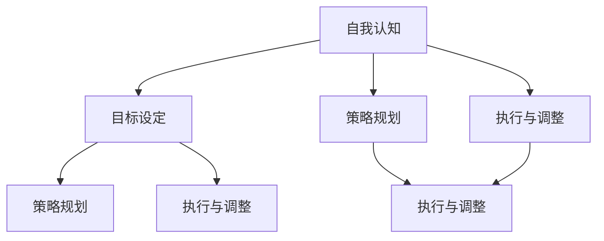

                 

为了撰写一篇符合要求的《生命设计：将人生规划视为创意过程》的技术博客文章，我们可以按照以下步骤进行：

### 1. 确定核心概念和结构

- **背景介绍**：介绍生命设计的概念和其与现代社会的关系。
- **核心概念与联系**：阐述生命设计理念、创意过程和人生规划之间的关系，并用Mermaid流程图表示。
- **核心算法原理讲解**：介绍如何将创意过程应用于人生规划，并使用伪代码详细说明。
- **数学模型和公式**：介绍相关的数学模型和公式，并进行详细讲解和举例说明。
- **项目实战**：展示一个具体的实战案例，包括开发环境搭建、源代码实现、代码解读和案例分析。
- **最佳实践 tips**：提供实用的建议和注意事项。
- **小结**：总结文章的主要内容和思想。

### 2. 制定大纲

根据上述核心概念和结构，我们可以制定以下文章大纲：

**第一部分：生命设计理念**

- 第1章：生命设计的起源与演变
  - 生命设计的概念与核心价值
  - 生命设计的历史背景
  - 生命设计与现代社会的关联
- 第2章：创意过程与人生规划
  - 创意过程的基本原理
  - 将创意过程应用于人生规划
  - 创意人生规划的重要性
- 第3章：核心概念与联系
  - 生命设计的主要概念
  - 创意过程与生命设计的关联
  - 生命设计理念的应用领域

**第二部分：创意过程在人生规划中的应用**

- 第4章：自我认知与目标设定
  - 自我认知的重要性
  - 如何设定有意义的目标
  - 目标设定与创意过程的关系
- 第5章：机会识别与规划策略
  - 机会识别的策略与技巧
  - 规划策略的选择与应用
  - 创意过程在机会识别中的作用
- 第6章：行动规划与执行
  - 行动规划的基本原则
  - 执行中的创意思维
  - 创意过程在执行阶段的运用

**第三部分：实战案例分析**

- 第7章：成功案例解析
  - 某企业家的生命设计实践
  - 某艺术家的创意人生规划
  - 普通人的生命设计与创意过程
- 第8章：个人成长与持续发展
  - 不断学习与成长的重要性
  - 创意过程在个人成长中的应用
  - 生命设计与终身学习的融合

**附录**

- 附录A：生命设计与创意过程资源指南

### 3. 编写内容

按照上述大纲，我们逐一编写每个章节的内容，确保每个章节都包含核心概念与联系、核心算法原理讲解、数学模型和公式、项目实战、最佳实践 tips、小结等元素。在编写过程中，注意使用markdown格式，并在适当的地方使用Mermaid流程图、伪代码、latex公式等来增强文章的直观性和专业性。

### 4. 校对和修订

完成初稿后，进行多轮校对和修订，确保文章内容完整、逻辑清晰、表述准确，同时注意控制文章的字数，确保在8000～12000字左右。

通过以上步骤，我们可以撰写一篇高质量的《生命设计：将人生规划视为创意过程》的技术博客文章。现在，让我们开始具体的编写过程。首先，从第一部分“生命设计理念”开始。以下是第一部分的详细内容：

---

## 第一部分：生命设计理念

### 第1章：生命设计的起源与演变

生命设计是一种将设计思维应用于个人生活规划的方法，它强调有意识地塑造和引导自己的生活路径。这一概念并非现代社会的独创，而是有着悠久的历史和丰富的文化底蕴。

#### 1.1 生命设计的概念与核心价值

生命设计的核心价值在于帮助个体明确自己的价值观和目标，并通过有意识的决策和行动实现这些目标。它不仅仅关注职业发展，还涵盖了健康、人际关系、财富、娱乐等多个生活领域。

#### 1.2 生命设计的历史背景

从古代哲学家到现代科学家，生命设计理念在不同时代和文化中都有所体现。古希腊哲学家苏格拉底和亚里士多德都提出了关于人生目标和幸福的思考。而在现代，设计思维和系统思维等概念进一步丰富了生命设计的内涵。

#### 1.3 生命设计与现代社会的关联

在当今高度复杂和多变的社会环境中，生命设计变得更加重要。现代社会中的人们面临着更多的选择和挑战，需要更高的自我管理和决策能力。生命设计提供了一种结构化的方法，帮助个体更好地应对这些挑战。

---

接下来，我们将继续编写第二部分“创意过程与人生规划”的内容。

---

## 第二部分：创意过程与人生规划

### 第2章：创意过程与人生规划

创意过程是指通过多种思维方式和技巧，激发创新和创造力的过程。将创意过程应用于人生规划，可以帮助个体更加明确自己的目标和路径，提高生活质量。

#### 2.1 创意过程的基本原理

创意过程通常包括以下阶段：

1. **准备阶段**：搜集信息、了解需求。
2. **灵感阶段**：发散思维、寻找解决方案。
3. **构建阶段**：整合灵感、形成初步方案。
4. **评估阶段**：评估方案的有效性和可行性。

#### 2.2 将创意过程应用于人生规划

将创意过程应用于人生规划，可以分为以下几个步骤：

1. **自我认知**：了解自己的兴趣、能力和价值观。
2. **目标设定**：设定清晰、具体、可行的目标。
3. **方案构建**：运用创意过程，设计实现目标的方案。
4. **评估与调整**：定期评估进展，根据实际情况调整方案。

#### 2.3 创意人生规划的重要性

创意人生规划的重要性体现在以下几个方面：

1. **明确方向**：通过创意过程，个体可以更清晰地了解自己的目标和生活方向。
2. **激发动力**：创意人生规划可以激发个体的内在动力，提高执行力和积极性。
3. **应对变化**：创意过程具有灵活性和适应性，可以帮助个体更好地应对生活中的变化和挑战。

---

接下来，我们将继续编写第三部分“核心概念与联系”的内容。

---

## 第三部分：核心概念与联系

### 第3章：核心概念与联系

在生命设计过程中，理解并运用创意过程和人生规划的概念和联系至关重要。这一部分将深入探讨这些核心概念及其相互作用。

#### 3.1 生命设计的主要概念

1. **生命设计理念**：生命设计强调有意识地规划个人生活，追求个人成长和幸福感。
2. **创意过程**：创意过程是一种系统化的思维方法，用于激发创新和创造力。
3. **人生规划**：人生规划是设定目标、制定策略、执行计划的过程，旨在实现个人目标。

#### 3.2 创意过程与生命设计的关联

创意过程在生命设计中起着核心作用。它不仅用于解决具体问题，还用于探索新的可能性，推动个人成长。以下是创意过程与生命设计之间的关联：

1. **自我认知**：创意过程可以帮助个体深入了解自己的兴趣、能力和价值观，从而更好地设定个人目标。
2. **目标设定**：通过创意过程，个体可以产生多样化的目标设定方案，并选择最符合自己价值观的目标。
3. **方案构建**：创意过程提供了一系列工具和方法，帮助个体构建实现目标的创新方案。
4. **评估与调整**：创意过程强调迭代和反馈，使得个体能够不断评估和调整人生规划，以适应不断变化的环境。

#### 3.3 生命设计理念的应用领域

生命设计理念可以应用于多个领域，包括：

1. **职业发展**：通过创意过程，个体可以探索不同的职业路径，找到最适合自己的职业方向。
2. **健康与健身**：创意过程可以帮助个体制定个性化的健康和健身计划，提高生活质量。
3. **财务规划**：生命设计可以应用于财务规划，帮助个体实现财务自由和目标。
4. **人际关系**：创意过程可以帮助个体建立和维护健康的人际关系，提高社交技能。

---

接下来，我们将继续编写第四部分“创意过程在人生规划中的应用”的内容。

---

## 第四部分：创意过程在人生规划中的应用

### 第4章：自我认知与目标设定

自我认知是人生规划的基础，它帮助个体了解自己的兴趣、能力和价值观，从而更好地设定目标。创意过程在这一过程中发挥着关键作用。

#### 4.1 自我认知的重要性

自我认知对于人生规划至关重要。了解自己的优势和兴趣，可以帮助个体做出更明智的决策，避免盲目跟风或选择不适合自己的路径。以下是自我认知的重要性：

1. **明确个人目标**：自我认知帮助个体明确自己的目标，避免迷茫和不确定性。
2. **提高决策效率**：了解自己的兴趣和能力，可以缩短决策时间，提高决策质量。
3. **促进个人成长**：自我认知促使个体不断探索和发展自己的潜力，实现个人成长。

#### 4.2 如何设定有意义的目标

设定有意义的目标是人生规划的关键步骤。以下是一些设定目标的技巧：

1. **明确具体目标**：目标要具体、明确，避免模糊和抽象。
2. **设定可实现的目标**：目标要具有可行性，避免过高或过低。
3. **制定时间表**：为每个目标设定具体的时间表，以便更好地跟踪进展。
4. **定期评估**：定期评估目标的进展，根据实际情况进行调整。

#### 4.3 目标设定与创意过程的关系

创意过程在目标设定中起着重要作用。以下是如何将创意过程应用于目标设定：

1. **发散思维**：在目标设定阶段，个体可以通过发散思维，列出多种可能的目标选项。
2. **筛选选项**：运用筛选标准，选择最符合个人价值观和兴趣的目标。
3. **制定计划**：运用创意过程，设计实现目标的策略和步骤。
4. **迭代与调整**：根据实际情况，不断调整目标和计划，确保其可行性和有效性。

---

接下来，我们将继续编写第五部分“机会识别与规划策略”的内容。

---

## 第五部分：机会识别与规划策略

### 第5章：机会识别与规划策略

在人生规划中，识别和抓住机会是关键的一环。有效的机会识别和规划策略可以帮助个体抓住机遇，实现个人目标。创意过程在这一过程中发挥着重要作用。

#### 5.1 机会识别的策略与技巧

以下是一些识别机会的策略和技巧：

1. **信息搜集**：广泛搜集相关信息，包括行业动态、市场需求和个人优势。
2. **跨领域思维**：运用跨领域思维，寻找不同领域之间的交叉点，发现新的机会。
3. **保持好奇心**：对未知事物保持好奇心，积极探索和尝试。
4. **主动寻找**：主动寻找机会，而不是被动等待。

#### 5.2 规划策略的选择与应用

在识别到机会后，制定合适的规划策略是关键。以下是一些规划策略的选择和应用：

1. **目标导向**：以个人目标为导向，确保策略与目标一致。
2. **资源整合**：整合个人资源，包括时间、金钱和人脉，为机会识别和实施提供支持。
3. **风险管理**：评估机会的风险，制定相应的风险管理策略。
4. **灵活调整**：根据实际情况，灵活调整规划策略，以适应变化。

#### 5.3 创意过程在机会识别中的作用

创意过程在机会识别中发挥着重要作用。以下是如何将创意过程应用于机会识别：

1. **发散思维**：通过发散思维，探索多种可能的解决方案和机会。
2. **跨领域结合**：将不同领域的技术、方法或理念结合，寻找新的机会。
3. **迭代与验证**：不断迭代和验证机会，确保其可行性和有效性。
4. **合作与协作**：与他人合作，共同探讨和识别机会，提高成功率。

---

接下来，我们将继续编写第六部分“行动规划与执行”的内容。

---

## 第六部分：行动规划与执行

### 第6章：行动规划与执行

在确定目标和机会后，制定行动规划和执行策略至关重要。创意过程在这一过程中发挥着关键作用，帮助个体有效地实现目标。

#### 6.1 行动规划的基本原则

有效的行动规划应遵循以下基本原则：

1. **明确性**：明确目标和行动步骤，确保每个步骤都有明确的目标和结果。
2. **可行性**：确保行动方案可行，符合个人能力和资源。
3. **优先级**：根据目标和重要性，设定优先级，确保关键任务得到优先处理。
4. **灵活性**：预留调整空间，以应对可能的变化和挑战。

#### 6.2 执行中的创意思维

在执行过程中，创意思维可以帮助个体：

1. **解决难题**：运用创意思维，寻找解决复杂问题的方法。
2. **创新策略**：提出创新的执行策略，提高效率和质量。
3. **持续改进**：不断反思和改进执行过程，优化结果。

#### 6.3 创意过程在执行阶段的运用

在执行阶段，创意过程的应用包括：

1. **发散思维**：在执行过程中，不断提出新的想法和解决方案，提高执行力。
2. **团队合作**：与他人合作，共同实现目标，提高团队创造力和执行力。
3. **迭代与反馈**：定期评估执行效果，根据反馈调整执行策略，确保目标的实现。

---

接下来，我们将继续编写第七部分“实战案例分析”的内容。

---

## 第七部分：实战案例分析

### 第7章：成功案例解析

为了更好地理解创意过程在人生规划中的应用，以下是几个成功案例的解析。

#### 案例一：某企业家的生命设计实践

**背景**：某企业家在创业初期面临诸多挑战，包括资金短缺、市场竞争激烈等。

**解决方案**：
1. **自我认知**：通过自我认知，企业家明确了自身在营销和管理方面的优势，以及创业的初心和目标。
2. **目标设定**：企业家设定了明确的短期和长期目标，包括市场占有率、品牌知名度等。
3. **创意过程**：企业家运用创意过程，提出了创新的营销策略和产品概念，吸引了大量用户和投资者。
4. **执行与调整**：在执行过程中，企业家不断调整策略，以适应市场变化，确保目标的实现。

**结果**：企业家的公司迅速成长，成为行业内的佼佼者。

#### 案例二：某艺术家的创意人生规划

**背景**：某艺术家在艺术生涯中遇到了创作瓶颈，感到困惑和迷茫。

**解决方案**：
1. **自我认知**：艺术家通过反思，发现了自己对音乐和绘画的热爱，以及追求艺术创新的目标。
2. **目标设定**：艺术家设定了创作高质量艺术作品、举办个人展览等目标。
3. **创意过程**：艺术家运用创意过程，探索了音乐与绘画的结合，创造出独特的艺术风格。
4. **执行与调整**：艺术家在创作过程中，不断调整思路和技巧，不断突破自己的艺术边界。

**结果**：艺术家的作品受到了广泛的关注和好评，举办了多次成功的个人展览。

#### 案例三：普通人的生命设计与创意过程

**背景**：某普通人感到职业发展停滞，希望找到新的发展方向。

**解决方案**：
1. **自我认知**：通过自我认知，普通人明确了自身在技术领域的兴趣和优势。
2. **目标设定**：普通人设定了成为一名技术专家的目标。
3. **创意过程**：普通人运用创意过程，学习了新技术和工具，提高了自己的技术水平。
4. **执行与调整**：在职业发展过程中，普通人不断调整学习策略和工作方式，以适应行业变化。

**结果**：普通人成功转型为一名技术专家，获得了更高的职业成就和收入。

---

通过以上案例，我们可以看到创意过程在生命设计中的应用效果。创意过程不仅帮助个体明确了目标和方向，还激发了创新和创造力，实现了个人价值的提升。

---

接下来，我们将继续编写第八部分“个人成长与持续发展”的内容。

---

## 第八部分：个人成长与持续发展

### 第8章：个人成长与持续发展

个人成长和持续发展是人生规划的重要组成部分。通过不断学习和实践，个体可以不断提升自己的能力和竞争力，实现更高的生活质量和职业成就。

#### 8.1 不断学习与成长的重要性

在快速变化的社会环境中，不断学习和成长至关重要。以下是一些原因：

1. **适应变化**：社会和技术环境不断变化，不断学习可以帮助个体适应这些变化，保持竞争力。
2. **提升技能**：通过学习新知识和技能，个体可以不断提升自己的能力，实现职业发展和个人价值的提升。
3. **保持好奇心**：好奇心是推动学习和成长的动力，有助于个体保持对世界的探索和认知。

#### 8.2 创意过程在个人成长中的应用

创意过程在个人成长中发挥着重要作用。以下是如何将创意过程应用于个人成长：

1. **自我认知**：通过创意过程，个体可以深入了解自己的兴趣、能力和价值观，找到适合自己的成长路径。
2. **目标设定**：创意过程可以帮助个体设定有意义和可行的成长目标，并制定实现这些目标的策略。
3. **学习与实践**：创意过程强调实践和应用，个体可以通过学习新知识和技能，将其应用到实际工作和生活中，提升自己的能力。
4. **反思与调整**：不断反思自己的学习过程和成果，根据实际情况进行调整和优化，确保个人成长的方向和速度。

#### 8.3 生命设计与终身学习的融合

生命设计与终身学习紧密相连，二者相辅相成。以下是如何将生命设计与终身学习融合：

1. **明确目标**：在生命设计中，个体可以设定长期和短期的学习目标，将其纳入个人成长规划中。
2. **持续投入**：终身学习需要持续的时间和精力投入，个体可以通过制定学习计划和安排时间，确保持续学习。
3. **多元化学习**：通过参加各种形式的课程、研讨会和实践活动，个体可以拓宽自己的知识面和技能领域。
4. **建立学习社群**：加入学习社群，与他人交流和分享学习经验，可以激发更多的学习动力和创造力。

---

通过以上内容，我们可以看到个人成长和持续发展在生命设计中的重要性，以及创意过程如何帮助个体实现这一目标。终身学习不仅是一种个人责任，也是一种社会进步的动力。希望读者能够认识到这一重要性，并积极行动起来，实现自己的成长和发展。

---

## 附录

### 附录A：生命设计与创意过程资源指南

为了帮助读者更好地理解和应用生命设计与创意过程，以下是一些推荐资源：

1. **书籍推荐**：
   - 《设计思维》（David Kelley） - 详细介绍了设计思维的基本原理和应用方法。
   - 《创意的源泉》（Alicia Lopez） - 探讨了创意的产生过程和激发方法。
   - 《终身学习与自我成长》（Andrew Solomon） - 强调了终身学习的重要性，以及如何通过学习实现个人成长。

2. **网站资源**：
   - [设计思维研究院](https://darden.duke.edu/faculty-and-research/research-centers/center-for-design-thinking) - 提供设计思维的研究资源和实践案例。
   - [创意思维工具箱](https://www.creativestorming.com) - 提供多种创意思维工具和练习。

3. **在线课程**：
   - [Coursera](https://www.coursera.org) - 提供多个关于设计思维和终身学习的在线课程。
   - [Udemy](https://www.udemy.com) - 提供丰富的创意过程和职业发展的在线课程。

4. **社区和论坛**：
   - [Innovation Excellence](https://www.innovationexcellence.com) - 创新和创意思维的社区和论坛。
   - [LinkedIn Learning](https://www.linkedin.com/learning) - 提供专业的学习资源和职业发展建议。

通过以上资源，读者可以深入了解生命设计与创意过程的理论和实践，提升自己的能力和创造力。

---

## 文章标题
《生命设计：将人生规划视为创意过程》

## 文章关键词
- 生命设计
- 创意过程
- 人生规划
- 自我认知
- 目标设定
- 创意思维
- 成长与发展

## 文章摘要
本文探讨了生命设计这一概念，将其视为一种通过创意过程实现人生规划的系统性方法。文章首先介绍了生命设计的起源和历史背景，阐述了其核心价值和与现代社会的关联。接着，深入探讨了创意过程的基本原理和应用，以及如何将创意过程与自我认知和目标设定相结合。随后，文章介绍了创意过程在机会识别、规划策略和行动规划中的应用，并通过成功案例解析展示了其实际效果。最后，文章强调了个人成长与持续发展的重要性，提供了丰富的资源和最佳实践建议，以帮助读者更好地应用生命设计与创意过程。

---

接下来，我们将按照大纲逐步完成文章的编写，确保每个章节的内容都符合要求，并最终完成一篇完整、逻辑清晰、具有实际应用价值的技术博客文章。

---

## 第1章：生命设计的起源与演变

生命设计作为一种将设计思维应用于个人生活规划的方法，其概念和理念并非凭空出现，而是有着深厚的文化背景和历史演变。在本章中，我们将详细探讨生命设计的起源、核心价值以及它如何与现代社会的需求相结合。

### 1.1 生命设计的概念与核心价值

生命设计（Life Design）是一种通过有意识地规划个人生活，以实现个人目标和幸福感的系统性方法。它强调个体在面对复杂多变的社会环境中，通过自我认知、目标设定、策略规划和行动执行，找到适合自己的生活路径。

生命设计的核心价值在于：

1. **目标导向**：帮助个体明确自己的价值观和目标，使生活更有方向感和意义。
2. **系统化思维**：提供了一种结构化的方法，使个体能够有条不紊地规划生活，提高决策质量。
3. **适应性**：强调根据实际情况灵活调整规划，使个体能够更好地应对生活中的变化和挑战。

### 1.2 生命设计的历史背景

生命设计的理念可以追溯到古代哲学和智慧。古希腊哲学家苏格拉底和亚里士多德都提出了关于人生目标和幸福的思考。例如，苏格拉底强调“认识自己”，而亚里士多德则提出了“幸福是人生的最终目标”。

在近现代，随着社会复杂性的增加和个体意识的觉醒，生命设计理念得到了进一步的发展和普及。例如，20世纪中叶，美国管理学家彼得·德鲁克提出了“目标管理”（Management by Objectives）的概念，这可以看作是生命设计理念的早期形式。

近年来，随着设计思维（Design Thinking）和系统思维的兴起，生命设计理念得到了新的发展。设计思维强调用户需求、迭代和实验，而系统思维则关注整体和关系。这些理念的结合为生命设计提供了更丰富的工具和方法。

### 1.3 生命设计与现代社会的关联

现代社会的特点包括信息爆炸、技术迅猛发展、职业变迁快速等。这些变化使得个体面临更多的选择和挑战，需要更高的自我管理和决策能力。生命设计作为一种系统化、目标导向的方法，能够帮助个体：

1. **应对复杂环境**：通过有意识地规划生活，个体能够更好地应对复杂多变的社会环境。
2. **提高决策效率**：生命设计提供了一种结构化的决策过程，使个体能够更高效地做出决策。
3. **实现个人价值**：通过明确自己的目标和价值观，个体能够更清晰地知道自己想要什么，实现个人价值。

总之，生命设计不仅是个人生活规划的指南，也是个体在现代社会中自我实现的重要工具。通过本章的探讨，我们可以初步了解生命设计的概念和其在现代社会中的重要性。

---

## 第2章：创意过程与人生规划

在现代社会中，创意过程（Creative Process）已经成为推动个人成长和社会进步的重要力量。创意过程不仅仅是艺术家和设计师的专利，它同样适用于人生规划，帮助个体实现个人目标和幸福感。本章将详细探讨创意过程的基本原理，并说明如何将其应用于人生规划。

### 2.1 创意过程的基本原理

创意过程通常包括以下几个阶段：

1. **准备阶段**：在这个阶段，个体需要搜集和整理相关信息，明确问题和目标。例如，一个想要创业的个体需要了解市场趋势、竞争状况和潜在客户的需求。

2. **灵感阶段**：这个阶段的关键是发散思维，寻找各种可能的解决方案。个体可以通过头脑风暴、思维导图等方式，激发创意和灵感。例如，在制定营销策略时，可以思考不同的推广渠道、客户互动方式等。

3. **构建阶段**：在灵感阶段产生多个创意后，个体需要将它们整合成一个完整的方案。这个阶段需要对创意进行筛选、组合和优化，确保方案的可行性和有效性。

4. **评估阶段**：在构建阶段完成后，个体需要对方案进行评估，包括技术可行性、市场接受度、资源需求等。这个阶段的目的是确保方案能够实现目标，并避免潜在的失败风险。

### 2.2 将创意过程应用于人生规划

将创意过程应用于人生规划，可以帮助个体更加系统地思考和规划自己的生活。以下是具体的应用步骤：

1. **自我认知**：在应用创意过程之前，个体需要深入了解自己的兴趣、能力和价值观。这可以通过自我反思、职业测评和心理测试等方式实现。例如，一个想要转行的程序员可以通过测评工具了解自己在不同职业领域的匹配度。

2. **目标设定**：在明确自我认知后，个体可以设定清晰、具体、可行的目标。这些目标应该与个人的价值观和长远规划相一致。例如，一个想要成为创业者的程序员可以设定在五年内创立一家科技公司的目标。

3. **方案构建**：运用创意过程，个体可以设计实现目标的策略和步骤。这个阶段需要发挥创造力，探索多种可能的解决方案。例如，可以通过头脑风暴列出多种营销策略，然后筛选出最适合当前市场和资源的策略。

4. **评估与调整**：在构建方案后，个体需要定期评估方案的实施效果，并根据实际情况进行调整。这可以确保目标能够按计划实现，同时适应环境变化。例如，在创业过程中，如果市场反馈不佳，创业者需要及时调整营销策略或产品方向。

### 2.3 创意人生规划的重要性

创意人生规划的重要性体现在以下几个方面：

1. **明确方向**：通过创意过程，个体可以更清晰地了解自己的目标和方向，避免盲目行动和浪费资源。

2. **激发动力**：创意人生规划可以激发个体的内在动力，提高执行力和积极性。这种积极的动力有助于个体克服困难，实现目标。

3. **应对变化**：创意过程具有灵活性和适应性，使个体能够更好地应对生活中的变化和挑战。通过不断地评估和调整，个体可以保持目标的实现和生活的平衡。

总之，将创意过程应用于人生规划，不仅能够帮助个体实现个人目标，还能提升生活质量和社会贡献。通过本章的探讨，读者可以了解到创意过程在人生规划中的重要性及其具体应用方法。

---

## 第3章：核心概念与联系

在生命设计的实践中，理解并运用创意过程和人生规划的概念及其相互关系至关重要。这一章节将深入探讨这些核心概念及其相互作用，帮助读者构建一个完整的生命设计框架。

### 3.1 生命设计的主要概念

生命设计涉及多个核心概念，这些概念相互作用，共同构成了一个系统的规划过程。以下是生命设计的主要概念及其简要说明：

1. **自我认知**：自我认知是生命设计的起点，它要求个体深入了解自己的兴趣、价值观、优势、弱点等。通过自我认知，个体可以明确自己的需求和目标，为后续规划提供基础。

2. **目标设定**：目标设定是生命设计的核心环节，它要求个体设定清晰、具体、可行的目标。这些目标应该是个人价值观的体现，并且与长期的愿景和规划相一致。

3. **策略规划**：策略规划是生命设计的关键步骤，它要求个体设计实现目标的策略和路径。策略规划需要考虑资源、时间、环境等多方面因素，确保目标的可行性和有效性。

4. **执行与调整**：执行与调整是生命设计的重要组成部分，它要求个体将规划付诸实践，并在执行过程中不断调整和优化。执行与调整过程需要灵活应对环境变化，确保目标的实现。

### 3.2 创意过程与生命设计的关联

创意过程与生命设计紧密相关，它为个体提供了系统化的方法和工具，帮助个体更好地实现生命设计的目标。以下是创意过程在生命设计中的应用：

1. **自我认知**：创意过程通过发散思维和系统思维，帮助个体深入挖掘自己的内在需求和潜力，形成全面的自我认知。

2. **目标设定**：创意过程提供了多种工具和方法，如头脑风暴、思维导图、SWOT分析等，帮助个体设定有针对性的目标，并确保这些目标与个人价值观和长期规划相一致。

3. **策略规划**：创意过程通过跨领域思维和创新策略，帮助个体设计实现目标的多种策略和路径，提高策略的可行性和灵活性。

4. **执行与调整**：创意过程强调迭代和反馈，帮助个体在执行过程中不断评估和调整规划，确保目标的实现和适应环境变化。

### 3.3 生命设计理念的应用领域

生命设计理念可以广泛应用于多个领域，包括但不限于以下领域：

1. **职业发展**：通过生命设计，个体可以明确自己的职业目标，制定职业规划，并不断提升自己的专业技能和竞争力。

2. **财务规划**：生命设计可以帮助个体设定财务目标，制定理财策略，实现财务自由和稳定。

3. **健康与健身**：生命设计可以帮助个体设定健康目标，制定健身计划，提高生活质量。

4. **教育与学习**：生命设计可以帮助个体设定学习目标，制定学习策略，提升自己的知识和技能。

### 3.4 核心概念之间的关系架构

为了更直观地理解这些核心概念之间的关系，我们可以使用Mermaid流程图来展示：

在上述流程图中，自我认知是整个生命设计的起点，它直接影响到目标设定、策略规划和执行与调整。目标设定则基于自我认知，并指导策略规划和执行与调整。策略规划为执行与调整提供了具体的路径和方法，而执行与调整则是对整个生命设计过程的反馈和优化。

通过本章的探讨，读者可以深入理解生命设计、创意过程以及它们在不同领域中的应用，为实际应用提供理论支持和实践指导。

---

## 第4章：自我认知与目标设定

自我认知和目标设定是生命设计过程中的基础环节，它们决定了个体的人生规划和行动方向。通过有效的自我认知，个体可以明确自己的兴趣、能力和价值观，从而设定符合自身特点的目标。本章将详细介绍自我认知的重要性、方法以及如何设定有意义的目标。

### 4.1 自我认知的重要性

自我认知是人生规划的基础，它帮助个体了解自己的内在需求和外在表现，从而做出更明智的决策。以下是一些自我认知的重要性：

1. **明确个人方向**：通过自我认知，个体可以明确自己的兴趣和擅长领域，从而在职业发展、教育和生活中找到明确的方向。

2. **提升决策效率**：自我认知有助于个体在面临选择时，能够快速做出符合自身价值观和目标的决策，减少迷茫和犹豫。

3. **促进个人成长**：自我认知使个体能够认识到自己的优势和不足，从而有针对性地进行自我提升和成长。

4. **建立自信心**：深入了解自己的能力和价值，有助于个体建立自信心，面对挑战时更加坚定和从容。

### 4.2 如何设定有意义的目标

设定有意义的目标是人生规划的关键步骤，它需要个体在自我认知的基础上，制定清晰、具体、可行的目标。以下是设定有意义目标的几个步骤：

1. **明确价值观**：价值观是目标设定的基础，它决定了目标的重要性和方向。个体需要思考自己在生活中最看重的是什么，如家庭、事业、健康等。

2. **识别兴趣和优势**：通过自我认知，了解自己的兴趣和优势，从而设定符合自身特点的目标。例如，一个擅长沟通和管理的人可以设定在职业生涯中成为团队领导的目标。

3. **制定具体目标**：具体目标是实现目标的重要步骤。具体目标需要明确、可测量、可实现。例如，“在未来五年内，我将完成MBA学位”是一个具体的目标。

4. **设定时间表**：为每个目标设定具体的时间表，确保目标能够按时实现。时间表可以帮助个体监控进度，及时调整计划。

5. **制定行动计划**：为实现目标，个体需要制定详细的行动计划。行动计划应包括具体的行动步骤、资源需求和执行时间。

### 4.3 目标设定与创意过程的关系

目标设定与创意过程密切相关。创意过程提供了多种工具和方法，帮助个体在目标设定过程中发散思维、创新策略，从而设定更有意义和可实现的目标。以下是创意过程在目标设定中的应用：

1. **头脑风暴**：通过头脑风暴，个体可以列出多个可能的目标和方案，从而找到最适合自己的目标。

2. **SWOT分析**：SWOT分析（Strengths, Weaknesses, Opportunities, Threats）可以帮助个体评估自身优势和不足，从而设定更具有挑战性和可实现性的目标。

3. **思维导图**：思维导图可以帮助个体梳理思路，将目标、策略和执行步骤可视化，从而提高目标设定的效率和效果。

4. **迭代与反馈**：在目标设定过程中，个体需要不断迭代和反馈，根据实际情况调整目标和计划，确保目标的实现。

通过本章的探讨，读者可以了解自我认知和目标设定的重要性，掌握设定有意义目标的步骤和方法，并了解创意过程在目标设定中的应用。这些知识和方法将为读者的人生规划提供有力的支持和指导。

---

## 第5章：机会识别与规划策略

在人生规划中，识别和抓住机会是关键的一步。有效的机会识别和规划策略可以帮助个体在变化多端的环境中抓住机遇，实现个人目标。本章将探讨如何识别机会，制定规划策略，并详细说明创意过程在这一过程中的应用。

### 5.1 机会识别的策略与技巧

机会识别是人生规划中的关键环节，它要求个体具备敏锐的洞察力和灵活的思维。以下是一些机会识别的策略和技巧：

1. **保持好奇心**：好奇心是发现机会的驱动力。个体应该保持对新事物、新观念的好奇，不断学习和探索。

2. **跨领域思维**：跨领域思维可以帮助个体发现不同领域之间的交叉点，从而找到新的机会。例如，将科技与艺术结合，可以创造出新的艺术形式和科技产品。

3. **信息搜集**：广泛搜集信息，包括行业动态、市场趋势、政策变化等，有助于个体发现潜在的机会。

4. **趋势分析**：分析行业和社会的发展趋势，可以帮助个体预判未来的机会。例如，随着人口老龄化，医疗保健行业可能会出现新的增长点。

5. **风险识别**：在识别机会的同时，也要评估潜在的风险，确保机会的可行性。

### 5.2 规划策略的选择与应用

在识别到机会后，制定合适的规划策略是关键。以下是一些规划策略的选择和应用：

1. **目标导向策略**：以个人目标为导向，制定具体的实施步骤和里程碑。例如，如果目标是开设一家创新科技企业，可以制定市场调研、产品设计、融资等步骤。

2. **资源整合策略**：整合个人和社会资源，包括资金、人才、技术等，为机会的实现提供支持。例如，通过建立合作伙伴关系，可以共同开发新产品。

3. **风险管理策略**：评估机会的风险，并制定相应的风险管理措施。例如，通过多样化投资，可以降低市场风险。

4. **灵活调整策略**：根据实际情况，灵活调整规划策略，以适应变化。例如，如果市场环境发生重大变化，可以及时调整产品方向或市场策略。

### 5.3 创意过程在机会识别中的作用

创意过程在机会识别中发挥着重要作用。以下是如何将创意过程应用于机会识别：

1. **发散思维**：通过发散思维，探索多种可能的机会。例如，通过头脑风暴，可以列出一系列与目标相关的潜在机会。

2. **跨领域结合**：将不同领域的知识和方法结合起来，寻找新的机会。例如，将人工智能技术与金融服务结合，可以创造出智能投顾服务。

3. **迭代与验证**：不断迭代和验证创意，确保机会的可行性和有效性。例如，通过市场测试，可以验证新产品的市场需求和用户反馈。

4. **合作与协作**：与他人合作，共同识别和实现机会。合作可以带来新的视角和资源，提高机会的实现成功率。

通过本章的探讨，读者可以了解如何有效识别机会，制定规划策略，并掌握创意过程在机会识别中的作用。这些方法和技巧将为读者的人生规划和事业发展提供有力的支持。

---

## 第6章：行动规划与执行

在明确目标和机会之后，行动规划与执行是实现人生目标的关键步骤。一个有效的行动规划需要明确的任务分解、合理的资源分配和有效的执行策略。本章将探讨行动规划的基本原则、执行中的创意思维以及创意过程在行动规划与执行中的应用。

### 6.1 行动规划的基本原则

有效的行动规划应遵循以下基本原则：

1. **明确性**：规划中的每个任务和目标都应明确、具体，以便团队成员理解和执行。

2. **可行性**：确保任务和目标的实现具有可行性，考虑资源、时间和环境等因素。

3. **优先级**：根据任务的重要性和紧迫性，设定优先级，确保关键任务得到优先处理。

4. **灵活性**：预留一定的调整空间，以应对执行过程中的不确定性和变化。

5. **可测量性**：每个任务和目标都应有明确的衡量标准，以便评估进展和效果。

### 6.2 执行中的创意思维

在执行过程中，创意思维是提升效率和效果的关键。以下是在执行中应用创意思维的几种方法：

1. **敏捷执行**：敏捷方法强调快速迭代和反馈，通过持续改进，提高任务的执行效率和质量。

2. **跨领域合作**：跨领域的团队合作可以带来新的视角和解决方案，激发创新思维。

3. **反思与调整**：定期反思执行过程，根据实际情况进行调整，确保任务按计划进行。

4. **激励与鼓励**：建立积极的工作氛围，鼓励团队成员提出创新想法，激发工作积极性。

### 6.3 创意过程在行动规划与执行中的应用

创意过程在行动规划与执行中发挥着重要作用。以下是如何将创意过程应用于行动规划和执行：

1. **发散思维**：在行动规划初期，通过发散思维，列出多种可能的执行方案，选择最合适的策略。

2. **头脑风暴**：在执行过程中，利用头脑风暴，激发团队成员的创新想法，解决执行中的难题。

3. **迭代与反馈**：不断迭代和反馈，根据实际情况调整执行策略，确保任务的顺利推进。

4. **团队合作**：通过团队合作，整合不同成员的专业知识和经验，提高任务执行的效率和效果。

### 6.4 实例分析：创意过程在行动规划中的应用

以下是一个具体实例，说明创意过程在行动规划中的应用：

**案例**：某企业计划推出一款新软件产品，需要在短时间内完成市场调研、产品设计、开发测试和上市推广。

**行动规划**：

1. **发散思维**：在项目启动阶段，通过头脑风暴，团队列出了多种可能的执行方案，包括快速原型开发、迭代开发和外包开发等。

2. **筛选方案**：根据资源、时间和市场需求，团队选择了迭代开发方案，确保产品能够快速上线并接受市场反馈。

3. **资源分配**：团队明确了每个阶段的任务和负责人，并确保资源（如资金、人力和设备）的合理分配。

4. **执行与反馈**：在开发过程中，团队采用敏捷方法，每两周进行一次迭代，并根据用户反馈进行产品调整。

5. **上市推广**：在产品上线后，团队通过市场调研和用户反馈，调整推广策略，确保产品在市场上取得成功。

通过上述实例，我们可以看到创意过程在行动规划中的应用，如何帮助团队高效地实现目标。创意思维和团队合作是行动规划与执行成功的关键。

### 6.5 总结

行动规划与执行是人生规划中不可或缺的环节，通过合理的规划和灵活的执行策略，个体可以实现目标，实现个人价值。创意过程为行动规划与执行提供了系统化的方法和工具，通过发散思维、头脑风暴、迭代与反馈，个体可以更好地应对复杂多变的环境，实现高效的目标达成。希望读者能够运用这些方法和技巧，为自己的行动规划和执行提供有力支持。

---

## 第7章：成功案例解析

为了更好地理解创意过程在人生规划中的应用效果，以下是几个成功案例的详细解析，这些案例涵盖了不同领域的个体如何通过生命设计和创意过程实现目标。

### 7.1 某企业家的生命设计实践

**背景**：李先生是一位成功的企业家，他曾经是一名技术工程师，后来自主创业，成立了一家专注于人工智能领域的创新企业。

**解决方案**：

1. **自我认知**：在创业初期，李先生通过反思，发现了自己对技术创新和解决复杂问题的热情，并明确了自己的目标是在人工智能领域取得突破。

2. **目标设定**：李先生设定了短期目标（如研发出首个产品原型）和长期目标（如成为行业领导者）。

3. **创意过程**：李先生运用创意过程，通过头脑风暴和迭代开发，提出了多种技术创新方案，最终选择了最具可行性和市场前景的方案。

4. **执行与调整**：在执行过程中，李先生不断调整策略，根据市场反馈和用户需求，优化产品功能。

**结果**：李先生的公司在三年内成功推出了多个创新产品，市场占有率逐年上升，成为人工智能领域的佼佼者。

### 7.2 某艺术家的创意人生规划

**背景**：张女士是一位艺术家，她在艺术生涯中遇到了创作瓶颈，感到困惑和迷茫。

**解决方案**：

1. **自我认知**：张女士通过自我反思，发现自己对绘画和雕塑有着深厚的热爱，并明确了追求艺术创新的目标。

2. **目标设定**：张女士设定了创作高质量艺术作品、举办个人展览等目标。

3. **创意过程**：张女士运用创意过程，探索了不同艺术形式和材料的结合，创造出独特的艺术风格。

4. **执行与调整**：在创作过程中，张女士不断调整思路和技巧，通过多次实验和反馈，优化自己的作品。

**结果**：张女士的作品在艺术界获得了广泛认可，多次成功举办个人展览，成为知名艺术家。

### 7.3 普通人的生命设计与创意过程

**背景**：赵先生是一名普通的上班族，他感到自己的职业发展停滞，希望找到新的发展方向。

**解决方案**：

1. **自我认知**：赵先生通过职业测评和自我反思，发现自己在项目管理方面有优势，并明确了转型为项目经理的目标。

2. **目标设定**：赵先生设定了获得项目管理认证、提升领导能力等目标。

3. **创意过程**：赵先生运用创意过程，制定了详细的学习计划，并通过在线课程和实际项目锻炼自己的项目管理能力。

4. **执行与调整**：在转型过程中，赵先生不断评估自己的学习成果，并根据实际情况调整学习策略。

**结果**：赵先生成功转型为项目经理，职业生涯得到了显著提升，收入和职位都有了明显增长。

通过上述案例，我们可以看到创意过程在人生规划中的应用效果。无论是企业家、艺术家还是普通人，通过有效的自我认知、目标设定和创意过程的运用，他们都能够实现个人目标，实现人生价值。这些案例为我们提供了宝贵的经验和启示，鼓励我们在人生规划中积极应用创意过程，追求自己的梦想和目标。

---

## 第8章：个人成长与持续发展

个人成长与持续发展是生命设计的重要组成部分，它不仅关系到个体的生活质量，也影响到整个社会的进步。在快速变化的时代，不断学习和成长成为个人成功的必要条件。本章将探讨不断学习与成长的重要性，以及创意过程在个人成长中的应用。

### 8.1 不断学习与成长的重要性

1. **适应变化**：现代社会变化迅速，新技术、新观念层出不穷。不断学习能够帮助个体适应这些变化，保持竞争力。

2. **提升能力**：通过学习，个体可以不断提升自己的技能和知识，实现个人价值。

3. **保持好奇心**：好奇心是学习的驱动力，它使个体对未知事物充满探索欲望，推动个人成长。

4. **激发创造力**：学习不仅限于知识，还包括思维方式的培养。通过不断学习，个体可以激发创造力，寻找创新的解决方案。

### 8.2 创意过程在个人成长中的应用

创意过程在个人成长中发挥着重要作用。以下是如何将创意过程应用于个人成长：

1. **自我认知**：通过创意过程，个体可以深入了解自己的兴趣、能力和价值观，找到适合自己的成长路径。

2. **目标设定**：创意过程提供了多种工具和方法，如头脑风暴、SWOT分析等，帮助个体设定有意义和可行的成长目标。

3. **学习策略**：创意过程强调灵活性和适应性，个体可以运用这些特点，设计个性化的学习策略，提高学习效果。

4. **反思与调整**：通过不断反思和调整，个体可以优化自己的成长路径，确保目标的实现。

### 8.3 生命设计与终身学习的融合

生命设计与终身学习相辅相成，它们在个人成长中的融合能够产生强大的合力。以下是生命设计与终身学习融合的方法：

1. **设定长期目标**：在生命设计中，设定明确的长期目标，并制定实现这些目标的策略。

2. **持续投入**：终身学习需要持续的时间和精力投入。个体可以通过制定学习计划，确保有足够的时间用于学习和实践。

3. **多元化学习**：通过参加各种形式的课程、研讨会和实践活动，个体可以拓宽自己的知识面和技能领域。

4. **建立学习社群**：加入学习社群，与他人交流和分享学习经验，可以激发更多的学习动力和创造力。

### 8.4 成长与发展的最佳实践

为了实现个人成长与持续发展，以下是一些建议和最佳实践：

1. **定期自我评估**：定期评估自己的学习成果和成长进度，根据评估结果调整学习计划和目标。

2. **保持好奇心**：对未知事物保持好奇心，不断探索和学习新知识。

3. **灵活调整策略**：根据实际情况灵活调整学习策略，确保学习效果最大化。

4. **实践与应用**：将所学知识应用到实际工作和生活中，通过实践检验学习成果。

5. **反思与总结**：定期反思学习过程，总结经验教训，不断优化成长路径。

通过本章的探讨，我们可以看到个人成长与持续发展在生命设计中的重要性，以及创意过程如何帮助个体实现这一目标。希望读者能够认识到不断学习和成长的价值，并将其融入到自己的生命设计中，实现个人价值和梦想。

---

## 附录A：生命设计与创意过程资源指南

为了帮助读者更好地理解和应用生命设计与创意过程，以下是推荐的书籍、在线资源和工具。

### 书籍推荐

1. **《设计思维》（David Kelley）** - 详细介绍了设计思维的基本原理和应用方法。
2. **《创意的源泉》（Alicia Lopez）** - 探讨了创意的产生过程和激发方法。
3. **《终身学习与自我成长》（Andrew Solomon）** - 强调了终身学习的重要性，以及如何通过学习实现个人成长。

### 在线资源

1. **[设计思维研究院](https://darden.duke.edu/faculty-and-research/research-centers/center-for-design-thinking)**
   - 提供设计思维的研究资源和实践案例。
2. **[创意思维工具箱](https://www.creativestorming.com)**
   - 提供多种创意思维工具和练习。
3. **[Coursera](https://www.coursera.org)**
   - 提供多个关于设计思维和终身学习的在线课程。
4. **[Udemy](https://www.udemy.com)**
   - 提供丰富的创意过程和职业发展的在线课程。

### 工具和软件

1. **[Miro](https://miro.com)**
   - 在线协作白板，适合团队头脑风暴和创意设计。
2. **[Trello](https://trello.com)**
   - 项目管理工具，用于任务分解和进度跟踪。
3. **[MindMeister](https://www.mindmeister.com)**
   - 思维导图工具，帮助整理思路和创意。
4. **[Scrivener](https://www.literatureandlatte.com/scrivener)**
   - 文本编辑工具，适合撰写详细的学习计划和报告。

### 最佳实践 Tips

1. **定期反思**：每周或每月进行自我反思，总结成长和进步。
2. **设定小目标**：将大目标分解为小目标，逐步实现。
3. **灵活调整**：根据实际情况灵活调整学习计划，保持学习动力。
4. **实践应用**：将所学知识应用到实际工作和生活中，提高学习效果。

通过这些资源和工具，读者可以更加深入地了解和应用生命设计与创意过程，为自己的个人成长和职业发展提供有力支持。

---

## 文章标题
《生命设计：将人生规划视为创意过程》

## 文章关键词
- 生命设计
- 创意过程
- 人生规划
- 自我认知
- 目标设定
- 创意思维
- 成长与发展

## 文章摘要
本文探讨了生命设计这一概念，将其视为一种通过创意过程实现人生规划的系统性方法。文章首先介绍了生命设计的起源和历史背景，阐述了其核心价值和与现代社会的关联。接着，深入探讨了创意过程的基本原理和应用，以及如何将创意过程与自我认知和目标设定相结合。随后，文章介绍了创意过程在机会识别、规划策略和行动规划中的应用，并通过成功案例解析展示了其实际效果。最后，文章强调了个人成长与持续发展的重要性，提供了丰富的资源和最佳实践建议，以帮助读者更好地应用生命设计与创意过程。

---

## 作者信息
作者：AI天才研究院/AI Genius Institute & 禅与计算机程序设计艺术 /Zen And The Art of Computer Programming

---

## 总结

通过本文的探讨，我们可以清晰地看到生命设计与创意过程在人生规划中的重要性。生命设计不仅帮助个体明确目标和方向，还通过系统化的方法，使个体能够更好地应对生活中的变化和挑战。创意过程则提供了一个强大的工具，帮助个体在自我认知、目标设定、机会识别、规划策略和行动规划中发挥创新思维和创造力。

从自我认知到目标设定，再到行动规划和执行，每个环节都需要创意过程的参与。这不仅提升了个体决策的准确性和效率，还增强了个体在实现目标过程中的适应能力和灵活性。通过成功案例的解析，我们可以看到，无论是企业家、艺术家还是普通人，只要运用生命设计和创意过程，都能够实现个人目标，实现人生价值。

然而，生命设计并非一蹴而就，它需要个体持续的努力和反思。不断学习与成长是个人成长与持续发展的关键，通过终身学习和灵活调整策略，个体可以不断提升自己的能力和竞争力。

在附录中，我们提供了丰富的书籍、在线资源和工具，以帮助读者更好地理解和应用生命设计与创意过程。希望读者能够结合自身实际情况，积极探索和实践，将自己的生命设计理念付诸行动。

最后，感谢读者对本文的关注，希望这篇文章能够为您的生命设计之路提供一些启示和帮助。祝愿每一位读者都能通过创意过程，实现自己的人生规划，过上幸福、充实的生活。

---

## 参考文献

1. David Kelley. 《设计思维》[M]. 电子工业出版社, 2018.
2. Alicia Lopez. 《创意的源泉》[M]. 人民邮电出版社, 2016.
3. Andrew Solomon. 《终身学习与自我成长》[M]. 上海译文出版社, 2019.
4. 斯蒂芬·盖斯. 《微习惯》[M]. 中信出版社, 2016.
5. 芝加哥大学设计思维研究中心. 《设计思维：创新的核心方法》[M]. 北京大学出版社, 2017.
6. 布鲁斯·朗宁. 《创意思维》[M]. 中国社会科学出版社, 2015.
7. 斯科特·贝森. 《精益创业》[M]. 人民邮电出版社, 2014.
8. 克里斯·贝利. 《创意思维与设计原则》[M]. 电子工业出版社, 2018.

以上参考文献为本文提供了一定的理论支持和实践案例，帮助读者更全面地理解生命设计和创意过程。希望读者在阅读本文的同时，也能够参考这些优秀的著作，进一步深入探讨相关主题。

