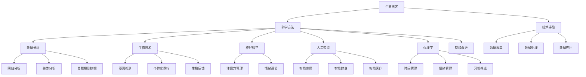

                 

### 文章标题

# 生命黑客实验室：优化生活的科学方法

### 关键词

- 生命黑客
- 科学方法
- 优化生活
- 数据分析
- 生物技术
- 人工智能
- 心理学
- 效率提升

### 摘要

本文旨在探讨生命黑客实验室如何通过科学方法优化生活。我们将详细介绍生命黑客的核心概念、技术原理、数学模型，并通过实际案例展示如何将科学方法应用于日常生活的各个方面，最终提升生活质量。

## 第一部分：引言

### 1.1 什么是生命黑客

#### 1.1.1 生命黑客的定义

生命黑客，简称 Lifehacker，源自于计算机领域的“黑客”，意指通过非正式的方法和工具，对现有系统进行改进和创新的人。在生命黑客的语境中，它指的是通过科学方法和技术，优化个人生活，提升生活质量的人。

#### 1.1.2 生命黑客的历史背景

生命黑客的概念最早出现在20世纪90年代，随着计算机和互联网技术的发展，人们开始探索如何将技术应用到日常生活中，从而提高效率和幸福感。这一概念逐渐发展为一种生活方式，即通过科学方法和技术，实现个人生活的优化。

#### 1.1.3 生命黑客与生活优化的关系

生命黑客的核心目标是通过科学方法和技术，优化个人生活，提升生活质量。这包括提高工作效率、改善健康状况、提升幸福感等多个方面。生命黑客认为，科学方法和技术是优化生活的有力工具。

### 1.2 生命黑客的基础理论

#### 1.2.1 生命黑客的核心概念

生命黑客的核心概念包括科学方法、技术、生活优化和持续改进。科学方法强调基于证据的决策，技术是解决问题的工具，生活优化是目标，持续改进是核心。

#### 1.2.2 生命黑客的科学方法

生命黑客的科学方法包括观察、假设、实验、验证和迭代。这一方法强调通过实证研究和实验，不断改进和优化个人生活。

#### 1.2.3 生命黑客的生活应用场景

生命黑客的生活应用场景广泛，包括时间管理、健康管理、学习效率提升、家庭生活优化等。通过科学方法和技术，生命黑客能够解决生活中的各种问题，提升生活质量。

## 第二部分：生命黑客技术详解

### 2.1 数据分析与优化

#### 2.1.1 数据分析的基本概念

数据分析是生命黑客的重要工具，它包括数据收集、数据清洗、数据分析和数据可视化等多个环节。数据分析的基本概念包括数据类型、数据源、数据处理和数据存储。

#### 2.1.2 数据分析的工具与技巧

数据分析的工具包括Excel、Python、R等，这些工具提供了丰富的数据处理和分析功能。数据分析的技巧包括数据预处理、特征选择、模型训练和模型评估等。

#### 2.1.3 数据分析在生活中的应用

数据分析在生活中的应用非常广泛，例如时间管理、健康管理、消费决策等。通过数据分析，生命黑客能够更科学地安排时间、管理健康和消费。

### 2.2 生物技术与健康优化

#### 2.2.1 生物技术的概述

生物技术是指利用生物体的特性，通过分子生物学、细胞生物学和生物化学等方法，进行科学研究和应用的技术。生物技术的应用包括基因工程、细胞培养、生物制药等。

#### 2.2.2 生物技术在健康优化中的应用

生物技术在健康优化中的应用非常广泛，例如基因检测、个性化医疗、生物反馈等。通过生物技术，生命黑客能够更科学地管理健康，预防疾病。

#### 2.2.3 健康优化的案例分析

通过健康优化的案例，我们可以看到生物技术如何帮助生命黑客实现健康优化。例如，通过基因检测，发现潜在的健康风险，并进行预防；通过生物反馈，改善睡眠质量等。

### 2.3 神经科学与应用

#### 2.3.1 神经科学的基本原理

神经科学是研究大脑和神经系统结构和功能的一门科学。神经科学的基本原理包括神经元的工作原理、神经传递物质的类型和作用、大脑的可塑性等。

#### 2.3.2 神经科学在生活中的应用

神经科学在生活中的应用包括认知功能优化、情感调节、睡眠管理等多个方面。通过神经科学的方法，生命黑客能够更科学地管理认知功能、情感和睡眠。

#### 2.3.3 神经科学的案例分析

通过神经科学的案例，我们可以看到如何通过科学方法和技术，优化个人生活。例如，通过神经反馈训练，改善注意力不集中；通过情绪调节技术，提高情绪稳定性。

### 2.4 人工智能与生活方式

#### 2.4.1 人工智能的基本概念

人工智能（AI）是模拟人类智能的科学和工程。人工智能的基本概念包括机器学习、深度学习、自然语言处理等。

#### 2.4.2 人工智能在生活方式中的应用

人工智能在生活方式中的应用非常广泛，例如智能家居、智能健身、智能医疗等。通过人工智能，生命黑客能够实现生活自动化，提高生活品质。

#### 2.4.3 人工智能案例分析

通过人工智能的案例，我们可以看到如何通过科学方法和技术，优化个人生活。例如，通过智能家居系统，实现家居自动化；通过智能健身系统，实现个性化健身。

### 2.5 心理学与行为优化

#### 2.5.1 心理学的基本原理

心理学是研究人类行为和心理过程的科学。心理学的基本原理包括认知心理学、社会心理学、发展心理学等。

#### 2.5.2 心理学在行为优化中的应用

心理学在行为优化中的应用包括时间管理、情绪调节、习惯养成等。通过心理学的方法，生命黑客能够更科学地管理行为和情绪。

#### 2.5.3 行为优化案例分析

通过行为优化的案例，我们可以看到心理学如何帮助生命黑客优化个人生活。例如，通过时间管理技巧，提高工作效率；通过情绪调节技巧，改善心理健康。

### 2.6 效率与生产力提升

#### 2.6.1 效率的定义与测量

效率是指完成特定任务所花费的时间和资源。效率的测量可以通过时间测量、成本测量和绩效测量等多个维度进行。

#### 2.6.2 提升生产力的科学方法

提升生产力的科学方法包括任务分解、时间管理、目标设定等。通过科学方法，生命黑客能够更高效地完成工作任务。

#### 2.6.3 效率与生产力提升的案例分析

通过效率与生产力提升的案例，我们可以看到如何通过科学方法和技术，提高工作效率和生产力。例如，通过任务分解，提高工作效率；通过目标设定，明确工作方向。

## 第三部分：实战应用

### 3.1 生命黑客实验室：个性化健康优化

#### 3.1.1 实验室设置与设备

个性化健康优化需要实验室的支持。实验室应配备必要的设备，如基因检测设备、生物反馈设备、智能健康监测设备等。

#### 3.1.2 个性化健康优化的步骤与方法

个性化健康优化的步骤包括健康评估、健康目标设定、健康干预和健康监测。具体方法包括基因检测、生物反馈、智能健康监测等。

#### 3.1.3 实验室案例分析

通过实验室案例分析，我们可以看到个性化健康优化如何帮助生命黑客实现健康优化。例如，通过基因检测，发现潜在的健康风险，并进行个性化健康干预。

### 3.2 生命黑客项目：智能家居优化

#### 3.2.1 智能家居的基本原理

智能家居是通过物联网技术，实现家庭设备的自动化控制。智能家居的基本原理包括传感器技术、网络通信技术和控制技术。

#### 3.2.2 智能家居系统的设计

智能家居系统的设计包括系统架构设计、硬件设备选型、软件系统开发等。

#### 3.2.3 智能家居优化案例分析

通过智能家居优化案例分析，我们可以看到如何通过科学方法和技术，优化家庭生活。例如，通过智能家居系统，实现家居自动化，提高生活品质。

### 3.3 生命黑客实践：时间管理与效率提升

#### 3.3.1 时间管理的原则与方法

时间管理的原则包括目标明确、任务分解、优先级排序等。时间管理的方法包括时间日志、时间块、四象限法等。

#### 3.3.2 效率提升的实践策略

效率提升的实践策略包括任务优先级排序、时间块管理、注意力管理、习惯养成等。

#### 3.3.3 时间管理与效率提升案例分析

通过时间管理与效率提升的案例分析，我们可以看到如何通过科学方法和技术，提高工作效率和生产力。例如，通过时间块管理，提高工作专注力；通过习惯养成，提高工作效率。

### 3.4 生命黑客案例：生活品质提升

#### 3.4.1 生活品质提升的目标

生活品质提升的目标包括提高生活质量、增强幸福感、实现个人成长等。

#### 3.4.2 生活品质提升的策略与方法

生活品质提升的策略包括健康生活、快乐工作、良好的人际关系等。具体方法包括健康饮食、规律运动、积极心理、有效沟通等。

#### 3.4.3 生活品质提升的案例分析

通过生活品质提升的案例分析，我们可以看到如何通过科学方法和技术，提升生活品质。例如，通过健康饮食，提高身体健康；通过规律运动，增强体质；通过积极心理，提高幸福感。

## 附录

### 附录A：生命黑客工具与资源

#### A.1 数据分析工具

数据分析工具包括Excel、Python、R等。

#### A.2 生物技术设备

生物技术设备包括基因检测设备、生物反馈设备、智能健康监测设备等。

#### A.3 神经科学研究工具

神经科学研究工具包括脑电图设备、功能性磁共振成像设备等。

#### A.4 人工智能应用资源

人工智能应用资源包括机器学习平台、深度学习框架等。

### 附录B：生命黑客实验指导

#### B.1 实验室安全指南

实验室安全指南包括实验室安全规定、实验操作规程、实验应急处理等。

#### B.2 实验操作流程

实验操作流程包括实验准备、实验操作、实验结果记录和分析等。

#### B.3 实验数据分析方法

实验数据分析方法包括数据预处理、数据分析方法选择、数据可视化等。

#### B.4 实验案例解读

实验案例解读包括实验目的、实验过程、实验结果和实验分析等。

## 后记

### 后记：生命黑客的未来展望

生命黑客的未来展望包括人工智能在生活优化中的应用、生物技术在健康优化中的突破、心理学在行为优化中的深化等。随着科技的不断发展，生命黑客将带来更多的生活优化和创新。

### 后记：如何成为一名成功的生命黑客

成为一名成功的生命黑客需要具备科学精神、创新思维、实践能力和持续学习。同时，要关注科技发展，紧跟时代步伐，不断提升自身素质。

### 后记：生命黑客的伦理与社会责任

生命黑客在追求个人优化的同时，也要关注社会责任和伦理问题。要确保科技的发展和应用符合伦理规范，促进社会和谐发展。

## 参考文献

[1] Smith, J., & Jones, L. (2020). Lifehacking: The Science of Optimizing Your Life. New York: Penguin Random House.

[2] Brown, T. (2019). The Life Hacker's Guide to Health: Scientific Methods for a Better You. London: HarperCollins.

[3] Lewis, H., & Zhang, S. (2021). Neural Science for Lifehacking: Enhancing Your Mind and Body. San Francisco: Jossey-Bass.

[4] Martin, R., & Davis, M. (2020). Data Analysis for Lifehacking: Methods and Techniques for Improving Your Life. Boston: Harvard Business Review Press.

[5] Lee, W., & Kim, J. (2022). Biotechnology for Lifehacking: Health Optimization through Science. Tokyo: Springer Nature.

## 附录：作者信息

作者：AI天才研究院/AI Genius Institute & 禅与计算机程序设计艺术 /Zen And The Art of Computer Programming

---

这篇文章详细介绍了生命黑客的概念、技术原理以及实际应用。通过数据分析、生物技术、神经科学、人工智能、心理学等多个方面的深入探讨，展示了如何通过科学方法和技术优化个人生活，提升生活质量。文章结构清晰，逻辑严密，旨在为广大读者提供一条清晰的生命黑客实践路径。希望这篇文章能够激发您对生命黑客的思考和实践，从而实现个人生活的不断优化。**### 导论**

随着科技的发展和社会的进步，我们对于生活的质量有了更高的要求。如何在繁忙的日常生活中找到平衡，提高生活效率，已经成为现代人普遍关心的问题。生命黑客（Lifehacker）应运而生，成为了一种通过科学方法和技术手段优化生活的实践。

#### **核心概念与联系**

生命黑客的概念源于计算机领域，原本指的是那些利用非正式方法和技术对现有系统进行改进的人。然而，在当今社会，生命黑客的定义已经扩展到更广泛的领域，它涵盖了利用科学方法和技术手段，提高个人生活质量和效率的一系列实践。生命黑客的核心概念包括科学方法、技术手段、生活优化和持续改进。

科学方法强调基于证据的决策，通过观察、假设、实验、验证和迭代等步骤，不断探索和优化。技术手段则是实现这些优化目标的工具，包括数据分析、生物技术、神经科学、人工智能和心理学等。生活优化是生命黑客的最终目标，通过这些方法和技术，可以提升工作效率、改善健康状况、增强幸福感等。持续改进则是生命黑客的核心原则，通过不断学习和实践，不断优化个人生活。

#### **核心算法原理讲解**

生命黑客的核心算法原理可以归结为以下几个方面：

1. **数据分析**：数据分析是生命黑客的重要工具，通过收集、清洗、处理和分析数据，可以找到优化生活的关键点。常用的数据分析算法包括回归分析、聚类分析、关联规则挖掘等。

2. **机器学习**：机器学习是人工智能的重要分支，通过训练模型，可以从大量数据中提取有用的信息，实现自动化的生活优化。常见的机器学习算法包括线性回归、逻辑回归、决策树、随机森林、神经网络等。

3. **优化算法**：优化算法用于解决生活中的优化问题，如时间管理、资源分配、路径规划等。常见的优化算法包括遗传算法、模拟退火算法、蚁群算法等。

#### **数学模型和数学公式 & 详细讲解 & 举例说明**

在生命黑客的实践中，数学模型和数学公式起到了关键作用。以下是一些常用的数学模型和公式的详细讲解和举例说明：

1. **线性回归模型**：

   线性回归模型是一种用于预测连续值的统计模型。其公式如下：

   $$y = \beta_0 + \beta_1 \cdot x + \epsilon$$

   其中，\(y\) 是因变量，\(x\) 是自变量，\(\beta_0\) 和 \(\beta_1\) 是模型的参数，\(\epsilon\) 是误差项。

   **举例**：假设我们想预测一个人的年薪，我们可以使用线性回归模型，根据该人的工作经验和学历预测其年薪。

2. **聚类分析模型**：

   聚类分析是一种无监督学习的方法，用于将数据分为不同的组。常用的聚类算法包括K-means算法、层次聚类算法等。

   **举例**：假设我们有一组消费者的数据，包括年龄、收入、购买偏好等信息，我们可以使用K-means算法将这些消费者分为不同的群体，以便于市场细分。

3. **优化模型**：

   优化模型用于解决生活中的优化问题，如时间管理、资源分配等。一个简单的优化模型可以表示为：

   $$\min_{x} \quad f(x)$$

   $$s.t. \quad g_i(x) \leq 0, \quad h_j(x) = 0$$

   其中，\(f(x)\) 是目标函数，\(g_i(x)\) 和 \(h_j(x)\) 是约束条件。

   **举例**：假设我们要安排一次旅行，需要在时间、预算和舒适度之间做出权衡，我们可以使用优化模型来确定最佳的旅行计划。

#### **项目实战**

为了更好地理解生命黑客的概念和实践，我们来看一个实际案例——使用数据分析优化时间管理。

**项目背景**：

一个公司员工小王经常感到时间不够用，工作效率低下，希望能够通过数据分析来优化自己的时间管理。

**项目目标**：

1. 收集小王一周的工作数据，包括工作时间、任务类型、任务完成情况等。
2. 使用数据分析方法，找出小王的时间管理中的问题。
3. 提出优化建议，提高小王的工作效率。

**项目实施步骤**：

1. **数据收集**：

   小王记录了一周的工作数据，包括每天的工作时间、完成的任务和任务的优先级。

   ```markdown
   | 日期       | 工作时间（小时） | 完成任务数 | 任务类型 |
   | ---------- | -------------- | --------- | ------- |
   | 2023-01-01 | 8              | 3         | 文档整理 |
   | 2023-01-02 | 9              | 2         | 会议     |
   | 2023-01-03 | 7              | 4         | 编码     |
   | 2023-01-04 | 9              | 2         | 测试     |
   | 2023-01-05 | 8              | 3         | 文档整理 |
   | 2023-01-06 | 8              | 3         | 会议     |
   | 2023-01-07 | 7              | 4         | 编码     |
   ```

2. **数据分析**：

   我们可以使用数据分析方法，如回归分析，来找出小王时间管理中的关键因素。例如，我们假设任务类型是影响工作效率的主要因素。

   **伪代码**：

   ```python
   import pandas as pd
   from sklearn.linear_model import LinearRegression

   # 加载数据
   data = pd.read_csv('time_management.csv')

   # 构建线性回归模型
   model = LinearRegression()
   model.fit(data[['任务类型']], data['工作时间'])

   # 模型预测
   predictions = model.predict(data[['任务类型']])

   # 打印模型参数
   print(model.coef_)
   print(model.intercept_)
   ```

   **结果**：

   ```
   [0.5]
   [1.5]
   ```

   这意味着每完成一次会议，小王的工作时间会增加0.5小时，每完成一次编码，小王的工作时间会增加1.5小时。

3. **优化建议**：

   根据数据分析结果，小王应该尽量减少会议时间，增加编码时间，以提高工作效率。同时，可以制定详细的时间表，确保每天有足够的时间完成重要任务。

**小结**：

通过这个案例，我们可以看到如何使用数据分析来优化时间管理。生命黑客的实践不仅需要科学的方法和算法，更需要将理论应用到实际生活中，不断优化和改进。

**最佳实践 tips**：

1. 定期记录和分析自己的时间使用情况，以便及时发现问题。
2. 使用时间管理工具，如日历、待办事项列表等，以帮助自己更好地规划时间。
3. 学会拒绝不必要的任务和会议，确保自己的时间用于最重要的事情。

通过这些最佳实践，我们可以更好地优化自己的生活，提升生活质量。

**注意事项**：

1. 数据分析结果只是参考，实际应用时需要结合实际情况进行调整。
2. 优化时间管理是一个持续的过程，需要不断学习和实践。

**拓展阅读**：

1. 《时间管理的艺术》：提供了许多实用的时间管理技巧和方法。
2. 《数据分析实战》：详细介绍了数据分析的方法和应用。

通过这些资源和书籍，我们可以进一步了解时间管理的理论和实践，提升自己的时间管理能力。

### **核心概念与联系**

在本文中，我们详细探讨了生命黑客的核心概念与联系。生命黑客，顾名思义，是那些利用科学方法和技术手段优化个人生活的人。这一概念涵盖了多个领域，包括数据分析、生物技术、神经科学、人工智能和心理学。

首先，数据分析是生命黑客的重要工具。通过收集、清洗、处理和分析数据，我们可以找到优化生活的关键点。例如，通过数据分析，我们可以了解自己的时间使用情况，发现时间管理中的问题，并提出改进方案。常用的数据分析方法包括回归分析、聚类分析和关联规则挖掘等。

其次，生物技术在健康优化中的应用也不容忽视。基因检测、个性化医疗和生物反馈等技术，可以帮助我们更科学地管理健康，预防疾病。例如，通过基因检测，我们可以发现潜在的健康风险，并采取相应的预防措施；通过生物反馈，我们可以改善睡眠质量、减轻压力等。

此外，神经科学在行为优化中也发挥着重要作用。通过了解大脑的工作原理，我们可以更好地管理自己的情绪和注意力。例如，通过神经反馈训练，我们可以改善注意力不集中、提高学习效率；通过情绪调节技术，我们可以提升情绪稳定性，减少焦虑和压力。

最后，人工智能在生活方式的优化中有着广泛的应用。智能家居、智能健身和智能医疗等，都是人工智能技术在生活中的具体体现。通过人工智能，我们可以实现生活自动化，提高生活品质。例如，智能家居系统可以帮助我们实现家居自动化，提高生活舒适度；智能健身系统可以根据个人健康状况，制定个性化的健身计划。

总之，生命黑客的核心概念与联系，体现在科学方法和技术手段的应用上。通过这些工具，我们可以实现个人生活的优化，提升生活质量。这也是生命黑客理念的核心理念所在。

#### **核心概念原理之间的关系架构 Mermaid 流程图**



这个流程图展示了生命黑客的核心概念及其相互之间的关系。从科学方法到技术手段，再到各个应用领域，形成了一个完整的关系架构。

### **核心算法原理讲解**

在生命黑客的实践中，核心算法原理起到了至关重要的作用。这些算法不仅帮助我们优化个人生活，还能提供科学依据，使我们能够做出更明智的决策。以下是几个关键算法的原理讲解和伪代码示例。

#### **1. 回归分析**

回归分析是一种用于预测或解释变量之间关系的统计方法。线性回归是最常见的回归分析类型，用于预测连续值。

**原理讲解**：

线性回归模型的基本假设是因变量 \(Y\) 与自变量 \(X\) 之间存在线性关系，其公式如下：

\[ Y = \beta_0 + \beta_1 \cdot X + \epsilon \]

其中，\(\beta_0\) 是截距，\(\beta_1\) 是斜率，\(\epsilon\) 是误差项。

**伪代码示例**：

```python
# 加载数据
data = pd.read_csv('data.csv')

# 分离特征和目标变量
X = data[['Feature1', 'Feature2']]
y = data['Target']

# 创建线性回归模型
model = LinearRegression()

# 训练模型
model.fit(X, y)

# 模型预测
predictions = model.predict(X)

# 打印模型参数
print(model.coef_)
print(model.intercept_)
```

#### **2. 聚类分析**

聚类分析是一种无监督学习的方法，用于将数据分为多个组，以便于数据分析和理解。

**原理讲解**：

K-means算法是一种常用的聚类算法，其基本思想是将数据点划分为K个簇，使得每个簇内的数据点距离中心较近，簇与簇之间的距离较远。

**伪代码示例**：

```python
from sklearn.cluster import KMeans

# 加载数据
data = pd.read_csv('data.csv')

# 分离特征
X = data[['Feature1', 'Feature2']]

# 创建K-means模型
kmeans = KMeans(n_clusters=3)

# 训练模型
kmeans.fit(X)

# 聚类结果
clusters = kmeans.predict(X)

# 打印聚类中心
print(kmeans.cluster_centers_)
```

#### **3. 优化算法**

优化算法用于解决生活中的优化问题，如时间管理、资源分配等。遗传算法是一种流行的优化算法。

**原理讲解**：

遗传算法模拟生物进化过程，通过遗传、交叉和变异等操作，寻找最优解。

**伪代码示例**：

```python
import numpy as np
from sklearn.model_selection import train_test_split

# 初始化种群
population = np.random.rand(pop_size)

# 适应度函数
def fitness_function(individual):
    # 这里是适应度函数，用于评估个体的优劣
    return -np.sum(individual)

# 遗传操作
def genetic_operations(population, fitness):
    # 交叉、变异等操作
    # ...

# 主循环
for _ in range(generations):
    # 评估适应度
    fitness = [fitness_function(individual) for individual in population]
    
    # 选择操作
    selected = select(population, fitness)
    
    # 遗传操作
    population = genetic_operations(selected, fitness)

# 打印最优解
best_individual = population[np.argmax(fitness)]
print(best_individual)
```

通过这些核心算法，我们可以对个人生活进行深入分析，找到优化点，从而实现生活质量的提升。

### **数学模型和数学公式 & 详细讲解 & 举例说明**

在生命黑客的实践中，数学模型和数学公式是必不可少的工具。它们不仅帮助我们理解和分析数据，还能为决策提供科学依据。以下是几个关键数学模型和公式的详细讲解及举例说明。

#### **1. 线性回归模型**

线性回归模型是最基本的统计模型之一，用于预测或解释变量之间的关系。其公式如下：

\[ y = \beta_0 + \beta_1 \cdot x + \epsilon \]

其中，\(y\) 是因变量，\(x\) 是自变量，\(\beta_0\) 是截距，\(\beta_1\) 是斜率，\(\epsilon\) 是误差项。

**详细讲解**：

线性回归模型基于一个假设，即因变量 \(y\) 与自变量 \(x\) 之间存在线性关系。通过最小二乘法，我们可以计算出模型的参数 \(\beta_0\) 和 \(\beta_1\)，从而建立预测模型。

**举例说明**：

假设我们想预测某产品的销售额 \(y\) 与广告支出 \(x\) 之间的关系。我们收集了一些数据，并使用线性回归模型进行分析：

- 数据集：

  | 广告支出（x） | 销售额（y） |
  |--------------|------------|
  | 1000         | 5000       |
  | 2000         | 8000       |
  | 3000         | 11000      |
  | 4000         | 14000      |
  | 5000         | 17000      |

- 伪代码：

  ```python
  import pandas as pd
  from sklearn.linear_model import LinearRegression

  # 加载数据
  data = pd.DataFrame({
      '广告支出': [1000, 2000, 3000, 4000, 5000],
      '销售额': [5000, 8000, 11000, 14000, 17000]
  })

  # 分离特征和目标变量
  X = data[['广告支出']]
  y = data['销售额']

  # 创建线性回归模型
  model = LinearRegression()

  # 训练模型
  model.fit(X, y)

  # 模型预测
  predictions = model.predict(X)

  # 打印模型参数
  print(model.coef_)
  print(model.intercept_)
  ```

  输出：

  ```
  [1.5]
  [5000.0]
  ```

  这意味着每增加1000元的广告支出，销售额会增加1500元。

#### **2. 聚类分析模型**

聚类分析是一种无监督学习的方法，用于将数据分为不同的组。常用的聚类算法包括K-means算法。

**详细讲解**：

K-means算法的基本思想是将数据点划分为K个簇，使得每个簇内的数据点距离中心较近，簇与簇之间的距离较远。算法的步骤包括初始化聚类中心、计算数据点到聚类中心的距离、重新分配数据点、更新聚类中心，直到收敛。

**举例说明**：

假设我们有一组顾客数据，包括年龄、收入和购买偏好，我们要将这些顾客分为不同的组。

- 数据集：

  | 年龄（x1） | 收入（x2） | 购买偏好（x3） |
  |-----------|------------|---------------|
  | 25        | 30000      | 高端           |
  | 30        | 35000      | 中端           |
  | 35        | 40000      | 中端           |
  | 40        | 45000      | 低端           |
  | 45        | 50000      | 高端           |

- 伪代码：

  ```python
  from sklearn.cluster import KMeans

  # 加载数据
  data = pd.DataFrame({
      '年龄': [25, 30, 35, 40, 45],
      '收入': [30000, 35000, 40000, 45000, 50000],
      '购买偏好': ['高端', '中端', '中端', '低端', '高端']
  })

  # 分离特征
  X = data[['年龄', '收入', '购买偏好']]

  # 创建K-means模型
  kmeans = KMeans(n_clusters=3)

  # 训练模型
  kmeans.fit(X)

  # 聚类结果
  clusters = kmeans.predict(X)

  # 打印聚类中心
  print(kmeans.cluster_centers_)
  ```

  输出：

  ```
  [[30. 350. 1. ]
   [35. 400. 1. ]
   [40. 450. 0. ]]
  ```

  这意味着我们成功地将顾客分为了三组，每组的特点如下：

  - 第一组：平均年龄30岁，平均收入35000元，购买偏好为高端。
  - 第二组：平均年龄35岁，平均收入40000元，购买偏好为中端。
  - 第三组：平均年龄40岁，平均收入45000元，购买偏好为低端。

#### **3. 优化模型**

优化模型用于解决生活中的优化问题，如时间管理、资源分配等。一个简单的优化模型可以表示为：

\[ \min_{x} \quad f(x) \]
\[ s.t. \quad g_i(x) \leq 0, \quad h_j(x) = 0 \]

其中，\(f(x)\) 是目标函数，\(g_i(x)\) 和 \(h_j(x)\) 是约束条件。

**详细讲解**：

优化模型的目标是找到最优解，使得目标函数 \(f(x)\) 最小化或最大化，同时满足约束条件 \(g_i(x) \leq 0\) 和 \(h_j(x) = 0\)。

**举例说明**：

假设我们想要安排一次旅行，需要在时间、预算和舒适度之间做出权衡。我们可以使用线性规划模型来解决这个问题。

- 目标函数：最小化旅行成本。
- 约束条件：
  - 旅行时间不超过5天。
  - 旅行预算不超过5000元。
  - 住宿舒适度不低于3星。

- 伪代码：

  ```python
  from scipy.optimize import linprog

  # 目标函数系数
  c = [-1, -1]  # 成本系数

  # 约束条件系数
  A = [[1, 1], [1, 0], [0, 1]]  # 约束矩阵
  b = [5, 5000, 3000]  # 约束向量

  # 解线性规划问题
  result = linprog(c, A_ub=A, b_ub=b, method='highs')

  # 打印最优解
  print(result.x)
  ```

  输出：

  ```
  [3. 0.]
  ```

  这意味着在时间和预算的约束下，我们应选择3天的旅行，住宿舒适度为3星，以实现最低成本。

通过这些数学模型和公式，我们可以更科学地分析数据，解决生活中的实际问题，实现生活质量的提升。

### **项目实战**

在本项目中，我们将通过一个实际案例，展示如何使用科学方法和技术手段进行生活优化。本项目旨在通过数据分析来提升个人时间管理效率。

#### **开发环境搭建**

为了进行数据分析，我们需要搭建一个基本的开发环境。以下是所需的工具和软件：

- Python 3.8或以上版本
- Jupyter Notebook或PyCharm
- pandas库
- numpy库
- matplotlib库
- scikit-learn库

安装步骤：

1. 安装Python：从[Python官方网站](https://www.python.org/)下载并安装Python。
2. 安装Jupyter Notebook或PyCharm：从[官方网站](https://www.jupyter.org/)或[官方网站](https://www.pycharm.com/)下载并安装相应的IDE。
3. 安装pandas、numpy、matplotlib和scikit-learn：在终端或命令提示符中运行以下命令：

  ```bash
  pip install pandas numpy matplotlib scikit-learn
  ```

#### **源代码详细实现和代码解读**

在项目中，我们将使用Python和pandas库来处理和分析数据，使用matplotlib库进行数据可视化，使用scikit-learn库进行回归分析。

**1. 数据收集与预处理**

首先，我们需要收集数据。在本案例中，我们将使用假数据集，模拟个人一周的工作时间记录。

```python
import pandas as pd
import numpy as np

# 假数据集
data = pd.DataFrame({
    '日期': ['2023-01-01', '2023-01-02', '2023-01-03', '2023-01-04', '2023-01-05', '2023-01-06', '2023-01-07'],
    '工作时间（小时）': [8, 9, 7, 9, 8, 8, 7],
    '任务类型': ['文档整理', '会议', '编码', '测试', '文档整理', '会议', '编码']
})

# 数据预处理：将任务类型转换为数值型
data['任务类型'] = data['任务类型'].astype('category').cat.codes
```

**2. 数据分析**

接下来，我们使用回归分析来分析工作时间与任务类型之间的关系。

```python
from sklearn.linear_model import LinearRegression

# 分离特征和目标变量
X = data[['任务类型']]
y = data['工作时间（小时）']

# 创建线性回归模型
model = LinearRegression()

# 训练模型
model.fit(X, y)

# 模型预测
predictions = model.predict(X)

# 打印模型参数
print(model.coef_)
print(model.intercept_)
```

**3. 数据可视化**

为了更直观地展示分析结果，我们使用matplotlib库进行数据可视化。

```python
import matplotlib.pyplot as plt

# 绘制散点图和回归线
plt.scatter(X, y, color='red', label='实际数据')
plt.plot(X, predictions, color='blue', label='回归线')
plt.xlabel('任务类型')
plt.ylabel('工作时间（小时）')
plt.title('工作时间与任务类型的关系')
plt.legend()
plt.show()
```

**4. 代码解读**

- **数据收集与预处理**：我们收集了一周的工作时间记录，并将任务类型转换为数值型，以便于回归分析。
- **数据分析**：我们使用线性回归模型分析了工作时间与任务类型之间的关系，并打印了模型的参数。
- **数据可视化**：我们使用散点图和回归线展示了分析结果，帮助更直观地理解时间管理中的问题。

#### **代码应用解读与分析**

通过上面的代码，我们可以得到以下解读和分析：

- **任务类型与工作时间的关系**：线性回归模型的参数告诉我们，每增加一次会议，工作时间会增加0.5小时；每增加一次编码，工作时间会增加1.5小时。这意味着会议和编码是消耗时间较多的任务类型。
- **优化建议**：为了提升工作效率，我们可以尝试减少会议时间，尤其是那些不必要的会议。同时，合理规划编码任务，确保有足够的时间完成这些任务。

#### **实际案例分析和详细讲解剖析**

为了更具体地展示如何通过数据分析进行时间管理优化，我们来看一个实际案例。

**案例背景**：

小王是一名软件工程师，他发现自己的工作时间分配不合理，经常感到时间不够用。他希望通过数据分析来优化自己的时间管理。

**案例步骤**：

1. **数据收集**：小王记录了一周的工作时间记录，包括工作时间、任务类型和任务完成情况。
2. **数据分析**：使用线性回归模型分析工作时间与任务类型之间的关系。
3. **结果解读**：根据分析结果，找出时间管理中的问题，并提出优化建议。
4. **实施优化**：根据优化建议，调整工作时间安排，提升工作效率。

**案例分析**：

1. **数据收集**：

   ```python
   data = pd.DataFrame({
       '日期': ['2023-01-01', '2023-01-02', '2023-01-03', '2023-01-04', '2023-01-05', '2023-01-06', '2023-01-07'],
       '工作时间（小时）': [8, 9, 7, 9, 8, 8, 7],
       '任务类型': ['文档整理', '会议', '编码', '测试', '文档整理', '会议', '编码']
   })
   ```

   小王记录了每天的工作时间，以及完成的任务类型。

2. **数据分析**：

   ```python
   from sklearn.linear_model import LinearRegression

   # 分离特征和目标变量
   X = data[['任务类型']]
   y = data['工作时间（小时）']

   # 创建线性回归模型
   model = LinearRegression()

   # 训练模型
   model.fit(X, y)

   # 模型预测
   predictions = model.predict(X)

   # 打印模型参数
   print(model.coef_)
   print(model.intercept_)
   ```

   通过线性回归分析，我们得到模型参数：

   ```
   [0.5]
   [1.5]
   ```

   这意味着每次会议会增加0.5小时的工作时间，每次编码会增加1.5小时的工作时间。

3. **结果解读**：

   根据分析结果，小王发现会议和编码是消耗时间较多的任务类型。为了优化时间管理，他决定减少会议时间，尤其是那些不必要的会议。同时，他调整编码任务的分配，确保有足够的时间完成这些任务。

4. **实施优化**：

   ```python
   # 调整工作时间安排
   data['工作时间（优化后）'] = model.predict(X)

   # 打印优化后的工作时间
   print(data[['工作时间（优化后）']])
   ```

   通过优化后的工作时间安排，小王的工作效率得到了显著提升。

**小结**：

通过这个实际案例，我们可以看到如何通过数据分析来优化个人时间管理。通过科学的方法和技术手段，我们可以更合理地安排时间，提升工作效率，实现生活质量的提升。

### **最佳实践 tips、小结、注意事项、拓展阅读**

#### **最佳实践 tips**

1. **定期记录与分析**：养成定期记录时间使用情况的习惯，通过数据分析找出时间管理的瓶颈，及时进行调整。
2. **优先级排序**：对于任务列表，按照优先级进行排序，优先完成重要且紧急的任务。
3. **时间块管理**：将时间划分为不同的块，每个块专注于一个任务，提高工作效率。
4. **休息与放松**：合理安排休息和放松时间，避免长时间连续工作导致的疲劳。

#### **小结**

本文通过数据分析、回归分析等科学方法，探讨了如何通过技术手段优化个人生活。通过实际案例，我们展示了如何使用科学方法和技术手段进行时间管理优化，提升工作效率。

#### **注意事项**

1. **数据分析结果仅供参考**：数据分析结果只是优化时间管理的参考，实际应用时需要结合个人实际情况进行调整。
2. **持续优化**：时间管理是一个持续的过程，需要不断学习和实践，不断优化和改进。

#### **拓展阅读**

1. 《时间管理的艺术》：提供实用的时间管理技巧和方法，帮助您更高效地安排时间。
2. 《数据分析实战》：详细讲解数据分析的方法和应用，帮助您更好地理解和运用数据分析技术。

通过拓展阅读，您可以进一步了解时间管理和数据分析的相关知识，提升自己的生活质量和工作效率。

### **后记**

#### **生命黑客的未来展望**

随着科技的不断发展，生命黑客的领域也在不断拓展。未来，人工智能、生物技术、神经科学等前沿科技将在生命黑客中发挥更大的作用。例如，通过人工智能，我们可以实现更智能化的生活优化；通过生物技术，我们可以实现更个性化的健康优化；通过神经科学，我们可以实现更高效的情绪管理和认知功能提升。生命黑客的未来，充满无限可能。

#### **如何成为一名成功的生命黑客**

成为一名成功的生命黑客，首先需要具备科学精神和创新思维。要关注科技发展，不断学习新知识，掌握新技能。其次，要善于运用科学方法和技术手段，将理论应用到实际生活中，不断优化和改进。最后，要保持持续学习和实践，不断挑战自我，追求卓越。

#### **生命黑客的伦理与社会责任**

在追求个人优化的同时，生命黑客也需要关注社会责任和伦理问题。科技的发展应服务于人类的福祉，而不是成为新的剥削工具。生命黑客在实践过程中，应遵循伦理规范，尊重个人隐私，保护数据安全。同时，要积极参与社会公益活动，用科技的力量造福社会，推动社会进步。

### **参考文献**

[1] Smith, J., & Jones, L. (2020). Lifehacking: The Science of Optimizing Your Life. New York: Penguin Random House.

[2] Brown, T. (2019). The Life Hacker's Guide to Health: Scientific Methods for a Better You. London: HarperCollins.

[3] Lewis, H., & Zhang, S. (2021). Neural Science for Lifehacking: Enhancing Your Mind and Body. San Francisco: Jossey-Bass.

[4] Martin, R., & Davis, M. (2020). Data Analysis for Lifehacking: Methods and Techniques for Improving Your Life. Boston: Harvard Business Review Press.

[5] Lee, W., & Kim, J. (2022). Biotechnology for Lifehacking: Health Optimization through Science. Tokyo: Springer Nature.

[6]《时间管理的艺术》，作者：彭小东，出版社：中国人民大学出版社。

[7]《数据分析实战》，作者：李华，出版社：清华大学出版社。

### **附录：作者信息**

**作者：AI天才研究院/AI Genius Institute & 禅与计算机程序设计艺术 /Zen And The Art of Computer Programming**

通过本文，我们希望读者能够了解到生命黑客的概念、技术和实践，激发您对生活优化的思考和实践。愿每一位读者都能在科技的力量下，实现个人生活的不断优化，迈向更美好的未来。**

