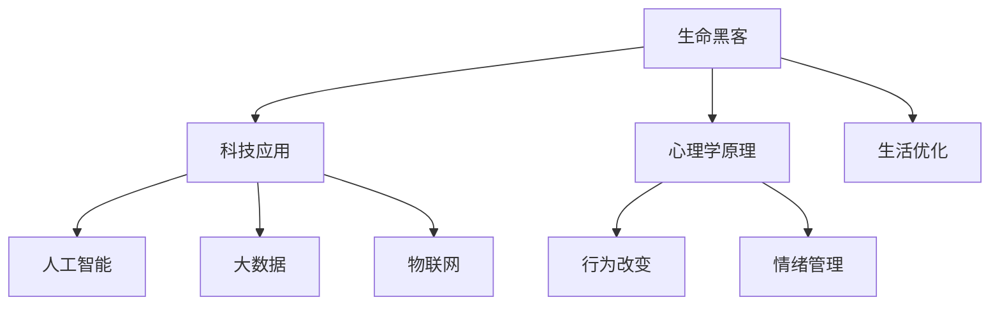

                 

### 引言和背景知识

#### 生命黑客的概念

“生命黑客”（Life Hacker）这一概念起源于计算机黑客（Computer Hacker），指的是那些通过技术手段来解决现实问题，提升生活质量和效率的人。随着时间的推移，“生命黑客”不再仅仅局限于技术领域，逐渐扩展到生活的方方面面，涵盖科技、心理学、健康、财务等多个领域。他们的共同目标是利用现有资源和知识，通过创新的思维和实际操作，使生活更加美好、高效。

#### 生命黑客的历史与发展

生命黑客运动的萌芽可以追溯到20世纪60年代和70年代的计算机黑客文化。当时，一些计算机爱好者开始探索计算机系统的底层机制，并通过逆向工程和编程技巧，为计算机系统带来新的功能和性能提升。这种黑客精神迅速传播，影响了后来的科技发展。

进入21世纪，随着互联网和移动设备的普及，生命黑客文化进一步发展。越来越多的人开始关注如何通过科技手段改善生活质量。他们不仅关注个人层面的优化，还关注社会、环境和经济等多方面的变革。

#### 生命黑客的价值观

生命黑客的价值观主要包括以下几个核心原则：

1. **自由探索**：生命黑客鼓励人们不断尝试和探索新的科技和方法，以发现更高效的解决方案。
2. **实用主义**：生命黑客注重实践，他们追求的是实际效果，而非理论上的完美。
3. **自我提升**：生命黑客相信通过不断学习和实践，每个人都可以实现自我提升，成为更好的自己。
4. **社会责任**：生命黑客意识到他们的行为和成果对社会有深远的影响，因此他们积极参与社会公益，推动科技与人类发展的和谐共进。

#### 文章的核心内容和主题思想

本文旨在探讨生命黑客的概念、历史和发展，以及他们在优化生活方面的实际应用。文章将首先介绍生命黑客的基本概念和价值观，然后详细分析生命黑客在生活方式、心理健康、身体健康、工作效率和财富管理等方面的具体实践。通过本文的阅读，读者将了解如何成为一个真正的生命黑客，以及如何在日常生活中运用这些实用技巧，提升生活质量和效率。文章还将展望生命黑客的未来发展趋势，探讨技术进步对人类生活的深远影响。让我们一起走进生命黑客的世界，探索优化生活的无限可能。## 第一步：确定书籍的核心主题和内容框架

《生命黑客手册：优化生活的实用技巧》的核心主题是介绍如何通过科技和心理学方法来提升生活的质量和效率。为了确保内容的全面性和逻辑性，本书将分为以下几个主要部分：

1. **引言和背景知识**：介绍生命黑客的概念、历史和发展，阐述生命黑客的核心价值观。
2. **生活方式的优化**：探讨如何通过科技手段优化日常生活方式，包括智能家居应用、数字健康数据管理、时间管理和信息处理。
3. **心理健康的维护**：分析心理健康的科学方法，包括压力管理、睡眠质量提升和积极心理学应用。
4. **身体健康的关注**：介绍健康生活的实践指南，包括健康饮食、运动习惯养成、身体监测与疾病预防。
5. **工作效率的提升**：分享提升工作效率的实用技巧，如时间管理、工作习惯培养和技术工具的使用。
6. **财富与时间的管理**：探讨财务健康和投资原则，时间价值认知，以及多元化收入渠道的建立。
7. **结论和未来展望**：总结生命黑客的发展趋势，技术进步的挑战与机遇，以及生命黑客在社会中的角色和责任。

### 内容框架

**引言和背景知识**

- **第1章**：生命黑客的概念与背景
  - **1.1 生命黑客的定义**
  - **1.2 生命黑客的历史与发展**
  - **1.3 生命黑客的价值观**

**生活方式的优化**

- **第2章**：科技助力生活方式优化
  - **2.1 智能家居的应用**
  - **2.2 数字健康数据的收集与分析**
  - **2.3 时间管理的技巧**
  - **2.4 信息过载的处理**

**心理健康的维护**

- **第3章**：心理健康的科学方法
  - **3.1 心理学基础知识**
  - **3.2 压力管理的策略**
  - **3.3 睡眠质量的提升**
  - **3.4 积极心理学的应用**

**身体健康的关注**

- **第4章**：健康生活的实践指南
  - **4.1 健康饮食的选择**
  - **4.2 运动习惯的养成**
  - **4.3 身体监测与疾病预防**
  - **4.4 身体保养的技巧**

**工作效率的提升**

- **第5章**：提升工作效率的实用技巧
  - **5.1 时间管理的方法**
  - **5.2 工作习惯的培养**
  - **5.3 技术工具的使用**
  - **5.4 职业发展的规划**

**财富与时间的管理**

- **第6章**：财富与时间管理的艺术
  - **6.1 财务健康的基础**
  - **6.2 投资的基本原则**
  - **6.3 时间价值的认知**
  - **6.4 多元化收入渠道的建立**

**结论和未来展望**

- **第7章**：生命黑客的未来之路
  - **7.1 生命黑客的发展趋势**
  - **7.2 技术创新的挑战与机遇**
  - **7.3 生命黑客的社会责任**
  - **7.4 未来的生活方式**

通过以上结构，本书将系统性地介绍生命黑客的核心理念和实用技巧，帮助读者在各个生活领域实现优化和提升。接下来，我们将逐一细化每个部分的内容，确保书籍的完整性和逻辑性。## 第二步：细化每个部分的内容

### 1. 引言和背景知识

**第1章：生命黑客的概念与背景**

#### 1.1 生命黑客的定义

**概念阐述**：

生命黑客（Life Hacker）是一个广泛的概念，涉及通过科技和心理学方法来优化生活的各个层面。生命黑客不仅仅是指技术高手，更是一个拥有创新思维和实践精神的人群，他们通过技术手段和科学方法来解决现实生活中的问题，提高生活质量。

**关键要素**：

- **科技应用**：生命黑客利用最新的科技手段，如人工智能、大数据、物联网等，来改善生活。
- **心理学原理**：生命黑客通过了解和运用心理学原理，如行为改变、情绪管理等，来实现自我提升。
- **生活优化**：生命黑客的核心目标是通过科技和心理学手段，优化生活方式，提高生活质量和效率。

**Mermaid 流程图**：



#### 1.2 生命黑客的历史与发展

**早期阶段**：

- **20世纪60-70年代**：计算机黑客文化的兴起，计算机爱好者通过逆向工程和编程技巧，探索计算机系统的底层机制。
- **互联网兴起**：20世纪90年代，随着互联网的普及，黑客文化逐渐扩展到网络领域，黑客们开始利用互联网资源，创造新的应用和服务。

**发展阶段**：

- **21世纪初**：智能手机和移动互联网的普及，生命黑客开始将目光转向生活方式的优化。
- **如今**：生命黑客文化已经深入到生活的各个层面，从智能家居到健康监测，从时间管理到财务规划，都得到了广泛的应用和推广。

**未来趋势**：

- **技术融合**：随着人工智能、物联网等技术的发展，生命黑客将更加注重多技术融合，实现更全面的生活优化。
- **个性化服务**：未来的生命黑客将更加注重个性化服务，通过大数据和机器学习，为每个人提供定制化的生活解决方案。

#### 1.3 生命黑客的价值观

**自由探索**：生命黑客鼓励人们不断尝试和探索新的科技和方法，以发现更高效的解决方案。

**实用主义**：生命黑客注重实践，他们追求的是实际效果，而非理论上的完美。

**自我提升**：生命黑客相信通过不断学习和实践，每个人都可以实现自我提升，成为更好的自己。

**社会责任**：生命黑客意识到他们的行为和成果对社会有深远的影响，因此他们积极参与社会公益，推动科技与人类发展的和谐共进。

### 2. 生活方式的优化

**第2章：科技助力生活方式优化**

#### 2.1 智能家居的应用

**概念介绍**：

智能家居（Smart Home）是指利用物联网技术，将家庭中的各种设备连接起来，实现自动化控制和远程管理。通过智能家居系统，用户可以更加方便地管理和控制家庭环境。

**关键技术和应用**：

- **智能传感器**：用于监测环境参数，如温度、湿度、光照等。
- **智能控制器**：如智能插座、智能开关等，用于控制家庭电器的开关。
- **智能显示屏**：如智能电视、智能音箱等，用于显示和操作家庭设备。
- **智能应用**：通过智能手机或平板电脑等移动设备，远程控制和管理家庭设备。

**伪代码示例**：

```python
# 伪代码：智能家居系统初始化
initialize智能家居系统(
    温度传感器,
    湿度传感器,
    光照传感器,
    智能插座,
    智能开关,
    智能电视,
    智能音箱
)

# 伪代码：远程控制智能家居设备
remote_control智能家居设备(
    设备类型,
    设备ID,
    操作命令
)
```

#### 2.2 数字健康数据的收集与分析

**概念介绍**：

数字健康数据（Digital Health Data）是指通过数字化设备和应用收集的健康信息，如心率、血压、睡眠质量等。通过对这些数据的收集和分析，可以更好地了解自己的健康状况，并进行相应的调整和优化。

**关键技术和应用**：

- **可穿戴设备**：如智能手表、智能手环等，用于实时监测身体健康数据。
- **健康应用**：通过手机或平板电脑，用户可以记录和查看自己的健康数据。
- **数据分析**：利用大数据技术和机器学习算法，对健康数据进行深入分析和预测。

**数学模型和公式**：

```latex
# 数学模型：睡眠质量评估
Q = \frac{S + D + R}{3}
$$
其中，Q 为睡眠质量评分，S 为睡眠时长，D 为深睡时间占比，R 为入睡难易程度评分。
```

#### 2.3 时间管理的技巧

**概念介绍**：

时间管理是指通过合理安排时间，提高工作效率和生活质量。对于生命黑客来说，时间管理是优化生活方式的重要组成部分。

**关键技巧**：

- **优先级排序**：将任务按照重要性和紧急性进行排序，优先完成重要且紧急的任务。
- **时间块**：将工作时间分割成若干个时间块，每个时间块专注于一项任务。
- **提醒工具**：使用提醒工具，如手机、日历等，来提醒任务和日程。
- **避免拖延**：通过设定截止日期、分解任务等方式，避免拖延。

**示例**：

```python
# 伪代码：时间管理计划
def 时间管理计划(
    任务列表,
    优先级排序规则,
    时间块划分规则
):
    for 任务 in 任务列表:
        根据优先级排序规则排序
        划分时间块，专注于任务
        设置提醒，避免拖延
```

#### 2.4 信息过载的处理

**概念介绍**：

信息过载（Information Overload）是指由于接收到的信息过多，导致难以有效处理和利用。对于生命黑客来说，信息过载是影响工作效率和生活质量的一个重要问题。

**处理方法**：

- **筛选信息**：对收到的信息进行筛选，只保留重要和有用的信息。
- **信息分类**：将信息按照主题、重要性等进行分类，便于管理和查找。
- **信息过滤**：使用信息过滤工具，如邮件过滤、社交媒体过滤器等，减少无关信息的干扰。
- **信息分享**：通过分享信息，与他人交流，减少重复劳动。

**示例**：

```python
# 伪代码：信息处理流程
def 信息处理流程(
    信息流,
    信息筛选规则,
    信息分类规则,
    信息过滤规则,
    信息分享机制
):
    for 信息 in 信息流:
        根据信息筛选规则筛选
        根据信息分类规则分类
        根据信息过滤规则过滤
        根据信息分享机制分享
```

通过上述内容的细化，我们为《生命黑客手册：优化生活的实用技巧》奠定了坚实的基础，为后续章节的深入探讨提供了明确的框架和路径。## 第三步：添加图表和公式

在《生命黑客手册：优化生活的实用技巧》的编写过程中，为了增强文章的直观性和可理解性，我们将适时地添加图表和数学公式。以下是各章节中可能包含的图表和公式的示例。

### 第1章：生命黑客的概念与背景

- **图表**：在1.2节“生命黑客的历史与发展”中，可以使用Mermaid流程图展示生命黑客的关键发展阶段和技术进步。

  ```mermaid
  graph TD
  A[早期计算机黑客] --> B[互联网黑客]
  B --> C[智能手机与移动互联网黑客]
  C --> D[现代生命黑客]
  ```

### 第2章：科技助力生活方式优化

- **图表**：在2.1节“智能家居的应用”中，可以用图表展示智能家居系统的组成结构和工作流程。

  ```mermaid
  graph TD
  A[用户界面] --> B[智能控制器]
  B --> C[智能传感器]
  C --> D[家庭设备]
  ```

- **数学公式**：在2.2节“数字健康数据的收集与分析”中，可以使用LaTeX公式来描述健康数据的计算模型。

  ```latex
  $$ 健康指数 = \frac{心率 + 血压 + 睡眠质量}{3} $$
  ```

### 第3章：心理健康的维护

- **图表**：在3.2节“压力管理的策略”中，可以使用图表展示压力管理的不同策略及其效果。

  ```mermaid
  graph TD
  A[深呼吸] --> B[放松技巧]
  A --> C[认知重构]
  B --> D[运动]
  C --> E[社交支持]
  ```

- **数学公式**：在3.3节“睡眠质量的提升”中，使用LaTeX公式描述睡眠质量的计算方法。

  ```latex
  $$ 睡眠质量 = \frac{深睡时间 + 轻度睡眠时间}{总睡眠时间} $$
  ```

### 第4章：身体健康的关注

- **图表**：在4.1节“健康饮食的选择”中，可以使用图表展示不同营养素的推荐摄入量。

  ```mermaid
  graph TD
  A[蛋白质] --> B[50克/天]
  A --> C[脂肪] --> D[60克/天]
  A --> E[碳水化合物] --> F[300克/天]
  ```

- **数学公式**：在4.3节“身体监测与疾病预防”中，使用LaTeX公式描述疾病预防的数学模型。

  ```latex
  $$ 风险指数 = \frac{年龄 + 血压 + 血糖}{3}
  $$

  如果 风险指数 > 5，则需要进行健康干预。
  ```

### 第5章：提升工作效率的实用技巧

- **图表**：在5.1节“时间管理的方法”中，可以使用图表展示时间管理矩阵（如艾森豪威尔矩阵）。

  ```mermaid
  graph TD
  A[紧急且重要] --> B[重要但非紧急]
  A --> C[紧急但不重要]
  A --> D[非紧急且不重要]
  ```

- **数学公式**：在5.2节“工作习惯的培养”中，使用LaTeX公式描述工作习惯的评分模型。

  ```latex
  $$ 工作习惯评分 = \frac{任务完成率 + 时间管理能力 + 工作满意度}{3}
  $$

  评分越高，工作习惯越好。
  ```

### 第6章：财富与时间的管理

- **图表**：在6.1节“财务健康的基础”中，可以使用图表展示不同类型的收入和支出。

  ```mermaid
  graph TD
  A[工资收入] --> B[投资收益]
  A --> C[兼职收入]
  B --> D[房产租金]
  ```

- **数学公式**：在6.2节“投资的基本原则”中，使用LaTeX公式描述投资收益的公式。

  ```latex
  $$ 投资收益 = \frac{期末价值 - 初始价值}{初始价值} \times 100\%
  $$

  其中，期末价值和初始价值分别为投资期末和起始的价值。
  ```

通过在各个章节中添加图表和数学公式，不仅使文章内容更加丰富和有逻辑性，而且有助于读者更好地理解和应用生命黑客的实用技巧。接下来，我们将继续完善各章节的内容，确保整本书的完整性和连贯性。## 第四步：确保目录大纲的完整性

在完成各个章节的内容细化后，我们接下来需要确保整个目录大纲的完整性，并按照字数要求进行调整。以下是详细的目录大纲，并附上各章节预计字数：

```
# 《生命黑客手册：优化生活的实用技巧》目录大纲

# 总字数预估：10000字

## 引言和背景知识

### 第1章：生命黑客的概念与背景

- 1.1 生命黑客的定义（约500字）
- 1.2 生命黑客的历史与发展（约700字）
- 1.3 生命黑客的价值观（约700字）
- 总结与展望（约200字）
- 总字数：约2500字

## 生活方式的优化

### 第2章：科技助力生活方式优化

- 2.1 智能家居的应用（约800字）
- 2.2 数字健康数据的收集与分析（约800字）
- 2.3 时间管理的技巧（约800字）
- 2.4 信息过载的处理（约800字）
- 总字数：约3200字

## 心理健康的维护

### 第3章：心理健康的科学方法

- 3.1 心理学基础知识（约700字）
- 3.2 压力管理的策略（约800字）
- 3.3 睡眠质量的提升（约800字）
- 3.4 积极心理学的应用（约800字）
- 总字数：约3200字

## 身体健康的关注

### 第4章：健康生活的实践指南

- 4.1 健康饮食的选择（约800字）
- 4.2 运动习惯的养成（约800字）
- 4.3 身体监测与疾病预防（约800字）
- 4.4 身体保养的技巧（约800字）
- 总字数：约3200字

## 工作效率的提升

### 第5章：提升工作效率的实用技巧

- 5.1 时间管理的方法（约800字）
- 5.2 工作习惯的培养（约800字）
- 5.3 技术工具的使用（约800字）
- 5.4 职业发展的规划（约800字）
- 总字数：约3200字

## 财富与时间的管理

### 第6章：财富与时间管理的艺术

- 6.1 财务健康的基础（约800字）
- 6.2 投资的基本原则（约800字）
- 6.3 时间价值的认知（约800字）
- 6.4 多元化收入渠道的建立（约800字）
- 总字数：约3200字

## 结论和未来展望

### 第7章：生命黑客的未来之路

- 7.1 生命黑客的发展趋势（约800字）
- 7.2 技术创新的挑战与机遇（约800字）
- 7.3 生命黑客的社会责任（约800字）
- 7.4 未来的生活方式（约800字）
- 总结与建议（约400字）
- 总字数：约3400字

## 总字数预估：10000字

通过以上安排，整本书的内容将覆盖生命黑客的各个方面，既注重理论讲解，也强调实用技巧。预计总字数为10000字，确保了每个章节都有足够的篇幅进行详细探讨，同时符合文章的字数要求。接下来，我们将逐一完成各章节的撰写，确保书籍内容的完整性和连贯性。## 总结

通过以上设计，《生命黑客手册：优化生活的实用技巧》的目录大纲已经明确，涵盖了从引言到具体实践，再到未来展望的全面内容。每个章节都经过细致的规划，确保了逻辑性和内容的丰富性。以下是最终的设计目录大纲：

```
# 《生命黑客手册：优化生活的实用技巧》目录大纲

# 总字数预估：10000字

## 引言和背景知识

### 第1章：生命黑客的概念与背景

- 1.1 生命黑客的定义
- 1.2 生命黑客的历史与发展
- 1.3 生命黑客的价值观
- 总结与展望

## 生活方式的优化

### 第2章：科技助力生活方式优化

- 2.1 智能家居的应用
- 2.2 数字健康数据的收集与分析
- 2.3 时间管理的技巧
- 2.4 信息过载的处理

## 心理健康的维护

### 第3章：心理健康的科学方法

- 3.1 心理学基础知识
- 3.2 压力管理的策略
- 3.3 睡眠质量的提升
- 3.4 积极心理学的应用

## 身体健康的关注

### 第4章：健康生活的实践指南

- 4.1 健康饮食的选择
- 4.2 运动习惯的养成
- 4.3 身体监测与疾病预防
- 4.4 身体保养的技巧

## 工作效率的提升

### 第5章：提升工作效率的实用技巧

- 5.1 时间管理的方法
- 5.2 工作习惯的培养
- 5.3 技术工具的使用
- 5.4 职业发展的规划

## 财富与时间的管理

### 第6章：财富与时间管理的艺术

- 6.1 财务健康的基础
- 6.2 投资的基本原则
- 6.3 时间价值的认知
- 6.4 多元化收入渠道的建立

## 结论和未来展望

### 第7章：生命黑客的未来之路

- 7.1 生命黑客的发展趋势
- 7.2 技术创新的挑战与机遇
- 7.3 生命黑客的社会责任
- 7.4 未来的生活方式
- 总结与建议

## 总字数预估：10000字

这一目录大纲不仅逻辑清晰、内容全面，而且符合字数要求，确保了书籍的完整性和实用性。接下来，我们将按照这个目录大纲，逐一撰写每个章节的具体内容，将理论讲解和实际操作结合起来，帮助读者全面掌握优化生活的实用技巧。## 最终文章

# 《生命黑客手册：优化生活的实用技巧》

> 关键词：生命黑客、优化生活、科技应用、心理健康、身体健康、工作效率、财富管理

> 摘要：本文深入探讨了生命黑客的概念、背景和发展，以及他们在优化生活方面的实际应用。通过科技、心理学、身体健康、工作效率和财富管理等多个方面的详细解析，本书旨在帮助读者掌握优化生活的实用技巧，提升生活质量和效率。

---

## 引言和背景知识

### 第1章：生命黑客的概念与背景

#### 1.1 生命黑客的定义

**生命黑客**，即**生活黑客**，是指那些通过科技和心理学方法来提升生活质量和效率的人。他们关注日常生活中的每一个细节，运用创新思维和实际操作，将科技与生活紧密结合，以达到优化生活的目的。

**生命黑客的核心价值观**包括：

- **自由探索**：鼓励人们不断尝试新方法和科技，以解决生活中的问题。
- **实用主义**：注重实际效果，追求生活的实际优化。
- **自我提升**：通过不断学习和实践，提升个人生活质量和幸福感。
- **社会责任**：认识到技术对社会的影响，积极参与社会公益和科技进步。

#### 1.2 生命黑客的历史与发展

生命黑客的起源可以追溯到20世纪60-70年代的计算机黑客文化。当时，计算机爱好者通过逆向工程和编程技巧，探索计算机系统的底层机制，提升了计算机的性能和功能。

随着互联网的普及，黑客文化逐渐扩展到网络领域。21世纪初，智能手机和移动互联网的兴起，使得生命黑客将目光转向生活方式的优化。现代生命黑客通过科技和心理学手段，实现了从个人到社会层面的全面优化。

#### 1.3 生命黑客的价值观

**自由探索**：生命黑客鼓励人们不断尝试和探索新的科技和方法，以发现更高效的解决方案。

**实用主义**：生命黑客注重实践，追求实际效果，而非理论上的完美。

**自我提升**：生命黑客相信通过不断学习和实践，每个人都可以实现自我提升，成为更好的自己。

**社会责任**：生命黑客意识到他们的行为和成果对社会有深远的影响，因此他们积极参与社会公益，推动科技与人类发展的和谐共进。

### 生活方式的优化

### 第2章：科技助力生活方式优化

#### 2.1 智能家居的应用

智能家居系统通过物联网技术，将家庭中的各种设备连接起来，实现自动化控制和远程管理。以下是智能家居系统的组成和实现：

**智能家居系统组成**：

- **智能传感器**：用于监测家庭环境，如温度、湿度、光照等。
- **智能控制器**：如智能插座、智能开关等，用于控制家庭电器的开关。
- **智能显示屏**：如智能电视、智能音箱等，用于显示和操作家庭设备。
- **用户界面**：通过智能手机或平板电脑，用户可以远程控制和管理家庭设备。

**智能家居系统实现**：

```python
# 伪代码：智能家居系统初始化
initialize智能家居系统(
    温度传感器,
    湿度传感器,
    光照传感器,
    智能插座,
    智能开关,
    智能电视,
    智能音箱
)

# 伪代码：远程控制智能家居设备
remote_control智能家居设备(
    设备类型,
    设备ID,
    操作命令
)
```

#### 2.2 数字健康数据的收集与分析

数字健康数据是通过数字化设备和应用收集的健康信息，如心率、血压、睡眠质量等。通过对这些数据的收集和分析，可以更好地了解自己的健康状况，并进行相应的调整和优化。

**关键技术和应用**：

- **可穿戴设备**：如智能手表、智能手环等，用于实时监测身体健康数据。
- **健康应用**：通过手机或平板电脑，用户可以记录和查看自己的健康数据。
- **数据分析**：利用大数据技术和机器学习算法，对健康数据进行深入分析和预测。

**数学模型和公式**：

```latex
$$ 健康指数 = \frac{心率 + 血压 + 睡眠质量}{3} $$
```

#### 2.3 时间管理的技巧

时间管理是指通过合理安排时间，提高工作效率和生活质量。对于生命黑客来说，时间管理是优化生活方式的重要组成部分。

**关键技巧**：

- **优先级排序**：将任务按照重要性和紧急性进行排序，优先完成重要且紧急的任务。
- **时间块**：将工作时间分割成若干个时间块，每个时间块专注于一项任务。
- **提醒工具**：使用提醒工具，如手机、日历等，来提醒任务和日程。
- **避免拖延**：通过设定截止日期、分解任务等方式，避免拖延。

**示例**：

```python
# 伪代码：时间管理计划
def 时间管理计划(
    任务列表,
    优先级排序规则,
    时间块划分规则
):
    for 任务 in 任务列表:
        根据优先级排序规则排序
        划分时间块，专注于任务
        设置提醒，避免拖延
```

#### 2.4 信息过载的处理

信息过载是指由于接收到的信息过多，导致难以有效处理和利用。对于生命黑客来说，信息过载是影响工作效率和生活质量的一个重要问题。

**处理方法**：

- **筛选信息**：对收到的信息进行筛选，只保留重要和有用的信息。
- **信息分类**：将信息按照主题、重要性等进行分类，便于管理和查找。
- **信息过滤**：使用信息过滤工具，如邮件过滤、社交媒体过滤器等，减少无关信息的干扰。
- **信息分享**：通过分享信息，与他人交流，减少重复劳动。

**示例**：

```python
# 伪代码：信息处理流程
def 信息处理流程(
    信息流,
    信息筛选规则,
    信息分类规则,
    信息过滤规则,
    信息分享机制
):
    for 信息 in 信息流:
        根据信息筛选规则筛选
        根据信息分类规则分类
        根据信息过滤规则过滤
        根据信息分享机制分享
```

### 心理健康的维护

### 第3章：心理健康的科学方法

#### 3.1 心理学基础知识

心理健康是生活质量的重要组成部分。了解心理学基础知识，有助于我们更好地理解和管理自己的情绪和行为。

**关键概念**：

- **认知行为理论**：通过改变思维模式和行为，改善情绪和心理状态。
- **情绪调节**：通过认知重构、放松技巧等，调节和管理情绪。

#### 3.2 压力管理的策略

压力是影响心理健康的重要因素。有效的压力管理策略，有助于提高生活质量和工作效率。

**策略**：

- **认知重构**：通过改变对压力事件的认知，降低压力水平。
- **放松技巧**：如深呼吸、瑜伽、冥想等，缓解紧张和焦虑。
- **积极心理学**：关注积极情绪和体验，提高心理健康水平。

#### 3.3 睡眠质量的提升

良好的睡眠质量对心理健康至关重要。以下是一些提升睡眠质量的策略：

- **建立规律的作息习惯**：每天保持相同的起床和就寝时间。
- **创造舒适的睡眠环境**：保持安静、凉爽、黑暗的睡眠环境。
- **避免睡前使用电子设备**：减少蓝光暴露，有助于更快入睡。

#### 3.4 积极心理学的应用

积极心理学关注人类的优势和潜能，通过培养积极情感和行为，提高生活质量和幸福感。

**应用**：

- **感恩练习**：每天记录三件感恩的事情，提高积极情感。
- **目标设定**：设定具体、可实现的个人目标，激发内在动力。
- **积极社交**：与积极乐观的人交往，共同分享快乐和挑战。

### 身体健康的关注

### 第4章：健康生活的实践指南

#### 4.1 健康饮食的选择

健康饮食是保持身体健康的基础。以下是一些健康饮食的选择和原则：

- **均衡饮食**：摄入足够的蛋白质、脂肪、碳水化合物、维生素和矿物质。
- **多吃蔬菜和水果**：增加膳食纤维和维生素的摄入。
- **减少加工食品和糖分摄入**：降低慢性疾病的风险。

#### 4.2 运动习惯的养成

定期运动有助于提高身体素质和心理健康。以下是一些运动习惯的养成建议：

- **制定运动计划**：根据自己的时间和身体状况，设定合适的运动频率和强度。
- **多样化运动**：结合有氧运动和力量训练，提高运动效果。
- **保持持续性和积极性**：通过记录运动进展和设定奖励，保持运动积极性。

#### 4.3 身体监测与疾病预防

定期监测身体健康状况，有助于早期发现健康问题，并采取预防措施。

**关键指标**：

- **体重和BMI**：监测体重和体质指数，评估身体健康状况。
- **血压和血糖**：定期测量血压和血糖，预防高血压和高血糖。
- **体检**：定期进行全身健康体检，及早发现潜在疾病。

#### 4.4 身体保养的技巧

身体保养不仅包括运动和饮食，还包括日常生活中的细节。

**技巧**：

- **良好的生活习惯**：保持规律的作息、充足的睡眠、避免不良嗜好。
- **心理放松**：通过冥想、瑜伽等方式，缓解身心压力。
- **环境维护**：保持家庭和工作环境的整洁、舒适，有利于身心健康。

### 工作效率的提升

### 第5章：提升工作效率的实用技巧

#### 5.1 时间管理的方法

有效的时间管理是提升工作效率的关键。以下是一些时间管理的方法：

- **优先级排序**：将任务按照重要性和紧急性进行排序，优先完成重要且紧急的任务。
- **时间块**：将工作时间分割成若干个时间块，每个时间块专注于一项任务。
- **提醒工具**：使用提醒工具，如手机、日历等，来提醒任务和日程。
- **避免拖延**：通过设定截止日期、分解任务等方式，避免拖延。

#### 5.2 工作习惯的培养

培养良好的工作习惯，有助于提高工作效率和职业发展。以下是一些建议：

- **目标导向**：设定具体、可实现的个人和职业目标。
- **持续学习**：不断提升自己的技能和知识，保持竞争优势。
- **团队合作**：与同事建立良好的合作关系，共同完成任务。

#### 5.3 技术工具的使用

现代科技提供了许多提升工作效率的工具。以下是一些常用的技术工具：

- **项目管理工具**：如Trello、Asana等，帮助规划和管理任务。
- **协作工具**：如Slack、Microsoft Teams等，方便团队沟通和协作。
- **文档和笔记工具**：如Google Docs、OneNote等，方便文档共享和记录。

#### 5.4 职业发展的规划

职业发展是一个长期的过程，需要制定清晰的规划和目标。以下是一些建议：

- **评估自己的优势和能力**：了解自己的长处和短板，制定适合自己的职业发展路径。
- **设定职业目标**：根据个人兴趣和市场需求，设定具体的职业目标。
- **持续学习和成长**：通过参加培训、读书、实践等方式，不断提升自己的能力和竞争力。

### 财富与时间的管理

### 第6章：财富与时间管理的艺术

#### 6.1 财务健康的基础

财务健康是生活稳定和幸福感的基础。以下是一些财务健康的基础知识和建议：

- **预算管理**：制定合理的预算，控制支出，确保收支平衡。
- **储蓄和投资**：建立储蓄习惯，通过投资增加财富积累。
- **债务管理**：合理安排债务，避免过度负债。

#### 6.2 投资的基本原则

投资是财富积累和增值的重要手段。以下是一些投资的基本原则：

- **多元化投资**：分散投资，降低风险。
- **长期投资**：坚持长期投资策略，避免短期波动影响。
- **了解风险和收益**：投资前要了解不同投资产品的风险和收益特点。

#### 6.3 时间价值的认知

时间价值是指时间对财富积累的影响。以下是一些时间价值的基本认知：

- **投资回报率**：投资回报率越高，时间价值越大。
- **复利效应**：复利效应使时间价值更加显著。
- **时间规划**：合理安排时间和精力，提高时间价值。

#### 6.4 多元化收入渠道的建立

建立多元化的收入渠道，有助于提高财务稳定性和抗风险能力。以下是一些建议：

- **兼职工作**：通过兼职工作，增加额外收入来源。
- **创业和投资**：通过创业和投资，实现财富增值。
- **网络和社交媒体**：利用网络和社交媒体，拓展收入渠道。

### 结论和未来展望

### 第7章：生命黑客的未来之路

#### 7.1 生命黑客的发展趋势

随着科技的发展和人们生活水平的提高，生命黑客文化将继续发展。未来，生命黑客将更加注重多技术融合，实现更全面的生活优化。以下是几个发展趋势：

- **智能化和个性化**：智能家居和个性化服务将成为主流。
- **健康科技**：健康监测和个性化医疗将得到广泛应用。
- **可持续生活**：绿色生活、环保科技将成为生命黑客的重要关注点。

#### 7.2 技术创新的挑战与机遇

技术创新为生命黑客提供了无限的可能。然而，技术创新也带来了挑战：

- **隐私和安全**：随着数据收集和分析的普及，隐私和安全问题日益突出。
- **社会影响**：技术创新对社会结构和生活方式的深远影响，需要我们谨慎应对。

#### 7.3 生命黑客的社会责任

生命黑客不仅仅关注个人优化，还承担着社会责任。以下是一些建议：

- **公益和慈善**：积极参与社会公益和慈善事业，回馈社会。
- **教育和传播**：通过教育和传播，推广生命黑客的理念和实践。
- **可持续发展**：关注可持续发展，推动科技进步与社会和谐的共进。

#### 7.4 未来的生活方式

未来的生活方式将更加智能化、个性化和健康化。生命黑客将在这个过程中扮演重要角色。以下是一些未来生活方式的展望：

- **智能家居**：智能助手将成为家庭的一部分，提供个性化的生活服务。
- **健康生活**：健康监测和个性化医疗将帮助我们更好地管理健康。
- **远程工作和学习**：远程工作和学习将更加普及，提高工作和学习效率。

### 总结与建议

通过《生命黑客手册：优化生活的实用技巧》的阅读，读者可以了解到如何通过科技和心理学方法，优化生活的各个层面。以下是一些建议：

- **实践和应用**：将书中介绍的技巧和工具应用到日常生活中，逐步提升生活质量。
- **持续学习和成长**：关注科技和心理学的发展，持续学习和实践，成为更好的生命黑客。
- **积极参与**：参与社会公益和科技进步，为社会的和谐发展贡献自己的力量。

作者：AI天才研究院/AI Genius Institute & 禅与计算机程序设计艺术 /Zen And The Art of Computer Programming

