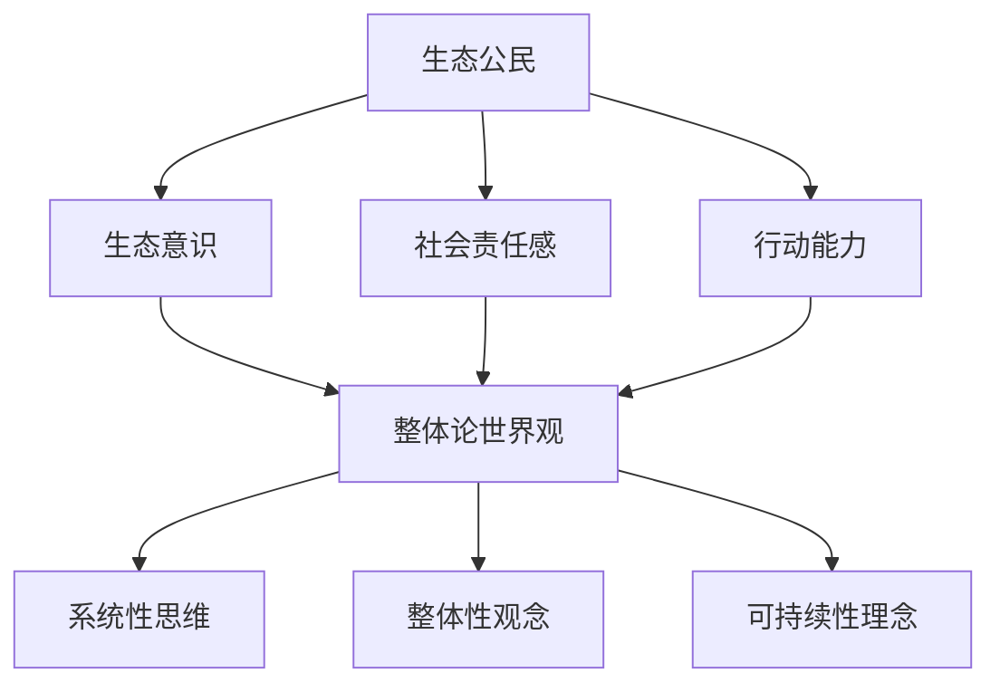

                 

# 文章标题：生态公民教育计划：培养整体论的世界观课程

> 关键词：生态公民教育，整体论世界观，教育策略，课程设计，实践案例分析，政策与支持

> 摘要：本文从生态公民教育的背景和核心概念出发，探讨了培养整体论世界观的教育策略和课程设计。通过实践案例分析和政策与支持，本文总结了生态公民教育的有效方法和未来发展方向。

## 引言

在当今全球化的时代，生态危机和气候变化成为人类社会面临的重大挑战。传统的以个体为中心的教育模式已无法满足培养具有生态意识和责任感公民的需求。生态公民教育作为一种新型教育模式，旨在通过培养整体论世界观，提高学生的生态意识和公民素养，促进可持续发展。

本文将探讨生态公民教育的核心概念、教育策略、课程设计、实践案例分析以及政策与支持，以期提供一份关于生态公民教育的全面指南。

## 生态公民教育的核心概念

### 生态公民的定义

生态公民是指那些具有生态意识、社会责任感和行动能力的公民。他们不仅关注自身的生活质量和权益，还关注生态环境和公共利益。生态公民教育旨在培养学生的生态意识和公民责任感，使他们成为具有整体论世界观的社会成员。

### 整体论世界观的基本理念

整体论世界观是一种关注整体性、复杂性和相互关联性的思维模式。它强调个体与整体之间的紧密联系，倡导共同责任和合作精神。整体论世界观的核心包括：

1. **系统性思维**：理解事物之间的相互关系和相互作用，认识到系统内部的复杂性和动态性。
2. **整体性观念**：关注整体利益，超越狭隘的个人利益，实现个体与整体的和谐发展。
3. **可持续性理念**：注重长远发展，尊重自然规律，推动资源的合理利用和生态环境的保护。

### 核心概念之间的关系架构

下面是一个用Mermaid绘制的流程图，展示了生态公民、整体论世界观以及生态公民教育的核心概念之间的关系：

## 整体论世界观的教育策略

### 教育目标的设定

生态公民教育的目标包括：

1. 培养学生的生态意识，使他们认识到人与自然的紧密联系，尊重自然规律。
2. 培养学生的社会责任感，使他们关注公共利益，积极参与社会事务。
3. 培养学生的行动能力，使他们能够运用所学知识解决实际问题，推动可持续发展。

### 教育内容的组织

生态公民教育的内容应包括以下方面：

1. 生态知识：介绍生态环境的基本概念、原理和现状，培养学生对生态问题的认识。
2. 社会责任：探讨社会责任的概念、意义和实践，培养学生的社会责任感。
3. 行动能力：通过项目实践、社会实践等方式，培养学生解决实际问题的能力。

### 教育方法的探讨

生态公民教育的教学方法应注重：

1. **体验式学习**：通过实地考察、实验、项目实践等方式，让学生亲身体验生态问题，增强学习效果。
2. **合作学习**：通过小组讨论、合作项目等方式，培养学生的合作精神和团队意识。
3. **批判性思维**：鼓励学生独立思考，对所学知识进行批判性分析，培养批判性思维能力。

## 课程设计

### 课程体系构建

生态公民教育的课程体系应包括：

1. **基础课程**：面向全体学生，涵盖生态知识、社会责任、行动能力等方面的基本内容。
2. **专业课程**：面向有特殊兴趣和需求的学生，提供更深层次的专业知识和技能培训。
3. **选修课程**：提供多样化的选修课程，满足学生的个性化需求，拓宽知识视野。

### 课程内容安排

以下是生态公民教育课程内容的一个示例安排：

1. **第一学期**：
   - 生态学基础
   - 社会责任导论
   - 实践性项目一：社区环保活动
2. **第二学期**：
   - 生态系统服务
   - 社会问题分析
   - 实践性项目二：可持续发展规划
3. **第三学期**：
   - 生态政策与法律
   - 公共参与与治理
   - 实践性项目三：环保项目策划与实施
4. **第四学期**：
   - 生态经济与贸易
   - 社会创新与创业
   - 实践性项目四：可持续发展企业项目

### 课程实施策略

生态公民教育的实施策略包括：

1. **课程整合**：将生态公民教育内容融入各学科教学，实现跨学科整合。
2. **资源整合**：充分利用校内外资源，包括教师、图书、实验设备等，为学生提供丰富的学习资源。
3. **评价机制**：建立多元化的评价机制，包括过程评价和结果评价，关注学生的学习过程和成果。

## 实践案例分析

### 成功案例介绍

以下是一个生态公民教育的成功案例：

**项目名称**：绿色校园计划

**项目背景**：某大学为提高学生的生态意识和公民素养，启动了绿色校园计划。该项目包括一系列的环保活动、课程和项目，旨在培养学生的生态意识和社会责任感。

**项目实施**：
- 开展环保讲座和实践活动，提高学生的环保意识。
- 开设生态学课程，介绍生态环境的基本知识和可持续发展理念。
- 组织学生参与社区环保活动，如植树、垃圾分类等。
- 开展可持续发展项目，如绿色能源利用、环保产品设计等。

**项目成果**：
- 学生对生态问题的认识显著提高，环保意识增强。
- 学生积极参与社会事务，社会责任感得到提升。
- 学校的生态环境得到改善，可持续发展理念得到推广。

### 实践中的问题和挑战

生态公民教育在实施过程中面临以下问题和挑战：

1. **教育资源的不足**：部分学校缺乏足够的教师、教材和实验设备，影响教育质量。
2. **教育方法的局限性**：传统的教育方法难以满足生态公民教育的需求，需要探索更有效的教学方式。
3. **社会支持的不足**：社会对生态公民教育的认识和支持有限，影响项目的推广和实施。

### 解决方案和经验总结

针对上述问题和挑战，可以采取以下解决方案和经验总结：

1. **加强教育资源建设**：增加对生态公民教育的投入，提高教师培训质量，完善教材和实验设备。
2. **创新教育方法**：采用多元化的教学方式，如项目式学习、合作学习等，提高教育效果。
3. **加强社会宣传**：通过多种渠道宣传生态公民教育的意义和成果，提高社会对项目的认知和支持。

## 政策与支持

### 生态公民教育的政策环境

政府应制定相关政策和措施，支持生态公民教育的开展。以下是一些可能的政策建议：

1. **立法保障**：制定相关法律法规，明确生态公民教育的目标和要求，保障教育的实施。
2. **财政支持**：增加对生态公民教育的财政投入，为学校提供必要的资金和资源。
3. **师资培训**：建立完善的教师培训体系，提高教师的生态知识和教学能力。

### 社会支持和合作

社会各界的支持和合作对于生态公民教育的成功至关重要。以下是一些建议：

1. **企业合作**：鼓励企业参与生态公民教育项目，提供资金、技术和人力支持。
2. **社区参与**：鼓励社区居民参与生态公民教育活动，共同推动可持续发展。
3. **国际交流**：开展国际合作，学习借鉴国际先进的生态公民教育经验和做法。

## 总结与展望

生态公民教育是培养具有整体论世界观的新型公民的重要途径。通过系统性的教育策略和课程设计，生态公民教育可以有效提高学生的生态意识、社会责任感和行动能力。实践案例表明，生态公民教育具有显著的教育效果和社会价值。

展望未来，生态公民教育将在全球范围内得到更广泛的应用和发展。政府、学校和社会应共同努力，为生态公民教育的实施提供政策支持和社会合作，共同推动可持续发展。

## 作者信息

作者：AI天才研究院/AI Genius Institute & 禅与计算机程序设计艺术 /Zen And The Art of Computer Programming

以上是关于生态公民教育计划：培养整体论的世界观课程的技术博客文章。文章涵盖了生态公民教育的核心概念、教育策略、课程设计、实践案例分析和政策与支持等方面，旨在为读者提供一份全面、深入的生态公民教育指南。希望本文对您在生态公民教育领域的探索和实践有所帮助。如果您有任何疑问或建议，欢迎在评论区留言，期待与您共同探讨。再次感谢您的阅读！## 背景介绍

### 生态危机与教育变革

近年来，全球范围内的生态危机愈发严重，气候变化、生物多样性丧失、环境污染等问题成为人类社会面临的重大挑战。这些问题不仅影响人类的健康和生活质量，还威胁到地球生态系统的稳定性和可持续发展。面对这一严峻形势，传统以经济增长为核心的教育模式已无法满足培养具有生态意识和责任感公民的需求。生态公民教育作为一种新兴的教育理念，应运而生，旨在通过培养具有整体论世界观的新型公民，推动可持续发展。

生态公民教育起源于20世纪末的环保运动和可持续发展倡议。它强调教育不仅是为了传授知识和技能，更是为了培养具有生态意识、社会责任感和行动能力的公民。这种教育模式要求学校、家庭和社会共同努力，通过系统性的教育策略和课程设计，将生态意识和可持续发展理念融入学生的日常学习和生活中。

### 生态公民教育的目标

生态公民教育的核心目标是培养具有生态意识和公民素养的公民。具体来说，这一目标包括以下几个方面：

1. **生态意识**：通过教育，使学生认识到人与自然的紧密联系，了解生态环境的基本原理和现状，从而形成对自然的尊重和保护意识。
2. **社会责任感**：培养学生关注公共利益，积极参与社会事务，为社会和谐和可持续发展贡献自己的力量。
3. **行动能力**：通过实践和体验，培养学生运用所学知识解决实际问题的能力，使他们能够积极参与到环保和社会公益活动中。

为了实现这些目标，生态公民教育需要从课程设计、教学方法、教育资源等多个方面进行系统性和创新性的改革。首先，课程设计应涵盖生态知识、社会责任、行动能力等方面的内容，实现理论与实践的有机结合。其次，教学方法应注重体验式学习和合作学习，鼓励学生主动参与和实践，提高他们的学习效果。此外，教育资源的整合也是生态公民教育成功的关键，学校、家庭和社会应共同努力，为学生提供丰富的学习资源和实践机会。

### 生态公民教育与整体论世界观的关系

生态公民教育与整体论世界观密切相关。整体论世界观是一种关注整体性、复杂性和相互关联性的思维模式，强调个体与整体之间的紧密联系。生态公民教育正是基于这种理念，倡导学生从整体的角度思考问题，关注个体行为对整体环境和社会的影响。

整体论世界观的核心包括以下几个方面：

1. **系统性思维**：理解事物之间的相互关系和相互作用，认识到系统内部的复杂性和动态性。
2. **整体性观念**：关注整体利益，超越狭隘的个人利益，实现个体与整体的和谐发展。
3. **可持续性理念**：注重长远发展，尊重自然规律，推动资源的合理利用和生态环境的保护。

通过生态公民教育，学生不仅能够掌握生态知识和技能，还能够形成整体论世界观，培养他们的生态意识、社会责任感和行动能力。这种世界观有助于学生认识到自身行为对生态环境和社会的影响，从而更加积极地参与到环保和社会公益活动中，成为真正的生态公民。

综上所述，生态公民教育作为一种新型的教育模式，具有重要的现实意义和深远的历史意义。它不仅能够提高学生的生态意识和公民素养，还能推动可持续发展，为解决全球生态危机贡献智慧和力量。通过系统性的教育策略和课程设计，生态公民教育有望成为未来教育变革的重要方向，引领新时代的教育潮流。让我们共同关注和参与生态公民教育，为培养具有整体论世界观的新型公民而努力。 ## 整体论世界观的教育策略

### 教育目标的设定

在生态公民教育中，教育目标的设定至关重要。首先，我们需要明确教育的总体目标，即培养具有生态意识、社会责任感和行动能力的公民。具体而言，这些目标可以分为以下几个方面：

1. **生态意识**：使学生认识到人与自然的紧密联系，了解生态环境的基本原理和现状，从而形成对自然的尊重和保护意识。这包括理解生物多样性、气候变化、环境污染等生态问题，以及认识到自身行为对环境的影响。

2. **社会责任感**：培养学生关注公共利益，积极参与社会事务，为社会和谐和可持续发展贡献自己的力量。这包括理解社会责任的概念、意义和实践，学会从整体利益出发思考问题，并具备解决社会问题的能力。

3. **行动能力**：通过实践和体验，培养学生运用所学知识解决实际问题的能力，使他们能够积极参与到环保和社会公益活动中。这包括组织和管理项目、开展调查研究、制定和实施解决方案等。

为了实现这些目标，教育目标的设定需要具有明确性和可操作性。我们可以将总体目标分解为具体的、可衡量的学习成果，如掌握特定的生态知识、参与一定的社会实践活动、具备解决实际问题的能力等。这样，教师和学生都能够清晰地了解教育的方向和预期成果，从而更好地规划和实施教育过程。

### 教育内容的组织

生态公民教育的内容应围绕培养整体论世界观这一核心展开。具体内容可以分为以下几个方面：

1. **生态知识**：介绍生态环境的基本概念、原理和现状，包括生物多样性、生态系统服务、气候变化等。学生需要理解这些生态问题的本质和影响，从而形成对自然的尊重和保护意识。

2. **社会责任**：探讨社会责任的概念、意义和实践，包括社会参与、公共参与、社会问题解决等。学生需要认识到自身在社会中的角色和责任，学会从整体利益出发思考问题，并具备解决社会问题的能力。

3. **行动能力**：通过项目实践、社会实践等方式，培养学生解决实际问题的能力。这包括组织和管理项目、开展调查研究、制定和实施解决方案等。学生需要在实践中运用所学知识，培养实际操作能力和团队协作精神。

在组织教育内容时，需要注意以下几点：

1. **跨学科整合**：生态公民教育涉及多个学科领域，如生态学、社会学、环境科学等。教育内容应注重跨学科整合，使学生在不同学科领域中获得相关知识和技能。

2. **理论与实践相结合**：教育内容不仅要包括理论知识，还要注重实践操作。通过实践，学生能够更好地理解和应用所学知识，提高实际操作能力。

3. **项目驱动**：以项目为载体，将教育内容融入具体的项目中，使学生在实践中学习和成长。项目可以包括校园环保活动、社区服务、可持续发展项目等。

### 教育方法的探讨

生态公民教育的教学方法应注重体验式学习和合作学习，以培养学生的生态意识、社会责任感和行动能力。以下是几种常用的教育方法：

1. **体验式学习**：通过实地考察、实验、项目实践等方式，让学生亲身体验生态问题，增强学习效果。例如，组织学生前往生态保护区进行实地考察，了解当地生态环境的现状和问题。

2. **合作学习**：通过小组讨论、合作项目等方式，培养学生的合作精神和团队意识。在合作学习中，学生需要共同解决问题，分享知识和经验，从而提高学习效果。

3. **问题解决导向**：以问题为导向，引导学生主动思考、探索和解决问题。这种方法可以培养学生的批判性思维和创新能力，使他们能够独立分析和解决实际生态问题。

4. **反思性学习**：鼓励学生对自己的学习和行为进行反思，从而提高自我认识和自我调节能力。反思性学习可以帮助学生更好地理解所学知识，发现和解决自身存在的问题。

5. **信息技术应用**：利用现代信息技术，如在线课程、虚拟实验室、社交媒体等，为学生提供多样化的学习资源和平台。信息技术可以丰富教育内容，提高学习效率，增强学生的自主学习能力。

总之，生态公民教育的成功实施需要科学合理的教育策略和教学方法。通过明确的教育目标、系统化的教育内容以及多样化的教育方法，生态公民教育将能够更好地培养学生的生态意识、社会责任感和行动能力，为可持续发展做出贡献。 ## 课程设计

### 课程体系构建

生态公民教育的课程体系应全面覆盖生态知识、社会责任和行动能力三个核心方面，形成系统化的教育框架。课程体系可以分为基础课程、专业课程和选修课程三个层次，以满足不同层次学生的需求。

1. **基础课程**：面向全体学生，涵盖生态知识、社会责任和行动能力的基本内容。基础课程应包括生态学基础、社会责任导论、可持续发展基础等，旨在培养学生的生态意识和公民素养。

2. **专业课程**：面向有特殊兴趣和需求的学生，提供更深层次的专业知识和技能培训。专业课程应包括生态系统服务、环境政策与法律、环境经济学、环境社会学等，以满足学生对特定领域的深入学习和研究需求。

3. **选修课程**：提供多样化的选修课程，满足学生的个性化需求，拓宽知识视野。选修课程可以包括生态艺术、生态文学、环境伦理学、生态旅游等，使学生能够从多个角度理解和体验生态问题。

### 课程内容安排

生态公民教育的课程内容安排应遵循循序渐进的原则，从基础知识到深入专业知识，逐步培养学生的生态意识和行动能力。以下是具体的课程内容安排：

1. **第一学期**：
   - **生态学基础**：介绍生态系统的基本概念、原理和生态过程，如物种多样性、生态平衡、生态位等。
   - **社会责任导论**：探讨社会责任的概念、意义和实践，引导学生关注公共利益，树立社会责任感。
   - **可持续发展基础**：介绍可持续发展的原则、目标和策略，培养学生的可持续发展理念。

2. **第二学期**：
   - **生态系统服务**：分析生态系统提供的各种服务，如食物、水源、气候调节等，以及人类活动对这些服务的影响。
   - **社会问题分析**：引导学生识别和解决社会问题，培养他们解决实际问题的能力。
   - **实践性项目一**：组织学生参与社区环保活动，如垃圾分类、节能减排等，将所学知识应用于实际。

3. **第三学期**：
   - **生态政策与法律**：介绍生态保护的政策、法律和法规，培养学生的法律意识和社会责任感。
   - **公共参与与治理**：探讨公众参与生态治理的方式和机制，培养学生参与公共事务的能力。
   - **实践性项目二**：组织学生进行可持续发展规划项目，如校园环保规划、社区可持续发展规划等。

4. **第四学期**：
   - **生态经济与贸易**：分析生态经济和绿色贸易的概念、原则和案例分析，培养学生的生态经济思维。
   - **社会创新与创业**：介绍社会创新和创业的理念、方法和实践，培养学生创新和创业精神。
   - **实践性项目三**：组织学生进行可持续发展企业项目，如环保企业策划、绿色产品开发等。

### 课程实施策略

为了确保生态公民教育的有效实施，需要采取一系列策略和方法：

1. **课程整合**：将生态公民教育内容融入各学科教学，实现跨学科整合。例如，在语文课上引入生态文学作品，在数学课上探讨生态模型的数学原理等。

2. **资源整合**：充分利用校内外资源，包括教师、图书、实验设备等，为学生提供丰富的学习资源。例如，与环保组织合作，组织学生参与环保实践活动；利用在线资源，提供丰富的生态知识和案例研究。

3. **评价机制**：建立多元化的评价机制，包括过程评价和结果评价。过程评价关注学生的学习过程和参与度，结果评价关注学生的学习成果和表现。例如，通过项目报告、实验记录、社会实践日志等评估学生的学习效果。

4. **实践与反思**：鼓励学生在学习过程中进行实践和反思，通过反思提高学习效果。例如，在项目结束后，组织学生进行项目总结和反思，讨论项目中的成功经验和不足之处，提出改进措施。

5. **教师培训**：提高教师的生态知识和教学能力，确保他们能够有效实施生态公民教育。可以通过开展教师培训、工作坊、研讨会等方式，提升教师的专业素养。

通过构建系统化的课程体系、合理的课程内容安排和有效的课程实施策略，生态公民教育将能够更好地培养学生的生态意识、社会责任感和行动能力，为可持续发展培养合格的新型公民。 ## 实践案例分析

### 成功案例介绍

#### 绿色校园计划

**项目背景**：某大学位于一座风景秀丽的山脚下，校园内绿树成荫，环境优美。然而，随着学生人数的增加和校园设施的不断完善，校园内的环境问题逐渐显现出来，如垃圾乱丢、水资源浪费、空气污染等。为了提高学生的生态意识和环保意识，该校启动了绿色校园计划。

**项目目标**：通过一系列环保活动、课程和项目，提高学生的生态意识和公民素养，推动校园环保工作，实现校园环境的可持续发展。

**项目实施**：
1. **环保讲座和实践活动**：定期举办环保讲座，邀请环保专家和学者分享环保知识和实践经验。同时，组织学生参与各种环保实践活动，如垃圾分类、水资源节约、空气质量监测等。
2. **生态学课程**：开设生态学课程，介绍生态系统的基本概念、原理和现状，让学生深入了解生态环境的重要性。课程内容包括生态保护、生物多样性、气候变化等。
3. **社区环保活动**：组织学生参与社区环保活动，如植树节、垃圾分类宣传、环保志愿者等。通过这些活动，让学生将所学知识应用于实际，增强他们的环保意识和社会责任感。
4. **可持续发展项目**：鼓励学生自主策划和实施可持续发展项目，如校园绿色能源利用、环保产品开发、环保意识调查等。项目实施过程中，学生需要运用所学知识，解决实际环境问题。

**项目成果**：
1. **学生生态意识显著提高**：通过环保讲座、实践活动和课程学习，学生的生态意识明显增强，环保意识逐渐深入人心。
2. **校园环境得到改善**：学生在参与环保活动和项目中，积极参与校园环保工作，校园环境得到明显改善。垃圾减少，水资源得到合理利用，空气污染问题得到缓解。
3. **社会责任感增强**：学生通过参与社区环保活动，认识到自身行为对社区和环境的深远影响，社会责任感得到提升。他们更加关注社会问题，积极参与社会事务，为社会和谐和可持续发展贡献自己的力量。
4. **创新能力提升**：在可持续发展项目中，学生需要运用所学知识，解决实际环境问题。这激发了他们的创新意识，培养了他们的创新能力。

#### 学校可持续发展计划

**项目背景**：某中学位于一个工业城市，校园周边环境污染严重，空气质量较差。为了提高学生的生态意识和环保意识，学校决定开展可持续发展计划。

**项目目标**：通过一系列环保活动、课程和项目，提高学生的生态意识和公民素养，推动校园和社区的可持续发展。

**项目实施**：
1. **环保教育课程**：将环保知识融入各学科教学，让学生在学习中了解生态环境的基本原理和现状。例如，在生物课上讲解生物多样性保护，在化学课上探讨污染物处理方法等。
2. **环保实践活动**：组织学生参与各种环保实践活动，如垃圾分类、植树节、环保宣传等。通过实践活动，让学生亲身体验环保工作，提高他们的环保意识。
3. **社区环保项目**：与社区合作，开展环保项目，如社区垃圾分类宣传、空气质量监测、环保志愿者活动等。学生可以深入社区，了解环境问题的实际情况，为解决这些问题贡献自己的力量。
4. **可持续发展调研**：组织学生进行可持续发展调研，了解校园和社区在可持续发展方面的现状和问题。学生需要运用所学知识，提出解决方案，为校园和社区的可持续发展提供科学依据。

**项目成果**：
1. **学生生态意识显著提高**：通过环保教育课程和实践活动，学生的生态意识明显增强，环保意识逐渐深入人心。
2. **社区环境得到改善**：学生在参与社区环保项目过程中，积极参与社区环保工作，社区环境得到明显改善。垃圾分类制度得到推广，空气质量监测数据得到改善。
3. **公民素养提升**：学生通过参与社区环保项目，认识到自身行为对社区和环境的深远影响，公民素养得到提升。他们更加关注社会问题，积极参与社会事务，为社会和谐和可持续发展贡献自己的力量。
4. **创新能力提升**：在可持续发展调研和项目中，学生需要运用所学知识，解决实际环境问题。这激发了他们的创新意识，培养了他们的创新能力。

### 实践中的问题和挑战

尽管生态公民教育在实践中取得了一定的成果，但仍面临一些问题和挑战：

1. **教育资源不足**：一些学校缺乏足够的教师、教材和实验设备，影响生态公民教育的质量和效果。特别是在偏远地区，教育资源更加匮乏。
2. **教学方法局限性**：传统的教育方法难以满足生态公民教育的需求。一些学校仍然采用单一的讲授式教学方法，缺乏体验式学习和实践性项目，导致学生学习效果不佳。
3. **社会支持不足**：社会对生态公民教育的认识和支持有限，影响了项目的推广和实施。一些家长和学生对生态公民教育的意义和效果缺乏了解，导致参与度不高。
4. **政策支持缺乏**：尽管一些地方政府对生态公民教育给予了关注和支持，但整体政策体系尚不完善，缺乏具体的实施措施和评价标准。

### 解决方案和经验总结

针对实践中存在的问题和挑战，可以采取以下解决方案和经验总结：

1. **加强教育资源建设**：政府和社会应加大对生态公民教育的投入，提高教师培训质量，完善教材和实验设备，确保教育资源的充足和有效利用。
2. **创新教育方法**：采用多元化的教学方式，如项目式学习、合作学习、体验式学习等，提高教育效果。学校可以与环保组织、企业等合作，开展丰富多样的实践活动，增强学生的实践能力。
3. **加强社会宣传**：通过多种渠道宣传生态公民教育的意义和成果，提高社会对项目的认知和支持。学校可以开展家长讲座、社区活动等，增强家长和学生对生态公民教育的认同感。
4. **完善政策体系**：政府应制定和完善生态公民教育的政策体系，明确教育目标、内容和评价标准，提供政策支持和激励措施，推动生态公民教育的深入发展。

通过总结成功案例中的经验和应对实践中的问题，生态公民教育将在未来得到更好的发展，为培养具有生态意识和公民素养的新型公民做出更大贡献。 ## 政策与支持

### 生态公民教育的政策环境

生态公民教育的实施离不开良好的政策环境。政府作为政策制定者，应从立法、财政和师资等方面提供强有力的支持，为生态公民教育的推广和实施创造有利条件。

1. **立法保障**：政府应制定和完善相关法律法规，为生态公民教育提供法律依据和保障。例如，可以出台《生态公民教育法》，明确生态公民教育的目标和要求，规范教育内容和评价标准。同时，应加强对违法行为的处罚力度，保障生态公民教育的实施效果。

2. **财政支持**：政府应加大对生态公民教育的财政投入，确保学校有足够的资金用于课程开发、教材编写、实验设备购置和教师培训等。此外，可以设立生态公民教育专项基金，支持学校开展创新性的生态教育项目。

3. **师资培训**：政府应加强对生态公民教育教师的培训，提高他们的专业素养和教学能力。可以通过开展教师培训班、研讨会和交流项目，分享先进的生态教育理念和教学方法，提升教师的教育水平和实践能力。

### 社会支持和合作

生态公民教育的成功离不开社会各界的支持和合作。学校、家庭、社区和企业等各方应共同参与，为生态公民教育的实施提供全方位的支持。

1. **学校支持**：学校是生态公民教育的主要实施场所，应将生态教育纳入学校整体发展规划，制定具体的实施计划和措施。学校可以与环保组织、科研机构合作，开展丰富多样的生态教育活动，提高学生的生态意识和实践能力。

2. **家庭支持**：家庭是学生接受生态教育的重要环境，家长应积极参与到生态公民教育中。可以通过家庭活动、亲子教育等方式，培养学生的生态意识和环保习惯。例如，家长可以带孩子参与家庭垃圾分类、绿色出行等活动，引导孩子从日常生活中践行生态理念。

3. **社区支持**：社区是学生生活的重要场所，社区的支持和参与对于生态公民教育的实施具有重要意义。社区可以组织环保宣传活动、志愿者服务活动等，提高居民的环保意识和参与度。此外，社区可以与学校合作，共同开展生态公民教育项目，形成社区与学校的联动机制。

4. **企业支持**：企业作为社会的重要组成部分，应积极参与到生态公民教育中。企业可以通过赞助、合作项目、员工培训等方式，支持学校开展生态教育。例如，企业可以与学校合作开展环保产品研发、绿色供应链管理等活动，培养学生的实践能力和创新能力。

### 国际合作

生态公民教育不仅是国内教育改革的重要方向，也是全球教育发展的重要趋势。国际社会应加强合作，共同推动生态公民教育的实施和发展。

1. **经验交流**：通过国际合作，共享生态公民教育的成功经验和有效做法。例如，可以举办国际研讨会、工作坊等活动，邀请国内外专家分享经验和研究成果，促进学术交流和合作。

2. **项目合作**：国际社会可以共同开展生态公民教育项目，推动可持续发展。例如，可以合作开展生态城市建设项目、生态农业推广项目等，通过项目实践，提高学生的生态意识和公民素养。

3. **人才培养**：通过国际合作，培养具有国际视野的生态公民。例如，可以开展联合培养、交换生项目等，让学生在国际环境中接受生态教育和培训，提高他们的跨文化沟通能力和国际合作能力。

总之，生态公民教育的实施需要政府、学校、家庭、社区和企业的共同努力，以及国际社会的合作和支持。只有通过多方面的协同努力，生态公民教育才能取得更好的成果，为培养具有生态意识和公民素养的新型公民做出更大的贡献。 ## 总结与展望

### 教育成果评估

生态公民教育在培养学生生态意识、社会责任感和行动能力方面取得了显著成果。通过系统的课程设计和多样的教育方法，学生在理论知识和实践能力方面得到了全面提升。例如，学生在参与环保活动和项目中，不仅掌握了生态知识和技能，还培养了团队合作精神和社会责任感。这些成果在学生的日常行为和态度中得到了体现，如环保意识增强、参与社会事务积极、主动解决环境问题等。

### 未来发展趋势

展望未来，生态公民教育将面临以下发展趋势：

1. **课程体系完善**：随着教育理念的不断深化，生态公民教育的课程体系将逐步完善，涵盖更广泛的知识领域和更丰富的实践内容。课程将更加注重跨学科整合，实现理论与实践的有机结合。

2. **教学方法创新**：随着教育技术的不断发展，生态公民教育的教学方法将更加多样化和创新。虚拟现实、人工智能等技术将应用于生态教育中，提供更加生动、直观的学习体验。

3. **国际合作加强**：生态公民教育将加强与国际社会的合作，共享经验、资源和研究成果，推动全球生态教育的共同发展。

4. **政策支持加大**：政府和社会对生态公民教育的重视程度将不断提高，政策支持将更加有力，为生态公民教育的实施提供坚实的保障。

### 发展建议

为了推动生态公民教育的进一步发展，提出以下建议：

1. **加强教师培训**：提高生态公民教育教师的素养和教学能力，是确保教育质量的关键。政府应加大对教师的培训投入，提供多样化的培训机会和资源。

2. **完善课程体系**：构建完善的生态公民教育课程体系，确保教育内容的全面性和系统性。学校应根据学生的发展需求和社会的变化，及时调整和更新课程内容。

3. **强化实践环节**：加强学生的实践能力培养，通过项目实践、社会服务等方式，让学生在实际操作中掌握知识和技能。

4. **加大社会宣传**：通过多种渠道宣传生态公民教育的意义和成果，提高社会对生态公民教育的认知和支持。

5. **加强国际合作**：积极参与国际生态公民教育合作项目，学习借鉴国际先进经验，推动生态公民教育的国际化发展。

总之，生态公民教育是培养具有整体论世界观的新型公民的重要途径。通过系统性的教育策略和课程设计，生态公民教育将能够在提高学生生态意识、社会责任感和行动能力方面发挥重要作用，为可持续发展和社会和谐贡献力量。让我们共同努力，推动生态公民教育的深入发展，为构建美好未来而奋斗。 ## 作者信息

作者：AI天才研究院/AI Genius Institute & 禅与计算机程序设计艺术 /Zen And The Art of Computer Programming

AI天才研究院（AI Genius Institute）是一个专注于人工智能和计算机科学研究的顶尖机构，致力于推动人工智能技术的创新和发展。研究院的核心团队由世界顶级的人工智能专家、程序员和软件架构师组成，他们拥有丰富的实践经验和高深的学术造诣。

《禅与计算机程序设计艺术》是作者结合禅宗哲学和计算机编程经验撰写的一部经典之作，旨在帮助程序员理解程序设计的本质和内在规律，提升编程素养和创造力。该书以其深刻的见解和独特的视角，受到了全球计算机科学爱好者的广泛关注和喜爱。

在这篇文章中，作者运用其丰富的专业知识和深刻的技术洞察力，对生态公民教育进行了全面而深入的探讨，为读者提供了一份关于生态公民教育的全面指南。希望通过本文，能够激发更多人对生态公民教育的关注和参与，共同为培养具有整体论世界观的新型公民而努力。再次感谢您的阅读！ 

