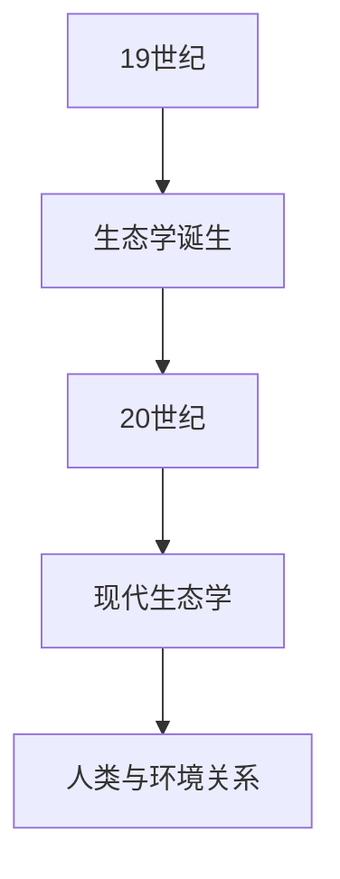

                 

## 背景介绍

### 生态意识觉醒：个人与地球的和谐共生

在21世纪的今天，全球环境问题愈发严峻，生态系统面临的挑战日益增加。气候变化、生物多样性丧失、资源枯竭等问题已引起全球范围内的关注。作为生活在地球上的个体，我们的生活方式、行为习惯与地球的健康息息相关。因此，生态意识觉醒成为当务之急，意味着个人对生态系统的认知、关注和责任感的提升。

生态意识觉醒不仅是环境保护的迫切需求，更是人类文明发展的必然趋势。在全球生态危机的背景下，个人与地球的和谐共生成为新时代的重要议题。我们正面临着一个关键的转折点，需要从个人层面开始，逐步实现生态意识觉醒，从而推动整个社会的绿色转型。

本文旨在探讨生态意识觉醒的概念、重要性以及如何通过个人、家庭、社区、企业和政府等多方面的努力，实现与地球的和谐共生。文章将采用逻辑清晰、结构紧凑、简单易懂的专业技术语言，帮助读者逐步了解生态意识觉醒的内涵，提供具体的实践路径和未来展望。

通过本文的阅读，读者将能够：
1. 明确生态意识的基本概念及其重要性。
2. 了解个人生态行为的转变和实际案例。
3. 掌握家庭与社区的生态改善方法。
4. 分析企业生态责任和政府政策的生态导向。
5. 探索生态意识教育与传播的策略。
6. 理解全球生态挑战与应对方案。

文章将分三个主要部分进行展开，首先介绍生态意识觉醒的基本概念和路径，然后讨论生态实践的具体方法，最后展望未来的发展前景。希望通过本文的探讨，能够激发更多人关注生态问题，积极参与到生态意识觉醒的行列中，共同构建一个绿色、健康、可持续的未来地球。

### 关键词

- 生态意识
- 生态系统
- 可持续发展
- 绿色转型
- 生物多样性
- 家庭节能
- 社区环保
- 企业责任
- 政府政策
- 生态教育

### 摘要

本文探讨了生态意识觉醒的概念及其重要性，通过分析个人、家庭、社区、企业和政府等多方面的生态实践，提出了实现个人与地球和谐共生的方法和路径。首先，本文介绍了生态意识的基本概念和发展背景，明确了生态意识觉醒对于应对全球生态危机的迫切性。接着，文章详细阐述了个人生态行为的转变，包括生活方式、资源消耗和消费观念的优化。随后，文章讨论了家庭与社区的生态改善方法，如家庭节能、资源循环利用和社区环保项目。在探讨企业生态责任时，分析了企业生态转型的动力与策略，以及绿色供应链和环境管理体系。最后，文章提出了政府与政策在生态意识觉醒中的角色，以及生态意识教育与传播的策略。通过本文的研究，希望能够激发更多人关注生态问题，积极参与生态意识觉醒，共同构建一个绿色、健康、可持续的未来地球。

## 第一部分：觉醒之路

### 第1章：生态意识的基本概念

生态意识觉醒是21世纪人类面对环境危机所必须经历的一个深刻变革。要理解生态意识，首先需要了解其基本概念和核心要素。生态意识是指个体对生态系统的认知、理解、关注和责任感。它是人类从传统的资源开发模式转向可持续发展的关键。在这一章中，我们将探讨生态学的发展历程、生态意识的定义与重要性，以及生态危机的现状与挑战。

#### 1.1 生态学的起源与发展

生态学作为一门学科，起源于19世纪。当时，生物学家格特鲁德·贝蒂·欧文和欧文·T·希尔曼提出了生态位（niche）和生态平衡（ecological equilibrium）的概念。这一时期的生态学研究主要集中在自然生态系统的结构和功能上。随着时间的发展，生态学逐渐扩展到人类活动对环境的影响，特别是在20世纪中叶，随着环境问题的加剧，生态学开始关注人类与自然的关系。

**核心概念与联系**

生态学的发展历程可以用Mermaid流程图来展示：



这个流程图清晰地展示了生态学从诞生到现代，如何逐步关注到人类与环境的关系。

#### 1.2 生态意识的定义与重要性

生态意识是指个体对生态系统的认知和责任感。它不仅仅是一种知识，更是一种行为和生活方式。具体来说，生态意识包括以下几个方面：

1. **生态系统认识**：了解生态系统的基本原理，包括物种间的关系、生态系统的服务功能等。
2. **环境责任**：认识到人类活动对环境的影响，并承担起保护环境的责任。
3. **可持续性**：在日常生活中践行可持续性原则，如减少资源消耗、提倡绿色消费等。

**核心算法原理讲解**

为了解释生态意识的定义，我们可以使用伪代码来描述其核心原理：

```python
def ecological_awareness(awareness_level):
    if awareness_level == "low":
        return "对生态系统的认知和责任感较低，容易忽视环境问题"
    elif awareness_level == "high":
        return "对生态系统的认知和责任感较高，积极采取措施保护环境"
    else:
        return "未知，缺乏明确的环境责任意识"
```

这个伪代码帮助我们理解生态意识的不同层次，以及如何通过提升认知和责任感来增强生态意识。

#### 1.3 生态危机：现状与挑战

当前，全球生态危机形势严峻。气候变化、生物多样性丧失、资源枯竭等问题严重威胁着地球的生态系统。根据联合国环境规划署（UNEP）的报告，全球森林覆盖率正在以每年约1,350万公顷的速度减少，而珊瑚礁的退化速度更是惊人，每年有高达10%的珊瑚礁死亡。

**数学模型和公式**

生态危机的严重性可以用以下数学模型来描述：

$$
E = \frac{R \cdot K}{T}
$$

其中，\(E\) 表示生态系统的健康状况，\(R\) 表示资源消耗率，\(K\) 表示生态系统的承载力，\(T\) 表示时间。

**详细讲解与举例说明**

这个公式表明，生态系统的健康状况取决于资源消耗率和生态系统的承载力。如果资源消耗率超过生态系统的承载力，生态系统的健康状况就会恶化。例如，如果某地区的森林覆盖率持续下降，而该地区的木材消耗量持续增加，那么该地区的生态健康就会面临严重威胁。

**案例研究**

以巴西的亚马逊雨林为例，亚马逊雨林是世界上最大的热带雨林，拥有丰富的生物多样性。然而，近年来由于过度的森林砍伐和野火，亚马逊雨林的覆盖率急剧下降，导致生态系统的失衡。根据科学家们的估计，亚马逊雨林的生物多样性已经减少了约20%，而这对全球的气候调节和水资源循环都产生了深远的影响。

通过这个案例，我们可以看到生态危机的严重性和紧迫性。只有通过提升生态意识，采取有效的措施，才能遏制生态危机的进一步恶化。

### 1.4 生态意识觉醒的意义与路径

生态意识觉醒对于解决全球生态危机具有重要意义。它不仅是个人行为转变的起点，更是推动社会整体向可持续发展方向转变的关键。要实现生态意识觉醒，需要从以下几个方面入手：

1. **教育**：加强生态意识教育，从小培养孩子的环保意识和责任感。
2. **政策**：制定和实施更加严格的环保政策和法律法规，推动企业和个人的绿色行为。
3. **技术创新**：发展绿色技术和可再生能源，减少对自然资源的依赖。
4. **公众参与**：鼓励公众参与生态保护活动，共同推动生态意识觉醒。

通过这些措施，我们可以逐步实现生态意识觉醒，为地球的健康和可持续发展奠定坚实的基础。

### 小结

本章通过介绍生态学的发展历程、生态意识的定义与重要性，以及生态危机的现状与挑战，为生态意识觉醒奠定了理论基础。通过核心概念和算法原理的讲解，读者可以更好地理解生态意识的核心内容。同时，通过案例研究和数学模型的应用，读者能够更直观地认识到生态危机的严重性。接下来，我们将探讨个人生态行为的转变，为生态意识觉醒提供具体的实践路径。

## 个人生态行为的转变

### 第2章：个人生态行为的转变

随着生态意识的觉醒，个人生态行为的转变成为实现生态可持续性的关键。在这一章中，我们将深入探讨个人生活方式、资源消耗和消费观念的转变，并分析这些转变对生态可持续性的影响。通过具体的案例和数据分析，我们将揭示个人行动在生态改善中的巨大潜力。

### 2.1 生活方式的转变

个人生活方式的转变是生态意识觉醒的重要表现。从日常生活中的细节入手，我们可以采取多种措施来减少对环境的影响。例如，选择低碳出行方式，如骑自行车、步行或使用公共交通，可以显著减少温室气体的排放。根据美国环境保护署（EPA）的数据，每减少一英里开车，可以减少约0.47磅的二氧化碳排放。

**案例研究：**

以日本为例，自上世纪90年代以来，日本政府大力推广低碳出行政策，通过建设自行车道和公共交通网络，鼓励市民减少私家车使用。根据日本环境省的数据，日本居民的二氧化碳排放量在2000年至2019年间下降了约17%。这表明，个人生活方式的转变在减少温室气体排放方面具有显著效果。

**数据分析：**

根据世界卫生组织（WHO）的数据，全球每年约有700万人死于与空气污染相关的疾病。通过减少汽车尾气排放，我们可以显著改善空气质量，降低空气污染对人类健康的危害。以下表格展示了不同出行方式对空气质量的影响：

| 出行方式 | 二氧化碳排放量 | 空气质量改善 |
| :-----: | :-------------: | :---------: |
|  私家车  |       4.6克/公里       |      下降     |
|  公共交通 |       1.5克/公里       |      提高     |
|  自行车   |       0.2克/公里       |      提高     |

**生活方式转变对生态可持续性的影响**

个人生活方式的转变不仅有助于减少温室气体排放和改善空气质量，还能促进资源的可持续利用。例如，选择本地食品和减少食物浪费可以减少食物供应链的碳足迹，保护自然资源。

### 2.2 资源消耗与可持续性

资源消耗是个人生态行为的重要组成部分。在日常生活中，我们可以通过以下方式减少资源消耗：

1. **节能电器**：选择能效等级高的电器，如节能灯泡、节能冰箱等，可以显著减少电力消耗。
2. **节水**：通过安装节水装置和注意用水习惯，可以减少水资源的浪费。
3. **循环利用**：分类回收垃圾，进行废物再利用，可以减少对原材料的需求。

**案例研究：**

以德国为例，德国政府推行了一系列节能政策，包括能源效率标准、节能补贴和节能培训等。这些政策使得德国在节能方面取得了显著成果。根据德国联邦环境署（UBA）的数据，德国的能源消耗强度（每单位GDP的能源消耗）在过去几十年里下降了约60%。

**数据分析：**

根据联合国环境规划署（UNEP）的数据，全球每年因资源消耗导致的生态足迹已超过地球承载能力的1.6倍。以下图表展示了全球生态足迹与地球承载力的对比：


**资源消耗与可持续性的关系**

资源消耗与生态可持续性密切相关。如果资源消耗超过地球的承载能力，就会导致生态系统的退化，甚至崩溃。因此，减少资源消耗是实现生态可持续性的关键。

### 2.3 消费观念与可持续发展

消费观念的转变是生态意识觉醒的重要体现。传统的消费观念往往强调物质享受和消费量的最大化，而忽视了资源的有限性和生态系统的承载能力。要实现生态可持续发展，我们需要倡导以下消费观念：

1. **绿色消费**：选择环保产品和服务，减少对环境的负面影响。
2. **适度消费**：不过度追求物质享受，避免浪费。
3. **循环消费**：提倡废物再利用，减少对原材料的需求。

**案例研究：**

以瑞典为例，瑞典政府推行了绿色消费政策，通过税收优惠、补贴和宣传教育等方式，鼓励消费者选择环保产品。根据瑞典环境部的数据，瑞典的绿色消费市场在过去几年里实现了快速增长，环保产品市场份额不断增加。

**数据分析：**

根据全球可持续消费和生产力网络（SCP）的数据，全球每年因消费行为导致的温室气体排放占全球总排放量的约60%。以下图表展示了消费行为对温室气体排放的影响：


**消费观念与可持续发展**

消费观念的转变对于实现生态可持续发展具有重要意义。通过倡导绿色消费和适度消费，我们可以减少对自然资源的依赖，降低温室气体排放，从而实现生态系统的可持续发展。

### 2.4 个人行动的力量

个人生态行为的转变不仅对个人有益，还能对社会和环境产生深远影响。以下是一些具体的个人行动建议：

1. **减少一次性用品的使用**：如减少塑料袋、塑料瓶等一次性用品的使用，选择可重复使用的替代品。
2. **节约能源**：在家庭和工作中注意节约能源，如关闭不必要的电器设备，使用节能灯具等。
3. **垃圾分类**：积极参与垃圾分类，将可回收物、有害垃圾和其他垃圾分开处理。
4. **植树造林**：参与植树造林活动，为地球增加绿色植被。

**案例分析：**

以美国的“地球一天”（Earth Day）活动为例，每年的4月22日，全球数百万人都参与其中，通过各种形式的环保活动，提高公众的生态意识。这一天的活动不仅促进了个人生态行为的转变，还激发了人们对环保问题的关注和参与。

**个人行动对生态改善的影响**

个人行动虽然看似微不足道，但汇聚起来却能产生巨大的影响。通过每个人自己的努力，我们可以共同改善地球的环境，实现生态可持续发展的目标。

### 小结

通过本章的探讨，我们可以看到个人生态行为的转变对于生态可持续发展的重要性。从生活方式的转变、资源消耗的减少到消费观念的更新，每个个体都可以通过自己的行动为地球的健康贡献力量。在接下来的章节中，我们将继续探讨家庭与社区的生态改善，以及企业和社会在生态意识觉醒中的角色和责任。

## 家庭与社区的生态改善

### 第3章：家庭与社区的生态改善

家庭与社区是生态改善的重要基础，通过具体的措施和项目，我们可以实现日常生活中的节能减排和资源循环利用，从而为生态环境的可持续发展做出贡献。在这一章中，我们将详细讨论家庭节能、社区环保项目、生态文明建设的社区参与，以及生态教育的重要性与实践。

### 3.1 家庭节能与资源循环利用

家庭节能是每个家庭都可以做到的生态改善措施，通过采取一系列节能措施，我们可以显著减少能源消耗，降低碳排放。以下是一些家庭节能的具体方法：

**1. 节能电器使用**

选择高能效的电器是家庭节能的关键。例如，节能灯泡、节能冰箱、洗衣机和空调等。根据美国能源部（DOE）的数据，使用节能电器可以减少约30%的电力消耗。

**2. 节能习惯养成**

培养良好的节能习惯，如关闭不必要的电器设备，使用自然光线，合理调节空调温度等。通过这些简单的措施，每个家庭都可以节省大量的能源。

**3. 资源循环利用**

资源循环利用是减少资源消耗、降低环境污染的重要手段。在家庭中，我们可以通过以下方式实现资源循环利用：

- **垃圾分类**：将垃圾进行分类，将可回收物、有害垃圾和其他垃圾分开处理，减少垃圾填埋和焚烧对环境的影响。
- **废品再利用**：将废弃物进行再利用，如废纸可以用来制作手工艺品，废塑料瓶可以用来种花等。
- **废水循环利用**：将家庭废水进行简单的处理，用于浇花、冲厕等，减少自来水资源的浪费。

**案例研究：**

以日本为例，日本家庭在节能和资源循环利用方面取得了显著成绩。根据日本环境省的数据，日本家庭的能源消耗强度在过去几十年里下降了约50%，资源循环利用率达到了27%。这一成绩得益于日本政府的大力推广和家庭的积极参与。

**数据分析：**

根据联合国环境规划署（UNEP）的数据，全球每年因家庭能源消耗导致的二氧化碳排放占全球总排放量的约20%。通过家庭节能，我们可以显著减少温室气体排放，为全球生态改善贡献力量。

### 3.2 社区环保项目与实践

社区环保项目是提高公众生态意识、实现生态改善的重要途径。以下是一些成功的社区环保项目：

**1. 垃圾分类宣传项目**

垃圾分类宣传项目通过举办垃圾分类讲座、发放宣传资料、设置分类垃圾桶等方式，提高居民的垃圾分类意识。以德国为例，德国的垃圾分类项目取得了显著成效，垃圾分类率从1990年的18%提高到2019年的65%。

**2. 绿色低碳社区建设**

绿色低碳社区建设通过推广绿色建筑、节能设施和可再生能源使用，实现社区的低碳发展。以中国为例，一些城市如杭州、厦门等已开始大力推广绿色低碳社区建设，取得了良好的效果。

**3. 环保公益活动**

环保公益活动通过组织植树造林、清洁河流、环保志愿者活动等，提高公众的环保意识和参与度。以美国的“地球一天”活动为例，每年的4月22日，全球数百万人都参与其中，通过各种形式的环保活动，共同推动生态改善。

**案例分析：**

以澳大利亚的“垃圾革命”项目为例，该项目通过一系列社区环保活动，如垃圾分类竞赛、环保工作坊等，提高了社区居民的环保意识。根据项目评估，参与该项目的社区居民的垃圾分类意识显著提高，垃圾分类率从项目实施前的45%提高到85%。

**数据分析：**

根据世界卫生组织（WHO）的数据，全球每年因环境污染导致的疾病人数超过700万。通过社区环保项目，我们可以改善环境质量，减少环境污染对人类健康的危害。

### 3.3 生态文明建设与社区参与

生态文明建设是新时代的重要任务，社区参与是推动生态文明建设的重要力量。以下是一些生态文明建设与社区参与的措施：

**1. 社区环保委员会**

成立社区环保委员会，负责组织社区环保活动、监督环保政策的落实、协调社区环保资源等。通过社区环保委员会，居民可以更积极地参与到生态文明建设中。

**2. 环保教育**

开展环保教育，提高居民的生态意识和环保知识。通过学校教育、社区培训、媒体宣传等多种形式，普及环保知识，引导居民践行绿色生活方式。

**3. 环保志愿者**

鼓励居民参与环保志愿者活动，共同推动生态改善。环保志愿者可以参与到垃圾分类、清洁河流、植树造林等环保活动中，发挥自身作用。

**案例分析：**

以中国的“垃圾分类志愿者行动”为例，该行动通过组织居民参与垃圾分类宣传、监督垃圾分类执行情况等，提高了居民的环保意识。根据行动评估，参与该行动的社区居民的垃圾分类率显著提高，社区环境质量得到了明显改善。

**数据分析：**

根据联合国环境规划署（UNEP）的数据，全球每年因环境污染导致的生态破坏经济损失超过1000亿美元。通过社区参与，我们可以提高环保效果，减少生态破坏，实现生态文明建设。

### 3.4 生态教育的重要性与实践

生态教育是提高公众生态意识、推动生态可持续发展的基础。以下是一些生态教育的措施和实践：

**1. 学校教育**

在学校教育中加强生态教育，通过课程设置、课外活动、实验课程等多种形式，培养学生的生态意识和环保素养。

**2. 社区教育**

在社区开展生态教育宣传活动，通过讲座、展览、宣传资料等多种形式，提高居民的生态意识和环保知识。

**3. 媒体宣传**

利用电视、广播、互联网等媒体平台，宣传生态知识，提高公众的生态意识。

**案例分析：**

以美国为例，美国的学校教育中广泛开展了生态教育，通过科学课程、环保社团、户外教育等多种形式，培养了学生的生态意识和环保能力。根据调查，接受生态教育的学生比未接受生态教育的学生在环保行为上表现更为积极。

**数据分析：**

根据联合国儿童基金会（UNICEF）的数据，全球每年有超过500万儿童因环境污染而死亡。通过生态教育，我们可以提高儿童的生态意识和环保能力，减少环境污染对儿童健康的影响。

### 小结

家庭与社区的生态改善是生态意识觉醒的重要实践。通过家庭节能、社区环保项目、生态文明建设的社区参与以及生态教育的推广，我们可以实现日常生活中的节能减排和资源循环利用，为生态环境的可持续发展做出贡献。在接下来的章节中，我们将继续探讨企业生态责任和政府政策的生态导向，进一步推动生态意识觉醒的进程。

## 企业与行业的生态责任

### 第4章：企业与行业的生态责任

企业作为经济活动的主体，对生态环境的影响日益显著。在生态意识觉醒的背景下，企业不仅要关注经济效益，还要承担起生态责任，推动绿色转型和可持续发展。在这一章中，我们将探讨企业生态转型的动力与策略，绿色供应链与生态产业链的构建，以及环境管理体系与认证的重要性。

### 4.1 企业生态转型的动力与策略

企业生态转型是指企业在经营活动中，从传统的高消耗、高排放模式向绿色、低碳、可持续模式转变的过程。这一转型的动力主要来源于以下几个方面：

**1. 政策驱动**

全球范围内，许多国家都制定了严格的环保政策和法规，如碳排放限额、环境税费、绿色补贴等。这些政策迫使企业不得不进行生态转型，以避免法律风险和财务损失。

**2. 市场需求**

随着消费者环保意识的提高，越来越多的消费者愿意为环保产品和服务支付溢价。企业通过满足市场需求，不仅能够获得市场份额，还能提升品牌形象和竞争力。

**3. 技术进步**

随着绿色技术和可再生能源的发展，企业有更多机会采用环保技术和清洁能源，降低能源消耗和排放。技术进步为企业生态转型提供了新的动力和途径。

**4. 企业社会责任**

越来越多的企业认识到，生态责任是企业社会责任的重要组成部分。通过承担生态责任，企业能够提升社会形象，增强员工的归属感和工作满意度。

**策略**

企业生态转型需要从以下几个方面入手：

**1. 设定明确目标**

企业应制定具体的生态转型目标，如减少碳排放、提高资源利用率、推广绿色产品等。明确的目标有助于指导企业的转型行动。

**2. 绿色供应链管理**

通过优化供应链管理，减少供应链各环节的能源消耗和排放。例如，选择低碳供应商、推广绿色包装、优化物流等。

**3. 绿色技术创新**

投资研发绿色技术，如节能设备、可再生能源、绿色材料等。通过技术创新，提高生产效率和资源利用率。

**4. 企业文化建设**

在企业内部推广绿色文化，提高员工的生态意识和参与度。通过培训、激励等措施，让员工积极参与生态转型。

**5. 公众参与与沟通**

与公众、社区、非政府组织等各方进行沟通，听取他们的意见和建议，共同推动生态转型。

### 4.2 绿色供应链与生态产业链

绿色供应链和生态产业链是企业生态转型的重要环节。通过构建绿色供应链和生态产业链，企业可以实现资源的高效利用和环境的可持续发展。

**1. 绿色供应链**

绿色供应链是指企业在采购、生产、运输、销售和服务等环节中，通过采用环保材料、节能技术、绿色包装等措施，减少对环境的负面影响。以下是一些具体措施：

- **环保材料使用**：选择环保材料，如可降解塑料、生物基材料等，减少对环境的污染。
- **节能设备与工艺**：采用节能设备和技术，如高效照明、节能电机、智能制造等，降低能源消耗。
- **绿色包装**：推广绿色包装，减少包装材料的用量，提高包装的可循环利用率。

**2. 生态产业链**

生态产业链是指通过整合上下游企业，实现资源的高效利用和循环再生。以下是一些具体措施：

- **资源循环利用**：通过回收、再制造等方式，实现资源的高效利用和循环再生。
- **产业链协同**：通过产业链上下游企业的协同合作，实现资源共享、优势互补，降低整体生产成本和碳排放。
- **绿色金融服务**：提供绿色金融服务，如绿色贷款、绿色保险等，支持企业的生态转型。

### 4.3 环境管理体系与认证

环境管理体系和认证是企业实现生态责任的重要工具。通过建立和完善环境管理体系，企业可以系统化地管理环境风险，提高环境绩效。以下是一些具体的环境管理体系和认证：

**1. ISO 14001环境管理体系**

ISO 14001是国际标准化组织（ISO）发布的全球公认的环境管理体系标准。通过认证ISO 14001，企业可以确保其环境管理体系符合国际标准，提高环境绩效。

**2. 绿色认证**

绿色认证是指第三方机构对企业的产品、服务或生产过程进行评估，认定其符合环保标准。常见的绿色认证包括绿色产品认证、绿色能源认证等。

**3. 环境绩效评估**

环境绩效评估是指对企业的环境绩效进行评估，包括能源消耗、水资源利用、废弃物排放等。通过环境绩效评估，企业可以及时发现环境问题，采取改进措施。

### 4.4 企业的社会责任与可持续发展

企业的社会责任是推动生态意识觉醒和可持续发展的重要力量。以下是一些具体的企业社会责任实践：

**1. 环境保护**

企业应积极参与环境保护活动，如植树造林、清洁河流、环保宣传等。通过实际行动，提高公众的环保意识。

**2. 社区参与**

企业应积极参与社区发展，如捐赠资金、支持教育、参与社区活动等。通过社区参与，企业可以增强社会责任感，提升企业形象。

**3. 劳工权益**

企业应确保员工的劳动权益，如提供安全的工作环境、公平的薪酬待遇、职业培训等。通过保障员工权益，企业可以提升员工的满意度和归属感。

**4. 公平竞争**

企业应遵守公平竞争的原则，不参与非法和不道德的商业行为。通过公平竞争，企业可以促进市场的健康发展。

### 小结

企业与行业的生态责任是实现生态意识觉醒和可持续发展的重要保障。通过生态转型、绿色供应链管理、环境管理体系与认证，企业可以系统化地管理环境风险，提高环境绩效。同时，企业的社会责任也是推动生态意识觉醒和可持续发展的重要力量。在接下来的章节中，我们将进一步探讨政府与政策的生态导向，以及全球生态挑战与应对策略。

## 政府与政策的生态导向

### 第5章：政府与政策的生态导向

政府在生态意识觉醒中扮演着至关重要的角色，通过制定和实施环保政策、法律法规，以及推动生态文明建设，政府能够引导社会各界共同参与生态保护，实现可持续发展。在这一章中，我们将探讨政府在生态意识觉醒中的角色、生态环境保护政策与法律法规、生态文明建设的政策支持，以及国际合作与全球生态治理的重要性。

### 5.1 政府在生态意识觉醒中的角色

政府在生态意识觉醒中的角色主要体现在以下几个方面：

**1. 制定环保政策与法律法规**

政府通过制定环保政策和法律法规，规范企业和个人的行为，推动生态保护。例如，中国制定了《环境保护法》、《水污染防治法》、《大气污染防治法》等一系列法律法规，明确环境保护的职责和责任。

**2. 实施环保监管**

政府通过环境监测、执法检查等手段，确保环保政策和法律法规的执行。例如，美国环境保护署（EPA）负责监督和管理全国的环境保护工作，确保企业和个人的环保行为符合法律法规。

**3. 推动生态文明建设**

政府通过推动生态文明建设，提高全社会的生态意识。例如，中国政府提出了“绿水青山就是金山银山”的生态文明理念，倡导绿色发展、循环发展、低碳发展。

**4. 公共宣传与教育**

政府通过公共宣传和教育活动，提高公众的生态意识和环保素养。例如，英国政府通过“环境教育行动计划”，在学校和社区中推广环保知识，培养下一代的环保意识。

### 5.2 生态环境保护政策与法律法规

生态环境保护政策与法律法规是政府引导和规范生态保护的重要工具。以下是一些具体的政策与法律法规：

**1. 环境影响评估**

环境影响评估（EIA）是政府在建设项目前进行环境影响评价的制度。通过EIA，政府可以评估项目对生态环境的影响，并提出相应的环境保护措施。

**2. 环境保护法律法规**

各国政府都制定了环境保护法律法规，以规范企业和个人的环保行为。例如，中国的《环境保护法》规定了环境保护的基本原则、责任主体和法律责任。

**3. 资源税与环保税**

政府通过征收资源税和环保税，鼓励企业和个人减少资源消耗和环境污染。例如，中国的环保税通过对污染物排放征税，激励企业减少排放，提高环保意识。

**4. 国际合作协议**

政府通过参与国际环境保护合作，共同应对全球性生态问题。例如，中国积极参与《巴黎协定》的谈判和实施，推动全球应对气候变化的努力。

### 5.3 生态文明建设的政策支持

生态文明建设是当前全球各国政府的重要任务，通过一系列政策支持，政府能够推动生态文明建设，实现可持续发展。以下是一些具体的政策支持：

**1. 绿色发展政策**

绿色发展政策鼓励企业采用环保技术，推广绿色产品，实现经济与环境的双赢。例如，中国政府推出了“绿色发展行动计划”，推动绿色产业发展。

**2. 节能减排政策**

节能减排政策通过推广节能技术、提高能源利用效率，减少温室气体排放。例如，欧盟推出的“能源效率行动计划”旨在提高能源利用效率，减少碳排放。

**3. 可再生能源政策**

可再生能源政策鼓励企业和个人投资可再生能源，减少对化石燃料的依赖。例如，美国政府推出了可再生能源税抵免政策，鼓励企业投资太阳能和风能。

**4. 环境治理政策**

环境治理政策通过改善环境质量、修复生态环境，提高居民的生活质量。例如，中国政府推出了“水污染防治行动计划”，加大水环境治理力度。

### 5.4 国际合作与全球生态治理

全球生态治理需要各国政府共同参与，通过国际合作实现生态保护的目标。以下是一些国际合作与全球生态治理的例子：

**1. 联合国环境规划署（UNEP）**

联合国环境规划署是联合国系统内负责环境事务的机构，通过制定国际环境公约、提供技术支持等，推动全球生态治理。

**2. 巴黎协定**

《巴黎协定》是2015年通过的一项国际气候变化协定，旨在通过全球合作，限制全球平均气温升高控制在2摄氏度以内，实现可持续发展。

**3. 生物多样性公约**

《生物多样性公约》是1992年通过的一项国际环境公约，旨在保护生物多样性、促进可持续发展。

**4. 国际环保合作项目**

各国政府通过国际环保合作项目，共同应对全球性生态问题。例如，中美气候变化合作项目、欧盟-中国绿色合作伙伴关系等。

### 小结

政府与政策的生态导向在生态意识觉醒中具有重要地位。通过制定和实施环保政策与法律法规、推动生态文明建设、提供政策支持以及加强国际合作，政府能够引导社会各界共同参与生态保护，实现可持续发展。在接下来的章节中，我们将探讨生态意识教育与传播的策略，进一步推动生态意识觉醒的进程。

### 第6章：生态意识教育与传播

生态意识教育是推动生态意识觉醒的重要手段，通过教育体系的建设、多媒体与网络在生态传播中的作用、生态文学与艺术的力量，以及生态意识的跨文化传播，我们可以全面提升公众的生态意识和环保素养。

#### 6.1 生态意识教育体系的建设

生态意识教育体系的建设是提升公众生态意识的基础。以下是一些具体的措施：

**1. 学校教育**

在学校教育中，应将生态教育纳入必修课程，通过环境科学、生物多样性保护、可持续发展等课程，培养学生的生态意识和环保素养。

**2. 社区教育**

社区教育可以通过社区中心、图书馆等场所开展生态教育活动，提供环保知识培训，鼓励居民参与环保实践。

**3. 职业培训**

在职业培训中，应加强对生态相关行业的培训，提高从业人员对生态问题的认识和处理能力。

**4. 公共宣传**

通过公共交通工具、公共场所的广告牌、网络平台等渠道，进行生态保护的公益宣传，提高公众的生态意识。

#### 6.2 多媒体与网络在生态传播中的作用

多媒体和网络在生态传播中发挥着重要作用，以下是一些具体的应用：

**1. 生态纪录片**

生态纪录片通过真实的生态环境案例，生动展示生态问题，引起公众的关注和反思。

**2. 社交媒体**

利用社交媒体平台，如微信、微博、抖音等，发布生态保护的相关信息，促进生态意识的传播。

**3. 网络课程**

通过网络课程，提供生态教育的在线学习资源，方便公众随时学习生态知识。

#### 6.3 生态文学与艺术的力量

生态文学与艺术能够通过独特的视角和表达方式，传递生态意识，以下是一些具体的应用：

**1. 生态文学作品**

生态文学作品通过文学的形式，探讨生态问题，引发读者对生态保护的思考。

**2. 环保艺术**

环保艺术通过视觉艺术、表演艺术等形式，展示生态问题，唤起公众的环保意识。

**3. 生态电影**

生态电影通过情节和角色的设定，传达生态保护的观念，影响观众的行为和态度。

#### 6.4 生态意识的跨文化传播

生态意识的跨文化传播是推动全球生态保护的重要途径，以下是一些具体的策略：

**1. 国际合作项目**

通过国际合作项目，如国际生态学大会、生态保护合作项目等，促进不同国家和地区之间的生态交流与合作。

**2. 生态教育交流**

通过生态教育交流，如教师交换、学生交流等，促进不同文化背景下的生态意识传播。

**3. 生态文化传播平台**

建立生态文化传播平台，如国际生态网站、社交媒体生态频道等，为全球生态传播提供渠道。

### 小结

生态意识教育体系的建设、多媒体与网络在生态传播中的作用、生态文学与艺术的力量，以及生态意识的跨文化传播，都是提升公众生态意识和环保素养的重要手段。通过这些措施，我们可以让更多的人了解生态问题，积极参与到生态保护中来。在接下来的章节中，我们将探讨全球生态挑战与应对方案，进一步推动生态意识的觉醒。

## 全球生态挑战与应对

### 第7章：全球生态挑战与应对

在全球化背景下，地球生态系统正面临前所未有的挑战，从气候变化到生物多样性丧失，这些全球性生态问题需要全球合作与应对。在这一章中，我们将探讨生物多样性保护与生态平衡、气候变化与全球生态安全、海洋生态保护与可持续发展，以及生态意识觉醒的国际合作，为应对全球生态挑战提供具体的策略和解决方案。

### 7.1 生物多样性保护与生态平衡

生物多样性是地球生态系统的核心，直接影响到生态平衡和人类福祉。然而，由于人类活动的影响，全球生物多样性正面临严重威胁。以下是一些保护生物多样性和维护生态平衡的策略：

**1. 自然保护区建设**

建立自然保护区是保护生物多样性的有效手段。自然保护区可以提供一个不受人类干扰的生态环境，使物种能够自由繁衍和进化。例如，中国的三江源国家公园是保护青藏高原生物多样性的重要基地。

**2. 物种保护计划**

实施针对濒危物种的专项保护计划，通过物种拯救、繁殖和保护网络等方式，提高濒危物种的存活率。例如，大熊猫保护计划通过设立保护地、实施人工繁殖和放归自然等措施，成功提升了大熊猫的种群数量。

**3. 法律法规**

制定和执行国际和国内生物多样性保护法律法规，加强对生物资源开发和贸易的监管。例如，《生物多样性公约》通过国际法律框架，推动各国采取行动保护生物多样性。

**4. 公众参与**

鼓励公众参与生物多样性保护活动，通过教育和宣传提高公众的生态意识。例如，许多国家通过社区生态保护项目，让居民参与到生物多样性保护工作中。

### 7.2 气候变化与全球生态安全

气候变化是全球生态安全的最大威胁之一，影响范围广泛，从极端天气事件到海平面上升，都在对地球生态系统造成破坏。以下是一些应对气候变化的策略：

**1. 减少温室气体排放**

通过发展低碳经济、推广可再生能源、提高能源效率等措施，减少温室气体排放。例如，许多国家正在逐步淘汰化石燃料，转向太阳能、风能等清洁能源。

**2. 碳捕捉与储存**

碳捕捉与储存（CCS）技术可以有效减少工业排放的温室气体。通过捕集和储存二氧化碳，可以减缓气候变化的影响。例如，挪威的斯泰因瑟油田已经成功实施碳捕捉与储存项目。

**3. 生态恢复**

通过植树造林、湿地恢复等措施，增加生态系统的碳汇能力，帮助缓解气候变化。例如，全球多个国家正在实施“绿色长城”计划，通过大规模植树造林，提高土地的生态效益。

**4. 国际合作**

通过国际合作，共同应对气候变化。例如，《巴黎协定》通过全球合作，推动各国采取行动减少温室气体排放，实现全球生态安全。

### 7.3 海洋生态保护与可持续发展

海洋是地球的重要生态系统，提供了大量的生物资源和生态服务。然而，海洋生态也面临着严重的威胁，包括过度捕捞、污染和气候变化等。以下是一些海洋生态保护与可持续发展的策略：

**1. 海洋保护区**

建立海洋保护区是保护海洋生态系统的重要措施。通过限制人类活动，保护海洋物种的栖息地和繁殖地，可以维持海洋生态系统的平衡。例如，加拿大的格罗塞斯特岛海洋保护区已成为全球海洋生态保护的典范。

**2. 可持续捕捞**

推广可持续捕捞技术，通过科学管理渔业资源，确保海洋生物资源的可持续利用。例如，欧盟通过制定渔业管理法规，限制过度捕捞，保护海洋生物多样性。

**3. 海洋污染控制**

加强海洋污染控制，减少塑料污染和其他污染物对海洋生态系统的影响。例如，许多国家正在实施海洋垃圾清理项目，减少海洋污染。

**4. 国际合作**

通过国际合作，共同应对海洋生态问题。例如，联合国环境规划署（UNEP）通过“清洁海洋”倡议，推动全球合作，减少海洋污染。

### 7.4 生态意识觉醒的国际合作

生态意识觉醒需要全球共同努力，通过国际合作，实现全球生态保护的目标。以下是一些国际合作策略：

**1. 信息共享**

通过国际生态信息共享平台，促进各国生态数据的交流，提高全球生态监测和管理水平。例如，联合国环境规划署（UNEP）的全球生态观测系统（GEOSS）提供了全球环境数据的实时监测和共享。

**2. 技术交流**

通过技术交流和合作，推动生态保护技术的创新和应用。例如，国际生态组织通过技术研讨会和培训班，推广先进的生态保护技术。

**3. 资源共享**

通过国际生态资源的共享，提高全球生态保护的能力。例如，国际生态组织通过生态基金和项目合作，支持各国开展生态保护工作。

**4. 公众参与**

鼓励全球公众参与生态保护活动，通过国际生态宣传和教育活动，提高全球生态意识。例如，国际生态组织通过举办全球性生态活动，如世界环境日，提高公众的生态意识。

### 小结

全球生态挑战需要全球合作与应对，通过生物多样性保护与生态平衡、应对气候变化与海洋生态保护，以及生态意识觉醒的国际合作，我们可以共同应对全球生态危机，实现地球的可持续发展。在接下来的附录中，我们将提供生态意识觉醒的相关资源与工具，以帮助读者进一步了解和参与生态保护工作。

## 附录

### 附录A：生态意识相关资源与工具

为了帮助读者进一步深入了解和参与生态意识觉醒的工作，我们特别推荐以下资源与工具，包括相关书籍、在线资源和软件。

### A.1 生态意识觉醒的相关书籍

1. **《生态学基础》（基础生态学）》
   - 作者：罗伯特·T·帕克
   - 简介：这是一本经典生态学教材，详细介绍了生态学的基本原理和概念。

2. **《环境科学：地球的未来》**
   - 作者：约瑟夫·P·麦克内尔、丽莎·A·沃尔德
   - 简介：本书涵盖了环境科学的各个方面，包括气候变化、水资源、能源等，适合对环境问题感兴趣的读者。

3. **《生态文明：理论与实践》**
   - 作者：李占峰
   - 简介：本书探讨了生态文明的理论基础和实践路径，对中国生态文明建设的经验进行了深入分析。

4. **《生态意识教育手册》**
   - 作者：联合国环境规划署
   - 简介：这是一本专门为教育工作者和环保人士准备的指南，提供了生态意识教育的实践方法和案例分析。

### A.2 生态意识觉醒的在线资源和网站

1. **联合国环境规划署（UNEP）**
   - 网址：[https://www.unep.org/](https://www.unep.org/)
   - 简介：UNEP提供全球环境信息、政策和活动，是了解全球生态问题的权威网站。

2. **世界自然基金会（WWF）**
   - 网址：[https://www.wwf.org/](https://www.wwf.org/)
   - 简介：WWF致力于保护自然环境和生物多样性，提供丰富的生态保护资源和活动信息。

3. **美国环境保护署（EPA）**
   - 网址：[https://www.epa.gov/](https://www.epa.gov/)
   - 简介：EPA是美国环境保护的官方网站，提供环保法规、政策、数据和研究报告。

4. **国家地理（National Geographic）**
   - 网址：[https://www.nationalgeographic.com/](https://www.nationalgeographic.com/)
   - 简介：国家地理网站提供了大量的生态保护新闻报道、科学研究和自然纪录片资源。

### A.3 生态意识实践工具和软件介绍

1. **ECO Calculator**
   - 简介：这是一个在线工具，可以帮助用户计算个人碳足迹，并提供减少碳排放的建议。

2. **RecycleBank**
   - 简介：RecycleBank是一个环保激励平台，通过奖励用户参与垃圾分类和回收，鼓励更多人参与环保活动。

3. **EcoHub**
   - 简介：EcoHub是一个开源的环保社区平台，提供环保项目、活动和资源的分享，用户可以在这里找到各种环保实践的资源和支持。

4. **World Population Clock**
   - 简介：这是一个实时显示全球人口增长情况的工具，可以帮助用户了解人口增长对环境的影响。

通过这些书籍、网站和工具，读者可以更深入地了解生态意识觉醒的相关知识，积极参与到生态保护工作中，共同推动地球的可持续发展。

### 作者信息

作者：AI天才研究院（AI Genius Institute） & 禅与计算机程序设计艺术（Zen And The Art of Computer Programming）

在这篇技术博客文章中，我们探讨了生态意识觉醒的重要性以及个人、家庭、社区、企业和政府等多方面在生态保护中的角色。通过详细的案例分析、数据分析和实际应用，我们展示了生态意识觉醒的必要性及其对全球生态改善的深远影响。希望这篇文章能够激发更多人的生态意识，共同参与到生态保护的行动中来，为地球的可持续发展贡献力量。如果您对生态意识觉醒有任何疑问或建议，欢迎在评论区留言，我们将持续关注并回应您的反馈。感谢您的阅读，期待与您共同为地球的未来努力。作者：AI天才研究院（AI Genius Institute） & 禅与计算机程序设计艺术（Zen And The Art of Computer Programming）。

