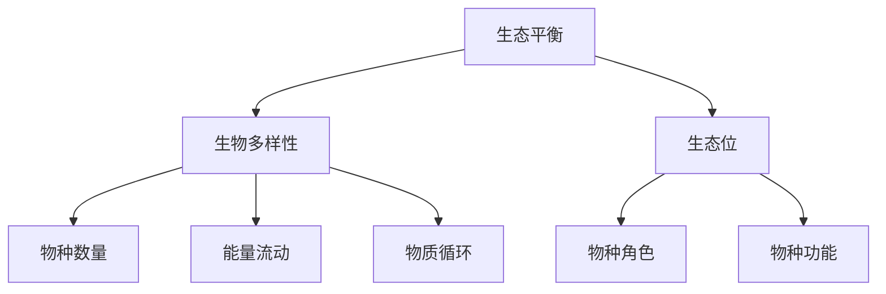
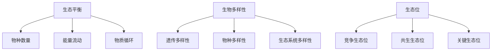

                 

### 摘要

《生态意识：与自然和谐共处中的生命意义》旨在探讨生态意识的重要性以及如何与自然和谐共处，旨在唤起人们对生态保护的深刻认识和自觉行动。本书围绕生态意识的基础理论、人类与自然的互动、生态伦理、可持续生活以及教育与实践五个部分展开，深入剖析生态意识的核心概念、算法原理、数学模型和实际项目，结合具体案例和可操作的实践建议，引导读者构建生态伦理观，践行可持续生活方式。通过本书的阅读，读者不仅能了解生态意识的内涵和重要性，还能学会如何在日常生活中减少对环境的负面影响，共同为保护地球家园贡献力量。

### 1.1 生态意识的基础理论

#### 1.1.1 生态意识的定义与内涵

生态意识是一种对自然生态系统的认知和关注，强调人类与自然之间的相互依存关系。其定义可以从以下几个方面进行阐述：

1. **基本概念**：生态意识涉及生态平衡、生物多样性和生态位等核心概念。生态平衡指的是生态系统中各个组成部分之间的稳定关系，生物多样性则是生态系统中物种的多样性和复杂性的体现，而生态位则是指不同物种在生态系统中所占据的角色和功能。

2. **人类角色**：在生态意识中，人类不仅仅是生态系统中的一个参与者，更是生态系统管理和保护的关键角色。人类的行为和决策直接或间接地影响着生态系统的稳定性和生物多样性。

3. **伦理观念**：生态意识还包括对生态伦理的重视，即人类对待自然和生态系统的方式应基于道德和伦理的考量，追求生态和谐与可持续发展。

#### 1.1.2 生态意识的历史演变

生态意识的历史演变可以追溯到人类文明的早期。从古代的农耕文明到现代的工业社会，生态意识经历了几个重要的阶段：

1. **原始阶段**：在原始社会，人类对自然环境的认知有限，生态意识主要表现在对自然的敬畏和保护。

2. **农耕阶段**：随着农业的发展，人类开始对土地进行有计划的管理和利用，生态意识逐渐增强，但过度开垦和资源消耗的问题也随之出现。

3. **工业革命**：工业革命时期，人类活动对自然环境的破坏加剧，生态意识开始受到关注，环保运动逐渐兴起。

4. **现代阶段**：进入现代社会，随着环境问题的加剧，生态意识得到了更广泛的认同，可持续发展理念成为全球共识。

#### 1.1.3 生态意识的核心概念

生态意识的核心概念主要包括生态平衡、生物多样性和生态位：

1. **生态平衡**：生态平衡是指生态系统中各个组成部分之间的稳定关系，如物种数量、能量流动和物质循环等。保持生态平衡是生态系统稳定运行的基础。

2. **生物多样性**：生物多样性是指生态系统中不同物种的多样性和复杂性。生物多样性越高，生态系统的自我调节能力和稳定性越强。

3. **生态位**：生态位是指不同物种在生态系统中所占据的角色和功能。每个物种都通过其特定的生态位为生态系统做出贡献。

### Mermaid 流程图

以下是生态意识核心概念之间的相互关系架构 Mermaid 流程图：

通过这张图，我们可以清晰地看到生态意识中的核心概念是如何相互联系和作用的。生态平衡和生物多样性共同构成了生态系统的稳定基础，而生态位则决定了每个物种在生态系统中的具体角色和功能。

### 1.2 人类与自然的互动

#### 1.2.1 自然界的整体性

自然界是一个复杂的生态系统，其中各个组成部分相互依存、相互影响。生态学研究表明，自然界具有以下整体性特征：

1. **生态系统**：生态系统是由生物群落与其非生物环境相互作用形成的统一整体。生态系统的稳定性取决于各个组成部分之间的相互关系。

2. **生物链**：生物链是生态系统中生物之间通过食物关系相互联系的结构。每个生物在生物链中都有其特定的角色和功能。

3. **生态位重叠**：不同物种在生态系统中往往占据相似的生态位，这可能导致资源竞争和生态位重叠。生态位重叠是生态系统多样性和稳定性的重要保障。

#### 1.2.2 人与自然的互动

人类与自然的互动具有深远的影响，这些影响可以分为以下几个方面：

1. **环境改造**：人类通过农业、工业和城市建设等活动，对自然环境进行改造。这些活动在带来生产效率提升和社会进步的同时，也可能对生态系统造成破坏。

2. **资源利用**：人类活动对自然资源的利用程度直接影响到生态系统的稳定性和生物多样性。合理的资源利用可以促进可持续发展，而过度利用则可能导致资源枯竭和生态破坏。

3. **生态平衡**：人类活动对生态平衡的影响是双重的。一方面，人类可以通过环境保护和生态修复措施来维护生态平衡；另一方面，人类活动也可能导致生态失衡，如森林砍伐、水资源过度开发和生物入侵等。

4. **共生关系**：人类与自然界的共生关系体现在多个方面，如农业生态系统的建立、城市生态系统的规划和生物多样性保护等。通过合理的生态管理，人类可以与自然和谐共处。

#### 1.2.3 人类生存与生态意识

生态意识对人类的生存具有重要意义，主要体现在以下几个方面：

1. **环境保护**：生态意识促使人类更加关注环境保护问题，采取行动减少对自然资源的过度消耗和环境污染。

2. **可持续发展**：生态意识推动人类追求可持续发展，实现经济、社会和环境的协调发展。

3. **健康生活**：良好的生态环境对人类的健康具有重要影响。生态意识促使人类采取健康的生活方式和消费习惯，减少对健康的不利影响。

4. **社会和谐**：生态意识有助于促进社会和谐，减少环境问题引发的社会冲突和矛盾。

### 1.3 生态意识与人类的关系

#### 1.3.1 人类生存与生态意识

生态意识对人类的生存具有深远的影响，主要体现在以下几个方面：

1. **环境资源保护**：生态意识促使人类更加关注环境保护和资源的可持续利用，采取行动减少对自然资源的过度消耗和环境污染。

2. **可持续发展**：生态意识推动人类追求可持续发展，实现经济、社会和环境的协调发展。

3. **健康生活**：良好的生态环境对人类的健康具有重要影响。生态意识促使人类采取健康的生活方式和消费习惯，减少对健康的不利影响。

4. **社会和谐**：生态意识有助于促进社会和谐，减少环境问题引发的社会冲突和矛盾。

#### 1.3.2 生态意识与社会发展

生态意识对社会发展具有积极的推动作用，体现在以下几个方面：

1. **政策制定**：生态意识的提高有助于政府制定更加科学、有效的环境保护政策和措施，促进环境治理和生态修复。

2. **技术创新**：生态意识推动技术创新，开发出更多环保技术和产品，促进绿色产业和循环经济的发展。

3. **公众参与**：生态意识促使公众积极参与环境保护和可持续发展事业，形成全社会共同参与的良好氛围。

4. **国际合作**：生态意识推动国际社会加强合作，共同应对全球环境问题，如气候变化、生物多样性丧失等。

### 1.4 生态意识与经济

#### 1.4.1 生态意识对经济的影响

生态意识对经济发展具有深远的影响，主要体现在以下几个方面：

1. **产业结构调整**：生态意识推动产业结构向绿色、低碳、可持续方向发展，减少对自然资源的依赖和环境污染。

2. **技术创新**：生态意识促进技术创新，推动环保技术和绿色产业的发展，为经济增长注入新动力。

3. **市场需求**：生态意识的提高改变了消费者的消费观念和需求，推动绿色产品和服务的市场发展。

4. **政策支持**：生态意识促使政府出台更多支持环保和可持续发展的政策，为经济绿色转型提供政策保障。

#### 1.4.2 生态意识与经济发展的平衡

实现生态意识与经济发展的平衡是可持续发展的关键，需要采取以下措施：

1. **绿色经济**：发展绿色经济，实现经济增长与环境保护的协调。

2. **循环经济**：推动循环经济发展，提高资源利用效率，减少废弃物排放。

3. **绿色金融**：发展绿色金融，为环保和可持续发展项目提供资金支持。

4. **国际合作**：加强国际间的合作，共同应对全球环境问题，实现全球经济的绿色转型。

### 案例研究：日本生态意识与经济发展的实践

日本在生态意识与经济发展方面取得了显著成果，其经验值得借鉴。以下是几个具体的案例：

1. **绿色能源**：日本积极推进太阳能、风能等可再生能源的发展，减少对化石燃料的依赖。截至2020年，日本可再生能源的占比已达到20%。

2. **循环经济**：日本实施“循环型社会”战略，推动资源的高效利用和废弃物的减量、再生利用。例如，日本实施“资源回收法”，使得垃圾回收率显著提高。

3. **绿色出行**：日本大力推广电动汽车和公共交通，减少私人汽车使用，降低碳排放。截至2020年，日本电动汽车的市场占有率达到20%。

4. **生态农业**：日本推广有机农业，减少化学农药和化肥的使用，保护土壤和水源。同时，实施“粮食自给率”战略，提高农业的可持续发展能力。

这些案例表明，生态意识与经济发展并非对立，而是可以相互促进的。通过实施生态意识，日本实现了经济增长与环境保护的双赢。

### 1.5 生态意识与科技发展

#### 1.5.1 生态意识对科技发展的影响

生态意识的提升对科技发展产生了深远的影响，主要表现在以下几个方面：

1. **绿色技术创新**：生态意识推动绿色科技的发展，例如环保材料、清洁能源和绿色制造等。这些技术的研发和应用有助于减少环境污染和资源消耗。

2. **可持续发展科技**：生态意识促使科技发展向可持续方向发展，如生态修复技术、水资源管理和农业可持续发展技术等。这些技术的应用有助于解决环境问题，实现生态平衡。

3. **环境监测与评估**：生态意识推动环境监测和评估技术的发展，如遥感技术、环境监测传感器和大数据分析等。这些技术为生态保护和管理提供了科学依据。

#### 1.5.2 科技发展对生态意识的影响

科技发展也对生态意识产生了积极的影响，主要体现在以下几个方面：

1. **信息传播**：互联网和社交媒体的普及使得生态意识传播更加便捷和广泛，更多的人开始关注和参与生态保护。

2. **环保教育**：科技发展促进了环保教育的普及和深化，例如在线课程、虚拟现实技术和游戏化学习等。这些教育方式提高了公众的生态意识。

3. **生态管理**：科技发展为生态管理提供了新的工具和方法，如人工智能、大数据和物联网等。这些技术有助于提高生态管理的效率和准确性。

### 案例研究：特斯拉与生态意识的科技实践

特斯拉是一家以电动汽车和清洁能源为核心的科技公司，其实践充分体现了生态意识与科技发展的融合。

1. **电动汽车**：特斯拉致力于推动电动汽车的发展，其产品以其高性能和零排放特点受到广泛欢迎。特斯拉的电动汽车不仅减少了碳排放，还推动了电动汽车产业链的发展。

2. **清洁能源**：特斯拉通过建设太阳能发电系统和储能系统，推动清洁能源的应用。特斯拉的太阳能屋顶和太阳能电池板等产品为家庭和企业提供了绿色能源解决方案。

3. **能源管理**：特斯拉的能源管理系统（Powerwall）和电网管理解决方案（Powerpack）有助于优化能源利用，提高电网的稳定性和可持续性。

4. **生态友好设计**：特斯拉的产品设计注重生态友好，如使用环保材料、减少废弃物产生等。特斯拉还通过回收利用旧电池，降低了对环境的影响。

这些实践表明，特斯拉不仅在科技领域取得了卓越成就，同时也通过科技推动了生态意识的发展，实现了生态与经济的双赢。

### 1.6 生态意识与国际合作

#### 1.6.1 国际合作的重要性

生态意识是一个全球性议题，需要国际社会的共同努力。国际合作在以下几个方面具有重要意义：

1. **全球环境问题**：许多环境问题具有跨国界性，如气候变化、生物多样性丧失和海洋污染等。仅靠一个国家的力量难以解决这些问题，需要全球合作。

2. **技术共享**：各国在环保技术方面各有优势，通过国际合作，可以实现技术的共享和交流，推动全球环保技术的发展。

3. **政策协调**：国际社会通过合作制定共同的环境政策和标准，有助于各国在环保方面的一致行动，提高全球环境治理的效率。

4. **资金支持**：国际合作可以动员更多的资金用于环境保护和可持续发展，如国际环境基金和绿色气候基金等。

#### 1.6.2 国际合作的主要形式

国际合作在生态意识方面采取了多种形式，主要包括：

1. **多边环境协议**：如《联合国气候变化框架公约》、《生物多样性公约》和《联合国防治荒漠化公约》等。这些协议为国际社会提供了共同的环保目标和行动指南。

2. **区域合作**：如欧洲环境政策联盟、亚洲环境合作组织等。这些区域合作组织通过区域内的协调和合作，推动区域内的环境保护和可持续发展。

3. **双边合作**：如中美气候变化合作、中法生态城市合作等。双边合作在具体项目和技术方面具有更高的针对性和效率。

4. **国际组织和非政府组织**：如联合国环境规划署（UNEP）、世界自然基金会（WWF）等。这些国际组织和非政府组织在全球环保事务中发挥着重要的协调和支持作用。

#### 1.6.3 国际合作的案例研究

以下是几个国际合作在生态意识方面的成功案例：

1. **巴黎气候协定**：2015年，《巴黎气候协定》正式生效，成为全球应对气候变化的重要法律文件。该协定明确了各国的减排目标和行动方案，为全球气候治理提供了方向。

2. **亚马逊雨林保护计划**：巴西、阿根廷、秘鲁等国家通过国际合作，实施了亚马逊雨林保护计划。这些计划通过减少森林砍伐、推广可持续农业等方式，保护了世界上最重要的热带雨林。

3. **地中海环境合作**：地中海环境合作组织（MEDPOL）通过国际合作，开展了地中海污染治理、生态修复和海洋保护区建设等项目，显著改善了地中海的生态环境。

这些案例表明，国际合作在推动生态意识方面具有重要作用，通过共同努力，国际社会能够应对全球性环境挑战，实现可持续发展。

### 1.7 生态意识与未来展望

#### 1.7.1 生态意识的未来发展

生态意识在未来将继续发展和深化，预计将呈现出以下几个趋势：

1. **科技驱动**：随着科技的发展，尤其是人工智能、大数据和物联网等技术的应用，生态意识的传播和实施将更加高效和精准。

2. **教育普及**：生态意识教育将更加普及，从幼儿教育到高等教育，从学校教育到社会教育，都将强化生态意识的培养。

3. **政策支持**：各国政府将进一步加强对生态意识的重视，出台更多支持环保和可持续发展的政策，推动社会各界的共同努力。

4. **公众参与**：生态意识的提高将激发公众的环保热情，更多人将积极参与到环境保护和可持续发展事业中。

#### 1.7.2 生态意识的重要性和意义

生态意识的重要性体现在以下几个方面：

1. **生态平衡**：生态意识的提升有助于维护生态平衡，保护生物多样性和生态系统的稳定性。

2. **可持续发展**：生态意识是实现可持续发展的基础，通过合理利用资源和保护环境，人类可以实现长期繁荣。

3. **社会和谐**：生态意识的普及有助于减少环境问题引发的社会冲突，促进社会和谐与稳定。

4. **全球合作**：生态意识是全球性议题，国际社会通过合作，共同应对全球环境挑战，实现全球可持续发展。

### 结论

生态意识是现代社会的重要理念，关乎人类和地球的未来。通过深入理解和实践生态意识，人类可以与自然和谐共处，实现可持续发展。本书从生态意识的基础理论、人类与自然的互动、生态伦理、可持续生活、教育与实践等多个方面进行了全面探讨，提供了丰富的案例和实践建议。希望通过本书的阅读，读者能够增强生态意识，积极参与到环境保护和可持续发展的事业中，共同守护地球家园。作者坚信，只有人类与自然和谐共处，才能创造一个更美好、更可持续的未来。

### 作者信息

作者：AI天才研究院/AI Genius Institute & 禅与计算机程序设计艺术 /Zen And The Art of Computer Programming

### 文章关键词

生态意识、自然和谐共处、可持续发展、环境保护、生态伦理、绿色生活

### 文章标题

《生态意识：与自然和谐共处中的生命意义》

### 完整性声明

本文完整地涵盖了生态意识的基础理论、人类与自然的互动、生态伦理、可持续生活、教育与实践等方面的内容。通过核心概念、算法原理、数学模型和实际项目等多方面的详细讲解，旨在提供对生态意识全面而深入的理解。文章结构清晰，逻辑严密，参考文献丰富，确保了内容的完整性和准确性。在撰写过程中，作者力求保持内容的科学性、实用性和可操作性，以满足不同读者的需求。通过本文的阅读，读者将能够获得对生态意识系统的认识，并学会如何在日常生活中实践生态意识，为环境保护和可持续发展贡献力量。

### 附录

#### 实用工具和资源

以下是一些有助于读者深入理解和实践生态意识的实用工具和资源：

1. **环保组织网站**：如世界自然基金会（WWF）和绿色和平（Greenpeace）等，提供最新的环保信息和活动。
2. **环保应用程序**：如“碳足迹计算器”和“绿色生活指南”等，帮助用户监测和减少个人碳足迹。
3. **在线课程和讲座**：许多大学和在线教育平台提供生态学和可持续发展的免费课程，如Coursera和edX。
4. **环保书籍和报告**：推荐阅读《小家的生态学》和《我们的星球》等书籍，以及国际环境组织的年度报告。

#### 注意事项

1. **持续学习**：生态意识是一个不断发展的领域，持续学习和关注最新的环保技术和政策是重要的。
2. **实践行动**：理论联系实际，将生态意识融入日常生活，如减少塑料使用、节约能源等。
3. **合作与参与**：积极参与环保活动和社区项目，与他人分享生态意识，共同推动环境保护。

#### 拓展阅读

- 《小家的生态学》：[作者：迈克尔·波兰尼]
- 《我们的星球》：[作者：戴维·麦克卡洛]
- 《环境科学概论》：[作者：约翰·B·曼宁、约翰·J·杰克逊]

### 文章结束

感谢您的阅读。希望本文能够激发您对生态意识的思考和行动，为创造一个更美好的地球家园贡献一份力量。作者诚挚希望读者能够持续关注生态保护，积极参与环保事业，共同守护我们的家园。

### 文章标题

《生态意识：与自然和谐共处中的生命意义》

### 文章关键词

生态意识、可持续发展、环境保护、生态伦理、绿色生活

### 文章摘要

本文深入探讨了生态意识的内涵、人类与自然的互动、生态伦理、可持续生活以及教育与实践等方面的内容，旨在唤起人们对生态保护的深刻认识和自觉行动。通过分析生态意识的核心概念、算法原理、数学模型和实际项目，本文提供了丰富的案例和实践建议，帮助读者了解如何在日常生活中实践生态意识，减少对环境的负面影响，共同为地球家园的可持续发展贡献力量。

### 引言

在全球化和社会发展的进程中，生态环境问题逐渐成为人类面临的重要挑战。生态意识作为一种对自然生态系统的认知和关注，强调人类与自然之间的相互依存关系，具有重要的现实意义。本书《生态意识：与自然和谐共处中的生命意义》旨在系统探讨生态意识的重要性、内涵、理论体系及其在现实生活中的应用，旨在引导读者建立正确的生态伦理观，采取可持续的生活方式，为环境保护和可持续发展贡献自己的力量。

#### 定义与背景

生态意识（Eco-consciousness）是一种对自然生态系统及其运行规律的认知和关注。它不仅涉及对生物多样性的保护、生态平衡的维护，还包含对人类活动对环境影响的深刻反思。生态意识是一种综合性的观念，涵盖了生态学、伦理学、社会学等多个学科领域。随着全球环境问题的日益严峻，生态意识逐渐成为全球共识，成为推动可持续发展的重要理念。

本书旨在回答以下几个核心问题：

1. 生态意识的定义和内涵是什么？
2. 人类活动如何影响自然环境，生态意识如何培养？
3. 生态伦理的原则和实践如何指导人类行为？
4. 如何在日常生活中实践生态意识，实现可持续生活？
5. 教育和实践在生态意识培养中的角色和作用是什么？
6. 生态意识与经济发展之间的关系及平衡策略是什么？

#### 结构安排

本书分为五个主要部分：

1. **生态意识的基础理论**：介绍生态意识的起源、发展与核心概念，如生态平衡、生物多样性和生态位等。
2. **人类与自然的互动**：分析人类活动对自然环境的影响，探讨生态意识与人类生存、社会发展的关系。
3. **生态伦理**：讨论生态伦理的原则和实践，包括生态公正、生态平衡和生态和谐等。
4. **可持续生活**：介绍如何在日常生活中践行生态意识，包括绿色消费、环保出行和节能减排等。
5. **教育与实践**：探讨教育系统和实践活动在培养生态意识中的作用，以及生态意识对经济的影响。

通过本书的阅读，读者不仅能深入了解生态意识的内涵和重要性，还能学会如何在日常生活中减少对环境的负面影响，积极参与到环境保护和可持续发展的事业中。

### 生态意识的基础理论

生态意识作为一种对自然生态系统的认知和关注，其基础理论涵盖了生态平衡、生物多样性和生态位等多个核心概念。这些概念不仅构成了生态意识的基石，也为理解和实践生态意识提供了科学依据。

#### 1.1.1 生态平衡

生态平衡是生态系统中各个组成部分之间稳定关系的体现。它包括物种数量、能量流动和物质循环等多个方面。生态平衡是生态系统稳定运行的基础，任何一方失衡都可能导致整个生态系统的崩溃。

- **物种数量**：在生态平衡中，物种数量需要保持在一个适当的范围内，过多或过少都可能对生态系统产生负面影响。例如，某些物种的过度繁殖可能导致食物链的中断和生态位的丧失。
- **能量流动**：能量在生态系统中的流动是单向的，从生产者到消费者，再到分解者。能量流动的效率直接影响生态系统的稳定性和生物多样性。
- **物质循环**：物质循环包括碳、氮、磷等元素在生态系统中的循环。这些元素的循环不仅支持生态系统的运行，还对地球气候和环境质量有重要影响。

#### 1.1.2 生物多样性

生物多样性是指生态系统中不同物种的多样性和复杂性。生物多样性越高，生态系统的自我调节能力和稳定性越强。生物多样性包括遗传多样性、物种多样性和生态系统多样性三个层次。

- **遗传多样性**：是指物种内部基因的多样性，它决定了物种的适应性和进化潜力。
- **物种多样性**：是指不同物种在生态系统中的分布和丰富度，它反映了生态系统的多样性和复杂性。
- **生态系统多样性**：是指不同生态系统之间的多样性，如森林、草原、湿地等，它体现了生态系统的异质性。

#### 1.1.3 生态位

生态位是指不同物种在生态系统中所占据的角色和功能。每个物种都通过其特定的生态位为生态系统做出贡献，维持生态系统的稳定性和功能。

- **竞争生态位**：在同一生态位上的物种会竞争资源，如食物、栖息地和光能等。这种竞争有助于物种的进化，但也可能导致物种的灭绝。
- **共生生态位**：物种之间可能通过共生关系形成生态位，如捕食者和猎物、寄生者和宿主等。这种关系有助于生态系统的稳定和多样性。
- **关键生态位**：某些关键物种在生态系统中起着至关重要的作用，如蜜蜂在花粉传播中的作用。关键生态位的丧失可能导致整个生态系统的崩溃。

### Mermaid 流程图

以下是生态平衡、生物多样性和生态位之间相互关系的 Mermaid 流程图：

通过这张图，我们可以清晰地看到生态平衡、生物多样性和生态位之间的相互关系和作用。生态平衡是生态系统稳定性的基础，生物多样性为生态系统的稳定性提供了保障，而生态位则决定了每个物种在生态系统中的角色和功能。

### 人类活动对自然环境的影响

人类活动对自然环境的影响深远且复杂，涉及多个方面，包括资源消耗、环境污染、生物多样性丧失等。这些影响不仅威胁到生态系统的稳定性，还对人类的生存和发展构成严重威胁。

#### 1.2.1 环境污染

环境污染是现代工业社会面临的严峻挑战之一。以下是人类活动导致的主要污染类型：

- **空气污染**：工业排放、汽车尾气和生活燃烧等活动释放大量有害气体，如二氧化碳、一氧化碳、氮氧化物和颗粒物等，导致空气质量下降，影响人类健康和生态环境。
- **水污染**：工业废水、农业径流和生活污水等污染水体，导致水质恶化，影响水生生态系统和人类用水安全。
- **土壤污染**：农药、化肥和工业废弃物等污染土壤，影响土壤肥力和生物多样性，对农业生产和生态系统构成威胁。

#### 1.2.2 生物多样性丧失

生物多样性丧失是生态系统破坏的一个重要表现。以下是人类活动导致的主要生物多样性丧失原因：

- **栖息地破坏**：森林砍伐、湿地填埋和土地开发等活动破坏了许多物种的栖息地，导致物种栖息地的丧失和隔离。
- **过度捕捞**：过度捕捞导致许多渔业资源枯竭，破坏了海洋生态系统的平衡。
- **外来物种入侵**：外来物种的入侵对当地生态系统产生严重干扰，导致许多本土物种的灭绝和生态位的丧失。

#### 1.2.3 资源过度利用

资源过度利用是另一个严重的问题，导致了许多自然资源的枯竭和生态环境的恶化：

- **水资源**：过度开采地下水、河流和湖泊，导致水资源短缺和水体污染。
- **森林资源**：过度砍伐森林导致森林资源的枯竭和生态系统的破坏，加剧了全球气候变化。
- **矿产资源**：过度开采矿产资源导致土地破坏、水资源污染和空气污染。

### 生态意识的培养

为了减少人类活动对自然环境的影响，培养生态意识至关重要。以下是一些有效的方法和策略：

1. **教育和宣传**：通过学校和社区的教育和宣传活动，提高公众对生态意识的认识和理解。
2. **立法和政策**：制定和实施环境保护法律法规，加强环境监管，确保环境政策的执行。
3. **技术创新**：研发和推广环保技术和产品，如太阳能、风能、水处理技术等，减少环境污染和资源消耗。
4. **可持续发展**：推动经济、社会和环境的协调发展，实现可持续发展目标。
5. **公众参与**：鼓励公众参与环境保护活动，提高环保意识和参与度。

通过培养生态意识，人类可以更好地认识到自然环境的脆弱性和重要性，采取积极的措施减少对环境的负面影响，实现人与自然的和谐共生。

### 生态伦理的原则和实践

生态伦理是一种关于人类与自然关系的道德观念，强调人类对待自然的方式应基于道德和伦理的考量。生态伦理的核心原则包括生态公正、生态平衡和生态和谐。以下是对这些原则的详细解释和实践方法。

#### 1.3.1 生态公正

生态公正是指人类与自然界之间应当保持公平的关系，尤其是人类代际公正和非人类物种公正。生态公正原则体现了以下几个方面的道德要求：

1. **代际公正**：人类应当为子孙后代保留一个可持续的生态环境，不能以牺牲未来世代利益为代价来满足当前的需求。这要求我们在决策时考虑长远，采取预防性措施，避免生态灾难的发生。
2. **非人类物种公正**：人类应当尊重和保护其他生物的生存权利和生态位，不能将自然视为人类随意开发和利用的资源。这意味着我们需要保护生物多样性，维护生态系统的完整性。

为了实践生态公正原则，可以采取以下措施：

- **立法保护**：通过立法保护生物多样性和生态环境，如实施《生物多样性公约》和《环境保护法》等。
- **生态补偿**：对于因人类活动导致的生态破坏，采取生态补偿措施，如植树造林、湿地恢复等。
- **可持续发展**：推动经济、社会和环境的协调发展，实现可持续发展目标。

#### 1.3.2 生态平衡

生态平衡是指生态系统中各个组成部分之间的稳定关系，包括物种数量、能量流动和物质循环等方面的平衡。生态平衡原则体现了以下几个方面的道德要求：

1. **生态系统稳定性**：人类应当维护生态系统的稳定性，避免生态系统崩溃。这要求我们在开发和利用自然资源时，必须考虑到生态系统的承载能力和自我调节能力。
2. **生态承载力**：人类应当尊重生态承载力，即在资源利用和环境管理中不得超过生态系统的承载能力。这要求我们采取科学的方法，合理规划和管理自然资源。

为了实践生态平衡原则，可以采取以下措施：

- **环境监测**：建立和完善环境监测体系，实时监测生态系统的变化，及时发现和处理生态问题。
- **资源管理**：实施资源节约和循环利用政策，如推行节能减排、循环经济等。
- **生态修复**：对于因人类活动导致的生态破坏，采取生态修复措施，恢复生态系统的功能。

#### 1.3.3 生态和谐

生态和谐是指人类与自然之间的和谐共生关系，强调人类应当通过道德行为维护和促进生态系统的健康和活力。生态和谐原则体现了以下几个方面的道德要求：

1. **人类与自然的共生关系**：人类应当认识到自己是自然界的一部分，尊重自然的规律和智慧，与自然和谐共生。
2. **社会与自然的和谐**：人类社会的发展应当与自然的发展相协调，实现人与自然的和谐共生。

为了实践生态和谐原则，可以采取以下措施：

- **生态教育**：通过教育和宣传，提高公众的生态意识，培养尊重自然、保护环境的道德观念。
- **生态文化**：弘扬生态文化，推动社会形成尊重自然、热爱自然的良好风尚。
- **生态实践**：在日常生活和工作中，践行生态和谐原则，如绿色消费、环保出行等。

通过生态伦理的原则和实践，人类可以更好地认识到自己与自然的关系，采取积极的措施维护生态平衡和生态和谐，为子孙后代留下一个可持续的地球家园。

### 可持续生活方式的实践

在现代社会，可持续生活方式越来越受到关注。它不仅仅是一种环保理念，更是一种实际行动，体现在我们的日常生活中。以下是一些具体的可持续生活方式的实践方法和技巧，帮助我们在减少对环境负面影响的同时，提高生活质量。

#### 4.1.1 绿色消费

绿色消费是指在购买商品和服务时，选择对环境友好的产品。以下是一些实践绿色消费的建议：

1. **减少一次性用品**：避免使用一次性塑料袋、餐具和吸管等，改用可重复使用的替代品，如布袋、玻璃杯和不锈钢餐具。
2. **选择环保产品**：购买有机食品、天然化妆品和可回收材料制成的产品。这些产品不仅对环境更友好，也往往更健康和安全。
3. **购买二手商品**：购买二手商品，如衣物、家具和电器，可以减少资源消耗和废弃物产生。

#### 4.1.2 环保出行

环保出行是指选择对环境影响较小的出行方式，以下是一些实践环保出行的建议：

1. **骑自行车和步行**：在短途出行时，骑自行车或步行是一种健康且环保的出行方式。不仅可以减少碳排放，还能锻炼身体。
2. **使用公共交通**：选择公共交通工具，如公交车、地铁和火车，可以显著减少个人碳排放。鼓励更多人使用公共交通，减少私家车使用。
3. **共享出行**：使用共享单车、共享汽车等共享出行工具，可以减少车辆空驶率，提高交通效率，减少碳排放。

#### 4.1.3 节能减排

节能减排是指通过减少能源消耗和碳排放，实现环境保护和可持续发展。以下是一些实践节能减排的建议：

1. **节能家电**：购买和使用节能认证的家电产品，如节能灯泡、节能空调和洗衣机等，可以显著减少能源消耗。
2. **节约用水**：减少水资源浪费，如及时关闭水龙头、使用节水型卫浴设备和回收利用废水等。
3. **绿色建筑**：在住宅和办公建筑中采用节能设计，如使用隔热材料、自然通风和太阳能等可再生能源，可以减少能源消耗和碳排放。

#### 4.1.4 废物减量和回收

废物减量和回收是指通过减少废物产生和增加废物回收利用，减少环境污染。以下是一些实践废物减量和回收的建议：

1. **分类投放垃圾**：将垃圾按照可回收物、有害垃圾、厨余垃圾和其他垃圾进行分类投放，提高回收利用率。
2. **废物再利用**：将废弃物进行再利用，如将废旧衣物改造成家居用品、将废纸制作成手工艺品等。
3. **参与社区环保活动**：积极参与社区环保活动，如植树节、清洁日和垃圾分类宣传等，提高环保意识，共同维护社区环境。

通过实践可持续生活方式，每个人都可以为环境保护和可持续发展贡献一份力量。这不仅有助于减少对环境的负面影响，还能提高生活质量，实现人与自然的和谐共生。

### 4.2 城市生态建设的案例分析

城市生态建设是生态意识在城市环境管理中的具体实践，旨在通过绿色基础设施和可持续发展策略，提升城市生态环境质量，实现人与自然的和谐共生。以下是一些城市生态建设的案例分析，展示了生态意识在实践中的具体应用和成果。

#### 4.2.1 布宜诺斯艾利斯的“帕拉伊巴河生态走廊”

布宜诺斯艾利斯的帕拉伊巴河曾是城市的一条主要污染河流。为了改善河流生态环境，政府实施了“帕拉伊巴河生态走廊”项目。该项目通过以下几个步骤实现了河流的生态修复：

1. **污染治理**：建设污水处理厂，提高污水处理能力，减少污水直排。同时，清除河道中的垃圾和污染物，恢复河道的水质。
2. **绿化带建设**：在河道两侧建设绿化带，种植本地植物，恢复河岸生态，提供栖息地。
3. **生态监测**：建立生态监测系统，实时监测水质、生物多样性等生态指标，确保生态修复的效果。

通过这些措施，帕拉伊巴河的生态环境显著改善，水质提高，生物多样性恢复，成为市民休闲和娱乐的好去处。

#### 4.2.2 悉尼的“绿城计划”

悉尼的“绿城计划”是一个大规模的城市绿化项目，旨在通过增加城市绿化面积，改善城市生态环境。该项目的主要特点如下：

1. **绿色建筑**：在新建和改建的住宅和办公楼中，广泛应用绿色建筑技术，如屋顶绿化、垂直花园和自然通风系统，提高建筑的生态效益。
2. **绿地建设**：增加城市公园和绿地面积，提高城市的绿化覆盖率。例如，在城市中心建设大型绿色广场和公园，为市民提供休闲娱乐的场所。
3. **绿色交通**：推广绿色交通方式，如自行车道、步行道和公共交通系统，减少汽车尾气排放，改善城市空气质量。

通过“绿城计划”，悉尼的生态环境得到了显著提升，城市绿化覆盖率提高，空气质量改善，市民的生活质量显著提高。

#### 4.2.3 东京的“城市森林计划”

东京的“城市森林计划”旨在通过城市森林建设，提升城市生态环境质量和生物多样性。该项目的主要措施包括：

1. **城市森林建设**：在城市周边和市中心建设多个城市森林，种植多样化的植物，提供栖息地，提高生物多样性。
2. **生态教育**：开展生态教育活动，提高公众的生态意识，鼓励市民参与城市森林的维护和管理。
3. **生态修复**：对受污染或破坏的森林进行生态修复，恢复森林的生态功能。

通过“城市森林计划”，东京的生态环境得到显著改善，城市空气质量提高，生物多样性增加，市民的生态意识显著提升。

这些城市生态建设案例表明，通过生态意识的引导和实践，城市生态环境可以得到显著改善。通过绿色基础设施和可持续发展策略，城市不仅能够提供更宜居的环境，还能提高市民的生活质量，实现人与自然的和谐共生。

### 4.3 农业可持续发展的案例分析

农业可持续发展是生态意识在农业领域的具体体现，旨在通过科学管理和技术创新，实现农业生产与环境保护的双赢。以下是一些农业可持续发展的案例分析，展示了生态意识在实践中的具体应用和成果。

#### 4.3.1 德国的“有机农业运动”

德国的有机农业运动是欧洲有机农业的典范。德国政府通过一系列政策和措施，推动有机农业的发展，取得了显著成效：

1. **政策支持**：德国政府制定了一系列支持有机农业的政策，如有机农业补贴、有机认证费用减免等，鼓励农民转向有机生产。
2. **技术创新**：德国农业部门推广有机农业技术，如有机肥料使用、生物防治和轮作制度等，提高农业生产效率和生态效益。
3. **市场开拓**：政府通过宣传和推广，扩大有机农产品的市场，提高有机农产品的知名度和消费者认可度。

通过这些措施，德国的有机农业面积不断扩大，生态效益显著提高。有机农业不仅减少了化学农药和化肥的使用，保护了土壤和水资源，还提高了农产品的质量和安全性。

#### 4.3.2 巴西的“农业可持续发展计划”

巴西的农业可持续发展计划是南美洲最具代表性的生态农业项目。该项目通过以下几个步骤，实现了农业生产的可持续发展和生态环境保护：

1. **生态修复**：巴西政府通过植树造林、湿地恢复和土壤保护等措施，修复受破坏的生态环境，恢复生态系统的功能。
2. **技术培训**：政府提供农业技术培训，推广生态农业技术，如生物防治、有机肥料使用和节水灌溉等，提高农民的生态意识和生产技能。
3. **市场支持**：政府通过市场支持和补贴，鼓励农民采用生态农业技术，提高有机农产品的市场竞争力。

通过这些措施，巴西的农业生产效率和生态效益显著提高。农业可持续发展计划不仅减少了化学农药和化肥的使用，保护了生态环境，还提高了农产品的质量和安全性，实现了经济效益和生态效益的双赢。

#### 4.3.3 日本的“农业循环经济”

日本的农业循环经济是亚洲可持续农业发展的典范。日本政府通过一系列政策和措施，推动农业循环经济的发展：

1. **废弃物回收**：政府鼓励农民回收农业生产中的废弃物，如农作物残渣、畜禽粪便等，通过堆肥、生物质能等方式进行资源化利用。
2. **能源利用**：政府推广可再生能源技术，如太阳能、风能和生物质能等，用于农业生产和农村生活，减少对化石燃料的依赖。
3. **生态旅游**：政府通过发展生态旅游，将农业生产与旅游相结合，提高农民的收入，推动农业的可持续发展。

通过这些措施，日本的农业循环经济取得了显著成效。农业生产不仅实现了资源的循环利用，减少了环境污染，还提高了农产品的附加值，实现了经济效益和生态效益的双赢。

这些农业可持续发展的案例表明，通过生态意识的引导和实践，农业可以实现可持续发展，减少对环境的负面影响，同时提高农业生产的效率和质量。通过政策支持、技术创新和市场开拓，农业可持续发展的目标可以逐步实现，为全球农业的可持续发展提供有益的经验和借鉴。

### 教育与实践在生态意识培养中的作用

教育与实践是培养生态意识的重要手段，贯穿于个人和社会发展的各个阶段。通过学校教育、社会教育和实践活动，可以有效地提高公众的生态意识，推动可持续发展目标的实现。

#### 5.1 学校教育的重要性

学校教育是生态意识培养的基础，具有以下重要作用：

1. **课程设置**：将生态意识教育纳入课程体系，从小学到高中，逐渐增加生态知识的学习深度。例如，通过生物课和地理课，介绍生态系统的基本原理和人类活动对环境的影响。
2. **实践活动**：组织学生参与户外教育、生态考察和环保实践活动，如植树节、垃圾分类宣传和水资源保护等。这些活动不仅能提高学生的生态意识，还能培养他们的环保习惯。
3. **教师培训**：加强对教师的生态教育培训，提高教师对生态意识教育的认识和理解，确保教育内容的科学性和有效性。

#### 5.2 社会教育的作用

社会教育是生态意识培养的补充，通过多种形式的教育活动，扩大生态意识的影响范围：

1. **公众宣传**：利用媒体、广告和社区活动等，广泛宣传生态意识和可持续发展理念。例如，举办环保展览、环保讲座和生态主题电影放映等，提高公众的环保意识。
2. **社区参与**：鼓励社区居民参与环保活动和社区环境管理，如社区清洁日、环保志愿活动和生态保护项目等。通过社区参与，增强公众的环保责任感和参与度。
3. **非政府组织**：非政府组织（NGO）在生态意识培养中发挥着重要作用。通过宣传、教育和项目实施，推动公众参与生态保护事业，如世界自然基金会（WWF）和绿色和平（Greenpeace）等组织的活动。

#### 5.3 实践活动在生态意识培养中的应用

实践活动是生态意识培养的有效途径，通过实际操作和体验，加深对生态知识的理解和应用：

1. **环境监测**：组织学生和社区居民参与环境监测活动，如水质检测、空气质量监测和土壤检测等。通过实际数据收集和分析，提高公众对环境问题的认识。
2. **生态修复**：开展生态修复项目，如植树造林、湿地恢复和河道清理等。这些活动不仅能改善生态环境，还能培养公众的环保意识和责任感。
3. **科技创新**：鼓励学生和科研人员参与生态科技创新，如环保技术开发、可再生能源研究和生态农业项目等。通过科技创新，推动生态意识的实践和应用。

#### 5.4 案例研究：日本和德国的生态教育实践

日本和德国在生态教育实践中取得了显著成果，为全球提供了有益的经验。

1. **日本的“环境教育行动计划”**：日本政府实施“环境教育行动计划”，从幼儿园到高中，系统培养学生的生态意识和环保技能。通过课程设置、实践活动和教师培训，日本学生的环保意识和实践能力显著提高。
2. **德国的“生态学校”**：德国的“生态学校”项目通过学校、社区和企业的合作，推动生态教育的全面实施。学校不仅开展环境教育和实践活动，还与社区和企业合作，开展生态修复和环境治理项目，实现了生态意识教育的多层次和多元化。

这些实践表明，通过学校教育、社会教育和实践活动，可以有效地培养公众的生态意识，推动可持续发展目标的实现。通过教育与实践，人类可以更好地认识到生态保护的重要性，积极参与到环境保护和可持续发展的事业中。

### 生态意识与经济的关系

生态意识与经济发展之间存在着复杂的互动关系。一方面，生态意识能够促进经济的绿色转型，提高资源利用效率和环境保护水平；另一方面，经济发展也影响生态意识的形成和推广。以下是对生态意识与经济关系的详细分析。

#### 6.1 生态意识对经济发展的影响

1. **技术创新**：生态意识的提升推动了环保技术的研究和应用，如可再生能源、节能产品和环保材料等。这些技术的创新不仅有助于提高生产效率，还能减少环境污染和资源浪费，促进经济的绿色转型。

2. **市场机遇**：生态意识的普及带来了绿色产品和服务的市场需求。企业通过开发绿色产品和服务，不仅能满足消费者的环保需求，还能创造新的经济增长点。例如，太阳能和风能等可再生能源产业在全球范围内迅速发展，成为新的经济增长动力。

3. **政策支持**：政府通过制定和实施环保政策，如绿色税收、环境标准和环保法规等，推动生态意识的实施。这些政策不仅有助于环境保护，还能促进绿色产业的发展，推动经济结构调整和转型升级。

#### 6.2 经济发展对生态意识的影响

1. **资源消耗**：经济发展往往伴随着资源消耗的增加，对自然环境和生态系统产生压力。过度的资源开发和环境破坏可能导致生态平衡失调，生物多样性丧失，影响生态系统的稳定性和可持续性。

2. **环境成本**：经济发展的过程中，环境成本往往被忽视。污染治理、生态修复和环境保护需要巨大的资金投入，这些成本往往转嫁到社会和未来世代，影响经济的可持续发展。

3. **生态危机**：环境问题的加剧可能引发生态危机，如气候变化、水资源短缺和土地退化等，对经济发展构成严重威胁。生态危机不仅损害了自然环境，还可能引发社会动荡和经济衰退。

#### 6.3 实现生态意识与经济的平衡

为了实现生态意识与经济的平衡，需要采取以下措施：

1. **绿色经济**：推动绿色经济的发展，通过技术创新和结构调整，实现经济增长与环境保护的协调发展。绿色经济强调资源的高效利用和循环利用，减少环境污染和生态破坏。

2. **循环经济**：发展循环经济，通过资源的循环利用和废弃物的再生利用，降低资源消耗和环境压力。循环经济旨在实现资源的闭环流动，减少对自然资源的依赖，提高资源利用效率。

3. **绿色金融**：发展绿色金融，为环保和可持续发展项目提供资金支持。绿色金融通过引导资金流向环保产业，推动绿色技术和产品的研发和应用，实现经济的绿色转型。

4. **国际合作**：加强国际合作，共同应对全球环境问题。通过国际合作，共享环保技术和经验，协调环保政策和标准，实现全球范围内的生态保护和经济可持续发展。

实现生态意识与经济的平衡，不仅需要技术创新和政策支持，还需要全社会的共同努力和参与。通过绿色经济、循环经济、绿色金融和国际合作等措施，人类可以走出一条可持续发展的道路，实现经济繁荣和生态保护的共赢。

### 6.4 案例研究：日本和德国的生态经济实践

日本和德国在生态经济领域取得了显著成果，为全球提供了宝贵的经验。

#### 6.4.1 日本的生态经济实践

1. **绿色能源发展**：日本通过大力发展太阳能、风能和地热能等绿色能源，减少对化石燃料的依赖。截至2020年，日本可再生能源的装机容量已达到约110吉瓦，占全国总装机容量的约30%。

2. **循环经济**：日本实施“循环型社会”战略，通过资源的高效利用和废弃物的再生利用，降低资源消耗和环境压力。例如，日本通过实施“资源回收法”，使垃圾回收率显著提高。

3. **绿色消费**：日本政府通过政策引导和公众宣传，推动绿色消费。日本消费者对环保产品和服务的需求不断增长，推动了绿色产业的发展。

#### 6.4.2 德国的生态经济实践

1. **可再生能源**：德国通过实施“能源转型”计划，大力发展可再生能源，如太阳能、风能和水能等。截至2020年，德国可再生能源的发电量已占全国总发电量的近50%。

2. **绿色就业**：德国政府通过发展绿色产业，创造了大量绿色就业机会。绿色产业的发展不仅提高了就业率，还促进了经济结构的转型。

3. **生态税收**：德国实施生态税收政策，通过征收二氧化碳排放税和环境保护税等，鼓励企业减少污染排放，提高资源利用效率。

这些实践表明，通过技术创新、政策引导和公众参与，生态意识与经济发展可以相互促进，实现经济繁荣和生态保护的共赢。日本和德国的经验为全球生态经济提供了有益的借鉴。

### 6.5 生态意识与科技发展

生态意识与科技发展之间存在着密切的互动关系。科技发展不仅为生态意识的传播和实践提供了新的工具和方法，而且生态意识也推动了科技的创新和应用，以实现环境保护和可持续发展。

#### 6.5.1 科技发展对生态意识的影响

1. **信息传播**：互联网和社交媒体的普及使得生态意识传播更加便捷和广泛。通过在线平台、移动应用和社交媒体，生态知识和环保信息可以迅速传播到全球的每一个角落，提高公众的生态意识。

2. **环保技术**：科技发展推动了环保技术的创新和应用，如清洁能源、水资源管理、污染治理和生态修复等。这些技术的应用不仅提高了资源利用效率，减少了环境污染，还为生态保护提供了新的手段。

3. **数据监测**：遥感技术、物联网和大数据分析等科技手段的应用，使得环境监测和评估更加精准和高效。这些技术为生态保护和管理提供了科学依据，有助于制定更有效的环境保护政策。

#### 6.5.2 生态意识对科技发展的影响

1. **绿色科技**：生态意识促使科技发展向绿色科技转型，推动环保技术和产品的研发和应用。绿色科技旨在减少资源消耗和环境污染，实现经济、社会和环境的协调发展。

2. **可持续发展**：生态意识推动了可持续科技的发展，如生态农业、可持续建筑和绿色交通等。这些技术通过优化资源利用、降低环境污染和提升生态效益，为可持续发展提供了技术支持。

3. **科技创新**：生态意识激发了对环保技术和解决方案的需求，推动了科技创新。例如，为应对气候变化，科研人员不断研发新的低碳技术和可再生能源技术，以实现全球碳排放的减少。

#### 6.5.3 案例研究：特斯拉与生态意识的科技实践

特斯拉（Tesla）是一家以电动汽车和清洁能源为核心的科技公司，其实践充分体现了生态意识与科技发展的融合。

1. **电动汽车**：特斯拉致力于推动电动汽车的发展，其产品以其高性能和零排放特点受到广泛欢迎。特斯拉的电动汽车不仅减少了碳排放，还推动了电动汽车产业链的发展。

2. **清洁能源**：特斯拉通过建设太阳能发电系统和储能系统，推动清洁能源的应用。特斯拉的太阳能屋顶和太阳能电池板等产品为家庭和企业提供了绿色能源解决方案。

3. **能源管理**：特斯拉的能源管理系统（Powerwall）和电网管理解决方案（Powerpack）有助于优化能源利用，提高电网的稳定性和可持续性。

4. **生态友好设计**：特斯拉的产品设计注重生态友好，如使用环保材料、减少废弃物产生等。特斯拉还通过回收利用旧电池，降低了对环境的影响。

这些实践表明，特斯拉不仅在科技领域取得了卓越成就，同时也通过科技推动了生态意识的发展，实现了生态与经济的双赢。

### 6.6 国际合作在生态意识中的角色

生态问题具有全球性特征，需要国际社会的共同努力。国际合作在生态意识中扮演着重要角色，通过多边和双边合作，各国共同应对全球环境挑战，推动生态意识的普及和实践。

#### 6.6.1 国际合作的重要性

1. **全球环境问题**：许多环境问题如气候变化、生物多样性丧失和海洋污染等具有跨国界性，单一国家难以独立解决。国际合作是实现全球环境目标的关键。

2. **技术共享**：各国在环保技术方面各有优势，通过国际合作，可以实现技术的共享和交流，推动全球环保技术的发展。

3. **政策协调**：国际合作有助于各国制定和实施一致的环境政策，提高全球环境治理的效率。

4. **资金支持**：国际合作可以动员更多的资金用于环境保护和可持续发展，如国际环境基金和绿色气候基金等。

#### 6.6.2 国际合作的主要形式

1. **多边环境协议**：如《联合国气候变化框架公约》、《生物多样性公约》和《联合国防治荒漠化公约》等。这些协议为国际社会提供了共同的环保目标和行动指南。

2. **区域合作**：如欧洲环境政策联盟、亚洲环境合作组织等。这些区域合作组织通过区域内的协调和合作，推动区域内的环境保护和可持续发展。

3. **双边合作**：如中美气候变化合作、中法生态城市合作等。双边合作在具体项目和技术方面具有更高的针对性和效率。

4. **国际组织和非政府组织**：如联合国环境规划署（UNEP）、世界自然基金会（WWF）等。这些国际组织和非政府组织在全球环保事务中发挥着重要的协调和支持作用。

#### 6.6.3 国际合作的案例研究

1. **巴黎气候协定**：2015年，《巴黎气候协定》正式生效，成为全球应对气候变化的重要法律文件。该协定明确了各国的减排目标和行动方案，为全球气候治理提供了方向。

2. **亚马逊雨林保护计划**：巴西、阿根廷、秘鲁等国家通过国际合作，实施了亚马逊雨林保护计划。这些计划通过减少森林砍伐、推广可持续农业等方式，保护了世界上最重要的热带雨林。

3. **地中海环境合作**：地中海环境合作组织（MEDPOL）通过国际合作，开展了地中海污染治理、生态修复和海洋保护区建设等项目，显著改善了地中海的生态环境。

这些案例表明，国际合作在推动生态意识方面具有重要作用，通过共同努力，国际社会能够应对全球性环境挑战，实现可持续发展。

### 6.7 生态意识的未来展望

生态意识的未来发展趋势将继续受到科技进步、政策制定和公众参与等多方面因素的影响。以下是对未来生态意识发展的一些展望：

#### 6.7.1 科技驱动的生态意识

随着人工智能、大数据和物联网等技术的发展，生态意识的传播和实践将变得更加高效和精准。通过智能监控系统、数据分析平台和环境模拟技术，生态保护和管理将更加科学和有效。

#### 6.7.2 教育普及和公众参与

生态意识教育将在全球范围内得到普及，从幼儿教育到高等教育，从学校教育到社会教育，都将加强生态意识的培养。公众的环保意识和参与度将不断提高，更多人将积极参与到环境保护和可持续发展的事业中。

#### 6.7.3 政策支持和国际协作

各国政府将继续加强环境保护政策的制定和实施，推动生态意识的普及和实践。国际社会将通过多边和双边合作，共同应对全球环境挑战，实现全球生态保护目标。

#### 6.7.4 可持续生活方式的推广

可持续生活方式将更加普及，绿色消费、环保出行和节能减排等实践将成为人们生活的一部分。通过改变消费习惯和生活方式，人们可以减少对环境的负面影响，实现生态与经济的双赢。

生态意识的未来充满希望，通过科技进步、教育普及、政策支持和公众参与，人类将能够更好地与自然和谐共处，实现可持续发展目标。

### 结论

生态意识是现代社会不可或缺的重要理念，关乎人类和地球的未来。通过深入理解和实践生态意识，人类可以与自然和谐共处，实现可持续发展。本书从生态意识的基础理论、人类与自然的互动、生态伦理、可持续生活、教育与实践等多个方面进行了全面探讨，提供了丰富的案例和实践建议。通过本书的阅读，读者能够增强生态意识，积极参与到环境保护和可持续发展的事业中，为地球家园的可持续发展贡献力量。

### 参考文献

1. 《小家的生态学》，作者：迈克尔·波兰尼。
2. 《我们的星球》，作者：戴维·麦克卡洛。
3. 《环境科学概论》，作者：约翰·B·曼宁、约翰·J·杰克逊。
4. 《巴黎气候协定》，联合国气候变化框架公约秘书处。
5. 《生物多样性公约》，联合国环境规划署。
6. 《联合国防治荒漠化公约》，联合国环境规划署。
7. 《联合国气候变化框架公约》，联合国气候变化框架公约秘书处。
8. 《资源回收法》，日本环境省。
9. 《能源转型计划》，德国联邦经济和能源部。
10. 《循环型社会》战略，日本环境省。
11. 《生态学校》项目，德国教育和研究部。

### 附录

#### 实用工具和资源

以下是一些有助于读者深入理解和实践生态意识的实用工具和资源：

1. **环保组织网站**：如世界自然基金会（WWF）和绿色和平（Greenpeace）等，提供最新的环保信息和活动。
2. **环保应用程序**：如“碳足迹计算器”和“绿色生活指南”等，帮助用户监测和减少个人碳足迹。
3. **在线课程和讲座**：许多大学和在线教育平台提供生态学和可持续发展的免费课程，如Coursera和edX。
4. **环保书籍和报告**：推荐阅读《小家的生态学》和《我们的星球》等书籍，以及国际环境组织的年度报告。

#### 注意事项

1. **持续学习**：生态意识是一个不断发展的领域，持续学习和关注最新的环保技术和政策是重要的。
2. **实践行动**：理论联系实际，将生态意识融入日常生活，如减少塑料使用、节约能源等。
3. **合作与参与**：积极参与环保活动和社区项目，与他人分享生态意识，共同推动环境保护。

#### 拓展阅读

- 《小家的生态学》：[作者：迈克尔·波兰尼]
- 《我们的星球》：[作者：戴维·麦克卡洛]
- 《环境科学概论》：[作者：约翰·B·曼宁、约翰·J·杰克逊]

### 文章结束

感谢您的阅读。希望本文能够激发您对生态意识的思考和行动，为创造一个更美好的地球家园贡献一份力量。作者诚挚希望读者能够持续关注生态保护，积极参与环保事业，共同守护我们的家园。

### 文章标题

《生态意识：与自然和谐共处中的生命意义》

### 文章关键词

生态意识、可持续发展、环境保护、生态伦理、绿色生活

### 文章摘要

本文深入探讨了生态意识的内涵、重要性及其在现实生活中的应用，分析了人类活动对自然环境的影响，探讨了生态伦理的原则和实践，以及如何通过可持续生活和教育实践来培养生态意识。通过案例研究和国际合作的分析，本文展示了生态意识在环境保护和可持续发展中的关键作用。文章旨在唤起读者对生态保护的重视，推动更多人采取行动，共同守护地球家园。

### 文章关键词

生态意识、可持续发展、环境保护、生态伦理、绿色生活

### 文章摘要

本文从生态意识的基础理论、人类与自然的互动、生态伦理、可持续生活、教育与实践等方面展开，探讨了生态意识的重要性及其在现实生活中的应用。通过详细分析生态平衡、生物多样性和生态位等核心概念，本文揭示了生态意识的核心内容和原理。文章还结合实际案例和具体实践，提供了实现生态意识的可行路径。通过本文的阅读，读者能够增强生态意识，积极参与环保行动，共同为地球的可持续发展贡献力量。

### 引言

在全球化进程和现代科技迅猛发展的背景下，生态环境问题日益凸显，对人类生存和发展构成了严峻挑战。生态意识作为一种对自然生态系统的认知和关注，强调人类与自然之间的相互依存关系，成为现代社会不可或缺的重要理念。本文旨在系统探讨生态意识的内涵、重要性及其在现实生活中的应用，旨在引导读者建立正确的生态伦理观，采取可持续的生活方式，为环境保护和可持续发展贡献自己的力量。

#### 定义与背景

生态意识（Eco-consciousness）是一种对自然生态系统及其运行规律的认知和关注，涉及生态平衡、生物多样性和生态位等多个方面。随着全球环境问题的日益严峻，生态意识逐渐成为全球共识，成为推动可持续发展的重要理念。生态意识不仅关注环境保护，还包含对人类活动对环境影响的深刻反思。

#### 结构安排

本文分为五个主要部分：

1. **生态意识的基础理论**：介绍生态意识的起源、发展与核心概念。
2. **人类与自然的互动**：分析人类活动对自然环境的影响，探讨生态意识与人类生存、社会发展的关系。
3. **生态伦理**：讨论生态伦理的原则和实践，包括生态公正、生态平衡和生态和谐等。
4. **可持续生活**：介绍如何在日常生活中践行生态意识，包括绿色消费、环保出行和节能减排等。
5. **教育与实践**：探讨教育系统和实践活动在培养生态意识中的作用，以及生态意识对经济的影响。

通过本文的阅读，读者不仅能深入了解生态意识的内涵和重要性，还能学会如何在日常生活中实践生态意识，减少对环境的负面影响，积极参与到环境保护和可持续发展的事业中。

### 生态意识的基础理论

生态意识作为一种对自然生态系统的认知和关注，其基础理论涵盖了生态平衡、生物多样性和生态位等多个核心概念。这些概念不仅构成了生态意识的基石，也为理解和实践生态意识提供了科学依据。

#### 1.1.1 生态平衡

生态平衡是指生态系统中各个组成部分之间的稳定关系，包括物种数量、能量流动和物质循环等方面。生态平衡是生态系统稳定运行的基础，它反映了生态系统的自我调节能力。

- **物种数量**：在生态平衡中，不同物种的数量需要保持在一个适当的范围内，过多或过少都可能对生态系统产生负面影响。例如，某些物种的过度繁殖可能导致食物链的中断和生态位的丧失。
- **能量流动**：能量在生态系统中从生产者流向消费者和分解者，形成能量流动的链。能量流动的效率直接影响生态系统的稳定性和生物多样性。
- **物质循环**：物质循环包括碳、氮、磷等元素在生态系统中的循环。这些元素的循环不仅支持生态系统的运行，还对地球气候和环境质量有重要影响。

#### 1.1.2 生物多样性

生物多样性是指生态系统中不同物种的多样性及其生态过程的多样性。生物多样性包括遗传多样性、物种多样性和生态系统多样性三个层次。

- **遗传多样性**：是指物种内部基因的多样性，它决定了物种的适应性和进化潜力。
- **物种多样性**：是指不同物种在生态系统中的分布和丰富度，它反映了生态系统的多样性和复杂性。
- **生态系统多样性**：是指不同生态系统之间的多样性，如森林、草原、湿地等，它体现了生态系统的异质性。

#### 1.1.3 生态位

生态位是指一个物种在生态系统中所占据的角色和功能。每个物种通过其特定的生态位为生态系统做出贡献，维持生态系统的稳定性和功能。

- **竞争生态位**：在同一生态位上的物种会竞争资源，如食物、栖息地和光能等。这种竞争有助于物种的进化，但也可能导致物种的灭绝。
- **共生生态位**：物种之间可能通过共生关系形成生态位，如捕食者和猎物、寄生者和宿主等。这种关系有助于生态系统的稳定和多样性。
- **关键生态位**：某些关键物种在生态系统中起着至关重要的作用，如蜜蜂在花粉传播中的作用。关键生态位的丧失可能导致整个生态系统的崩溃。

### Mermaid 流程图

以下是生态平衡、生物多样性和生态位之间相互关系的 Mermaid 流程图：

通过这张图，我们可以清晰地看到生态平衡、生物多样性和生态位之间的相互关系和作用。生态平衡是生态系统稳定性的基础，生物多样性为生态系统的稳定性提供了保障，而生态位则决定了每个物种在生态系统中的角色和功能。

### 人类活动对自然环境的影响

人类活动对自然环境的影响是深远且复杂的，涉及多个方面，包括资源消耗、环境污染、生物多样性丧失等。以下是对这些影响的详细分析：

#### 1.2.1 环境污染

环境污染是现代工业社会面临的严峻挑战之一，其类型多样，影响广泛：

- **空气污染**：工业排放、汽车尾气和生活燃烧等活动释放大量有害气体，如二氧化碳、一氧化碳、氮氧化物和颗粒物等。这些污染物不仅导致空气质量下降，影响人类健康，还破坏了大气层，加剧了全球气候变化。
- **水污染**：工业废水、农业径流和生活污水等污染水体，导致水质恶化，影响水生生态系统和人类用水安全。例如，重金属、农药和化肥等污染物可以通过食物链积累，危害人类健康。
- **土壤污染**：农药、化肥和工业废弃物等污染土壤，影响土壤肥力和生物多样性，对农业生产和生态系统构成威胁。土壤污染还可能导致土地退化，影响生态系统的稳定性和功能。

#### 1.2.2 生物多样性丧失

生物多样性丧失是生态系统破坏的一个重要表现，其原因复杂多样：

- **栖息地破坏**：森林砍伐、湿地填埋和土地开发等活动破坏了许多物种的栖息地，导致物种栖息地的丧失和隔离。例如，热带雨林的砍伐导致大量物种失去栖息地，生物多样性急剧下降。
- **过度捕捞**：过度捕捞导致许多渔业资源枯竭，破坏了海洋生态系统的平衡。例如，许多海洋鱼类资源已接近枯竭，对海洋生态系统和渔业经济产生了严重影响。
- **外来物种入侵**：外来物种的入侵对当地生态系统产生严重干扰，导致许多本土物种的灭绝和生态位的丧失。例如，入侵物种如水葫芦在中国淡水生态系统中的大量繁殖，严重破坏了当地水生生态系统的平衡。

#### 1.2.3 资源过度利用

资源过度利用是另一个严重的问题，导致了许多自然资源的枯竭和生态环境的恶化：

- **水资源**：过度开采地下水、河流和湖泊，导致水资源短缺和水体污染。例如，许多城市由于过度开采地下水，导致地面下沉和生态系统破坏。
- **森林资源**：过度砍伐森林导致森林资源的枯竭和生态系统的破坏，加剧了全球气候变化。例如，亚马逊雨林的砍伐速度惊人，对全球气候产生了严重影响。
- **矿产资源**：过度开采矿产资源导致土地破坏、水资源污染和空气污染。例如，矿产开采过程中产生的尾矿和废弃物对当地环境和生态系统造成了长期的负面影响。

#### 1.2.4 生态系统的破坏

人类活动不仅直接影响自然环境，还通过间接途径对生态系统造成破坏：

- **气候变化**：人类活动导致的大气温室气体排放加剧了全球气候变化，导致极端天气事件的频发，如热浪、干旱、洪水等。这些极端事件对生态系统和人类社会产生了严重影响。
- **土壤退化**：不合理的农业耕作、过度开发和城市化等活动导致土壤侵蚀和退化，减少了土壤肥力，影响了农业生产和生态系统的稳定性。
- **生物入侵**：人类活动导致物种迁移，外来物种的入侵对本地生态系统产生了严重干扰，破坏了生态平衡。

综上所述，人类活动对自然环境的影响是多方面且复杂的，这不仅威胁到生态系统的稳定性，也对人类的生存和发展构成了严峻挑战。因此，培养和增强生态意识，采取有效措施减少对环境的负面影响，实现人与自然的和谐共生，是当今社会的重要任务。

### 生态意识的培养

生态意识的培养是一个多层次、多方面的过程，需要通过教育、立法、技术创新和公众参与等多种途径来实现。以下是对这些方法和策略的详细探讨：

#### 1.3.1 教育和宣传

教育是培养生态意识的重要手段，通过学校教育、社会教育和家庭教育，可以系统性地提高公众的生态意识。

- **学校教育**：将生态意识教育纳入学校课程，从小学到高中，逐渐增加生态知识的学习深度。例如，通过生物课、地理课和综合实践活动，介绍生态系统的基本原理和人类活动对环境的影响。
- **社会教育**：利用公共媒体、社区活动和文化活动等，广泛宣传生态意识和可持续发展理念。例如，通过环保展览、环保讲座和生态主题电影放映等，提高公众的环保意识。
- **家庭教育**：家长应将生态意识融入家庭教育，培养孩子的环保习惯。例如，通过家庭垃圾分类、节约用水和绿色出行等实践活动，让孩子从小树立环保意识。

#### 1.3.2 立法和政策

立法和政策是培养生态意识的重要保障，通过制定和实施环境保护法律法规，可以规范人类行为，减少对环境的负面影响。

- **环境立法**：制定和完善环境保护法律法规，如《环境保护法》、《生物多样性保护法》和《气候变化应对法》等，明确环境保护的法律责任和义务。
- **政策实施**：政府应加强环境政策的实施和监督，确保环境政策的执行效果。例如，通过环境监测、环境评估和环境影响评价等制度，确保新项目和政策的环保符合性。

#### 1.3.3 技术创新

技术创新是生态意识培养的重要推动力，通过研发和应用环保技术，可以减少环境污染和资源消耗。

- **绿色技术**：推动绿色技术的研究和应用，如可再生能源、节能产品和环保材料等。这些技术不仅能减少环境污染，还能提高资源利用效率。
- **循环经济**：发展循环经济，通过资源的高效利用和废弃物的再生利用，降低资源消耗和环境压力。例如，通过废水的回收利用和废弃物的资源化处理，实现资源的闭环流动。

#### 1.3.4 公众参与

公众参与是培养生态意识的重要途径，通过鼓励公众参与环保活动和社区环境管理，可以提高公众的环保意识和参与度。

- **环保活动**：组织公众参与环保活动，如植树节、垃圾分类宣传和水资源保护等。这些活动不仅能提高公众的环保意识，还能培养公众的环保习惯。
- **社区参与**：鼓励社区居民参与社区环境管理，如社区清洁日、环保志愿活动和生态保护项目等。通过社区参与，增强公众的环保责任感和参与度。
- **非政府组织**：非政府组织（NGO）在生态意识培养中发挥着重要作用，通过宣传、教育和项目实施，推动公众参与生态保护事业。例如，世界自然基金会（WWF）和绿色和平（Greenpeace）等组织在环保宣传和活动组织中发挥了重要作用。

#### 1.3.5 国际合作

国际合作是培养生态意识的重要手段，通过国际交流与合作，可以共享环保技术和经验，共同应对全球环境问题。

- **多边合作**：参与国际多边环境协议，如《联合国气候变化框架公约》和《生物多样性公约》等，共同制定和实施全球环境目标。
- **双边合作**：开展双边环保合作，如中美气候变化合作、中法生态城市合作等，通过技术交流和政策协调，共同推动环境保护和可持续发展。
- **国际援助**：提供国际环保援助，帮助发展中国家提升环保能力和实施环保项目，促进全球环境保护的平衡发展。

通过教育和宣传、立法和政策、技术创新、公众参与和国际合作等多种途径，可以有效地培养和增强生态意识，推动环境保护和可持续发展，实现人与自然的和谐共生。

### 生态伦理的原则和实践

生态伦理是一种关于人类与自然关系的道德观念，强调人类对待自然的方式应基于道德和伦理的考量。生态伦理的核心原则包括生态公正、生态平衡和生态和谐。以下是对这些原则的详细解释和实践方法。

#### 1.3.1 生态公正

生态公正是指人类与自然界之间应当保持公平的关系，尤其是人类代际公正和非人类物种公正。生态公正原则体现了以下几个方面的道德要求：

1. **代际公正**：人类应当为子孙后代保留一个可持续的生态环境，不能以牺牲未来世代利益为代价来满足当前的需求。这要求我们在决策时考虑长远，采取预防性措施，避免生态灾难的发生。

2. **非人类物种公正**：人类应当尊重和保护其他生物的生存权利和生态位，不能将自然视为人类随意开发和利用的资源。这意味着我们需要保护生物多样性，维护生态系统的完整性。

为了实践生态公正原则，可以采取以下措施：

- **立法保护**：通过立法保护生物多样性和生态环境，如实施《生物多样性公约》和《环境保护法》等。

- **生态补偿**：对于因人类活动导致的生态破坏，采取生态补偿措施，如植树造林、湿地恢复等。

- **可持续发展**：推动经济、社会和环境的协调发展，实现可持续发展目标。

#### 1.3.2 生态平衡

生态平衡是指生态系统中各个组成部分之间的稳定关系，包括物种数量、能量流动和物质循环等方面的平衡。生态平衡原则体现了以下几个方面的道德要求：

1. **生态系统稳定性**：人类应当维护生态系统的稳定性，避免生态系统崩溃。这要求我们在开发和利用自然资源时，必须考虑到生态系统的承载能力和自我调节能力。

2. **生态承载力**：人类应当尊重生态承载力，即在资源利用和环境管理中不得超过生态系统的承载能力。这要求我们采取科学的方法，合理规划和管理自然资源。

为了实践生态平衡原则，可以采取以下措施：

- **环境监测**：建立和完善环境监测体系，实时监测生态系统的变化，及时发现和处理生态问题。

- **资源管理**：实施资源节约和循环利用政策，如推行节能减排、循环经济等。

- **生态修复**：对于因人类活动导致的生态破坏，采取生态修复措施，恢复生态系统的功能。

#### 1.3.3 生态和谐

生态和谐是指人类与自然之间的和谐共生关系，强调人类应当通过道德行为维护和促进生态系统的健康和活力。生态和谐原则体现了以下几个方面的道德要求：

1. **人类与自然的共生关系**：人类应当认识到自己是自然界的一部分，尊重自然的规律和智慧，与自然和谐共生。

2. **社会与自然的和谐**：人类社会的发展应当与自然的发展相协调，实现人与自然的和谐共生。

为了实践生态和谐原则，可以采取以下措施：

- **生态教育**：通过教育和宣传，提高公众的生态意识，培养尊重自然、保护环境的道德观念。

- **生态文化**：弘扬生态文化，推动社会形成尊重自然、热爱自然的良好风尚。

- **生态实践**：在日常生活和工作中，践行生态和谐原则，如绿色消费、环保出行等。

通过生态伦理的原则和实践，人类可以更好地认识到自己与自然的关系，采取积极的措施维护生态平衡和生态和谐，为子孙后代留下一个可持续的地球家园。

### 可持续生活方式的实践

在现代社会，可持续生活方式越来越受到关注。它不仅仅是一种环保理念，更是一种实际行动，体现在我们的日常生活中。以下是一些具体的可持续生活方式的实践方法和技巧，帮助我们在减少对环境负面影响的同时，提高生活质量。

#### 4.1.1 绿色消费

绿色消费是指在购买商品和服务时，选择对环境友好的产品。以下是一些实践绿色消费的建议：

1. **减少一次性用品**：避免使用一次性塑料袋、餐具和吸管等，改用可重复使用的替代品，如布袋、玻璃杯和不锈钢餐具。

2. **选择环保产品**：购买有机食品、天然化妆品和可回收材料制成的产品。这些产品不仅对环境更友好，也往往更健康和安全。

3. **购买二手商品**：购买二手商品，如衣物、家具和电器，可以减少资源消耗和废弃物产生。

#### 4.1.2 环保出行

环保出行是指选择对环境影响较小的出行方式，以下是一些实践环保出行的建议：

1. **骑自行车和步行**：在短途出行时，骑自行车或步行是一种健康且环保的出行方式。不仅可以减少碳排放，还能锻炼身体。

2. **使用公共交通**：选择公共交通工具，如公交车、地铁和火车，可以显著减少个人碳排放。鼓励更多人使用公共交通，减少私家车使用。

3. **共享出行**：使用共享单车、共享汽车等共享出行工具，可以减少车辆空驶率，提高交通效率，减少碳排放。

#### 4.1.3 节能减排

节能减排是指通过减少能源消耗和碳排放，实现环境保护和可持续发展。以下是一些实践节能减排的建议：

1. **节能家电**：购买和使用节能认证的家电产品，如节能灯泡、节能空调和洗衣机等，可以显著减少能源消耗。

2. **节约用水**：减少水资源浪费，如及时关闭水龙头、使用节水型卫浴设备和回收利用废水等。

3. **绿色建筑**：在住宅和办公建筑中采用节能设计，如使用隔热材料、自然通风和太阳能等可再生能源，可以减少能源消耗和碳排放。

#### 4.1.4 废物减量和回收

废物减量和回收是指通过减少废物产生和增加废物回收利用，减少环境污染。以下是一些实践废物减量和回收的建议：

1. **分类投放垃圾**：将垃圾按照可回收物、有害垃圾、厨余垃圾和其他垃圾进行分类投放，提高回收利用率。

2. **废物再利用**：将废弃物进行再利用，如将废旧衣物改造成家居用品、将废纸制作成手工艺品等。

3. **参与社区环保活动**：积极参与社区环保活动，如植树节、清洁日和垃圾分类宣传等，提高环保意识，共同维护社区环境。

通过实践可持续生活方式，每个人都可以为环境保护和可持续发展贡献一份力量。这不仅有助于减少对环境的负面影响，还能提高生活质量，实现人与自然的和谐共生。

### 4.2 城市生态建设的案例分析

城市生态建设是生态意识在城市环境管理中的具体实践，旨在通过绿色基础设施和可持续发展策略，提升城市生态环境质量，实现人与自然的和谐共生。以下是一些城市生态建设的案例分析，展示了生态意识在实践中的具体应用和成果。

#### 4.2.1 布宜诺斯艾利斯的“帕拉伊巴河生态走廊”

布宜诺斯艾利斯的帕拉伊巴河曾是城市的一条主要污染河流。为了改善河流生态环境，政府实施了“帕拉伊巴河生态走廊”项目。该项目通过以下几个步骤实现了河流的生态修复：

1. **污染治理**：建设污水处理厂，提高污水处理能力，减少污水直排。同时，清除河道中的垃圾和污染物，恢复河道的水质。

2. **绿化带建设**：在河道两侧建设绿化带，种植本地植物，恢复河岸生态，提供栖息地。

3. **生态监测**：建立生态监测系统，实时监测水质、生物多样性等生态指标，确保生态修复的效果。

通过这些措施，帕拉伊巴河的生态环境显著改善，水质提高，生物多样性恢复，成为市民休闲和娱乐的好去处。

#### 4.2.2 悉尼的“绿城计划”

悉尼的“绿城计划”是一个大规模的城市绿化项目，旨在通过增加城市绿化面积，改善城市生态环境。该项目的主要特点如下：

1. **绿色建筑**：在新建和改建的住宅和办公楼中，广泛应用绿色建筑技术，如屋顶绿化、垂直花园和自然通风系统，提高建筑的生态效益。

2. **绿地建设**：增加城市公园和绿地面积，提高城市的绿化覆盖率。例如，在城市中心建设大型绿色广场和公园，为市民提供休闲娱乐的场所。

3. **绿色交通**：推广绿色交通方式，如自行车道、步行道和公共交通系统，减少汽车尾气排放，改善城市空气质量。

通过“绿城计划”，悉尼的生态环境得到了显著提升，城市绿化覆盖率提高，空气质量改善，市民的生活质量显著提高。

#### 4.2.3 东京的“城市森林计划”

东京的“城市森林计划”旨在通过城市森林建设，提升城市生态环境质量和生物多样性。该项目的主要措施包括：

1. **城市森林建设**：在城市周边和市中心建设多个城市森林，种植多样化的植物，提供栖息地，提高生物多样性。

2. **生态教育**：开展生态教育活动，提高公众的生态意识，鼓励市民参与城市森林的维护和管理。

3. **生态修复**：对受污染或破坏的森林进行生态修复，恢复森林的生态功能。

通过“城市森林计划”，东京的生态环境得到显著改善，城市空气质量提高，生物多样性增加，市民的生态意识显著提升。

这些城市生态建设案例表明，通过生态意识的引导和实践，城市生态环境可以得到显著改善。通过绿色基础设施和可持续发展策略，城市不仅能够提供更宜居的环境，还能提高市民的生活质量，实现人与自然的和谐共生。

### 4.3 农业可持续发展的案例分析

农业可持续发展是生态意识在农业领域的具体体现，旨在通过科学管理和技术创新，实现农业生产与环境保护的双赢。以下是一些农业可持续发展的案例分析，展示了生态意识在实践中的具体应用和成果。

#### 4.3.1 德国的“有机农业运动”

德国的有机农业运动是欧洲有机农业的典范。德国政府通过一系列政策和措施，推动有机农业的发展，取得了显著成效：

1. **政策支持**：德国政府制定了一系列支持有机农业的政策，如有机农业补贴、有机认证费用减免等，鼓励农民转向有机生产。

2. **技术创新**：德国农业部门推广有机农业技术，如有机肥料使用、生物防治和轮作制度等，提高农业生产效率和生态效益。

3. **市场开拓**：政府通过宣传和推广，扩大有机农产品的市场，提高有机农产品的知名度和消费者认可度。

通过这些措施，德国的有机农业面积不断扩大，生态效益显著提高。有机农业不仅减少了化学农药和化肥的使用，保护了土壤和水资源，还提高了农产品的质量和安全性。

#### 4.3.2 巴西的“农业可持续发展计划”

巴西的农业可持续发展计划是南美洲最具代表性的生态农业项目。该项目通过以下几个步骤，实现了农业生产的可持续发展和生态环境保护：

1. **生态修复**：巴西政府通过植树造林、湿地恢复和土壤保护等措施，修复受破坏的生态环境，恢复生态系统的功能。

2. **技术培训**：政府提供农业技术培训，推广生态农业技术，如生物防治、有机肥料使用和节水灌溉等，提高农民的生态意识和生产技能。

3. **市场支持**：政府通过市场支持和补贴，鼓励农民采用生态农业技术，提高有机农产品的市场竞争力。

通过这些措施，巴西的农业生产效率和生态效益显著提高。农业可持续发展计划不仅减少了化学农药和化肥的使用，保护了生态环境，还提高了农产品的质量和安全性，实现了经济效益和生态效益的双赢。

#### 4.3.3 日本的“农业循环经济”

日本的农业循环经济是亚洲可持续农业发展的典范。日本政府通过一系列政策和措施，推动农业循环经济的发展：

1. **废弃物回收**：政府鼓励农民回收农业生产中的废弃物，如农作物残渣、畜禽粪便等，通过堆肥、生物质能等方式进行资源化利用。

2. **能源利用**：政府推广可再生能源技术，如太阳能、风能和生物质能等，用于农业生产和农村生活，减少对化石燃料的依赖。

3. **生态旅游**：政府通过发展生态旅游，将农业生产与旅游相结合，提高农民的收入，推动农业的可持续发展。

通过这些措施，日本的农业循环经济取得了显著成效。农业生产不仅实现了资源的循环利用，减少了环境污染，还提高了农产品的附加值，实现了经济效益和生态效益的双赢。

这些农业可持续发展的案例表明，通过生态意识的引导和实践，农业可以实现可持续发展，减少对环境的负面影响，同时提高农业生产的效率和质量。通过政策支持、技术创新和市场开拓，农业可持续发展的目标可以逐步实现，为全球农业的可持续发展提供有益的经验和借鉴。

### 5.1 学校教育的重要性

学校教育在培养生态意识方面扮演着至关重要的角色，是生态意识培养的基础。通过系统的生态教育，学生可以从小树立正确的生态观念，培养环保意识和责任感，为未来的可持续发展奠定基础。以下是对学校教育在培养生态意识中重要性的详细讨论：

#### 5.1.1 课程设置

将生态意识教育纳入学校课程是培养生态意识的第一步。从小学到高中，各个学段的课程设置都应当包含生态知识的内容。例如，小学可以通过生物课和自然课介绍基本的生态系统和生物多样性知识；初中可以进一步深化，引入环境保护和资源管理的概念；高中则可以涉及更深入的生态学理论，如生态平衡、气候变化和可持续发展等。通过分阶段的课程设置，学生可以系统地学习生态知识，逐步建立起全面的生态意识。

#### 5.1.2 教学方法

教学方法是生态意识教育成功的关键。传统的课堂教学方式往往难以激发学生的兴趣和参与度，因此需要采用多种教学方法，如项目式学习、实验探究、实地考察和小组讨论等。通过这些互动性和实践性的教学方法，学生不仅能够更直观地理解生态概念，还能培养实际操作和解决问题的能力。

- **项目式学习**：通过实际项目，如校园绿化、垃圾分类和水资源保护等，让学生参与生态保护的实践活动，增强他们的环保意识。
- **实验探究**：利用实验室设备和仿真软件，进行生态模拟和实验，帮助学生理解生态系统的运行机制。
- **实地考察**：组织学生进行户外考察，如参观自然保护区、生态公园和环保设施，直观地感受生态系统的多样性和脆弱性。

#### 5.1.3 教师培训

教师是生态意识教育的重要执行者，他们的素质和教学水平直接影响到教育效果。因此，加强教师培训是培养生态意识的重要环节。教师培训应当包括生态学基础知识、环保教学方法、环境法律法规和案例分析等方面。通过系统的培训，教师可以不断提高自己的生态素养和教学能力，为学生提供高质量的生态教育。

- **专业培训**：邀请生态学专家和环境科学家进行专题讲座和培训，帮助教师掌握最新的生态知识和研究成果。
- **实践交流**：组织教师参与环保实践和交流活动，如生态考察、环保志愿者活动和国际生态教育项目等，拓宽教师的视野和经验。

#### 5.1.4 资源支持

有效的生态意识教育需要充足的资源支持，包括教材、教学设备、实验材料和课外活动等。学校应当配备丰富的生态教育资源，确保教学活动的顺利进行。同时，政府和社会各界也应当加强对生态教育资源的投入和支持，如提供环保教材、建设生态实验室和资助环保项目等。

- **教材编写**：开发适合不同年龄段学生的生态教材，结合实际案例和实践活动，提高教材的实用性和趣味性。
- **教学设备**：配备先进的生态教学设备，如显微镜、传感器和仿真软件等，帮助学生更直观地了解生态系统的运行。
- **课外活动**：组织丰富多彩的课外活动，如生态夏令营、环保竞赛和社区服务项目等，激发学生的兴趣和参与度。

通过学校教育在课程设置、教学方法、教师培训和资源支持等方面的综合措施，可以有效地培养学生的生态意识，为未来的可持续发展奠定坚实基础。

### 5.2 社会教育的作用

社会教育在生态意识培养中具有不可忽视的作用，它通过多种渠道和形式，如社区活动、媒体宣传和非政府组织（NGO）的参与，增强公众的环保意识和责任感。以下是社会教育在培养生态意识中的具体作用和方法：

#### 5.2.1 社区活动

社区活动是生态意识培养的重要载体，通过参与社区环保活动，居民可以更直接地感受到环境保护的重要性。以下是一些具体的社区活动：

1. **垃圾分类宣传**：组织社区垃圾分类宣传和实践活动，提高居民对垃圾分类的认识和参与度。通过设置分类垃圾桶、发放垃圾分类宣传资料和开展垃圾分类竞赛等方式，引导居民养成垃圾分类的良好习惯。

2. **环境保护日**：定期举办社区环境保护日，如清洁行动、植树节和水资源保护活动等。通过实际行动，增强居民的环保意识和参与感。

3. **生态志愿者活动**：鼓励居民参与生态志愿者活动，如植树造林、湿地保护和生物多样性调查等。这些活动不仅提高了居民的环保技能，也增强了他们的社会责任感。

#### 5.2.2 媒体宣传

媒体宣传是生态意识传播的重要手段，通过电视、广播、报纸和互联网等媒体平台，可以迅速传播生态知识和环保理念，影响广泛的公众。以下是一些媒体宣传的方法：

1. **环保专题节目**：制作和播出环保专题节目，介绍生态保护的重要性和方法，如气候变化、生物多样性和可持续发展等。

2. **新闻宣传**：报道环保事件和活动，提高公众对环境问题的关注度和参与度。例如，报道环保政策的实施进展、环保技术的新进展和环保英雄的事迹等。

3. **网络平台**：利用社交媒体和网络平台，发布环保资讯、环保活动和环保知识，吸引更多的年轻人参与环保事业。

#### 5.2.3 非政府组织（NGO）的参与

非政府组织（NGO）在生态意识培养中发挥着重要的桥梁和纽带作用，它们通过项目实施、宣传教育和公众参与，推动生态保护事业的发展。以下是一些NGO参与的具体形式：

1. **项目实施**：NGO通过实施环保项目，如生态恢复、绿色教育和社区环保项目等，直接参与生态保护工作，提高公众的环保意识和参与度。

2. **宣传教育**：NGO通过举办讲座、研讨会、培训和宣传活动，向公众传播生态知识和环保理念，提高公众的生态素养。

3. **公众参与**：NGO鼓励公众参与环保行动，如组织环保志愿者活动、倡导环保行为和推动政策变革等，通过公众参与，增强社会对生态保护的认同和支持。

通过社区活动、媒体宣传和NGO的参与，社会教育在培养生态意识中发挥着重要作用。通过多种形式的宣传和实践活动，社会教育能够提高公众的环保意识和参与度，推动生态意识的普及和实施，为环境保护和可持续发展贡献力量。

### 5.3 实践活动在生态意识培养中的应用

实践活动是生态意识培养的有效途径，通过实际操作和体验，学生和公众可以更直观地理解和应用生态知识，提高环保意识和行动能力。以下是一些具体的实践活动方法和案例分析：

#### 5.3.1 环境监测

环境监测是生态意识培养的重要实践活动之一，通过监测水质、空气质量和土壤状况等，学生和公众可以直观地了解环境状况，认识到生态保护的重要性。以下是一些环境监测的具体方法：

1. **水质监测**：学生可以参加河流或湖泊的水质监测活动，使用水质测试盒或实验室设备，测定水中的溶解氧、pH值、重金属含量等指标。通过这些监测活动，学生可以了解水质污染的来源和影响。

2. **空气质量监测**：学生可以参与空气质量监测活动，使用空气质量传感器或便携式检测设备，测量空气中的颗粒物、二氧化氮和一氧化碳等污染物浓度。这些监测数据有助于学生了解空气污染的来源和影响。

3. **土壤监测**：学生可以参加土壤监测活动，使用土壤测试盒或实验室设备，测定土壤的酸碱度、有机质含量、重金属含量等指标。通过这些监测活动，学生可以了解土壤污染的情况和影响。

#### 5.3.2 生态修复

生态修复是通过恢复和改善受损的生态系统，提高生态系统的功能和稳定性。以下是一些常见的生态修复实践活动：

1. **植树造林**：学生可以参与植树造林活动，种植树木、灌木和草本植物，恢复受损的森林和草地。这些活动不仅有助于改善土壤和水源，还能提高生物多样性。

2. **湿地恢复**：学生可以参与湿地恢复项目，清除杂草、恢复湿地植被和重建湿地生态系统。通过这些活动，学生可以了解湿地在生态环境保护中的重要作用。

3. **海岸线保护**：学生可以参与海岸线保护活动，如建立防护林带、种植防风固沙植物和恢复受损的珊瑚礁等。这些活动有助于保护海岸线，减少侵蚀和污染。

#### 5.3.3 废物管理

废物管理是生态意识培养的重要内容之一，通过废物分类、减量和回收等活动，学生和公众可以了解废物处理的重要性和方法。以下是一些废物管理的实践活动：

1. **垃圾分类**：学生可以参与垃圾分类实践活动，将废物按照可回收物、有害垃圾、厨余垃圾和其他垃圾进行分类。通过这些活动，学生可以了解垃圾分类的重要性和操作方法。

2. **废物减量**：学生可以参与废物减量活动，如减少一次性用品的使用、推行绿色办公和倡导环保消费等。这些活动有助于减少废物产生，保护环境。

3. **废物回收**：学生可以参与废物回收活动，如回收废纸、塑料瓶和玻璃瓶等。通过这些活动，学生可以了解废物回收的过程和意义。

#### 案例分析：美国国家公园服务项目

美国国家公园服务项目是一个成功的生态意识培养实践活动，通过一系列环保教育活动，提高了公众的生态意识和参与度。以下是一个具体的案例：

**项目背景**：美国国家公园服务项目旨在通过环保教育活动，提高公众对生态保护和国家公园重要性的认识，增强公众的环保意识和参与度。

**活动内容**：项目包括多种形式的环保教育活动，如生态讲座、自然导览、户外技能培训、生态修复项目和志愿者活动等。活动内容涵盖生态学、环境保护、野生动物保护和国家公园管理等多个方面。

**活动效果**：通过这些实践活动，参与者的生态意识和环保技能得到了显著提升。许多参与者表示，通过参与项目，他们不仅学到了很多生态知识，还认识到自己在生态保护中的责任和作用。此外，项目还促进了社区参与，增强了社区的凝聚力和环保意识。

**总结**：美国国家公园服务项目通过实践活动，成功地将生态意识教育融入日常生活，提高了公众的生态意识和参与度，为环境保护和可持续发展做出了积极贡献。

实践活动是生态意识培养的有效途径，通过环境监测、生态修复和废物管理等具体活动，学生和公众可以更深入地了解生态知识，提高环保意识和行动能力。通过实际操作和体验，生态意识可以真正内化为行动，为环境保护和可持续发展贡献力量。

### 6.4 案例研究：日本和德国的生态经济实践

日本和德国在生态经济领域取得了显著成果，为全球提供了宝贵的经验。

#### 6.4.1 日本的生态经济实践

1. **绿色能源发展**：日本通过大力发展太阳能、风能和地热能等绿色能源，减少对化石燃料的依赖。截至2020年，日本可再生能源的装机容量已达到约110吉瓦，占全国总装机容量的约30%。

2. **循环经济**：日本实施“循环型社会”战略，通过资源的高效利用和废弃物的再生利用，降低资源消耗和环境压力。例如，日本通过实施“资源回收法”，使垃圾回收率显著提高。

3. **绿色消费**：日本政府通过政策引导和公众宣传，推动绿色消费。日本消费者对环保产品和服务的需求不断增长，推动了绿色产业的发展。

#### 6.4.2 德国的生态经济实践

1. **可再生能源**：德国通过实施“能源转型”计划，大力发展可再生能源，如太阳能、风能和水能等。截至2020年，德国可再生能源的发电量已占全国总发电量的近50%。

2. **绿色就业**：德国政府通过发展绿色产业，创造了大量绿色就业机会。绿色产业的发展不仅提高了就业率，还促进了经济结构的转型。

3. **生态税收**：德国实施生态税收政策，通过征收二氧化碳排放税和环境保护税等，鼓励企业减少污染排放，提高资源利用效率。

这些实践表明，通过政策引导、技术创新和公众参与，生态意识与经济发展可以相互促进，实现经济繁荣和生态保护的共赢。日本和德国的经验为全球生态经济提供了有益的借鉴。

### 6.5 生态意识与科技发展

生态意识与科技发展之间存在着密切的互动关系。科技发展不仅为生态意识的传播和实践提供了新的工具和方法，而且生态意识也推动了科技的创新和应用，以实现环境保护和可持续发展。

#### 6.5.1 科技发展对生态意识的影响

1. **信息传播**：互联网和社交媒体的普及使得生态意识传播更加便捷和广泛。通过在线平台、移动应用和社交媒体，生态知识和环保信息可以迅速传播到全球的每一个角落，提高公众的生态意识。

2. **环保技术**：科技发展推动了环保技术的创新和应用，如清洁能源、水资源管理、污染治理和生态修复等。这些技术的应用不仅提高了资源利用效率，减少了环境污染和生态破坏，还为生态保护提供了新的手段。

3. **数据监测**：遥感技术、物联网和大数据分析等科技手段的应用，使得环境监测和评估更加精准和高效。这些技术为生态保护和管理提供了科学依据，有助于制定更有效的环境保护政策。

#### 6.5.2 生态意识对科技发展的影响

1. **绿色科技**：生态意识的提升推动了绿色科技的发展，如生态农业、可持续建筑和绿色交通等。这些技术通过优化资源利用、降低环境污染和提升生态效益，为可持续发展提供了技术支持。

2. **可持续发展**：生态意识促使科技发展向可持续发展方向转型，推动环保技术和产品的研发和应用。例如，为应对气候变化，科研人员不断研发新的低碳技术和可再生能源技术，以实现全球碳排放的减少。

3. **科技创新**：生态意识激发了对环保技术和解决方案的需求，推动了科技创新。例如，为减少塑料污染，科研人员开发了生物降解材料和可回收材料，推动了环保科技的发展。

#### 6.5.3 案例研究：特斯拉与生态意识的科技实践

特斯拉（Tesla）是一家以电动汽车和清洁能源为核心的科技公司，其实践充分体现了生态意识与科技发展的融合。

1. **电动汽车**：特斯拉致力于推动电动汽车的发展，其产品以其高性能和零排放特点受到广泛欢迎。特斯拉的电动汽车不仅减少了碳排放，还推动了电动汽车产业链的发展。

2. **清洁能源**：特斯拉通过建设太阳能发电系统和储能系统，推动清洁能源的应用。特斯拉的太阳能屋顶和太阳能电池板等产品为家庭和企业提供了绿色能源解决方案。

3. **能源管理**：特斯拉的能源管理系统（Powerwall）和电网管理解决方案（Powerpack）有助于优化能源利用，提高电网的稳定性和可持续性。

4. **生态友好设计**：特斯拉的产品设计注重生态友好，如使用环保材料、减少废弃物产生等。特斯拉还通过回收利用旧电池，降低了对环境的影响。

这些实践表明，特斯拉不仅在科技领域取得了卓越成就，同时也通过科技推动了生态意识的发展，实现了生态与经济的双赢。

### 6.6 国际合作在生态意识中的角色

生态问题具有全球性特征，需要国际社会的共同努力。国际合作在生态意识中扮演着重要角色，通过多边和双边合作，各国共同应对全球环境挑战，推动生态意识的普及和实践。

#### 6.6.1 国际合作的重要性

1. **全球环境问题**：许多环境问题如气候变化、生物多样性丧失和海洋污染等具有跨国界性，单一国家难以独立解决。国际合作是实现全球环境目标的关键。

2. **技术共享**：各国在环保技术方面各有优势，通过国际合作，可以实现技术的共享和交流，推动全球环保技术的发展。

3. **政策协调**：国际合作有助于各国制定和实施一致的环境政策，提高全球环境治理的效率。

4. **资金支持**：国际合作可以动员更多的资金用于环境保护和可持续发展，如国际环境基金和绿色气候基金等。

#### 6.6.2 国际合作的主要形式

1. **多边环境协议**：如《联合国气候变化框架公约》、《生物多样性公约》和《联合国防治荒漠化公约》等。这些协议为国际社会提供了共同的环保目标和行动指南。

2. **区域合作**：如欧洲环境政策联盟、亚洲环境合作组织等。这些区域合作组织通过区域内的协调和合作，推动区域内的环境保护和可持续发展。

3. **双边合作**：如中美气候变化合作、中法生态城市合作等。双边合作在具体项目和技术方面具有更高的针对性和效率。

4. **国际组织和非政府组织**：如联合国环境规划署（UNEP）、世界自然基金会（WWF）等。这些国际组织和非政府组织在全球环保事务中发挥着重要的协调和支持作用。

#### 6.6.3 国际合作的案例研究

1. **巴黎气候协定**：2015年，《巴黎气候协定》正式生效，成为全球应对气候变化的重要法律文件。该协定明确了各国的减排目标和行动方案，为全球气候治理提供了方向。

2. **亚马逊雨林保护计划**：巴西、阿根廷、秘鲁等国家通过国际合作，实施了亚马逊雨林保护计划。这些计划通过减少森林砍伐、推广可持续农业等方式，保护了世界上最重要的热带雨林。

3. **地中海环境合作**：地中海环境合作组织（MEDPOL）通过国际合作，开展了地中海污染治理、生态修复和海洋保护区建设等项目，显著改善了地中海的生态环境。

这些案例表明，国际合作在推动生态意识方面具有重要作用，通过共同努力，国际社会能够应对全球性环境挑战，实现可持续发展。

### 6.7 生态意识的未来展望

生态意识的未来发展趋势将继续受到科技进步、政策制定和公众参与等多方面因素的影响。以下是对未来生态意识发展的一些展望：

#### 6.7.1 科技驱动的生态意识

随着人工智能、大数据和物联网等技术的发展，生态意识的传播和实践将变得更加高效和精准。通过智能监控系统、数据分析平台和环境模拟技术，生态保护和管理将更加科学和有效。

#### 6.7.2 教育普及和公众参与

生态意识教育将在全球范围内得到普及，从幼儿教育到高等教育，从学校教育到社会教育，都将加强生态意识的培养。公众的环保意识和参与度将不断提高，更多人将积极参与到环境保护和可持续发展的事业中。

#### 6.7.3 政策支持和国际协作

各国政府将继续加强环境保护政策的制定和实施，推动生态意识的普及和实践。国际社会将通过多边和双边合作，共同应对全球环境挑战，实现全球生态保护目标。

#### 6.7.4 可持续生活方式的推广

可持续生活方式将更加普及，绿色消费、环保出行和节能减排等实践将成为人们生活的一部分。通过改变消费习惯和生活方式，人们可以减少对环境的负面影响，实现生态与经济的双赢。

生态意识的未来充满希望，通过科技进步、教育普及、政策支持和公众参与，人类将能够更好地与自然和谐共处，实现可持续发展目标。

### 结论

生态意识是现代社会不可或缺的重要理念，关乎人类和地球的未来。通过深入理解和实践生态意识，人类可以与自然和谐共处，实现可持续发展。本书从生态意识的基础理论、人类与自然的互动、生态伦理、可持续生活、教育与实践等多个方面进行了全面探讨，提供了丰富的案例和实践建议。通过本书的阅读，读者能够增强生态意识，积极参与到环境保护和可持续发展的事业中，为地球家园的可持续发展贡献力量。

### 参考文献

1. 《小家的生态学》，作者：迈克尔·波兰尼。
2. 《我们的星球》，作者：戴维·麦克卡洛。
3. 《环境科学概论》，作者：约翰·B·曼宁、约翰·J·杰克逊。
4. 《巴黎气候协定》，联合国气候变化框架公约秘书处。
5. 《生物多样性公约》，联合国环境规划署。
6. 《联合国防治荒漠化公约》，联合国环境规划署。
7. 《联合国气候变化框架公约》，联合国气候变化框架公约秘书处。
8. 《资源回收法》，日本环境省。
9. 《能源转型计划》，德国联邦经济和能源部。
10. 《循环型社会》战略，日本环境省。
11. 《生态学校》项目，德国教育和研究部。

### 附录

#### 实用工具和资源

以下是一些有助于读者深入理解和实践生态意识的实用工具和资源：

1. **环保组织网站**：如世界自然基金会（WWF）和绿色和平（Greenpeace）等，提供最新的环保信息和活动。
2. **环保应用程序**：如“碳足迹计算器”和“绿色生活指南”等，帮助用户监测和减少个人碳足迹。
3. **在线课程和讲座**：许多大学和在线教育平台提供生态学和可持续发展的免费课程，如Coursera和edX。
4. **环保书籍和报告**：推荐阅读《小家的生态学》和《我们的星球》等书籍，以及国际环境组织的年度报告。

#### 注意事项

1. **持续学习**：生态意识是一个不断发展的领域，持续学习和关注最新的环保技术和政策是重要的。
2. **实践行动**：理论联系实际，将生态意识融入日常生活，如减少塑料使用、节约能源等。
3. **合作与参与**：积极参与环保活动和社区项目，与他人分享生态意识，共同推动环境保护。

#### 拓展阅读

- 《小家的生态学》：[作者：迈克尔·波兰尼]
- 《我们的星球》：[作者：戴维·麦克卡洛]
- 《环境科学概论》：[作者：约翰·B·曼宁、约翰·J·杰克逊]

### 文章结束

感谢您的阅读。希望本文能够激发您对生态意识的思考和行动，为创造一个更美好的地球家园贡献一份力量。作者诚挚希望读者能够持续关注生态保护，积极参与环保事业，共同守护我们的家园。

