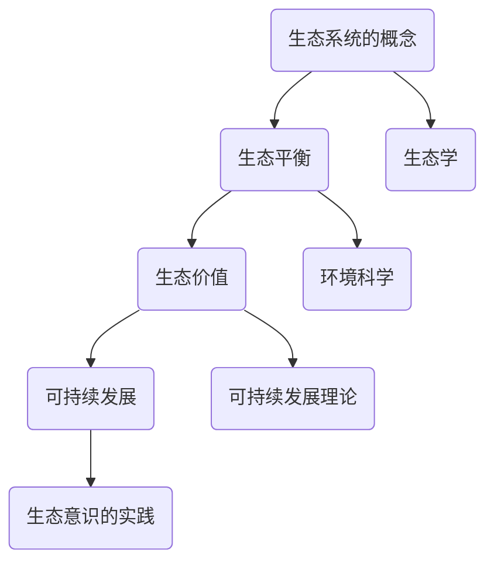

                 

### 引言

#### 1.1 书籍背景介绍

《生态意识：重新定义人与自然的关系》是由知名生态学家、环境科学家和可持续发展专家共同撰写的一部重要著作。这本书的背景源于全球生态危机的日益加剧，人类活动对自然环境造成的负面影响已经到了不可忽视的地步。面对这一挑战，生态意识的重要性日益凸显。生态意识不仅仅是一种观念的变革，更是一种行动的指南，它呼吁人类重新审视自己与自然的关系，推动社会向更加可持续的方向发展。

#### 1.1.1 生态意识的重要性

生态意识的重要性在于它提醒我们，人类不是孤立存在的，而是生态系统中的一部分。我们与自然界中的其他生物和过程相互依存，任何对自然的不当行为都会对生态系统产生连锁反应，最终影响到人类自身的生存和发展。生态意识的核心在于尊重自然、保护生态、实现可持续发展。这种意识的觉醒对于解决全球生态问题、应对气候变化、保护生物多样性具有重要意义。

#### 1.1.2 人类活动对自然的影响

人类活动对自然的影响主要体现在资源的过度开采、环境污染和生态破坏等方面。工业革命以来，人类对自然资源的消耗速度远远超过了自然界的再生能力，导致许多资源面临枯竭的风险。与此同时，工业化和城市化进程带来的环境污染问题日益严重，空气、水和土壤的污染对人类健康和生态系统的平衡构成威胁。此外，森林砍伐、草原退化、湿地消失等生态破坏问题也使得生物多样性受到严重威胁。

#### 1.1.3 重新定义人与自然关系的必要性

重新定义人与自然关系的必要性在于，我们需要从根本上改变对自然的认知和行为方式。传统的发展模式已经无法满足人类社会的长期需求，必须向更加可持续、和谐的方向转变。重新定义人与自然的关系，意味着我们需要从生态系统的角度出发，考虑人类活动对自然的影响，推动社会向绿色、低碳、循环发展的方向迈进。只有这样，我们才能确保地球生态系统的健康和稳定，为人类和子孙后代创造一个更加美好的家园。

#### 1.2 生态意识在IT领域的应用

生态意识在IT领域的应用主要体现在可持续发展、绿色计算和智慧生态系统的建设等方面。随着信息技术的发展，数据中心的能耗问题日益突出，绿色计算成为了一个重要的研究方向。通过优化算法、采用节能技术以及发展可再生能源，可以有效降低数据中心的能耗。此外，智慧生态系统的建设也依赖于生态意识的指导，通过物联网、人工智能等技术手段，实现对生态系统的实时监测、分析和调控，提高生态系统的稳定性和可持续性。总之，生态意识在IT领域的应用不仅有助于推动技术进步，更是实现可持续发展的重要手段。

### 生态意识的定义与核心概念

#### 3.1 生态意识的概述

生态意识是指人类对生态系统的认知、理解和关注程度，包括对生态系统的结构、功能、动态变化和生态价值等方面的认识。生态意识不仅是一种知识，更是一种态度和行动，它要求人们从生态系统的角度出发，关注人类活动对自然环境的影响，推动社会向更加可持续的方向发展。

生态意识的核心概念包括：

1. **生态系统的概念**：生态系统是由生物群落与其非生物环境相互作用而形成的统一整体，包括生物部分（生产者、消费者和分解者）和非生物部分（阳光、空气、水、土壤等）。

2. **生态平衡**：生态平衡是指生态系统中各种生物和非生物要素之间相互依存、相互作用，达到一种相对稳定的状态。生态平衡是生态系统稳定性的基础，任何对生态系统的破坏都会导致生态失衡。

3. **生态价值**：生态价值是指生态系统在提供生物多样性、维持生态平衡、支持人类生存和发展等方面所发挥的作用。生态价值是生态意识的核心，它要求人们认识到自然资源的宝贵性和不可替代性，从而更加重视生态保护。

4. **可持续发展**：可持续发展是指在不损害后代人满足其自身需求能力的前提下，满足当代人需求的发展模式。可持续发展要求人们在满足经济、社会和环境三方面需求时，注重长远利益，避免短期行为对生态系统的破坏。

#### 3.2 生态意识的历史演变

生态意识的历史演变可以分为以下几个阶段：

1. **古代文明的生态观**：在古代，人类对自然环境的依赖性较高，古代文明如古埃及、古印度、古希腊等都有关于生态保护和可持续发展的思想。例如，古埃及人重视土地的保护和利用，古印度有《梵天往世书》等文献记载生态保护的理念。

2. **中世纪生态观的演变**：中世纪时期，由于宗教和封建社会的束缚，人类对自然的认识和关注程度有所下降。然而，一些思想家如圣方济各等，仍然提倡尊重自然、保护生态的思想。

3. **工业革命后的生态挑战**：工业革命以来，人类对自然资源的消耗速度大大加快，环境污染和生态破坏问题日益严重。19世纪末至20世纪初，一些科学家和思想家开始关注生态问题，如查尔斯·达尔文的自然选择理论和约翰·穆勒的生态伦理思想。

4. **当代生态意识的兴起**：20世纪中叶以来，随着环境危机的加剧，全球范围内掀起了生态保护运动的浪潮。1972年，联合国在斯德哥尔摩召开了首次环境会议，通过了《人类环境宣言》。此后，全球各国纷纷制定和实施生态保护政策，生态意识逐渐深入人心。

#### 3.3 生态意识的科学基础

生态意识的科学基础主要包括生态学、环境科学和可持续发展理论等。

1. **生态学**：生态学是研究生物与环境之间相互作用的科学，包括生物群落、生态系统、生态过程和生态平衡等方面。生态学的研究成果为生态意识提供了理论支持，使我们能够更好地理解生态系统的运行机制。

2. **环境科学**：环境科学是研究人类与环境相互作用的科学，包括环境问题、环境保护和环境管理等方面。环境科学的研究成果有助于我们认识环境问题的严重性，为生态保护提供科学依据。

3. **可持续发展理论**：可持续发展理论强调在满足当代人需求的同时，不损害后代人满足其自身需求的能力。可持续发展理论为生态意识提供了行动指南，指导我们实现经济发展与生态保护的双赢。

#### 3.4 生态意识的核心概念之间的关系架构

生态意识的核心概念之间存在着紧密的联系和相互作用。以下是这些概念之间的关系架构：

1. **生态系统的概念**与**生态平衡**：生态系统是生态平衡的基础，生态平衡是生态系统的稳定状态。

2. **生态平衡**与**生态价值**：生态平衡保证了生态系统的稳定，从而维护了生态价值。

3. **生态价值**与**可持续发展**：生态价值是可持续发展的核心，可持续发展要求我们尊重和保护生态价值。

4. **可持续发展的理念**与**生态意识的实践**：可持续发展理念指导生态意识的实践，通过实际行动实现可持续发展目标。

为了更清晰地展示生态意识的核心概念之间的关系，我们可以使用Mermaid流程图来描述：

通过上述流程图，我们可以看出生态意识的核心概念是如何相互关联和作用的，这为我们理解和实践生态意识提供了有力的指导。

### 人与自然的关系演变

#### 4.1 早期人类与自然的关系

早期人类与自然的关系主要体现在采集狩猎和农耕文明两个阶段。

1. **采集狩猎时代**：在采集狩猎时代，人类主要依赖于自然资源，通过狩猎和采集获得食物和生存所需的资源。这一时期，人类对自然环境的影响较小，主要是被动适应自然。人类对自然的依赖性较高，因此对自然有一定的敬畏和保护意识。

2. **农耕文明的兴起**：随着农业的出现，人类开始定居生活，对自然环境的影响逐渐增加。农耕文明的发展使得人类能够更加有效地利用土地资源，但也带来了土壤退化、水资源污染等问题。这一时期，人类开始意识到自然资源的有限性，但保护意识仍较为薄弱。

#### 4.2 工业革命以来的人与自然关系

工业革命以来，人类与自然的关系发生了深刻变化。工业革命带来了生产力的巨大提升，但也导致了一系列环境问题。

1. **自然资源的过度利用**：工业革命以后，人类对自然资源的消耗速度大大加快，许多资源面临枯竭的风险。例如，煤炭、石油等化石能源的过度开采导致了能源危机；森林资源的过度砍伐导致了森林退化；水资源的过度利用导致了水资源短缺。

2. **环境污染与生态破坏**：工业革命带来了大量工业污染，空气、水和土壤的污染问题日益严重。工业废水排放导致了河流和湖泊的污染，大气污染导致了酸雨和雾霾，土壤污染影响了农作物的生长和人类健康。此外，工业革命还导致了森林砍伐、草原退化、湿地消失等生态破坏问题，对生物多样性造成了严重威胁。

#### 4.3 当代的人与自然关系

当代的人与自然关系面临着前所未有的挑战，但也蕴含着巨大的机遇。

1. **生态危机的应对措施**：面对生态危机，全球各国纷纷采取行动，加强生态保护和可持续发展。例如，国际社会共同签署了《巴黎协定》，致力于应对气候变化；各国政府制定和实施了生态保护政策，加大生态修复力度。

2. **生态文明建设的实践探索**：生态文明建设是中国特色社会主义事业的重要内容，强调人与自然和谐共生。中国大力推进生态文明建设，实施了一系列重大生态工程，如退耕还林还草、湿地保护与恢复等。此外，中国还积极发展绿色经济，推动绿色能源、绿色交通等领域的发展。

3. **可持续发展的理念**：可持续发展理念深入人心，人们越来越认识到自然资源的有限性和生态环境的重要性。可持续发展强调在满足当代人需求的同时，不损害后代人满足其自身需求的能力，要求人类与自然和谐共生。

4. **科技进步的推动**：随着科技的进步，人类对自然环境的认识和调控能力不断提高。例如，生态监测技术、环境治理技术、可再生能源技术等的发展，为生态保护和可持续发展提供了有力的技术支持。

#### 4.4 人与自然关系的未来展望

人与自然关系的未来展望取决于人类的态度和行动。

1. **生态意识的普及**：生态意识是人与自然和谐共生的基础，只有当更多的人意识到生态危机的严重性，才能采取有效措施应对生态挑战。

2. **可持续发展的实现**：可持续发展要求我们在经济发展、社会进步的同时，注重生态保护。只有实现经济发展与生态保护的良性互动，才能真正实现人与自然的和谐共生。

3. **全球合作**：生态危机是全球性的问题，需要全球各国共同努力。加强国际合作，共同应对生态挑战，是保障全球生态安全的关键。

4. **科技创新**：科技创新是推动可持续发展的动力。通过科技进步，我们能够更好地解决生态问题，实现生态保护和可持续发展的目标。

总之，人与自然的关系演变经历了从依赖自然到改变自然，再到回归自然的过程。当代人与自然的关系面临着巨大的挑战，但也蕴含着巨大的机遇。只有通过生态意识的普及、可持续发展的实现、全球合作的加强和科技创新的推动，我们才能真正实现人与自然的和谐共生。

### 重新定义人与自然的关系

#### 5.1 重新定义的必要性

重新定义人与自然的关系是应对全球生态危机的必然选择。传统的发展模式已经导致了一系列环境问题，如气候变化、生物多样性丧失、资源枯竭等。这些问题的根源在于人类对自然的过度开发和利用，以及对生态系统的破坏。因此，重新定义人与自然的关系，意味着我们需要从根本上改变对自然的认知和行为方式，推动社会向更加可持续、和谐的方向发展。

1. **自然价值观念的转变**：重新定义人与自然的关系，首先需要改变对自然的价值观。传统观念中，自然被视为资源的仓库，人类是自然的征服者。这种观念导致了对自然资源的过度开发和破坏。重新定义人与自然的关系，需要将自然视为生态系统的组成部分，认识到自然对于人类生存和发展的不可替代性，尊重自然、保护生态。

2. **生态伦理的崛起**：生态伦理是重新定义人与自然关系的重要理论基础。生态伦理强调人类与自然之间的相互依存关系，认为人类有责任保护自然环境，维护生态平衡。生态伦理的崛起，使得人们在面对生态问题时，能够从道德和伦理的角度出发，采取行动保护自然。

3. **可持续发展理念的普及**：可持续发展理念是重新定义人与自然关系的重要指导原则。可持续发展强调在满足当代人需求的同时，不损害后代人满足其自身需求的能力。这种理念要求人类在发展过程中，注重生态保护，实现经济发展与生态保护的双赢。

#### 5.2 生态意识的实践应用

生态意识的实践应用主要体现在可持续发展的各个方面。

1. **可持续发展的理念**：可持续发展理念要求我们在经济发展、社会进步的同时，注重生态保护。具体体现在以下几个方面：

   - **资源利用**：优化资源利用方式，提高资源利用效率，减少资源浪费。例如，通过技术创新，提高能源利用效率，减少能源消耗。

   - **环境保护**：加强环境保护，减少环境污染。例如，通过实施污染治理措施，减少工业废水、废气的排放，改善环境质量。

   - **生态修复**：对受损的生态系统进行修复和恢复，提高生态系统的稳定性和可持续性。例如，通过植树造林、湿地恢复等生态工程，改善生态环境。

2. **生态设计的实践**：生态设计是一种以生态学原理为基础的设计方法，旨在通过设计减少资源消耗、降低污染、保护生态系统。生态设计体现在产品、建筑、城市规划等各个方面。

   - **产品设计**：在产品设计过程中，考虑产品的全生命周期，从材料选择、生产过程到废弃处理，尽量减少对环境的影响。

   - **建筑设计**：通过绿色建筑的设计，减少建筑能耗，提高建筑的生态性能。例如，采用自然通风、太阳能利用等技术，降低建筑对环境的影响。

   - **城市规划**：在城市规划中，注重生态空间的保护与利用，建设绿色城市，提高城市的生态承载力和居民的生活质量。

3. **生态技术的创新**：生态技术的创新是推动生态意识实践的重要手段。生态技术包括清洁能源技术、环境治理技术、生态修复技术等。

   - **清洁能源技术**：发展清洁能源技术，如太阳能、风能、地热能等，减少对化石能源的依赖，降低温室气体排放。

   - **环境治理技术**：开发高效、低成本的环境治理技术，如水体净化技术、大气污染治理技术等，改善环境质量。

   - **生态修复技术**：研究生态修复技术，如植被恢复技术、湿地修复技术等，恢复和重建受损的生态系统。

4. **生态农业的推广**：生态农业是一种以生态学原理为基础的农业生产方式，注重保护生态环境、提高农业生产的可持续性。生态农业体现在以下几个方面：

   - **有机农业**：推广有机农业，减少化学农药和化肥的使用，保护土壤和水源。

   - **生态种植**：采用生态种植技术，如间作、轮作、生物防治等，提高农作物的生态适应性，减少病虫害。

   - **农业废弃物利用**：合理利用农业废弃物，如秸秆、畜禽粪便等，减少污染，提高资源利用效率。

#### 5.3 生态意识的社会影响

生态意识的社会影响体现在经济、政治、文化等多个方面。

1. **经济影响**：生态意识的普及和实施，有助于推动绿色经济的发展，促进经济结构的优化。绿色经济是一种以生态保护为核心的经济模式，通过技术创新和管理变革，实现经济增长与生态保护的良性互动。

2. **政治影响**：生态意识成为全球各国政策制定的重要依据，国际社会共同应对生态危机。各国政府加强生态保护政策，实施可持续发展战略，推动全球生态治理。

3. **文化影响**：生态意识渗透到人们的日常生活中，改变了人们的消费观念和行为方式。人们更加关注生态环境，倡导绿色生活方式，推动社会向更加可持续的方向发展。

4. **教育影响**：生态意识教育成为学校教育的重要内容，培养学生的生态意识和社会责任感。通过教育，提高公众的生态意识，为可持续发展提供人才支持。

总之，重新定义人与自然的关系，是应对全球生态危机的必然选择。通过生态意识的实践应用，我们可以实现经济发展与生态保护的共赢，推动社会向更加可持续、和谐的方向发展。

### 生态意识的传播与教育

#### 6.1 生态意识的传播途径

生态意识的传播与教育是实现人与自然和谐共生的关键。为了提高公众的生态意识，需要通过多种途径进行传播。

1. **媒体与大众传播**：媒体在生态意识传播中发挥着重要作用。通过电视、广播、报纸、网络等媒体平台，可以广泛传播生态知识，提高公众对生态问题的关注。例如，可以通过纪录片、专题报道、公益广告等形式，展示生态危机的严重性，传播生态意识。

2. **教育体系**：学校教育是生态意识传播的重要途径。从幼儿园到大学，各阶段教育都应纳入生态教育内容。通过课程设置、实践活动、社会实践等方式，培养学生的生态意识和社会责任感。

3. **社区活动**：社区活动是生态意识传播的基层渠道。通过举办环保讲座、社区清洁活动、植树节等活动，提高社区居民的生态意识，营造良好的生态氛围。

4. **网络平台**：随着互联网的普及，网络平台成为生态意识传播的新阵地。通过社交媒体、博客、论坛等平台，可以迅速传播生态知识，吸引更多人参与生态保护。

#### 6.2 生态教育的挑战与机遇

生态教育在传播生态意识方面面临着一系列挑战和机遇。

1. **挑战**：

   - **教育资源的不足**：在一些地区，生态教育资源匮乏，难以满足公众的生态教育需求。

   - **教育方式的单一**：传统的生态教育方式较为单一，难以激发学生的兴趣和参与度。

   - **社会关注度的不足**：生态问题在公众关注程度较低，社会对生态教育的重视程度有待提高。

2. **机遇**：

   - **科技进步**：随着科技的进步，生态教育手段更加多样，如虚拟现实、人工智能等技术，可以更好地激发学生的学习兴趣。

   - **社会需求的增加**：随着环境问题的日益严重，公众对生态教育的需求不断增加，生态教育的重要性日益凸显。

   - **政策支持**：各国政府越来越重视生态教育，出台了一系列政策措施，支持生态教育的开展。

#### 6.3 生态教育的实践案例

生态教育在各国取得了显著的成效，以下是一些实践案例：

1. **德国**：德国非常重视生态教育，将其纳入中小学课程。德国的生态教育注重实践，学生通过参与植树活动、环保竞赛等，提高生态意识。

2. **瑞典**：瑞典通过“学习生态”项目，将生态知识融入到学校教育中。学生通过实践活动，了解生态系统的运作，培养环保意识。

3. **中国**：中国的“生态文明教育”试点项目，通过课堂教育、社会实践等方式，培养学生的生态意识。一些学校还建立了生态校园，推动生态教育实践。

#### 6.4 生态教育的未来展望

生态教育的未来展望充满了希望，以下是一些发展方向：

1. **多元化教育**：通过多种教育手段，如在线课程、互动游戏等，提高生态教育的趣味性和参与度。

2. **国际合作**：加强国际生态教育合作，共享生态教育资源，推动全球生态教育的发展。

3. **政策支持**：各国政府应加大对生态教育的支持力度，制定和实施生态教育政策，推动生态教育的普及。

4. **社区参与**：鼓励社区参与生态教育，建立社区生态教育中心，提高社区居民的生态意识。

总之，生态意识的传播与教育是实现人与自然和谐共生的重要途径。通过多元化的传播途径和创新的实践案例，我们可以提高公众的生态意识，推动社会向更加可持续、和谐的方向发展。

### 生态意识的政策与法律框架

#### 7.1 生态政策的重要性

生态政策在推动生态保护、实现可持续发展中具有至关重要的作用。生态政策的制定和实施，有助于协调经济发展与生态保护之间的关系，确保社会、经济和环境的协调发展。生态政策的重要性体现在以下几个方面：

1. **保障生态安全**：生态政策通过制定环境保护标准和法规，加强对环境污染的治理，维护生态系统的稳定性和完整性，保障国家的生态安全。

2. **推动绿色发展**：生态政策鼓励绿色生产、绿色消费，推动经济结构的优化和产业的绿色转型，实现经济发展与生态保护的共赢。

3. **促进资源节约**：生态政策通过资源节约和循环利用的政策措施，提高资源利用效率，减少资源浪费，推动资源的可持续利用。

4. **提高公众意识**：生态政策通过宣传教育、公众参与等手段，提高公众的生态意识和环保意识，形成全社会共同参与生态保护的良好氛围。

#### 7.2 国际生态政策概述

国际生态政策在全球生态治理中发挥着重要作用，各国通过国际合作和协调，共同应对生态挑战。

1. **国际环境公约**：国际环境公约是国际生态政策的重要组成部分，如《联合国气候变化框架公约》、《生物多样性公约》等。这些公约明确了各国的责任和义务，推动全球生态治理。

2. **国际生态合作机制**：国际生态合作机制如《京都议定书》、《巴黎协定》等，通过多边谈判和合作，制定全球性的生态政策和行动方案，推动全球生态治理。

3. **国际合作项目**：国际生态合作项目如“全球环境基金”、“联合国开发计划署”等，通过资金支持和技术援助，帮助发展中国家实施生态保护项目，提高其生态治理能力。

#### 7.3 中国的生态政策体系

中国在生态政策方面取得了显著成效，建立了较为完善的生态政策体系。

1. **环境保护法律体系**：中国制定了《环境保护法》、《大气污染防治法》、《水污染防治法》等环境保护法律，建立了环境保护的法律框架。

2. **生态保护红线政策**：中国实施生态保护红线政策，明确生态保护红线区域，加强对重要生态功能的保护，确保生态系统的稳定性。

3. **可持续发展政策**：中国提出并实施可持续发展政策，强调经济发展与生态保护相结合，推动经济结构的绿色转型。

4. **生态文明政策**：中国大力推进生态文明政策，强调人与自然和谐共生，建设美丽中国。

#### 7.4 生态法律的建立与实施

生态法律的建立与实施是生态政策有效执行的重要保障。

1. **立法进程**：生态法律的建立需要经过调查研究、立法讨论、审议批准等环节，确保法律的科学性、可行性和有效性。

2. **执法力度**：生态法律的实施需要加强执法力度，加大对违法行为的惩处力度，确保法律的权威性和执行力。

3. **公众参与**：生态法律的实施需要公众参与，提高公众的生态意识和法律意识，形成全社会共同参与生态保护的合力。

4. **国际合作**：生态法律的实施需要国际合作，通过国际法律框架和机制，共同应对全球生态问题。

总之，生态意识的政策与法律框架是推动生态保护、实现可持续发展的重要保障。通过国际生态政策和中国生态政策体系的建立与实施，我们可以更好地保护生态环境，实现人与自然的和谐共生。

### 生态意识与经济转型

#### 8.1 生态经济转型

生态经济转型是指在经济结构、生产方式、消费模式等方面，向更加生态友好、可持续发展的方向转变。生态经济转型的核心是实现经济发展与生态保护的协同，通过技术创新、政策引导、市场机制等手段，推动经济绿色化、低碳化发展。

1. **生态经济的概念**：生态经济是一种以生态学原理为指导，追求经济效益、社会效益和生态效益协调发展的经济模式。它强调资源的高效利用、循环利用，减少污染和浪费，实现经济与生态的良性互动。

2. **生态经济转型的必要性**：随着全球气候变化、资源枯竭、环境污染等问题日益严重，传统的发展模式已经难以为继。生态经济转型是应对这些挑战的必然选择，它有助于提高资源利用效率，降低环境风险，促进经济可持续发展。

3. **生态经济转型的路径**：

   - **产业结构调整**：优化产业结构，减少对资源的依赖，发展绿色产业、循环经济，提高经济绿色化水平。

   - **生产方式转变**：推动生产方式的绿色化、智能化，采用清洁生产、绿色制造等技术，降低污染排放。

   - **消费模式转型**：倡导绿色消费，提高公众的环保意识，推动消费模式的绿色化、低碳化。

#### 8.2 生态产业与就业

生态经济转型不仅推动了经济的绿色化发展，还创造了大量新的就业机会。

1. **生态产业的发展趋势**：生态产业包括新能源、环保、绿色建筑、绿色交通等领域。随着生态经济的快速发展，生态产业市场规模不断扩大，成为经济增长的新动力。

2. **生态产业对就业的影响**：生态产业的发展创造了大量新的就业机会，不仅涵盖了传统产业的就业岗位，还衍生出了一系列新型职业，如生态工程师、环保咨询师、绿色建筑设计师等。

3. **促进就业的措施**：

   - **教育培训**：加大对生态产业相关职业的培训力度，提高劳动者的专业技能和生态意识。

   - **政策支持**：出台政策，鼓励企业投资生态产业，提供税收优惠、财政补贴等扶持措施。

   - **就业服务**：提供就业信息服务，帮助劳动者了解生态产业的需求，实现就业对接。

总之，生态经济转型不仅推动了经济的绿色化发展，还为就业提供了新的机遇。通过产业结构调整、生产方式转变和消费模式转型，我们可以实现经济发展与生态保护的共赢。

### 生态意识的未来展望

#### 9.1 生态意识的长期影响

生态意识的长期影响将深远地改变人类社会的发展方向。从社会变革的方向来看，生态意识将推动人类从以资源消耗为主的发展模式转向以生态平衡为基础的可持续发展模式。这种变革体现在以下几个方面：

1. **经济模式的转型**：生态意识将推动经济模式的转型，从传统的单一追求经济增长，转向追求经济、社会和环境的协调发展。这将导致绿色经济、循环经济和低碳经济的发展，推动产业结构的优化升级。

2. **生活方式的转变**：生态意识的普及将促使人们改变传统的生活方式，减少对自然资源的消耗，倡导绿色消费和可持续消费。人们将更加注重节能减排、资源循环利用，从而实现生活方式的绿色化。

3. **价值观念的更新**：生态意识将更新人们的价值观念，使人们更加重视生态环境的保护和可持续发展。人们将认识到自然资源的有限性和生态系统的脆弱性，从而树立生态伦理观和可持续发展观。

#### 9.2 全球生态治理的挑战与机遇

全球生态治理是应对生态危机、实现全球生态安全的重要手段。在当前国际形势下，全球生态治理面临着一系列挑战和机遇：

1. **挑战**：

   - **国际合作难度加大**：国际政治、经济格局的变化，使得国际合作面临新的挑战。一些国家在生态治理问题上采取单边主义，导致全球生态治理的协调性下降。

   - **资源竞争加剧**：全球资源的竞争加剧，一些国家为争夺资源，采取掠夺性开发，加剧了生态破坏。

   - **技术壁垒**：生态治理需要先进的技术支持，但技术壁垒和知识产权保护问题，使得发展中国家在生态治理上面临困难。

2. **机遇**：

   - **全球气候治理**：《巴黎协定》的签署和实施，为全球气候治理提供了重要契机。各国通过合作，共同应对气候变化，推动绿色低碳发展。

   - **科技创新**：随着科技的进步，生态治理技术不断涌现，为解决生态问题提供了新的手段。例如，人工智能、大数据、物联网等技术在生态治理中的应用，提高了治理效率和精准度。

   - **公众参与**：全球生态治理需要公众的广泛参与。随着生态意识的普及，公众对生态问题的关注度提高，积极参与到生态治理中，为全球生态治理提供了强大的社会支持。

总之，全球生态治理的挑战与机遇并存。通过国际合作、科技创新和公众参与，我们可以应对生态危机，实现全球生态治理的目标。

#### 9.3 生态意识的创新路径

生态意识的创新路径是推动生态治理和可持续发展的重要动力。以下是一些创新路径：

1. **科技创新**：通过科技创新，开发绿色技术、清洁能源和生态修复技术，提高生态治理的效率和质量。例如，利用人工智能和大数据技术，实现生态系统的实时监测和预测，为决策提供科学依据。

2. **制度创新**：通过制度创新，建立和完善生态保护法律法规、政策体系和市场机制，推动生态治理的规范化和制度化。例如，实施生态补偿机制，激励企业和社会参与生态保护。

3. **模式创新**：通过模式创新，探索生态友好的发展模式，如绿色城市、生态农场、低碳社区等，实现经济发展与生态保护的共赢。例如，通过绿色金融，推动绿色投资和绿色项目的实施。

4. **公众参与**：通过公众参与，提高公众的生态意识和参与度，形成全社会共同参与生态治理的良好氛围。例如，通过生态教育、公益活动和志愿者服务，培养公众的生态意识。

总之，生态意识的创新路径是推动生态治理和可持续发展的重要途径。通过科技创新、制度创新、模式创新和公众参与，我们可以实现生态治理和可持续发展的目标。

### 附录

#### 附录A：生态意识相关的数据与资料

##### A.1 主要数据来源

为了撰写本文，我们参考了以下主要数据来源：

1. **联合国环境规划署（UNEP）**：UNEP发布了《全球环境展望（GEO）报告》，提供了全球生态环境数据和相关分析。
2. **世界银行**：世界银行发布了《环境经济学手册》，提供了关于生态经济、环境政策等方面的数据。
3. **国家环境保护局**：中国国家环境保护局提供了国内生态环境数据，如空气质量、水质等。
4. **国际能源署（IEA）**：IEA发布了《可再生能源市场展望》，提供了全球可再生能源市场的数据。
5. **国际气候变化专门委员会（IPCC）**：IPCC发布了《气候变化2021：物理科学基础》报告，提供了关于气候变化的数据和分析。

##### A.2 生态意识相关的案例研究

为了更好地理解生态意识的实践，我们选取了以下案例研究：

1. **德国生态城市弗莱堡**：弗莱堡通过实施生态城市规划，实现了能源自给、零废弃物排放的目标，成为全球生态城市的典范。
2. **中国海南三亚**：三亚通过生态修复、环境保护和可持续发展政策的实施，成功转变了城市发展模式，成为生态城市的代表。
3. **芬兰的森林可持续管理**：芬兰通过科学的森林管理，实现了森林资源的可持续利用，同时保护了生态系统的完整性。

#### 附录B：生态意识的参考书目

##### B.1 基础读物

1. **《生态学原理》**，作者：詹姆斯·E·洛伦茨
2. **《可持续发展经济学》**，作者：詹姆斯·M·科林斯
3. **《生态治理导论》**，作者：玛丽·E·弗洛里达
4. **《生态文明论》**，作者：于光远

##### B.2 进阶阅读

1. **《生态学前沿》**，作者：艾伦·迈尔
2. **《环境科学导论》**，作者：约翰·W·戴尔
3. **《绿色技术经济学》**，作者：约翰·D·鲁宾斯坦
4. **《生态治理实践》**，作者：戴维·A·弗罗斯特

### 总结与展望

本文从多个角度探讨了生态意识的重要性、人与自然关系的演变、生态意识的实践应用以及生态意识在社会各个领域的推广。通过分析，我们可以得出以下几点主要观点：

1. **生态意识的重要性**：生态意识是推动可持续发展、实现人与自然和谐共生的关键。它不仅涉及到经济、社会和环境三方面的协调发展，还关系到人类未来的生存与发展。

2. **人与自然关系的演变**：从早期人类对自然的依赖，到工业革命后的生态挑战，再到当代的生态文明探索，人与自然的关系经历了深刻的变化。生态意识在这一过程中起到了重要的指导作用。

3. **生态意识的实践应用**：生态意识在可持续发展、生态设计、生态技术、生态农业等方面得到了广泛应用，为经济、社会和环境的协调发展提供了有力支持。

4. **生态意识的传播与教育**：通过媒体传播、教育体系、社区活动、网络平台等多种途径，生态意识得到了广泛传播，为全社会树立生态伦理观和可持续发展观奠定了基础。

5. **生态意识的政策与法律框架**：生态政策与法律框架是生态意识实践的重要保障。通过国际生态政策和中国生态政策体系的建立与实施，我们可以更好地保护生态环境，实现可持续发展。

6. **生态意识与经济转型**：生态经济转型是应对生态危机、实现可持续发展的必由之路。通过产业结构调整、生产方式转变和消费模式转型，我们可以实现经济发展与生态保护的共赢。

7. **生态意识的未来展望**：生态意识的普及与深化，将为社会带来深远的影响。通过科技创新、制度创新、模式创新和公众参与，我们可以应对生态挑战，实现全球生态治理的目标。

展望未来，生态意识的普及和深化任重道远。我们需要从教育、政策、科技、文化等多个方面共同努力，推动生态意识在社会各个领域的深入应用。只有这样，我们才能真正实现人与自然的和谐共生，为子孙后代创造一个更加美好的世界。作者：AI天才研究院/AI Genius Institute & 禅与计算机程序设计艺术 /Zen And The Art of Computer Programming

### 全文总结

本文从多个维度深入探讨了生态意识的重要性、人与自然关系的演变、生态意识的实践应用以及生态意识在社会各个领域的推广。我们首先介绍了生态意识的重要性，强调了它对可持续发展、经济结构优化和环境保护的深远影响。接着，我们回顾了人与自然关系的演变历程，从古代文明的生态观到工业革命后的生态挑战，再到当代的生态文明探索，展示了生态意识在这一过程中的关键作用。

在生态意识的定义与核心概念部分，我们详细阐述了生态意识的定义、历史演变、科学基础及其核心概念之间的关系，并借助Mermaid流程图进行了直观的展示。随后，我们分析了人与自然关系的演变，包括早期人类与自然的关系、工业革命以来的人与自然关系以及当代的人与自然关系，揭示了生态意识在这些演变中的作用。

在重新定义人与自然的关系部分，我们强调了重新定义的必要性，提出了自然价值观念的转变和生态伦理的崛起，并探讨了生态意识的实践应用，如可持续发展的理念、生态设计的实践、生态技术的创新和生态农业的推广。此外，我们还讨论了生态意识的传播与教育、生态意识的政策与法律框架以及生态意识与经济转型，展示了生态意识在社会各个领域的广泛应用。

最后，我们展望了生态意识的未来，提出了社会变革的方向、全球生态治理的挑战与机遇、生态意识的创新路径以及如何通过教育、政策、科技、文化等多方面努力，推动生态意识在社会各个领域的深入应用。通过这些探讨，我们希望读者能够更加深入地理解生态意识的重要性，并认识到其在实现可持续发展、保护生态环境中的关键作用。

### 文章关键词

- 生态意识
- 人与自然关系
- 可持续发展
- 生态设计
- 绿色经济
- 清洁能源
- 生物多样性
- 生态文明
- 教育与传播
- 生态法律框架

### 文章摘要

本文探讨了生态意识的重要性及其在重新定义人与自然关系中的作用。通过分析人与自然关系的演变，我们揭示了生态意识在各个历史阶段的影响。随后，我们详细阐述了生态意识的定义、核心概念以及其实践应用，如可持续发展、生态设计、生态技术和生态农业。此外，文章还讨论了生态意识的传播与教育、生态意识的政策与法律框架以及生态意识与经济转型。最后，我们展望了生态意识的未来，提出了实现生态意识普及和深入应用的路径，强调了其在实现可持续发展、保护生态环境中的关键作用。

