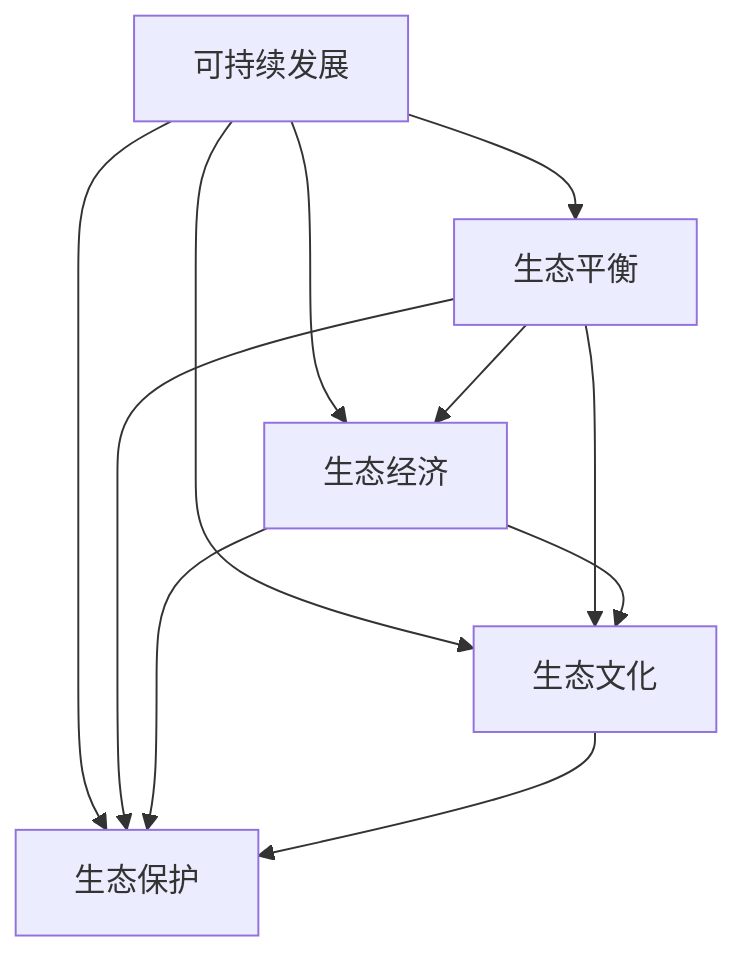

                 

### 文章标题

# 生态文明：人与自然和谐共生的理想

### 关键词
- 生态文明
- 和谐共生
- 可持续发展
- 人与自然关系
- 生态经济
- 生态保护

### 摘要
本文旨在探讨生态文明的概念、理论基础及其在人与自然和谐共生中的重要作用。通过对生态文明的起源、内涵、理论基础、实践探索、核心内容、案例分析以及未来展望的详细分析，本文揭示了生态文明在推动社会可持续发展中的关键作用。文章运用逻辑清晰、结构紧凑、简单易懂的专业语言，结合流程图、伪代码、数学模型和实际案例，全面展示了生态文明的理念与实践路径。

## 引言

### 背景介绍

生态文明作为一种全新的发展理念，源于人类对自然资源的过度开发和环境污染问题的深刻反思。在工业革命之后，人类凭借科技和生产力的大幅提升，迅速实现了经济的快速增长。然而，这一过程中也带来了严重的生态问题，如资源枯竭、环境污染、生态破坏等。这些问题不仅威胁到人类的生存环境，也影响了全球的生态平衡。面对这一挑战，人类社会开始寻求新的发展模式，生态文明理念应运而生。

生态文明的提出，旨在强调人与自然的和谐共生，追求经济、社会和生态系统的可持续发展。它不仅仅是一种环境意识，更是一种全面的社会发展理念，涉及经济、政治、文化、教育等多个领域。生态文明强调资源的高效利用和循环利用，倡导绿色科技和绿色产业，推动社会向低消耗、低排放、高效率的方向发展。

### 核心概念与联系

生态文明的核心概念包括：可持续发展、生态平衡、生态经济、生态文化、生态保护等。这些概念之间相互关联，共同构成了生态文明的理论框架。

- **可持续发展**：指既满足当代人的需求，又不损害后代人满足其需求的能力。它强调经济、社会和生态的协调发展，是生态文明的核心目标。
- **生态平衡**：指生态系统中各种生物和环境因素之间的相互关系和动态平衡。生态平衡是维持生态系统稳定性和功能性的基础。
- **生态经济**：是一种以生态系统为基础，实现经济、社会和生态效益协调统一的经济发展模式。它强调资源的可持续利用和生态保护。
- **生态文化**：是一种尊重自然、和谐共生、可持续发展的文化观念。它涉及人们的价值观、生活方式、行为规范等多个方面。
- **生态保护**：指采取各种措施保护生态环境，防止生态破坏和污染。生态保护是生态文明的重要保障。

为了更好地理解这些核心概念之间的关系，我们可以使用Mermaid流程图来展示它们之间的联系：

通过这个流程图，我们可以清晰地看到，可持续发展是生态文明的核心目标，而生态平衡、生态经济、生态文化和生态保护是实现这一目标的重要手段和保障。这些概念之间相互关联，共同构成了生态文明的理论基础。

### 文章结构概述

本文分为三个主要部分：

**第一部分：引论**

本文的第一部分将对生态文明进行概述，首先介绍其起源和发展背景，然后定义生态文明的概念和内涵，并探讨其与可持续发展的关系。此外，还将阐述人与自然和谐共生的必要性，并引入相关的理论基础。

**第二部分：生态文明的核心内容**

在第二部分，本文将深入探讨生态文明的核心内容，包括生态经济、生态文化、生态环境保护与修复等。通过详细的理论分析和实践案例，本文将展示这些核心内容在实现人与自然和谐共生中的重要作用。

**第三部分：案例分析与实践指南**

第三部分将结合国内外生态文明的实践案例，分析其成功经验和挑战，并提出具体的实践指南。此外，本文还将展望生态文明的未来发展趋势，提出政策建议和科技支撑方向，以期为生态文明的推进提供有益的参考。

通过以上三个部分的详细分析，本文旨在为读者提供一部全面、深入、实用的生态文明研究著作，助力实现人与自然的和谐共生。希望这篇文章能够引发读者对于生态文明的思考和关注，共同为构建美丽中国和人类命运共同体贡献力量。让我们开始这场智慧与理念的探索之旅。

