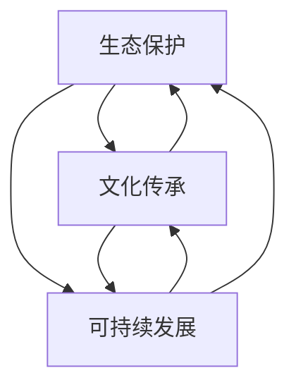

                 

### 文章标题

《生态旅游：在自然体验中重新定义旅行》

### 文章关键词

- 生态旅游
- 可持续发展
- 自然体验
- 旅游规划
- 科技应用

### 文章摘要

随着全球环境问题的日益严峻，生态旅游作为一种可持续的旅游模式，正在逐渐改变人们对旅行的传统认知。本文将从生态旅游的定义、意义、设计原则、市场营销以及未来发展趋势等方面进行探讨，旨在揭示生态旅游在自然体验中的独特魅力，并重新定义现代旅行方式。

---

### 目录

1. **引言**
   - **生态旅游的背景与重要性**
   - **文章结构概述**

2. **生态旅游的基本概念**
   - **定义与历史发展**
   - **核心概念与联系**
   - **Mermaid 流程图**

3. **生态旅游的核心概念与联系**
   - **生态保护**
   - **文化传承**
   - **可持续发展**

4. **生态旅游的设计与实践**
   - **目的地规划**
   - **体验设计**
   - **营销策略**

5. **科技在生态旅游中的应用**
   - **新技术介绍**
   - **科技影响分析**
   - **科技应用案例**

6. **生态旅游的未来发展趋势**
   - **发展方向**
   - **挑战与机遇**
   - **未来展望**

7. **附录**
   - **相关资源与工具**
   - **法律法规**

8. **结语**
   - **最佳实践 tips**
   - **小结与注意事项**
   - **拓展阅读**

---

### 1. 引言

#### 生态旅游的背景与重要性

随着旅游业的高速发展，传统的旅游模式对环境造成了巨大的压力。旅游活动带来的污染、生态破坏、资源浪费等问题日益严重，引发了社会各界的广泛关注。在这种背景下，生态旅游作为一种新的旅游模式应运而生，它强调在旅游过程中对生态环境的保护和可持续发展，旨在通过自然体验重新定义旅行方式。

生态旅游不仅仅是一种旅游活动，更是一种生活方式和价值观的体现。它倡导人们尊重自然、保护生态，通过亲近自然、体验自然来提高环保意识，促进人与自然的和谐共生。生态旅游的重要性不仅体现在环境保护上，还涉及到文化传承、社会经济发展等多个方面。

#### 文章结构概述

本文将从生态旅游的基本概念、设计原则、实践方法、市场营销以及未来发展趋势等方面进行深入探讨。文章结构如下：

- **第一部分：生态旅游的基本概念**：介绍生态旅游的定义、历史发展和核心概念。
- **第二部分：生态旅游的核心概念与联系**：探讨生态保护、文化传承和可持续发展等核心概念之间的关系。
- **第三部分：生态旅游的设计与实践**：介绍生态旅游目的地规划、体验设计和营销策略。
- **第四部分：科技在生态旅游中的应用**：分析新技术在生态旅游中的应用及其影响。
- **第五部分：生态旅游的未来发展趋势**：探讨生态旅游的未来方向、挑战与机遇。
- **第六部分：附录**：提供生态旅游相关的资源与工具以及法律法规信息。
- **结语**：总结生态旅游的重要性和未来展望。

通过以上结构，本文旨在为读者提供一个全面、系统的生态旅游概述，帮助人们更好地理解生态旅游的概念、意义和实践方法。

---

### 2. 生态旅游的基本概念

#### 定义与历史发展

生态旅游（Ecotourism）最早可以追溯到20世纪60年代，起源于美国。当时，随着环境运动的兴起，人们开始关注环境问题，提出了在旅游活动中保护环境的理念。1975年，国际自然保护联盟（IUCN）首次提出了“生态旅游”这一术语，并将其定义为“为了保护自然环境和提高游客环境意识而开展的旅游活动”。

生态旅游的定义涵盖了以下几个方面：

- **自然性**：生态旅游的核心是亲近自然，游客参与的活动通常涉及自然环境，如徒步、观鸟、潜水等。
- **保护性**：生态旅游强调对自然环境的保护，要求旅游活动不对环境造成破坏，并且要促进当地生态系统的可持续发展。
- **教育性**：生态旅游不仅仅是旅游活动，更是一种教育活动，通过旅游让游客了解自然环境和当地文化，提高环保意识。

生态旅游的历史发展可以分为几个阶段：

- **早期阶段（1960s-1980s）**：生态旅游的初步概念提出，主要以自然保护组织、环保志愿者为主。
- **发展阶段（1990s）**：生态旅游逐渐受到学术界、旅游企业和政府的关注，开始形成较为系统的理论体系。
- **成熟阶段（2000s至今）**：生态旅游在全球范围内得到广泛推广，成为旅游业的重要组成部分。

#### 核心概念与联系

生态旅游的核心概念包括生态保护、文化传承和可持续发展。这些概念相互联系，共同构成了生态旅游的理论框架。

- **生态保护**：生态旅游的首要目标是保护自然环境，防止旅游活动对生态系统造成破坏。生态保护不仅包括对生物多样性的保护，还包括对自然景观、水资源、土壤等自然资源的保护。
- **文化传承**：生态旅游不仅仅关注自然环境，还重视当地文化的传承。通过旅游活动，游客可以了解当地的历史文化、风俗习惯，促进文化交流和传承。
- **可持续发展**：生态旅游追求的是一种长期的、可持续的发展模式。它要求在旅游开发过程中，不仅要考虑经济利益，还要考虑社会效益和生态效益，确保旅游活动能够长期进行。

下面是一个Mermaid流程图，展示了生态旅游的核心概念与联系：

通过这个流程图，我们可以清晰地看到生态保护、文化传承和可持续发展这三个核心概念之间的互动关系。

---

### 3. 生态旅游的核心概念与联系

#### 生态保护

生态保护是生态旅游的核心概念之一。生态旅游强调在旅游过程中保护自然环境，防止对生态系统造成破坏。生态保护的内容包括：

- **生物多样性保护**：生态旅游要求游客在旅游活动中尊重动植物的生存环境，不干扰其自然行为，避免破坏生物栖息地。
- **自然景观保护**：生态旅游强调保护自然景观的完整性，不进行过度开发和破坏。
- **水资源保护**：生态旅游要求合理利用水资源，防止水污染和水资源浪费。

生态保护的理论基础是生态学，包括物种多样性、生态平衡、生态过程等概念。通过生态保护，生态旅游能够实现生态系统的可持续发展。

#### 文化传承

文化传承是生态旅游的另一个核心概念。生态旅游不仅仅关注自然环境，还重视当地文化的保护和传承。文化传承的内容包括：

- **历史文化传承**：生态旅游要求游客在旅游活动中了解当地的历史文化，尊重和保护历史遗迹。
- **民俗文化传承**：生态旅游鼓励游客参与当地的传统活动和习俗，体验当地民俗文化。
- **非物质文化遗产传承**：生态旅游关注非物质文化遗产的保护和传承，如传统手工艺、音乐、舞蹈等。

文化传承的理论基础是人类学和文化学。通过文化传承，生态旅游能够促进文化交流和融合，增强游客对当地文化的认同感。

#### 可持续发展

可持续发展是生态旅游追求的长远目标。可持续发展要求在旅游开发过程中，经济、社会和生态三个方面都能得到合理的关注和平衡。可持续发展的内容包括：

- **经济效益**：生态旅游要求旅游活动能够带来经济收益，促进当地经济发展。
- **社会效益**：生态旅游要求旅游活动能够提高当地居民的生活水平，改善社会关系。
- **生态效益**：生态旅游要求旅游活动不对自然环境造成破坏，促进生态系统的可持续发展。

可持续发展的理论基础是经济学、社会学和生态学。通过可持续发展，生态旅游能够实现旅游活动的长期可持续性。

#### 核心概念之间的关系架构

生态保护、文化传承和可持续发展是生态旅游的三个核心概念，它们之间存在着密切的联系。以下是它们之间的关系架构Mermaid流程图：

通过这个流程图，我们可以清晰地看到生态保护、文化传承和可持续发展这三个核心概念之间的互动关系。生态保护为文化传承提供了基础，文化传承为可持续发展提供了动力，而可持续发展又为生态保护和文化传承提供了保障。

---

### 4. 生态旅游的设计与实践

#### 目的地规划

生态旅游的规划是确保旅游活动能够实现可持续发展的重要环节。目的地规划主要包括以下几个方面：

- **规划原则**：生态旅游目的地规划应遵循保护性规划、可持续性规划和可访问性规划原则。保护性规划要求在旅游开发过程中对自然环境进行保护，防止生态破坏；可持续性规划要求在旅游开发过程中考虑经济、社会和生态三方面的效益，实现旅游活动的长期可持续性；可访问性规划要求在旅游开发过程中确保旅游活动的可达性和便利性。

- **规划方法**：生态旅游目的地规划的方法包括调研方法、规划流程和规划工具。调研方法主要涉及对目的地自然环境、文化资源、社会经济状况的调研；规划流程包括项目立项、规划方案设计、规划实施和规划评估；规划工具包括GIS（地理信息系统）、遥感技术、生态评估软件等。

- **规划案例**：国内外有许多成功的生态旅游目的地规划案例，如中国的张家界国家森林公园、巴西的亚马逊雨林生态旅游区。这些案例展示了如何通过科学的规划实现生态旅游的可持续发展。

#### 体验设计

生态旅游的体验设计是提升游客满意度、实现生态保护与经济发展双赢的关键。体验设计主要包括以下几个方面：

- **体验内容**：生态旅游的体验内容丰富多样，包括自然生态体验、文化体验和休闲体验。自然生态体验包括观鸟、徒步、潜水等活动；文化体验包括参观历史遗迹、参与当地传统活动等；休闲体验包括生态度假、温泉疗养等。

- **设计原则**：生态旅游体验设计应遵循可持续性原则、客户满意度原则和保护性原则。可持续性原则要求在体验设计过程中考虑生态、社会和经济三方面的可持续性；客户满意度原则要求设计出符合游客需求的体验活动；保护性原则要求在体验设计过程中减少对环境的影响。

- **设计方法**：生态旅游体验设计的方法包括设计流程、设计工具和设计技巧。设计流程包括需求分析、方案设计、体验测试和优化；设计工具包括虚拟现实技术、游戏化设计工具等；设计技巧包括故事化设计、沉浸式设计等。

#### 营销策略

生态旅游的营销策略是实现生态旅游可持续发展的重要手段。生态旅游营销策略主要包括以下几个方面：

- **市场分析**：生态旅游市场分析包括目标市场定位、消费者行为分析等。目标市场定位要求确定生态旅游的主要目标消费者群体，如环保人士、探险爱好者等；消费者行为分析要求了解消费者的需求、偏好和行为习惯。

- **品牌建设**：生态旅游品牌建设是提升生态旅游竞争力的重要手段。品牌建设包括品牌定位、品牌形象设计和品牌传播。品牌定位要求明确生态旅游的品牌核心价值，如环保、可持续发展等；品牌形象设计要求通过视觉、听觉等元素塑造品牌形象；品牌传播要求通过广告、社交媒体等渠道进行品牌推广。

- **营销渠道**：生态旅游营销渠道包括线上和线下两种。线上营销渠道包括网站、社交媒体、电子邮件等；线下营销渠道包括旅行社、旅游展会等。

- **营销活动**：生态旅游营销活动包括促销活动、合作活动等。促销活动要求通过折扣、礼品等方式吸引游客；合作活动要求与相关企业、机构合作，共同推广生态旅游。

- **案例分析**：国内外有许多成功的生态旅游营销案例，如加拿大的班夫国家公园通过社交媒体进行品牌推广，吸引了大量游客。这些案例为生态旅游营销提供了有益的借鉴。

---

### 5. 科技在生态旅游中的应用

#### 新技术在生态旅游中的应用

随着科技的快速发展，新技术在生态旅游中的应用越来越广泛。这些新技术不仅提升了游客的旅游体验，还为生态旅游的可持续发展提供了有力支持。以下是一些主要的新技术：

- **虚拟现实（VR）技术**：VR技术通过模拟真实场景，为游客提供沉浸式的自然体验。游客可以在虚拟环境中进行观鸟、探险等活动，增强对自然环境的理解和保护意识。

- **无人机技术**：无人机技术可以用于监测生态系统的变化，如森林火灾、水域污染等。同时，无人机还可以用于旅游景点的空中拍摄，提供独特的旅游体验。

- **传感器技术**：传感器技术可以实时监测环境参数，如空气质量、水质、土壤湿度等。这些数据有助于生态旅游管理者制定科学的旅游管理和保护策略。

#### 科技对生态旅游的影响

新技术的应用对生态旅游产生了深远的影响：

- **提升旅游体验**：新技术为游客提供了更加丰富、多样的旅游体验，增强了游客的参与感和互动性。

- **优化资源管理**：通过实时监测和数据分析，生态旅游管理者可以更加精准地管理旅游资源和生态环境，提高资源利用效率。

- **促进可持续发展**：新技术的应用有助于实现生态旅游的可持续发展，通过科学管理和合理利用资源，减少对环境的负面影响。

#### 科技驱动的生态旅游案例

以下是一些科技驱动的生态旅游案例：

- **亚马逊雨林生态监测**：通过无人机和传感器技术，对亚马逊雨林的生态环境进行实时监测，及时发现并处理环境问题，保护雨林生态。

- **北极冰川探险**：利用VR技术，为游客提供虚拟的北极冰川探险体验，增强对极地环境的保护意识。

- **海洋生态旅游**：通过传感器技术监测海洋生态环境，为游客提供真实、安全的海洋生态旅游体验。

---

### 6. 生态旅游的未来发展趋势

#### 发展方向

生态旅游的未来发展趋势呈现出以下几个方向：

- **可持续发展**：生态旅游将继续强调可持续发展，注重生态、社会和经济三方面的效益平衡，推动旅游业向绿色、低碳、可持续的方向发展。

- **智慧旅游**：随着科技的进步，智慧旅游将成为生态旅游的重要发展方向。通过物联网、大数据、人工智能等技术，实现旅游活动的智能化、精细化管理。

- **社区参与**：生态旅游将更加注重社区参与，鼓励当地居民参与旅游开发和经营管理，实现旅游收益的共享。

#### 挑战与机遇

生态旅游在发展过程中面临着一系列挑战和机遇：

- **挑战**：生态旅游面临的挑战包括环境保护压力、市场需求变化、政策法规不足等。如何平衡旅游开发和环境保护，如何应对市场需求的变化，如何建立健全的政策法规体系，是生态旅游发展需要解决的重要问题。

- **机遇**：生态旅游面临的机遇包括科技进步、消费观念转变、政策支持等。科技的进步为生态旅游提供了新的发展动力，消费观念的转变使得生态旅游市场日益扩大，政策支持为生态旅游的发展提供了有力保障。

#### 未来展望

生态旅游的未来将充满希望。通过科学的规划、科技的应用和社区参与，生态旅游将实现可持续发展，为人们提供更多美好的自然体验。同时，生态旅游也将成为旅游业的重要方向，为经济发展和社会进步做出贡献。

---

### 7. 附录

#### 相关资源与工具

以下是一些与生态旅游相关的资源与工具：

- **生态旅游网站**：如国际生态旅游协会（ITC）、国家地理（National Geographic）等。
- **生态旅游研究机构**：如联合国环境规划署（UNEP）、国际自然保护联盟（IUCN）等。
- **生态旅游工具与软件**：如生态旅游规划软件（Ecotourism Planning Software）、环境监测软件（Environmental Monitoring Software）等。

#### 法律法规

生态旅游的发展需要完善的法律法规体系作为保障。以下是一些与生态旅游相关的法律法规：

- **国际生态旅游法规**：如联合国《生物多样性公约》（CBD）、国际自然保护联盟（IUCN）的《自然保护地规划与管理指南》等。
- **国内生态旅游法规**：如中国《自然保护区条例》、《环境影响评价法》等。

---

### 结语

生态旅游作为一种可持续的旅游模式，正在逐渐改变人们对旅行的传统认知。通过亲近自然、体验自然，生态旅游不仅能够保护生态环境，还能够促进文化传承和经济发展。在未来，随着科技的进步和消费观念的转变，生态旅游将迎来更广阔的发展空间。我们呼吁更多的人参与到生态旅游中来，共同守护我们美丽的地球家园。

---

### 最佳实践 tips

1. **选择合适的生态旅游目的地**：在选择生态旅游目的地时，要考虑其生态环境质量、旅游资源丰富程度以及管理服务水平。

2. **注重环保意识教育**：在生态旅游过程中，要注重环保意识教育，提高游客的环保素养，减少对环境的负面影响。

3. **合理规划旅游活动**：在生态旅游规划过程中，要充分考虑生态、社会和经济三方面的效益，确保旅游活动的可持续发展。

4. **加强科技应用**：充分利用新技术，如VR、无人机、传感器等，提升旅游体验，优化资源管理。

5. **积极参与社区发展**：鼓励生态旅游企业参与当地社区发展，实现旅游收益的共享，促进社区可持续发展。

---

### 小结与注意事项

本文对生态旅游的基本概念、核心概念与联系、设计与实践、科技应用、未来发展趋势以及最佳实践进行了详细探讨。生态旅游作为一种可持续的旅游模式，具有巨大的发展潜力和社会意义。在发展生态旅游过程中，需要注意保护生态环境、促进文化传承、实现可持续发展等核心问题。同时，要加强科技应用和社区参与，提高生态旅游的质量和影响力。

---

### 拓展阅读

1. **《生态旅游理论与实践》**：张立，科学出版社，2018年。
2. **《可持续旅游发展》**：王崇，中国旅游出版社，2016年。
3. **《智慧旅游》**：李纲，机械工业出版社，2020年。
4. **《生态旅游与可持续发展》**：李明，北京大学出版社，2019年。
5. **《生态旅游案例研究》**：王芳，上海科学技术出版社，2017年。

---

### 作者信息

**作者：AI天才研究院/AI Genius Institute & 禅与计算机程序设计艺术 /Zen And The Art of Computer Programming**

