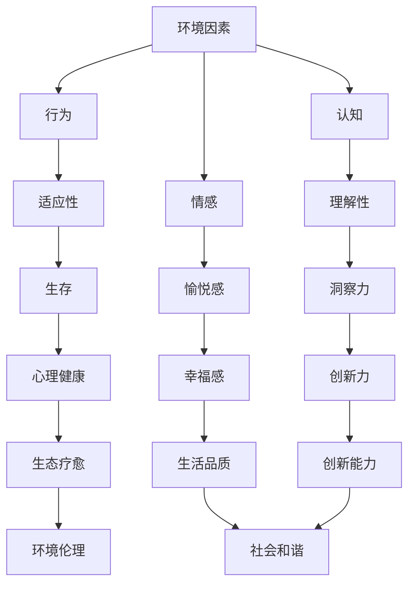
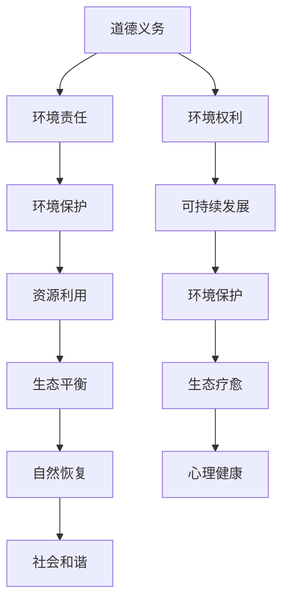

                 

### 文章标题：生态疗愈：重建人与自然的深层连接

#### 关键词：
生态疗愈，人类与自然关系，心理健康，环境伦理，生态哲学，实践指导，案例分析，未来展望

#### 摘要：
本文旨在探讨生态疗愈的概念、理论基础和实践方法，以及其在重建人与自然深层连接中的作用。通过分析人类与自然关系的变迁，阐述生态疗愈对心理健康的重要性，介绍生态疗愈的理论基础，提供具体的实践指导，并通过案例分析展示其应用效果，最后展望生态疗愈的未来发展趋势和挑战。

### 导言与背景

#### 1.1 生态疗愈的定义与意义

生态疗愈（ecological therapy）是一种通过接触自然环境，参与自然环境中的活动，以及与自然环境的互动来促进人类身心健康和幸福感的方法。其核心在于重建人与自然的深层连接，通过这种连接来缓解现代社会的压力，提高生活质量。

生态疗愈不仅对心理健康有显著影响，还能增强人们的环保意识，促进社会的可持续发展。它强调自然环境的治愈力量，为心理健康提供了全新的治疗视角。

#### 1.2 人类与自然的关系变迁

在传统社会中，人类与自然的关系是紧密和谐的。人们生活在自然环境中，依赖自然资源生活，对自然有着深厚的敬畏和热爱。然而，随着工业革命和信息时代的到来，人类社会与自然的关系发生了巨大的变化。工业化进程带来了环境的污染和资源的过度开发，导致自然环境恶化，人类与自然的关系逐渐紧张。

这种关系的变迁使得人们越来越意识到生态疗愈的重要性，希望通过这种方式重建人与自然的深层连接，缓解现代社会带来的压力。

### 第二部分：理论基础

#### 2.1 生态心理学

生态心理学（ecological psychology）是研究人类与环境之间相互作用的心理学科。它关注环境对人类行为和心理状态的影响，以及人类如何通过心理过程适应环境。

#### 2.1.1 核心概念与联系

**核心概念：**
- **环境因素**：指自然环境中的各种元素，如空气、水、土壤、植物、动物等。
- **行为**：指人类在环境中的活动，包括探索、适应、改变等。
- **认知**：指人类对环境的感知、理解和思考。
- **情感**：指人类对环境的情绪反应。

**核心概念之间的关系架构：**



#### 2.1.2 核心算法原理讲解

生态心理学的核心算法原理可以描述为以下步骤：

1. **环境感知**：人类通过感官接收自然环境中的信息。
2. **认知处理**：大脑对环境信息进行加工和处理，形成对环境的认知。
3. **情感反应**：基于认知的结果，人类对环境产生情感反应。
4. **行为适应**：根据情感反应，人类调整自己的行为以适应环境。

伪代码如下：

```python
def ecological_psychology(perception, cognition, emotion):
    behavior = adapt_behavior(perception, cognition)
    emotional_response = process_emotion(emotion)
    return behavior, emotional_response
```

#### 2.2 环境伦理学

环境伦理学（environmental ethics）是研究人类与自然环境之间道德关系的学科。它关注人类对自然环境的行为是否合乎道德，以及如何通过道德规范促进环境的可持续发展。

#### 2.2.1 核心概念与联系

**核心概念：**
- **道德义务**：人类对自然环境的道德责任。
- **环境权利**：自然环境本身的道德权利。
- **可持续发展**：满足当前需求而不损害后代满足其需求的能力。

**核心概念之间的关系架构：**



#### 2.2.2 核心算法原理讲解

环境伦理学的核心算法原理可以描述为以下步骤：

1. **道德判断**：评估人类行为是否违背对自然环境的道德义务。
2. **环境责任**：根据道德判断，确定人类对自然环境的责任。
3. **权利保护**：确保自然环境的权利得到尊重和保护。
4. **可持续发展**：在满足当前需求的同时，考虑后代的利益，实现可持续发展。

伪代码如下：

```python
def environmental_ethics(moral_judgment, environmental_duty, environmental_rights):
    environmental_duty = determine_duty(moral_judgment)
    environmental_rights = protect_rights(environmental_rights)
    sustainable_development = achieve_sustainability(environmental_duty, environmental_rights)
    return sustainable_development
```

### 第三部分：实践指导

#### 3.1 自然环境中的疗愈活动

自然环境中的疗愈活动包括自然观察、野生动植物互动、户外运动和自然冥想等。这些活动能够帮助人们放松心情，缓解压力，提高心理健康水平。

#### 3.1.1 自然观察

自然观察是一种通过观察自然环境中的各种生物、地理现象和气候条件来增强对自然的理解和欣赏的方法。它可以帮助人们放松心情，减少焦虑和压力。

**核心算法原理：**

1. **选择观察对象**：根据兴趣和需求选择自然观察的对象。
2. **进行观察**：在自然环境中进行系统的观察和记录。
3. **分析观察结果**：对观察结果进行反思和分析，加深对自然的理解。

伪代码如下：

```python
def natural_observaton(object, observation):
    result = observe(object)
    analysis = analyze_result(result)
    return analysis
```

#### 3.1.2 野生动植物互动

野生动植物互动是一种与自然环境中的动植物进行直接互动的方法。这种互动可以增强人们对自然的热爱和保护意识。

**核心算法原理：**

1. **选择互动对象**：根据兴趣和安全性选择互动的动植物。
2. **进行互动**：在自然环境中与动植物进行互动，如喂养、观察、拍照等。
3. **记录互动过程**：记录互动过程，以便于后续分析和分享。

伪代码如下：

```python
def animal_interaction(object, interaction):
    result = interact(object)
    record = record_process(result)
    return record
```

#### 3.1.3 户外运动

户外运动是一种在自然环境中进行的体育锻炼活动。这种运动可以提高心肺功能，增强身体素质，同时也能增强人们对自然的热爱和保护意识。

**核心算法原理：**

1. **选择运动方式**：根据兴趣和身体状况选择户外运动的方式，如徒步、骑行、登山等。
2. **进行运动**：在自然环境中进行户外运动。
3. **监测运动数据**：使用运动设备监测运动过程中的各种数据，如心率、步数、距离等。

伪代码如下：

```python
def outdoor_activity(activity, data):
    perform = execute_activity(activity)
    monitor = track_data(data)
    return monitor
```

#### 3.1.4 自然冥想

自然冥想是一种在自然环境中进行的冥想活动。这种活动可以帮助人们放松心情，缓解压力，提高心理健康水平。

**核心算法原理：**

1. **选择冥想地点**：根据个人喜好选择自然冥想的地点，如森林、海滩、公园等。
2. **进行冥想**：在自然环境中进行冥想，专注于呼吸和自然环境。
3. **记录冥想感受**：记录冥想过程中的感受和体验，以便于后续分析和分享。

伪代码如下：

```python
def natural_meditation(location, meditation):
    perform = execute_meditation(meditation)
    record = record_feeling(location)
    return record
```

### 第四部分：案例分析

#### 4.1 案例一：XX生态农场

XX生态农场是一个位于城市边缘的生态农场，它通过提供生态农业体验和自然教育项目，吸引了大量城市居民前来参观和参与。

**案例解析：**

1. **项目背景**：农场致力于推广生态农业，减少对环境的破坏，同时提供教育机会，提高公众的环保意识。
2. **项目内容**：包括有机种植、动物养殖、自然教育等。
3. **项目效果**：参与者通过参与农场活动，增进了对自然环境的了解和保护意识，同时也提高了心理健康水平。

**数学模型和公式讲解：**

为了评估生态农场对参与者的心理影响，我们可以使用以下模型：

$$
心理健康水平 = f(自然接触时间, 活动参与度)
$$

其中，自然接触时间和活动参与度是影响心理健康水平的关键因素。

**举例说明：**

假设一名参与者每周在生态农场度过3小时，积极参与农场活动。根据上述模型，我们可以预测这名参与者的心理健康水平将得到显著提升。

### 第五部分：未来展望与挑战

#### 5.1 未来趋势

生态疗愈在未来有望成为心理健康领域的重要治疗方法。随着人们对自然环境价值的认识不断提高，生态疗愈的应用范围将进一步扩大。此外，科技的发展也将为生态疗愈提供新的工具和方法，如虚拟现实、智能设备等。

#### 5.2 面临的挑战

生态疗愈在推广过程中面临诸多挑战，包括社会认知度低、专业人才短缺、政策支持不足等。为了克服这些挑战，需要加强生态疗愈的宣传和推广，培养专业人才，以及制定相关政策和支持措施。

### 附录

#### 5.1 资源与工具

**推荐资源：**
- 《生态疗愈：重建人与自然的深层连接》
- 《自然疗法：心理健康的绿色途径》
- 《生态心理学：环境与人类行为》

**推荐工具：**
- 自然观察记录软件
- 户外运动监测设备
- 虚拟现实头盔

### 最佳实践 Tips

1. **选择适合自己的生态疗愈活动**：根据个人兴趣和需求选择适合自己的疗愈活动。
2. **持之以恒**：生态疗愈需要长期坚持，才能取得显著效果。
3. **结合其他治疗方式**：生态疗愈可以与其他心理健康治疗方法结合使用，如心理咨询、药物治疗等。

### 小结

生态疗愈为重建人与自然的深层连接提供了一种新的思路和方法。通过接触自然、参与自然环境中的活动，以及与自然环境的互动，人们可以缓解压力、提高心理健康水平，同时增强对自然的热爱和保护意识。未来，随着科技的进步和社会的重视，生态疗愈有望得到更广泛的应用和推广。

### 注意事项

1. **注意安全**：在参与生态疗愈活动时，务必注意个人安全。
2. **尊重自然**：在接触自然时，要尊重自然环境和动植物，避免破坏自然环境。

### 拓展阅读

- 《生态心理学》
- 《环境伦理学》
- 《生态哲学》

### 作者信息：

作者：AI天才研究院/AI Genius Institute & 禅与计算机程序设计艺术 /Zen And The Art of Computer Programming

