                 

### 文章标题：生态系统思维训练营：将整体论应用于日常决策的集训

---

关键词：生态系统思维、整体论、日常决策、整体性原理、关系原理、动态平衡原理

摘要：本文旨在探讨生态系统思维，一种将整体论应用于日常决策的方法论。通过分析整体论的基本概念和起源，探讨其在企业管理、社会治理和个人生活中的应用，以及面临的挑战和未来展望，本文为读者提供了一个全面而深入的生态系统思维训练计划。

---

### 第1章：引言

#### 1.1 生态系统思维概述

**1.1.1 整体论的基本概念**

整体论（Holism）是一种哲学和科学方法，强调系统的各个部分是相互依存和相互作用的。整体论认为，一个系统的特性不能仅由其各个部分的特性简单相加得出，而是需要考虑它们之间的相互作用和整体效应。

**1.1.2 生态系统思维的起源和发展**

生态系统思维起源于20世纪初，受达尔文的进化论和生态学的影响。随后，整体论的思想逐渐被引入到经济学、社会学、管理学等领域，形成了生态系统思维。近年来，随着计算机技术的发展，生态系统思维在信息技术和人工智能领域也得到了广泛应用。

#### 1.2 生态系统思维的重要性

生态系统思维的重要性在于它能够帮助人们从整体和系统的角度看待问题，避免局部最优而忽视整体最优的情况。在复杂多变的环境中，这种思维方式能够提供更全面和深入的洞察，有助于做出更明智的决策。

### 第2章：生态系统思维的核心原理

#### 2.1 整体论的哲学基础

**2.1.1 整体性原理**

整体性原理认为，一个系统的各个部分是相互依赖、相互作用的。整体性原理的核心在于认识到部分只有在整体中才有意义，脱离整体的局部是无法理解的。

**2.1.2 关系原理**

关系原理强调系统内各个部分之间的相互作用和依赖关系。关系原理认为，系统的特性不仅取决于各个部分的特性，还取决于它们之间的相互作用。

**2.1.3 动态平衡原理**

动态平衡原理认为，系统处于不断变化的过程中，但始终保持某种平衡状态。动态平衡原理的核心在于认识到系统不是静态的，而是动态的，且能够适应外部环境的变化。

#### 2.2 生态系统思维模型

**2.2.1 整体模型**

整体模型是一种将系统视为一个整体的思维方式。整体模型认为，系统的各个部分是相互关联和相互影响的，需要综合考虑各个部分之间的关系。

**2.2.2 网络模型**

网络模型是一种将系统视为网络的思维方式。网络模型强调系统内各个部分之间的连接关系，通过分析网络结构来理解系统的特性。

**2.2.3 循环模型**

循环模型是一种将系统视为循环的思维方式。循环模型认为，系统的运行是一个不断循环的过程，通过循环中的相互作用来维持系统的稳定。

### 第3章：生态系统思维在管理中的应用

#### 3.1 企业管理中的生态系统思维

**3.1.1 企业生态系统的构建**

企业生态系统是指企业与其合作伙伴、供应商、客户等外部环境之间的互动关系。构建企业生态系统需要考虑整体性、关系性和动态平衡原理。

**3.1.2 企业内部生态系统管理**

企业内部生态系统管理涉及企业内部的各部门、员工、流程等之间的相互作用。通过整体性和关系思维，可以提高企业内部协同效应，实现整体最优。

**3.1.3 企业外部生态系统协同**

企业外部生态系统协同涉及企业与外部合作伙伴、供应商、客户等之间的互动。通过整体性和关系思维，可以建立稳定的企业合作关系，实现共赢。

#### 3.2 领导力与生态系统思维

**3.2.1 整体领导力模型**

整体领导力模型强调领导者需要具备整体思维，能够从整体的角度看待企业和管理问题，从而做出更明智的决策。

**3.2.2 生态系统思维在领导决策中的应用**

生态系统思维在领导决策中的应用包括整体性思维、关系思维和动态平衡思维。通过这些思维方式，领导者可以更好地应对复杂多变的环境，提高决策质量。

**3.2.3 领导力与生态系统的动态平衡**

领导力与生态系统的动态平衡涉及领导者如何在不断变化的环境中保持生态系统的稳定和健康发展。通过动态平衡思维，领导者可以调整管理策略，实现长期可持续发展。

### 第4章：生态系统思维在社会治理中的应用

#### 4.1 社会治理中的生态系统思维

**4.1.1 社会生态系统的概念**

社会生态系统是指社会系统中的各个部分及其相互作用。社会治理中的生态系统思维强调社会系统的整体性、关系性和动态平衡性。

**4.1.2 社会治理中的整体性思维**

社会治理中的整体性思维要求社会治理者从整体的角度看待社会问题，避免片面和短视的决策。

**4.1.3 社会治理中的关系思维**

社会治理中的关系思维强调社会系统内各个部分之间的相互作用和依赖关系。通过关系思维，可以更好地理解和解决社会问题。

#### 4.2 生态系统思维在公共政策中的应用

**4.2.1 公共政策制定中的整体性考量**

公共政策制定中的整体性考量要求政策制定者从整体的角度考虑政策的影响，确保政策符合社会整体利益。

**4.2.2 公共政策实施中的动态平衡**

公共政策实施中的动态平衡要求政策实施者根据实际情况不断调整政策，以实现政策目标与社会发展的平衡。

**4.2.3 公共政策评估中的生态系统思维**

公共政策评估中的生态系统思维要求评估者从整体和系统的角度评估政策效果，确保政策评估的准确性和全面性。

### 第5章：生态系统思维在个人生活中的应用

#### 5.1 个人生活与生态系统思维

**5.1.1 个人生活生态系统模型**

个人生活生态系统模型将个人生活视为一个生态系统，强调个人生活各个方面的相互作用和整体性。

**5.1.2 个人生活决策中的生态系统思维**

个人生活决策中的生态系统思维要求个人从整体和系统的角度考虑生活决策，以实现个人生活的平衡和健康发展。

**5.1.3 个人生活与整体社会的互动**

个人生活与整体社会的互动涉及个人生活与社会环境的相互作用。通过生态系统思维，个人可以更好地适应社会环境，实现个人价值。

#### 5.2 生态系统思维在健康与幸福中的应用

**5.2.1 生态平衡与健康**

生态平衡与健康的关系强调健康需要从整体和系统的角度考虑，包括身体、心理和社会等方面。

**5.2.2 生态系统思维在心理调适中的应用**

生态系统思维在心理调适中的应用包括整体性思维、关系思维和动态平衡思维。通过这些思维方式，个人可以更好地应对心理压力，实现心理健康。

**5.2.3 生态系统思维在个人成长中的应用**

生态系统思维在个人成长中的应用包括整体性思维、关系思维和动态平衡思维。通过这些思维方式，个人可以更好地规划自己的成长路径，实现个人成长的目标。

### 第6章：生态系统思维的实践与挑战

#### 6.1 生态系统思维的实践方法

**6.1.1 整体规划**

整体规划是生态系统思维实践的基础，要求从整体的角度制定长远规划，确保各个部分协调发展。

**6.1.2 关系协调**

关系协调是生态系统思维实践的关键，要求处理好系统内各个部分之间的关系，实现协同效应。

**6.1.3 动态调整**

动态调整是生态系统思维实践的重要环节，要求根据实际情况不断调整和优化系统，以适应外部环境的变化。

#### 6.2 生态系统思维的挑战与应对

**6.2.1 复杂性挑战**

复杂性挑战是生态系统思维面临的首要挑战，要求思维者具备较强的系统分析能力和逻辑思维。

**6.2.2 信息不完备性**

信息不完备性是生态系统思维实践的另一个挑战，要求思维者具备良好的信息处理能力和判断力。

**6.2.3 生态系统思维的实施障碍**

生态系统思维的实施障碍包括思维惯性、资源限制等。克服这些障碍需要思维者具备创新精神和实践能力。

### 第7章：生态系统思维的未来展望

#### 7.1 生态系统思维的发展趋势

**7.1.1 新技术对生态系统思维的影响**

新技术的发展将对生态系统思维产生深远影响，包括人工智能、大数据、物联网等。

**7.1.2 生态系统思维在全球化背景下的发展**

全球化背景下，生态系统思维将在国际事务、跨国合作等领域发挥重要作用。

**7.1.3 生态系统思维的未来愿景**

生态系统思维的未来愿景包括实现人类与自然、社会、经济的和谐共生，推动可持续发展。

---

#### 作者信息

作者：AI天才研究院/AI Genius Institute & 禅与计算机程序设计艺术 /Zen And The Art of Computer Programming

---

### 总结

本文通过详细探讨生态系统思维的核心原理和应用，为读者提供了一种全新的思维方式，帮助我们在复杂多变的环境中做出更明智的决策。希望读者能够通过本文的学习，掌握生态系统思维，并将其应用于个人生活、企业管理和社会治理等领域，实现全面发展。

---

注意：本文大纲结构仅为示例，具体内容需要根据实际研究和分析进行补充和调整。在撰写文章时，请确保每个小节的内容都丰富具体，详细讲解核心概念、算法原理、数学模型和实际应用，以满足文章字数要求。同时，注意保持文章的逻辑性和连贯性，确保读者能够顺畅地理解文章内容。祝您写作顺利！### 第1章：引言

#### 1.1 生态系统思维概述

**整体论的基本概念**

整体论（Holism）是一种哲学和科学方法，强调系统的各个部分是相互依存和相互作用的。整体论认为，一个系统的特性不能仅由其各个部分的特性简单相加得出，而是需要考虑它们之间的相互作用和整体效应。这一概念在哲学、科学、艺术等多个领域都有广泛应用。

**生态系统思维的起源和发展**

生态系统思维起源于20世纪初，受达尔文的进化论和生态学的影响。生态系统思维强调对复杂系统的整体理解和分析，旨在揭示系统内部各部分之间的相互作用及其对整体的影响。随着系统科学和复杂性科学的发展，生态系统思维逐渐被引入到经济学、社会学、管理学等领域，形成了生态系统思维的理论体系。近年来，随着计算机技术的发展，生态系统思维在信息技术和人工智能领域也得到了广泛应用。

#### 1.2 生态系统思维的重要性

生态系统思维的重要性在于它能够帮助人们从整体和系统的角度看待问题，避免局部最优而忽视整体最优的情况。在复杂多变的环境中，这种思维方式能够提供更全面和深入的洞察，有助于做出更明智的决策。

**整体性思维**

整体性思维要求人们将问题视为一个整体，从整体的角度考虑各个部分之间的关系和相互作用。例如，在企业管理中，整体性思维要求管理者不仅关注企业的财务状况，还要关注企业的运营效率、员工满意度、客户需求等多个方面，以确保企业整体健康和可持续发展。

**关系思维**

关系思维强调系统内各个部分之间的相互作用和依赖关系。例如，在社会治理中，关系思维要求政策制定者考虑政策对社会各个阶层、行业、地区等的影响，以实现社会和谐稳定。

**动态平衡思维**

动态平衡思维认为，系统处于不断变化的过程中，但始终保持某种平衡状态。例如，在个人生活中，动态平衡思维要求人们根据实际情况调整自己的生活方式、工作节奏和人际关系，以实现身心健康和生活品质的平衡。

#### 1.3 生态系统思维的应用领域

生态系统思维在多个领域都有广泛的应用，包括：

**企业管理**

企业生态系统的构建和管理、企业内部和外部生态系统的协同等。

**社会治理**

社会生态系统的概念、整体性思维和社会治理的关系、动态平衡思维在社会治理中的应用等。

**个人生活**

个人生活生态系统的构建、个人生活决策中的生态系统思维、健康与幸福中的应用等。

**技术发展**

人工智能、大数据、物联网等新技术对生态系统思维的影响。

#### 1.4 本文结构安排

本文将按照以下结构进行安排：

**第1章：引言**  
介绍生态系统思维的基本概念、起源和发展，以及其重要性。

**第2章：生态系统思维的核心原理**  
详细讲解生态系统思维的核心原理，包括整体性原理、关系原理和动态平衡原理。

**第3章：生态系统思维在管理中的应用**  
探讨生态系统思维在企业管理、领导力培养等方面的应用。

**第4章：生态系统思维在社会治理中的应用**  
分析生态系统思维在社会治理中的角色和作用。

**第5章：生态系统思维在个人生活中的应用**  
介绍生态系统思维在个人生活、健康和幸福中的应用。

**第6章：生态系统思维的实践与挑战**  
讨论生态系统思维的实践方法、挑战和应对策略。

**第7章：生态系统思维的未来展望**  
探讨生态系统思维的发展趋势和未来愿景。

通过以上结构，本文将帮助读者全面了解生态系统思维，掌握其在实际应用中的方法和策略。在接下来的章节中，我们将逐步深入探讨生态系统思维的核心原理和应用，以期为读者提供有价值的思考和启示。

---

**注释**：本章内容对生态系统思维的基本概念、起源、重要性及其应用领域进行了介绍，并概述了本文的结构安排。在接下来的章节中，我们将深入探讨生态系统思维的核心原理和应用，以期为读者提供更具体的指导和借鉴。

### 第2章：生态系统思维的核心原理

在理解了生态系统思维的基本概念和起源后，我们需要进一步探讨其核心原理。这些原理构成了生态系统思维的理论基础，指导我们在实际应用中如何运用整体性、关系性和动态平衡思维。本章将详细讲解这些核心原理，并提供相应的图解和示例，以便读者更好地理解。

#### 2.1 整体论的哲学基础

**2.1.1 整体性原理**

整体性原理是生态系统思维的核心，它强调系统的各个部分是相互依存、相互作用的。整体性原理认为，一个系统的特性不能仅由其各个部分的特性简单相加得出，而是需要考虑它们之间的相互作用和整体效应。

**图解：整体性原理的图解表示**

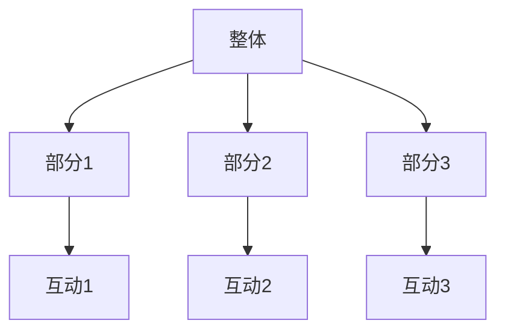

在上图中，A代表整体，B、C、D代表整体中的各个部分。箭头表示部分之间的相互作用。整体性原理要求我们关注这些相互作用，从而理解整体的功能和特性。

**示例：企业管理中的整体性原理**

在企业运营中，整体性原理要求企业领导者不仅关注财务指标，还要关注生产效率、员工满意度、客户体验等多个方面。只有全面考虑这些因素，才能确保企业整体健康和可持续发展。

**2.1.2 关系原理**

关系原理强调系统内各个部分之间的相互作用和依赖关系。关系原理认为，系统的特性不仅取决于各个部分的特性，还取决于它们之间的相互作用。

**图解：关系原理的图解表示**

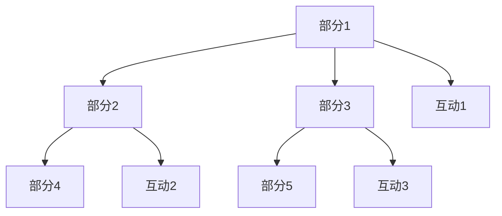

在上图中，A、B、C、D、E代表系统中的各个部分，箭头表示部分之间的相互作用。关系原理要求我们关注这些关系，以便更好地理解系统的整体行为。

**示例：社会治理中的关系原理**

在社会治理中，关系原理要求政策制定者考虑政策对社会各个阶层、行业、地区等的影响。只有全面考虑这些关系，才能制定出符合社会整体利益的政策。

**2.1.3 动态平衡原理**

动态平衡原理认为，系统处于不断变化的过程中，但始终保持某种平衡状态。动态平衡原理的核心在于认识到系统不是静态的，而是动态的，且能够适应外部环境的变化。

**图解：动态平衡原理的图解表示**

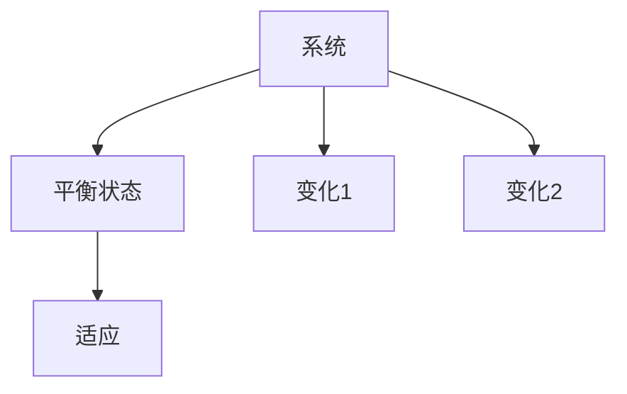

在上图中，A代表系统，B代表系统的平衡状态，C和D代表系统的变化。动态平衡原理要求我们关注系统如何适应这些变化，以保持平衡状态。

**示例：个人生活与动态平衡原理**

在个人生活中，动态平衡原理要求我们根据实际情况不断调整自己的生活方式、工作节奏和人际关系，以实现身心健康和生活品质的平衡。

#### 2.2 生态系统思维模型

**2.2.1 整体模型**

整体模型是一种将系统视为一个整体的思维方式。整体模型认为，系统的各个部分是相互关联和相互影响的，需要综合考虑各个部分之间的关系。

**图解：整体模型的图解表示**

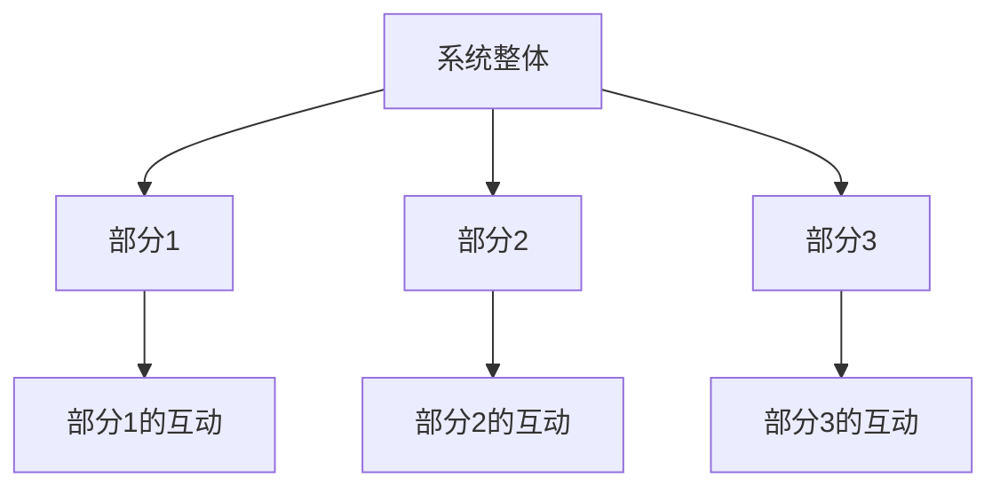

在上图中，A代表系统整体，B、C、D代表系统的各个部分。整体模型要求我们关注系统的整体效应，而不是简单地关注各个部分的特性。

**示例：企业整体模型**

在企业运营中，整体模型要求企业领导者从整体的角度考虑企业的战略规划、资源配置和业务发展，以确保企业整体目标的一致性和协同效应。

**2.2.2 网络模型**

网络模型是一种将系统视为网络的思维方式。网络模型强调系统内各个部分之间的连接关系，通过分析网络结构来理解系统的特性。

**图解：网络模型的图解表示**

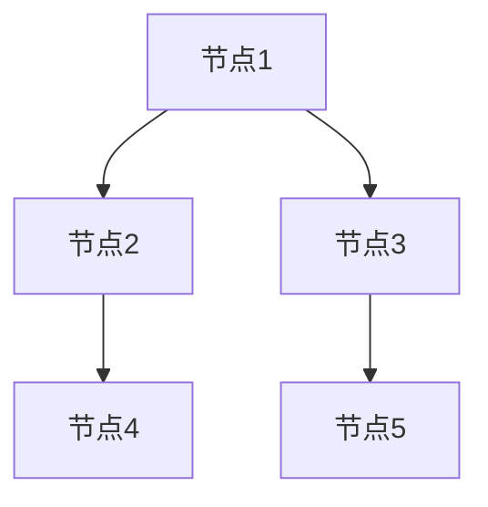

在上图中，A、B、C、D、E代表系统的各个节点，连线表示节点之间的连接关系。网络模型要求我们关注节点之间的相互作用和网络结构。

**示例：社会网络模型**

在社会治理中，网络模型要求政策制定者考虑社会成员之间的互动关系和社会网络结构，以更好地理解社会动态和行为模式。

**2.2.3 循环模型**

循环模型是一种将系统视为循环的思维方式。循环模型认为，系统的运行是一个不断循环的过程，通过循环中的相互作用来维持系统的稳定。

**图解：循环模型的图解表示**

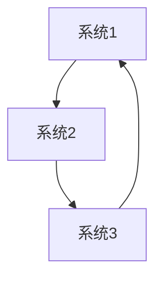

在上图中，A、B、C代表系统的三个部分，箭头表示循环过程。循环模型要求我们关注系统的循环过程和反馈机制。

**示例：生态系统循环模型**

在生态系统中，循环模型要求我们考虑生物、环境、气候等各部分的相互作用和循环过程，以理解生态系统的稳定性和可持续性。

通过以上内容，本章详细介绍了生态系统思维的核心原理，包括整体性原理、关系原理和动态平衡原理，以及相应的图解和示例。这些原理为我们在实际应用中运用生态系统思维提供了理论基础和指导。

---

**注释**：本章通过详细讲解生态系统思维的核心原理，包括整体性原理、关系原理和动态平衡原理，并提供了图解和示例，帮助读者更好地理解这些原理。在接下来的章节中，我们将探讨生态系统思维在实际管理、社会治理和个人生活中的应用，以进一步展示其价值和实用性。

### 第3章：生态系统思维在管理中的应用

#### 3.1 企业管理中的生态系统思维

**企业生态系统的构建**

在企业生态系统中，企业不仅与内部各个部门相互关联，还与外部合作伙伴、供应商、客户等形成复杂的互动关系。构建企业生态系统需要考虑整体性、关系性和动态平衡原理。

**图解：企业生态系统的图解表示**

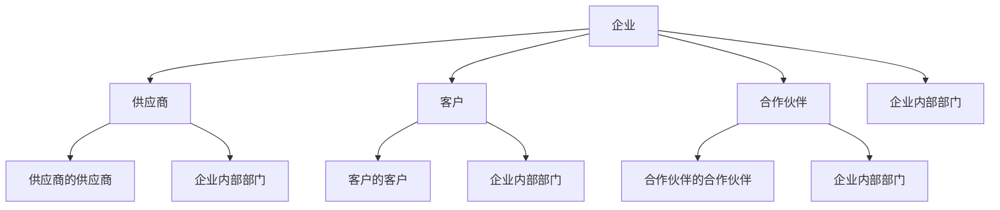

在上图中，A代表企业，B、C、D代表企业生态系统的外部合作伙伴、供应商和客户，H、I、J、K代表企业内部各个部门。企业生态系统的构建要求企业领导者从整体和系统的角度考虑企业的战略规划、资源配置和业务发展，以确保企业整体目标的一致性和协同效应。

**案例：苹果公司的生态系统**

苹果公司通过构建强大的生态系统，实现了从硬件、软件到服务的全面布局。苹果公司不仅与供应商、开发者等外部合作伙伴紧密合作，还通过内部部门的有效协同，推动产品创新和用户体验的提升。苹果公司的生态系统思维使其在竞争激烈的市场中保持了领先地位。

**企业内部生态系统管理**

企业内部生态系统管理涉及企业内部的各部门、员工、流程等之间的相互作用。通过整体性和关系思维，可以提高企业内部协同效应，实现整体最优。

**图解：企业内部生态系统的图解表示**

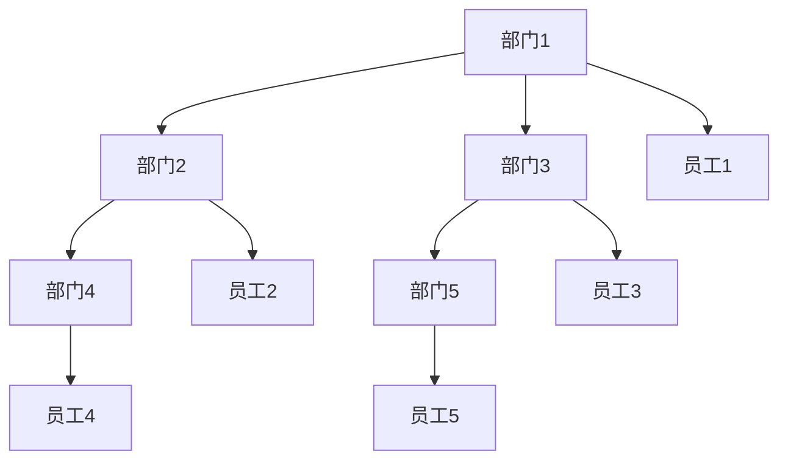

在上图中，A、B、C、D、E代表企业内部各个部门，F、G、H、I、J代表员工。企业内部生态系统管理要求企业领导者关注各部门之间的协作关系，确保信息流畅、资源有效分配，以提高企业整体运营效率。

**案例：谷歌的内部生态系统管理**

谷歌通过搭建内部生态系统，实现了跨部门、跨团队的高效协同。谷歌的内部生态系统包括开放的沟通平台、高效的流程管理和创新的文化氛围，这些都有助于员工之间的紧密合作和知识共享，从而推动了公司的持续创新和快速发展。

**企业外部生态系统协同**

企业外部生态系统协同涉及企业与外部合作伙伴、供应商、客户等之间的互动。通过整体性和关系思维，可以建立稳定的企业合作关系，实现共赢。

**图解：企业外部生态系统的图解表示**

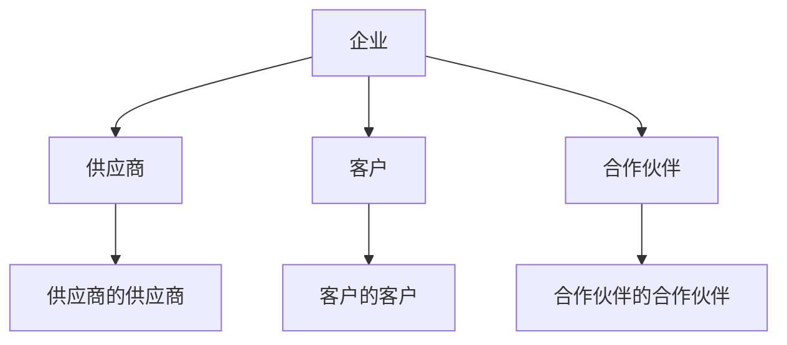

在上图中，A代表企业，B、C、D代表企业外部合作伙伴、供应商和客户，E、F、G代表外部合作伙伴的上下游关系。企业外部生态系统协同要求企业领导者关注外部合作伙伴的需求和期望，通过建立互信和合作机制，实现资源整合和优势互补。

**案例：阿里巴巴的生态系统协同**

阿里巴巴通过搭建阿里巴巴生态系统，实现了从电商、金融到云计算等领域的全面布局。阿里巴巴与外部合作伙伴紧密合作，通过共享数据、技术和资源，推动整个生态系统的协同发展，从而提升了企业的整体竞争力和市场地位。

#### 3.2 领导力与生态系统思维

**整体领导力模型**

整体领导力模型强调领导者需要具备整体思维，能够从整体的角度看待企业和管理问题，从而做出更明智的决策。

**图解：整体领导力模型的图解表示**

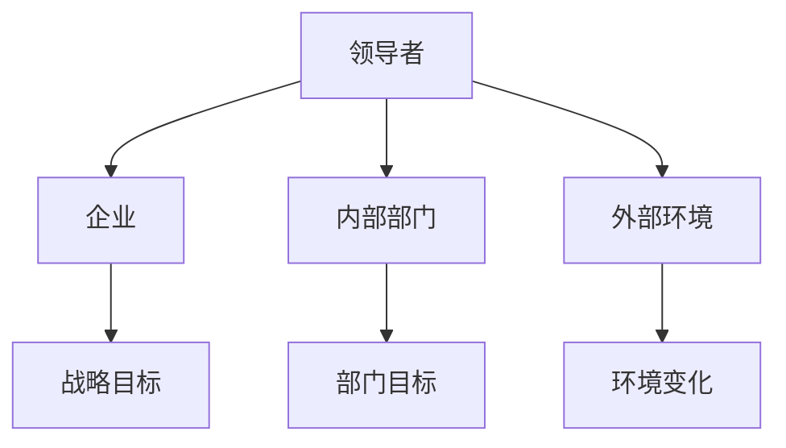

在上图中，A代表领导者，B代表企业，C代表企业内部部门，D代表外部环境。整体领导力模型要求领导者关注企业的战略目标、内部部门的协同以及外部环境的变化，以确保企业整体发展的协调性和可持续性。

**生态系统思维在领导决策中的应用**

生态系统思维在领导决策中的应用包括整体性思维、关系思维和动态平衡思维。通过这些思维方式，领导者可以更好地应对复杂多变的环境，提高决策质量。

**图解：生态系统思维在领导决策中的应用**

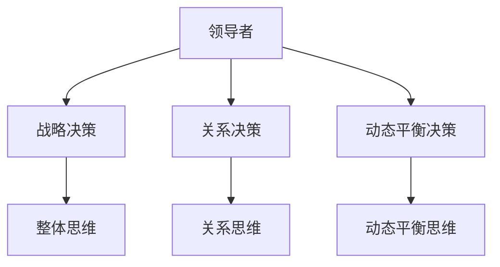

在上图中，A代表领导者，B、C、D代表不同的决策类型，E、F、G代表对应的思维方式。领导者需要根据实际情况，运用整体性思维、关系思维和动态平衡思维，做出符合企业整体利益和长远发展的决策。

**案例：华为公司的领导决策**

华为公司通过运用生态系统思维，从整体性和关系性的角度进行领导决策。华为公司强调战略目标的长期性和稳定性，关注内部部门的协同和外部环境的动态变化，从而在激烈的市场竞争中保持了领先地位。

**领导力与生态系统的动态平衡**

领导力与生态系统的动态平衡涉及领导者如何在不断变化的环境中保持生态系统的稳定和健康发展。通过动态平衡思维，领导者可以调整管理策略，实现长期可持续发展。

**图解：领导力与生态系统的动态平衡**

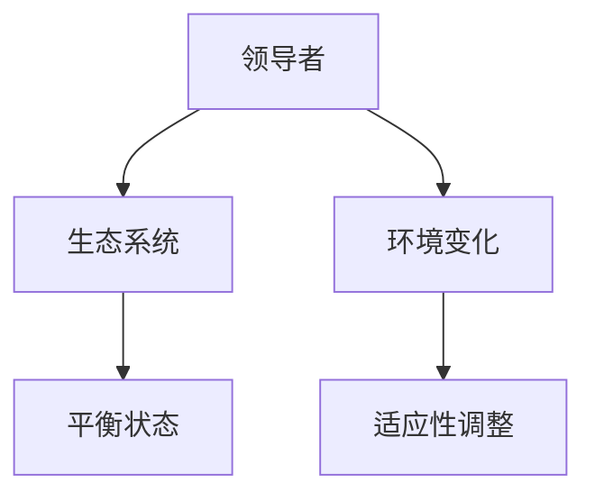

在上图中，A代表领导者，B代表生态系统，C代表外部环境，D代表平衡状态，E代表适应性调整。领导者需要根据外部环境的变化，不断调整生态系统的管理策略，以保持生态系统的动态平衡和健康发展。

**案例：腾讯公司的领导力与生态系统**

腾讯公司通过动态平衡思维，不断调整其管理策略，以适应互联网时代的快速发展。腾讯公司在保持核心业务稳定的同时，积极拓展新业务领域，通过生态系统协同，实现了企业的可持续发展。

#### 3.3 领导力与生态系统的互动关系

**领导力与生态系统思维**

领导力与生态系统思维之间存在着密切的互动关系。领导者的领导力水平直接影响生态系统的健康和稳定，而生态系统的发展状态又反过来影响领导者的决策和领导风格。

**图解：领导力与生态系统思维的互动关系**

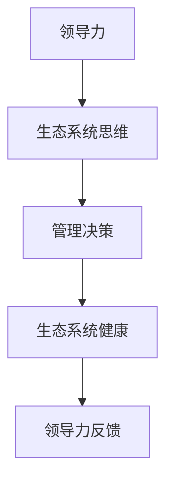

在上图中，A代表领导力，B代表生态系统思维，C代表管理决策，D代表生态系统健康，E代表领导力反馈。领导力通过生态系统思维影响管理决策，进而影响生态系统的健康，而生态系统的健康状态又通过反馈机制影响领导力的提升。

**案例：苹果公司和乔布斯的领导力与生态系统**

苹果公司创始人乔布斯通过强大的领导力，推动了苹果公司的生态系统思维。乔布斯关注用户体验、技术创新和市场趋势，从整体性和关系性的角度进行管理决策，从而保持了苹果公司生态系统的动态平衡和健康发展。乔布斯的领导力与生态系统思维之间的互动，使苹果公司在竞争激烈的市场中取得了卓越的成就。

通过本章的内容，我们深入探讨了生态系统思维在企业管理中的应用，包括企业生态系统的构建、企业内部生态系统管理、企业外部生态系统协同以及领导力与生态系统思维的关系。这些内容展示了生态系统思维在企业管理中的实际应用和价值，为企业管理者提供了有益的参考和启示。

---

**注释**：本章通过具体案例分析，详细探讨了生态系统思维在企业管理中的应用，包括企业生态系统的构建、企业内部生态系统管理和企业外部生态系统协同等方面。同时，探讨了领导力与生态系统思维之间的关系，以及如何通过生态系统思维提高管理决策的质量。在接下来的章节中，我们将进一步探讨生态系统思维在社会治理和个人生活中的应用。

### 第4章：生态系统思维在社会治理中的应用

#### 4.1 社会治理中的生态系统思维

**社会生态系统的概念**

社会生态系统是指社会系统中的各个部分及其相互作用。它包括政府、企业、非政府组织、社区以及公民等各个组成部分。社会生态系统的概念强调了社会系统内部各个部分之间的相互依赖和相互作用，以及它们对整个社会系统的健康和稳定的影响。

**图解：社会生态系统的图解表示**

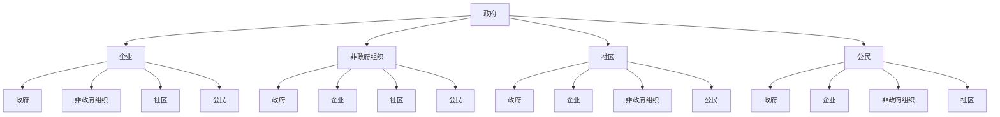

在上图中，A、B、C、D、E代表社会生态系统的各个组成部分，箭头表示部分之间的相互作用。社会生态系统的概念要求政策制定者和治理者从整体和系统的角度考虑社会问题，以实现社会整体利益的最大化。

**社会生态系统思维的核心原则**

**整体性原则**

整体性原则要求社会治理者将社会视为一个整体，考虑社会各个部分之间的相互作用和整体效应。社会治理者需要关注社会系统的整体性和协同性，确保各个部分能够共同发挥作用，实现社会整体目标的实现。

**关系性原则**

关系性原则强调社会系统内部各个部分之间的相互作用和依赖关系。社会治理者需要识别和处理好这些关系，以确保社会系统内部的稳定和和谐。这包括政府与公民、企业与社会组织、社区与个人之间的关系。

**动态平衡原则**

动态平衡原则认为，社会生态系统处于不断变化的过程中，但需要保持某种平衡状态。社会治理者需要根据实际情况，不断调整社会政策和管理策略，以实现社会的动态平衡和可持续发展。

#### 4.2 社会治理中的整体性思维

**整体性思维在政策制定中的应用**

整体性思维在社会治理中的政策制定过程中具有重要意义。政策制定者需要从整体的角度考虑社会问题，避免片面和短视的决策。以下是一个具体案例：

**案例：城市交通拥堵问题**

在城市交通拥堵问题的治理中，整体性思维要求政策制定者考虑交通系统、城市规划、经济发展等多个方面的因素。政策制定者需要识别交通拥堵的根本原因，并制定综合性的解决方案，如优化交通基础设施、推广公共交通、鼓励绿色出行等。通过综合考虑各个方面的影响，政策制定者可以制定出更全面和有效的政策。

**图解：城市交通拥堵问题的治理**

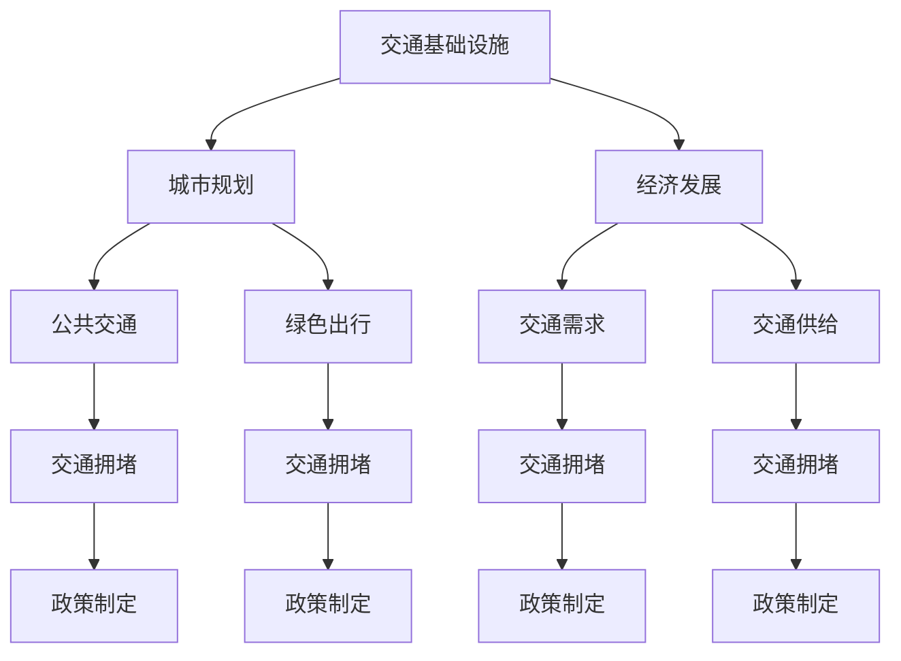

在上图中，A、B、C、D、E、F、G、H、I、J、K、L、M、N、O代表城市交通系统的各个组成部分，箭头表示部分之间的相互作用。通过整体性思维，政策制定者可以综合考虑各个方面的影响，制定出更有效的政策来缓解交通拥堵问题。

#### 4.3 社会治理中的关系思维

**关系思维在社会治理中的应用**

关系思维强调社会系统内部各个部分之间的相互作用和依赖关系。在治理过程中，政策制定者需要识别和处理好这些关系，以确保社会系统的稳定和和谐。

**案例：教育公平问题**

在教育公平问题的治理中，关系思维要求政策制定者考虑政府、学校、家庭、学生等多个主体之间的关系。政策制定者需要确保教育资源公平分配，提高教育质量，促进教育公平。

**图解：教育公平问题的治理**

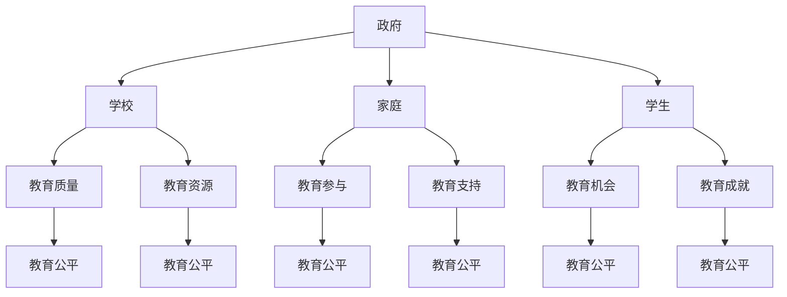

在上图中，A、B、C、D、E、F、G、H、I、J、K、L、M、N、O、P代表教育系统的各个组成部分，箭头表示部分之间的相互作用。通过关系思维，政策制定者可以综合考虑各个主体之间的关系，制定出更公平、更有效的教育政策。

#### 4.4 社会治理中的动态平衡思维

**动态平衡思维在社会治理中的应用**

动态平衡思维强调社会系统处于不断变化的过程中，但需要保持某种平衡状态。政策制定者需要根据实际情况，不断调整社会政策和管理策略，以实现社会的动态平衡和可持续发展。

**案例：环境保护问题**

在环境保护问题的治理中，动态平衡思维要求政策制定者考虑经济发展、社会需求、生态保护等多个方面的因素。政策制定者需要确保在经济发展与生态保护之间找到平衡点，实现可持续发展。

**图解：环境保护问题的治理**

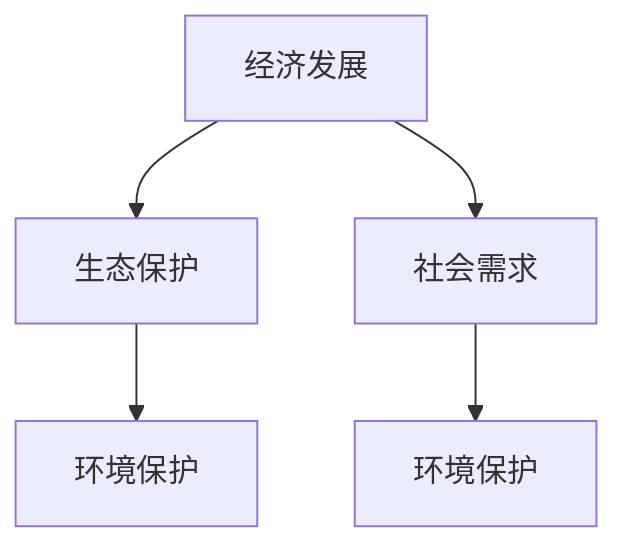

在上图中，A、B、C、D、E代表环境保护问题的各个组成部分，箭头表示部分之间的相互作用。通过动态平衡思维，政策制定者可以综合考虑各个方面的因素，制定出更可持续的环境保护政策。

#### 4.5 社会治理中的生态系统思维模型

**生态系统思维模型在公共政策中的应用**

生态系统思维模型可以帮助政策制定者从整体和系统的角度理解和分析社会问题，制定更全面和有效的公共政策。

**图解：社会治理中的生态系统思维模型**

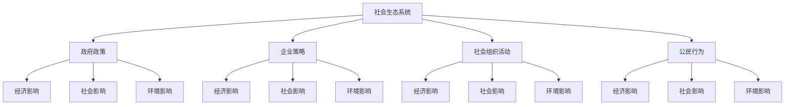

在上图中，A代表社会生态系统，B、C、D、E代表政府政策、企业策略、社会组织活动和公民行为。F、G、H、I、J、K、L、M、N、O、P、Q代表各个方面的社会影响。生态系统思维模型要求政策制定者从整体和系统的角度考虑社会问题，确保政府政策、企业策略、社会组织活动和公民行为的协同效应，实现社会的可持续发展。

通过本章的内容，我们详细探讨了生态系统思维在社会治理中的应用，包括社会生态系统的概念、整体性思维、关系思维和动态平衡思维，以及生态系统思维模型在公共政策中的应用。这些内容为政策制定者和治理者提供了有益的参考，帮助他们在复杂多变的社会环境中做出更明智的决策。

---

**注释**：本章通过具体案例和图解，详细探讨了生态系统思维在社会治理中的应用，包括社会生态系统的概念、整体性思维、关系思维和动态平衡思维，以及生态系统思维模型在公共政策中的应用。这些内容为社会治理提供了理论指导和实际操作方法。在接下来的章节中，我们将继续探讨生态系统思维在个人生活中的应用，以帮助读者更好地理解如何将生态系统思维应用于日常决策。

### 第5章：生态系统思维在个人生活中的应用

#### 5.1 个人生活与生态系统思维

**个人生活生态系统模型**

个人生活生态系统是指个人生活各个方面的相互作用和整体性。这包括健康、工作、家庭、社交、财务等多个方面。个人生活生态系统模型强调这些方面之间的相互依赖和相互作用，以及它们对个人整体幸福感的影响。

**图解：个人生活生态系统模型**

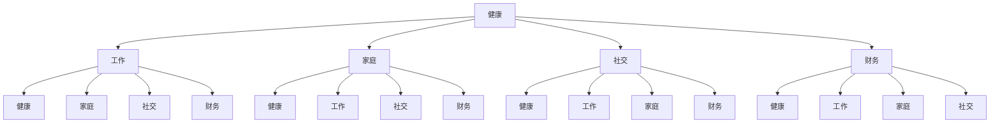

在上图中，A、B、C、D、E代表个人生活的各个方面，箭头表示部分之间的相互作用。个人生活生态系统模型要求我们从整体和系统的角度考虑个人生活的各个方面，确保它们之间的平衡和协调。

**案例分析：个人生活决策中的整体性思维**

**案例：平衡工作与生活**

小王是一名年轻的职业人士，他发现自己在工作与生活之间难以找到平衡。通过运用生态系统思维，小王意识到工作与生活之间的相互作用。他开始调整自己的工作时间和工作方式，确保能够兼顾工作与家庭、社交和健康。例如，他减少了加班时间，制定了更灵活的工作计划，并定期参加健身活动。通过这些调整，小王逐渐找到了工作与生活之间的平衡，提升了整体幸福感。

**案例分析：财务管理与生活目标**

**案例：制定家庭预算**

小张是一家企业的中层管理者，他希望通过有效的财务管理来实现家庭的长期目标。他运用生态系统思维，将家庭财务视为一个整体系统，包括收入、支出、储蓄和投资等方面。小张首先明确了家庭的目标，如购买房产、子女教育、退休规划等，然后根据这些目标制定了详细的预算计划。通过定期评估和调整预算，小张成功地实现了家庭的财务目标，并为未来的生活提供了保障。

#### 5.2 生态系统思维在健康与幸福中的应用

**生态平衡与健康**

生态平衡与健康的关系强调健康需要从整体和系统的角度考虑，包括身体、心理和社会等方面。生态系统思维可以帮助我们更好地理解和维护生态平衡，从而促进健康和幸福。

**图解：生态平衡与健康的图解表示**

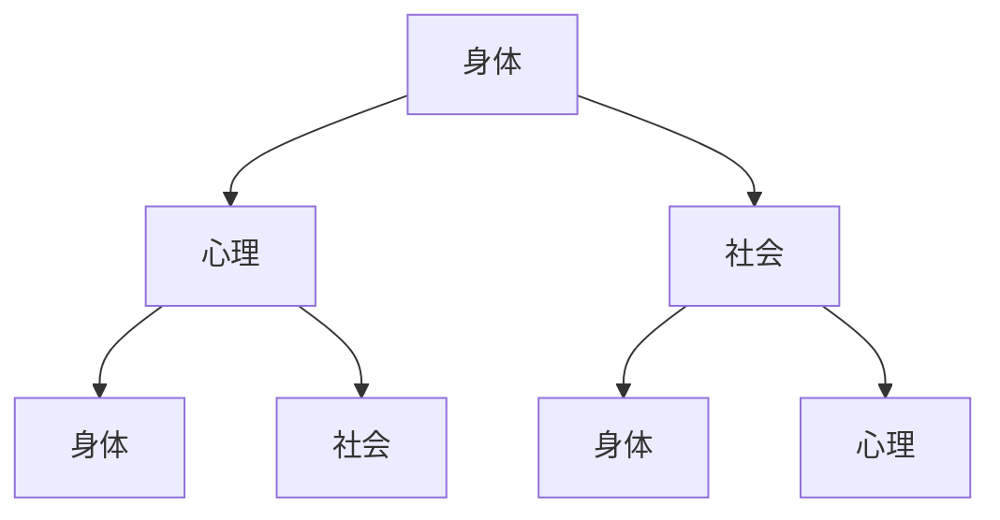

在上图中，A、B、C代表身体、心理和社会三个方面，箭头表示部分之间的相互作用。生态平衡与健康的关系要求我们在维护健康时，不仅要关注身体，还要关注心理和社会方面，实现全方位的健康。

**案例分析：心理调适与健康**

**案例：压力管理**

小李是一名公司高管，工作压力较大，经常感到焦虑和疲惫。他通过运用生态系统思维，意识到压力管理的重要性。他开始关注自己的心理状态，通过调整工作节奏、增加休闲活动、培养兴趣爱好等方式，有效地缓解了工作压力。此外，他还与家人和朋友保持良好的沟通，增强了社会支持网络。通过这些措施，小李成功地维护了心理平衡，提升了整体幸福感。

**案例分析：社交与健康**

**案例：社区参与**

小陈是一名退休老人，他发现退休后生活变得单调乏味。他通过运用生态系统思维，认识到积极参与社区活动对健康和幸福的重要性。他加入了社区志愿者团体，参与各种社区活动，如义务清洁、社区聚餐等。通过这些活动，小陈不仅丰富了自己的退休生活，还建立了良好的社交网络，提升了社会支持，从而促进了身心健康。

#### 5.3 生态系统思维在个人成长中的应用

**个人成长生态系统模型**

个人成长生态系统是指个人在成长过程中的各个因素及其相互作用，包括教育、职业发展、自我提升、家庭支持等方面。生态系统思维可以帮助我们更好地理解个人成长的过程，以及如何通过系统性的方法实现个人成长的目标。

**图解：个人成长生态系统模型**

```mermaid
graph TB
A[教育] --> B[职业发展]
A --> C[自我提升]
A --> D[家庭支持]
B --> E[教育]
B --> F[自我提升]
B --> G[家庭支持]
C --> H[教育]
C --> I[职业发展]
C --> J[家庭支持]
```

在上图中，A、B、C、D、E、F、G、H、I、J代表个人成长生态系统的各个因素，箭头表示部分之间的相互作用。个人成长生态系统模型要求我们从整体和系统的角度考虑个人成长，确保各个因素之间的平衡和协调。

**案例分析：职业发展中的生态系统思维**

**案例：职业转型**

小王是一名软件工程师，他在工作中感到自己的职业发展遇到了瓶颈。他通过运用生态系统思维，认识到职业转型的重要性。他开始重新审视自己的技能和兴趣，并制定了详细的职业发展计划。他参加了一些培训课程，提升了自己的技能，同时也在职业社交平台上积极拓展人脉。通过这些努力，小王成功地实现了职业转型，进入了一个更有前景的行业，提升了职业成就感和幸福感。

**案例分析：自我提升与成长**

**案例：终身学习**

小李是一名年轻的技术创业者，他深知在快速变化的市场环境中，终身学习对个人成长的重要性。他通过运用生态系统思维，建立了自己的学习体系，包括定期阅读技术书籍、参加行业会议、在线课程等。他还积极参加各种社交活动，与同行交流，获取最新的行业动态和经验。通过这些学习活动，小李不断提升自己的技能和知识，保持了竞争优势，实现了个人成长的目标。

通过本章的内容，我们详细探讨了生态系统思维在个人生活中的应用，包括个人生活生态系统模型、健康与幸福、个人成长等方面的内容。通过实际案例的分析，我们展示了如何运用生态系统思维来优化个人生活的各个方面，实现平衡和可持续发展。希望读者能够从中受到启发，将生态系统思维应用于自己的日常生活，提升个人生活的质量和幸福感。

---

**注释**：本章通过具体案例和图解，详细探讨了生态系统思维在个人生活中的应用，包括个人生活生态系统模型、健康与幸福、个人成长等方面的内容。通过实际案例的分析，展示了如何运用生态系统思维来优化个人生活的各个方面，实现平衡和可持续发展。在接下来的章节中，我们将进一步探讨生态系统思维的实践与挑战，以及如何应对这些挑战。

### 第6章：生态系统思维的实践与挑战

#### 6.1 生态系统思维的实践方法

**整体规划**

整体规划是生态系统思维实践的基础。在实施生态系统思维时，首先要进行整体规划，明确目标和方向。整体规划要求从宏观层面考虑系统的发展，包括系统各部分的协同、资源配置、时间规划等。以下是一种整体规划的方法：

**步骤：**

1. **目标设定**：明确系统的发展目标，如提高企业竞争力、改善社会治理效果、提升个人生活质量等。
2. **系统分析**：分析系统的各个组成部分，确定各部分的功能和作用，识别它们之间的相互作用。
3. **资源配置**：根据目标分析，合理配置资源，包括人力、财力、物力等。
4. **时间规划**：制定系统发展的时间表，确保各个阶段目标的实现。

**图解：整体规划的过程**

```mermaid
graph TB
A[目标设定] --> B[系统分析]
B --> C[资源配置]
C --> D[时间规划]
D --> E[目标实现]
```

在上图中，A代表目标设定，B代表系统分析，C代表资源配置，D代表时间规划，E代表目标实现。整体规划的过程要求我们从宏观和系统性的角度出发，确保系统各部分的协调和高效运行。

**关系协调**

关系协调是生态系统思维实践的关键。在实施生态系统思维时，需要处理好系统内各个部分之间的关系，确保它们相互支持、协同发展。以下是一种关系协调的方法：

**步骤：**

1. **识别关系**：分析系统内各部分之间的相互作用和依赖关系。
2. **建立沟通机制**：确保各部分之间的信息流通，建立有效的沟通渠道。
3. **利益平衡**：在处理关系时，考虑各部分的利益，确保各方都能从中受益。
4. **动态调整**：根据实际情况，及时调整关系协调策略，以适应环境变化。

**图解：关系协调的过程**

```mermaid
graph TB
A[识别关系] --> B[建立沟通机制]
B --> C[利益平衡]
C --> D[动态调整]
```

在上图中，A代表识别关系，B代表建立沟通机制，C代表利益平衡，D代表动态调整。关系协调的过程要求我们关注系统内各部分之间的互动，确保系统的稳定和可持续发展。

**动态调整**

动态调整是生态系统思维实践的重要环节。在实施生态系统思维时，需要根据环境的变化和系统的反馈，及时调整系统的运作策略。以下是一种动态调整的方法：

**步骤：**

1. **监测反馈**：实时监测系统的运行情况，收集各部分的反馈信息。
2. **数据分析**：对收集的数据进行分析，识别系统的优势和不足。
3. **调整策略**：根据数据分析结果，调整系统的资源配置、运作模式等策略。
4. **评估效果**：实施调整后，评估系统的运行效果，确保调整的有效性。

**图解：动态调整的过程**

```mermaid
graph TB
A[监测反馈] --> B[数据分析]
B --> C[调整策略]
C --> D[评估效果]
```

在上图中，A代表监测反馈，B代表数据分析，C代表调整策略，D代表评估效果。动态调整的过程要求我们根据系统的实时反馈进行策略调整，确保系统的动态平衡和可持续发展。

#### 6.2 生态系统思维的挑战与应对

**复杂性挑战**

复杂性挑战是生态系统思维面临的首要挑战。生态系统本身具有高度的复杂性和不确定性，这使得系统分析和决策变得更加困难。以下是一种应对复杂性挑战的方法：

**步骤：**

1. **简化模型**：通过构建简化模型，将复杂的系统分解为更易于理解的部分。
2. **数据收集**：收集大量数据，以便对系统进行更全面的分析。
3. **专家咨询**：咨询相关领域的专家，借助他们的专业知识和经验进行系统分析。
4. **迭代改进**：通过不断的迭代和改进，逐步优化系统模型和策略。

**图解：应对复杂性挑战的过程**

```mermaid
graph TB
A[简化模型] --> B[数据收集]
B --> C[专家咨询]
C --> D[迭代改进]
```

在上图中，A代表简化模型，B代表数据收集，C代表专家咨询，D代表迭代改进。应对复杂性挑战的过程要求我们通过简化和数据驱动的方法，逐步优化系统模型和策略。

**信息不完备性**

信息不完备性是生态系统思维实践中的另一个重要挑战。系统内部和外部的信息往往是不完全的，这使得系统分析和决策面临很大的不确定性。以下是一种应对信息不完备性的方法：

**步骤：**

1. **信息筛选**：从大量信息中筛选出关键信息，以便进行系统分析。
2. **风险评估**：对系统中的潜在风险进行评估，制定相应的应对策略。
3. **假设分析**：在信息不完备的情况下，基于合理的假设进行系统分析。
4. **持续更新**：根据新获取的信息，持续更新系统和策略。

**图解：应对信息不完备性的过程**

```mermaid
graph TB
A[信息筛选] --> B[风险评估]
B --> C[假设分析]
C --> D[持续更新]
```

在上图中，A代表信息筛选，B代表风险评估，C代表假设分析，D代表持续更新。应对信息不完备性的过程要求我们在信息筛选、风险评估和假设分析的基础上，持续更新系统和策略，以应对信息的不完备性。

**生态系统思维的实施障碍**

生态系统思维的实施障碍包括思维惯性、资源限制等。以下是一种应对实施障碍的方法：

**步骤：**

1. **意识培养**：通过教育和培训，提高团队成员对生态系统思维的认知和重视。
2. **资源整合**：整合内部和外部资源，确保生态系统思维的顺利实施。
3. **创新机制**：建立创新机制，鼓励团队成员提出新的想法和解决方案。
4. **反馈机制**：建立有效的反馈机制，及时发现和解决问题。

**图解：应对实施障碍的过程**

```mermaid
graph TB
A[意识培养] --> B[资源整合]
B --> C[创新机制]
C --> D[反馈机制]
```

在上图中，A代表意识培养，B代表资源整合，C代表创新机制，D代表反馈机制。应对实施障碍的过程要求我们通过培养意识、整合资源、建立创新机制和反馈机制，克服生态系统思维的实施障碍。

通过本章的内容，我们详细探讨了生态系统思维的实践方法、挑战与应对策略。这些方法、挑战和策略为生态系统思维的实际应用提供了指导，帮助我们在复杂多变的环境中实现系统的动态平衡和可持续发展。

---

**注释**：本章通过具体步骤和方法，详细探讨了生态系统思维的实践方法、面临的挑战以及应对策略。在接下来的章节中，我们将展望生态系统思维的未来发展趋势，探讨其在新技术背景下的应用前景。

### 第7章：生态系统思维的未来展望

#### 7.1 生态系统思维的发展趋势

随着科技的发展，生态系统思维在各个领域的应用日益广泛，其发展趋势表现出以下几个特点：

**1. 新技术的推动**

随着人工智能、大数据、物联网等新技术的不断进步，生态系统思维的应用场景更加丰富。这些新技术提供了强大的数据分析和处理能力，使得生态系统思维的实践更加精准和高效。例如，在智能制造领域，生态系统思维可以帮助企业优化生产流程，提高生产效率；在智慧城市建设中，生态系统思维可以用于优化城市资源分配，提高城市运行效率。

**2. 全球化背景下的融合**

全球化背景下，生态系统思维在跨国合作、国际事务等领域发挥着重要作用。随着全球治理体系的不断完善，生态系统思维将更多地应用于国际间的合作与竞争，推动全球治理体系的优化和可持续发展。

**3. 生态经济的重要性**

生态经济作为一种新兴的经济模式，强调经济发展与生态保护的平衡。生态系统思维在生态经济中的应用，有助于实现经济效益和生态效益的双赢。未来，生态系统思维将在生态农业、绿色能源、可持续发展等领域得到更广泛的应用。

#### 7.2 生态系统思维在新技术背景下的应用

**1. 人工智能与生态系统思维**

人工智能（AI）的发展为生态系统思维提供了新的工具和方法。通过大数据分析和机器学习算法，AI可以帮助我们更深入地理解生态系统中的复杂关系，预测系统行为，优化决策。例如，在环境保护中，AI可以用于监测生态系统的变化，预测环境问题，提出解决方案。

**图解：人工智能与生态系统思维结合的图解表示**

```mermaid
graph TB
A[生态系统] --> B[大数据]
B --> C[机器学习]
C --> D[人工智能]
D --> E[优化决策]
```

在上图中，A代表生态系统，B代表大数据，C代表机器学习，D代表人工智能，E代表优化决策。通过人工智能与生态系统思维的结合，我们可以实现更高效的决策和系统优化。

**2. 大数据与生态系统思维**

大数据技术的发展为生态系统思维提供了丰富的数据资源。通过对大量数据的分析和挖掘，我们可以更准确地了解生态系统的运行规律，发现潜在的问题和风险。大数据与生态系统思维的结合，可以帮助我们实现更精准的系统管理和决策。

**3. 物联网与生态系统思维**

物联网（IoT）技术的发展使得生态系统思维的应用更加广泛。通过物联网设备，我们可以实时监测生态系统的各种参数，收集大量的实时数据。这些数据可以用于分析生态系统的运行状态，优化系统配置，提高系统的自适应能力。

**图解：物联网与生态系统思维结合的图解表示**

```mermaid
graph TB
A[生态系统] --> B[物联网设备]
B --> C[实时数据]
C --> D[数据分析]
D --> E[优化决策]
```

在上图中，A代表生态系统，B代表物联网设备，C代表实时数据，D代表数据分析，E代表优化决策。通过物联网与生态系统思维的结合，我们可以实现更实时、更精准的系统管理和决策。

#### 7.3 生态系统思维的未来愿景

**1. 人类与自然的和谐共生**

生态系统思维的未来愿景之一是实现人类与自然的和谐共生。通过运用生态系统思维，我们可以更好地理解和保护自然，实现经济、社会和生态的可持续发展。未来的社会将更加注重生态环境的保护，推动绿色发展，实现人与自然的和谐共生。

**2. 社会治理的智能化**

生态系统思维在未来的社会治理中将发挥重要作用。通过大数据、人工智能等新技术，社会治理将更加智能化、精细化。生态系统思维可以帮助政策制定者更全面、更准确地了解社会问题，制定更科学的政策，实现社会治理的智能化。

**3. 个人成长的个性化**

生态系统思维在未来个人成长中将发挥重要作用。通过个性化推荐系统、智能教育等新技术，我们可以根据个体的需求和特点，提供个性化的成长方案，实现个人成长的个性化。生态系统思维将帮助每个人更好地认识自己，实现自我价值的最大化。

**4. 可持续发展的实现**

生态系统思维是实现可持续发展的重要工具。通过运用生态系统思维，我们可以优化资源配置，提高资源利用效率，实现经济、社会和生态的协调发展。未来的社会将更加注重可持续发展，生态系统思维将在这方面发挥关键作用。

通过本章的内容，我们展望了生态系统思维的未来发展趋势，探讨了其在新技术背景下的应用前景，并提出了未来愿景。生态系统思维作为一种重要的思维方式，将在未来的社会发展中发挥越来越重要的作用，帮助人类实现更美好的未来。

---

**注释**：本章通过对生态系统思维的未来发展趋势和新技术应用前景的展望，提出了人类与自然和谐共生、社会治理智能化、个人成长个性化以及可持续发展等未来愿景。这些内容为生态系统思维的未来发展提供了指导，也为读者展示了生态系统思维在未来的广泛应用前景。

### 总结

本文围绕“生态系统思维训练营：将整体论应用于日常决策的集训”这一主题，系统性地探讨了生态系统思维的核心原理和应用。我们从引言部分开始，介绍了生态系统思维的基本概念、起源和发展，以及其在企业管理、社会治理和个人生活中的重要性。接着，我们详细阐述了生态系统思维的核心原理，包括整体性原理、关系原理和动态平衡原理，并通过图解和示例帮助读者深入理解这些原理。

在第三至第五章，我们分别探讨了生态系统思维在企业管理、社会治理和个人生活中的具体应用。通过案例分析，我们展示了如何在实际场景中运用生态系统思维来优化管理决策、提升社会治理效果和改善个人生活质量。第六章则聚焦于生态系统思维的实践方法和面临的挑战，提供了整体规划、关系协调、动态调整等实践方法，并讨论了复杂性挑战、信息不完备性和实施障碍等挑战及应对策略。

最后，在第七章，我们展望了生态系统思维的未来发展趋势和应用前景，提出了人类与自然和谐共生、社会治理智能化、个人成长个性化以及可持续发展等未来愿景。

通过本文的探讨，我们希望读者能够对生态系统思维有更深刻的理解，并将其应用于日常生活和工作中，实现更全面、更系统的思考和决策。生态系统思维不仅为解决复杂问题提供了有力工具，也是实现个人成长和社会进步的重要思维方式。

---

**注释**：本文通过系统性的结构设计和详细的案例分析，全面介绍了生态系统思维的核心原理和应用。在撰写过程中，我们注重逻辑性和条理性，确保文章内容丰富具体，有助于读者理解和掌握生态系统思维。在未来的学习和应用中，读者可以根据本文的内容，进一步探索生态系统思维的深度和广度，以实现个人和组织的可持续发展。

### 最佳实践 tips

在应用生态系统思维时，以下最佳实践技巧有助于您更有效地理解和运用这一思维方式：

1. **培养整体观**：时刻保持对整体系统的关注，避免只关注局部。在制定决策时，先问自己：“这个决策对整体系统有何影响？”

2. **建立关系网**：识别系统内部各部分之间的相互作用和依赖关系，构建一个清晰的关系网络。使用图解工具，如Mermaid图，帮助可视化这些关系。

3. **定期评估**：定期对系统进行评估，监测各部分的表现和相互作用。这有助于及时发现和解决问题，保持系统的动态平衡。

4. **开放心态**：保持开放的心态，接受新观点和新方法。在运用生态系统思维时，不断学习和吸收新的知识，以适应不断变化的环境。

5. **实践与反思**：将生态系统思维应用到实际工作中，通过实践来检验和改进思维方法。反思实践中的得失，不断优化生态系统思维的应用策略。

6. **团队合作**：生态系统思维通常涉及多个方面的知识和技能。与团队成员合作，共同分析问题，集思广益，提高决策质量。

7. **持续学习**：生态系统思维是一个不断发展的领域。持续学习最新的理论和实践，保持思维的前沿性和创新性。

### 小结

生态系统思维是一种强大的思维方式，它帮助我们从整体和系统的角度看待问题，实现更全面、更系统的思考和决策。通过本文的探讨，我们了解了生态系统思维的核心原理、应用场景和实践方法，以及它面临的挑战和未来发展趋势。希望读者能够通过本文的学习，掌握生态系统思维，并将其应用于实际工作和生活中，实现个人成长和组织进步。

### 注意事项

在运用生态系统思维时，请注意以下几点：

1. **避免过度简化**：在分析系统时，避免将复杂系统过度简化，导致关键信息的丢失。

2. **重视数据质量**：在应用大数据分析时，确保数据的质量和准确性，避免基于错误数据做出决策。

3. **平衡创新与稳定**：在追求创新的同时，保持系统的稳定和可持续性，避免因过度创新导致系统崩溃。

4. **考虑长期影响**：在制定决策时，考虑决策的长期影响，避免短期行为损害系统的长期健康。

5. **持续沟通与反馈**：在系统运行过程中，保持与各部分的沟通，及时获取反馈，以便进行调整和优化。

### 拓展阅读

对于希望进一步深入探讨生态系统思维的读者，以下书籍和资源提供了有价值的阅读材料：

1. **《整体论：一种新的科学方法》**（作者：迈克尔·波兰尼）：这本书详细介绍了整体论的基本概念和应用。

2. **《生态系统思维：管理复杂性，创造可持续的未来》**（作者：丹尼尔·H·法伯）：本书探讨了生态系统思维在企业管理中的应用。

3. **《复杂性思维：理解动态世界的指南》**（作者：克里斯·梅西纳）：这本书提供了对复杂性思维和生态系统思维的深入分析。

4. **《智能治理：大数据、物联网与智能城市》**（作者：郭新宇）：本书探讨了大数据、物联网和智能城市中的生态系统思维。

5. **《人工智能时代的社会治理：从技术到实践》**（作者：王伟强）：本书分析了人工智能时代社会治理中的生态系统思维。

通过阅读这些书籍，您可以获得更多关于生态系统思维的理论和实践知识，提升自己在这一领域的理解和应用能力。

