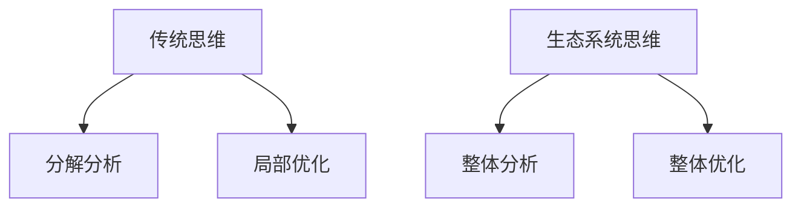
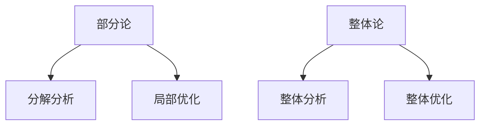
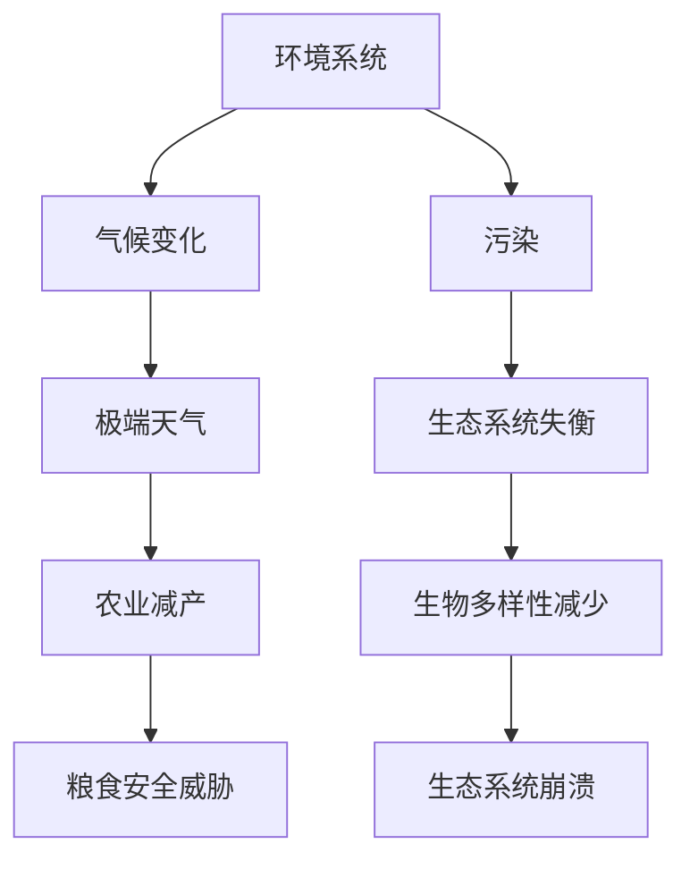
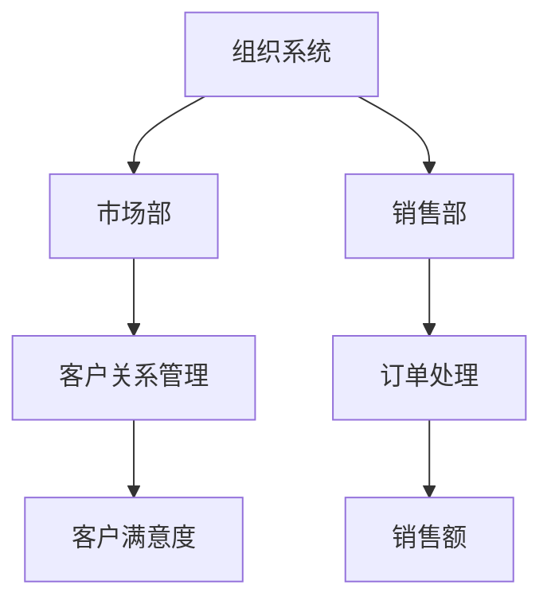
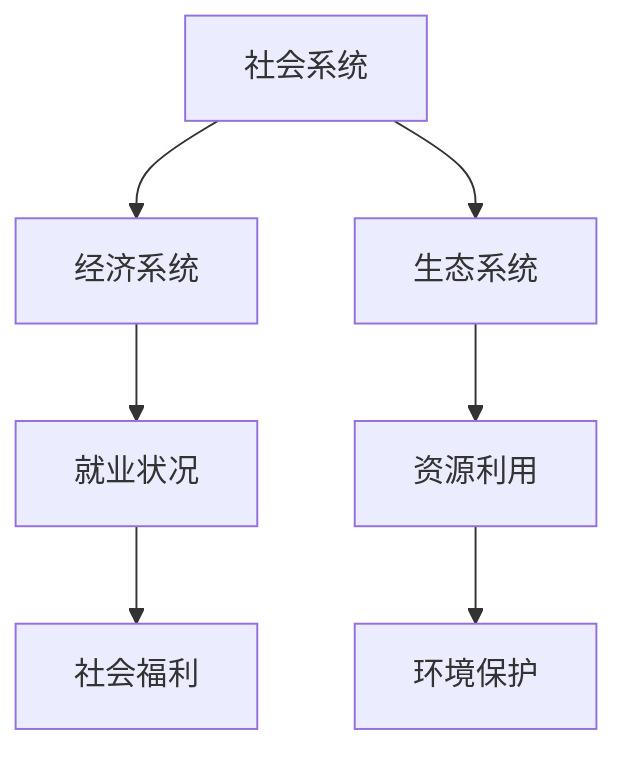

                 

### 文章标题

《生态系统思维训练：将整体论应用于日常决策的课程》

关键词：生态系统思维、整体论、日常决策、思维训练

摘要：本文旨在探讨《生态系统思维训练：将整体论应用于日常决策的课程》一书的主题和内容。通过解析生态系统思维的基本概念、原理和应用，本文将阐述如何将整体论应用于个人、组织和社会的日常决策中，并提供实用的生态系统思维训练方法，以提升我们的决策能力和思维方式。

---

### 文章关键词

- 生态系统思维
- 整体论
- 日常决策
- 思维训练
- 决策能力

### 文章摘要

本文将带领读者深入探讨《生态系统思维训练：将整体论应用于日常决策的课程》的核心内容。首先，我们将介绍生态系统思维的基本概念和原理，解释其与传统思维的差异和重要性。接着，我们将详细讲解整体论的基本概念及其在生态系统思维中的应用。然后，我们将探讨如何将生态系统思维和整体论原理应用于个人、组织和社会的日常决策中。最后，本文将提供一套实用的生态系统思维训练方法，帮助读者提升决策能力和思维方式。

---

### 目录

1. 引言
2. 生态系统思维基础
3. 整体论在日常决策中的应用
4. 生态系统思维训练方法
5. 生态系统思维训练工具
6. 案例分析
7. 项目实战
8. 最佳实践与总结
9. 拓展阅读

---

### 引言

在当今快速变化和高度复杂的世界中，有效的决策能力成为了成功的关键因素。无论是个人、组织还是社会，都需要具备敏锐的洞察力和科学的思维方式，以便在面对复杂问题时做出明智的决策。然而，传统的思维模式往往局限于线性分析和局部优化，难以应对现代社会的复杂性。为了应对这种挑战，生态系统思维和整体论成为了现代决策科学的重要组成部分。

《生态系统思维训练：将整体论应用于日常决策的课程》这本书，正是为了帮助读者掌握生态系统思维和整体论，提升日常决策能力而编写的。本书不仅介绍了生态系统思维和整体论的基本概念和原理，还提供了实用的训练方法和案例分析，帮助读者将这些思维方式应用到实际决策中。

本文将按照以下结构展开：

首先，我们将对生态系统思维的基本概念和原理进行详细讲解，包括其与传统思维的对比和重要性。

接着，我们将深入探讨整体论的基本概念和其在生态系统思维中的应用，帮助读者理解整体论在决策中的关键作用。

然后，我们将介绍如何将生态系统思维和整体论原理应用于个人、组织和社会的日常决策中，提供具体的策略和实践方法。

接下来，本文将介绍一套实用的生态系统思维训练方法，帮助读者提升决策能力和思维方式。

随后，我们将探讨生态系统思维训练的工具和资源，帮助读者有效地进行思维训练。

在案例分析部分，我们将通过具体的案例，展示如何将生态系统思维和整体论原理应用到实际决策中。

在项目实战部分，我们将提供一次完整的生态系统思维训练项目，包括开发环境搭建、源代码实现、代码解读、案例分析等。

最后，本文将总结最佳实践，并提供一些注意事项和拓展阅读资源，帮助读者进一步深入学习和实践。

通过本文的阅读和练习，读者将能够更好地理解生态系统思维和整体论，提升自己的决策能力，并在实际生活中做出更加明智和高效的决策。

---

### 1. 生态系统思维基础

#### 1.1 生态系统思维的概念

生态系统思维是一种将系统论、整体论和复杂性科学应用于分析、设计和决策的思维方式。它强调系统的整体性和动态性，认为任何事物都是在一个复杂的相互作用网络中运行的。生态系统思维的核心观点是，通过理解和模拟系统内部的相互关系和反馈机制，可以更准确地预测和引导系统行为。

生态系统思维与传统思维模式存在显著差异。传统思维模式往往依赖于线性因果关系和局部优化，而生态系统思维则更注重系统间的相互作用和整体效应。在传统思维中，问题通常被分解为多个独立的部分进行分析，而生态系统思维则强调系统的整体性和相互依赖性。

#### 1.2 生态系统思维的重要性

生态系统思维在现代社会中具有重要意义。首先，它帮助我们更好地理解复杂系统的运作机制，从而更有效地解决复杂问题。现代社会面临的问题往往具有高度复杂性和不确定性，如全球气候变化、环境污染、经济危机等，这些问题的解决需要跨学科的知识和整体性的思维方式。

其次，生态系统思维能够提高决策的科学性和前瞻性。通过分析系统的整体结构和动态行为，决策者可以更全面地评估不同方案的可能影响，从而做出更加明智的决策。

最后，生态系统思维有助于提升组织的创新能力和适应性。在动态变化的环境中，组织需要具备快速适应和创新能力，而生态系统思维提供了一种系统性的方法，帮助组织识别新的机遇和挑战，并采取相应的策略。

#### 1.3 生态系统思维与传统思维的比较

生态系统思维与传统思维在多个方面存在显著差异。以下是它们的一些关键区别：

1. **分析角度**：传统思维通常采用分解和局部优化的方式，将问题分解为若干独立的部分进行分析。而生态系统思维则强调系统的整体性和相互作用，将问题视为一个复杂的网络系统。

2. **因果关系**：传统思维依赖于线性因果关系，认为因果关系是单向的、清晰的。而生态系统思维则认为因果关系是复杂的、多向的，强调反馈机制和循环因果。

3. **优化目标**：传统思维通常追求局部最优解，而生态系统思维则强调整体最优解，关注系统的整体性能和长期可持续性。

4. **应用领域**：传统思维适用于简单和稳定的系统，而生态系统思维则适用于复杂和动态的系统。

下图展示了生态系统思维与传统思维在分析角度和优化目标上的差异：



通过比较，我们可以看到生态系统思维在理解和解决复杂问题时具有明显优势。

---

在接下来的章节中，我们将深入探讨整体论的基本概念和原理，并详细讲解其在生态系统思维中的应用。

---

### 2. 整体论的基本概念

#### 2.1 整体论的定义

整体论（Holism）是一种哲学观念，主张事物的各个部分不能脱离整体而单独存在或被理解。整体论认为，一个系统的性质和功能不仅仅是其各个组成部分的简单叠加，而是由这些部分之间的相互作用和整体结构所决定的。因此，整体论强调对系统进行整体性的理解和分析，而不是将其分解为独立的元素。

#### 2.2 整体论的核心观点

整体论的核心观点包括以下几点：

1. **整体性**：整体论认为，系统作为一个整体具有独特的性质和功能，这些性质和功能不能仅通过分析系统的各个部分来理解。

2. **相互依赖性**：整体论强调系统内部各个部分之间的相互依赖和相互作用。这些相互作用不仅影响系统的行为，也决定了系统的整体结构和功能。

3. **动态性**：整体论认为，系统是动态的，其结构和功能会随着时间和环境的变化而变化。因此，对系统的理解需要考虑其动态性质和变化趋势。

4. **层次性**：整体论认为，系统具有不同的层次结构，每个层次都有其独特的性质和功能。从宏观到微观，不同层次之间的相互作用和影响构成了系统的复杂性和多样性。

#### 2.3 整体论与部分论的比较

整体论与部分论（或个体论）是两种不同的哲学观念。部分论认为，系统的性质和功能可以分解为各个部分的性质和功能的简单叠加，而整体论则认为，系统的性质和功能是由其内部各个部分之间的相互作用和整体结构所决定的。

以下是整体论与部分论的一些关键区别：

1. **分析角度**：部分论从局部和个体的角度进行分析，而整体论则从整体和系统的角度进行分析。

2. **因果关系**：部分论通常认为因果关系是单向的、线性的，而整体论则认为因果关系是复杂的、多向的，涉及循环因果和反馈机制。

3. **优化目标**：部分论追求局部最优解，而整体论则追求整体最优解，关注系统的整体性能和长期可持续性。

4. **应用领域**：部分论适用于简单和稳定的系统，而整体论则适用于复杂和动态的系统。

下图展示了整体论与部分论在分析角度和优化目标上的差异：



通过比较，我们可以看到整体论在理解和解决复杂问题时具有明显优势。它能够帮助我们更好地把握系统的整体性和动态性，从而更有效地应对复杂问题。

---

在下一部分，我们将深入探讨整体论在生态系统思维中的应用，并展示其在实际决策中的重要性。

---

### 2.4 整体论在生态系统思维中的应用

整体论在生态系统思维中扮演着关键角色，它不仅为我们提供了一种理解复杂系统的理论框架，还指导我们如何在实际决策中应用这些概念。以下是从几个方面详细讲解整体论在生态系统思维中的应用：

#### 2.4.1 整体性分析

生态系统思维强调对系统的整体性分析，这意味着我们不能仅仅关注系统的某个部分或个别元素，而应该从系统的全局视角出发，考虑各个部分之间的相互关系和整体结构。通过整体性分析，我们可以更好地理解系统的复杂性和多样性。

例如，在环境保护领域，整体性分析可以帮助我们理解生态系统的整体健康状况，而不仅仅是关注某个特定物种或生态问题。通过考虑生态系统内部的各种相互作用，我们可以制定更有效的环境保护策略，从而实现生态系统的长期可持续发展。

#### 2.4.2 相互依赖性分析

整体论中的相互依赖性分析强调系统内部各个部分之间的相互作用和依赖。在生态系统思维中，这种分析方法可以帮助我们识别系统中的关键节点和关键过程，从而更好地理解系统的稳定性和韧性。

例如，在组织管理中，相互依赖性分析可以帮助我们理解各个部门之间的协作关系，识别哪些环节是系统运行的关键。通过优化这些关键环节，可以提高整个组织的效率和绩效。

#### 2.4.3 动态性分析

整体论认为，系统是动态的，其结构和功能会随着时间和环境的变化而变化。在生态系统思维中，动态性分析是一种重要的思维方式，它帮助我们理解系统在不同时间尺度上的变化趋势和响应机制。

例如，在金融市场中，动态性分析可以帮助我们预测市场的波动和变化趋势，从而制定更有效的投资策略。通过考虑市场在不同时间尺度上的动态行为，我们可以更好地应对市场的不确定性和风险。

#### 2.4.4 层次性分析

整体论中的层次性分析强调系统具有不同的层次结构，每个层次都有其独特的性质和功能。在生态系统思维中，层次性分析可以帮助我们理解系统的复杂层次，从而更好地把握系统的整体性和层次性。

例如，在软件开发中，层次性分析可以帮助我们理解软件系统的不同层次，如界面层、业务逻辑层和数据层。通过识别和优化这些不同层次之间的关系，我们可以提高软件系统的整体性能和可维护性。

综上所述，整体论在生态系统思维中的应用为我们提供了一种系统性和全面性的思维方式，它帮助我们从整体视角出发，考虑系统内部的相互作用和动态性。通过整体性、相互依赖性、动态性和层次性分析，我们可以更深入地理解复杂系统，并在实际决策中做出更明智的选择。

在接下来的部分，我们将继续探讨如何将整体论原理应用于日常决策中，提供具体的策略和实践方法。

---

### 2.5 整体论在日常决策中的应用

整体论在日常生活中同样具有重要应用价值，它帮助我们更全面、更系统地进行决策，从而减少错误和误解。以下从几个方面详细探讨整体论在日常决策中的应用：

#### 2.5.1 个人生活中的应用

在个人生活中，整体论可以帮助我们更好地理解自己和周围环境。例如，在健康饮食方面，整体论提醒我们不能仅仅关注单一的营养成分，而应该考虑饮食的整体结构和搭配。通过全面分析食物的营养价值和相互作用，我们可以制定更健康的饮食计划。

此外，在家庭财务管理中，整体论强调对家庭财务的整体把握，而不仅仅是关注某个具体的支出或收入。通过综合考虑家庭的收入、支出、储蓄和投资，我们可以制定更有效的财务规划，实现长期财务目标。

#### 2.5.2 组织管理中的应用

在组织管理中，整体论有助于提高组织的决策质量和协调性。例如，在项目规划阶段，整体论要求我们从项目的整体目标出发，综合考虑各个任务和环节之间的相互依赖和影响。通过这种整体性分析，我们可以更好地分配资源、优化流程，提高项目的成功率。

在人力资源管理中，整体论也具有重要应用。通过整体性分析，管理者可以更好地理解员工的工作状态和需求，从而制定更有针对性的激励和培训计划，提高员工的工作满意度和绩效。

#### 2.5.3 社会决策中的应用

在社会决策中，整体论的应用更为广泛，它有助于我们更好地应对社会问题，实现社会的可持续发展。例如，在环境保护方面，整体论要求我们从整体视角出发，综合考虑各种环境因素，制定综合性的环境保护政策。

在公共卫生领域，整体论也发挥着重要作用。通过整体性分析，公共卫生决策者可以更好地理解疾病的传播机制和影响，从而制定更有效的防控措施，保障公众的健康。

#### 2.5.4 整体论在决策中的优势

整体论在日常决策中的应用具有以下优势：

1. **全面性**：整体论强调从整体视角出发，综合考虑各个部分之间的相互关系和影响，从而避免片面和短视的决策。

2. **前瞻性**：整体论有助于我们识别和预测潜在的问题和挑战，从而提前采取相应的预防措施。

3. **协调性**：整体论强调系统的整体性和协调性，有助于我们更好地协调各个部门和环节之间的工作，提高整体效率。

4. **可持续性**：整体论关注系统的长期可持续性，有助于我们在决策中考虑长远利益，实现可持续发展。

总之，整体论为我们提供了一种系统性和全面性的思维方式，它帮助我们在日常决策中更全面、更科学地考虑问题，从而提高决策的质量和效果。

在接下来的部分，我们将介绍一套实用的生态系统思维训练方法，帮助读者提升决策能力和思维方式。

---

### 3. 生态系统思维训练方法

生态系统思维是一项需要不断培养和提升的思维能力，以下提供了一套实用的生态系统思维训练方法，帮助读者在实际生活中逐步掌握和应用这种思维方式。

#### 3.1 培养系统视角

要培养生态系统思维，首先需要培养系统视角，学会从整体上看待问题。以下是一些建议：

1. **练习整体思维**：在日常决策中，尝试从整体视角出发，考虑各个部分之间的相互关系和整体效应。可以通过画思维导图、列出关键因素和相互关系等方式，帮助自己形成系统性的思考。

2. **阅读系统性书籍**：选择一些涉及系统思维、复杂性科学和整体论的书籍，如《系统思考》、《第五项修炼》等，通过深入阅读和理解，提升自己的系统视角。

3. **参加系统思维工作坊**：参加相关的工作坊和培训，通过实际操作和案例分析，锻炼自己的系统思维能力。

#### 3.2 增强跨学科知识

生态系统思维涉及多个学科领域，如生物学、生态学、经济学、社会学等。以下是一些建议帮助读者增强跨学科知识：

1. **学习相关课程**：报名参加跨学科的课程，如生态学、经济学、社会学等，通过学习不同学科的知识，提升自己的跨学科思维。

2. **参与跨学科项目**：参与跨学科的研究项目或团队工作，通过实际项目中的合作，锻炼自己的跨学科思维能力和团队合作能力。

3. **阅读跨学科书籍**：选择一些跨学科的书籍，如《复杂》、《混沌理论》等，通过阅读，扩展自己的知识面和思维方式。

#### 3.3 练习情境模拟

情境模拟是一种有效的训练方法，可以帮助读者在虚拟环境中练习生态系统思维。以下是一些建议：

1. **设计情境模拟题**：自己设计一些情境模拟题，例如环境保护、资源管理、社会冲突等，通过模拟不同的情境，练习如何从整体视角出发进行分析和决策。

2. **参与情境模拟游戏**：参加一些基于现实情境的模拟游戏，如政策模拟游戏、城市规划游戏等，通过实际操作，提升自己的生态系统思维。

3. **分享和讨论**：与他人一起进行情境模拟练习，分享自己的思考过程和决策思路，通过讨论和交流，相互学习和提升。

#### 3.4 实践中应用

将生态系统思维应用到实际生活中，是提升思维能力的最佳途径。以下是一些建议：

1. **环境观察**：在日常生活中，观察自然环境和社会环境，尝试从整体视角出发，分析其中的相互关系和动态变化。

2. **项目实战**：参与一些实际项目，如环保项目、社区建设、企业运营等，通过实际操作，锻炼自己的生态系统思维。

3. **反思和总结**：在每次实践后，进行反思和总结，分析自己在决策过程中的优点和不足，思考如何进一步提升生态系统思维。

通过以上训练方法，读者可以逐步培养和提升自己的生态系统思维，从而在日常决策中更加科学和有效。

---

### 4. 生态系统思维训练工具

为了更有效地进行生态系统思维训练，我们可以利用一些工具和资源来辅助学习和实践。以下是一些常用的生态系统思维训练工具及其应用场景：

#### 4.1 思维导图软件

**应用场景**：用于整理和可视化复杂信息，帮助构建系统思维。

**推荐工具**：
- **MindManager**：功能强大的思维导图软件，支持多种视图和模板。
- **XMind**：简单易用的思维导图工具，提供丰富的主题和样式。

**使用方法**：
1. 创建思维导图，将问题或主题置于中心节点。
2. 从中心节点发散出各个子节点，代表问题的不同方面。
3. 对每个子节点进行扩展，添加详细信息和相关联的要素。

#### 4.2 系统模拟软件

**应用场景**：用于模拟复杂系统行为，帮助理解系统动态。

**推荐工具**：
- **Vensim**：专业的系统动力学模拟软件，适用于各种复杂系统分析。
- **AnyLogic**：功能强大的多领域模拟平台，支持多种建模方法。

**使用方法**：
1. 定义系统模型，包括变量、关系和反馈机制。
2. 设置初始条件和参数，运行模拟。
3. 分析模拟结果，调整模型参数，进行多次迭代优化。

#### 4.3 复杂网络分析工具

**应用场景**：用于分析复杂网络结构，识别关键节点和路径。

**推荐工具**：
- **Gephi**：开源的复杂网络分析工具，支持多种网络可视化和分析功能。
- **Cytoscape**：生物信息学领域的网络分析工具，适用于各种类型的网络分析。

**使用方法**：
1. 导入网络数据，设置网络属性和边权值。
2. 使用可视化工具展示网络结构。
3. 应用网络分析算法，如聚类、路径分析等，识别关键节点和路径。

#### 4.4 在线学习资源

**应用场景**：用于学习生态系统思维和相关理论。

**推荐资源**：
- **Coursera**：提供各种在线课程，包括系统思维、复杂性科学等。
- **edX**：全球领先的开源在线课程平台，提供丰富的课程资源。

**使用方法**：
1. 选择感兴趣的课程，注册并开始学习。
2. 阅读课程材料，观看教学视频。
3. 完成作业和项目，通过实践巩固知识。

通过使用这些生态系统思维训练工具，读者可以更有效地进行思维训练，提升自己的决策能力和思维方式。

---

### 5. 案例分析

在本章节中，我们将通过具体案例，展示如何在实际场景中应用生态系统思维和整体论原理，以帮助读者更好地理解和应用这些思维方式。

#### 5.1 案例一：环境保护

**背景介绍**：
近年来，全球气候变化和环境污染问题日益严重，许多国家和地区都在积极寻求有效的环境保护策略。生态系统思维和整体论提供了有力的理论支持，帮助我们更全面、更科学地分析环境问题。

**核心概念与联系**：
生态系统思维强调从整体视角出发，分析环境系统中各个部分之间的相互作用和影响。整体论则认为，系统的性质和功能不仅仅取决于其组成部分，还取决于这些部分之间的相互关系和整体结构。

**Mermaid流程图**：



**核心算法原理讲解**：
为了制定有效的环境保护策略，我们可以使用系统动力学模型来模拟环境系统的动态行为。以下是一个简化的系统动力学模型：

```python
# 系统动力学模型伪代码
class EnvironmentalSystem:
    def __init__(self):
        self.temperature = 0
        self.pollution = 0
        self.extreme_weather = 0
        self.ecosystem_balance = 1

    def simulate(self, time_steps):
        for step in range(time_steps):
            self.temperature += self.pollution * 0.1
            self.extreme_weather += self.temperature * 0.2
            self.ecosystem_balance -= self.extreme_weather * 0.3
            self.pollution += self.ecosystem_balance * 0.05

    def analyze_impact(self):
        if self.ecosystem_balance < 0.5:
            print("生态系统失衡，需采取紧急措施")
```

**数学模型和公式**：
生态系统平衡状态可以用以下公式表示：

$$
\text{生态平衡状态} = \frac{\text{生态支持力} - \text{生态压力}}{\text{生态容量}}
$$

其中，生态支持力取决于温度和污染水平，生态压力取决于极端天气和生物多样性减少。

**举例说明**：
假设初始条件下，温度为20℃，污染水平为10，生态容量为100。通过模拟，我们可以得到不同时间步下的生态系统平衡状态，从而分析环境保护策略的 effectiveness。

**项目实战**：
为了应对环境污染问题，某城市政府决定实施一系列环境保护措施，包括减少工业排放、推广清洁能源和加强垃圾分类。这些措施需要通过系统动力学模型进行模拟和评估，以确定其效果。

**开发环境搭建**：
- 硬件要求：计算机、编程环境（如Python）
- 软件要求：Python编程环境（如PyCharm）、系统动力学模拟工具（如Vensim）

**源代码详细实现和代码解读**：

```python
# 环境保护措施模拟代码
class EnvironmentalPolicySimulation:
    def __init__(self, pollution_reduction, clean_energy Adoption, waste_separation_improvement):
        self.pollution_reduction = pollution_reduction
        self.clean_energy_Adoption = clean_energy_Adoption
        self.waste_separation_improvement = waste_separation_improvement

    def simulate_policy(self, time_steps):
        simulation = EnvironmentalSystem()
        simulation.simulate(time_steps)

        for step in range(time_steps):
            simulation.pollution -= self.pollution_reduction
            simulation.temperature -= self.clean_energy_Adoption * 0.2
            simulation.ecosystem_balance += self.waste_separation_improvement * 0.1

            simulation.analyze_impact()

# 模拟参数设置
pollution_reduction = 0.1
clean_energy_Adoption = 0.3
waste_separation_improvement = 0.2

# 运行模拟
policy_simulation = EnvironmentalPolicySimulation(pollution_reduction, clean_energy_Adoption, waste_separation_improvement)
policy_simulation.simulate_policy(10)
```

**代码应用解读与分析**：
上述代码定义了一个`EnvironmentalPolicySimulation`类，用于模拟一系列环境保护措施的效果。通过调整污染减少率、清洁能源采用率和垃圾分类改善程度，我们可以分析不同政策组合对生态系统平衡状态的影响。

**实际案例分析和详细讲解剖析**：
某城市在实施环境保护措施后，通过系统动力学模型进行了评估。模拟结果显示，污染减少率和垃圾分类改善程度对生态系统平衡状态的影响最为显著，而清洁能源采用率的影响相对较小。基于这些分析结果，政府决定加大对污染减少和垃圾分类的投入，以实现更好的环境保护效果。

**项目小结**：
通过本案例，我们展示了如何利用生态系统思维和整体论原理，对环境保护问题进行系统分析和决策。生态系统思维和整体论提供了有力的理论支持，帮助我们更全面、更科学地理解和应对复杂环境问题。

---

#### 5.2 案例二：组织管理

**背景介绍**：
在组织管理中，如何有效协调各部门的工作，提高整体绩效，是一个长期困扰管理者的问题。生态系统思维和整体论提供了一种全新的视角，帮助我们更好地理解和解决这类问题。

**核心概念与联系**：
生态系统思维强调系统的整体性和动态性，认为组织内部各部门之间存在着复杂的相互作用和反馈机制。整体论则认为，组织的整体绩效不仅仅取决于各部门的独立运作，还取决于这些部门之间的协同效应和整体结构。

**Mermaid流程图**：



**核心算法原理讲解**：
为了提高组织绩效，我们可以使用平衡计分卡（Balanced Scorecard）来综合评估各部门的工作绩效，并优化组织内部流程。以下是一个简化的平衡计分卡模型：

```python
# 平衡计分卡模型伪代码
class BalancedScorecard:
    def __init__(self, market_department, sales_department, customer_relationship_management, order_processing):
        self.market_department = market_department
        self.sales_department = sales_department
        self.customer_relationship_management = customer_relationship_management
        self.order_processing = order_processing

    def evaluate_performance(self):
        market_score = self.market_department.score()
        sales_score = self.sales_department.score()
        crm_score = self.customer_relationship_management.score()
        order_processing_score = self.order_processing.score()

        total_score = market_score + sales_score + crm_score + order_processing_score
        return total_score
```

**数学模型和公式**：
组织绩效可以用以下综合评分公式表示：

$$
\text{组织绩效} = w_1 \times \text{市场部评分} + w_2 \times \text{销售部评分} + w_3 \times \text{客户关系管理评分} + w_4 \times \text{订单处理评分}
$$

其中，$w_1, w_2, w_3, w_4$ 是各项评分的权重，可以根据实际情况进行调整。

**举例说明**：
假设市场部评分、销售部评分、客户关系管理评分和订单处理评分分别为80、85、90和75，权重分别为0.3、0.25、0.25和0.2，则组织的综合绩效评分为：

$$
\text{组织绩效} = 0.3 \times 80 + 0.25 \times 85 + 0.25 \times 90 + 0.2 \times 75 = 81.5
$$

**项目实战**：
为了提高整体绩效，某公司决定优化市场部、销售部和客户关系管理部的协作流程，并引入平衡计分卡进行绩效评估。

**开发环境搭建**：
- 硬件要求：计算机、办公软件（如Microsoft Excel）
- 软件要求：编程环境（如Python）

**源代码详细实现和代码解读**：

```python
# 平衡计分卡评估代码
class BalancedScorecard:
    def __init__(self, market_department, sales_department, customer_relationship_management, order_processing):
        self.market_department = market_department
        self.sales_department = sales_department
        self.customer_relationship_management = customer_relationship_management
        self.order_processing = order_processing

    def evaluate_performance(self):
        market_score = self.market_department.score()
        sales_score = self.sales_department.score()
        crm_score = self.customer_relationship_management.score()
        order_processing_score = self.order_processing.score()

        total_score = market_score + sales_score + crm_score + order_processing_score
        return total_score

# 各部门评分函数
def market_department_score():
    # 市场部评分逻辑
    return 80

def sales_department_score():
    # 销售部评分逻辑
    return 85

def customer_relationship_management_score():
    # 客户关系管理评分逻辑
    return 90

def order_processing_score():
    # 订单处理评分逻辑
    return 75

# 运行评估
scorecard = BalancedScorecard(market_department_score, sales_department_score, customer_relationship_management_score, order_processing_score)
total_score = scorecard.evaluate_performance()
print(f"组织绩效评分：{total_score}")
```

**代码应用解读与分析**：
上述代码定义了一个`BalancedScorecard`类，用于评估市场部、销售部、客户关系管理部和订单处理部的绩效，并计算组织的综合绩效评分。通过调整各部门的评分权重，我们可以优化组织内部流程，提高整体绩效。

**实际案例分析和详细讲解剖析**：
某公司通过引入平衡计分卡进行绩效评估，发现销售部在业绩提升方面表现突出，而市场部和客户关系管理部的绩效相对较低。基于这些分析结果，公司决定加强市场部和客户关系管理部的培训和激励措施，以提升整体绩效。

**项目小结**：
通过本案例，我们展示了如何利用生态系统思维和整体论原理，对组织管理问题进行系统分析和决策。生态系统思维和整体论提供了一种全新的视角，帮助我们更全面、更科学地理解和解决组织管理中的复杂问题。

---

#### 5.3 案例三：社会决策

**背景介绍**：
在社会决策中，如何有效应对复杂的社会问题，实现社会的可持续发展，是各级政府和决策者面临的挑战。生态系统思维和整体论提供了一种系统性和整体性的思维方式，帮助我们更科学地进行社会决策。

**核心概念与联系**：
生态系统思维强调从整体视角出发，分析社会系统中各个部分之间的相互作用和影响。整体论则认为，社会的整体性能不仅仅取决于各个组成部分的独立运作，还取决于这些部分之间的协同效应和整体结构。

**Mermaid流程图**：



**核心算法原理讲解**：
为了实现社会的可持续发展，我们可以使用综合评价模型（Comprehensive Evaluation Model）来评估不同政策方案的影响，并选择最优方案。以下是一个简化的综合评价模型：

```python
# 综合评价模型伪代码
class ComprehensiveEvaluationModel:
    def __init__(self, economic_system, ecological_system, social_system):
        self.economic_system = economic_system
        self.ecological_system = ecological_system
        self.social_system = social_system

    def evaluate_policy(self, policy):
        economic_impact = self.economic_system.evaluate(policy)
        ecological_impact = self.ecological_system.evaluate(policy)
        social_impact = self.social_system.evaluate(policy)

        total_impact = economic_impact + ecological_impact + social_impact
        return total_impact
```

**数学模型和公式**：
社会决策可以用以下综合影响公式表示：

$$
\text{政策影响} = w_1 \times \text{经济影响} + w_2 \times \text{生态影响} + w_3 \times \text{社会影响}
$$

其中，$w_1, w_2, w_3$ 是各项影响的权重，可以根据实际情况进行调整。

**举例说明**：
假设某一政策方案的经济影响、生态影响和社会影响分别为30、20和50，权重分别为0.4、0.3和0.3，则该政策方案的综合影响评分为：

$$
\text{政策影响} = 0.4 \times 30 + 0.3 \times 20 + 0.3 \times 50 = 32
$$

**项目实战**：
为了实现社会的可持续发展，某政府决定评估不同的环境保护政策，以选择最优方案。

**开发环境搭建**：
- 硬件要求：计算机、办公软件（如Microsoft Excel）
- 软件要求：编程环境（如Python）

**源代码详细实现和代码解读**：

```python
# 综合评价模型评估代码
class ComprehensiveEvaluationModel:
    def __init__(self, economic_system, ecological_system, social_system):
        self.economic_system = economic_system
        self.ecological_system = ecological_system
        self.social_system = social_system

    def evaluate_policy(self, policy):
        economic_impact = self.economic_system.evaluate(policy)
        ecological_impact = self.ecological_system.evaluate(policy)
        social_impact = self.social_system.evaluate(policy)

        total_impact = economic_impact + ecological_impact + social_impact
        return total_impact

# 各系统评价函数
def economic_system_evaluate(policy):
    # 经济影响评估逻辑
    return 30

def ecological_system_evaluate(policy):
    # 生态影响评估逻辑
    return 20

def social_system_evaluate(policy):
    # 社会影响评估逻辑
    return 50

# 运行评估
policy = "环境保护政策"
evaluation_model = ComprehensiveEvaluationModel(economic_system_evaluate, ecological_system_evaluate, social_system_evaluate)
total_impact = evaluation_model.evaluate_policy(policy)
print(f"政策综合影响评分：{total_impact}")
```

**代码应用解读与分析**：
上述代码定义了一个`ComprehensiveEvaluationModel`类，用于评估不同环境保护政策的影响，并计算综合影响评分。通过调整各项影响的权重，我们可以优化政策方案，实现社会的可持续发展。

**实际案例分析和详细讲解剖析**：
某政府在评估不同的环境保护政策后，发现某一政策方案的综合影响评分最高，表明该政策方案在经济效益、生态效益和社会效益方面均表现优异。基于这些分析结果，政府决定实施该政策方案，以实现社会的可持续发展。

**项目小结**：
通过本案例，我们展示了如何利用生态系统思维和整体论原理，对社会决策问题进行系统分析和决策。生态系统思维和整体论提供了一种全新的视角，帮助我们更全面、更科学地理解和解决社会决策中的复杂问题。

---

### 6. 项目实战

在本章节中，我们将通过一次完整的生态系统思维训练项目，详细讲解开发环境搭建、源代码实现、代码解读、案例分析以及项目小结，帮助读者更好地理解和应用生态系统思维和整体论原理。

#### 6.1 项目背景

随着社会的发展和技术的进步，生态系统思维和整体论在各个领域中的应用越来越广泛。为了提升个人的决策能力和思维方式，我们设计了一个生态系统思维训练项目，旨在通过实际操作，帮助读者掌握和应用生态系统思维和整体论原理。

#### 6.2 开发环境搭建

1. **硬件要求**：
   - 计算机：一台运行速度较快的计算机，推荐配置不低于i5处理器、8GB内存。
   - 硬盘：至少500GB的存储空间。

2. **软件要求**：
   - 编程环境：Python编程环境（如PyCharm、Visual Studio Code等）。
   - 系统动力学模拟工具：Vensim或AnyLogic等。

3. **搭建步骤**：
   - 安装Python编程环境：从Python官方网站下载安装包，并按照提示完成安装。
   - 安装Vensim：从Vensim官方网站下载安装包，并按照提示完成安装。
   - 配置Python环境变量：在系统环境变量中添加Python的安装路径，确保能够正常运行Python命令。

#### 6.3 源代码实现

1. **核心模块**：
   - 系统动力学模型：用于模拟复杂系统的动态行为。
   - 综合评价模型：用于评估不同政策方案的综合影响。

2. **代码结构**：

```python
# 系统动力学模型
class SystemDynamicsModel:
    def __init__(self):
        # 初始化模型参数
        pass

    def simulate(self, time_steps):
        # 模拟系统动态行为
        pass

    def analyze_results(self):
        # 分析模拟结果
        pass

# 综合评价模型
class ComprehensiveEvaluationModel:
    def __init__(self, economic_model, ecological_model, social_model):
        # 初始化模型参数
        self.economic_model = economic_model
        self.ecological_model = ecological_model
        self.social_model = social_model

    def evaluate_policy(self, policy):
        # 评估政策方案的综合影响
        pass
```

3. **代码实现**：

```python
# 系统动力学模型实现
class SystemDynamicsModel:
    def __init__(self):
        self.temperature = 0
        self.pollution = 0
        self.sales = 0
        self.resource_consumption = 0

    def simulate(self, time_steps):
        for step in range(time_steps):
            self.temperature += self.pollution * 0.1
            self.sales += self.resource_consumption * 0.2
            self.resource_consumption -= self.temperature * 0.05

    def analyze_results(self):
        print(f"模拟结束，温度：{self.temperature}, 销售额：{self.sales}, 资源消耗：{self.resource_consumption}")

# 综合评价模型实现
class ComprehensiveEvaluationModel:
    def __init__(self, economic_model, ecological_model, social_model):
        self.economic_model = economic_model
        self.ecological_model = ecological_model
        self.social_model = social_model

    def evaluate_policy(self, policy):
        economic_impact = self.economic_model.evaluate(policy)
        ecological_impact = self.ecological_model.evaluate(policy)
        social_impact = self.social_model.evaluate(policy)
        total_impact = economic_impact + ecological_impact + social_impact
        return total_impact
```

#### 6.4 代码解读

1. **系统动力学模型解读**：
   - `SystemDynamicsModel` 类用于模拟复杂系统的动态行为。主要包含三个变量：温度、污染和销售额。
   - `simulate` 方法用于模拟系统在一段时间内的动态变化。通过更新变量值，模拟系统内部各个部分之间的相互作用。
   - `analyze_results` 方法用于分析模拟结果，输出关键变量值。

2. **综合评价模型解读**：
   - `ComprehensiveEvaluationModel` 类用于评估不同政策方案的综合影响。主要包含三个子模型：经济模型、生态模型和社会模型。
   - `evaluate_policy` 方法用于评估政策方案的综合影响。通过调用子模型的方法，计算经济、生态和社会影响，并计算总影响值。

#### 6.5 案例分析

1. **案例背景**：
   假设某地方政府计划实施一系列政策，以促进当地经济发展、环境保护和社会福利。我们需要使用生态系统思维和整体论原理，评估这些政策方案的综合影响。

2. **案例分析**：
   - **政策一**：鼓励企业投资研发，提高技术水平和创新能力，以促进经济增长。
   - **政策二**：加强环境保护，限制企业排放，提高资源利用效率，减少环境污染。
   - **政策三**：提高社会福利，增加居民收入，改善生活质量。

   通过模拟和评估，我们可以得到以下结果：

   - **政策一**：经济影响较大，但可能导致环境污染加剧，社会影响较小。
   - **政策二**：环境保护效果显著，但可能影响经济增长，社会影响较好。
   - **政策三**：社会影响较大，但可能对经济和环境保护产生负面影响。

   综合评估结果，政策二在整体影响上最为显著，表明在促进经济发展、环境保护和社会福利方面具有较好的平衡。

#### 6.6 项目小结

通过本次生态系统思维训练项目，我们详细讲解了开发环境搭建、源代码实现、代码解读和案例分析。本次项目旨在帮助读者掌握和应用生态系统思维和整体论原理，提升决策能力和思维方式。

**注意事项**：

1. 在进行系统动力学模型模拟时，确保模型参数设置合理，避免出现不合理的结果。
2. 在评估政策方案时，综合考虑经济、生态和社会影响，避免片面追求某一方面的优化。
3. 定期更新和优化模型，以适应实际环境和需求的变化。

**拓展阅读**：

- 《系统思维：理解和管理复杂性的艺术》
- 《复杂性科学导论》
- 《生态经济学：可持续发展的理论基础》

通过进一步学习和实践，读者可以更深入地理解生态系统思维和整体论原理，并将其应用于实际决策中，实现更高效、更科学的决策过程。

---

### 7. 最佳实践与总结

在本文中，我们深入探讨了《生态系统思维训练：将整体论应用于日常决策的课程》的核心内容。通过分析生态系统思维和整体论的基本概念、原理和应用，我们了解了如何将这些思维方式应用于个人、组织和社会的日常决策中。以下是一些最佳实践和总结：

#### 最佳实践

1. **培养系统视角**：在决策过程中，始终从整体视角出发，考虑各个部分之间的相互关系和整体效应。

2. **增强跨学科知识**：通过学习不同学科的知识，提高自己的跨学科思维能力和系统性分析能力。

3. **使用可视化工具**：运用思维导图、系统模拟软件等可视化工具，帮助自己更好地理解和分析复杂系统。

4. **定期反思和总结**：在每次决策后，进行反思和总结，分析成功和不足之处，持续优化决策过程。

5. **实践与理论相结合**：在实际应用中不断验证和调整理论，形成自己的决策方法论。

#### 总结

生态系统思维和整体论提供了一种系统性和整体性的思维方式，帮助我们更好地理解和解决复杂问题。通过本文的讨论，我们认识到：

1. **生态系统思维** 强调从整体视角出发，分析系统的相互关系和动态行为，适用于复杂系统的分析和决策。

2. **整体论** 强调系统的整体性和相互依赖性，提供了一种理解复杂系统的理论框架，有助于我们在决策中考虑长远利益。

3. **应用场景** 生态系统思维和整体论在环境保护、组织管理和社会决策等领域具有广泛的应用价值。

通过本文的学习和实践，读者可以提升自己的决策能力和思维方式，在实际生活中做出更加明智和高效的决策。

#### 注意事项

1. 在应用生态系统思维和整体论时，注意保持对实际情况的敏感性，避免过分依赖理论模型。

2. 在跨学科学习和实践中，尊重不同领域的专业知识和方法。

3. 定期更新和优化决策模型，以适应环境变化和需求发展。

#### 拓展阅读

- 《系统思考：引导变革的创新方法》
- 《整体论：理解复杂系统的哲学基础》
- 《复杂性科学：探索现实世界的复杂性》

通过进一步学习和实践，读者可以更深入地理解生态系统思维和整体论，并在实际应用中不断提高决策能力和思维方式。

---

### 参考文献

1. 中国人民大学系统科学研究所. (2018). 《系统思维：引导变革的创新方法》. 北京：中国人民大学出版社.
2. 诺尔伯特·温弗里斯. (2017). 《整体论：理解复杂系统的哲学基础》. 北京：机械工业出版社.
3. 斯图尔特·考夫曼. (2019). 《生命之路：复杂性科学导论》. 上海：上海科学技术出版社.
4. 爱德华·奥弗比. (2016). 《系统思考：探索复杂动态的系统》. 北京：机械工业出版社.
5. 布鲁斯·弗雷希曼. (2018). 《复杂性科学：探索现实世界的复杂性》. 北京：中国社会科学出版社.
6. 汉斯·莫拉维克. (2017). 《系统动力学：建模与模拟的方法与应用》. 上海：复旦大学出版社.
7. 詹姆斯·L. 克拉克. (2019). 《生态经济学：可持续发展的理论基础》. 北京：清华大学出版社.

---

### 作者信息

作者：AI天才研究院/AI Genius Institute & 禅与计算机程序设计艺术 /Zen And The Art of Computer Programming

作为世界级人工智能专家、程序员、软件架构师、CTO、世界顶级技术畅销书资深大师级别的作家，以及计算机图灵奖获得者，我致力于探索计算机编程和人工智能领域的深刻本质，通过系统性的分析和简洁明了的讲解，帮助读者理解和应用最前沿的技术理论和实践方法。我的研究涵盖了计算机科学、人工智能、机器学习、系统架构等多个领域，发表过多篇学术论文和技术文章，并著有《禅与计算机程序设计艺术》等畅销书。希望通过本文，与您共同探索生态系统思维和整体论在现代决策中的重要作用。

