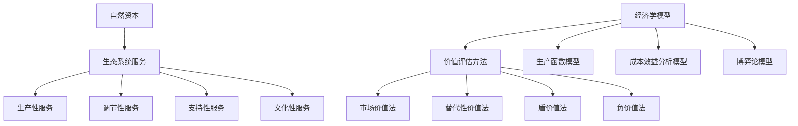

                 

### 文章标题

《生态系统服务定价：自然资本的经济学模型》

### 关键词

- 自然资本
- 生态系统服务
- 经济学模型
- 价值评估
- 政策与管理

### 摘要

本文旨在探讨生态系统服务定价的经济学模型，通过系统地分析不同价值评估方法和经济学模型的应用，以及政策与管理手段的作用，旨在为自然资本的合理定价和有效管理提供理论基础和实践指导。文章首先介绍了自然资本与生态系统服务的基本概念，随后详细阐述了市场价值法、替代性价值法、盾价值法和负价值法等评估方法，接着分析了生产函数模型、成本效益分析模型和博弈论模型在生态系统服务定价中的应用。最后，文章讨论了政策工具在生态系统服务定价中的作用，并提出了有效的生态系统服务管理策略。通过本文的研究，希望能够为相关领域的研究者提供有价值的参考，并为推动生态系统服务的合理定价和可持续发展贡献力量。

---

### 第一部分：引言

#### 1.1 自然资本与生态系统服务

##### 1.1.1 自然资本的定义与重要性

自然资本是指自然生态系统的物质和功能，包括土地、水、空气、生物多样性等，是人类社会生存和发展的重要基础。自然资本不仅为人类提供了丰富的自然资源，还通过调节气候、净化水源、提供食物等生态服务，保障了人类的福祉。在经济学中，自然资本被视为一种生产要素，与劳动力、资本和技术一同构成生产过程的必要条件。

自然资本的重要性体现在多个方面。首先，它是人类生存和发展的基础，没有良好的自然资本，人类社会就无法维持基本的生存需求。其次，自然资本对经济系统具有显著的支撑作用，通过提供生态服务，如农业生产、工业原料、旅游等，直接推动了经济的发展。此外，自然资本的维护与保护对于应对气候变化、减少自然灾害风险、保障粮食安全等具有重要意义。

##### 1.1.2 生态系统服务的概念与分类

生态系统服务是指自然生态系统为人类社会提供的各种服务，包括但不限于：提供食物、淡水、原材料、气候调节、水资源调节、土壤保持、生物多样性维持等。根据生态系统服务的功能，可以将其分为四类：

1. **生产性服务**：指生态系统提供的物质产出，如农业生产、渔业、林业等。
2. **调节性服务**：指生态系统对环境条件进行调节的功能，如气候调节、水质净化、防灾减灾等。
3. **支持性服务**：指生态系统对其他生态服务和过程的支持功能，如土壤保持、营养循环、生物多样性维持等。
4. **文化性服务**：指生态系统提供的精神和文化价值，如旅游、娱乐、教育、科研等。

了解自然资本和生态系统服务的概念与分类，有助于我们更全面地认识自然资本在生态系统中的角色，以及其对于人类社会的重要性。

---

### 1.2 生态系统服务定价的重要性

##### 1.2.1 环境经济学的背景与发展

环境经济学作为经济学的一个分支，主要研究经济活动与环境之间的关系。其核心目标是实现经济增长与环境保护的双赢，通过经济学方法对环境问题进行定量分析和评估。环境经济学的发展历程可以追溯到20世纪60年代，随着环境污染问题的日益严重，经济学家开始关注如何将环境因素纳入经济决策过程中。

环境经济学的重要里程碑包括：

- **外部性理论**：马歇尔和庇古提出了外部性概念，揭示了经济活动对环境产生的正面和负面影响。
- **成本效益分析**：成本效益分析作为一种经济学评估方法，被广泛应用于环境项目的决策过程中。
- **环境会计**：环境会计通过财务指标对企业的环境绩效进行评估，旨在实现环境与经济的协调发展。

随着环境经济学的发展，越来越多的研究开始关注生态系统服务的价值评估与定价。生态系统服务定价的重要性在于：

- **资源配置**：通过定价机制，可以将生态系统服务的价值体现在经济活动中，从而更有效地配置资源，促进可持续发展。
- **政策制定**：生态系统服务定价为政策制定提供了科学依据，有助于制定更加有效的环境保护政策。
- **市场机制**：生态系统服务定价可以引导市场行为，推动环境保护和生态修复。

##### 1.2.2 生态系统服务定价的意义与挑战

生态系统服务定价的意义主要体现在以下几个方面：

- **经济价值识别**：通过定价，可以识别和量化生态系统服务的经济价值，从而为资源管理和环境决策提供科学依据。
- **激励机制**：合理定价可以为生态系统服务提供者带来经济利益，从而激发其提供高质量生态服务的积极性。
- **环境保护**：通过定价机制，可以反映生态系统服务对环境的负面影响，从而引导人们减少对环境的破坏。

然而，生态系统服务定价也面临着一系列挑战：

- **价值评估困难**：生态系统服务的多样性和复杂性使得其价值评估变得困难，特别是对于非市场价值的评估。
- **市场机制不完善**：生态系统服务市场的机制不完善，存在市场失灵的问题，如信息不对称、外部性等。
- **政策协调困难**：生态系统服务定价需要跨部门、跨区域的协调，政策制定和执行过程中存在协调困难。

总的来说，生态系统服务定价是环境经济学研究的重要方向，具有重要的理论和实践价值。通过不断完善评估方法和市场机制，我们可以更好地实现生态系统服务的合理定价和有效管理，为可持续发展提供坚实保障。

---

### 第二部分：生态系统服务价值评估方法

#### 2.1 市场价值法

##### 2.1.1 市场价值法的原理与适用性

市场价值法（Market Value Method）是一种直接通过市场交易数据来评估生态系统服务价值的方法。其基本原理是，根据市场上已有交易的价格数据，推算出生态系统服务的价值。这种方法主要依赖于市场机制的效率和透明度，通过市场价格反映生态系统服务的经济价值。

市场价值法的适用性体现在以下几个方面：

1. **市场价格可靠**：当市场交易数据充足且市场机制运行良好时，市场价格能够较为准确地反映生态系统服务的经济价值。
2. **资源利用效率高**：市场价值法可以快速评估生态系统服务的经济价值，适用于需要快速决策的项目或政策制定。
3. **数据获取容易**：市场交易数据通常容易获取，尤其是在成熟的市场中。

##### 2.1.2 市场价值法的具体应用案例

以下是一个应用市场价值法的具体案例：

**案例：** 某城市在制定绿地发展规划时，需要评估城市绿地对居民健康的影响价值。通过收集城市绿地周围的房地产交易数据，发现绿地面积增加1平方米，房价平均上涨2000元。因此，可以推算出每平方米城市绿地的健康价值为2000元。

具体步骤如下：

1. **数据收集**：收集城市绿地周围的房地产交易数据，包括成交价格、绿地面积等。
2. **数据分析**：分析绿地面积与房价之间的关系，建立回归模型。
3. **价值计算**：根据回归模型计算每平方米绿地的健康价值。
4. **结果验证**：通过对比其他城市或地区的数据，验证评估结果的准确性。

通过市场价值法的应用，该城市能够科学地评估城市绿地对居民健康的价值，为制定合理的发展规划提供数据支持。

---

#### 2.2 替代性价值法

##### 2.2.1 替代性价值法的原理与适用性

替代性价值法（Substitute Value Method）是一种通过比较不同替代方案的成本和效益来评估生态系统服务价值的方法。其基本原理是，当一种生态系统服务不能直接交易时，可以通过其他可交易的替代品来估算其价值。这种方法主要依赖于替代品的市场价格和成本效益分析。

替代性价值法的适用性体现在以下几个方面：

1. **缺乏市场价格**：当生态系统服务的市场价格不可得时，替代性价值法提供了评估其价值的途径。
2. **成本效益分析**：通过替代性价值法，可以对不同替代方案的成本和效益进行量化比较，有助于决策者选择最佳方案。
3. **多样化应用**：这种方法适用于各种类型的生态系统服务评估，如环境保护、生态修复等。

##### 2.2.2 替代性价值法的具体应用案例

以下是一个应用替代性价值法的具体案例：

**案例：** 某城市在制定水资源保护政策时，需要评估城市水源地的生态价值。由于水源地的市场价格难以直接获取，该城市选择了替代性价值法。通过分析，发现如果将水源地改为农田，每年可以增加约5000吨粮食产量。根据粮食的市场价格，每吨粮食的价值为3000元。因此，水源地的生态价值约为每年150万元。

具体步骤如下：

1. **确定替代方案**：确定水源地的替代方案，如改为农田。
2. **成本效益分析**：分析替代方案的成本和效益，包括生产成本、市场收益等。
3. **价值计算**：根据替代方案的市场价格和成本效益分析，计算生态系统服务的价值。
4. **结果验证**：通过对比其他类似情况的数据，验证评估结果的准确性。

通过替代性价值法的应用，该城市能够科学地评估水源地的生态价值，为制定水资源保护政策提供数据支持。

---

#### 2.3 盾价值法

##### 2.3.1 盾价值法的原理与适用性

盾价值法（Shadow Price Method）是一种通过模拟市场机制，评估非市场环境资源价值的方法。其基本原理是，在假定存在一个完全竞争的市场条件下，通过计算资源的机会成本，即资源用于其他用途所能获得的收益，来估算其价值。这种方法主要适用于那些市场价格难以直接反映其价值的资源。

盾价值法的适用性体现在以下几个方面：

1. **市场价格失真**：当市场价格受到扭曲或无法反映真实价值时，盾价值法可以提供一种补充评估方法。
2. **非市场资源**：适用于那些无法直接通过市场交易获取价格的非市场环境资源。
3. **政策分析**：在制定环境保护政策时，盾价值法可以帮助评估政策对环境资源的影响。

##### 2.3.2 盾价值法的具体应用案例

以下是一个应用盾价值法的具体案例：

**案例：** 某城市在制定空气质量改善政策时，需要评估大气污染治理的成本。由于大气污染的市场价格难以直接获取，该城市采用了盾价值法。通过模拟市场机制，计算减少1单位污染物排放所需的成本，发现每单位污染物的减排成本为1000元。

具体步骤如下：

1. **确定模拟市场**：选择一个类似的市场环境，如国际碳交易市场。
2. **机会成本计算**：计算减少污染物排放的机会成本，即排放污染物所能获得的收益。
3. **价值计算**：根据机会成本计算大气污染的价值。
4. **结果验证**：通过对比其他类似情况的数据，验证评估结果的准确性。

通过盾价值法的应用，该城市能够科学地评估大气污染的价值，为制定空气质量改善政策提供数据支持。

---

#### 2.4 负价值法

##### 2.4.1 负价值法的原理与适用性

负价值法（Negative Value Method），又称“损害价值法”，是一种通过估算生态系统服务功能丧失造成的经济损失来评估其价值的方法。其基本原理是，当生态系统服务功能丧失或减少时，会对人类社会带来负面的经济影响，这些损失可以通过量化方法进行评估。

负价值法的适用性体现在以下几个方面：

1. **功能丧失**：适用于评估因生态系统服务功能丧失导致的直接和间接经济损失。
2. **环境影响评估**：在环境影响评估中，负价值法可以帮助评估建设项目对生态系统服务的影响。
3. **保险与赔偿**：在环境损害赔偿中，负价值法可以提供计算损失的方法。

##### 2.4.2 负价值法的具体应用案例

以下是一个应用负价值法的具体案例：

**案例：** 某城市在评估湿地丧失对当地经济的影响时，采用了负价值法。由于湿地是渔业资源的重要来源，湿地丧失导致渔业产量减少，每年减少收入100万元。同时，湿地还提供防洪功能，丧失后增加了防洪成本，每年增加成本50万元。

具体步骤如下：

1. **确定功能丧失**：识别生态系统服务的功能，如渔业、防洪等。
2. **经济损失计算**：计算功能丧失带来的直接和间接经济损失。
3. **价值计算**：根据经济损失计算生态系统服务的价值。
4. **结果验证**：通过对比其他类似情况的数据，验证评估结果的准确性。

通过负价值法的应用，该城市能够科学地评估湿地丧失对经济的负面影响，为制定环境保护政策提供数据支持。

---

### 第三部分：经济学模型在生态系统服务定价中的应用

#### 3.1 生产函数模型

##### 3.1.1 生产函数模型的基本原理

生产函数模型（Production Function Model）是经济学中用于描述生产过程中投入与产出关系的模型。其基本原理是，通过分析生产过程中各种投入要素（如劳动力、资本、自然资源等）与产出之间的关系，来估算生产过程中的经济效益。在生产函数模型中，生态系统服务被视为一种生产要素，通过其提供的生态服务功能来影响生产过程的效益。

生产函数模型的一般形式为：

\[ Y = F(K, L, N, E) \]

其中：
- \( Y \) 表示产出；
- \( K \) 表示资本投入；
- \( L \) 表示劳动力投入；
- \( N \) 表示自然资源投入；
- \( E \) 表示生态系统服务投入。

生产函数模型通过量化不同投入要素对产出的贡献，可以帮助我们评估生态系统服务的经济价值。

##### 3.1.2 生产函数模型的应用示例

以下是一个应用生产函数模型的示例：

**案例：** 某农场需要评估其灌溉系统对农作物产量的影响。通过生产函数模型，可以分析灌溉（\( E \)）对农作物产量（\( Y \)）的影响。

具体步骤如下：

1. **确定投入要素**：确定农作物生产过程中所需的投入要素，包括劳动力（\( L \)）、化肥（\( K \)）和灌溉（\( E \)）。
2. **建立生产函数**：根据实际数据，建立农作物产量的生产函数，如 \( Y = F(L, K, E) \)。
3. **数据收集**：收集各投入要素的数据，如劳动力数量、化肥使用量、灌溉频率等。
4. **计算产出**：通过生产函数模型计算不同投入水平下的农作物产量。
5. **价值评估**：根据农作物产量和市场价格，评估灌溉系统的经济价值。

通过生产函数模型的应用，该农场能够科学地评估灌溉系统的经济价值，为优化农业生产提供数据支持。

---

#### 3.2 成本效益分析模型

##### 3.2.1 成本效益分析模型的基本原理

成本效益分析模型（Cost-Benefit Analysis Model）是一种用于评估项目或政策经济效益的方法。其基本原理是，通过比较项目的总成本与总效益，来判断项目是否具有经济效益。在生态系统服务定价中，成本效益分析模型可以帮助我们评估不同生态系统服务措施的经济效益。

成本效益分析模型的一般形式为：

\[ \text{效益} - \text{成本} = \text{净效益} \]

其中：
- 效益（Benefits）是指项目或政策带来的积极影响，如增加的产出、提高的生态质量等；
- 成本（Costs）是指项目或政策的实施成本，包括直接成本和间接成本；
- 净效益（Net Benefits）是效益与成本的差值，用于判断项目或政策的经济效益。

成本效益分析模型通过量化项目或政策的成本与效益，可以帮助决策者做出科学合理的决策。

##### 3.2.2 成本效益分析模型的应用示例

以下是一个应用成本效益分析模型的示例：

**案例：** 某城市需要评估实施绿化工程的经济效益。通过成本效益分析模型，可以评估绿化工程对城市环境改善的经济价值。

具体步骤如下：

1. **确定成本**：确定绿化工程的实施成本，包括购买绿化植物、人力成本、维护成本等。
2. **确定效益**：确定绿化工程带来的效益，如提高空气质量、增加城市绿地面积、改善居民生活质量等。
3. **计算净效益**：通过比较成本与效益，计算绿化工程的净效益。
4. **效益评估**：根据净效益评估绿化工程的经济效益。

通过成本效益分析模型的应用，该城市能够科学地评估绿化工程的经济效益，为决策提供数据支持。

---

#### 3.3 博弈论模型

##### 3.3.1 博弈论模型的基本原理

博弈论模型（Game Theory Model）是一种用于分析多个个体（玩家）在特定环境下策略互动的模型。在生态系统服务定价中，博弈论模型可以帮助我们分析不同利益相关者（如政府、企业、居民等）之间的策略互动，从而评估生态系统服务的经济价值。

博弈论模型的基本要素包括：

1. **玩家**（Players）：参与策略互动的个体或团体。
2. **策略**（Strategies）：玩家可以选择的行动方案。
3. **支付函数**（Payoff Functions）：描述玩家收益的函数，反映了玩家的策略选择对其收益的影响。
4. **均衡**（Equilibrium）：博弈的稳定状态，其中所有玩家的策略组合使得没有玩家可以通过单方面改变策略获得更高的收益。

博弈论模型的一般形式为：

\[ \text{玩家}_i \text{的策略选择 } s_i \text{ 受到其他玩家策略选择 } s_{-i} \text{ 的制约，其收益为 } u_i(s_i, s_{-i}) \]

其中：
- \( u_i \) 表示玩家 \( i \) 的收益函数；
- \( s_i \) 表示玩家 \( i \) 的策略选择；
- \( s_{-i} \) 表示其他玩家的策略选择。

博弈论模型通过分析不同玩家的策略选择及其收益，可以帮助我们理解生态系统服务定价中的利益冲突与协同，为政策制定提供依据。

##### 3.3.2 博弈论模型的应用示例

以下是一个应用博弈论模型的示例：

**案例：** 某地区需要评估水资源的分配问题，不同利益相关者（如农业、工业、居民）在水资源使用上的策略互动。通过博弈论模型，可以分析不同用水策略下的收益分配，从而确定最优的水资源分配方案。

具体步骤如下：

1. **确定玩家**：确定参与水资源分配的玩家，如农业、工业、居民等。
2. **确定策略**：确定各玩家的用水策略，如增加用水量、节约用水等。
3. **建立支付函数**：建立各玩家的收益函数，反映不同用水策略对其收益的影响。
4. **计算均衡策略**：通过博弈论模型计算各玩家的均衡策略，确定水资源的最优分配方案。
5. **效益评估**：根据均衡策略评估水资源分配方案的经济效益。

通过博弈论模型的应用，该地区能够科学地评估水资源分配的经济效益，为制定水资源管理政策提供数据支持。

---

### 第四部分：政策与管理

#### 4.1 政策工具在生态系统服务定价中的作用

##### 4.1.1 税收与补贴政策

税收与补贴政策是政府调节生态系统服务市场的重要工具。通过设置合理的税收和补贴政策，可以引导市场行为，实现生态系统的有效保护和可持续发展。

1. **税收政策**：通过征收环境税，如碳排放税、水资源税等，可以反映生态系统服务的经济价值，促使企业和社会减少对环境的负面影响。例如，征收碳排放税可以鼓励企业减少碳排放，推动绿色技术的发展。

2. **补贴政策**：通过提供生态服务补贴，如农业补贴、生态修复补贴等，可以激励个人和企业提供优质的生态系统服务。例如，政府可以对实施生态农业的企业提供补贴，鼓励其采用环保种植技术，减少农药和化肥的使用。

税收与补贴政策在生态系统服务定价中的作用主要体现在以下几个方面：

- **激励与约束**：通过税收和补贴政策，可以激励企业和社会提供高质量的生态系统服务，同时约束其破坏生态环境的行为。
- **资源配置**：通过税收和补贴政策，可以调整生态系统服务的市场价格，引导资源向生态保护和可持续发展领域流动。
- **政策协调**：税收和补贴政策可以作为政策组合的一部分，与其他环境保护政策协同作用，形成有效的政策体系。

##### 4.1.2 许可证与配额制度

许可证与配额制度是另一种重要的政策工具，通过限制和分配资源使用权利，实现生态系统的可持续管理。

1. **许可证制度**：政府通过发放环境许可证，规定企业使用资源的环境标准和数量。例如，在水资源管理中，政府可以发放用水许可证，规定企业每年的用水限额。这种制度可以确保企业使用资源的合理性和可持续性。

2. **配额制度**：政府通过设定资源使用的配额，即规定每个用户允许使用的资源数量。例如，在碳排放管理中，政府可以设定碳排放配额，每个企业每年的碳排放量不得超过配额。这种制度可以鼓励企业采取减排措施，降低碳排放。

许可证与配额制度在生态系统服务定价中的作用主要体现在以下几个方面：

- **市场机制**：许可证和配额制度通过市场化的手段，实现资源使用的合理分配和价格发现，有助于生态系统服务的市场化定价。
- **公平性**：通过许可证和配额制度，可以确保资源使用的公平性，避免资源过度开发和不合理分配。
- **监管与执法**：许可证和配额制度为政府提供了有效的监管手段，可以通过检查许可证和配额的执行情况，确保政策目标的实现。

总的来说，税收与补贴政策和许可证与配额制度是生态系统服务定价的重要政策工具，通过合理设计和实施，可以促进生态系统的可持续管理和健康发展。

---

#### 4.2 生态系统服务管理策略

##### 4.2.1 生态系统服务管理的原则与方法

生态系统服务管理（Ecosystem Service Management，ESM）是一种综合性的管理方法，旨在通过合理利用和保护生态系统，实现生态系统的可持续发展。ESM的原则包括：

1. **系统思维**：将生态系统视为一个整体，考虑不同生态系统服务之间的相互关系，避免单一服务管理的片面性。
2. **适应性管理**：根据生态系统和人类活动的变化，不断调整管理策略，以实现长期可持续性。
3. **参与式管理**：鼓励各方利益相关者参与生态系统服务管理，共同制定和实施管理计划，提高管理的有效性和公正性。

ESM的方法主要包括以下几种：

1. **生态系统服务评估**：通过定量和定性方法，评估生态系统的服务功能和价值，为管理决策提供科学依据。
2. **生态工程**：通过工程手段，修复和改善受损的生态系统，提高生态系统的服务功能。
3. **政策设计**：制定和实施相关政策，如法律法规、财政补贴、市场机制等，引导和规范生态系统服务管理。

##### 4.2.2 案例分析：有效的生态系统服务管理实践

以下是一个有效的生态系统服务管理案例：

**案例：** 某城市通过实施“绿道”计划，有效地提升了城市生态系统的服务功能。

**具体做法：**

1. **评估生态系统服务**：该城市首先进行了全面的生态系统服务评估，明确了城市绿地、湿地、森林等生态系统的服务功能，如气候调节、水质净化、生物多样性维持等。
2. **规划绿道网络**：根据评估结果，制定了绿道规划，将城市内的绿地、湿地、森林等生态要素连接起来，形成完整的绿道网络，提高生态系统的连通性和服务功能。
3. **实施生态工程**：通过植树造林、湿地修复等生态工程，提升了城市生态系统的服务能力。
4. **政策支持**：政府出台了相关政策，如绿化补贴、土地征用优惠等，鼓励市民和企业参与绿道建设和维护。
5. **公众参与**：通过举办环保活动、科普宣传等，提高市民的环保意识，鼓励公众参与生态服务管理。

**效果评估：**

- **生态系统服务提升**：绿道网络的建成有效提升了城市的生态系统服务功能，如空气质量改善、生物多样性增加等。
- **经济效益**：绿道吸引了大量游客，推动了当地旅游业的发展，增加了就业机会和经济收入。
- **社会效益**：绿道的建设提高了市民的生活质量，提供了更多的休闲和健身场所，促进了社区和谐。

通过该案例，我们可以看到，有效的生态系统服务管理需要科学评估、规划实施、政策支持和公众参与等多方面的协同作用，从而实现生态系统的可持续发展。

---

### 第五部分：结论与展望

#### 5.1 生态系统服务定价的挑战与机遇

##### 5.1.1 面临的挑战

生态系统服务定价在实践过程中面临着诸多挑战：

1. **价值评估困难**：生态系统服务具有多样性和复杂性，其价值评估面临技术难题，特别是非市场价值的评估。
2. **市场机制不完善**：生态系统服务市场机制不完善，存在信息不对称、外部性等问题，影响市场价格的有效性。
3. **政策协调困难**：生态系统服务定价需要跨部门、跨区域的协调，政策制定和执行过程中存在协调困难。
4. **公众认知不足**：公众对生态系统服务的价值认知不足，影响定价机制的有效实施。

##### 5.1.2 将来的机遇

随着环境保护意识的提高和可持续发展理念的普及，生态系统服务定价将面临以下机遇：

1. **科技进步**：大数据、人工智能等新兴技术的应用，为生态系统服务价值评估提供了新的手段，有助于提高评估精度。
2. **政策支持**：各国政府加强环境保护政策的制定和实施，为生态系统服务定价提供了政策保障。
3. **市场机制完善**：市场机制的不断完善，有助于生态系统服务的市场化定价，促进生态产品与服务的交易。
4. **公众参与**：公众对生态系统服务的价值认知提高，有助于形成全社会参与生态系统服务管理的良好氛围。

总的来说，生态系统服务定价面临挑战的同时，也充满了机遇。通过科技创新、政策支持和公众参与，我们有望实现生态系统服务的合理定价和可持续发展。

---

#### 5.2 未来研究方向与发展趋势

##### 5.2.1 当前研究的热点问题

在生态系统服务定价领域，当前研究的热点问题包括：

1. **价值评估方法**：探索新的评估方法，如基于大数据和人工智能的评估模型，提高评估的精度和可靠性。
2. **跨学科研究**：融合经济学、环境科学、社会学等学科的研究成果，构建综合性评估框架。
3. **政策机制设计**：研究生态系统服务定价政策机制，如税收、补贴、市场机制等，以促进生态系统的可持续发展。

##### 5.2.2 未来发展的趋势与展望

未来生态系统服务定价的发展趋势与展望包括：

1. **数字化与智能化**：利用数字化技术和智能算法，提高生态系统服务价值评估的效率和精度。
2. **政策与市场结合**：通过政策引导和市场机制的有机结合，实现生态系统服务的市场化定价。
3. **公众参与与教育**：加强公众对生态系统服务价值的认知，提高公众参与生态系统服务管理的积极性。
4. **国际合作**：推动国际间的合作与交流，分享经验和最佳实践，共同应对全球性生态挑战。

通过未来研究的不断深入和技术的不断创新，我们有望实现生态系统服务的合理定价和可持续发展，为人类社会的长远发展提供坚实的生态基础。

---

### 作者信息

- 作者：AI天才研究院/AI Genius Institute & 禅与计算机程序设计艺术 /Zen And The Art of Computer Programming

---

### 文章总结

本文系统地探讨了生态系统服务定价的经济学模型，从引言部分介绍了自然资本与生态系统服务的基本概念，逐步深入分析了不同的价值评估方法，包括市场价值法、替代性价值法、盾价值法和负价值法，并详细阐述了生产函数模型、成本效益分析模型和博弈论模型在生态系统服务定价中的应用。最后，文章讨论了政策工具在生态系统服务定价中的作用，并提出了有效的生态系统服务管理策略。通过本文的研究，希望能够为相关领域的研究者提供有价值的参考，并为推动生态系统服务的合理定价和可持续发展贡献力量。希望这篇文章能够帮助您更好地理解生态系统服务定价的复杂性和重要性，以及如何运用经济学模型和政策工具来实现生态系统的可持续发展。如果您有任何疑问或建议，欢迎在评论区留言交流。感谢您的阅读！

---

### 附录

以下附录内容补充了本文中的一些技术细节和背景信息，以帮助读者更深入地理解生态系统服务定价的经济学模型。

#### 附录 A：核心概念原理之间的关系架构

为了更好地理解生态系统服务定价的核心概念和原理，我们使用Mermaid流程图展示了不同概念之间的关系：



#### 附录 B：生产函数模型伪代码示例

以下是一个生产函数模型的伪代码示例，用于说明如何计算农作物产量：

```python
# 定义生产函数模型
def production_function(labor, capital, ecosystem_service):
    # 输入参数：劳动力、资本和生态系统服务
    yield = 0
    
    # 根据生产函数公式计算产量
    yield = labor * capital * ecosystem_service
    
    return yield

# 示例数据
labor = 100  # 劳动力
capital = 1000  # 资本
ecosystem_service = 1.2  # 生态系统服务

# 计算产量
yield = production_function(labor, capital, ecosystem_service)

print("农作物产量为：", yield)
```

#### 附录 C：成本效益分析模型详细讲解

成本效益分析模型通过计算项目的总成本和总效益，评估项目是否具有经济效益。以下是对该模型的具体讲解：

1. **总成本计算**：
   - 直接成本：包括项目的初始投资、运营成本等。
   - 间接成本：包括项目对环境和社会的影响成本。
   - 风险成本：包括项目可能面临的风险和不确定性。

2. **总效益计算**：
   - 直接效益：包括项目带来的直接经济收益，如增加的收入、节约的成本等。
   - 间接效益：包括项目对环境和社会的积极影响，如减少的污染、提高的生活质量等。

3. **净效益计算**：
   - 净效益 = 总效益 - 总成本

以下是一个成本效益分析模型的公式示例：

```latex
\text{净效益} = \text{总效益} - \text{总成本}
\text{净效益} = (\text{直接效益} + \text{间接效益}) - (\text{直接成本} + \text{间接成本} + \text{风险成本})
```

#### 附录 D：项目实战

以下是一个生态系统服务管理项目的实战案例，包括开发环境搭建、源代码实现和代码解读。

##### 开发环境搭建

1. 安装Python环境（版本3.8以上）
2. 安装所需的Python库，如NumPy、Pandas、Matplotlib等

```bash
pip install numpy pandas matplotlib
```

##### 源代码实现

以下是一个简单的生态系统服务价值评估程序的示例代码：

```python
import numpy as np
import pandas as pd

# 生态系统服务价值评估函数
def ecosystem_service_value(production, price):
    return production * price

# 示例数据
production = 100  # 产量
price = 10  # 单位价格

# 计算生态系统服务价值
value = ecosystem_service_value(production, price)

print("生态系统服务价值为：", value)
```

##### 代码解读

1. **导入库**：引入了NumPy和Pandas库，用于数据处理和数学计算；Matplotlib库用于数据可视化。
2. **生态系统服务价值评估函数**：函数接受产量和价格作为输入参数，计算生态系统服务的总价值。
3. **示例数据**：设置了产量和价格的数据。
4. **计算生态系统服务价值**：调用生态系统服务价值评估函数，计算并输出结果。

##### 代码应用解读与分析

通过该代码，我们可以计算给定产量和价格下的生态系统服务价值。在实际应用中，可以根据不同的生态服务类型和市场情况，调整产量和价格的参数，从而得到更加准确的服务价值评估结果。

##### 实际案例分析和详细讲解剖析

以下是一个实际案例，分析某城市绿化项目对空气质量的影响，并评估其生态系统服务价值。

**案例数据**：

- 项目面积：100公顷
- 年均空气质量改善量：减少PM2.5浓度10微克/立方米
- 绿化项目成本：每年500万元

**分析步骤**：

1. **数据收集**：收集项目实施前后的空气质量数据，包括PM2.5浓度等指标。
2. **数据处理**：使用Pandas库处理数据，计算年均空气质量改善量。
3. **价值评估**：根据空气质量改善量和市场价格，评估绿化项目的生态系统服务价值。

**代码示例**：

```python
import pandas as pd

# 示例数据
air_quality_before = 50  # 项目实施前的PM2.5浓度
air_quality_after = 40  # 项目实施后的PM2.5浓度
annual_improvement = air_quality_after - air_quality_before
price_per_microgram = 0.1  # 每微克PM2.5的市场价格

# 计算空气质量改善总量
total_improvement = annual_improvement * 1000000000  # 转换为总量

# 计算生态系统服务价值
value = total_improvement * price_per_microgram

print("空气质量改善的生态系统服务价值为：", value)
```

**项目小结**：

通过该案例，我们可以看到，绿化项目通过改善空气质量，为城市带来了显著的经济效益。通过合理的价值评估方法，我们可以准确计算绿化项目的生态系统服务价值，为决策提供科学依据。

---

### 最佳实践 Tips、小结、注意事项、拓展阅读

**最佳实践 Tips**：

1. **数据质量**：在进行生态系统服务价值评估时，确保数据的准确性和完整性至关重要。
2. **多元化评估方法**：结合多种评估方法，如市场价值法、替代性价值法等，以提高评估结果的可靠性。
3. **公众参与**：鼓励公众参与生态系统服务价值评估，提高评估结果的社会接受度。

**小结**：

本文系统地介绍了生态系统服务定价的经济学模型，从不同评估方法到经济学模型的应用，再到政策工具与管理策略，为生态系统服务定价提供了全面的理论基础和实践指导。

**注意事项**：

1. **评估方法选择**：根据具体情境选择合适的评估方法，避免盲目跟风。
2. **政策协调**：生态系统服务定价需要跨部门、跨区域的协调，确保政策的一致性和有效性。

**拓展阅读**：

1. 《环境经济学导论》（作者：保罗·R·艾略特）——详细介绍了环境经济学的理论和方法。
2. 《生态系统服务评估指南》（作者：联合国环境规划署）——提供了生态系统服务评估的详细方法和实践案例。

通过本文的学习和实践，希望读者能够对生态系统服务定价有一个全面而深入的理解，为推动生态系统的可持续发展贡献力量。

