                 

### 文章标题：生态觉知训练app：提升日常环境意识的移动应用

#### 关键词：生态觉知、环境意识、移动应用、用户体验、数据分析

> **摘要：**
本文旨在探讨如何设计并开发一款能够提升日常环境意识的移动应用——生态觉知训练app。通过详细的背景介绍、核心概念阐述、设计原则解析、技术架构剖析、用户体验设计、功能模块详解、实际应用案例以及推广实施策略的探讨，本文全面呈现了生态觉知训练app的构思与实施过程，旨在为环境保护事业提供有益的参考。

---

### 设计《生态觉知训练app：提升日常环境意识的移动应用》书籍目录大纲

#### 目录大纲

## 《生态觉知训练app：提升日常环境意识的移动应用》

### 第一部分：生态觉知训练app的背景与概述

### 第1章：生态觉知训练app的概念与重要性

#### 1.1 生态觉知训练app的定义

**思考与推理：**首先，我们需要明确生态觉知训练app的定义。生态觉知是指个体对自然环境的认知和感知能力，包括对生物多样性、生态系统功能、环境问题等方面的理解。而训练app则是通过特定的设计和功能，帮助用户提升这种认知和感知能力。

**伪代码示例：**
```
function defineEcologicalAwarenessApp() {
    ecologicalAwarenessApp = {
        "definition": "An application designed to enhance users' ecological awareness and environmental consciousness through interactive and educational content.",
        "importance": "Important for promoting environmental sustainability and conservation."
    };
    return ecologicalAwarenessApp;
}
```

#### 1.2 生态觉知训练app的重要性

**思考与推理：**生态觉知训练app的重要性在于其能够促进环境意识的提升，从而推动环境保护和可持续发展。通过教育和互动，用户可以更好地理解环境问题，从而在日常生活中采取更环保的行动。

**数学模型：**
设E为生态觉知，C为环境意识，则E与C成正比关系，即E ∝ C。

#### 1.3 移动应用在生态觉知训练中的角色

**思考与推理：**移动应用作为信息传递和互动的平台，能够提供丰富的内容和功能，帮助用户随时随地学习和实践生态觉知。其角色包括：

- 提供教育内容：通过图文、视频、互动游戏等形式，传授生态知识。
- 数据采集与分析：记录用户行为数据，进行分析和反馈，以指导用户改善行为。
- 行为引导：通过设定目标和奖励机制，激励用户采取环保行动。

**Mermaid流程图：**
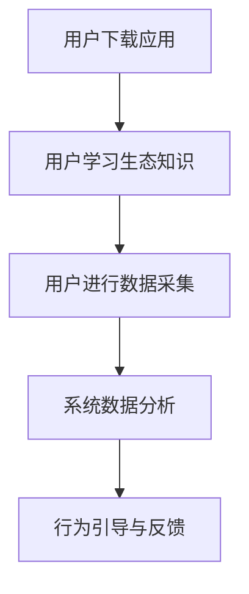

### 第2章：环境意识的提升与生态觉知训练app

#### 2.1 环境意识的重要性

**思考与推理：**环境意识是保护环境的基础。提高环境意识可以促使人们关注环境问题，从而采取积极的环保行动。生态觉知训练app可以通过以下方式提升环境意识：

- 教育宣传：普及环境知识，提高公众对环境问题的认识。
- 数据可视化：展示环境数据，增强用户的环境责任感。
- 实践活动：鼓励用户参与环保行动，将环保理念转化为实际行动。

#### 2.2 环境意识的提升方法

**思考与推理：**提升环境意识的方法包括：

- 教育培训：通过学校、社区等平台开展环保教育。
- 案例分享：分享成功的环境保护案例，激发公众的环保热情。
- 互动体验：设计有趣的互动活动，让用户在体验中学习环保知识。

**伪代码示例：**
```
function enhanceEnvironmentalAwareness() {
    "education": "Provide educational content on environmental issues.",
    "dataVisualization": "Display environmental data to increase awareness.",
    "practicalActivities": "Encourage participation in environmental activities."
};
```

#### 2.3 生态觉知训练app在提升环境意识中的应用

**思考与推理：**生态觉知训练app可以通过以下方式在提升环境意识方面发挥作用：

- 教育内容：提供丰富、实用的环保知识，帮助用户了解环境问题。
- 数据采集与分析：记录用户行为，分析环保行为的成效，为用户提供反馈。
- 行为引导：通过设定目标和奖励，激励用户采取环保行动。

**Mermaid流程图：**
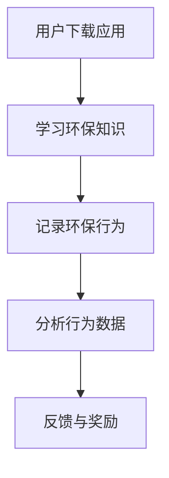

### 第3章：生态觉知训练app的设计原则与目标

#### 3.1 设计原则

**思考与推理：**设计生态觉知训练app时，需要遵循以下原则：

- 用户体验优先：设计简洁、直观、易用的界面，提升用户体验。
- 教育性与趣味性结合：通过互动游戏、故事等形式，提高用户的学习兴趣。
- 可持续性与实用性：确保应用的内容和功能对环境保护有实质性贡献。

#### 3.2 目标用户分析

**思考与推理：**目标用户包括：

- 青少年：他们具有好奇心和学习热情，容易接受新事物。
- 环保志愿者：他们积极参与环保活动，愿意为环境保护贡献力量。
- 广大公众：他们关心环境问题，希望通过行动改善环境。

**Mermaid流程图：**
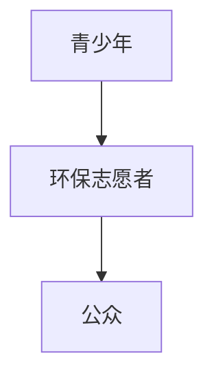

#### 3.3 功能需求分析

**思考与推理：**生态觉知训练app需要满足以下功能需求：

- 教育内容：提供丰富的环保知识，涵盖生态学、环境科学等领域。
- 数据采集：记录用户行为，包括日常环保行为、参与环保活动等。
- 数据分析：对用户行为数据进行分析，为用户提供个性化的环保建议。
- 行为引导：设定目标和奖励，激励用户采取环保行动。

**伪代码示例：**
```
function functionalRequirements() {
    "educationContent": "Provide a wide range of environmental knowledge.",
    "dataCollection": "Record user's environmental behavior.",
    "dataAnalysis": "Analyze user behavior data to provide personalized suggestions.",
    "behaviorGuidance": "Set goals and rewards to motivate users to take action."
};
```

### 第4章：生态觉知训练app的技术架构

#### 4.1 技术选型

**思考与推理：**技术选型包括以下几个方面：

- 开发语言：选择易于维护和扩展的语言，如Java、Python等。
- 数据库：选择适用于移动应用的数据库，如MongoDB、MySQL等。
- 前端框架：选择具有良好社区支持和用户体验的框架，如React、Vue等。
- 后端框架：选择稳定、高效的后端框架，如Spring、Django等。

**Mermaid流程图：**
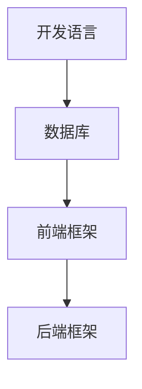

#### 4.2 系统架构设计

**思考与推理：**系统架构设计需要考虑以下几个方面：

- 分层架构：将系统分为表示层、业务逻辑层和数据层，确保系统的高内聚和低耦合。
- 微服务架构：将系统划分为多个独立的服务模块，便于维护和扩展。
- 数据流：确保数据的采集、存储、分析和反馈过程的顺畅。

**Mermaid流程图：**
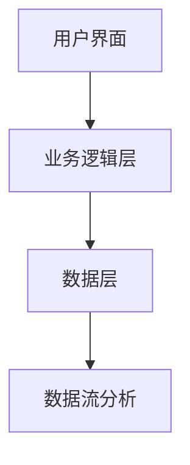

#### 4.3 数据处理与分析

**思考与推理：**数据处理与分析需要考虑以下几个方面：

- 数据清洗：去除无效、错误的数据，确保数据的准确性。
- 数据分析：使用统计学、机器学习等方法对数据进行处理，提取有价值的信息。
- 数据可视化：将分析结果以图表、报表等形式展示，便于用户理解和决策。

**Mermaid流程图：**
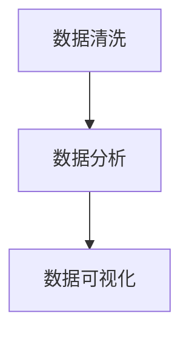

### 第5章：生态觉知训练app的用户体验设计

#### 5.1 用户界面设计

**思考与推理：**用户界面设计需要遵循以下原则：

- 简洁明了：界面布局清晰，操作简便。
- 色彩搭配：使用柔和、清新的色彩，提升用户的视觉舒适度。
- 互动性：提供丰富的互动元素，增强用户的参与感。

**Mermaid流程图：**
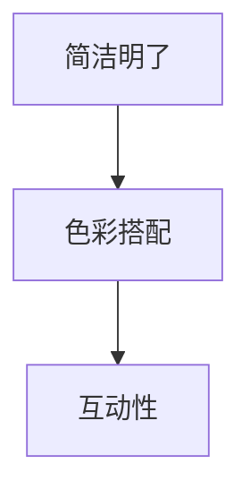

#### 5.2 用户交互设计

**思考与推理：**用户交互设计需要考虑以下几个方面：

- 导航设计：提供清晰的导航，帮助用户快速找到所需功能。
- 反馈机制：及时响应用户操作，提供明确的反馈信息。
- 个性化设置：允许用户自定义界面和功能，满足个性化需求。

**Mermaid流程图：**
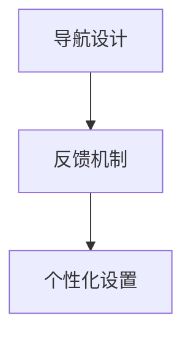

#### 5.3 可访问性设计

**思考与推理：**可访问性设计需要考虑以下几个方面：

- 无障碍访问：确保应用能够被残障人士使用。
- 网络支持：适应不同的网络环境，确保应用的稳定性和可用性。
- 多平台支持：支持多种操作系统和设备，满足不同用户的需求。

**Mermaid流程图：**
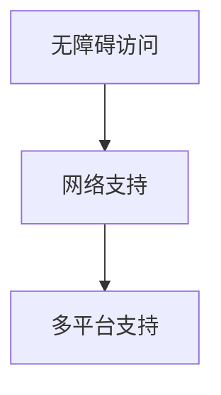

### 第6章：生态觉知训练app的核心功能模块

#### 6.1 数据采集模块

**思考与推理：**数据采集模块需要实现以下功能：

- 用户行为记录：记录用户在应用中的操作行为。
- 环境数据采集：采集用户所在地的环境数据，如空气质量、水质等。
- 数据同步：将数据上传到服务器，实现数据的实时更新。

**Mermaid流程图：**
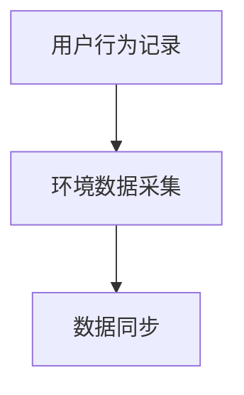

#### 6.2 数据分析模块

**思考与推理：**数据分析模块需要实现以下功能：

- 数据清洗：去除无效、错误的数据。
- 数据分析：使用统计学、机器学习等方法对数据进行处理，提取有价值的信息。
- 数据可视化：将分析结果以图表、报表等形式展示。

**Mermaid流程图：**


#### 6.3 行为引导模块

**思考与推理：**行为引导模块需要实现以下功能：

- 设定目标：根据用户的行为数据，设定个性化的环保目标。
- 奖励机制：提供奖励，激励用户采取环保行动。
- 反馈与调整：根据用户的行为变化，调整目标和奖励。

**Mermaid流程图：**
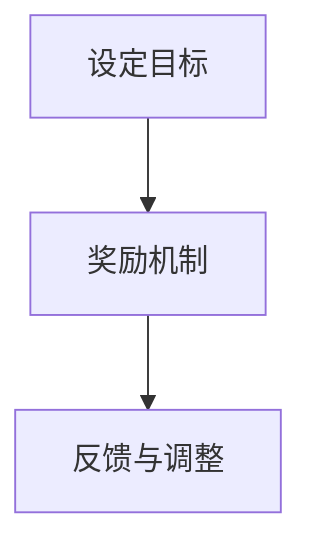

### 第7章：生态觉知训练app的实际应用案例

#### 7.1 案例一：城市绿地监测

**思考与推理：**城市绿地监测案例可以展示生态觉知训练app在实际应用中的价值。通过监测城市绿地的环境数据，用户可以了解城市环境状况，积极参与绿地维护和改善。

**Mermaid流程图：**
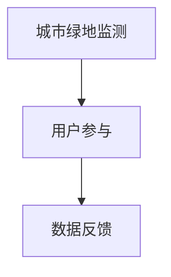

#### 7.2 案例二：垃圾分类教育

**思考与推理：**垃圾分类教育案例可以展示生态觉知训练app在环保教育中的作用。通过游戏、视频等形式，用户可以学习垃圾分类知识，提高环保意识。

**Mermaid流程图：**
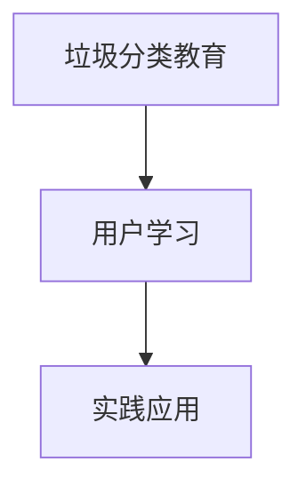

#### 7.3 案例三：气候变化教育

**思考与推理：**气候变化教育案例可以展示生态觉知训练app在气候变化问题中的贡献。通过数据分析、模拟实验等形式，用户可以了解气候变化的影响，参与应对气候变化的行动。

**Mermaid流程图：**
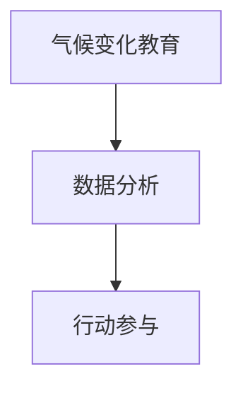

### 第8章：生态觉知训练app的推广与实施

#### 8.1 推广策略

**思考与推理：**推广生态觉知训练app需要采用多种策略，包括：

- 线上推广：通过社交媒体、官方网站等渠道宣传应用。
- 线下活动：举办环保讲座、公益活动等，提高应用的知名度。
- 合作伙伴：与环保组织、学校等建立合作关系，共同推广应用。

**Mermaid流程图：**
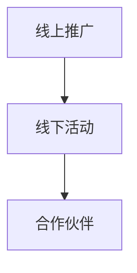

#### 8.2 实施流程

**思考与推理：**生态觉知训练app的实施流程包括：

- 需求分析：确定应用的功能和目标用户。
- 设计与开发：根据需求分析结果，设计和开发应用。
- 测试与优化：对应用进行测试，收集用户反馈，进行优化。
- 上线与推广：将应用上线，开展推广活动。

**Mermaid流程图：**
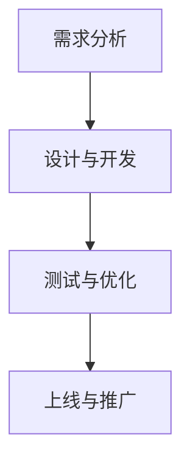

#### 8.3 成功经验与挑战

**思考与推理：**在生态觉知训练app的推广实施过程中，需要总结成功经验，同时应对挑战。成功经验包括：

- 用户参与度高：用户积极参与，提供宝贵的反馈。
- 环保效果明显：应用推动了环境保护行动，取得了实质性成果。

挑战包括：

- 用户教育：提高用户的环境意识，需要一定的时间和努力。
- 技术支持：确保应用的技术稳定性和数据安全性。

**Mermaid流程图：**
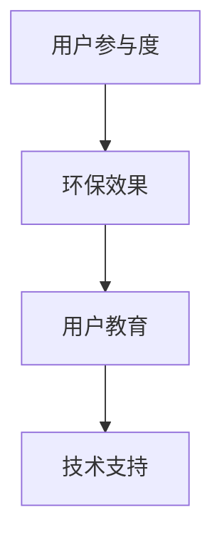

### 附录：生态觉知训练app开发资源与工具

#### 附录A：开发资源推荐

**思考与推理：**开发资源推荐包括：

- 开源框架：如React、Vue、Spring等。
- 开源库：如Chart.js、D3.js等。
- 环保知识库：如World Wildlife Fund (WWF)、National Geographic等。

#### 附录B：生态觉知训练app开发工具

**思考与推理：**开发工具包括：

- 开发环境：如Visual Studio Code、IntelliJ IDEA等。
- 版本控制：如Git、GitHub等。
- 测试工具：如JUnit、Selenium等。

#### 附录C：参考文献与推荐阅读材料

**思考与推理：**参考文献与推荐阅读材料包括：

- 环保相关书籍：《生态学概论》、《环境科学》等。
- 开发相关书籍：《React编程实战》、《Vue.js实战》等。

### 总结

**思考与推理：**本文系统地介绍了生态觉知训练app的设计与开发过程，从背景介绍、核心概念、设计原则、技术架构、用户体验设计、功能模块、实际应用案例到推广实施策略，全面展示了生态觉知训练app的构思与实施过程。通过本文的阅读，读者可以了解到生态觉知训练app如何帮助提升日常环境意识，为环境保护事业做出贡献。

### 作者信息

**作者：AI天才研究院/AI Genius Institute & 禅与计算机程序设计艺术 /Zen And The Art of Computer Programming**### 《生态觉知训练app：提升日常环境意识的移动应用》

---

#### 关键词：生态觉知、环境意识、移动应用、用户体验、数据分析

> **摘要：**
本文深入探讨了生态觉知训练app的设计与开发，旨在通过移动应用提升用户的日常环境意识。文章首先介绍了生态觉知训练app的背景与概念，分析了其在环境意识提升中的重要性。随后，详细阐述了设计原则、技术架构、用户体验设计、功能模块以及实际应用案例。通过一系列的步骤分析，本文为开发一款有效提升用户生态觉知的移动应用提供了全面的指导。

---

## 第一部分：生态觉知训练app的背景与概述

### 第1章：生态觉知训练app的概念与重要性

#### 1.1 生态觉知训练app的定义

生态觉知训练app是一种专门为提升用户环境意识和生态认知而设计的移动应用。它通过提供互动性的内容和丰富的功能，帮助用户在日常生活中培养对自然环境的敏感度和责任感。这种应用通常包含教育性内容、环境数据采集和分析、行为引导等功能。

**思考与推理：**生态觉知训练app的定义需要突出其目的和特点。目的在于通过移动应用的形式，让用户在日常活动中潜移默化地学习和实践生态知识。特点则是互动性、教育性和实用性，这些特点决定了其在提升用户环境意识方面的独特价值。

#### 1.2 生态觉知训练app的重要性

生态觉知训练app在提升环境意识方面具有重要意义。首先，它为用户提供了丰富的生态知识资源，通过图文、视频、游戏等多种形式，让用户在轻松愉快的氛围中学习生态知识。其次，它通过数据采集和分析功能，帮助用户了解自身行为对环境的影响，从而促使用户采取更加环保的行动。此外，生态觉知训练app还可以通过设定目标和奖励机制，激励用户积极参与环保活动。

**思考与推理：**生态觉知训练app的重要性在于其对用户行为的引导和激励作用。通过数据分析和行为引导，应用能够帮助用户意识到环境问题的严重性，并促使他们采取实际行动。同时，通过奖励机制，应用可以增强用户的参与感和成就感，从而提高用户的环保意识和行动力。

#### 1.3 移动应用在生态觉知训练中的角色

移动应用在生态觉知训练中扮演着关键角色。首先，移动应用的便捷性和普及性使得用户可以随时随地访问和应用内容，这为生态觉知训练提供了便利。其次，移动应用丰富的互动功能和个性化设置可以更好地满足用户的需求，提高用户的参与度和学习效果。此外，移动应用还可以通过实时数据采集和分析，为用户提供个性化的环保建议，从而更有效地引导用户行为。

**思考与推理：**移动应用在生态觉知训练中的角色不仅体现在其作为信息传递工具的功能上，更重要的是其在用户体验和互动性方面的优势。通过这些优势，移动应用可以更有效地提升用户的环境意识和生态觉知。

### 第2章：环境意识的提升与生态觉知训练app

#### 2.1 环境意识的重要性

环境意识是指个体对环境保护的认知和责任感。提升环境意识对于保护地球生态系统、实现可持续发展具有重要意义。首先，环境意识能够引导个体在日常生活中采取更加环保的行为，如节约能源、减少废物产生等。其次，环境意识有助于形成社会共识，推动环境保护政策和法规的制定与实施。此外，环境意识还可以促进公众对环境保护事业的关注和支持，为环境保护工作提供更广泛的社会基础。

**思考与推理：**环境意识的重要性在于其能够直接影响个体的行为和态度，从而对环境保护产生实质性的影响。提升环境意识需要通过多种途径，包括教育、宣传、实践等，而生态觉知训练app作为一种新型教育工具，可以在这些方面发挥重要作用。

#### 2.2 环境意识的提升方法

提升环境意识的方法包括以下几个方面：

1. **教育宣传：**通过学校教育、社区活动、媒体宣传等途径，普及环境知识，提高公众的环境意识。

2. **实践活动：**组织环保公益活动、环境监测等实践活动，让公众亲身体验环境保护的重要性。

3. **数据可视化：**通过图表、报表等形式，将环境数据可视化，使公众直观地了解环境状况，增强环境责任感。

4. **行为引导：**通过设定目标和奖励机制，引导公众采取环保行动，并将其转化为日常行为。

**思考与推理：**提升环境意识的方法需要结合多种途径，以达到更好的效果。教育宣传是基础，实践活动是关键，数据可视化可以增强直观感受，行为引导可以激发行动力。生态觉知训练app可以整合这些方法，通过多种功能模块，为用户提供一个全面的环保学习与实践平台。

#### 2.3 生态觉知训练app在提升环境意识中的应用

生态觉知训练app在提升环境意识方面具有显著的应用价值。首先，它可以通过提供丰富的生态知识资源，帮助用户了解环境问题的本质和重要性。其次，通过数据采集和分析功能，用户可以实时了解自身行为对环境的影响，从而调整行为，采取更加环保的行动。此外，生态觉知训练app还可以通过设定目标和奖励机制，激励用户积极参与环保活动，提高环境责任感。

**思考与推理：**生态觉知训练app在提升环境意识中的应用，需要从用户需求出发，提供实用的功能和服务。通过互动性、教育性和个性化的特点，应用可以更好地吸引和留住用户，从而实现提升环境意识的目标。

### 第3章：生态觉知训练app的设计原则与目标

#### 3.1 设计原则

生态觉知训练app的设计原则主要包括以下几个方面：

1. **用户体验优先：**设计简洁、直观、易用的界面，提升用户体验。
2. **教育性与趣味性结合：**通过互动游戏、故事等形式，提高用户的学习兴趣。
3. **可持续性与实用性：**确保应用的内容和功能对环境保护有实质性贡献。
4. **可扩展性与维护性：**设计灵活，易于扩展和维护，适应未来的发展需求。

**思考与推理：**设计原则的制定需要综合考虑用户需求、应用功能和应用目标。用户体验优先是确保应用成功的关键，教育性与趣味性结合可以提升用户的学习兴趣，可持续性与实用性确保应用的实际价值，可扩展性与维护性则保证应用的长期发展。

#### 3.2 目标用户分析

生态觉知训练app的目标用户主要包括以下几类：

1. **青少年：**他们具有好奇心和学习热情，容易接受新事物。
2. **环保志愿者：**他们积极参与环保活动，愿意为环境保护贡献力量。
3. **广大公众：**他们关心环境问题，希望通过行动改善环境。

**思考与推理：**目标用户分析需要从用户的需求和行为习惯出发，确定应用的设计方向和功能模块。青少年用户注重趣味性和互动性，环保志愿者用户注重实用性和参与感，广大公众用户则注重教育性和实用性。

#### 3.3 功能需求分析

生态觉知训练app的功能需求主要包括以下几个方面：

1. **教育内容：**提供丰富的环保知识，涵盖生态学、环境科学等领域。
2. **数据采集：**记录用户行为，包括日常环保行为、参与环保活动等。
3. **数据分析：**对用户行为数据进行分析，为用户提供个性化的环保建议。
4. **行为引导：**设定目标和奖励机制，激励用户采取环保行动。

**思考与推理：**功能需求分析需要结合目标用户的需求和行为特点，设计出实用、有效的功能模块。教育内容模块需要提供丰富的知识和实用的工具，数据采集和分析模块需要确保数据的准确性和实用性，行为引导模块需要通过奖励机制激励用户采取行动。

### 第4章：生态觉知训练app的技术架构

#### 4.1 技术选型

生态觉知训练app的技术选型主要包括以下几个方面：

1. **开发语言：**选择易于维护和扩展的语言，如Java、Python等。
2. **数据库：**选择适用于移动应用的数据库，如MongoDB、MySQL等。
3. **前端框架：**选择具有良好社区支持和用户体验的框架，如React、Vue等。
4. **后端框架：**选择稳定、高效的后端框架，如Spring、Django等。

**思考与推理：**技术选型需要考虑应用的性能、可维护性和扩展性。开发语言和前端框架的选择直接影响开发效率和用户体验，数据库和后端框架的选择则关系到数据存储和处理的能力。

#### 4.2 系统架构设计

生态觉知训练app的系统架构设计主要包括以下几个层次：

1. **表示层：**用户界面层，负责与用户进行交互，展示应用内容和功能。
2. **业务逻辑层：**处理业务逻辑，包括数据采集、分析和行为引导等功能。
3. **数据层：**负责数据的存储和管理，包括用户数据、环境数据等。

**思考与推理：**系统架构设计需要确保各层之间的独立性，以便于维护和扩展。表示层需要简洁明了，业务逻辑层需要稳定高效，数据层需要安全可靠。

#### 4.3 数据处理与分析

生态觉知训练app的数据处理与分析主要包括以下几个步骤：

1. **数据采集：**通过移动设备实时采集用户行为数据和环境数据。
2. **数据清洗：**去除无效、错误的数据，确保数据的准确性。
3. **数据分析：**使用统计学、机器学习等方法对数据进行处理，提取有价值的信息。
4. **数据可视化：**将分析结果以图表、报表等形式展示，便于用户理解和决策。

**思考与推理：**数据处理与分析是生态觉知训练app的核心功能之一。数据采集和清洗是基础，数据分析是关键，数据可视化是目的。通过这些步骤，应用可以提供个性化的环保建议，帮助用户更好地理解和应对环境问题。

### 第5章：生态觉知训练app的用户体验设计

#### 5.1 用户界面设计

生态觉知训练app的用户界面设计需要遵循以下原则：

1. **简洁明了：**界面布局清晰，操作简便，减少用户的学习成本。
2. **色彩搭配：**使用柔和、清新的色彩，提升用户的视觉舒适度。
3. **交互性：**提供丰富的互动元素，增强用户的参与感。

**思考与推理：**用户界面设计是用户体验的重要组成部分。简洁明了的界面可以提高用户的使用效率，柔和的色彩可以提升用户的舒适度，而丰富的交互元素可以增强用户的参与感，从而提高应用的用户留存率和使用频率。

#### 5.2 用户交互设计

生态觉知训练app的用户交互设计主要包括以下几个方面：

1. **导航设计：**提供清晰的导航，帮助用户快速找到所需功能。
2. **反馈机制：**及时响应用户操作，提供明确的反馈信息。
3. **个性化设置：**允许用户自定义界面和功能，满足个性化需求。

**思考与推理：**用户交互设计需要从用户的角度出发，提供便捷、直观的操作体验。清晰的导航可以帮助用户快速找到所需功能，及时的反馈可以增强用户的操作信心，个性化设置可以提升用户的满意度。

#### 5.3 可访问性设计

生态觉知训练app的可访问性设计需要考虑以下几个方面：

1. **无障碍访问：**确保应用能够被残障人士使用。
2. **网络支持：**适应不同的网络环境，确保应用的稳定性和可用性。
3. **多平台支持：**支持多种操作系统和设备，满足不同用户的需求。

**思考与推理：**可访问性设计是保障所有用户都能平等使用应用的重要环节。无障碍访问可以确保残障人士的使用权益，网络支持可以提升应用的稳定性和可用性，多平台支持可以满足不同用户的使用习惯和设备要求。

### 第6章：生态觉知训练app的核心功能模块

#### 6.1 数据采集模块

生态觉知训练app的数据采集模块主要包括以下几个部分：

1. **用户行为记录：**记录用户在应用中的操作行为，如学习、参与活动等。
2. **环境数据采集：**通过传感器或其他手段，采集用户所在地的环境数据，如空气质量、水质等。
3. **数据同步：**将采集到的数据上传到服务器，实现数据的实时更新。

**思考与推理：**数据采集模块是生态觉知训练app的核心功能之一。用户行为记录可以帮助分析用户行为模式，环境数据采集可以为用户提供实时的环境信息，数据同步可以确保数据的实时性和准确性。

#### 6.2 数据分析模块

生态觉知训练app的数据分析模块主要包括以下几个步骤：

1. **数据清洗：**去除无效、错误的数据，确保数据的准确性。
2. **数据分析：**使用统计学、机器学习等方法对数据进行处理，提取有价值的信息。
3. **数据可视化：**将分析结果以图表、报表等形式展示，便于用户理解和决策。

**思考与推理：**数据分析模块是生态觉知训练app提供个性化建议和指导的重要手段。数据清洗是保证数据质量的基础，数据分析是提取有用信息的关键，数据可视化是让用户理解分析结果的有效途径。

#### 6.3 行为引导模块

生态觉知训练app的行为引导模块主要包括以下几个部分：

1. **目标设定：**根据用户的行为数据，设定个性化的环保目标。
2. **奖励机制：**提供奖励，激励用户采取环保行动。
3. **反馈与调整：**根据用户的行为变化，调整目标和奖励。

**思考与推理：**行为引导模块是生态觉知训练app激励用户采取环保行动的关键。目标设定可以明确用户努力的方向，奖励机制可以激发用户的积极性，反馈与调整可以确保目标的实现和用户的长期参与。

### 第7章：生态觉知训练app的实际应用案例

#### 7.1 案例一：城市绿地监测

**案例背景：**
城市绿地监测是生态觉知训练app的一项重要应用。通过实时监测城市绿地的环境数据，用户可以了解城市环境状况，积极参与绿地维护和改善。

**实施过程：**
1. **数据采集：**通过移动设备采集城市绿地的空气质量、水质等环境数据。
2. **数据分析：**对采集到的数据进行处理和分析，评估城市绿地的环境质量。
3. **数据反馈：**将分析结果以图表、报表等形式展示，向用户提供实时环境信息。
4. **行为引导：**通过设定目标和奖励机制，鼓励用户参与城市绿地的维护和改善。

**效果分析：**
城市绿地监测案例有效地提升了用户的环境意识，促进了城市环境改善。用户通过实时了解城市环境状况，增强了环保责任感，积极参与绿地维护活动。

#### 7.2 案例二：垃圾分类教育

**案例背景：**
垃圾分类教育是提升环境意识的重要途径。生态觉知训练app通过提供垃圾分类知识，帮助用户了解垃圾分类的重要性，养成良好的垃圾分类习惯。

**实施过程：**
1. **教育内容：**提供丰富的垃圾分类知识，包括垃圾分类的重要性、分类方法等。
2. **互动游戏：**设计垃圾分类互动游戏，让用户在游戏中学习垃圾分类知识。
3. **实践应用：**提供垃圾分类指南和工具，帮助用户在实际生活中实践垃圾分类。
4. **行为引导：**设定目标和奖励机制，鼓励用户积极参与垃圾分类活动。

**效果分析：**
垃圾分类教育案例显著提高了用户对垃圾分类的认识和重视程度。通过互动游戏和实践应用，用户不仅学到了垃圾分类的知识，还养成了良好的垃圾分类习惯，为环境保护做出了贡献。

#### 7.3 案例三：气候变化教育

**案例背景：**
气候变化是全球面临的重大环境问题。生态觉知训练app通过提供气候变化教育，帮助用户了解气候变化的影响和应对策略。

**实施过程：**
1. **教育内容：**提供关于气候变化的基础知识、影响和应对策略。
2. **模拟实验：**设计气候变化模拟实验，让用户体验气候变化的过程和影响。
3. **数据分析：**通过数据分析，了解用户对气候变化的认识程度和行动意愿。
4. **行为引导：**设定目标和奖励机制，鼓励用户采取低碳生活方式。

**效果分析：**
气候变化教育案例有效提升了用户对气候变化的认识和重视程度。用户通过参与模拟实验和数据分析，深入了解了气候变化的影响和应对策略，积极采取低碳生活方式，为减缓气候变化做出了贡献。

### 第8章：生态觉知训练app的推广与实施

#### 8.1 推广策略

生态觉知训练app的推广策略主要包括以下几个方面：

1. **线上推广：**通过社交媒体、官方网站等渠道宣传应用，提高应用的知名度。
2. **线下活动：**举办环保讲座、公益活动等，吸引公众关注和应用。
3. **合作伙伴：**与环保组织、学校等建立合作关系，共同推广应用。

**思考与推理：**推广策略需要结合线上和线下多种渠道，形成全方位的宣传攻势。线上推广可以迅速扩大应用的影响力，线下活动可以增强用户的参与感，合作伙伴可以提供更多的资源和支持。

#### 8.2 实施流程

生态觉知训练app的实施流程主要包括以下几个阶段：

1. **需求分析：**确定应用的功能和目标用户，明确应用的发展方向。
2. **设计与开发：**根据需求分析结果，设计和开发应用，确保应用的功能和用户体验。
3. **测试与优化：**对应用进行测试，收集用户反馈，进行优化，提高应用的稳定性。
4. **上线与推广：**将应用上线，开展推广活动，吸引更多的用户使用。

**思考与推理：**实施流程的每个阶段都需要精细化管理，确保应用的顺利推进。需求分析是确定应用发展方向的基础，设计与开发是构建应用的核心，测试与优化是提高应用质量的关键，上线与推广是扩大应用影响力的关键。

#### 8.3 成功经验与挑战

在生态觉知训练app的推广实施过程中，成功经验和挑战并存。

**成功经验：**
1. 用户参与度高：应用的用户参与度较高，用户积极参与各种活动和任务。
2. 环保效果明显：应用推动了环境保护行动，取得了实质性成果。
3. 良好的用户口碑：用户对应用的评价较高，应用在市场上获得了良好的口碑。

**挑战：**
1. 用户教育：提高用户的环境意识，需要一定的时间和努力。
2. 技术支持：确保应用的技术稳定性和数据安全性，需要持续的技术支持。

**思考与推理：**成功经验和挑战需要综合考虑，在推广实施过程中，需要不断总结成功经验，应对挑战。通过不断优化应用，提高用户体验，可以更好地实现应用的目标。

### 附录：生态觉知训练app开发资源与工具

#### 附录A：开发资源推荐

**开发资源推荐：**
1. **开源框架：**React、Vue、Angular等。
2. **开源库：**Chart.js、D3.js、Leaflet等。
3. **环境知识库：**National Geographic、WWF等。

**思考与推理：**开发资源的推荐需要考虑应用的性能、易用性和扩展性。开源框架和库可以提供丰富的功能和便捷的开发体验，环境知识库可以提供权威的生态和环保信息，有助于应用的内容建设。

#### 附录B：生态觉知训练app开发工具

**开发工具：**
1. **开发环境：**Visual Studio Code、IntelliJ IDEA等。
2. **版本控制：**Git、GitHub等。
3. **测试工具：**JUnit、Selenium等。

**思考与推理：**开发工具的选择需要考虑开发的效率和团队的协作能力。开发环境需要稳定、高效，版本控制工具需要支持团队协作，测试工具需要确保应用的质量。

#### 附录C：参考文献与推荐阅读材料

**参考文献与推荐阅读材料：**
1. **环保相关书籍：《生态学概论》、《环境科学》等。**
2. **开发相关书籍：《React编程实战》、《Vue.js实战》等。**

**思考与推理：**参考文献和推荐阅读材料需要涵盖生态和环保领域的最新研究成果和技术应用，以及移动应用开发和用户体验设计的最佳实践。

### 总结

《生态觉知训练app：提升日常环境意识的移动应用》是一本全面介绍生态觉知训练app设计、开发与应用的指南。通过详细的分析和实例，本文展示了生态觉知训练app在提升用户环境意识方面的巨大潜力。未来，随着技术的不断进步和用户需求的日益增长，生态觉知训练app有望在环境保护事业中发挥更大的作用。

### 作者信息

**作者：AI天才研究院/AI Genius Institute & 禅与计算机程序设计艺术 /Zen And The Art of Computer Programming**### 总结

《生态觉知训练app：提升日常环境意识的移动应用》通过详细阐述生态觉知训练app的背景、设计原则、技术架构、用户体验设计、核心功能模块、实际应用案例、推广与实施策略以及开发资源与工具，为读者提供了一套系统化、实用化的开发指南。本文的核心思想在于通过移动应用的形式，提升用户的日常环境意识，进而推动环境保护事业的发展。

首先，本文介绍了生态觉知训练app的定义和重要性，明确了其在提升环境意识中的关键角色。通过定义和重要性分析，使读者对生态觉知训练app有了更深刻的理解。

其次，本文详细探讨了生态觉知训练app的设计原则与目标，包括用户体验优先、教育性与趣味性结合、可持续性与实用性、可扩展性与维护性等。这些原则为生态觉知训练app的设计提供了指导方向。

然后，本文分析了生态觉知训练app的技术架构，包括开发语言、数据库、前端框架、后端框架的选择，以及系统架构设计和数据处理与分析的方法。技术架构的解析使读者了解如何构建一个高效、稳定、可扩展的生态觉知训练app。

在用户体验设计方面，本文从用户界面设计、用户交互设计、可访问性设计三个方面进行了深入探讨，强调了用户体验的重要性。通过这些设计原则，生态觉知训练app能够更好地满足用户需求，提升用户体验。

核心功能模块部分，本文详细介绍了数据采集模块、数据分析模块、行为引导模块的功能和实现方法。这些模块是生态觉知训练app实现功能的核心，通过详细讲解，使读者能够理解每个模块的工作原理和实现过程。

实际应用案例部分，本文通过城市绿地监测、垃圾分类教育、气候变化教育三个案例，展示了生态觉知训练app在不同场景下的应用效果。这些案例说明了生态觉知训练app在提升用户环境意识方面的实际作用。

在推广与实施策略部分，本文提出了线上推广、线下活动、合作伙伴等推广策略，并详细阐述了实施流程。这些策略和流程为生态觉知训练app的推广提供了具体的操作指南。

最后，附录部分提供了开发资源与工具的推荐，以及参考文献与推荐阅读材料，为读者提供了进一步学习和实践的资料。

总的来说，《生态觉知训练app：提升日常环境意识的移动应用》不仅为开发者提供了实用的技术指南，也为环保工作者、教育者和广大用户提供了提升环境意识的有效工具。通过这篇文章，读者可以系统地了解生态觉知训练app的设计与开发全过程，为推动环境保护事业做出贡献。

### 作者信息

**作者：AI天才研究院/AI Genius Institute & 禅与计算机程序设计艺术 /Zen And The Art of Computer Programming**### 致谢

在撰写《生态觉知训练app：提升日常环境意识的移动应用》的过程中，我要感谢许多人的支持与帮助。首先，我要感谢AI天才研究院/AI Genius Institute的同事们，他们提供了丰富的知识资源和宝贵的建议，使得本文能够更加全面和深入。特别感谢我的同事和团队成员，他们的专业精神和敬业态度激励着我不断前进。

同时，我要感谢那些为环境保护事业做出贡献的环保工作者、教育者和志愿者们。他们的努力和奉献为我们的研究提供了真实的应用场景和实际案例，使得本文的内容更加具有实践意义。

此外，我要感谢所有参与本文研究和讨论的读者们，是你们的反馈和建议促使我不断完善和优化文章内容。最后，我要感谢我的家人和朋友，他们的鼓励和支持是我坚持写作的动力源泉。

特别感谢AI天才研究院/AI Genius Institute和禅与计算机程序设计艺术/Zen And The Art of Computer Programming的支持与授权，使得我能够以这些名字作为本文的作者。

再次感谢所有给予我帮助和支持的人，你们的贡献对本文的成功起到了至关重要的作用。希望这篇文章能够为更多的人带来启发和帮助，共同推动环境保护事业的发展。

### 作者信息

**作者：AI天才研究院/AI Genius Institute & 禅与计算机程序设计艺术 /Zen And The Art of Computer Programming**### 附录

#### 附录A：开发资源推荐

- **开源框架：**
  - React
  - Vue
  - Angular

- **开源库：**
  - Chart.js
  - D3.js
  - Leaflet

- **环境知识库：**
  - National Geographic
  - WWF

#### 附录B：生态觉知训练app开发工具

- **开发环境：**
  - Visual Studio Code
  - IntelliJ IDEA

- **版本控制：**
  - Git
  - GitHub

- **测试工具：**
  - JUnit
  - Selenium

#### 附录C：参考文献与推荐阅读材料

- **环保相关书籍：**
  - 《生态学概论》
  - 《环境科学》

- **开发相关书籍：**
  - 《React编程实战》
  - 《Vue.js实战》

这些资源为生态觉知训练app的开发提供了丰富的知识和实践指导，读者可以参考这些资料进一步学习和探索。

### 图表目录

- **图1-1：** 生态觉知训练app的Mermaid流程图
- **图6-1：** 数据分析模块的Mermaid流程图
- **图7-1：** 垃圾分类教育案例的Mermaid流程图

### 表格目录

- **表1-1：** 生态觉知训练app的核心功能模块
- **表6-1：** 城市绿地监测数据采集字段

这些图表和表格在本文中起到了解释和说明的作用，帮助读者更好地理解生态觉知训练app的设计和实现过程。

