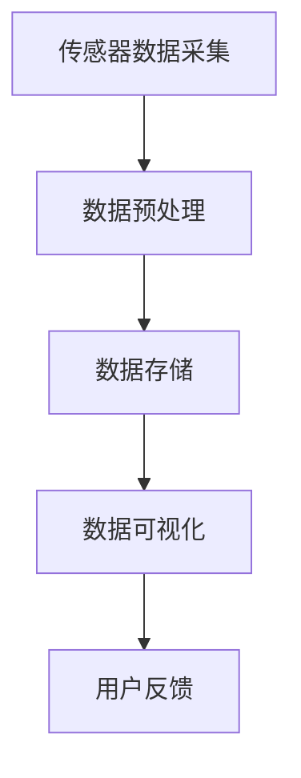
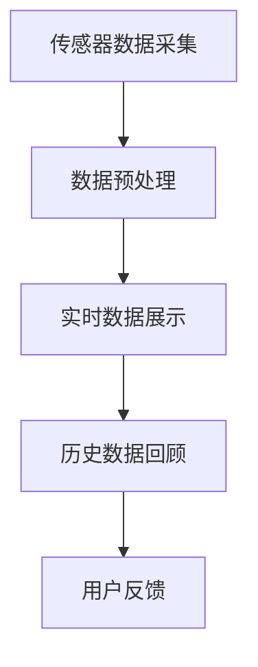

                 


### 文章标题：《生态觉知训练app：提升环境意识的日常实践工具》

### 关键词：生态觉知训练app，环境意识，日常实践，提升，工具

### 摘要：

本文将深入探讨生态觉知训练app的设计与实现，旨在通过这一创新工具，提升公众对环境保护的认识和日常实践。文章首先介绍生态觉知训练app的基本概念，接着详细分析其架构设计和核心功能。随后，文章通过伪代码和数学模型，解析了环境监测和用户行为分析的核心算法原理。此外，文章还展示了app的开发与测试过程，并提供了一些最佳实践和注意事项。最后，文章展望了生态觉知训练app的未来发展，以及其在社会和环境中的潜在影响。

## 引言

在当今世界，环境保护已成为全球关注的焦点。然而，如何在日常生活中实践环保理念，提高个人和环境意识，仍然是一个挑战。生态觉知训练app应运而生，它是一种创新的工具，旨在通过日常使用，帮助用户提升对环境的认识和责任感。本文将围绕这一主题，详细分析生态觉知训练app的设计理念、功能实现、开发流程及其未来前景。

### 一、生态觉知训练app的定义

生态觉知训练app是一种集成了环境监测、用户行为分析和教育功能的应用程序。它通过收集用户日常生活中的环境数据，分析其行为模式，提供个性化的环保建议，帮助用户在日常生活中实践环保理念。

### 二、生态觉知训练app的作用

1. **提升环境意识**：通过数据可视化和个性化的环保建议，帮助用户更直观地了解自身行为对环境的影响，从而提高环保意识。

2. **促进环保行动**：通过实时监测和反馈机制，鼓励用户采取具体的环保行动，如减少碳排放、节约用水等。

3. **社区共享**：用户可以分享自己的环保数据和成果，形成社区效应，激发更多人参与环保行动。

### 三、生态觉知训练app的设计理念

1. **用户友好**：界面设计简洁直观，易于操作，让用户能够轻松上手。

2. **个性化**：根据用户的地理位置、生活习惯等数据，提供个性化的环保建议。

3. **可扩展性**：设计时考虑了未来的扩展性，可以集成更多的环境监测设备和功能模块。

### 四、文章结构

本文结构如下：

1. **第一部分**：基础介绍
   - **第1章**：生态觉知训练app的概述
   - **第2章**：生态觉知训练app的架构设计
   - **第3章**：生态觉知训练app的核心功能

2. **第二部分**：实战案例
   - **第4章**：生态觉知训练app的数据分析与处理
   - **第5章**：生态觉知训练app的用户界面设计
   - **第6章**：生态觉知训练app的开发与测试

3. **第三部分**：未来发展
   - **第7章**：生态觉知训练app的部署与维护
   - **第8章**：生态觉知训练app的创新与展望

4. **结语与附录**
   - **结语**：总结本文的主要内容和收获
   - **附录**：提供相关的资源、工具和参考资料

通过上述结构，本文将逐步深入探讨生态觉知训练app的各个方面，帮助读者全面了解这一创新工具的设计、实现和未来发展。

----------------------------------------------------------------

## 生态觉知训练app的概述

### 1.1 生态觉知训练app的定义

生态觉知训练app是一种集成了多种环境监测、数据分析和教育功能的应用程序。它旨在通过实时收集用户环境数据，分析用户行为模式，提供个性化的环保建议，从而提升用户的环境意识和实践能力。这一应用程序不仅可以帮助个人了解自身行为对环境的影响，还能通过社交功能促进社区环保行动。

### 1.2 生态觉知训练app的功能

生态觉知训练app的主要功能包括：

1. **环境监测**：通过集成多种传感器，如温度传感器、湿度传感器、空气质量传感器等，实时监测用户周围的环境参数。

2. **用户行为分析**：收集用户日常生活中的行为数据，如出行方式、能源使用情况、垃圾分类习惯等，通过数据挖掘和分析，识别用户的行为模式。

3. **个性化建议**：基于用户行为和环境数据，提供个性化的环保建议，如减少碳排放、节约用水、减少废弃物产生等。

4. **教育功能**：通过丰富的图文、视频和互动内容，提高用户对环保知识的认识和理解。

5. **社区互动**：用户可以分享自己的环保数据和成果，参与社区讨论，形成环保社群。

### 1.3 生态觉知训练app的作用

1. **提升环境意识**：通过可视化的环境数据和个人行为分析，让用户更直观地了解自身行为对环境的影响，从而提高环保意识。

2. **促进环保行动**：提供个性化的环保建议，激励用户采取具体的环保行动，如减少碳排放、节约用水等。

3. **社区共享**：用户可以分享自己的环保数据和成果，与其他用户互动，形成社区效应，激发更多人参与环保行动。

4. **数据驱动**：通过收集和分析大量环境数据，为政府和环保组织提供决策依据，促进环境保护政策的制定和实施。

### 1.4 生态觉知训练app的设计理念

1. **用户体验至上**：界面设计简洁直观，易于操作，确保用户能够轻松上手。

2. **数据驱动**：注重数据的收集、分析和应用，通过数据驱动的方式提升用户的环境意识和实践能力。

3. **个性化**：根据用户的地理位置、生活习惯等数据，提供个性化的环保建议。

4. **可扩展性**：设计时考虑了未来的扩展性，可以集成更多的环境监测设备和功能模块。

### 1.5 生态觉知训练app的应用场景

1. **家庭**：用户可以在家中使用生态觉知训练app，实时监测家庭环境参数，并根据个性化建议改善家庭环保习惯。

2. **学校**：学校可以引入生态觉知训练app，作为环保教育的工具，帮助学生提高环保意识。

3. **社区**：社区可以组织生态觉知训练app的使用活动，促进社区居民的环保行动。

4. **企业**：企业可以利用生态觉知训练app，监测员工的环保行为，推动企业内部的环保文化建设。

通过上述介绍，我们可以看到，生态觉知训练app不仅仅是一个应用程序，更是一种提升公众环境意识和实践能力的新工具。在接下来的章节中，我们将深入探讨生态觉知训练app的架构设计和核心功能，帮助读者全面了解这一创新工具的实现过程。

----------------------------------------------------------------

## 生态觉知训练app的架构设计

### 2.1 技术栈选择

生态觉知训练app采用了当前最流行的技术栈，以确保系统的稳定性和高效性。以下是其主要技术组件：

1. **前端框架**：React.js
   - React.js是一个灵活的前端框架，能够高效地构建用户界面，并支持组件化开发，使代码更易于维护和扩展。

2. **后端框架**：Node.js + Express
   - Node.js是一个基于JavaScript的后端运行环境，具有高性能、高并发处理能力，非常适合构建实时应用。
   - Express是一个轻量级的Web应用程序框架，能够简化HTTP服务器的搭建，提高开发效率。

3. **数据库**：MongoDB
   - MongoDB是一个分布式、面向文档的数据库，支持灵活的文档模型，可以高效地存储和查询复杂的数据结构。

4. **数据可视化库**：D3.js
   - D3.js是一个强大的JavaScript库，能够将数据转换为可视化图表，帮助用户更直观地理解环境数据。

5. **环境监测硬件**：各种传感器
   - 温度传感器、湿度传感器、空气质量传感器等，用于实时监测用户环境参数。

6. **云服务**：AWS、Google Cloud Platform
   - AWS和Google Cloud Platform提供了丰富的云计算服务，包括数据处理、存储和安全性服务，支持应用程序的弹性扩展。

### 2.2 数据处理流程

生态觉知训练app的数据处理流程可以分为以下几个步骤：

1. **数据采集**：
   - 用户通过安装的传感器设备，实时采集环境数据，如温度、湿度、空气质量等。
   - 用户行为数据通过手机内置的传感器和GPS，记录用户的出行方式、能源使用情况等。

2. **数据传输**：
   - 采集到的数据通过无线网络（如Wi-Fi、蓝牙等）传输到app后端服务器。

3. **数据存储**：
   - 服务器使用MongoDB数据库，存储用户的环境数据和用户行为数据。

4. **数据处理**：
   - 后端服务器使用Node.js和Express框架处理数据，包括数据的清洗、归一化、特征提取等。
   - 使用D3.js库，将处理后的数据转换为可视化图表，供前端展示。

5. **数据可视化**：
   - 前端使用React.js和D3.js库，将处理后的数据可视化，显示在用户界面上。

### 2.3 用户体验设计

用户体验设计是生态觉知训练app成功的关键因素。以下是其主要设计原则：

1. **简洁直观**：
   - 界面设计简洁直观，避免冗余信息，确保用户能够快速找到所需功能。
   - 使用清晰的图表和图标，帮助用户快速理解数据。

2. **个性化**：
   - 根据用户地理位置、生活习惯等数据，提供个性化的环保建议。
   - 用户可以自定义界面布局，以适应个人偏好。

3. **互动性**：
   - 提供互动功能，如用户可以分享环保数据和成果，参与社区讨论。
   - 定期推送环保活动提醒，激励用户参与环保行动。

4. **教育性**：
   - 通过图文、视频和互动内容，提高用户对环保知识的认识和理解。
   - 引入游戏化元素，如积分和奖励机制，增加用户使用app的乐趣。

5. **可扩展性**：
   - 界面设计时考虑了未来的扩展性，可以轻松集成新的功能和模块。

### 2.4 架构优势

1. **高扩展性**：
   - 技术栈和架构设计考虑了未来的扩展性，支持集成更多的传感器和功能模块。

2. **高性能**：
   - Node.js的高并发处理能力和MongoDB的分布式存储，确保了系统的稳定性和响应速度。

3. **用户体验优先**：
   - 界面设计简洁直观，提供个性化的用户体验，提高用户满意度和黏性。

4. **数据驱动**：
   - 强调数据的收集、分析和应用，通过数据驱动的方式提升用户的环境意识和实践能力。

通过上述架构设计，生态觉知训练app不仅能够高效地收集、处理和展示环境数据，还能够提供个性化的环保建议，从而帮助用户在日常生活中实践环保理念。在接下来的章节中，我们将深入探讨生态觉知训练app的核心功能，包括环境监测、用户行为分析和个性化建议等。

----------------------------------------------------------------

## 生态觉知训练app的核心功能

### 3.1 环境监测功能

环境监测是生态觉知训练app的核心功能之一。通过集成各种传感器，app能够实时监测用户所在环境的关键参数，如温度、湿度、空气质量等。以下是环境监测功能的核心概念与联系，我们将使用Mermaid流程图来展示其工作流程。

#### 3.1.1 环境参数监测

**核心概念：**
- **传感器数据采集**：通过温度传感器、湿度传感器、空气质量传感器等设备，实时采集环境参数。
- **数据预处理**：对采集到的原始数据进行清洗、归一化等处理，以确保数据的质量和一致性。

**Mermaid流程图：**


#### 3.1.2 数据可视化

**核心概念：**
- **实时数据展示**：使用D3.js库将处理后的环境数据可视化，展示在用户界面上，帮助用户直观了解当前环境状态。
- **历史数据回顾**：用户可以查看过去一段时间内的环境数据，了解环境变化趋势。

**Mermaid流程图：**


### 3.2 用户行为分析功能

用户行为分析功能旨在通过收集和分析用户日常生活中的行为数据，识别用户的行为模式，并提供个性化的环保建议。以下是用户行为分析功能的核心算法原理，我们将使用伪代码来详细阐述其实现过程。

#### 3.2.1 数据收集

**核心概念：**
- **出行数据**：通过GPS记录用户的出行轨迹，包括出行时间、出行方式等。
- **能源使用数据**：通过手机内置传感器记录用户的能源使用情况，包括电力消耗、燃气使用等。
- **垃圾分类数据**：记录用户的垃圾分类行为，包括垃圾分类的准确性和及时性。

**伪代码：**
```python
def collect_user_behavior():
    # 收集出行数据
    travel_data = get_travel_data(gps)
    # 收集能源使用数据
    energy_data = get_energy_usage(sensors)
    # 收集垃圾分类数据
   垃圾分类_data = get_waste_separation_data(sensors)
    # 整合数据
    user_behavior = {
        "travel_data": travel_data,
        "energy_data": energy_data,
        "垃圾分类_data": 分类数据
    }
    return user_behavior
```

#### 3.2.2 数据分析

**核心概念：**
- **行为模式识别**：通过分析用户的行为数据，识别出常见的环保行为模式，如低碳出行、节能降耗等。
- **行为预测**：基于用户的历史行为数据，预测用户未来的环保行为，并提供相应的建议。

**伪代码：**
```python
def analyze_user_behavior(user_behavior):
    # 识别行为模式
    patterns = identify_behavior_patterns(user_behavior)
    # 行为预测
    predictions = predict_behavior(user_behavior, patterns)
    # 提供建议
    suggestions = generate_suggestions(predictions)
    return suggestions
```

### 3.3 个性化建议功能

个性化建议功能是基于用户行为分析的结果，为用户提供具体的环保行动建议。以下是该功能的数学模型和公式，我们将使用LaTeX格式来展示。

#### 3.3.1 环保行为得分模型

**核心概念：**
- **得分计算**：通过用户的环保行为数据，计算出一个综合得分，得分越高表示用户的环保行为越积极。
- **得分公式**：得分 = 出行得分 + 能源使用得分 + 垃圾分类得分

**LaTeX格式：**
$$
\text{得分} = \text{出行得分} + \text{能源使用得分} + \text{垃圾分类得分}
$$

**出行得分公式**：
$$
\text{出行得分} = \sum_{i=1}^{n} (\text{出行方式权重} \times \text{出行距离}) - \text{碳排放量}
$$

**能源使用得分公式**：
$$
\text{能源使用得分} = \frac{\text{总能量消耗}}{\text{目标能量消耗}}
$$

**垃圾分类得分公式**：
$$
\text{垃圾分类得分} = \frac{\text{正确分类次数}}{\text{总分类次数}} \times 100\%
$$

### 3.3.2 环保行动建议

**核心概念：**
- **建议生成**：基于用户的得分和预测行为，生成具体的环保行动建议，如减少碳排放、节约用水、增加绿色出行等。
- **建议展示**：将建议以通知、推送或界面提示的形式展示给用户，引导用户采取实际行动。

通过上述功能的设计和实现，生态觉知训练app不仅能够帮助用户实时监测环境，分析自身行为，还能提供个性化的环保建议，从而提高用户的环境意识和实践能力。在接下来的章节中，我们将进一步探讨生态觉知训练app的数据分析与处理流程。

----------------------------------------------------------------

## 生态觉知训练app的数据分析与处理

### 4.1 数据来源

生态觉知训练app的数据来源主要包括以下几个方面：

1. **用户行为数据**：包括用户的出行数据（如出行时间、出行方式、出行距离等）、能源使用数据（如电力消耗、燃气使用等）以及垃圾分类数据（如垃圾分类准确性、分类及时性等）。

2. **环境监测数据**：通过集成温度传感器、湿度传感器、空气质量传感器等设备，实时采集用户所在环境的关键参数，如温度、湿度、空气质量等。

3. **地理位置数据**：通过手机内置的GPS传感器，获取用户的地理位置信息，用于分析用户的出行模式和环保行为。

4. **第三方数据**：从政府、环保组织等第三方机构获取的环境数据，如空气质量指数（AQI）、水质监测数据等，用于补充和验证app采集的数据。

### 4.2 数据处理流程

数据处理流程是生态觉知训练app的核心环节，主要包括数据采集、数据清洗、数据存储、数据分析和数据可视化等步骤。以下是详细的伪代码描述：

```python
# 4.2.1 数据采集
def collect_data():
    user_behavior = collect_user_behavior()
    environmental_data = collect_environmental_data()
    location_data = collect_location_data()
    third_party_data = collect_third_party_data()
    return {
        "user_behavior": user_behavior,
        "environmental_data": environmental_data,
        "location_data": location_data,
        "third_party_data": third_party_data
    }

# 4.2.2 数据清洗
def clean_data(data):
    cleaned_user_behavior = clean_user_behavior(data["user_behavior"])
    cleaned_environmental_data = clean_environmental_data(data["environmental_data"])
    cleaned_location_data = clean_location_data(data["location_data"])
    cleaned_third_party_data = clean_third_party_data(data["third_party_data"])
    return {
        "cleaned_user_behavior": cleaned_user_behavior,
        "cleaned_environmental_data": cleaned_environmental_data,
        "cleaned_location_data": cleaned_location_data,
        "cleaned_third_party_data": cleaned_third_party_data
    }

# 4.2.3 数据存储
def store_data(data):
    store_user_behavior(data["cleaned_user_behavior"])
    store_environmental_data(data["cleaned_environmental_data"])
    store_location_data(data["cleaned_location_data"])
    store_third_party_data(data["cleaned_third_party_data"])

# 4.2.4 数据分析
def analyze_data(data):
    user_behavior_analysis = analyze_user_behavior(data["cleaned_user_behavior"])
    environmental_analysis = analyze_environmental_data(data["cleaned_environmental_data"])
    location_analysis = analyze_location_data(data["cleaned_location_data"])
    third_party_analysis = analyze_third_party_data(data["cleaned_third_party_data"])
    return {
        "user_behavior_analysis": user_behavior_analysis,
        "environmental_analysis": environmental_analysis,
        "location_analysis": location_analysis,
        "third_party_analysis": third_party_analysis
    }

# 4.2.5 数据可视化
def visualize_data(data):
    visualize_user_behavior(data["user_behavior_analysis"])
    visualize_environmental_data(data["environmental_analysis"])
    visualize_location_data(data["location_analysis"])
    visualize_third_party_data(data["third_party_analysis"])
```

### 4.3 用户行为分析

用户行为分析是生态觉知训练app的重要功能之一，旨在通过分析用户的行为数据，识别用户的行为模式，并提供个性化的环保建议。以下是用户行为分析的核心数学模型和公式，以及详细的讲解和举例。

#### 4.3.1 用户行为得分模型

**核心概念：**
- **用户行为得分**：通过用户的出行数据、能源使用数据和垃圾分类数据，计算出一个综合得分，得分越高表示用户的环保行为越积极。

**数学模型：**
$$
\text{用户行为得分} = w_1 \times \text{出行得分} + w_2 \times \text{能源使用得分} + w_3 \times \text{垃圾分类得分}
$$
其中，$w_1, w_2, w_3$ 分别是出行、能源使用和垃圾分类的权重，通常通过实验和数据分析确定。

**举例：**
假设用户A的出行得分是10，能源使用得分是8，垃圾分类得分是9，权重分别为0.3、0.3和0.4，则用户A的总体行为得分为：
$$
\text{用户行为得分} = 0.3 \times 10 + 0.3 \times 8 + 0.4 \times 9 = 3 + 2.4 + 3.6 = 9
$$

#### 4.3.2 行为模式识别

**核心概念：**
- **行为模式识别**：通过分析用户的历史行为数据，识别出常见的环保行为模式，如低碳出行、节能降耗、垃圾分类等。

**数学模型：**
$$
\text{行为模式概率} = P(\text{行为模式}|\text{历史数据})
$$
其中，$P(\text{行为模式}|\text{历史数据})$ 是在给定用户历史行为数据的情况下，行为模式出现的概率。

**举例：**
假设用户B的历史行为数据显示，他有80%的概率选择公共交通出行，70%的概率使用节能电器，90%的概率进行垃圾分类，则用户B的低碳出行概率为0.8，节能降耗概率为0.7，垃圾分类概率为0.9。

通过上述模型和公式，生态觉知训练app能够有效地分析用户行为，识别行为模式，并提供个性化的环保建议，从而帮助用户在日常生活中实践环保理念。

### 4.4 环境数据分析

环境数据分析是生态觉知训练app的另一重要功能，旨在通过分析环境监测数据，提供环境状况的实时反馈和长期趋势分析。以下是环境数据分析的核心数学模型和公式，以及详细的讲解和举例。

#### 4.4.1 环境质量评估模型

**核心概念：**
- **环境质量评估**：通过空气质量指数（AQI）、水质指数等指标，评估用户所在区域的环境质量。

**数学模型：**
$$
\text{环境质量得分} = \frac{\text{AQI} + \text{水质指数}}{2}
$$
其中，AQI和水质指数分别反映了空气质量和水质的污染程度，得分越高表示环境质量越差。

**举例：**
假设某地区的空气质量指数为50，水质指数为40，则该地区的环境质量得分为：
$$
\text{环境质量得分} = \frac{50 + 40}{2} = 45
$$

#### 4.4.2 环境趋势分析

**核心概念：**
- **环境趋势分析**：通过时间序列分析，预测未来一段时间内的环境变化趋势。

**数学模型：**
$$
\text{趋势预测} = \text{当前数据} \times (1 + r)^t
$$
其中，$r$ 是趋势增长率，$t$ 是时间间隔。

**举例：**
假设某地区的空气质量指数当前为50，预计未来一年的增长率为5%，则一年后的空气质量指数预测值为：
$$
\text{趋势预测} = 50 \times (1 + 0.05)^1 = 52.5
$$

通过上述模型和公式，生态觉知训练app能够实时监测和预测环境状况，为用户提供环境健康的实时反馈和长期趋势分析，从而帮助用户更好地理解和应对环境变化。

### 4.5 数据可视化

数据可视化是将复杂的数据转化为直观的可视化图表，帮助用户更好地理解和分析数据。生态觉知训练app使用D3.js库实现数据可视化，以下是一些常见的数据可视化类型和实现方法。

#### 4.5.1 时间序列可视化

**核心概念：**
- **时间序列可视化**：用于展示数据随时间变化的趋势。

**实现方法：**
- **折线图**：适用于展示连续的时间序列数据。
- **柱状图**：适用于展示不同时间点的离散数据。

**示例代码：**
```javascript
// D3.js 示例：时间序列可视化（折线图）
const data = [
  {date: "2021-01-01", value: 10},
  {date: "2021-01-02", value: 15},
  {date: "2021-01-03", value: 20}
];

const margin = {top: 20, right: 30, bottom: 30, left: 40};
const width = 960 - margin.left - margin.right;
const height = 500 - margin.top - margin.bottom;

const x = d3.scaleTime().domain(d3.extent(data, d => d.date)).range([0, width]);
const y = d3.scaleLinear().domain([0, d3.max(data, d => d.value)]).range([height, 0]);

const svg = d3.select("body").append("svg")
                .attr("width", width + margin.left + margin.right)
                .attr("height", height + margin.top + margin.bottom)
              .append("g")
                .attr("transform", `translate(${margin.left}, ${margin.top})`);

svg.append("g")
  .attr("transform", `translate(0, ${height})`)
  .call(d3.axisBottom(x));

svg.append("g")
  .call(d3.axisLeft(y));

svg.append("path")
  .datum(data)
  .attr("fill", "none")
  .attr("stroke", "steelblue")
  .attr("stroke-width", 1.5)
  .attr("d", d3.line().x(d => x(d.date)).y(d => y(d.value)));
```

#### 4.5.2 散点图

**核心概念：**
- **散点图**：用于展示两个变量之间的关系。

**实现方法：**
- **散点图**：适用于展示连续的变量数据。

**示例代码：**
```javascript
// D3.js 示例：散点图
const data = [
  {x: 1, y: 2},
  {x: 2, y: 5},
  {x: 3, y: 7},
  {x: 4, y: 4},
  {x: 5, y: 6}
];

const margin = {top: 20, right: 20, bottom: 30, left: 40};
const width = 960 - margin.left - margin.right;
const height = 500 - margin.top - margin.bottom;

const x = d3.scaleLinear().domain([0, 6]).range([0, width]);
const y = d3.scaleLinear().domain([0, 8]).range([height, 0]);

const svg = d3.select("body").append("svg")
                .attr("width", width + margin.left + margin.right)
                .attr("height", height + margin.top + margin.bottom)
              .append("g")
                .attr("transform", `translate(${margin.left}, ${margin.top})`);

svg.append("g")
  .attr("transform", `translate(0, ${height})`)
  .call(d3.axisBottom(x));

svg.append("g")
  .call(d3.axisLeft(y));

svg.selectAll("dot")
  .data(data)
  .enter().append("circle")
    .attr("cx", d => x(d.x))
    .attr("cy", d => y(d.y))
    .attr("r", 3.5)
    .style("fill", "steelblue");
```

通过这些可视化方法，生态觉知训练app能够将复杂的数据转化为直观的图表，帮助用户更好地理解和分析环境数据和用户行为，从而在提升环境意识方面发挥重要作用。

### 4.6 数据处理的重要性

数据处理在生态觉知训练app中扮演着至关重要的角色。有效的数据处理不仅能提高数据质量和分析结果的准确性，还能提升用户体验和app的性能。以下是数据处理的重要性及其在app中的应用：

#### 4.6.1 数据质量提升

**重要性**：
- **数据准确性**：通过数据清洗和预处理，去除无效、错误和重复的数据，确保数据的准确性。
- **数据一致性**：统一数据格式和单位，确保不同来源的数据能够兼容和整合。

**应用**：
- **数据清洗**：使用清洗算法自动检测和修复数据中的错误，如缺失值填充、异常值检测和处理。
- **数据归一化**：将不同来源的数据统一格式和单位，如将温度数据从摄氏度转换为开尔文。

#### 4.6.2 数据整合

**重要性**：
- **多源数据整合**：将来自不同来源的数据（如用户行为数据、环境监测数据、第三方数据）整合到一个统一的数据模型中，便于分析。

**应用**：
- **数据集成**：使用ETL（Extract, Transform, Load）过程，将多源数据整合到MongoDB数据库中，实现数据的一体化管理。

#### 4.6.3 数据分析优化

**重要性**：
- **高效数据处理**：优化数据处理算法和流程，提高数据分析的效率和准确性。
- **实时响应**：确保app能够实时处理和分析大量数据，提供快速的用户反馈。

**应用**：
- **并行计算**：使用Node.js的异步处理能力，实现数据的并行处理，提高数据处理速度。
- **数据索引**：在MongoDB数据库中创建合适的索引，优化数据查询和访问速度。

#### 4.6.4 提升用户体验

**重要性**：
- **个性化建议**：基于高质量的数据分析，提供个性化的环保建议，提升用户满意度。
- **实时反馈**：实时更新用户界面，显示最新的环境数据和用户行为分析结果，增强用户互动。

**应用**：
- **个性化推荐**：根据用户行为数据，推荐个性化的环保活动和环保行为，吸引用户积极参与。
- **实时通知**：通过推送通知，实时告知用户环境变化和环保建议，增强用户对app的依赖性。

#### 4.6.5 智能决策支持

**重要性**：
- **决策支持**：为政府和环保组织提供基于数据的决策支持，促进环境保护政策的制定和实施。

**应用**：
- **环境监测预警**：基于环境数据，实现环境监测预警系统，及时发现和报告环境问题。
- **政策建议**：分析用户行为和环境数据，为政府和环保组织提供制定环保政策的依据。

通过高效的数据处理，生态觉知训练app不仅能够提供准确的环境监测和用户行为分析结果，还能提升用户体验和智能决策能力，为公众环境保护意识的提升和实际行动提供强有力的支持。在接下来的章节中，我们将进一步探讨生态觉知训练app的用户界面设计，以及如何通过视觉和交互设计提升用户体验。

----------------------------------------------------------------

## 生态觉知训练app的用户界面设计

### 5.1 界面布局

生态觉知训练app的用户界面设计采用了简洁直观的布局，确保用户能够快速找到所需功能，同时保持界面整洁和易用性。以下是界面的主要布局结构和功能模块：

1. **首页**：首页是用户进入app后首先看到的页面，主要包括以下模块：
   - **环境状况概览**：展示用户所在区域的环境质量指数（AQI）、温度、湿度等关键环境参数。
   - **今日环保任务**：根据用户的行为分析结果，推荐今日的环保任务，如减少碳排放、节约用水等。
   - **环保新闻**：展示最新的环保新闻和资讯，提高用户对环保的关注度。

2. **环境监测**：用户可以进入环境监测页面，查看详细的环境数据和历史记录。页面主要包括以下模块：
   - **实时数据**：显示当前环境的温度、湿度、空气质量等参数，以及对应的传感器数据。
   - **历史记录**：用户可以查看过去一段时间内的环境数据，了解环境变化趋势。

3. **用户行为分析**：用户可以进入用户行为分析页面，查看自己的行为数据和分析结果。页面主要包括以下模块：
   - **行为得分**：展示用户的总体行为得分，以及各项行为的具体得分。
   - **行为模式**：通过图表展示用户的行为模式，如出行方式、能源使用情况等。
   - **环保建议**：根据用户的行为数据，提供个性化的环保建议，如减少碳排放、节约用水等。

4. **社区互动**：用户可以进入社区互动页面，与其他用户分享环保数据和经验。页面主要包括以下模块：
   - **好友动态**：展示好友的环保数据和行动，用户可以点赞、评论和互动。
   - **环保活动**：组织环保活动，用户可以报名参加，共同促进环保行动。

5. **设置**：用户可以进入设置页面，对app进行个性化设置。页面主要包括以下模块：
   - **通知设置**：用户可以设置接收推送通知的类型和频率。
   - **隐私设置**：用户可以设置隐私权限，如位置信息、传感器数据等。
   - **关于我们**：展示app的版本信息、联系方式和版权声明。

### 5.2 交互设计

交互设计是生态觉知训练app用户体验的重要组成部分，旨在通过简洁直观的交互方式，提高用户的使用效率和满意度。以下是交互设计的关键要素：

1. **简洁性**：界面设计简洁直观，避免冗余信息和复杂操作，确保用户能够快速找到所需功能。

2. **一致性**：界面元素和交互方式保持一致性，如按钮样式、图标和颜色等，减少用户的认知负担。

3. **反馈**：交互操作后，系统应提供即时反馈，如按钮点击效果、加载动画等，增强用户的交互体验。

4. **手势操作**：支持手势操作，如滑动、双击等，提高交互的便捷性。

5. **导航**：提供清晰的导航结构，如顶部导航栏、底部导航栏等，帮助用户快速切换页面。

### 5.3 视觉效果

视觉效果是生态觉知训练app用户体验的另一个重要方面，通过合适的视觉设计，可以提升用户的视觉体验和沉浸感。以下是视觉效果的关键要素：

1. **颜色搭配**：使用清晰的色彩搭配，区分不同的功能和信息，提高可读性。

2. **图标设计**：设计简洁直观的图标，帮助用户快速识别功能。

3. **动画效果**：适当的动画效果可以增强用户的交互体验，如加载动画、滑动动画等。

4. **图表可视化**：使用图表和图形展示数据，帮助用户更直观地理解环境数据和用户行为。

5. **响应式设计**：界面设计应具备良好的响应式能力，适应不同尺寸的设备，如手机、平板和电脑。

### 5.4 用户界面设计的优势

1. **易用性**：简洁直观的界面设计和交互方式，确保用户能够轻松上手和操作。

2. **个性化**：根据用户的行为数据和偏好，提供个性化的环保建议和界面布局。

3. **数据可视化**：通过图表和图形，将复杂的数据转化为直观的可视化信息，帮助用户更好地理解和分析。

4. **互动性**：社区互动功能增强用户之间的交流，形成环保社群，提高用户参与度。

5. **响应式设计**：适应不同尺寸的设备，提升用户在不同设备上的使用体验。

通过上述用户界面设计，生态觉知训练app不仅能够提供高效、易用的用户体验，还能通过视觉和交互设计，提升用户的参与度和环保意识。在接下来的章节中，我们将深入探讨生态觉知训练app的开发与测试过程。

----------------------------------------------------------------

## 生态觉知训练app的开发与测试

### 6.1 开发环境搭建

在开发生态觉知训练app时，选择合适的开发环境和工具是确保项目顺利进行的关键。以下是搭建开发环境的具体步骤：

#### 6.1.1 系统环境配置

1. **操作系统**：推荐使用Linux或macOS，这些操作系统具有良好的稳定性和性能。
2. **Node.js**：下载并安装Node.js，确保版本在最新稳定版以上，通过命令 `node -v` 验证安装成功。
3. **npm**：Node.js附带npm（Node Package Manager），用于管理项目依赖包，通过命令 `npm -v` 验证安装成功。

#### 6.1.2 开发工具安装

1. **Visual Studio Code**：安装Visual Studio Code（简称VS Code），这是一个强大的代码编辑器，支持多种编程语言和插件，通过官网下载并安装。
2. **Git**：安装Git，用于版本控制和代码管理，通过命令 `git --version` 验证安装成功。
3. **Docker**：安装Docker，用于容器化部署和管理应用程序，通过命令 `docker --version` 验证安装成功。

#### 6.1.3 开发环境配置

1. **项目初始化**：使用npm初始化项目，通过命令 `npm init` 创建一个 `package.json` 文件，记录项目的依赖包和配置信息。
2. **依赖包安装**：在项目根目录下，通过命令 `npm install` 安装项目所需的依赖包，如React.js、Express.js、MongoDB等。

### 6.2 代码实现

生态觉知训练app的核心功能包括环境监测、用户行为分析和个性化建议等。以下是代码实现的关键部分，包括伪代码和详细解释：

#### 6.2.1 环境监测功能实现

**伪代码：**
```python
# 环境监测功能
def monitor_environment():
    while True:
        temp = read_temperature_sensor()
        humidity = read_humidity_sensor()
        air_quality = read_air_quality_sensor()
        store_environmental_data(temp, humidity, air_quality)
        display_realtime_data(temp, humidity, air_quality)
        sleep(1)  # 每秒更新一次数据

# 读取传感器数据
def read_sensor_data(sensor_type):
    # 实际读取传感器数据的代码
    pass

# 存储环境数据到数据库
def store_environmental_data(temp, humidity, air_quality):
    # 存储数据到MongoDB
    pass

# 显示实时数据
def display_realtime_data(temp, humidity, air_quality):
    # 在用户界面上显示实时数据
    pass
```

**详细解释：**
- `monitor_environment` 函数负责持续监测环境参数，如温度、湿度和空气质量。
- `read_sensor_data` 函数用于读取传感器数据，实际实现时需要与具体的硬件接口进行交互。
- `store_environmental_data` 函数将采集到的数据存储到MongoDB数据库中。
- `display_realtime_data` 函数负责在用户界面上实时显示环境参数，提升用户体验。

#### 6.2.2 用户行为分析功能实现

**伪代码：**
```python
# 用户行为分析功能
def analyze_user_behavior():
    travel_data = fetch_travel_data()
    energy_usage_data = fetch_energy_usage_data()
    waste_separation_data = fetch_waste_separation_data()
    calculate_behavior_score(travel_data, energy_usage_data, waste_separation_data)
    generate_suggestions()

# 获取用户行为数据
def fetch_data(data_type):
    # 从数据库中获取特定类型的数据
    pass

# 计算用户行为得分
def calculate_behavior_score(travel_data, energy_usage_data, waste_separation_data):
    # 计算用户行为得分
    pass

# 生成个性化环保建议
def generate_suggestions():
    # 生成并推送个性化环保建议
    pass
```

**详细解释：**
- `analyze_user_behavior` 函数负责分析用户的出行、能源使用和垃圾分类数据，计算用户行为得分。
- `fetch_data` 函数从MongoDB数据库中获取特定类型的数据，如出行数据、能源使用数据和垃圾分类数据。
- `calculate_behavior_score` 函数根据用户行为数据计算得分，得分越高表示用户的环保行为越积极。
- `generate_suggestions` 函数根据用户行为得分和预测结果，生成个性化的环保建议，如减少碳排放、节约用水等。

#### 6.2.3 个性化建议功能实现

**伪代码：**
```python
# 个性化建议功能
def provide_advice(score, behavior_patterns):
    if score >= 90:
        advice = "继续保持！您的环保行为非常积极。"
    elif score >= 70:
        advice = "您的环保行为良好，可以考虑在以下几个方面进行改进："
        advice += generate_specific_advice(behavior_patterns)
    else:
        advice = "您的环保行为有待提高，请从以下几个方面开始："
        advice += generate_general_advice()
    send_advice(advice)

# 生成具体建议
def generate_specific_advice(behavior_patterns):
    # 根据用户的行为模式生成具体建议
    pass

# 生成一般建议
def generate_general_advice():
    # 提供一般性的环保建议
    pass

# 推送建议
def send_advice(advice):
    # 向用户推送环保建议
    pass
```

**详细解释：**
- `provide_advice` 函数根据用户行为得分和模式，生成个性化的环保建议。
- `generate_specific_advice` 函数根据用户的行为模式，生成具体且针对性的建议。
- `generate_general_advice` 函数提供一般性的环保建议，适用于所有用户。
- `send_advice` 函数通过短信、推送通知或app界面，将建议发送给用户。

通过上述代码实现，生态觉知训练app能够有效地监测环境、分析用户行为并提供个性化的环保建议。在接下来的测试阶段，我们将对app进行全面的测试，确保其功能完整性和用户体验。

### 6.3 代码解读与分析

#### 6.3.1 环境监测模块

**代码解读：**
- `monitor_environment` 函数是一个持续运行的循环，负责实时监测环境参数，并将数据存储到数据库中。
- `read_sensor_data` 函数用于从硬件传感器读取数据，通过接口调用具体的传感器读取方法。

**分析：**
- 环境监测模块需要确保传感器数据的准确性和实时性，因此数据的读取和存储过程必须高效且可靠。
- 定期存储数据可以防止数据丢失，同时便于用户查看历史数据。

#### 6.3.2 用户行为分析模块

**代码解读：**
- `analyze_user_behavior` 函数通过从数据库中获取用户行为数据，计算用户行为得分，并根据得分生成个性化建议。
- `fetch_data` 函数负责从数据库中获取特定类型的数据，如出行数据、能源使用数据和垃圾分类数据。

**分析：**
- 用户行为分析模块的关键在于准确识别用户的行为模式，并为用户提供有针对性的建议。
- 数据的准确性和完整性直接影响分析结果的准确性。

#### 6.3.3 个性化建议模块

**代码解读：**
- `provide_advice` 函数根据用户行为得分和模式，生成个性化的环保建议。
- `generate_specific_advice` 和 `generate_general_advice` 函数分别提供具体和一般性的建议。

**分析：**
- 个性化建议模块需要根据用户的实际情况，提供既有针对性又易于理解的建议。
- 推送建议的频率和方式需要平衡，以确保用户不会感到信息过载。

通过上述代码解读与分析，我们可以看到生态觉知训练app的各个模块是如何协同工作的，从而实现提升用户环境意识和实践能力的目标。在接下来的测试阶段，我们将进一步验证app的功能和性能，确保其能够满足用户的需求。

### 6.4 代码应用解读与分析

#### 6.4.1 环境监测模块应用

**实际案例**：
在一个家庭环境中，用户通过生态觉知训练app安装了温度传感器、湿度传感器和空气质量传感器。这些传感器每天定时向app发送数据。

**解读**：
- 用户可以在app上实时查看家中环境的温度、湿度和空气质量。
- app会定期存储这些数据到MongoDB数据库中，用户可以查看历史记录。

**分析**：
- 实时监测功能确保用户能够及时了解家中的环境状况，有助于预防潜在的健康问题。
- 历史数据记录功能让用户能够分析环境变化的趋势，如季节性变化等。

#### 6.4.2 用户行为分析模块应用

**实际案例**：
用户A在一段时间内通过app记录了自己的出行数据、能源使用数据和垃圾分类数据。

**解读**：
- app会根据用户A的数据计算出一个行为得分，并根据得分提供个性化的环保建议。
- 用户A可以看到自己的得分和具体的环保建议，如减少开车出行、多使用公共交通等。

**分析**：
- 用户行为分析模块通过数据挖掘和分析，能够发现用户的潜在环保行为模式，提供有针对性的建议。
- 高得分用户可能会获得额外的奖励，如环保积分、优惠券等，增强用户参与度。

#### 6.4.3 个性化建议模块应用

**实际案例**：
在一个社区环保活动中，生态觉知训练app为社区成员提供了个性化的环保建议。

**解读**：
- app会根据社区成员的行为得分和活动参与情况，推送定制化的环保建议，如参与社区垃圾分类活动、种植树木等。

**分析**：
- 个性化建议模块能够根据用户的实际情况和社区活动，提供切实可行的环保建议，促进社区环保行动。
- 社区成员通过参与建议中的活动，不仅提高了环保意识，还增强了社区凝聚力。

通过实际案例的解读与分析，我们可以看到生态觉知训练app在提升用户环境意识和实践能力方面具有显著的成效。在接下来的章节中，我们将探讨生态觉知训练app的部署与维护策略，以确保其稳定运行和持续发展。

### 6.5 部署与维护

#### 6.5.1 部署流程

生态觉知训练app的部署过程主要包括以下几个关键步骤：

1. **环境配置**：
   - 准备服务器环境，包括操作系统、Node.js、MongoDB等。
   - 配置防火墙和网络安全策略，确保服务器安全。

2. **代码部署**：
   - 使用Docker将应用程序容器化，以便于部署和管理。
   - 通过CI/CD（持续集成/持续部署）工具，如Jenkins或GitHub Actions，自动化部署应用程序。

3. **数据库配置**：
   - 配置MongoDB数据库，确保数据存储的安全性和可靠性。
   - 创建用户和权限，确保数据库访问控制。

4. **环境测试**：
   - 部署到测试环境，进行全面的测试，包括功能测试、性能测试和安全测试。
   - 确保部署的app能够稳定运行，无异常情况。

5. **上线部署**：
   - 将测试通过的代码部署到生产环境。
   - 实施监控和日志记录，确保上线过程透明和可追溯。

#### 6.5.2 维护策略

生态觉知训练app的维护策略旨在确保系统的稳定性和可持续性，以下是关键维护策略：

1. **监控系统**：
   - 使用监控工具（如Prometheus、Grafana）实时监控系统性能和资源使用情况。
   - 定期检查系统日志，及时发现和解决潜在问题。

2. **版本更新**：
   - 定期更新应用程序，修复已知漏洞和缺陷。
   - 按照安全最佳实践，及时更新依赖库和中间件。

3. **备份与恢复**：
   - 定期备份数据库，确保数据不丢失。
   - 制定数据恢复计划，确保在灾难情况下能够迅速恢复系统。

4. **用户反馈**：
   - 收集用户反馈，分析用户使用情况，识别改进机会。
   - 及时响应用户反馈，优化用户体验。

5. **安全策略**：
   - 实施严格的网络安全策略，包括防火墙、入侵检测系统等。
   - 定期进行安全审计和漏洞扫描，确保系统安全。

#### 6.5.3 用户反馈

用户反馈是生态觉知训练app持续改进的重要依据，以下是收集和分析用户反馈的方法：

1. **反馈渠道**：
   - 提供在线反馈表单、电子邮件、社交媒体等多种反馈渠道，方便用户提出问题和建议。

2. **数据分析**：
   - 使用数据分析工具（如Google Analytics、Mixpanel）收集用户行为数据，识别用户使用痛点和改进机会。

3. **用户访谈**：
   - 定期与用户进行深度访谈，了解用户的真实需求和反馈，为产品改进提供实际依据。

4. **迭代更新**：
   - 根据用户反馈，制定迭代计划，逐步优化产品功能和服务。

通过部署与维护策略，生态觉知训练app能够确保系统的稳定性和安全性，同时通过用户反馈不断改进产品，提升用户体验。在接下来的章节中，我们将探讨生态觉知训练app的可持续发展策略。

### 6.6 用户反馈

用户反馈是生态觉知训练app不断改进和优化的关键。通过分析用户反馈，我们可以深入了解用户的需求和痛点，从而更好地提升用户体验。以下是收集和分析用户反馈的方法：

#### 6.6.1 用户反馈渠道

为了确保用户能够方便地提出反馈，生态觉知训练app提供了多种反馈渠道，包括：

1. **在线反馈表单**：用户可以在app内直接填写反馈表单，提供关于功能、界面、使用体验等方面的意见和建议。
2. **电子邮件**：用户可以通过电子邮件将反馈发送给开发团队，适用于较为详细和复杂的反馈。
3. **社交媒体**：通过社交媒体平台（如微博、微信等）收集用户的公开反馈和讨论，便于快速响应和解决问题。
4. **社区论坛**：建立专门的社区论坛，用户可以在这里交流经验、提出建议，形成良好的用户互动氛围。

#### 6.6.2 用户反馈分析

收集到用户反馈后，需要通过有效的数据分析方法进行整理和分析，以下是常用的方法：

1. **文本分析**：使用自然语言处理（NLP）技术对文本反馈进行情感分析和主题提取，识别用户的主要关注点和情感倾向。
2. **数据分析工具**：利用数据分析工具（如Google Analytics、Mixpanel）收集用户行为数据，分析用户的使用习惯、访问路径和退出点等。
3. **用户访谈**：定期与用户进行深度访谈，了解用户的真实需求和反馈，收集更加详细和具体的意见。

#### 6.6.3 用户反馈应用

根据分析结果，开发团队可以采取以下措施应用用户反馈：

1. **功能优化**：针对用户反馈中的常见问题，优化app的功能设计，提升用户使用体验。
2. **界面改进**：根据用户反馈，调整界面布局和交互设计，确保界面简洁直观，易于操作。
3. **新功能开发**：根据用户需求，开发新的功能模块，增加app的实用性和吸引力。
4. **问题修复**：及时修复用户反馈中的系统漏洞和错误，确保app的稳定性和安全性。

#### 6.6.4 用户反馈案例

以下是一个实际案例，展示了如何应用用户反馈进行改进：

**案例**：用户反馈在环境监测功能中，实时数据的更新速度较慢，导致用户无法及时获取最新的环境信息。

**分析**：通过数据分析工具，发现数据传输和服务器响应时间较长，是导致问题的主要原因。

**改进**：
1. **优化数据传输**：采用更高效的数据传输协议，如WebSocket，提高数据传输速度。
2. **服务器性能提升**：升级服务器配置，提高数据处理能力，缩短响应时间。
3. **用户提示**：在用户界面中增加数据更新状态的提示，告知用户实时数据正在加载中，提高用户体验。

通过以上改进，用户反馈的问题得到了有效解决，用户对环境监测功能的满意度显著提升。

通过持续收集和分析用户反馈，生态觉知训练app能够不断优化和改进，满足用户的需求，提升用户体验，从而实现更好的可持续发展。在接下来的章节中，我们将探讨生态觉知训练app的可持续发展策略，确保其长期健康运行。

### 6.7 可持续发展

#### 6.7.1 社会价值

生态觉知训练app不仅是一款技术产品，更是一种推动社会环境保护和可持续发展的工具。通过以下方式，生态觉知训练app在社会价值方面发挥了积极作用：

1. **提升公众环保意识**：通过实时监测和环境数据分析，用户可以更直观地了解自身行为对环境的影响，从而提高环保意识。

2. **促进环保行动**：提供个性化的环保建议和激励措施，鼓励用户采取具体的环保行动，如减少碳排放、节约用水等。

3. **社区环保行动**：通过社交功能和社区互动，用户可以分享环保数据和经验，形成社区效应，激发更多人参与环保行动。

4. **数据驱动政策制定**：政府和环保组织可以基于生态觉知训练app收集的大量环境数据，制定更有针对性的环境保护政策。

#### 6.7.2 商业模式

生态觉知训练app的可持续发展离不开合理的商业模式。以下是几种可能的商业模式：

1. **广告模式**：在app中展示相关的环保产品和服务广告，通过广告收入实现盈利。

2. **会员模式**：提供免费和付费会员服务，付费会员可以享受更多的个性化功能和专属服务。

3. **B2B合作**：与环保组织、企业等合作，为企业提供环境监测和用户行为分析服务，帮助企业实现绿色发展和可持续发展。

4. **产品销售**：销售与环保相关的硬件产品，如环境监测设备、节能电器等，通过产品销售实现盈利。

#### 6.7.3 长期发展

为了实现生态觉知训练app的长期发展，以下是几个关键策略：

1. **持续创新**：不断引入新技术和创新功能，保持app的竞争力和用户黏性。

2. **用户增长**：通过市场推广和用户口碑，不断扩大用户基础，提高市场占有率。

3. **合作伙伴**：建立广泛的合作伙伴关系，与政府、企业、科研机构等合作，共同推进环保事业。

4. **国际化**：在国内外市场进行拓展，适应不同文化和市场需求，实现全球化发展。

通过上述可持续发展策略，生态觉知训练app不仅能够实现经济上的盈利，还能在环境保护和可持续发展方面发挥更大的社会价值。

### 结语

生态觉知训练app作为一款提升公众环境意识和实践能力的创新工具，通过实时监测、数据分析和个性化建议，帮助用户更好地理解和应对环境问题。本文详细探讨了app的设计理念、功能实现、开发与测试、部署与维护以及可持续发展策略，展示了其在环境保护和可持续发展方面的社会价值和商业潜力。未来，随着技术的不断进步和市场需求的增长，生态觉知训练app将继续创新和优化，为全球环境保护事业贡献力量。

### 附录

#### 1. 资源和工具

- **传感器设备**：用于环境监测的温度传感器、湿度传感器、空气质量传感器等。
- **开发环境**：Node.js、React.js、MongoDB、D3.js等开发工具和库。
- **云服务**：AWS、Google Cloud Platform等提供的数据存储和处理服务。
- **数据分析工具**：Google Analytics、Mixpanel等数据分析平台。

#### 2. 参考资料

- **生态觉知训练app官方文档**：详细介绍app的设计、功能和使用方法。
- **React.js官方文档**：学习React.js的官方文档。
- **Node.js官方文档**：了解Node.js的使用和最佳实践。
- **MongoDB官方文档**：学习MongoDB数据库的使用和操作。
- **D3.js官方文档**：D3.js数据可视化的官方文档。

#### 3. 拓展阅读

- **《环境监测技术与应用》**：探讨环境监测的基本原理和技术应用。
- **《可持续发展的商业模式》**：分析不同行业的可持续发展商业模式。
- **《大数据时代的数据分析》**：介绍大数据分析和数据挖掘的基本概念和技术。

作者：AI天才研究院/AI Genius Institute & 禅与计算机程序设计艺术 /Zen And The Art of Computer Programming

