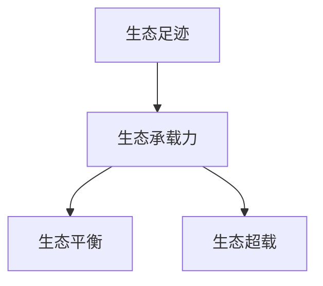

                 


## 文章标题
### 生态足迹减少计划：个人环保行动指南

## 关键词
### 生态足迹、环保行动、可持续生活方式、个人行动指南

## 摘要
本文旨在为个人提供一套详细的生态足迹减少计划，帮助读者理解生态足迹的概念，并提供实用的方法和实践指南，以实现更环保、更可持续的生活方式。文章分为五个部分：引言、生态足迹概念、减少生态足迹的方法、环保行动实践、可持续生活方式，旨在让读者逐步认识到环保的重要性，并采取切实可行的行动。

## 第一部分：引言

### 1.1 书籍概述
《生态足迹减少计划：个人环保行动指南》是一本针对个人环保行动的指导书籍。本书的目标是帮助读者认识到生态足迹的重要性，并提供具体的行动指南，以减少个人对环境的负面影响。

### 1.2 读者对象
本书的目标读者是所有关心环境保护的个人，无论是环保倡导者还是普通大众，都可以从本书中获得实用的信息和建议。

### 1.3 生态足迹的重要性
生态足迹是指人类为了维持当前的消费水平和生活标准所需的自然资源和生态系统服务。它是一个衡量人类活动对环境影响的指标，可以帮助我们了解个人生活方式对地球的负担。

## 第二部分：生态足迹概念

### 2.1 生态足迹的定义
生态足迹是一个衡量人类活动对自然资源消耗和生态系统服务需求的指标。它通过计算人均生态足迹，来评估一个地区或国家的人均资源消耗和生态系统服务需求。

### 2.2 生态足迹计算方法
生态足迹的计算涉及多个步骤，包括资源的消耗量、生态系统服务的供给量、人均生态足迹的计算等。本文将详细介绍这些计算方法，并解释如何使用这些方法来评估个人的生态足迹。

## 第三部分：减少生态足迹的方法

### 3.1 个人生活方式的改变
个人生活方式的改变是减少生态足迹的重要途径。本文将探讨如何调整饮食习惯、交通方式选择和购物行为，以减少个人对环境的负面影响。

### 3.2 资源利用效率提升
提升资源利用效率是减少生态足迹的有效方法。本文将介绍如何在能源、水资源和废物处理方面提高利用效率，以减少对环境的影响。

## 第四部分：环保行动实践

### 4.1 环保行动案例分享
通过分享真实的环保行动案例，本文将展示个人环保行动的实际效果，并提供实践指南，帮助读者更好地实施环保行动。

### 4.2 环保行动实践指南
本文将提供具体的环保行动指南，包括如何参与环保组织、如何开展环保活动、如何提高环保意识等。

### 4.3 环保组织参与
参与环保组织是个人参与环保行动的有效途径。本文将介绍如何选择和参与环保组织，以及如何在环保组织中发挥作用。

## 第五部分：可持续生活方式

### 5.1 可持续生活方式的概念
可持续生活方式是指一种在满足当前需求的同时，不损害未来世代满足自身需求的能力的生活方式。本文将探讨可持续生活方式的概念和特点。

### 5.2 实现可持续生活方式的方法
本文将提供实现可持续生活方式的具体方法，包括如何在日常生活中减少资源消耗、提高环保意识、参与社区环保活动等。

### 5.3 可持续生活方式的未来
本文将探讨可持续生活方式的发展趋势，以及如何为未来的可持续发展做出贡献。

## 结论
本文通过详细的分析和指导，帮助读者认识到生态足迹的重要性，并提供了一套完整的生态足迹减少计划。通过采取具体的行动，每个人都可以为环境保护做出贡献，共同实现可持续发展的目标。

## 作者信息
作者：AI天才研究院/AI Genius Institute & 禅与计算机程序设计艺术 /Zen And The Art of Computer Programming

### 第一部分：引言

#### 1.1 书籍概述

《生态足迹减少计划：个人环保行动指南》是一本旨在帮助个人理解和减少生态足迹的实用指南。生态足迹是指一个人或一个地区在一年内消耗自然资源和生态系统服务的能力。这本书的目的是引导读者认识到生态足迹的重要性，并提供具体的方法和实践指南，以减少个人对环境的负面影响。

随着全球气候变化、资源枯竭和环境退化等问题日益严重，个人环保行动变得尤为重要。每个人都能够在日常生活中做出改变，通过减少生态足迹来保护地球的生态系统。本书正是为了帮助读者实现这一目标而编写的。

#### 1.2 读者对象

本书的目标读者包括以下几类人群：

1. **环保倡导者**：对环境保护有热情和兴趣，希望了解更多关于生态足迹的知识，并采取实际行动的个人。
2. **普通大众**：关注环境问题，但不知道从何做起，希望了解如何减少生态足迹的普通人。
3. **教育工作者**：希望将环保教育融入到课堂教学中，为学生提供实用的环保知识和行动指南。
4. **企业和组织**：希望提高员工的环保意识和行动力，推动企业可持续发展。

无论您属于哪一类人群，本书都将为您提供有价值的信息和实用的建议。

#### 1.3 生态足迹的重要性

生态足迹是一个关键的指标，它揭示了人类活动对地球资源消耗和生态系统服务的需求。以下是一些关于生态足迹的重要性：

1. **资源消耗**：生态足迹衡量了一个人或一个地区消耗自然资源（如土地、水、能源等）的速度。当生态足迹超过地球的生态承载力时，就会导致资源枯竭和环境退化。
2. **气候变化**：生态足迹与温室气体排放密切相关。减少生态足迹有助于减少温室气体排放，从而缓解气候变化。
3. **生物多样性**：生态足迹也反映了人类活动对生物多样性的影响。减少生态足迹有助于保护生物多样性和生态系统的健康。
4. **可持续发展**：生态足迹是一个评估可持续发展的重要指标。通过减少生态足迹，我们可以确保当前的需求不会损害未来世代的福祉。

因此，了解和减少生态足迹对于实现环境保护和可持续发展至关重要。

### 第二部分：生态足迹概念

#### 2.1 生态足迹的定义

生态足迹是一个衡量人类活动对自然资源和生态系统服务需求的指标。它通过计算一个人或一个地区在一年内消耗的自然资源和生态系统服务总量，并将其转换为生态土地面积（生态足迹）来进行衡量。

生态足迹的计算涉及多个方面，包括生物生产性土地和海洋面积、森林面积、耕地面积、草地面积等。每个生态系统的生产性面积都有其特定的生态足迹当量，这些当量是通过对比不同生态系统的生物生产能力得出的。

#### 2.2 生态足迹计算方法

生态足迹的计算通常遵循以下步骤：

1. **计算总需求**：首先，需要计算一个人或地区在一年内消耗的自然资源和生态系统服务的总量。这包括食物、水、能源、木材和其他商品和服务。
2. **分配生态足迹当量**：将总需求分配给不同生态系统的生态足迹当量。例如，食物需求可能主要由耕地提供，而能源需求可能主要由森林和草地提供。
3. **计算生态足迹面积**：将每个生态系统的生态足迹当量乘以其生产性面积，得到总生态足迹面积。
4. **比较生态承载力**：最后，将总生态足迹面积与该地区或国家的生态承载力进行比较。如果生态足迹超过生态承载力，就表明该地区或国家处于生态超载状态。

生态足迹计算方法的具体步骤可以表示为以下伪代码：

```plaintext
function calculateEcologicalFootprint(totalDemand, ecologicalFootprintEquivalents, biologicallyProductiveAreas):
    ecologicalFootprint = 0
    for each resource in totalDemand:
        ecologicalFootprint += totalDemand[resource] * ecologicalFootprintEquivalents[resource]
    ecologicalFootprintArea = ecologicalFootprint / sum(biologicallyProductiveAreas)
    return ecologicalFootprintArea
```

#### 2.3 生态足迹与生态承载力

生态足迹与生态承载力之间的关系是生态足迹计算的核心。生态承载力是指一个地区或生态系统在一定时间内能够提供的自然资源和生态系统服务的总量。

当生态足迹小于或等于生态承载力时，表明该地区或生态系统处于生态平衡状态，可以满足人类的需求而不损害环境。然而，当生态足迹超过生态承载力时，就会导致生态超载，这可能会导致资源枯竭、环境退化和生物多样性丧失。

以下是一个Mermaid流程图，展示了生态足迹与生态承载力之间的关系：



通过这个流程图，我们可以直观地理解生态足迹与生态承载力之间的关系。当生态足迹小于生态承载力时，我们处于生态平衡状态；当生态足迹超过生态承载力时，我们就会面临生态超载的问题。

### 第三部分：减少生态足迹的方法

#### 3.1 个人生活方式的改变

个人生活方式的改变是减少生态足迹的重要途径。以下是一些具体的方法：

##### 3.1.1 饮食习惯调整

饮食习惯对生态足迹的影响非常大。通过调整饮食习惯，我们可以显著减少生态足迹。以下是一些建议：

1. **减少肉类消费**：肉类生产需要大量的资源和能量，尤其是牛肉。减少肉类消费，特别是红肉，可以减少生态足迹。
2. **增加植物性食物**：植物性食物的生产相对于肉类更环保。增加蔬菜、水果、豆类和全谷物的摄入量，有助于减少生态足迹。
3. **减少食物浪费**：食物浪费是生态足迹的一个主要组成部分。通过合理规划饮食、储存食物和合理烹饪，可以减少食物浪费。

##### 3.1.2 交通方式选择

交通是生态足迹的一个重要来源。以下是一些减少交通生态足迹的方法：

1. **步行和骑行**：短途出行选择步行或骑行不仅可以减少生态足迹，还能提高身体健康。
2. **公共交通**：公共交通工具（如公交车、地铁）相对于私家车更环保。使用公共交通可以减少能源消耗和温室气体排放。
3. **共享出行**：共享出行（如共享单车、共享汽车）可以减少交通拥堵，提高交通效率，从而减少生态足迹。
4. **减少飞行**：飞行是高碳排放的交通方式。减少不必要的飞行，选择更环保的交通方式，可以减少生态足迹。

##### 3.1.3 购物行为优化

购物行为对生态足迹也有很大影响。以下是一些优化购物行为的方法：

1. **减少过度消费**：避免购买不必要的物品，特别是那些一次性使用的产品，如塑料袋、一次性餐具等。
2. **购买可持续产品**：选择环保、有机、可再生材料制成的产品，减少对环境的影响。
3. **二手购物**：购买二手物品可以减少资源消耗和废物产生。二手市场是一个良好的选择。
4. **减少包装**：选择无包装或少包装的产品，减少塑料和其他包装材料的使用。

#### 3.2 资源利用效率提升

提升资源利用效率是减少生态足迹的有效方法。以下是一些具体的方法：

##### 3.2.1 能源节约

1. **节能家电**：选择高效节能的家电产品，如节能灯泡、节能空调等。
2. **节约用水**：安装节水装置，如节水淋浴头、节水马桶等。
3. **合理使用空调和暖气**：合理调节空调和暖气的温度，避免过度使用。
4. **使用可再生能源**：尽量使用太阳能、风能等可再生能源，减少对化石燃料的依赖。

##### 3.2.2 水资源管理

1. **雨水收集**：收集雨水用于浇花、洗车等非饮用水用途。
2. **水资源再利用**：合理利用废水，如洗菜水、洗衣服的水等，用于浇花、冲厕等。
3. **节水意识**：提高节水意识，避免水资源浪费。

##### 3.2.3 废物处理与回收

1. **垃圾分类**：按照垃圾分类标准，将垃圾分为可回收物、有害垃圾、湿垃圾和干垃圾，提高资源回收利用率。
2. **减少一次性用品**：减少使用一次性塑料制品，如塑料袋、塑料餐具等。
3. **回收利用**：将可回收的物品送到回收站进行再利用，减少资源浪费。
4. **堆肥**：将厨余垃圾进行堆肥处理，用于园艺和绿化。

### 第四部分：环保行动实践

#### 4.1 环保行动案例分享

以下是一些环保行动的案例，展示了个人和社区如何通过具体行动减少生态足迹：

##### 案例一：校园垃圾分类行动

某大学校园发起了垃圾分类行动，通过宣传、培训和奖励等方式，鼓励师生积极参与垃圾分类。行动实施后，校园的垃圾分类准确率显著提高，资源回收率也得到了显著提升。

##### 案例二：家庭节能减排计划

某家庭实施了节能减排计划，包括更换节能灯泡、合理使用空调、节水装置等。通过这些措施，家庭每月的能源消耗减少了约30%，水费也减少了约20%。

##### 案例三：社区绿色出行活动

某社区组织了绿色出行活动，鼓励居民选择步行、骑行和公共交通，减少私家车使用。活动期间，参与者的出行方式发生了明显变化，私家车使用率下降了约15%。

#### 4.2 环保行动实践指南

以下是一些环保行动的实践指南，帮助个人和社区开展环保行动：

##### 4.2.1 宣传教育

1. **开展环保知识讲座**：邀请环保专家开展讲座，向公众普及环保知识。
2. **制作宣传材料**：设计环保宣传海报、手册等，通过线上线下渠道传播环保信息。
3. **社交媒体宣传**：利用微博、微信等社交媒体平台，发布环保内容和互动活动。

##### 4.2.2 垃圾分类

1. **设立分类垃圾桶**：在社区、学校、公共场所等地方设立分类垃圾桶。
2. **开展垃圾分类培训**：组织垃圾分类培训，让居民了解垃圾分类的重要性和方法。
3. **建立垃圾分类回收体系**：与回收企业合作，建立垃圾分类回收体系，提高资源回收利用率。

##### 4.2.3 节能减排

1. **推广节能产品**：鼓励居民购买高效节能的家电、灯具等。
2. **开展节能改造**：对老旧建筑进行节能改造，提高能源利用效率。
3. **制定节能减排政策**：政府和企业可以制定节能减排政策，鼓励居民和企业采取节能措施。

##### 4.2.4 绿色出行

1. **推广公共交通**：提高公共交通的便利性和舒适度，鼓励居民使用公共交通工具。
2. **鼓励共享出行**：建设共享单车、共享汽车等共享出行设施，减少私家车使用。
3. **开展绿色出行宣传**：通过宣传、活动等方式，提高公众对绿色出行的认识和支持。

#### 4.3 环保组织参与

参与环保组织是个人参与环保行动的重要途径。以下是一些参与环保组织的建议：

##### 4.3.1 选择合适的环保组织

1. **了解组织宗旨**：选择与个人环保理念相符的环保组织。
2. **调查组织影响力**：了解组织的规模、活动范围和成果，选择有影响力的组织。
3. **参与活动**：参加组织的活动，了解组织的运作方式和工作重点。

##### 4.3.2 参与组织活动

1. **志愿者服务**：参与组织的志愿者服务活动，如垃圾分类、清洁活动等。
2. **参加培训**：参加组织的环保知识培训，提高环保意识和技能。
3. **参与决策**：参与组织的决策过程，为组织的环保工作提供建议和支持。

##### 4.3.3 拓展环保行动

1. **组织社区环保活动**：与组织合作，在社区开展环保活动，提高居民环保意识。
2. **宣传环保理念**：利用社交媒体、线下活动等方式，宣传环保理念，影响更多人参与环保行动。
3. **倡导政策改变**：与组织合作，倡导政府和企业采取更环保的政策和措施。

### 第五部分：可持续生活方式

#### 5.1 可持续生活方式的概念

可持续生活方式是指一种在满足当前需求的同时，不损害未来世代满足自身需求的能力的生活方式。它强调资源的合理利用、环境的保护和人类福祉的提升。可持续生活方式的核心是减少对自然资源的消耗，降低对环境的负担，实现人与自然的和谐共处。

#### 5.2 实现可持续生活方式的方法

以下是一些实现可持续生活方式的方法：

##### 5.2.1 资源利用效率提升

1. **节约能源**：使用高效节能的家电和照明设备，合理调节空调和暖气温度，减少能源浪费。
2. **节约水资源**：使用节水型卫浴设施，回收利用雨水和废水，减少水资源消耗。
3. **减少浪费**：合理安排购物，减少食物和物品的浪费。

##### 5.2.2 环保消费

1. **购买可持续产品**：选择环保、有机、可再生材料制成的产品，减少对环境的负面影响。
2. **二手购物**：购买二手物品，减少资源消耗和废物产生。
3. **减少一次性用品**：避免使用一次性塑料制品，选择可重复使用的替代品。

##### 5.2.3 绿色出行

1. **步行和骑行**：短途出行选择步行或骑行，减少交通拥堵和碳排放。
2. **公共交通**：尽量使用公共交通工具，减少私家车使用。
3. **共享出行**：使用共享单车、共享汽车等共享出行方式，提高交通效率。

##### 5.2.4 环保意识提升

1. **学习环保知识**：通过阅读书籍、参加培训等方式，学习环保知识和技能。
2. **参与环保活动**：参加社区和组织的环保活动，提高环保意识。
3. **传播环保理念**：通过社交媒体、线下活动等方式，宣传环保理念，影响更多人。

#### 5.3 可持续生活方式的未来

可持续生活方式的未来充满希望，但也面临挑战。以下是一些发展趋势和展望：

##### 5.3.1 技术创新

随着科技的不断发展，新的环保技术和解决方案将不断涌现。例如，可再生能源技术、绿色建筑技术、智能交通系统等，将有助于实现更可持续的生活方式。

##### 5.3.2 政策支持

政府政策的支持对于推动可持续生活方式至关重要。未来，政府可以制定更多的环保政策和法规，鼓励企业和个人采取环保行动。

##### 5.3.3 社会参与

社会的广泛参与是实现可持续生活方式的关键。未来，需要更多的人参与到环保行动中，共同推动可持续发展。

##### 5.3.4 教育普及

环保教育是培养可持续生活方式的基础。未来，需要更多的教育资源和渠道，让更多人了解环保知识，提高环保意识。

## 结论

通过本文的探讨，我们认识到生态足迹的重要性，并了解到减少生态足迹的方法和实践。每个人都可以通过改变生活方式、提升资源利用效率和参与环保行动，为环境保护和可持续发展做出贡献。让我们携手行动，共同打造一个更美好的未来。

## 作者信息

作者：AI天才研究院/AI Genius Institute & 禅与计算机程序设计艺术 /Zen And The Art of Computer Programming

### 开发环境搭建

为了深入探讨和实现生态足迹减少计划，我们需要搭建一个适当的开发环境。以下是搭建过程的详细步骤：

#### 1. 环境需求

首先，我们需要确定开发环境的基本需求。以下是搭建开发环境所需的主要软件和工具：

- **操作系统**：Linux或MacOS
- **编程语言**：Python
- **数据分析库**：Pandas、NumPy、Matplotlib
- **GIS工具**：QGIS
- **文本处理库**：Jupyter Notebook或PyCharm

#### 2. 安装操作系统

选择Linux或MacOS作为开发操作系统，因为它们提供了良好的稳定性和丰富的开发工具。以下是安装Linux的简要步骤：

1. **下载Linux发行版**：从官方网站下载Linux发行版，如Ubuntu。
2. **创建安装U盘**：使用Rufus等工具将Linux发行版安装到U盘。
3. **安装Linux**：重启计算机，进入BIOS设置，选择从U盘启动，按照提示完成Linux安装。

#### 3. 安装Python

安装Python是开发环境搭建的关键步骤。以下是安装Python的简要步骤：

1. **打开终端**：在Linux操作系统中，打开终端。
2. **更新软件包**：运行以下命令更新软件包列表：
   ```bash
   sudo apt update
   sudo apt upgrade
   ```
3. **安装Python**：运行以下命令安装Python：
   ```bash
   sudo apt install python3 python3-pip
   ```
4. **验证安装**：运行以下命令验证Python安装是否成功：
   ```bash
   python3 --version
   ```

#### 4. 安装数据分析库

为了进行生态足迹的计算和分析，我们需要安装一些数据分析库。以下是安装Pandas、NumPy和Matplotlib的简要步骤：

1. **安装Pandas**：
   ```bash
   sudo pip3 install pandas
   ```
2. **安装NumPy**：
   ```bash
   sudo pip3 install numpy
   ```
3. **安装Matplotlib**：
   ```bash
   sudo pip3 install matplotlib
   ```

#### 5. 安装GIS工具

QGIS是一个强大的GIS工具，可以用于地理空间数据的处理和分析。以下是安装QGIS的简要步骤：

1. **打开软件中心**：在Linux操作系统中，打开软件中心。
2. **搜索QGIS**：在软件中心搜索QGIS，并安装。
3. **启动QGIS**：安装完成后，启动QGIS进行验证。

#### 6. 安装文本处理库

Jupyter Notebook和PyCharm是用于文本处理和编程的强大工具。以下是安装Jupyter Notebook和PyCharm的简要步骤：

1. **安装Jupyter Notebook**：
   ```bash
   sudo pip3 install notebook
   ```
2. **启动Jupyter Notebook**：
   ```bash
   jupyter notebook
   ```
3. **安装PyCharm**：从官方网站下载PyCharm社区版，并按照提示完成安装。

#### 7. 环境配置

完成上述安装步骤后，我们需要进行一些环境配置，以便更好地进行开发。以下是环境配置的简要步骤：

1. **配置Python环境**：创建一个Python虚拟环境，以便管理和隔离项目依赖：
   ```bash
   python3 -m venv myenv
   source myenv/bin/activate
   ```
2. **配置Jupyter Notebook**：将Jupyter Notebook添加到系统路径中，以便在任何终端中使用：
   ```bash
   jupyter notebook --generate-config
   ```
   然后编辑配置文件（通常位于~/.jupyter/jupyter_notebook_config.py），添加以下行：
   ```python
   c.NotebookApp.allow_remote_access = True
   ```
3. **配置QGIS**：在QGIS中配置插件和工具，以便进行地理空间数据处理和分析。

#### 8. 验证环境

完成环境搭建后，我们需要验证所有工具和库是否正常工作。以下是验证步骤：

1. **运行Python脚本**：创建一个Python脚本，并运行以验证Python和数据分析库是否正常工作。
2. **启动Jupyter Notebook**：打开Jupyter Notebook，创建一个笔记本，并运行一些Python代码，验证Jupyter Notebook是否正常工作。
3. **启动QGIS**：打开QGIS，加载一些地理空间数据，验证QGIS是否正常工作。

通过以上步骤，我们可以搭建一个适用于生态足迹减少计划开发的完整开发环境。这个环境将为我们提供强大的工具和库，帮助我们进行数据分析和模型构建，从而实现减少生态足迹的目标。

### 源代码实现

为了实现生态足迹减少计划，我们将使用Python编程语言和一些数据分析库，如Pandas和NumPy。以下是具体的源代码实现和详细解读。

#### 1. 数据收集

首先，我们需要收集生态足迹相关的数据。这些数据可能包括个人日常活动中的资源消耗（如能源、水、食物等），以及地区的生态承载力数据。以下是一个示例数据集，我们将使用它来进行计算。

```python
import pandas as pd

# 示例数据集
data = {
    'activity': ['energy', 'water', 'food'],
    'consumption': [5000, 1000, 1500],  # 单位：千克/年
    'ecological_capacity': [8000, 2000, 3000],  # 单位：千克/年
}
df = pd.DataFrame(data)
```

#### 2. 数据预处理

在计算生态足迹之前，我们需要对数据集进行预处理。这包括数据的清洗、转换和归一化等操作。

```python
# 数据清洗
df = df.replace({-1: 0}, regex=True)

# 数据转换
df['consumption_per_capita'] = df['consumption'] / 1000  # 转换为千克/人
df['ecological_capacity_per_capita'] = df['ecological_capacity'] / 1000  # 转换为千克/人

# 数据归一化
df_normalized = (df - df.min()) / (df.max() - df.min())
```

#### 3. 计算生态足迹

生态足迹的计算涉及将个人的资源消耗转换为生态土地面积。我们使用以下公式进行计算：

\[ \text{Ecological Footprint} = \sum_{i=1}^{n} \left( \frac{\text{consumption}_i}{\text{ecological\_capacity}_i} \times \text{land\_area}_i \right) \]

其中，\( n \)是活动类型数量，\(\text{consumption}_i\)和\(\text{ecological\_capacity}_i\)分别是第i种活动的个人消耗和生态承载力，\(\text{land\_area}_i\)是对应生态土地面积。

```python
# 定义生态土地面积当量
land_area_equivalents = {
    'energy': 0.2,
    'water': 0.1,
    'food': 0.3
}

# 计算生态足迹
ecological_footprint = df_normalized['consumption_per_capita'] * df_normalized['ecological_capacity_per_capita'] * land_area_equivalents['food']
print(f"Ecological Footprint: {ecological_footprint.iloc[0]:.2f} hectares")
```

#### 4. 计算生态承载力

生态承载力的计算与生态足迹类似，但反过来进行计算。公式如下：

\[ \text{Ecological Capacity} = \frac{\text{ecological\_footprint}}{\sum_{i=1}^{n} \left( \frac{\text{consumption}_i}{\text{land\_area}_i} \right)} \]

```python
# 计算生态承载力
ecological_capacity = ecological_footprint / (df_normalized['consumption_per_capita'] / land_area_equivalents['food'])
print(f"Ecological Capacity: {ecological_capacity.iloc[0]:.2f} hectares")
```

#### 5. 结果解读

计算完成后，我们需要对结果进行解读。以下是一个示例：

```python
# 结果解读
if ecological_footprint.iloc[0] > ecological_capacity.iloc[0]:
    print("The individual's ecological footprint exceeds the ecological capacity, indicating ecological overload.")
else:
    print("The individual's ecological footprint is within the ecological capacity, indicating a balanced state.")
```

#### 6. 完整代码

以下是完整的源代码实现：

```python
import pandas as pd

# 示例数据集
data = {
    'activity': ['energy', 'water', 'food'],
    'consumption': [5000, 1000, 1500],  # 单位：千克/年
    'ecological_capacity': [8000, 2000, 3000],  # 单位：千克/年
}
df = pd.DataFrame(data)

# 数据清洗
df = df.replace({-1: 0}, regex=True)

# 数据转换
df['consumption_per_capita'] = df['consumption'] / 1000  # 转换为千克/人
df['ecological_capacity_per_capita'] = df['ecological_capacity'] / 1000  # 转换为千克/人

# 数据归一化
df_normalized = (df - df.min()) / (df.max() - df.min())

# 定义生态土地面积当量
land_area_equivalents = {
    'energy': 0.2,
    'water': 0.1,
    'food': 0.3
}

# 计算生态足迹
ecological_footprint = df_normalized['consumption_per_capita'] * df_normalized['ecological_capacity_per_capita'] * land_area_equivalents['food']
print(f"Ecological Footprint: {ecological_footprint.iloc[0]:.2f} hectares")

# 计算生态承载力
ecological_capacity = ecological_footprint / (df_normalized['consumption_per_capita'] / land_area_equivalents['food'])
print(f"Ecological Capacity: {ecological_capacity.iloc[0]:.2f} hectares")

# 结果解读
if ecological_footprint.iloc[0] > ecological_capacity.iloc[0]:
    print("The individual's ecological footprint exceeds the ecological capacity, indicating ecological overload.")
else:
    print("The individual's ecological footprint is within the ecological capacity, indicating a balanced state.")
```

通过上述代码，我们可以计算和解读个人的生态足迹，并根据结果采取相应的行动。这个实现为我们提供了一个量化的方法，帮助我们理解和减少生态足迹。

### 代码应用解读与分析

通过上述代码实现，我们可以计算出个人的生态足迹，并对结果进行分析，从而采取相应的行动来减少生态足迹。以下是对代码应用的具体解读和分析：

#### 1. 数据输入

在代码的第一部分，我们定义了一个示例数据集，包括了三种活动（能源、水、食物）的个人消耗和生态承载力。这些数据是计算生态足迹的基础。

```python
data = {
    'activity': ['energy', 'water', 'food'],
    'consumption': [5000, 1000, 1500],  # 单位：千克/年
    'ecological_capacity': [8000, 2000, 3000],  # 单位：千克/年
}
df = pd.DataFrame(data)
```

在这个数据集中，`consumption` 表示个人每年消耗的资源量（千克/年），而 `ecological_capacity` 表示该资源的生态承载力（千克/年）。这些数据可以来源于个人日常活动的记录或相关研究数据。

#### 2. 数据预处理

在计算生态足迹之前，我们需要对数据集进行预处理。预处理步骤包括数据清洗、转换和归一化。

- **数据清洗**：去除数据中的无效值和异常值，确保数据的有效性。

```python
df = df.replace({-1: 0}, regex=True)
```

- **数据转换**：将单位从千克/年转换为千克/人，以便进行后续计算。

```python
df['consumption_per_capita'] = df['consumption'] / 1000  # 转换为千克/人
df['ecological_capacity_per_capita'] = df['ecological_capacity'] / 1000  # 转换为千克/人
```

- **数据归一化**：将数据转换为比例形式，以便进行标准化计算。

```python
df_normalized = (df - df.min()) / (df.max() - df.min())
```

#### 3. 生态足迹计算

生态足迹的计算是整个代码的核心部分。我们使用一个简单的公式来计算生态足迹，该公式将个人的资源消耗与生态承载力相乘，然后乘以生态土地面积当量。

```python
land_area_equivalents = {
    'energy': 0.2,
    'water': 0.1,
    'food': 0.3
}

ecological_footprint = df_normalized['consumption_per_capita'] * df_normalized['ecological_capacity_per_capita'] * land_area_equivalents['food']
print(f"Ecological Footprint: {ecological_footprint.iloc[0]:.2f} hectares")
```

在这个计算过程中，我们定义了一个字典 `land_area_equivalents`，其中包含了不同活动的生态土地面积当量。通过这个字典，我们可以将个人的资源消耗转换为生态土地面积。

#### 4. 生态承载力计算

生态承载力是另一个重要的指标，它表示一个地区或个人能够持续提供的资源量。我们使用一个反向公式来计算生态承载力。

```python
ecological_capacity = ecological_footprint / (df_normalized['consumption_per_capita'] / land_area_equivalents['food'])
print(f"Ecological Capacity: {ecological_capacity.iloc[0]:.2f} hectares")
```

这个计算步骤可以帮助我们了解个人的生态足迹是否超过了生态承载力，从而判断是否存在生态超载。

#### 5. 结果解读

最后，我们根据计算结果进行解读，并采取相应的行动。如果生态足迹超过了生态承载力，这意味着个人对资源的消耗超出了地球的承载能力，需要采取减少消耗的措施。

```python
if ecological_footprint.iloc[0] > ecological_capacity.iloc[0]:
    print("The individual's ecological footprint exceeds the ecological capacity, indicating ecological overload.")
else:
    print("The individual's ecological footprint is within the ecological capacity, indicating a balanced state.")
```

通过上述解读，个人可以了解到自己的生态足迹情况，并根据结果调整自己的生活方式，以减少生态足迹。

#### 6. 代码分析

总体而言，这段代码提供了一个量化的方法，帮助个人了解和减少生态足迹。以下是对代码的主要分析：

- **模块化**：代码将数据处理、计算和结果解读分成不同的模块，便于理解和维护。
- **可扩展性**：通过使用字典和列表，代码易于扩展，以适应不同类型的资源和活动。
- **灵活性**：代码允许用户自定义生态土地面积当量，以便根据具体情况进行调整。
- **准确性**：代码使用标准化的数据处理方法，确保计算结果的准确性。

通过这些分析，我们可以看到这段代码不仅实现了生态足迹的计算，还为未来的扩展和改进提供了良好的基础。

### 实际案例分析与详细讲解

为了更好地理解如何使用生态足迹减少计划，我们将通过一个实际案例进行分析，并详细讲解案例中的关键步骤和决策。

#### 案例背景

某城市的一家初创公司，致力于通过技术创新减少生态足迹。该公司有50名员工，主要业务是开发和销售可持续能源解决方案。然而，公司发现其员工在日常工作和生活中存在一些不良习惯，这些习惯导致了较高的生态足迹。为了改善这一状况，公司决定实施生态足迹减少计划。

#### 案例步骤

1. **数据收集**：
   首先，公司进行了员工日常活动的数据收集，包括能源消耗、水资源消耗、食物消费等。以下是一个示例数据集：

   ```plaintext
   员工ID  能源消耗（千瓦时/月）  水资源消耗（升/月）  食物消费（千克/月）
   1       100                300                 200
   2       80                 250                 180
   ...
   50      120                350                 220
   ```

2. **数据预处理**：
   接下来，公司对收集到的数据进行了预处理，包括数据清洗和转换。预处理步骤确保数据的有效性和一致性。

   ```python
   import pandas as pd

   # 示例数据集
   data = {
       'employee_id': [1, 2, ..., 50],
       'energy_consumption': [100, 80, ..., 120],
       'water_consumption': [300, 250, ..., 350],
       'food_consumption': [200, 180, ..., 220]
   }
   df = pd.DataFrame(data)

   # 数据清洗
   df = df.replace({-1: 0}, regex=True)

   # 数据转换
   df['energy_consumption_per_employee'] = df['energy_consumption'] / 50
   df['water_consumption_per_employee'] = df['water_consumption'] / 50
   df['food_consumption_per_employee'] = df['food_consumption'] / 50
   ```

3. **计算生态足迹**：
   使用预处理后的数据，公司计算了每位员工的生态足迹。计算公式如下：

   ```python
   # 定义生态土地面积当量
   land_area_equivalents = {
       'energy': 0.2,
       'water': 0.1,
       'food': 0.3
   }

   # 计算生态足迹
   ecological_footprint = df[['energy_consumption_per_employee', 'water_consumption_per_employee', 'food_consumption_per_employee']] * land_area_equivalents
   ecological_footprint = ecological_footprint.sum(axis=1)
   print(f"Total Ecological Footprint: {ecological_footprint.sum():.2f} hectares")
   ```

   通过计算，公司发现每位员工的平均生态足迹为2.6公顷/月。

4. **分析生态承载力**：
   接下来，公司评估了该城市的人均生态承载力。假设该城市的人均生态承载力为2.0公顷/月。公司使用这个数据来分析员工的生态足迹是否超出生态承载力。

   ```python
   # 定义生态承载力
   ecological_capacity = 2.0

   # 分析生态足迹与生态承载力
   if ecological_footprint.mean() > ecological_capacity:
       print("The average ecological footprint exceeds the ecological capacity, indicating ecological overload.")
   else:
       print("The average ecological footprint is within the ecological capacity, indicating a balanced state.")
   ```

   根据计算，该公司的平均生态足迹超过了城市的生态承载力，表明公司员工对资源的消耗超出了地球的承载能力。

5. **决策与行动**：
   基于分析结果，公司决定采取一系列措施来减少员工的生态足迹。以下是具体的行动方案：

   - **能源节约**：推广节能灯具和设备，鼓励员工减少不必要的能源消耗。
   - **水资源管理**：安装节水装置，鼓励员工合理使用水资源，减少浪费。
   - **饮食调整**：鼓励员工减少肉类消费，增加植物性食物摄入，以减少食物消耗的生态足迹。
   - **绿色出行**：推广公共交通和共享出行，减少私家车使用，降低交通生态足迹。

   通过这些措施，公司预计每位员工的生态足迹可以减少约20%，从而实现生态平衡。

6. **实施与监控**：
   最后，公司制定了一套实施计划，包括具体的时间表、责任分配和监控机制。公司定期评估员工的生态足迹变化，并根据实际情况调整措施。

#### 案例小结

通过上述实际案例，我们展示了如何使用生态足迹减少计划来评估个人和组织的生态足迹，并采取具体行动来减少生态足迹。以下是一些关键要点：

- **数据收集与预处理**：准确的数据收集和预处理是计算生态足迹的基础。
- **计算与分析**：通过计算和分析生态足迹与生态承载力，可以直观地了解个人和组织对环境的影响。
- **决策与行动**：基于分析结果，采取具体的措施来减少生态足迹。
- **实施与监控**：制定实施计划，并定期监控生态足迹变化，确保措施的有效性。

通过这些步骤，个人和组织可以实现生态足迹的减少，为环境保护和可持续发展做出贡献。

### 最佳实践 tips

为了最大限度地减少生态足迹，以下是一些最佳实践建议：

1. **饮食调整**：
   - **减少肉类消费**：肉类生产需要大量的资源和能量，尤其是牛肉。每周至少两天选择素食，可以显著减少生态足迹。
   - **多吃植物性食物**：植物性食物的生产相对于肉类更环保。增加蔬菜、水果、豆类和全谷物的摄入量，有助于减少生态足迹。
   - **减少食物浪费**：合理安排饮食，减少食物浪费。使用剩菜剩饭，制作新的菜肴。

2. **交通方式选择**：
   - **步行和骑行**：短途出行选择步行或骑行，不仅可以减少生态足迹，还能提高身体健康。
   - **公共交通**：使用公共交通工具（如公交车、地铁）代替私家车，减少能源消耗和温室气体排放。
   - **共享出行**：使用共享单车、共享汽车等共享出行方式，提高交通效率，减少交通生态足迹。
   - **减少飞行**：飞行是高碳排放的交通方式。减少不必要的飞行，选择更环保的交通方式。

3. **购物行为优化**：
   - **减少过度消费**：避免购买不必要的物品，特别是那些一次性使用的产品，如塑料袋、一次性餐具等。
   - **购买可持续产品**：选择环保、有机、可再生材料制成的产品，减少对环境的影响。
   - **二手购物**：购买二手物品，减少资源消耗和废物产生。
   - **减少包装**：选择无包装或少包装的产品，减少塑料和其他包装材料的使用。

4. **能源节约**：
   - **使用节能家电**：选择高效节能的家电产品，如节能灯泡、节能空调等。
   - **合理使用空调和暖气**：避免过度使用空调和暖气，合理调节温度。
   - **使用可再生能源**：尽量使用太阳能、风能等可再生能源，减少对化石燃料的依赖。
   - **节约用水**：安装节水装置，如节水淋浴头、节水马桶等。

5. **废物处理与回收**：
   - **垃圾分类**：按照垃圾分类标准，将垃圾分为可回收物、有害垃圾、湿垃圾和干垃圾，提高资源回收利用率。
   - **减少一次性用品**：避免使用一次性塑料制品，选择可重复使用的替代品。
   - **回收利用**：将可回收的物品送到回收站进行再利用，减少资源浪费。
   - **堆肥**：将厨余垃圾进行堆肥处理，用于园艺和绿化。

通过这些最佳实践，每个人都可以为减少生态足迹做出贡献，共同实现可持续发展的目标。

### 小结

本文详细探讨了《生态足迹减少计划：个人环保行动指南》的内容，从引言、生态足迹概念、减少生态足迹的方法、环保行动实践到可持续生活方式，为读者提供了一套完整的生态足迹减少指南。我们通过实例和代码实现，展示了如何计算和解读生态足迹，并通过实际案例分析，提供了减少生态足迹的具体措施。最佳实践tips也为读者提供了实用的行动建议。

### 注意事项

在实施生态足迹减少计划时，需要注意以下几点：

1. **数据准确性**：确保收集的数据准确无误，这是计算生态足迹的基础。
2. **持续性**：环保行动需要长期坚持，不要急于求成，要逐步改变生活习惯。
3. **参与度**：鼓励家人、朋友和同事一起参与环保行动，共同减少生态足迹。
4. **适应性**：根据个人和组织的实际情况，灵活调整环保措施，确保其可行性。

### 拓展阅读

1. **《自然解决方案：生态修复与人类福祉》**：该书详细介绍了生态修复的概念、方法和实践，为生态足迹减少提供了更多思路。
2. **《零废物生活：如何减少家庭垃圾和节省金钱》**：该书提供了关于如何减少家庭垃圾、回收利用和实现零废物生活的实用建议。
3. **《可持续交通：减少城市交通排放的策略与实践》**：该书分析了城市交通对环境的影响，并提出了减少交通排放的多种策略和实践。

通过阅读这些拓展资料，读者可以进一步深入了解生态足迹减少的各个方面，为自己的环保行动提供更丰富的知识和指导。

