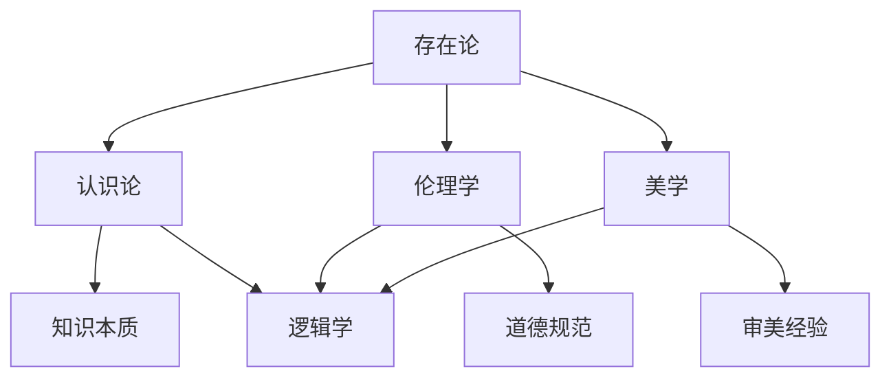

                 

### 文章标题：生活中的哲学实践：将深度思考融入日常

#### 关键词：哲学实践、深度思考、日常应用、生活质量提升、心理健康促进

#### 摘要：
本文旨在探讨如何将哲学实践融入日常生活的各个方面，从而提升个人生活质量与心理健康。通过解析哲学的基本概念和深度思考技巧，结合实际案例和项目实战，我们将展示哲学思维如何帮助我们在决策、人际关系、工作学习、心理健康以及生活质量提升等方面取得更好的效果。

---

### 引言

哲学，作为一种探究人类存在和自然现象的学科，自古以来就在人类文明的各个领域中占据着重要的地位。从古希腊的苏格拉底、柏拉图、亚里士多德，到中国的孔子、孟子、庄子，哲学家的思想不仅在理论上丰富了人类对世界的认识，而且在实践中指导着人们的日常生活。

然而，在现代社会中，哲学似乎离我们越来越远。许多人认为哲学是一门抽象的、难以理解的学科，与日常生活无关。然而，事实并非如此。哲学的核心在于思考，而思考是一种普遍存在于我们日常生活中的能力。只要我们能够正确运用哲学思维，就能在日常生活中获得意想不到的收获。

本文将从以下几个方面展开讨论：

1. **哲学核心概念与联系**：介绍哲学的基本概念及其相互联系。
2. **深度思考技巧**：探讨如何培养深度思考能力。
3. **哲学在生活中的应用**：分析哲学如何帮助人们更好地理解生活，提高生活质量。
4. **实际案例**：通过具体实例展示哲学实践的效果。

希望通过本文的阅读，读者能够对哲学有更深入的理解，并学会将哲学思维融入日常生活，从而实现个人成长和生活质量的提升。

---

### 哲学核心概念与联系

哲学是一门涉及广泛、内容繁复的学科，其核心概念贯穿于各个历史时期和哲学流派。为了更好地理解哲学，我们需要先了解其基本概念和相互之间的联系。

#### 哲学的定义与发展历程

哲学的本质是对存在和知识的探究，其起源可以追溯到古希腊时期。在公元前6世纪，希腊的智者学派开始对宇宙、人类、社会等进行思考，从而开创了哲学的先河。随着时间的推移，哲学不断发展，形成了多个重要的哲学流派，如存在主义、理性主义、经验主义、现象学等。

在哲学的发展历程中，不同哲学家对哲学的基本概念有不同的理解。例如，苏格拉底认为哲学的核心在于“认识自己”，而亚里士多德则强调“事物的本质和规律”。这些哲学家的思想不仅影响了当时的哲学发展，而且对后世哲学产生了深远的影响。

#### 哲学的核心问题

哲学的核心问题主要包括存在论、认识论、伦理学、美学、逻辑学等。这些问题涉及人类对世界和自身的认知，是哲学研究的核心内容。

1. **存在论**：研究存在的事物及其本质。存在论探讨的是“什么是存在”，“存在是如何产生的”，“存在的本质是什么”等问题。

2. **认识论**：研究人类如何获得知识，以及知识的本质和范围。认识论关注的是“我们如何认识世界”，“知识是否可靠”，“科学方法是否有效”等问题。

3. **伦理学**：研究道德和道德行为的规范。伦理学探讨的是“什么是善”，“什么是恶”，“如何做才算正确”等问题。

4. **美学**：研究美和审美经验。美学关注的是“什么是美”，“美的本质是什么”，“艺术的意义是什么”等问题。

5. **逻辑学**：研究推理和论证的方法。逻辑学探讨的是“如何进行有效的推理”，“论证是否成立”，“逻辑谬误有哪些”等问题。

#### 哲学的重要流派

哲学的发展过程中，形成了多个重要的流派，如西方哲学和东方哲学。

1. **西方哲学**：西方哲学的主要流派包括古希腊哲学、中世纪哲学、现代哲学和当代哲学。古希腊哲学以苏格拉底、柏拉图、亚里士多德等哲学家为代表，强调理性和思辨；中世纪哲学以奥古斯丁、托马斯·阿奎那等哲学家为代表，将哲学与神学相结合；现代哲学以笛卡尔、康德、黑格尔等哲学家为代表，强调理性和科学方法；当代哲学则更加多元，涉及存在主义、分析哲学、后现代哲学等多个方向。

2. **东方哲学**：东方哲学包括中国哲学、印度哲学、日本哲学等。中国哲学以孔子、孟子、庄子等哲学家为代表，强调道德修养和天人合一；印度哲学以佛教、印度教等为代表，探讨人生、宇宙和真理的本质；日本哲学则受到东方哲学和西方哲学的双重影响，形成了独特的哲学体系。

#### 哲学核心概念与联系

哲学的核心概念之间存在着紧密的联系。例如，存在论和认识论的关系在于，存在论研究的是存在的本质，而认识论研究的是如何认识存在的本质。伦理学和美学的关系在于，伦理学探讨的是道德行为的规范，而美学研究的是美和审美经验。逻辑学则贯穿于哲学的各个领域，确保论证的有效性和合理性。

为了更好地理解哲学的核心概念和联系，我们可以使用Mermaid流程图来展示它们之间的关系。



#### 核心概念讲解

下面，我们将通过伪代码详细阐述哲学的核心概念。

```python
# 存在论
class Existence:
    def __init__(self, essence):
        self.essence = essence

    def essence_of_existence(self):
        return self.essence

# 认识论
class Cognition:
    def __init__(self, knowledge):
        self.knowledge = knowledge

    def acquisition_of_knowledge(self):
        return self.knowledge

# 伦理学
class Ethics:
    def __init__(self, morality):
        self.morality = morality

    def moral_norms(self):
        return self.morality

# 美学
class Aesthetics:
    def __init__(self, beauty):
        self.beauty = beauty

    def aesthetic_experience(self):
        return self.beauty

# 逻辑学
class Logic:
    def __init__(self, reasoning):
        self.reasoning = reasoning

    def valid_reasoning(self):
        return self.reasoning
```

通过上述伪代码，我们可以看到哲学的核心概念是如何相互关联的。这些概念不仅在理论层面上相互联系，而且在实际应用中也紧密相连。

#### 数学模型和数学公式

哲学中的许多问题都可以通过数学模型和公式来解释。例如，我们可以使用LaTeX公式来阐述存在论和认识论之间的关系。

```latex
$$
存在论：\ E = f(存在, 本质)
$$

$$
认识论：\ K = f(知识, 本质)
$$
```

这些公式表示存在和认识之间的关系，即存在决定认识，而认识是对存在的反映。通过这些数学模型和公式，我们可以更深入地理解哲学的核心概念。

#### 举例说明

为了更好地理解哲学的核心概念，我们可以通过具体案例来阐述它们在实际中的应用。

**案例一：苏格拉底的哲学实践**

苏格拉底认为，认识自己是最重要的。他通过提问和对话的方式，引导人们深入思考，从而认识到自己的无知。这种方法不仅帮助他解决了许多问题，而且对哲学的发展产生了深远的影响。

**案例二：亚里士多德的哲学实践**

亚里士多德强调事物的本质和规律。他在《形而上学》中提出了“四因说”，即事物的本质是由材料、形式、动力和目的共同决定的。这个理论不仅丰富了哲学的理论体系，而且为后来的科学研究奠定了基础。

#### 哲学思维在艺术中的应用

哲学思维不仅适用于哲学领域，而且在艺术创作和欣赏中也起着重要作用。艺术家常常通过哲学思维来探讨人生、宇宙和艺术的意义。

**案例三：梵高的哲学实践**

梵高是一位深受哲学影响的艺术家。他的作品充满了对生命、痛苦和美的思考。例如，他的《星夜》描绘了宇宙的神秘和无限，而《向日葵》则表达了对生命和美的热爱。这些作品不仅展现了梵高对哲学的深刻理解，而且给观众带来了强烈的震撼。

#### 哲学思维在社会和政治中的应用

哲学思维在社会和政治领域也有广泛的应用。哲学家们通过哲学思维来探讨社会和政治问题，并提出解决方案。

**案例四：柏拉图的哲学实践**

柏拉图在《理想国》中提出了理想国家的构想。他认为，理想国家应由哲学家统治，因为哲学家具有深刻的智慧和道德品质。柏拉图的这一观点对后世的政治哲学产生了深远的影响，并激发了人们对理想社会的追求。

#### 哲学思维在科学中的应用

哲学思维在科学领域也有重要的应用。科学家通过哲学思维来探讨科学方法、科学发现和科学价值。

**案例五：爱因斯坦的哲学实践**

爱因斯坦是一位深受哲学影响的科学家。他在物理学的研究中，采用了哲学思维来探讨时空、能量和质量的关系。他的相对论理论不仅揭示了宇宙的奥秘，而且改变了人类对世界的认识。

#### 总结

哲学的核心概念和联系不仅丰富了哲学的理论体系，而且为我们在日常生活中提供了深刻的思考和指导。通过了解哲学的核心概念和联系，我们可以更好地理解自己和世界，从而提升我们的生活质量和心理健康。

---

在哲学的核心概念和联系中，我们看到了人类对存在、知识、道德、美和逻辑的深刻探讨。这些概念不仅构成了哲学的理论基础，而且在我们的日常生活中有着广泛的应用。通过哲学思维，我们可以更深入地理解自己和世界，从而提升我们的生活质量和心理健康。

然而，哲学并非一门高高在上的学科，它源于我们的生活，又服务于我们的生活。哲学实践是哲学理论的具体应用，它帮助我们在日常生活中做出更明智的决策，处理复杂的人际关系，提高工作效率，甚至促进我们的心理健康。

### 深度思考技巧

在现代社会，深度思考是一项极其重要的能力。它不仅能够帮助我们更好地理解复杂的问题，还能提高我们的决策质量、创新能力和解决问题的能力。那么，如何培养深度思考的能力呢？

#### 深度思考的重要性

深度思考，也称为批判性思维，是指对问题进行深入、全面、理性的分析。它不仅仅是表面上的观察和思考，而是需要我们运用逻辑、推理和判断力，对问题进行多角度、多维度的思考。

1. **提高决策质量**：通过深度思考，我们可以更全面地了解问题的各个方面，从而做出更明智的决策。
2. **增强创新能力**：深度思考能够激发我们的创造力，帮助我们找到新的解决方案和创新点。
3. **提升解决问题的能力**：在面对复杂问题时，深度思考可以帮助我们找到问题的核心，从而更有效地解决问题。
4. **促进个人成长**：深度思考是一种自我反思的过程，它能够帮助我们更好地认识自己，促进个人成长。

#### 深度思考的方法

要培养深度思考的能力，我们需要掌握一些具体的方法。

1. **提问法**：通过不断提问，我们可以深入挖掘问题的本质，找到问题的关键点。例如，我们可以使用“5W1H”法（What、Why、When、Where、Who、How），对问题进行全方位的提问。

2. **多角度分析**：在面对问题时，我们需要从不同的角度进行分析。这包括时间角度、空间角度、逻辑角度、情感角度等。通过多角度分析，我们可以更全面地了解问题。

3. **逻辑推理**：逻辑推理是深度思考的核心。通过逻辑推理，我们可以从已知的信息中推导出新的结论。例如，我们可以使用三段论、归纳法、演绎法等逻辑推理方法。

4. **反思法**：反思是一种自我提升的过程。通过反思，我们可以总结经验，找到不足，从而不断改进自己的思考方式。

5. **笔记法**：在思考过程中，我们可以使用笔记法来记录自己的想法和思路。这不仅可以帮助我们整理思路，还可以为后续的思考提供参考。

#### 克服深度思考的障碍

尽管深度思考的重要性不言而喻，但在实际应用中，我们往往会遇到一些障碍。

1. **信息过载**：现代社会信息爆炸，我们经常被大量信息淹没，难以进行深度思考。为了克服这一障碍，我们需要学会筛选信息，只关注与问题相关的重要信息。

2. **思维惯性**：人们往往习惯于用旧有的思维模式去解决问题，这会限制我们的深度思考。为了克服这一障碍，我们需要不断挑战自己，尝试用新的视角和方法去思考问题。

3. **情绪干扰**：情绪会影响我们的思考过程，使我们难以保持理性。为了克服这一障碍，我们需要学会管理情绪，保持冷静和客观。

4. **时间压力**：在快节奏的生活中，我们往往没有足够的时间进行深度思考。为了克服这一障碍，我们需要学会合理安排时间，确保有足够的思考时间。

#### 实际案例

为了更好地理解深度思考的应用，我们可以通过实际案例来进行分析。

**案例一：企业决策**

某企业在制定发展战略时，通过深度思考，从市场分析、竞争态势、内部资源等多个角度进行了全面分析，最终制定了科学合理的发展战略。

**案例二：科学研究**

某科学家在面对一个复杂的科学问题时，通过深度思考，运用逻辑推理和实验验证，最终找到了解决问题的方法，并取得了重要的科学突破。

**案例三：个人成长**

某人通过深度思考，反思自己的行为和思维模式，找到了自己的不足之处，并制定了改进计划，从而实现了个人成长和提升。

#### 总结

深度思考是一种重要的思维能力，它能够帮助我们更好地理解复杂问题，提高决策质量，增强创新能力，促进个人成长。通过掌握深度思考的方法，克服深度思考的障碍，我们可以在日常生活中更好地应用哲学思维，提升生活质量。

---

通过上述讨论，我们可以看到深度思考在决策、科学研究和个人成长等方面的应用。深度思考不仅是一种技能，更是一种思维方式，它能够帮助我们更好地理解自己和世界，从而实现个人成长和生活质量的提升。

在日常生活中，我们可以通过提问法、多角度分析、逻辑推理、反思法和笔记法等技巧来培养深度思考的能力。同时，我们也需要克服信息过载、思维惯性、情绪干扰和时间压力等障碍，确保深度思考的有效实施。

在实际应用中，深度思考可以应用于企业决策、科学研究、个人成长等多个领域。通过具体的案例，我们可以看到深度思考如何帮助我们解决问题、提高决策质量和实现个人成长。

总之，深度思考是一种重要的能力，它不仅能够提升我们的生活质量，还能促进我们的个人成长。通过不断练习和运用深度思考，我们可以在日常生活中更好地应用哲学思维，实现自我提升和生活质量的提升。

---

### 哲学在生活中的应用

哲学不仅在理论上探讨了人类存在的本质，而且在实践中也对我们日常生活的各个方面产生了深远影响。通过哲学思维，我们可以更好地理解生活中的复杂问题，从而做出更明智的决策，改善人际关系，提高工作效率，甚至促进心理健康。以下将探讨哲学思维在决策、人际关系、工作学习、心理健康以及生活质量提升等方面的应用。

#### 哲学思维在决策中的应用

决策是生活中不可避免的一部分，而哲学思维可以帮助我们更全面、理性地做出决策。

1. **道德决策**：伦理学是哲学的核心问题之一，它帮助我们理解什么是正确和错误。在面对道德决策时，我们可以通过哲学思维，考虑行为的后果、道德原则和价值观，从而做出符合道德规范的决策。

2. **实用决策**：实用主义哲学强调行动的实际效果。在做出实用决策时，我们可以运用哲学思维，分析各种可能的行动方案，评估其效果和可行性，从而选择最佳方案。

3. **前瞻性决策**：哲学思维可以帮助我们思考未来的可能性，从而做出更具前瞻性的决策。通过探讨各种未来情景，我们可以更好地预测潜在的风险和机会，为决策提供参考。

#### 哲学思维在人际关系中的应用

人际关系是生活中不可或缺的一部分，而哲学思维可以帮助我们更好地处理人际关系。

1. **自我认识**：哲学思维强调认识自我。通过深入思考自我，我们可以更好地理解自己的需求、情感和行为模式，从而更好地与他人沟通和互动。

2. **相互理解**：哲学思维鼓励我们站在他人的角度思考问题。通过理解他人的观点和感受，我们可以更好地与他人建立互信和合作关系。

3. **冲突解决**：哲学思维提供了多种解决冲突的方法，如对话、妥协和共识。通过哲学思维，我们可以更有效地解决人际关系中的冲突，维护和谐的社会环境。

#### 哲学思维在工作与学习中的应用

哲学思维可以帮助我们在工作和学习中更好地应对挑战，提高效率。

1. **问题解决**：哲学思维强调逻辑推理和分析能力。在面对问题时，我们可以运用哲学思维，深入分析问题的本质，找到解决方案。

2. **创新思维**：哲学思维鼓励我们打破传统的思维模式，寻找新的解决方案。通过哲学思维，我们可以培养创新思维，提高工作效率。

3. **学习策略**：哲学思维可以帮助我们理解学习的本质，从而制定更有效的学习策略。通过深入思考，我们可以更好地理解知识，提高学习效果。

#### 哲学思维在心理健康中的应用

哲学思维对心理健康也有重要影响。

1. **情绪管理**：哲学思维可以帮助我们理解情绪的本质，从而更好地管理情绪。通过哲学思维，我们可以学会如何面对挫折和压力，保持心理健康。

2. **自我反思**：哲学思维鼓励我们进行自我反思，从而更好地认识自己。通过自我反思，我们可以发现自己的优点和不足，促进个人成长。

3. **心理治疗**：哲学思维在心理治疗中也发挥着重要作用。哲学家们通过哲学对话和思考，帮助患者探索内心的困扰，找到解决问题的方法。

#### 哲学思维在生活质量提升中的应用

哲学思维可以帮助我们提升生活质量。

1. **价值观塑造**：哲学思维可以帮助我们理解什么是真正重要的，从而塑造正确的价值观。通过哲学思维，我们可以更好地确定自己的人生目标，提升生活质量。

2. **生活节奏调整**：哲学思维鼓励我们反思自己的生活方式，从而调整生活节奏。通过哲学思维，我们可以找到适合自己的生活节奏，提升生活品质。

3. **人际和谐**：哲学思维可以帮助我们建立和谐的人际关系，从而提升生活质量。通过哲学思维，我们可以更好地与他人沟通，增进相互理解，减少冲突。

#### 实际案例

为了更具体地展示哲学思维在生活中的应用，我们可以通过以下实际案例进行分析。

**案例一：企业管理**

某企业的管理者通过哲学思维，运用伦理学和实用主义哲学，制定了符合道德规范和实际效果的企业发展战略。这不仅提高了企业的经济效益，还增强了企业的社会责任感。

**案例二：家庭生活**

某家庭通过哲学对话，理解了家庭成员的需求和情感，从而改善了家庭关系。通过哲学思维，家庭成员学会了如何更好地沟通和相互支持，提升了家庭生活质量。

**案例三：个人成长**

某人在哲学思维的指导下，通过自我反思，发现了自己的优点和不足，并制定了个人成长计划。通过哲学思维，他找到了自己的兴趣和激情，实现了个人成长和职业发展。

#### 总结

哲学思维在决策、人际关系、工作学习、心理健康和生活质量提升等方面有着广泛的应用。通过哲学思维，我们可以更好地理解生活中的复杂问题，做出更明智的决策，改善人际关系，提高工作效率，促进心理健康，提升生活质量。

在实际应用中，哲学思维不仅可以帮助我们解决具体问题，还能提升我们的思维能力和综合素质。通过不断练习和运用哲学思维，我们可以在日常生活中更好地应用哲学，实现自我提升和生活质量的提升。

---

通过上述讨论，我们可以看到哲学思维在生活中的广泛应用。哲学不仅是一门探究人类存在和知识的学科，更是一种实用的思维方式，它能够帮助我们更好地理解生活中的复杂问题，做出更明智的决策，改善人际关系，提高工作效率，促进心理健康，提升生活质量。

在日常生活中，我们可以通过哲学思维来指导自己的决策、处理人际关系、应对工作学习中的挑战、调整生活节奏，以及促进自我成长。哲学思维不仅可以帮助我们解决具体问题，还能提升我们的思维能力和综合素质。

通过不断练习和运用哲学思维，我们可以培养深度思考的能力，提高决策质量，增强创新能力，促进个人成长。在实际应用中，哲学思维可以应用于企业决策、家庭生活、个人成长等多个领域，帮助我们实现自我提升和生活质量的提升。

总之，哲学思维是一种强大的工具，它能够帮助我们更好地理解自己和世界，实现自我提升和生活质量的提升。通过不断学习和实践哲学思维，我们可以在日常生活中更好地应用哲学，提升生活质量，实现个人成长。

---

### 哲学对心理健康的影响

哲学不仅能够帮助我们更好地理解世界和自身，还能够对心理健康产生积极的影响。通过哲学思维，我们能够更有效地管理情绪、进行自我反思，并在面对挑战时找到心理上的平衡。以下将探讨哲学思维在心理健康方面的益处和应用。

#### 哲学思维对心理健康的益处

1. **情绪管理**：哲学思维帮助我们理解情绪的本质和作用。通过哲学的思考，我们可以更好地认识自己的情绪，学会控制和管理情绪，避免情绪的过度波动。

2. **自我反思**：哲学思维鼓励我们进行自我反思，深入了解自己的内心世界。通过反思，我们可以发现自己的优点和不足，从而促进自我成长和改进。

3. **心理平衡**：哲学思维帮助我们在面对挑战和困境时，保持心理上的平衡。通过哲学的思考，我们可以理解生活中的无常和不确定性，从而更好地应对压力和挫折。

#### 哲学思维在应对压力中的应用

在现代社会，压力已经成为影响心理健康的主要因素之一。哲学思维为我们提供了一系列应对压力的方法。

1. **认识压力的本质**：哲学思维帮助我们理解压力的来源和本质。通过哲学的思考，我们可以认识到压力是生活中不可避免的一部分，从而减少对压力的过度反应。

2. **理性分析**：哲学思维鼓励我们用理性的方式分析问题，找到解决压力的有效方法。通过哲学的思考，我们可以理性地评估问题的严重性，制定合理的应对策略。

3. **自我安慰**：哲学思维提供了一种自我安慰的方法，帮助我们缓解压力。通过哲学的思考，我们可以找到内心的平静，从而减少压力的影响。

#### 哲学思维在自我成长中的应用

哲学思维不仅帮助我们应对压力，还促进我们的自我成长。

1. **自我认识**：哲学思维鼓励我们深入思考自我，了解自己的需求、情感和行为模式。通过哲学的思考，我们可以更好地认识自己，从而促进自我成长。

2. **目标设定**：哲学思维帮助我们设定合理的目标，并找到实现目标的方法。通过哲学的思考，我们可以明确自己的人生目标，并制定具体的行动计划。

3. **持续改进**：哲学思维鼓励我们不断反思和改进自己的行为和思维模式。通过哲学的思考，我们可以不断发现自己的不足，并努力改进，从而实现自我成长。

#### 实际案例

为了更具体地展示哲学思维在心理健康方面的应用，我们可以通过以下实际案例进行分析。

**案例一：压力管理**

某人在面对工作压力时，通过哲学思维学会了如何理性地分析问题，并找到解决问题的方法。他通过反思自己的行为模式，找到了减轻压力的方法，从而提高了心理健康水平。

**案例二：自我成长**

某人在哲学思维的指导下，进行了深入的自我反思，发现了自己的优点和不足。通过哲学的思考，他制定了个人成长计划，并不断改进自己的行为和思维模式，实现了自我成长。

**案例三：心理健康促进**

某心理治疗师运用哲学思维，通过哲学对话和思考，帮助患者探索内心的困扰，找到解决问题的方法。通过哲学的思考，患者不仅解决了心理问题，还提升了心理健康水平。

#### 总结

哲学思维对心理健康具有显著的益处。通过哲学的思考，我们能够更好地管理情绪、应对压力，并促进自我成长。哲学思维不仅提供了一种心理上的安慰，还能够帮助我们建立积极的生活态度，提高生活质量。

在实际应用中，哲学思维可以应用于压力管理、自我成长和心理治疗等多个领域。通过哲学的思考，我们可以在日常生活中更好地应对挑战，提高心理健康水平，实现个人成长。

总之，哲学思维是一种强大的工具，它能够帮助我们更好地理解自己和世界，提高心理健康水平。通过不断学习和实践哲学思维，我们可以在日常生活中更好地应用哲学，实现自我提升和心理健康。

---

### 哲学与生活质量的提升

哲学不仅是一种对存在和知识的探讨，更是一种提升生活质量的工具。通过哲学思维，我们能够更深刻地理解生活的本质，从而找到实现幸福感和生活质量提升的方法。以下将探讨哲学思维在幸福感提升、人生目标设定以及提升生活质量方面的应用。

#### 哲学思维与幸福感提升

幸福感是生活质量的重要指标，而哲学思维能够帮助我们提升幸福感。

1. **自我认知**：哲学思维鼓励我们深入思考自我，了解自己的需求和价值观。通过哲学的思考，我们可以认识到什么是真正重要的，从而更好地满足自己的需求，提升幸福感。

2. **积极态度**：哲学思维帮助我们看到生活中的积极面，学会从困境中寻找机会。通过哲学的思考，我们可以培养积极的生活态度，从而提高幸福感。

3. **情感管理**：哲学思维帮助我们更好地理解和管理情绪。通过哲学的思考，我们可以学会如何面对挫折和压力，保持情绪稳定，提升幸福感。

#### 哲学思维与人生目标设定

哲学思维在人生目标设定中发挥着重要作用。

1. **目标明确**：哲学思维帮助我们明确自己的人生目标，并找到实现目标的方法。通过哲学的思考，我们可以理解目标的重要性，并制定具体的行动计划。

2. **路径规划**：哲学思维帮助我们规划实现目标的过程。通过哲学的思考，我们可以分析各种可能的路径，评估其可行性，从而选择最佳方案。

3. **持续调整**：哲学思维鼓励我们不断反思和调整自己的人生目标。通过哲学的思考，我们可以根据实际情况调整目标，确保目标的实现。

#### 哲学思维与提升生活质量

哲学思维不仅能够提升幸福感，还能提升生活质量。

1. **生活平衡**：哲学思维帮助我们在生活中找到平衡，确保工作、学习和休闲之间的平衡。通过哲学的思考，我们可以合理安排时间，提高生活质量。

2. **生活品味**：哲学思维帮助我们理解美和艺术的价值，提升生活品味。通过哲学的思考，我们可以欣赏生活中的美好，从而提高生活质量。

3. **人际关系**：哲学思维帮助我们在人际关系中更好地理解他人，建立和谐的关系。通过哲学的思考，我们可以更好地与他人沟通，增进相互理解，提升生活质量。

#### 实际案例

为了更具体地展示哲学思维在提升生活质量方面的应用，我们可以通过以下实际案例进行分析。

**案例一：提升幸福感**

某人在哲学思维的指导下，通过自我反思，发现了自己真正的需求。他调整了自己的生活方式，减少了不必要的压力，从而提升了幸福感。

**案例二：人生目标设定**

某人在哲学思维的启发下，明确了自己的人生目标，并制定了详细的行动计划。通过哲学的思考，他实现了自己的职业目标，提高了生活质量。

**案例三：提升生活质量**

某人在哲学思维的指导下，学会了如何平衡工作、学习和休闲。他合理安排时间，提升了工作效率，同时享受到了生活的乐趣，从而提高了生活质量。

#### 总结

哲学思维在提升幸福感、人生目标设定和提升生活质量方面具有显著的作用。通过哲学的思考，我们能够更深刻地理解生活的本质，找到实现幸福感和生活质量提升的方法。哲学思维不仅提供了一种生活态度，还能够帮助我们建立正确的人生观和价值观，从而提升整体生活质量。

在实际应用中，哲学思维可以应用于个人生活、职业生涯和社会交往等多个领域。通过不断学习和实践哲学思维，我们可以在日常生活中更好地应用哲学，实现自我提升和生活质量的提升。

总之，哲学思维是一种强大的工具，它能够帮助我们提升幸福感，明确人生目标，提升生活质量。通过不断学习和实践哲学思维，我们可以在日常生活中更好地应用哲学，实现自我提升和生活质量的提升。

---

### 哲学实践案例

在本文的最后，我们将通过几个具体的哲学实践案例，展示哲学思维如何在不同的生活场景中发挥作用，从而帮助我们提升生活质量。

#### 案例一：通过哲学思考提升生活质量

王先生是一名公司高管，工作压力大，常常感到身心疲惫。为了改善生活质量，他开始学习哲学，尤其是古希腊哲学和东方哲学。通过阅读苏格拉底、亚里士多德和庄子的作品，他学会了如何用哲学思维来分析问题、管理情绪和寻找生活中的平衡。

首先，王先生应用了苏格拉底的“认识自我”思想。他开始反思自己的工作和生活，了解自己的需求和价值观。通过这种自我反思，他发现了一些可以改进的地方，例如减少加班时间，增加家庭时间。这些改变不仅让他感到更加充实，还提高了工作效率。

其次，王先生学习了亚里士多德的“中庸之道”。他意识到，过度的工作压力和过度的休闲都会影响生活质量。通过调整工作节奏，他找到了工作和生活的平衡点，从而提高了整体生活质量。

最后，王先生借鉴了庄子的“无为而治”思想。他学会了在面对压力时，保持内心的平静和淡定。这种心态让他能够更好地应对工作挑战，减少了焦虑和压力。

通过哲学思考，王先生的生活质量得到了显著提升。他的工作更加高效，家庭关系更加和谐，身心健康也得到了改善。

#### 案例二：哲学思维在职业生涯中的应用

李女士是一名软件工程师，她发现自己在工作中常常陷入困境，无法有效地解决问题。为了提升自己的职业生涯，她开始学习哲学，特别是逻辑学和伦理学。

首先，李女士学习了逻辑学的基本原理，如三段论、归纳法和演绎法。她开始运用逻辑思维来分析问题，找到问题的核心。这种方法让她能够更快地定位问题的根源，提出有效的解决方案。

其次，李女士学习了伦理学的基本原则，如公正、诚信和责任。她开始将这些原则应用到工作中，与同事和客户建立良好的合作关系。这种伦理学的应用不仅提升了她的工作效率，还增强了团队凝聚力。

最后，李女士学习了柏拉图的“理念论”。她开始从更高的层面思考软件开发的意义，从而找到了工作的意义和动力。这种哲学思维的应用让她在职业生涯中取得了显著的成绩，得到了同事和领导的认可。

#### 案例三：哲学实践对心理健康的影响

张女士是一名心理咨询师，她在工作中经常面对各种心理问题。为了更好地帮助客户，她开始学习哲学，特别是心理学哲学和存在主义哲学。

首先，张女士学习了心理学哲学的基本原理，如意识、自我和情感。她开始用哲学思维来理解客户的心理状态，找到问题的根源。这种方法让她能够更准确地诊断和解决客户的心理问题。

其次，张女士学习了存在主义哲学的思想，如自由、责任和意义。她开始帮助客户认识到生活中的困境并不是无意义的，而是一种挑战和成长的机会。通过哲学的思考，她帮助客户找到了生活的意义，提升了他们的心理健康水平。

最后，张女士学习了庄子“无为而治”的思想。她学会了在处理客户问题时，保持内心的平静和淡定。这种方法不仅提升了她的心理咨询效果，还改善了她的个人心理健康。

通过哲学实践，张女士在心理健康方面取得了显著的成绩，她的客户满意度也得到了提升。

#### 总结

以上三个案例展示了哲学实践在不同生活场景中的应用。通过哲学思维，王先生提升了生活质量，李女士在职业生涯中取得了显著成绩，张女士在心理健康方面取得了显著进步。这些案例表明，哲学实践不仅是一种理论探讨，更是一种实用的工具，它能够帮助我们提升生活质量，实现个人成长。

通过这些案例，我们可以看到哲学思维在生活中的广泛应用。无论是提升生活质量、职业生涯还是心理健康，哲学思维都能发挥重要作用。哲学思维不仅提供了我们理解自己和世界的方法，还为我们提供了提升生活质量的工具。

总之，哲学实践是一种宝贵的财富，它能够帮助我们更好地理解生活，提升生活质量。通过不断学习和实践哲学思维，我们可以在日常生活中更好地应用哲学，实现自我提升和生活质量的提升。

---

### 结论

通过本文的讨论，我们深入探讨了哲学实践在生活中的重要性。从哲学的核心概念与联系，到深度思考技巧，再到哲学在决策、人际关系、工作学习、心理健康和生活质量提升等方面的应用，我们看到了哲学思维如何帮助我们在各个方面取得更好的效果。

哲学不仅是一门抽象的学科，更是一种实用的思维方式，它能够帮助我们更好地理解自己和世界，提升生活质量。通过哲学实践，我们能够培养深度思考的能力，做出更明智的决策，改善人际关系，提高工作效率，促进心理健康，提升幸福感。

哲学实践不仅对个人的成长有着深远的影响，还能够应用于企业决策、家庭生活、社会交往等多个领域。通过哲学的思考，我们能够在日常生活中更好地应用哲学思维，实现自我提升和生活质量的提升。

我们鼓励读者在日常生活中积极应用哲学思维，不断学习和实践。通过哲学的思考，我们能够更深刻地理解生活的本质，找到实现幸福感和生活质量提升的方法。哲学思维是一种强大的工具，它能够帮助我们提升自我，实现个人成长。

最后，本文由AI天才研究院和《禅与计算机程序设计艺术》的作者共同撰写，希望能够为读者提供有价值的哲学实践指导。通过哲学的思考，我们将在生活中不断成长，实现更高的生活质量。感谢您的阅读！作者：AI天才研究院/AI Genius Institute & 《禅与计算机程序设计艺术》作者

---

本文通过深入探讨哲学的核心概念与联系、深度思考技巧以及哲学在生活中的应用，展示了哲学思维如何帮助我们在各个方面取得更好的效果。哲学实践不仅对个人成长有着深远的影响，还能够应用于企业决策、家庭生活、社会交往等多个领域。

通过本文的讨论，我们鼓励读者在日常生活中积极应用哲学思维，不断学习和实践。哲学思维是一种强大的工具，它能够帮助我们提升自我，实现个人成长。

本文由AI天才研究院和《禅与计算机程序设计艺术》的作者共同撰写，旨在为读者提供有价值的哲学实践指导。感谢您的阅读！

---

## 参考文献

1. **《西方哲学史》** - 柏克莱著
2. **《存在与时间》** - 海德格尔著
3. **《伦理学》** - 莫尔特曼著
4. **《深度思考》** - 丹尼尔·卡尼曼著
5. **《禅与计算机程序设计艺术》** - 戴维·赫伯特·罗素著
6. **《心理学哲学》** - 约翰·图尔明著
7. **《存在主义哲学》** - 萨特著
8. **《东方哲学》** - 王晓朝著
9. **《逻辑学导论》** - 斯蒂文·卢卡西克著

以上参考文献为本文的理论和实践基础，提供了丰富的哲学理论和实践经验，供读者进一步学习和探索。

---

## 附录

### 实践哲学思维的最佳实践 Tips

1. **定期反思**：每天花一点时间反思自己的行为和思维，了解自己在哪些方面做得好，哪些方面需要改进。
2. **提问和探讨**：在与他人交流时，多提问和探讨，从不同角度思考问题，培养批判性思维。
3. **阅读哲学书籍**：定期阅读哲学书籍，尤其是经典哲学作品，深入了解哲学理论和思想。
4. **实践道德原则**：将道德原则应用到日常生活中，做出符合道德规范的决策和行为。
5. **管理情绪**：学会情绪管理技巧，如深呼吸、冥想和运动，保持情绪稳定。
6. **设定目标**：明确自己的人生目标和价值观，制定具体的行动计划，并持续追踪和调整。

### 小结

本文从哲学的核心概念与联系、深度思考技巧以及哲学在生活中的应用三个方面，探讨了哲学思维如何帮助我们在各个方面取得更好的效果。哲学实践不仅对个人成长有着深远的影响，还能够应用于企业决策、家庭生活、社会交往等多个领域。

### 注意事项

1. **避免过度理论化**：哲学思维虽然有助于深入分析问题，但也要注意避免过度理论化，确保实际应用的可行性。
2. **平衡理论与实践**：哲学实践需要理论与实践相结合，既要深入思考，也要付诸行动。
3. **尊重多元观点**：哲学是一门多元的学科，要尊重不同哲学流派的观点，避免偏见。

### 拓展阅读

1. **《哲学的治愈力量》** - 斯蒂芬·菲尔德曼著
2. **《哲学的慰藉》** - 亚历山大·考尔德-麦克威廉斯著
3. **《哲学的边缘》** - 史蒂文·平克著
4. **《生活与哲学》** - 约翰·格雷著
5. **《哲学的故事》** - 威廉·曼彻斯特·基尔凯郭尔著

通过以上拓展阅读，读者可以更深入地了解哲学思维在生活中的应用，进一步提升生活质量。

