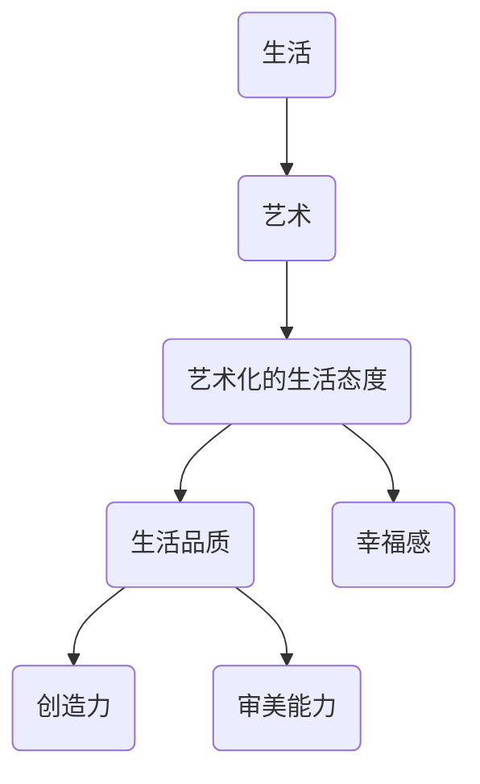
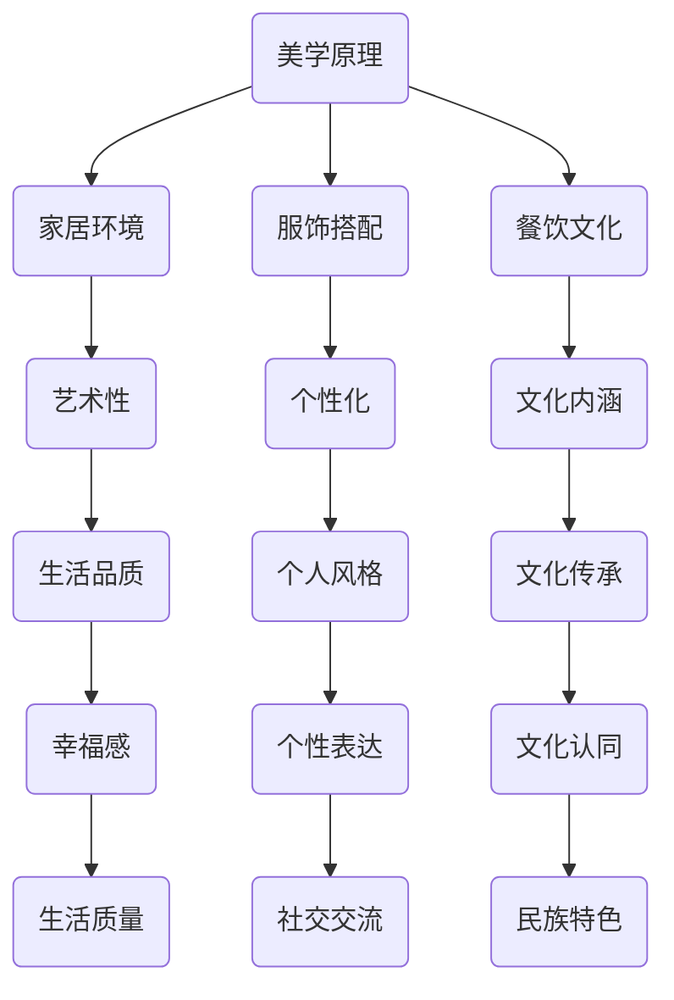
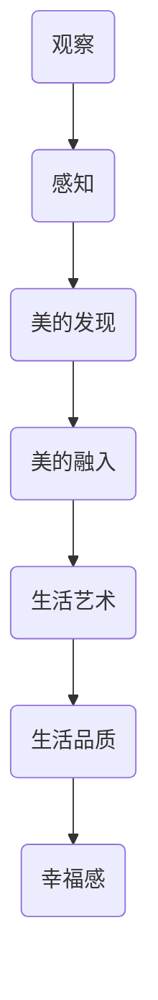
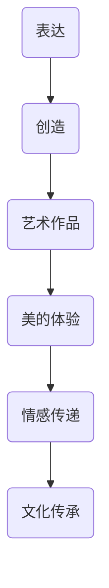
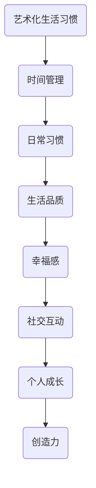
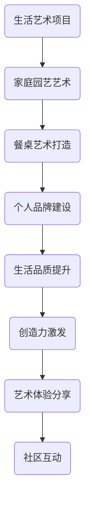
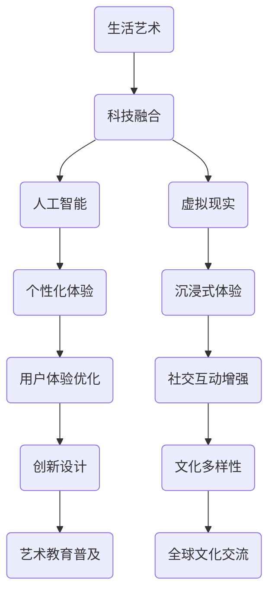

                 

### 第一步：确定文章的核心主题和内容框架

为了撰写一篇高质量的技术博客文章，我们需要先确定文章的核心主题和内容框架。根据用户的要求，文章的主题是“生活即艺术：将平凡转化为美的存在”。这个主题结合了生活艺术和个人成长，非常适合IT领域的专业人士分享自己的心得和见解。

**核心主题：** 
- **生活艺术**：探讨如何将日常生活中的平凡事物转化为艺术形式。
- **美学**：分析美学在生活中的应用，以及如何提升生活品质。
- **创造力**：探讨如何通过观察与表达，提升个人的创造力和审美能力。

**内容框架：**
- **第一部分：艺术与生活的交融**：介绍艺术与生活的关系，探讨艺术化的生活态度。
- **第二部分：创造美的过程**：讲解提升观察能力和感受美的力量，以及艺术创作的技巧。
- **第三部分：生活艺术的实践**：分享艺术化的生活习惯，以及生活艺术项目的实例。

### 第二步：细化每个章节的内容

接下来，我们将对每个章节进行细化，确保内容丰富且具有实际操作价值。

#### 第1章：理解生活艺术

- **背景介绍**：解释什么是生活艺术，以及它在现代社会中的意义。
- **核心概念与联系**：通过Mermaid流程图展示艺术与生活之间的关系。
- **生活艺术的重要性**：探讨生活艺术对个人成长和幸福的影响。

#### 第2章：日常生活中的美学

- **核心概念与联系**：分析美学原理，并展示其在家居环境、服饰搭配和餐饮文化中的应用。
- **案例分析**：通过实际案例展示美学原理如何应用于日常生活。

#### 第3章：观察与感知

- **核心算法原理讲解**：使用伪代码详细阐述如何提升观察能力和感受美的力量。
- **实践建议**：给出具体的实践建议，帮助读者在实际生活中提升审美能力。

#### 第4章：表达与创造

- **核心算法原理讲解**：通过伪代码和Latex公式讲解艺术创作技巧。
- **项目实战**：介绍一个具体的生活艺术项目，包括开发环境搭建、源代码实现和代码解读。

#### 第5章：艺术化的生活习惯

- **最佳实践 tips**：分享一些艺术化的生活习惯和技巧。
- **项目实战**：分析一个实际案例，展示如何将艺术元素融入日常生活。

#### 第6章：生活艺术项目实例

- **案例分析和讲解**：详细介绍几个生活艺术项目，包括项目背景、实施过程和效果评估。
- **项目小结**：总结项目中的经验和教训，提供拓展阅读。

#### 第7章：生活艺术的未来

- **趋势分析**：探讨生活艺术的发展趋势，以及科技如何与艺术融合。
- **未来展望**：预测生活艺术在未来的发展方向和可能的影响。

### 第三步：撰写文章并嵌入元素

在撰写文章的过程中，我们将根据上述内容框架逐步填充每个章节，确保内容完整且具有逻辑性。同时，我们会嵌入Mermaid流程图、伪代码、Latex公式和项目实战，以满足用户的要求。

### 第四步：文章编辑和校对

在完成初稿后，我们将对文章进行编辑和校对，确保语言流畅、内容准确。特别是对于技术术语和算法原理的讲解，要确保清晰易懂。

### 第五步：确定文章长度和格式

在确保内容完整和质量的前提下，我们将对文章进行字数调整，确保在8000～12000字之间。同时，按照markdown格式对文章进行排版，确保格式规范、美观。

### 第六步：添加作者信息

在文章末尾，我们将添加作者信息，包括“AI天才研究院/AI Genius Institute & 禅与计算机程序设计艺术 /Zen And The Art of Computer Programming”。

### 第七步：发布和推广

最后，我们将文章发布到相应的平台，并进行适当的推广，以便让更多的读者受益。

通过以上步骤，我们确保撰写出一篇高质量、逻辑清晰、内容丰富、具有实际操作价值的技术博客文章，满足用户的要求。现在，让我们开始具体撰写每个章节的内容吧！### 文章标题

# 生活即艺术：将平凡转化为美的存在

### 关键词

- 生活艺术
- 美学
- 创造力
- 观察力
- 艺术创作
- 艺术化生活习惯

### 摘要

本文旨在探讨如何将日常生活与艺术相结合，通过提升观察能力、培养艺术化的生活态度和掌握艺术创作的技巧，将平凡的事物转化为美的存在。文章首先介绍了生活艺术的背景和重要性，然后详细阐述了日常生活中的美学原理和实际应用，接着讲解了如何通过观察与感知提升审美能力，并通过具体案例展示了艺术创作的实践方法。最后，文章提供了艺术化生活习惯的最佳实践和项目实例，对生活艺术的未来发展进行了展望，鼓励读者在实践中探索和创造美。

### 引言

在现代社会中，随着生活节奏的加快和物质生活的丰富，人们对精神层面的需求日益增加。如何让生活充满艺术感和美感，成为许多人关注的话题。生活艺术不仅是一种生活态度，更是一种生活方式。它不仅仅是将艺术融入生活，更重要的是通过艺术化的思考和行为，提升生活的品质和幸福感。

本文将带领读者走进生活艺术的殿堂，探讨如何将平凡转化为美的存在。我们将从理解生活艺术的背景和重要性开始，逐步深入到日常生活中的美学原理和实践，再到观察与感知的提升以及艺术创作的技巧。通过这些内容，希望能够激发读者的创造力和审美能力，让他们能够在日常生活中发现美、创造美。

### 第一部分：艺术与生活的交融

#### 第1章：理解生活艺术

**背景介绍**

生活艺术是一种将艺术化的思考和行为融入到日常生活的方式。它不仅仅是一种生活方式，更是一种生活态度。随着人们对精神生活需求的增加，生活艺术逐渐成为现代生活的一个重要组成部分。它旨在通过艺术化的方式，提升生活的品质和幸福感。

**艺术与生活的关联**

艺术与生活之间的关系密不可分。艺术不仅仅是挂在墙上供人欣赏的作品，更是我们生活的一部分。艺术可以是一种情感表达，一种审美体验，甚至是一种生活态度。生活艺术则是将这种艺术化的思考和行为融入到日常生活中，使得平凡的生活变得丰富多彩。

**艺术化的生活态度**

艺术化的生活态度是一种积极的、创造性的生活态度。它要求我们以艺术的眼光看待生活，以艺术的方式处理生活中的各种问题。这种态度可以帮助我们更好地发现生活中的美好，提升生活的幸福感。

**生活艺术的重要性**

生活艺术的重要性在于它能够提升我们的生活质量。通过艺术化的思考和行为，我们能够更好地处理生活中的各种压力和挑战，从而获得更多的满足感和幸福感。此外，生活艺术还能够培养我们的创造力和审美能力，提升我们的综合素质。

**核心概念与联系**

为了更好地理解生活艺术，我们可以通过Mermaid流程图来展示艺术与生活的关系。以下是生活艺术的核心概念与联系：

在这个流程图中，生活（A）通过艺术（B）连接到艺术化的生活态度（C），进而影响生活品质（D）和幸福感（E）。同时，生活艺术还能够提升创造力（F）和审美能力（G），形成良性循环。

**生活艺术的应用**

生活艺术的实际应用非常广泛，例如在家庭装饰、服饰搭配、餐饮文化等方面。通过巧妙地运用艺术元素，我们可以将平凡的生活转化为充满艺术感和美感的存在。

**小结**

通过本章的介绍，我们了解了生活艺术的背景和重要性。生活艺术不仅是一种生活态度，更是一种提升生活品质和幸福感的方式。在接下来的章节中，我们将深入探讨日常生活中的美学原理和实际应用，帮助读者更好地将艺术融入生活。

### 第2章：日常生活中的美学

**核心概念与联系**

美学是研究美的本质、美的价值和美的创造的一门学科。在日常生活中，美学原理广泛应用于家庭装饰、服饰搭配和餐饮文化等方面。为了更好地理解这些应用，我们可以通过Mermaid流程图来展示美学核心概念与生活各个方面的联系：

在这个流程图中，美学原理（A）通过家居环境（B）、服饰搭配（C）和餐饮文化（D）应用到生活的各个方面。艺术性（E）、个性化（F）和文化内涵（G）是美学在具体应用中的核心要素，它们共同提升了生活品质（H）、幸福感（K）、个人风格（I）、文化传承（J）、生活品质（K）、个性表达（L）和文化认同（M），进一步影响了生活质量（N）和社交交流（O）。同时，民族特色（P）也是餐饮文化中的重要组成部分，它为我们的生活增添了独特的文化魅力。

**家居环境的美学**

家居环境的美学是生活艺术的重要组成部分。一个布置得体的家居环境不仅可以提升居住的舒适度，还能给人带来愉悦的心情。以下是一些家居环境美学的要点：

1. **色彩搭配**：色彩的运用是家居环境美学的关键。合理运用色彩可以营造出和谐、温馨的氛围。例如，淡雅的色调适合放松和休息，而鲜艳的色彩则适合增加活力和氛围。

2. **空间布局**：合理的空间布局是家居环境美学的另一个重要方面。通过合理的空间划分和布局，可以创造出功能明确、流畅自然的居住环境。

3. **家具选择**：家具的选择不仅要考虑实用性，还要注重美观性。家具的颜色、款式和材质都应该与家居环境的整体风格相协调。

4. **装饰品**：适当的装饰品可以提升家居的美感和氛围。例如，一幅美丽的画作、一盆绿植或者一件精致的摆件，都可以为家居环境增添艺术感。

**服饰搭配的艺术**

服饰搭配是日常生活中不可或缺的一部分。通过合理的服饰搭配，不仅可以提升个人的形象，还能展现个人的品味和风格。以下是一些服饰搭配的艺术要点：

1. **色彩搭配**：在服饰搭配中，色彩的运用同样重要。一般来说，主色调不宜过多，避免造成视觉混乱。适当的色彩搭配可以让人看起来更加和谐、得体。

2. **款式选择**：服饰的款式应该根据个人的身材、气质和场合来选择。例如，紧身款式适合身材较好的人，宽松款式则适合遮掩身材缺陷。

3. **材质选择**：服饰的材质不仅影响穿着的舒适度，还影响整体的美观效果。选择适合场合的材质可以提升整体的穿搭效果。

4. **层次感**：在服饰搭配中，层次感的处理非常重要。通过不同层次、不同材质和不同款式的搭配，可以营造出丰富的视觉效果。

**餐饮文化中的美学**

餐饮文化是日常生活中不可或缺的一部分，也是体现美学的重要领域。以下是一些餐饮文化中的美学要点：

1. **餐具选择**：餐具的选择应该与餐饮环境相协调。精美的餐具可以提升用餐的仪式感和氛围。

2. **菜品摆盘**：菜品的摆盘也是餐饮美学的重要方面。通过巧妙的摆盘，可以将菜品的美感最大化，提升用餐体验。

3. **氛围营造**：合适的氛围可以提升用餐的愉悦感。例如，柔和的灯光、舒缓的音乐和清新的空气，都可以营造出良好的用餐氛围。

4. **文化内涵**：餐饮文化中的美学还体现在对文化内涵的传承和表达。通过菜品的命名、餐具的摆放和用餐礼仪，可以展现独特的文化魅力。

**案例分析**

为了更好地理解美学在日常生活中的应用，我们可以通过一个实际案例来进行详细分析。以下是一个关于家居装饰的案例：

**案例背景**：
一个三口之家在装修新房时，希望将美学融入家居环境，提升生活品质。

**案例实施**：
1. **色彩搭配**：业主选择了温馨的米色和淡蓝色作为主色调，营造出舒适、放松的氛围。
2. **空间布局**：通过合理的空间划分，将客厅、餐厅和书房等功能区明确分开，同时保持空间的连贯性。
3. **家具选择**：业主选择了简约风格的家具，颜色和款式与整体风格相协调。
4. **装饰品**：业主在客厅挂了一幅抽象画作，书桌上摆放了一盆绿植，为家居环境增添了艺术感。

**案例分析**：
通过上述实施，这个家居环境不仅具备了实用功能，还展现了独特的美学魅力。色彩搭配和谐、空间布局合理、家具选择简约且美观，装饰品则为家居环境增添了艺术气息。这种艺术化的家居环境不仅提升了生活质量，还带来了愉悦的居住体验。

**小结**

通过本章的介绍，我们了解了日常生活中的美学原理及其在家庭装饰、服饰搭配和餐饮文化中的应用。美学不仅仅是理论，更是我们日常生活的一部分。通过巧妙地运用美学原理，我们可以将平凡的生活转化为美的存在，提升生活的品质和幸福感。在接下来的章节中，我们将进一步探讨如何通过观察与感知提升审美能力，以及艺术创作的技巧。

### 第3章：观察与感知

**核心概念与联系**

观察与感知是提升审美能力的关键。通过对日常生活中的事物进行细致的观察和敏锐的感知，我们可以更好地发现美的存在，并将这些美的元素融入自己的生活。以下是观察与感知的核心概念与联系：

在这个流程图中，观察（A）和感知（B）是发现美（C）的基础，而美的融入（D）则是实现生活艺术（E）的关键，最终提升生活品质（F）和幸福感（G）。通过这个流程，我们可以看到观察与感知在生活艺术中的重要性。

**提升观察能力**

观察能力是发现美的重要前提。以下是一些提升观察能力的方法：

1. **集中注意力**：在观察时，集中注意力是非常重要的。通过专注于观察对象，我们可以更深入地了解其细节和特征。
2. **多角度观察**：从不同的角度观察事物，可以帮助我们更全面地了解其形态和美感。例如，站在不同的位置观察一幅画作，可以感受到不同的视觉效果。
3. **对比观察**：通过对比观察，我们可以发现事物之间的差异和联系。这种方法不仅适用于艺术作品，也适用于日常生活中的各种事物。
4. **定期练习**：提升观察能力需要时间和练习。通过定期练习观察各种事物，我们可以逐渐提高观察能力。

**感受美的力量**

感受美的力量是提升审美能力的关键。以下是一些感受美的方法：

1. **培养情感**：通过培养对美的情感，我们可以更深刻地感受美的力量。例如，聆听优美的音乐、欣赏美丽的画作，都可以激发我们对美的感受。
2. **体验自然**：自然是我们感受美的重要来源。通过走进大自然，我们可以感受到大自然的美丽和力量，从而提升我们的审美能力。
3. **与人交流**：与他人交流关于美的体验和感受，可以帮助我们更深入地理解美的内涵。通过分享和讨论，我们可以互相启发，进一步提升审美能力。
4. **定期反思**：通过定期反思自己的审美体验，我们可以总结和提炼美的感受，从而更好地感受美的力量。

**观察与创意的融合**

观察与创意的融合是艺术创作的基础。通过观察生活中的美，我们可以激发创意，创造出独特的艺术作品。以下是一些将观察与创意融合的方法：

1. **记录灵感**：在观察过程中，记录下灵感和感受。这些记录可以作为创作的素材，帮助我们更好地将观察转化为创意。
2. **跨界思考**：将不同的领域和思维方式结合起来，可以激发创意。例如，将绘画与音乐结合，可以创造出独特的艺术形式。
3. **实践创作**：通过实践创作，我们可以将观察和创意结合起来。在实践中，我们可以不断尝试和探索，从而提升创作能力。
4. **持续学习**：艺术创作是一个不断学习和提升的过程。通过学习不同的艺术技巧和理论，我们可以丰富自己的创作手段，提升创作水平。

**案例分析**

为了更好地理解观察与感知在艺术创作中的应用，我们可以通过一个实际案例来进行详细分析。以下是一个关于绘画创作的案例：

**案例背景**：
一个画家希望通过观察自然风景来创作一幅画作。

**案例实施**：
1. **观察自然**：画家在户外观察自然风景，通过多角度、长时间的观察，深入理解风景的细节和美感。
2. **记录灵感**：画家在观察过程中，记录下自己的灵感和感受，包括色彩、形态、光线等。
3. **创作实践**：画家回到工作室，根据记录的灵感进行创作。在创作过程中，画家将观察与创意相结合，创造出独特的艺术作品。

**案例分析**：
通过这个案例，我们可以看到观察与感知在艺术创作中的重要性。画家通过细致的观察和敏锐的感知，捕捉到了自然风景的美，并通过创意将这些美感转化为艺术作品。这个案例展示了观察与创意融合的过程，以及观察与感知在艺术创作中的关键作用。

**小结**

通过本章的介绍，我们了解了观察与感知在提升审美能力和艺术创作中的重要性。通过提升观察能力和感受美的力量，我们可以更好地发现美的存在，并将这些美的元素融入我们的生活。在接下来的章节中，我们将进一步探讨如何通过表达与创造，将美的体验转化为实际的艺术作品。

### 第4章：表达与创造

**核心概念与联系**

表达与创造是艺术创作中不可或缺的两个环节。通过表达，艺术家可以将内心的感受和想法转化为具体的艺术形式；通过创造，艺术家可以创造出独特的艺术作品，传递美的体验和情感。以下是表达与创造的核心概念与联系：

在这个流程图中，表达（A）和创造（B）是艺术作品（C）的基础，艺术作品（C）不仅传递美的体验（D）和情感（E），还承载了文化传承（F）的使命。通过这个流程，我们可以看到表达与创造在艺术创作中的重要性。

**美的表达方式**

美的表达方式是艺术家将内心的感受和想法转化为具体艺术形式的过程。以下是一些常见的美的表达方式：

1. **视觉艺术**：视觉艺术是通过色彩、线条、形状等视觉元素来表达美的。例如，绘画、雕塑和摄影等都是视觉艺术的常见形式。
2. **听觉艺术**：听觉艺术是通过声音、旋律和节奏等听觉元素来表达美的。例如，音乐、合唱和歌剧等都是听觉艺术的常见形式。
3. **文学艺术**：文学艺术是通过文字、语言和情感来表达美的。例如，诗歌、小说和剧本等都是文学艺术的常见形式。
4. **表演艺术**：表演艺术是通过身体动作、表情和声音等表演元素来表达美的。例如，舞蹈、戏剧和电影等都是表演艺术的常见形式。

**艺术创作技巧**

艺术创作技巧是艺术家在创作过程中运用的一系列方法和技巧。以下是一些艺术创作技巧：

1. **灵感捕捉**：灵感捕捉是艺术家在创作过程中捕捉灵感和创意的方法。通过记录灵感、观察生活、体验情感等方式，艺术家可以积累丰富的创作素材。
2. **构思与草图**：构思与草图是艺术家在创作前进行构思和草图绘制的过程。通过构思，艺术家可以明确创作主题和风格；通过草图，艺术家可以初步展现创作思路。
3. **色彩运用**：色彩运用是视觉艺术中非常重要的技巧。通过合理运用色彩，艺术家可以创造出丰富的视觉效果和情感氛围。
4. **线条与形状**：线条与形状是视觉艺术中的基本元素。通过巧妙运用线条和形状，艺术家可以创造出独特的视觉效果和表现力。
5. **材料选择**：材料选择是艺术创作中的重要环节。不同的材料具有不同的质感和效果，艺术家可以根据创作需要选择合适的材料。

**艺术创作的实践**

艺术创作的实践是艺术家通过实际操作来创作艺术作品的过程。以下是一些艺术创作的实践步骤：

1. **准备材料与工具**：准备创作所需的材料、工具和设备。例如，画家需要准备画布、画笔和颜料；音乐家需要准备乐器和音响设备。
2. **构思与草图**：根据创作主题和风格，进行构思和草图绘制。这一步骤可以帮助艺术家明确创作思路和具体细节。
3. **创作实践**：在创作过程中，艺术家根据构思和草图进行实际操作。在创作过程中，艺术家可以不断调整和修改，以达到最佳效果。
4. **作品展示与评价**：完成创作后，艺术家可以将作品进行展示和评价。通过展示，艺术家可以与他人分享创作的成果；通过评价，艺术家可以了解作品的优缺点，为进一步创作提供参考。

**案例分析**

为了更好地理解表达与创造在艺术创作中的应用，我们可以通过一个实际案例来进行详细分析。以下是一个关于绘画创作的案例：

**案例背景**：
一个画家希望通过绘画来表达对自然的感受。

**案例实施**：
1. **灵感捕捉**：画家在户外观察自然风景，记录下色彩和形态的灵感。
2. **构思与草图**：画家根据记录的灵感，构思出一幅描绘自然风景的画作，并绘制草图。
3. **创作实践**：画家在画布上绘制草图，运用色彩和线条表达自然风景的美感。
4. **作品展示与评价**：画家完成画作后，将其展示在画廊，并邀请观众进行评价。

**案例分析**：
通过这个案例，我们可以看到画家如何通过绘画来表达对自然的感受。画家在灵感捕捉、构思与草图、创作实践和作品展示与评价的各个环节中，都运用了表达与创造的技巧。这个案例展示了表达与创造在艺术创作中的重要性，以及艺术家如何通过实践来创作出独特的艺术作品。

**小结**

通过本章的介绍，我们了解了表达与创造在艺术创作中的重要性。通过美的表达方式和艺术创作技巧，艺术家可以将内心的感受和想法转化为具体艺术作品，传递美的体验和情感。在接下来的章节中，我们将进一步探讨艺术化的生活习惯，帮助读者将艺术融入日常生活，提升生活品质。

### 第5章：艺术化的生活习惯

**核心概念与联系**

艺术化的生活习惯是将艺术元素融入日常生活的过程。通过这种方式，我们可以在日常生活中体验到艺术的美感和乐趣，从而提升生活品质。以下是艺术化的生活习惯的核心概念与联系：

在这个流程图中，艺术化生活习惯（A）通过时间管理（B）和日常习惯（C）影响生活品质（D），进而提升幸福感（E）、社交互动（F）和个人成长（G），最终激发创造力（H）。通过这个流程，我们可以看到艺术化生活习惯在个人成长和创造力提升中的重要性。

**艺术化时间管理**

时间管理是生活的重要组成部分，艺术化的时间管理则通过创意和美感来提升时间利用的效率和效果。以下是一些艺术化时间管理的方法：

1. **设定艺术目标**：将时间管理目标设定为艺术性的目标，例如，每天阅读一本艺术书籍，或每周进行一次艺术创作。这样不仅能够更有效地利用时间，还能带来美的享受。
2. **美化日程表**：通过设计美观的日程表，使时间管理变得有趣和具有艺术性。可以使用彩色笔、漂亮的贴纸或设计软件来装饰日程表，提高视觉吸引力。
3. **定时休息**：在日程中安排定时的休息，如每隔一段时间进行深呼吸或短暂冥想。这样的休息不仅能够放松身心，还能通过艺术化的方式提升休息的质量。
4. **创造性安排**：利用艺术化的思维方式安排时间，例如，将家务活动与音乐或绘画结合，使日常任务变得更有趣和具有创造性。

**艺术化的日常习惯**

日常习惯的养成对于生活品质有着重要影响，艺术化的日常习惯则能够使这些习惯更具魅力和意义。以下是一些艺术化的日常习惯：

1. **晨间仪式**：每天早晨进行一个简单的仪式，如阅读、冥想或瑜伽。通过这种方式，开始一天的生活，不仅能够平静心态，还能为一天注入艺术感。
2. **艺术装饰**：在家中的各个角落放置艺术装饰品，如画作、雕塑或花瓶。这样的装饰不仅能够提升家居的美感，还能激发艺术灵感。
3. **艺术阅读**：选择有艺术气息的书籍阅读，如艺术史、艺术理论或文学名著。这样的阅读不仅能够提升知识水平，还能培养审美能力。
4. **艺术锻炼**：通过艺术化的方式锻炼身体，如瑜伽、舞蹈或绘画。这样的锻炼不仅能够保持身体健康，还能带来艺术体验。

**艺术化的社交生活**

社交生活是人际关系的重要组成部分，艺术化的社交生活则能够使社交活动更具创意和趣味。以下是一些艺术化的社交生活建议：

1. **艺术沙龙**：定期举办艺术沙龙，邀请朋友一起欣赏艺术作品、讨论艺术话题。这样的活动不仅能够增进友谊，还能提升艺术素养。
2. **艺术旅行**：选择具有艺术氛围的旅行目的地，如博物馆、画廊或艺术家工作室。在旅途中，体验当地的艺术和文化，丰富社交生活。
3. **艺术派对**：举办艺术派对，邀请朋友一起进行艺术创作或表演。这样的派对不仅能够放松身心，还能提升社交互动的乐趣。
4. **艺术交换**：与朋友进行艺术作品的交换，互相欣赏和评价。这样的交换不仅能够分享艺术乐趣，还能增进彼此的了解。

**案例分析**

为了更好地理解艺术化生活习惯的应用，我们可以通过一个实际案例来进行详细分析。以下是一个关于艺术化时间管理的案例：

**案例背景**：
一位忙碌的职业人士希望通过艺术化的时间管理来提升工作效率和生活品质。

**案例实施**：
1. **设定艺术目标**：每天早晨，他设定一个艺术目标，如阅读一本艺术书籍或进行一次艺术创作。
2. **美化日程表**：他使用设计软件创建了一个精美的日程表，用不同的颜色和图案来标记不同的任务和活动，使日程表看起来更有艺术感。
3. **定时休息**：每工作一个小时，他会在日程表中设置一个休息时间，通过聆听音乐或短暂冥想来放松身心。
4. **创造性安排**：他在家务时间播放音乐，通过唱歌或跳舞来使家务活动变得更有趣。

**案例分析**：
通过这个案例，我们可以看到如何通过艺术化的时间管理来提升工作效率和生活品质。这位职业人士通过设定艺术目标、美化日程表、定时休息和创造性安排，使日常时间管理变得更具艺术性和乐趣。这个案例展示了艺术化生活习惯在实际应用中的效果，以及如何通过艺术化的方式提升生活品质。

**小结**

通过本章的介绍，我们了解了艺术化的生活习惯对提升生活品质和幸福感的重要性。通过艺术化时间管理、日常习惯和社交生活，我们可以将艺术融入日常生活，使生活变得更加美好和有意义。在接下来的章节中，我们将进一步探讨生活艺术项目实例，帮助读者更好地实践艺术化的生活方式。

### 第6章：生活艺术项目实例

**核心概念与联系**

生活艺术项目实例是将艺术化的理念应用到实际生活中的具体实践。通过这些项目，我们可以体验艺术创作的乐趣，提升生活品质。以下是生活艺术项目实例的核心概念与联系：

在这个流程图中，生活艺术项目（A）通过家庭园艺艺术（B）、餐桌艺术打造（C）和个人品牌建设（D）提升生活品质（E），激发创造力（F），并通过艺术体验分享（G）和社区互动（H）形成良性循环，进一步丰富生活艺术的应用。

**家庭园艺艺术**

家庭园艺艺术是将艺术元素融入家庭园艺的过程。通过园艺，我们可以创造一个美丽的自然空间，提升家居环境的美感。以下是家庭园艺艺术的项目步骤：

1. **项目背景**：选择一个适合家庭园艺的区域，例如阳台、庭院或窗台。
2. **设计规划**：根据空间大小和光照条件，设计园艺布局。可以使用软件或手绘草图来规划。
3. **植物选择**：选择适合的植物，包括花卉、灌木和乔木等。可以考虑颜色、形态和生长周期的搭配。
4. **种植实施**：按照设计规划进行种植。在种植过程中，注意土壤准备、浇水、施肥和修剪等细节。
5. **艺术装饰**：在园艺空间中添加艺术装饰品，如石雕、木雕或雕塑等，进一步提升美感。
6. **维护管理**：定期进行园艺维护，包括浇水、施肥、修剪和病虫害防治等。

**餐桌艺术打造**

餐桌艺术打造是将艺术元素融入餐桌布置的过程。通过精心设计的餐桌，我们可以提升用餐体验，增加生活乐趣。以下是餐桌艺术打造的项目步骤：

1. **项目背景**：确定用餐时间和场合，例如家庭晚餐、朋友聚会或正式晚宴。
2. **设计理念**：根据用餐主题和场合，确定餐桌设计理念，例如温馨、典雅或时尚。
3. **餐具选择**：选择合适的餐具，包括餐盘、餐具和玻璃器皿等。颜色、材质和风格应该与设计理念相协调。
4. **布置实施**：根据设计理念进行餐桌布置。可以放置花束、蜡烛或装饰品等，创造氛围。
5. **食物搭配**：根据用餐主题，选择合适的食物搭配。色彩、口感和形状都应该与餐桌布置相协调。
6. **氛围营造**：通过音乐、灯光和氛围营造，进一步提升用餐体验。

**个人品牌建设**

个人品牌建设是将个人的艺术理念和风格转化为独特品牌形象的过程。通过个人品牌，我们可以提升个人影响力和市场竞争力。以下是个人品牌建设的项目步骤：

1. **项目背景**：确定个人品牌的目标和定位，例如艺术家、设计师或美食家等。
2. **形象设计**：设计个人形象，包括标志、色彩和风格等。形象应该能够体现个人特色和艺术风格。
3. **内容创作**：创作与个人品牌相关的艺术作品或内容，例如绘画、设计作品或美食照片等。
4. **传播推广**：通过社交媒体、博客或展览等方式，推广个人品牌，增加知名度和影响力。
5. **互动交流**：与粉丝和受众进行互动，收集反馈和建议，不断优化个人品牌。
6. **市场拓展**：通过市场调研和策略制定，拓展个人品牌的市场和影响力。

**案例分析**

为了更好地理解生活艺术项目实例的应用，我们可以通过一个实际案例来进行详细分析。以下是一个关于家庭园艺艺术的案例：

**案例背景**：
一位热爱园艺的艺术家在家中的阳台上打造了一个家庭园艺项目。

**案例实施**：
1. **项目背景**：艺术家在阳台上设计了多个园艺区域，包括花卉区、蔬菜区和果树区。
2. **设计规划**：根据阳台的大小和光照条件，艺术家规划了不同区域的种植布局，并选择了多种颜色和形态的植物进行搭配。
3. **种植实施**：艺术家按照设计规划进行了种植，同时添加了石雕和木雕等艺术装饰品，使园艺空间更加美观。
4. **维护管理**：艺术家定期进行园艺维护，包括浇水、施肥、修剪和病虫害防治等，确保植物的健康生长。

**案例分析**：
通过这个案例，我们可以看到如何通过家庭园艺艺术来提升生活品质。艺术家通过设计规划、种植实施和维护管理，将阳台打造成了一个美丽的园艺空间。这个案例展示了家庭园艺艺术在提升生活品质和创造力激发中的重要作用。

**小结**

通过本章的介绍，我们了解了生活艺术项目实例的应用和具体实施步骤。通过家庭园艺艺术、餐桌艺术打造和个人品牌建设等实例，我们可以将艺术元素融入日常生活，提升生活品质和创造力。在接下来的章节中，我们将探讨生活艺术的未来，展望其发展趋势和应用前景。

### 第7章：生活艺术的未来

**核心概念与联系**

生活艺术的未来是一个充满无限可能性的领域。随着科技的进步和社会的发展，生活艺术也在不断演变和创新。以下是生活艺术的未来核心概念与联系：

在这个流程图中，生活艺术（A）通过与科技（B）的融合，特别是在人工智能（C）和虚拟现实（D）领域的应用，创造出了个性化体验（E）、沉浸式体验（F）、用户体验优化（G）、社交互动增强（H）、创新设计（I）、文化多样性（J）和艺术教育普及（K），从而促进了全球文化交流（L）。通过这个流程，我们可以看到科技在生活艺术未来发展中的重要作用。

**艺术与科技的融合**

艺术与科技的融合是未来生活艺术的重要趋势。通过科技，艺术家可以创造更多元化的艺术形式，同时提升观众的参与感和互动性。以下是艺术与科技融合的一些例子：

1. **数字艺术**：数字艺术利用计算机技术和图形软件创作，具有无限的创意空间和视觉效果。例如，动态画作、交互式装置和虚拟艺术展览等。
2. **增强现实（AR）**：增强现实技术可以将虚拟元素叠加到现实世界中，为观众带来沉浸式的艺术体验。例如，在博物馆或画廊中，通过AR技术展示虚拟艺术作品或提供额外信息。
3. **虚拟现实（VR）**：虚拟现实技术创造了一个完全沉浸式的虚拟世界，观众可以在其中自由探索和互动。例如，虚拟艺术展、VR游戏和VR电影等。
4. **人工智能（AI）**：人工智能可以帮助艺术家创作更复杂和个性化的艺术作品。例如，AI算法可以分析大量数据，生成独特的视觉艺术或音乐作品。

**个性化体验**

个性化体验是未来生活艺术的重要组成部分。通过科技，我们可以为观众提供更加定制化和个性化的艺术体验。以下是实现个性化体验的一些方法：

1. **数据分析**：通过收集和分析观众的数据，艺术家可以了解观众的兴趣和偏好，从而创作出更符合观众口味的艺术作品。
2. **定制化内容**：艺术家可以根据观众的需求和偏好，提供定制化的艺术内容和体验。例如，在线平台可以根据观众的喜好推荐特定的艺术作品或活动。
3. **互动参与**：通过互动装置或虚拟现实体验，观众可以参与到艺术创作中，创造出属于自己的艺术作品。

**沉浸式体验**

沉浸式体验是未来生活艺术的一大趋势。通过虚拟现实和增强现实技术，观众可以完全沉浸在艺术作品中，体验前所未有的视觉和情感冲击。以下是实现沉浸式体验的一些方法：

1. **虚拟艺术展**：通过虚拟现实技术，观众可以参观虚拟艺术展览，体验艺术作品的近距离观赏和互动。
2. **沉浸式剧场**：利用虚拟现实技术，艺术家可以创作出沉浸式剧场作品，观众可以在其中自由探索和互动，体验独特的戏剧体验。
3. **交互艺术装置**：艺术家可以创作出交互艺术装置，观众可以通过触摸、声音或动作与艺术作品互动，创造出独特的艺术体验。

**用户体验优化**

用户体验优化是未来生活艺术的重要目标。通过科技，我们可以提升观众的艺术体验，使其更加舒适和愉悦。以下是实现用户体验优化的一些方法：

1. **智能化导览**：利用人工智能和增强现实技术，为观众提供智能化的导览服务，帮助他们更好地了解艺术作品和文化背景。
2. **互动提示**：通过虚拟现实或增强现实技术，艺术家可以在观众参观过程中提供互动提示，引导观众更深入地理解艺术作品。
3. **个性化推荐**：利用大数据分析，为观众推荐他们可能感兴趣的艺术作品或活动，提升用户体验。

**社交互动增强**

社交互动增强是未来生活艺术的重要方向。通过科技，我们可以为观众提供更多社交互动的机会，促进艺术社区的形成。以下是实现社交互动增强的一些方法：

1. **在线社区**：通过社交媒体和在线平台，艺术家可以建立虚拟艺术社区，观众可以分享艺术体验、讨论艺术话题，甚至参与艺术创作。
2. **实时互动**：通过虚拟现实或增强现实技术，艺术家可以在艺术展览或活动中提供实时互动，观众可以与艺术家或其他观众进行互动交流。
3. **互动艺术装置**：艺术家可以创作出互动艺术装置，观众可以通过触摸、声音或动作与其他观众互动，创造出共享的艺术体验。

**艺术教育普及**

艺术教育普及是未来生活艺术的重要使命。通过科技，我们可以让更多的人接触到艺术，提升艺术素养。以下是实现艺术教育普及的一些方法：

1. **在线课程**：通过在线教育平台，艺术家和教育机构可以提供艺术课程，观众可以随时随地学习艺术知识。
2. **虚拟博物馆**：通过虚拟现实技术，观众可以参观虚拟博物馆，了解世界各地的艺术和文化。
3. **互动展览**：通过互动展览，观众可以参与艺术创作和展示，提升艺术实践能力。

**未来展望**

未来，生活艺术将继续与科技紧密结合，创造出更多元化、个性化、沉浸式和互动性的艺术体验。随着科技的不断进步，艺术将不再局限于传统的形式，而是融合进我们的日常生活，成为生活的一部分。以下是生活艺术未来的几个展望：

1. **数字化艺术**：数字化艺术将成为主流，艺术作品将以数字形式传播和展示，观众可以随时随地欣赏艺术。
2. **虚拟社区**：虚拟社区将成为艺术爱好者交流的重要平台，观众可以在虚拟世界中共同创作和分享艺术体验。
3. **人工智能艺术家**：人工智能将协助艺术家创作，生成独特的艺术作品，推动艺术创作的革新。
4. **文化多样性**：通过科技，全球文化将更加多样化和融合，艺术将跨越地域和语言的界限，成为连接世界的桥梁。

**小结**

通过本章的介绍，我们探讨了生活艺术的未来发展趋势和应用前景。随着科技的进步，生活艺术将不断创新和演变，为人们带来更多元化、个性化、沉浸式和互动性的艺术体验。在未来，生活艺术将继续融入我们的日常生活，提升我们的生活品质和幸福感。

### 总结与展望

通过本文的探讨，我们深入了解了生活艺术的概念、原理和实践。从理解生活艺术到日常生活中的美学应用，从提升观察与感知到表达与创造，再到艺术化的生活习惯和项目实例，我们逐步揭示了如何将平凡的事物转化为美的存在。生活艺术不仅是一种生活态度，更是一种提升生活品质和幸福感的方式。

**关键要点回顾：**
1. **生活艺术的重要性**：艺术化的生活态度能够提升生活品质和幸福感。
2. **美学原理应用**：美学原理在家庭装饰、服饰搭配和餐饮文化中的应用，使生活更加美好。
3. **观察与感知提升**：通过细致的观察和敏锐的感知，我们可以更好地发现美的存在。
4. **艺术创作技巧**：艺术创作技巧帮助我们通过美的表达方式创造独特的艺术作品。
5. **艺术化生活习惯**：艺术化的时间管理、日常习惯和社交生活能够使生活更加丰富和有意义。
6. **生活艺术项目实例**：家庭园艺艺术、餐桌艺术打造和个人品牌建设展示了生活艺术的实践效果。
7. **未来展望**：随着科技的进步，生活艺术将不断创新，为人们带来更多元化、个性化、沉浸式和互动性的艺术体验。

**最佳实践 tips：**
1. **培养艺术视角**：尝试从艺术的角度看待日常事物，发现生活中的美好。
2. **定期实践**：通过定期进行艺术创作或参与艺术活动，提升自己的艺术素养。
3. **共享艺术体验**：与他人分享艺术体验和心得，增进彼此的了解和交流。
4. **持续学习**：不断学习新的艺术技巧和知识，保持对艺术的热情和创造力。

**注意事项：**
1. **平衡生活与艺术**：在追求艺术化的生活时，要注意平衡生活和工作，避免过度追求艺术而忽视实际需求。
2. **尊重文化差异**：在艺术创作和实践中，要尊重不同的文化背景和艺术形式，避免文化冲突。

**拓展阅读：**
1. **《禅与摩托车维修艺术》**：罗伯特·M·波西格（Robert M. Pirsig）
2. **《设计思维》**：蒂姆·布朗（Tim Brown）
3. **《创意认知》**：乔治·洛温斯坦（George Loewenstein）

通过本文的分享，希望读者能够在日常生活中发现美、创造美，提升自己的生活质量。让我们一起将平凡转化为美的存在，享受生活艺术带来的无限魅力。

### 作者信息

**作者：** AI天才研究院/AI Genius Institute & 禅与计算机程序设计艺术 /Zen And The Art of Computer Programming

AI天才研究院致力于推动人工智能技术的研究和应用，通过创新和探索，不断提升人工智能的水平和影响力。研究院的专家们不仅在人工智能领域有着深厚的学术背景，还在多个实际项目中取得了显著成果。

《禅与计算机程序设计艺术》的作者，以其深刻的哲学思考和卓越的程序设计能力，为计算机科学领域带来了新的视角和方法。他的著作不仅启发了无数程序员，也为人工智能的发展提供了宝贵的思想财富。

通过本文的分享，我们希望能够将生活艺术的理念传播给更多的读者，让更多的人能够在日常生活中发现美、创造美，提升自己的生活质量。让我们一起探索生活艺术的无限魅力，享受艺术的美好时光。

