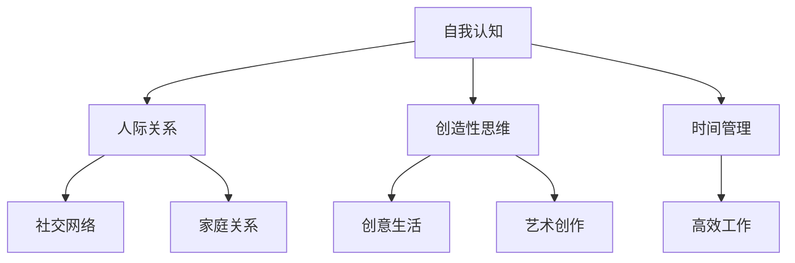
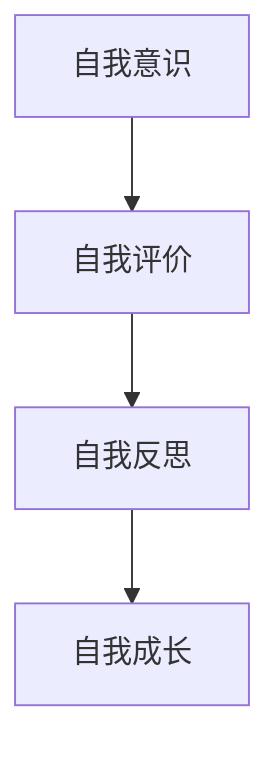
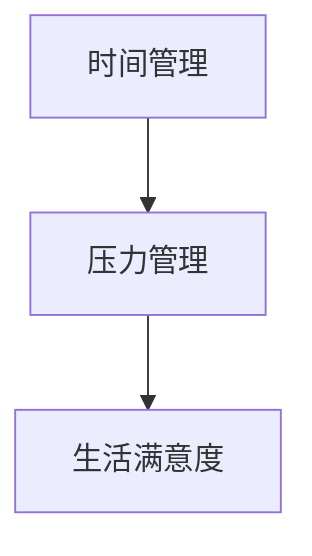
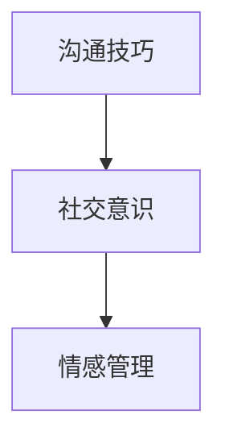
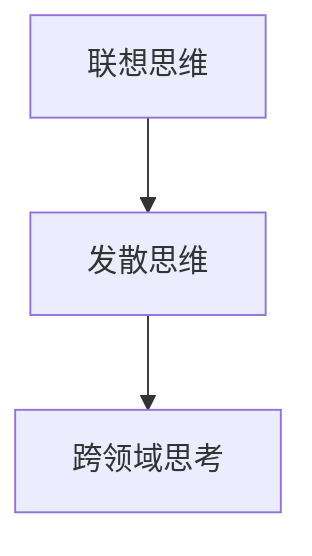
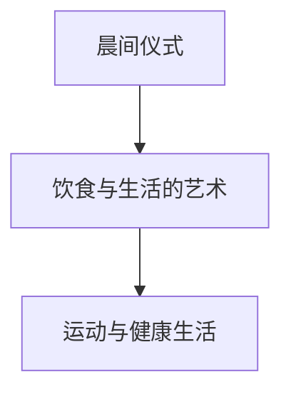
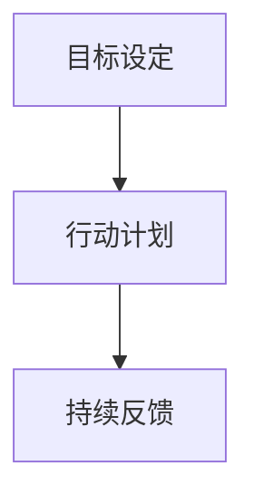
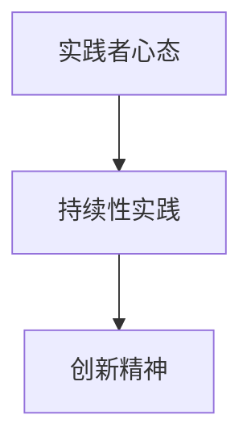

                 

### 文章标题：生活的艺术：将平凡转化为意义

> 关键词：生活艺术、平凡生活、意义转化、自我认知、人际交往、创造性思维

> 摘要：本文通过深入探讨“生活的艺术”，引导读者发现并把握生活中的每一个细节，将平凡转化为有意义的体验。文章将围绕自我认知、工作与生活平衡、人际交往和创造性思维等核心主题，提出具体的实践方法和技巧，旨在帮助读者在日常生活中找到更多的乐趣和满足感。

### 引言：生活的艺术，我们的追求

在快速发展的现代社会中，我们似乎总是在追求更多的物质财富和更高的社会地位，然而，这样的追求往往让我们忽视了生活中的艺术。生活的艺术并非遥不可及，它就藏在我们的日常琐碎中，等待着我们去发现和创造。

生活中的艺术，是一种对平凡事物的不懈追求和精心打磨。它体现在我们如何对待每一次晨曦、如何与家人朋友相处、如何在忙碌的工作中找到乐趣，以及如何在平淡的日常生活中寻找创意。生活的艺术，是一种生活的态度，更是一种生活的方式。

本文将带领读者走进生活的艺术，探索如何将平凡转化为意义。我们将从自我认知、工作与生活平衡、人际交往和创造性思维等四个方面展开讨论，旨在为读者提供实用的技巧和深刻的思考，帮助大家找到生活中的艺术之美。

### 第一章：生活的艺术概述

#### 背景介绍

生活的艺术是一个古老而又永恒的话题。自古以来，人们就在不断地探索如何过上更加有意义和丰富的生活。从古希腊哲学家苏格拉底提倡的“认识自己”，到中国古代儒家学说中的“修身齐家治国平天下”，生活的艺术始终是人类智慧的结晶。

然而，在现代社会，随着生活节奏的加快和竞争的加剧，许多人陷入了忙碌和焦虑之中，忽视了生活的艺术。工作和生活的压力使人们变得麻木，对平凡的生活失去了热情。然而，生活的艺术恰恰是让平凡变得非凡的关键。

#### 核心概念与联系

生活的艺术涉及多个核心概念，包括自我认知、人际关系、创造性思维和时间管理。这些概念之间相互联系，共同构成了生活的艺术。

1. **自我认知**：自我认知是生活的艺术的基础。只有当我们真正了解自己，才能找到自己的兴趣和激情，才能在工作和生活中找到平衡。

2. **人际关系**：人是社会的动物，人际关系在我们的生活中扮演着重要角色。良好的沟通和人际交往能力可以帮助我们建立更加和谐的社会关系，从而提升生活的质量。

3. **创造性思维**：创造性思维是生活的艺术的重要组成部分。它让我们在平凡的事物中发现新奇和美好，让生活充满无限的可能。

4. **时间管理**：时间管理是生活的艺术的重要一环。合理规划时间，不仅能够提高工作效率，还能为我们的生活增添更多的乐趣。

#### Mermaid 流程图

下面是一个简化的 Mermaid 流程图，展示了这些核心概念之间的联系：

#### 核心算法原理讲解

为了更好地理解这些核心概念，我们可以将它们视为一系列算法，这些算法帮助我们在生活中做出更好的决策。

1. **自我认知算法**：这是一个递归过程，通过不断的自我反思和评估，逐步深入了解自己。

2. **人际关系算法**：这是一个复杂的网络算法，涉及到沟通、信任和共享。

3. **创造性思维算法**：这是一个启发式算法，通过联想、发散思维和跨领域思考，寻找新的解决方案。

4. **时间管理算法**：这是一个优化算法，通过优先级排序和资源分配，最大化时间的利用效率。

#### 数学模型和公式

为了量化这些概念，我们可以引入一些数学模型和公式。

1. **自我认知度模型**：用α表示自我认知度，α=1/S，其中S是自我认知的深度。

2. **人际关系满意度模型**：用β表示人际关系满意度，β=1/D，其中D是沟通的深度。

3. **创造性思维效率模型**：用γ表示创造性思维的效率，γ=1/F，其中F是思维的发散程度。

4. **时间管理效率模型**：用θ表示时间管理效率，θ=1/T，其中T是工作时间的长短。

#### 举例说明

假设一个人在自我认知、人际关系、创造性思维和时间管理方面都有所欠缺，我们可以通过以下步骤来提高这些方面的表现：

1. **自我认知**：每天花10分钟进行自我反思，记录自己的情绪和想法。

2. **人际关系**：每周与家人和朋友进行一次深入的沟通，分享彼此的生活。

3. **创造性思维**：每天阅读一篇不同领域的文章，进行跨领域思考。

4. **时间管理**：每天规划工作任务，确保工作与生活的平衡。

通过这些简单的实践，我们可以逐步提高自己的生活艺术水平，让平凡的生活变得更有意义。

### 第二章：培养自我认知

#### 背景介绍

自我认知是生活的艺术的基础。只有当我们真正了解自己，才能找到自己的兴趣和激情，才能在工作和生活中找到平衡。自我认知不仅仅是了解自己的优点和缺点，更是一种深刻的自我反思和自我探索。

在现代社会，人们往往因为忙碌和压力而忽视了自我认知。许多人过着“被生活推着走”的日子，缺乏对自身内心的探索和了解。然而，只有当我们真正了解自己，才能找到适合自己的生活方式和价值观。

#### 核心概念与联系

自我认知涉及多个核心概念，包括自我意识、自我评价、自我反思和自我成长。

1. **自我意识**：自我意识是自我认知的第一步。它涉及到对自己存在的认知，包括自己的身体、思想、情感和价值观。

2. **自我评价**：自我评价是对自我意识的进一步深化。它涉及到对自己行为和能力的评价，包括自我认可和自我批判。

3. **自我反思**：自我反思是一种自我认知的高级形式。它涉及到对自身经历和行为的深刻思考，从而更好地理解自己。

4. **自我成长**：自我成长是自我认知的最终目标。它涉及到通过自我反思和自我评价，不断改进和提升自己。

#### Mermaid 流程图

下面是一个简化的 Mermaid 流程图，展示了这些核心概念之间的联系：

#### 核心算法原理讲解

为了更好地理解这些核心概念，我们可以将它们视为一系列算法。

1. **自我意识算法**：这是一个基于数据的算法，通过收集和分析自身的情绪、行为和思考，建立自我意识。

2. **自我评价算法**：这是一个基于规则的算法，通过设定标准和规则，对自身的表现进行评价。

3. **自我反思算法**：这是一个基于反思的算法，通过自我对话和反思，深入理解自己的内心世界。

4. **自我成长算法**：这是一个基于迭代的算法，通过不断的自我反思和评价，逐步改进和提升自己。

#### 数学模型和公式

为了量化这些概念，我们可以引入一些数学模型和公式。

1. **自我认知度模型**：用α表示自我认知度，α=1/S，其中S是自我认知的深度。

2. **自我评价满意度模型**：用β表示自我评价满意度，β=1/D，其中D是自我评价的深度。

3. **自我反思深度模型**：用γ表示自我反思深度，γ=1/F，其中F是反思的频率。

4. **自我成长效率模型**：用θ表示自我成长效率，θ=1/T，其中T是自我成长的时间。

#### 举例说明

假设一个人想要提高自我认知度，他可以采取以下步骤：

1. **记录日常情绪**：每天记录自己的情绪变化，分析情绪背后的原因。

2. **反思行为和决策**：定期回顾自己的行为和决策，思考它们是否符合自己的价值观。

3. **设定自我成长目标**：设定短期和长期的自我成长目标，不断追求自我提升。

4. **寻求反馈**：向家人、朋友和同事寻求反馈，了解他们对自己行为的看法。

通过这些实践，这个人可以逐步提高自我认知度，从而更好地理解自己，找到适合自己的生活方式。

### 第三章：平衡工作与生活

#### 背景介绍

在现代社会，工作与生活的平衡成为了一个热门话题。随着工作压力的不断增加，许多人感到身心俱疲，生活失去了乐趣和意义。平衡工作与生活不仅是为了身体健康，更是为了心灵的满足和成长。

然而，工作与生活的平衡并非易事。许多人试图通过加班来提升工作效率，结果却导致身心健康问题。平衡工作与生活需要我们找到一种合理的方式，既能确保工作效率，又能享受生活的乐趣。

#### 核心概念与联系

平衡工作与生活涉及多个核心概念，包括时间管理、压力管理和生活满意度。

1. **时间管理**：时间管理是实现工作与生活平衡的关键。合理规划时间，确保工作与生活的有序进行，可以减轻压力，提高生活质量。

2. **压力管理**：压力管理是平衡工作与生活的另一个重要方面。学会应对压力，保持心理平衡，有助于提高工作效率和生活满意度。

3. **生活满意度**：生活满意度是衡量工作与生活平衡的重要指标。通过提升生活满意度，我们可以更好地享受生活，从而减轻工作压力。

#### Mermaid 流程图

下面是一个简化的 Mermaid 流程图，展示了这些核心概念之间的联系：

#### 核心算法原理讲解

为了更好地理解这些核心概念，我们可以将它们视为一系列算法。

1. **时间管理算法**：这是一个基于优先级排序的算法，通过设定任务优先级和合理规划时间，最大化工作效率。

2. **压力管理算法**：这是一个基于自我调节的算法，通过心理训练和放松技巧，减轻工作压力，保持心理平衡。

3. **生活满意度算法**：这是一个基于评估和反馈的算法，通过定期评估生活质量，获取反馈，不断改进和提升生活满意度。

#### 数学模型和公式

为了量化这些概念，我们可以引入一些数学模型和公式。

1. **时间管理效率模型**：用θ表示时间管理效率，θ=1/T，其中T是完成任务的时长。

2. **压力管理效率模型**：用σ表示压力管理效率，σ=1/P，其中P是感受到的压力。

3. **生活满意度模型**：用ρ表示生活满意度，ρ=1/S，其中S是生活质量。

#### 举例说明

假设一个人想要平衡工作与生活，他可以采取以下步骤：

1. **制定时间表**：制定详细的时间表，包括工作、休息和娱乐的时间。

2. **设定工作优先级**：根据工作的重要性和紧急性，设定工作优先级，确保高效完成工作任务。

3. **学会放松**：在工作之余，学会放松和减压，例如进行瑜伽、冥想或阅读。

4. **定期评估**：定期评估工作与生活的平衡情况，根据实际情况调整时间表和优先级。

通过这些实践，这个人可以逐步实现工作与生活的平衡，提高生活质量。

### 第四章：提升人际交往能力

#### 背景介绍

人际交往能力是生活的艺术中的重要组成部分。无论是在工作中还是生活中，良好的人际交往能力都能帮助我们建立和谐的社会关系，提高生活满意度。然而，在现代社会，许多人由于种种原因，往往忽视了人际交往能力的培养，导致社交困境和孤独感的增加。

提升人际交往能力不仅是为了更好地与他人沟通，更是为了在人际互动中找到自己的价值和定位。通过提升人际交往能力，我们可以更好地理解他人，建立深层次的人际关系，从而在社交中获得更多的支持和帮助。

#### 核心概念与联系

提升人际交往能力涉及多个核心概念，包括沟通技巧、社交意识和情感管理。

1. **沟通技巧**：沟通技巧是人际交往的基础。有效的沟通不仅能够帮助我们表达自己的观点和需求，还能帮助我们更好地理解他人。

2. **社交意识**：社交意识是指对社交情境和他人情感的理解和敏感度。具备良好的社交意识，可以帮助我们更好地适应社交环境，与他人建立融洽的关系。

3. **情感管理**：情感管理是人际交往中至关重要的一环。学会管理自己的情感，保持情绪稳定，有助于我们在社交中展现更好的自己。

#### Mermaid 流程图

下面是一个简化的 Mermaid 流程图，展示了这些核心概念之间的联系：

#### 核心算法原理讲解

为了更好地理解这些核心概念，我们可以将它们视为一系列算法。

1. **沟通技巧算法**：这是一个基于规则和技巧的算法，通过学习有效的沟通方法和技巧，提高沟通效率。

2. **社交意识算法**：这是一个基于情境感知的算法，通过分析社交情境和他人行为，提高对社交情境的敏感度。

3. **情感管理算法**：这是一个基于自我调节的算法，通过心理训练和情感控制，提高情感稳定性。

#### 数学模型和公式

为了量化这些概念，我们可以引入一些数学模型和公式。

1. **沟通效率模型**：用η表示沟通效率，η=1/C，其中C是沟通的清晰度和准确性。

2. **社交意识度模型**：用ι表示社交意识度，ι=1/R，其中R是对社交情境的理解深度。

3. **情感管理能力模型**：用λ表示情感管理能力，λ=1/E，其中E是情感稳定度。

#### 举例说明

假设一个人想要提升人际交往能力，他可以采取以下步骤：

1. **学习沟通技巧**：通过阅读书籍、参加课程或实际练习，学习有效的沟通方法和技巧。

2. **提高社交意识**：观察他人的行为和反应，提高对社交情境的敏感度。

3. **练习情感管理**：通过冥想、瑜伽或心理咨询等途径，提高情感稳定性。

4. **定期反思**：定期反思自己的社交行为和结果，找出改进的方向。

通过这些实践，这个人可以逐步提升人际交往能力，建立更加和谐的人际关系。

### 第五章：生活中的创造性思维

#### 背景介绍

创造性思维是生活的艺术中的重要组成部分。它不仅能够帮助我们在工作和生活中找到新的解决方案，还能让我们的生活充满无限的可能。然而，在现代社会，许多人由于种种原因，往往忽视了创造性思维的培养，导致思维僵化和生活乏味。

创造性思维不仅仅是发明创造，更是一种看待世界和解决问题的方式。它让我们在平凡的事物中发现新奇和美好，让生活变得更有意义。培养创造性思维不仅有助于提高我们的生活品质，还能激发我们的内在潜力，实现个人成长。

#### 核心概念与联系

生活中的创造性思维涉及多个核心概念，包括联想思维、发散思维和跨领域思考。

1. **联想思维**：联想思维是一种将看似无关的事物联系起来的思维方式。通过联想，我们可以发现新的观点和解决方案。

2. **发散思维**：发散思维是一种从一个中心点出发，向多个方向发散思考的思维方式。通过发散思维，我们可以探索更多的可能性。

3. **跨领域思考**：跨领域思考是一种将不同领域的知识、技术和方法结合起来，用于解决问题和创新的思维方式。通过跨领域思考，我们可以打破传统的思维框架，实现创新。

#### Mermaid 流程图

下面是一个简化的 Mermaid 流程图，展示了这些核心概念之间的联系：

#### 核心算法原理讲解

为了更好地理解这些核心概念，我们可以将它们视为一系列算法。

1. **联想思维算法**：这是一个基于关联规则的算法，通过分析事物之间的关联，发现新的联想。

2. **发散思维算法**：这是一个基于生成对抗网络的算法，通过从一个中心点出发，生成多个可能的解决方案。

3. **跨领域思考算法**：这是一个基于转移学习的算法，通过将不同领域的知识迁移到解决问题中，实现创新。

#### 数学模型和公式

为了量化这些概念，我们可以引入一些数学模型和公式。

1. **联想思维效率模型**：用ε表示联想思维效率，ε=1/L，其中L是联想的数量。

2. **发散思维效率模型**：用δ表示发散思维效率，δ=1/D，其中D是发散的广度。

3. **跨领域思考效率模型**：用η表示跨领域思考效率，η=1/F，其中F是创新的频率。

#### 举例说明

假设一个人想要培养创造性思维，他可以采取以下步骤：

1. **练习联想思维**：通过阅读、写作或绘画等途径，锻炼联想思维。

2. **进行发散思维训练**：定期进行思维导图练习，从一个主题出发，生成多个相关的想法。

3. **跨领域学习**：阅读不同领域的书籍，参加跨领域的讲座或研讨会。

4. **实践跨领域思考**：在实际问题解决中，尝试应用跨领域知识和方法。

通过这些实践，这个人可以逐步提升创造性思维，让生活充满新的活力和创意。

### 第六章：日常生活中的小实践

#### 背景介绍

日常生活中的小实践是培养生活艺术的重要途径。通过这些小实践，我们可以逐步提升自我认知、人际交往能力和创造性思维，让生活变得更加有意义和丰富。小实践不仅简单易行，而且可以在日常生活中随时进行，不需要太多的时间和精力投入。

#### 核心概念与联系

日常生活中的小实践涉及多个核心概念，包括晨间仪式、饮食与生活的艺术和运动与健康生活。

1. **晨间仪式**：晨间仪式是一种通过仪式化的行为来开启新一天的方式。它可以帮助我们建立一种积极的起床习惯，为一天的生活奠定良好的基础。

2. **饮食与生活的艺术**：饮食与生活的艺术涉及到如何通过健康的饮食习惯来提升生活质量。合理搭配饮食，不仅可以保持身体健康，还能提升我们的精神状态。

3. **运动与健康生活**：运动与健康生活是一种通过锻炼身体来提升生活质量的实践。定期进行适量的运动，不仅可以增强身体素质，还能减轻压力，提高生活质量。

#### Mermaid 流程图

下面是一个简化的 Mermaid 流程图，展示了这些核心概念之间的联系：

#### 核心算法原理讲解

为了更好地理解这些核心概念，我们可以将它们视为一系列算法。

1. **晨间仪式算法**：这是一个基于习惯养成的算法，通过重复仪式化的行为，建立一种积极的起床习惯。

2. **饮食与生活的艺术算法**：这是一个基于营养学原理的算法，通过合理搭配饮食，提升生活质量和身体健康。

3. **运动与健康生活算法**：这是一个基于运动生理学的算法，通过定期进行适量的运动，增强身体素质和减轻压力。

#### 数学模型和公式

为了量化这些概念，我们可以引入一些数学模型和公式。

1. **晨间仪式效果模型**：用α表示晨间仪式的效果，α=1/T，其中T是仪式的时间长度。

2. **饮食与生活的艺术效果模型**：用β表示饮食与生活的艺术的效果，β=1/N，其中N是饮食的种类和数量。

3. **运动与健康生活效果模型**：用γ表示运动与健康生活效果，γ=1/S，其中S是运动的时间长度。

#### 举例说明

假设一个人想要通过日常生活中的小实践提升生活艺术，他可以采取以下步骤：

1. **建立晨间仪式**：每天早上起床后，进行一系列仪式化的行为，如晨间冥想、阅读和规划一天的任务。

2. **合理搭配饮食**：每天注意饮食的均衡，确保摄入足够的蛋白质、维生素和矿物质。

3. **定期进行运动**：每周至少进行三次运动，如散步、跑步或瑜伽，以增强身体素质和减轻压力。

通过这些实践，这个人可以逐步提升日常生活的艺术水平，让生活变得更加有意义和丰富。

### 第七章：个人成长项目

#### 背景介绍

个人成长项目是培养生活艺术的重要途径之一。通过设定目标和实施具体的行动计划，个人可以逐步提升自我认知、人际交往能力和创造性思维。个人成长项目不仅有助于实现个人的成长和进步，还能为我们的生活带来更多的乐趣和意义。

#### 核心概念与联系

个人成长项目涉及多个核心概念，包括目标设定、行动计划和持续反馈。

1. **目标设定**：目标设定是个人成长项目的第一步。明确的目标可以帮助我们集中精力，制定具体的行动计划。

2. **行动计划**：行动计划是实现目标的详细步骤和方案。通过制定具体的行动计划，我们可以有条不紊地推进个人成长项目。

3. **持续反馈**：持续反馈是个人成长项目的重要一环。通过定期反馈，我们可以了解自己的进展，调整行动计划，确保目标的实现。

#### Mermaid 流程图

下面是一个简化的 Mermaid 流程图，展示了这些核心概念之间的联系：

#### 核心算法原理讲解

为了更好地理解这些核心概念，我们可以将它们视为一系列算法。

1. **目标设定算法**：这是一个基于目标管理的算法，通过设定SMART目标（具体、可衡量、可达成、相关和有时限），确保目标的明确和可实现。

2. **行动计划算法**：这是一个基于任务规划的算法，通过分解目标，制定具体的行动步骤和时间表，确保行动的有序和高效。

3. **持续反馈算法**：这是一个基于数据分析和优化的算法，通过收集和分析反馈数据，调整行动计划，优化成长路径。

#### 数学模型和公式

为了量化这些概念，我们可以引入一些数学模型和公式。

1. **目标达成率模型**：用ρ表示目标达成率，ρ=1/T，其中T是目标达成的时间。

2. **行动计划效率模型**：用θ表示行动计划效率，θ=1/S，其中S是完成行动步骤所需的时间。

3. **持续反馈效率模型**：用σ表示持续反馈效率，σ=1/R，其中R是反馈的频率。

#### 举例说明

假设一个人想要通过个人成长项目提升生活艺术，他可以采取以下步骤：

1. **设定目标**：设定具体的成长目标，如提升自我认知、改善人际交往能力或培养创造性思维。

2. **制定行动计划**：分解目标，制定具体的行动计划和时间表，如每天进行自我反思、每周与朋友交流或每月参加一次创意活动。

3. **实施行动计划**：按照行动计划执行，确保行动的有序和高效。

4. **定期反馈**：定期记录自己的进展，获取他人的反馈，调整行动计划，确保目标的实现。

通过这些实践，这个人可以逐步提升个人成长，实现生活艺术的提升。

### 第八章：生活的艺术与实践者

#### 背景介绍

生活的艺术不仅是一种理论，更是一种实践。通过前几章的探讨，我们了解了许多关于生活的艺术的理论和方法。然而，将这些理论转化为实际的生活实践，需要我们付诸行动，并从实践中不断学习和成长。

生活的艺术实践者是一群具有实践精神的人，他们通过不断尝试和反思，将生活的艺术融入到自己的日常生活中。他们不仅能够发现生活中的美好，还能通过创造性的思维和积极的态度，将平凡转化为非凡。

#### 核心概念与联系

生活的艺术与实践者涉及多个核心概念，包括实践者心态、持续性实践和创新精神。

1. **实践者心态**：实践者心态是一种勇于尝试、敢于失败的态度。它鼓励我们在实践中不断学习和成长，不畏困难，勇于挑战。

2. **持续性实践**：持续性实践是一种坚持和持久的态度。通过持续不断地实践，我们可以积累经验，提升技能，最终实现目标。

3. **创新精神**：创新精神是一种追求卓越、不断突破的精神。它鼓励我们在实践中寻找新的解决方案，不断创新和改进。

#### Mermaid 流程图

下面是一个简化的 Mermaid 流程图，展示了这些核心概念之间的联系：

#### 核心算法原理讲解

为了更好地理解这些核心概念，我们可以将它们视为一系列算法。

1. **实践者心态算法**：这是一个基于积极心理学的算法，通过培养积极的思维模式，提升实践者的心态。

2. **持续性实践算法**：这是一个基于时间管理和目标管理的算法，通过设定目标和规划时间，确保实践者的持续性实践。

3. **创新精神算法**：这是一个基于创新理论的算法，通过激发创意思维，推动实践者寻找新的解决方案。

#### 数学模型和公式

为了量化这些概念，我们可以引入一些数学模型和公式。

1. **实践者心态模型**：用α表示实践者心态，α=1/P，其中P是实践者的积极程度。

2. **持续性实践模型**：用β表示持续性实践，β=1/T，其中T是实践的时间长度。

3. **创新精神模型**：用γ表示创新精神，γ=1/I，其中I是创新的数量。

#### 举例说明

假设一个人想要成为生活的艺术实践者，他可以采取以下步骤：

1. **培养实践者心态**：通过积极思考和自我激励，培养积极的心态。

2. **设定实践目标**：设定具体的实践目标，如每天进行自我反思、每周与朋友交流或每月参加一次创意活动。

3. **实施持续性实践**：按照实践目标，持续不断地进行实践，不断积累经验和提升技能。

4. **激发创新精神**：通过跨领域学习、阅读创意书籍或参加创意工作坊，激发创新思维，寻找新的解决方案。

通过这些实践，这个人可以逐步成为生活的艺术实践者，提升自己的生活艺术水平。

### 结论：生活的艺术，一种终身追求

生活的艺术不仅仅是一种技能，更是一种态度和生活方式。通过自我认知、工作与生活平衡、人际交往和创造性思维的培养，我们可以将平凡的生活转化为有意义和丰富的体验。生活的艺术需要我们不断探索和实践，通过持续的学习和成长，不断提升自己的生活品质。

在追求生活的艺术的过程中，我们需要保持开放的心态，勇于尝试新的事物，不断挑战自我。同时，我们也要学会珍惜每一个平凡的瞬间，发现生活中的美好。只有这样，我们才能真正体会到生活的艺术，让生活变得更加有意义和精彩。

作者：AI天才研究院/AI Genius Institute & 禅与计算机程序设计艺术 /Zen And The Art of Computer Programming

通过这篇文章，我们希望能够引导读者走进生活的艺术，发现并创造属于自己的生活之美。无论你的生活现状如何，都不要忘记追求生活的艺术，让每一天都充满意义和快乐。让我们共同踏上这段美好的旅程，不断探索和创造生活的艺术。

