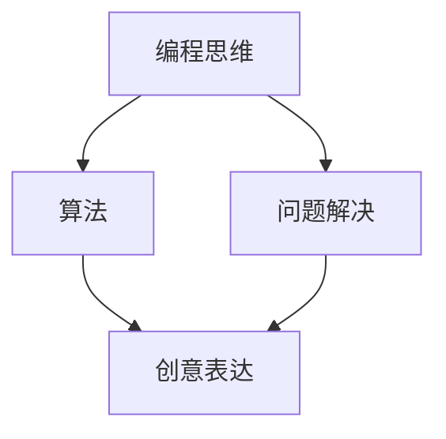

                 


# 引言

在现代社会，信息技术和人工智能迅猛发展，使得编程和算法成为不可或缺的技能。然而，如何将编程技巧应用于实际问题解决，尤其是在日常生活中，成为许多人面临的挑战。本文《禅与计算机程序设计艺术》旨在探讨如何通过编程思维，将平凡的生活转化为创意表达。本文将首先介绍编程和算法的基础知识，然后详细阐述编程思维与创意表达之间的关系，并通过实际案例展示如何运用编程技巧解决生活问题。

## 背景介绍

编程和算法在现代社会中的重要性不言而喻。从互联网的运行到智能设备的操作，从大数据分析到人工智能应用，算法无处不在。然而，许多人在学习编程时，往往只关注语法和代码实现，而忽略了编程思维的核心——即解决问题的能力。编程思维不仅仅是编写代码，更是一种系统性的思考方式，它可以帮助我们更好地理解和解决生活中的各种问题。

### 核心概念与联系

为了更好地理解编程思维与创意表达之间的关系，我们需要先明确几个核心概念：

1. **编程思维**：编程思维是一种逻辑思考和问题解决的能力。它要求我们通过抽象和建模，将复杂问题转化为可计算的步骤。

2. **创意表达**：创意表达是一种通过创造性思维，将想法转化为视觉、文字或其他形式的能力。它通常涉及到艺术、设计、写作等领域。

3. **算法**：算法是一系列解决问题的步骤，它定义了如何解决特定问题的方法。在编程中，算法是实现创意表达的关键。

这些概念之间的联系在于，编程思维和算法提供了一种系统化的方法，可以帮助我们更好地表达创意。通过编程，我们可以将抽象的想法转化为具体的操作步骤，从而实现创意的具象化。

### Mermaid 流程图

为了更直观地展示编程思维与创意表达之间的关系，我们可以使用 Mermaid 流程图来表示：



在这个流程图中，编程思维（A）通过算法（B）与创意表达（C）相连接，同时编程思维也直接帮助问题解决（D），进一步影响创意表达（C）。

### 核心算法原理讲解

在了解编程思维与创意表达的关系后，我们需要进一步探讨如何通过编程实现创意表达。以下是一个简单的算法原理讲解，以及对应的伪代码：

#### 算法原理：分而治之

分而治之是一种常用的算法策略，它将一个复杂问题分解为若干个更简单的子问题，然后分别解决这些子问题，最后将子问题的解合并为原问题的解。

#### 伪代码：

```
function 分而治之(问题)
    if 问题足够简单
        return 解决问题
    else
        子问题1 = 将问题分解为子问题1
        子问题2 = 将问题分解为子问题2
        ... ...
        子问题n = 将问题分解为子问题n
        解1 = 分而治之(子问题1)
        解2 = 分而治之(子问题2)
        ... ...
        解n = 分而治之(子问题n)
        return 合并解1, 解2, ..., 解n
```

通过这个算法，我们可以将创意表达分解为多个子任务，每个子任务都可以通过编程实现。这种方法不仅提高了创意表达的效率，还能确保每个部分都得到充分关注和优化。

### 数学模型和数学公式讲解

在创意表达中，数学模型和公式也起着重要作用。以下是一个简单的数学模型讲解，以及对应的公式和举例说明：

#### 数学模型：线性回归

线性回归是一种用于预测数值的数学模型，它通过拟合一条直线来描述变量之间的关系。

#### 数学公式：

$$
y = ax + b
$$

其中，$y$ 是因变量，$x$ 是自变量，$a$ 是斜率，$b$ 是截距。

#### 举例说明：

假设我们要预测一家餐厅的平均消费。我们可以使用线性回归模型，根据过去的消费数据来拟合一条直线。通过这个模型，我们可以预测未来某个时间段内的平均消费。

### 项目实战

#### 开发环境搭建

为了实现上述算法和模型，我们需要搭建一个合适的开发环境。以下是一个简单的开发环境搭建步骤：

1. 安装编程语言（如 Python）
2. 安装文本编辑器（如 Visual Studio Code）
3. 安装必要的库和框架（如 NumPy、Pandas）

#### 源代码实现

以下是一个简单的 Python 脚本，用于实现线性回归模型：

```python
import numpy as np

def linear_regression(x, y):
    # 求斜率和截距
    a = np.sum(x * y) / np.sum(x ** 2)
    b = np.mean(y) - a * np.mean(x)
    return a, b

# 测试数据
x = np.array([1, 2, 3, 4, 5])
y = np.array([2, 4, 6, 8, 10])

# 训练模型
a, b = linear_regression(x, y)

# 预测
x_new = 6
y_new = a * x_new + b
print("预测值：", y_new)
```

#### 代码解读与分析

在这个脚本中，我们首先导入了 NumPy 库，然后定义了一个 `linear_regression` 函数，用于实现线性回归模型。函数接收两个参数：$x$ 和 $y$，并返回斜率 $a$ 和截距 $b$。接着，我们使用一个简单的测试数据集来训练模型，并使用模型进行预测。

#### 实际案例分析和详细讲解剖析

以下是一个实际案例，我们使用线性回归模型来预测一家餐厅的平均消费：

1. **数据收集**：收集过去一周的每日平均消费数据。
2. **数据预处理**：对数据进行清洗和预处理，例如去除异常值和缺失值。
3. **模型训练**：使用预处理后的数据训练线性回归模型。
4. **模型评估**：使用测试数据集评估模型的准确性。
5. **模型应用**：使用模型进行未来平均消费的预测。

#### 项目小结

通过这个项目，我们学习了如何使用线性回归模型进行预测。这个项目不仅展示了编程技巧在生活中的应用，还让我们认识到编程思维在问题解决中的重要性。

### 最佳实践 tips

1. **数据收集**：在进行模型训练之前，确保收集到高质量的数据。
2. **数据预处理**：对数据进行清洗和预处理，以提高模型准确性。
3. **交叉验证**：使用交叉验证方法评估模型性能。
4. **持续学习**：不断学习和尝试新的编程技术和算法。

### 小结

本文通过介绍编程思维、算法原理和数学模型，展示了如何将编程技巧应用于生活中的创意表达。通过实际案例，我们展示了如何搭建开发环境、实现源代码和进行模型预测。希望本文能激发读者对编程和算法的兴趣，并将其应用于实际生活中。

### 注意事项

1. 在实现编程项目时，务必遵守相关的编程规范和标准。
2. 在使用数学模型时，注意公式的正确性和计算精度。
3. 在实际应用中，模型预测的准确性可能会受到多种因素的影响，需要结合实际情况进行调整。

### 拓展阅读

1. 《Python编程：从入门到实践》
2. 《线性回归分析》
3. 《机器学习实战》

---

作者：AI天才研究院/AI Genius Institute & 禅与计算机程序设计艺术 /Zen And The Art of Computer Programming

