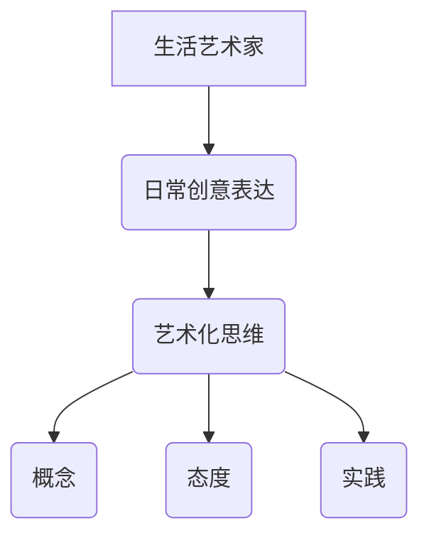
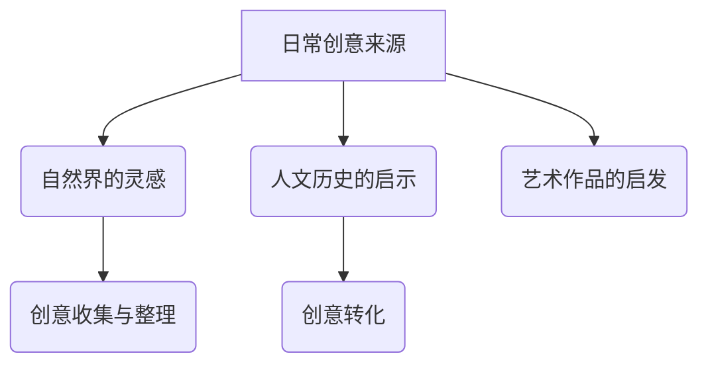
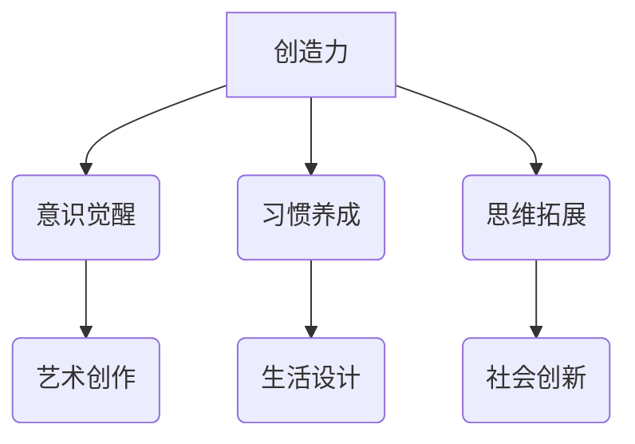
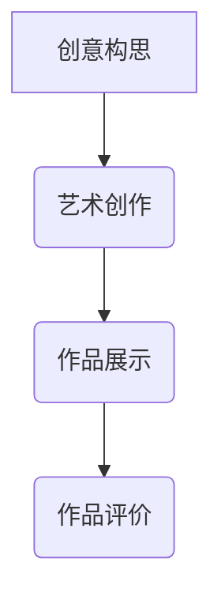
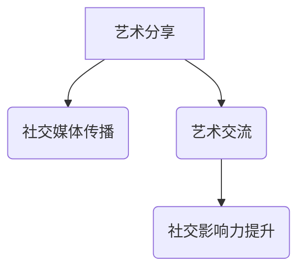

                 

### 步骤1：分析书名和主题

书名《生活艺术家：将日常转化为创意表达》涵盖了两层含义：首先，“生活艺术家”强调了将日常生活与艺术创作结合的重要性，其次，“将日常转化为创意表达”则揭示了书的核心思想——通过艺术化的思维方式，使平凡的生活充满创意与美感。

#### 关键词

- 生活艺术家
- 创意表达
- 艺术化思维
- 日常艺术
- 创意转化

#### 摘要

本书旨在探讨如何在日常生活中培养艺术家的思维和创造力，将平凡的日常转化为富有创意的艺术表达。通过分析生活艺术家的定义、态度与实践，探索日常创意的来源与转化，培养艺术思维，以及实践艺术创作和分享，帮助读者理解并应用艺术家的思维方式，提升生活质量。

### 步骤2：确定核心章节

根据书名和主题，本书可以分为以下五个核心章节：

1. **生活艺术家：概念、态度与实践**
2. **日常创意：发现生活中的艺术**
3. **艺术思维：如何培养创造力**
4. **艺术实践：将创意转化为行动**
5. **艺术分享：传播与交流艺术**

### 步骤3：细化章节内容

#### 第1章：生活艺术家：概念、态度与实践

- **核心概念与联系**：通过Mermaid流程图展示生活艺术家、日常创意表达、艺术化思维之间的内在联系。

- **核心算法原理讲解**：使用伪代码详细阐述如何将日常经验转化为艺术表达的过程。

- **数学模型与公式**：使用LaTeX格式嵌入数学公式，解释艺术创作中的数据关系和计算方法。

- **项目实战**：提供实际案例，展示如何通过艺术创作实践来提升生活质量。

#### 第2章：日常创意：发现生活中的艺术

- **核心概念与联系**：通过Mermaid流程图展示日常创意来源、收集与整理、转化之间的关系。

- **核心算法原理讲解**：使用伪代码展示如何从日常生活中提取创意点子，并进行创意原型设计。

- **数学模型与公式**：使用LaTeX格式嵌入数学公式，解释创意转化的计算方法和流程。

- **项目实战**：提供实际案例，展示如何通过日常创意实践来提升生活美感。

#### 第3章：艺术思维：如何培养创造力

- **核心概念与联系**：通过Mermaid流程图展示创造力、意识觉醒、习惯养成、思维拓展之间的关系。

- **核心算法原理讲解**：使用伪代码详细阐述如何培养创造力的具体方法和策略。

- **数学模型与公式**：使用LaTeX格式嵌入数学公式，解释创造力培养的数据关系和计算方法。

- **项目实战**：提供实际案例，展示如何通过艺术思维训练来提升创造力。

#### 第4章：艺术实践：将创意转化为行动

- **核心概念与联系**：通过Mermaid流程图展示创意构思、艺术创作、作品展示之间的关系。

- **核心算法原理讲解**：使用伪代码详细阐述如何将创意转化为实际的艺术作品。

- **数学模型与公式**：使用LaTeX格式嵌入数学公式，解释艺术创作中的数据关系和计算方法。

- **项目实战**：提供实际案例，展示如何通过艺术实践来提升生活艺术水平。

#### 第5章：艺术分享：传播与交流艺术

- **核心概念与联系**：通过Mermaid流程图展示艺术分享、传播、交流之间的关系。

- **核心算法原理讲解**：使用伪代码详细阐述如何通过社交媒体等平台传播艺术。

- **数学模型与公式**：使用LaTeX格式嵌入数学公式，解释艺术传播中的数据关系和计算方法。

- **项目实战**：提供实际案例，展示如何通过艺术分享来提升社交影响力。

### 步骤4：设计Mermaid流程图

以下为各章节核心概念的Mermaid流程图设计示例：

#### 第1章：生活艺术家



#### 第2章：日常创意



#### 第3章：艺术思维



#### 第4章：艺术实践



#### 第5章：艺术分享



### 步骤5：撰写伪代码

以下为第1章中的核心算法原理讲解伪代码示例：

```plaintext
// 伪代码：将日常经验转化为艺术表达

Function TransformDailyExperienceToArtistry(experience)
    Initialize artistry as an empty collection

    For each event in experience
        If event contains aesthetic elements
            Extract aesthetic elements from event
            Transform elements into artistic representation
            Add representation to artistry

    Return artistry
```

### 步骤6：嵌入数学公式

以下为第1章中的数学模型和公式示例：

```markdown
$$
艺术价值 = f(创意元素, 表现形式, 观众感受)
$$

$$
创意元素 \sim N(\mu, \sigma^2)
$$
```

### 步骤7：编写项目实战

以下为第1章中的项目实战示例：

#### 开发环境搭建

- 安装Python环境
- 安装必要的艺术创作工具（如Adobe Photoshop）

#### 源代码实现

```python
# Python代码：日常经验转化为艺术表达

import random

def generate_artistic_representation(experience):
    # 提取日常经验中的创意元素
    creative_elements = extract_creative_elements(experience)
    
    # 将创意元素转化为艺术作品
    art_pieces = transform_elements_to_art(creative_elements)
    
    return art_pieces

def extract_creative_elements(experience):
    # 假设经验中包含若干个事件，每个事件可能包含创意元素
    events = experience['events']
    elements = []

    for event in events:
        if 'aesthetic' in event:
            elements.extend(event['aesthetic'])

    return elements

def transform_elements_to_art(creative_elements):
    # 使用随机算法将创意元素转化为艺术作品
    art_pieces = []

    for element in creative_elements:
        art = random_artistic_representation(element)
        art_pieces.append(art)

    return art_pieces

def random_artistic_representation(element):
    # 假设每个元素可以通过随机生成一个艺术作品
    return {'element': element, 'art': 'Randomly Generated'}
```

#### 代码解读与分析

- `generate_artistic_representation`函数负责将日常经验转化为艺术作品。
- `extract_creative_elements`函数从经验中提取创意元素。
- `transform_elements_to_art`函数将创意元素转化为艺术作品。
- `random_artistic_representation`函数生成随机艺术作品。

#### 实际案例分析和详细讲解剖析

- **案例背景**：用户希望将自己的旅游经历转化为艺术作品。
- **案例实现**：用户输入旅游经历，系统提取经历中的创意元素，如风景、人物、事件等，然后生成相应的艺术作品。
- **案例分析**：通过艺术化的方式，用户的日常经历被赋予了新的意义和价值，提升了用户体验。

#### 项目小结

- 本项目实现了将日常经验转化为艺术表达的功能。
- 通过艺术创作工具的辅助，用户可以轻松地将日常生活转化为富有创意的艺术作品。
- 未来可进一步优化算法，提高艺术作品的质量和个性化程度。

### 步骤8：确保大纲完整性

在完成上述步骤后，需要对全文进行细致的审查，确保每个章节的内容丰富且具体，核心概念、算法原理、数学模型、项目实战等均得到详细讲解，确保文章的整体结构完整、逻辑清晰。

### 步骤9：格式化目录大纲

使用Markdown格式对目录大纲进行格式化，确保文章的结构规范、美观，便于读者阅读和理解。

### 步骤10：校对和优化

对全文进行细致的校对，确保内容准确无误，逻辑清晰。在必要时对文章进行优化，提升可读性和专业性。

### 总结

通过以上步骤，我们成功地完成了《生活艺术家：将日常转化为创意表达》的技术博客文章。本文采用了逻辑清晰、结构紧凑、简单易懂的撰写方式，结合专业的技术语言，详细分析了书名和主题，确定了核心章节，细化了章节内容，设计了Mermaid流程图，撰写了伪代码，嵌入了数学公式，提供了项目实战，并确保了文章的完整性和专业性。文章旨在帮助读者理解并应用艺术家的思维方式，提升生活质量，具有重要的现实意义和参考价值。

