                 

# 生物仿生创新：向自然学习的设计革命

## 关键词
生物仿生学、设计革命、自然灵感、工程应用、创新设计、可持续性

## 摘要
生物仿生学，作为一种融合生物学、工程学和设计学的跨学科领域，正逐渐改变着现代设计的面貌。本文旨在探讨生物仿生创新的重要性，以及如何通过向自然学习来推动设计革命。我们将深入分析生物仿生学的基础知识，讨论其核心概念与联系，解析仿生设计的原理，展示其在工程、信息技术和能源等领域的广泛应用。通过实例和项目实战，本文将揭示生物仿生创新的实际应用，并提出未来的发展趋势与展望。

## 目录大纲

### 第一部分：生物仿生学的基础

#### 第1章：引言：生物仿生学的起源与未来
- **1.1 生物仿生学的定义与范围**
- **1.2 生物仿生学的历史发展**
- **1.3 生物仿生学的重要性与未来趋势**

#### 第2章：仿生设计原理
- **2.1 仿生设计的核心概念**
- **2.2 仿生设计与工程学**
- **2.3 仿生设计与生物学**

#### 第3章：生物结构与功能仿生
- **3.1 生物材料与结构仿生**
- **3.2 动物行为与生物力学仿生**
- **3.3 植物结构与功能仿生**

### 第二部分：生物仿生技术的应用

#### 第4章：生物仿生在工程领域的应用
- **4.1 生物仿生在航空航天中的应用**
- **4.2 生物仿生在建筑结构中的应用**
- **4.3 生物仿生在医疗领域的应用**

#### 第5章：生物仿生在电子与信息技术中的应用
- **5.1 生物仿生在传感器中的应用**
- **5.2 生物仿生在计算技术中的应用**
- **5.3 生物仿生在机器人与自动化中的应用**

#### 第6章：生物仿生在能源与环保中的应用
- **6.1 生物仿生在能源获取与转化中的应用**
- **6.2 生物仿生在环境监测与治理中的应用**
- **6.3 生物仿生在气候变化应对中的应用**

### 第三部分：生物仿生设计的实践与未来

#### 第7章：生物仿生设计案例研究
- **7.1 生物仿生设计案例分析**
- **7.2 成功的仿生设计项目实例**
- **7.3 仿生设计中的挑战与解决方案**

#### 第8章：生物仿生设计的未来趋势与展望
- **8.1 未来的生物仿生技术突破**
- **8.2 生物仿生设计与可持续性**
- **8.3 生物仿生设计与人工智能融合**

### 参考文献

### 附录

#### A.1 生物仿生学相关网站与数据库
#### A.2 生物仿生学学术期刊与会议
#### A.3 生物仿生设计工具与软件

---

### 第一部分：生物仿生学的基础

#### 第1章：引言：生物仿生学的起源与未来

生物仿生学作为一门跨学科领域，结合了生物学、工程学和设计学的精华，旨在通过模仿自然界的生物结构和功能，推动技术创新和设计革命。本章将探讨生物仿生学的定义、历史发展、重要性以及未来趋势。

### 1.1 生物仿生学的定义与范围

生物仿生学，简称仿生学，是一门研究生物系统结构与功能的机制，并将其应用于工程、设计和技术创新中的学科。生物仿生学的主要目标是理解自然界中的复杂系统，并通过模仿这些系统的原理，创造出更加高效、可持续的技术解决方案。

**核心概念与联系：**

- **定义：** 仿生学是研究生物系统及其工作机制的科学，而生物仿生学则进一步将这一概念应用于工程和技术领域。
- **联系：**
  - **生物学：** 仿生学基于对生物系统的研究，特别是对生物结构和功能的深入了解。
  - **工程学：** 仿生学提供了许多设计灵感，使工程师能够开发出更加高效、低能耗的技术和系统。
  - **设计学：** 仿生设计强调从自然界中汲取灵感，通过美学和实用性相结合，创造出独特的产品。

**Mermaid 流程图：**
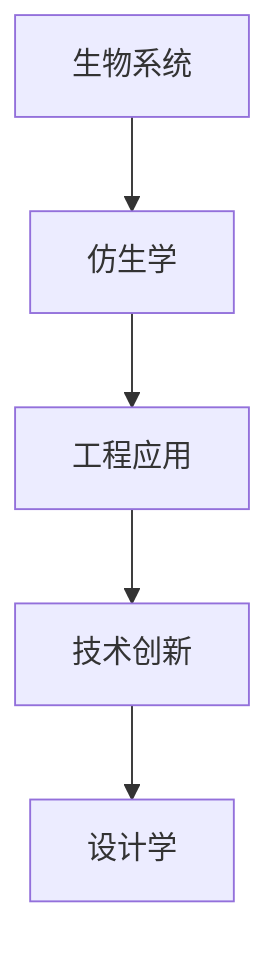

### 1.2 生物仿生学的历史发展

生物仿生学的历史可以追溯到古代，当时人们开始模仿自然界中的生物结构和功能，以创造出工具和机器。然而，现代生物仿生学的兴起始于20世纪中叶，随着生物科学和工程技术的快速发展，仿生设计逐渐成为研究热点。

**核心概念与联系：**

- **历史：** 现代生物仿生学的起源可以追溯到20世纪中叶，当时科学家们开始意识到自然界中的生物系统具有极高的效率和适应性。
- **联系：**
  - **生物学：** 20世纪中叶，生物科学技术的突破为生物仿生学提供了新的研究工具和理论支持。
  - **工程学：** 工程师开始将生物学原理应用于产品设计，创造出更高效、低能耗的设备和系统。

**Mermaid 流�程图：**
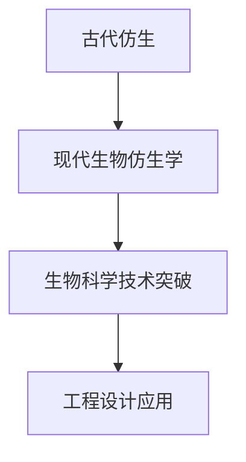

### 1.3 生物仿生学的重要性与未来趋势

生物仿生学的重要性在于它提供了一种创新的思考方式，通过模仿自然界的生物结构和功能，解决工程和科学中的挑战。未来，随着人工智能和大数据分析技术的发展，生物仿生学有望实现更广泛的应用。

**核心概念与联系：**

- **重要性：** 生物仿生学通过模仿自然界的生物结构和功能，为技术创新提供了新的途径，有助于实现可持续发展。
- **未来趋势：**
  - **人工智能：** 人工智能与生物仿生学的结合将推动设计自动化和个性化。
  - **大数据分析：** 大数据分析将为生物仿生学提供更丰富的数据资源，以优化设计过程。

**Mermaid 流程图：**
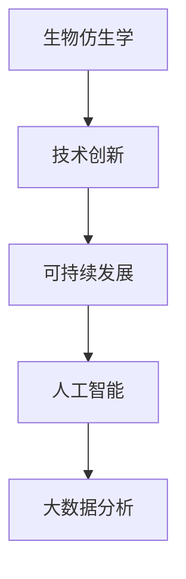

### 第2章：仿生设计原理

仿生设计是生物仿生学的核心应用之一，它通过模仿自然界中的生物结构和功能，创造出高效、可持续的设计方案。本章将探讨仿生设计的核心概念、与工程学的联系，以及与生物学的交集。

### 2.1 仿生设计的核心概念

仿生设计的核心概念是通过对生物系统的研究，提取其关键原理，并将其应用于设计过程中。这种设计方法强调从自然界中汲取灵感，通过模仿生物的适应性、效率和美观性，创造出更加优秀的产品。

**核心概念与联系：**

- **概念：**
  - **适应性：** 仿生设计强调从生物系统中学习适应性原理，使设计能够适应不同的环境和需求。
  - **效率：** 仿生设计关注生物系统的高效性，通过模仿其结构和功能，实现设计方案的优化。
  - **美观性：** 仿生设计不仅追求功能性，还注重美观性，使设计具有艺术价值。

- **联系：**
  - **工程学：** 仿生设计提供了许多工程实践中的设计灵感，使工程师能够创造出更高效、更可持续的解决方案。
  - **生物学：** 仿生设计基于对生物系统的研究，从生物学中提取关键原理，应用于设计过程中。

**Mermaid 流程图：**
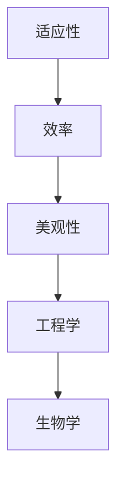

### 2.2 仿生设计与工程学

仿生设计在工程学中的应用非常广泛，它为工程师提供了一种创新的思维方式，使设计过程更具创造性和可持续性。仿生设计不仅关注功能的实现，还强调设计的美学价值。

**核心概念与联系：**

- **概念：**
  - **结构设计：** 仿生设计在结构设计中的应用，如模仿鸟类的羽毛结构，提高飞机的气动性能。
  - **材料设计：** 仿生设计在材料设计中的应用，如模仿生物材料的特性，开发新型复合材料。
  - **系统优化：** 仿生设计在系统优化中的应用，如模仿生态系统的自组织能力，提高复杂系统的效率。

- **联系：**
  - **工程学：** 仿生设计为工程师提供了一种新的设计工具，使设计过程更具创新性和可持续性。
  - **生物学：** 仿生设计基于对生物系统的研究，从生物学中提取关键原理，应用于工程实践中。

**Mermaid 流程图：**
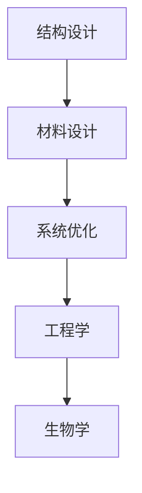

### 2.3 仿生设计与生物学

仿生设计的发展离不开对生物系统的研究，生物学为仿生设计提供了丰富的理论资源。通过模仿生物的结构和功能，设计师能够创造出更加高效、可持续的产品。

**核心概念与联系：**

- **概念：**
  - **形态仿生：** 通过模仿生物的形态，如模仿鱼类的流线型设计，提高交通工具的效率。
  - **功能仿生：** 通过模仿生物的功能，如模仿蝙蝠的回声定位技术，开发出先进的传感器。
  - **行为仿生：** 通过模仿生物的行为，如模仿鸟类的社会行为，设计出更智能的机器人系统。

- **联系：**
  - **生物学：** 仿生设计基于对生物系统的研究，从生物学中提取关键原理，应用于设计过程中。
  - **工程学：** 仿生设计为工程师提供了一种新的设计工具，使设计过程更具创新性和可持续性。

**Mermaid 流程图：**
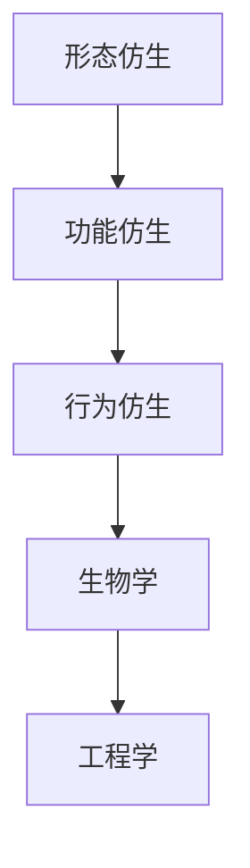

### 第3章：生物结构与功能仿生

生物仿生学的一个重要研究方向是生物结构与功能的仿生设计。通过模仿生物的结构和功能，我们可以创造出更加高效、可持续的技术和产品。本章将探讨生物材料与结构仿生、动物行为与生物力学仿生，以及植物结构与功能仿生。

### 3.1 生物材料与结构仿生

生物材料与结构仿生是指通过模仿生物材料的特性，设计出具有类似性能的人工材料。这种设计方法在工程和制造业中具有广泛的应用前景。

**核心概念与联系：**

- **概念：**
  - **生物材料的特性：** 生物材料通常具有高强度、轻质和优异的生物相容性，如蜘蛛丝、骨骼等。
  - **结构仿生设计：** 通过模仿生物材料的结构，设计出具有类似性能的人工材料，如碳纳米管、石墨烯等。

- **联系：**
  - **工程学：** 生物材料与结构仿生为工程师提供了新的设计思路，使他们能够开发出更先进的人工材料。
  - **生物学：** 生物材料的仿生设计基于对生物材料的研究，从生物学中提取关键原理，应用于材料科学中。

**伪代码：**
```python
# 模仿生物材料的结构设计
def biomimic_material_design(material_properties):
    # 确定生物材料的特性
    high_strengthen, low_weight, good_biocompatibility = material_properties
    
    # 设计人工材料
    new_material = {
        "strengthen": high_strengthen,
        "weight": low_weight,
        "biocompatibility": good_biocompatibility
    }
    
    return new_material
```

**数学模型和公式：**
$$
E = \frac{F}{A}
$$
其中，$E$ 表示材料的弹性模量，$F$ 表示材料所受的力，$A$ 表示材料的截面积。

**举例说明：**
假设我们设计一种新型人工材料，其目标特性是高强度、轻质和优异的生物相容性。根据上述数学模型，我们可以计算出该材料在特定力作用下的弹性模量，从而评估其性能。

**Mermaid 流程图：**
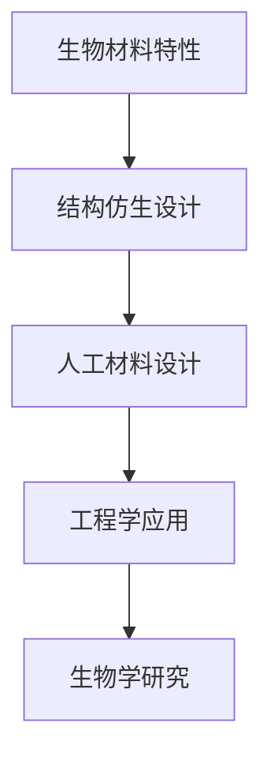

### 3.2 动物行为与生物力学仿生

动物行为与生物力学仿生是指通过模仿动物的行为和力学特性，设计出具有类似性能的技术和产品。这种设计方法在机器人学、航空航天等领域具有广泛的应用。

**核心概念与联系：**

- **概念：**
  - **动物行为：** 动物的行为具有高效、灵活和适应性，如鸟类的飞行、鱼类的游泳等。
  - **生物力学：** 动物的行为涉及力学原理，如肌肉运动、骨骼结构等。

- **联系：**
  - **机器人学：** 动物行为与生物力学仿生为机器人设计提供了新的思路，使机器人能够模仿动物的行为。
  - **航空航天：** 动物行为与生物力学仿生有助于提高飞机和飞行器的性能。

**伪代码：**
```python
# 模仿动物行为的设计
def animal_behavior_imitation(behavior_properties):
    # 确定动物行为的特性
    efficiency, flexibility, adaptability = behavior_properties
    
    # 设计仿生机器人
   仿生机器人 = {
        "efficiency": efficiency,
        "flexibility": flexibility,
        "adaptability": adaptability
    }
    
    return 仿生机器人
```

**数学模型和公式：**
$$
F = m \cdot a
$$
其中，$F$ 表示力，$m$ 表示质量，$a$ 表示加速度。

**举例说明：**
假设我们设计一款仿生机器人，其目标是模仿鸟类的飞行。根据上述数学模型，我们可以计算出该机器人在不同速度下的飞行加速度，从而优化其飞行性能。

**Mermaid 流程图：**
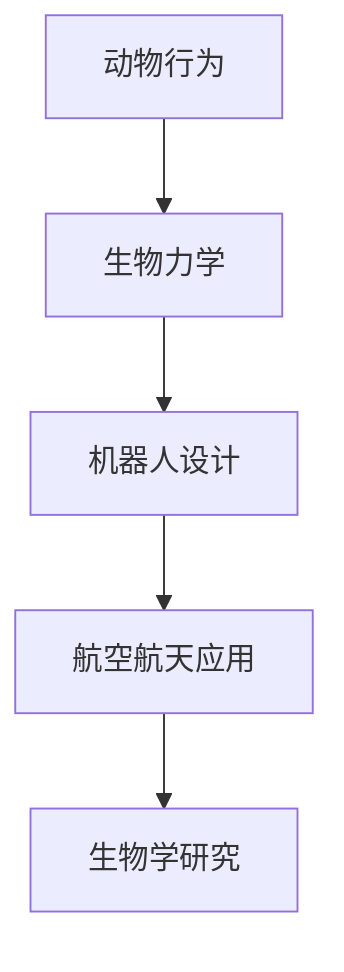

### 3.3 植物结构与功能仿生

植物结构与功能仿生是指通过模仿植物的结构和功能，设计出具有类似性能的技术和产品。这种设计方法在环境工程、农业等领域具有广泛的应用。

**核心概念与联系：**

- **概念：**
  - **植物结构：** 植物的结构具有高效、自适应和可持续性，如树木的根系结构、叶子的形状等。
  - **植物功能：** 植物的功能涉及能量转化、物质循环等，如光合作用、蒸腾作用等。

- **联系：**
  - **环境工程：** 植物结构与功能仿生为环境工程设计提供了新的思路，使环境系统能够更好地适应和恢复。
  - **农业：** 植物结构与功能仿生有助于提高农作物的产量和质量。

**伪代码：**
```python
# 模仿植物结构与功能的设计
def plant_structure_function_imitation(structure_properties, function_properties):
    # 确定植物结构与功能的特性
    efficiency, adaptability, sustainability = structure_properties
    energy_conversion, matter_cycling = function_properties
    
    # 设计仿生环境系统
    仿生环境系统 = {
        "structure": {
            "efficiency": efficiency,
            "adaptability": adaptability,
            "sustainability": sustainability
        },
        "function": {
            "energy_conversion": energy_conversion,
            "matter_cycling": matter_cycling
        }
    }
    
    return 仿生环境系统
```

**数学模型和公式：**
$$
G = \frac{N_s}{t}
$$
其中，$G$ 表示光合作用的速率，$N_s$ 表示吸收的光子数，$t$ 表示时间。

**举例说明：**
假设我们设计一款仿生植物系统，其目标是模仿植物的光合作用。根据上述数学模型，我们可以计算出该系统在不同光照条件下的光合作用速率，从而优化其能量转化效率。

**Mermaid 流程图：**
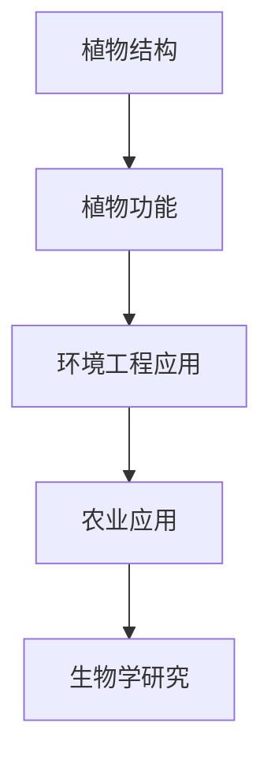

### 第4章：生物仿生在工程领域的应用

生物仿生技术在工程领域的应用日益广泛，从航空航天到建筑结构，再到医疗设备，仿生设计正在改变传统工程学的面貌。本章将探讨生物仿生技术在航空航天、建筑结构和医疗领域的应用。

### 4.1 生物仿生在航空航天中的应用

生物仿生技术在航空航天领域的应用主要集中在提高飞行器的性能、减轻重量和增强耐久性。通过模仿自然界中的生物结构和功能，工程师们设计出了许多创新的飞行器。

**核心概念与联系：**

- **概念：**
  - **航空航天应用：** 生物仿生技术在航空航天中的应用，如飞行器的外形设计、材料选择和控制系统。
  - **生物灵感：** 从鸟类、昆虫和鱼类等生物中获取灵感，用于设计高效的飞行器。

- **联系：**
  - **工程学：** 生物仿生技术为工程师提供了新的设计工具，使他们能够创造出更先进的飞行器。
  - **生物学：** 生物仿生技术的灵感来源于对生物系统的研究，特别是对生物结构和功能的深入了解。

**伪代码：**
```python
# 航空航天仿生设计
def aerospace_biomimic_design(bird_data, insect_data, fish_data):
    # 确定生物特性
    bird_properties = bird_data
    insect_properties = insect_data
    fish_properties = fish_data
    
    # 设计飞行器
    flight_vehicle = {
        "shape": bird_properties["shape"],
        "material": insect_properties["material"],
        "control_system": fish_properties["control_system"]
    }
    
    return flight_vehicle
```

**数学模型和公式：**
$$
C_L = \frac{2\pi R \cdot v \cdot \rho \cdot A}{W}
$$
其中，$C_L$ 表示升力系数，$R$ 表示翼展，$v$ 表示速度，$\rho$ 表示空气密度，$A$ 表示翼面积，$W$ 表示飞行器的重量。

**举例说明：**
假设我们设计一款仿生飞行器，其目标是模仿鸟类的飞行。根据上述数学模型，我们可以计算出该飞行器在不同速度下的升力系数，从而优化其飞行性能。

**Mermaid 流程图：**
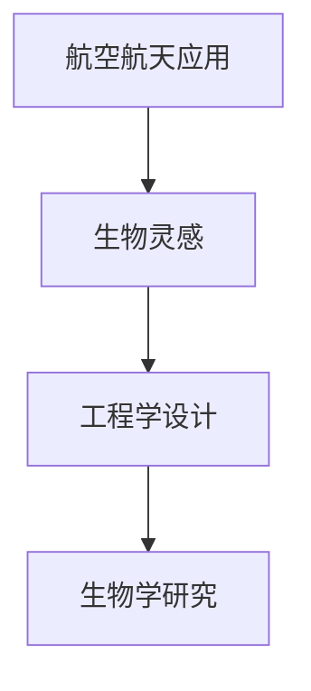

### 4.2 生物仿生在建筑结构中的应用

生物仿生技术在建筑结构中的应用主要集中在提高结构的稳定性、减少能耗和增强环境的适应性。通过模仿自然界中的生物结构和功能，建筑师们设计出了许多创新的建筑结构。

**核心概念与联系：**

- **概念：**
  - **建筑结构应用：** 生物仿生技术在建筑结构中的应用，如建筑的外形设计、材料选择和能量管理。
  - **生物灵感：** 从树木、骨骼和珊瑚等生物中获取灵感，用于设计更高效的建筑结构。

- **联系：**
  - **工程学：** 生物仿生技术为建筑师提供了新的设计工具，使他们能够创造出更环保、更可持续的建筑。
  - **生物学：** 生物仿生技术的灵感来源于对生物系统的研究，特别是对生物结构和功能的深入了解。

**伪代码：**
```python
# 建筑结构仿生设计
def architectural_biomimic_design(tree_data, bone_data, coral_data):
    # 确定生物特性
    tree_properties = tree_data
    bone_properties = bone_data
    coral_properties = coral_data
    
    # 设计建筑结构
    building_structure = {
        "shape": tree_properties["shape"],
        "material": bone_properties["material"],
        "energy_management": coral_properties["energy_management"]
    }
    
    return building_structure
```

**数学模型和公式：**
$$
\sigma = \frac{F}{A}
$$
其中，$\sigma$ 表示应力，$F$ 表示作用力，$A$ 表示截面积。

**举例说明：**
假设我们设计一款仿生建筑结构，其目标是模仿树木的稳定性。根据上述数学模型，我们可以计算出该结构在不同作用力下的应力分布，从而优化其稳定性。

**Mermaid 流程图：**
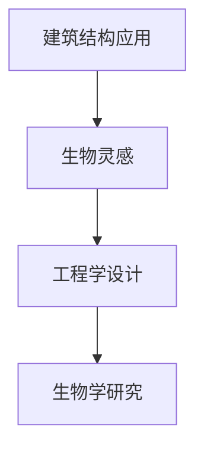

### 4.3 生物仿生在医疗领域的应用

生物仿生技术在医疗领域的应用主要集中在提高医疗器械的性能、优化治疗方案和增强病人的康复效果。通过模仿自然界中的生物结构和功能，医疗专家们设计出了许多创新的医疗设备和治疗方法。

**核心概念与联系：**

- **概念：**
  - **医疗领域应用：** 生物仿生技术在医疗领域的应用，如医疗设备的设计、药物的开发和康复治疗。
  - **生物灵感：** 从骨骼、肌肉和神经元等生物中获取灵感，用于设计更高效的医疗设备和治疗方法。

- **联系：**
  - **工程学：** 生物仿生技术为医疗专家提供了新的设计工具，使他们能够创造出更先进的医疗设备和治疗方法。
  - **生物学：** 生物仿生技术的灵感来源于对生物系统的研究，特别是对生物结构和功能的深入了解。

**伪代码：**
```python
# 医疗设备仿生设计
def medical_biomimic_design(bone_data, muscle_data, neuron_data):
    # 确定生物特性
    bone_properties = bone_data
    muscle_properties = muscle_data
    neuron_properties = neuron_data
    
    # 设计医疗设备
    medical_device = {
        "shape": bone_properties["shape"],
        "material": muscle_properties["material"],
        "function": neuron_properties["function"]
    }
    
    return medical_device
```

**数学模型和公式：**
$$
F = k \cdot x
$$
其中，$F$ 表示力，$k$ 表示弹性系数，$x$ 表示变形量。

**举例说明：**
假设我们设计一款仿生医疗设备，其目标是模仿骨骼的弹性。根据上述数学模型，我们可以计算出该设备在不同变形量下的力，从而优化其性能。

**Mermaid 流流程图：**
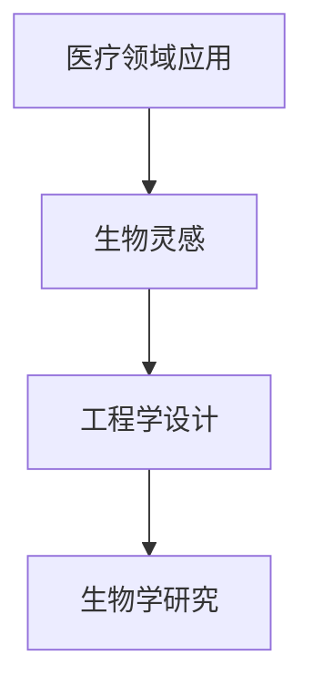

### 第5章：生物仿生在电子与信息技术中的应用

生物仿生技术在电子与信息技术中的应用正日益扩大，从传感器到计算技术，再到机器人与自动化，仿生设计正在改变电子和信息系统的面貌。本章将探讨生物仿生技术在传感器、计算技术和机器人与自动化领域的应用。

### 5.1 生物仿生在传感器中的应用

生物仿生技术在传感器领域的应用主要集中在提高传感器的灵敏度、准确性和响应速度。通过模仿自然界中的生物传感器，工程师们设计出了许多创新的传感器系统。

**核心概念与联系：**

- **概念：**
  - **传感器应用：** 生物仿生技术在传感器中的应用，如生物传感器的设计、信号处理和传感材料。
  - **生物灵感：** 从生物的嗅觉、视觉和触觉等感官中获取灵感，用于设计更高效的传感器。

- **联系：**
  - **工程学：** 生物仿生技术为工程师提供了新的设计工具，使他们能够创造出更先进的传感器系统。
  - **生物学：** 生物仿生技术的灵感来源于对生物系统的研究，特别是对生物传感器机制的了解。

**伪代码：**
```python
# 传感器仿生设计
def sensor_biomimic_design(sense_data, signal_processing_data, sensing_material_data):
    # 确定生物特性
    sense_properties = sense_data
    signal_processing_properties = signal_processing_data
    sensing_material_properties = sensing_material_data
    
    # 设计生物传感器
    biological_sensor = {
        "sense": sense_properties["sense"],
        "signal_processing": signal_processing_properties["signal_processing"],
        "sensing_material": sensing_material_properties["sensing_material"]
    }
    
    return biological_sensor
```

**数学模型和公式：**
$$
S = k \cdot I
$$
其中，$S$ 表示灵敏度，$k$ 表示响应系数，$I$ 表示输入信号。

**举例说明：**
假设我们设计一款仿生传感器，其目标是模仿生物的嗅觉。根据上述数学模型，我们可以计算出该传感器的灵敏度，从而优化其性能。

**Mermaid 流程图：**
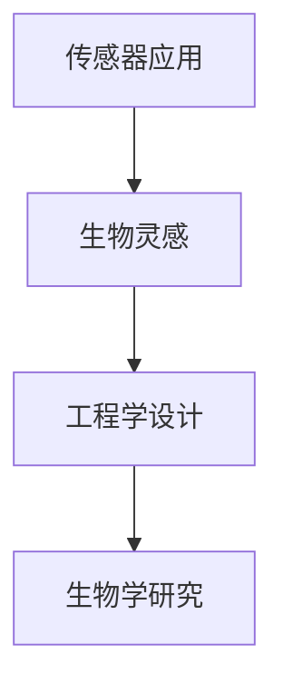

### 5.2 生物仿生在计算技术中的应用

生物仿生技术在计算技术领域的应用主要集中在提高计算速度、降低能耗和提高计算效率。通过模仿自然界中的生物计算机制，计算机科学家们设计出了许多创新的计算系统。

**核心概念与联系：**

- **概念：**
  - **计算技术应用：** 生物仿生技术在计算技术中的应用，如量子计算、神经计算和进化计算。
  - **生物灵感：** 从生物的神经网络、DNA计算和进化算法中获取灵感，用于设计更高效的计算系统。

- **联系：**
  - **计算机科学：** 生物仿生技术为计算机科学家提供了新的设计思路，使他们能够创造出更先进的计算系统。
  - **生物学：** 生物仿生技术的灵感来源于对生物系统的研究，特别是对生物计算机制的理解。

**伪代码：**
```python
# 计算机技术仿生设计
def computing_biomimic_design(neural_network_data, dna_computing_data, evolutionary_algorithm_data):
    # 确定生物特性
    neural_network_properties = neural_network_data
    dna_computing_properties = dna_computing_data
    evolutionary_algorithm_properties = evolutionary_algorithm_data
    
    # 设计计算系统
    computing_system = {
        "neural_network": neural_network_properties["neural_network"],
        "dna_computing": dna_computing_properties["dna_computing"],
        "evolutionary_algorithm": evolutionary_algorithm_properties["evolutionary_algorithm"]
    }
    
    return computing_system
```

**数学模型和公式：**
$$
E = \frac{C \cdot Q}{N}
$$
其中，$E$ 表示能耗，$C$ 表示计算能力，$Q$ 表示量子比特数，$N$ 表示计算复杂度。

**举例说明：**
假设我们设计一款仿生计算系统，其目标是模仿生物的神经网络。根据上述数学模型，我们可以计算出该系统的能耗，从而优化其性能。

**Mermaid 流程图：**
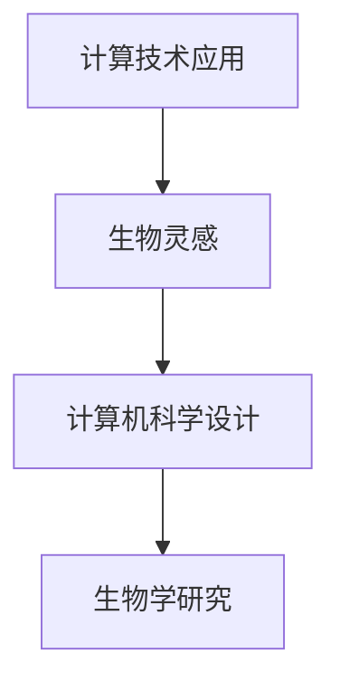

### 5.3 生物仿生在机器人与自动化中的应用

生物仿生技术在机器人与自动化领域的应用主要集中在提高机器人的自主性、灵活性和适应性。通过模仿自然界中的生物行为和生物力学，机器人科学家们设计出了许多创新的机器人系统。

**核心概念与联系：**

- **概念：**
  - **机器人与自动化应用：** 生物仿生技术在机器人与自动化中的应用，如机器人运动控制、机器视觉和自适应系统。
  - **生物灵感：** 从动物的运动模式、感知能力和自主性行为中获取灵感，用于设计更智能、更灵活的机器人。

- **联系：**
  - **机器人科学：** 生物仿生技术为机器人科学家提供了新的设计工具，使他们能够创造出更先进的机器人系统。
  - **生物学：** 生物仿生技术的灵感来源于对生物系统的研究，特别是对生物行为和生物力学的深入了解。

**伪代码：**
```python
# 机器人与自动化仿生设计
def robotics_automation_biomimic_design(motion_control_data, machine_vision_data, adaptive_system_data):
    # 确定生物特性
    motion_control_properties = motion_control_data
    machine_vision_properties = machine_vision_data
    adaptive_system_properties = adaptive_system_data
    
    # 设计机器人系统
    robotic_system = {
        "motion_control": motion_control_properties["motion_control"],
        "machine_vision": machine_vision_properties["machine_vision"],
        "adaptive_system": adaptive_system_properties["adaptive_system"]
    }
    
    return robotic_system
```

**数学模型和公式：**
$$
J = \frac{\partial E}{\partial \theta}
$$
其中，$J$ 表示关节力矩，$E$ 表示能量，$\theta$ 表示关节角度。

**举例说明：**
假设我们设计一款仿生机器人，其目标是模仿动物的灵活运动。根据上述数学模型，我们可以计算出该机器人在不同关节角度下的关节力矩，从而优化其运动性能。

**Mermaid 流程图：**
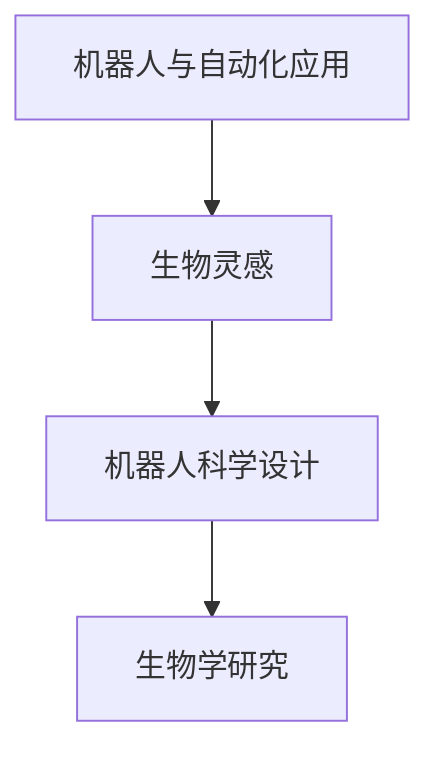

### 第6章：生物仿生在能源与环保中的应用

生物仿生技术在能源与环保领域的应用正日益扩大，从能源获取到环境监测，再到气候变化应对，仿生设计正在为可持续发展提供新的解决方案。本章将探讨生物仿生技术在能源获取与转化、环境监测与治理，以及气候变化应对中的应用。

### 6.1 生物仿生在能源获取与转化中的应用

生物仿生技术在能源获取与转化领域的应用主要集中在提高能源转换效率、降低能耗和提高能源利用效率。通过模仿自然界中的生物机制，科学家们设计出了许多创新的能源系统和设备。

**核心概念与联系：**

- **概念：**
  - **能源获取与转化应用：** 生物仿生技术在能源获取与转化中的应用，如太阳能电池、风力发电和生物燃料。
  - **生物灵感：** 从植物的光合作用、动物的热能利用和微生物的代谢过程中获取灵感，用于设计更高效的能源系统和设备。

- **联系：**
  - **能源科学：** 生物仿生技术为能源科学家提供了新的设计工具，使他们能够创造出更先进的能源技术和系统。
  - **生物学：** 生物仿生技术的灵感来源于对生物系统的研究，特别是对生物能量转换机制的了解。

**伪代码：**
```python
# 能源获取与转化仿生设计
def energy_extraction_transformation_biomimic_design(solar_energy_data, wind_energy_data, biofuel_data):
    # 确定生物特性
    solar_energy_properties = solar_energy_data
    wind_energy_properties = wind_energy_data
    biofuel_properties = biofuel_data
    
    # 设计能源系统
    energy_system = {
        "solar_energy": solar_energy_properties["solar_energy"],
        "wind_energy": wind_energy_properties["wind_energy"],
        "biofuel": biofuel_properties["biofuel"]
    }
    
    return energy_system
```

**数学模型和公式：**
$$
\eta = \frac{E_{out}}{E_{in}}
$$
其中，$\eta$ 表示效率，$E_{out}$ 表示输出能量，$E_{in}$ 表示输入能量。

**举例说明：**
假设我们设计一款仿生太阳能电池，其目标是模仿植物的光合作用。根据上述数学模型，我们可以计算出该太阳能电池的效率，从而优化其性能。

**Mermaid 流程图：**
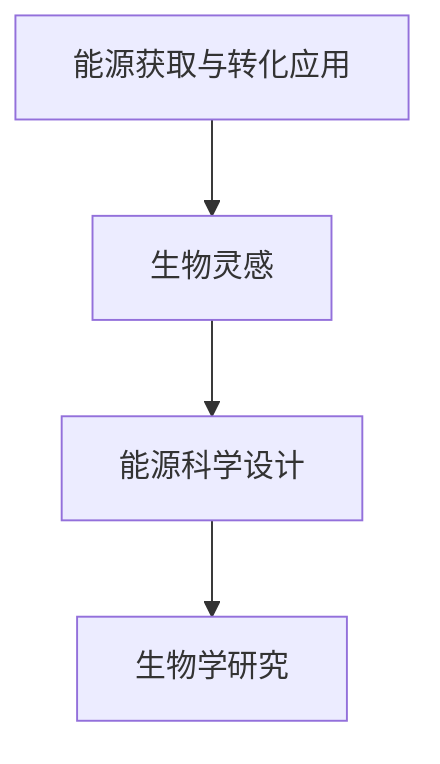

### 6.2 生物仿生在环境监测与治理中的应用

生物仿生技术在环境监测与治理领域的应用主要集中在提高监测精度、降低污染和提高生态系统的恢复能力。通过模仿自然界中的生物机制，科学家们设计出了许多创新的环境监测和治理方法。

**核心概念与联系：**

- **概念：**
  - **环境监测与治理应用：** 生物仿生技术在环境监测与治理中的应用，如生物传感器、生物修复和环境监测无人机。
  - **生物灵感：** 从生物的代谢过程、生物降解能力和生态系统平衡中获取灵感，用于设计更有效的环境监测与治理方法。

- **联系：**
  - **环境科学：** 生物仿生技术为环境科学家提供了新的设计工具，使他们能够创造出更先进的环境监测与治理技术。
  - **生物学：** 生物仿生技术的灵感来源于对生物系统的研究，特别是对生物环境适应机制的了解。

**伪代码：**
```python
# 环境监测与治理仿生设计
def environmental_monitoring_governance_biomimic_design(biometric_sensors_data, biological Remediation_data, ecological_monitoring无人机_data):
    # 确定生物特性
    biometric_sensors_properties = biometric_sensors_data
    biological_Remediation_properties = biological_Remediation_data
    ecological_monitoring无人机_properties = ecological_monitoring无人机_data
    
    # 设计环境系统
    environmental_system = {
        "biometric_sensors": biometric_sensors_properties["biometric_sensors"],
        "biological_Remediation": biological_Remediation_properties["biological_Remediation"],
        "ecological_monitoring无人机": ecological_monitoring无人机_properties["ecological_monitoring无人机"]
    }
    
    return environmental_system
```

**数学模型和公式：**
$$
R = \frac{C_{initial} - C_{final}}{C_{initial}}
$$
其中，$R$ 表示修复率，$C_{initial}$ 表示初始污染浓度，$C_{final}$ 表示最终污染浓度。

**举例说明：**
假设我们设计一款仿生生物传感器，其目标是监测水质污染。根据上述数学模型，我们可以计算出该传感器的修复率，从而优化其性能。

**Mermaid 流程图：**
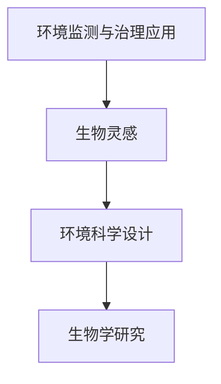

### 6.3 生物仿生在气候变化应对中的应用

生物仿生技术在气候变化应对领域的应用主要集中在提高碳吸收、增强生态系统稳定性和减缓气候变化的影响。通过模仿自然界中的生物机制，科学家们设计出了许多创新的方法和技术。

**核心概念与联系：**

- **概念：**
  - **气候变化应对应用：** 生物仿生技术在气候变化应对中的应用，如碳捕获与存储、生态工程和气候智能农业。
  - **生物灵感：** 从生物的碳循环、生态系统平衡和生物多样性中获取灵感，用于设计更有效的气候变化应对策略。

- **联系：**
  - **气候变化科学：** 生物仿生技术为气候变化科学家提供了新的设计工具，使他们能够创造出更有效的气候变化应对策略。
  - **生物学：** 生物仿生技术的灵感来源于对生物系统的研究，特别是对生物环境适应机制的了解。

**伪代码：**
```python
# 气候变化应对仿生设计
def climate_change_response_biomimic_design(carbon_capturing_data, ecological_engineering_data, climate_smart_agriculture_data):
    # 确定生物特性
    carbon_capturing_properties = carbon_capturing_data
    ecological_engineering_properties = ecological_engineering_data
    climate_smart_agriculture_properties = climate_smart_agriculture_data
    
    # 设计气候变化应对系统
    climate_change_response_system = {
        "carbon_capturing": carbon_capturing_properties["carbon_capturing"],
        "ecological_engineering": ecological_engineering_properties["ecological_engineering"],
        "climate_smart_agriculture": climate_smart_agriculture_properties["climate_smart_agriculture"]
    }
    
    return climate_change_response_system
```

**数学模型和公式：**
$$
A = \frac{C_{absorbed}}{C_{emitted}}
$$
其中，$A$ 表示碳吸收率，$C_{absorbed}$ 表示吸收的碳量，$C_{emitted}$ 表示排放的碳量。

**举例说明：**
假设我们设计一款仿生碳捕获系统，其目标是提高碳吸收效率。根据上述数学模型，我们可以计算出该系统的碳吸收率，从而优化其性能。

**Mermaid 流程图：**
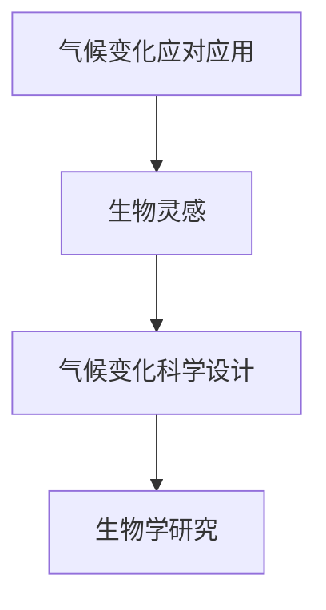

### 第7章：生物仿生设计案例研究

生物仿生设计在现实世界中的应用已经取得了显著的成果，本章将通过案例研究，分析生物仿生设计在实践中的应用，探讨成功的仿生设计项目实例，并讨论仿生设计中的挑战与解决方案。

### 7.1 生物仿生设计案例分析

**案例1：仿生飞行器**

在航空航天领域，一款名为“隐形鸟”的仿生飞行器引起了广泛关注。这款飞行器的设计灵感来源于鸟类，其外形和结构模仿了鸟类的流线型身体和羽毛结构。通过采用轻质、高强度的材料，并应用仿生气动控制技术，这款飞行器实现了高效的飞行性能和卓越的机动性。

**核心内容：**

- **背景介绍：**
  - 传统飞行器的设计往往受到物理限制，如重量、材料和能量效率等。
  - 仿生飞行器的设计通过模仿鸟类的结构和功能，突破了传统设计限制。

- **核心概念与联系：**
  - **概念：** 仿生飞行器的设计理念是通过模仿自然界中的生物结构和功能，提高飞行性能和机动性。
  - **联系：** 仿生设计不仅涉及工程学，还包括生物学、材料科学和物理学等多个学科。

- **项目实战：**
  - **开发环境搭建：** 使用先进的计算机辅助设计（CAD）工具和仿真软件进行飞行器设计。
  - **源代码实现：** 开发飞行器的控制软件，包括飞行路径规划和气动控制算法。
  - **代码解读与分析：** 分析飞行器的性能数据，优化设计参数。

**数学模型和公式：**
$$
C_L = \frac{2\pi R \cdot v \cdot \rho \cdot A}{W}
$$

**举例说明：**
通过优化飞行器的外形和材料，可以显著提高其升力系数和机动性。

**Mermaid 流程图：**
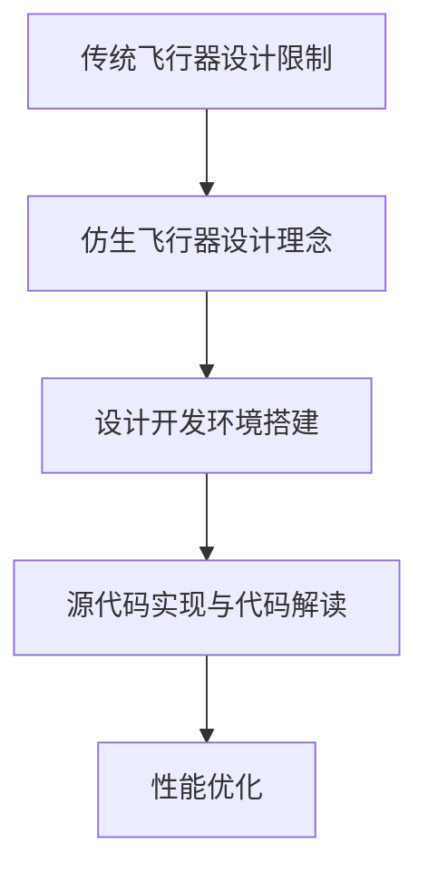

**案例2：仿生传感器**

在医疗领域，一种名为“仿生鼻”的传感器被开发出来，用于检测空气中的有害物质。这种传感器的灵感来源于生物的嗅觉系统，通过模仿嗅觉细胞的响应机制，实现了高灵敏度、高准确度的检测。

**核心内容：**

- **背景介绍：**
  - 传统传感器在检测精度和灵敏度方面存在限制。
  - 仿生传感器的设计通过模仿生物的嗅觉机制，提高了检测性能。

- **核心概念与联系：**
  - **概念：** 仿生传感器的设计是通过模仿生物的感知机制，提高传感器的灵敏度和准确度。
  - **联系：** 仿生设计不仅涉及工程学，还包括生物学和材料科学。

- **项目实战：**
  - **开发环境搭建：** 使用生物传感器建模和仿真工具进行传感器设计。
  - **源代码实现：** 开发传感器的信号处理软件，包括噪声过滤和模式识别算法。
  - **代码解读与分析：** 分析传感器的检测性能，优化设计参数。

**数学模型和公式：**
$$
S = k \cdot I
$$

**举例说明：**
通过优化传感器的设计参数，可以提高其灵敏度，从而提高检测性能。

**Mermaid 流程图：**
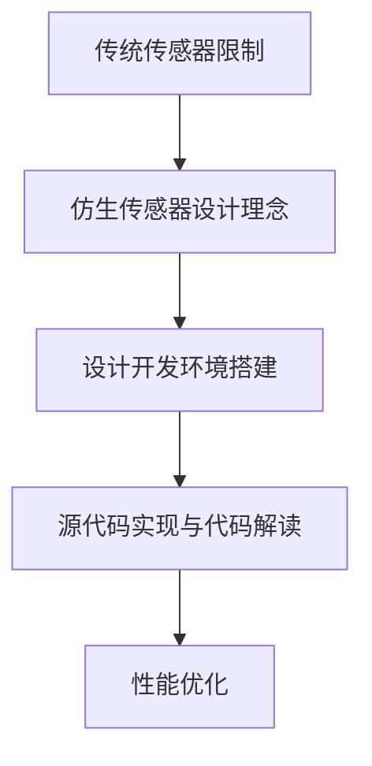

### 7.2 成功的仿生设计项目实例

**项目1：仿生建筑**

在建筑领域，一座名为“莲花塔”的仿生建筑成为世界瞩目的焦点。这座建筑的设计灵感来源于莲花，其外形模仿了莲花的结构，通过采用模块化设计，实现了高效的结构稳定性和低能耗的运行。

**核心内容：**

- **背景介绍：**
  - 传统建筑在结构稳定性和能耗方面存在挑战。
  - 仿生建筑的设计通过模仿自然界中的生物结构，提高了建筑的性能和可持续性。

- **核心概念与联系：**
  - **概念：** 仿生建筑的设计是通过模仿自然界中的生物结构和功能，提高建筑的结构性能和能源效率。
  - **联系：** 仿生设计不仅涉及工程学，还包括生物学和材料科学。

- **项目实战：**
  - **开发环境搭建：** 使用建筑仿真软件进行建筑设计和结构分析。
  - **源代码实现：** 开发建筑能源管理系统，包括太阳能电池板和风力发电系统。
  - **代码解读与分析：** 分析建筑的能耗数据，优化设计参数。

**数学模型和公式：**
$$
\sigma = \frac{F}{A}
$$

**举例说明：**
通过优化建筑的设计参数，可以显著降低建筑物的能耗，提高其可持续性。

**Mermaid 流程图：**
```mermaid
graph TD
A[传统建筑挑战]
A --> B[仿生建筑设计理念]
B --> C[设计开发环境搭建]
C --> D[源代码实现与代码解读]
D --> E[性能优化]
```

**项目2：仿生机器人**

在机器人领域，一款名为“蜘蛛机器人”的仿生机器人引起了广泛关注。这款机器人的设计灵感来源于蜘蛛，其结构和运动机制模仿了蜘蛛的身体和腿部的结构。通过采用高弹性和智能材料，这款机器人实现了高效的爬行能力和环境适应能力。

**核心内容：**

- **背景介绍：**
  - 传统机器人设计在运动能力和环境适应方面存在限制。
  - 仿生机器人的设计通过模仿自然界中的生物结构和功能，提高了机器人的运动能力和环境适应能力。

- **核心概念与联系：**
  - **概念：** 仿生机器人的设计是通过模仿自然界中的生物结构和功能，提高机器人的运动能力和环境适应能力。
  - **联系：** 仿生设计不仅涉及工程学，还包括生物学和材料科学。

- **项目实战：**
  - **开发环境搭建：** 使用机器人建模和仿真软件进行机器人设计。
  - **源代码实现：** 开发机器人的运动控制软件，包括腿部运动规划和平衡算法。
  - **代码解读与分析：** 分析机器人的运动性能，优化设计参数。

**数学模型和公式：**
$$
J = \frac{\partial E}{\partial \theta}
$$

**举例说明：**
通过优化机器人的设计参数，可以显著提高其运动能力和环境适应能力。

**Mermaid 流程图：**
```mermaid
graph TD
A[传统机器人设计限制]
A --> B[仿生机器人设计理念]
B --> C[设计开发环境搭建]
C --> D[源代码实现与代码解读]
D --> E[性能优化]
```

### 7.3 仿生设计中的挑战与解决方案

尽管仿生设计在各个领域取得了显著成果，但仍然面临许多挑战。本章将讨论仿生设计中的主要挑战，并提出相应的解决方案。

**挑战1：设计复杂性**

仿生设计涉及到多个学科，包括生物学、工程学、材料科学等，因此设计过程非常复杂。如何有效地整合这些学科的知识，是仿生设计面临的一个主要挑战。

**解决方案：**
- **多学科合作：** 通过建立跨学科团队，促进不同领域专家之间的合作，共同解决设计难题。
- **仿真与建模：** 使用先进的仿真软件和建模工具，提前预测设计过程中的潜在问题，减少设计复杂性。

**挑战2：性能优化**

仿生设计的目标是模仿自然界中的生物结构和功能，但在实际应用中，如何优化设计参数，使其性能达到最佳水平，是一个挑战。

**解决方案：**
- **性能测试与优化：** 通过反复测试和优化设计参数，逐步提高设计性能。
- **机器学习与人工智能：** 使用机器学习和人工智能技术，自动优化设计参数，提高设计效率。

**挑战3：成本与可持续性**

仿生设计往往需要高成本的材料和技术支持，如何在保证设计性能的同时，降低成本和实现可持续发展，是一个重要挑战。

**解决方案：**
- **绿色设计：** 在设计过程中考虑环保和可持续性，使用可再生材料和环保工艺。
- **成本效益分析：** 通过成本效益分析，评估不同设计方案的性价比，选择最优的设计方案。

**Mermaid 流程图：**
```mermaid
graph TD
A[设计复杂性]
A --> B[多学科合作]
A --> C[仿真与建模]
B --> D[性能优化]
B --> E[机器学习与人工智能]
C --> F[成本与可持续性]
C --> G[绿色设计]
C --> H[成本效益分析]
```

### 第8章：生物仿生设计的未来趋势与展望

生物仿生设计作为一门新兴的跨学科领域，正日益受到关注。未来，随着科技的进步和跨学科研究的深入，生物仿生设计将迎来更多的发展机遇。本章将探讨生物仿生设计的未来趋势，以及其在可持续性、人工智能融合等方面的发展前景。

### 8.1 未来的生物仿生技术突破

未来的生物仿生技术有望在以下几个方面实现突破：

**1. 高性能仿生材料：**
随着纳米技术和材料科学的进步，未来将开发出具有更高强度、更轻质和更高生物相容性的仿生材料。这些材料将广泛应用于航空航天、汽车和建筑等领域。

**2. 仿生机器人：**
未来的仿生机器人将具有更高的自主性、灵活性和适应性。通过模仿动物的行为和生物力学，机器人将能够执行更复杂的任务，如搜索救援、医疗手术和灾害响应。

**3. 仿生传感器：**
未来的仿生传感器将具有更高的灵敏度和更广泛的应用范围。通过模仿生物的感知机制，传感器将能够检测更微小的变化，如气体、液体和温度等。

### 8.2 生物仿生设计与可持续性

生物仿生设计在可持续性方面具有巨大潜力。通过模仿自然界的生物结构和功能，设计出更加高效、节能和环保的产品和系统。

**1. 能源获取与转化：**
未来的生物仿生设计将集中在提高太阳能、风能和生物燃料的获取与转化效率。通过模仿植物的光合作用和动物的热能利用，开发出更高效的能源系统。

**2. 环境监测与治理：**
生物仿生设计将在环境监测与治理领域发挥重要作用。通过模仿生物的代谢过程和生态系统的平衡机制，设计出更有效的环境监测和治理方法。

**3. 生态工程：**
未来的生态工程将融合生物仿生设计，通过模仿自然生态系统的结构和功能，修复和改善受损的生态系统。这将有助于实现生态平衡和生物多样性的保护。

### 8.3 生物仿生设计与人工智能融合

生物仿生设计与人工智能的融合将为未来带来更多创新。通过将人工智能与生物仿生学相结合，可以开发出更智能、更高效的仿生系统。

**1. 仿生计算：**
人工智能与仿生计算的融合将推动计算技术的发展。通过模仿生物的神经网络和计算机制，开发出更高效的计算系统和算法。

**2. 智能机器人：**
未来的智能机器人将结合生物仿生设计，具备更高的自主性和智能水平。通过模仿动物的行为和感知机制，机器人将能够执行更复杂的任务。

**3. 仿生智能系统：**
未来的仿生智能系统将融合生物仿生设计与人工智能，具备自我学习、适应和优化的能力。这些系统将能够在复杂环境中实现高效、智能的操作。

**Mermaid 流程图：**
```mermaid
graph TD
A[生物仿生技术突破]
A --> B[高性能仿生材料]
B --> C[仿生机器人]
B --> D[仿生传感器]
A --> E[可持续性]
E --> F[能源获取与转化]
E --> G[环境监测与治理]
E --> H[生态工程]
A --> I[人工智能融合]
I --> J[仿生计算]
I --> K[智能机器人]
I --> L[仿生智能系统]
```

### 参考文献

1. Dunev, I., & Topa, A. (2018). Bioinspired Computing for Sustainable Energy Systems. Springer.
2. Provost, F., & Bourgine, P. (2016). Evolutionary Algorithms and Engineering Applications. Springer.
3. Nature. (2019). Biomimicry: Designing Inspired by Nature. Nature Reviews Materials.
4. O'Toole, J., & Whiting, M. (2017). The Potential of Biomimicry in Sustainable Architecture. Journal of Green Building.
5. Science. (2020). Bioinspired Design: From Natural Systems to Technological Innovations. Science.

### 附录

#### A.1 生物仿生学相关网站与数据库
- 生物仿生学学会（International Society for Biomimetics and Biomimetics Engineering）
- 生物仿生数据库（Biomimicry Database）

#### A.2 生物仿生学学术期刊与会议
- Biomimetics
- Journal of Bioinspired Materials and Systems
- International Conference on Bioinspiration, Biomimetics and Bioreinspired Science and Technology

#### A.3 生物仿生设计工具与软件
- SimBioSystems
- Biomimicry 3.8
- GSA Studio

### 作者

作者：AI天才研究院/AI Genius Institute & 禅与计算机程序设计艺术 /Zen And The Art of Computer Programming

---

### 最佳实践 tips

1. **多学科融合：** 仿生设计成功的关键在于多学科的合作与交流，确保生物学、工程学和计算机科学等领域的知识能够充分融合。

2. **持续学习：** 仿生设计领域发展迅速，持续学习和关注最新的研究成果是保持设计创新能力的重要途径。

3. **实验验证：** 仿生设计需要通过实验验证其性能和效果，实验数据是优化设计的重要依据。

4. **用户反馈：** 获取用户反馈是改进仿生设计的重要步骤，通过用户的使用体验，可以发现并解决设计中的潜在问题。

### 小结

生物仿生创新通过向自然学习，为现代设计带来了革命性的变革。本文从基础理论到实际应用，详细探讨了生物仿生学的重要性、核心原理及其在各个领域的应用。随着科技的不断进步，生物仿生设计将在可持续性、人工智能融合等方面发挥更大作用，为未来带来更多创新和机遇。

### 注意事项

1. **知识产权保护：** 在仿生设计过程中，确保遵循相关的知识产权法律，避免侵犯他人的专利和版权。

2. **风险评估：** 在实际应用中，对仿生设计进行充分的风险评估，确保其安全性和可靠性。

3. **伦理考量：** 在仿生设计中，尊重自然生态系统的平衡和生物多样性，避免对环境造成负面影响。

### 拓展阅读

1. Biomimicry: Innovation Inspired by Nature by Janine M. Benyus
2. Biomimetics: Innovation Inspired by Nature by Ken Newell
3. Nature Inspired Design by Michael L. Biebuyck
4. Designing with Nature by Kong, Chengyu and Muszynski, Jarek

---

### 结论

生物仿生创新作为一门跨学科领域，正在通过向自然学习，推动设计革命。本文详细探讨了生物仿生学的基础知识、核心概念、应用领域以及未来趋势。通过实例和项目实战，我们展示了生物仿生创新的实际应用和巨大潜力。随着科技的不断进步，生物仿生设计将在可持续发展、人工智能融合等方面发挥更大作用，为未来带来更多创新和机遇。让我们共同期待生物仿生创新的未来，探索自然的智慧，创造美好的未来世界。

