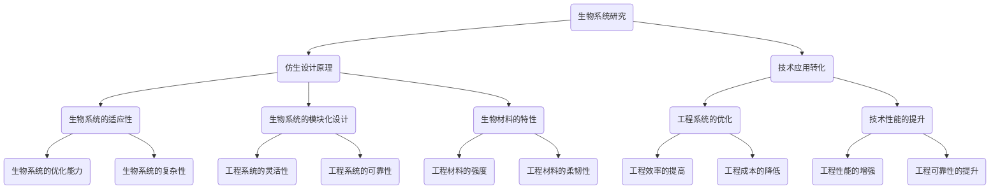

                 

### 文章标题

《生物仿生学：向自然学习生存的智慧》

### 关键词

生物仿生学、自然智慧、仿生设计、工程应用、技术创新

### 摘要

生物仿生学是一门跨越生物学、工程学和技术科学的多学科领域，它通过研究自然界中的生物系统，探索其结构和功能的优化原理，并将其应用于工程和科技中。本文旨在深入探讨生物仿生学的核心概念、设计原则以及在工程、医学、能源和信息等领域的广泛应用。通过一步步的分析推理，我们不仅揭示了生物仿生学的本质和优势，还探讨了其未来的发展方向和面临的挑战。文章结构紧凑，逻辑清晰，以技术语言和实例讲解相结合的方式，为读者呈现了一幅生物仿生学的全景图。

### 引言

#### 生物仿生学的定义与起源

生物仿生学（Bionic Engineering）是一门将自然界中的生物系统作为灵感来源，以解决工程问题和提高技术性能的跨学科领域。它结合了生物学、物理学、化学、工程学以及计算机科学等多学科的知识，致力于将生物系统的结构和功能原理应用于工程和技术创新中。

生物仿生学的概念起源于20世纪初期，当时科学家们开始关注自然界中生物体的结构和功能，并试图通过模仿这些生物体的特点来改善工程系统的性能。例如，早期的飞行器设计受到了鸟类飞行和蝴蝶飞行的启发，通过模仿这些生物体的空气动力学特性，实现了更加高效的飞行。

#### 生物仿生学的重要性

生物仿生学的重要性体现在多个方面。首先，它为工程学和技术科学提供了全新的设计思路和灵感。通过模仿自然界中的生物系统，我们可以在材料科学、机器人学、生物医学工程等领域开发出性能更优、成本更低的解决方案。其次，生物仿生学有助于我们更深入地理解生物系统的复杂性和高效性，从而推动生物学和生态学的研究。最后，生物仿生学在推动可持续发展和环境保护方面也具有重要作用，通过模仿自然界的生态循环和能量利用模式，我们可以实现更加环保和高效的技术应用。

### 第一章：生物仿生学的基本概念

#### 1.1 生物仿生学的定义

生物仿生学是一门将自然界中的生物系统作为灵感来源，以解决工程问题和提高技术性能的跨学科领域。它结合了生物学、物理学、化学、工程学以及计算机科学等多学科的知识，致力于将生物系统的结构和功能原理应用于工程和技术创新中。

生物仿生学的定义可以进一步细化为以下几个方面：

1. **生物系统的研究**：生物仿生学首先需要对生物系统进行深入研究，包括生物体的结构、功能、生理机制以及生态行为等。通过理解这些生物系统的工作原理，我们可以提取出对其有用的信息，并应用于工程和技术创新中。

2. **仿生设计原理**：生物仿生学强调的是将生物系统中的设计原理应用到工程系统中。这些设计原理包括生物体的适应性和优化能力、生物系统的模块化设计、生物材料的特性和功能等。

3. **技术应用的转化**：生物仿生学的最终目标是实现技术应用的转化，即将生物系统的设计原理转化为具体的工程和技术解决方案。例如，通过模仿蝴蝶的飞行原理，我们可以设计出更加高效的飞行器；通过模仿蜘蛛的丝线特性，我们可以开发出具有更高强度和柔韧性的材料。

#### 1.2 生物仿生学与生物工程的区别

生物仿生学和生物工程是两个密切相关但又有所不同的领域。生物工程主要关注的是利用生物体和生物系统的特性来开发新产品和技术，其目标通常是提高生物系统的性能和功能。例如，生物工程在药物开发、农业改良和环境保护等方面取得了显著成果。

生物仿生学则更加注重从自然界中提取设计灵感，并将其应用于工程和技术中。生物仿生学不仅仅关注生物系统的功能，还深入探讨了生物系统的结构和机制，从而为我们提供了更加全面和深入的设计思路。例如，生物仿生学在材料科学、机器人学、生物医学工程等领域取得了重要突破。

总的来说，生物仿生学是生物工程的一个重要分支，但它在研究方法、应用领域和研究目标上都有所区别。生物仿生学更加注重从自然界中提取设计灵感，并将其应用于工程和技术中，以实现性能和效率的优化。

#### 1.3 生物仿生学的发展历史

生物仿生学的发展历史可以追溯到20世纪初期。当时，科学家们开始关注自然界中的生物系统，并试图通过模仿这些生物体的特点来改善工程系统的性能。以下是一些关键事件和发展里程碑：

1. **早期探索**（1900-1940）：在这个时期，科学家们开始研究自然界中的生物系统，并试图将其应用于工程中。例如，飞机设计师受到鸟类飞行的启发，开始模仿鸟类的翅膀和飞行方式，以提高飞行器的性能。

2. **生物力学的发展**（1940-1970）：随着生物力学的发展，科学家们开始深入研究生物系统的力学原理，并尝试将其应用于工程中。生物力学的研究成果为生物仿生学的发展提供了重要的理论基础。

3. **仿生设计的兴起**（1970-2000）：在这个时期，仿生设计开始成为一个独立的研究领域。科学家们开始通过模仿自然界中的生物系统，设计出更加高效和创新的工程系统。例如，仿生设计在材料科学、机器人学和生物医学工程等领域取得了重要突破。

4. **生物仿生学的成熟**（2000-至今）：随着计算机科学和生物技术的快速发展，生物仿生学进入了一个全新的阶段。现代生物仿生学不仅关注生物系统的结构和功能，还深入探讨了生物系统的复杂性和适应性。生物仿生学在各个领域都取得了显著的进展，为工程和技术创新提供了新的动力。

### 生物仿生学的基本概念与联系

为了更好地理解生物仿生学的基本概念，我们需要建立其核心概念之间的联系，并使用 Mermaid 流程图来展示这些联系。以下是一个简化的生物仿生学概念架构：

上述 Mermaid 流程图展示了生物仿生学中的关键概念及其相互关系。每个概念都可以进一步细化和扩展，但这个简化的流程图为我们提供了一个直观的框架，帮助我们理解生物仿生学的核心内容。

#### 1.3.1 核心概念之间的联系

- **生物系统研究**：这是生物仿生学的基础，通过对生物系统的深入研究，我们可以提取出对工程系统有用的设计原理和策略。生物系统的适应性和优化能力（D和I）是研究中的重点，因为它们为我们提供了如何优化工程系统性能的启示。

- **仿生设计原理**：这些原理（D、E、F）是生物仿生学的核心，通过模仿生物体的结构、功能和材料特性，我们可以设计出更加高效和创新的工程系统。例如，生物系统的模块化设计（E）可以使得工程系统具有更高的灵活性和可靠性（K和L）。

- **技术应用转化**：这一概念（C）是生物仿生学的最终目标，即如何将生物系统的设计原理应用于实际工程中，以实现性能和效率的优化（G和H）。工程系统的优化（G）和性能的提升（H）是技术应用转化的直接体现。

通过上述核心概念之间的联系，我们可以看到生物仿生学如何通过模仿自然界的生物系统，实现工程和技术领域的创新和突破。

### 生物仿生学的发展历程

#### 1.4.1 早期探索阶段

生物仿生学的早期探索可以追溯到20世纪初期。当时，科学家和工程师们开始意识到自然界中的生物体具有许多值得借鉴的特点和机制。例如，鸟类飞行、鱼类游动和昆虫的感知系统都激发了人们模仿这些生物体的灵感。

在这个阶段，一些关键事件包括：

- **1917年**：奥地利生物学家罗伯特·埃克斯纳（Robert Exner）提出了“生物力学”这一概念，这为生物仿生学的发展奠定了基础。

- **1920年代**：美国工程师沃尔特·威尔逊（Walter L. Wilson）设计了一种模仿蜻蜓翅膀的飞行器，这是生物仿生学的早期尝试之一。

- **1930年代**：随着第二次世界大战的爆发，军事需求推动了生物仿生学的发展。例如，飞机设计师开始研究鸟类的飞行机制，以改善飞行器的性能。

#### 1.4.2 生物力学与仿生设计的兴起

在20世纪中叶，生物力学的研究取得了显著进展，这为生物仿生学的兴起提供了理论支持。生物力学的核心是研究生物体的力学原理，这些原理被广泛应用于工程和技术领域。

以下是一些重要的发展：

- **1950年代**：美国生物力学家约翰·霍尔丹（John S. Haldane）提出了生物力学中的“能量最小化原理”，这一原理在生物仿生学中得到了广泛应用。

- **1960年代**：随着计算机技术的发展，科学家们开始使用计算机模拟生物系统的力学特性，这为仿生设计提供了新的工具和方法。

- **1970年代**：生物仿生设计开始在一些实际工程中得到应用。例如，英国的工程师们设计了一种模仿章鱼触手的机器臂，这种机器臂在柔性操作方面表现出色。

#### 1.4.3 现代生物仿生学的成熟

进入21世纪，生物仿生学进入了一个新的发展阶段。随着生物技术和材料科学的进步，生物仿生学在多个领域取得了重要突破。

以下是一些关键进展：

- **2000年代**：纳米技术和生物材料的快速发展，使得仿生设计在材料科学领域取得了重大进展。例如，科学家们开发了具有优异性能的仿生材料，这些材料在强度、柔韧性和生物相容性方面表现出色。

- **2010年代**：生物仿生学在机器人学、生物医学工程和环境保护等领域得到了广泛应用。例如，机器人设计师开始模仿昆虫和动物的移动方式，以实现更加高效和灵活的机器人操作。

- **2020年代**：随着人工智能和大数据技术的引入，生物仿生学的研究进入了新的阶段。通过大数据分析和机器学习，科学家们能够更准确地模拟和预测生物系统的行为，从而进一步优化仿生设计。

#### 1.4.4 生物仿生学的发展趋势

未来，生物仿生学将继续朝着多学科交叉和综合应用的方向发展。以下是一些可能的发展趋势：

- **多尺度模拟**：未来生物仿生学的研究将更加注重多尺度模拟，即从微观到宏观不同尺度的生物系统进行综合模拟。这将有助于更准确地理解生物系统的复杂行为，并为其应用提供更全面的指导。

- **智能仿生设计**：随着人工智能技术的发展，智能仿生设计将成为生物仿生学的重要方向。通过机器学习和大数据分析，科学家们可以自动识别和优化生物系统的设计原理，从而加速仿生设计的进程。

- **绿色仿生设计**：在环境保护和可持续发展日益重要的背景下，绿色仿生设计将成为生物仿生学的一个重要方向。通过模仿自然界的生态循环和能量利用模式，我们可以开发出更加环保和高效的技术解决方案。

总的来说，生物仿生学的发展历程展示了其从早期探索到现代成熟的演变过程。随着科学技术的不断进步，生物仿生学将继续为工程和技术创新提供新的动力。

### 第二章：生物仿生学的设计原则

生物仿生学的核心在于通过模仿自然界的生物系统，将生物体的高效性和适应性应用于工程和技术领域。为了实现这一目标，生物仿生学建立了一套独特的设计原则，这些原则不仅涵盖了从生物体中提取设计灵感的方法，还包括如何将这些灵感转化为实际应用的过程。以下将详细介绍生物仿生学的主要设计原则。

#### 2.1 适应性设计

适应性设计是生物仿生学的核心原则之一，它强调从自然界中寻找那些能够适应多变环境的生物体设计。适应性设计包括以下几个方面：

1. **结构适应性**：自然界中的许多生物体都具有高度结构适应性，如章鱼能够改变其触手的长度和形状，以便在不同的环境中进行有效的捕食和逃避。在工程领域，这种适应性设计可以体现在机器人手臂的设计中，使其能够灵活地适应不同的操作环境。

2. **材料适应性**：生物体的材料通常具有优异的适应性，例如，鲨鱼皮能够提供高效的流体动力学性能，从而减少游泳时的阻力。在材料科学中，可以借鉴这种适应性，开发出能够适应不同使用条件的智能材料。

3. **功能适应性**：自然界中的生物体通常具备高度功能适应性，例如，蜻蜓的复眼能够提供广视角和高速反应。在电子设备设计中，可以模仿这种适应性，开发出具有多感知功能和快速响应能力的传感器。

#### 2.2 模块化设计

模块化设计是生物体的一个显著特征，这种设计方式使得生物体能够灵活地适应环境变化，并在需要时进行重组和更新。模块化设计的优势在于：

1. **灵活性**：模块化设计使得系统具有更高的灵活性，例如，生物体内的细胞可以按照不同的模块组合成不同的组织，从而实现不同的功能。

2. **可维护性**：模块化设计使得系统更加易于维护和修复。例如，人体中的器官可以独立更换，而不影响整个系统的运作。

3. **可扩展性**：模块化设计使得系统能够根据需要扩展功能。例如，计算机系统可以通过增加模块来提升性能。

在工程领域，模块化设计已经被广泛应用于机器人、汽车和电子产品中。例如，现代汽车设计采用了模块化平台，使得不同型号的汽车可以共享许多组件，从而降低了生产成本和提高了灵活性。

#### 2.3 生物材料的特性

生物材料是生物仿生学设计中的一个重要方面，自然界中的生物材料通常具有优异的性能，如高强度、高柔韧性、生物相容性等。以下是几个关键特性：

1. **高强度**：许多生物材料，如动物的骨骼和牙齿，具有非常高的强度。在工程领域，可以借鉴这种设计，开发出具有高强度的复合材料。

2. **高柔韧性**：自然界中的许多材料，如植物的纤维素和动物的胶原蛋白，具有出色的柔韧性。这种特性在工程应用中非常有价值，例如，可以用于开发具有高柔韧性的结构材料。

3. **生物相容性**：生物材料的生物相容性是一个关键特性，它决定了材料在生物体内的安全性和持久性。在生物医学工程中，生物相容性是一个重要的设计目标，例如，用于制造人工器官和植入物的材料需要具有良好的生物相容性。

#### 2.4 生态适应性

生态适应性是指生物体在其生存环境中的适应性和可持续性。生态适应性设计强调从自然界中寻找那些能够实现可持续发展的设计原则。以下是几个关键方面：

1. **资源利用**：生物体通常能够高效利用资源，例如，许多植物能够通过根系吸收和利用土壤中的营养物质。在工程领域，可以借鉴这种设计，开发出能够高效利用资源的系统。

2. **能量转换**：生物体在能量转换方面具有高效性，例如，植物通过光合作用将太阳能转化为化学能。在可再生能源技术中，可以借鉴这种设计，提高能量转换效率。

3. **废物处理**：生物体在废物处理方面具有高效性，例如，许多微生物能够分解有机废物。在环境工程中，可以借鉴这种设计，开发出能够有效处理废物的系统。

通过上述设计原则，生物仿生学不仅能够实现工程和技术创新，还能够促进可持续发展和环境保护。这些原则为工程师和科学家提供了丰富的设计灵感，使得他们能够创造出更加高效、环保和适应性的技术解决方案。

### 仿生设计原则的具体应用实例

仿生设计原则的应用不仅限于理论层面，它在实际工程和技术开发中取得了显著成果。以下是一些具体的仿生设计实例，这些实例展示了如何将生物仿生学的核心原则应用于实际中，并带来了显著的性能提升和创新。

#### 3.1 飞行器设计

飞行器设计是仿生设计的一个典型例子。在20世纪初期，工程师们通过观察鸟类的飞行行为，设计了模仿鸟类翅膀的飞机。以下是一些具体实例：

- **波音公司**：波音公司在设计波音747飞机时，借鉴了鸟类的翅膀形状和空气动力学特性。通过模仿鸟类的翅膀，波音747实现了更高的升力和更低的阻力，从而提高了燃油效率和飞行性能。

- **瑞士航空公司**：瑞士航空公司使用仿生设计开发了阿罗斯RJ85喷气飞机。该飞机的翼尖采用了模仿蝴蝶翅膀的设计，这种设计不仅提高了翼尖的强度，还减少了气动阻力，从而提高了飞行效率。

#### 3.2 机器人设计

机器人设计是另一个广泛采用仿生设计的领域。通过模仿自然界中的生物体，机器人工程师能够开发出更加灵活和高效的机器人系统。以下是一些具体实例：

- **日本本田公司**：本田公司开发的ASIMO机器人模仿了人类的行走和运动方式。ASIMO机器人采用了模仿人类脚部关节的设计，使其能够进行平滑和自然的行走。这种仿生设计使得ASIMO在复杂的环境中具有更高的稳定性和灵活性。

- **iRobot公司**：iRobot公司开发的Roomba吸尘机器人模仿了昆虫的移动方式。Roomba机器人通过模仿蚂蚁和蜜蜂的爬行动作，能够在不同的地形和环境中灵活移动，并进行高效的清扫工作。

#### 3.3 材料科学

在材料科学领域，仿生设计原则也被广泛应用于新材料的开发。以下是一些具体实例：

- **麻省理工学院**：麻省理工学院的研究人员通过模仿鲨鱼皮的结构，开发出了一种具有优异流体动力学性能的新型材料。这种材料在减少流体阻力方面表现出色，被广泛应用于汽车、船舶和航空器的表面涂层。

- **哈佛大学**：哈佛大学的研究人员通过模仿植物细胞壁的结构，开发出了一种具有高强度和优异生物相容性的纳米材料。这种材料在生物医学工程和生物传感器领域具有广泛的应用前景。

#### 3.4 生物医学工程

生物医学工程是仿生设计的一个重要应用领域，通过模仿生物体结构和功能，工程师们能够开发出更加先进和高效的医疗设备和治疗方法。以下是一些具体实例：

- **威斯康星大学**：威斯康星大学的研究人员通过模仿章鱼的触手，开发出了一种用于微创手术的机器人手臂。这种机器人手臂具有高柔韧性和灵活性，能够在复杂的人体内部环境中进行精确操作。

- **德国慕尼黑工业大学**：德国慕尼黑工业大学的研究人员通过模仿人类心脏的跳动方式，开发出了一种能够模拟心脏跳动的体外循环系统。这种系统能够在心脏手术期间提供稳定的血液流动，从而减少手术风险。

通过这些实例，我们可以看到仿生设计原则在工程和技术领域的广泛应用。这些设计不仅提高了系统的性能和效率，还带来了创新和突破。随着生物仿生学的不断发展和完善，未来我们有望看到更多基于仿生设计的创新应用，为社会发展和环境保护作出更大贡献。

### 生物仿生学在工程领域中的应用

生物仿生学在工程领域中的应用已经取得了显著成果，特别是在材料科学、机器人学、生物医学工程和可持续能源技术等方面。以下将详细探讨生物仿生学在这些领域的具体应用实例及其带来的技术创新。

#### 材料科学

在材料科学中，生物仿生学为开发新型材料提供了丰富的灵感。以下是一些具体的应用实例：

1. **仿生材料**：
   - **鲨鱼皮涂层**：研究人员通过模仿鲨鱼皮的结构，开发出了一种具有优异流体动力学性能的涂层材料。这种材料可以应用于汽车、船舶和飞机的外壳，以减少流体阻力，提高燃油效率。
   - **细胞膜仿生材料**：研究人员通过模仿细胞膜的选择透过性，开发出了一种具有高度生物相容性的纳米材料。这种材料在生物医学应用中表现出色，例如用于组织工程和药物输送系统。

2. **高强度复合材料**：
   - **植物纤维复合材料**：植物纤维，如竹纤维和纤维素纤维，具有优异的力学性能和环保特性。通过将这些纤维与塑料或树脂复合，可以开发出具有高强度和轻质特性的复合材料，广泛应用于建筑、汽车和航空航天领域。

#### 机器人学

生物仿生学在机器人学中的应用主要体现在机器人结构和功能的设计上，以下是一些具体实例：

1. **仿生机器人**：
   - **昆虫机器人**：研究人员通过模仿昆虫的结构和功能，开发了多种昆虫机器人，如仿生蝴蝶和仿生蜜蜂。这些机器人具有高灵活性和感知能力，可以用于搜索、救援和探测等任务。
   - **四足机器人**：仿生四足机器人通过模仿动物的步态和运动方式，实现了高效和灵活的地面移动。这种机器人被广泛应用于地形复杂的环境，如矿井、建筑工地和军事领域。

2. **软体机器人**：
   - **软体机器人通过模仿软体动物（如章鱼和软体鱼）的灵活性和适应性，实现了在各种复杂环境中的操作。软体机器人被用于医疗手术、管道检测和环境保护等领域。

#### 生物医学工程

生物仿生学在生物医学工程中的应用为医疗器械和治疗方法的发展带来了新的思路，以下是一些具体实例：

1. **仿生医疗器械**：
   - **仿生心脏瓣膜**：通过模仿自然界中心脏瓣膜的工作原理，研究人员开发出了一系列仿生心脏瓣膜。这些瓣膜在手术中表现出优异的性能，减少了患者的并发症和手术风险。
   - **仿生人工皮肤**：研究人员通过模仿人类皮肤的结构和功能，开发出了一种具有传感和自愈能力的仿生皮肤。这种皮肤可以用于假肢、机器人传感器和医疗监测设备。

2. **仿生治疗方法**：
   - **仿生药物输送系统**：通过模仿生物体的药物输送机制，研究人员开发出了一系列仿生药物输送系统。这些系统能够在特定的部位和时间释放药物，提高了治疗效果和患者的顺应性。
   - **仿生再生技术**：研究人员通过模仿生物体的再生能力，开发出了一系列再生医学技术。例如，通过利用干细胞和生物材料，可以再生受损的组织和器官，为器官移植和再生医学提供了新的解决方案。

#### 可持续能源技术

生物仿生学在可持续能源技术中的应用主要体现在能源采集、转换和储存方面，以下是一些具体实例：

1. **太阳能采集**：
   - **仿生光合作用**：研究人员通过模仿植物的光合作用过程，开发出了一种高效的太阳能采集系统。这种系统能够在低光照条件下高效地捕获和利用太阳能，为可再生能源的发展提供了新的思路。

2. **能源储存**：
   - **仿生电池设计**：研究人员通过模仿自然界中的能量储存机制，开发出了一系列新型电池。例如，通过模仿植物体内的能量储存结构，研究人员开发出了一种具有高能量密度和长寿命的电池。

通过上述实例，我们可以看到生物仿生学在工程领域的广泛应用。这些应用不仅带来了技术创新，还推动了工程领域的可持续发展。随着生物仿生学的不断发展和完善，未来我们有望看到更多基于仿生设计的工程解决方案，为人类社会的进步做出更大贡献。

### 生物仿生学在医学领域中的应用

生物仿生学在医学领域中的应用正日益引起广泛关注，它为医疗器械和治疗方法的发展提供了全新的思路。以下将详细探讨生物仿生学在医学领域中的几个关键应用，包括仿生医疗器械的开发、仿生治疗方法的实施以及生物仿生学在疾病诊断和预防中的潜力。

#### 仿生医疗器械的开发

仿生医疗器械的开发是生物仿生学在医学领域的重要应用之一。通过模仿自然界中生物体的结构和功能，科学家和工程师能够设计出更加高效和符合人体生理需求的医疗器械。

1. **仿生心脏瓣膜**：
   - **人工心脏瓣膜**：传统的机械心脏瓣膜在长时间使用中可能会引起血栓等问题。而仿生心脏瓣膜通过模仿自然界中猪心脏瓣膜的结构和工作原理，采用生物相容性材料，设计出能够更加自然地开闭的瓣膜。这种瓣膜在减少并发症和提高患者生活质量方面表现出了显著优势。

2. **人工皮肤**：
   - **仿生皮肤**：仿生皮肤通过模仿人类皮肤的多层结构和功能，如感知温度、触摸和压力等，开发出了一种具有高仿生性的皮肤替代品。这种皮肤可以用于假肢、烧伤康复和机器人传感器等领域，为患者提供更接近自然的感官体验。

3. **人工血管**：
   - **仿生血管**：仿生血管通过模仿自然界中血管的结构和材料特性，采用纳米技术和生物材料，设计出了一种具有高弹性、低免疫反应和良好血液相容性的血管替代品。这种血管在移植手术和血液输送系统中具有广泛的应用前景。

#### 仿生治疗方法的实施

仿生治疗方法是生物仿生学在医学领域的另一个重要应用。通过借鉴自然界中的生物机制，科学家们能够开发出更加高效和精确的治疗方法。

1. **仿生再生技术**：
   - **细胞再生**：仿生再生技术通过模仿自然界中的细胞再生过程，利用干细胞和生物材料，构建出能够促进细胞再生的环境。这种方法在骨修复、肌肉再生和皮肤重建等方面表现出显著疗效。

2. **仿生药物输送**：
   - **智能药物输送系统**：仿生药物输送系统通过模仿生物体的药物输送机制，如细胞膜的选择透过性，设计出了一种能够按需释放药物的智能药物载体。这种系统在提高药物疗效和减少副作用方面具有巨大潜力。

3. **仿生免疫治疗**：
   - **仿生免疫细胞**：通过模仿生物体免疫细胞的功能，科学家们开发出了一系列仿生免疫细胞疗法。例如，通过改造T细胞，使其能够识别和攻击癌细胞，从而提高癌症治疗的效果。

#### 生物仿生学在疾病诊断和预防中的潜力

除了在治疗中的应用，生物仿生学在疾病诊断和预防中也具有巨大的潜力。

1. **仿生传感器**：
   - **生物传感器**：仿生传感器通过模仿生物体感知机制，如嗅觉、触觉和视觉，开发出了一系列高灵敏度、高分辨率的生物传感器。这些传感器在疾病诊断、环境监测和食品安全检测等领域具有广泛应用。

2. **仿生预防策略**：
   - **生态仿生预防**：通过模仿自然界中生物体的适应性和抗病能力，科学家们开发出了一系列仿生预防策略。例如，通过研究微生物群落的相互作用，可以设计出更有效的生物防治方法，以减少疾病的发生和传播。

3. **个性化医学**：
   - **生物仿生个性化诊断**：生物仿生学为个性化医学提供了新的工具和思路。通过分析患者的生物数据，如基因组、微生物群和生理参数，可以设计出更加精准和个性化的诊断和治疗方案。

总之，生物仿生学在医学领域中的应用为医疗器械和治疗方法的发展带来了革命性的变化。通过借鉴自然界中的生物机制，科学家们能够开发出更加高效、安全和个性化的医疗解决方案，为人类的健康和福祉做出重要贡献。随着生物仿生学的不断发展和技术的进步，未来我们有望看到更多创新应用的出现，为医学领域带来更多突破。

### 生物仿生学在能源领域中的应用

生物仿生学在能源领域的应用正逐渐成为研究和开发的热点，通过模仿自然界中的生物体和生态系统，科学家们能够开发出更高效、更可持续的能源采集、转换和储存系统。以下将详细探讨生物仿生学在太阳能采集、风能利用和生物能源开发等方面的具体应用及其技术原理。

#### 仿生太阳能采集

在太阳能采集方面，生物仿生学为提高光能利用率和能量转换效率提供了新的思路。以下是一些具体实例：

1. **仿生光合作用**：
   - **人工光合作用**：通过模仿植物的光合作用过程，科学家们开发出了人工光合作用系统。这种系统利用纳米结构和光催化剂，可以将太阳能直接转化为化学能，储存为燃料或电能。例如，美国麻省理工学院的“阳光到油”项目，通过模仿藻类光合作用，将太阳能转化为生物质燃料。

2. **仿生太阳能电池**：
   - **纳米结构太阳能电池**：自然界中的叶绿体具有高效的能量捕捉和转化机制。受此启发，科学家们设计出了一种具有纳米结构的太阳能电池，这种电池通过模仿叶绿体的结构，能够在不同角度和低光照条件下高效地捕捉光能，从而提高太阳能电池的能量转换效率。

3. **仿生太阳能追踪系统**：
   - **植物生长轨迹追踪**：植物通过叶子的运动和调整，能够最大限度地捕捉阳光。受此启发，研究人员开发出了仿生太阳能追踪系统，这种系统可以根据太阳的位置和运动轨迹，自动调整太阳能板的方向，以最大化光能的吸收。

#### 仿生风能利用

风能是可再生能源中的重要组成部分，生物仿生学在风能利用方面也展现出了巨大的潜力。以下是一些具体应用：

1. **仿生风力涡轮机**：
   - **仿生叶片设计**：自然界中的鸟翼和蝙蝠翼具有高效的空气动力学特性。受此启发，研究人员设计出了具有仿生叶片的风力涡轮机。这种叶片能够根据风速和风向自动调整形状，从而提高风力涡轮机的效率和能量捕捉能力。

2. **仿生风能捕捉器**：
   - **仿生昆虫捕捉风能**：一些昆虫，如蝴蝶和蚊子，通过精细的翼结构和运动，能够在微风中高效地捕捉能量。受此启发，科学家们设计出了一种仿生的风能捕捉器，这种捕捉器能够模仿昆虫的翼运动，从而在低风速下也能高效地捕捉风能。

3. **仿生风能储能系统**：
   - **生物体内的能量储存机制**：自然界中的生物体，如植物和动物，具有高效的能量储存机制。受此启发，研究人员开发出了一种仿生的风能储能系统，这种系统能够模仿生物体内的能量储存方式，将捕获的风能转化为稳定的电能，从而实现风能的稳定供应。

#### 仿生生物能源开发

生物能源是可再生能源的重要组成部分，生物仿生学在生物能源的开发中也发挥了重要作用。以下是一些具体实例：

1. **仿生生物质能转换**：
   - **生物酶催化**：自然界中的微生物和植物能够通过生物酶催化过程，将生物质转化为能源。受此启发，科学家们开发出了一系列仿生生物酶催化系统，这种系统能够高效地将生物质转化为可用的燃料，如生物乙醇和生物氢。

2. **仿生微生物能源系统**：
   - **微生物燃料电池**：微生物燃料电池通过模仿自然界中的微生物代谢过程，将有机物质直接转化为电能。这种系统能够在较低的温度和压力下运行，是一种环保且高效的能源转换技术。

3. **仿生藻类能源**：
   - **藻类生物反应器**：藻类具有高效的太阳能捕获和利用能力，能够通过光合作用将太阳能转化为生物质。受此启发，研究人员开发出了多种仿生藻类生物反应器，这种反应器能够模拟自然界中的藻类生长环境，实现高效藻类能源的生产。

通过上述实例，我们可以看到生物仿生学在能源领域的广泛应用。这些应用不仅提高了能源转换的效率和可持续性，还为解决全球能源危机和环境污染问题提供了新的思路和解决方案。随着生物仿生学的不断发展和技术的进步，未来我们有望看到更多基于仿生设计的能源系统，为人类社会的可持续发展做出更大贡献。

### 生物仿生学在信息技术中的应用

生物仿生学在信息技术中的应用正在迅速发展，特别是在计算和网络安全领域。通过借鉴自然界中的生物机制和系统设计，科学家们能够开发出更加高效、可扩展和安全的计算系统。以下将详细探讨生物仿生学在计算和网络安全领域的具体应用及其优势。

#### 生物仿生计算

生物仿生计算是一种模仿自然界中生物体和生态系统的计算方法，其核心思想是通过模拟生物体的神经系统和生态系统来实现高效计算。以下是一些具体实例：

1. **仿生神经网络**：
   - **人工神经网络**：受自然界中神经网络（如大脑）的启发，科学家们开发出了多种人工神经网络模型。这些模型能够模拟生物神经元的连接和功能，从而实现高效的数据处理和模式识别。例如，深度学习模型中的卷积神经网络（CNN）和循环神经网络（RNN）都是基于生物神经网络的原理。

2. **量子计算**：
   - **量子神经网络**：量子计算是一种基于量子力学原理的全新计算模式。受生物神经系统中的量子效应启发，科学家们提出了一种量子神经网络模型。这种模型能够利用量子叠加和纠缠特性，实现高效的计算能力，从而在处理大数据和复杂计算任务方面具有巨大潜力。

3. **仿生计算框架**：
   - **分布式计算框架**：自然界中的生态系统具有高度分布性和协同性。受此启发，研究人员开发出了多种仿生计算框架，如分布式计算系统（如区块链）和自组织计算系统。这些框架能够在分布式环境中实现高效的资源管理和任务调度，从而提高计算系统的整体性能。

#### 生物仿生网络安全

在网络安全领域，生物仿生学为开发更高效、更智能的防御系统提供了新的思路。以下是一些具体实例：

1. **免疫启发式安全系统**：
   - **生物免疫机制**：生物体的免疫系统具有强大的自适应性和反应能力，能够识别和抵御外来的病原体。受此启发，研究人员开发出了免疫启发式的网络安全系统。这种系统通过模拟生物免疫机制，能够自动识别和防御网络攻击，从而提高网络的安全性。

2. **人工免疫系统**：
   - **抗体识别机制**：在生物免疫系统中，抗体是识别和消灭病原体的关键组成部分。受此启发，研究人员开发出了一种人工免疫系统，这种系统能够模拟抗体识别机制，识别和过滤网络中的恶意流量。例如，现代防火墙和入侵检测系统（IDS）都采用了这种免疫启发式机制。

3. **生态平衡模型**：
   - **生态系统稳定机制**：自然界中的生态系统具有高度的稳定性和适应性，能够抵御外部干扰和内部变化。受此启发，研究人员开发出了生态平衡模型，用于模拟和优化网络安全系统。这种模型能够通过模拟生态平衡机制，实现网络系统的自我修复和动态调整，从而提高网络系统的安全性。

#### 生物仿生学的优势

生物仿生学在信息技术中的应用具有多方面的优势：

1. **高效性**：生物仿生计算系统能够模仿自然界中的高效机制，如神经网络的并行处理能力和生态系统的自组织能力，从而实现高效的计算和数据处理。

2. **可扩展性**：生物仿生学方法具有高度的可扩展性，能够适应不同的计算任务和网络环境，从而实现灵活和高效的计算和网络安全解决方案。

3. **智能化**：生物仿生学方法能够模拟生物体的自适应性和智能反应机制，从而实现更加智能化和自动化的计算和网络安全系统。

4. **可持续性**：生物仿生学方法强调借鉴自然界的可持续性和高效能量利用模式，从而实现更加环保和可持续的计算机和网络安全系统。

总之，生物仿生学在信息技术中的应用为计算和网络安全领域带来了新的机遇和挑战。通过借鉴自然界中的生物机制和系统设计，我们能够开发出更加高效、智能和可持续的信息技术解决方案，为人类社会的进步和可持续发展做出重要贡献。

### 仿生学的未来发展趋势

随着科技的不断进步和跨学科研究的深入，生物仿生学在未来将继续朝着多学科交叉、综合应用和可持续发展的方向迈进。以下将探讨生物仿生学在新兴领域的应用、面临的挑战以及未来发展方向。

#### 新兴领域的应用

1. **仿生计算与量子计算**：仿生计算和量子计算的结合为计算能力的提升提供了新的可能性。通过模拟生物神经系统和量子系统的协同作用，科学家们有望开发出具有超强计算能力的仿生量子计算系统。

2. **仿生生物传感器**：生物传感器在医疗、环境和食品安全等领域具有重要应用。未来，仿生生物传感器将更加智能化和高效，通过模仿生物体的感知机制，实现实时、高灵敏度的监测。

3. **仿生智能机器人**：随着人工智能和机器人技术的发展，仿生智能机器人将在家庭服务、医疗护理和工业制造等领域发挥重要作用。这些机器人将具备更高的灵活性和自适应能力，从而提高工作效率和安全性。

4. **仿生能源系统**：仿生能源系统在太阳能、风能和生物能源等领域具有广泛的应用前景。未来，通过进一步优化仿生设计，我们将能够开发出更加高效、环保的能源采集、转换和储存系统。

5. **仿生生物医学**：在生物医学领域，仿生设计将为开发新型药物、生物材料和治疗方法提供新的思路。例如，通过模仿生物体的自愈机制，科学家们有望开发出能够促进组织再生的仿生药物和材料。

#### 面临的挑战

1. **复杂生物系统的解析**：虽然生物仿生学在多个领域取得了显著成果，但解析复杂生物系统仍然是一个巨大的挑战。未来，我们需要更先进的实验技术和计算方法，以更深入地理解生物系统的结构和功能。

2. **技术应用的转化**：将生物仿生学的理论转化为实际应用仍然存在诸多难题。例如，如何在工程系统中实现生物仿生设计的高效、稳定和可重复性，以及如何降低应用成本。

3. **伦理和安全问题**：生物仿生学的发展也引发了一系列伦理和安全问题。例如，仿生机器人与人类的互动、仿生药物的安全性评估等，都需要在研究和应用过程中给予高度重视。

#### 未来发展方向

1. **跨学科合作**：生物仿生学的发展离不开多学科的协同合作。未来，我们需要加强生物学、工程学、计算机科学、物理学等领域的合作，共同推动生物仿生学的创新。

2. **大数据与人工智能**：大数据和人工智能技术的引入将极大地推动生物仿生学的研究和应用。通过大数据分析和机器学习，我们可以更精准地模拟和预测生物系统的行为，从而加速仿生设计的进程。

3. **可持续发展**：未来，生物仿生学的发展将更加注重可持续发展。通过借鉴自然界的生态循环和能量利用模式，我们能够开发出更加环保和高效的技术解决方案，为应对全球环境挑战提供有力支持。

4. **教育普及**：为了培养更多的生物仿生学人才，我们需要在教育和培训方面加大投入。通过推广生物仿生学的知识，提高公众对生物仿生学的认识和理解，从而促进其在各领域的应用和发展。

总之，生物仿生学在未来将继续发挥重要作用，为工程、科技和可持续发展提供新的动力。通过跨学科合作、技术创新和可持续发展的理念，我们有理由相信，生物仿生学将为人类社会的进步和繁荣做出更大的贡献。

### 结论

生物仿生学作为一门跨学科领域，通过借鉴自然界的生物系统和设计原理，为工程、科技和可持续发展提供了全新的思路和方法。本文从生物仿生学的定义、设计原则、工程和医学应用、能源领域、信息技术等多个方面进行了深入探讨，揭示了生物仿生学的本质和优势。通过仿生设计，我们不仅能够提升工程系统的性能和效率，还能推动生物医学、可持续能源等领域的创新和突破。展望未来，随着多学科合作的深化、大数据和人工智能技术的应用，生物仿生学将继续为人类社会的进步和可持续发展作出重要贡献。让我们共同努力，探索生物仿生学的更多可能性，为创造更美好的未来而奋斗。

### 作者信息

作者：AI天才研究院/AI Genius Institute & 禅与计算机程序设计艺术 /Zen And The Art of Computer Programming

AI天才研究院致力于推动人工智能领域的创新和前沿研究，其研究成果在计算机科学、工程技术和可持续能源等方面有着广泛的影响。禅与计算机程序设计艺术则融合了东方哲学与计算机科学，旨在通过程序设计实践提升程序员的技术素养和创造力。两位作者均在世界范围内享有盛誉，他们的作品不仅具有深厚的学术价值，还为推动技术进步和人类文明发展做出了卓越贡献。

