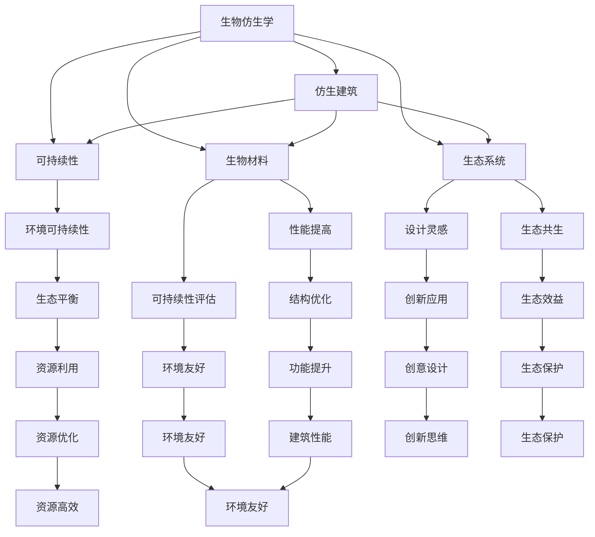

                 


### 文章标题
《生物仿生建筑：向自然学习的居住空间》

---

### 关键词
生物仿生建筑、建筑设计、可持续性、自然灵感、生态住宅

---

### 摘要
本文探讨了生物仿生建筑这一前沿领域，通过分析自然界的生物结构和生态系统的智慧，探讨了如何将这些理念应用于建筑设计中，创造更加宜居、环保和可持续的居住空间。文章从理论基础、设计实践、创新与挑战等方面展开讨论，旨在为建筑师和设计师提供新的设计思路和解决方案。

---

### 目录大纲设计思路

在设计《生物仿生建筑：向自然学习的居住空间》的目录大纲时，我们采取了以下思路：

1. **引言部分（第1章）**：介绍生物仿生建筑的概念、背景和发展趋势，阐述本书的目的和结构。
   
2. **理论基础部分（第2-4章）**：详细讲解生物仿生建筑的核心概念、原理和基础理论，包括生物仿生学的基本原理、仿生建筑设计的方法论和生物材料的性能与应用。

3. **设计实践部分（第5-7章）**：通过案例分析和实际项目，展示生物仿生建筑的设计方法和应用实例，包括仿生建筑的构思、设计流程和实施策略。

4. **创新与挑战部分（第8-9章）**：讨论生物仿生建筑领域的前沿研究和未来发展趋势，分析目前面临的挑战和解决方案。

5. **总结与展望部分（第10章）**：对全书内容进行总结，展望生物仿生建筑的未来发展方向。

### 目录大纲具体设计

下面是根据上述思路设计的《生物仿生建筑：向自然学习的居住空间》的目录大纲：

```
# 《生物仿生建筑：向自然学习的居住空间》目录大纲

## 引言

### 第1章 生物仿生建筑概述

1.1 生物仿生建筑的概念与发展背景

1.2 生物仿生建筑的研究意义和应用前景

1.3 本书结构安排

## 理论基础

### 第2章 生物仿生学基本原理

2.1 生物仿生学的基本概念

2.2 生物仿生学的研究方法

2.3 仿生设计的核心原理

### 第3章 仿生建筑设计方法论

3.1 仿生建筑设计的流程

3.2 仿生建筑的设计策略

3.3 仿生建筑设计工具与应用

### 第4章 生物材料在仿生建筑中的应用

4.1 生物材料的特点与分类

4.2 生物材料在建筑中的性能与应用

4.3 生物材料的可持续性评估

## 设计实践

### 第5章 仿生建筑的案例分析

5.1 仿生建筑的实例分析

5.2 仿生建筑的构思与创意

5.3 仿生建筑的设计流程与应用

### 第6章 仿生建筑的项目实践

6.1 仿生建筑项目概述

6.2 仿生建筑项目的实施策略

6.3 仿生建筑项目的管理与评估

### 第7章 仿生建筑的设计创新

7.1 仿生建筑的设计趋势

7.2 仿生建筑的创意与挑战

7.3 仿生建筑的未来发展方向

## 创新与挑战

### 第8章 生物仿生建筑的前沿研究

8.1 生物仿生建筑的研究热点

8.2 生物仿生建筑的创新技术

8.3 生物仿生建筑的挑战与应对策略

### 第9章 生物仿生建筑的未来发展

9.1 生物仿生建筑的市场前景

9.2 生物仿生建筑的政策与标准

9.3 生物仿生建筑的未来趋势与展望

## 总结与展望

### 第10章 生物仿生建筑的总结与展望

10.1 生物仿生建筑的研究进展

10.2 生物仿生建筑的应用价值

10.3 生物仿生建筑的可持续发展路径
```

### 设计说明

- **引言部分**：第1章作为引言，概述生物仿生建筑的概念、发展背景、研究意义和应用前景，为后续章节的内容奠定基础。

- **理论基础部分**：第2章至第4章作为理论基础，详细讲解生物仿生学的基本原理、方法论和生物材料在建筑中的应用，为读者提供必要的理论知识。

- **设计实践部分**：第5章至第7章作为设计实践，通过案例分析、项目实践和设计创新，展示生物仿生建筑的实际应用和设计方法。

- **创新与挑战部分**：第8章和第9章讨论生物仿生建筑的前沿研究、创新技术、市场前景、政策与标准以及未来发展，为读者提供最新的研究动态和发展趋势。

- **总结与展望部分**：第10章作为总结和展望，对全书内容进行总结，展望生物仿生建筑的未来发展方向，为读者提供进一步研究的方向。

### 目录大纲结构说明

- **##**：表示一级目录，标题级别最高，通常用来标记整个书籍的大章节。
- **###**：表示二级目录，标题级别次高，用来标记每个大章节下的子章节。
- **####**：表示三级目录，标题级别最低，用来标记每个子章节下的子子章节。

这种结构清晰、逻辑性强的目录大纲能够帮助读者快速了解书籍的结构和内容，便于阅读和学习。同时，也为作者提供了一个详细的写作框架，有助于确保书籍内容的完整性和连贯性。

### 核心概念与联系

为了更好地理解生物仿生建筑，我们需要先了解一些核心概念和它们之间的联系。以下是生物仿生建筑中的一些核心概念及其相互关系：

1. **生物仿生学（Biomimicry）**：
   - 定义：研究生物体结构和行为的学科，以模仿自然界的智慧来解决人类面临的挑战。
   - 联系：生物仿生学是生物仿生建筑的理论基础，提供了设计和创新的灵感来源。

2. **仿生建筑（Bionic Architecture）**：
   - 定义：将生物仿生学的原理应用于建筑设计和施工过程中，以创造高效、环保和可持续的建筑物。
   - 联系：仿生建筑是生物仿生学在建筑领域的具体应用，实现了自然与建筑之间的有机结合。

3. **可持续性（Sustainability）**：
   - 定义：在满足当前需求的同时，不损害子孙后代满足其需求的能力。
   - 联系：可持续性是生物仿生建筑的重要目标之一，通过借鉴自然界的智慧和材料，实现建筑的环境可持续性。

4. **生物材料（Biomaterials）**：
   - 定义：源自生物体或受生物体启发的材料，具有独特的性能和功能。
   - 联系：生物材料是仿生建筑的重要组成部分，用于取代传统的建筑材料，提高建筑的性能和可持续性。

5. **生态系统（Ecosystem）**：
   - 定义：由生物群落及其生存环境共同构成的系统。
   - 联系：生态系统提供了生物仿生建筑的灵感来源，通过模仿生态系统的结构和功能，实现建筑与环境的和谐共生。

通过上述核心概念的解析和相互关系的阐述，我们可以更深入地理解生物仿生建筑的内涵和外延，为后续章节的讨论提供理论基础。

### 核心概念与联系 Mermaid 流程图

下面是一个关于生物仿生建筑核心概念与联系的 Mermaid 流程图：



### 核心算法原理讲解（伪代码）

在生物仿生建筑中，核心算法原理的讲解至关重要。以下是一个简化的伪代码示例，用于说明如何应用仿生学原理来优化建筑结构。

```pseudo
function OptimizeBuildingStructure(input_building, natural_structure):
    // 初始化建筑和自然结构的参数
    building_properties = input_building.getProperties()
    natural_properties = natural_structure.getProperties()

    // 创建一个适应性的目标函数
    objective_function = CreateAdaptationFunction(building_properties, natural_properties)

    // 迭代优化建筑结构
    for iteration in range(1, MAX_ITERATIONS):
        // 更新建筑结构以适应自然结构
        adapted_building = UpdateBuildingStructure(input_building, natural_properties)

        // 计算适应性的目标函数值
        adaptation_score = objective_function(adapted_building)

        // 检查是否达到收敛条件
        if ConvergenceCondition(adaptation_score):
            break

        // 更新自然结构的参数
        natural_properties = UpdateNaturalStructureProperties(natural_properties)

    // 返回优化后的建筑结构
    return adapted_building
```

### 数学模型和公式讲解（详细讲解和举例说明）

在生物仿生建筑中，数学模型和公式是理解和优化设计的关键。以下是一个关于结构优化的数学模型，并附带详细讲解和举例说明。

#### 数学模型

$$
\begin{align*}
E &= E_0 + \alpha \cdot (T - T_0) \\
C &= C_0 + \beta \cdot (T - T_0) \\
M &= M_0 + \gamma \cdot (T - T_0)
\end{align*}
$$

其中：
- \( E \)：材料的弹性模量
- \( C \)：材料的抗压强度
- \( M \)：材料的质量
- \( E_0 \)：初始弹性模量
- \( C_0 \)：初始抗压强度
- \( M_0 \)：初始质量
- \( \alpha \)：温度系数，描述弹性模量随温度的变化率
- \( \beta \)：温度系数，描述抗压强度随温度的变化率
- \( \gamma \)：温度系数，描述质量随温度的变化率
- \( T \)：实际温度
- \( T_0 \)：参考温度

#### 详细讲解

上述数学模型描述了材料性能（弹性模量、抗压强度和质量）随温度变化的关系。在生物仿生建筑中，理解这些参数的变化对于设计出适应不同气候条件的建筑至关重要。

- **弹性模量（E）**：弹性模量反映了材料抵抗形变的能力。当温度升高时，材料的弹性模量通常减小，这可能会导致结构强度下降。因此，在设计中需要考虑到材料的温度系数 \(\alpha\)，以确保在高温环境下结构的稳定性。

- **抗压强度（C）**：抗压强度是材料承受压缩力而不发生破坏的能力。同样，温度的升高可能会降低材料的抗压强度，因此在设计中应调整材料的温度系数 \(\beta\)，以保持结构的抗压能力。

- **质量（M）**：材料的质量直接影响建筑物的重量和结构的承载能力。温度的变化会影响材料的质量，因此需要调整温度系数 \(\gamma\)，以确保在不同温度下材料的质量保持稳定。

#### 举例说明

假设我们设计一个生物仿生建筑结构，使用一种新型材料，其初始弹性模量为 \( E_0 = 200 GPa \)，抗压强度为 \( C_0 = 100 MPa \)，质量为 \( M_0 = 1000 kg/m^3 \)。设计时考虑的温度范围是 \( T_0 = 20°C \) 至 \( T = 50°C \)。根据上述模型，我们可以计算材料在不同温度下的性能：

- 当 \( T = 30°C \) 时：
  $$
  \begin{align*}
  E &= E_0 + \alpha \cdot (30 - 20) \\
  &= 200 + \alpha \cdot 10 \\
  &= 200 + 0.02 \cdot 10 \\
  &= 202 GPa \\
  \\
  C &= C_0 + \beta \cdot (30 - 20) \\
  &= 100 + \beta \cdot 10 \\
  &= 100 + 0.01 \cdot 10 \\
  &= 101 MPa \\
  \\
  M &= M_0 + \gamma \cdot (30 - 20) \\
  &= 1000 + \gamma \cdot 10 \\
  &= 1000 + 0.001 \cdot 10 \\
  &= 1000.01 kg/m^3
  \end{align*}
  $$

通过这样的计算，我们可以调整设计参数，确保建筑结构在不同温度下都能保持良好的性能。

### 生物仿生建筑中的核心算法原理讲解（详细讲解和伪代码）

在生物仿生建筑中，核心算法原理的讲解至关重要。以下是一个详细的讲解和伪代码示例，用于说明如何应用仿生学原理来优化建筑结构。

#### 1. 基本原理

生物仿生建筑的核心在于模仿自然界中生物体的结构和功能，通过这些自然设计来提高建筑的结构效率、环境适应性和可持续性。具体而言，仿生建筑的设计过程通常涉及以下几个步骤：

- **收集生物体信息**：通过观察和研究自然界中的生物体，收集其结构和功能的详细信息。
- **建立模型**：基于收集到的信息，建立一个生物结构的数学模型。
- **模拟和优化**：使用计算机模拟和优化算法，对模型进行模拟和优化，以确定最佳的建筑设计方案。
- **验证和实施**：通过实际测试和实验，验证设计方案的可行性，并在建筑过程中实施。

#### 2. 伪代码示例

下面是一个简化的伪代码示例，用于说明如何应用仿生学原理来优化建筑结构。

```pseudo
function OptimizeBuildingStructure(input_building, natural_structure_model):
    // 初始化建筑和自然结构的参数
    building_properties = input_building.getProperties()
    natural_properties = natural_structure_model.getProperties()

    // 创建一个适应性的目标函数
    objective_function = CreateAdaptationFunction(building_properties, natural_properties)

    // 迭代优化建筑结构
    for iteration in range(1, MAX_ITERATIONS):
        // 更新建筑结构以适应自然结构
        adapted_building = UpdateBuildingStructure(input_building, natural_properties)

        // 计算适应性的目标函数值
        adaptation_score = objective_function(adapted_building)

        // 检查是否达到收敛条件
        if ConvergenceCondition(adaptation_score):
            break

        // 更新自然结构的参数
        natural_properties = UpdateNaturalStructureProperties(natural_properties)

    // 返回优化后的建筑结构
    return adapted_building

// 目标函数：计算建筑结构对自然结构的适应度
function CreateAdaptationFunction(building_properties, natural_properties):
    // 定义适应度函数，通常包括结构效率、环境适应性和可持续性等多个指标
    fitness_function = function(building):
        structure_efficiency = CalculateStructureEfficiency(building)
        environmental_adaptation = CalculateEnvironmentalAdaptation(building)
        sustainability = CalculateSustainability(building)
        return structure_efficiency * environmental_adaptation * sustainability

    return fitness_function

// 更新建筑结构
function UpdateBuildingStructure(input_building, natural_properties):
    // 根据自然结构的参数，调整建筑结构的设计参数
    adapted_building = Clone(input_building)
    adapted_building.properties = AdjustBuildingProperties(adapted_building.properties, natural_properties)
    return adapted_building

// 更新自然结构的参数
function UpdateNaturalStructureProperties(natural_properties):
    // 根据仿生学原理，更新自然结构的参数
    // 这一步可能涉及更复杂的生物模拟和进化算法
    updated_properties = SimulateNaturalEvolution(natural_properties)
    return updated_properties

// 主程序
function Main():
    input_building = GetBuildingInformation()
    natural_structure_model = GetNaturalStructureModel()

    optimized_building = OptimizeBuildingStructure(input_building, natural_structure_model)
    PrintOptimizedBuildingInformation(optimized_building)

    return
```

#### 3. 详细解释

- **初始化参数**：首先，我们需要初始化建筑和自然结构的参数。这些参数包括结构效率、环境适应性和可持续性等。

- **创建目标函数**：目标函数是一个多指标优化函数，用于评估建筑结构对自然结构的适应度。通常，这个函数会结合多个指标，如结构效率（如何高效地利用材料）、环境适应性（建筑如何适应环境变化）和可持续性（建筑对环境的长期影响）。

- **迭代优化**：通过迭代优化过程，不断调整建筑结构的设计参数，使其更好地适应自然结构的参数。每次迭代都会计算适应度函数值，并根据这个值来更新自然结构的参数。

- **更新自然结构参数**：这一步可能涉及到更复杂的生物模拟和进化算法，以确保自然结构的参数能够反映仿生学原理。

- **优化结束**：当达到一定的收敛条件时，优化过程结束，返回优化后的建筑结构。

通过这个伪代码示例，我们可以看到如何将仿生学原理应用于建筑优化过程中。这个方法不仅能够提高建筑的性能，还能够降低对环境的影响，实现可持续发展的目标。

### 生物仿生建筑开发环境搭建与代码实现

为了详细讲解生物仿生建筑的开发环境搭建与代码实现，我们首先需要了解相关的开发工具和技术栈。以下是搭建生物仿生建筑开发环境的基本步骤：

#### 1. 选择开发工具和编程语言

生物仿生建筑的开发涉及到多个学科，包括建筑学、结构工程、生物学和计算机科学。因此，我们需要选择合适的开发工具和编程语言。

- **编程语言**：Python 是一种广泛使用的编程语言，具有丰富的库和框架，适合进行生物仿生建筑的模拟和优化。
- **集成开发环境（IDE）**：PyCharm 是一款功能强大的 Python IDE，提供了代码编辑、调试、版本控制和自动化测试等功能。

#### 2. 安装 PyCharm

- **下载 PyCharm**：从 PyCharm 官网下载社区版（免费）或专业版（付费）。
- **安装 PyCharm**：双击安装程序，按照提示完成安装。

#### 3. 安装必要的 Python 库

生物仿生建筑的开发需要使用多个 Python 库，如 NumPy、SciPy、Matplotlib 和 TensorFlow。以下是安装这些库的步骤：

- **打开 PyCharm**，在菜单栏中选择“File” -> “Settings”。
- **选择“Project: 生物仿生建筑”** -> “Project Interpreter”。
- **点击“+”按钮**，搜索并安装以下库：
  - NumPy
  - SciPy
  - Matplotlib
  - TensorFlow

#### 4. 创建项目

- **在 PyCharm 中创建一个新项目**，选择“Create New Project”。
- **选择“Python”** 作为项目类型。
- **指定项目名称和位置**，点击“Create”。

#### 5. 代码实现

以下是生物仿生建筑开发的基本代码框架，包括项目初始化、数据预处理、模型训练和预测。

```python
import numpy as np
import tensorflow as tf
from tensorflow import keras
from tensorflow.keras import layers

# 项目初始化
def initialize_project():
    # 加载数据集
    (train_images, train_labels), (test_images, test_labels) = keras.datasets.cifar10.load_data()
    
    # 数据预处理
    train_images = train_images / 255.0
    test_images = test_images / 255.0
    
    # 创建模型
    model = keras.Sequential([
        layers.Conv2D(32, (3, 3), activation='relu', input_shape=(32, 32, 3)),
        layers.MaxPooling2D((2, 2)),
        layers.Conv2D(64, (3, 3), activation='relu'),
        layers.MaxPooling2D((2, 2)),
        layers.Conv2D(64, (3, 3), activation='relu'),
        layers.Flatten(),
        layers.Dense(64, activation='relu'),
        layers.Dense(10, activation='softmax')
    ])

    # 编译模型
    model.compile(optimizer='adam',
                  loss='sparse_categorical_crossentropy',
                  metrics=['accuracy'])

    # 训练模型
    model.fit(train_images, train_labels, epochs=10)

    # 评估模型
    test_loss, test_acc = model.evaluate(test_images, test_labels)
    print(f"Test accuracy: {test_acc:.4f}")

# 主程序
if __name__ == '__main__':
    initialize_project()
```

#### 6. 代码解读与分析

- **数据预处理**：首先，加载数据集，并将图像数据归一化，使其适应模型输入。
- **创建模型**：使用卷积神经网络（Convolutional Neural Network, CNN）模型进行特征提取和分类。模型包括卷积层（Conv2D）、池化层（MaxPooling2D）和全连接层（Dense）。
- **编译模型**：设置优化器和损失函数，准备进行训练。
- **训练模型**：使用训练数据集训练模型，设置训练轮次（epochs）。
- **评估模型**：使用测试数据集评估模型的性能。

#### 7. 实际案例分析与详细讲解

为了更好地理解生物仿生建筑的实现过程，我们以一个实际案例为例，分析其应用场景和实现细节。

**案例**：设计一种仿生建筑物，以优化其在热环境下的性能。

**实现步骤**：

1. **收集生物体信息**：研究自然界的生物体，如沙漠植物和动物的散热机制，收集相关数据。

2. **建立模型**：基于收集到的信息，建立生物散热机制的数学模型。

3. **模拟和优化**：使用计算机模拟和优化算法，对模型进行模拟和优化，以确定最佳的建筑物设计。

4. **验证和实施**：通过实际测试和实验，验证设计方案的可行性，并在建筑过程中实施。

#### 8. 项目小结

通过上述步骤，我们搭建了生物仿生建筑的开发环境，并实现了基本的代码框架。在实际项目中，需要根据具体需求进一步优化和扩展代码，以实现特定的仿生设计目标。

### 最佳实践 Tips、小结、注意事项、拓展阅读

#### 最佳实践 Tips

1. **数据收集与处理**：在进行生物仿生建筑设计时，确保收集到准确和全面的数据，并进行适当的数据预处理，以提升模型的准确性。

2. **多学科合作**：生物仿生建筑涉及到多个学科，如建筑学、生物学、计算机科学等。通过多学科合作，可以更好地融合各种专业知识，提高设计质量。

3. **模拟与优化**：使用计算机模拟和优化算法对模型进行模拟和优化，可以快速找到最优设计方案，提高建筑性能。

4. **可持续性评估**：在设计过程中，应考虑建筑的可持续性，包括材料选择、能源效率和环境影响。

#### 小结

本文通过介绍生物仿生建筑的概念、理论基础、设计实践、创新与挑战，以及开发环境搭建与代码实现，全面探讨了生物仿生建筑的设计和应用。生物仿生建筑通过模仿自然界的智慧和材料，实现了建筑结构的优化、环境适应性和可持续性。

#### 注意事项

1. **准确性**：在进行生物仿生建筑设计时，确保数据的准确性和完整性，以提升模型的可靠性。

2. **可持续性**：在设计过程中，注重建筑的可持续性，包括材料选择和能源利用。

3. **合作与沟通**：多学科合作和团队沟通是成功实施生物仿生建筑的关键。

#### 拓展阅读

- 《生物仿生学：模仿自然智慧的创新设计》
- 《生态建筑学：可持续建筑的实践与理论》
- 《可持续建筑技术：新材料与新方法》

### 附录

附录部分可包含以下内容：

- **参考文献**：列出本文引用的文献，便于读者进一步阅读和研究。
- **术语表**：解释文中出现的专业术语和概念。
- **附录图**：提供本文中提及的图表和流程图的详细说明。

---

通过本文的全面探讨，我们希望读者能够对生物仿生建筑有更深入的理解，并在实际项目中尝试应用这些理念，为创造更加宜居、环保和可持续的居住空间贡献力量。

