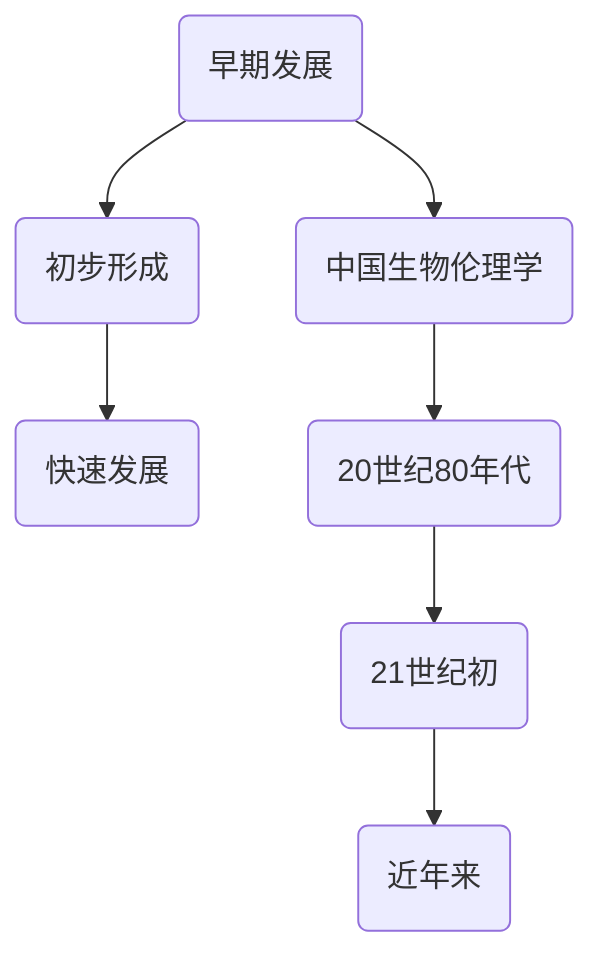
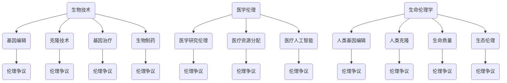
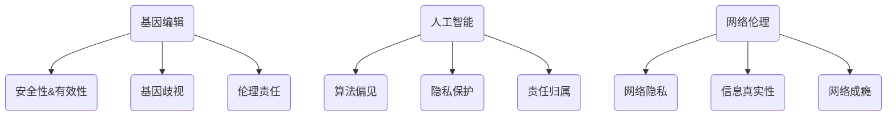
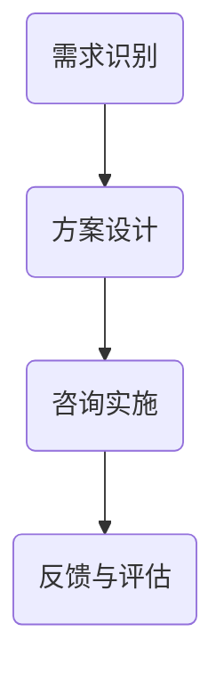
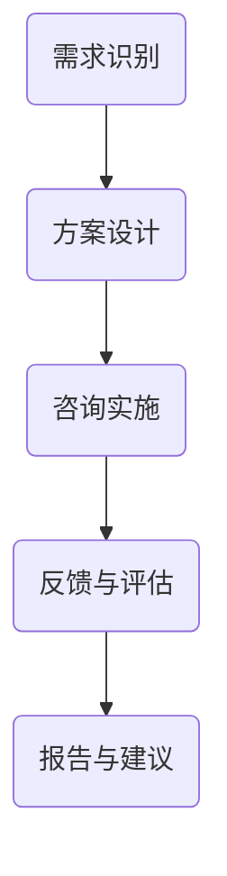

                 


### 1. 准备工作

在撰写《生物伦理咨询服务：科技进步中的道德指导》这篇文章之前，我们需要做好充分的准备工作。首先，我们需要对生物伦理学、科技进步以及咨询服务等核心概念有一个全面而深入的理解。

**生物伦理学的基本概念**

生物伦理学是研究生物医学领域道德问题的学科，它涉及人类行为、医疗实践、科学研究以及技术应用中的伦理问题。其核心概念包括尊重个人自主权、公平性、非伤害和最优化原则。这些原则旨在指导我们在处理复杂的生物医学问题时，如何做出符合伦理的决策。

**科技进步与伦理挑战**

科技进步，特别是生物技术和人工智能的发展，为人类带来了前所未有的机遇，同时也带来了诸多伦理挑战。例如，基因编辑技术的出现引发了关于人类基因改造的伦理争议；人工智能在医疗领域的应用，则涉及数据隐私和算法偏见等问题。

**生物伦理咨询服务的作用与流程**

生物伦理咨询服务旨在为生物医学研究和实践中的伦理问题提供指导和支持。其流程通常包括需求识别、方案设计、实施和反馈等环节。通过这些流程，咨询服务能够帮助相关机构和个人在遵循伦理原则的基础上，推进科技进步。

### 2. 核心章节设计

基于上述准备工作，我们可以设计文章的核心章节。以下是一个详细的设计方案：

**第一部分：生物伦理学基础**

- **第1章：生物伦理学概述**
  - **1.1 生物伦理学的定义与范畴**
  - **1.2 生物伦理学的历史与发展**
  
- **第2章：伦理原则与道德理论**
  - **2.1 伦理原则**
  - **2.2 主要的道德理论**

**第二部分：科技进步与伦理挑战**

- **第3章：科技进步对生物伦理的影响**
  - **3.1 生物技术**
  - **3.2 医学伦理**
  - **3.3 生命伦理学**

- **第4章：科技进步的伦理挑战**
  - **4.1 基因编辑**
  - **4.2 人工智能与生物伦理**
  - **4.3 网络伦理**

**第三部分：生物伦理咨询服务**

- **第5章：生物伦理咨询服务的概念与作用**
  - **5.1 生物伦理咨询服务的定义**
  - **5.2 生物伦理咨询服务在实践中的应用**

- **第6章：生物伦理咨询服务的流程与方法**
  - **6.1 咨询服务的流程**
  - **6.2 咨询服务的方法与工具**

**第四部分：案例研究与伦理决策**

- **第7章：具体案例研究**
  - **7.1 案例一：基因检测与隐私权**
  - **7.2 案例二：基因编辑技术的伦理争议**

- **第8章：伦理决策模型与工具**
  - **8.1 伦理决策模型**
  - **8.2 常用的伦理决策工具**
  - **8.3 伦理决策案例分析**

### 3. 初步大纲与细化

在核心章节设计完成后，我们需要进一步细化每个章节的内容，确保每个章节都有具体的子标题和详细的内容。

**初步大纲**

```
# 《生物伦理咨询服务：科技进步中的道德指导》目录大纲

## 第一部分：生物伦理学基础

## 第1章：生物伦理学概述
### 1.1 生物伦理学的定义与范畴
### 1.2 生物伦理学的历史与发展

## 第2章：伦理原则与道德理论
### 2.1 伦理原则
### 2.2 主要的道德理论

## 第二部分：科技进步与伦理挑战

## 第3章：科技进步对生物伦理的影响
### 3.1 生物技术
### 3.2 医学伦理
### 3.3 生命伦理学

## 第4章：科技进步的伦理挑战
### 4.1 基因编辑
### 4.2 人工智能与生物伦理
### 4.3 网络伦理

## 第三部分：生物伦理咨询服务

## 第5章：生物伦理咨询服务的概念与作用
### 5.1 生物伦理咨询服务的定义
### 5.2 生物伦理咨询服务在实践中的应用

## 第6章：生物伦理咨询服务的流程与方法
### 6.1 咨询服务的流程
### 6.2 咨询服务的方法与工具

## 第四部分：案例研究与伦理决策

## 第7章：具体案例研究
### 7.1 案例一：基因检测与隐私权
### 7.2 案例二：基因编辑技术的伦理争议

## 第8章：伦理决策模型与工具
### 8.1 伦理决策模型
### 8.2 常用的伦理决策工具
### 8.3 伦理决策案例分析
```

**细化大纲**

```
# 《生物伦理咨询服务：科技进步中的道德指导》目录大纲

## 第一部分：生物伦理学基础

## 第1章：生物伦理学概述
### 1.1 生物伦理学的定义与范畴
#### 1.1.1 生物伦理学的定义
#### 1.1.2 生物伦理学的范畴

### 1.2 生物伦理学的历史与发展
#### 1.2.1 生物伦理学的历史演变
#### 1.2.2 生物伦理学在中国的发展

## 第2章：伦理原则与道德理论
### 2.1 伦理原则
#### 2.1.1 尊重个人自主权
#### 2.1.2 公平性原则
#### 2.1.3 非伤害原则
#### 2.1.4 最优化原则

### 2.2 主要的道德理论
#### 2.2.1 康德伦理学
#### 2.2.2 实用主义伦理学
#### 2.2.3 义务论与后果论的对比

## 第二部分：科技进步与伦理挑战

## 第3章：科技进步对生物伦理的影响
### 3.1 生物技术
#### 3.1.1 克隆技术
#### 3.1.2 基因编辑技术
#### 3.1.3 基因治疗

### 3.2 医学伦理
#### 3.2.1 医疗伦理学的基本原则
#### 3.2.2 医学研究的伦理问题

### 3.3 生命伦理学
#### 3.3.1 生命伦理学的研究领域
#### 3.3.2 生命伦理学的跨学科性质

## 第4章：科技进步的伦理挑战
### 4.1 基因编辑
#### 4.1.1 基因编辑的伦理争议
#### 4.1.2 基因编辑的法律规制

### 4.2 人工智能与生物伦理
#### 4.2.1 人工智能在医疗领域的应用
#### 4.2.2 人工智能引发的伦理问题

### 4.3 网络伦理
#### 4.3.1 网络隐私
#### 4.3.2 数据伦理

## 第三部分：生物伦理咨询服务

## 第5章：生物伦理咨询服务的概念与作用
### 5.1 生物伦理咨询服务的定义
#### 5.1.1 生物伦理咨询服务的定义
#### 5.1.2 生物伦理咨询服务的目标

### 5.2 生物伦理咨询服务在实践中的应用
#### 5.2.1 医疗机构的伦理委员会
#### 5.2.2 生物技术企业的伦理审查
#### 5.2.3 社会组织的伦理倡导

## 第6章：生物伦理咨询服务的流程与方法
### 6.1 咨询服务的流程
#### 6.1.1 咨询需求识别
#### 6.1.2 咨询方案设计
#### 6.1.3 咨询实施与反馈

### 6.2 咨询服务的方法与工具
#### 6.2.1 文献综述
#### 6.2.2 咨询会议
#### 6.2.3 第三方评审

## 第四部分：案例研究与伦理决策

## 第7章：具体案例研究
### 7.1 案例一：基因检测与隐私权
#### 7.1.1 案例背景
#### 7.1.2 伦理争议分析
#### 7.1.3 咨询服务介入

### 7.2 案例二：基因编辑技术的伦理争议
#### 7.2.1 案例背景
#### 7.2.2 伦理争议分析
#### 7.2.3 咨询服务介入

## 第8章：伦理决策模型与工具
### 8.1 伦理决策模型
#### 8.1.1 决策树模型
#### 8.1.2 成本效益分析模型

### 8.2 常用的伦理决策工具
#### 8.2.1 伦理审查委员会
#### 8.2.2 公众参与

### 8.3 伦理决策案例分析
#### 8.3.1 案例背景
#### 8.3.2 伦理决策过程
#### 8.3.3 决策结果与反思
```

通过以上步骤，我们完成了对文章核心章节的设计和细化。接下来，我们将逐步撰写每个章节的内容，确保文章的逻辑清晰、内容丰富、论述深入。

---

### 1. 文章标题与关键词

# 生物伦理咨询服务：科技进步中的道德指导

关键词：生物伦理学，科技进步，伦理挑战，咨询服务，伦理决策

### 2. 文章摘要

随着生物技术和人工智能的迅猛发展，科技进步给人类社会带来了前所未有的机遇，同时也引发了诸多伦理挑战。本文从生物伦理学的基础概念出发，分析了科技进步对生物伦理的影响，探讨了伦理挑战的具体案例，并介绍了生物伦理咨询服务的概念、流程与方法。通过案例分析，我们深入探讨了伦理决策模型与工具的应用，为科技进步中的道德指导提供了有益的参考。

---

### 第一部分：生物伦理学基础

#### 第1章：生物伦理学概述

### 1.1 生物伦理学的定义与范畴

生物伦理学是研究生物医学领域道德问题的学科。其定义可以从以下几个方面来理解：

- **研究内容**：生物伦理学涉及人类行为、医疗实践、科学研究以及技术应用中的伦理问题。具体包括生命伦理、医学伦理、生殖伦理、环境伦理等领域。
- **研究对象**：生物伦理学的研究对象主要是生物医学领域中的个体、群体、社会以及环境等方面。
- **研究方法**：生物伦理学采用跨学科的研究方法，结合哲学、社会学、法律、心理学等多个学科的理论和方法，对伦理问题进行深入分析。

生物伦理学的范畴非常广泛，主要包括以下几个方面：

- **生命伦理**：涉及生命本质、生命权利、生命质量等问题，如安乐死、器官移植等。
- **医学伦理**：关注医疗实践中的道德问题，如医生与患者的关系、医疗资源的分配等。
- **生殖伦理**：涉及生育、避孕、人工生殖等方面的道德问题。
- **环境伦理**：探讨人类与环境的关系，如生物多样性保护、环境伦理等。

### 1.2 生物伦理学的历史与发展

生物伦理学作为一门学科，起源于20世纪中叶。以下是生物伦理学历史发展的几个重要阶段：

- **早期发展**（20世纪50-60年代）：生物伦理学的概念开始出现，主要关注人类遗传学、放射线防护和临床医疗中的伦理问题。
- **初步形成**（20世纪70-80年代）：随着生物医学技术的快速发展，生物伦理学逐渐成为一个独立的学科，发表了大量的伦理学文献，如《人类基因组计划》。
- **快速发展**（20世纪90年代至今）：生物技术、基因工程、干细胞研究等新兴领域的发展，使生物伦理学的研究范围不断扩大，成为一个重要的交叉学科。

在中国，生物伦理学的研究也取得了显著进展。以下是一些重要的里程碑：

- **20世纪80年代**：中国开始了生物伦理学的教育和研究，形成了以北京大学、清华大学等为代表的研究团队。
- **21世纪初**：中国出台了多项生物伦理法规和政策，如《人类遗传资源管理暂行办法》、《人类辅助生殖技术和计划生育条例》等。
- **近年来**：中国积极参与国际生物伦理学研究与交流，推动了生物伦理学在中国的应用和发展。

### Mermaid 流程图

下面是一个生物伦理学历史发展的 Mermaid 流程图：



### 1.3 生物伦理学的基本原则

生物伦理学的基本原则是指导生物医学研究和实践的核心价值观。以下是几个主要的原则：

- **尊重个人自主权**：尊重个体的自由意志和选择权，个体有权决定自己的身体和生命。
- **公平性原则**：确保资源分配的公平性和公正性，避免因种族、性别、社会经济地位等因素导致的歧视。
- **非伤害原则**：在生物医学研究和实践中，尽量避免对个体和群体的伤害。
- **最优化原则**：追求最大的道德利益，在道德冲突时，选择对个体和社会最有利的方案。

这些原则相互关联，共同构成了生物伦理学的理论基础。在具体实践中，这些原则需要结合具体情况进行灵活应用。

### 1.4 主要的道德理论

在生物伦理学中，有多种道德理论被用来分析和解决伦理问题。以下是几个主要的道德理论：

- **康德伦理学**：强调道德行为的绝对性和普遍性，认为道德判断基于“应该做什么”，而不是“会有什么结果”。
- **实用主义伦理学**：主张道德行为的评价标准是行为的结果，即行为是否符合大多数人的最大幸福。
- **义务论**：认为道德行为取决于行为本身的属性，而不是行为的结果。
- **后果论**：认为道德行为取决于行为的结果，即行为是否带来好的结果。

这些道德理论为生物伦理学提供了不同的视角和工具，帮助我们更好地理解和解决伦理问题。

### 伪代码与数学模型

以下是一个简单的伪代码，用于描述尊重个人自主权的原则：

```plaintext
function respect_autonomy(person):
    if person.has_autonomy:
        allow_person_to_make_decision()
    else:
        deny_person_to_make_decision()
```

以下是一个数学模型，用于描述公平性原则：

```latex
\text{Fairness} = \frac{\sum_{i=1}^{n} (\text{benefit}_{i} - \text{cost}_{i})}{n}
```

在这个模型中，`n` 表示个体数量，`benefit_i` 表示第 `i` 个个体的利益，`cost_i` 表示第 `i` 个个体的成本。公平性可以通过计算所有个体的利益减去成本的加和，然后除以个体数量来评估。

### 举例说明

假设有一个基因编辑项目，目标是将某基因A替换为基因B。根据尊重个人自主权原则，我们需要确保参与者有权决定是否参与该项目。根据公平性原则，我们需要确保参与者在项目中的利益与成本是相匹配的。

### 小结

本章介绍了生物伦理学的基本概念、历史与发展、基本原则以及主要道德理论。这些内容为后续章节的讨论提供了理论基础。在接下来的章节中，我们将探讨科技进步对生物伦理的影响，以及如何在具体案例中应用生物伦理学的原则和理论。

### 小结

通过本章的介绍，我们了解了生物伦理学的基本概念、历史与发展、基本原则以及主要道德理论。这些内容不仅为我们理解生物伦理学提供了基础，也为后续章节的讨论奠定了理论框架。在接下来的内容中，我们将深入探讨科技进步对生物伦理的影响，以及如何在实践中应用生物伦理学的原则和理论。让我们一起继续探索这个复杂而重要的领域。

---

### 第二部分：科技进步与伦理挑战

#### 第3章：科技进步对生物伦理的影响

随着科技的迅猛发展，生物技术和人工智能在医疗、科研、环境保护等多个领域发挥了重要作用。然而，这些科技进步也引发了诸多伦理挑战，需要我们深入思考和审慎应对。

#### 3.1 生物技术

生物技术是利用生物学知识和技术手段对生物体进行改造和利用的科学。以下是一些生物技术对伦理的影响：

1. **基因编辑**：基因编辑技术，如CRISPR-Cas9，允许科学家精确地修改生物体的基因。这一技术的出现引发了关于基因编辑伦理的广泛讨论。例如，基因编辑是否应该用于人类胚胎？这种技术是否会导致“设计婴儿”的出现？此外，基因编辑技术的滥用可能导致基因歧视和伦理问题。

2. **克隆技术**：克隆技术的应用也引发了伦理争议。人类克隆是否应该被允许？克隆技术的滥用可能导致身份认同和伦理问题。

3. **基因治疗**：基因治疗是一种将正常基因导入患者体内以治疗遗传疾病的技术。然而，这种技术也可能引发伦理问题，如治疗过程中的风险和不确定性、公平性等。

4. **生物制药**：生物制药技术的发展为治疗疾病提供了新的途径。然而，生物制药的专利权和定价问题也引发了伦理争议。

#### 3.2 医学伦理

医学伦理是研究医学实践中的道德问题的学科。科技进步在医学领域带来了许多伦理挑战：

1. **医学研究的伦理问题**：医学研究涉及人体试验、生物样本收集、数据隐私等问题。如何确保研究过程中的伦理审查和受试者权益保护成为一个重要议题。

2. **医疗资源分配**：科技进步使得医疗资源更加丰富，但也带来了分配问题。如何公平地分配医疗资源，确保所有人都能获得必要的医疗服务，是医学伦理的一个重要问题。

3. **医疗人工智能**：人工智能在医疗领域的应用带来了许多机会，如疾病预测、诊断、治疗等。然而，人工智能的偏见、数据隐私和责任归属等问题也引发了伦理争议。

#### 3.3 生命伦理学

生命伦理学是研究生命科学和生物医学领域中的伦理问题的学科。科技进步对生命伦理学的影响体现在以下几个方面：

1. **人类基因编辑**：基因编辑技术的出现引发了关于人类基因编辑的伦理争议。如何确保基因编辑技术用于善的目的，避免滥用，是生命伦理学面临的一个重要问题。

2. **人类克隆**：人类克隆技术的伦理争议主要集中在身份认同、伦理责任和道德底线等方面。

3. **生命质量**：科技进步使得人类寿命延长，但也带来了关于生命质量的伦理问题。如何定义和评估生命质量，如何在有限资源下做出最优决策，是生命伦理学需要探讨的问题。

4. **生态伦理**：科技进步对生态环境的影响也引发了伦理争议。如何保护生物多样性、减少环境污染，是生态伦理学需要关注的领域。

#### Mermaid 流�程图

以下是一个描述科技进步对生物伦理影响的 Mermaid 流程图：



#### 核心算法原理讲解与伪代码

以下是一个简单的伪代码，用于描述基因编辑的伦理决策：

```plaintext
function gene_edit_decision(disease, gene, technique):
    if disease.is_critical and gene.is_related_to_disease:
        if technique.is_safe and technique.is_effective:
            return "Approve"
        else:
            return "Reject"
    else:
        return "Reject"
```

在这个伪代码中，`disease` 表示疾病，`gene` 表示基因，`technique` 表示基因编辑技术。函数根据疾病是否严重、基因是否与疾病相关、技术是否安全有效来判断是否批准基因编辑。

#### 数学模型与公式

以下是一个用于描述医疗资源分配的数学模型：

```latex
\text{Fair Allocation} = \frac{\sum_{i=1}^{n} (\text{resource}_{i} \times \text{priority}_{i})}{\sum_{i=1}^{n} \text{priority}_{i}}
```

在这个模型中，`n` 表示个体数量，`resource_i` 表示第 `i` 个个体的医疗资源需求，`priority_i` 表示第 `i` 个个体的医疗优先级。

#### 举例说明

假设有一个地区需要分配医疗资源，共有1000人需要治疗，每个人的医疗资源需求和优先级如下：

| 个体ID | 医疗资源需求 | 医疗优先级 |
|--------|--------------|------------|
| 1      | 100          | 3          |
| 2      | 200          | 1          |
| 3      | 150          | 2          |
| 4      | 300          | 4          |

根据上述数学模型，我们可以计算出公平的医疗资源分配：

```latex
\text{Fair Allocation} = \frac{(100 \times 3) + (200 \times 1) + (150 \times 2) + (300 \times 4)}{3 + 1 + 2 + 4} = \frac{300 + 200 + 300 + 1200}{10} = \frac{2000}{10} = 200
```

这意味着每个人应该获得200单位的医疗资源。

#### 小结

本章讨论了科技进步对生物伦理的影响，包括生物技术、医学伦理和生命伦理学。我们通过具体的案例、算法、数学模型和公式，分析了这些科技进步引发的伦理挑战。在接下来的章节中，我们将进一步探讨如何应对这些伦理挑战，并介绍生物伦理咨询服务的作用和流程。

---

### 第4章：科技进步的伦理挑战

随着科技的飞速发展，人工智能、基因编辑和互联网等领域的突破性进展不仅改变了我们的生活方式，也带来了诸多伦理挑战。这些挑战不仅涉及技术本身，还涉及社会、法律和道德等多个层面。

#### 4.1 基因编辑

基因编辑技术的出现，如CRISPR-Cas9，使得人类能够精确地修改生物体的基因，从而治疗遗传疾病甚至改造生物特性。然而，这一技术的广泛应用也引发了一系列伦理挑战：

1. **安全性与有效性**：尽管基因编辑技术在实验室中取得了显著成果，但其长期安全性和有效性仍需进一步验证。未经充分验证的基因编辑可能导致不可预测的副作用和伦理问题。

2. **基因歧视**：基因编辑技术可能会加剧基因歧视现象，使得某些个体或群体因基因特征而受到不公平对待。

3. **伦理责任**：基因编辑技术的应用涉及伦理责任问题。在人类胚胎基因编辑方面，如何确保技术的使用符合伦理原则，避免滥用，是一个亟待解决的问题。

#### 4.2 人工智能与生物伦理

人工智能在医疗、金融、交通等领域得到了广泛应用，但同时也带来了伦理挑战：

1. **算法偏见**：人工智能系统的算法可能包含偏见，导致对某些群体不公平对待。例如，医疗诊断中的算法可能因数据偏差而对某些种族或性别产生偏见。

2. **隐私保护**：人工智能在处理大量个人数据时，可能侵犯隐私权。如何保护个人数据隐私，防止数据泄露，是重要的伦理问题。

3. **责任归属**：在人工智能参与决策和行动时，如何明确责任归属是一个复杂的伦理问题。当人工智能系统出现错误或造成损害时，应由谁承担责任？

#### 4.3 网络伦理

互联网的普及带来了信息传播的便利，但也引发了伦理挑战：

1. **网络隐私**：个人数据在互联网上的传播可能导致隐私泄露。如何保护用户隐私，防止数据滥用，是一个重要议题。

2. **信息真实性**：互联网上的虚假信息和谣言泛滥，如何确保信息的真实性，防止误导和误导性宣传，是网络伦理的一个重要方面。

3. **网络成瘾**：互联网的诱惑可能导致网络成瘾，影响个体的身心健康。如何引导用户合理使用互联网，避免网络成瘾，是网络伦理需要关注的问题。

### Mermaid 流程图

以下是一个描述科技进步伦理挑战的 Mermaid 流程图：



### 核心算法原理讲解与伪代码

以下是一个简单的伪代码，用于描述算法偏见检测：

```plaintext
function detect_bias(algorithm, data):
    if algorithm.is_biased(data):
        return "Algorithm is biased"
    else:
        return "Algorithm is not biased"
```

在这个伪代码中，`algorithm` 表示算法，`data` 表示输入数据。函数检测算法是否对输入数据存在偏见。

### 数学模型与公式

以下是一个用于描述隐私保护的数学模型：

```latex
\text{Privacy Score} = \frac{\text{Actual Privacy}}{\text{Desired Privacy}}
```

在这个模型中，`Actual Privacy` 表示实际的隐私保护水平，`Desired Privacy` 表示期望的隐私保护水平。

### 举例说明

假设一个公司的算法在处理1000个数据样本时，发现其中有10个样本存在偏见。根据上述模型，我们可以计算出隐私保护分数：

```latex
\text{Privacy Score} = \frac{990}{1000} = 0.99
```

这意味着该公司的算法在处理数据时，实际隐私保护水平为期望的99%。

### 小结

本章讨论了科技进步带来的伦理挑战，包括基因编辑、人工智能和互联网。通过具体的案例、算法、数学模型和公式，我们分析了这些挑战的复杂性。在解决这些伦理挑战时，需要多方协作，确保科技进步符合伦理原则，造福人类社会。

---

### 第三部分：生物伦理咨询服务

#### 第5章：生物伦理咨询服务的概念与作用

生物伦理咨询服务是一种专业的服务，旨在为生物医学研究和实践中出现的伦理问题提供指导和支持。它的概念、作用和应用范围如下：

### 5.1 生物伦理咨询服务的定义

生物伦理咨询服务是指由专业团队提供的，针对生物医学研究和实践中的伦理问题进行评估、咨询和指导的服务。这些专业团队通常由伦理学家、医生、律师、社会学家等多学科专家组成。

### 5.2 生物伦理咨询服务的作用

1. **指导决策**：生物伦理咨询服务帮助相关机构和个人在面临伦理问题时做出合理的决策，确保研究和实践符合伦理原则和法律法规。

2. **提高伦理意识**：通过生物伦理咨询服务，相关机构和人员能够更好地了解伦理问题的重要性，提高伦理意识，从而在生物医学研究和实践中更加注重伦理。

3. **促进沟通与合作**：生物伦理咨询服务为不同利益相关方提供了一个沟通平台，促进他们之间的合作，共同解决伦理问题。

4. **提供政策建议**：生物伦理咨询服务可以为政府和监管机构提供政策建议，推动生物医学伦理法规的完善。

### 5.3 生物伦理咨询服务在实践中的应用

1. **医疗机构**：医疗机构可以设立伦理委员会，为临床研究和医疗实践中的伦理问题提供咨询和服务。例如，在临床试验中，伦理委员会负责评估试验方案是否符合伦理原则，保护受试者的权益。

2. **生物技术企业**：生物技术企业在进行基因编辑、生物制药等研究时，需要遵循伦理规范。生物伦理咨询服务可以帮助企业评估研究的伦理风险，制定伦理管理策略。

3. **科研机构**：科研机构在进行基因编辑、生物技术等研究时，也需要生物伦理咨询服务的支持，确保研究符合伦理要求，避免伦理风险。

4. **社会组织**：社会组织可以开展生物伦理教育和宣传活动，提高公众对生物伦理问题的认知和重视，促进社会对生物伦理问题的关注和讨论。

### 5.4 生物伦理咨询服务的发展趋势

随着生物技术和人工智能的快速发展，生物伦理咨询服务也在不断演变和拓展。以下是一些发展趋势：

1. **跨学科融合**：生物伦理咨询服务将更加注重跨学科合作，结合伦理学、医学、法律、社会学等多学科的知识，提供更加全面和专业的服务。

2. **数字化和智能化**：利用大数据、人工智能等技术，生物伦理咨询服务将更加高效和精准，为伦理决策提供有力支持。

3. **全球化和国际化**：随着生物技术和医学研究的全球化，生物伦理咨询服务也需要应对国际化和跨文化的伦理挑战，提供具有全球视野的服务。

4. **伦理教育和培训**：生物伦理咨询服务将更加重视伦理教育和培训，培养更多的生物伦理专业人才，提高整个社会的伦理素养。

### Mermaid 流程图

以下是一个描述生物伦理咨询服务流程的 Mermaid 流程图：



### 核心算法原理讲解与伪代码

以下是一个简单的伪代码，用于描述生物伦理咨询服务的需求识别：

```plaintext
function identify_needs(problem):
    if problem.is_ethical:
        return "Ethical issue"
    else:
        return "Non-ethical issue"
```

在这个伪代码中，`problem` 表示面临的问题。函数根据问题是否涉及伦理，识别出是否需要生物伦理咨询服务。

### 数学模型与公式

以下是一个用于描述生物伦理咨询服务的数学模型：

```latex
\text{Ethical Score} = \frac{\text{Total ethical issues}}{\text{Total issues}}
```

在这个模型中，`Total ethical issues` 表示涉及伦理的问题总数，`Total issues` 表示所有问题的总数。伦理分数可以用来评估生物医学研究和实践的伦理状况。

### 举例说明

假设在一个医疗研究中，共有100个问题，其中30个涉及伦理问题。根据上述模型，我们可以计算出伦理分数：

```latex
\text{Ethical Score} = \frac{30}{100} = 0.3
```

这意味着该医疗研究中有30%的问题涉及伦理问题。

### 小结

本章介绍了生物伦理咨询服务的概念、作用和应用，以及其发展趋势。通过具体的案例、算法、数学模型和公式，我们了解了生物伦理咨询服务在解决伦理问题中的重要性。在接下来的章节中，我们将进一步探讨生物伦理咨询服务的具体流程和方法。

---

### 第6章：生物伦理咨询服务的流程与方法

生物伦理咨询服务是一个系统性的过程，涉及多个环节和步骤。以下是生物伦理咨询服务的流程、方法与工具，以及其在实践中的应用。

#### 6.1 咨询服务的流程

生物伦理咨询服务通常包括以下几个主要步骤：

1. **需求识别**：首先，识别出需要伦理咨询的问题或项目。这可以通过调查问卷、访谈、会议等方式进行。

2. **方案设计**：在明确需求后，设计咨询方案。方案应包括目标、方法、时间表和预期成果等。

3. **咨询实施**：根据咨询方案，开展具体的咨询活动，如研讨会、工作坊、文献综述等。

4. **反馈与评估**：在咨询过程中，及时收集反馈，并对咨询效果进行评估。这有助于改进咨询服务，提高其质量和效果。

5. **报告与建议**：根据咨询结果，撰写咨询报告，提出具体建议和改进措施。

#### 6.2 咨询服务的方法与工具

生物伦理咨询服务采用多种方法和工具，以应对不同类型的伦理问题。以下是一些常见的方法和工具：

1. **文献综述**：通过查阅相关文献，了解伦理问题的背景、相关研究和发展趋势。

2. **伦理审查**：对研究项目或实践方案进行伦理评估，确保其符合伦理原则和法规。

3. **咨询会议**：组织专家、利益相关方进行讨论，共同解决伦理问题。

4. **公众参与**：邀请公众参与伦理讨论，提高决策的透明度和公正性。

5. **伦理决策模型**：利用伦理决策模型，如成本效益分析、多标准决策分析等，帮助决策者做出伦理决策。

6. **伦理指南与规范**：遵循国际和国内的伦理指南与规范，确保咨询服务符合伦理标准。

#### 6.3 咨询服务的方法与工具在实际中的应用

以下是一个具体案例，展示了生物伦理咨询服务的方法与工具在实际中的应用：

**案例：基因编辑技术的伦理咨询**

1. **需求识别**：某研究机构计划开展一项基因编辑技术的研究，涉及人类胚胎基因编辑。该机构需要伦理咨询服务，以评估研究方案的伦理问题。

2. **方案设计**：伦理咨询服务团队设计了一个包含文献综述、专家咨询、伦理审查和公众参与的咨询方案。

3. **咨询实施**：
   - **文献综述**：查阅了国内外关于基因编辑技术伦理问题的相关文献，了解当前的研究动态和伦理争议。
   - **专家咨询**：邀请伦理学家、医生、法律专家等进行咨询会议，讨论基因编辑技术的伦理问题。
   - **伦理审查**：对研究方案进行伦理审查，评估其是否符合伦理原则和法规。

4. **反馈与评估**：在咨询过程中，收集专家和公众的反馈，对咨询效果进行评估。

5. **报告与建议**：根据咨询结果，撰写了伦理咨询报告，提出了以下建议：
   - 确保研究过程中的伦理审查和受试者权益保护。
   - 加强研究过程中的伦理培训和宣传，提高研究人员的伦理意识。
   - 加强与公众的沟通，提高公众对基因编辑技术伦理问题的认知。

#### Mermaid 流程图

以下是一个描述生物伦理咨询服务流程的 Mermaid 流程图：



### 核心算法原理讲解与伪代码

以下是一个简单的伪代码，用于描述伦理审查过程：

```plaintext
function ethical_review(project):
    if project.passes_ethical_criteria:
        return "Approved"
    else:
        return "Rejected"
```

在这个伪代码中，`project` 表示研究项目。函数根据项目是否符合伦理标准，判断是否批准。

### 数学模型与公式

以下是一个用于描述伦理审查决策的数学模型：

```latex
\text{Ethical Score} = \frac{\text{Number of ethical criteria met}}{\text{Total number of ethical criteria}}
```

在这个模型中，`Number of ethical criteria met` 表示符合伦理标准的项目数量，`Total number of ethical criteria` 表示总伦理标准数量。伦理分数可以用来评估项目的伦理状况。

### 举例说明

假设一个研究项目需要满足5个伦理标准，其中有4个标准得到满足。根据上述模型，我们可以计算出伦理分数：

```latex
\text{Ethical Score} = \frac{4}{5} = 0.8
```

这意味着该研究项目的伦理状况良好，可以批准。

### 小结

本章介绍了生物伦理咨询服务的流程、方法与工具，并通过具体案例展示了其在实践中的应用。通过伦理审查、专家咨询、公众参与等环节，生物伦理咨询服务为生物医学研究和实践中的伦理问题提供了有效的指导和支持。在接下来的章节中，我们将探讨具体的伦理决策模型与工具，进一步深化对生物伦理咨询服务的理解。

---

### 第四部分：案例研究与伦理决策

#### 第7章：具体案例研究

为了更好地理解生物伦理咨询服务在实际中的应用，我们将探讨两个具体的案例研究：基因检测与隐私权，以及基因编辑技术的伦理争议。

#### 7.1 案例一：基因检测与隐私权

**背景**：

随着基因检测技术的普及，越来越多的个人和企业开始提供基因检测服务。这些服务可能涉及个人基因组数据的收集和分析，从而揭示个体的遗传信息。然而，基因数据的隐私问题也随之而来。

**伦理争议**：

1. **隐私泄露**：基因数据一旦泄露，可能被用于不当目的，如歧视、保险拒绝等。因此，保护基因数据的隐私成为一个重要议题。
2. **数据共享**：在研究或医疗实践中，基因数据的共享可能有助于发现新的疾病治疗方法。然而，如何平衡隐私保护和数据共享的需求，是一个复杂的问题。

**咨询服务介入**：

生物伦理咨询服务团队在介入该案例时，采取了以下步骤：

1. **需求识别**：确定隐私保护是关键伦理问题，需要制定相应的隐私保护措施。
2. **方案设计**：设计一个隐私保护方案，包括数据加密、访问控制、数据匿名化等。
3. **咨询实施**：与基因检测服务提供商、研究人员和公众进行沟通，讨论隐私保护方案。
4. **反馈与评估**：收集各方反馈，评估方案的可行性和效果。

**建议**：

1. **加强数据保护**：建议基因检测服务提供商加强数据保护措施，如数据加密、访问控制等，确保基因数据的隐私安全。
2. **明确数据共享规则**：制定明确的基因数据共享规则，确保数据共享在符合伦理和法律要求的前提下进行。
3. **公众教育**：加强公众对基因隐私保护的认知，提高他们的隐私保护意识。

#### 7.2 案例二：基因编辑技术的伦理争议

**背景**：

基因编辑技术，如CRISPR-Cas9，使得人类能够精确地修改生物体的基因。这一技术引发了关于伦理的广泛争议，特别是人类胚胎基因编辑。

**伦理争议**：

1. **伦理底线**：人类胚胎基因编辑是否违反了伦理底线？如何确保基因编辑技术的使用符合伦理原则？
2. **技术滥用**：基因编辑技术可能被滥用，导致“设计婴儿”的出现，引发社会和伦理问题。
3. **长期影响**：基因编辑技术的长期安全性和效果尚未明确，如何确保其安全使用？

**咨询服务介入**：

生物伦理咨询服务团队在介入该案例时，采取了以下步骤：

1. **需求识别**：确定人类胚胎基因编辑是一个复杂的伦理问题，需要多学科专家共同探讨。
2. **方案设计**：设计一个包含伦理审查、风险评估、公众参与的咨询方案。
3. **咨询实施**：组织伦理审查会议，邀请伦理学家、医生、法律专家等进行讨论，评估基因编辑技术的伦理风险。
4. **反馈与评估**：收集各方反馈，评估咨询方案的有效性和可行性。

**建议**：

1. **加强伦理审查**：建议建立严格的伦理审查机制，确保基因编辑技术的研究和应用符合伦理原则。
2. **风险评估与监控**：建议对基因编辑技术的长期安全性进行风险评估和监控，确保其安全使用。
3. **公众参与**：建议加强公众参与，提高社会对基因编辑技术伦理问题的关注和理解。

#### 小结

通过这两个具体案例的研究，我们可以看到生物伦理咨询服务在解决伦理争议中的重要作用。无论是基因检测与隐私权，还是基因编辑技术的伦理争议，生物伦理咨询服务都提供了系统的分析和建议，为决策者提供了有力的支持。在接下来的章节中，我们将进一步探讨伦理决策模型与工具，为生物伦理咨询服务提供更加科学和有效的决策支持。

---

### 第8章：伦理决策模型与工具

在生物伦理咨询过程中，伦理决策模型与工具的应用至关重要。这些模型与工具帮助我们在复杂的伦理决策中找到平衡点，确保决策符合伦理原则和法律法规。

#### 8.1 伦理决策模型

伦理决策模型是用于分析和解决伦理问题的框架和方法。以下是一些常用的伦理决策模型：

1. **成本效益分析（Cost-Benefit Analysis）**：

成本效益分析是一种评估决策的成本与效益的方法。通过比较成本与收益，可以帮助决策者评估决策的伦理价值。具体步骤如下：

- **确定成本**：识别决策过程中可能产生的成本，如经济成本、社会成本等。
- **确定效益**：识别决策可能带来的收益，如改善健康、提高生活质量等。
- **评估成本与效益**：比较成本与效益，计算成本效益比。

2. **多标准决策分析（Multi-Criteria Decision Analysis, MCDA）**：

多标准决策分析是一种综合考虑多个决策标准的分析方法。它可以帮助决策者在多种备选方案中找到最优解。具体步骤如下：

- **确定决策标准**：识别影响决策的多个标准，如道德原则、社会公正性、经济效益等。
- **确定权重**：为每个决策标准分配权重，反映其重要性。
- **评估备选方案**：根据决策标准评估每个备选方案，计算得分。
- **综合评估**：根据权重和得分，综合评估每个备选方案，确定最优解。

3. **伦理决策树（Ethical Decision Tree）**：

伦理决策树是一种图形化表示决策过程的方法。它可以帮助决策者逐步分析不同情况下的决策路径和结果。具体步骤如下：

- **确定决策节点**：识别决策过程中的关键节点和变量。
- **构建决策树**：根据决策节点和变量，构建决策树，表示不同决策路径和结果。
- **评估决策路径**：分析每个决策路径的伦理价值和风险。

#### 8.2 常用的伦理决策工具

在伦理决策过程中，常用的工具包括：

1. **伦理审查委员会（Ethics Committee）**：

伦理审查委员会是一个由多学科专家组成的团队，负责评估生物医学研究和实践的伦理问题。其职责包括：

- **审查研究方案**：评估研究方案是否符合伦理原则和法律法规。
- **保护受试者权益**：确保研究过程中的伦理审查和受试者权益保护。
- **提供伦理建议**：为研究者和医疗机构提供伦理建议和指导。

2. **公众参与（Public Participation）**：

公众参与是伦理决策过程中的一种重要机制，通过邀请公众参与讨论和决策，可以提高决策的透明度和公正性。具体方法包括：

- **公众咨询**：邀请公众就特定伦理问题提供意见和建议。
- **公众研讨会**：组织公众研讨会，讨论伦理问题，收集公众意见。
- **公众评审**：邀请公众参与伦理决策的评审过程，提供外部视角。

3. **伦理决策软件（Ethical Decision-Making Software）**：

随着技术的发展，一些伦理决策软件被用于支持伦理决策。这些软件通常包含伦理决策模型和工具，可以帮助决策者分析和解决伦理问题。例如：

- **Ethical Framework**：一个基于多标准决策分析的伦理决策软件，用于支持医学研究中的伦理决策。
- **Principle-Based Ethics**：一个基于伦理原则的决策软件，帮助决策者评估决策的伦理价值。

#### 8.3 伦理决策案例分析

以下是一个具体的伦理决策案例分析，展示了如何应用伦理决策模型与工具。

**案例：基因编辑技术的伦理决策**

**背景**：

某研究机构计划开展一项人类胚胎基因编辑研究，以治疗遗传疾病。然而，这一研究引发了伦理争议，需要伦理决策。

**决策过程**：

1. **确定决策模型**：选择多标准决策分析作为决策模型，考虑伦理原则、社会公正性、技术风险等多个标准。
2. **确定权重**：为每个决策标准分配权重，如伦理原则（60%）、社会公正性（20%）、技术风险（10%）等。
3. **评估备选方案**：
   - **方案A**：仅进行体外基因编辑，不涉及胚胎移植。
     - 伦理原则得分：90分
     - 社会公正性得分：80分
     - 技术风险得分：70分
     - 综合得分：78分
   - **方案B**：进行体外和体内基因编辑，胚胎移植。
     - 伦理原则得分：50分
     - 社会公正性得分：60分
     - 技术风险得分：80分
     - 综合得分：68分
4. **综合评估**：根据权重和得分，综合评估两个备选方案，方案A的综合得分高于方案B。

**决策结果**：

基于伦理决策模型与工具的分析，研究机构决定采用方案A，仅进行体外基因编辑，不涉及胚胎移植。这一决策考虑到了伦理原则和社会公正性，同时降低了技术风险。

#### 小结

本章介绍了伦理决策模型与工具，包括成本效益分析、多标准决策分析和伦理决策树等。通过具体案例分析，我们展示了如何应用这些模型与工具进行伦理决策。在生物伦理咨询过程中，这些模型与工具为决策者提供了科学和有效的支持，有助于确保决策符合伦理原则和法律法规。

---

### 总结与展望

本文系统地介绍了生物伦理咨询服务在科技进步中的道德指导作用。我们首先回顾了生物伦理学的基本概念、历史与发展，阐述了尊重个人自主权、公平性、非伤害和最优化原则等核心伦理原则。接着，我们探讨了科技进步，特别是生物技术和人工智能的发展，对生物伦理的影响，以及这些科技进步带来的伦理挑战。随后，我们详细介绍了生物伦理咨询服务的概念、流程与方法，并通过具体案例展示了其在实践中的应用。最后，我们讨论了伦理决策模型与工具，强调了在复杂伦理决策中科学和系统方法的重要性。

展望未来，生物伦理咨询服务将在以下几个方面继续发挥重要作用：

1. **全球化与国际化**：随着生物技术和人工智能的全球化，生物伦理咨询服务需要应对国际化和跨文化的伦理挑战，提供具有全球视野的服务。
2. **数字化与智能化**：利用大数据、人工智能等技术，生物伦理咨询服务将更加高效和精准，为伦理决策提供有力支持。
3. **跨学科合作**：生物伦理咨询服务将更加注重跨学科合作，结合伦理学、医学、法律、社会学等多学科的知识，提供更加全面和专业的服务。
4. **公众参与**：加强公众参与，提高社会对生物伦理问题的关注和理解，促进社会对生物伦理问题的讨论和解决。

在总结本文内容的同时，我们也认识到，生物伦理咨询服务仍然面临许多挑战，如技术滥用、数据隐私保护、公众信任等。因此，我们需要继续深入研究，完善伦理决策模型与工具，确保科技进步符合伦理原则，造福人类社会。

### 拓展阅读

对于对生物伦理学感兴趣的读者，以下是一些推荐阅读：

1. **《生物伦理学导论》（Introduction to Bioethics）**：由玛莎·努斯鲍姆（Martha Nussbaum）著，详细介绍了生物伦理学的基本概念和主要议题。
2. **《基因伦理：生命科学的道德维度》（Genetic Ethics: Evolutions of Life Science）**：由克里斯托弗·普雷斯顿（Christopher Preston）著，探讨了基因编辑、基因治疗等领域的伦理问题。
3. **《人工智能伦理：道德、社会与法律问题》（AI Ethics: Moral, Social, and Legal Issues）**：由艾伦·罗素（Alan Russell）著，深入分析了人工智能在医疗、金融、交通等领域的伦理挑战。
4. **《科技伦理：理论与实践》（Technology Ethics: Theory and Practice）**：由迈克尔·达玛西奥（Michael D'Amato）著，提供了对科技伦理问题的全面分析。

通过阅读这些书籍，读者可以进一步深入了解生物伦理学和技术伦理学的理论框架和实践应用，为未来在相关领域的探索和研究打下坚实基础。

