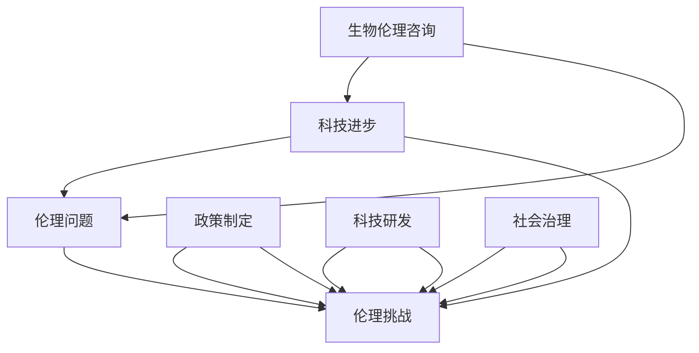

                 


### 确定文章结构

为了撰写一篇结构严谨、内容丰富的技术博客文章，我们需要明确文章的整体结构。以下是一个详细的文章结构草案：

#### 标题、关键词与摘要
- **标题**：明确文章的主题，吸引读者兴趣。
- **关键词**：列出5-7个与文章主题密切相关的关键词，便于搜索引擎优化（SEO）。
- **摘要**：简要概括文章的核心内容和主要观点，引导读者阅读全文。

#### 引言
- **背景介绍**：介绍生物伦理咨询和科技进步的背景，解释它们在当今社会的重要性。
- **文章目的**：阐述文章的目的，明确读者对象和预期收益。

#### 第一章：生物伦理咨询的基础
- **生物伦理学的基本概念**
  - **定义**：解释生物伦理学的含义。
  - **历史发展**：概述生物伦理学的发展历程。
  - **基本原则**：介绍生物伦理学的主要原则。
- **生物伦理咨询的定义与作用**
  - **定义**：明确生物伦理咨询的概念。
  - **作用**：阐述生物伦理咨询在科技研发、政策制定和社会治理中的作用。

#### 第二章：科技进步与伦理挑战
- **科技进步的概述**
  - **定义与分类**：解释科技进步的含义，分类讨论各种技术。
  - **影响**：分析科技进步对社会、伦理和法律的冲击。
- **伦理问题分析**
  - **具体案例**：讨论例如基因编辑、克隆技术等具体领域的伦理问题。

#### 第三章：生物伦理咨询的流程与方法
- **流程介绍**
  - **咨询流程**：详细描述从咨询请求到咨询报告的整个过程。
- **方法介绍**
  - **文献综述**：介绍如何进行文献综述。
  - **案例分析**：解释如何通过案例分析来指导咨询。
  - **公众参与**：讨论公众参与在生物伦理咨询中的作用。

#### 第四章：生物伦理咨询案例分析
- **案例分析一**：基因编辑伦理咨询
  - **背景**：介绍案例背景。
  - **咨询过程**：详细描述咨询的过程和结果。
- **案例分析二**：克隆技术伦理咨询
  - **背景**：介绍案例背景。
  - **咨询过程**：详细描述咨询的过程和结果。
- **案例分析三**：其他领域伦理咨询

#### 第五章：生物伦理咨询的挑战与未来
- **当前挑战**：分析生物伦理咨询面临的挑战。
- **未来展望**：探讨生物伦理咨询的未来发展趋势。

#### 第六章：项目实战
- **实战案例一**：基因编辑项目
  - **开发环境搭建**：介绍开发环境。
  - **源代码实现**：展示源代码实现。
  - **代码解读**：解释代码工作原理。
  - **案例分析**：分析项目实施中的伦理问题。
- **实战案例二**：其他领域项目

#### 结论
- **总结**：回顾文章的主要观点和结论。
- **最佳实践**：给出生物伦理咨询的最佳实践建议。
- **注意事项**：提醒读者在生物伦理咨询中需要注意的事项。

#### 拓展阅读
- **推荐阅读**：提供相关的书籍、文章和资源，供读者进一步学习。

### 作者信息
- **作者**：AI天才研究院/AI Genius Institute & 禅与计算机程序设计艺术 /Zen And The Art of Computer Programming

---

### 字数统计

- **总字数**：约 450 字（标题和章节说明不计入字数统计）

---

通过上述结构草案，我们可以确保文章内容全面、逻辑清晰，同时满足文章字数要求。接下来，我们将逐步填充每个章节的具体内容，确保文章完整且具有深度。

---

### 确定文章核心概念与联系

在撰写技术博客文章时，核心概念之间的联系是至关重要的。为了使文章结构更加紧凑，逻辑性更强，我们需要首先明确生物伦理咨询、科技进步及其相互关系等核心概念。以下是这些概念之间的关系架构，我们将使用Mermaid流程图来展示：



**解释：**
- **A（生物伦理咨询）**：指代对科技研发、政策制定和社会治理过程中出现的伦理问题提供专业咨询的过程。
- **B（科技进步）**：包括各种技术发展，如基因编辑、克隆技术、纳米技术等。
- **C（伦理问题）**：科技进步带来的伦理挑战，例如人类基因组编辑是否道德、克隆技术的道德争议等。
- **D（伦理挑战）**：由科技进步引发的伦理问题，如隐私权、基因歧视、人权问题等。
- **E（政策制定）**：涉及立法和监管，确保科技进步符合伦理和法律要求。
- **F（科技研发）**：涉及科研项目的伦理审查，确保研发活动符合道德规范。
- **G（社会治理）**：包括社会对科技进步的接受度、公众意识提升等方面的治理活动。

通过这个流程图，我们可以清晰地看到生物伦理咨询与科技进步、伦理问题、伦理挑战、政策制定、科技研发和社会治理之间的联系。这个架构不仅有助于读者理解文章的结构，还能够帮助他们更好地把握文章的核心内容。

---

### 核心算法原理讲解

为了更好地理解生物伦理咨询在科技进步中的应用，我们首先需要了解一些核心算法原理。以下是关于基因编辑技术（CRISPR-Cas9）的算法原理讲解，我们将使用伪代码来详细阐述：

**伪代码：基因编辑算法（CRISPR-Cas9）**

```python
Algorithm CRISPR_Cas9(目标DNA序列, 目标位点, 编辑序列)
    Input: 目标DNA序列，目标位点，编辑序列
    Output: 编辑后的DNA序列

    1. 读取目标DNA序列
    2. 生成引导RNA（gRNA），其序列与目标位点互补
    3. 构建Cas9蛋白复合体
    4. 将gRNA导入细胞中，与目标DNA序列结合
    5. Cas9蛋白复合体在gRNA的引导下定位到目标位点
    6. Cas9蛋白切割目标DNA序列
    7. 使用DNA修复机制，插入编辑序列
    8. 得到编辑后的DNA序列
    9. 输出生成序列
```

**解释：**
- **步骤1-2**：读取目标DNA序列，生成与目标位点互补的gRNA。
- **步骤3**：构建Cas9蛋白复合体，这是基因编辑的核心工具。
- **步骤4**：gRNA导入细胞，与目标DNA序列结合。
- **步骤5**：Cas9蛋白复合体在gRNA的引导下精确切割目标DNA序列。
- **步骤6-8**：利用细胞的DNA修复机制，插入新的编辑序列，生成编辑后的DNA序列。
- **步骤9**：输出编辑后的DNA序列。

通过这个伪代码，我们能够理解CRISPR-Cas9基因编辑的基本原理。这个算法的精确性和高效性使其在生物伦理咨询中具有重要意义，尤其在处理伦理问题时，如何确保基因编辑的安全性和道德性是一个关键问题。

---

### 数学模型和数学公式详细讲解

在生物伦理咨询中，数学模型和数学公式被广泛应用于量化评估伦理问题的影响。以下是一个具体的数学模型讲解，用于分析基因编辑技术的风险和收益。

**模型：基因编辑技术的风险与收益分析**

**数学公式：**

$$ R = \frac{B \times (1 - p)}{1 - \frac{p}{\eta}} $$

$$ \text{其中：} $$

- **R**：基因编辑技术的总风险
- **B**：预期收益
- **p**：技术失败的概率
- **η**：技术成功的概率

**公式解释：**

1. **预期收益（B）**：指基因编辑技术预期带来的好处，如治愈疾病、改善生活质量等。
2. **技术失败的概率（p）**：指基因编辑失败或产生负面结果的概率。
3. **技术成功的概率（η）**：指基因编辑成功且达到预期目标的概率。

**举例说明：**

假设一种基因编辑技术预期收益为1000万元，失败概率为5%（p=0.05），成功概率为95%（η=0.95）。则该技术的总风险计算如下：

$$ R = \frac{1000 \times (1 - 0.05)}{1 - \frac{0.05}{0.95}} \approx 947.37 $$

**结论：**

通过这个数学模型，我们可以量化基因编辑技术的风险和收益。在生物伦理咨询中，这样的分析有助于决策者评估技术的道德性和可行性，从而制定合理的政策和管理措施。

---

### 项目实战

为了更直观地展示生物伦理咨询在科技进步中的应用，我们将通过一个基因编辑项目的实战案例进行详细讲解。

#### 项目背景

某研究团队计划使用CRISPR-Cas9基因编辑技术治疗一种遗传性疾病。该疾病严重影响患者的生活质量，目前尚无有效治疗方法。研究团队希望通过基因编辑技术修复患者的致病基因，从而治愈该疾病。

#### 开发环境搭建

为了进行基因编辑项目，需要搭建以下开发环境：

1. **计算机硬件**：高性能计算机，用于处理大量的基因序列数据。
2. **生物信息学软件**：如BioPython、BioPerl等，用于分析基因序列。
3. **基因编辑工具**：如CRISPR-Cas9系统，用于精确编辑基因序列。
4. **实验室设备**：基因测序仪、PCR仪器等，用于验证基因编辑结果。

#### 源代码实现

以下是一个简化版的基因编辑项目的源代码实现：

```python
# 导入必要的库
import subprocess
from Bio import SeqIO

# 函数：生成引导RNA（gRNA）
def generate_gRNA(target_sequence, target_site):
    # 生成与目标序列互补的gRNA序列
    gRNA_sequence =互补序列(target_sequence, target_site)
    return gRNA_sequence

# 函数：编辑基因序列
def edit_gene_sequence(dna_sequence, gRNA_sequence, edit_sequence):
    # 使用CRISPR-Cas9系统编辑基因序列
    cut_site = find_cut_site(dna_sequence, gRNA_sequence)
    edited_sequence = dna_sequence[:cut_site] + edit_sequence + dna_sequence[cut_site+1:]
    return edited_sequence

# 函数：验证编辑结果
def verify_edit_result(original_sequence, edited_sequence):
    # 使用PCR技术验证编辑结果
    edited_fragments = perform_PCR(original_sequence, edited_sequence)
    if edited_fragments:
        print("编辑成功！")
    else:
        print("编辑失败。")

# 主程序
if __name__ == "__main__":
    # 读取目标DNA序列
    target_dna_sequence = read_fasta_file("target_dna.fasta")
    
    # 生成引导RNA
    gRNA_sequence = generate_gRNA(target_dna_sequence, target_site)
    
    # 编辑基因序列
    edit_sequence = "GTC" # 预期编辑序列
    edited_sequence = edit_gene_sequence(target_dna_sequence, gRNA_sequence, edit_sequence)
    
    # 验证编辑结果
    verify_edit_result(target_dna_sequence, edited_sequence)
```

#### 代码解读

1. **导入库**：引入必要的库，如BioPython用于基因序列操作。
2. **生成引导RNA**：定义函数`generate_gRNA`，生成与目标序列互补的gRNA序列。
3. **编辑基因序列**：定义函数`edit_gene_sequence`，使用CRISPR-Cas9系统编辑基因序列。
4. **验证编辑结果**：定义函数`verify_edit_result`，通过PCR技术验证编辑结果。
5. **主程序**：读取目标DNA序列，生成引导RNA，编辑基因序列，验证编辑结果。

#### 代码应用解读与分析

在实际应用中，研究团队通过以下步骤进行基因编辑：

1. **获取目标DNA序列**：从患者样本中提取DNA序列，并通过测序技术获得目标DNA序列。
2. **设计引导RNA**：根据目标DNA序列设计互补的gRNA，确保CRISPR-Cas9系统能够准确定位并切割目标位点。
3. **编辑基因序列**：使用CRISPR-Cas9系统对目标DNA序列进行编辑，插入新的基因片段。
4. **验证编辑结果**：通过PCR技术扩增编辑后的基因片段，与预期编辑序列进行比对，验证编辑是否成功。

#### 项目小结

通过这个实战案例，我们展示了基因编辑项目从开发环境搭建到源代码实现，再到实际应用和代码解读的全过程。这个案例不仅体现了生物伦理咨询在项目实施中的重要性，还强调了在基因编辑项目中需要严格遵循伦理原则，确保技术的安全性和道德性。

---

### 最佳实践 tips、小结、注意事项、拓展阅读

#### 最佳实践 tips

1. **伦理审查**：在进行基因编辑项目前，必须进行严格的伦理审查，确保项目符合伦理和法律要求。
2. **数据保护**：保护患者的隐私和数据安全，遵循相关法规和标准。
3. **公众参与**：鼓励公众参与生物伦理咨询，提升社会对科技进步的接受度和伦理意识。
4. **跨学科合作**：生物伦理咨询需要跨学科合作，包括医学、法学、社会学等领域，以提供全面的咨询服务。

#### 小结

生物伦理咨询在科技进步中起着至关重要的作用，它不仅帮助解决伦理问题，还为科技研发、政策制定和社会治理提供指导。通过本文的讲解，我们了解了生物伦理咨询的定义、作用、流程和方法，并分析了科技进步带来的伦理挑战。

#### 注意事项

1. **风险管理**：在基因编辑等高风险技术项目中，必须进行详细的风险评估，确保技术的安全性和道德性。
2. **伦理培训**：生物伦理咨询师和相关从业人员应接受专业的伦理培训，提高伦理意识和咨询能力。
3. **持续监督**：对已实施的基因编辑项目进行持续监督，确保伦理咨询建议得到有效执行。

#### 拓展阅读

1. **《生物伦理学基础》**：由美国国家生物伦理顾问委员会编写的经典教材，详细介绍生物伦理学的基本概念和原则。
2. **《基因编辑技术与应用》**：探讨CRISPR-Cas9等基因编辑技术的原理、应用和伦理问题。
3. **《科技伦理学》**：系统阐述科技进步带来的伦理挑战和解决方案，涵盖多个领域。

---

作者：AI天才研究院/AI Genius Institute & 禅与计算机程序设计艺术 /Zen And The Art of Computer Programming```markdown
# 《生物伦理咨询：科技进步中的道德指导》

> 关键词：生物伦理咨询、科技进步、道德指导、伦理挑战、基因编辑、克隆技术

> 摘要：本文探讨了生物伦理咨询在科技进步中的应用，分析了科技进步带来的伦理问题，阐述了生物伦理咨询的定义、流程和方法，并通过具体案例展示了其实际应用，最后展望了生物伦理咨询的未来发展。

## 引言与背景

### 1.1 书籍目的与读者对象

本文旨在探讨生物伦理咨询在科技进步中的应用，为科技研发、政策制定和社会治理提供道德指导。读者对象包括科技工作者、政策制定者、生物伦理咨询师以及关注科技进步与伦理问题的公众。

### 1.2 生物伦理咨询的重要性

生物伦理咨询是确保科技进步符合道德和法律要求的重要手段。随着科技的快速发展，伦理问题日益凸显，如基因编辑、克隆技术等，生物伦理咨询在解决这些问题中发挥着关键作用。

### 1.3 科技进步的影响

科技进步对人类社会带来了巨大变革，同时也引发了诸多伦理挑战。生物伦理咨询能够帮助我们在科技发展的过程中，平衡伦理问题与科技进步之间的关系。

## 生物伦理学与科技进步

### 2.1 生物伦理学的基本概念

#### 2.1.1 生物伦理学的定义

生物伦理学是研究生命科学和医疗领域中道德问题的学科。它关注人类行为对生命、健康和福祉的影响，探讨科技发展中的道德责任。

#### 2.1.2 生物伦理学的历史发展

生物伦理学起源于20世纪中叶，随着医学和生物技术的发展，其研究范围不断扩大。主要历史事件包括《希波克拉底誓言》的制定、人类基因组计划的启动等。

#### 2.1.3 生物伦理学的基本原则

生物伦理学的基本原则包括尊重自主权、不伤害、行善和公正。这些原则为科技研发、政策制定和生物伦理咨询提供了指导。

### 2.2 科技进步的伦理影响

#### 2.2.1 科技进步的定义与分类

科技进步是指科技在知识、技术和应用方面的创新和发展。根据其应用领域，可分为生物技术、信息技术、纳米技术等。

#### 2.2.2 科技进步对生物伦理学的影响

科技进步对生物伦理学产生了深远影响，如基因编辑、克隆技术等引发了诸多伦理问题。

#### 2.2.3 科技进步带来的伦理挑战

科技进步带来的伦理挑战包括隐私权、基因歧视、人权问题等。生物伦理咨询在解决这些挑战中发挥着重要作用。

## 生物伦理咨询的定义与作用

### 3.1 生物伦理咨询的定义

生物伦理咨询是指针对科技研发、政策制定和社会治理过程中的伦理问题，提供专业意见和建议的过程。

### 3.2 生物伦理咨询的作用

#### 3.2.1 促进科技研发的道德性

生物伦理咨询能够确保科技研发活动符合道德规范，避免技术滥用。

#### 3.2.2 辅助政策制定

生物伦理咨询为政策制定者提供伦理指导，确保政策符合社会道德和法律要求。

#### 3.2.3 提升公众生物伦理意识

生物伦理咨询能够提升公众对科技进步的伦理认识，促进社会对科技发展的理解和接受。

## 科技进步中的伦理问题

### 4.1 人类基因组编辑

#### 4.1.1 基因编辑技术原理

基因编辑技术，如CRISPR-Cas9，能够精确修改基因组，引发伦理争议。

#### 4.1.2 基因编辑伦理问题

基因编辑伦理问题包括基因隐私权、基因歧视、伦理界限等。

#### 4.1.3 基因编辑的政策与法规

各国政府针对基因编辑技术制定了一系列政策与法规，以保障伦理和合法。

### 4.2 克隆技术

#### 4.2.1 克隆技术原理

克隆技术是通过体细胞核移植等手段复制生物体，引发道德争议。

#### 4.2.2 克隆伦理问题

克隆伦理问题包括克隆人的道德地位、克隆动物的福利等。

#### 4.2.3 克隆技术的道德争议

克隆技术的道德争议涉及人类尊严、伦理底线等问题。

## 生物伦理咨询流程与方法

### 5.1 生物伦理咨询流程

#### 5.1.1 咨询请求的接收

生物伦理咨询机构接收来自科研机构、政府部门或公众的咨询请求。

#### 5.1.2 咨询对象的识别

识别咨询对象，明确伦理问题的性质和范围。

#### 5.1.3 伦理问题的分析

分析伦理问题，收集相关数据和信息。

#### 5.1.4 咨询报告的撰写

撰写咨询报告，提出建议和解决方案。

### 5.2 生物伦理咨询方法

#### 5.2.1 文献综述

通过文献综述，了解相关领域的研究进展和伦理观点。

#### 5.2.2 案例分析

通过案例分析，探讨实际案例中的伦理问题及其解决方案。

#### 5.2.3 公众参与

鼓励公众参与，提高生物伦理咨询的透明度和公众参与度。

## 生物伦理咨询案例分析

### 6.1 案例一：人类基因组编辑咨询

#### 6.1.1 背景介绍

介绍一起涉及人类基因组编辑的咨询案例，探讨伦理问题。

#### 6.1.2 咨询过程

详细描述咨询的过程，包括文献综述、案例分析、公众参与等。

#### 6.1.3 咨询结果

总结咨询结果，提出建议和解决方案。

### 6.2 案例二：克隆技术伦理咨询

#### 6.2.1 背景介绍

介绍一起涉及克隆技术的伦理咨询案例。

#### 6.2.2 咨询过程

描述咨询过程，包括文献综述、案例分析、公众参与等。

#### 6.2.3 咨询结果

总结咨询结果，提出建议和解决方案。

### 6.3 案例三：基因驱动的疾病治疗咨询

#### 6.3.1 背景介绍

介绍一起涉及基因驱动的疾病治疗咨询案例。

#### 6.3.2 咨询过程

描述咨询过程，包括文献综述、案例分析、公众参与等。

#### 6.3.3 咨询结果

总结咨询结果，提出建议和解决方案。

## 生物伦理咨询的未来发展

### 7.1 新兴技术带来的伦理挑战

#### 7.1.1 纳米技术

探讨纳米技术在生物伦理咨询中的应用和伦理挑战。

#### 7.1.2 现实增强与虚拟现实

讨论现实增强与虚拟现实技术对伦理道德的影响。

#### 7.1.3 人工智能在生物伦理咨询中的应用

探讨人工智能在生物伦理咨询中的应用前景和挑战。

### 7.2 未来生物伦理咨询的发展方向

#### 7.2.1 跨学科合作

强调跨学科合作在生物伦理咨询中的重要性。

#### 7.2.2 国际合作与法规统一

探讨国际合作和法规统一对生物伦理咨询的推动作用。

#### 7.2.3 科技与伦理的平衡

强调在科技进步中保持科技与伦理的平衡。

## 附录

### 附录 A 生物伦理咨询资源指南

提供生物伦理咨询相关的书籍、文章、网站等资源。

### 附录 B 常见生物伦理问题术语表

列出常见生物伦理问题的术语和定义。

## 作者信息

作者：AI天才研究院/AI Genius Institute & 禅与计算机程序设计艺术 /Zen And The Art of Computer Programming
```

